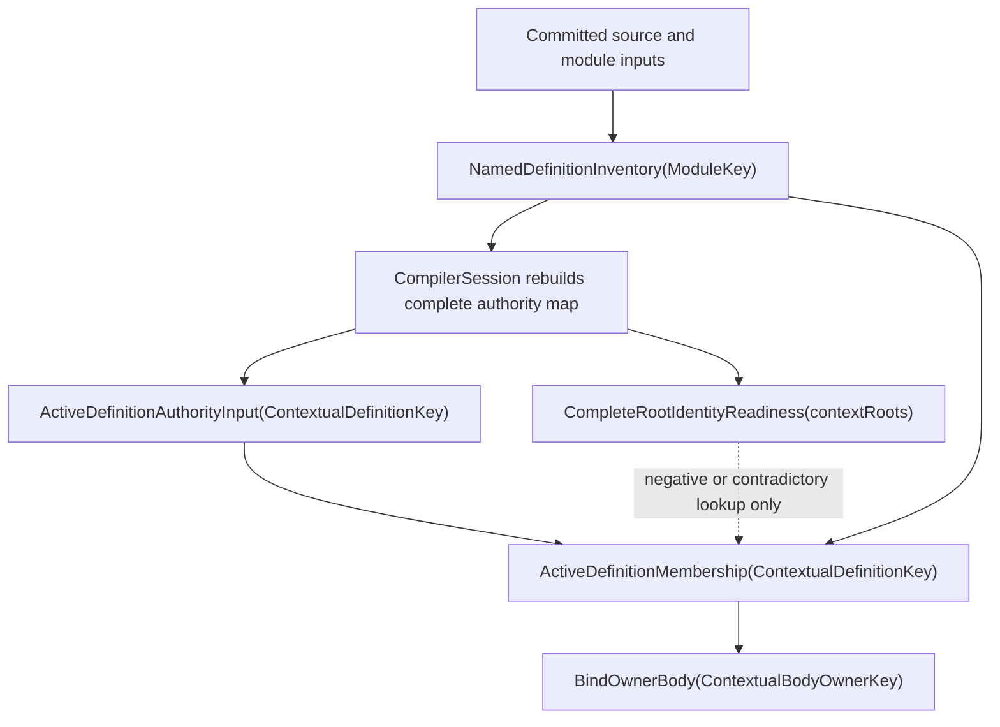
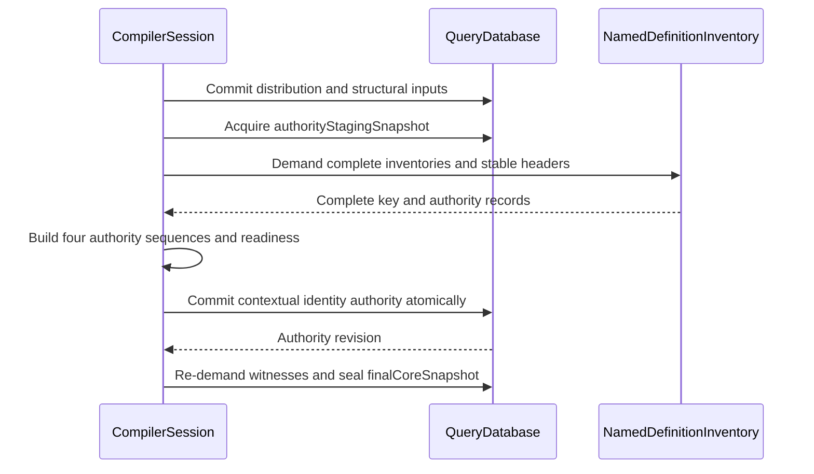

# RFC 0020: Active Definition Authority Projection

## Summary

The session installs a complete contextual identity-authority payload keyed by
one exhaustive `CompilationRootSetQueryKey`. It contains definition,
implementation, generic-parameter, and callable-parameter authority maps plus
`CompleteRootIdentityReadiness`. Eight typed membership queries cover
compilation units, crates, sources, modules, definitions, implementations,
generic parameters, and callable parameters. Every positive identity result
retains its complete stable key or authority record and verifies exact
membership in the owning inventory or header.

## Motivation

RFC 0027 specifies
`ActiveDefinitionMembership(ContextualDefinitionKey)` and
`BindOwnerBody(ContextualBodyOwnerKey)`. A `DefinitionKey` is a one-way
32-byte SHA-256 digest. Its complete `DefinitionIdentityRecord`, which contains
the owning `ModuleKey`, is retained by
`NamedDefinitionInventory(ModuleKey)`. The contextual key supplies the
complete root set and routed stable definition key required to demand the
inventory that proves the item is active.

Provider purity requires the owning-module edge to be explicit, tracked, and
bounded to the demanded definition. The authority projection retains complete
identity records for collision verification and exposes exact typed
membership without a whole-program dependency. This contract supplies narrow
dependencies, exact collision checks, and one production Binder path.

## Goals

- Provide a tracked, deterministic `DefinitionKey` to owning-module
  projection for active named definitions.
- Retain the complete RFC 0018 identity record and verify its digest before it
  becomes query input.
- Define an atomic replacement protocol that removes stale definitions.
- Prevent incomplete refresh roots from authorizing missing or contradictory
  definition lookups without invalidating unchanged per-definition inputs.
- Keep `NamedDefinitionInventory` as the sole membership authority.
- Preserve the stable definition-header and contextual owner-body dependency
  boundary.
- Add native tests and architecture mutations for every new authority edge.
- Add a tracked input-only probe that represents present and absent input
  observations without converting absence into provider failure.

## Non-Goals

- Change `DefinitionKey`, `DefinitionIdentityRecord`, or stable body-owner wire
  formats.
- Add a global module scan to any query provider or verifier.
- Expose identity interner containers through `QueryContext`.
- Add an implementation-key inverse projection; RFC 0019 owner bodies are not
  keyed by `ImplKey`.
- Persist the new input outside the current `QueryDatabase` input root.
- Add optional probing for derived queries or make ordinary required input
  reads tolerate missing values.
- Change source syntax, language semantics, diagnostics, or module selection.
- Add an untracked authority lookup or a second Binder publication path.

## Prior Art

### rustc query inputs and dependency edges

The [rustc query guide](https://rustc-dev-guide.rust-lang.org/query.html)
models compiler work as keyed computations whose dependencies are recorded by
query reads. Its [incremental compilation guide](https://rustc-dev-guide.rust-lang.org/queries/incremental-compilation-in-detail.html)
explains red-green reuse through dependency validation rather than ambient
state inspection. ZOM should copy the explicit tracked edge and narrow
invalidation boundary. ZOM should not copy implementation-specific arena or
interning details because its stable identities require canonical bytes across
process-local handle layouts.

### Salsa tracked inputs and accumulated dependencies

The [Salsa overview](https://salsa-rs.github.io/salsa/overview.html) treats
inputs as explicit facts and derived functions as tracked reads over those
facts. Its [algorithm description](https://salsa-rs.github.io/salsa/reference/algorithm.html)
uses changed-at information and dependency validation to avoid recomputing
unchanged values. ZOM should copy the explicit input boundary and equality
backdating. The projection remains session-owned because its key cannot be
derived without first enumerating the already selected active module set.

### Bazel Skyframe graph dependencies

The [Bazel Skyframe reference](https://bazel.build/reference/skyframe) requires
evaluation functions to obtain dependencies through the graph environment and
restarts evaluation when a dependency is not yet available. ZOM should copy
the rule that graph-visible inputs and dependencies, rather than process-global
indexes, determine recomputation. ZOM does not adopt restart-based graph
discovery for this inverse key: the complete active module set is already an
explicit input, so a bounded session projection gives each named-item query a
constant-time tracked edge without introducing a whole-graph search.

### RFC 0018 complete identity authority

RFC 0018 requires inventories to retain both the digest and complete canonical
record. Equal digests with unequal records are a compiler invariant failure;
digest equality alone never proves identity equality. This RFC applies that
same rule to the inverse projection rather than weakening it to a
`DefinitionKey -> ModuleKey` map.

## Guide-Level Explanation

The query graph gains a per-definition input and a refresh-readiness barrier
between module inventory discovery and named-item demand:



For contextual key `d`, `ActiveDefinitionMembership(d)` reads the active
authority input. The record supplies module `m`. Provider and verifier then
read `NamedDefinitionInventory(m)` and the exact
`DefinitionHeaderSyntax(d.definition)` and accept the result only when the
inventory and header contain byte-equal key and canonical record authority.

Removing or replacing a definition causes the next session staging cycle to
erase the old input key before owner-body queries are demanded. No consumer
searches other modules, reads a registry, or accepts an authority record that
is not present in the current owning-module inventory.

## Reference-Level Design

### Normative amendment boundary

This RFC is the normative amendment to RFC 0017 for optional input
observation, input-presence dependency metadata, and validation of
`Present <-> Absent` transitions. RFC 0017 remains authoritative for required
reads, query values, revisions, red-green evaluation, durability, retention,
cycles, concurrency, and all other query-runtime behavior. Where RFC 0017 does
not define a non-failing tracked read of a missing input, the `probeInput`
contract below is more specific. It does not change ordinary `get`, derived
query absence, or the closed runtime-failure algebra.

### Tracked input probe

`QueryContext` gains the tracked typed operation below. `QuerySnapshot` gains
the same typed present-or-absent inspection for root tests and orchestration;
the snapshot form does not create a dependency because it has no caller query.

```text
probeInput<Spec>(key) -> Value | Absence | RuntimeFailure
```

`Spec` must be a registered input kind. Probing a derived kind, an unregistered
kind, an invalid key, a fingerprint collision, or a cancelled evaluation is a
runtime failure. A present input returns its decoded value. A missing input
returns completed deterministic `Absence`; it does not set the provider
context failure and the provider may continue with later tracked reads.
Ordinary `get<Spec>` remains unchanged and still returns
`QueryRuntimeFailure::MissingInput` for a missing required input.

Every probe appends one sequential dependency record with an explicit observed
presence alternative:

```text
InputProbeObservation = Present | Absent
```

For `Present`, the dependency retains the input's exact `changedAt` and
durability. For `Absent`, it retains the input key, `Absent`, and the input
kind's durability; no fabricated value or tombstone is added to the input root.
Memo validation repeats an input probe. A `Present <-> Absent` transition is
always red. `Present -> Present` uses ordinary `changedAt` validation.
`Absent -> Absent` is green. This proves missing-to-present and
present-to-missing invalidation without retaining every definition key ever
observed during a long-lived session.

The initial API is sequential only. `getParallel` remains unchanged and no
parallel optional-input probe is introduced by this RFC. Probe dependencies
participate in minimum-durability computation, dependency inspection, cloning,
eviction metadata, and architecture tests exactly like required dependencies.

### Query descriptor

The closed production input inventory contains this descriptor:

| Field | Contract |
|---|---|
| Query | `ActiveDefinitionAuthorityInput(ContextualDefinitionKey)` |
| Domain | `zom.query.active-definition-authority` |
| Value | Complete `DefinitionIdentityRecord` |
| Reuse class | `Semantic` |
| Input durability | `Low` |
| Equality | Exact canonical record bytes |
| Retention | Retained as part of the current complete input root |
| Provider | None |
| Cycle policy | Not applicable to an input |
| Cost | Constant lookup after session staging |

The companion complete-root readiness value has this descriptor:

| Field | Contract |
|---|---|
| Query | `CompleteRootIdentityReadiness(CompilationRootSetQueryKey)` |
| Domain | `zom.binder.complete-root-identity-readiness` |
| Value | `CompleteRootIdentityReadiness` |
| Reuse class | `Semantic` |
| Input durability | `Low` |
| Equality | Exact 32-byte set fingerprint |
| Retention | Retained only when the current authority map is complete |
| Provider; cycle; cost | None; not applicable; constant lookup |

The definition-authority digest is exactly:

```text
SHA-256(
  ASCII("zom.active-definition-authority-set")
  || 0x00
  || Encode(contextRoots)
  || EncodeSequence(sorted
       (ContextualDefinitionKey, DefinitionIdentityRecord) pairs)
)
```

Pairs are sorted by complete contextual-key bytes and encode one bounded
canonical record. Readiness also carries the independently recomputed
implementation, generic-parameter, and callable-parameter authority digests.
It is valid only when all four authority sequences cover the complete active
module set. Readiness is not membership authority and is consulted only for
negative or contradictory lookups.

The key codec admits one complete `CompilationRootSetQueryKey` followed by one
complete routed `StableDefinitionQueryKey`. The value codec admits exactly one
complete canonical `DefinitionIdentityRecord` and no trailing bytes. Decoding
is bounded by the four-mebibyte per-record inventory limit and rejects invalid
root encoding, foreign modules, invalid owner tags or digests, invalid
definition kind or namespace, namespace-kind mismatch, noncanonical declared
names, invalid overload presence, truncation, oversized sequences, and trailing
bytes.

The value codec is structural. The session staging verifier and every consumer
that uses the value as navigation authority additionally require:

```text
DefinitionKey::compute(record) == input key.definition.definition
```

An equal digest with unequal complete record bytes is
`QueryRuntimeFailure::InvariantViolation`. It is never a semantic source
diagnostic and publishes no derived memo value.

### Complete authority-map construction

`CompilerSession` owns the only production staging path:

1. `VerifiedCoreDistributionInputTransaction` installs the complete
   handle-free compilation context authority and projected-core inputs.
2. `VerifiedModuleGraphInputTransaction` installs selected-module catalogs,
   detached dependency sites, catalog buckets, requester ancestries, search
   roots, dependency aliases, configured preludes, and the exact structural
   ledger.
3. `authorityStagingSnapshot` demands the complete-root `ActiveCrates`, every
   `ActiveSources` and `ActiveModules`, all dependency requests and
   resolutions, `ModuleGraph`, `ModuleGraphScc`, every named inventory, and
   every staging-safe definition and implementation-occurrence header.
4. Cyclic SCCs, incomplete module coverage, unequal records, foreign roots,
   duplicate keys, and missing header occurrences abort the unpublished
   session.
5. Provider and verifier independently build the complete contextual
   definition, implementation, generic-parameter, and callable-parameter
   authority sequences plus `CompleteRootIdentityReadiness`.
6. One `ContextualIdentityAuthorityInputTransaction` atomically commits all
   four authority sequences and readiness or commits nothing.
7. `finalCoreSnapshot` re-demands graph, SCC, every authority sequence,
   readiness, active membership, inventories, and staging-safe headers and
   requires byte equality with the staging witnesses.
8. `QueryDatabase::sealInputs` irreversibly closes input mutation before any
   revision-local materializer executes.

No production query demand may interleave with these transactions. Existing
snapshots remain immutable and observe the complete authority root from their
own revision.



### Typed Active-Membership Projections

The closed membership query family is:

| Query | Key | Positive authority |
|---|---|---|
| `ActiveCompilationUnitMembership` | `ContextualCompilationUnitKey` | complete non-empty active-crate sequence for the unit |
| `ActiveCrateMembership` | `ContextualCrateKey` | exact `ActiveCrates(contextRoots)` occurrence |
| `ActiveSourceMembership` | `ContextualSourceKey` | exact `ActiveSources(crate)` occurrence |
| `ActiveModuleMembership` | `ContextualModuleKey` | exact `ActiveModules(crate)` occurrence |
| `ActiveDefinitionMembership` | `ContextualDefinitionKey` | exact authority input, owning definition inventory, and stable definition header |
| `ActiveImplementationMembership` | `ContextualImplementationKey` | owning implementation inventory and every equal occurrence header |
| `ActiveGenericParameterMembership` | `ContextualGenericParameterKey` | active global owner and complete authority-header occurrence set |
| `ActiveCallableParameterMembership` | `ContextualCallableParameterKey` | active definition owner and complete definition header |

Every descriptor returns `ActiveMembershipResult<Record> = Active(record) |
Inactive`. A positive result carries the complete authority record and does not
read readiness. An absent or contradictory authority reads
`CompleteRootIdentityReadiness`: absence returns `ProviderRejected`, complete
readiness plus absent authority returns `Inactive`, and unequal authority
returns `InvariantViolation`. Provider and verifier independently reconstruct
the same dependency branch and compare complete canonical bytes.

### Invalidation and backdating

- A body-only or range-only edit that preserves the definition identity record
  stages an equal authority value. Its input `changedAt` is preserved.
- Adding a definition installs one new input key and does not change unrelated
  authority keys.
- Removing or renaming a definition erases its prior key. The direct authority
  probe observes `Absence`; after the atomically installed readiness
  record proves the complete authority set, `ActiveDefinitionMembership`
  publishes `Inactive` and cannot reuse the stale value memo.
- Moving a definition between modules changes the complete record and therefore
  changes its digest under RFC 0018; the old key is erased and the new key is
  installed.
- A change in another module does not invalidate
  `ActiveDefinitionMembership(d)` unless it changes the exact authority record
  or owning inventory read by `d`.

### Forbidden paths

Production code and architecture gates must reject:

- iteration over all active modules inside a named-item provider or verifier;
- reads of `CompilerSession`, interner containers, or retained session
  collections from a provider or verifier;
- ordinary required input reads followed by attempted recovery from
  `MissingInput`; optional presence must use `probeInput`;
- optional probing of derived queries or parallel optional-probe groups;
- a `DefinitionKey -> ModuleKey` value that omits the complete record;
- authority staging before complete named-definition inventories are demanded;
- active-module coverage derived from a session vector instead of
  byte-equal `ActiveCrates`, complete `ActiveModules`, `ModuleGraph`, and
  `ModuleGraphScc` reads from one authority-staging snapshot;
- additive staging that does not erase prior active keys;
- any base-input update that occurs while the prior readiness marker remains;
- unconditional readiness reads on the positive exact-membership path;
- readiness publication outside the same transaction that installs the
  complete replacement map;
- allocation or fallible ledger construction after authority installation
  commits;
- owner-body demand before the authority replacement and readiness transaction
  commits;
- accepting digest equality without exact complete-record membership; and
- missing authority after complete readiness becoming any result other than
  `Inactive`.

### Current Authority And Barrier Contract

The RFC 0027 acceptance transaction
`rfc0027-accept-20260727-e2f4ba5e` binds this contract to proposal SHA-256
`e2f4ba5eb777d3d70b8eb3ad75b18f5169afc61a83d989ccc61fc9d5d022f435`.

Authority staging begins only after one
`VerifiedModuleGraphInputTransaction` commits the complete structural input
inventory and the session acquires `authorityStagingSnapshot`. From that
snapshot the session demands the complete-root `ActiveCrates`, every
`ActiveModules`, `ModuleDependencies`, `ModuleGraph`, and `ModuleGraphScc`,
rejects every cyclic component, and demands only handle-free semantic
skeleton and named-definition inventory prerequisites.

`ContextualIdentityAuthorityInputTransaction` contains only the complete
contextual definition, implementation, generic-parameter, and
callable-parameter authority sequences plus matching complete-root readiness. It
does not commit selected sources, active modules, dependencies, graph, SCC,
Binder results, or materialized handles.

After the installation commit, the session acquires `finalCoreSnapshot`,
re-demands graph, SCC, authority, and readiness with the same independently
reconstructed complete root key, and requires byte equality. No input commit
is permitted afterward. The named-item, owner-body, bound-module, core
bootstrap, provenance, and revision-local materialization barrier opens only
after those final checks succeed.

### Query Runtime Membership And Seal Closure

Acceptance transaction `rfc0028-accept-20260727-944b68ff` binds this current
contract to exact RFC 0028 proposal SHA-256
`944b68ffc0aff5576d079a243ff092d7d19fba5ffed65551dda8e68adf230db4`.

All eight active-membership descriptors return
`ActiveMembershipResult<Record>`. Each provider and independent verifier
reconstructs the complete contextual membership key and expected authority
record through separate algorithms.

The fixed materialization order is inherited final-admission validation,
global-key derivation, tracked membership demand, membership dependency
recording, deterministic `Inactive` return without interner access, complete
authority equality, and only then the typed arena interner. Equality covers the
context roots, global key, owner, occurrence authority, and complete identity
record. An existing interner entry cannot bypass any preceding step.

Readiness is demanded only on the negative or contradictory authority branch.
Missing readiness returns `QueryRuntimeFailure::ProviderRejected`; complete
readiness with proven absence returns `Inactive`; and unequal or contradictory
authority returns `QueryRuntimeFailure::InvariantViolation`.

Materialization authority exists only through the compile-time
`ActiveMaterializerPermission<Descriptor, GlobalIdentityKey,
MembershipDescriptor>` matrix and `CapabilityQueryContext<Descriptor>`. The
operation takes the exact contextual membership key and complete expected
authority record. The sealed admission propagates from
`SealedQuerySnapshot<ContextRoots, FinalWitness>` through every nested demand
and is validated before membership or interner access.

### Named-Item And Owner-Body Failure Closure

Acceptance transaction `rfc0029-accept-20260727-8d393a0c` binds this contract
to exact RFC 0029 proposal SHA-256
`8d393a0c6c00a7fad9ef086d3d25f5ed44300041afa9e1e1a4af5d68830fd3e7`.

`NamedItemProvenanceQuery` uses the complete `ContextualDefinitionKey` and
performs these reads in exact order:

1. `ActiveDefinitionAuthorityInput`;
2. `ActiveDefinitionAuthorityReadyInput` only when authority is absent or
   contradictory;
3. `SelectedModuleSourceQuery`;
4. `ParseSourceQuery`;
5. `StableIdentityAdmissionQuery`;
6. `NamedDefinitionInventoryQuery`;
7. `RevisionLocalDefinitionSitesQuery`;
8. `RevisionLocalImplementationSitesQuery`; and
9. `NamedItemSyntaxQuery`.

Its complete key-rejection set is
`InactiveOwner(DefinitionHeader(key.definition), none)` and
`MissingSelectedModuleSource(Module(key.definition.module), none)`. Absent
authority plus complete readiness proves `InactiveOwner`. Missing readiness is
`ProviderRejected`; contradictory authority is `InvariantViolation`. The
descriptor forwards child source and key rejections without changing owner,
path, order, or payload. Missing provider roots, projection failure,
provenance disagreement, syntax disagreement, authority disagreement, and
codec disagreement are runtime failures.

`OwnerBodyProvenanceQuery` first reads exactly one typed provenance branch. A
definition owner reads `NamedItemProvenanceQuery`; a module owner reads
`ModuleBodyProvenanceQuery`. Only after that branch succeeds does it read the
matching semantic syntax projection. The definition branch derives the exact
`ContextualDefinitionKey`, applies executable-root admission to the successful
`NamedItemSyntaxQuery` value, and constructs
`DefinitionWithoutBody(Body(key), none)` only for `NoBody`. The independent
key-rejection verifier repeats the typed child and syntax reads and separately
proves `NoBody`. The descriptor never reads or decodes
`OwnerBodySyntaxQuery`.

`StableIdentityAdmissionQuery` is required before the semantic named inventory
and site projections. Its independently published
`IdentitySyntaxSiteInventoryQuery` remains available when stable admission
returns a source rejection, so every cited identity site retains exact
same-snapshot provenance.

Implementation authority is RFC 0029 `R29-12A` through `R29-12D` for the
schema, codecs, and diagnostic prerequisites, followed by `R29-13A` through
`R29-14` for query types, exact descriptor contracts, native gates, and the
atomic runtime source transaction. RFC 0020 remains `IMPLEMENTING`; completed
authority-projection evidence does not establish these synchronized runtime
contracts.

## Repository Impact

| Area | Paths | Owner |
|---|---|---|
| RFC governance | `docs/rfc/**` | `rfc` |
| Stable record decoding | `products/zomlang/compiler/identity/**` | `module-system` |
| Query input and session staging | `products/zomlang/compiler/query/**`, `products/zomlang/compiler/driver/**` | `module-system` |
| Inventory membership and named-item integration | `products/zomlang/compiler/binder/**` | `binder-checker` |
| Current architecture documentation | `docs/design/architecture.md`, `docs/design/compiler-contracts.md` | `spec-audit` |
| Native tests, descriptor generation, performance corpus, runners, and architecture gates | `products/zomlang/tests/**`, `scripts/generate-query-descriptor-schema.py`, `scripts/check-query-descriptor-architecture.py`, `scripts/check-incremental-query-architecture.py`, `scripts/check-binder-architecture.py`, `scripts/check-identity-architecture.py`, `scripts/check-compiler-session-architecture.py`, `scripts/run-incremental-query-benchmarks.py` | `verification` |

## Security And Safety Impact

The projection stores no new source text or external data. Bounded structural
decoding prevents oversized identity records and owner sequences from causing
unbounded allocation. Atomic replacement prevents stale definition authority
from surviving package or module changes. Complete-record comparison preserves
the compiler's fail-closed hash-collision behavior. Providers retain only
immutable query values and do not gain pointers to session-owned registries.

## Drawbacks And Risks

- Authority installation creates one additional in-memory database revision
  per binding cycle; readiness removal is folded into the first base-input
  transaction.
- The authority map duplicates complete records already retained by module
  inventories.
- Correctness depends on the session rebuilding the complete map before named
  queries; architecture gates must make this ordering non-optional.
- A future independently callable query API would need an explicit authority
  staging contract rather than assuming `CompilerSession` has prepared it.

The map is bounded by the active named-definition inventory, values are
retained only for the current input root, and no new persistence surface is
introduced.

## Alternatives Considered

None. The accepted contract uses explicit contextual inputs, complete
authority records, tracked membership queries, and independently verified
inventory/header reads.

## Compatibility And Rollout

This is the compiler's sole active-definition authority projection.

Implementation proceeds in this order:

1. accept this RFC;
2. create the performance runner and corpus and record the reviewed
   pre-implementation baseline;
3. add `probeInput`, `InputProbeObservation`, presence-aware dependency
   cloning and validation, root inspection, and their query-runtime tests;
4. add the bounded complete-record decoder and both authority input codecs;
5. register both inputs and implement the readiness barrier, complete
   reconstruction, and atomic replacement;
6. implement the named-item module-recovery prefix and independent verifier;
7. continue RFC 0019 Phase 3 owner-body queries on that sole path; and
8. enforce architecture gates that reject module scans and registry reads.

Both authority input kinds, readiness, key-ledger staging, named-item
dependencies, probe semantics, native tests, and performance cases land in one
coherent implementation.

## Documentation And Teaching Plan

- Add this RFC and its review and implementation tracker to the RFC index.
- Record the RFC 0019 Phase 3 blocker and its resolution evidence in the RFC
  0019 tracker.
- Update current architecture documentation only when the implementation
  lands. `docs/design/architecture.md` must describe the authority projection
  as the sole module-recovery path. `docs/design/compiler-contracts.md` must
  define the input-only `probeInput` scope, `Present` and `Absent` dependency
  observations, both transition-validation directions, sequential-only
  restriction, and unchanged required-`get` behavior. Neither document may
  preserve a comparison with prior designs.

## Operational Readiness

The input is in-memory and session-local. This RFC must create the currently
missing RFC 0017 performance runner, corpus manifest, and reviewed baseline at
`scripts/run-incremental-query-benchmarks.py`,
`products/zomlang/tests/performance/incremental-query-corpus.json`, and
`products/zomlang/tests/performance/incremental-query-baseline.json`. The
corpus includes definition-heavy clean compilation, equal body-only edits,
definition add/remove/rename, and unrelated-module edits. The runner rejects a
machine, build, worker-count, or corpus mismatch and enforces RFC 0017's warmup,
sample, noise, elapsed-time, RSS, and exact hot-edit execution-set contract.
The runner and corpus land before product implementation. The verification
owner records a baseline from a detached clean worktree at the exact
pre-implementation revision, with release flags, repository and compiler build
identity, OS, architecture, CPU, logical cores, physical memory, worker count,
and corpus digests embedded in the baseline. Baseline review occurs before any
authority product source is changed; comparison occurs after the final product
snapshot on the same machine, corpus, flags, and worker count.
No cache migration, runtime service, telemetry pipeline, or release operator
action is required.

## Acceptance Criteria

- Every required owner approves one exact REVIEW snapshot.
- `QueryContext::probeInput` records present or absent observations only for
  input kinds, and `QuerySnapshot::probeInput` exposes the same root-inspection
  result without a caller dependency; native tests prove absent-to-present,
  present-to-absent, absent-to-absent, and present-value change validation
  without context poisoning or tombstone retention.
- `DefinitionIdentityRecord` has a strict bounded standalone decoder with
  positive, malformed, oversized, truncation, and trailing-byte tests.
- `ActiveDefinitionAuthorityInput` and `CompleteRootIdentityReadiness` are
  registered with the exact descriptors in this RFC and reject malformed keys
  and values.
- `CompilerSession` rebuilds and atomically replaces the complete active map
  after demanding every active named-definition inventory.
- Stale keys are erased and equal values preserve `changedAt`.
- Named-item providers and independent verifiers recover the module only from
  the tracked input, prove exact owning-inventory membership, and independently
  select the RFC 0018 authority occurrence.
- RFC 0019 owner-body roots are never demanded before authority staging.
- `active-definition-authority-query-test` covers add, remove, delete-and-add,
  rename, cross-module, body-only, range-only, missing input, malformed record,
  duplicate-equal, digest collision, active-module-set shrink, inventory
  absence/failure, aborted installation, stale-ledger retry, and old-snapshot
  concurrent demand cases.
- The focused differential test asserts exact executed, backdated-equal,
  changed, and unread query-instance sets and byte-compares reused-database
  named-item values with a fresh database after every edit. It repeats every
  case with worker counts `1`, `2`, and `8` and requires byte-identical values,
  dependency groups, and exact execution sets. The broader RFC 0019 owner-body
  differential corpus remains Phase 6 work and is not claimed as existing
  evidence by this RFC.
- The incremental-query architecture gate and adversarial self-test reject
  every forbidden path listed above.
- Sanitizer build, relevant unit tests, complete CTest, RFC checks, format, and
  diff checks pass.
- RFC 0019 tracking records the unblocked Phase 3 evidence before this RFC
  moves to `LANDED`.

## Implementation Plan

1. Create the RFC 0017 performance runner and corpus, capture the reviewed
   pre-implementation baseline from a detached clean worktree, and freeze its
   metadata before product changes.
2. Add the tracked sequential input-probe API, presence-aware dependency
   validation, and native query-runtime tests.
3. Add bounded canonical decoding for complete definition records and owner
   elements.
4. Define and register both active-definition authority inputs.
5. Add session-owned readiness, complete-map reconstruction, stale-key
   replacement, and non-failing ledger publication.
6. Add named-item syntax and provenance module-recovery and authority-occurrence
   dependencies.
7. Add native codec, transaction, provider, focused differential, and
   production-session tests.
8. Extend incremental-query, Binder, identity, and CompilerSession mutation
   gates.
9. Continue RFC 0019 owner-body query implementation on the new authority.
10. Compare the final implementation with the reviewed baseline and record
   full-gate and landing evidence.

## Test Plan

- Build: `cmake --preset sanitizer` and `cmake --build --preset sanitizer`.
- Unit tests: `definition-key-test`,
  `incremental-binding-query-adapter-test`,
  `active-definition-authority-query-test`, `query-database-test`, and
  `module-discovery-test` through `ctest --preset default -L unittest
  --output-on-failure`.
- Query-runtime probe tests: required `get` still fails on missing input;
  `probeInput` returns tracked absence without poisoning later reads; validation
  covers `Absent -> Present`, `Present -> Absent`, `Absent -> Absent`, and
  changed and equal `Present -> Present`; dependency inspection exposes the
  observed presence alternative; probing a derived kind and parallel probing
  are rejected.
- Lit tests: `ctest --preset default -L lit`; no new syntax expectation is
  required because source behavior is unchanged.
- Conformance: the focused native authority test performs exact-trace and
  fresh-database equivalence for named-item values. RFC 0019's
  `owner-body-query-differential-test` remains required before RFC 0019 Phase 6
  completes but is not a prerequisite for landing this authority projection.
  Run the focused test with worker counts `1`, `2`, and `8`; each permutation
  must produce identical canonical values, dependency groups, and exact
  executed, backdated-equal, changed, and unread sets.
- Architecture: run all eight commands:
  `python3 scripts/check-incremental-query-architecture.py --check`,
  `python3 scripts/check-incremental-query-architecture.py --self-test`,
  `python3 scripts/check-binder-architecture.py --check`,
  `python3 scripts/check-binder-architecture.py --self-test`,
  `python3 scripts/check-identity-architecture.py --check`,
  `python3 scripts/check-identity-architecture.py --self-test`,
  `python3 scripts/check-compiler-session-architecture.py --check`, and
  `python3 scripts/check-compiler-session-architecture.py --self-test`.
- Verification infrastructure:
  `python3 scripts/check-diagnostic-coverage.py --check`,
  `python3 scripts/check-diagnostic-coverage.py --self-test`,
  `python3 scripts/check-lit-exec-root.py --check`, and
  `python3 scripts/check-lit-exec-root.py --self-test`.
- Performance baseline, before product implementation: create a detached clean
  worktree at the exact pre-implementation revision, run `cmake --preset
  release` and `cmake --build --preset release` there, then run
  `python3 scripts/run-incremental-query-benchmarks.py --repository
  /tmp/zom-rfc0020-baseline --build-dir
  /tmp/zom-rfc0020-baseline/build-release --corpus
  products/zomlang/tests/performance/incremental-query-corpus.json --baseline
  products/zomlang/tests/performance/incremental-query-baseline.json
  --worker-count 8 --record-baseline`. The verification owner reviews and
  freezes the recorded revision, machine, flags, worker, compiler identity, and
  corpus digest metadata before product files change.
- Performance comparison, after implementation: `cmake --preset release`,
  `cmake --build --preset release`, then
  `python3 scripts/run-incremental-query-benchmarks.py --repository .
  --build-dir build-release
  --corpus products/zomlang/tests/performance/incremental-query-corpus.json
  --baseline products/zomlang/tests/performance/incremental-query-baseline.json
  --worker-count 8 --compare`. The runner rejects a machine, compiler flags,
  worker count, or corpus mismatch.
- RFC: `python3 scripts/check-rfc.py`.
- Generated files: none.
- Format: `python3 scripts/check-format.py` and `git diff --check`.
- Full regression: `ctest --preset default --output-on-failure`.

## Open Questions

None

## Status History

| Date | Status | Notes |
|---|---|---|
| 2026-07-20 | DRAFT | Initial proposal after the RFC 0019 inverse-key implementation blocker was verified. |
| 2026-07-20 | REVIEW | Entered exact-snapshot owner review after all required owners approved DRAFT readiness. |
| 2026-07-20 | ACCEPTED | All required owners approved REVIEW snapshot `4b06c2b2...4b84bfe`. |
| 2026-07-20 | IMPLEMENTING | Implementation started after accepted exact-snapshot review. |
| 2026-07-25 | IMPLEMENTING | Synchronized the accepted RFC 0025 complete-context readiness, contextual authority, conditional dependency, whole-context diagnostic, and third-transaction installation replacement from exact proposal SHA-256 `4f4085c176a9f391115e12170da93af899e350fa92440d5a51577692faf8bad0`; implementation completion is tracked only by the RFC 0025 R25 tasks. |
| 2026-07-26 | IMPLEMENTING | Synchronized the accepted RFC 0026 structural transaction, authority-staging graph and SCC roots, cyclic-component rejection, authority-only installation transaction, and final-snapshot re-demand barrier from exact proposal SHA-256 `39df5d3f11dbdcb2e95056b1cd14fd5220a19688f31a3e3180230ad465a3f84d`; implementation completion remains tracked by RFC 0026 and RFC 0025. |
| 2026-07-27 | IMPLEMENTING | Required authority coverage to come only from complete derived active membership and byte-equal stable graph and SCC results in one authority-staging snapshot. |
| 2026-07-27 | IMPLEMENTING | Synchronized the RFC 0027 complete-root eight-domain membership, four authority-sequence, conditional readiness, contextual transaction, and final-seal contracts through transaction `rfc0027-accept-20260727-e2f4ba5e` at proposal SHA-256 `e2f4ba5eb777d3d70b8eb3ad75b18f5169afc61a83d989ccc61fc9d5d022f435`; implementation status is unchanged. |
| 2026-07-27 | IMPLEMENTING | Synchronized the RFC 0028 typed active-membership result, conditional readiness, complete authority equality, inherited final admission, permission matrix, and admission-before-membership-before-interner contracts through transaction `rfc0028-accept-20260727-944b68ff` at proposal SHA-256 `944b68ffc0aff5576d079a243ff092d7d19fba5ffed65551dda8e68adf230db4`; implementation status is unchanged. |
| 2026-07-27 | IMPLEMENTING | Acceptance transaction `rfc0029-accept-20260727-8d393a0c` synchronized stable-identity admission before named inventory and provenance, the exact conditional `NamedItemProvenanceQuery` read order, its closed key-failure subset, direct typed-child owner-body reconstruction, and the corrected schema-before-runtime dependency graph to proposal SHA-256 `8d393a0c6c00a7fad9ef086d3d25f5ed44300041afa9e1e1a4af5d68830fd3e7`; implementation status is unchanged. |
