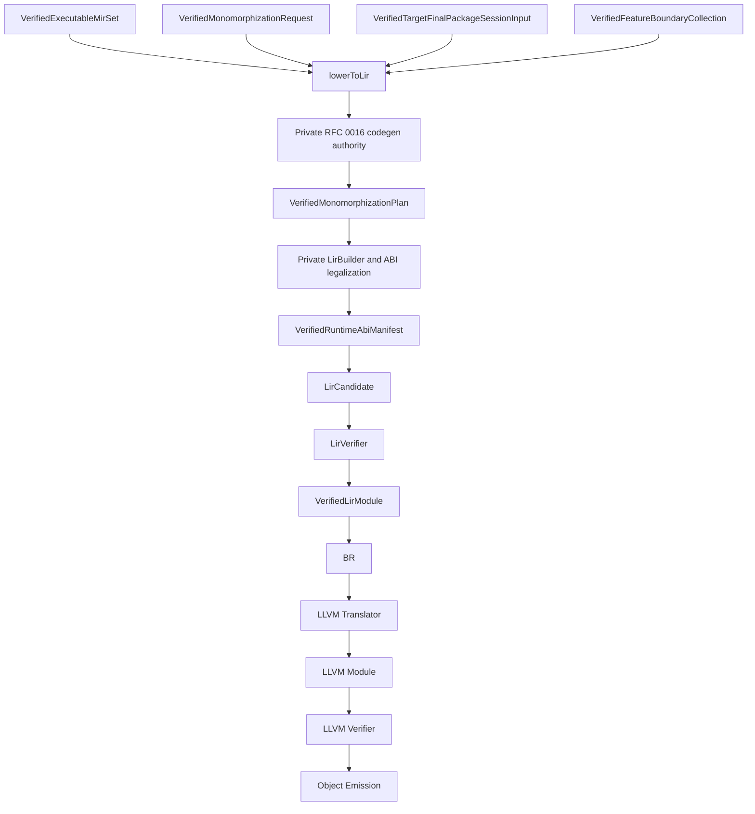

# RFC 0021: Target-Aware LIR And LLVM Translation Contract

## Summary

This RFC defines ZOM's target-aware Low-level Intermediate Representation
(LIR) as the sole verified handoff from executable MIR to LLVM translation.
LIR is an ABI-complete, proof-carrying SSA control-flow graph with block
parameters, opaque pointers, explicit layouts, explicit function ABI records,
explicit memory and atomic semantics, and a closed operation inventory.

LIR construction consumes only verified executable MIR, a verified
monomorphization request, the final wrapper-owned code-generation authority,
the complete feature-boundary proof set, and the matching runtime capability
and ABI contract snapshots. It constructs and verifies the complete
monomorphization plan internally. A
`VerifiedLirModule` contains no unresolved semantic type, generic parameter,
dispatch choice, ownership obligation, cleanup obligation, ABI choice, target
layout query, runtime symbol lookup, or source-language control operation.

LLVM translation is total over verified LIR. It may construct LLVM objects and
select the LLVM spelling of already-decided operations, but it may not choose a
layout, ABI, exception model, runtime entry point, semantic operation, or
optimization assumption. Unsupported target behavior is rejected before
verified LIR publication. A translator rejection after that boundary is a
compiler invariant failure.

This RFC is a normative specialization of RFC 0010's Target LIR,
monomorphization, verifier, LLVM translation, diagnostics, CLI, rollout, and
acceptance clauses. It retains the accepted three-layer HIR, MIR, and LIR
architecture and introduces no additional IR layer.

## Motivation

RFC 0010 establishes the correct pipeline boundary, but its minimum LIR
vocabulary leaves implementation-critical choices open:

- `Void` is listed as a value type even though no SSA value may have a void
  carrier.
- `PassMode` permits only one direct carrier or a pair, which cannot express
  all target ABIs without hidden lowering rules.
- pointers name only an address space, while access layout, provenance, and the
  conditions for LLVM aliasing attributes are unspecified;
- the relationship between semantic types, SSA carriers, storage layouts, and
  function ABI records is not closed;
- the exact legality rules for division, shifts, integer overflow, floating
  point, memory, atomics, unwind edges, symbols, and globals remain undefined;
- block parameters are selected, but their predecessor, dominance, and LLVM
  PHI translation contracts are not defined;
- the verifier does not yet have a complete, enumerable invariant set;
- the canonical LIR revision does not yet bind all semantic, target, runtime,
  feature-gate, and monomorphization inputs; and
- LLVM translation is described as total without defining the LIR inventory
  over which totality must be proven.

These gaps are dangerous at the first native-backend slice. An implementer
could accidentally use LLVM type identity as storage layout, invent ABI
classification in the translator, emit `inbounds`, `noalias`, `nsw`, `nuw`,
`exact`, or fast-math flags without proof, model recoverable errors as backend
exceptions, or allow target capability failures after object generation has
begun.

ZOM needs one closed target-level contract before `compiler/lir` and
`compiler/backend/llvm` are created. The contract must be small enough to
verify exhaustively, expressive enough for the accepted language and runtime
semantics, and close enough to LLVM that translation is mechanical.

## Goals

- Define one target-aware LIR with one public verified form.
- Use SSA block parameters as the only control-flow value-merge mechanism.
- Separate SSA carrier types, storage layouts, and function ABI
  classifications.
- Make every function, call, global, memory access, atomic operation, runtime
  symbol, unwind edge, and linkage decision target-complete.
- Preserve pointer provenance conservatively and forbid unproved LLVM aliasing
  and undefined-behavior attributes.
- Exclude `undef` and `poison` from LIR semantics.
- Define closed type, constant, instruction, terminator, ABI, layout, linkage,
  exception-handling, atomic, and failure algebras.
- Define deterministic identities, ordering, canonical encoding, and
  `LirRevisionId`.
- Make `VerifiedLirModule -> LLVM IR` a total translation followed by mandatory
  LLVM verification.
- Define the exact implementation order and native project tests required
  before LIR, LLVM IR, or object output may be claimed.

## Non-Goals

- Changing ZOM source syntax, type rules, ownership rules, error semantics, or
  concurrency semantics.
- Repeating borrow checking, drop elaboration, coroutine elaboration, trait
  solving, overload resolution, or call dispatch in LIR.
- Defining a stable public LIR serialization.
- Adding an extensible dialect system or accepting unregistered operations.
- Selecting a backend other than LLVM.
- Defining vector source types, scalable vectors, garbage-collected references,
  inline assembly, target intrinsics, transactional memory, or GPU execution.
- Defining code-generation-unit partitioning, ThinLTO, or profile-guided
  optimization. The first implementation emits one deterministic LIR and LLVM
  module per crate target.
- Defining product link planning, linker invocation, runtime archive closure,
  executable manifests, or binary publication. Those contracts require a
  separate RFC after verified object emission exists.
- Using LIR as a persisted incremental cache artifact.
- Making LLVM IR part of ZOM's semantic specification.

## Prior Art

### LLVM IR

LLVM IR provides the semantic contract of the selected native backend: target
data layout, opaque pointers, SSA, calling conventions, exception edges,
atomic ordering, and module verification. ZOM adopts LLVM IR as the translation
target of verified LIR, but does not expose LLVM PHI nodes, `undef`, `poison`,
backend object identity, or unproven optimization attributes as ZOM LIR
semantics.

LLVM's pointer and address-computation rules show why a frontend must separate
an opaque pointer carrier from the accessed layout and why `inbounds` cannot be
added as a convenience. The LangRef defines the legal atomic ordering
combinations; the atomic guide motivates target-aware validation and the
separation of atomic from volatile.

LLVM module verification proves structural LLVM invariants. It does not prove
that a frontend's `inbounds`, provenance, aliasing, non-null, or
dereferenceability assertions are true. ZOM therefore verifies those claims
before translation.

References:

- <https://llvm.org/docs/LangRef.html>
- <https://llvm.org/docs/GetElementPtr.html>
- <https://llvm.org/docs/Atomics.html>
- <https://llvm.org/docs/ExceptionHandling.html>
- <https://llvm.org/docs/Passes.html#verify-module-verifier>

### MLIR Block Arguments And Conversion Legality

MLIR represents SSA joins with block arguments, separates type conversion from
materialization, defines legal and illegal operations through conversion
targets, and performs non-trivial lowering before mechanical LLVM translation.
ZOM adopts block parameters, one-to-many representation lowering, and a closed
legality gate. ZOM does not adopt an extensible dialect system or permit
transitional casts in a verified LIR module.

References:

- <https://mlir.llvm.org/docs/LangRef/#blocks>
- <https://mlir.llvm.org/docs/Rationale/Rationale/#block-arguments-vs-phi-nodes>
- <https://mlir.llvm.org/docs/DialectConversion/>
- <https://mlir.llvm.org/docs/TargetLLVMIR/>
- <https://mlir.llvm.org/docs/DataLayout/>

### Swift SIL

Swift SIL separates formal types from lowered types, distinguishes loadable
values from address-only representations, uses basic-block arguments, and
validates progressively stronger IR stages before LLVM IR generation. ZOM
adopts the representation-lowering and address-only principles. Ownership
checking and cleanup remain MIR responsibilities and are not repeated in LIR.

References:

- <https://www.swift.org/documentation/swift-compiler/>
- <https://github.com/swiftlang/swift/blob/main/docs/SIL/SIL.md>

### Rust ABI And Backend Boundary

Rust separates target data layout, backend value representation, function ABI,
and MIR-to-backend code generation. Its monomorphization collector also makes
the executable instance set explicit before code generation. ZOM adopts these
separations so semantic types, storage layouts, call ABI classifications, and
backend values cannot be conflated.

ZOM keeps an explicit LIR and a total LLVM translator instead of exposing an
LLVM-shaped generic backend interface. The accepted pipeline selects LLVM as
its only native backend, so an additional backend abstraction would add a
second source of operation and ABI truth.

References:

- <https://rustc-dev-guide.rust-lang.org/backend/monomorph.html>
- <https://rustc-dev-guide.rust-lang.org/backend/backend-agnostic.html>
- <https://doc.rust-lang.org/nightly/nightly-rustc/rustc_abi/index.html>
- <https://doc.rust-lang.org/core/ptr/index.html>

### Cranelift IR

Cranelift demonstrates a compact target-low SSA representation with block
parameters, explicit stack slots, ABI-aware signatures, hidden arguments, and
a verifier covering structure, dominance, CFG consistency, types, calls, and
memory layouts. ZOM adopts these verifier categories and compact SSA shape
while retaining ZOM-specific provenance and capability evidence.

References:

- <https://github.com/bytecodealliance/wasmtime/blob/main/cranelift/docs/ir.md>
- <https://docs.rs/cranelift-codegen/latest/cranelift_codegen/ir/>
- <https://docs.rs/cranelift-codegen/latest/cranelift_codegen/ir/trait.InstBuilder.html>
- <https://docs.rs/cranelift-codegen/latest/cranelift_codegen/verifier/>

### Platform ABI Specifications

LLVM IR and `DataLayout` do not classify source-language aggregates for a C
ABI. ZOM therefore treats the System V AMD64 psABI, Arm AAPCS64, and Microsoft
x64 calling convention as canonical classifier inputs rather than translator
heuristics. Each admitted classifier is generated from a checked-in
closed rule table, revalidated independently by the LIR verifier, and covered
by cross-toolchain ABI fixtures.

References:

- <https://gitlab.com/x86-psABIs/x86-64-ABI>
- <https://github.com/ARM-software/abi-aa/blob/main/aapcs64/aapcs64.rst>
- <https://learn.microsoft.com/en-us/cpp/build/x64-calling-convention>

### Common Failure Modes

Mature low-level IRs repeatedly expose three frontend failure classes:

1. **Conflating value type and memory layout.** This produces incorrect field
   offsets, ABI coercions, or address calculations. ZOM uses distinct
   `LirValueTypeId`, `LayoutId`, and `FnAbiId` stores.
2. **Asserting optimizer facts without proof.** Incorrect `inbounds`,
   `noalias`, `nonnull`, `noundef`, `nsw`, `nuw`, `exact`, or fast-math flags
   can silently miscompile a correct source program. ZOM omits such facts by
   default and allows only verifier-issued proof records to authorize them.
3. **Leaving target decisions to final translation.** Late ABI, exception, or
   runtime choices make the supposedly verified IR incomplete. ZOM requires an
   LLVM-closed legality proof before publishing `VerifiedLirModule`.

## Guide-Level Explanation

Contributors see one lowering boundary:



For a scalar entry point:

```zom
fun main() -> i32 {
  return 42;
}
```

the conceptual LIR shape is:

```text
function @main fn_abi(Internal, returns [i32]) {
block0():
  %0 = integer_constant i32 42
  return [%0]
}
```

The textual form is a deterministic debug view, not a persisted artifact. The
real module contains canonical identities, target and runtime proof bindings,
typed block parameters, layouts, physical ABI carriers, and source provenance.

Aggregates do not imply one aggregate SSA value. Target lowering consults the
verified layout and function ABI:

- a zero-sized value contributes no carrier;
- a scalar contributes one carrier;
- a scalar pair or target ABI split contributes an ordered carrier sequence;
- an address-only value contributes an address plus the exact indirect ABI
  contract.

Every branch supplies one value for every destination block parameter. Every
call supplies the physical carriers required by its `FnAbiId`. Every memory
operation names its accessed layout, alignment, volatility, atomic semantics,
and provenance state. By the time the LIR verifier succeeds, the LLVM
translator performs no source-language reasoning.

## Reference-Level Design

### Normative Authority And Dependencies

This RFC replaces only RFC 0010's specialized LIR and LLVM clauses named
below. RFC 0006 and RFC 0013 remain authoritative inputs whose physical and
evidence contracts this RFC preserves. RFC 0016 remains the authority for
target-phase issuance and consumption.

| RFC | Proposal SHA-256 | Specialized clauses |
|---|---|---|
| RFC 0006 | `248080cd962e2ecb5cf1bf84124e38ce54ec3e1ed2e734b2237d7e43bbf08092` | Authoritative error-union, panic, unwind, and FFI semantics consumed by LIR |
| RFC 0010 | `d816f30d07291a6260241ddfe8ab5dc5405d5812e3241a974e08368bca077209` | Replaced Target LIR, monomorphization handoff, LIR verifier, LLVM translation, diagnostics, dumps, rollout, and acceptance clauses |
| RFC 0013 | `25493ab792258d2c746381bddc26cd153d9200c6ebf2a8c6b3df50896c974dad` | Authoritative executable-MIR evidence lineage retained through LIR and backend translation |

RFC 0016 is a required review dependency and is now `ACCEPTED`. This draft is
bound to RFC 0016's accepted proposal SHA-256
`ec27f6d3015ed5f91d903671f225141832ef165eec8fd799845ae8913743baee`.
RFC 0016 owns the target-authority bundle, code-generation capability registry,
target-independent runtime ABI contract registry, and private one-shot final
code-generation authority. This RFC owns the concrete LIR operation, LIR
algebra, LLVM translator contract, target-legalized runtime ABI manifest, and
monomorphization sequencing. Neither proposal imports the other's owned types
in the reverse direction.

Where this RFC conflicts with RFC 0010's specialized clauses, this RFC is
authoritative. It does not change HIR, MIR, ownership, cleanup, coroutine, or
source semantics.

### Entry Contract

`VerifiedExecutableMir` is module-scoped. Crate-scoped lowering therefore
starts from one independently verified, complete set:

```text
VerifiedExecutableMirRecord {
  module: ModuleId,
  executable: VerifiedExecutableMir,
  checkedEvidence: CheckedEvidenceLease,
  dispatchFactsRevision: DispatchFactsRevision,
}

VerifiedExecutableMirSet {
  contextBrand: SemanticContextBrand,
  contextFingerprint: ContextFingerprint,
  crate: CrateId,
  modules: SortedSequence<VerifiedExecutableMirRecord>,
  revision: ExecutableMirSetRevision,
}
```

Records sort by expanded `ModuleKey`. The set verifier requires exactly one
record for every module in the current crate target's verified module closure,
validates every RFC 0013 evidence lease and certificate, and rejects a module
from another crate or final session.

`ExecutableMirSetRevision` is SHA-256 over:

```text
ASCII("zom.executable-mir-set")
0x00
ContextFingerprint
Frame(Encode(expanded CrateKey))
EncodeFramedSequence(
  Encode(expanded ModuleKey)
  Encode(record.executable.revision: MirRevisionId)
)
```

Records use expanded module-key order. The empty-sequence codec oracle is 72
bytes:

```text
7a6f6d2e65786563757461626c652d6d69722d7365740000000000000000000000000000000000000000000000000000000000000000000000000000000001a10000000000000000
```

Its SHA-256 is
`397d36e4b53537b04b177cb4b809392a6bede521325157bb8f7c3329d57fd068`.
The codec oracle is valid, while production set verification rejects an empty
crate closure.

The executable-MIR record retains its canonical MIR revision and the verified
checker, dispatch, borrow, cleanup, and coroutine authorities. The set verifier
resolves and validates those authorities before hashing; the set codec does not
duplicate their already-bound bytes.

The corresponding feature-boundary input is crate-wide and module-complete:

```text
FeatureBoundarySetRevision = Sha256Digest
FeatureBoundaryCollectionRevision = Sha256Digest

VerifiedFeatureBoundaryModuleRecord {
  module: ModuleId,
  proofSet: RFC0010::VerifiedFeatureBoundarySet,
  revision: FeatureBoundarySetRevision,
}

VerifiedFeatureBoundaryCollection {
  contextBrand: SemanticContextBrand,
  contextFingerprint: ContextFingerprint,
  crate: CrateId,
  targetSpecId: TargetSpecId,
  registryRevision: FeatureBoundaryRegistryRevision,
  modules: SortedSequence<VerifiedFeatureBoundaryModuleRecord>,
  revision: FeatureBoundaryCollectionRevision,
}
```

The collection contains exactly one record for every module in
`VerifiedExecutableMirSet`, in the same expanded `ModuleKey` order, and no
other module. Each proof set must carry that module's exact executable MIR
revision, the same context fingerprint, target ID, and registry revision.
`FeatureBoundarySetRevision` hashes the complete canonical RFC 0010 proof set.
`FeatureBoundaryCollectionRevision` hashes
`ASCII("zom.feature-boundary-collection")`, NUL, context fingerprint,
expanded crate key, target ID, registry revision, and the framed sequence of
expanded module key plus set revision. The live context brand is verified but
excluded from the preimage.

The only public LIR construction operation is a method on the final package
session authority:

```text
VerifiedTargetFinalPackageSessionInput::lowerToLir(
  authority: const FrozenFinalIssuanceAuthority&,
  executableMir: VerifiedExecutableMirSet,
  monomorphization: VerifiedMonomorphizationRequest,
  featureBoundaries: VerifiedFeatureBoundaryCollection,
) && -> FinalTargetOperationResult<VerifiedLirModule>
```

This RFC adds the method to the RFC 0016 final wrapper. The method privately
consumes the complete final wrapper and obtains RFC 0016's exact one-shot
`VerifiedFinalCodegenOperationState`, then uses its package input and
code-generation authority, selected target,
code-generation capability set, runtime ABI contract, retained authority
bundle, and this RFC's process-root-verified LIR/translator distribution. It
constructs and verifies the monomorphization plan internally before ABI
legalization. No public free function accepts independently assembled target,
runtime, code-generation, LIR-algebra, or translator arguments.

The wrapper retains every RFC 0012 final snapshot through LIR construction and
verification. Before returning, it calls every required `finish()`. If cleanup
fails, `FinalTargetOperationResult` returns RFC 0016's narrow
`FinalSnapshotCleanupFailure`, which projects the exact RFC 0012
`SnapshotCleanupFailed` materialization failure and replaces either an IR
failure or an otherwise successful `VerifiedLirModule`. No LIR module, dump,
LLVM module, or artifact becomes visible before cleanup succeeds.

The method rejects before reading structural payloads unless all of these
match:

- `SemanticContextBrand`;
- `ContextFingerprint`;
- package, crate, and the complete sorted module set;
- executable-MIR-set revision and every originating Built MIR revision;
- checked-evidence leases, dispatch facts, borrow evidence, drop, and coroutine
  lineage for every module;
- monomorphization-request revision, followed by the internally derived plan
  revision;
- target-spec ID and target-registry revision;
- runtime-capability brand and revision;
- runtime-ABI-contract revision, followed by the internally derived physical
  manifest revision;
- feature-boundary registry revision, complete collection revision, and every
  per-module proof-set revision;
- code-generation-capability-set revision;
- LLVM-translator-contract revision; and
- the final target phase authorized by the owning package session.

There is no overload that accepts one module, raw MIR, a bare target
specification, target ID, public contained target selection, profile name,
data-layout string, runtime snapshot, runtime symbol name, or individual
feature proof.

### Final Code-Generation Authority

RFC 0016 defines and privately issues `VerifiedFinalCodegenAuthority`. It
owns the complete `VerifiedTargetAuthorityBundle`, the exact selected row keys,
the final target selection, and the package-session association. The selected
code-generation capability set and runtime ABI contract are immutable records
addressed inside that owned bundle. This RFC does not redefine those records.

This RFC adds one process-root-verified translator record:

```text
TargetAbiClassifierRevision = Sha256Digest
AbiClassifierRegistryRevision = Sha256Digest

AbiClassifierRuleDomain {
  semanticSignatureDomain: AsciiBytes,
  layoutDomain: AsciiBytes,
  fnAbiDomain: AsciiBytes,
}

AbiLayoutClass = ZeroSized | Scalar | ScalarPair | Aggregate | Union | AddressOnly
AbiScalarClass = Integer | FloatingPoint | Vector | Pointer

AbiClassifierPredicateInstruction =
  IsReturn
  | IsParameter { ordinal: uint32 }
  | HasCallingConvention { convention: CallingConvention }
  | HasUnwindContract { contract: UnwindContract }
  | HasLayoutClass { class: AbiLayoutClass }
  | HasScalarClass { class: AbiScalarClass }
  | SizeInRange { minimumBits: uint32, maximumBits: uint32 }
  | AlignmentAtLeast { bytes: uint32 }
  | FieldCountInRange { minimum: uint32, maximum: uint32 }
  | IsHomogeneousAggregate { class: AbiScalarClass, maximumMembers: uint32 }
  | And { operandCount: uint32 }
  | Or { operandCount: uint32 }
  | Not
  | True

CanonicalAbiPredicateProgram =
  NonEmptySequence<AbiClassifierPredicateInstruction>

AbiRegisterClass =
  GeneralPurpose | FloatingPoint | Vector | X87 | Memory

AbiCarrierRule =
  SourceScalar
  | IntegerCarrier { widthBits: uint16 }
  | FloatingCarrier { widthBits: uint16 }
  | VectorCarrier { widthBits: uint16 }
  | PointerCarrier { addressSpace: uint32 }

AbiPassingRule =
  Ignored
  | Direct {
      carriers: NonEmptySequence<AbiCarrierRule>,
      registerClasses: NonEmptySequence<AbiRegisterClass>,
    }
  | Indirect {
      alignmentBytes: uint32,
      byValue: bool,
      addressSpace: uint32,
    }

AbiHiddenParameterKind = StructureReturn | Context | ErrorResult | CoroutineContext

AbiClassifierInstruction =
  BeginFunction
  | SetReturnPassing { passing: AbiPassingRule }
  | SetParameterPassing { ordinal: uint32, passing: AbiPassingRule }
  | InsertHiddenParameter {
      kind: AbiHiddenParameterKind,
      ordinal: uint32,
      passing: AbiPassingRule,
    }
  | SetCallingConvention { convention: CallingConvention }
  | SetUnwindContract { contract: UnwindContract }
  | FinishFunction

AbiClassifierDecisionRule {
  predicate: CanonicalAbiPredicateProgram,
  instructions: NonEmptySequence<AbiClassifierInstruction>,
}

AbiClassifierContract {
  id: TargetAbiClassifierId,
  ruleDomain: AbiClassifierRuleDomain,
  decisionProgram: NonEmptySequence<AbiClassifierDecisionRule>,
  revision: TargetAbiClassifierRevision,
}

VerifiedAbiClassifierRegistry {
  entries: SortedMap<TargetAbiClassifierId, AbiClassifierContract>,
  revision: AbiClassifierRegistryRevision,
}

VerifiedLlvmTranslatorContract {
  llvmBaseline: LlvmBaseline,
  lirAlgebra: LirAlgebraRegistry,
  abiClassifiers: VerifiedAbiClassifierRegistry,
  revision: LlvmTranslatorContractRevision,
}

VerifiedLirBackendDistributionSnapshot {
  translator: VerifiedLlvmTranslatorContract,
}
```

`VerifiedLirBackendDistributionSnapshot` retains this translator contract and
is constructed by the process root before worker launch. Final-wrapper
construction receives one verified snapshot through the private
`CompilerSession` path; callers cannot provide or replace it. The translator
contract's LLVM baseline must equal the selected RFC 0016 code-generation
capability set. Neither LIR lowering nor translation queries ambient LLVM state
to discover a capability.

The classifier registry contains exactly `ZomInternal`, `SysVX8664`,
`Aapcs64`, and `Win64`. Each contract is a complete deterministic decision
program over the canonical semantic signature and verified target layout; it
produces the complete `FnAbi` algebra defined below. Predicate bytecode has no
ambient query, recursion, default branch, or implementation callback. The
postfix predicate stack must end with exactly one Boolean; operand counts,
ordinals, widths, alignments, address spaces, carrier counts, and hidden
parameter positions are validated before execution. The program partitions
the closed input domain exhaustively and disjointly, and every path assigns
every return, parameter, hidden parameter, calling convention, and unwind
field exactly once before one `FinishFunction`. The contracts bind ZOM's
internal calling convention and the published System V AMD64, AAPCS64, and
Windows x64 ABI classification rules. The generated production interpreter
and a structurally independent verifier must produce byte-identical `FnAbi`
records for every conformance vector.

`TargetAbiClassifierRevision` is:

```text
SHA256(
  ASCII("zom.abi-classifier")
  0x00
  Encode(classifierId)
  Frame(Encode(completeRuleDomain))
  EncodeFramedSequence(completeDecisionProgram)
)
```

`AbiClassifierRegistryRevision` hashes
`ASCII("zom.abi-classifier-registry")`, NUL, and the framed map from
classifier ID to complete contract. Contract and registry construction
recompute every revision and reject a missing, additional, duplicate,
non-exhaustive, overlapping, or malformed rule as `InvalidFact`. The selected
contract ID must equal the RFC 0016 code-generation capability row's
`abiClassifier`; no digest-only or caller-selected classifier is legal.

### LIR Algebra Registry

The translator contract retains the complete lowering algebra, not only its
digest:

```text
LirAlgebraRegistry {
  sourceMirRevisionDomain: AsciiBytes,
  recipes: SortedSequence<LirRecipeRecord>,
  generatedRecipes: SortedSequence<GeneratedRecipeRecord>,
  revision: LirAlgebraRevision,
}

LirLoweringRecipeId =
  AssignUse | StorageLive | StorageDead | BorrowCreation
  | SetDiscriminant | Deinitialize | Return | Unreachable

LirRecipeSource =
  Statement {
    kind: MirStatementKind,
    rvalue: Maybe<MirRvalueKind>,
  }
  | Terminator { kind: MirTerminatorKind }

LirRecipeRecord {
  id: LirLoweringRecipeId,
  source: LirRecipeSource,
  steps: NonEmptySequence<LirRecipeStepRule>,
  effect: LirRecipeEffectRule,
}

LirRecipeStepRule {
  step: LirRecipeStepClass,
  condition: LirRecipeCondition,
  cardinality: LirRecipeCardinality,
}

LirRecipeStepClass =
  MaterializeOperand | ReadPlace | ProjectAddress | BindCarrier
  | WritePlace | BeginLifetime | EndLifetime | BindBorrowPointer
  | WriteDiscriminant | MarkUninitialized | Compute | Convert
  | FlattenReturn | EmitCall | EmitBranch | EmitInvoke | EmitResume
  | EmitReturn | EmitUnreachable

LirRecipeCondition =
  Always | NonZeroSized | AddressOnly | Loadable | HasReturnValue

LirRecipeCardinality = ExactlyOne | ZeroOrOne | OnePerPhysicalCarrier

LirRecipeEffectRule =
  Pure | Read | Write | ReadWrite | Lifetime | ControlFlow

GeneratedRecipeRecord {
  kind: GeneratedOperationKind,
  allowedSteps: NonEmptySequence<LirRecipeStepClass>,
  effect: LirRecipeEffectRule,
  proofKinds: NonEmptySequence<UpstreamProofKind>,
}

UpstreamProofKind =
  CheckedEvidence | BorrowEvidence | DispatchEvidence | ExecutableMir
  | FeatureBoundary | RuntimeManifest | UnsafeBoundary | FunctionAbiRule
  | TargetCapabilityRule | LirDataflow
```

The initial registry is exactly:

| Recipe | Source | Required ordered step rules | Effect |
|---|---|---|---|
| `AssignUse` | `Assign` + `Use` | `MaterializeOperand`; `ReadPlace` for copy/move; `ProjectAddress` for address-only destination; `BindCarrier` for loadable destination; `WritePlace` for stored destination, all under their declared conditions | `ReadWrite` |
| `StorageLive` | `StorageLive` | `BeginLifetime`, elided only for zero-sized storage | `Lifetime` |
| `StorageDead` | `StorageDead` | `EndLifetime`, elided only for zero-sized storage | `Lifetime` |
| `BorrowCreation` | `BorrowCreation` | `ProjectAddress`; `BindBorrowPointer`; destination `BindCarrier` or `WritePlace` | `ReadWrite` |
| `SetDiscriminant` | `SetDiscriminant` | `ProjectAddress`; `WriteDiscriminant` | `Write` |
| `Deinitialize` | `Deinitialize` | `MarkUninitialized` | `Write` |
| `Return` | `Return` | conditional `MaterializeOperand` or `ReadPlace`; `FlattenReturn` once per physical carrier; `EmitReturn` | `ControlFlow` |
| `Unreachable` | `Unreachable` | `EmitUnreachable` | `ControlFlow` |

The generated-operation registry is exactly:

| Kind | Allowed ordered step classes | Required proof kinds | Effect |
|---|---|---|---|
| `AbiPrologue` | `ProjectAddress`, `Convert`, `BindCarrier`, `WritePlace` | `FunctionAbiRule`, `TargetCapabilityRule` | `ReadWrite` |
| `AbiEpilogue` | `ReadPlace`, `Convert`, `FlattenReturn` | `FunctionAbiRule`, `TargetCapabilityRule` | `Read` |
| `DropGlue` | `ProjectAddress`, `ReadPlace`, `WritePlace`, `MarkUninitialized`, `EmitCall`, `EmitBranch` | `ExecutableMir`, `BorrowEvidence` | `ReadWrite` |
| `DispatchThunk` | `ReadPlace`, `Convert`, `EmitCall`, `EmitInvoke`, `EmitReturn` | `DispatchEvidence`, `FunctionAbiRule` | `ControlFlow` |
| `CoroutineEntry` | `ProjectAddress`, `ReadPlace`, `WritePlace`, `EmitBranch`, `EmitReturn` | `ExecutableMir`, `BorrowEvidence` | `ControlFlow` |
| `FfiConversion` | `ProjectAddress`, `ReadPlace`, `Convert`, `WritePlace`, `EmitCall`, `EmitInvoke`, `EmitReturn` | `FeatureBoundary`, `FunctionAbiRule` | `ControlFlow` |
| `PanicBoundary` | `ReadPlace`, `EmitCall`, `EmitInvoke`, `EmitResume`, `EmitUnreachable` | `FeatureBoundary`, `RuntimeManifest` | `ControlFlow` |
| `RuntimeAdapter` | `ReadPlace`, `Convert`, `WritePlace`, `EmitCall`, `EmitReturn` | `RuntimeManifest`, `FunctionAbiRule` | `ControlFlow` |

For generated records the table is the closed step alphabet, not permission to
choose an arbitrary subsequence. The verifier reconstructs the exact ordered
steps and cardinalities from the named proof records and rejects missing,
additional, or reordered steps.

Structural steps such as lifetime and initialization facts may be represented
in stack-slot or verifier dataflow records rather than executable
instructions, but they still carry the MIR origin and occupy the recipe
coverage ledger. The generated recipe sequence contains exactly one record for
every `GeneratedOperationKind`; its proof-kind and step lists are fixed by that
kind's ABI, runtime, dispatch, coroutine, FFI, panic, or drop contract.

The registry is canonical only when it contains every current
`MirStatementKind`, `(Assign, MirRvalueKind)` pair, `MirTerminatorKind`, and
`GeneratedOperationKind` exactly once and byte-matches the table above.
Adding a MIR or generated variant replaces this closed registry, changes the
canonical registry, and updates this normative table and oracle in the same RFC
change.

`LirAlgebraRevision` is SHA-256 over:

```text
ASCII("zom.lir-algebra")
0x00
Frame(sourceMirRevisionDomain)
EncodeFramedSequence(canonicalRecipes)
EncodeFramedSequence(canonicalGeneratedRecipes)
```

The empty-registry codec oracle is 56 bytes:

```text
7a6f6d2e6c69722d616c67656272610000000000000000107a6f6d2e6d69722d7265766973696f6e00000000000000000000000000000000
```

Its SHA-256 is
`03106c3451b5e1adab5310b8643c8d59657e0635f804b5be8fc9b9754199e1c8`.
Production verification rejects the empty registry and requires the exact
initial records above. Builder and verifier use separate generated matchers
whose inputs both bind this retained registry and revision.

`LlvmTranslatorContractRevision` is:

```text
SHA256(
  ASCII("zom.llvm-translator-contract")
  0x00
  Encode(LlvmBaseline)
  LirAlgebraRevision
  AbiClassifierRegistryRevision
)
```

The contract retains the complete algebra and classifier records, not only
their digests. Construction independently recomputes `LirAlgebraRevision` and
`AbiClassifierRegistryRevision`, requires the exact
LLVM baseline selected by the RFC 0016 code-generation capability set, and
publishes no contract on mismatch. No process-local brand enters this
deterministic preimage.

### One LIR And Private Construction Stages

LIR is one representation. The builder uses four private construction states:

```text
BuiltLir
  -> AbiLegalizedLir
  -> TargetLegalizedLir
  -> LirCandidate
  -> VerifiedLirModule
```

- `BuiltLir` contains instantiated functions, globals, logical carriers, and
  exact executable-MIR provenance.
- `AbiLegalizedLir` contains complete layouts, physical parameter and return
  carriers, hidden arguments, linkage, symbols, and runtime calls.
- `TargetLegalizedLir` contains only operations, widths, alignments, atomic
  forms, exception forms, and address spaces admitted by the selected target.
- `LirCandidate` is immutable input to the independent verifier.
- `VerifiedLirModule` is the only form visible to LLVM translation or session
  publication.

Each transition owns its predecessor and returns a replacement. Partial
typestates have private constructors, are not stored in `CompilerSession`, and
cannot be dumped, translated, emitted, or used as successful operation results.
They are construction states, not additional IR layers.

### Monomorphization And Generated Functions

Callers provide only context-bound non-runtime roots:

```text
VerifiedMonomorphizationRequest {
  contextBrand: SemanticContextBrand,
  contextFingerprint: ContextFingerprint,
  crate: CrateId,
  executableMirSetRevision: ExecutableMirSetRevision,
  roots: SortedUniqueSequence<RequestedMonomorphizationRoot>,
  revision: MonomorphizationRequestRevision,
}

RequestedMonomorphizationRoot =
  Entry { key: VerifiedEntryPointKey }
  | Export { key: VerifiedExportKey }
  | TestHarness { key: VerifiedTestHarnessRootKey }
```

`MonomorphizationRequestRevision` hashes the domain
`zom.monomorphization-request`, context fingerprint, expanded crate key,
executable-MIR-set revision, and complete sorted root records. It excludes the
live context brand.

After private final code-generation issuance, `lowerToLir` validates the
selected RFC 0016 runtime ABI contract and constructs
`VerifiedMonomorphizationPlan` from the verified semantic request. Imported
runtime symbols are not semantic definitions and therefore never enter the
monomorphization root set. Compiler-generated runtime adapters are derived
after the semantic plan is closed, using the selected contract, layout, ABI,
and verified entry/export/test roots; they are not caller-selected roots.

`VerifiedMonomorphizationPlan` remains an internal verified analysis artifact
rather than an IR layer. It contains the deterministic reachable set of
semantic `InstanceId` values and the exact executable-MIR-set, per-module
checked-evidence, dispatch, ownership-lineage, runtime ABI contract, and root
revisions used to derive them. It performs no layout or ABI selection.

```text
VerifiedMonomorphizationPlan {
  contextBrand: SemanticContextBrand,
  contextFingerprint: ContextFingerprint,
  crate: CrateId,
  executableMirSetRevision: ExecutableMirSetRevision,
  monomorphizationRequestRevision: MonomorphizationRequestRevision,
  runtimeAbiContractRevision: RuntimeAbiContractRevision,
  roots: SortedSequence<MonomorphizationRoot>,
  instances: SortedSequence<MonomorphizationInstance>,
  edges: SortedSequence<MonomorphizationEdge>,
  checkedEvidenceLeases: SortedSequence<CheckedEvidenceLease>,
  borrowEvidenceLeases: SortedSequence<VerifiedBorrowEvidenceLease>,
  revision: MonomorphizationPlanRevision,
}

MonomorphizationRoot {
  root: MonomorphizationRootSource,
  instance: InstanceId,
}

MonomorphizationRootSource =
  Entry { key: VerifiedEntryPointKey }
  | Export { key: VerifiedExportKey }
  | TestHarness { key: VerifiedTestHarnessRootKey }

VerifiedEntryPointKey {
  crate: CrateId,
  definition: DefId,
  checkedFactsRevision: CheckedFactsRevision,
}

VerifiedExportKey {
  definition: DefId,
  externalName: AsciiBytes,
  declaredAbi: DeclaredExportAbi,
  checkedFactsRevision: CheckedFactsRevision,
  featureBoundarySetRevision: FeatureBoundarySetRevision,
}

DeclaredExportAbi = Zom | C

VerifiedTestHarnessRootKey {
  crate: CrateId,
  definition: DefId,
  checkedFactsRevision: CheckedFactsRevision,
}

MonomorphizationInstance {
  instance: InstanceId,
  sourceModule: ModuleId,
  executableMirRevision: MirRevisionId,
}

MonomorphizationEdge {
  source: InstanceId,
  target: InstanceId,
  kind: MonomorphizationEdgeKind,
}

MonomorphizationEdgeKind =
  DirectCall | AddressTaken | ClosureBody | DispatchTarget
```

Roots sort by source variant, expanded source key, then expanded instance key.
Instances sort by expanded instance key. Edges sort by expanded source, kind,
and expanded target. The verifier independently reconstructs the root set from
the crate entry selection, verified exports, and verified test-harness input.
It independently reconstructs every edge from executable
MIR calls and address-taking, dispatch facts, closure and coroutine records,
drop requirements, runtime requirements, and FFI boundary facts. It then
requires every reachable instance and edge exactly once, no extra root or
unreachable addition, and exact source module and executable revision
membership in the bound set.

The plan contains semantic `InstanceId` nodes only. Drop glue, panic and FFI
shims, dispatch thunks, and coroutine resume or destroy functions are not graph
nodes; LIR reconstructs their closed structural keys from the verified
instances, executable MIR, ABI classification, runtime manifest, and feature
proofs.

These root keys are issued only by the final package session from the checked
module inventory, verified exports, and final test-harness selection. A caller
cannot supply or retain an unverified root key.

`MonomorphizationPlanRevision` is SHA-256 over:

```text
ASCII("zom.monomorphization-plan")
0x00
ContextFingerprint
Frame(Encode(expanded CrateKey))
ExecutableMirSetRevision
MonomorphizationRequestRevision
RuntimeAbiContractRevision
EncodeFramedSequence(canonicalRoots)
EncodeFramedSequence(canonicalInstances)
EncodeFramedSequence(canonicalEdges)
```

The native codec test uses fixed executable-set, request, and runtime-contract
revision bytes plus an empty graph. Production planning rejects an empty root
set. The test must publish complete canonical bytes and SHA-256 alongside the
generated encoder before implementation can land.

LIR function identity is:

```text
LirFunctionKey =
  SemanticInstance { instance: InstanceId }
  | DropGlue { type: InstantiatedTypeKey }
  | DispatchThunk {
      kind: DispatchThunkKind,
      caller: InstanceId,
      target: InstanceId,
      slot: uint32,
    }
  | ClosureInvoke { instance: InstanceId }
  | CoroutineResume { instance: InstanceId }
  | CoroutineDestroy { instance: InstanceId }
  | FfiWrapper { definition: DefId, abi: CanonicalFnAbiKey }
  | FfiImport { definition: DefId, abi: CanonicalFnAbiKey }
  | EntryShim { definition: DefId, abi: CanonicalFnAbiKey }
  | PanicBoundary { instance: InstanceId, abi: CanonicalFnAbiKey }

DispatchThunkKind = VTable | Witness

InstantiatedTypeKey {
  semanticType: CanonicalSemanticTypeKey,
  substitution: CanonicalSubstitutionKey,
}
```

`CanonicalSemanticTypeKey` and `CanonicalSubstitutionKey` are expanded
structural keys resolved through the retained checked-evidence lease. They are
not numeric semantic-store handles. `CanonicalFnAbiKey` is the complete
structural encoding of one `FnAbi`, not its store-local `FnAbiId`.

Generated functions are admitted only when an accepted semantic or ABI
contract requires the exact structural key. The verifier reconstructs the
required generated-function set from the plan, executable MIR, target, feature
proofs, and runtime profile and rejects missing, additional, duplicate, or
reordered functions.

Runtime functions are not generated functions. They are imported through a
verified `RuntimeSymbolId` from the selected runtime ABI manifest.

The first implementation emits one LIR module per crate target. Functions sort
by expanded `LirFunctionKey`. Parallel workers may build function candidates,
but final IDs and module order derive only from canonical keys.

### Module And Store Model

```text
LirModule {
  contextBrand: SemanticContextBrand,
  contextFingerprint: ContextFingerprint,
  package: PackageId,
  crate: CrateId,
  executableMirSetRevision: ExecutableMirSetRevision,
  monomorphizationPlanRevision: MonomorphizationPlanRevision,
  targetSpecId: TargetSpecId,
  targetRegistryRevision: TargetRegistryRevision,
  runtimeCapabilityRevision: RuntimeCapabilityRevision,
  runtimeAbiContractRevision: RuntimeAbiContractRevision,
  runtimeAbiManifestRevision: RuntimeAbiManifestRevision,
  featureBoundaryRegistryRevision: FeatureBoundaryRegistryRevision,
  featureBoundaryCollectionRevision: FeatureBoundaryCollectionRevision,
  codegenCapabilitySetRevision: CodegenCapabilitySetRevision,
  codegenCapabilityRegistryRevision: CodegenCapabilityRegistryRevision,
  targetAuthorityBundleRevision: TargetAuthorityBundleRevision,
  llvmTranslatorContractRevision: LlvmTranslatorContractRevision,
  valueTypes: LirValueTypeStore,
  layouts: LayoutStore,
  functionAbis: FnAbiStore,
  exceptionRegions: SortedSequence<EhRegion>,
  sourceLocations: SortedSequence<LirSourceLocation>,
  backendAttributeAuthorizations:
      SortedSequence<CanonicalBackendAttributeAuthorization>,
  symbols: LirSymbolStore,
  globals: SortedSequence<LirGlobal>,
  functions: SortedSequence<LirFunction>,
}
```

`VerifiedLirModule` owns this immutable structural payload and retains the exact
selected target and final package-session association consumed from RFC 0016's
private code-generation authority, runtime-capability snapshot, derived runtime
ABI manifest, code-generation capability set, verified LLVM translator
contract, complete feature-boundary collection, per-module RFC 0013 evidence
leases,
and checked-evidence leases used to verify it. Revisions are cache and equality
inputs, not a substitute for the non-forgeable authorities that LLVM
translation must read.

`LirValueTypeId`, `LayoutId`, and `FnAbiId` are distinct store-local branded
handles. They cannot compare equal across stores or modules. Numeric slots are
never used in canonical ordering, revision inputs, symbols, or cross-module
identity. Canonical structural records are the only persistent comparison
keys.

`LirSymbolStore` contains sorted records:

```text
LirSymbolRecord {
  id: LirSymbolId,
  origin: LirSymbolOrigin,
  name: AsciiBytes,
  kind: LirSymbolKind,
}

LirSymbolOrigin =
  Function { function: LirFunctionKey }
  | Global { global: LirGlobalKey }
  | Runtime { runtime: RuntimeSymbolId }

LirSymbolKind = Definition | Declaration
```

The verifier derives the exact name from the origin, verified export or import
record, and target object format. Symbol IDs expand through the complete origin
record in canonical encodings; numeric IDs and raw names are never identity.

`LirBlockId`, `LirValueId`, `LirStackSlotId`, `LirGlobalId`, and
`LirSourceLocationId` are one-based deterministic module-local identities.
Zero is invalid. Every lowered block first receives a structural key:

```text
LirBlockOriginKey =
  Mir {
    module: ModuleId,
    owner: DefId,
    block: MirBlockId,
    loweringPassTag: LirLoweringPassTag,
    expansionOrdinal: uint32,
  }
  | Generated {
    function: LirFunctionKey,
    role: GeneratedBlockRole,
    expansionOrdinal: uint32,
  }

LirLoweringPassTag = Direct | Cleanup | Coroutine | AbiShim

GeneratedBlockRole =
  Entry | Dispatch | Drop | Panic | FfiConversion
  | CoroutineResume | CoroutineDestroy | EdgeContinuation
```

Successor traversal uses terminator order and that key as its structural
tie-break. Final block and value IDs are assigned only after reverse postorder
is fixed; builder IDs never participate in canonical order.

### SSA Carrier Types

`LirValueType` describes only an SSA carrier:

```text
LirValueType =
  Integer { bitWidth: IntegerBitWidth }
  | Float { format: FloatFormat }
  | Pointer { addressSpace: uint32 }

IntegerBitWidth = 1 | 8 | 16 | 32 | 64
FloatFormat = Binary32 | Binary64
```

`Integer` has no signedness. Signedness belongs to the consuming operation or
ABI extension rule. `Pointer` is opaque and contains no pointee type.

There is no `Void`, unit, aggregate, function, semantic nominal, tuple, union,
error union, reference, trait object, closure, or coroutine-frame value type.
An operation with no value has an empty result list. Unit and zero-sized values
have no carrier. Aggregates use ordered carrier bundles when loadable and an
address plus `LayoutId` when address-only. Function addresses are opaque
pointers whose calls require a separate `FnAbiId`.

Every SSA value has exactly one `LirValueTypeId`. Multi-result instructions
return an ordered sequence of individually typed values.

### Layout Model

`LayoutId` names one `TypeLayoutRecord`, not an unassociated byte count:

```text
TypeLayoutRecord {
  type: InstantiatedTypeKey,
  targetSpecId: TargetSpecId,
  layout: Layout,
  storageShape: LlvmStorageShape,
}

Layout {
  sizeBytes: uint64,
  abiAlignment: NonZeroPowerOfTwo,
  preferredAlignment: NonZeroPowerOfTwo,
  strideBytes: uint64,
  abiShape: LayoutAbiShape,
  fields: FieldPlacement,
  variants: VariantPlacement,
}

LlvmStorageShape =
  ScalarStorage { carrier: LirValueTypeId }
  | ExplicitStructStorage {
      packed: bool,
      elements: Sequence<LlvmStorageElement>,
    }
  | ByteStorage { sizeBytes: uint64, alignment: NonZeroPowerOfTwo }

LlvmStorageElement =
  FieldStorage {
    offset: uint64,
    layout: LayoutId,
  }
  | PaddingStorage {
    offset: uint64,
    sizeBytes: uint64,
  }

VariantTagRecord {
  variantOrdinal: uint32,
  tagBits: CanonicalBits,
  payloadLayout: LayoutId,
}

VariantNicheRecord {
  variantOrdinal: uint32,
  nicheBits: CanonicalBits,
  payloadLayout: LayoutId,
}

LayoutAbiShape =
  Uninhabited
  | ZeroSized
  | Scalar { scalar: ScalarLayout }
  | ScalarSequence { elements: NonEmptySequence<ScalarLayout> }
  | Aggregate

ScalarLayout {
  carrier: LirValueTypeId,
  storageBytes: uint64,
  validRange: Maybe<InclusiveBitRange>,
  pointerValidity: PointerValidity,
}

InclusiveBitRange {
  start: CanonicalBits,
  end: CanonicalBits,
}

PointerValidity =
  NotPointer
  | Nullable
  | NonNull

FieldPlacement =
  Primitive
  | Ordered {
      offsets: Sequence<uint64>,
      layouts: Sequence<LayoutId>,
    }
  | Union {
      layouts: Sequence<LayoutId>,
    }

VariantPlacement =
  Single
  | DirectTag {
      tagLayout: LayoutId,
      tagOffset: uint64,
      variants: SortedSequence<VariantTagRecord>,
    }
  | Niche {
      carrierOffset: uint64,
      carrierLayout: LayoutId,
      nicheStart: uint64,
      variants: SortedSequence<VariantNicheRecord>,
    }
```

All sizes, offsets, alignments, strides, tag values, niches, and scalar
validity ranges are derived from the selected target and the complete
instantiated semantic type. The layout verifier proves:

- alignment and stride arithmetic does not overflow;
- `strideBytes >= sizeBytes` and `strideBytes % abiAlignment == 0`;
- `preferredAlignment >= abiAlignment` and both are target-admitted;
- every field and tag fits within the enclosing size;
- every field offset satisfies that field's ABI alignment;
- ordered fields do not overlap unless their enclosing placement is `Union`;
- every loadable scalar sequence has a complete ordered carrier mapping;
- every niche value is outside the inhabited carrier range and maps to exactly
  one variant;
- uninhabited and zero-sized layouts produce no illegal memory access or SSA
  value;
- all referenced layouts and carrier types belong to the same stores;
- every instantiated type has exactly one target-specific record; and
- structural layout expansion is finite and rejects by-value cycles while
  allowing cycles only through pointer storage.

Padding is storage, not an SSA value. Reading padding as a scalar is invalid.
Bytewise copy may preserve padding without assigning it semantic value.
The storage shape is the unique LLVM source element type for globals, allocas,
GEP, `byval`, `sret`, and relocation-bearing initializers. Unions and niche
layouts use explicit struct storage when fields are addressable and
`ByteStorage` otherwise; the translator never invents a storage type.

### Function ABI Model

Function ABI classification is separate from both semantic signature and
layout:

```text
FnAbi {
  callingConvention: CallingConvention,
  classifier: TargetAbiClassifierId,
  classifierRevision: TargetAbiClassifierRevision,
  unwind: UnwindContract,
  return: PhysicalAbiReturn,
  physicalParameters: Sequence<PhysicalAbiParameter>,
  variadic: false,
}

CallingConvention = Zom | C | Runtime

PhysicalAbiReturn {
  originLayout: LayoutId,
  passing: AbiReturnPassing,
}

PhysicalAbiParameter {
  origin: AbiParameterOrigin,
  passing: AbiParameterPassing,
}

AbiParameterOrigin =
  SemanticParameter { ordinal: uint32 }
  | StructureReturn
  | Context
  | ErrorResult
  | CoroutineContext

AbiReturnPassing =
  Ignored
  | Direct {
      slots: NonEmptySequence<AbiSlot>,
      llvmShape: LlvmCoercionShape,
      attributes: DirectAbiAttributes,
    }
  | Indirect {
      structureReturnParameterOrdinal: uint32,
    }

AbiParameterPassing =
  Ignored
  | Direct {
      slots: NonEmptySequence<AbiSlot>,
      llvmParameters: NonEmptySequence<LlvmDirectParameter>,
    }
  | Indirect {
      pointerSlot: AbiSlot,
      pointeeLayout: LayoutId,
      alignment: NonZeroPowerOfTwo,
      attributes: IndirectAbiAttributes,
    }

LlvmCoercionShape =
  Scalar { slot: uint32 }
  | LiteralStruct {
      packed: bool,
      elements: NonEmptySequence<LlvmCoercionElement>,
      trailingPaddingBytes: uint32,
    }
  | Array {
      element: LirValueTypeId,
      slots: NonEmptySequence<uint32>,
    }

LlvmCoercionElement {
  slot: uint32,
  carrier: LirValueTypeId,
  paddingBeforeBytes: uint32,
}

LlvmDirectParameter {
  shape: LlvmCoercionShape,
  attributes: DirectAbiAttributes,
}

AbiSlot {
  carrier: LirValueTypeId,
  sourceLayout: LayoutId,
  extension: IntegerExtension,
}

IntegerExtension = None | SignExtend | ZeroExtend

DirectAbiAttributes {
  inRegister: bool,
}

IndirectAbiAttributes {
  kind: IndirectAbiKind,
  inRegister: bool,
  realign: bool,
}

IndirectAbiKind = ByValue | StructureReturn | PlainPointer

UnwindContract = CannotUnwind | MayUnwind
```

One semantic parameter or result may map to zero, one, or any finite number of
physical carrier slots. This replaces pair-specific ABI assumptions.

Each return has at most one LLVM value; a multi-slot direct return therefore
uses one literal-struct or array shape. One source parameter may map to one or
more LLVM parameter values; each direct parameter shape consumes a disjoint,
ordered slot subset and all slots are consumed exactly once. Scalar LIR slots
are packed at calls and returns and unpacked at function entry and after calls.
An indirect return names exactly one `StructureReturn` parameter whose pointee
layout equals `originLayout`. `IndirectAbiAttributes` records target ABI
requirements such as `byval`, `sret`, alignment, and ownership of the
temporary. Optimizer attributes such
as `noalias`, `nonnull`, `noundef`, `readonly`, `writeonly`, and
`dereferenceable` are stored separately as verified backend attribute proofs.

`physicalParameters` is the single physical signature order, including hidden
parameters at their exact ABI positions. Entry-block parameters are its
flattened LIR slot sequence. Calls and returns use the same flattening. The
classifier ID and revision name a closed target-family classifier shipped with
the compiler distribution; the final code-generation capability set admits
the exact classifier for the selected target. The verifier independently runs
that classifier over every instantiated signature and compares every passing,
coercion, slot, extension, attribute, and position. LLVM `DataLayout` is
never treated as a C ABI classifier.

Variadic functions are rejected before LIR construction. An accepted RFC must
define source and C ABI varargs safety before this field may change.

### Function, Block, And Value Model

```text
LirFunction {
  key: LirFunctionKey,
  symbol: LirSymbolId,
  linkage: LirLinkage,
  object: SymbolObjectContract,
  fnAbi: FnAbiId,
  body: Maybe<LirFunctionBody>,
}

LirFunctionBody {
  entry: LirBlockId,
  stackSlots: Sequence<LirStackSlot>,
  structuralCoverage: Sequence<LirStructuralCoverageRecord>,
  blocks: Sequence<LirBlock>,
}

LirStructuralCoverageRecord {
  origin: LirSemanticOrigin,
  step: LirRecipeStepClass,
  subject: LirStructuralSubject,
}

LirStructuralSubject =
  StackSlot { slot: LirStackSlotId }
  | Value { value: LirValueId }
  | MemoryState { place: CanonicalMirPlaceKey }

CanonicalMirPlaceKey {
  module: ModuleId,
  executableRevision: MirRevisionId,
  instance: InstanceId,
  canonicalPlaceBytes: ByteString,
}

LirStackSlot {
  id: LirStackSlotId,
  layout: LayoutId,
  alignment: NonZeroPowerOfTwo,
  lifetime: StackSlotLifetime,
}

StackSlotLifetime =
  Function
  | LexicalRegion { start: LirOperationSite, end: LirOperationSite }

LirBlock {
  id: LirBlockId,
  origin: LirBlockOriginKey,
  parameters: Sequence<LirBlockParameter>,
  instructions: Sequence<LirInstruction>,
  terminator: LirTerminator,
}

LirBlockParameter {
  value: LirValueId,
  type: LirValueTypeId,
  source: LirSourceLocationId,
}

LirSourceLocation {
  id: LirSourceLocationId,
  source: SourceFileKey,
  byteStart: uint64,
  byteEnd: uint64,
  inlining: Sequence<InliningFrame>,
}

InliningFrame {
  caller: LirFunctionKey,
  callSite: SourceSpan,
}

LirOperationSite {
  function: LirFunctionKey,
  block: LirBlockOriginKey,
  instructionOrdinal: uint32,
}

LirSemanticOrigin =
  MirStatement {
    module: ModuleId,
    executableRevision: MirRevisionId,
    instance: InstanceId,
    block: MirBlockId,
    statement: uint32,
    expansionOrdinal: uint32,
    recipe: LirLoweringRecipeId,
  }
  | MirTerminator {
    module: ModuleId,
    executableRevision: MirRevisionId,
    instance: InstanceId,
    block: MirBlockId,
    expansionOrdinal: uint32,
    recipe: LirLoweringRecipeId,
  }
  | Generated {
    function: LirFunctionKey,
    generator: GeneratedOperationKind,
    proofSource: UpstreamProofKey,
    expansionOrdinal: uint32,
  }

GeneratedOperationKind =
  AbiPrologue | AbiEpilogue | DropGlue | DispatchThunk | CoroutineEntry
  | FfiConversion | PanicBoundary | RuntimeAdapter
```

Instruction ordinals are one-based in execution order. A terminator site uses
`instructionCount + 1`; zero is invalid.

`LirLoweringRecipeId` is the closed enum in the retained
`LirAlgebraRegistry` bound by `VerifiedLlvmTranslatorContract`. Each recipe
maps exactly one
executable-MIR statement or terminator variant to an ordered LIR operation
class sequence, result/place mapping, successor shape, and effect count. The
independent verifier resolves every retained executable-MIR body and builds a
coverage ledger keyed by `{module, revision, instance, block, statement or
terminator}`. It requires:

- every MIR source operation has exactly the recipe-authorized origin sequence;
- expansion ordinals are contiguous from zero and operation classes, operands,
  results, places, constants, successors, and effects match the recipe;
- every MIR read, write, call, atomic, panic, cleanup, and return effect is
  covered exactly once and in dependency order;
- no LIR effect exists without a MIR origin or a closed generated-operation
  proof; and
- generated operations are exactly the ABI, drop, dispatch, coroutine, FFI,
  panic, and runtime set reconstructed from retained evidence.

For a structural coverage record, the verifier re-encodes the referenced MIR
place and requires byte equality with `canonicalPlaceBytes`; arbitrary caller
bytes are not accepted.

The verifier uses its own generated recipe matcher, not builder lowering
helpers. A type-correct `add`-to-`sub` substitution, missing store, extra call,
changed constant, missing edge, or additional runtime effect is therefore
`InvalidFact`, not a valid LIR optimization.

Every block is non-empty in the CFG sense because it has exactly one
terminator. The entry block has no predecessors. Every other block has at least
one predecessor. Each successor edge carries exactly one operand per successor
parameter with exact carrier-type equality.

Imported functions have no body and a declaration symbol. Every other linkage
has exactly one body and a definition symbol.

SSA uses block parameters only. There is no PHI instruction. A definition
dominates every use, including edge operands. Results become visible only after
their defining instruction. Block parameters are visible throughout their
block.

Canonical block order is reverse postorder from the entry block. Successor
traversal uses terminator-declared order, and equal structural choices use
`LirBlockOriginKey`. Unreachable blocks are rejected rather than serialized
after reachable blocks.

### Constants And Globals

```text
LirConstant =
  IntegerBits { type: LirValueTypeId, bits: CanonicalBits }
  | FloatBits { type: LirValueTypeId, bits: CanonicalBits }
  | NullPointer { type: LirValueTypeId }
  | GlobalAddress { global: LirGlobalId }
  | FunctionAddress { function: LirFunctionKey }

LirGlobal {
  id: LirGlobalId,
  key: LirGlobalKey,
  symbol: LirSymbolId,
  linkage: LirLinkage,
  object: SymbolObjectContract,
  layout: LayoutId,
  mutable: bool,
  threadLocal: bool,
  alignment: NonZeroPowerOfTwo,
  initializer: Maybe<GlobalInitializer>,
}

LirGlobalKey =
  Semantic {
    definition: DefId,
    substitution: CanonicalSubstitutionKey,
  }
  | DispatchTable {
      type: InstantiatedTypeKey,
      implementation: ImplId,
    }
  | ConstantBytes {
      digest: Sha256Digest,
      byteCount: uint64,
      alignment: NonZeroPowerOfTwo,
    }

GlobalInitializer =
  Zero
  | Scalar { value: LirConstant }
  | Bytes { bytes: ByteSequence }
  | Aggregate {
      activeVariant: Maybe<uint32>,
      activeUnionField: Maybe<uint32>,
      elements: Sequence<GlobalInitializerElement>,
    }
  | SymbolAddress {
      symbol: LirSymbolId,
      addend: int64,
      pointerType: LirValueTypeId,
    }

GlobalInitializerElement {
  offset: uint64,
  initializer: GlobalInitializer,
}

```

Initializer size, alignment, field placement, symbol address width, symbol
visibility, and mutability must match the global layout and object format.
Runtime-computed initialization remains executable MIR code and is not encoded
as an initializer expression.

`SymbolAddress` is the only relocation-bearing initializer form. It translates
to a typed LLVM symbol address plus a constant byte addend when the verified
code-generation capability set admits that constant expression. The verified
backend artifact configuration and LLVM target machine select the concrete
absolute, PC-relative, GOT, TLS, or object-format relocation; LIR does not
predict an object relocation kind. A TLS address that is not a legal constant
expression remains executable initialization or access code.

Initializer verification recursively proves the exact target bit pattern is an
inhabited value whenever the storage may be read through a typed layout:

- `Zero` is legal only when the all-zero pattern satisfies every scalar valid
  range, pointer validity, tag, niche, and active-variant rule;
- `Scalar` bits must fit the carrier storage width and its complete valid range,
  and null is legal only for `Nullable`;
- `Aggregate` names exactly one active variant for a variant layout and one
  active field for a union, encodes the required direct tag or niche, covers
  every initialized field exactly once, and writes no padding as a value;
- `SymbolAddress` is non-null, has the exact pointer carrier and address space,
  and is legal for the scalar pointer validity; and
- `Bytes` is legal only for a byte-sequence or opaque runtime-data
  `InstantiatedTypeKey` whose `ByteStorage` declares no typed scalar validity.

An invalid global bit pattern is `InvalidFact`; the translator never relies on
LLVM to discover it.

Imported globals have no initializer; every definition has exactly one.
`threadLocal` is true exactly when the symbol object contract contains a legal
TLS model. `LinkOnceOdr` definitions have exactly one matching COMDAT key.

`LirGlobalId` references expand through `LirGlobalKey` during canonical
encoding. Duplicate keys or constant-byte keys whose digest, length, alignment,
or initializer bytes do not match are rejected.

`LirLinkage` is:

```text
LirLinkage = Internal | Exported | Imported | LinkOnceOdr
```

`LinkOnceOdr` requires a canonical COMDAT key derived from the expanded
semantic instance key and is legal only for definitions proven identical by
the monomorphization plan. External ABI names come only from verified export,
FFI, or runtime records. All other symbols are deterministically mangled from
canonical identities. A raw caller-provided symbol string is never identity.

### Instruction Inventory

Every instruction has an explicit site, source location, payload, and ordered
result list:

```text
LirInstruction {
  site: LirOperationSite,
  source: LirSourceLocationId,
  origin: LirSemanticOrigin,
  operation: LirOperation,
  results: Sequence<LirInstructionResult>,
}

LirInstructionResult {
  value: LirValueId,
  type: LirValueTypeId,
}

LirOperation =
  IntegerConstant { bits: CanonicalBits }
  | FloatConstant { bits: CanonicalBits }
  | NullPointer
  | IntegerUnary { op: IntegerUnaryOp, operand: LirValueId }
  | IntegerBinary {
      op: IntegerBinaryOp,
      lhs: LirValueId,
      rhs: LirValueId,
    }
  | IntegerCompare {
      predicate: IntegerComparePredicate,
      lhs: LirValueId,
      rhs: LirValueId,
    }
  | FloatUnary { op: FloatUnaryOp, operand: LirValueId }
  | FloatBinary {
      op: FloatBinaryOp,
      lhs: LirValueId,
      rhs: LirValueId,
    }
  | FloatCompare {
      predicate: FloatComparePredicate,
      lhs: LirValueId,
      rhs: LirValueId,
    }
  | IntegerCast {
      op: IntegerCastOp,
      operand: LirValueId,
      target: LirValueTypeId,
    }
  | FloatCast {
      op: FloatCastOp,
      operand: LirValueId,
      target: LirValueTypeId,
    }
  | IntegerFloatCast {
      op: IntegerFloatCastOp,
      operand: LirValueId,
      target: LirValueTypeId,
    }
  | PointerCast {
      op: PointerCastOp,
      operand: LirValueId,
      target: LirValueTypeId,
    }
  | Select {
      condition: LirValueId,
      whenTrue: LirValueId,
      whenFalse: LirValueId,
    }
  | StackAddress { slot: LirStackSlotId }
  | GlobalAddress { global: LirGlobalId }
  | FunctionAddress { function: LirFunctionKey }
  | FieldAddress {
      base: LirValueId,
      aggregateLayout: LayoutId,
      fieldOrdinal: uint32,
    }
  | ElementAddress {
      base: LirValueId,
      elementLayout: LayoutId,
      index: LirValueId,
    }
  | PointerOffset {
      base: LirValueId,
      byteOffset: LirValueId,
    }
  | ExposeAddress {
      pointer: LirValueId,
      integerType: LirValueTypeId,
    }
  | FromExposedAddress {
      address: LirValueId,
      pointerType: LirValueTypeId,
    }
  | Load { access: MemoryAccess }
  | Store { access: MemoryAccess, value: LirValueId }
  | MemoryCopy { transfer: MemoryTransfer }
  | MemoryMove { transfer: MemoryTransfer }
  | MemorySet { destination: MemoryRegion, byte: LirValueId, size: LirValueId }
  | AtomicLoad { access: AtomicAccess }
  | AtomicStore { access: AtomicAccess, value: LirValueId }
  | AtomicReadModifyWrite {
      access: AtomicAccess,
      op: AtomicReadModifyWriteOp,
      operand: LirValueId,
    }
  | AtomicCompareExchange {
      access: AtomicCompareExchangeAccess,
      expected: LirValueId,
      replacement: LirValueId,
    }
  | AtomicFence { ordering: FenceOrdering, scope: AtomicScope }
  | ItaniumLandingPad { region: EhRegionId }
  | Call {
      callee: LirCallee,
      fnAbi: FnAbiId,
      arguments: Sequence<LirValueId>,
    }

IntegerUnaryOp = Negate | BitwiseNot

IntegerBinaryOp =
  Add
  | Subtract
  | Multiply
  | SignedDivide
  | UnsignedDivide
  | SignedRemainder
  | UnsignedRemainder
  | BitwiseAnd
  | BitwiseOr
  | BitwiseXor
  | ShiftLeft
  | LogicalShiftRight
  | ArithmeticShiftRight

IntegerComparePredicate =
  Equal
  | NotEqual
  | SignedLess
  | SignedLessEqual
  | SignedGreater
  | SignedGreaterEqual
  | UnsignedLess
  | UnsignedLessEqual
  | UnsignedGreater
  | UnsignedGreaterEqual

FloatUnaryOp = Negate
FloatBinaryOp = Add | Subtract | Multiply | Divide | Remainder

FloatComparePredicate =
  OrderedEqual
  | UnorderedNotEqual
  | OrderedLess
  | OrderedLessEqual
  | OrderedGreater
  | OrderedGreaterEqual

IntegerCastOp = Truncate | ZeroExtend | SignExtend
FloatCastOp = Truncate | Extend
IntegerFloatCastOp =
  SignedIntegerToFloat
  | UnsignedIntegerToFloat
  | FloatToSignedInteger
  | FloatToUnsignedInteger

PointerCastOp =
  PointerToInteger { widthBits: uint16 }
  | IntegerToPointer { widthBits: uint16 }
  | AddressSpaceCast { targetAddressSpace: uint32 }

AtomicReadModifyWriteOp =
  Exchange
  | Add
  | Subtract
  | BitwiseAnd
  | BitwiseNand
  | BitwiseOr
  | BitwiseXor
  | SignedMinimum
  | SignedMaximum
  | UnsignedMinimum
  | UnsignedMaximum

MemoryRegion {
  address: LirValueId,
  alignment: NonZeroPowerOfTwo,
  volatility: Volatility,
  authorization: MemoryAccessAuthorization,
}

MemoryTransfer {
  destination: MemoryRegion,
  source: MemoryRegion,
  size: LirValueId,
}
```

The operation schema fixes result arity and types:

| Operation family | Results |
|---|---|
| Constants, unary, binary, casts, select, addresses, expose/from-exposed, load, atomic load, atomic read-modify-write | Exactly one carrier fixed by the operation or referenced access |
| Integer and floating compare | Exactly one `i1` |
| Store, memory copy/move/set, atomic store, and fence | Empty |
| Atomic compare-exchange | Exactly `{oldValue: carrier, success: i1}` in that order |
| Itanium landing pad | Exactly `{exception: opaque pointer in address space zero, selector: i32}` |
| Call | The flattened direct return slots from `FnAbi`; empty for ignored or indirect return |

Every unary and binary operand has the result carrier type. Cast source and
target widths must satisfy the selected cast. Address results use the base
address space except an admitted `AddressSpaceCast`. Memory operations use the
carrier and layout in their access record. The verifier rejects any payload,
operand count, result count, result order, or carrier mismatch before
publication. These records and the closed enums below are the complete
instruction algebra; an implementation may not add target pseudo-operations
or an untyped intrinsic escape hatch.

Integer operations name signedness when it affects division, remainder,
comparison, extension, or conversion. Arithmetic operations are modular unless
the executable MIR contains an explicit checked operation and control-flow
edge. Division by zero, signed minimum divided by negative one, invalid shift
counts, and out-of-range conversions must be guarded by explicit CFG before
the corresponding unchecked instruction.

The verifier does not accept a free-form "guarded" assertion. It reconstructs
these exact dominating-edge predicates from ordinary compare, boolean, and
conditional-branch operations:

| Operation | Required facts on every incoming path |
|---|---|
| Signed or unsigned divide/remainder | `rhs != 0` |
| Signed divide/remainder | Not (`lhs == signed_min` and `rhs == -1`) |
| Shift | Unsigned `rhs < operand_bit_width` |
| Float to signed integer | Operand is ordered and within the closed interval whose LLVM conversion is representable by the target integer |
| Float to unsigned integer | Operand is ordered and within the closed interval whose LLVM conversion is representable by the target integer |

A constant operand may discharge a fact when the verifier evaluates it with
the same exact-bit semantics. Otherwise, the required comparison values must
feed a boolean expression that is the condition of a dominating
`ConditionalBranch`, and only the proven successor may reach the operation.
The verifier symbolically checks this closed predicate grammar; it does not run
general range inference or trust MIR metadata. Failure is `InvalidControlFlow`.
This rule ensures translation never creates LLVM poison or immediate undefined
behavior from these operations.

Floating operations use IEEE 754 binary32 or binary64 semantics. The initial
LIR has no alternate rounding mode, floating exception state, contraction, or
fast-math flags. Floating constants use exact bit patterns.

`Select` requires identical result and alternative carrier types and cannot
hide a trapping operation in an unselected operand.

`Call` is legal only for `FnAbi.unwind == CannotUnwind`. A possibly unwinding
call is an `Invoke` terminator. Direct, indirect, and runtime callees all carry
the exact `FnAbiId`; runtime callees additionally carry `RuntimeSymbolId`.

```text
LirCallee =
  Direct { function: LirFunctionKey }
  | Indirect {
      address: LirValueId,
      contract: IndirectCalleeContract,
    }
  | Runtime { symbol: RuntimeSymbolId }

IndirectCalleeContract {
  address: LirValueId,
  abi: CanonicalFnAbiKey,
  unwind: UnwindContract,
  proof: CallableProofKey,
}

CallableProofKey =
  FunctionAddress { function: LirFunctionKey }
  | CheckedCallback {
      module: ModuleId,
      checkedFactsRevision: CheckedFactsRevision,
      factOrdinal: uint32,
    }
  | DispatchTarget {
      module: ModuleId,
      dispatchFactsRevision: DispatchFactsRevision,
      factOrdinal: uint32,
    }
  | FfiCallback {
      featureBoundarySetRevision: FeatureBoundarySetRevision,
      factOrdinal: uint32,
    }
  | UnsafeCallable {
      module: ModuleId,
      checkedFactsRevision: CheckedFactsRevision,
      factOrdinal: uint32,
    }
```

The verifier reconstructs the callable proof, requires its exact address value,
canonical ABI, calling convention, parameter and return coercions, and unwind
contract, and compares that structural ABI with the call or invoke `FnAbiId`.
`FunctionObject` provenance must resolve to the named function. A loaded,
parameter, selected, exposed, or unknown pointer is not callable without the
matching checked callback, dispatch, FFI callback, or unsafe-callable proof.
LLVM pointer opacity and verifier success are never treated as callable-type
evidence.

### Terminator Inventory

```text
LirTerminator {
  site: LirOperationSite,
  source: LirSourceLocationId,
  origin: LirSemanticOrigin,
  operation: LirTerminatorOperation,
}

LirTerminatorOperation =
  Branch {
    successor: Successor,
  }
  | ConditionalBranch {
      condition: LirValueId,
      trueTarget: Successor,
      falseTarget: Successor,
    }
  | Switch {
      discriminator: LirValueId,
      cases: SortedSequence<SwitchCase>,
      defaultTarget: Successor,
    }
  | Return {
      values: Sequence<LirValueId>,
    }
  | Invoke {
      callee: LirCallee,
      fnAbi: FnAbiId,
      arguments: Sequence<LirValueId>,
      results: Sequence<LirTerminatorResult>,
      normalTarget: Successor,
      unwindRegion: EhRegionId,
      unwindTarget: Successor,
    }
  | ResumeUnwind {
      region: EhRegionId,
      exception: LirValueId,
      selector: LirValueId,
    }
  | Unreachable

SwitchCase {
  value: CanonicalBits,
  successor: Successor,
}

LirTerminatorResult {
  value: LirValueId,
  type: LirValueTypeId,
}

Successor {
  block: LirBlockId,
  arguments: Sequence<LirEdgeOperand>,
}

LirEdgeOperand =
  Value { value: LirValueId }
  | TerminatorResult { value: LirValueId }
```

Switch case values are unique canonical integer bit patterns sorted by
unsigned encoded bytes. Branch destination order is semantic and participates
in the revision.

`LirTerminatorResult` defines one typed SSA value available only on the
`Invoke` normal edge and in blocks dominated by the normal successor. Normal
successor arguments may reference those results. Unwind successor arguments
may reference only values available before the invoke. The verifier applies
these edge-specific dominance rules independently.

`Return` values are the flattened physical return slots required by `FnAbi`.
An indirect return writes the verified result layout through the hidden
structure-return address and returns no values.

An ignored or indirect return translates to LLVM `void`. A direct return with
one scalar coercion translates to that scalar. Every other direct return is
packed in slot order into the exact literal struct or array named by
`LlvmCoercionShape`; no aggregate exists as an LIR SSA value.

For a non-unwinding `Call`, the translator unpacks a multi-slot LLVM result
immediately with ordered `extractvalue` operations. An `Invoke` whose result
requires unpacking always translates through a synthetic LLVM continuation
block with one predecessor: the `invoke` targets that block, the block performs
the `extractvalue` operations, and it branches to the translated LIR normal
successor. The ordinary successor PHIs then receive the extracted scalars from
that synthetic block. The continuation has no LIR identity, source semantics,
or revision input, and its deterministic name derives from the invoke site.
Single-slot invokes may target the ordinary successor directly.

`Unreachable` is legal only when executable MIR or a verified target proof
establishes that control cannot arrive. Source panic, bounds failure, and
failed checked arithmetic use explicit control flow and verified runtime calls;
they are not represented by assuming undefined behavior.

### Addressing, Memory, And Provenance

Pointers are opaque carriers. Every address or memory instruction separately
names the accessed layout and alignment.

The verifier maintains a non-forgeable provenance fact for every pointer SSA
value:

```text
PointerProvenance =
  Null
  | StackObject { slot: LirStackSlotId }
  | GlobalObject { global: LirGlobalId }
  | FunctionObject { function: LirFunctionKey }
  | Parameter { function: LirFunctionKey, ordinal: uint32 }
  | RuntimeObject {
      allocationSite: LirOperationSite,
      symbol: RuntimeSymbolId,
    }
  | Exposed
  | Unknown
```

`FieldAddress`, `ElementAddress`, and `PointerOffset` preserve provenance.
`ExposeAddress` converts a pointer to the target pointer-width integer and
explicitly exposes its address. `FromExposedAddress` produces `Exposed`
provenance. Pointer values merged from unequal provenance facts become
`Unknown` unless one canonical common origin is proven.

`RuntimeObject` is created only for a call site whose exact runtime manifest
record proves `ReturnsFreshAllocation`; two calls to the same allocator remain
distinct origins. `Parameter` is an origin label only and never proves that
different parameters do not alias. `FunctionObject` is callable but illegal as
a load, store, atomic, or byte-transfer address.

The transfer function is exhaustive:

| Pointer-producing form | Derived provenance |
|---|---|
| Entry ABI pointer parameter | `Parameter { function, ordinal }` |
| `NullPointer` | `Null` |
| `StackAddress` | `StackObject` for the exact slot |
| `GlobalAddress` | `GlobalObject` for the exact global |
| `FunctionAddress` | `FunctionObject` for the exact function |
| `FieldAddress`, `ElementAddress`, `PointerOffset` | Provenance of the base |
| Provenance-preserving `AddressSpaceCast` admitted by the capability set | Provenance of the operand |
| `FromExposedAddress` | `Exposed` |
| Pointer `Load` | `Unknown` |
| Ordinary direct or indirect call or invoke pointer result | `Unknown` |
| Runtime call or invoke result proven `ReturnsFreshAllocation` | `RuntimeObject` keyed by the exact call site and symbol |
| Block parameter or `Select` | Meet of all incoming alternatives |

The meet of structurally equal facts is that fact. The meet of two `Null`
facts is `Null`; every other unequal pair is `Unknown`. An invoke normal-edge
pointer result uses the call-result rule. No other instruction may produce a
pointer. `Null`, `FunctionObject`, `Exposed`, and `Unknown` never authorize
dereferenceability or alias claims; null is also rejected as a memory address.

`FieldAddress` uses a verified constant field offset. `ElementAddress` uses a
verified element layout, stride, and dynamic index. `PointerOffset` is reserved
for byte-addressed unsafe or runtime operations and never creates a
within-object proof.

`ElementAddress.index` is the selected address space's exact index-width
integer and is interpreted unsigned. `PointerOffset.byteOffset` is the same
carrier interpreted as signed two's-complement, so negative byte offsets are
representable but never imply `inbounds`. Every memory-transfer or memory-set
size uses the final target's canonical unsigned size carrier; source and
destination address spaces must admit that carrier. `MemorySet.byte` is exactly
`i8`. The verifier rejects every width, signed-interpretation, or address-space
mismatch.

Memory access is:

```text
MemoryAccess {
  address: LirValueId,
  layout: LayoutId,
  carrier: LirValueTypeId,
  alignment: NonZeroPowerOfTwo,
  volatility: Volatility,
  authorization: MemoryAccessAuthorization,
}

Volatility = NonVolatile | Volatile

MemoryAccessAuthorization {
  permission: MemoryPermission,
  bounds: MemoryBoundsAuthority,
  initialization: MemoryInitializationAuthority,
  proofSource: UpstreamProofKey,
}

MemoryPermission =
  Read | Write | ReadWrite | AtomicRead | AtomicWrite | AtomicReadWrite

MemoryBoundsAuthority = WithinObject | UnsafeBoundary

MemoryInitializationAuthority =
  RequiresInitialized | InitializesStorage | PreservesRawBytes
```

The access alignment cannot exceed the proven alignment of the address.
Volatile affects observation and optimization only; it provides no atomicity
or synchronization.

`Load` and `Store` admit only a `LayoutAbiShape::Scalar` whose carrier equals
the access carrier. A scalar-sequence or aggregate value is transferred by
independently typed field/scalar accesses or by bytewise memory operations;
there is no hidden multi-result load or multi-operand store.

Every ordinary, bytewise, volatile, and atomic memory operation carries a
revision-covered authorization. The verifier resolves its proof source against
the retained checked, borrow, executable-MIR, feature-boundary, and unsafe
evidence and independently matches the exact operation site, address origin,
layout or byte range, minimum alignment, mutability, permission,
initialization state, and atomicity. A source region of copy or move requires
`Read`; its destination requires `Write`; memory set requires `Write`; atomic
operations require the matching atomic permission. `Unknown` or `Exposed`
provenance is usable only with an exact `UnsafeBoundary` proof. Unknown
provenance alone never authorizes access.

`PointerProvenance` is verifier-derived data, not a candidate assertion.
`VerifiedLirModule` publishes a canonical derived provenance table keyed by
pointer value and operation site; changing any input operation necessarily
changes the module revision before the table is recomputed. Memory verification
looks up the access address in that table and never trusts a duplicated
provenance field.

`ExposeAddress` selects pointer width by the exact address-space entry in the
verified data layout. It is rejected for a non-integral pointer address space
or when the requested integer carrier has a different width.

LLVM `inbounds`, `nonnull`, `noalias`, `noundef`, `dereferenceable`,
`dereferenceable_or_null`, alias scopes, and access groups may be emitted only
from a closed `VerifiedBackendAttributeFact` that binds the exact LIR revision,
function, value or operation site, target, and proof source. Absence of a proof
means absence of the LLVM attribute. `Exposed` and `Unknown` provenance cannot
authorize `inbounds` or aliasing claims.

```text
CanonicalBackendAttributeAuthorization {
  kind: BackendAttributeKind,
  site: BackendAttributeSite,
  subject: BackendAttributeSubject,
  proofSource: UpstreamProofKey,
  parameters: CanonicalAttributeParameters,
}

BackendAttributeKind =
  InBounds | NonNull | NoAlias | NoUndef | Dereferenceable
  | DereferenceableOrNull | AliasScope | AccessGroup
  | NoSignedWrap | NoUnsignedWrap | Exact

BackendAttributeSite =
  Function { function: LirFunctionKey }
  | Operation { site: LirOperationSite }

BackendAttributeSubject =
  Function
  | Parameter { ordinal: uint32 }
  | Return
  | Value { value: LirValueId }
  | MemoryOperation

UpstreamProofKey =
  CheckedEvidence {
    module: ModuleId,
    checkedFactsRevision: CheckedFactsRevision,
    factOrdinal: uint32,
  }
  | BorrowEvidence {
    module: ModuleId,
    evidenceRevision: BorrowEvidenceRevision,
    factOrdinal: uint32,
  }
  | DispatchEvidence {
    module: ModuleId,
    dispatchFactsRevision: DispatchFactsRevision,
    factOrdinal: uint32,
  }
  | ExecutableMir {
    module: ModuleId,
    executableRevision: MirRevisionId,
    block: MirBlockId,
    statement: uint32,
    factOrdinal: uint32,
  }
  | UnsafeBoundary {
    module: ModuleId,
    checkedFactsRevision: CheckedFactsRevision,
    featureBoundarySetRevision: FeatureBoundarySetRevision,
    factOrdinal: uint32,
  }
  | FeatureBoundary {
    featureBoundarySetRevision: FeatureBoundarySetRevision,
    factOrdinal: uint32,
  }
  | RuntimeManifest {
    runtimeAbiManifestRevision: RuntimeAbiManifestRevision,
    symbol: RuntimeSymbolId,
  }
  | FunctionAbiRule {
    abi: CanonicalFnAbiKey,
    classifierRevision: TargetAbiClassifierRevision,
    ruleOrdinal: uint32,
  }
  | TargetCapabilityRule {
    capabilities: CodegenCapabilitySetRevision,
    ruleOrdinal: uint32,
  }
  | LirDataflow {
    site: LirOperationSite,
    rule: LirDataflowProofRule,
  }

LirDataflowProofRule =
  ObjectBounds | NonNullOrigin | Initialization | DominatingPrecondition

CanonicalAttributeParameters =
  None
  | ByteCount { bytes: uint64 }
  | ScopeSet { scopes: SortedUniqueSequence<AliasScopeKey> }

AliasScopeKey {
  function: LirFunctionKey,
  domainOrdinal: uint32,
  scopeOrdinal: uint32,
}
```

The candidate contains only these canonical authorizations. Their complete
records enter the LIR revision. The verifier checks each authorization against
exact ownership, ABI, layout, target, feature, and provenance evidence, rejects
the candidate if any authorization is not proven, computes the final revision,
and publishes `VerifiedBackendAttributeFact { authorization, lirRevision }`
alongside the structural module in `VerifiedLirModule`. The facts do not enter
the revision a second time, so no self-hash exists. LLVM translation consumes
only facts whose embedded authorization is byte-identical to the
revision-covered record.

The verifier admits `InBounds` only on field, element, or pointer-offset
operations with an object-bounds proof; arithmetic flags only on their matching
integer operation; pointer parameter or return attributes only on a matching
function ABI site; and alias scopes or access groups only on memory operations.
`Dereferenceable` forms require `ByteCount`; alias forms require `ScopeSet`;
every other kind requires `None`. The initial algebra has no fast-math
authorization. Unknown kind, site, subject, parameter, or proof-source
combinations are `InvalidFact`.

### Definedness And Optimization Facts

Every LIR SSA value is fully defined. LIR has no `undef`, `poison`, frozen
poison, uninitialized scalar, or partially initialized aggregate value.
Address-only storage may contain uninitialized bytes, but no load can read
those bytes as a value until executable MIR initialization facts and LIR
dataflow prove the complete accessed layout initialized.

LLVM flags `nsw`, `nuw`, `exact`, `inbounds`, and every fast-math flag are
absent by default. They may be emitted only when a closed proof record binds
the exact operation and LIR revision. A target or optimization preference is
not a proof.

LIR canonicalization may fold constants, remove unreachable edges, and simplify
block parameters only when the replacement module is independently verified
and preserves source locations and observable memory behavior. LLVM owns
general target optimization after translation.

### Atomic Operations

```text
AtomicOrdering = Relaxed | Acquire | Release | AcquireRelease | SequentiallyConsistent
AtomicScope = System

AtomicAccess {
  address: LirValueId,
  carrier: LirValueTypeId,
  layout: LayoutId,
  alignment: NonZeroPowerOfTwo,
  ordering: AtomicOrdering,
  scope: AtomicScope,
  volatility: Volatility,
  authorization: MemoryAccessAuthorization,
}

AtomicCompareExchangeAccess {
  address: LirValueId,
  carrier: LirValueTypeId,
  layout: LayoutId,
  alignment: NonZeroPowerOfTwo,
  successOrdering: AtomicOrdering,
  failureOrdering: AtomicFailureOrdering,
  strength: CompareExchangeStrength,
  scope: AtomicScope,
  volatility: Volatility,
  authorization: MemoryAccessAuthorization,
}

AtomicFailureOrdering = Relaxed | Acquire | SequentiallyConsistent
CompareExchangeStrength = Weak | Strong
FenceOrdering = Acquire | Release | AcquireRelease | SequentiallyConsistent
```

`Relaxed` translates to LLVM `monotonic`; no LLVM `unordered` operation is
generated for a ZOM atomic. Load admits `Relaxed`, `Acquire`, or
`SequentiallyConsistent`. Store admits `Relaxed`, `Release`, or
`SequentiallyConsistent`. Read-modify-write admits every `AtomicOrdering`.
Fence admits exactly `FenceOrdering`.

Compare-exchange returns the observed old value followed by `i1` success.
Its legal ordering matrix is:

| Success | Legal failure |
|---|---|
| `Relaxed` | `Relaxed` |
| `Acquire` | `Relaxed`, `Acquire` |
| `Release` | `Relaxed` |
| `AcquireRelease` | `Relaxed`, `Acquire` |
| `SequentiallyConsistent` | `Relaxed`, `Acquire`, `SequentiallyConsistent` |

Every atomic layout is a scalar whose byte size exactly equals its carrier
size. Address space, width, ABI alignment, required lock freedom, operation,
and ordering must be admitted by the verified code-generation capability set.
Atomic RMW operand and result types equal the access carrier. The initial
mapping from `BitwiseNand` to RFC 0016 `AtomicOperation::Nand` is exhaustive
and direct. Fence legality queries only
`AtomicFenceCapability.orderings`; it never supplies a synthetic carrier,
width, alignment, or address space. The initial
carrier matrix is:

| Atomic form | Legal carrier |
|---|---|
| Load, store, compare-exchange | Integer or pointer |
| RMW `Exchange` | Integer or pointer |
| RMW add, subtract, bitwise, signed min/max, unsigned min/max | Integer only |
| Fence | No carrier |

Floating carriers and pointer carriers on arithmetic, bitwise, or min/max RMW
are always rejected even if a backend happens to expose an extension.
Target-specific width and address-space capability checks further restrict,
but never expand, this matrix. Capability failure occurs before
`TargetLegalizedLir`; there is no source-dependent legality query in the
verifier or translator.

Atomic and volatile are orthogonal. An accepted source operation may request
both, and both semantics are retained.

### Exception And Panic Lowering

Recoverable errors are ordinary values and CFG edges. They never use backend
exception handling.

Panic unwind is legal only when final target selection, runtime capability,
executable-MIR cleanup, FFI containment, and feature-boundary proofs agree on
one unwind model:

```text
TargetExceptionModel = None | Itanium
```

`CannotUnwind` calls use `Call`. `MayUnwind` calls use `Invoke` with explicit
normal and unwind successors. The initial closed contract admits only abort or
the Itanium zero-cost model. A target requiring SJLJ, Windows funclets, wasm
exceptions, or another model is rejected by final target selection as
`UnsupportedTargetCapability`; no partial token model is admitted.

```text
EhRegion {
  id: EhRegionId,
  key: EhRegionKey,
  parent: Maybe<EhRegionId>,
  personality: RuntimeSymbolId,
}

EhRegionKey {
  function: LirFunctionKey,
  cleanupOrigin: LirBlockOriginKey,
}
```

Every Itanium unwind destination has only unwind predecessors and starts,
after block parameters, with `ItaniumLandingPad` as its first instruction.
That instruction produces the exact exception-pointer and `i32` selector
carriers used by cleanup code and `ResumeUnwind`. It sets LLVM's `cleanup` bit;
the initial RFC has no source catch clauses or filter clauses. `ResumeUnwind`
reconstructs the LLVM landing-pad aggregate from those two carriers. Every
function containing an invoke names the exact verified personality runtime
symbol.

The verifier rejects a normal branch into an unwind-only block, an unwind edge
into a normal block, a missing or non-first landing pad, a region mismatch,
duplicate or cyclic region keys, landing-pad values that escape their cleanup
region except through `ResumeUnwind`, a missing personality, or unwind crossing
an uncontained `extern "C"` boundary.

Every region key, parent, invoke, landing pad, and resume in one function must
name that same function. All regions in a function use one byte-identical
personality symbol because LLVM permits one personality per function. The
invoke's `unwindRegion`, the destination's first landing pad, and any eventual
resume must name the same region or an explicitly nested descendant whose
parent chain remains in that function.

Under abort panic strategy, panic lowers to the verified noreturn runtime call
followed by `Unreachable`. No unwind operation is legal in that module.

The LLVM translator emits only the Itanium `invoke`, `landingpad`, and `resume`
forms fixed above. It does not decide whether a call may unwind. Supporting a
different model requires a later RFC to replace this closed algebra and its
verification matrix; no dormant enum tag or compatibility path is reserved.

### Runtime And FFI Boundary

RFC 0016 supplies a target-independent `RuntimeAbiContract`. After
monomorphization and layout-store construction, ABI legalization classifies
each declared signature through the selected code-generation capability set
and publishes one immutable physical manifest:

```text
RuntimeCallingConvention::ZomRuntime
  -> CallingConvention::Runtime

RuntimeUnwindContract::CannotUnwind
  -> UnwindContract::CannotUnwind
RuntimeUnwindContract::MayUnwind
  -> UnwindContract::MayUnwind
RuntimeUnwindContract::BeginsUnwind
  -> UnwindContract::MayUnwind
RuntimeUnwindContract::CatchesUnwind
  -> UnwindContract::CannotUnwind
```

These are exhaustive semantic mappings, not numeric casts. `BeginsUnwind`
allows propagation out of the callee. `CatchesUnwind` guarantees that a caught
unwind does not propagate across the runtime boundary. The classifier input
contains the mapped calling convention and unwind contract, and its predicate
program may test both. A default arm, raw-tag comparison, or classifier rule
that changes either mapped value is `InvalidAbi`.

```text
TargetRuntimeCallback {
  id: RuntimeFunctionSignatureId,
  signature: RuntimeFunctionSignature,
  effects: RuntimeEffects,
  fnAbi: CanonicalFnAbiKey,
}

VerifiedRuntimeAbiManifest {
  contextFingerprint: ContextFingerprint,
  targetSpecId: TargetSpecId,
  capabilityBrand: RuntimeCapabilityBrand,
  capabilityRevision: RuntimeCapabilityRevision,
  runtimeAbi: RuntimeAbiProfileId,
  runtimeAbiContractRevision: RuntimeAbiContractRevision,
  codegenCapabilitySetRevision: CodegenCapabilitySetRevision,
  callbacks: SortedSequence<TargetRuntimeCallback>,
  symbols: SortedSequence<TargetRuntimeSymbol>,
  revision: RuntimeAbiManifestRevision,
}

TargetRuntimeSymbol {
  id: RuntimeSymbolId,
  name: AsciiBytes,
  signature: RuntimeFunctionSignature,
  fnAbi: CanonicalFnAbiKey,
  effects: RuntimeEffects,
  availability: RuntimeCapabilityPredicate,
}
```

The manifest contains every callback and symbol declaration selected from the
exact RFC 0016 contract and no other entry. Runtime logical types are
materialized before classification by exhaustively applying RFC 0016's
normative logical-lowering table:

- fixed and pointer-sized integers intern exact `LirValueType` records using
  the selected target widths;
- pointers intern the declared address space and named opaque or record
  identity without inventing a pointee storage type;
- borrowed views intern the exact `{data, length}` record in that order;
- owned handles and out-pointers remain the exact pointer-shaped logical
  records defined by RFC 0016;
- defined records recursively intern fields in declaration order and use the
  already-verified by-value acyclic graph; and
- function pointers first resolve the named callback, classify that callback's
  complete signature and effects, and retain its `CanonicalFnAbiKey` beside the
  pointer value type.

The builder materializes every callback before any symbol that references it,
then classifies callbacks and symbols with the selected
`AbiClassifierContract`. The independent verifier repeats this expansion
without using builder helpers and requires byte-identical value-type keys,
layouts, callback `CanonicalFnAbiKey` values, symbol `CanonicalFnAbiKey`
values, and effects. In particular, `__zom_catch_unwind` parameter zero must
name callback ID 1 and its classified function-pointer ABI must equal the
manifest's callback record. No runtime implementation declaration or host C++
type participates in reconstruction. Its revision is:

```text
SHA256(
  ASCII("zom.runtime-abi-manifest")
  0x00
  ContextFingerprint
  TargetSpecId
  RuntimeCapabilityRevision
  RuntimeAbiContractRevision
  CodegenCapabilitySetRevision
  Encode(runtimeAbi)
  EncodeFramedSequence(completeTargetRuntimeCallbacks)
  EncodeFramedSequence(completeTargetRuntimeSymbols)
)
```

The process-local `RuntimeCapabilityBrand` is checked before construction and
retained in memory but excluded from the deterministic preimage. A
`CanonicalFnAbiKey` is an output of ABI legalization, never an input to
monomorphization or layout-store construction.

Runtime calls resolve by `RuntimeSymbolId`. The verifier requires exact
manifest membership, structural ABI equality, panic behavior, memory effects,
allocation effect, and target capability. Runtime symbols sort by ID and the
runtime callbacks sort by signature ID; the manifest revision hashes every
complete record.
There is no late lookup by string.
The manifest contains no semantic roots. Runtime imports remain external
symbols, while compiler-generated adapters are derived from the closed
semantic plan and manifest after ABI legalization.

FFI wrappers consume the accepted FFI feature-boundary proof. Their C ABI
classification is complete in `FnAbi`; their conversions between ZOM and C
representations are ordinary verified LIR. A raw compiler error union, panic
unwind, unverified niche, ZOM-only calling convention, or address-only value
cannot cross the C boundary without the exact accepted wrapper contract.

### Symbol And Object Contract

`LirSymbolId` is derived from exactly one canonical source:

- semantic or generated function key;
- canonical global definition;
- verified exported ABI name;
- verified imported ABI name; or
- runtime symbol record.

Duplicate definitions, definition/import collisions, incompatible ABI reuse,
invalid object-format spelling, and nondeterministic mangling reject the
candidate.

```text
SymbolObjectContract {
  visibility: ObjectVisibility,
  section: Maybe<ObjectSectionId>,
  sectionKind: TargetSectionKind,
  comdat: Maybe<ComdatKey>,
  tlsModel: TlsModel,
  dllStorage: DllStorageClass,
  symbolAddressKind: TargetSymbolAddressKind,
}

ObjectVisibility = Default | Hidden | Protected
TlsModel = None | GeneralDynamic | LocalDynamic | InitialExec | LocalExec
DllStorageClass = None | Import | Export
```

Object-format sections, COMDATs, TLS models, visibility, DLL storage, and legal
symbol-address expressions are selected during target legalization and stored
in these canonical records and global initializers. Their support comes from
the verified code-generation capability set. The backend configuration and
target machine select concrete object relocations; LLVM translation does not
infer semantic linkage or visibility from symbol spelling.
The three local enums map exhaustively and tag-for-tag to RFC 0016
`TargetVisibility`, `TargetTlsModel`, and `TargetDllStorageClass`.
`VerifiedLirModule::beginBackendTranslation` combines each symbol's stored
visibility, DLL class, section kind, TLS model, and address form with the
selected artifact relocation and code models, and requires exact membership
in RFC 0016 `ObjectCapabilitySet.legalCombinations`. A projected component set
without the complete tuple is not authority.

### Closed LIR Legality

A `TargetLegalizedLir` is LLVM-closed when:

- every value type has a translation for the pinned LLVM baseline;
- every layout is complete and agrees structurally with the selected LLVM data
  layout;
- every function and call has one complete `FnAbi`;
- every instruction and terminator is admitted by the selected target;
- every runtime symbol and feature capability is present;
- every memory and atomic operation has legal width, alignment, address space,
  ordering, and provenance;
- every exception operation matches the selected exception model;
- every source semantic operation has been eliminated; and
- every LIR enum variant has one exhaustive LLVM translation case.

No `unrealized_conversion_cast`, unknown intrinsic, placeholder layout,
unclassified ABI value, unresolved symbol, generic type, semantic type handle,
MIR place, logical drop, logical panic, logical suspend, or target query is
legal in a candidate.

### Verifier Contract

`LirVerifier` independently reconstructs or validates these categories in this
order:

1. proof lineage and final target phase;
2. canonical module, store, function, global, symbol, and runtime identities;
3. monomorphization and generated-function completeness;
4. value-type, layout, and ABI store structure;
5. function entry shape and physical ABI carriers;
6. CFG closure, reachability, successor arity, and block-parameter types;
7. dominance, definition-before-use, result arity, and operation typing;
8. address, memory, initialization, alignment, and provenance facts;
9. atomic operation, ordering, width, alignment, and capability legality;
10. unwind regions, cleanup entries, panic strategy, and FFI containment;
11. globals, initializers, relocations, linkage, visibility, and object format;
12. absence of residual MIR, semantic, target-query, placeholder, undefined,
    or poison constructs;
13. exact canonical ordering and complete revision recomputation; and
14. exhaustive LLVM-translation coverage for every used variant.

The verifier does not call the builder's classification helpers. Independent
tests mutate every category from a complete valid fixture. A rejected candidate
publishes no `VerifiedLirModule` and no partial store, symbol table, proof, LLVM
module, or output artifact.

### Canonical Encoding And Revision

`LirRevisionId` is SHA-256 over:

```text
ASCII("zom.lir-revision")
0x00
ContextFingerprint
Frame(Encode(expanded CrateKey))
ExecutableMirSetRevision
MonomorphizationPlanRevision
TargetSpecId
TargetRegistryRevision
RuntimeCapabilityRevision
RuntimeAbiContractRevision
RuntimeAbiManifestRevision
FeatureBoundaryRegistryRevision
FeatureBoundaryCollectionRevision
CodegenCapabilitySetRevision
CodegenCapabilityRegistryRevision
TargetAuthorityBundleRevision
LlvmTranslatorContractRevision
EncodeFramedSequence(canonicalValueTypes)
EncodeFramedSequence(canonicalLayouts)
EncodeFramedSequence(canonicalFunctionAbis)
EncodeFramedSequence(canonicalExceptionRegions)
EncodeFramedSequence(canonicalSourceLocations)
EncodeFramedSequence(canonicalBackendAttributeAuthorizations)
EncodeFramedSequence(canonicalSymbols)
EncodeFramedSequence(canonicalGlobals)
EncodeFramedSequence(canonicalFunctions)
```

`Frame` is a big-endian `uint64` byte length followed by exact bytes.
`EncodeFramedSequence` is a big-endian `uint64` element count followed by one
`Frame` per element. Closed enum tags begin at `0x01` in declaration order.

Types, layouts, and ABIs sort by canonical structural bytes. Exception regions
sort by expanded `EhRegionKey`; parent IDs expand through that key. Source
locations sort by expanded `SourceFileKey`, range, and inlining stack.
Attribute authorizations sort by site, subject, kind, parameters, and proof
source. Symbols sort by expanded origin. Globals sort by expanded
`LirGlobalKey`. Functions sort by expanded `LirFunctionKey`. Blocks use
canonical reverse postorder. Parameters and instructions remain in execution
order. Structural coverage records sort by semantic origin, recipe step, and
subject. Switch cases sort by canonical discriminator bytes. Successor
operands remain in parameter order.

Object addresses, store slots, hash-map iteration, worker completion order,
source spelling for internal symbols, textual dumps, LLVM object identity, and
presentation-only diagnostics never enter the revision.

The independent empty-module oracle uses a zero context fingerprint, expanded
crate key `a1`, executable-MIR-set bytes `11`, monomorphization bytes `22`,
target bytes `33`, target-registry bytes `44`, runtime-capability bytes `55`,
runtime-ABI-contract bytes `5a`, runtime-ABI-manifest bytes `66`,
feature-boundary-registry bytes `77`,
feature-boundary-set bytes `88`, code-generation-capability bytes `99`,
code-generation-capability-registry bytes `9a`, target-authority-bundle bytes
`9b`, LLVM-translator-contract bytes `aa`, and nine empty sequences. Its
complete 546-byte preimage is the concatenation of these hex lines without
whitespace:

```text
7a6f6d2e6c69722d7265766973696f6e00
0000000000000000000000000000000000000000000000000000000000000000
0000000000000001a1
1111111111111111111111111111111111111111111111111111111111111111
2222222222222222222222222222222222222222222222222222222222222222
3333333333333333333333333333333333333333333333333333333333333333
4444444444444444444444444444444444444444444444444444444444444444
5555555555555555555555555555555555555555555555555555555555555555
5a5a5a5a5a5a5a5a5a5a5a5a5a5a5a5a5a5a5a5a5a5a5a5a5a5a5a5a5a5a5a5a
6666666666666666666666666666666666666666666666666666666666666666
7777777777777777777777777777777777777777777777777777777777777777
8888888888888888888888888888888888888888888888888888888888888888
9999999999999999999999999999999999999999999999999999999999999999
9a9a9a9a9a9a9a9a9a9a9a9a9a9a9a9a9a9a9a9a9a9a9a9a9a9a9a9a9a9a9a9a
9b9b9b9b9b9b9b9b9b9b9b9b9b9b9b9b9b9b9b9b9b9b9b9b9b9b9b9b9b9b9b9b
aaaaaaaaaaaaaaaaaaaaaaaaaaaaaaaaaaaaaaaaaaaaaaaaaaaaaaaaaaaaaaaa
0000000000000000
0000000000000000
0000000000000000
0000000000000000
0000000000000000
0000000000000000
0000000000000000
0000000000000000
0000000000000000
```

Its SHA-256 is
`f1789aa2f43d75da9446cea8a9321157deab13b0540a516f91f08eba2c8da0ad`.

Changing any semantic field, order, target, runtime, feature proof, input
revision, layout, ABI, symbol, source location, or operation changes or rejects
the revision. A codec change directly replaces the canonical domain, codec,
and every oracle.

The backend artifact configuration key is separate from `LirRevisionId`. It
binds the exact LLVM version, target-machine code model, relocation model,
optimization level, debug policy, sanitizer policy, and code-generation flags.
Changing backend configuration invalidates object reuse without changing LIR
semantics.

### LLVM Translation

The verified LIR typestate issues one move-only request:

```text
VerifiedLirModule::beginBackendTranslation(
  configuration: VerifiedBackendArtifactConfiguration,
  output: VerifiedObjectOutputRequest,
) && -> IrOperationResult<VerifiedBackendTranslationRequest>

VerifiedBackendTranslationRequest {
  lir: VerifiedLirModule,
  configuration: VerifiedBackendArtifactConfiguration,
  configurationKey: BackendArtifactConfigurationKey,
  output: VerifiedObjectOutputRequest,
}
```

Issuance requires byte-identical retained authority lineage, target IDs,
revisions, LLVM baselines, configuration keys, and normalized output policy.
The method consumes the LIR module and moves its RFC 0016 authority, target,
runtime, feature, evidence, configuration, and output records into the
request. It does not consult or reissue from the already-consumed final
wrapper. The translator consumes only this request. It receives no independent
target, runtime, data-layout, feature, configuration, or string argument.

Translation order is deterministic:

1. create one LLVM context and module;
2. set the exact verified triple and data-layout bytes;
3. create value types in canonical structural order;
4. declare globals and functions in canonical symbol order;
5. create all basic blocks in LIR canonical order;
6. create LLVM PHI nodes for non-entry block parameters;
7. translate instructions and terminators in execution order;
8. attach only verified attributes, debug locations, and metadata;
9. add PHI incoming values in canonical predecessor order;
10. run LLVM module verification; and
11. publish the LLVM module only on success.

Block parameters translate to LLVM PHI nodes. LIR contains no PHI operation.
Opaque pointers translate to LLVM opaque pointers in the exact address space.
Address operations translate to typed GEP or integer address operations using
their explicit layouts. GEP is not marked `inbounds` without a matching proof.

One-to-many ABI carriers use the exact `LlvmCoercionShape` packing and
unpacking algorithm for parameters, returns, calls, invokes, and PHI values.
Indirect values translate through exact `sret`, `byval`, alignment, and
address-space contracts. Exception operations translate through the
already-selected Itanium model.

The translator contains one exhaustive case for every LIR type, constant,
instruction, terminator, linkage, ABI, atomic, and exception variant. It may
not:

- inspect AST, HIR, checked facts, semantic type structure, or MIR operations;
- run trait, overload, dispatch, ownership, layout, ABI, target, runtime, or
  capability selection;
- create a cleanup or semantic control-flow edge;
- add an optimization attribute without a verified fact;
- recover from an unknown LIR variant; or
- emit an object before LLVM verification succeeds.

An unsupported source or target capability must have failed earlier. A
translation failure is `BackendTranslationRejected`, maps to the registered
backend invariant diagnostic, and publishes no LLVM module or artifact.

Successful LLVM verification publishes:

```text
VerifiedLlvmModule {
  context: OwnedLlvmContext,
  module: OwnedLlvmModule,
  targetMachine: VerifiedTargetMachine,
  codegenAuthority: VerifiedFinalCodegenAuthority,
  configuration: VerifiedBackendArtifactConfiguration,
  output: VerifiedObjectOutputRequest,
  lirRevision: LirRevisionId,
  targetSpecId: TargetSpecId,
  translatorContractRevision: LlvmTranslatorContractRevision,
  configurationKey: BackendArtifactConfigurationKey,
}

VerifiedTargetMachine {
  machine: OwnedLlvmTargetMachine,
  targetSpecId: TargetSpecId,
  codegenCapabilitySetRevision: CodegenCapabilitySetRevision,
  translatorContractRevision: LlvmTranslatorContractRevision,
  llvmBaseline: LlvmBaseline,
  configurationKey: BackendArtifactConfigurationKey,
}

VerifiedLlvmModule::emitObject(
) && -> IrOperationResult<VerifiedObjectArtifact>

VerifiedObjectArtifact {
  targetSpecId: TargetSpecId,
  lirRevision: LirRevisionId,
  configurationKey: BackendArtifactConfigurationKey,
  format: ObjectFormat,
  contentDigest: Sha256Digest,
  byteCount: uint64,
}
```

`VerifiedObjectOutputRequest` is constructed by the verified output planner,
contains one normalized output destination with `RejectExisting`, and is
bound when `VerifiedLirModule::beginBackendTranslation` consumes the LIR
module. `emitObject` consumes the owned context, module, target machine,
code-generation authority, output request, and exact configuration; it
verifies all embedded target, capability, translator, and configuration keys
before code generation.
Emission writes to a sibling temporary file, closes and hashes it, then
atomically publishes it. Any failure removes the temporary file and publishes
neither a path claim nor `VerifiedObjectArtifact`. Link planning and executable
publication are outside this RFC.

### Failure And Diagnostic Contract

The first wrapper operation uses RFC 0016
`FinalTargetOperationResult<VerifiedLirModule>` so RFC 0012 cleanup failure has
its exclusive precedence. Every post-LIR target typestate operation uses RFC
0010 `IrOperationResult`. This RFC adds no failure kind, detail tag, codec tag,
or diagnostic family. It replaces the RFC 0010 `LirLowering`,
`LirVerification`, and `LlvmTranslation` legality rows with the complete rows
below.

| Phase | Rejected branch and allowed kinds | Allowed owner/site pairs | Required detail |
|---|---|---|---|
| `LirLowering` | `CapabilityRejected`: `UnsupportedTargetCapability`; `IrInvariantRejected`: `InputRevisionMismatch`, `MissingRequiredFact`, `AdditionalFact`, `InvalidFact`, `InvalidControlFlow`, `InvalidSsa`, `MissingTargetLayout`, `InvalidAbi`, `UnresolvedDispatch`, `CanonicalCodecMismatch` | `Session` / `{None}`; `Instance` / `{None, Mir, Lir}` | `None` |
| `LirVerification` | `IrInvariantRejected`: `InputRevisionMismatch`, `MissingRequiredFact`, `AdditionalFact`, `InvalidFact`, `InvalidControlFlow`, `InvalidSsa`, `MissingTargetLayout`, `InvalidAbi`, `CanonicalCodecMismatch` | `Session` / `{None}`; `Instance` / `{None, Lir}` | `None` |
| `LlvmTranslation` | `IrInvariantRejected`: `InputRevisionMismatch`, `MissingRequiredFact`, `AdditionalFact`, `InvalidFact`, `InvalidControlFlow`, `InvalidSsa`, `MissingTargetLayout`, `InvalidAbi`, `BackendTranslationRejected`, `CanonicalCodecMismatch` | `Session` / `{None, Backend}`; `Instance` / `{None, Lir, Backend}` | `None` |

Target or runtime profiles that cannot ever support the requested compilation
fail in `TargetSelection`. A requirement discoverable only after
monomorphization, such as an instantiated atomic width, ABI coercion, or
address-space operation, fails in `LirLowering` with
`UnsupportedTargetCapability`. Malformed candidate CFG and EH structure fail
with `InvalidControlFlow`; they are never capability failures.

RFC 0010's global `CapabilityRejected` kind whitelist is unchanged. Its
phase/kind relation is replaced only to admit the existing
`UnsupportedTargetCapability` tag at `LirLowering`; tag values, codec domain,
codec oracle, failure detail, diagnostic code, severity, template, and arity
remain exactly RFC 0010's existing definitions.

Failures retain exact session, module, definition, instance, LIR block,
instruction ordinal, structural field path, source span when valid, target ID,
LIR revision, and backend operation. Source capability failures are emitted
before candidate publication. Invariant failures use the existing registered
`ZOM9947-ZOM9949` families.

### Debug Dump And CLI

`--emit=lir` becomes available only after successful `VerifiedLirModule`
publication. It writes deterministic `zom.lir` text to stdout or `.zlir`
when an output path without an extension is provided.

The dump contains expanded canonical identities, target and input revisions,
structural type/layout/ABI records, globals, functions, block parameters,
instructions, terminators, source locations, and proof-authorized attributes.
It contains no object address, store slot, hash iteration artifact, or
unstable LLVM printout.

`--emit=llvm-ir` requires successful LIR and LLVM verification.
`--emit=obj` requires successful LLVM verification and object emission.
This RFC adds no binary-output mode and makes no native-executability claim.

## Repository Impact

| Area | Paths | Owner |
|---|---|---|
| Routing and cross-owner gate selection | `AGENTS.md`, `.codex/subagents/**` | `task-router` |
| RFC governance and accepted overlay tracking | `docs/rfc/**` | `rfc` |
| Semantic type, signature, dispatch, and verified backend-attribute inputs | `compiler/checker/**`, `compiler/type/**` | `binder-checker` |
| Context, package, crate, module, definition, instance, and session identity | `compiler/identity/**`, `compiler/driver/**`, `compiler/query/**` | `module-system` |
| Error, panic, lowering, and invariant diagnostics | `compiler/diagnostics/**`, `docs/spec/chapters/11-error-handling.md` | `error-system` |
| Coroutine frame, task boundary, atomic, and cancellation lowering contracts | Future `runtime/{task,async,scheduler,atomic}*` files and `docs/spec/chapters/15-concurrency.md` | `concurrency` |
| LIR, monomorphization, target legalization, LLVM translation, CLI, and build wiring | `compiler/ir/**`, `compiler/hir/**`, `compiler/mir/**`, `compiler/lir/**`, `compiler/backend/**`, `compiler/basic/compiler-opts.h`, `compiler/CMakeLists.txt`, `utils/zomc/**`, `CMakeLists.txt`, `CMakePresets.json` | `ir-backend` |
| Layout safety, runtime ABI manifest, panic runtime, FFI, allocation, and memory model | `runtime/panic.*`, future `runtime/{abi,ffi,alloc,memory}*` files, `libraries/zc/**`, `docs/spec/chapters/14-memory-management.md` | `runtime-memory` |
| Live architecture and normative specification alignment | `docs/design/**`, `docs/spec/**` | `spec-audit` |
| Unit, lit, conformance, mutation, architecture, LLVM, and object tests | `tests/**`, `examples/**`, `.github/workflows/**`, `scripts/check-ir-architecture.py` | `verification` |

## Security And Safety Impact

LIR is the last ZOM-owned boundary capable of preventing backend-induced
undefined behavior. Incorrect layout, ABI, provenance, aliasing, atomic,
unwind, or initialization facts can turn a safe source program into memory
corruption or a data race.

The design limits that risk by:

- accepting only proof-carrying executable MIR and target inputs;
- separating layout and ABI from SSA carrier identity;
- excluding undefined and poison values;
- omitting optimization attributes unless independently proven;
- validating initialization before every scalar load;
- making pointer exposure explicit and provenance-conservative;
- validating every atomic ordering and target capability;
- preventing panic unwind across an uncontained C ABI boundary;
- verifying LIR independently before any LLVM object exists; and
- requiring the LLVM verifier before object emission.

Unsafe source operations remain governed by the accepted unsafe and ownership
contracts. Unsafe does not disable LIR structural, target, ABI, or provenance
verification.

## Drawbacks And Risks

- A separate LIR adds implementation and test surface between executable MIR
  and LLVM IR.
- Independent layout and ABI verification duplicates some calculations to
  prevent shared-bug acceptance.
- Conservative provenance and omitted LLVM attributes may reduce initial
  optimization quality.
- One LIR module per crate target limits parallel LLVM code generation until a
  separately reviewed deterministic partitioning contract exists.
- Complete target EH and C ABI classification are platform-sensitive and
  require substantial conformance fixtures.
- Exact canonical encoding increases the cost of every structural change.
- RFC 0016 is not yet accepted, so this RFC cannot enter formal review until
  the final target-authority and LLVM baseline contracts are synchronized.

The cost is intentional: backend miscompilations are difficult to diagnose and
often security-sensitive. The first native backend should optimize for a small,
closed, independently verified contract.

## Alternatives Considered

### Lower Executable MIR Directly To LLVM IR

This removes one representation but moves layout, ABI, runtime, exception,
atomic, and provenance decisions into an LLVM-object builder. The resulting
boundary cannot be inspected or verified independently of LLVM, and target
capability failures become interleaved with output construction.

### Use LLVM IR As ZOM LIR

LLVM IR provides the backend semantics but also exposes PHI nodes, poison,
undefined values, target-specific exception forms, metadata-based aliasing
facts, and a large operation surface. Treating it as the ZOM contract would
make language correctness depend on constructing LLVM objects before the ZOM
verifier can establish complete lowering legality.

### Adopt MLIR

MLIR provides excellent conversion and verification infrastructure. ZOM needs
one closed target LIR and one LLVM backend, not an open dialect ecosystem,
TableGen-generated operation framework, bytecode contract, or multi-dialect
pass manager. Adopting the framework would increase the build and ownership
surface without removing the need to define the contracts in this RFC.

### Use PHI Nodes

PHI nodes encode predecessor-sensitive operands inside the destination block
and complicate CFG rewrites. Block parameters make the edge contract explicit,
match MLIR, SIL, and Cranelift practice, and translate mechanically to LLVM PHI
nodes after canonical predecessors are known.

### Encode Aggregates As Universal SSA Structs

This conflates semantic aggregates with target carriers and makes
address-only, zero-sized, indirect, and ABI-split values awkward. Ordered
carrier sequences plus independent layouts express the actual target contract
without forcing memory values into SSA.

### Track Only Raw Pointer Values

Raw opaque pointers are sufficient to generate code but insufficient to
control `inbounds`, aliasing, non-null, and dereferenceability assumptions.
Conservative provenance facts allow safe default translation and explicit
proof when stronger LLVM facts are valid.

### Introduce A Generic Backend Interface

The accepted architecture selects LLVM as the only native backend. A generic
interface would either mirror LLVM concepts or weaken LIR totality to the
least-common denominator of hypothetical backends. A different backend
requires its own RFC and may consume verified LIR if it can prove a total
translation.

## Compatibility And Rollout

ZOM is pre-1.0 and has no released LIR or backend artifact contract. The
implementation directly creates the new `compiler/lir` and
`compiler/backend/llvm` surfaces. The only admitted design is the specified
LIR, ABI store, block-parameter form, LLVM translator, and lowering entry.

The rollout is:

1. accept RFC 0016 and bind its final target/runtime/code-generation authority;
2. complete executable MIR and monomorphization-request prerequisites plus
   internal plan construction;
3. implement value-type, layout, ABI, identity, symbol, and revision stores;
4. implement scalar and address-only LIR construction for the accepted MIR
   vocabulary;
5. implement CFG, memory, provenance, atomics, runtime, FFI, and exception
   legalization;
6. implement the independent LIR verifier and mutation matrix;
7. implement total LLVM translation and mandatory LLVM verification;
8. add verified object emission and object inspection tests;
9. wire layer-specific CLI outputs; and
10. update live architecture documentation and advance this RFC only after the
    complete acceptance evidence passes.

Each step extends the one production path. An unavailable operation rejects
before verified LIR publication; no empty or fake LIR module stands in for an
unsupported source program.

## Documentation And Teaching Plan

- Add `docs/design/intermediate-representations.md` with the live HIR, MIR, LIR,
  and LLVM boundaries before LIR implementation lands.
- Update `docs/design/architecture.md` and `docs/design/compiler-contracts.md`
  after each production typestate is available.
- Document target layout, ABI, provenance, atomics, panic, FFI, and artifact
  boundaries without exposing LLVM implementation objects as language
  semantics.
- Add one contributor walkthrough showing a scalar function and one aggregate
  function through executable MIR, LIR, LLVM IR, and verified object output.
- Document `--emit=lir`, `--emit=llvm-ir`, `--emit=obj`, output extensions, and
  the exact point at which each artifact becomes available.
- Keep normative source behavior in the specification chapters owned by the
  corresponding language RFCs.

## Operational Readiness

The implementation requires the exact LLVM version, components, target
inventory, and hermetic discovery contract accepted by RFC 0016. Configure
must fail before compiler targets are generated when that dependency is
missing or inconsistent.

Development and CI builds run the LIR verifier and LLVM verifier for every
emitted module. Release builds always run final LIR verification before LLVM
translation and LLVM verification before object emission.

Trace output records per-crate instance count, type/layout/ABI store sizes,
function/block/instruction counts, LIR verification time, LLVM translation
time, LLVM verification time, object emission time, and artifact size without
dumping source or semantic payloads.

Deterministic builds require identical LIR revisions, LLVM IR after canonical
printing, and object hashes for identical compiler, target, runtime, feature,
backend-configuration, and source inputs. Object determinism excludes
explicitly requested nondeterministic debug or build metadata.

The compiler must cap instance, block, value, layout, ABI, global, relocation,
and encoded-byte counts with typed capability failures before allocation
overflow or host exhaustion. Exceeding a fixed admitted limit is the existing
`UnsupportedTargetCapability` result at `LirLowering`.

## Acceptance Criteria

1. RFC 0016 is accepted, this RFC binds its exact accepted hash, and every
   required owner approves one exact RFC 0021 review snapshot.
2. `scripts/check-rfc.py` passes and the RFC index, tracking record, required
   owners, and status history are synchronized.
3. `compiler/lir` defines the closed identities, carrier
   types, layouts, ABIs, globals, functions, blocks, instructions,
   terminators, atomics, exception forms, provenance facts, candidate, verified
   wrapper, builder, verifier, dump, and revision codec in this RFC.
4. LIR construction accepts only the final package-session operation with an
   exact complete executable-MIR set, monomorphization request, and
   crate-wide feature-boundary collection. It consumes the complete final
   wrapper, privately obtains RFC 0016's one-shot code-generation operation
   state, constructs the complete monomorphization plan,
   derives the physical runtime ABI manifest, and binds the exact translator
   contract and evidence leases.
5. Unit tests prove that value type, layout, and function ABI are independent
   stores and reject every cross-store, stale, foreign-context, and wrong-target
   handle substitution.
6. ABI tests cover ignored, one-carrier, multi-carrier, indirect, hidden
   structure return, context, C wrapper, runtime, non-unwinding, and unwinding
   functions.
7. Layout tests cover primitives, zero-sized values, tuples, objects, unions,
   direct tags, niches, alignment, padding, address-only values, and malformed
   or overflowing layouts.
8. CFG and SSA tests cover block parameters, loops, diamonds, switches,
   dominance, edge arity, edge types, unreachable blocks, definition-before-use,
   and deterministic reverse postorder.
9. Memory tests cover stack, global, parameter, runtime, exposed, and unknown
   provenance; initialization; field, element, and byte offsets; alignment;
   volatile access; bytewise copy; and rejection of unproved LLVM attributes.
10. Arithmetic tests cover modular integer operations, checked overflow CFG,
    division, remainder, shifts, conversions, exact floating bit patterns, and
    absence of poison-producing flags without proof.
11. Atomic tests cover every legal operation/ordering combination, every
    illegal compare-exchange failure ordering, width, alignment, address space,
    scope, lock-free requirement, volatile independence, and missing target
    capability.
12. Panic and exception tests cover abort and Itanium profiles; normal and
    unwind successors; first-in-block landing pads; exception-pointer and
    selector carriers; resume; double-panic policy; FFI containment; and
    rejection of SJLJ, Windows funclet, wasm, and unregistered models.
13. Runtime and symbol tests reject missing, additional, duplicate, stale,
    wrong-ABI, wrong-linkage, wrong-object-format, and nondeterministically
    mangled records.
14. The executable-MIR-set, feature-boundary collection,
    monomorphization-request, monomorphization-plan, runtime-ABI-manifest,
    ABI-classifier registry, LIR-algebra, translator-contract, and empty LIR
    revision codecs publish and reproduce complete canonical preimages and
    documented SHA-256 values; non-empty tests integrate every real canonical
    record.
15. Mutation tests independently alter every field, enum tag, order,
    structural length, proof revision, identity, layout, ABI, CFG edge,
    operation, attribute, symbol, and source location and assert exact rejection
    or revision change.
16. LLVM translation has exhaustive compile-time and generated-test coverage
    for every legal LIR variant, and no translator path performs semantic,
    layout, ABI, target, runtime, or capability selection.
17. Every translated module passes the LLVM verifier; mutation tests prove no
    object or successor artifact is published after ZOM LIR or LLVM verifier
    rejection.
18. Lit tests expose deterministic `--emit=lir` and `--emit=llvm-ir` output for
    the supported end-to-end source corpus.
19. Object integration tests inspect sections, symbols, linkage, relocations,
    COMDATs, TLS, ABI signatures, panic personality data, globals, FFI wrappers,
    and atomics without invoking a product linker.
20. Architecture checks reject PHI in LIR, first-class void, semantic types in
    LIR values, pointee-bearing pointer types, raw runtime symbol lookup,
    unverified layout/ABI queries, `undef`, poison, transitional casts, direct
    MIR-to-LLVM lowering, and output before verifier success.
21. Reversed inputs, randomized insertion, and worker counts `1`, `2`, `4`, and
    `8` produce identical canonical LIR, revisions, diagnostics, LLVM IR, and
    object hashes for deterministic configurations.
22. Semantic-origin tests independently replace arithmetic and comparison
    operators, constants, operands, successors, and recipes; remove and
    duplicate stores, calls, atomics, cleanup, and runtime effects; and require
    exact coverage-ledger rejection.
23. Indirect-call tests cover function addresses, callbacks, dispatch targets,
    FFI callbacks, unsafe callables, loaded pointers, ABI and unwind mismatch,
    stale proofs, and the rule that opaque pointer type alone is insufficient.
24. Memory-authorization tests mutate site, origin, layout, range, alignment,
    permission, initialization state, atomicity, unsafe boundary, and proof
    source for every ordinary, bytewise, volatile, and atomic access.
25. `cmake --preset sanitizer`, `cmake --build --preset sanitizer`,
    `ctest --preset default --output-on-failure`,
    `python3 scripts/check-format.py`, architecture gates, coverage gates, RFC
    checks, and `git diff --check` pass before `LANDED`.

## Implementation Plan

1. Complete every required dependency, record its accepted snapshot, and update
   this RFC's bound authorities.
2. Freeze one exact RFC 0021 snapshot, enter `REVIEW`, obtain every required
   owner approval, resolve all review findings, and transition to `ACCEPTED`.
3. Record the implementation pointer and transition to `IMPLEMENTING`; no
   production implementation begins before this step.
4. Complete the accepted executable-MIR-set and monomorphization prerequisites
   and synchronize RFC 0010's implementation tracker with live HIR and Built
   MIR.
5. Add branded LIR identities and the carrier-type, layout, ABI, runtime-symbol,
   source-location, and revision stores with exact codec oracles.
6. Add the private LIR construction typestates and the one public
   `lowerToLir` entry contract.
7. Implement deterministic instance and generated-function materialization,
   globals, symbols, linkages, stack slots, and scalar function lowering.
8. Implement block-parameter SSA construction, CFG lowering, arithmetic,
   conversions, aggregates as carrier bundles, and address-only values.
9. Implement memory, initialization, provenance, volatile, atomic, runtime,
   FFI, panic, cleanup, and target exception legalization.
10. Implement the independent verifier in the normative category order and add
   the complete mutation and determinism matrix.
11. Implement deterministic LIR dumps and `--emit=lir`.
12. Implement the exhaustive LLVM translator, verified attribute adapter,
    model-specific unwind translation, and mandatory LLVM verification.
13. Add LLVM IR and object tests, then wire `--emit=llvm-ir` and `--emit=obj`.
14. Add live design documentation, architecture and dependency gates, CI
    coverage, sanitizer coverage, and final acceptance evidence.
15. Transition to `LANDED` only when every acceptance criterion is satisfied.

## Test Plan

- Build: `cmake --preset sanitizer` and
  `cmake --build --preset sanitizer -j 8`.
- Unit tests: every carrier, layout, ABI, identity, symbol, global, operation,
  terminator, provenance, atomic, exception, runtime, codec, verifier, and
  failure-algebra variant.
- LIR mutation tests: one complete valid module followed by independent
  mutation of every canonical field and invariant category.
- LLVM translation tests: exhaustive LIR variant mapping, LLVM verifier
  success, negative invariant injection, deterministic module construction,
  and absence of late semantic decisions.
- Lit tests: `--emit=lir`, `--emit=llvm-ir`, object inspection, diagnostics,
  abort and supported unwind profiles, FFI wrappers, and target capability
  rejection.
- Object integration: compile project-owned fixtures through verified object
  emission and inspect target, sections, symbols, relocations, ABI signatures,
  personality data, FFI wrappers, and atomics with pinned LLVM tools.
- ABI conformance: target-specific argument, return, aggregate, alignment,
  structure-return, extension, unwind, and C wrapper fixtures inspected with
  pinned LLVM tools.
- Determinism: reversed input, randomized insertion, workers `1`, `2`, `4`,
  `8`, repeated clean processes, and canonical comparison of LIR revision,
  textual LIR, LLVM IR, diagnostics, symbols, relocations, and object hashes.
- Architecture: `scripts/check-ir-architecture.py` plus generated forbidden
  dependency and forbidden vocabulary fixtures.
- RFC: `python3 scripts/check-rfc.py`.
- Format: `python3 scripts/check-format.py` and `git diff --check`.
- Full suite: `ctest --preset default --output-on-failure`.

## Open Questions

None

## Status History

| Date | Status | Notes |
|---|---|---|
| 2026-07-23 | DRAFT | Defined the target-aware block-parameter SSA, carrier/layout/ABI separation, conservative provenance, closed legality, deterministic revision, and total LLVM translation contract. |
| 2026-08-26 | REVIEW | Entered formal review after its stated dependency gate cleared: RFC 0016 reached ACCEPTED, and the bound upstream snapshots (RFC 0006, 0010, 0013, 0016) were resynchronized to their current authoritative hashes. Required-owner review of this snapshot is pending. |
| 2026-08-26 | ACCEPTED | All ten required owners approved snapshot SHA-256 `c2769266fb2c51f7d7c8789622804a84a764afafaf8df136f42913d857d89d65` after the stale `59 bytes`->`56 bytes` LIR-algebra empty-registry oracle label was corrected (the authoritative hex preimage and SHA-256 were already the self-consistent 56-byte pair). No implementation is authorized; the LLVM 22.1.8 toolchain gate and the ACCEPTED->IMPLEMENTING pointer still precede any compiler/lir or compiler/backend code. See the tracker decision record. |
| 2026-08-27 | IMPLEMENTING | Both preconditions cleared: RFC 0016 reached IMPLEMENTING and LLVM 22.1.8 is provisioned and verified on the host (the toolchain gate). Implementation pointer set to the tracker Implementation Tracker; the first authorized code slice is the LIR identity/carrier/layout/ABI/revision codec foundation (pure data, no live MIR consumer, exact byte oracles). |
