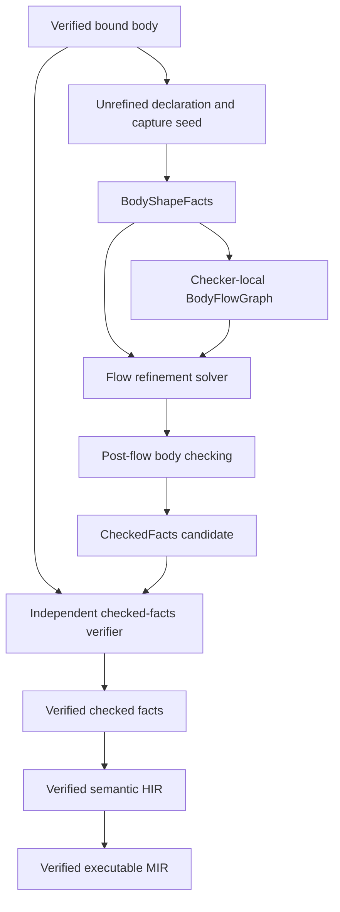

# RFC 0022: Flow-Sensitive Type Refinement And Null Safety

## Summary

This RFC defines sound flow-sensitive type refinement for ZOM. The checker
computes an effective type for each use of a stable binding from control-flow
evidence such as primitive null comparisons, `is` tests, `match` patterns,
short-circuit Boolean operators, assignments, and terminating control flow.
The declared type of a binding never changes. A successful body check publishes
only independently verified per-use refinement facts, and HIR and MIR consume
those facts without repeating source-level reasoning.

The proposal makes nullable types sound and usable without implicit runtime
checks. `T?` remains exactly `T | null`; an operation that requires `T` is legal
only when control flow proves that the specific use cannot observe `null`, or
when the source uses an explicit nullable operation such as `?.` or `??`.

## Motivation

ZOM already has the source ingredients for explicit null safety:

- `null` is a distinct type;
- `T?` normalizes to `T | null`;
- references and class values are non-null unless their type explicitly
  includes `null`;
- the parser represents `==`, `!=`, `is`, `&&`, `||`, `!`, `match`, `when`,
  loops, early exits, optional chaining, and null coalescing; and
- RFC 0005 defines canonical semantic types and checked facts.

The live checker does not yet connect those ingredients. Its
`PatternRefinementFact` is only a pattern-owned pair of syntax node and type.
It has no control-flow graph, no branch polarity, no stable-binding rule, no
assignment invalidation, no join semantics, and no independent dominance
verification. Production body checking also supports only a narrow scalar
slice, so the repository cannot currently claim flow-sensitive refinement or
complete null safety.

Null refinement is not a local expression rewrite. The following cases must
share one semantic model:

- the right operand of `&&` is checked under the left operand's true facts;
- the right operand of `||` is checked under the left operand's false facts;
- an early `return` can prove a later use non-null;
- an assignment can invalidate an earlier proof;
- loop backedges require a fixed point;
- a mutable capture or mutable borrow can make a binding unstable;
- a `match` guard runs only after its pattern succeeds; and
- a verifier must reject a forged refinement whose evidence does not dominate
  the use.

Without a closed design, an implementation can accept nullable dereferences
that become invalid after mutation, produce order-dependent results in loops,
or let HIR trust an unproved non-null assertion. This RFC establishes the
language rule and the compiler boundary before implementation expands beyond
the current scalar body slice.

## Goals

- Define flow-sensitive effective types while preserving immutable declared
  types.
- Make `T?` usable through sound non-null proofs with no implicit runtime null
  checks.
- Define exact transfer rules for null comparisons, `is`, `!`, `&&`, `||`,
  `if`, conditional expressions, `match`, `when`, loops, assignments, and
  terminating control flow.
- Define a conservative, auditable stability rule for local bindings,
  parameters, and callable captures.
- Define deterministic control-flow construction, fixed-point iteration, join,
  invalidation, and unreachable-edge behavior.
- Replace pattern-local refinement pairs with verified per-use flow facts.
- Require an independent verifier to recompute control flow, stability, and
  every published effective type.
- Preserve refinement evidence through HIR and MIR without re-running the
  source checker.
- Publish a revision-bound, source-addressable tooling projection of verified
  declared and effective types for complete bodies.
- Define source diagnostics and project-native conformance evidence.

## Non-Goals

- Adding new source syntax.
- Making non-null references or class values nullable by default.
- Changing `T?` from the canonical union `T | null`.
- Treating `Option<T>` as interchangeable with `T?`.
- Refining arbitrary field, index, dereference, getter, call, or computed
  expressions across source statements.
- Tracking equality aliases between two bindings.
- Adding user-defined type-guard functions, contracts, or effect annotations.
- Adding complement or negation types to the public type system.
- Inferring a non-null function return type from body control flow.
- Removing runtime checks required by explicit checked casts.
- Defining the physical representation of nullable unions.
- Defining refinement across task creation, suspension, or concurrent
  execution. RFC 0007 currently rejects those forms before body checking; a
  future concurrency proposal must define their stability contract before
  they can enter this analysis.
- Defining error-tolerant parsing, partial binding, recovered type analysis,
  editor request snapshots, or LSP transport. RFC 0023 owns those contracts.
- Enabling ownership, concurrency, HIR, MIR, LIR, or backend stages that are
  not implemented in the production pipeline.

## Prior Art

### Scala 3 Explicit Nulls

Scala 3 represents nullable references as unions with `Null` and flow-types
trackable variables after `== null` and `!= null` tests. It propagates facts
through `!`, `&&`, `||`, branches, and matches. Mutable locals are eligible only
when closure access cannot make their value change invisibly, and alias
tracking is intentionally absent.

ZOM adopts the explicit-union model, branch-polarity rules, short-circuit
behavior, conservative trackability, and lack of alias propagation. ZOM does
not make the feature optional or platform-dependent, and it requires a
verified checker fact rather than relying on an unrecorded local smart cast.

Reference:

- <https://docs.scala-lang.org/scala3/reference/experimental/explicit-nulls.html>

### Kotlin Smart Casts And Data-Flow Analysis

Kotlin specifies smart casts as data-flow analysis over a control-flow graph.
Its model distinguishes positive and negative type information, defines
transfer functions and kill points, requires stable smart-cast sinks, and
accounts for concurrent writes, mutable capture, custom getters, delegation,
and separate compilation.

ZOM adopts a checker-owned CFG, fixed-point data flow, stable-use requirement,
explicit kill semantics, and source-level independence from traversal order.
ZOM uses one canonical effective type at each binding use rather than exposing
positive and negative fact sets as public compiler data.

References:

- <https://kotlinlang.org/spec/type-inference.html#smart-casts>
- <https://kotlinlang.org/spec/control--and-data-flow-analysis.html>

### TypeScript Control-Flow Analysis

TypeScript narrows variables through type guards, assignments, reachability,
and control-flow analysis. Early returns remove alternatives from later uses,
and the type observed at a use depends on the reachable assignments leading to
that use.

ZOM adopts reachability-sensitive refinement and assignment transfer. ZOM does
not use a structural, open-ended JavaScript value model; refinement is checked
against canonical ZOM semantic types and binding identity.

Reference:

- <https://www.typescriptlang.org/docs/handbook/2/narrowing.html#control-flow-analysis>

### Dart Sound Null Safety And Promotion

Dart combines non-null-by-default types with flow-based promotion, definite
assignment, reachability, and conservative promotion eligibility. A nullable
value can be promoted after a null check or early exit, while unstable fields
and writes prevent or invalidate promotion.

ZOM adopts the principle that null safety must be sound at every compiled use,
that reachability participates in promotion, and that unstable storage is not
refined. ZOM limits this RFC to binding subjects rather than defining a
property-promotion protocol.

Reference:

- <https://dart.dev/null-safety/understanding-null-safety>

### Common Failure Modes

The prior-art systems converge on three constraints that this RFC makes
explicit:

- a mutable capture or indirect mutable access makes a source value
  untrackable unless the complete mutation set is visible before analysis;
- a property, getter, index, or repeated dereference is not the same read and
  therefore cannot inherit a prior test; and
- flow typing must not consume facts produced by later ownership or executable
  IR phases, because that creates a proof cycle rather than a proof pipeline.

ZOM consequently classifies binding stability before flow solving, limits
subjects to exact binding reads, and publishes a source proof that later IR
stages consume without reconstructing it.

## Guide-Level Explanation

### Nullable Values

`T?` remains a concise spelling of `T | null`. The checker does not insert an
implicit trap or default value when a nullable value is used as `T`.

```zom
fun printLength(value: str?) {
    if (value == null) {
        return;
    }

    print(value.length);
}
```

The use of `value` after the `if` has effective type `str` because the only
path on which execution continues is the path where `value != null`.

The same rule applies inside a true branch:

```zom
fun printLength(value: str?) {
    if (value != null) {
        print(value.length);
    }
}
```

Outside that branch, the declared type is still `str?`.

### Short-Circuit Conditions

The right side of a short-circuit operator is checked under the facts required
for that side to execute.

```zom
fun hasText(value: str?) -> bool {
    return value != null && value.length > 0;
}
```

`value.length` is legal because the right operand is evaluated only when
`value != null` is true.

For `||`, the right operand receives the false facts from the left operand:

```zom
fun isMissingOrEmpty(value: str?) -> bool {
    return value == null || value.length == 0;
}
```

### Type Tests And Patterns

An `is` test refines the true branch to the tested type when the intersection
is representable:

```zom
fun describe(value: any) {
    if (value is str) {
        print(value.length);
    }
}
```

Pattern success refines a direct binding scrutinee and gives pattern bindings
their pattern-specific declared types:

```zom
fun describe(value: str | i32 | null) {
    match (value) {
        when str => { print(value.length); }
        when i32 => { print(value.toString()); }
        when null => { print("missing"); }
    }
}
```

A match guard is checked after its pattern facts are applied. Facts established
only by a guard apply to that arm body, not to later arms.

### Assignment And Invalidation

A mutable local can be refined when all of its writes are visible in the
current callable and no capture or mutable borrow can change it invisibly.
Assignment replaces the current flow type with the effective type of the
assigned value only when the pre-flow transfer can classify that value without
member, operator, overload, or call selection. Other assignments conservatively
reset the possible type to the declared type.

```zom
fun update() {
    mut value: str? = "ready";
    print(value.length);

    value = null;
    // print(value.length); // Error: value is nullable here.
}
```

At a control-flow join, the checker takes the canonical union of the types
possible on every reachable incoming edge.

### Stable Bindings

This RFC refines binding reads, not repeated evaluation of arbitrary
expressions. Eligible subjects are:

- local `let` bindings;
- parameters;
- by-value or shared immutable captures as seen inside their callable; and
- body-local `mut` bindings whose complete mutation and capture behavior is
  visible and verified.

Fields, indexes, dereferences, getters, calls, globals, and `this` projections
are not refinement subjects. Read a value once into a local binding when it
must be tested and reused:

```zom
let name = user.displayName;
if (name != null) {
    print(name.length);
}
```

This rule guarantees that the tested value and the used value are the same
storage read. It also avoids making null safety depend on getter purity,
interior mutation, alias analysis, or another module's implementation.

### Optional Operations

Optional chaining and null coalescing are expression-local nullable
operations. They do not refine the receiver after the expression:

```zom
let length = value?.length;
let text = value ?? "missing";
```

The receiver is evaluated once. The selected non-null path uses the non-null
alternative inside that expression, but no later use of `value` is changed.

### Compiler Model



The `BodyFlowGraph` is an analysis structure, not a new executable IR. It is
not published to HIR, serialized as a language artifact, or used to redefine
source evaluation order.

For a complete successfully checked body, IDE consumers may request the
verified tooling projection defined below. Hover presents the effective type
at the selected use and also presents the declared type when they differ.
Member completion uses the same effective receiver type. An incomplete or
erroneous editor buffer uses RFC 0023's non-authoritative recovered analysis;
it never weakens the verified compiler path defined here.

The phase order is strict and acyclic:

1. RFC 0004 binding and RFC 0005 signature checking establish identities,
   parameter types, and unrefined callable signatures. RFC 0005's declared-type
   rules then establish local declared types without flow refinement, and the
   checker computes `PreFlowCaptureInventory` from explicit capture clauses,
   direct binding uses, source mutations, and declared-type marker facts.
2. A pre-flow pass constructs `BodyShapeFacts` using only the bound body,
   declared types, and `PreFlowCaptureInventory`.
3. The flow solver constructs the graph and computes per-use effective types.
4. Full expression, member, operator, overload, call, coercion, capture-fact,
   and return checking consumes those effective types and produces a candidate.
5. The independent checked-facts verifier reconstructs steps 2 and 3, then
   verifies the post-flow facts under the reconstructed effective types.

No result from step 4, HIR, MIR, RFC 0007 ownership analysis, or RFC 0013
ownership publication may be an input to steps 2 or 3.

## Reference-Level Design

### Normative Terms

**Declared type** is the canonical `SemanticTypeId` assigned to a binding by
RFC 0005 inference and annotation rules. Flow analysis never rewrites it.

**Binding use** is an identifier-expression node resolved by RFC 0004 to one
`DefId`.

**Flow subject** is a binding definition eligible for refinement under the
stability rules below.

**Possible type** is the canonical semantic type describing values that may
reach one flow point for one subject.

**Effective type** is the possible type used to type-check one binding use. It
must be a subtype of the declared type.

**Refinement source** is a primitive null comparison, an `is` test, a
successful pattern, or an assignment whose transfer changes a possible type.

**Kill** resets a subject's possible type to its declared type because the
analyzer cannot prove which declared value is now stored.

**Unreachable edge** is an edge whose condition or pattern produces the empty
type. It contributes no facts to successor joins.

### Type Domain

For subject `s` with declared type `D`, every reachable flow point carries
exactly one canonical possible type `P` satisfying `P <: D`. Absence from the
environment means `P = D`.

Before solving, the pre-flow pass freezes one `BodyFlowTypeBasis` containing:

- every subject's declared type;
- every successfully resolved `is` test type;
- every statically checked pattern result type; and
- the canonical types of `null`, Boolean, scalar, string, and other literal
  forms present in the body.

The finite flow domain is a disjunctive-normal-form closure over that basis.
Each union alternative is one RFC 0005 canonical intersection of a subset of
basis members, and each possible type is one RFC 0005 canonical union of a
subset of those alternatives. `narrow` preserves this form rather than
constructing alternating union/intersection trees. Flattening, deduplication,
and deterministic ordering therefore make the domain finite even when an
implementation does not use bitsets.

The analyzer uses these total operations:

```text
narrow(P, T)       = canonical positive intersection described below
exclude(P, T)      = canonical conservative subtraction described below
join(P1, P2, D)    = canonical (P1 | P2), required to remain a subtype of D
flowValueType(e,E,D) = closed pre-flow assignment type described below
kill(D)            = D
```

`narrow(P, T)` flattens `P` into canonical union alternatives and transforms
each alternative `A` in order:

1. if `A <: T`, retain `A`;
2. otherwise, if `T <: A`, retain `T`;
3. otherwise, if RFC 0005 proves `A` and `T` disjoint, remove `A`; and
4. otherwise, retain canonical `A & T`.

The retained alternatives are canonicalized as a union. An empty result is
`never`.

`exclude(P, T)` also visits each canonical union alternative `A`. It removes
`A` only when `A <: T`; partial overlap and unknown overlap retain `A`.
Therefore the operation never invents a public complement type. In particular,
`narrow(any, null) = null` while `exclude(any, null) = any`.

`T?` canonicalizes through RFC 0005 union rules. Excluding `null` is exact only
when the canonical result still contains an explicit `null` alternative. For
example, `any?` canonicalizes to `any`, so its false null-check edge remains
`any`.

If `narrow` yields `never`, the corresponding edge is unreachable. `never` is
never stored as a possible type on a reachable edge.

`join` is commutative, associative, and idempotent after RFC 0005
canonicalization. Only reachable predecessors participate, and every result
must remain a subtype of the subject's declared type.

`flowValueType(e, E, D)` is deliberately closed and does not perform member,
operator, overload, call, or coercion selection:

- `null` has type `null`;
- a Boolean, scalar, string, or other literal has its canonical literal type;
- a direct flow-subject binding use has the possible type from `E`; and
- every other expression yields the assignment target's declared type `D`.

For assignment to declared type `D`, a result `R` with `R <: D` remains `R`.
Otherwise, an RFC 0005 flow-independent built-in coercion from `R` to `C` with
`C <: D` records `C`. A result that is not statically assignable is
conservatively recorded as `D`; post-flow checking later emits the assignment
error and no verified checked facts are published. This rule preserves a
non-null union alternative after ordinary union injection while preventing
assignment transfer from depending on a post-flow dispatch decision.

### Declared-Type Independence

RFC 0005 determines binding declared types before flow refinement. Inference
uses the unrefined static type of an initializer so declaration identity and
cross-module signatures do not depend on control-flow traversal.

Immediately after a local initializer, flow transfer may set the binding's
possible type to `flowValueType(initializer, E)`, after the closed assignment
conversion above. Consequently, a binding can have declared type `T?` and
possible type `T` without changing its storage contract.

Overload resolution, member lookup, call checking, and operator checking at a
use occur only after flow solving and consume the effective type. Their
selected facts remain subject to RFC 0009's ordinary uniqueness and
verification rules and cannot alter the graph, subject inventory, transfer
results, or reachability.

### Stable Subject Rules

A binding is a flow subject exactly when all applicable rules below hold.

| Binding form | Eligible | Required proof |
|---|---:|---|
| Local `let` | Yes | RFC 0004 binding identity and RFC 0005 declared type |
| Parameter | Yes | RFC 0004 binding identity and RFC 0005 declared type |
| By-value capture inside callable | Yes | `PreFlowCaptureInventory` selects `Move` or `Copy` |
| Shared immutable capture inside callable | Yes | `PreFlowCaptureInventory` selects shared capture and the source binding is immutable |
| Body-local `mut` | Conditional | All writes are direct writes in the same callable; there is no nested mutable use, pre-flow mutable capture, source-level mutable borrow, or address escape |
| Mutable-reference capture | No | Never a flow subject |
| Module or global binding | No | Never a flow subject |
| Receiver or `this` projection | No | Never a flow subject |
| Field, tuple projection, index, dereference, getter, or call result | No | Never a flow subject |

The pre-flow pass publishes an immutable checker-local
`FlowStabilityInventory` from RFC 0004 binding facts, source mutability,
`PreFlowCaptureInventory`, direct binding uses, and syntactic borrow/address
operations. It does not consume `VerifiedOwnershipFacts`,
`VerifiedBorrowEvidence`, HIR, or MIR. Trackability is computed once for the
whole callable and does not change with traversal order.

A body-local mutable binding is ineligible for the entire callable if any
source occurrence can mutate it through a nested callable, mutable capture,
mutable reference, or escaped address. An implementation must not temporarily
refine the binding before the disqualifying occurrence. RFC 0007 may later
reject ownership, borrowing, or availability, but that later result cannot
change source flow typing.

Each nested callable has an independent flow graph and independent subjects.
Facts from an outer callable do not cross the callable boundary. A captured
value begins with the capture type selected for the inner callable.

An eligible binding remains stable across ordinary calls because all
source-visible indirect mutation forms made it statically ineligible. Task
creation, suspension, and concurrent execution do not enter this checker phase
under the current RFC 0007 admission boundary and are outside this RFC.

### Pre-Flow Body Shape

The pre-flow pass constructs immutable `BodyShapeFacts`:

```text
BodyShapeFacts {
  callable: DefId,
  declaredTypes: ImmutableFactMap<DefId, SemanticTypeId>,
  bindingUses: ImmutableFactMap<NodeId, DefId>,
  captures: PreFlowCaptureInventory,
  stability: FlowStabilityInventory,
  resolvedTestTypes: ImmutableFactMap<NodeId, SemanticTypeId>,
  patternResultTypes: ImmutableFactMap<NodeId, SemanticTypeId>,
  staticTerminators: ImmutableFactSet<NodeId>,
  typeBasis: BodyFlowTypeBasis,
}
```

This pass may resolve type expressions and check pattern shape against the
declared, unrefined scrutinee type. It may classify literals and source
operations whose meaning is independent of an effective type. It must not
perform member lookup, overload resolution, user-defined operator selection,
call dispatch, effective-type coercion selection, or return checking.

`PreFlowCaptureInventory` uses the same closed capture-mode rules that RFC 0005
applies to explicit clauses, direct reads, moves, and mutations, but it records
only inputs to stability. Post-flow checking must publish the corresponding
`CheckedCaptureFact`, and the independent verifier requires exact agreement.
The production and verifier capture classifiers are separate implementations.

`staticTerminators` contains explicit `return`, `break`, `continue`, propagated
`raise`, and unconditional panic syntax. A call, operator, or other expression
whose selected post-flow type is `never` is not a graph terminator in this RFC.
Post-flow checking cannot add or remove graph edges.

### Checker-Local Control-Flow Graph

The checker constructs one `BodyFlowGraph` per callable after binding identity
and `BodyShapeFacts` are available. The graph contains:

```text
FlowPointId = body-local uint32 in source-preorder construction order

FlowPoint =
  Entry
  | BeforeExpression(node: NodeId)
  | AfterExpression(node: NodeId)
  | BeforeStatement(node: NodeId)
  | AfterStatement(node: NodeId)
  | ConditionTrue(node: NodeId)
  | ConditionFalse(node: NodeId)
  | PatternSuccess(node: NodeId)
  | PatternFailure(node: NodeId)
  | CallableExit

FlowEdge {
  from: FlowPointId,
  to: FlowPointId,
  kind: Fallthrough | True | False | PatternSuccess | PatternFailure
      | LoopBack | Break | Continue | Return | Raise | Diverge,
}
```

Construction follows the normative source evaluation order in Chapters 04,
05, 07, and 11. `FlowPointId` is not a semantic identity and is not published
outside the checker.

Successors are ordered by edge kind tag, then target source preorder. Duplicate
edges are forbidden. The entry has no predecessors. The exit has no
successors. Only a node in `staticTerminators` lacks its corresponding normal
fallthrough edge.

`break` targets the selected loop exit. `continue` targets the selected loop
backedge. Label resolution is consumed from the verified binder and is not
repeated by flow analysis.

### Primitive Refinement Sources

Only semantic operations in this closed list produce condition refinements.

#### Null Equality

For `s == null` or `null == s`, where `s` is a flow-subject use and the
comparison is the primitive null/union operation:

- true edge: `narrow(Ps, null)`;
- false edge: `exclude(Ps, null)`.

For `s != null` or `null != s`, the transfers are reversed.

The primitive operation is selected before user-defined equality dispatch when
one operand is the null literal and the other operand's canonical type admits
`null`. An overloaded equality call never produces a refinement.

#### Type Test

For `s is T`:

- true edge: `narrow(Ps, T)`;
- false edge: `exclude(Ps, T)`.

The tested type must resolve successfully under RFC 0005 before it contributes
facts. If the true result is `never`, the true edge is unreachable. If an exact
false complement is not representable, the false edge retains `Ps`.

#### Logical Negation

For `!condition`, the condition's true and false successor environments are
swapped. No additional type operation is performed.

#### Short-Circuit Conjunction

For `left && right`:

1. analyze `left` under the incoming environment;
2. analyze `right` under `left`'s true environment;
3. the expression's true environment is `right`'s true environment; and
4. the false environment is the join of `left` false and `right` false.

The right expression is not checked on a left-false edge.

#### Short-Circuit Disjunction

For `left || right`:

1. analyze `left` under the incoming environment;
2. analyze `right` under `left`'s false environment;
3. the expression's false environment is `right`'s false environment; and
4. the true environment is the join of `left` true and `right` true.

The right expression is not checked on a left-true edge.

No other Boolean operator, overloaded operator, function call, or property
access produces refinement facts.

### Structured Control Flow

#### If And Conditional Expressions

The then edge receives the condition's true environment. The else edge
receives its false environment. The environment after the construct is the
join of normal fallthrough edges only. An absent `else` contributes the false
environment directly.

#### Match

The scrutinee is evaluated once. If it is a direct flow-subject use, each
pattern success edge applies the exact type selected by
`BodyShapeFacts.patternResultTypes`, and each later pattern begins from the
prior failure environment.

Pattern bindings receive the types determined by
`BodyShapeFacts.patternResultTypes`; they do not require a flow-refinement fact
at declaration. A guard is checked under the pattern-success environment. Its
true environment reaches the arm body.
The next arm receives:

```text
nextArmInput =
  patternFailure                                      when no guard exists
  join(patternFailure, guardFalse, declaredTypes)     when a guard exists
```

`guardFalse` exists only after pattern success followed by a false guard. An
arm body contributes only its reachable normal fallthrough to the match exit.

An arbitrary scrutinee expression is not re-evaluated and is not made into a
source-visible flow subject. Pattern bindings remain available with their
checked types.

#### When

When a `when` scrutinee is a direct flow-subject use and a clause expression is
the null literal, the clause uses the primitive null-equality transfer. Other
clause expressions use ordinary equality and produce no refinement.

#### Loops

`while`, `do-while`, C-style `for`, and `for-in` use the same forward data-flow
solver. The loop header input is the join of the entry edge and every reachable
backedge. The body receives the condition's true environment. The normal loop
exit receives its false environment plus every reachable `break` environment.

`continue` contributes to the appropriate condition or update point. A
`do-while` body receives the pre-loop environment before its first iteration.
For-in pattern bindings receive their iterator element pattern types on each
iteration.

The solver starts with entry-reachable flow points only and processes the
lowest `FlowPointId` first. When a point changes, successors are enqueued in
canonical successor order. Environments compare by canonical type identity.
Because transfers operate only in `BodyFlowTypeBasis` closure and joins
monotonically widen within that finite domain, iteration terminates.

An implementation may optimize representation with union-alternative bitsets,
but the semantic result is the canonical type operation above. A budget,
timeout, traversal order, or optimization level must not change accepted
source behavior.

### Assignment Transfer

For a simple assignment to eligible subject `s`:

1. compute `R = flowValueType(rhs, incomingEnvironment, Ds)`;
2. apply only the closed, flow-independent assignment conversion to declared
   type `Ds`;
3. store that result as the outgoing possible type for `s`; and
4. preserve unrelated subjects.

Compound assignments and increment or decrement operations set `s` to `Ds`.
Their selected operation and result type are post-flow facts and therefore
cannot participate in transfer.

A write through an unverified alias, mutable capture, mutable borrow, or
escaped address makes `s` ineligible under the static stability rules. A
syntactically direct assignment to a still-eligible binding uses the ordinary
assignment transfer.

Moving a binding does not widen its type. RFC 0007 determines whether a later
use is available; flow refinement cannot make an unavailable place usable.

### Optional Chaining And Null Coalescing

For `receiver?.member`, the receiver is evaluated once. The selected member
path is checked under `exclude(receiverType, null)`, and the skipped path
produces `null` according to Chapter 04. No outgoing environment change is
published for a source binding.

For `left ?? right`, `left` is evaluated once. `right` is evaluated only on the
null path. The result type follows RFC 0005 union and coercion rules. No
outgoing environment change is published for a source binding.

Null-coalescing assignment follows ordinary assignment transfer after its
short-circuit evaluation.

### Per-Use Checked Facts

RFC 0005's `PatternRefinementFact` and the `refinements` field of
`CheckedPatternFact` are removed. They are not retained through an adapter or
dual publication path.

The checked-facts model adds:

```text
CheckedFlowRefinementFact {
  use: NodeId,
  binding: DefId,
  declaredType: SemanticTypeId,
  refinedType: SemanticTypeId,
}

FlowRefinementFactMap =
  ImmutableFactMap<NodeId, CheckedFlowRefinementFact>
```

A fact is published exactly when all of these conditions hold:

1. `use` is an identifier-expression node;
2. the binder resolves it to `binding`;
3. `binding` is a flow subject;
4. `declaredType` is the binding's RFC 0005 declared type;
5. `refinedType` is the effective type at `use`;
6. `refinedType <: declaredType`;
7. `refinedType != declaredType`; and
8. the use is reachable.

`NodeTypeMap[use]` equals `refinedType` when a refinement fact exists and equals
the ordinary static type otherwise.

The canonical map order is `CheckedNodeKey(use)`, then expanded `DefId`.
Duplicate use nodes are invalid. `CheckedFactsCandidate` and
`VerifiedCheckedFacts.candidateFields` add:

```text
flowRefinements: SortedMap<NodeId, CheckedFlowRefinementFact>
```

immediately after `errorOperators`. The canonical group table appends
`FlowRefinement = 0x17` after `ErrorOperator = 0x16`. Each record encodes
expanded `CheckedNodeKey(use)`, expanded `DefId(binding)`, expanded declared
type identity, and expanded refined type identity in that order.

The pattern codec removes its refinement sequence. This RFC directly replaces
RFC 0005's checked-facts revision preimage with:

```text
ASCII("zom.checked-facts-revision")
0x00
ContextFingerprint
EncodeByteString(expanded owning ModuleKey)
sourceContentDigest
parsedModuleReceipt
signatureFactsRevision
importedSignatureViewRevision
coherenceViewRevision
Encode(SemanticCompilerOptionsKey)
EncodeSortedRecordBytes(substitutionStore.records)
EncodeSortedRecordBytes(witnessStore.records)
EncodeSortedRecordBytes(nodeTypes)
EncodeSortedRecordBytes(definitionTypes)
EncodeSortedRecordBytes(literals)
EncodeSortedRecordBytes(constants)
EncodeSortedRecordBytes(aggregates)
EncodeSortedRecordBytes(places)
EncodeSortedRecordBytes(coercions)
EncodeSortedRecordBytes(casts)
EncodeSortedRecordBytes(calls)
EncodeSortedRecordBytes(compoundAssignments)
EncodeSortedRecordBytes(members)
EncodeSortedRecordBytes(indexes)
EncodeSortedRecordBytes(patterns)
EncodeSortedRecordBytes(observedOperations)
EncodeSortedRecordBytes(captures)
EncodeSortedRecordBytes(markerObligations)
EncodeSortedRecordBytes(exhaustiveness)
EncodeSortedRecordBytes(unsafeOperations)
EncodeSortedRecordBytes(projections)
EncodeSortedRecordBytes(obligations)
EncodeSortedRecordBytes(errorUnionShapes)
EncodeSortedRecordBytes(errorOperators)
EncodeSortedRecordBytes(flowRefinements)
```

The independent framing oracle retains RFC 0005's zero-valued identity and
revision inputs, semantic options `{2026, true, false, true}`, and one one-byte
record in every group. The group bytes run from `b0` through `c8`, where `c8`
is the flow-refinement record. Its complete 660-byte preimage is:

```text
7a6f6d2e636865636b65642d66616374732d7265766973696f6e0000000000000000000000000000000000000000000000000000000000000000000000000000000001a122222222222222222222222222222222222222222222222222222222222222223333333333333333333333333333333333333333333333333333333333333333444444444444444444444444444444444444444444444444444444444444444455555555555555555555555555555555555555555555555555555555555555556666666666666666666666666666666666666666666666666666666666666666000007ea01000100000000000000010000000000000001b000000000000000010000000000000001b100000000000000010000000000000001b200000000000000010000000000000001b300000000000000010000000000000001b400000000000000010000000000000001b500000000000000010000000000000001b600000000000000010000000000000001b700000000000000010000000000000001b800000000000000010000000000000001b900000000000000010000000000000001ba00000000000000010000000000000001bb00000000000000010000000000000001bc00000000000000010000000000000001bd00000000000000010000000000000001be00000000000000010000000000000001bf00000000000000010000000000000001c000000000000000010000000000000001c100000000000000010000000000000001c200000000000000010000000000000001c300000000000000010000000000000001c400000000000000010000000000000001c500000000000000010000000000000001c600000000000000010000000000000001c700000000000000010000000000000001c8
```

Its SHA-256 is
`d47c54ce5572667a36d8267ac9ad72a07e8b0ac482e8626c142b297607411930`.
Per-group integration oracles replace each one-byte record with one complete
real record and prove that swapping any two group encodings changes the
revision. Every existing checked-facts cache entry is invalidated, and no
parallel decoder or compatibility path is retained.

### Independent Verification

`FlowRefinementVerifier` is independent of the production analyzer. It consumes
the immutable AST, verified binding facts, signature-level declared types,
RFC 0005 declared-type inputs, marker facts needed for capture classification,
and semantic compiler options. It independently reconstructs:

- local declared types;
- `PreFlowCaptureInventory`;
- `BodyShapeFacts`;
- callable boundaries;
- eligible subjects;
- the complete `BodyFlowGraph`;
- primitive refinement-source classification;
- transfer results;
- loop fixed points;
- use reachability; and
- the expected per-use effective type.

It then compares the expected set with `FlowRefinementFactMap` and
the candidate's flow-derived use types. Only after that comparison succeeds
does the enclosing `CheckedFactsVerifier` verify member, operator, call,
coercion, pattern, and other post-flow facts under the independently derived
effective types. It must reject:

- a fact for an ineligible or unresolved binding;
- a fact whose source does not dominate the use on every reachable path;
- a fact retained after an assignment or kill;
- a fact that crosses a callable boundary;
- a fact on an unreachable use;
- a refined type that is not a subtype of the declared type;
- a missing required fact;
- an additional fact;
- a graph edge that disagrees with source evaluation order; and
- any non-canonical ordering or encoding.

The checker invariant algebra adds
`InvalidFlowGraph`, `InvalidFlowSubject`, `InvalidFlowRefinement`,
`MissingFlowRefinement`, and `AdditionalFlowRefinement`. These are compiler
invariants, not source diagnostics. A failed verification publishes no
`VerifiedCheckedFacts`.

Production analysis and verification may share immutable type canonicalization
and AST accessors. They must not share CFG construction, transfer functions,
worklist code, stability classification, `BodyShapeFacts` construction, or
expected-fact construction. The verifier does not consume candidate operation,
pattern, coercion, ownership, HIR, or MIR facts to decide graph shape,
reachability, stability, or transfer.

### Verified Tooling Projection

The compiler exposes flow-sensitive types to tooling through a derived
revision-local query. Tooling never reads `NodeId`, `DefId`,
`SemanticTypeId`, checker maps, HIR, or MIR directly.

```text
VerifiedFlowTypeEntry {
  use: LocalSyntaxPath,
  declaredType: SemanticTypeKey,
  effectiveType: SemanticTypeKey,
}

VerifiedFlowToolingProjection {
  owner: StableBodyOwnerKey,
  databaseRevision: DatabaseRevision,
  checkedFactsRevision: CheckedFactsRevision,
  provenanceRevision: ProvenanceRevision,
  entries: SortedSequence<VerifiedFlowTypeEntry>,
}
```

`VerifiedFlowToolingProjection(owner)` is an RFC 0017 `RevisionLocal`,
computed, evictable query. It demands the exact verified checked-facts lease,
RFC 0019 owner-body syntax, and current owner-body provenance for `owner`.
Every reachable resolved binding use maps to exactly one owner-local
`LocalSyntaxPath`; every path maps back to the same checked use. Missing,
additional, duplicate, cross-owner, stale-provenance, or non-bijective
mappings are invariant failures and publish no projection.

Entries sort by complete canonical `LocalSyntaxPath` bytes. Types expand to
RFC 0005 `SemanticTypeKey`; process-local handles and presentation strings are
forbidden. A use whose effective type differs from its declared type must have
the exact `CheckedFlowRefinementFact`; a use whose types are equal must not
have one. An absent entry means that the path is not a reachable resolved
binding use. Tooling must not infer absence or nullability from a missing
entry.

The value is revision-local because it retains the exact checked-facts and
provenance revisions. It is never persisted or backdated. A consumer must hold
the matching query-snapshot lease for the entire read. RFC 0023 maps the
projection to editor offsets and document versions and discards stale
responses.

This projection is tooling evidence only. It cannot construct
`VerifiedCheckedFacts`, authorize HIR or MIR operations, satisfy ownership, or
enter an artifact fingerprint. HIR and MIR continue to consume only the
verified compiler facts described below.

### Source Diagnostics

This RFC allocates the following checker diagnostics:

| Diagnostic | Severity | Message | Anchor |
|---|---|---|---|
| `ZOM4096 NullableValueRequiresNonNullProof` | Error | `Nullable value must be proven non-null before this operation` | binding use that requires the non-null alternative |
| `ZOM4097 FlowRefinementUnavailableHere` | Note | `This test cannot refine a binding whose value may change` | nearest dominating test of the same ineligible binding |
| `ZOM4098 FlowRefinementInvalidatedHere` | Note | `The non-null fact was invalidated here` | nearest dominating assignment or pre-flow-classified kill of the same binding |

RFC 0005's diagnostic algebra is extended directly:

```text
CheckerDiagnosticProducer =
  ...existing producers...
  | FlowRefinement
```

`FlowRefinement` has tag `0x16`, immediately after RFC 0015
`SignatureClassification = 0x15`. Existing producer tags do not change.
`CheckerErrorId` adds `ZOM4096`; `CheckerNoteId` adds `ZOM4097` and `ZOM4098`.
The exact production-schema rows are:

| ID | Stage | Producer | Primary anchor | Arguments | Item ordinal | Recovery |
|---|---|---|---|---|---:|---|
| `ZOM4096` | `Body` | `FlowRefinement` | nullable binding-use node | empty | `0` | `CreateRoot { class: InvalidOperation, suppressIfChildRecovery: true }` |
| `ZOM4097` | associated note | none; primary producer is `FlowRefinement` | unavailable-test node | empty | no independent ordinal | associated only with `ZOM4096` |
| `ZOM4098` | associated note | none; primary producer is `FlowRefinement` | invalidating assignment or kill node | empty | no independent ordinal | associated only with `ZOM4096` |

The `ZOM4096` emitter ordinal uses the containing callable's schema preorder as
`ownerSchemaPreorder`, the binding-use preorder as `siteSchemaPreorder`, and
zero as `itemOrdinal`. Its sort key and recovery behavior are therefore the
RFC 0005 `CheckerFailureRef` key and recovery algebra without an additional
flow-specific order. Its primary span is the complete binding-use span.
`ZOM4097` and `ZOM4098` carry the same binding as
`CheckerNoteRef.causeDefinition`, the complete anchor span shown above, and no
display arguments. `CheckerNoteRef` carries no independent stage, producer,
ordinal, or recovery field.

`ZOM4096` is selected only when:

1. the effective type contains `null`;
2. removing `null` would make the requested member, call, index, dereference,
   coercion, or operator valid; and
3. the source did not use an explicit nullable operation.

If the operation is invalid even after removing `null`, its ordinary specific
diagnostic wins. Unresolved names and invalid type expressions precede all
flow diagnostics. Argument and return assignability continue to use the RFC
0005 type-mismatch diagnostic because the required target type is already
explicit. `ZOM4096` is a checker-stage source failure and therefore prevents
later HIR, MIR, and RFC 0007 ownership publication for that body; the checker
does not consume later availability diagnostics to choose it.

At most one refinement note accompanies `ZOM4096`. Candidate causes must
dominate the failing use in the independently reconstructed graph. An
invalidation is preferred over an unavailable test. Within the selected cause
kind, the cause with the greatest dominator-tree depth wins; equal-depth ties
use `CheckedNodeKey` order. The note is omitted when no relevant cause
dominates the use. Notes never allocate a recovery root or appear independently
in `sourceFailures`.

Valid optional chaining, null coalescing, null comparison, `is`, and pattern
matching never emit `ZOM4096`.

### HIR And MIR Boundary

This RFC adds one source-shaped semantic HIR record:

```text
HirRefinementUse {
  sourceUse: CheckedNodeKey,
  binding: DefId,
  declaredType: SemanticTypeId,
  effectiveType: SemanticTypeId,
  checkedFactsRevision: CheckedFactsRevision,
}
```

HIR construction emits exactly one `HirRefinementUse` for each
`CheckedFlowRefinementFact` and emits none for an unrefined use. The HIR
verifier resolves the retained `VerifiedCheckedFacts` lease named by
`checkedFactsRevision` and requires exact equality of source use, binding,
declared type, and effective type. Missing, additional, duplicated, reordered,
or revision-mismatched records are invariant failures. HIR does not rebuild the
source graph, infer branch facts, or turn the record into borrow, pointer,
cast, or ownership authority.

This RFC also adds one MIR semantic view operation:

```text
MirRefinementView {
  sourceUse: CheckedNodeKey,
  input: MirOperand,
  binding: DefId,
  declaredType: SemanticTypeId,
  effectiveType: SemanticTypeId,
  checkedFactsRevision: CheckedFactsRevision,
}
```

MIR lowering emits exactly one `MirRefinementView` at the executable value use
corresponding to each `HirRefinementUse`. Its input is the ordinary lowered
binding value; the operation changes only the semantic view of that value.
The MIR verifier maps each view one-to-one to the source HIR record and checks
all identities, types, and the checked-facts revision. It rejects hoisting,
duplication, omission, an additional view, a mismatched operand lineage, or a
view attached to another source use.

The MIR verifier does not repeat source CFG dominance. The independent
checked-facts verifier already proved that the exact source use has the
effective type, and the one-to-one HIR/MIR lineage prevents moving that proof
to another use. This division avoids two subtly different source-flow
algorithms in the checker and MIR verifier.

`MirRefinementView` is not a physical union projection and authorizes no
unchecked load or payload access. Target LIR legalization must preserve the
source control-flow placement and select a representation-correct operation,
but nullable-union layout and legalization remain outside this RFC. No source
flow assertion survives as an independent proof at the LIR boundary.

### Incremental And Deterministic Behavior

Flow refinement is body-local. Its query key is the RFC 0019 stable body owner
plus the semantic inputs already required for body checking. Its result
revision includes the canonical flow-refinement fact group.

A change invalidates a body's refinement result when it changes any of:

- body syntax or source digest;
- resolved binding or label identity;
- declared semantic type;
- capture declaration or source mutation form;
- resolved test type or pattern result type; or
- semantic compiler options that affect type checking.

Formatting, diagnostics rendering, target selection, and backend options do
not affect flow results. Identical semantic inputs must produce identical
facts, revisions, HIR, and MIR regardless of thread scheduling.

## Repository Impact

| Area | Paths | Owner |
|---|---|---|
| RFC proposal and tracking | `docs/rfc/0022-*.md`, `docs/rfc/tracking/0022-*.md`, `docs/rfc/README.md` | `rfc` |
| Expression semantics | `docs/spec/chapters/04-expressions.md` | `lexer-parser` |
| Type, statement, and pattern semantics | `docs/spec/chapters/03-types.md`, `docs/spec/chapters/05-statements.md`, `docs/spec/chapters/07-patterns.md` | `spec-audit` |
| Binding stability and checker facts | `products/zomlang/compiler/binder/**`, `products/zomlang/compiler/checker/**`, `products/zomlang/compiler/type/**` | `binder-checker` |
| Stable body query and checked-facts repository integration | `products/zomlang/compiler/query/**`, `products/zomlang/compiler/driver/**` | `module-system` |
| Diagnostic registry and rendering | `products/zomlang/compiler/diagnostics/**` | `error-system` |
| Verified refinement consumption | `products/zomlang/compiler/hir/**`, `products/zomlang/compiler/mir/**` | `ir-backend` |
| Editor-facing verified type projection | `products/zomlang/tools/ide/**`, `docs/design/tooling/**` | `tooling-lsp` |
| Unit, lit, conformance, mutation, and incremental tests | `products/zomlang/tests/**`, `scripts/check-*-architecture.py` | `verification` |

## Security And Safety Impact

This RFC is a memory- and type-safety boundary. A false non-null refinement can
turn a nullable union payload into an invalid projection and can later
authorize an invalid dereference or method call. The design therefore:

- permits only binding subjects whose repeated reads are stable;
- treats a mutable capture, syntactic alias escape, or incomplete pre-flow
  binding inventory as ineligibility;
- gives assignments and unknown writes explicit kill behavior;
- forbids facts from crossing callable boundaries;
- independently reconstructs stability, graph shape, fixed points, and exact
  per-use types;
- prevents unverified facts from reaching HIR; and
- prevents editor-facing projections from becoming compiler authority; and
- does not convert type refinement into borrow, pointer, or unsafe authority.

The analysis adds no runtime metadata and exposes no source or user data.
Compiler resource exhaustion is limited by a monotone finite-domain solver and
body-local query boundaries.

## Drawbacks And Risks

- Restricting subjects to bindings requires a local snapshot before refining a
  field or getter. This is more explicit than property promotion in languages
  with proven-stable properties.
- A complete checker-local CFG and independent reconstruction add meaningful
  implementation and test cost.
- Use-site overload resolution under an effective type must not create a
  circular dependency with transfer analysis.
- Loop fixed points and early exits increase the number of paths that mutation
  tests must cover.
- Static ineligibility for a mutable binding is conservative; one nested
  mutable capture prevents refinement throughout the callable.
- The checked-facts codec and revision change, invalidating body caches.
- The verified tooling projection is unavailable when body checking fails;
  responsive degraded IDE behavior therefore depends on RFC 0023.
- HIR and MIR must preserve exact source-use lineage. Reusing one refined
  source record for another value use would be unsound.

## Alternatives Considered

### Structured Recursive Environments Without A CFG

A recursive checker can pass environments directly through `if` and `&&`.
This is compact for simple trees but becomes difficult to specify for labeled
breaks, continues, guards, early exits, and loop fixed points. A checker-local
CFG provides one auditable semantics for all of them.

### Refine Every Repeatable Expression

Refining fields, getters, indexes, and dereferences would reduce local
snapshots, but repeated evaluation can observe mutation, dynamic dispatch, or
different storage. A binding-only rule is sound without a property-purity or
whole-program alias contract.

### Insert Implicit Runtime Null Checks

An implicit trap would make nullable code appear convenient while hiding a
runtime failure and weakening compile-time guarantees. ZOM requires a static
proof or an explicit nullable operation.

### Require Pattern Matching For Every Nullable Use

Patterns are sound but unnecessarily verbose for guards and early returns.
Primitive null comparisons and short-circuit transfer provide the same proof
within one general data-flow model.

### Replace Nullable Unions With `Option<T>`

`Option<T>` is useful when APIs need named variants and payload-rich absence
states. It does not replace an explicit null value needed for FFI, data formats,
and nullable object models. Keeping `T? = T | null` also reuses ZOM's union type
system.

### User-Defined Type Guards

Predicate contracts can express domain-specific refinements, but they require a
separate sound effect and contract-verification model. Ordinary Boolean calls
therefore produce no facts in this RFC.

### Reuse MIR For Source Refinement

MIR is constructed after successful type checking and already assumes complete
semantic operations. Using it to make source member lookup succeed would create
a phase cycle. The checker-local graph is discarded after verified facts are
published.

## Compatibility And Rollout

This is the sole semantic and checked-facts contract. Producers, verifiers,
consumers, fixtures, and cache entries use the same representation.

Rollout proceeds in gated slices:

1. accept this RFC and freeze the spec wording, diagnostic allocation, and
   checked-facts schema;
2. replace `PatternRefinementFact` with `CheckedFlowRefinementFact`, update the
   canonical codec, and invalidate existing body caches;
3. implement declared-type collection, subject classification, and the
   checker-local CFG without publishing refinement facts;
4. implement the production transfer solver and source diagnostics;
5. implement the independent verifier and block publication on any mismatch;
6. enable per-use facts for the complete supported body syntax;
7. make HIR and MIR consume and verify the facts; and
8. update the normative spec, design notes, conformance corpus, architecture
   gates, and release notes before changing the RFC to `LANDED`.

During development, an incomplete body kind must fail through the repository's
specific unsupported production boundary. It must not silently omit a required
refinement or accept a nullable operation.

Rollback before release removes the entire new fact group, analyzer, verifier,
diagnostics, and tests in one change and restores no alternate narrowing path.
After release, a semantic rollback is a breaking language change and requires
its own RFC.

## Documentation And Teaching Plan

- Chapter 03 defines declared versus effective type and the exact relationship
  between `T?`, unions, `null`, and refinement.
- Chapter 04 defines null comparison, `is`, `!`, `&&`, `||`, optional chaining,
  and null-coalescing behavior.
- Chapter 05 defines branch, loop, join, assignment, and early-exit behavior.
- Chapter 07 defines scrutinee and pattern-binding refinement.
- `docs/design/language/` receives a non-normative guide explaining null-safe
  control-flow idioms only after production evidence exists.
- `docs/design/ir/` documents how verified per-use facts reach HIR and MIR only
  after those production consumers exist.
- `docs/design/tooling/` documents the verified flow-type projection only after
  its production query and IDE consumer exist.
- Diagnostic documentation includes snapshots for `ZOM4096-ZOM4098`.
- Release notes call out the accepted nullable-use rules and cache
  invalidation.

All teaching examples distinguish declared type from effective type and show
the local-snapshot pattern for fields. No document may claim property
refinement, user-defined guards, or production support before the relevant
implementation and tests land.

## Operational Readiness

Flow analysis adds compile-time work only. Before landing:

- body-check benchmarks must record flow-point count, edge count, subject
  count, worklist process count, and peak environment entries;
- an adversarial loop corpus must demonstrate deterministic convergence;
- incremental tests must prove that unrelated target and formatting changes do
  not invalidate flow results;
- tooling projection tests must bind every response to one database and
  provenance revision and reject stale or cross-owner mappings;
- sanitizer runs must cover graph construction, joins, and malformed-fact
  verification;
- architecture gates must prevent any HIR or MIR refinement view without an
  exact verified source-use record; and
- diagnostic snapshots must remain deterministic under parallel package
  checking.

No runtime service, deployment, migration daemon, or observability endpoint is
required.

## Acceptance Criteria

- Required owners approve the exact RFC hash in the tracking document.
- Chapters 03, 04, 05, and 07 contain the normative rules in this RFC and
  pass spec-alignment review.
- `PatternRefinementFact` and `CheckedPatternFact.refinements` are deleted.
- The production checker builds the complete body-local graph for every
  supported control-flow syntax kind.
- The production analyzer implements every transfer, join, invalidation, and
  fixed-point rule in this RFC.
- The independent verifier shares no graph builder, transfer, worklist, or
  stability, body-shape, or expected-fact construction with production
  analysis.
- The pre-flow phase consumes no post-flow checked operation, ownership, HIR,
  or MIR fact.
- The solver terminates within the finite `BodyFlowTypeBasis` closure and
  implements the exact `narrow`, `exclude`, `join`, and `flowValueType`
  operations.
- The canonical checked-facts framing oracle and per-group mutation oracles pass.
- `CheckedFlowRefinementFact` is canonical, revisioned, and published only
  after verification.
- `VerifiedFlowToolingProjection` contains no process-local semantic handle,
  maps each reachable resolved binding use bijectively to one
  `LocalSyntaxPath`, and is available
  only under its exact query-snapshot lease.
- `ZOM4096-ZOM4098` have exact registry, precedence, renderer, and snapshot
  coverage.
- HIR and MIR reject missing, additional, duplicated, hoisted, or
  revision-mismatched refinement views.
- Positive conformance tests cover null guards, short-circuiting, early exits,
  `is`, patterns, assignments, loops, guards, and optional operations.
- Negative conformance tests cover unstable captures, invalidation, joins,
  nullable uses, callable boundaries, and forged facts.
- Mutation tests delete, add, move, or alter each flow edge and fact field and
  observe one deterministic verifier failure.
- Incremental tests prove exact invalidation and deterministic revisions.
- Sanitizer build, default CTest, lit, unit tests, format, RFC checks, spec
  alignment, and relevant architecture gates pass.
- The RFC tracker records implementation commits and final evidence before
  status changes to `LANDED`.

## Implementation Plan

1. Land the accepted spec contract and replace the checked-facts schema and
   canonical codec directly.
2. Add independent production and verifier construction of `BodyShapeFacts`
   and `BodyFlowTypeBasis`.
3. Add static subject classification using binding, capture-declaration,
   direct-use, mutation, borrow-syntax, and address-escape facts.
4. Implement the production `BodyFlowGraphBuilder` for expressions, statements, patterns,
   labels, exits, and callable boundaries.
5. Implement canonical type-domain operations and the deterministic forward
   fixed-point solver.
6. Integrate effective types with member, call, operator, coercion, argument,
   return, and assignment checking.
7. Add `ZOM4096-ZOM4098` with exact suppression, anchor, and note ordering.
8. Implement the independent verifier and canonical flow-fact group.
9. Update stable body queries and cache invalidation.
10. Add the revision-local verified tooling projection and its source mapping.
11. Carry verified facts through exact `HirRefinementUse` and
    `MirRefinementView` source lineage.
12. Add the complete native test matrix, benchmarks, architecture gates, and
    normative documentation.
13. Record owner approvals and project-native evidence before advancing RFC
    status.

## Test Plan

- Build:
  `cmake --preset sanitizer` and `cmake --build --preset sanitizer`.
- Unit tests:
  native checker tests for type operations, graph construction, stability,
  transfers, joins, fixed points, canonical encoding, verifier mutations, and
  revisions.
- Lit tests:
  positive and negative source cases for every refinement source and control
  construct, with FileCheck diagnostics for `ZOM4096-ZOM4098`.
- Conformance:
  nullable member/call/coercion cases; null on either comparison side; nested
  `!`, `&&`, and `||`; early `return`; match guards; `when null`; all loop
  forms; assignment and compound assignment; captures; nested callables;
  optional chaining; null coalescing; and unreachable edges.
- IR tests:
  verified HIR/MIR refinement views, missing evidence, forged evidence,
  duplicated or hoisted views, revision mismatches, and deterministic dumps.
- Incremental tests:
  body edit, declared-type edit, capture-declaration edit, pattern-result edit,
  formatting-only edit, target-only edit, projection source remapping, stale
  provenance rejection, and parallel scheduling.
- Mutation tests:
  every flow-point kind, edge kind, fact field, subject class, transfer
  polarity, join predecessor, and canonical order.
- Generated files:
  diagnostic tables, checked-facts codec oracles, conformance expectations,
  and any schema-derived headers are regenerated by repository-native targets.
- Gates:
  `ctest --preset default`,
  `ctest --preset default -L lit`,
  `ctest --preset default -L unittest`,
  `python3 scripts/check-rfc.py`,
  `python3 scripts/check-format.py`, relevant architecture checks, and
  `git diff --check`.

## Open Questions

None.

## Status History

| Date | Status | Notes |
|---|---|---|
| 2026-07-24 | DRAFT | Initial repository and prior-art design pass. |
| 2026-07-24 | REVIEW | Closed the type domain, stability, CFG, transfer, verification, diagnostic, and IR handoff contracts. |
| 2026-07-24 | RETURNED | Review found phase-cycle, type-domain, proof-handoff, codec, diagnostic, and owner blockers. |
| 2026-07-24 | DRAFT | Reworked the proposal to close every blocking contract. |
| 2026-07-24 | REVIEW | Re-entered review with an acyclic checker pipeline, finite domain, exact codec and diagnostics, and source-use IR lineage. |
| 2026-07-24 | RETURNED | Tooling review found no LSP-consumable, revision-bound flow-type projection. |
| 2026-07-24 | DRAFT | Added the verified tooling projection and separated complete compiler facts from recovered IDE analysis. |
| 2026-07-24 | REVIEW | Re-entered review with explicit tooling ownership and RFC 0023 as the editor-recovery consumer contract. |
