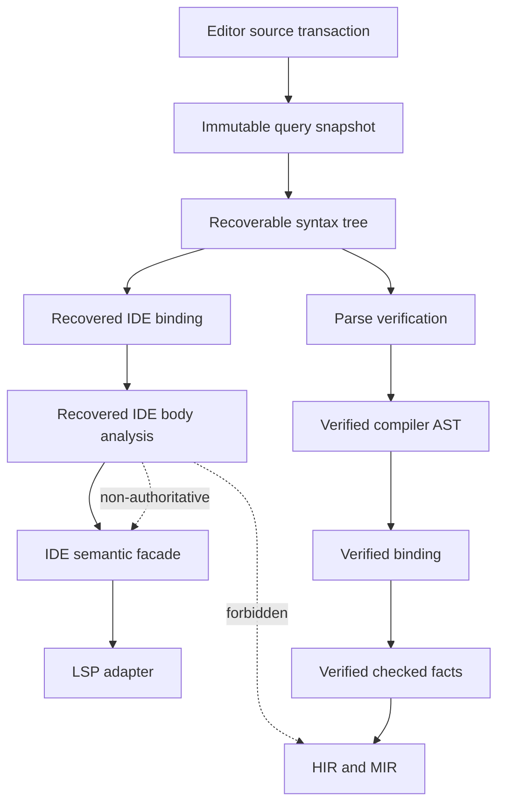

# RFC 0023: IDE Semantic Snapshots And Language Server Architecture

## Summary

This RFC defines ZOM's editor semantic architecture and Language Server
Protocol boundary. It introduces a recoverable concrete syntax tree produced by
the existing parser, request-scoped snapshot analysis leases, revision-local
recovery analysis plus semantic stable-body projections, an editor-facing
semantic facade, and an LSP adapter that never serializes compiler-internal
handles.

The design has two authority rails. The compiler rail remains fail-closed and
publishes only independently verified facts. The IDE rail remains available
over incomplete or erroneous source and publishes only non-authoritative editor
views. On valid source, IDE flow types must equal RFC 0022's verified tooling
projection. No recovered IDE result can authorize HIR, MIR, ownership, LIR,
native emission, or a compiler artifact.

## Motivation

Flow-sensitive typing is directly visible in editor behavior. Hover must show
the effective type at a use, member completion must use the receiver's
effective type, and diagnostics must explain when a nullable value lacks a
non-null proof. Those requests commonly occur while the user is typing
incomplete source.

The repository currently has no ZOM language-server product. The live CLI has
a `--check` path that runs verified parsing, binding, and checking, which is a
batch compiler mode rather than completion. AST reflection metadata mentions LSP
hover, but there is no editor semantic facade or consumer. The compiler also
publishes `VerifiedCheckedFacts` only after a complete successful body check.
Using that publication as the only IDE source would make hover and completion
disappear after any syntax, binding, or type error in the body.

RFC 0017 already provides the required foundation:

- atomic input transactions;
- immutable query snapshots;
- revision-bound flights;
- cancellation that publishes no memo;
- deterministic diagnostic facts; and
- separate semantic and provenance revisions.

It deliberately does not approve long-lived multi-version IDE snapshots.
This RFC preserves that boundary. An IDE request receives one short-lived lease
over the current committed snapshot; the lease records the complete input
frontier actually read, and stale output is discarded before protocol
publication.

Without an explicit architecture, an implementation is likely to introduce one
or more of these failures:

- weaken parser or checker verification so the compiler accepts recovery data;
- fork a second parser whose grammar drifts from the compiler;
- return hover or diagnostics computed for an earlier document version;
- serialize process-local AST or semantic handles into protocol payloads;
- use a guessed type after an unresolved assignment as a non-null proof; or
- invalidate a whole workspace for one body edit.

This RFC closes those boundaries before an LSP executable is introduced.

## Goals

- Keep syntax, binding, hover, completion, and diagnostics useful over
  incomplete source.
- Preserve one lexer and parser grammar for compiler and editor use.
- Keep recovered IDE facts structurally incapable of becoming compiler
  authority.
- Bind every editor request and result to one immutable database snapshot and
  the exact source, package, target, option, and environment inputs it reads.
- Cancel or discard stale work without publishing a semantic payload, edit, or
  diagnostic update while still terminating every protocol request.
- Define closed partial binding and type-state algebras without fabricated
  identities or types.
- Expose an editor-facing API in file, range, symbol, and display-type terms
  rather than compiler implementation types.
- Define flow-sensitive hover and completion through RFC 0022.
- Define deterministic LSP lifecycle, text synchronization, feature
  degradation, ordering, and testing.
- Preserve body-local incremental invalidation through RFC 0019 stable owners.

## Non-Goals

- Changing ZOM language syntax or type semantics.
- Making an IDE result a substitute for `VerifiedParsedSyntax`,
  `VerifiedBoundModule`, `VerifiedCheckedFacts`, HIR, or MIR.
- Defining physical nullable-union representation or backend lowering.
- Persisting recovered syntax, binding, type, completion, or diagnostic
  results across processes.
- Retaining user-addressable historical workspace snapshots.
- Supporting multiple workspace folders or dynamic workspace-folder changes in
  the initial server.
- Supporting LSP pull diagnostics in the initial server.
- Executing builds, package scripts, compiler plugins, formatters, or arbitrary
  commands from the initial language server.
- Defining debugger, DAP, notebook, or remote-index protocols.
- Providing semantic refactorings whose preconditions cannot be proven from
  verified bindings.
- Adding speculative AI completion or network services.

## Prior Art

### rust-analyzer

rust-analyzer separates an immutable syntax and HIR analysis core from its LSP
adapter. Its parser produces a tree plus errors, its syntax trees tolerate
missing fields, body lowering represents missing expressions explicitly, and
its `AnalysisHost` publishes cancellable immutable `Analysis` snapshots.

ZOM adopts one recoverable parser output, request-scoped immutable analysis,
body-local inference, explicit missing states, an IDE facade independent of
LSP serialization, and cancellation instead of stale answers. ZOM keeps a
separate verified compiler AST and checked-facts rail because its existing
compiler contracts require independent verification.

References:

- <https://rust-analyzer.github.io/book/contributing/architecture.html>
- <https://rust-analyzer.github.io/book/contributing/guide.html>

### TypeScript Language Service

The TypeScript Language Service receives file versions and `ScriptSnapshot`
values from its host. Versions drive invalidation, snapshots describe source
changes, and the service retains syntax and semantic state for open files.

ZOM adopts explicit document versions, immutable source snapshots, and
incremental host updates. ZOM places source changes into RFC 0017 transactions
rather than exposing a mutable language-service host to semantic providers.

Reference:

- <https://github.com/microsoft/TypeScript/wiki/Using-the-Compiler-API>

### Roslyn Workspaces

Roslyn models the current projects and documents as an immutable `Solution`.
Workspace changes produce a new solution, and consumers obtain syntax trees,
semantic models, and compilations from that snapshot.

ZOM adopts immutable editor-visible workspace state and source-to-semantic
queries. ZOM does not retain an arbitrary solution history; request leases are
bounded by RFC 0017 snapshot lifetime.

Reference:

- <https://learn.microsoft.com/en-us/dotnet/csharp/roslyn-sdk/work-with-workspace>

### Language Server Protocol

LSP standardizes editor/server lifecycle, versioned text documents,
cancellation, diagnostics, hover, completion, navigation, and capability
negotiation. Protocol values use editor positions and serializable payloads.

ZOM adopts LSP 3.18 framing and lifecycle, incremental text synchronization,
request cancellation, versioned diagnostics where supported, and strict
capability negotiation. Compiler identities and types remain behind the IDE
facade.

Reference:

- <https://microsoft.github.io/language-server-protocol/>

### Common Failure Modes

Mature language servers repeatedly expose three architectural hazards:

1. stale responses race a newer edit and make diagnostics or completion appear
   to move backward;
2. compiler-only trees or all-or-nothing semantic models make the IDE unusable
   while source is incomplete; and
3. leaking compiler objects into protocol payloads couples semantic internals
   to a compatibility boundary.

This RFC uses exact query-input stamps, explicit recovery states, and an
editor-facing value boundary to prevent those failures.

## Guide-Level Explanation

### Editing And Snapshots

Opening or changing a document commits one atomic editor-input transaction.
Each successful transaction creates a new current database revision. A hover,
completion, or diagnostic request captures one analysis lease over an immutable
snapshot at that revision.

Before publication, the adapter seals the complete input frontier actually read
by the request and compares each retained input revision with current state.
Source inputs additionally compare their digest and overlay state. Editing a
dependency, opening or closing an overlay, changing a workspace source, or
changing a semantic compiler input discards the complete result. The server
never labels old facts with a new document version.

### Flow-Sensitive Hover

```zom
fun printLength(value: str?) {
    if (value != null) {
        print(value.length);
    }
}
```

Hovering `value` inside the branch shows:

```text
effective type: str
declared type: str?
```

Hovering `value` after the branch shows only `str?` because its effective and
declared types are equal there.

For a complete body, this result comes from RFC 0022's
`VerifiedFlowToolingProjection`. For an incomplete body, the IDE may show the
same shape from recovered analysis, but that result is explicitly
non-authoritative and never enters compilation.

### Completion During An Edit

```zom
fun printLength(value: str?) {
    if (value != null) {
        value.
    }
}
```

The recoverable parser retains the member-access receiver and records the
missing member as a recovery hole. Completion queries the effective receiver
type at that source position and offers members of `str`.

If binding or type information is unavailable, completion degrades to
syntactic and visible-name candidates. It does not assume `any`, invent a
definition, or treat an unknown value as non-null.

### Local Failure

One unresolved expression does not erase unrelated results. The IDE retains
syntax structure, bindings, and types for regions whose inputs remain known.
Each unavailable result has a closed reason such as `MissingSyntax`,
`UnresolvedBinding`, or `AmbiguousBinding`.

### Diagnostics

Editor diagnostics are computed for one document version. A complete body uses
the compiler's canonical source diagnostic facts. A recovered body may publish
syntax, binding, and type diagnostics that are valid under the partial model.
Recovery diagnostics never suppress a compiler diagnostic for a complete body,
and internal invariant failures are logged rather than rendered as guessed
source errors.

### Compiler Isolation



The LSP adapter knows JSON-RPC and editor positions. The semantic facade knows
editor concepts. Compiler phases know neither LSP nor JSON serialization.

## Reference-Level Design

### Normative Terms

**Open document** is a source file whose current text is supplied by an editor
overlay rather than the workspace source provider.

**Document version** is one LSP `integer`, a signed 32-bit value, that strictly
increases within one open lifecycle.

**Editor source transaction** is one RFC 0017 write transaction that atomically
updates all document overlays supplied by one protocol notification.

**Analysis lease** is a request-scoped capability over one immutable committed
`QueryDatabase` snapshot plus the exact query-input stamps read by the request.

**Recoverable syntax tree** is a lossless immutable concrete syntax tree that
may contain explicit missing or skipped syntax.

**Verified compiler syntax** is an `ast::Tree` constructed only after the
recoverable syntax tree contains no recovery element and parse verification
succeeds.

**Recovered fact** is a syntax, binding, type, or diagnostic value produced for
IDE use without compiler verification.

**Editor semantic facade** is the only API exposed to IDE features. Its public
values use files, ranges, symbols, display types, edits, and closed
availability states.

**Stale result** is a result for which any sealed query-input stamp no longer
matches current compiler, workspace, or editor inputs at protocol publication.

### Authority Rails

The rails are disjoint:

| Property | Compiler rail | IDE rail |
|---|---|---|
| Syntax input | recovery-free verified AST | recoverable CST |
| Binding | verified complete facts | partial closed states |
| Types | verified checked facts | recovered type states or verified tooling projection |
| Failure | no downstream publication | local feature degradation |
| Persistence | only where owning RFC permits | none |
| HIR/MIR authority | yes, after verification | never |
| Protocol serialization | never | through LSP adapter values only |

No conversion exists from an IDE value to a verified compiler capability. A
complete source request may consume compiler facts through an explicitly
verified tooling projection, but the direction never reverses.

### Editor Document Inputs

The LSP adapter owns process-local document identity:

```text
EditorDocumentId = branded process-local handle issued at didOpen
LspInteger = signed integer in [-2^31, 2^31 - 1]

EditorDocumentState {
  document: EditorDocumentId,
  source: SourceFileKey,
  version: LspInteger,
  utf8Text: ByteString,
  contentDigest: Sha256Digest,
}

IdeSourceKey =
  OpenDocument(EditorDocumentId)
  | WorkspaceSource(SourceFileKey)
```

The `didOpen` version may be any `LspInteger`. Each `didChange` version must be
strictly greater than the preceding version in that open lifecycle; values need
not be consecutive and negative values are valid. An out-of-range, equal, or
lower version is an invalid-parameters protocol violation and commits no input;
because `didChange` is a notification, it produces no response and records
bounded telemetry. Closing a document removes its overlay in one transaction.
Reopening issues a new `EditorDocumentId`; version ordering does not cross open
lifecycles.

One canonical document URI has at most one open lifecycle. Duplicate
`didOpen`, `didChange` or `didClose` for an unknown lifecycle, and a URI whose
canonical source disagrees with its retained `EditorDocumentState` are protocol
violations that commit no input and emit no notification response.

All content changes in one `didChange` notification are applied in protocol
order to private candidate text. Every range is interpreted against the text
produced by the preceding change in that notification. The adapter validates
the complete candidate, then commits the new text, line index, digest, and
version in one editor-input transaction. An invalid range, malformed payload,
or failed UTF conversion rejects the complete notification and commits no
partial text or version update.

UTF-8 source bytes are authoritative. The editor facade derives one immutable
line index that converts between byte offsets and LSP UTF-16 positions.
Malformed UTF-8 is rejected at the protocol input boundary. A conversion that
lands inside a UTF-8 scalar or UTF-16 surrogate pair is invalid and produces no
semantic request.

An editor overlay shadows the workspace source bytes for the same
`SourceFileKey`. It does not change package identity, module identity, compiler
options, or filesystem state. Providers read the overlay only through the
ordinary source input query.

`OpenDocument` resolves through the exact current `EditorDocumentState`.
`WorkspaceSource` reads the current workspace snapshot when no editor overlay
is required. Navigation may analyze a closed workspace source without
fabricating an open document or protocol version.

Source selection is itself an explicit RFC 0017 input:

```text
IdeSourceSelection =
  OpenOverlay {
    document: EditorDocumentId,
    version: LspInteger,
    contentDigest: Sha256Digest,
  }
  | WorkspaceFile {
      contentDigest: Sha256Digest,
    }
  | Unavailable {
      reason: Missing,
    }

IdeSourceSelectionInput(SourceFileKey) -> IdeSourceSelection
EditorDocumentInput(EditorDocumentId) -> EditorDocumentState
```

Opening, changing, closing, creating, deleting, or observing a workspace-file
change updates the complete affected document state, source selection, and
source bytes in one input transaction. `OpenDocument` queries demand both
inputs and require their source, document, version, and digest fields to agree.
Opening an overlay with byte-identical workspace text still changes the
selection value because overlay identity and version are part of the input.
Every source query first demands the selection input, so input-frontier
validation detects overlay replacement as well as text changes.

### Workspace Admission

The initial server supports exactly one workspace root or single-file mode:

```text
WorkspaceAdmission =
  SingleRoot {
    canonicalRoot: CanonicalDirectory,
    readableRoots: SortedNonEmptySequence<CanonicalDirectory>,
    writableRoot: CanonicalDirectory,
  }
  | SingleFile
```

Initialization selects the mode deterministically:

1. if `workspaceFolders` is present with one entry, that entry is the root;
2. if `workspaceFolders` is absent and `rootUri` is non-null, `rootUri` is the
   root;
3. zero folders or a null root selects `SingleFile`; and
4. more than one folder fails `initialize` with invalid parameters.

The server advertises no workspace-folder capability and does not register for
dynamic folder changes. `rootPath` is ignored because LSP 3.18 supersedes it
with `workspaceFolders` and `rootUri`.

Only absolute `file` URIs without query or fragment are admitted. The authority
must be empty or `localhost`; remote and UNC authorities are rejected by the
initial server. The workspace source service performs percent-decoding, Unicode
and platform case normalization, component normalization, and symlink
resolution. The canonical result must remain beneath an admitted canonical
root. The resolver may add manifest-declared dependency roots and the configured
toolchain root to `readableRoots`; only `writableRoot` may receive rename edits.
`SingleFile` admits only currently open document URIs and never emits a
cross-file edit.

The workspace source service is the only filesystem authority. It runs off the
event loop, ingests client watched-file notifications when available, uses an
internal watcher otherwise, and commits observed content digests through input
transactions. Providers and the LSP adapter never open a path directly.
An invalid or outside-admission URI is rejected before a `SourceFileKey` or
source-selection input can be issued.

### Recoverable Parsing

ZOM retains one lexer and one recursive-descent parser. The parser produces an
event stream consumed by a recoverable concrete-syntax-tree builder. The lexer
emits every source byte through one closed lexeme stream:

```text
CstLexeme =
  Token {
    kind: TokenKind,
    range: ByteRange,
    spelling: ByteString,
  }
  | Trivia {
      kind: Whitespace | LineComment | BlockComment,
      range: ByteRange,
      spelling: ByteString,
    }
  | Invalid {
      range: ByteRange,
      spelling: NonEmptyByteString,
      diagnostic: ParserDiagnosticFact,
    }

RecoveryElement =
  MissingToken {
    expected: SortedNonEmptySequence<TokenKind>,
    anchor: ByteOffset,
  }
  | MissingSubtree {
      expected: SyntaxCategory,
      anchor: ByteOffset,
    }
  | SkippedTokens {
      firstLexeme: uint32,
      lexemeCount: uint32,
      range: ByteRange,
    }

RecoverableParseResult {
  source: SourceFileKey,
  contentDigest: Sha256Digest,
  tree: RecoverableSyntaxTree,
  lexemes: SortedSequence<CstLexeme>,
  recovery: SortedSequence<RecoveryElement>,
  diagnostics: SortedSequence<ParserDiagnosticFact>,
}
```

Lexeme ranges form an exact adjacent partition of `[0, sourceByteCount)`.
Ranges do not overlap or leave gaps, every non-empty source contributes at
least one lexeme, and concatenating lexeme spellings byte-for-byte reconstructs
the source input. The lexeme spelling digest must equal `contentDigest`.
End-of-file is a separate zero-width parser event and is not a lexeme.

The parser cursor ignores `Trivia` for grammar decisions but emits trivia
placement events to the same CST builder. Existing comment-directive processing
consumes the retained comment lexeme without removing it. `Invalid` lexemes
remain in the tree, emit their diagnostic once, and participate in parser
recovery. There is no second lexer or editor-only tokenization path.

The tree retains every lexeme exactly once in source order. Recovery elements
consume no additional source spelling. `SkippedTokens` references a contiguous
non-empty sequence of already retained lexeme leaves containing at least one
`Token` or `Invalid`; its range must equal their covering range. Trivia between
skipped significant lexemes remains in that sequence. `MissingToken` and
`MissingSubtree` have zero-width anchors. Equal recovery elements are
forbidden.

Recovery order is anchor byte offset, variant tag, expected token or category
tag, then skipped-token range. Parser traversal or allocation order is never a
tie breaker.

The compiler parse path is directly replaced with:

```text
RecoverableParseResult
  -> ParseSyntaxVerifier
  -> OneOf<VerifiedParsedSyntax, SortedNonEmptySequence<ParserFailureRef>>
```

`ParseSyntaxVerifier` constructs the existing immutable `ast::Tree` only when
the recovery sequence is empty, no `Invalid` lexeme exists, no error-severity
parser diagnostic exists, byte coverage and digest verification succeed, and
the tree satisfies the complete RFC 0002 schema. Trivia is omitted from
`ast::Tree` after verification. Recovery elements never enter `ast::Tree`.
This is one lexeme stream and parser with two consumers, not a second grammar
or parser.

### Recoverable Body Identity

A syntax body may exist before a stable semantic owner can be issued:

```text
IdeBodyKey {
  source: IdeSourceKey,
  openVersion: Maybe<LspInteger>,
  bodyPath: RecoverySyntaxPath,
}

IdeBodyIdentity =
  Stable {
    owner: StableBodyOwnerKey,
  }
  | Recovery {
      key: IdeBodyKey,
    }
```

`RecoverySyntaxPath` is a root-to-node sequence of concrete syntax child
ordinals and category tags. In `IdeBodyKey`, its root is the recoverable
document and its target is the body. Inside a detached stable or recovery body
value, its root is that body and its target may be any node, leaf, or insertion
parent. It is context-bound, contains no source offset, and is never a public
semantic query key outside the IDE query family. When binding proves an RFC
0019 owner, the analysis records the stable alternative and a bijection between
admitted recovery paths and `LocalSyntaxPath`.

`openVersion` is present exactly for `OpenDocument` and must equal that
document's current version in the query snapshot. It is absent exactly for
`WorkspaceSource`.

When the document skeleton proves an RFC 0019 owner boundary, the IDE publishes
two separate body projections:

```text
RecoveryInsertionSite {
  parent: RecoverySyntaxPath,
  childSlot: uint32,
}

PathRecoveryElement =
  MissingToken {
    expected: SortedNonEmptySequence<TokenKind>,
    site: RecoveryInsertionSite,
  }
  | MissingSubtree {
      expected: SyntaxCategory,
      site: RecoveryInsertionSite,
    }
  | SkippedLexemes {
      firstLeaf: RecoverySyntaxPath,
      lastLeaf: RecoverySyntaxPath,
    }

IdeStableBodySyntax {
  owner: StableBodyOwnerKey,
  tree: DetachedRecoverableBodyTree,
  recovery: SortedSequence<PathRecoveryElement>,
}

IdeStableBodyProvenance {
  owner: StableBodyOwnerKey,
  databaseRevision: DatabaseRevision,
  entries: SortedSequence<
    (RecoverySyntaxPath, SourceFileKey, ByteRange)
  >,
}
```

`IdeStableBodySyntax` contains normalized significant lexemes, structural
children, recovery holes expressed only through structural paths, and
declaration components required by partial semantics. It excludes trivia,
source ranges, source digests, document ids, versions, parser handles, and
process identities. Complete structural equality is therefore a `Semantic`
query boundary that may backdate after an edit elsewhere in the document.

An insertion site's parent resolves to exactly one tree node and
`childSlot <= childCount(parent)`. Skipped endpoints resolve to significant
leaf nodes in source order and delimit at least one leaf. Path recovery order
is insertion parent, child slot, variant tag, expected tags, then skipped
endpoint paths. Missing, out-of-range, reversed, duplicate, or overlapping
records invalidate the semantic projection.

`IdeStableBodyProvenance` maps every significant leaf, declaration site,
recovery anchor, and semantic result path back to the current source. It is
`RevisionLocal`, total for the stable-body syntax value, and publishes no value
for a missing, duplicate, stale, cross-owner, or kind-mismatched mapping.

When no stable owner boundary can be proven, analysis uses `IdeBodyKey` and the
revision-local recoverable tree directly. Stable and recovery body keys are
different query types; no fallback aliases one to the other.

### Partial Binding

IDE binding uses closed results:

```text
IdeBindingState =
  Resolved {
    target: IdeSymbolKey,
    authority: Verified | Recovered,
  }
  | Unresolved {
      reason: MissingName | NotFound | IncompleteOwner,
    }
  | Ambiguous {
      candidates: SortedNonEmptySequence<IdeSymbolKey>,
    }
  | Unavailable {
      reason: MissingSyntax,
    }

IdeSymbolKey =
  StableDefinition(DefinitionKey)
  | OwnerLocal(OwnerLocalBindingKey)
  | RecoveryLocal(RecoveryLocalBindingKey)

RecoveryLocalBindingKey {
  body: IdeBodyKey,
  definingPath: RecoverySyntaxPath,
  namespace: OwnerLocalBindingNamespace,
  kind: OwnerLocalBindingKind,
  name: DeclaredDefinitionName,
}
```

`Resolved(Verified)` is constructed only from the exact verified binding
projection for the same owner and snapshot. Its target is
`StableDefinition` or `OwnerLocal`. `Resolved(Recovered)` is produced by
partial binding and may use any symbol alternative.

For a recovery-free stable body, `IdeBindStableBody` may demand RFC 0019
`OwnerBodySyntax(owner)` and `BindOwnerBody(owner)`. It marks a use
`Resolved(Verified)` only when `IdeStableBodySyntax` is structurally equal to
the verified owner-body syntax after the specified CST-to-owner-syntax
projection and the binding use maps bijectively by `LocalSyntaxPath` to the same
target in `BindOwnerBody`. Missing, additional, duplicate, source-disagreeing,
or target-disagreeing records make verified authority unavailable; they never
fall through as verified. Partial binding may still publish the recovered
alternative.

`RecoveryLocalBindingKey` is a revision-local IDE identity for a structurally
valid local declaration whose stable owner cannot be proven. Its path must
resolve bijectively to that declaration in its `IdeBodyKey`; it is never
persisted, serialized, converted to `DefinitionKey` or `OwnerLocalBindingKey`,
or used outside the retained snapshot. Recovery-local keys sort by complete
body-key bytes, defining-path bytes, namespace, kind, then normalized name.
`IdeBindStableBody` must use `OwnerLocalBindingKey` for every admitted local
because its stable owner is already proven; a recovery-local key in any
`Semantic` query value is an invariant failure. Only
`IdeBindRecoveryBody` may publish `RecoveryLocal`.

No recovery alternative contains `DefId`, `ModuleId`, `NodeId`, a pointer, a
table slot, or an invented stable key. Stable ambiguous candidates sort by
complete canonical key bytes; recovery-local candidates use the ordering above
after the symbol variant tag. Hover and completion may degrade on every
non-resolved alternative.

Scopes are built from structurally valid declarations surrounding the request
site. A malformed declaration contributes no binding. An unrelated malformed
subtree does not erase a valid enclosing or sibling scope.

A declaration is structurally valid for recovery binding only when its
declaration kind, namespace, complete normalized name, and enclosing body path
are present without a recovery element intersecting those components.
Parameters additionally require a complete parameter boundary. The initializer,
declared type, attributes, and body may be incomplete. Duplicate visible names
produce `Ambiguous`; source order never selects a winner.

### Verified Body Type Projection

Complete bodies expose all verified expression types through:

```text
VerifiedIdeBodyTypeEntry {
  site: LocalSyntaxPath,
  type: SemanticTypeKey,
}

VerifiedIdeBodyTypes {
  owner: StableBodyOwnerKey,
  databaseRevision: DatabaseRevision,
  checkedFactsRevision: CheckedFactsRevision,
  provenanceRevision: ProvenanceRevision,
  entries: SortedSequence<VerifiedIdeBodyTypeEntry>,
}
```

The revision-local projection maps every RFC 0005 `NodeTypeMap` entry owned by
the body bijectively to one current `LocalSyntaxPath` and expands its type to
`SemanticTypeKey`. Missing, additional, duplicate, cross-owner, stale, or
non-bijective mappings publish no value. Entries sort by complete path bytes.
The projection contains no `NodeId`, `DefId`, `SemanticTypeId`, source span, or
presentation text.

RFC 0022's `VerifiedFlowToolingProjection` supplies declared and effective
types for binding uses. `VerifiedIdeBodyTypes` supplies the verified effective
type for every other typed expression. Together they are the only source of
`Known(Verified)`.

### Partial Types And Flow

The IDE type algebra is:

```text
IdeTypeState =
  Known {
    declaredType: SemanticTypeKey,
    effectiveType: SemanticTypeKey,
    authority: Verified | Recovered,
  }
  | DeclaredOnly {
      declaredType: SemanticTypeKey,
      reason: MissingExpression | UnresolvedBinding
            | AmbiguousBinding | UnsupportedRecovery,
    }
  | Unknown {
      reason: MissingSyntax | MissingDeclarationType
            | FailedDependency,
    }
```

`Known(Verified)` is constructed only from `VerifiedIdeBodyTypes` and RFC
0022's `VerifiedFlowToolingProjection`. `Known(Recovered)` is an editor-only
result. The display layer may label recovered results for debugging but does
not expose an unstable confidence score.

The production `BodyFlowAnalyzer` accepts a closed flow-input interface. The
compiler supplies only complete known inputs. The IDE supplies known,
declared-only, or unknown inputs from its recovered body. RFC 0022's
independent verifier remains compiler-only and shares no graph builder,
stability classifier, transfer function, or worklist with the production
analyzer.

Recovery transfer is conservative:

- a known primitive null comparison or `is` test applies RFC 0022;
- an unknown condition publishes no branch refinement;
- a known direct assignment uses RFC 0022 assignment transfer;
- an unknown or ambiguous write resets a known subject to its declared type;
- a subject with no known declared type becomes `Unknown`;
- a missing branch participates as the incoming environment;
- a missing loop condition contributes both body and exit paths; and
- no recovery edge is classified unreachable solely from missing information.

For a recovery-free body that receives verified binding and declared-type
inputs, the IDE analyzer's expression types must equal
`VerifiedIdeBodyTypes`, and its binding-use declared/effective pairs must equal
the complete RFC 0022 tooling projection. A mismatch is an IDE invariant
failure; the request publishes no semantic answer and records internal
telemetry.

### IDE Query Catalog

IDE queries use the narrowest RFC 0017 reuse class permitted by their values.
No IDE query is persistent:

| Query | Key | Value | Direct dependencies |
|---|---|---|---|
| `RecoverableParse` | `IdeSourceKey` | `RevisionLocal` lossless parse result | source selection, selected bytes, and lexer options |
| `IdeDocumentSkeleton` | `IdeSourceKey` | `RevisionLocal` declarations, body paths, recovery scopes, and current owner bridges | `RecoverableParse` and stable owner inventory projections |
| `IdeStableBodySyntax` | `StableBodyOwnerKey` | `Semantic` detached recoverable body syntax | current document skeleton and exact selected body subtree |
| `IdeStableBodyProvenance` | `StableBodyOwnerKey` | `RevisionLocal` path-to-source map | current document skeleton, recoverable parse, and `IdeStableBodySyntax` |
| `VerifiedIdeBodyTypes` | `StableBodyOwnerKey` | `RevisionLocal` verified path-to-type projection | verified checked facts, owner-body syntax, and current owner-body provenance |
| `IdeBindStableBody` | `StableBodyOwnerKey` | `Semantic` partial binding states | `IdeStableBodySyntax`, exact visible-name and module projections, and RFC 0019 verified owner binding when available |
| `IdeAnalyzeStableBody` | `StableBodyOwnerKey` | `Semantic` partial type, flow, and path-diagnostic facts | `IdeBindStableBody`, signature/type projections, and verified type projections when available |
| `IdeBindRecoveryBody` | `IdeBodyKey` | `RevisionLocal` partial binding states | current document skeleton and exact visible-name and module projections demanded through `QueryContext` |
| `IdeAnalyzeRecoveryBody` | `IdeBodyKey` | `RevisionLocal` partial type, flow, and path-diagnostic facts | `IdeBindRecoveryBody` and exact signature/type projections demanded through `QueryContext` |
| `IdeDocumentDiagnostics` | `EditorDocumentId` | `RevisionLocal` version-bound mapped diagnostic facts | parse, stable/recovery body analysis, and current body provenance for that document |

For a stable owner query, the provider first demands the existing stable
owner-to-`SourceFileKey` projection, then `IdeSourceSelectionInput`. An open
selection demands the exact `IdeDocumentSkeleton(OpenDocument(document))`; a
workspace selection demands
`IdeDocumentSkeleton(WorkspaceSource(source))`. The selected skeleton must
contain exactly one matching owner bridge. Absence, duplication, source
disagreement, or owner mismatch is a deterministic invariant failure. This
dynamic selection is recorded through ordinary `QueryContext` dependencies.

Domain strings are respectively:

```text
zom.ide.recoverable-parse
zom.ide.document-skeleton
zom.ide.stable-body-syntax
zom.ide.stable-body-provenance
zom.ide.verified-body-types
zom.ide.bind-stable-body
zom.ide.analyze-stable-body
zom.ide.bind-recovery-body
zom.ide.analyze-recovery-body
zom.ide.document-diagnostics
```

Every descriptor has `Computed` durability, `Reject` cycle policy, no disk
codec, and bounded-LRU retention.
`Semantic` values contain only stable keys, normalized lexemes, structural
paths, closed semantic states, and path-addressed diagnostic facts. Any source
range, document identity, version, content digest, recovery-local key, or
process brand makes the value `RevisionLocal`.

An edit that changes one stable body makes the document skeleton and each
demanded stable-body syntax projection re-execute. Exact-equal
`IdeStableBodySyntax` values backdate, so `IdeBindStableBody` and
`IdeAnalyzeStableBody` for unrelated owners remain green without execution.
Recovery bodies intentionally receive new `IdeBodyKey` values and recompute.

The query database owns all memos and flights. IDE providers cannot access
mutable server state, an LSP connection, the filesystem, or
`DiagnosticEngine`.

Cancellation, invariant failure, allocation failure, and transient transport
failure publish no query value or reusable dependency edge. Deterministic
syntax, binding, and type unavailability are ordinary query values.

### Analysis Leases

```text
QueryInputReadStamp {
  input: CanonicalQueryKey,
  changedAt: DatabaseRevision,
  probeObservation: Maybe<InputProbeObservation>,
}

IdeAnalysisLeasePhase =
  Collecting
  | Sealed(SortedSequence<QueryInputReadStamp>)

IdeAnalysisLease {
  snapshot: QuerySnapshot,
  rootDocument: Maybe<(EditorDocumentId, LspInteger)>,
  completedRoots: Sequence<CompletedRootQueryWitness>,
  phase: IdeAnalysisLeasePhase,
}
```

The lease is an in-memory capability, not a query key or serializable value.
At acquisition it retains the request's open root document, when one exists,
and one immutable database snapshot. Semantic queries may discover cross-file
and semantic dependencies dynamically, but they can observe external state
only through input queries in that snapshot.

The query database adds two IDE-neutral capabilities:

```text
QuerySnapshot::demandRootWithWitness(query)
  -> (QueryRequestResult, Maybe<CompletedRootQueryWitness>)

QuerySnapshot::collectInputFrontier(
  SortedNonEmptySequence<CompletedRootQueryWitness>
) -> OneOf<
  SortedSequence<QueryInputReadStamp>,
  QueryRuntimeFailure
>
```

Only a completed value, deterministic absence, or deterministic semantic
failure receives a witness. Cancellation, allocation failure, invariant
failure, or interruption receives none. The witness is opaque, process-local,
bound to its snapshot, and names the exact completed memo generation; callers
cannot construct or alter it.

`collectInputFrontier` traverses the completed roots' dependency records
transitively until registered input kinds are reached. It uses the live RFC
0017 `CanonicalQueryKey`, `changedAt`, and `InputProbeObservation` records.
Derived nodes are traversal steps and never become publication stamps. Missing
dependency metadata, a foreign snapshot witness, a cycle, an unknown kind, or
inconsistent observations for one input is a runtime invariant failure.

Input stamps deduplicate by complete canonical query key. Equal keys must have
equal `changedAt` and probe observation. Ordering is complete canonical query
key bytes; allocation address, descriptor registration order, traversal order,
and worker completion are forbidden tie breakers. Memo value eviction is
permitted because RFC 0017 retains dependency metadata; deleting dependency
metadata invalidates every outstanding witness that reaches it.

While the lease is `Collecting`, the adapter accumulates only witnesses returned
by demands executed through that lease. It cannot insert an arbitrary query or
stamp. For a source-position request, acquisition first demands the root
`IdeSourceSelectionInput`; therefore even a syntax-free response observes the
document's overlay identity, version, and digest through the ordinary input
frontier.

Immediately before materializing a facade response, workspace edit, or
diagnostic update, the adapter collects and seals the canonical input frontier.
No query may execute under a sealed lease.

The query database also exposes:

```text
QueryDatabase::withValidatedCurrentInputs(
  SortedSequence<QueryInputReadStamp>,
  BoundedNoexceptEnqueue
) -> InputsCurrent | InputsChanged | RuntimeFailure
```

The database validates every input key, `changedAt`, and probe observation
against the current committed root while excluding input-transaction commit.
Missing, newly present, newly absent, or revision-mismatched inputs produce
`InputsChanged`. Only on `InputsCurrent` does it invoke the callback. The
callback may enqueue one already materialized immutable protocol message or
workspace edit into a bounded outbound queue; it cannot block, perform I/O,
run a query, or call the database. The input-commit exclusion ends immediately
after enqueueing.

Before a parsed request enters semantic execution, protocol admission reserves
capacity for exactly one bounded terminal response. The outbound reader applies
backpressure before accepting another request when no reservation is available.
Materializing a payload larger than the configured response limit replaces it
with the bounded `RequestFailed` error before frontier validation. Therefore
`BoundedNoexceptEnqueue` consumes one reservation and cannot fail; notification
updates have no reservation and may be suppressed under output pressure.

Because overlay identity, version, and digest live in
`IdeSourceSelectionInput`, the same validation detects semantic-option and
package-input changes as well as text changes, open, close, overlay
replacement, and workspace-source changes. The adapter never combines facts
from two snapshots or relabels an old result with a newer document version.

An editor transaction does not mutate an existing snapshot. Requests whose
known root document changed are cancelled promptly. Implementations may also
cancel all outstanding IDE requests after any editor or workspace-input
transaction. Prompt cancellation is an optimization only; sealed input-frontier
validation is the correctness boundary.
Leases are released when the request completes, cancels, or disconnects.
There is no API to enumerate or reopen an earlier lease.

Publication outcomes are protocol-kind specific:

| Work kind | Current inputs | Changed inputs | Client cancellation | Runtime failure |
|---|---|---|---|---|
| Request | enqueue success response | enqueue `ContentModified` error | enqueue `RequestCancelled` error | enqueue the mapped JSON-RPC/LSP error |
| Notification update | enqueue notification | publish nothing | publish nothing | publish nothing and record telemetry |
| Workspace edit response | enqueue verified edit response | enqueue `ContentModified` error | enqueue `RequestCancelled` error | enqueue the mapped JSON-RPC/LSP error |

Every accepted JSON-RPC request receives exactly one terminal success or error
response with its original request id. “Publish nothing” applies only to
server-originated notifications. A stale or cancelled request publishes no
semantic payload or partial edit, but it never remains open.

This contract narrows RFC 0017's IDE boundary: request-scoped old snapshots may
remain alive only through an outstanding lease, while long-lived,
user-addressable multi-version snapshots remain forbidden.

### Editor Semantic Facade

`tools/ide` exposes immutable value objects:

```text
IdeFilePosition { source: SourceFileKey, utf8Offset: uint32 }
IdeFileRange { source: SourceFileKey, utf8Range: ByteRange }

IdeHover {
  range: IdeFileRange,
  symbol: Maybe<IdeSymbolPresentation>,
  type: Maybe<IdeTypePresentation>,
  documentation: Maybe<SanitizedMarkup>,
}

IdeCompletionItem {
  label: SanitizedText,
  kind: IdeCompletionKind,
  replacement: IdeFileRange,
  insertText: SanitizedText,
  sortKey: ByteString,
  detail: Maybe<SanitizedText>,
}
```

Compiler AST nodes, HIR, MIR, `DefId`, `SemanticTypeId`, query handles, and
diagnostic-engine objects are forbidden in the public facade. Types and symbols
are rendered inside the facade from validated semantic keys. Control and bidi
characters are escaped before a value reaches the adapter.

The facade accepts byte offsets. Only the LSP adapter converts to or from
UTF-16 positions and protocol markup.

### Hover

Hover selection follows this order:

1. resolve the smallest recoverable syntax element containing the offset;
2. obtain its binding and type state from the same lease;
3. prefer `Known(Verified)`;
4. otherwise use `Known(Recovered)` or `DeclaredOnly`;
5. omit unavailable fields rather than inventing text.

When effective and declared types differ, both are rendered with the effective
type first. Equal types render once. A flow source, recovery reason, or
compiler-internal revision is not shown unless a future user-facing design
explicitly adds it.

### Completion

Completion constructs an ephemeral `CompletionContext` from the recoverable
syntax and cursor offset. It does not commit a synthetic source edit or query
input.

Member completion:

1. locates the receiver immediately preceding the recovery hole;
2. consumes its `IdeTypeState`;
3. uses the effective type for `Known`;
4. uses the declared type for `DeclaredOnly`; and
5. emits only syntax and visible-name candidates for `Unknown`.

Candidates are deduplicated by semantic symbol key when present and otherwise
by complete `(kind, label, replacement, insertText)` bytes. Sort order is
semantic relevance rank, canonical symbol key with absent first, label bytes,
kind tag, replacement range, then insertion bytes. Worker or hash order is
forbidden.

Completion never changes overload, visibility, or flow semantics. It consumes
the same projections as the compiler and may expose only symbols visible at
the cursor site.

### Navigation And Rename

Definition, references, and rename require `IdeBindingState::Resolved`.
Definition returns current provenance for the stable symbol. References sort by
source key and byte range. Rename verifies every edit against the same analysis
lease and refuses the operation if any reference is unresolved, ambiguous,
stale, outside the admitted workspace, or overlaps another edit.

Definition and references may consume `Resolved(Recovered)` only when the
target is a stable definition or owner-local key and current provenance exists.
A recovery-local key is restricted to same-body hover, completion, and
highlighting under the same lease.

Rename requires `Resolved(Verified)` at the request site and for every
reference. It validates the new identifier under the current lexical and
namespace rules, emits edits only beneath
`WorkspaceAdmission::SingleRoot::writableRoot` or to the requesting open
document in `SingleFile`, and includes the current optional document version
for every open-document edit. Recovered bindings never authorize a destructive
workspace edit.

### Diagnostics

```text
IdeDiagnosticSet {
  document: EditorDocumentId,
  version: LspInteger,
  diagnostics: SortedSequence<IdeDiagnostic>,
}
```

For recovery-free, successfully checked source, diagnostics are the exact
compiler diagnostic projection for the same snapshot. Otherwise the IDE root
merges recoverable parser, binder, and type diagnostic facts.

Ordering is primary source range, severity, diagnostic code bytes, producer
tag, owner path, site path, then item ordinal. Duplicate complete keys are
rejected. A downstream diagnostic whose required syntax, binding, or type input
is unavailable is suppressed rather than guessed.

The initial server implements push diagnostics only. It does not advertise
`diagnosticProvider` and does not implement `textDocument/diagnostic` or
`workspace/diagnostic`.

After each committed `didOpen` or `didChange`, the server schedules one
`IdeDocumentDiagnostics` demand for the current version. The adapter includes
the version only when the client advertises publish-diagnostic version support,
but it always performs input-frontier validation. A stale empty set is
discarded and cannot clear current diagnostics.

On `didClose`, the adapter first commits overlay removal. It then publishes an
empty unversioned diagnostic set for that URI through the current input
frontier, removing diagnostics owned by the closed overlay. Diagnostics for a
closed workspace file may reappear only after a later workspace-source
diagnostic design; the initial server computes diagnostics for open documents
only.

### LSP Adapter

`tools/lsp` is the only component that knows JSON-RPC, LSP
types, URIs, UTF-16 positions, client capability negotiation, or transport
framing. It targets LSP 3.18.

The adapter implements the exact lifecycle state machine:

```text
PreInitialize -> Running -> Shutdown -> Exited
```

`PreInitialize` accepts one `initialize` request and the `exit` notification.
Other requests receive `ServerNotInitialized`; other notifications are ignored.
A second `initialize` receives `InvalidRequest`. Successful `shutdown` enters
`Shutdown`, cancels and joins outstanding requests, and publishes no further
diagnostic notification. `Shutdown` accepts only `exit`; other requests receive
`InvalidRequest` and notifications are ignored. `exit` terminates with status
zero after `shutdown` and non-zero otherwise. No state transition is reversed.

The initial server implements:

- `initialize`, `initialized`, `shutdown`, and `exit`;
- `textDocument/didOpen`, `didChange`, and `didClose` with incremental sync;
- dynamically registered `workspace/didChangeWatchedFiles` when the client
  supports it;
- `textDocument/hover`;
- `textDocument/completion`;
- `textDocument/definition`;
- `textDocument/references`;
- `textDocument/rename`;
- `textDocument/publishDiagnostics`; and
- `$/cancelRequest`.

Only capabilities with complete facade, adapter, and integration tests are
advertised. Unknown methods use the protocol method-not-found response.
Malformed parameters use invalid-params. A cancelled request uses the
protocol's `RequestCancelled` error and publishes no partial result. A request
whose sealed inputs changed uses `ContentModified`. Resource admission failure
uses `RequestFailed`; an internal invariant failure uses `InternalError`.
Every request path, including cancellation and staleness, sends exactly one
terminal response.

The adapter converts between protocol DTOs and IDE facade values manually.
Adding JSON serialization to a compiler or IDE semantic type is forbidden.

### Incremental Invalidation

An edit to one function body changes its document parse and skeleton, that
body's stable-body syntax, binding, analysis, provenance, its document
diagnostics, and features that read those results. The parse and document
skeleton are revision-local and re-execute. Exact-equal semantic stable-body
syntax projections backdate, so binding and analysis for unrelated RFC 0019
owners remain green without execution.

When recovery destroys an owner boundary, the containing document skeleton and
affected recovery-body keys change. The affected body uses revision-local
recovery binding and analysis until the stable boundary is proven again. Other
documents and modules remain green unless their demanded visible signature
projection changes.

Trivia-only edits may change source mapping and diagnostics while leaving
semantic symbol and type projections equal. Revision-local IDE values still
recompute their positions and never backdate.

### Determinism And Resource Bounds

Every query and facade result has a canonical order defined above. Wall-clock
time, worker completion, pointer addresses, hash iteration, request ID, and
transport order never affect result contents.

The server enforces configurable resource limits at input admission:

- maximum open-document byte count;
- maximum single-document byte count;
- maximum recovery-element count;
- maximum concurrently executing requests; and
- maximum retained request-lease count;
- maximum transitive input-frontier entry count; and
- maximum outbound message count and byte count.

Exceeding a limit returns a typed server error and does not partially commit an
editor transaction. Semantic timeouts are not used. The server may cancel
work for responsiveness, but rerunning the same request on the same snapshot
without cancellation produces the same result.

### Observability

Debug and trace builds record:

- request method and opaque request ID;
- start and finish database revision;
- retained document versions;
- executed, reused, cancelled, and discarded query counts;
- response discarded because stale;
- parse recovery count;
- IDE analysis availability counts; and
- latency and peak retained lease count.

Logs exclude source text, hover contents, completion insertion text, and
rendered diagnostics by default. Paths use the repository's existing
sanitization policy.

## Repository Impact

| Area | Paths | Owner |
|---|---|---|
| RFC proposal and tracking | `docs/rfc/0023-*.md`, `docs/rfc/tracking/0023-*.md`, `docs/rfc/README.md` | `rfc` |
| Recoverable parser events, CST, source mapping, and verified AST bridge | `compiler/lexer/**`, `compiler/parser/**`, `compiler/ast/**` | `lexer-parser` |
| Partial binding, type states, and recovered flow inputs | `compiler/binder/**`, `compiler/checker/**`, `compiler/type/**` | `binder-checker` |
| Editor inputs, snapshot leases, IDE query descriptors, and invalidation | `compiler/source/**`, `compiler/query/**`, `compiler/driver/**` | `module-system` |
| IDE and protocol diagnostic projection | `compiler/diagnostics/**` | `error-system` |
| IDE facade, LSP adapter, and editor integration | `tools/ide/**`, `tools/lsp/**`, `editors/**` | `tooling-lsp` |
| Tooling architecture and compiler-claim alignment | `docs/design/tooling/**`, `docs/design/architecture.md`, `docs/design/compiler-contracts.md` | `spec-audit` |
| IDE fixtures, LSP integration, differential, cancellation, and performance tests | `tests/**`, `scripts/check-incremental-query-architecture.py` | `verification` |

## Security And Safety Impact

The language server processes untrusted, rapidly changing source text in a
long-lived process. The design therefore:

- admits editor text only through bounded atomic input transactions;
- validates UTF-8 and UTF-16 position conversions;
- never executes source, build scripts, plugins, commands, or workspace
  binaries;
- prevents recovered facts from authorizing compiler or memory operations;
- rejects rename edits outside the admitted workspace;
- escapes control and bidi characters in presentation values;
- bounds open text, recovery records, requests, and leases;
- isolates invariant failures to one request; and
- excludes source text and semantic contents from default telemetry.

JSON-RPC input uses bounded message framing and rejects duplicate object keys,
invalid lengths, trailing bytes, and values outside the protocol schema.
Document URIs are resolved through the workspace source service; the LSP
adapter does not open arbitrary filesystem paths.

The proposal adds no runtime behavior to compiled ZOM programs.

## Drawbacks And Risks

- A recoverable CST plus verified AST bridge adds a substantial parser and
  source-mapping implementation.
- Partial binding and typing create a second publication rail that requires
  strong type-level separation from compiler authority.
- Valid-source differential equality between recovered analysis and verified
  compiler projections is a permanent testing obligation.
- Request leases and open-document text increase long-lived process memory.
- Stable-body syntax/provenance splitting and transitive input-frontier
  validation add query metadata and verification work.
- Canonical workspace admission and filesystem watching add a long-lived
  platform service.
- UTF-8/UTF-16 conversion and incremental edits add protocol edge cases.
- Conservative recovery may omit useful completion or hover results rather
  than guessing.
- The initial feature set is intentionally smaller than mature language
  servers.

## Alternatives Considered

### Use Only Verified Compiler Facts

This would preserve one semantic rail but make hover, completion, and
diagnostics unavailable whenever a body contains an error. Editing incomplete
source is the normal IDE workload, so all-or-nothing availability is
insufficient.

### Run A Full Batch Compilation For Every Request

Batch compilation does not provide cursor-local recovery, request-scoped
cancellation, document-version publication checks, or body-local latency.
It also makes protocol behavior depend on unrelated package failures.

### Add A Second Editor Parser

A separate parser could optimize directly for recovery but would create two
grammars, precedence implementations, diagnostic paths, and source maps. This
RFC uses one parser event stream and two verified consumers.

### Put Recovery Nodes In Compiler AST

Allowing recovery alternatives in the semantic AST would force every binder,
checker, verifier, HIR builder, and architecture gate to defend against them.
A recoverable CST keeps incomplete syntax outside the compiler authority type.

### Serialize Compiler Semantic Types Directly

This would expose process-local handles and make compiler representation part
of the protocol compatibility boundary. The IDE facade instead renders
validated keys into editor-facing values.

### Return The Latest Available Stale Result

A stale hover may look plausible while referring to a different binding or
type. Stale diagnostics may overwrite correct current diagnostics. This RFC
returns a terminal `ContentModified` error for requests and suppresses stale
server-originated notifications instead.

### Retain Arbitrary Historical Snapshots

Historical snapshots support time travel but complicate identity activity,
memory bounds, cancellation, and external consistency. Request-scoped leases
provide concurrency without approving a historical query API.

## Compatibility And Rollout

This is a direct architecture addition and parser-output replacement. There is
no alternate LSP backend, parser mode, compatibility flag, or dual grammar.

Rollout proceeds in these gated slices:

1. retain the landed `tooling-lsp` ownership and accept RFC 0022 before this
   RFC can be accepted;
2. refactor the lexer and parser to produce one byte-covering lexeme/event
   stream and recoverable CST;
3. make verified AST construction consume only recovery-free, byte-verified
   CST;
4. add canonical workspace admission, source selection inputs, document
   versions, and UTF position mapping;
5. add completed-root witnesses, transitive input-frontier collection, atomic
   validation, and request leases;
6. add stable-body semantic syntax, revision-local provenance, and recovery-body
   query descriptors;
7. add verified body-type projection and verified/recovered binding authority;
8. implement partial scopes, recovery-local identities, types, flow, and
   path-addressed diagnostics;
9. add RFC 0022 verified projection consumption and valid-source differential
   checks;
10. add the editor semantic facade;
11. add LSP transport, lifecycle, incremental synchronization, cancellation,
    terminal stale errors, and push diagnostics;
12. enable hover, completion, navigation, rename, and diagnostics only after
    their feature gates pass; and
13. add architecture docs, performance baselines, editor packaging, and release
    evidence before moving to `LANDED`.

Each slice directly replaces the affected production boundary. The compiler
does not retain a pre-CST parser publication path. The server advertises no
feature before its implementation and tests exist.

Rollback before release removes the IDE query family, facade, adapter, and CST
bridge together and restores no alternate language server. After release,
removing an advertised protocol feature requires a new tooling RFC and release
note.

## Documentation And Teaching Plan

- `docs/design/architecture.md` shows the recoverable CST and the two authority
  rails.
- `docs/design/compiler-contracts.md` defines parser verification and the
  prohibition on recovered facts entering compiler phases.
- `docs/design/tooling/ide-semantic-model.md` documents the live production IDE
  facade only after implementation exists.
- `docs/design/tooling/lsp-server.md` documents lifecycle, capabilities,
  configuration, logs, and troubleshooting only after the server exists.
- The user guide documents editor installation and supported features after
  packaging lands.
- Diagnostic documentation distinguishes compiler-authoritative diagnostics
  from version-bound recovered editor diagnostics.
- Release notes list the exact advertised LSP capabilities and performance
  baseline.

No normative language-spec chapter changes are required because recovery
elements and editor states are not ZOM source constructs.

## Operational Readiness

The language server is a long-lived interactive product. Before landing:

- a benchmark manifest records reference hardware, workspace size, open
  documents, body size, recovery count, and warm/cold state;
- warm p95 hover latency must not exceed 50 ms on the reference corpus;
- warm p95 completion latency must not exceed 100 ms;
- change-to-diagnostics p95 must not exceed 500 ms for the reference document;
- the event loop performs no semantic work or filesystem I/O;
- memory tests prove configured text, memo, request, and lease bounds;
- cancellation stress tests prove no stale publication or leaked lease;
- malformed framing and oversized input tests prove bounded rejection;
- crash isolation prevents one request invariant from terminating the server;
  and
- capability and version telemetry contains no source content.

Performance budgets are release gates tied to the checked-in benchmark
manifest. Changing a corpus or reference-hardware description requires an
explicit baseline review; it cannot silently relax a threshold.

## Acceptance Criteria

- Every required owner approves the exact RFC hash in the tracker.
- RFC 0022 is `ACCEPTED`, and this RFC's required projection names and
  invariants match its accepted text.
- One parser event stream produces the recoverable CST used by both editor
  analysis and verified AST construction.
- CST lexemes partition every source byte exactly once, reconstruct the exact
  source spelling, and bind that spelling to the source digest.
- Recovery elements are deterministic and structurally absent from verified
  compiler AST.
- Compiler phases cannot accept an IDE binding, type, diagnostic, or analysis
  lease at the C++ type boundary.
- Open/change/close operations commit atomic source inputs with strict document
  version validation.
- Workspace initialization, URI canonicalization, readable roots, writable
  roots, symlink resolution, and single-file restrictions implement the exact
  admission contract.
- Every IDE response and diagnostic set holds one snapshot lease, seals the
  exact transitive query-input frontier, and passes the atomic publication
  check.
- Every accepted request receives exactly one terminal response; cancellation
  and staleness publish no semantic payload or edit.
- Input-frontier witnesses use canonical query keys, retain absence
  observations, survive value eviction, and fail closed on missing dependency
  metadata.
- Partial binding distinguishes verified from recovered authority and never
  fabricates a stable semantic identity.
- Recovery-local identities remain revision-local and cannot authorize
  navigation outside their body, rename, compiler facts, or persistence.
- Partial type and flow analysis implement every conservative recovery rule in
  this RFC.
- Valid-source IDE expression types equal `VerifiedIdeBodyTypes`, and
  binding-use declared/effective pairs equal RFC 0022's verified tooling
  projection.
- Valid-source `Resolved(Verified)` binding targets equal RFC 0019
  `BindOwnerBody` at every mapped use.
- IDE public values contain no AST, HIR, MIR, process-local semantic handle,
  query handle, or serializable compiler type.
- Hover and member completion consume effective flow types.
- Rename requires verified bindings and refuses unresolved, recovered,
  ambiguous, stale, overlapping, or out-of-workspace edits.
- Push diagnostics are deterministic, version-bound, cleared on close, and
  locally suppressed when required semantic inputs are unavailable; pull
  diagnostics are not advertised.
- The server advertises only implemented and tested LSP capabilities.
- Incremental tests prove stable-body semantic equality backdates and one body
  edit does not execute binding or analysis for unrelated bodies or modules.
- Resource, cancellation, malformed-input, and performance gates pass.
- Sanitizer build, default CTest, unit, lit, LSP integration, differential,
  format, RFC, query-architecture, and diff-hygiene gates pass.
- The tracker records implementation commits and final evidence before status
  changes to `LANDED`.

## Implementation Plan

1. Add the `tooling-lsp` owner, owned paths, routing, and review gates.
2. Add significant, trivia, and invalid lexemes, parser events, byte-covering
   recoverable CST storage, recovery facts, and deterministic source mapping.
3. Replace compiler AST publication with recovery-free CST verification and AST
   construction.
4. Add canonical single-root/single-file workspace admission, source selection
   inputs, filesystem observation, branded editor documents, document versions,
   and line indexes.
5. Add completed-root witnesses, transitive canonical input-frontier collection,
   atomic current-input validation, and request-scoped analysis leases.
6. Register the ten mixed-reuse IDE query descriptors and their closed failure
   algebras.
7. Implement semantic stable-body syntax, revision-local provenance,
   stable/recovery body binding, and stable/recovery body analysis.
8. Implement verified/recovered binding authority, recovery-local identities,
   partial scopes, type states, and conservative flow transfer.
9. Consume RFC 0022 verified projections and add valid-source differential
   verification.
10. Implement the editor semantic facade and source/type/symbol presentation.
11. Implement framed JSON-RPC, LSP lifecycle, capability negotiation, text
    synchronization, cancellation, terminal stale errors, and push diagnostics.
12. Implement hover, completion, definition, references, verified rename, and
    diagnostics in that order.
13. Add fixture, integration, mutation, incremental, stress, security, and
    performance gates.
14. Add live architecture and user documentation after production evidence
    exists.
15. Record owner approvals and project-native evidence before advancing status.

## Test Plan

- Build:
  `cmake --preset sanitizer` and `cmake --build --preset sanitizer`.
- Parser unit tests:
  missing token, missing expression, skipped token, nested recovery, whitespace,
  line comments, block comments, invalid lexemes, exact byte partition,
  source reconstruction, digest mismatch, deterministic order, and
  verified-AST rejection.
- IDE unit tests:
  partial scopes, verified/recovered binding authority, recovery-local identity,
  unresolved and ambiguous bindings, destructive-operation rejection,
  known/declared-only/unknown types, null refinement, assignment kills, missing
  branches, loops, and effective-type hover.
- Differential tests:
  every recovery-free IDE fixture byte-compares binding targets with RFC 0019
  owner binding and declared/effective type projections with RFC 0022 verified
  tooling results.
- Query tests:
  sequential multi-change application, all-or-nothing invalid-range rejection,
  signed 32-bit strictly increasing versions, snapshot isolation, completed-root
  witness forgery rejection, transitive canonical input-frontier sealing,
  present/absent input changes, missing dependency metadata, value eviction,
  new-overlay detection, workspace-source and semantic-option changes, atomic
  validation/enqueueing, cancellation, stale publication, stable-body
  backdating, recovery-body invalidation, no persistence, cycle rejection, and
  bounded eviction.
- LSP integration tests:
  framed single-root and single-file initialization, multi-root rejection,
  URI and symlink admission, open/change/close, duplicate and unknown document
  lifecycle notifications, signed version edges, hover, completion, definition,
  references, verified/recovered rename, push diagnostics, close clearing,
  cancellation, `ContentModified`, exactly one terminal response,
  pre-initialize rejection, duplicate initialize, orderly and disorderly exit,
  outbound reservation and oversized-response backpressure, malformed messages,
  shutdown, watched files, and capability negotiation with no pull-diagnostic
  advertisement.
- Unicode tests:
  UTF-8/UTF-16 round trips, astral scalars, combining marks, invalid positions,
  control escaping, and bidi escaping.
- Mutation tests:
  delete or alter every version check, authority-rail gate, recovery state,
  sort key, snapshot field, and stale-response branch and observe one
  deterministic failure.
- Performance:
  run the checked-in hover, completion, diagnostics, memory, and cancellation
  corpus against the approved baseline.
- Gates:
  `ctest --preset default`,
  `ctest --preset default -L lit`,
  `ctest --preset default -L unittest`,
  `python3 scripts/check-rfc.py`,
  `python3 scripts/check-format.py`,
  `python3 scripts/check-incremental-query-architecture.py --check`,
  `python3 scripts/check-incremental-query-architecture.py --self-test`, and
  `git diff --check`.

## Open Questions

None

## Status History

| Date | Status | Notes |
|---|---|---|
| 2026-07-24 | DRAFT | Initial repository, query, parser, flow-typing, and prior-art design pass. |
| 2026-07-24 | REVIEW | Closed the authority rails, recoverable CST, partial semantics, snapshot, version, cancellation, IDE facade, LSP, and verification contracts. |
| 2026-07-24 | RETURNED | Technical review found unresolved request termination, binding authority, recovery identity, incremental-query, lossless-CST, input-frontier, workspace, diagnostics, and version contracts. |
| 2026-07-24 | DRAFT | Replaced the incomplete contracts with byte-covering syntax, mixed-reuse body queries, canonical input-frontier validation, exact workspace admission, and push-only protocol behavior. |
| 2026-07-24 | REVIEW | Re-entered review with all RFC 0023 blockers closed and acceptance explicitly gated on RFC 0022. |
| 2026-08-28 | ACCEPTED | RFC 0022 dependency cleared (accepted 2026-08-27); rechecked the VerifiedFlowToolingProjection and RFC 0019 binding cross-references; fixed one factual defect (the stale `--syntax-only` CLI claim, corrected to `--check`); all eight required owners approved. Implementation stays TBD; no IMPLEMENTING pointer. |
| 2026-08-28 | IMPLEMENTING | First authorized slice landed as evidence: the recoverable-parsing lexeme partition data model, canonical codec, and independent `LexemePartitionVerifier` (`compiler/cst/lexeme-codec.{h,cc}`) enforcing the L484-551 `CstLexeme` algebra and the exact adjacent-partition, spelling-width, non-empty, and content-digest-reconstruction invariants, with a frozen 188-byte oracle and fail-closed matrix (10/10). No live lexer/parser change, no `ast::Tree` replacement, no IDE facade. |
