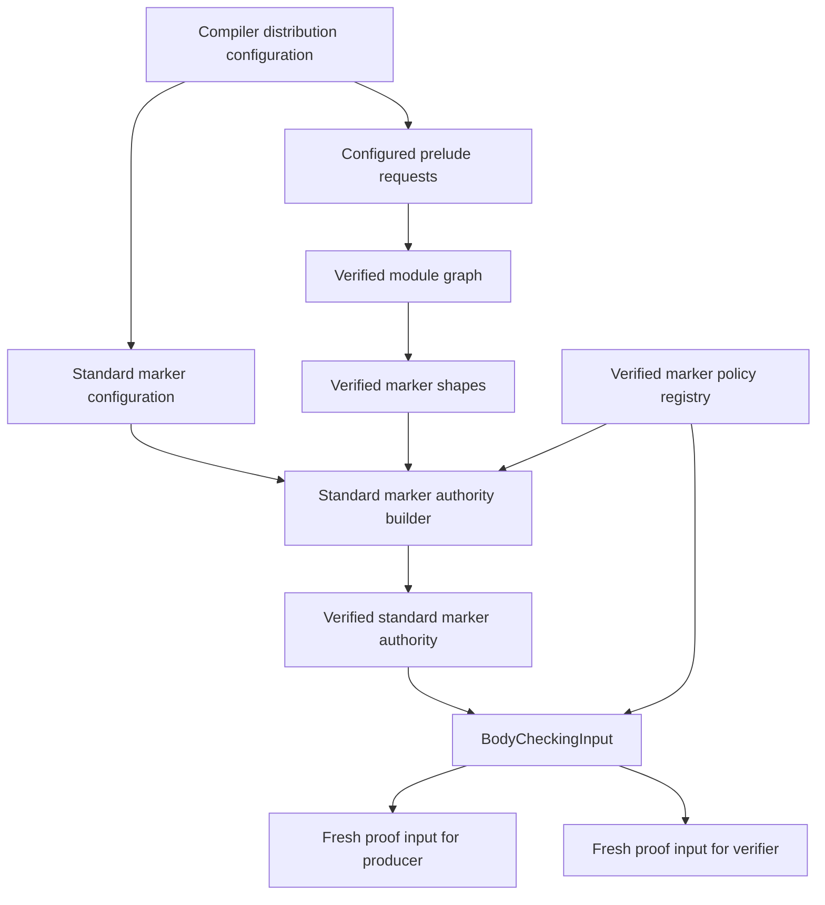

# RFC 0024: Standard Marker Authority

## Summary

This RFC binds the semantic roles `Copy` and `Linear` to exact definitions in
one verified standard prelude. It introduces a closed distribution
configuration, production configured-prelude injection, a context-bound
verified authority, and one complete checker input carrying marker policy and
role authority together.

The compiler never discovers a standard marker from source spelling, path
text, a definition ordinal, a registry slot, or policy-map order. Ownership
overlay production and verification receive the same live checker input and
create separate proof contexts.

## Motivation

RFC 0005 requires standard markers to be ordinary verified prelude
definitions. RFC 0015 defines marker policy and proof. RFC 0007 requires the
ownership overlay to query canonical `Copy` and `Linear` definitions selected
by checked input.

The live path cannot satisfy that contract: module graph construction supplies
no configured prelude, checker startup installs an empty policy,
`BodyCheckingInput` has no policy or role authority, and ownership overlay
construction receives only Built MIR and registries. RFC 0015 describes the
derivation policy for a known marker but does not identify which definition
has a standard semantic role.

Move, initialization, logical-drop, and linear-obligation analysis cannot
publish sound facts until that authority gap is closed.

## Goals

- Bind `Copy` and `Linear` to complete RFC 0011 `DefinitionKey` values.
- Require both definitions to be closed markers owned by one verified prelude.
- Bind the roles to one context and exact RFC 0015 policy registry.
- Define the complete standard `Copy` policy rather than leaving move versus
  copy behavior to distribution implementation.
- Inject configured preludes through the production resolution query path.
- Make `BodyCheckingInput` the sole complete marker-proof input.
- Give overlay production and verification independent proof engines.
- Reject missing, duplicate, foreign, stale, or incompatible authority
  without partial publication.
- Keep all internal names, domains, schemas, and fixtures unversioned.

## Non-Goals

- Adding other standard marker roles.
- Changing marker declaration or implementation syntax.
- Allowing package-level role or policy overrides.
- Creating source-less marker definitions.
- Implementing ownership dataflow, borrow solving, cleanup elaboration, or
  native emission.
- Persisting proof capabilities or proof caches.

## Prior Art

### Rust Language Items

Rust language items bind compiler roles such as `Copy`, `Send`, and `Sync` to
definitions supplied by a library. The compiler retains a role-to-`DefId`
mapping, requires a bijection, and reports a missing required item instead of
guessing an ordinary path.

ZOM adopts the closed role set, real library identity, bijection, and
fail-closed behavior. ZOM uses complete distribution-supplied `DefinitionKey`
values rather than source attribute strings.

References:

- <https://rustc-dev-guide.rust-lang.org/lang-items.html>
- <https://doc.rust-lang.org/nightly/nightly-rustc/rustc_hir/lang_items/index.html>

### Swift Known Protocols

Swift has a closed `KnownProtocolKind` inventory for compiler-recognized
protocols such as `Sendable` and `BitwiseCopyable`, while those protocols
remain real standard-library declarations.

ZOM adopts the separation between a closed compiler role and a library
declaration. ZOM resolves an expanded definition identity through the frozen
registry and verified prelude provenance instead of performing name lookup.

References:

- <https://github.com/swiftlang/swift/blob/main/include/swift/AST/KnownProtocols.def>
- <https://github.com/swiftlang/swift/blob/main/stdlib/public/core/Sendable.swift>

These are the two directly relevant mature designs because both bind compiler
semantics to real library definitions. Predefined runtime-type tables are less
applicable to marker coherence and policy lineage.

## Guide-Level Explanation

The compiler distribution supplies one source-backed standard prelude bundle.
Its canonical repository source is `products/zomcore/Zom.toml` plus
`products/zomcore/src/prelude.zom`; the build installs that tree at
`share/zom/core`. The prelude contains ordinary declarations for `Copy` and
`Linear`. Every compiled module except the prelude itself receives one implicit
`Prelude` dependency edge.

The complete initial prelude source is:

```zom
export interface Copy {}
export interface Linear {}
```

The manifest and source are UTF-8 without a byte-order mark, use LF line
endings, contain no trailing spaces, and end with exactly one LF byte.

```text
StandardMarkerConfiguration {
  copy: DefinitionKey,
  linear: DefinitionKey,
}
```

Packages cannot redirect those roles to local interfaces. After module
discovery, identity freeze, binding, marker-shape classification, and policy
construction, the compiler resolves both keys and publishes an authority only
if they are distinct closed markers owned by the configured prelude and bound
to the exact policy lineage.



## Reference-Level Design

### Distribution Bootstrap

Compiler construction admits one `StandardPreludeDistribution` from the
installed `share/zom/core` directory through the existing manifest parser and
`SourceDirectoryMaterializer`:

```text
StandardPreludeDistribution {
  release: ResolverRelease,
  root: ResolverRoot,
  snapshot: ResolvedPackageSourceSnapshot,
  libraryTarget: TargetName,
  sourcePath: CanonicalRelativePath,
  modulePath: Sequence<ModulePathSegment>,
  expectedManifestDigest: Sha256Digest,
  expectedSourceDigest: Sha256Digest,
}
```

`StandardPreludeDistribution` is the admitted distribution capability used
throughout this RFC. There is no separate
`AdmittedCompilerDistribution` type. Its constructor is private and succeeds
only after the byte, manifest, resolver, snapshot, target, and root checks in
this section. The `expectedManifestDigest` and `expectedSourceDigest` fields
must equal the embedded constants below; they record what was admitted but are
never used as independent expectations by a verifier.

The canonical paths are:

- manifest: `products/zomcore/Zom.toml`;
- library root: `products/zomcore/src/prelude.zom`;
- installed distribution root: `share/zom/core`; and
- canonical module path: `core`.

Subject to that byte rule, the manifest text is exactly:

```toml
[package]
name = "zomcore"
version = "0.0.0"
edition = "2026"

[lib]
name = "core"
path = "src/prelude.zom"
```

The manifest has no dependency, feature, build-script, binary, test,
benchmark, or example table. Distribution admission selects exactly the
single `Library` target named `core` with canonical path
`src/prelude.zom`; an implicit target, another target, another package name,
another release, another edition, or another path is a distribution mismatch.
The package release is required by the package identity model and is not an
internal protocol or compatibility selector.

The trusted distribution constants are:

| Input | Bytes | SHA-256 |
|---|---:|---|
| `Zom.toml` | 108 | `3ec3417bca606a7cfbb588b7e177202ade5dcdec48cdff13ba6aea474000ab74` |
| `src/prelude.zom` | 52 | `a05fc153f772f0075ed4c8dd9d8affeecb3f01ea674786047e31778f439833a3` |

The production loader compares bytes read from disk against both embedded
digests before parsing or source materialization. The builder and independent
verifier each receive these compile-time constants, recompute both file
digests, and compare the parsed manifest and verified snapshot against the same
bytes. Neither the candidate, snapshot, manifest record, nor package resolver
supplies an expected digest. A candidate therefore cannot replace both content
and expectation.

The build and installed trees have the same executable-relative layout:

```text
bin/zomc
share/zom/core/Zom.toml
share/zom/core/src/prelude.zom
```

The top-level `CMakeLists.txt` loads `GNUInstallDirs`.
`products/zomlang/utils/zomc/CMakeLists.txt` sets only the `zomc` target's
`RUNTIME_OUTPUT_DIRECTORY` to
`${CMAKE_BINARY_DIR}/${CMAKE_INSTALL_BINDIR}` and installs that target to
`${CMAKE_INSTALL_BINDIR}`.
`products/zomcore/CMakeLists.txt` copies the bundle under
`${CMAKE_BINARY_DIR}/${CMAKE_INSTALL_DATADIR}/zom/core` and installs it under
`${CMAKE_INSTALL_DATADIR}/zom/core`; `zomc` is installed under
`${CMAKE_INSTALL_BINDIR}`. The CLI canonicalizes its own executable path,
ascends exactly one directory, and resolves `../share/zom/core`. It admits no
environment-variable override, current-working-directory lookup, source-tree
fallback, user package redirect, or search list. Unit tests construct the same
layout in a fixture root. Installation tests use `cmake --install` into a
temporary prefix and invoke that prefix's `bin/zomc`.

The distribution release and root are appended to the package resolver input
before resolution. The verified snapshot is appended to source materialization
input before `VerifiedPackageSessionInput::from`. The selected core library
target is appended to compilation-root selection. All three insertions are
mandatory and atomic. Missing files, a manifest mismatch, a source digest
mismatch, an unresolved core release, a missing core library target, or a
snapshot not selected by the exact resolution output rejects compiler
distribution admission. The package resolver is never retried without core.

After target selection and finalized core-root construction produce the exact
`CrateKey` and root `ModuleKey`, the session constructs:

```text
CompilerMarkerConfiguration {
  preludeTarget: ModuleKey,
  policies: MarkerPolicyConfiguration,
  standardMarkers: StandardMarkerConfiguration,
}
```

The session constructs the `Copy` and `Linear` `DefinitionIdentityRecord`
values from that exact module key, an empty enclosing-owner sequence,
`DefinitionKind::Interface`, `DefinitionNamespace::Type`, the configured
declared names `Copy` and `Linear`, respectively, and no overload header. Those
two ASCII spellings are closed compiler role metadata, not lookup paths. It
then computes their complete
`DefinitionKey` values. This is configuration construction, not source or
registry lookup. Binding must later publish definitions with exactly those
keys or authority verification fails. `MarkerPolicyConfiguration` remains
governed by RFC 0015 and is constructed from these computed keys.

No marker key exists before the finalized core root. No pre-resolution
configuration claims to carry a target-dependent `DefinitionKey`.
`CompilerSession::installVerifiedPackageInput` retains the moved
`VerifiedPackageSessionInput` in private session state. Standard-prelude root
construction, compiler-marker candidate construction, and independent
verification borrow that retained input in sequence; they do not attempt to
reuse the moved-from caller object. The retained input outlives the verified
compiler marker configuration and module-graph verification.

`StandardMarkerConfiguration` has three object fields. Exactly two fields,
`copy` and `linear`, enter its encoded payload; `revision` is derived and is
never encoded:

```text
StandardMarkerConfiguration {
  copy: DefinitionKey,
  linear: DefinitionKey,
  revision: StandardMarkerConfigurationRevision,
}
```

The canonical payload contains exactly the two 32-byte definition digests in
declaration order; the derived revision is not encoded. `from` and
`decodeCanonical` reject equal keys. `decodeCanonical` accepts exactly 64 bytes
and rejects truncation or trailing data. Because `DefinitionKey` is a digest,
configuration construction cannot inspect definition ownership. Prelude
ownership is validated only after identity freeze by the standard-marker
authority builder and verifier.

The revision is SHA-256 over:

```text
ASCII("zom.standard-marker-configuration")
0x00
Encode(copy)
Encode(linear)
```

`Encode` is the RFC 0011 canonical encoder. This unversioned domain and field
order are the complete current contract.

The independent configuration oracle uses a copy key of 32 `0x11` bytes and a
linear key of 32 `0x22` bytes. The encoded configuration is 64 bytes. The
complete 98-byte revision preimage is:

```text
7a6f6d2e7374616e646172642d6d61726b65722d636f6e66696775726174696f6e0011111111111111111111111111111111111111111111111111111111111111112222222222222222222222222222222222222222222222222222222222222222
```

Its SHA-256 is
`a7a61c9d642f12c50269af1525ab7b439bb723a8e3f9afe90a7172a33e6c2031`.
Tests construct this preimage without calling the production configuration
encoder or revision helper.

### Complete Standard Copy Policy

The live RFC 0015 policy cannot express an unconditional shared-reference rule
or raw-pointer rule. This RFC directly replaces its reference-policy schema
and raw-pointer exclusion. There is one representation and no decoder for the
removed representation:

```text
MarkerReferenceRule =
    Unconditional
  | Requires { marker: DefId }

MarkerReferenceConfigurationRule =
    Unconditional
  | Requires { marker: DefinitionKey }

MarkerPolicy {
  structuralSubjects: SortedUniqueSequence<MarkerStructuralSubject>,
  builtinPrimitives: SortedUniqueSequence<PrimitiveKind>,
  referenceRules: SortedMap<Mutability, MarkerReferenceRule>,
  rawPointerMutabilities: SortedUniqueSequence<Mutability>,
}
```

`Unconditional = 0x01` and `Requires = 0x02`. A reference-rule record is
`Encode(Mutability) || Encode(rule tag) || optional Encode(marker)`.
`rawPointerMutabilities` follows `referenceRules` in the policy record. Both
sequences use RFC 0011 `uint64be` counts, ascending canonical order, and
duplicate rejection.

`Unconditional` is valid only for `Mutability::Const`.
`MarkerPolicyConfiguration::from`, canonical decoding, registry construction,
the producer, and the independent verifier all reject
`Mutable -> Unconditional`. `Mutable -> Requires(marker)` remains
representable for other marker policies and uses ordinary
`ReferenceReferent` structural evidence. There is therefore no admitted
policy state that requires an unconditional mutable-reference proof absent
from `PolicySubjectKind`.

Ephemeral proof evidence adds:

```text
PolicySubjectKind =
    SharedReference
  | ConstRawPointer
  | MutableRawPointer

MarkerEvidence =
    Explicit { impl: ImplId }
  | Structural { components: SortedUniqueSequence<MarkerComponentEvidence> }
  | Builtin { primitive: PrimitiveKind }
  | PolicySubject { subject: PolicySubjectKind }
```

The `PolicySubject` evidence tag is `0x04`; its subject tags are
`SharedReference = 0x01`, `ConstRawPointer = 0x02`, and
`MutableRawPointer = 0x03`. It is valid only for a positive ephemeral proof
whose normalized subject has the exact encoded form and whose marker policy
contains the corresponding unconditional rule. It has no declaration span and
is never persisted in signature facts, module interfaces, coherence views, or
caches.

The standard `Copy` entry is exact:

- `structuralSubjects` contains `Tuple`, `Object`, `FixedArray`,
  `NominalStruct`, and `NominalEnum`;
- `builtinPrimitives` contains `I8`, `I16`, `I32`, `I64`, `U8`, `U16`,
  `U32`, `U64`, `Isize`, `Usize`, `F32`, `F64`, `Bool`, `Char`, `Str`,
  `Unit`, `Never`, and `Null`;
- `referenceRules` contains `Const -> Unconditional` and no `Mutable` entry;
  and
- `rawPointerMutabilities` contains `Const` and `Mutable`.

`Any`, function, union, intersection, dynamic-array, slice, nominal-class,
error, existential, interface-bound, type-parameter, and unresolved subjects
have no automatic `Copy` proof. A structural subject is `Copy` exactly when
every RFC 0015 component query returns positive `Copy` evidence. A shared
reference is `Copy` independently of its referent type because copying it
duplicates only the non-owning borrow handle; borrow lifetime legality remains
an RFC 0007 obligation. A mutable reference is not automatically `Copy`.
Either raw-pointer mutability is `Copy` because copying it duplicates only an
unsafe non-owning address.

Before a `NominalStruct` or `NominalEnum` structural query, the producer and
proof verifier independently inspect the frozen definition registry plus local
and imported verified signatures for a direct owned
`DefinitionKind::Destructor`. Presence of one makes the query `Unsatisfied`
before field or payload recursion. This is the checker-side form of RFC 0007's
rule that a direct logical-drop action requires not-positive `Copy`.

A source-authored positive implementation of the verified standard `Copy`
definition for a nominal subject with a direct declared deinitializer is
rejected before explicit marker publication:

| Diagnostic | Stage | Message | Primary |
|---|---|---|---|
| `ZOM4099 CopyImplConflictsWithLogicalDrop` | `Signature` | `A type with a deinitializer cannot implement Copy` | complete marker-impl `impl` token span |

The diagnostic has error severity, zero display arguments, no notes, `None`
recovery, and `SignatureClassification` producer. Its `primaryNode` is the
exact `MarkerImpl` declaration node from the independently reconstructed RFC
0018 implementation occurrence. Its `primarySpan` is that declaration's exact
`impl` token span. Its source authority and RFC 0017 primary provenance are
`IdentitySyntaxSite(source.site)` from the same reconstructed occurrence;
candidate-carried nodes, spans, and ranges are never source authority.

Its `CheckerEmitterOrdinal` uses signature stage tag `0x01`; both
`ownerSchemaPreorder` and `siteSchemaPreorder` are the independently verified
schema-preorder index of that `MarkerImpl` declaration; and `itemOrdinal` is
zero. Its RFC 0017 `DiagnosticOccurrenceKey` uses the occurrence's module
diagnostic root, signature stage `0x01`,
`ImplementationOwner(source.implementation)`,
`SignatureClassification = 0x15`, and the complete `source.site`
`IdentitySyntaxSiteKey`.

Parser rejection suppresses every checker diagnostic for the declaration. A
failed interface signature, including `ZOM4090`, suppresses all dependent impl
diagnostics. For an admitted interface signature, `ZOM4088` or `ZOM4089`
precedes and suppresses `ZOM4091`, `ZOM4092`, and `ZOM4099`; `ZOM4091`
precedes and suppresses `ZOM4092` and `ZOM4099`; `ZOM4092` precedes and
suppresses `ZOM4099`; and `ZOM4099` precedes and suppresses marker
`ZOM4054` orphan checking and local `ZOM4017` conflict checking. An invalid
deinitializer signature never establishes a direct declared deinitializer for
this rule and its earlier source rejection suppresses dependent marker
publication. A rejected `ZOM4099` occurrence publishes no marker fact,
module-interface marker entry, or coherence input. Negative `Copy` evidence is
unaffected. A mismatched stage, producer, node, span, provenance, ordinal,
recovery handle, note list, precedence result, or retained publication is an
invalid checked fact. The rule identifies `Copy` only through
`VerifiedStandardMarkerAuthority`; a local interface named `Copy` does not
trigger it.
`ZOM4099` follows RFC 0022's reserved `ZOM4096-ZOM4098` range and does not
reuse any registered or active-review diagnostic ID.

`Linear` has no policy entry. It remains explicit-only. A negative explicit
fact continues to win before policy proof. The compiler distribution must
construct exactly one policy entry, for the configured `Copy` key, with the
fields above; an additional, missing, or changed entry rejects distribution
admission.

The standalone standard policy is 59 bytes:

```text
0000000000000005010203040500000000000000120102030405060708090a0b0c0d0e0f1011130000000000000001010100000000000000020102
```

Its SHA-256 is
`fe87a9f15c561769c1527069f4121d2fd8f597d9a0308a61fa2a302284ad740b`.
The independent configuration oracle uses marker key 32 times `0x11`. Its
complete 139-byte RFC 0015 configuration-revision preimage is:

```text
7a6f6d2e6d61726b65722d706f6c6963792d636f6e66696775726174696f6e000000000000000001000000000000005b11111111111111111111111111111111111111111111111111111111111111110000000000000005010203040500000000000000120102030405060708090a0b0c0d0e0f1011130000000000000001010100000000000000020102
```

Its SHA-256 is
`a6513b8f9aa35e211a8c4ef9043ec1786caf3493adeaa3cb696ef7a23132f229`.
The independent registry oracle uses zero context, that configuration
revision, a shape revision of 32 `0x33` bytes, and marker handle payload `a1`.
Its complete 199-byte preimage is:

```text
7a6f6d2e6d61726b65722d706f6c6963792d7265676973747279000000000000000000000000000000000000000000000000000000000000000000a6513b8f9aa35e211a8c4ef9043ec1786caf3493adeaa3cb696ef7a23132f22933333333333333333333333333333333333333333333333333333333333333330000000000000001000000000000003ca10000000000000005010203040500000000000000120102030405060708090a0b0c0d0e0f1011130000000000000001010100000000000000020102
```

Its SHA-256 is
`068486e5a60e53943b0344ffd644d00110b726d247ad5b558e0b8546c48e90bc`.
Native tests construct all three byte vectors without production policy,
configuration, registry, or revision helpers.

The RFC 0005 and RFC 0015 policy schemas, evidence tags, canonical vectors,
proof rules, and raw-pointer rules are exactly the contracts defined here.
Policy configuration and registry decoding accept only these canonical
records.

### Verified Compiler Marker Configuration

After the core `ModuleKey` freezes, the session constructs this immutable
input:

```text
CompilerMarkerConfigurationInput {
  distribution: const StandardPreludeDistribution&,
  packageInput: const VerifiedPackageSessionInput&,
  coreRoot: const package::FinalizedCompilationRoot&,
  coreModule: const ModuleKey&,
}
```

The expected package name, release, edition, library target name, target kind,
target path, manifest digest, and source digest are the compile-time constants
fixed by this RFC. They are not fields of this input or candidate.
`packageInput` is a borrow of the session-retained verified package input, not
a reconstructed or moved-from caller object. `coreRoot` uses the existing
production `package::FinalizedCompilationRoot` type.

The promotion boundary is complete:

```text
CompilerMarkerConfigurationCandidate {
  preludeTarget: ModuleKey,
  policyConfiguration: MarkerPolicyConfiguration,
  standardMarkers: StandardMarkerConfiguration,
  revision: CompilerMarkerConfigurationRevision,
}

CompilerMarkerConfigurationFailure =
    Package { failure: PackagePipelineFailure }
  | InputReceiptMismatch
  | CompilationRootMismatch
  | CoreModuleMismatch
  | MissingRequiredRole
  | DuplicateRole
  | InvalidRoleDefinition
  | StandardPolicyMismatch
  | StaleRevision
  | CanonicalCodecMismatch

CompilerMarkerConfigurationBuildResult =
    Candidate { value: CompilerMarkerConfigurationCandidate }
  | Rejected {
      failures: SortedNonEmptySequence<CompilerMarkerConfigurationFailure>
    }

CompilerMarkerConfigurationVerificationResult =
    Verified { value: VerifiedCompilerMarkerConfiguration }
  | Rejected {
      failures: SortedNonEmptySequence<CompilerMarkerConfigurationFailure>
    }

VerifiedCompilerMarkerConfiguration {
  preludeTarget: ModuleKey,
  policyConfiguration: MarkerPolicyConfiguration,
  standardMarkers: StandardMarkerConfiguration,
  revision: CompilerMarkerConfigurationRevision,
}
```

`CompilerMarkerConfigurationBuilder::build(input)` reconstructs the complete
candidate from the immutable input.
`CompilerMarkerConfigurationVerifier::verify(candidate, input)` independently
revalidates the admitted distribution against the embedded manifest and
source digests, revalidates the package receipt and selected compilation root,
derives the frozen core module, constructs both definition keys, constructs
the exact standard policy, and recomputes all three configuration revisions.
It compares every candidate field only after reconstructing the expected
value. No candidate field selects a package, target, module, definition,
policy, lookup, or expected revision. The two passes may share immutable input
capabilities, record types, and canonical codec helpers, but no lookup result,
memo table, reconstructed expected object, or validation result.

The complete expanded module and definition keys bind package, release, crate
target, compilation, path, and declared definition identity. An input or
candidate mismatch returns `Rejected` under the exhaustive failure
mapping below and publishes no capability.

`CompilerMarkerConfigurationRevision` is SHA-256 over:

```text
ASCII("zom.compiler-marker-configuration")
0x00
Frame(Encode(preludeTarget))
MarkerPolicyConfigurationRevision
StandardMarkerConfigurationRevision
```

The independent oracle uses the same valid 171-byte RFC 0011 module-key
fixture, the standard policy configuration revision
`a6513b8f9aa35e211a8c4ef9043ec1786caf3493adeaa3cb696ef7a23132f229`,
and the standard-marker configuration revision
`a7a61c9d642f12c50269af1525ab7b439bb723a8e3f9afe90a7172a33e6c2031`.
Its complete 277-byte preimage is:

```text
7a6f6d2e636f6d70696c65722d6d61726b65722d636f6e66696775726174696f6e0000000000000000ab030000000000000000000000000000000000000001610000000000000005302e302e3000000000000000000100000000000000036c69620200000000000000017800000000000000017600000000000000016f00000000000000016500000000000000016100000040010000000000000000000007ea010000011111111111111111111111111111111111111111111111111111111111111111000000000000000100000000000000016da6513b8f9aa35e211a8c4ef9043ec1786caf3493adeaa3cb696ef7a23132f229a7a61c9d642f12c50269af1525ab7b439bb723a8e3f9afe90a7172a33e6c2031
```

Its SHA-256 is
`5696089b36f40d30a64f948bd821d971712f6b4ac29951e3ca6738c4a8002db7`.
Tests construct the preimage without the production builder or revision
helper.

The stable module graph receives configured Prelude topology only through
crate-keyed `ConfiguredPreludeInput`. Every non-core crate has one present
target equal to its exact projected `core::prelude`; every core crate has one
explicit-absence value. `ModuleDependencyRequests(module)` derives one stable
Prelude request for each selected non-core module and none for a core module.
Neither the stable graph queries nor the final-snapshot Binder bridge receive
marker configuration as topology authority.

### Configured Prelude Injection

The independently verified `VerifiedModuleGraphInputTransaction` reconstructs
the complete configured-Prelude family from the frozen package and projected
core inventories. The stable request carries only its canonical
`ModuleResolutionKey`; it carries no source site or configuration digest.
`ModuleDependencies` demands `ResolveModuleRequest` and requires exactly one
candidate byte-equal to the configured target.

After the final snapshot barrier, `VerifiedModuleGraphBuilder` and
`VerifiedModuleGraphVerifier` independently re-demand each configured Prelude
and resolution, expand the selected target through the frozen module registry,
construct one revision-local Prelude request with no syntax site, and require
its stable edge projection to occur in `ModuleGraphRecord`.

The prelude receives no self-edge. A missing target, a target outside the
resolved module set, missing or ambiguous resolution, an additional Prelude
edge, or multiple targets rejects the graph. The session never retries without
the configured Prelude. Marker-policy revisions remain part of marker
authority and ownership proof; they do not enter stable request identity or
the revision-local Binder request.

### Verified Authority

The checker publishes:

```text
VerifiedStandardMarkerAuthority {
  semanticContext: SemanticContextBrand,
  contextFingerprint: ContextFingerprint,
  configurationRevision: StandardMarkerConfigurationRevision,
  markerShapeRevision: MarkerShapeInventoryRevision,
  markerPolicyRevision: MarkerPolicyRegistryRevision,
  prelude: ModuleId,
  copy: DefId,
  linear: DefId,
  revision: StandardMarkerAuthorityRevision,
}
```

The promotion boundary is:

```text
StandardMarkerAuthorityCandidate {
  semanticContext: SemanticContextBrand,
  contextFingerprint: ContextFingerprint,
  configurationRevision: StandardMarkerConfigurationRevision,
  markerShapeRevision: MarkerShapeInventoryRevision,
  markerPolicyRevision: MarkerPolicyRegistryRevision,
  prelude: ModuleId,
  copy: DefId,
  linear: DefId,
  revision: StandardMarkerAuthorityRevision,
}

StandardMarkerAuthorityBuildResult =
    Candidate { value: StandardMarkerAuthorityCandidate }
  | InvariantRejected {
      failures: SortedNonEmptySequence<CheckerVerificationFailure>
    }

StandardMarkerAuthorityVerificationResult =
    Verified { value: VerifiedStandardMarkerAuthority }
  | InvariantRejected {
      failures: SortedNonEmptySequence<CheckerVerificationFailure>
    }
```

`StandardMarkerAuthorityBuilder::build(input)` reconstructs the candidate from
immutable input. `StandardMarkerAuthorityVerifier::verify(candidate, input)`
independently resolves configured module and definition keys, rechecks graph,
shape, policy, and registry lineage, recomputes the complete candidate,
compares every field, and only then promotes it. The verifier never uses a
candidate field to choose a lookup key or expected inventory. The two passes
may share only immutable input capabilities and canonical codec helpers.

The builder independently requires:

1. one semantic context and fingerprint across all inputs;
2. one exact configured prelude module;
3. exactly one prelude edge from every ordinary module and none from the
   prelude;
4. distinct resolved `copy` and `linear` definitions;
5. both definitions owned by the configured prelude;
6. both definitions classified `ClosedMarker`;
7. one `copy` policy entry byte-identical to the complete standard policy in
   this RFC;
8. no policy entry for `linear`; and
9. exact recomputed configuration, shape, policy, and authority revisions.

The authority revision is SHA-256 over:

```text
ASCII("zom.standard-marker-authority")
0x00
ContextFingerprint
StandardMarkerConfigurationRevision
MarkerShapeInventoryRevision
MarkerPolicyRegistryRevision
Frame(Encode(prelude ModuleKey))
Encode(copy DefinitionKey)
Encode(linear DefinitionKey)
```

Expanded keys, never process-local handles, enter the preimage.
`Frame(bytes)` is RFC 0011 `uint64be(length) || bytes`.

The independent framing oracle uses a zero context fingerprint, the
configuration revision
`a7a61c9d642f12c50269af1525ab7b439bb723a8e3f9afe90a7172a33e6c2031`,
a shape revision of 32 `0x33` bytes, a policy revision of 32 `0x44` bytes, the
171-byte valid RFC 0011 `ModuleKey` fixture from
`source-key-test.cc`, a copy key of 32 `0x11` bytes, and a linear key of 32
`0x22` bytes. Reusing the independently fixed RFC 0011 payload isolates this
oracle to authority field order and framing while still exercising a valid
module key. The complete 401-byte preimage is:

```text
7a6f6d2e7374616e646172642d6d61726b65722d617574686f72697479000000000000000000000000000000000000000000000000000000000000000000a7a61c9d642f12c50269af1525ab7b439bb723a8e3f9afe90a7172a33e6c20313333333333333333333333333333333333333333333333333333333333333333444444444444444444444444444444444444444444444444444444444444444400000000000000ab030000000000000000000000000000000000000001610000000000000005302e302e3000000000000000000100000000000000036c69620200000000000000017800000000000000017600000000000000016f00000000000000016500000000000000016100000040010000000000000000000007ea010000011111111111111111111111111111111111111111111111111111111111111111000000000000000100000000000000016d11111111111111111111111111111111111111111111111111111111111111112222222222222222222222222222222222222222222222222222222222222222
```

Its SHA-256 is
`be693be2ea4598b0c0b4808e8eba335de87559d7df5b78f5e6de5fc96a71de97`.
Tests construct this preimage and digest without production authority encoding
or revision helpers.

### Checker And Proof Input

`SignatureCheckingInput` receives
`const VerifiedStandardMarkerAuthority&` so source marker classification can
apply `ZOM4099` to the exact standard `Copy` identity before publishing
explicit facts. Its verifier binds the authority to the same context,
fingerprint, frozen definitions, marker shapes, and policy registry used by
signature construction.

`BodyCheckingInput` directly includes:

```text
markerPolicies: const VerifiedMarkerPolicyRegistry
standardMarkers: const VerifiedStandardMarkerAuthority
```

Its verifier requires both capabilities to match the bound module, context,
fingerprint, signatures, imports, coherence view, registries, semantic store,
and policy revision.

The sole proof constructor becomes:

```text
MarkerProofInput::from(const BodyCheckingInput&)
```

No overload accepts a separate policy, role map, registry, store, signature
view, or coherence view. Consumers call `standardMarkers.copy()` and
`standardMarkers.linear()` for those roles. The proof input retains the body's
bound module, frozen definition registries, local signatures, and imported
signature view so nominal structural proof can independently enumerate direct
owned deinitializers without source-name lookup.

### Ownership Overlay Boundary

The direct replacement input is:

```text
OwnershipEventOverlayInput {
  checked: const OwnershipAdmittedCheckedModule,
  hir: const VerifiedHirModule,
  built: const VerifiedBuiltMir,
  body: const BodyCheckingInput,
}
```

The producer and verifier each construct a fresh proof input and engine from
`body`. They share no active stack, memo, proof result, traversal decision, or
candidate inventory. The body and all referenced capabilities remain live
until both passes finish; the overlay stores no borrow.

Any context, fingerprint, source, receipt, signature, import, coherence,
policy, standard-marker, checked, HIR, or MIR mismatch rejects before
candidate publication. A proof invariant rejects the complete operation.

### Session Publication

`CompilerSession::checkSources()` retains staged body requirement inventories
and constructs one body input per module. The same input is used for body
checking and overlay production and verification.

Marker shapes, policies, standard-marker authority, signatures, coherence,
checked evidence, HIR, MIR, and overlays move into session state only after all
modules succeed. The production `explicitOnly()` call and empty configured-
prelude sequence are deleted. No optional authority or fallback remains.

### Failure Mapping

Distribution manifest, source, resolution, or snapshot failures use the
existing RFC 0012 package failure algebra and reject before package-session
installation. `StandardMarkerConfiguration::from` and `decodeCanonical`
return `none` for malformed payloads or equal keys.

Compiler-marker configuration promotion occurs before a valid checker
`ModuleId` or checker stage exists and therefore never fabricates a
`CheckerInvariantFact`. Its builder and verifier return the closed
`CompilerMarkerConfigurationFailure` algebra above. `Package` preserves the
exact RFC 0012 failure and has precedence over configuration failures. The
remaining single-valued precedence is `InputReceiptMismatch`,
`CompilationRootMismatch`, `CoreModuleMismatch`, `StaleRevision`,
`CanonicalCodecMismatch`, `MissingRequiredRole`, `DuplicateRole`,
`InvalidRoleDefinition`, then `StandardPolicyMismatch`. Pairwise mutations
cover every adjacent boundary. Both passes receive the same immutable input
but construct their failure sequences independently; a failure publishes no
configuration capability.

Prelude request and graph inconsistency maps to RFC 0004 `InvalidPrelude`.
The standard-marker authority builder and verifier run after valid
`ModuleId` values, identity registries, and checker input receipts exist. They
return `InvariantRejected` carrying the existing sorted non-empty
`CheckerVerificationFailure` sequence. Their applicable RFC 0005 precedence
is single-valued and exact:

1. invalid, foreign, wrong-tag, out-of-range, or wrong-context identity or
   semantic-store handles preserve the exact RFC 0011 `IdentityInvariant`;
2. swapped distribution, package, graph, source, binding, shape, policy,
   signature, coherence, checked, HIR, or MIR receipts are
   `InputReceiptMismatch`;
3. a candidate or verified capability revision that differs from independent
   recomputation is `StaleRevision`; and
4. an unknown tag, wrong field order, malformed canonical record, unsorted or
   duplicate canonical sequence, truncation, trailing bytes, or fixed byte
   oracle mismatch is `CanonicalCodecMismatch`;
5. a missing prelude, role definition, shape, policy, edge, or required field
   is `MissingRequiredFact`;
6. an equal role key, duplicate role, duplicate edge, additional policy entry,
   or additional configured prelude is `AdditionalFact`; and
7. wrong definition ownership, kind, marker shape, exact policy content, or
   forbidden candidate payload is `InvalidFact`.

The RFC 0005 `ViewMismatch`, `InferenceLifecycle`, `InvalidEmitterOrdinal`,
and `SolverStateInvalid` categories have no representable state in either
promotion input or candidate and therefore cannot be selected at these
boundaries. Pairwise mutation tests cover each adjacent applicable precedence
boundary. A revision mismatch never maps to `CanonicalCodecMismatch`, and an
identity failure is never collapsed into a checker invariant.

An ownership-boundary lineage mismatch maps to RFC 0007
`InputRevisionMismatch` at `OwnershipProofValidation`. No failure publishes a
partial authority or overlay.

### RFC 0025 Source-Backed Core Synchronization

The RFC 0025 acceptance transaction is bound to proposal SHA-256
`4f4085c176a9f391115e12170da93af899e350fa92440d5a51577692faf8bad0`.
This RFC remains normative for `Copy` and `Linear` semantics, policy, authority,
proof input, failure precedence, and one consumer prelude edge. The following
table atomically replaces only the listed distribution, source-layout,
identity, resolver, bootstrap, publication, and installation contracts; every
conflicting spelling elsewhere in this RFC is non-authoritative.

| RFC 0024 Surface | Replacement |
|---|---|
| `Distribution Bootstrap` and `StandardPreludeDistribution` | `VerifiedCoreDistribution`, exact three-source record, unversioned toolchain unit, executable-relative source root, and `ZOM7101`/`ZOM7102` |
| Fixed `Zom.toml` and `src/prelude.zom` bytes and digests | Exact `core.zom`, `core/marker.zom`, and `core/prelude.zom` bytes plus `CoreDistributionRecord` and its accepted golden digest |
| Resolver release, root, snapshot, feature, and lockfile injection | Separate mandatory toolchain distribution input; no RFC 0012 release or lock graph entry |
| `Verified Compiler Marker Configuration` distribution fields | Hashed `CoreRoleIdentityTemplate` records expanded to exact `DefinitionKey` values after core identity freeze |
| `Configured Prelude Injection` | One `ConfiguredCratePrelude` per non-core consumer crate and one derived prelude request per non-core module |
| Core signature bootstrap | Publish `VerifiedCoreRoleSeed`, construct imported signatures only from verified bootstrap interfaces, use `CoreSignatureCheckingInput` for the closed initial signature algebra, derive core-scoped shape and policy state from tracked projections, then materialize final authority and finalize ordinary module interfaces one way |
| `Verified Authority` owner and context lineage | Preserve `VerifiedStandardMarkerAuthority` with `CoreSemanticContextFingerprint` plus core-scoped shape and policy revision types; consume the aggregate authority query, role seed, frozen core identities, and exact prelude re-exports without reading whole-session inventories or an ordinary consumer graph |
| RFC 0015 inventory relationship | Build whole-session marker inventories after ordinary binding and require their core-role projection to equal the core-scoped authority entries |
| `Session Publication` distribution capability | `VerifiedCoreLibrarySet` stores only the verified distribution digest and is published before ordinary module checking |
| Distribution-related `Failure Mapping` | Closed `CoreLibraryFailure`, `CoreRoleSeedFailure`, and `diagnostics-core.def`; marker-policy failures remain unchanged |
| Qualified-name, policy inference, and compiler-only alternatives | Retain rejection of spelling discovery, source-less declarations, and separate policy paths |
| Acceptance, implementation, test, and tracker file lists | Replace manifest/two-file/three-install-file assumptions with the source inventory, identity oracles, installed consumer, mutation matrix, and core architecture gate in RFC 0025 |

No package-backed field or test expectation remains after the RFC 0025
implementation transaction.

## Repository Impact

| Area | Paths | Owner |
|---|---|---|
| RFC governance | `docs/rfc/**` | `rfc` |
| Product ownership routing | `.codex/subagents/manifest.yaml`, `.codex/subagents/README.md` | `task-router` |
| Standard prelude declarations | `products/zomcore/src/**` | `runtime-memory` |
| Standard prelude manifest and admission | `products/zomcore/Zom.toml`, `products/zomlang/compiler/driver/**` | `module-system` |
| Standard prelude build and install layout | `CMakeLists.txt`, `products/zomcore/CMakeLists.txt`, `products/zomlang/utils/zomc/CMakeLists.txt` | `ir-backend` |
| Marker authority and checker inputs | `products/zomlang/compiler/checker/signature-facts.*`, `marker-proof.*`, `body-checker.*` | `binder-checker` |
| Copy/drop source diagnostic contract | `products/zomlang/compiler/checker/checker-source-diagnostics.def`, diagnostic documentation and snapshots | `error-system` |
| Prelude graph, session, identity, package input | `products/zomlang/compiler/driver/**`, `products/zomlang/compiler/identity/**`, `products/zomlang/compiler/binder/module-*` | `module-system` |
| Event overlay | `products/zomlang/compiler/ownership/**` | `runtime-memory` |
| Specification and architecture | `docs/spec/**`, `docs/design/**` | `spec-audit` |
| Native tests and gates | `products/zomlang/tests/**`, `scripts/check-*-architecture.py` | `verification` |

## Security And Safety Impact

Guessing `Copy` could duplicate a move-only resource; guessing `Linear` could
omit or invent an exactly-once obligation. This authority prevents local
lookalikes, stale policies, and mixed sessions from influencing ownership.

Configuration and verified authority are immutable and not user-overridable.
Proof capabilities are call-duration, non-copyable, and non-persistable.
Failure is atomic.

## Drawbacks And Risks

- Every package-session fixture must contain a real standard prelude.
- Configured prelude edges change module graphs and incremental dependencies.
- The session retains staged checker inputs through overlay verification.
- Move-only keys and capabilities make construction order sensitive.
- The repository must add its first production standard-library source root.

One configuration object, one verified authority, and direct API replacement
contain the blast radius.

## Alternatives Considered

### Qualified-Name Lookup

This would make spelling, import visibility, and lookup policy part of
ownership identity. Complete keys plus verified provenance are deterministic.

### Policy-Shape Inference

Several markers can have the same policy shape. Policy describes derivation,
not semantic role.

### Distribution `DefId` Values

`DefId` is context-local and unavailable before identity freeze. Expanded keys
are stable configuration identities.

### Compiler-Only Marker Definitions

Source-less definitions would bypass prelude, binding, shape, visibility,
signature, and coherence verification.

### Separate Policy Parameter

Separate parameters allow callers to combine capabilities from different
lineages. The body input is the complete proof authority.

## Compatibility And Rollout

There is no released compiler or persisted artifact contract. Implementation
directly replaces empty production configuration and incomplete APIs:

1. add a source-backed standard prelude and distribution configuration;
2. inject configured-prelude requests;
3. publish standard-marker authority;
4. replace body and proof inputs;
5. replace ownership overlay input;
6. publish marker-use and logical-drop inventories; and
7. delete empty, optional, and separately supplied authority paths.

No adapter, dual path, deprecation marker, fallback, or negotiation is added.

## Documentation And Teaching Plan

- In the acceptance transaction, replace RFC 0004's prelude-revision equality
  and candidate-carried expected revision with the two independent verifier
  inputs in this RFC.
- In the same transaction, replace RFC 0005 and RFC 0015 marker-policy,
  evidence-tag, raw-pointer, direct-deinitializer, `ZOM4099`, proof, and
  canonical-vector clauses with the complete schema and vectors in this RFC.
- Replace RFC 0007's normative ownership-overlay input, builder, verifier, and
  proof-construction APIs with the complete body-input contract in this RFC.
- Update RFC 0004, 0005, 0007, and 0015 trackers with exact production
  evidence.
- Update `docs/design/compiler-contracts.md` with the authority chain.
- Replace Chapter 3's generic marker auto-derivation section with the rule
  that only a marker's verified policy authorizes automatic proof and an
  absent policy entry is explicit-only.
- State in Chapter 3 that `Copy` is automatic for the exact primitive,
  structural, shared-reference, and raw-pointer subjects listed in this RFC;
  mutable references and all omitted subjects are not automatically `Copy`.
- State in Chapters 3 and 14 that `Linear` is explicit-only, shared references
  duplicate only a borrow handle, raw pointers duplicate only an unsafe
  address, and product or sum derivation is marker-specific rather than
  universal.
- Run the full spec-alignment gate before landing.

## Operational Readiness

The prelude source snapshot becomes a required compiler-distribution input.
Packaging tests must prove deterministic discovery and fail-closed absence.
Incremental tests must prove target and policy changes invalidate affected
queries. No runtime service, network access, or persistent cache is added.

## Acceptance Criteria

- Every listed owner approves the exact proposal.
- A real source-backed prelude declares configured `Copy` and `Linear`.
- Build-tree and installed `bin/zomc` discover the same executable-relative
  `share/zom/core` layout, and missing or mismatched layout fails closed.
- Every ordinary module has one verified prelude edge and the prelude has none.
- Production policy is byte-identical to the complete standard `Copy` policy
  and has no `Linear` entry.
- The policy proves every listed builtin, recursive structural subject, shared
  reference, and raw pointer as specified, and rejects mutable-reference and
  omitted-subject automatic `Copy`.
- A nominal type with a direct declared deinitializer is never automatically
  `Copy`, and positive explicit standard-`Copy` evidence emits `ZOM4099` and
  publishes no fact.
- Authority rejects missing, equal, foreign, wrong-shape, wrong-policy, stale,
  and cross-context inputs.
- RFC 0004, RFC 0005, RFC 0007, and RFC 0015 normative text, schemas, APIs,
  and canonical vectors are atomically synchronized with their replacements
  in this RFC before the status becomes `ACCEPTED`.
- Chapter 3 and Chapter 14 exactly match RFC 0015 policy authority and the
  verified `Copy`/`Linear` role path; no unconditional generic marker
  derivation remains.
- Body input carries policy and standard-marker authority together.
- Marker proof has one constructor from body input.
- Overlay producer and verifier use independent proof engines.
- Marker-use and logical-drop facts carry exact marker, policy, and coherence
  identities.
- Session publication is atomic.
- Native build, sanitizer, unit, lit, architecture, format, RFC, and repository
  policy gates pass.

## Implementation Plan

1. Add
   `products/zomlang/tests/unittests/compiler/checker/standard-marker-authority-test.cc`
   with configuration, codec, authority, mutation, and both independent
   revision oracles.
2. Add `products/zomcore/Zom.toml` and
   `products/zomcore/src/prelude.zom`; make
   `products/zomcore/CMakeLists.txt` install the source-backed bundle under
   `share/zom/core`; load `GNUInstallDirs` in the top-level `CMakeLists.txt`;
   and make the `zomc` target materialize the identical build-tree layout.
3. Route `products/zomcore/src/**` to `runtime-memory`,
   `products/zomcore/Zom.toml` to `module-system`, and
   `products/zomcore/CMakeLists.txt` to `ir-backend` in
   `.codex/subagents/manifest.yaml` and `.codex/subagents/README.md`. In the
   same routing transaction, exclude
   `products/zomlang/compiler/checker/checker-source-diagnostics.def` from
   `binder-checker` and add that exact path to `error-system`; route the
   top-level `CMakeLists.txt` change to `ir-backend`.
4. Replace the RFC 0015 policy, evidence, codec, and proof structures and their
   callers with the complete schema in this RFC.
5. Make verified compiler marker configuration mandatory package-session
   input.
6. Inject configured preludes through incremental resolution and graph
   verification.
7. Implement and independently verify standard-marker authority.
8. Add signature authority, direct-deinitializer exclusion, and `ZOM4099`,
   then replace body and proof inputs and all callers. Add the paired
   `products/zomlang/tests/conformance/corpus/09-interfaces/copy_impl_deinitializer_conflict_neg_34.zom`
   and
   `products/zomlang/tests/conformance/expectations/diagnostics/09-interfaces/copy_impl_deinitializer_conflict_neg_34.check`
   diagnostics lit files.
9. Replace ownership overlay input with checked/HIR/MIR/body capabilities.
10. Implement independent Copy/Linear queries, marker uses, and logical drops.
11. Create `scripts/check-rfc0007-architecture.py`, register its positive and
    negative self-tests in
    `products/zomlang/tests/conformance/CMakeLists.txt`, and make each required
    invariant independently mutable by the self-test.
12. Align RFC 0004, RFC 0005, RFC 0007, RFC 0015, Chapters 3 and 14 with this
    accepted policy and authority path,
    then run the `spec-alignment` workflow.
13. Delete empty production paths and incomplete overloads, synchronize
    trackers and design docs, and run every canonical gate.

## Test Plan

The new unit suite is
`products/zomlang/tests/unittests/compiler/checker/standard-marker-authority-test.cc`.
Distribution layout and admission tests are
`products/zomlang/tests/unittests/compiler/driver/standard-prelude-distribution-test.cc`
and
`products/zomlang/tests/cmake/verify-standard-prelude-install.cmake`.
The focused existing suites are:

- `products/zomlang/tests/unittests/compiler/checker/marker-proof-test.cc`;
- `products/zomlang/tests/unittests/compiler/ownership/ownership-event-overlay-test.cc`;
- `products/zomlang/tests/unittests/compiler/driver/compiler-session-package-test.cc`;
  and
- `products/zomlang/tests/unittests/compiler/driver/incremental-module-resolution-query-test.cc`.

`compiler-session-package-test.cc` adds public-session cases for scalar,
structural, shared-reference, mutable-reference, raw-pointer, explicit
`Linear`, direct-deinitializer, positive and negative explicit standard
`Copy`, and local `Copy`/`Linear` lookalike behavior. Diagnostic snapshots
use the paired
`products/zomlang/tests/conformance/corpus/09-interfaces/copy_impl_deinitializer_conflict_neg_34.zom`
and
`products/zomlang/tests/conformance/expectations/diagnostics/09-interfaces/copy_impl_deinitializer_conflict_neg_34.check`
files through the registered diagnostics runner and real
`zomc compile --syntax-only` workflow. The `.check` file asserts the exact
`ZOM4099` headline and rejects `ZOM4054` and `ZOM4017` for the same occurrence;
unit mutation cases cover every earlier suppression edge. These are native
semantic tests over the real package/session workflow. No unattached corpus
file is used as semantic evidence.

The implementation runs these exact native commands:

```text
cmake --preset sanitizer
cmake --build --preset sanitizer --target standard-marker-authority-test standard-prelude-distribution-test marker-proof-test ownership-event-overlay-test compiler-session-package-test incremental-module-resolution-query-test
ctest --preset default -R '^(standard-marker-authority-test|standard-prelude-distribution-test|standard-prelude-install-layout|marker-proof-test|ownership-event-overlay-test|compiler-session-package-test|incremental-module-resolution-query-test)$' --output-on-failure
cmake --build --preset sanitizer
ctest --preset default --output-on-failure
```

`standard-prelude-install-layout` invokes
`cmake --install build-sanitizer --prefix <fresh-test-prefix>` through the
registered CMake test, requires exactly
`bin/zomc`, `share/zom/core/Zom.toml`, and
`share/zom/core/src/prelude.zom`, creates one consumer fixture under that same
test prefix, and invokes
`<fresh-test-prefix>/bin/zomc compile --manifest-path <fixture>/Zom.toml --syntax-only`.
The invocation must admit the installed prelude through the production loader.
The test then removes only its own generated prefix.
`standard-prelude-distribution-test` exercises the equivalent build-tree
layout and independently mutates package name, release, edition, target kind,
target name, target path, each embedded expected digest, each on-disk byte
sequence, missing files, and executable-relative location.

The architecture commands are:

```text
python3 scripts/check-checker-architecture.py --check
python3 scripts/check-compiler-session-architecture.py --check
python3 scripts/check-identity-architecture.py --check
python3 scripts/check-incremental-query-architecture.py --check
python3 scripts/check-ir-architecture.py --check
python3 scripts/check-package-architecture.py --check
python3 scripts/check-rfc0007-architecture.py --check
python3 scripts/check-rfc0007-architecture.py --self-test
```

The RFC 0007 architecture gate requires:

- no `CompilerSession` construction of `explicitOnly()` policy;
- no empty configured-prelude injection;
- exactly one marker-policy configuration and registry schema;
- embedded manifest and source digests that are independent of loaded
  distribution records;
- exact standard `Copy` policy construction and verified compiler marker
  configuration as independent module-graph verifier input;
- standard `Copy` deinitializer exclusion in signature and proof paths;
- `BodyCheckingInput` to carry verified policy and standard-marker authority;
- `MarkerProofInput::from(const BodyCheckingInput&)` to be the only proof-input
  constructor;
- ownership overlay input to carry checked, HIR, MIR, and body capabilities;
  and
- producer and verifier to construct separate proof inputs and engines.

The gate self-test copies the inspected production files to a temporary
fixture, mutates each required or forbidden construct one at a time, and
requires every mutation to fail. It never edits the checkout.

Configuration and authority unit tests independently construct the exact
policy, configuration, registry, and authority preimages and digests in this
RFC without production encoder or revision helpers. Mutation coverage changes
every role key, prelude target, context fingerprint, revision, owner, shape,
policy rule, codec field, inventory, and ordering input. Package tests remove
or corrupt the distribution bundle and require fail-closed admission. No
grammar or AST generation change is expected.

The final specification and repository gates are:

```text
python3 scripts/check-format.py
python3 scripts/check-rfc.py
python3 scripts/check-no-internal-versioning.py --check
git diff --check
```

## Open Questions

None

## Status History

| Date | Status | Notes |
|---|---|---|
| 2026-07-25 | DRAFT | Defined the configured-prelude and standard-marker authority boundary. |
| 2026-07-25 | REVIEW | Closed schema, lineage, failure, rollout, and verification contracts for owner review. |
| 2026-07-25 | ACCEPTED | All nine required owners approved exact REVIEW SHA-256 `56a51ba59cd8f761ee2a6260d14ae9dc4ab9310b6565645e3439126a3d575f3d`; RFC 0004, RFC 0005, RFC 0007, and RFC 0015 were synchronized in the same acceptance transaction. |
| 2026-07-25 | IMPLEMENTING | Began the dependency-ordered implementation with the exact standard prelude source and relocatable build/install distribution layout; production admission and marker authority remain pending. |
| 2026-07-25 | IMPLEMENTING | Synchronized the accepted RFC 0025 unversioned source-backed core distribution, role seed, bootstrap, authority, prelude, diagnostics, and installation replacement from exact proposal SHA-256 `4f4085c176a9f391115e12170da93af899e350fa92440d5a51577692faf8bad0`; prior package-backed evidence remains historical and implementation completion is tracked only by the RFC 0025 R25 tasks. |
| 2026-07-27 | IMPLEMENTING | Synchronized configured-Prelude input authority, stable request derivation, unique resolution, and final-snapshot Binder reconstruction with accepted RFC 0026. |
