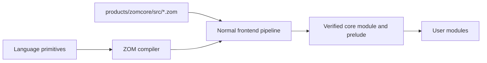
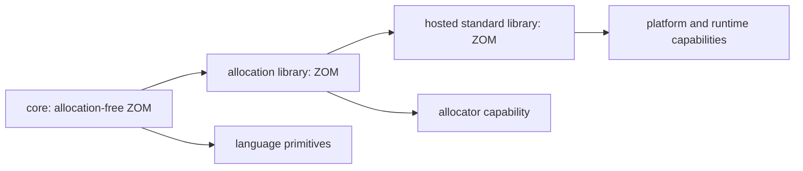

# RFC 0025: Source-Backed Core Library Architecture

## Summary

This RFC defines ZOM's core library as an unversioned, source-backed toolchain
module written in ZOM. Public core declarations are parsed, bound, checked, and
published through the same semantic pipeline as application source. The
compiler retains only language primitives, closed semantic-role bindings, and
closed intrinsic lowering for semantics or target guarantees that ordinary ZOM
cannot provide. The C++ runtime retains only services that ZOM source cannot
provide with the required execution semantics, exposed behind verified ABI
capabilities.

The core library has one stable, unversioned toolchain identity. Each admitted
distribution is bound to its exact source-tree digest, but content is not
misused as a release number or embedded in the stable unit identity. Core never
participates in package release selection, semantic-version constraints,
lockfiles, feature resolution, or compatibility fallback. This RFC directly
replaces RFC 0024's package-release bootstrap while retaining its exact
marker-policy, authority, proof, and fail-closed requirements.

## Motivation

The repository contains a source-backed standard-prelude seed in
`products/zomcore`, but it is packaged as a normal `zomcore` release with the
placeholder semantic version `0.0.0`. The production compiler still injects no
configured prelude and starts checking with an explicit-only marker policy.
The seed therefore proves that two declarations can be packaged; it does not
yet establish a core-library architecture or a production core dependency.

A compiler-owned core library is not an independently selected user package.
Giving it a package version introduces a compatibility coordinate where no
compatibility choice exists, mixes trusted toolchain input with dependency
resolution, and leaves every compiler subsystem free to invent its own
boundary between built-in behavior, ZOM source, and runtime code.

ZOM needs one architecture before the prelude seed grows. Otherwise marker
interfaces, operator interfaces, primitive methods, panic support, allocation,
concurrency, and platform services can acquire duplicate declarations or
compiler-name special cases that become difficult to remove.

The current production body checker, HIR builder, and MIR builder only carry a
small scalar-literal function path. Rich operator, call, aggregate, drop,
allocation, and runtime lowering are not implemented merely because their
enums or RFC contracts exist. The first source expansion beyond declaration-
only markers must therefore follow real checker and lowering capabilities
rather than treating parseable core source as an executable library.

## Goals

- Make ZOM source the sole authority for every user-visible core declaration.
- Give the compiler-bundled core one stable unversioned identity and bind every
  compilation to an exact verified source distribution.
- Keep the core module outside user package resolution, lockfiles, and SemVer.
- Compile the initial core source through the production parser, binder,
  signature checker, and verified publication path without a second language
  implementation.
- Define an acyclic bootstrap sequence for the core module and its prelude.
- Separate language primitives, source library APIs, compiler intrinsics, and
  runtime ABI services.
- Retain RFC 0024's verified `Copy` and `Linear` authority without spelling
  lookup or source-less declarations.
- Make the allocation-free core usable without an operating system, heap,
  scheduler, filesystem, network, or process environment.
- Reject missing, changed, redirected, cyclic, or capability-incompatible core
  input before publishing user semantic facts.
- Delete the package-shaped core bootstrap and every empty-prelude fallback in
  the implementation transaction.

## Non-Goals

- Defining a complete standard-library API catalog.
- Adding heap collections, owned strings, filesystem, networking, process,
  thread, task, channel, or scheduler APIs.
- Defining allocator selection or a hosted standard-library distribution.
- Adding new source syntax for compiler intrinsics.
- Implementing target LIR, LLVM translation, object emission, or linking.
- Making the core module replaceable by a user package.
- Supporting two core layouts, two identities, or two prelude paths.
- Preserving package coordinates or cache entries produced by the current
  unreleased repository.
- Defining compiler self-hosting or stage-to-stage compiler bootstrapping.

## Prior Art

### Rust `core`, `alloc`, And `std`

Rust keeps `core` dependency-free, allocation-free, and platform-independent.
Heap-backed collections live in `alloc`, while hosted services live in `std`.
The compiler recognizes a small set of language items that are still real
library declarations.

ZOM adopts the allocation boundary and the distinction between compiler roles
and source declarations. ZOM does not adopt a release coordinate for its
compiler-bundled core, and it does not expose unstable language-item
annotations to ordinary packages.

References:

- <https://doc.rust-lang.org/stable/core/>
- <https://doc.rust-lang.org/stable/alloc/>
- <https://doc.rust-lang.org/nightly/std/attribute.no_std.html>
- <https://rustc-dev-guide.rust-lang.org/lang-items.html>

### Swift Standard Library And Runtime

Swift implements its standard-library surface in Swift while maintaining a
separate runtime for metadata, allocation, casting, concurrency, and ABI
services. Compiler-known protocols remain standard-library declarations
rather than anonymous compiler-created types.

ZOM adopts the source-library/runtime split and exact compiler-known semantic
roles. ZOM does not adopt a binary-compatibility burden before a release or a
second source-level declaration inside the runtime.

References:

- <https://github.com/swiftlang/swift/tree/main/stdlib/public/core>
- <https://github.com/swiftlang/swift/tree/main/stdlib/public/runtime>
- <https://github.com/swiftlang/swift/blob/main/stdlib/public/core/Builtin.swift>
- <https://github.com/swiftlang/swift/blob/main/include/swift/AST/Builtins.def>
- <https://github.com/swiftlang/swift/blob/main/include/swift/AST/KnownProtocols.def>
- <https://github.com/swiftlang/swift/blob/main/docs/Runtime.md>

### Zig Standard Library And Built-In Modules

Zig supplies `std` and `builtin` as toolchain modules. The standard library is
source code in the implementation language, while target and compilation
facts are supplied by a distinct built-in module.

ZOM adopts a toolchain-supplied source module with deterministic identity and a
separate compiler capability boundary. ZOM does not expose a broad public
built-in escape hatch; compiler participation remains a closed reviewed set.

References:

- <https://ziglang.org/documentation/master/#Zig-Standard-Library>
- <https://ziglang.org/documentation/master/#import>
- <https://github.com/ziglang/zig/tree/master/lib/std>
- <https://github.com/ziglang/zig/tree/master/lib/compiler_rt>

### Go Predeclared Identifiers And Source Packages

Go keeps a small language universe of predeclared identifiers while its
standard packages remain ordinary source packages compiled by the toolchain.

ZOM adopts the principle that only true language primitives belong to the
compiler. ZOM does not infer intrinsic behavior from a package name, function
name, or declaration spelling.

References:

- <https://go.dev/ref/spec#Predeclared_identifiers>
- <https://go.dev/src/builtin/builtin.go>
- <https://go.dev/src/runtime/>
- <https://go.dev/src/cmd/compile/internal/ssagen/intrinsics.go>

### Compiler Bootstrap Scope

Rust, Go, and Zig document staged compiler bootstrapping because their
compilers are implemented wholly or partly in the target language. That is a
different dependency problem from compiling a source-backed core library with
the current host compiler.

ZOM adopts only the explicit dependency staging principle here: the current
C++ compiler compiles the ZOM core after primitive semantics are available and
before user modules are checked. Compiler self-hosting requires a separate RFC.

References:

- <https://rustc-dev-guide.rust-lang.org/building/bootstrapping/what-bootstrapping-does.html>
- <https://go.dev/doc/install/source#go14>
- <https://ziglang.org/learn/overview/#bootstrapping-a-zig-compiler>

## Guide-Level Explanation

Every ZOM compilation has one compiler-supplied module named `core`. It is not
a dependency written in `Zom.toml`, has no release number, and cannot be
overridden by a workspace, registry, VCS dependency, environment variable, or
command-line search path.

The initial source layout is:

```text
products/zomcore/
  README.md
  src/
    core.zom
    core/
      marker.zom
      prelude.zom
```

The root module anchors the toolchain namespace:

```zom
module core;
```

`core::marker` owns the initial semantic declarations:

```zom
module marker;

export interface Copy {}
export interface Linear {}
```

`core::prelude` is an explicit re-export allowlist:

```zom
module prelude;

export core::marker::{Copy, Linear};
```

These snippets are the exact initial file bytes:

| Repository Path | Inventory Path | Bytes | SHA-256 | Module Path |
|---|---|---:|---|---|
| `src/core.zom` | `core.zom` | 13 | `63421b0e8a03da646d4e6427231bc743df2731122b56d7e23ebe4425c9c8e9d7` | `core` |
| `src/core/marker.zom` | `core/marker.zom` | 68 | `0dcee31a4992b85ec803f7073e6c03519b6e963325559af28bed1443a86a9a0f` | `core::marker` |
| `src/core/prelude.zom` | `core/prelude.zom` | 54 | `2431a21b2a9bec11481b2c56d4b7099865f44df38515155391e3c9b0b12dd357` | `core::prelude` |

Each snippet ends with the LF shown after its final line. Module discovery
starts at `src/core.zom`; a child path `core::x` resolves under
`src/core/x.zom` or `src/core/x/mod.zom` using RFC 0008 rules. The initial
inventory admits only the direct-file candidates listed above. Child modules
are selected by their canonical paths; the root file does not declare module
aliases or a second module declaration.

The root module exposes the public module tree. Ordinary modules receive one
implicit dependency edge to `core::prelude`. Core modules receive no implicit
prelude edge and use explicit imports, preventing a bootstrap cycle.

Core source is compiled like other ZOM source. Diagnostics point into the
installed `.zom` file, definitions receive canonical semantic identities, IDE
consumers can navigate to them, and incremental queries depend on their exact
source digest.

The boundary is:



Primitive types, references, tuples, arrays, functions, literals, control flow,
and the minimum operations required to type-check those forms are language
semantics. Interfaces, methods, helper types, constants, and user-callable
functions belong in ZOM source. Heap and hosted services do not belong in
`core`.

## Reference-Level Design

### Architectural Layers

The implementation recognizes these non-overlapping layers:

| Layer | Authority | May Declare User-Visible APIs | Dependencies |
|---|---|---:|---|
| Language primitives | Language specification and compiler | No library declarations | None |
| Core library | `products/zomcore/src/**` ZOM source | Yes | Language primitives only |
| Intrinsic lowering | Compiler IR/backend | No | Verified core identity and target facts |
| Runtime ABI | `products/zomlang/runtime/**` | No | Target and platform services |
| Allocation library | Future ZOM source | Yes | Core plus an allocator capability |
| Hosted standard library | Future ZOM source | Yes | Core, allocation, and explicit platform capabilities |

`libraries/zc` is the host implementation library used to build the compiler
and runtime. It is not ZOM's target-language core library and cannot define
ZOM user-visible semantics.

### Core Source Contract

`products/zomcore/src` is the canonical repository source root and
`share/zom/core/src` is the build-tree and installed source root. The loader
accepts exactly regular `.zom` files below that directory.

Every admitted file:

- has a canonical relative path;
- is UTF-8 without a byte-order mark;
- uses LF line endings;
- contains no trailing whitespace;
- ends in exactly one LF byte; and
- is neither a symbolic link nor reached through a symbolic-link directory.

The source inventory is sorted by canonical relative-path bytes. Duplicate
canonical paths, case-fold collisions, non-source files, missing
`core.zom`, missing `core/prelude.zom`, unreadable files, and paths escaping
the source root reject the distribution.

The initial public inventory is limited to the `core`, `core::marker`, and
`core::prelude` modules. A later core API proposal may add source modules, but
must preserve this RFC's layer and dependency rules.

Core source may not:

- import a user package;
- import a future allocation or hosted library;
- declare a package, release, feature, or build-script contract;
- contain a foreign block until the exact runtime capability is accepted by an
  RFC and verified by the selected target;
- depend on an environment variable, current working directory, registry,
  network, user cache, or lockfile; or
- select behavior by toolchain release spelling.

### Unversioned Toolchain Identity

The toolchain core is not a `PackageKey`. The identity model gains one
compilation-unit sum type while retaining the complete RFC 0011 compilation
configuration:

```text
ToolchainComponent = Core

ToolchainUnitKey { component: ToolchainComponent }

CompilationUnitIdentity =
    UserPackage { package: PackageKey }
  | Toolchain { toolchain: ToolchainUnitKey }

CrateKey {
  unit: CompilationUnitIdentity,
  kind: CrateTargetKind,
  targetName: TargetName,
  compilation: CompilationConfigKey,
}
```

The `Toolchain(Core)` unit has `Library` target kind, target name `core`, the
complete selected target and semantic options in `CompilationConfigKey`, and
no build-script producer. One core crate is instantiated for every distinct
core compilation projection required by a session:

```text
coreCompilationFor(consumer: CompilationConfigKey) =
  CompilationConfigKey {
    domain: consumer.domain,
    target: consumer.target,
    semanticOptions: {
      editionYear: 2026,
      useUnicode: consumer.semanticOptions.useUnicode,
      allowDollarIdentifiers:
        consumer.semanticOptions.allowDollarIdentifiers,
      supportRegexLiterals:
        consumer.semanticOptions.supportRegexLiterals,
    },
    buildScriptProducer: None,
  }
```

A target-domain consumer therefore receives a target-domain core crate for the
same canonical target. Every crate in an RFC 0008 preparatory context receives
a host-domain core crate for the same canonical host target. This includes the
`BuildScript` root and every recursively selected host-domain `Library`
dependency. The distribution record witnesses and must equal the provider's
canonical `2026` edition. Core edition is not read from source or user package
input. Consumer crates of any accepted edition use the prelude from their
exact projected core crate. The unit has no package source, package name,
release, feature set, dependency aliases, or development domain.

`SourceOriginKey` gains one `CoreFile` alternative with tag `0x05`, containing
`ToolchainUnitKey` and a canonical relative path. Every caller that currently
assumes `CrateKey::package()` switches exhaustively on
`CompilationUnitIdentity`. `PackageRegistry` becomes
`CompilationUnitRegistry`, and `PackageId` becomes `CompilationUnitId` in
semantic identity consumers. RFC 0012 package resolution continues to produce
only `PackageKey` values and package dependency edges. No sentinel release and
no optional package field are introduced.

Canonical encoding uses the unversioned domain `zom.toolchain-core-key`.
`UserPackage` has union tag `0x01`; `Toolchain` has union tag `0x02`.
`ToolchainComponent::Core` has tag `0x01`.
`CoreFile` encodes its complete `ToolchainUnitKey` followed by its canonical
relative path. `CrateKey` encodes the expanded
`CompilationUnitIdentity`, `CrateTargetKind`, `TargetName`, and the unchanged
complete `CompilationConfigKey`, in that order.

`CrateDependencyEdgeKey` replaces its mandatory package-edge parent with an
exhaustive origin:

```text
CrateDependencyOrigin =
    UserPackage { edge: PackageDependencyEdgeKey }
  | ToolchainCore

CrateDependencyEdgeKey {
  origin: CrateDependencyOrigin,
  consumer: CrateKey,
  provider: CrateKey,
}
```

`UserPackage` has tag `0x01` followed by the complete canonical
`PackageDependencyEdgeKey` payload. `ToolchainCore` has tag `0x02` and no
variant payload. `CrateDependencyEdgeKey` canonically encodes the origin union
followed by the complete consumer and provider `CrateKey` values.
`ToolchainCore` is valid only when `provider.unit` is
`Toolchain(Core)`, `provider.kind` is `Library`, `provider.targetName` is
`core`, and the consumer is a user-package crate admitted to the same verified
semantic context. A target-domain consumer kind must be `Library`, `Binary`,
`Test`, `Benchmark`, or `Example`. A host-domain consumer kind must be
`BuildScript` or `Library`, matching RFC 0008's preparatory closure. The
provider compilation must equal `coreCompilationFor(consumer.compilation)`.
This validates the domain, canonical target, and every non-edition semantic
option exactly; it also requires provider edition `2026` and no build-script
producer.
Package dependency graphs and lockfiles never contain this edge. The semantic
crate graph contains exactly one such edge per consumer crate that uses the
mandatory core prelude and shares one provider among consumers with equal core
compilation projections.

The admitted distribution record includes source and semantic-role authority:

```text
CoreSemanticRole =
    Copy
  | Linear

CoreRoleIdentityTemplate {
  role: CoreSemanticRole,
  module: CanonicalModulePath,
  owners: EmptySequence,
  kind: DefinitionKind,
  namespace: DefinitionNamespace,
  declaredName: NfcDeclaredName,
  overloadHeader: Maybe<OverloadHeaderDigest>,
}

CoreSourceFile {
  path: CanonicalRelativePath,
  digest: Sha256Digest,
}

CoreDistributionRecord {
  editionYear: uint32,
  rootModule: CanonicalRelativePath,
  preludeModule: CanonicalRelativePath,
  files: SortedNonEmptySequence<CoreSourceFile>,
  roles: SortedNonEmptySequence<CoreRoleIdentityTemplate>,
}

distributionDigest =
  SHA256(
    ASCII("zom.core-distribution") ||
    0x00 ||
    Encode(CoreDistributionRecord)
  )
```

`rootModule` is `core.zom`; `preludeModule` is `core/prelude.zom`. Each file
digest is SHA-256 over its exact admitted bytes. Scalars, paths, digests,
sequences, names, owners, and optional overload headers use RFC 0011 canonical
encoding. `CoreSemanticRole` tags are `Copy = 0x01` and `Linear = 0x02`.
Templates sort by role tag and must contain each role exactly once. The initial
templates are:

| Role | Module | Owners | Kind | Namespace | Name | Overload |
|---|---|---|---|---|---|---|
| `Copy` | `core::marker` | empty | `Interface` | `Type` | `Copy` | none |
| `Linear` | `core::marker` | empty | `Interface` | `Type` | `Linear` | none |

No traversal position or declaration ordinal participates in role authority.
This RFC admits only top-level semantic roles, so `owners` must encode the RFC
0011 zero-length owner sequence. Adding a nested role requires an RFC that
defines a configuration-independent owner-identity template; a
compilation-specific `DefinitionKey` cannot enter the distribution record.
The record contains no schema version, release number, compatibility range, or
user-provided expected digest.

The compiler distribution also embeds one unversioned, role-keyed policy
template. It is semantic configuration rather than source identity, so it is
committed as a typed query input and does not alter the
`CoreDistributionRecord` encoding:

```text
CoreMarkerReferenceTemplateRule =
    Unconditional
  | Requires { role: CoreSemanticRole }

CoreMarkerPolicyTemplate {
  structuralSubjects: SortedUniqueSequence<MarkerStructuralSubject>,
  builtinPrimitives: SortedUniqueSequence<PrimitiveKind>,
  referenceRules:
      SortedMap<Mutability, CoreMarkerReferenceTemplateRule>,
  rawPointerMutabilities: SortedUniqueSequence<Mutability>,
}

CoreStandardMarkerPolicyTemplate {
  entries: SortedMap<CoreSemanticRole, CoreMarkerPolicyTemplate>,
  revision: CoreStandardMarkerPolicyTemplateRevision,
}

CoreDistributionInputRecord {
  record: CoreDistributionRecord,
  digest: Sha256Digest,
  policyTemplate: CoreStandardMarkerPolicyTemplate,
}
```

The initial template contains exactly one `Copy` entry byte-equivalent to RFC
0024's complete standard `Copy` policy after role resolution and no `Linear`
entry. Tags, collection order, primitive inventory, structural subjects,
reference rules, and raw-pointer mutabilities are exactly the accepted RFC
0015 and RFC 0024 encodings. `Requires` carries another
`CoreSemanticRole`, never a definition handle or spelling. The revision is
SHA-256 over `ASCII("zom.core-marker-policy-template") || 0x00 ||
EncodeSortedRecordBytes(entries)`. The build generator and an independent
native oracle construct the accepted template and revision separately; every
field, tag, role, sequence count, ordering position, domain byte, and separator
has a mutation case.

The initial entry record is the one-byte `Copy` role tag followed by RFC
0024's 59-byte standard policy. The sorted-record framing contains one
60-byte record. The complete 108-byte revision preimage is:

```text
7a6f6d2e636f72652d6d61726b65722d706f6c6963792d74656d706c617465000000000000000001000000000000003c010000000000000005010203040500000000000000120102030405060708090a0b0c0d0e0f1011130000000000000001010100000000000000020102
```

Its SHA-256 is
`7dd8af5de4a6c704f589567182ad85174aaeabd62199d85ac19d8341f7a01967`.
The native oracle constructs both the policy bytes and outer framing without
calling a production encoder or revision helper.

The initial `CoreDistributionRecord` canonical encoding is 398 bytes. With the
domain and zero separator, the SHA-256 input is 420 bytes and its golden digest
is:

```text
9cd508706516bcf033ff6dbbadd9cc8c83934cabe7e5b88992b231f778ce2f47
```

The complete 398-byte record vector is:

```text
000007ea00000000000000010000000000000008636f72652e7a6f6d00000000000000020000000000000004636f7265000000000000000b7072656c7564652e7a6f6d000000000000000300000000000000010000000000000008636f72652e7a6f6d63421b0e8a03da646d4e6427231bc743df2731122b56d7e23ebe4425c9c8e9d700000000000000020000000000000004636f7265000000000000000a6d61726b65722e7a6f6d0dcee31a4992b85ec803f7073e6c03519b6e963325559af28bed1443a86a9a0f00000000000000020000000000000004636f7265000000000000000b7072656c7564652e7a6f6d2431a21b2a9bec11481b2c56d4b7099865f44df38515155391e3c9b0b12dd35700000000000000020100000000000000020000000000000004636f726500000000000000066d61726b6572000000000000000008020000000000000004436f7079000200000000000000020000000000000004636f726500000000000000066d61726b65720000000000000000080200000000000000064c696e65617200
```

The independent native oracle constructs this vector field by field without
calling the production record encoder. It mutates the edition, root path,
prelude path, every file path and digest, every role tag, module path, owner
sequence, definition kind, namespace, declared name, overload-header presence,
sequence count, domain byte, and separator, and requires a changed digest or
typed decode failure.

```text
VerifiedCoreDistribution {
  record: CoreDistributionRecord,
  distributionDigest: Sha256Digest,
  policyTemplate: CoreStandardMarkerPolicyTemplate,
  sourceRoot: VerifiedCoreSourceRoot,
  snapshots: SortedNonEmptySequence<VerifiedCoreSourceSnapshot>,
}
```

`VerifiedCoreSourceRoot` is an opaque, process-local capability issued only
after executable-relative directory admission. `sourceRoot` is provenance and
is excluded from semantic equality and canonical encoding.
`VerifiedCoreSourceSnapshot` retains the canonical relative path, exact
immutable source bytes, and recomputed content digest. Snapshot bytes are
process-local distribution materialization and must match the corresponding
`CoreSourceFile` record exactly. They are excluded from the new core semantic
projection values. The existing `SourceSnapshot` query input continues to own
and encode the exact canonical bytes as required by RFC 0017.
`distributionDigest` must equal the digest recomputed from `record`.
`policyTemplate` must equal the independently reconstructed accepted template
and carry its recomputed revision.
The verifier requires `record.editionYear` to equal the projected core
`crate.compilation.semanticOptions.editionYear`; mismatch is
`EditionMismatch`. There is no other core edition input.

The build generates the expected inventory and digest from repository source
with
`scripts/codegen/gen_core_library_inventory.py`. The registered CMake target is
`generate-core-library-inventory`; its only generated artifact is
`${PROJECT_BINARY_DIR}/generated/zom/core/core-library-inventory.inc`.
The executable target depends on that target and embeds the generated record
and digest in `zomc`. The generator command is:

```bash
python3 scripts/codegen/gen_core_library_inventory.py \
  --source-root products/zomcore/src \
  --output build-sanitizer/generated/zom/core/core-library-inventory.inc
```

The generator accepts no manifest, package metadata, expected digest, or
environment-selected source root. It canonicalizes and validates the fixed
source inventory defined by this RFC, writes through an atomic replacement,
and emits byte-identical output for byte-identical source. CMake declares every
admitted source as an input dependency and materializes those same files into
the build and install trees. The registered target is the only production
generation path; no checked-in generated header, configure-time fallback, or
second generator exists. Its `--self-test` mode uses repository-owned fixtures
to prove deterministic output and rejection of a missing required file,
additional file, non-canonical path, symlink, invalid UTF-8, non-LF input,
trailing whitespace, and framing mutation without writing the source tree.

At startup, a distribution builder and an independent verifier separately
enumerate and hash the filesystem source, compare it with the embedded
inventory and digest, and publish `VerifiedCoreDistribution` only when both
agree. Candidate-carried bytes never supply their own expectation.

`SemanticContextFingerprint` replaces its package sequence with the sorted
`CompilationUnitIdentity` sequence and additionally includes the exact
`distributionDigest` and
`CoreStandardMarkerPolicyTemplateRevision` for every toolchain unit.
Package-edge input remains the RFC 0012 user-package edge sequence. Changing a
core file, role template, or core policy template changes the admitted
distribution or policy digest, semantic context, and affected query revisions.
It does not change
`ToolchainUnitKey`, which is the stable identity of the compiler's core
component. A host/target domain mismatch, target mismatch, non-edition option
mismatch, non-2026 provider edition, or build-script-producer presence rejects
the edge before publication. There is no migration, compatibility selection,
or fallback to an older digest.

Stable core projections use a narrower fingerprint:

```text
CoreSemanticContextFingerprint =
  SHA256(
    ASCII("zom.core-semantic-context") ||
    0x00 ||
    Encode(projectedCoreCrateKey)
  )
```

This fingerprint excludes distribution content, the policy template, unrelated
consumer crates, source snapshots, package edges, and session brands. It is
the compilation-coordinate component of every stable core query value and
core-specific revision below. Distribution integrity remains mandatory for
admission, every revision-local capability, and final library publication.
Policy-template lineage remains mandatory for the policy and authority
projections. Neither broad input is copied into graph, signature, export, or
prelude equality. The complete
`SemanticContextFingerprint` remains mandatory on revision-local capabilities
to prevent cross-session or cross-context handle use, but it never enters
stable core projection equality. Compilations with equal projected core keys
therefore produce equal core semantic context fingerprints within or across
sessions without authorizing handle or capability reuse.

### Toolchain Core Module Discovery

RFC 0017's semantic graph roots switch from a package-only key to an
exhaustive compilation-root key:

```text
CompilationRootKey =
    UserPackage { package: PackageKey }  // 0x01
  | ToolchainCore { crate: CrateKey }    // 0x02

CompilationRootSetQueryKey {
  roots: SortedNonEmptySequence<CompilationRootKey>,
}
```

`CompilationRootSetQueryKey` uses the unversioned domain
`zom.query.compilation-root-set`, one zero byte, an RFC 0011 `uint64be` count,
and each framed root record in ascending complete encoded-byte order.
Duplicates, an empty set, unknown tags, trailing bytes, a non-core toolchain
crate, or a toolchain crate that is not the exact projected library target
rejects construction and decode.

The accepted RFC 0017 `ActiveCrates`, `ModuleGraph`, and `ModuleGraphScc`
queries use `CompilationRootSetQueryKey`; `PackageGraphInput` and
package-resolution queries use `PackageRootSetKey`. A singleton
`ToolchainCore` root set is a pure stable query key, not a committed input
value. For that branch,
`ActiveCrates` reads the exact `CoreDistributionInput` and returns only the
projected core crate after validating the key. User-package root sets continue
to read `PackageGraphInput`. No package sentinel, optional package, committed
root-set value, or parallel graph API is introduced.

`CompilationOptions` is keyed by the complete `CrateKey`, because one semantic
context may contain multiple user crates and multiple unequal projected core
crates. `ParseSource(SourceFileKey)` derives the options key only from
`SourceFileKey.crate`; no ambient current crate or fixed singleton key exists.
The input transaction commits exactly one value for every active crate before
that crate's source query is demanded. The key codec is
`ASCII("zom.query.compilation-options")`, one zero byte, then the complete
expanded `CrateKey`. Producer, verifier, trace, dump, mutation, and fixed-vector
fixtures accept only this complete key.

Whole-context queries use the complete session
`CompilationRootSetQueryKey`, containing every user-package root and every
projected toolchain-core root in canonical order. This is distinct from a
crate-local options key and from each singleton graph root. RFC 0020
`ActiveDefinitionAuthorityReadyInput`, RFC 0017
`CompilationDiagnosticFacts`, and
`MaterializeCompilationDiagnostics` use that complete root-set key.
Definition and owner-body queries use explicit contextual keys:

```text
ContextualDefinitionKey {
  contextRoots: CompilationRootSetQueryKey,
  definition: DefinitionKey,
}

ContextualModuleKey {
  contextRoots: CompilationRootSetQueryKey,
  module: ModuleKey,
}

StableOwnerBodyQueryKey {
  module: ModuleKey,
  owner: StableBodyOwnerKey,
}

ContextualBodyOwnerKey {
  contextRoots: CompilationRootSetQueryKey,
  body: StableOwnerBodyQueryKey,
}

ContextualDiagnosticProvenanceKey {
  contextRoots: CompilationRootSetQueryKey,
  provenance: DiagnosticProvenanceKey,
}

ContextualCoreCrateKey {
  contextRoots: CompilationRootSetQueryKey,
  crate: CrateKey,
}

ContextualCoreModuleKey {
  contextRoots: CompilationRootSetQueryKey,
  module: ModuleKey,
}
```

`ActiveDefinitionAuthorityInput`, `NamedItemSyntax`, and
`NamedItemProvenance` use `ContextualDefinitionKey`. RFC 0019
`ModuleBodyOwners` uses `ContextualModuleKey`.
`OwnerBodySyntax`, `OwnerBodyProvenance`, `BindOwnerBody`,
and `MaterializeOwnerBody` use `ContextualBodyOwnerKey`. `BoundOwnerBody` is
the sole stable authority for closure, free-variable, and explicit-capture
facts; `MaterializeOwnerBody` expands those facts directly from
`BindOwnerBody`. Values retain stable `DefinitionKey`, `ModuleKey`, and
`StableOwnerBodyQueryKey` records; context is query selection, not semantic
identity.

RFC 0019 `VerifyBoundModule` and RFC 0017 `ModuleDiagnosticFacts` use
`ContextualModuleKey`, because both select contextual owner-body dependencies.
`ResolveDiagnosticProvenance` uses
`ContextualDiagnosticProvenanceKey`, because an owner-bearing module site
selects contextual body provenance. `MaterializeModuleSkeleton` retains its
plain `ModuleKey`: its closed read set contains only the stable skeleton,
revision-local definition sites, and active-handle materialization and never
selects a named-item, owner-body, bound-module, or diagnostic query.
`BindModuleSkeleton`, `ModuleBodySyntax`, `ModuleBodyProvenance`, and
`NamedDefinitionInventory` likewise retain plain module keys because none
selects a contextual child. Only the handle-free Semantic members needed by
the authority installation may run in `authorityStagingSnapshot`.
`ModuleBodyProvenance` and `MaterializeModuleSkeleton` are `RevisionLocal`;
their plain keys do not grant staging permission, and neither may run before
the final global barrier.

Every core query that must demand a contextual named-item or body query uses
`ContextualCoreCrateKey` or `ContextualCoreModuleKey`. The context roots route
tracked dependencies and are excluded from the handle-free core value records
and their narrow semantic revisions. This prevents ambient context selection
without broadening `CoreSemanticContextFingerprint`; persistence for these core
queries remains disabled.

Each contextual codec retains its existing query domain and encodes the
complete `CompilationRootSetQueryKey` before the inner stable key. The
authority-set fingerprint encodes `contextRoots` once before the sorted
`(DefinitionKey, DefinitionIdentityRecord)` sequence.

A named-item provider already has `contextRoots` in its query key. It first
probes the matching `ActiveDefinitionAuthorityInput`. On an exact present
record, it validates the record and does not read readiness. On absence, it
demands `ActiveDefinitionAuthorityReadyInput(contextRoots)`: missing readiness
is `ProviderRejected`, while a matching complete readiness fingerprint proves
`InactiveOwner`. A contradictory present record demands readiness only for the
existing invariant classification. This preserves RFC 0020 conditional
dependency shielding and makes deletion or rename absence implementable
without ambient state or tombstones.

The session mutation authority requires every contextual authority key, the
readiness input, diagnostic aggregation, and diagnostic materialization to use
the same complete root-set key. Compilation options always select the source's
complete `CrateKey`; whole-context authority and diagnostics always select the
complete root-set key. Codecs, dumps, traces, fixtures, and architecture gates
accept only those two explicit selections.

The closed RFC 0008 `ModuleSearchRoot` union gains one unversioned alternative:

```text
ToolchainCoreModuleSearchRoot {
  crate: CrateKey,
  distributionDigest: Sha256Digest,
}

ModuleSearchRoot =
    Workspace
  | Package
  | Generated
  | ToolchainCore
```

`ToolchainCore` has search-root tag `0x04` and canonically encodes the complete
projected core `CrateKey` followed by `distributionDigest`. Construction
requires `crate.unit = Toolchain(Core)`, library kind, target name `core`,
provider edition `2026`, no build-script producer, and a digest equal to the
session's `VerifiedCoreDistribution`. It contains no package key, release,
physical filesystem path, or optional compatibility field.

The physical source-root capability never enters a durable query value.
Instead, core admission first publishes a session-owned structural catalog
that contains no semantic handles:

```text
AdmittedCoreSourceCatalog {
  crate: CrateKey,
  distribution: Sha256Digest,
  entries: SortedNonEmptyMap<
    CanonicalModulePath,
    {
      source: SourceFileKey,
      contentDigest: Sha256Digest,
    }>,
}
```

The admission builder derives entries only from the verified distribution and
its admitted immutable source snapshots. For each inventory file it constructs
`SourceOriginKey::CoreFile`, the exact projected core `CrateKey`, canonical
module path, and source digest. Its independent verifier uses only
`VerifiedCoreDistribution`, the finalized projected `CrateKey`, and admitted
snapshots; it does not retain the source-root capability and does not read or
mutate a source or module registry.

The initial structural catalog contains exactly `core`, `core::marker`, and
`core::prelude`; `core` from `core.zom` is the root discovery seed and
`core::prelude` is the configured-prelude structural seed. Child discovery
maps `core::x` to the admitted direct-file or `mod.zom` candidate under the
fixed logical source root and never probes a workspace, package, current
directory, or unverified physical path. Source materialization reads only the
session-owned `SourceSnapshot` input selected by the catalog's stable
`SourceFileKey`; it never dereferences a catalog-carried filesystem capability.

`ModuleResolutionEnvironmentRecord`, `CanonicalModuleSearchRoots`,
`ModuleSearchRootsInput`, their codecs, and their environment revisions switch
exhaustively on the new `ToolchainCore` root. The structural resolver accepts
that root only with the matching process-local `AdmittedCoreSourceCatalog`;
decoded query bytes alone cannot grant filesystem access or core authority.
The catalog authorizes logical membership, while the verified input
transaction authorizes and owns the session's source bytes.

Core graph construction has one session-wide ordered staging contract:

1. Derive the complete sorted projected-core set from the immutable consumer
   inventory.
2. One `VerifiedCoreDistributionInputTransaction` commits the verified
   distribution, `CompleteCompilationContextAuthority`, exact
   `SourceSnapshot`, crate-keyed `CompilationOptions`, and
   `ModuleSearchRoots` values for every projection before parsing. Each
   `ActiveCrates(singletonToolchainCoreRootSet)` and
   `ActiveSources(core)` then derives handle-free membership from those inputs
   and the complete admitted source inventory. Opening, mutating, and
   committing the transaction use `InputTransactionOpenResult`,
   `InputMutationResult`, and `InputCommitResult`; any `Rejected` alternative
   abandons the unpublished session and publishes no partial root or revision.
3. Parsing, module-declaration validation, discovery, and duplicate selection
   for every projection produce structural records only. They create no
   semantic identity handle.
4. One `VerifiedModuleGraphInputTransaction` atomically commits every
   projection's selected structural module records, one
   `ModuleCatalogPathBucket` for every admitted core path, one
   `RequesterModuleAncestry` for every selected module, exact module dependency
   sites, the complete `ConfiguredPreludeInput` set for every non-core consumer
   crate, and every other existing explicit module graph prerequisite. Each
   prelude value is the stable selected `core::prelude` `ModuleKey` from that
   consumer's exact projection; committing it requires structural selection
   but not a materialized core interface. The transaction does not commit
   `ActiveCrates`, `ActiveSources`, `ActiveModules`, `ModuleDependencies`,
   `ModuleGraph`, or `ModuleGraphScc`; those are derived queries. Its open,
   mutation, and commit operations use the same explicit result algebra and
   never encode rejection as a Boolean or empty optional value.
5. From the single post-commit `authorityStagingSnapshot`, the session demands
   and independently verifies `ActiveModules(core)`, each keyed
   `ModuleDependencies`, the singleton `ModuleGraph`, and `ModuleGraphScc` for
   every projection. Their module sets, path buckets, ancestry, dependency
   edges, distribution, source digests, and active source and crate membership
   must agree exactly. From that same snapshot, the session demands
   `NamedDefinitionInventory` for every active module in the complete context,
   in canonical module order. Only handle-free semantic skeleton and inventory
   queries are legal in this authority-staging phase; named-item, owner-body,
   and revision-local materialization roots remain closed.
6. The session independently constructs the complete contextual definition,
   implementation, generic-parameter, and callable-parameter authority maps
   plus complete-root readiness. One
   `ContextualIdentityAuthorityInputTransaction` atomically installs that
   complete payload. Only after it succeeds does the session acquire
   `finalCoreSnapshot`. It uses the same explicit transaction results and
   publishes neither a partial authority root nor a revision on rejection.
7. From `finalCoreSnapshot`, the session re-demands and verifies the complete
   active-membership, graph, SCC, authority, and readiness roots. Only their
   success opens the global named-item, owner-body, core-bootstrap, and
   revision-local materialization barrier. `QueryDatabase::sealInputs` returns
   `FinalSealResult<CompilationRootSetQueryKey, Sha256Digest>` for that
   snapshot, its complete roots, and the independently reconstructed final
   witness. The successful seal constructs
   `SealedQuerySnapshot<CompilationRootSetQueryKey, Sha256Digest>`;
   `MaterializeModuleGraph` and every later final-sealed materializer are
   demanded only through that sealed root. Nested capability demands inherit
   its immutable admission and never consult an ambient seal flag. A source,
   parse, declaration,
   duplicate, discovery, transaction-verifier, graph, inventory, authority-map,
   or readiness failure marks the snapshot failed, publishes no verified core
   artifact, and permits no core identity materialization. The failed snapshot
   and its committed stable inputs are discarded with the failed session; no
   input rollback is required.

All committed and derived stable values contain no `CrateId`, `SourceFileId`,
`ModuleId`, registry reference, or filesystem capability. There is no second
post-freeze core catalog and no session side table that owns or republishes
handles.

Calls to `materializeActive` are available only through
`CapabilityQueryContext<Descriptor>` and an exact
`ActiveMaterializerPermission<Descriptor, GlobalIdentityKey,
MembershipDescriptor>` specialization. The provider derives the global key,
demands the exact membership descriptor, records that dependency, and compares
the complete active authority before any interner access. Core bootstrap uses
only the RFC 0028 production permission matrix; no wildcard, runtime
descriptor-name dispatch, generic lease plus opaque failure bytes, side-table
authority, or ambient session access is permitted. Capability providers and
verifiers return the descriptor-dependent `CapabilityProviderResult` and
`CapabilityDemandResult`; their listed source or key rejections pass through
the typed canonical failure envelope and publish no capability memo. Successful
child capability reads remain retained dependencies of the parent memo.
Semantic and Persisted providers cannot call `materializeActive`, and no
stable query value may contain a handle.

### Semantic Context And Session Ownership

One `CompilerSession` owns exactly one semantic context, one
`SemanticContextFingerprint`, one `QueryDatabase`, one
`SemanticContextCapabilityArena`, and one family of checked and borrow-evidence
repositories. The arena owns the `SemanticContextBrand` issuer, the sole
`CanonicalIdentityInternerSet`, and the semantic type store for its complete
refcounted lifetime. It owns no query memo, lookup table, flight, lease, or
verified library. A session never contains final-context and
preparatory-context handles together.

The package and CLI compilation orchestrator owns the
`SemanticContextFactory`, verifies one immutable `VerifiedCoreDistribution`,
and creates:

- one `CompilerSession` for each RFC 0008 preparatory build-script context, in
  canonical build-plan order; and
- one final-context `CompilerSession` after all required build-script results
  have been verified.

The distribution record, digest, and immutable source snapshots are
context-neutral inputs and may be read by every session while the orchestrator
retains their lifetime. Only canonical `BuildScriptOutputRecord` values cross
from a completed preparatory session into a later session. A
`SemanticContextBrand`, registry brand, semantic handle, module or crate edge,
query value containing a handle, verified module interface, checked
capability, or `VerifiedCoreLibrary` never crosses a session boundary.

Within one session, consumers with an equal
`coreCompilationFor(consumer.compilation)` projection share exactly one core
library. Consumers with unequal projections receive distinct core libraries.
The complete projected core `CrateKey` is the lookup and uniqueness key.
Cross-session equality of that stable key permits sharing only immutable
distribution bytes; it never permits sharing a verified library or branded
artifact. A missing projection, duplicate publication, foreign context, or
attempted cross-session materialization fails before any consumer module graph
is published.

Before any core query is demanded, the orchestrator derives the sorted,
duplicate-free sequence of projected core `CrateKey` values from the session's
complete consumer crate inventory. That sequence is immutable for the session.
`VerifiedCoreDistributionInputTransaction` atomically commits the verified
distribution, complete compilation-context authority, exact
`CompilationOptions`, `ModuleSearchRoots`, and copied `SourceSnapshot` inputs
for every projected core crate. After structural parsing and discovery for
every projection, `VerifiedModuleGraphInputTransaction` atomically commits
every projection's selected module records and graph prerequisites, including
every non-core consumer's configured prelude. Its
`authorityStagingSnapshot` supplies the verified handle-free graph, skeleton,
inventory, and header witnesses needed to build the complete context authority
payload. `ContextualIdentityAuthorityInputTransaction` then atomically installs
the complete definition, implementation, generic-parameter, and
callable-parameter authority maps plus complete-root readiness. The snapshot
obtained after this third commit is `finalCoreSnapshot`.

Each transaction open, mutation, and commit is observed through
`InputTransactionOpenResult`, `InputMutationResult`, and `InputCommitResult`.
A rejected mutation leaves the staged root unchanged; a rejected commit
publishes neither a root nor a revision and closes the transaction. Any
rejection abandons the unpublished session.

All named-item, owner-body, core semantic, and core materialization queries for
every projection are demanded from `finalCoreSnapshot`; the earlier staging
snapshot is limited to handle-free graph, skeleton, inventory, and header reads
required to install authority. A single global readiness barrier opens only
after the active crate, source, module, dependency, graph, SCC, authority, and
readiness projections verify in the final snapshot. The session then calls
`QueryDatabase::sealInputs` with the exact snapshot, complete context roots,
and independently reconstructed final witness. It requires the
`Sealed(FinalSnapshotSeal<CompilationRootSetQueryKey, Sha256Digest>)`
alternative of `FinalSealResult`; rejection publishes no seal and abandons
the unpublished session. The transition is irreversible; every later
transaction begin, set, erase, or commit returns
`InputMutationAfterFinalSeal`. The successful seal admits a
`SealedQuerySnapshot<CompilationRootSetQueryKey, Sha256Digest>`, and
`MaterializeModuleGraph` and every later final-sealed materializer are demanded
only through that root. Admission propagates unchanged through nested demand
frames instead of being reconstructed from mutable database or session state.
Every module-interface and authority lease stored in
`VerifiedCoreLibrarySet` carries the sealed database revision and snapshot
identity; libraries from different revisions can never be assembled into one
set.

The orchestrator is the sole owner of the move-only
`VerifiedCoreDistribution`, including its source-root capability and immutable
snapshot storage. Session builders and verifiers receive an explicit verified
borrow whose lifetime is bounded by the orchestrator. A session source manager
owns any revision-local materialization derived from those borrowed snapshots.
No `VerifiedCoreLibrary`, `VerifiedCoreLibrarySet`, query value, or session
capability copies or takes ownership of the distribution, source root, or
snapshot storage; these artifacts retain only the verified distribution digest.

### Core Library Bootstrap Sequence

This sequence bootstraps the semantic dependency between the compiler frontend
and the source-backed core library. It does not bootstrap a compiler written in
ZOM, compare compiler stages, or claim self-hosting.

Core compilation is one production pipeline with an explicit bootstrap order:

```mermaid
flowchart TD
    D["Verify core source distribution"] --> I["Create projected core crate"]
    I --> SC["Admit structural core source catalog"]
    SC --> P["Parse, discover, and validate module declarations"]
    P --> A["Commit explicit module-graph prerequisites"]
    A --> V["Derive and verify active membership and module graph"]
    V --> NI["Build complete named-definition inventories"]
    NI --> AR["Install contextual definition authority and readiness"]
    AR --> FS["Acquire final core snapshot"]
    FS --> B["Bind core without an implicit prelude"]
    B --> RS["Publish verified core role seed"]
    RS --> S["Check core signatures in graph order"]
    S --> BI["Publish bootstrap module interfaces"]
    BI --> MP["Verify core-scoped marker shape and policy"]
    MP --> SR["Publish verified standard marker authority"]
    SR --> FI["Finalize ordinary core module interfaces"]
    FI --> K["Verify declaration-only core lowering"]
    K --> C["Publish library in VerifiedCoreLibrarySet"]
    C --> G["Inject core::prelude and bind non-core modules"]
    G --> WI["Build whole-session marker inventories"]
    WI --> U["Check non-core signatures and bodies"]
```



The bootstrap compiler surface is limited to:

- source syntax and AST construction;
- canonical module and definition identity;
- primitive types and primitive operations specified by the language;
- declaration, generic, interface, implementation, and visibility semantics
  required by admitted core source; and
- diagnostics required to reject invalid core source.

The compiler must not create a source-less core declaration during bootstrap.
The role seed is published after definition identity freeze and binding but
before signature checking. It authorizes only the exact core-signature
bootstrap described below. Core bodies and every non-core signature are
checked only after the final role authority exists.

```text
VerifiedCoreRoleSeed {
  semanticContext: SemanticContextBrand,
  contextFingerprint: SemanticContextFingerprint,
  coreContext: CoreSemanticContextFingerprint,
  distribution: Sha256Digest,
  crate: CrateId,
  markerModule: ModuleId,
  roles: SortedMap<
    CoreSemanticRole,
    {
      definition: DefId,
      key: DefinitionKey,
    }>,
  revision: Sha256Digest,
}

CoreRoleSeedInput {
  distribution: const CoreDistributionInputRecord,
  graph: const CoreModuleGraphRecord,
  markerBoundModuleLease: VerifiedBoundModuleLease,
  crate: CrateId,
  markerModule: ModuleId,
  roleDefinitions: SortedMap<CoreSemanticRole, DefId>,
}

CoreSignatureCheckingInput {
  boundModuleLease: VerifiedBoundModuleLease,
  graph: const CoreModuleGraphRecord,
  importedSignatures: const VerifiedCoreImportedSignatureView,
  roleSeed: const VerifiedCoreRoleSeed,
  semanticOptions: SemanticCompilerOptionsKey,
}
```

Neither input is a session-level mutable record or public constructor.
`MaterializeCoreRoleSeed` alone assembles `CoreRoleSeedInput`, and
`MaterializeCoreBootstrapModuleInterface` alone assembles
`CoreSignatureCheckingInput`, from the exact tracked reads declared below.

The seed builder consumes `CoreRoleSeedInput`. The exact
`markerBoundModuleLease->bindingSurface` is the visibility authority for
`core::marker`; its module must equal the graph's exact marker module and its
verified binding inventory must own every selected role definition. The
materializer obtains the crate, marker module, and role-definition handles only
through `QueryDatabase::materializeActive` for stable keys already carried by
the verified graph and seed records. The builder expands every trusted
`CoreRoleIdentityTemplate` from `CoreDistributionInputRecord` and compares it
with the exact retained identity behind each materialized handle. Its
independent verifier consumes the same immutable input, repeats the active-key
and binding-surface checks, reconstructs the complete
`DefinitionIdentityRecord`, and requires the exact semantic context,
distribution digest, projected core crate, `core::marker` module, role set,
definition kind, namespace, declared name, public visibility, and unique
retained `DefinitionKey`. It never obtains a registry, module catalog,
semantic type store, or lookup key from untracked session state. It does not
consume a signature, marker shape, marker policy, final authority, or
candidate-selected lookup key, and it does not claim body-checking authority,
prelude-edge completeness, or ordinary-module authority.

The stable seed record is published only by the `CoreRoleSeed` query defined
below. The revision-local `MaterializeCoreRoleSeed` query resolves that
verified record through its tracked active-membership, bound-module, and
materialization-query dependencies, then constructs
`VerifiedCoreRoleSeed`. Its independent verifier obtains every lookup key from
the verified query value and repeats the context, graph, active-membership,
binding-surface, identity, and visibility checks. No checker query reads a
session-stored role seed outside this materialization boundary.

The seed revision is SHA-256 over
`ASCII("zom.core-role-seed") || 0x00`, the complete
`CoreSemanticContextFingerprint`, expanded core `CrateKey`, expanded marker `ModuleKey`,
and the sorted role tag plus expanded `DefinitionKey` pairs. Brands and
handles do not enter the preimage. The native oracle mutates every field,
ordering position, role tag, definition key, domain byte, and separator.

The independent seed-revision oracle uses a zero core semantic context
fingerprint, the 82-byte projected target core `CrateKey` below, its 116-byte
`core::marker` `ModuleKey`, a `Copy` key of 32
`0x11` bytes, and a `Linear` key of 32 `0x22` bytes:

```text
coreCrate =
0201010000000000000004636f72650200000000000000017800000000000000017600000000000000016f00000000000000016500000000000000016100000040010000000000000000000007ea01000000

markerModule =
0201010000000000000004636f72650200000000000000017800000000000000017600000000000000016f00000000000000016500000000000000016100000040010000000000000000000007ea0100000000000000000000020000000000000004636f726500000000000000066d61726b6572
```

The complete 339-byte revision preimage is:

```text
7a6f6d2e636f72652d726f6c652d7365656400000000000000000000000000000000000000000000000000000000000000000000000000000000520201010000000000000004636f72650200000000000000017800000000000000017600000000000000016f00000000000000016500000000000000016100000040010000000000000000000007ea0100000000000000000000740201010000000000000004636f72650200000000000000017800000000000000017600000000000000016f00000000000000016500000000000000016100000040010000000000000000000007ea0100000000000000000000020000000000000004636f726500000000000000066d61726b65720000000000000002011111111111111111111111111111111111111111111111111111111111111111022222222222222222222222222222222222222222222222222222222222222222
```

Its SHA-256 is
`2a45c3cfa5bbe1bcc898f6ae1824dcb7927d0843697073dc1a3ef8c0fa387f02`.
The native oracle constructs the crate, module, framing, and digest without
calling the production seed builder or revision helper.

The checker exposes two non-overlapping entry points:

- `checkCoreSignatures(CoreSignatureCheckingInput)` accepts only modules owned
  by the exact projected `Toolchain(Core)` crate and only while the final
  authority is absent. Its verifier requires the bound module, core graph,
  imported view, role seed, context brand, and context fingerprint to agree and
  proves that the module has no implicit prelude. The closed initial signature
  algebra contains no semantic type operand and therefore does not read or
  mutate `SemanticTypeStore`. It uses the role seed solely to validate and
  publish the exact `Copy` and `Linear` marker declarations.
- `checkModuleSignatures(SignatureCheckingInput)` requires
  `VerifiedStandardMarkerAuthority` and accepts every non-core module. It
  cannot consume a role seed.

`VerifiedCoreImportedSignatureView` is a separate revision-local capability
used only by `checkCoreSignatures`. It contains the complete requester-filtered
RFC 0005 semantic signatures plus the core-specific bootstrap
signature-root authorizations, support closure, module targets, binding
revision, bootstrap-interface revision, requester module, core semantic
context, and full session brand. It is constructed only inside
the registered `MaterializeCoreBootstrapModuleInterface` provider from the
requester's exact retained `VerifiedBoundModuleLease` and verified dependency
`CoreBootstrapModuleInterfaceRecord` values in `CoreModuleGraph` order. That
query's independent verifier reconstructs the same view and applies the
existing RFC 0005 lookup-root, support-closure, module-target, visibility,
canonical-signature, type-key, and revision rules. Neither side uses marker
policy, final authority, ordinary `VerifiedModuleInterface`, or a
candidate-carried dependency key.

After `checkCoreSignatures` succeeds, the revision-local
`MaterializeCoreBootstrapModuleInterface` query and its independent verifier
publish one memo-owned move-only `VerifiedCoreBootstrapModuleInterface`. It
retains the exact bound module, verified core signature facts, imported core
signature view, and complete handle-free canonical interface record defined
below. Every identity handle comes from a tracked capability or
`materializeActive` call for a verified stable key. The closed initial checker
cannot add a signature, authorization, support edge, export, module target, or
semantic type outside those records.

```text
CoreBootstrapSignatureAuthorizationOrigin =
    Local                                                        // 0x01
  | Imported { interfaceRevision: CoreBootstrapModuleInterfaceRevision } // 0x02

CoreBootstrapSignatureRootAuthorization {
  binding: DefId,
  canonicalDefinition: DefId,
  visibility: VisibilityEnvelope,
  sourceModule: ModuleId,
  bindingSurfaceRevision: CoreBindingSurfaceRevision,
  origin: CoreBootstrapSignatureAuthorizationOrigin,
}

CoreBootstrapImportedSignatureModule {
  origin: SignatureViewOrigin,
  sourceModule: ModuleId,
  interfaceRevision: CoreBootstrapModuleInterfaceRevision,
  bindingSurfaceRevision: CoreBindingSurfaceRevision,
  authorizedRoots:
      SortedUniqueSequence<CoreBootstrapSignatureRootAuthorization>,
  lookupDefinitions: SortedMap<DefId, SemanticSignature>,
  supportDefinitions: SortedMap<DefId, SemanticSignature>,
  moduleTargets:
      SortedMap<BindingNameKey, (ModuleId, CoreBindingSurfaceRevision)>,
}

VerifiedCoreImportedSignatureView {
  semanticContext: SemanticContextBrand,
  contextFingerprint: SemanticContextFingerprint,
  coreContext: CoreSemanticContextFingerprint,
  requester: ModuleId,
  revision: CoreImportedSignatureViewRevision,
  modules: SortedSequence<CoreBootstrapImportedSignatureModule>,
}

VerifiedCoreBootstrapModuleInterface {
  semanticContext: SemanticContextBrand,
  contextFingerprint: SemanticContextFingerprint,
  coreContext: CoreSemanticContextFingerprint,
  module: ModuleId,
  record: CoreBootstrapModuleInterfaceRecord,
  boundModuleLease: VerifiedBoundModuleLease,
  signatures: VerifiedCoreSignatureFacts,
  importedSignatures: VerifiedCoreImportedSignatureView,
}

VerifiedCoreModuleInterface {
  semanticContext: SemanticContextBrand,
  contextFingerprint: SemanticContextFingerprint,
  coreContext: CoreSemanticContextFingerprint,
  module: ModuleId,
  record: CoreModuleInterfaceRecord,
}

ImportedInterfaceRevision =
    User { revision: ModuleInterfaceRevision }              // 0x01
  | ToolchainCore { revision: CoreModuleInterfaceRevision } // 0x02

ImportedBindingSurfaceRevision =
    User { revision: ExportSurfaceRevision }              // 0x01
  | ToolchainCore { revision: CoreBindingSurfaceRevision } // 0x02

VerifiedInterfaceSource =
    User { interface: const VerifiedModuleInterface }
  | ToolchainCore { interface: const VerifiedCoreModuleInterface }
```

`SemanticSignature` and `SignatureViewOrigin` retain their exact RFC 0005
meaning. Bootstrap uses only the core-specific authorization and imported
module records above. Their interface revision is
`CoreBootstrapModuleInterfaceRevision`, so dependency signatures can be built
in topological order before final authority exists. Bootstrap records never
enter an ordinary signature, body, coherence, borrow, checked-module, HIR, or
MIR input.

After authority finalizes a core interface, the ordinary RFC 0005 contracts
use the exhaustive final-lineage sums above:

- `SignatureAuthorizationOrigin::Imported.interfaceRevision`,
  `ImportedSignatureModule.interfaceRevision`, and
  `ModuleInterfaceRevisionEntry.revision` become
  `ImportedInterfaceRevision`; and
- `SignatureRootAuthorization.bindingSurfaceRevision`,
  `ImportedSignatureModule.bindingSurfaceRevision`, and each
  `ImportedSignatureModule.moduleTargets` surface revision become
  `ImportedBindingSurfaceRevision`.

The user branches carry the complete existing revisions after tag `0x01`; the
toolchain-core branches carry the complete final core revisions after tag
`0x02`. Every projector, signature/body checker, coherence input,
borrow-evidence builder, checked-module verifier, diagnostic record, codec,
dump, trace, and fixed vector switches on the exact alternatives. No bootstrap
revision reaches an ordinary consumer, and no common digest typedef, user
revision fabricated from core bytes, untagged union, wrapper interface, or
adapter survives the cutover.

Ordinary RFC 0005 projection, signature, body, and coherence validation uses
one exact existing outcome:

- the expected alternative with different revision bytes is
  `StaleRevision` and emits `ZOM9930`;
- a canonically valid but source-incompatible interface or binding-surface
  alternative is `ViewMismatch` and emits `ZOM9931`; and
- an unknown, illegal, or non-canonical tag, payload, field order, or
  bootstrap-only schema at an ordinary boundary is
  `CanonicalCodecMismatch` and emits `ZOM9935`.

Checked-module and borrow-evidence invariant paths do not translate those
checker failures. At either RFC 0010 boundary, the expected alternative with
different revision bytes is `InputRevisionMismatch`, a valid but wrong
alternative or unauthorized definition is `InvalidFact`, an unknown or
non-canonical tag or bootstrap-only payload is `CanonicalCodecMismatch`, a
missing expected source is `MissingRequiredFact`, and a duplicate or additional
source is `AdditionalFact`.

`VerifiedCoreSignatureFacts` is the move-only checked capability whose
handle-free canonical projection is embedded in the interface record. All
three capabilities are private to the bootstrap query graph and cannot be
passed to ordinary checking. After finalization, the existing
`ImportedSignatureViewProjector` switches exhaustively on
`VerifiedInterfaceSource`; both alternatives expose the same RFC 0005
authorized-root, lookup, support, and module-target semantics. The toolchain
alternative reads only the independently verified flat final record and final
authority lineage. Each projected `ImportedSignatureModule` carries
the `ImportedInterfaceRevision` alternative matching its source; a branch or
revision mismatch rejects projection before ordinary checking.

For a finalized toolchain-core source, the projector preserves each canonical
root's binding, definition, visibility, definition-owning module, and binding
surface, but replaces the bootstrap-only authorization origin with
`ImportedInterfaceRevision::ToolchainCore` carrying the direct source
interface's exact `CoreModuleInterfaceRevision`. Its binding and module-target
surface revisions use `ImportedBindingSurfaceRevision::ToolchainCore`. No
`CoreBootstrapModuleInterfaceRevision` is copied into an ordinary imported
signature record. The projector reads only the flat
`CoreModuleInterfaceRecord`; the bootstrap capability and record are not
reachable through `VerifiedInterfaceSource`.

The same exhaustive `VerifiedInterfaceSource` is the sole imported-interface
input accepted by ordinary `CheckedModuleBuildInput`,
`BorrowEvidenceBuildInput`, and the visible-interface set retained by
`VerifiedCheckedModule`. The checked-module verifier switches directly on the
sum; it never converts a toolchain-core interface into
`VerifiedModuleInterface` and never synthesizes a user-package parent.

RFC 0013 borrow-surface selection remains callable-driven:

- `User` retains the complete existing `VerifiedModuleInterface` and
  `VerifiedBorrowInterfaceSurface` validation.
- `ToolchainCore` must match the exact contextual core interface and imported
  signature record. Every definition in that record's lookup and support sets
  must be non-callable under the closed initial signature algebra, so this
  branch contributes no `ImportedBorrowSurface`.
- A callable definition in a toolchain-core imported signature record, a
  user-interface wrapper for a core module, a core interface presented through
  the `User` branch, or an unauthorized definition is `InvalidFact`. A
  mismatched context, module, or interface revision is
  `InputRevisionMismatch`; a missing core interface is `MissingRequiredFact`;
  a duplicate source or synthetic empty borrow surface is `AdditionalFact`;
  and malformed canonical signature bytes are `CanonicalCodecMismatch`.

The checked-module lineage still retains the exact toolchain-core interface
revision, so any core signature or export change invalidates its ordinary
consumer even though the callable-only `VerifiedBorrowEvidence.importedSurfaces`
map has no core entry. Adding a callable core declaration requires a separate
accepted RFC that defines its verified borrow-interface surface and replaces
this closed empty-callable branch; this RFC creates no placeholder surface,
adapter, or alternate interface path.

Callable classification decodes the independently verified
`CoreCanonicalSignatureRecord.canonicalSignature` through the exact RFC 0005
semantic-signature codec and tests its closed payload kind. It never uses a
name, source spelling, binding alias, or candidate-carried boolean.

There is no optional authority field, retry, fallback, or shared entry point
that selects behavior at runtime. The accepted bootstrap signature algebra is
closed:

- `core::marker` contains exactly the public, zero-parameter, parentless,
  requirement-free `Copy` and `Linear` interface declarations selected by the
  seed;
- `core` and `core::prelude` may contain only their module declaration,
  imports, and explicit public re-exports of those exact definitions; and
- no initial core module contains an impl declaration, marker bound, marker
  implementation, deinitializer, function, accessor, associated item,
  executable body, non-seed marker classification, or signature operation that
  requests marker proof or policy.

A forbidden form uses its existing parser, binder, or signature diagnostic and
publishes no core signature. The term `DeclarationOnly` describes the initial
module lowering result, not a permanent restriction on all core APIs. Adding
an executable core body, another semantic role, a marker-dependent signature,
or any broader bootstrap signature form requires an accepted RFC that extends
this closed algebra and its tests before changing the source inventory.

After core signatures are frozen, the tracked core projections defined below
publish one stable aggregate role-authority record. A revision-local
`MaterializeCoreAuthority` query and its independent verifier consume that
verified query record and the exact tracked role-seed, bootstrap-interface,
active-membership, and bound-module dependencies. They atomically publish:

```text
VerifiedCoreMarkerShapeInventory {
  semanticContext: SemanticContextBrand,
  contextFingerprint: SemanticContextFingerprint,
  coreContext: CoreSemanticContextFingerprint,
  distribution: Sha256Digest,
  roleSeedRevision: Sha256Digest,
  revision: CoreMarkerShapeInventoryRevision,
  shapes: SortedMap<DefId, InterfaceMarkerShape>,
}

VerifiedCoreMarkerPolicyRegistry {
  semanticContext: SemanticContextBrand,
  contextFingerprint: SemanticContextFingerprint,
  coreContext: CoreSemanticContextFingerprint,
  distribution: Sha256Digest,
  roleSeedRevision: Sha256Digest,
  templateRevision: CoreStandardMarkerPolicyTemplateRevision,
  shapeInventoryRevision: CoreMarkerShapeInventoryRevision,
  revision: CoreMarkerPolicyRegistryRevision,
  entries: SortedMap<DefId, MarkerPolicy>,
}

VerifiedStandardMarkerAuthority {
  semanticContext: SemanticContextBrand,
  contextFingerprint: SemanticContextFingerprint,
  coreContext: CoreSemanticContextFingerprint,
  configurationRevision: StandardMarkerConfigurationRevision,
  markerShapeRevision: CoreMarkerShapeInventoryRevision,
  markerPolicyRevision: CoreMarkerPolicyRegistryRevision,
  prelude: ModuleId,
  copy: DefId,
  linear: DefId,
  revision: StandardMarkerAuthorityRevision,
}

VerifiedCoreAuthorityBundle {
  record: CoreRoleAuthorityRecord,
  shapes: VerifiedCoreMarkerShapeInventory,
  policies: VerifiedCoreMarkerPolicyRegistry,
  authority: VerifiedStandardMarkerAuthority,
}
```

`CoreMarkerShapeInventoryRevision` is SHA-256 over:

```text
ASCII("zom.core-marker-shape-inventory")
0x00
CoreSemanticContextFingerprint
roleSeedRevision
EncodeSortedRecordBytes(
  CoreSemanticRole,
  DefinitionKey,
  InterfaceMarkerShape)
```

`CoreMarkerPolicyRegistryRevision` is SHA-256 over:

```text
ASCII("zom.core-marker-policy-registry")
0x00
CoreSemanticContextFingerprint
roleSeedRevision
CoreStandardMarkerPolicyTemplateRevision
CoreMarkerShapeInventoryRevision
EncodeSortedRecordBytes(
  CoreSemanticRole,
  DefinitionKey,
  MarkerPolicy)
```

Each sorted record is framed by its RFC 0011 `uint64be` byte length. Role tags,
expanded keys, shapes, and policies use the closed encodings above and in RFC
0015 and RFC 0024. The standard authority revision retains RFC 0024's exact
domain and field order, substituting `CoreSemanticContextFingerprint` for its
global context field and these core-scoped shape and policy revisions in the
two revision positions. Native independent oracles cover both new revision
domains and compose the accepted role-seed, policy-template, `ModuleKey`, and
`DefinitionKey` fixtures without calling production revision helpers.

The core-scoped shape inventory covers exactly the role-seed definitions and
classifies both as `ClosedMarker`; it is not the RFC 0015 whole-session
inventory. The core-scoped policy registry contains exactly the accepted
`Copy` policy and no `Linear` entry. Its configuration is resolved from the
role-keyed policy template committed through `CoreDistributionInput`, not from
a mutable or untracked session table.

After the verified core library and configured-prelude inputs exist, ordinary
module binding completes. The session then constructs the RFC 0015
`VerifiedMarkerShapeInventory` over every interface in the complete frozen
definition inventory and the corresponding
`VerifiedMarkerPolicyRegistry`. Their projection onto the two core role
definitions must be byte-equal to the core-scoped shape and policy entries.
Ordinary `SignatureCheckingInput` consumes those whole-session inventories and
the already-published standard authority; its verifier compares the core-role
projection rather than requiring equal whole-session and core-scoped revision
digests. Adding or changing an unrelated ordinary interface therefore cannot
invalidate the standard authority.

The same projection rule replaces direct revision equality in
`SignatureCheckingInput`, `BodyCheckingInput`, `CoherenceBuildingInput`,
`MarkerProofInput`, and their independent verifiers. The whole-session shape
and policy revisions remain mandatory lineage for ordinary checked facts,
coherence, and proofs. The standard authority's core-scoped revisions remain
mandatory lineage for `Copy` and `Linear` identity. A consumer must prove both
lineages and byte-equal core-role entries; it cannot substitute one revision
for the other or accept an absent, additional, or different core-role entry.

Final authority construction verifies the exact role definitions, shapes,
policies, context, distribution, registry lineage, verified core graph, and
the exact public re-export of both roles from `core::prelude`. It does not
consume `VerifiedCoreLibrary`, `VerifiedCoreLibrarySet`, a whole-session marker
inventory, or an ordinary consumer graph.
It does not require ordinary consumer graphs to exist. Each ordinary consumer
graph independently verifies its own exactly-one prelude edge before binding,
signature checking, or checked publication. This order removes any dependency
from core authority construction back to an unbuilt consumer graph.

After authority publication, the revision-local
`FinalizeCoreModuleInterface` query independently converts each verified
bootstrap interface into `VerifiedCoreModuleInterface`. It consumes the
tracked bootstrap interface and materialization,
`MaterializeCoreAuthority(core)`, bound module, and active membership. It
copies the exact canonical signatures, support closure, binding surface,
imports, module targets, and role definitions into the flat final record; it
does not rerun signature checking. It validates then discards every
bootstrap-only authorization origin, imported-view revision, and bootstrap
interface revision. The final record, stable witness, and codec contain no
`CoreBootstrapModuleInterfaceRecord`,
`CoreBootstrapModuleInterfaceRevision`, or bootstrap-only schema.
The finalizer rejects any executable body, impl head, marker fact outside the
two role declarations, changed canonical record, or unequal core-role
projection. Initial core publication and ordinary consumers see only these
finalized interfaces. The closed initial algebra has no core body-checker root;
the accepted RFC required before adding an executable core body must define its
post-authority input and interface lineage. This one-way promotion cannot feed
an interface back into the bootstrap query graph.

The current publication is declaration-only:

```text
VerifiedCoreModule {
  module: ModuleKey,
  interface: QueryCapabilityLease<const VerifiedCoreModuleInterface>,
  executableBodies: EmptySequence,
}
```

The root, marker, and prelude modules publish no fabricated body facts, checked
body capability, HIR, MIR, ownership overlay, or backend artifact. The builder
and independent verifier require the module, bootstrap interface, finalized
interface lease, flat canonical signature and export fields, authority
revision, core context, session brand, and empty body inventory to agree before
publication. The
`FinalizeCoreModuleInterface` memo is the sole owner of the move-only final
interface; the published module retains only a lease to that memo. The
revision-local bootstrap memo separately owns the checked signature capability
needed to verify the final interface and is never copied into final
publication.

Adding the first executable core body requires an accepted RFC that replaces
this closed publication schema and defines its post-authority checker input,
checked-module ownership, HIR/MIR transfer, ownership evidence, backend path,
and project-native tests. Merely adding an enum alternative or parseable source
does not implement that path.

`VerifiedCoreLibrary` contains:

```text
VerifiedCoreLibrary {
  context: SemanticContextFingerprint,
  distribution: Sha256Digest,
  crate: CrateKey,
  graph: CoreModuleGraphRecord,
  modules: SortedNonEmptySequence<VerifiedCoreModule>,
  prelude: ModuleKey,
  roles: QueryCapabilityLease<const VerifiedCoreAuthorityBundle>,
}

VerifiedCoreLibrarySet {
  semanticContext: SemanticContextBrand,
  context: SemanticContextFingerprint,
  contextRoots: CompilationRootSetQueryKey,
  revision: DatabaseRevision,
  distribution: Sha256Digest,
  libraries: SortedNonEmptyMap<CrateKey, VerifiedCoreLibrary>,
}
```

The builder and independent verifier reconstruct every field from admitted
source, tracked query leases, and the handle-free `CoreModuleGraph` query
value. `VerifiedCoreLibrary` retains the typed `MaterializedModuleGraph`
witness through its tracked memo dependency. Bound-module capabilities remain
owned by their revision-local query memos. A missing field, foreign identity,
stale context, additional core root, graph cycle, or self-prelude edge rejects
publication atomically. `crate.unit` must be
`CompilationUnitIdentity::Toolchain(ToolchainComponent::Core)`,
`crate.compilation.semanticOptions.editionYear` must equal
the borrowed `VerifiedCoreDistribution.record.editionYear`, every stored
distribution digest must equal that borrowed distribution's verified digest,
and the digest must participate in the semantic context. Neither builder nor
verifier moves the borrowed distribution into the library or set.

The `QueryDatabase` is the sole owner of every capability produced by the four
revision-local core materialization queries.
`VerifiedCoreLibrary` and `VerifiedCoreLibrarySet` retain only leases to the
final-interface and authority memo generations. Ordinary signature checking
borrows `VerifiedStandardMarkerAuthority` through the library's authority
bundle lease; imported-interface projection borrows each final core interface
through its module lease. The session checks the lease key, database revision,
semantic-context brand, core context, and stable witness against the library
record before every handoff. No publication clones, moves, or separately owns
the underlying capability.

`VerifiedCoreLibrarySet` is the sole session publication surface for core.
Its independent verifier recomputes the distinct projected core keys from the
session's complete consumer crate inventory, requires exactly one library per
projection and no additional library, sorts entries by complete encoded
`CrateKey`, and verifies that every member belongs to the set's exact brand and
fingerprint. It requires `contextRoots` to equal the complete root set derived
from that same consumer inventory and every core query lease key to carry
byte-equal context roots. It also requires every module-interface and authority
lease in every member to belong to the set's exact `revision` and
`finalCoreSnapshot`; no member may contain a lease from a staging snapshot or
another projection's earlier revision. This is an exact bijection between
required projections and published entries. Duplicate, missing, additional,
foreign-brand, foreign-fingerprint, foreign-revision, or mixed-snapshot
members reject the complete set. Consumer-to-core lookup is total over the
session's consumer crates and uses only
`coreCompilationFor(consumer.compilation)`. A set is published atomically
after every required projection succeeds; one failed projection publishes no
set, permits no consumer query to read the already committed prelude inputs,
and discards the failed session. The set is opaque outside its owning session,
and no member, handle, lease, or repository reference is shared with another
session.

### Prelude Contract

`core::prelude` is a normal source module with an explicit exported-symbol
allowlist. It is not the root of the whole core API and does not wildcard
re-export the core module tree.

The leading qualified-module segment `core` is reserved for the verified
toolchain unit. A user crate target, dependency alias, or root module cannot
claim it. Rejection uses the ordinary module diagnostic registered in
`products/zomlang/compiler/diagnostics/diagnostics-module.def`:

| Code | Name | Severity | Message | Arguments |
|---|---|---|---|---|
| `ZOM3027` | `ToolchainModuleRootReserved` | Error | `Module root '{0}' is reserved by the compiler toolchain` | One `ModulePath` |

The closed producer set is:

- `UserTargetRoot`: a user-package `TargetManifest` canonical target name is
  `core`; the primary anchor is that target's retained manifest origin;
- `DependencyAlias`: a user-package dependency alias canonicalizes to `core`;
  the primary anchor is the retained manifest span of the alias key; and
- `SourceRootDeclaration`: a selected non-core root module declares `core` as
  its leading segment; the primary anchor is the complete declared-name source
  span.

The failures enter the existing closed package and module rails rather than a
parallel diagnostic path:

```text
ToolchainModuleRootReservationProducer =
    UserTargetRoot         // 0x01
  | DependencyAlias       // 0x02
  | SourceRootDeclaration // 0x03

ToolchainModuleRootArgument {
  path: CanonicalModulePath,
}

PackageToolchainModuleRootFailure {
  producer: UserTargetRoot | DependencyAlias,
  provenance: RFC0012::DiagnosticProvenance,
  package: PackageKey,
  fieldPath: Sequence<NfcName>,
  argument: ToolchainModuleRootArgument,
}

RFC0012::PackagePipelineFailure +=
  PackageToolchainModuleRootFailure

RFC0004::ModuleGraphSourceFailure +=
  ToolchainModuleRootReserved {
    module: ModuleKey,
    source: SourceFileKey,
    declaredNamePath: LocalSyntaxPath,
    schemaOrdinal: uint32,
    argument: ToolchainModuleRootArgument,
  }
```

`ToolchainModuleRootArgument.path` must contain exactly the one canonical
segment `core`. It can be constructed only from the matching normalized
`TargetManifest`, dependency-alias record, or parser-produced immutable
`ModuleDeclaration`; the package and module adapters accept this type and have
no raw-string overload. The package rail projects its failure through the
existing typed package diagnostic adapter. The source rail projects its new
`ModuleGraphSourceFailure` alternative through the existing module-graph
diagnostic adapter. `module-interface-diagnostic-adapter` does not participate.
Both the builder and an independent verifier reconstruct the producer,
provenance, field or syntax path, schema ordinal, and typed argument from the
admitted input.

The first two producers run after structural manifest validation, canonical
name decoding, selected-package feature expansion, and complete
requested-target selection, but before crate-graph publication. The package
validator constructs the exact selected `PackageKey` from the expanded feature
set before either producer runs. The source producer runs after parsing but
before module-graph publication. Each occurrence carries the single canonical
argument `core`. A registry package may still have package name `core`, but
consumers must select a different target and dependency alias and cannot expose
it as the `core` root.

Malformed manifest or source syntax is diagnosed before this reservation
check. RFC 0012's existing compiler-invariant, invocation-selection,
manifest-structure, and `TargetSelectionInvalid` failures retain precedence
because no complete selected `PackageKey` and selected-target set exists after
those failures. Once package, feature, and requested-target selection
succeeds, `UserTargetRoot` precedes `DependencyAlias`; multiple aliases are
ordered by complete canonical alias record and retained provenance. The first
reserved package occurrence becomes the single
`PackageToolchainModuleRootFailure` before registry graph resolution, lock,
materialization, or build-script work.

For the same target, alias, or declared-name occurrence, `ZOM3027` suppresses
`ZOM3026`, `ZOM7015`, and every import or re-export not-found, ambiguity,
member, visibility, or cycle diagnostic that would otherwise derive from the
reserved root. Independent duplicate declarations retain their ordinary
diagnostics. `ZOM3027` uses the existing package or module diagnostic
provenance and occurrence ordering for its producer; it is never wrapped as a
`CoreLibraryFailure`, projected under the core-library diagnostic root, or
replaced by a generic resolver error.

Every non-core consumer crate, including a host `BuildScript` root and every
host `Library` dependency in its preparatory closure, has exactly one
session-level
`ConfiguredCratePrelude` input selecting the verified `core::prelude`
`ModuleKey`. The complete input set is committed with the all-projection
module-graph prerequisites before `finalCoreSnapshot`; no later transaction
updates it. Request derivation emits exactly one `Prelude`
`ModuleDependencyRequest` for each non-core module in that crate. Core modules
receive none. Each derived edge participates in module-graph verification,
export-surface projection, incremental dependency tracking, cycle checking,
and diagnostics.

Prelude lookup remains the final RFC 0004 lookup tier. A local declaration or
explicit import may shadow the bare spelling `Copy` or `Linear`, but the
shadowing definition receives no semantic role. An explicit
`core::marker::{Copy}` import resolves only through the verified toolchain
root. Ordinary duplicate-import and visibility diagnostics remain unchanged.

There is no:

- empty configured-prelude production mode;
- source-tree or current-directory fallback;
- package or command-line override;
- retry without core after admission failure; or
- alternate prelude selected by edition or release number.

Tests that intentionally exercise parser-only behavior may omit a compilation
session. Every binder, checker, HIR, MIR, CLI, package, and incremental-session
fixture uses a real verified core distribution.

### Semantic Roles

User-visible semantic declarations remain ordinary core source definitions.
Compiler participation is represented by a closed semantic-role map, never by
name lookup. `CoreSemanticRole` and `CoreRoleIdentityTemplate` are part of the
hashed `CoreDistributionRecord`, so changing any identity field changes the
admitted distribution and semantic context.

The trusted build inventory contains exactly one complete identity template
for each role. After the exact core `ModuleKey` is frozen, the role builder
constructs the complete RFC 0011 `DefinitionIdentityRecord` from that module
key plus the template's owners, kind, namespace, declared name, and overload
header, then computes the expected `DefinitionKey`. Binding must have
published exactly that key and retained an equal identity record. The
independent verifier repeats construction and verifies module ownership,
declaration kind, visibility, uniqueness, context, complete identity-record
equality, and distribution digest before publishing `VerifiedCoreRoleSeed`.
Marker shape is verified later from frozen core signatures and is required by
the final authority verifier. This is construction from trusted configuration,
not discovery by spelling or traversal position.

The initial templates identify `Copy` and `Linear` in `core::marker`. RFC 0024's
exact policy registry, role distinction, proof capability, body-checking input,
ownership-overlay input, independent verification, failure precedence, and
diagnostic contracts remain normative. Any RFC 0024 field that names a package
release or package-backed prelude is replaced by `ToolchainUnitKey`,
`VerifiedCoreDistribution`, and the `core::prelude` module defined here.
The core-scoped policy materializer resolves the accepted role-keyed template
only through `VerifiedCoreRoleSeed` and verifies that both definitions belong
to the exact `core::marker` module. The later RFC 0015 whole-session registry
resolves the same keys and requires a byte-equal core-role projection.
`core::prelude` is only the verified public re-export surface; it is not the
owner or discovery authority for either role.

Packages cannot define, redirect, shadow, or configure a semantic role. Equal
spelling in another module has no compiler meaning.

### Language Primitives

The compiler directly owns only semantics that cannot be declared as ZOM
library items:

- primitive scalar and structural type forms;
- references, raw pointers, function types, tuples, arrays, unit, never, and
  nullable type construction;
- literals and primitive-only operations;
- control-flow semantics;
- layout and calling-convention facts selected by verified target input; and
- the mechanics for invoking an accepted closed intrinsic.

Primitive syntax does not manufacture a visible declaration. User-callable
methods, interfaces, conversion APIs, formatting, iteration, comparison
interfaces, marker interfaces, panic wrappers, and memory helpers are core
source when they are introduced.

### Intrinsic Contract

An intrinsic is permitted only when the required semantics or target guarantee
cannot be expressed in ordinary ZOM and the operation requires compiler IR or
target information. Performance alone is insufficient justification when an
ordinary source implementation can be optimized. Every intrinsic requires a
separate accepted RFC that adds:

- one case to the closed, unversioned `CoreIntrinsicRole` union;
- one exact core `DefinitionKey`;
- its type and safety preconditions;
- its memory effects, unwind behavior, and constant-evaluation behavior;
- checked-fact and HIR representation;
- lowering and target-capability requirements;
- its source fallback or an explicit proof that no fallback is valid;
- deterministic failure behavior; and
- source, unit, lit, IR, and mutation tests.

The initial `CoreIntrinsicRole` inventory is empty. `Copy` and `Linear` are
semantic roles, not intrinsics.

Intrinsic selection uses verified identity only. Attributes in user source,
function names, module path text, declaration order outside the trusted
identity template, symbol spelling, or runtime symbol names cannot grant intrinsic
semantics.

The unused `intrinsic` source token is removed from the lexer token inventory,
AST syntax-kind inventory, lexical specification, generated grammar
expectations, canonical parser grammar, and tests in the implementation
transaction. The `docs/spec/ZomParser.g4` `pathSegment` rule deletes its
`INTRINSIC` alternative in the same change. Intrinsics are not a declaration
form or reserved source word. A future RFC that needs
source-level intrinsic syntax must define and implement the complete syntax,
identity, checking, lowering, and diagnostic contract in one change.

Because the initial intrinsic inventory is empty, implementation creates no
empty C++ role enum, registry object, codec, runtime table, or source module as
a placeholder. Lexer unit tests and lit grammar tests prove that `intrinsic`
now tokenizes and parses wherever an ordinary identifier is legal; every
reserved-word fixture and generated token expectation is updated atomically.

### Runtime ABI Boundary

The runtime implements services that ordinary ZOM cannot provide with the
required execution semantics; it does not own core declarations. These
services may include allocator primitives, reference-counting primitives,
type metadata, dynamic casts, panic and unwind machinery, startup, thread-local
storage, scheduler primitives, compiler-emitted memory operations, and target
or operating-system integration. A public ZOM API that needs such a service is
written in ZOM and calls a private foreign declaration whose symbol, calling
convention, target support, unwind behavior, ownership transfer, and safety
preconditions are admitted by the verified runtime and target capability
registries.

Core remains allocation-free and platform-independent. Therefore its initial
source declares no runtime ABI calls. Compiler-emitted memory operations,
panic mechanics, and target intrinsics remain governed by the accepted RFC
0006 and RFC 0010 contracts. Any target-capability registry, backend
translation contract, or source-level core wrapper must reach acceptance
before it becomes a dependency of core; pending proposals are not current
authority.

The runtime may not export a second user-facing declaration set, inspect core
names to select behavior, or silently provide a missing target capability.

### Allocation And Hosted-Library Boundary

Heap-backed ownership, growable collections, owned strings, public
reference-counting policy and types, and allocator APIs belong in a future
allocation library written in ZOM. This does not prohibit private allocator,
atomic reference-counting, metadata, or unwind primitives in the runtime ABI.
Filesystem, networking, process, environment, threading, scheduling, and
hosted panic policy belong in a future hosted standard library written in ZOM.

The dependency direction is:



`core` cannot depend on either future layer. This RFC does not reserve their
package names, manifests, release policy, or API inventories.

### Diagnostics And Failure Semantics

Core admission, bootstrap, and publication failures use this closed algebra:

```text
CoreLibraryIssue =
    ReadFailed                 // 0x01
  | InvalidPath                // 0x02
  | InvalidSourceBytes         // 0x03
  | DistributionMismatch       // 0x04
  | EditionMismatch            // 0x05
  | InputContextMismatch       // 0x06
  | ParseRejected              // 0x07
  | ModuleGraphRejected        // 0x08
  | RoleSeedRejected           // 0x09
  | SignatureRejected          // 0x0a
  | RoleRejected               // 0x0b
  | VerifiedStateMismatch      // 0x0c
  | VerifierDisagreement       // 0x0d

CoreLibraryDiagnosticRoot {
  expectedDistributionDigest: Sha256Digest,
  context: Maybe<SemanticContextFingerprint>,
}

CoreFailureProducer =
    DistributionAdmission  // 0x01
  | SourcePipeline         // 0x02
  | ModuleInputTransaction // 0x03
  | ModuleGraph            // 0x04
  | RoleSeed               // 0x05
  | BootstrapInterface     // 0x06
  | Authority              // 0x07
  | FinalInterface         // 0x08
  | SessionPublication     // 0x09

CoreFailureCoordinate =
    None
  | InventoryEntry { ordinal: uint64 }
  | File { path: CanonicalRelativePath }
  | Module { module: ModuleKey }
  | Role { role: CoreSemanticRole }
  | Distribution { expectedDigest: Sha256Digest }
  | Context { fingerprint: SemanticContextFingerprint }

CoreFailureCauseDomain =
    Lex
  | Parse
  | Module
  | RoleSeed
  | Signature
  | Role

CoreFailureCauseKey {
  domain: CoreFailureCauseDomain,
  digest: Sha256Digest,
}

CoreLibraryFailure {
  root: CoreLibraryDiagnosticRoot,
  producer: CoreFailureProducer,
  issue: CoreLibraryIssue,
  coordinate: CoreFailureCoordinate,
  causes: SortedSequence<CoreFailureCauseKey>,
}

CoreRoleSeedFailureKind =
    InputReceiptMismatch   // 0x01
  | ForeignContext         // 0x02
  | StaleRevision          // 0x03
  | CanonicalCodecMismatch // 0x04
  | MissingRequiredRole    // 0x05
  | DuplicateRole          // 0x06
  | WrongRoleModule        // 0x07
  | WrongRoleKind          // 0x08
  | WrongRoleNamespace     // 0x09
  | WrongRoleName          // 0x0a
  | WrongRoleVisibility    // 0x0b

CoreRoleSeedFailure {
  kind: CoreRoleSeedFailureKind,
  role: Maybe<CoreSemanticRole>,
}
```

`CoreRoleSeedFailure` encodes its kind tag followed by the canonical optional
role. `InputReceiptMismatch`, `ForeignContext`, `StaleRevision`, and
`CanonicalCodecMismatch` require no role;
the remaining kinds require exactly one role. The declaration order is also
the single-valued precedence order. An earlier RFC 0011 identity invariant
precedes this complete list. Equal failure records are deduplicated and the
remaining sequence sorts by complete canonical bytes. Builder and verifier
derive the sequence independently. A disagreement maps to
`VerifierDisagreement`, not `RoleSeedRejected`.

Issue and producer tags are the hexadecimal values shown. Coordinate tags are
`None = 0x01` through `Context = 0x07` in declaration order. Cause-domain tags
are `Lex = 0x01` through `Role = 0x06` in declaration order. A cause digest is
SHA-256 over the complete existing typed failure's canonical encoding.

`expectedDistributionDigest` is always the compiler-embedded accepted
distribution digest. It is never a recomputed, observed, candidate-carried, or
verifier-produced digest. A `Distribution` coordinate must repeat that exact
root field. A `Context` coordinate must equal `root.context`, which must be
present. Once the projected semantic context is admitted, every subsequent
failure root carries its exact fingerprint; pre-context distribution admission
uses `context = None`. The builder and independent verifier reconstruct the
root and producer from admitted inputs and the executing stage, never from a
candidate failure.

The only permitted issue-to-producer sets are:

| Issue | Producers |
|---|---|
| `ReadFailed`, `InvalidPath`, `InvalidSourceBytes`, `DistributionMismatch`, `EditionMismatch` | `DistributionAdmission` |
| `ParseRejected` | `SourcePipeline` |
| `ModuleGraphRejected` | `ModuleGraph` |
| `RoleSeedRejected` | `RoleSeed` |
| `SignatureRejected` | `BootstrapInterface` |
| `RoleRejected` | `Authority` |
| `InputContextMismatch`, `VerifiedStateMismatch` | The first detecting stage from `SourcePipeline` through `SessionPublication` |
| `VerifierDisagreement` | The exact builder/verifier pair from `DistributionAdmission` or `ModuleInputTransaction` through `SessionPublication` |

Any other issue, producer, root-context, or coordinate combination rejects
canonical construction. The only permitted issue-to-coordinate combinations
are:

| Issue | Coordinate |
|---|---|
| `ReadFailed` | `None` or `File` |
| `InvalidPath` | `InventoryEntry` |
| `InvalidSourceBytes` | `File` |
| `DistributionMismatch` | `Distribution` |
| `EditionMismatch` | `Distribution` |
| `InputContextMismatch` | `Context` |
| `ParseRejected` | `File` |
| `ModuleGraphRejected` | `File` or `Module` |
| `RoleSeedRejected` | `Context` or `Role` |
| `SignatureRejected` | `Module` |
| `RoleRejected` | `Role` |
| `VerifiedStateMismatch` | `Context` |
| `VerifierDisagreement` | `Distribution` or `Context` |

`causes` identifies the complete existing lexer, parser, module, signature, or
role failure facts. `ParseRejected` permits `Lex` and `Parse`,
`ModuleGraphRejected` permits `Module`, `RoleSeedRejected` permits
`RoleSeed`, `SignatureRejected` permits `Signature`, `RoleRejected` permits
`Role`. Every other issue requires an empty cause sequence. Duplicate causes,
a disallowed cause domain, or an issue/coordinate pair outside this table
rejects construction.

Every producer condition maps exactly as follows:

| Producer Condition | Producer | Issue | Coordinate | Causes |
|---|---|---|---|---|
| Source root cannot be opened or an admitted file cannot be read | `DistributionAdmission` | `ReadFailed` | `None` or `File` | empty |
| Inventory path, canonicalization, symlink, collision, or root-escape rejection | `DistributionAdmission` | `InvalidPath` | `InventoryEntry` | empty |
| UTF-8, BOM, line-ending, trailing-space, or final-LF rejection | `DistributionAdmission` | `InvalidSourceBytes` | `File` | empty |
| Embedded inventory, source digest, source count, or catalog distribution digest mismatch | `DistributionAdmission` | `DistributionMismatch` | `Distribution(expectedDistributionDigest)` | empty |
| Embedded accepted policy-template canonical decode fails, any accepted template field differs, or its recomputed revision differs | `DistributionAdmission` | `DistributionMismatch` | `Distribution(expectedDistributionDigest)` | empty |
| Distribution edition differs from projected core edition | `DistributionAdmission` | `EditionMismatch` | `Distribution(expectedDistributionDigest)` | empty |
| Committed `CoreDistributionInputRecord.policyTemplate` is not byte-equal to `VerifiedCoreDistribution.policyTemplate` or carries another revision | `ModuleInputTransaction` | `InputContextMismatch` | `Context` | empty |
| Core edge, search root, structural catalog, snapshot, crate, target, semantic option, source origin, or semantic context does not match the admitted projection | Exact first detecting stage | `InputContextMismatch` | `Context` | empty |
| Lexer or parser rejects an admitted core file | `SourcePipeline` | `ParseRejected` | `File` | `Lex` or `Parse` |
| Discovery, declaration-name validation, duplicate selection, dependency construction, or module-graph verification rejects input | `ModuleGraph` | `ModuleGraphRejected` | `File` before a valid `ModuleKey`, otherwise `Module` | `Module` |
| Role-seed construction finds `InputReceiptMismatch`, `ForeignContext`, `StaleRevision`, or `CanonicalCodecMismatch` | `RoleSeed` | `RoleSeedRejected` | `Context` | One role-less `RoleSeed` cause |
| Role-seed construction finds `MissingRequiredRole`, `DuplicateRole`, `WrongRoleModule`, `WrongRoleKind`, `WrongRoleNamespace`, `WrongRoleName`, or `WrongRoleVisibility` | `RoleSeed` | `RoleSeedRejected` | `Role` | One role-bearing `RoleSeed` cause |
| Signature or bootstrap-interface construction rejects a module | `BootstrapInterface` | `SignatureRejected` | `Module` | `Signature` |
| Standard marker authority construction rejects a configured role | `Authority` | `RoleRejected` | `Role` | `Role` |
| Canonical query decode, frozen-registry lookup, or already verified cross-lineage input is impossible in the active context | Exact first detecting stage | `VerifiedStateMismatch` | `Context` | empty |
| A previously verified policy-template query value or revision cannot canonical-decode in the active context | Exact first detecting stage | `VerifiedStateMismatch` | `Context` | empty |
| Independent accepted policy-template reconstruction disagrees with the distribution builder candidate | `DistributionAdmission` | `VerifierDisagreement` | `Distribution(expectedDistributionDigest)` | empty |
| Independent input-transaction reconstruction disagrees with the committed policy template | `ModuleInputTransaction` | `VerifierDisagreement` | `Context` | empty |
| Independent distribution verifier disagrees with its builder | `DistributionAdmission` | `VerifierDisagreement` | `Distribution(expectedDistributionDigest)` | empty |
| Independent module-input transaction, contextual definition-authority installation, module-graph, role-seed, bootstrap-interface, authority, final-interface, session, or publication verifier disagrees with its builder | Exact builder/verifier stage | `VerifierDisagreement` | `Context` | empty |

A policy-template field or revision mutation is therefore never
`RoleRejected` and never falls through to a generic compiler error.
Distribution admission first applies `ReadFailed`, `InvalidPath`, and
`InvalidSourceBytes` in issue declaration order, then classifies any accepted
distribution or policy-template byte mismatch as the one
`DistributionMismatch`; no later stage executes. After successful admission,
the module-input transaction selects `InputContextMismatch` before publishing
any query input. `VerifierDisagreement` is legal only when the corresponding
builder candidate was otherwise valid and the independent reconstruction
differs. `VerifiedStateMismatch` is legal only for impossible corruption of an
already verified active-context value. These mutually exclusive stage guards
are reconstructed independently and their ordering is asserted by native
mutation tests.

A search-root tag or payload that fails canonical decode in an active query
context is `VerifiedStateMismatch`; a canonically decoded root that names a
foreign crate, distribution, or compilation projection is
`InputContextMismatch`.

For `RoleSeedRejected`, the coordinate is derived from the enclosed
`CoreRoleSeedFailure`, never selected independently. The first four failure
kinds require `role = None` and `Context`; the remaining seven require
`role = Some(exactRole)` and `Role(exactRole)`. Every other combination fails
canonical construction. A raw invalid or foreign identity handle remains the
earlier RFC 0011 identity invariant; `ForeignContext` here applies only to
valid identities whose retained context does not equal the seed input.

RFC 0011 identity invariant results remain in their existing typed algebra and
retain their registered fatal diagnostics. They are not converted into
`CoreLibraryFailure` or wrapped in a core-specific diagnostic. The
declaration-only initial core never enters body checking, checked-module
assembly, HIR, MIR, ownership-overlay, or backend production, so this RFC
defines no issue, coordinate, cause domain, framing, or diagnostic mapping for
those unreachable stages.

Native source-pipeline diagnostics remain the emitted diagnostics for
`ParseRejected`, `ModuleGraphRejected`, `SignatureRejected`, and
`RoleRejected`. Distribution and core-specific invariant failures use the
registry defined below. No verified core library, prelude edge, checked user
module, or cache entry is published after a core failure.

`ZOM3027` is the ordinary module diagnostic defined by the prelude contract.
Its target, alias, and source producers use their existing package or module
diagnostic facts. It is not part of the core-specific failure algebra below.

The core-specific registry file is
`products/zomlang/compiler/diagnostics/diagnostics-core.def` and contains:

| Code | Name | Severity | Message |
|---|---|---|---|
| `ZOM7101` | `CoreDistributionUnavailable` | Error | `Compiler core library is unavailable ({0})` |
| `ZOM7102` | `CoreDistributionMismatch` | Error | `Compiler core library does not match this compiler ({0})` |
| `ZOM9907` | `CoreLibraryInvariantViolation` | Fatal | `Internal core library invariant is invalid ({0})` |

The single argument is one stable English identifier from this exhaustive
mapping, not a filesystem error string:

| Issue | Reason Identifier | Diagnostic |
|---|---|---|
| `ReadFailed` | `read-failed` | `ZOM7101` |
| `InvalidPath` | `invalid-path` | `ZOM7102` |
| `InvalidSourceBytes` | `invalid-source-bytes` | `ZOM7102` |
| `DistributionMismatch` | `distribution-mismatch` | `ZOM7102` |
| `EditionMismatch` | `edition-mismatch` | `ZOM7102` |
| `InputContextMismatch` | `input-context-mismatch` | `ZOM7102` |
| `ParseRejected` | `parse-rejected` | Existing cause diagnostics only |
| `ModuleGraphRejected` | `module-graph-rejected` | Existing cause diagnostics only |
| `RoleSeedRejected` | `role-seed-rejected` | `ZOM9907` |
| `SignatureRejected` | `signature-rejected` | Existing cause diagnostics only |
| `RoleRejected` | `role-rejected` | RFC 0024 cause diagnostics only |
| `VerifiedStateMismatch` | `verified-state-mismatch` | `ZOM9907` |
| `VerifierDisagreement` | `verifier-disagreement` | `ZOM9907` |

Source-pipeline and identity-invariant failures are not wrapped in another core
diagnostic.
`ZOM9907` is emitted only for role-seed failure, builder/verifier disagreement,
or an impossible mismatch involving an already verified object. The initial
core has no runtime capability failure case because it declares no runtime
calls; an RFC adding one must extend this closed algebra and its diagnostic
mapping atomically.

RFC 0017 diagnostic facts receive these exact extensions:

```text
DiagnosticRoot +=
  CoreLibrary { root: CoreLibraryDiagnosticRoot } // 0x05

DiagnosticPhaseOrQueryKind +=
  ToolchainModuleRootReservation(ToolchainModuleRootReservationProducer) // 0x05
  CoreFailureProducer(CoreFailureProducer)                               // 0x06

DiagnosticEmitterSite +=
  ToolchainModuleRootReservation(ToolchainModuleRootReservationEmitter) // 0x05
  CoreLibrary(CoreLibraryDiagnosticEmitter)                             // 0x06

ToolchainModuleRootReservationEmitter =
  FailureProjection // 0x01

CoreLibraryDiagnosticEmitter =
  FailureProjection // 0x01
```

Tags `0x01` through `0x04` of each outer diagnostic-root,
phase-or-query-kind, and emitter-site sum retain RFC 0017 `Source`, `Package`,
`BuildScript`, and `Module`. The reservation domain is exactly `0x05` in the
phase and emitter sums. Core is exactly `0x05` in the root sum and `0x06` in
the phase and emitter sums.
`ToolchainModuleRootReservationEmitter::FailureProjection` and
`CoreLibraryDiagnosticEmitter::FailureProjection` are each exactly `0x01` in
their distinct producer-local emitter domains. The acceptance transaction
regenerates the complete root, phase, emitter, occurrence, and fact wire
oracles. No local enum or parallel diagnostic record is permitted.

Each `ZOM3027` occurrence projects through
`ToolchainModuleRootReservationEmitter::FailureProjection` and has no semantic
owner or secondary record.

For `UserTargetRoot`, the `DiagnosticOccurrenceKey` contains the existing
`Package` root with the request's structurally admitted RFC 0017
`PackageRootSetKey` and exact `PackageKey`, phase
`ToolchainModuleRootReservation(UserTargetRoot)`, emitter
`ToolchainModuleRootReservation(FailureProjection)`, and the target's
zero-based index in the sequence sorted by complete canonical target record.
Its primary `PackageSite` repeats that package-root set and package, carries
the retained target-origin field path, repeats the same emitter, and uses the
same index as its independent provenance occurrence.

For `DependencyAlias`, the occurrence key uses the same complete `Package`
root fields with the same pre-resolution `PackageRootSetKey`, phase
`ToolchainModuleRootReservation(DependencyAlias)`, the same emitter, and the
alias's zero-based index after sorting by complete canonical alias record then
retained provenance. Its primary `PackageSite` repeats the package roots and
package, carries the exact alias-key field path, repeats the emitter, and uses
that same index as its independent provenance occurrence.

For `SourceRootDeclaration`, the occurrence key contains the existing
`Module` root with the exact `ModuleKey`, phase
`ToolchainModuleRootReservation(SourceRootDeclaration)`, no owner, the same
emitter, and phase-defined occurrence `0` because one selected source has at
most one root declaration after parsing. Its primary `ModuleSite` contains the
same module, `owner = none`,
`localPath = some(declaredNamePath)`, the same emitter, and an independent
provenance occurrence `0`. `declaredNamePath` is not stored in the diagnostic
occurrence field.

All three facts carry the single canonical argument record
`ToolchainModuleRootArgument { path = core }`. The acceptance transaction adds
exact fact, provenance, occurrence, and rendered-diagnostic wire oracles and
mutates every outer and inner tag, root field, package root, package or module,
field path, local path, emitter, diagnostic occurrence, provenance occurrence,
argument path, owner presence, secondary record, and sequence framing. Package
reservation facts are built before dependency resolution and therefore never
contain a `CompilationRootSetQueryKey`. Once the complete compilation context
exists, `ResolveDiagnosticProvenance` is demanded through
`ContextualDiagnosticProvenanceKey`; that outer query key supplies the complete
`CompilationRootSetQueryKey` without changing the retained RFC 0017
`PackageSite` wire record. Mutation tests independently replace the outer
context roots and the inner package roots and reject both substitutions.

Each canonical `CoreLibraryFailure` whose reason-table row names `ZOM7101`,
`ZOM7102`, or `ZOM9907` projects to one RFC 0017 `DiagnosticFact` as follows:

- diagnostic root is the failure's exact `CoreLibraryDiagnosticRoot`;
- phase/query kind is its exact `CoreFailureProducer`;
- semantic owner is absent;
- emitter site is
  `CoreLibraryDiagnosticEmitter::FailureProjection`;
- emitter occurrence is the zero-based canonical index of the failure within
  the sorted, deduplicated failures of the first surviving issue;
- the diagnostic code and sole canonical string argument come from the closed
  reason table above;
- the primary location is `Locationless(Invocation)` for `ZOM7101` and
  `ZOM7102`, or `Locationless(CompilerInvariant)` for `ZOM9907`; and
- secondary locations, notes, and fix-its are empty.

These locationless variants are the existing RFC 0017 invocation and compiler
invariant origins. They never construct a `DiagnosticProvenanceKey`, demand
`ResolveDiagnosticProvenance`, or fabricate a source span. Native
`ParseRejected`, `ModuleGraphRejected`, `SignatureRejected`, and
`RoleRejected` cause diagnostics retain their own exact RFC 0017 source or
module provenance and do not also project a core wrapper fact.

Failure precedence is read failure, invalid path, invalid source bytes,
distribution mismatch, edition mismatch, input-context mismatch, parse
rejection, module-graph rejection, role-seed rejection, signature rejection,
final-role rejection, verified-state mismatch, then verifier disagreement.
This is the issue-tag order above. One earlier category suppresses every later
category, and one core failure suppresses all downstream publication.

`zomc` exits `0` only after the requested compilation action succeeds. The
silent `compile --check` action defined below succeeds only after the complete
production frontend, checked-module, HIR, Built MIR, and ownership-overlay
verification chain succeeds for every ordinary consumer module. Every failure
defined by this RFC, including `ZOM9907`, returns exactly `1` through the
existing `zc::MainBuilder::Validity` failure path. Diagnostic severity, not a
second process status, distinguishes a compiler invariant. This RFC introduces
no unsupported typed exit channel and no alternate CLI entry point.

Failure occurrence identity is
`Encode(root) || Encode(producer) || Encode(issue) || Encode(coordinate) ||
Encode(causes)`. Producers deduplicate complete equal failures, sort by issue
tag and then occurrence identity, retain every occurrence in the first issue
category, and suppress later categories. The independent verifier reconstructs
the same set and ordering from admitted input rather than trusting
candidate-carried roots, producers, coordinates, causes, indices, or reason
text.

### Accepted-RFC Replacement Transaction

Acceptance updates the following contracts in the same transaction. The
listed semantics remain active except for the exact replacement shown here.

| RFC | Retained Contract | Replacement |
|---|---|---|
| RFC 0004 | One `Prelude` dependency kind, verified graph edge, final lookup tier, no prelude self-cycle, and ordinary module-diagnostic publication | Prelude owner identity changes from package-backed core to `CompilationUnitIdentity::Toolchain(Core)`; add the closed `ZOM3027` target-root, dependency-alias, and source-root producers, anchors, precedence, and suppression contract |
| RFC 0005 | Ordinary source definitions, exact marker policy, and no source-less declarations | Add the closed `CoreSignatureCheckingInput`, `VerifiedCoreImportedSignatureView`, bootstrap/final core-interface contracts, exhaustive `VerifiedInterfaceSource`, and tagged `ImportedInterfaceRevision`; ordinary signature, body, coherence, and proof inputs retain whole-session RFC 0015 lineage plus final authority and require a byte-equal core-role projection |
| RFC 0007 | Exact `Copy`/`Linear` ownership decisions and fail-closed overlay input | Marker identity lineage uses the toolchain-core context and digest |
| RFC 0008 | One semantic context, brand, registry family, and query database per `CompilerSession` | Put preparatory/final scheduling in the package and CLI orchestrator; add `VerifiedCoreLibrarySet`, `ToolchainCoreModuleSearchRoot`, verified structural-catalog admission, and mandatory core distribution input |
| RFC 0010 | Verified checked-module handoff retains every visible imported interface used by HIR and later stages | Replace the imported `VerifiedModuleInterface`-only set with exhaustive `VerifiedInterfaceSource`; retain exact core interface lineage without constructing a checked core module |
| RFC 0011 | Canonical semantic identity and no producerless definition placeholders | Add stable `CompilationUnitIdentity::Toolchain(Core)` and `CoreFile`; retain one `CrateKey`, `ModuleKey`, and `DefinitionKey` family |
| RFC 0012 | SemVer, resolver, lockfile, features, and manifests for user packages | Explicitly exclude `ToolchainCore` from all package-release mechanisms; reserve the user target and dependency-alias root `core` through `ZOM3027` while permitting the unrelated registry package name `core` |
| RFC 0013 | Callable-driven verified borrow-interface reuse and complete borrow evidence | Permit a toolchain-core interface only when its independently verified imported signature record contains no callable definitions; retain user borrow surfaces unchanged and reject synthetic core surfaces |
| RFC 0015 | Marker shape, policy, proof, codec, and diagnostic closure | Add core-scoped shape and policy capabilities for standard-authority bootstrap; build the existing whole-session inventories after ordinary binding, retain their independent revisions, and require an equal core-role projection in every consumer verifier |
| RFC 0017 | Tracked configured-prelude input and projection shielding | Add one explicit core-distribution input, four revision-local materialization queries, and the six semantic core graph, role-seed, bootstrap-interface, export, prelude, and aggregate-authority projections defined here |
| RFC 0018 | Stable query keys and exact prelude invalidation | Encode `CompilationUnitIdentity` and remove core release fields from query identity |
| RFC 0019 | Stable body-owner and owner-body query closure | Add complete context roots to named-item, module-owner, and owner-body query keys while retaining stable definition, module, and body-owner identities inside values |
| RFC 0020 | Complete active-definition authority publication and readiness | Replace the fixed readiness key with the complete `CompilationRootSetQueryKey`, key every definition authority input by `ContextualDefinitionKey`, and make named-item providers select conditional readiness from their own contextual query key |
| RFC 0024 | `Copy`/`Linear` definitions, policy, authority, proof input, failure precedence, and one consumer prelude edge | Add the independently verified role seed, role-keyed policy template, core-scoped authority revisions, and acyclic authority build order; verify consumer prelude edges in each consumer graph rather than authority construction |

RFC 0006 remains a required read-only dependency. Its accepted runtime
capability and target-selection contracts constrain this design, but the
declaration-only initial core emits no call, allocation, panic, concurrency,
FFI, or other runtime operation and therefore changes no RFC 0006 schema,
codec, producer, consumer, fixture, or tracker row in the acceptance
transaction.

The RFC 0008 synchronization is mechanical:

| RFC 0008 Surface | Replacement |
|---|---|
| Session topology | One `CompilerSession` owns one semantic context and one `QueryDatabase`; the package and CLI orchestrator creates each preparatory session and the final session |
| Core publication | Derive the complete projected-core set first, stage all projections into one final snapshot, and publish one context-bound `VerifiedCoreLibrarySet` with an exact bijection over distinct projected core `CrateKey` values, handle-free graph records, and same-revision leases |
| `ModuleSearchRoot` and its codec | Add tag `0x04` `ToolchainCoreModuleSearchRoot`; encode projected core crate and distribution digest |
| `ModuleResolutionEnvironmentRecord` | Admit the matching process-local `AdmittedCoreSourceCatalog`; include the structural root, source snapshots, and digest in environment reconstruction |
| `CanonicalModuleSearchRoots` and `ModuleSearchRootsInput` | Switch exhaustively on `ToolchainCore`; decoded bytes never carry the source-root capability |
| Discovery-run inputs and candidate probing | For `ToolchainCore`, resolve only inventory-admitted direct-file or `mod.zom` candidates; prohibit workspace, package, current-directory, and physical-path probing |
| Root, prelude, and fixed-point seeds | Seed `core` and `core::prelude` from the admitted structural catalog and discover every selected core child without an implicit prelude |
| Source and module identity phase schedule | Commit `VerifiedCoreDistributionInputTransaction`; derive active crates and sources; parse, validate, discover, and select every projection; commit `VerifiedModuleGraphInputTransaction`; use its staging snapshot to verify graphs and staging-safe headers; commit `ContextualIdentityAuthorityInputTransaction`; then reverify and seal the final snapshot before opening the tracked-materializer barrier |
| Semantic graph root set | Replace package-only semantic graph root keys with `CompilationRootSetQueryKey`; use one pure singleton toolchain-core key per projection and derive its active crate from `CoreDistributionInput` |
| Preparatory-context closure | Attach the projected core edge and prelude to the host `BuildScript` root and every recursively selected host `Library` |
| Configured-prelude publication | Publish the exact post-transaction `core::prelude` `ModuleKey` once per non-core consumer crate |
| Failure, codec, mutation, and tracker fixtures | Add root-tag, payload, catalog, snapshot, phase-order, host-closure, and no-registry-rollback cases |

The RFC 0004 synchronization is mechanical:

| RFC 0004 Surface | Replacement |
|---|---|
| Prelude source identity | Replace the package-backed prelude owner with the exact finalized `CompilationUnitIdentity::Toolchain(Core)` source |
| Reserved toolchain root | Add `ZOM3027 ToolchainModuleRootReserved` to `diagnostics-module.def` with severity `Error`, one `ModulePath` argument, and the exact headline defined above |
| Source failure algebra | Add the `ToolchainModuleRootReserved` alternative to `ModuleGraphSourceFailure` with exact module, source, declared-name local path, schema ordinal, and typed argument fields |
| Producers and anchors | Reject a non-core source root at its complete declared-name span before module-graph publication; package-owned target and alias producers remain in RFC 0012 |
| Typed module adapter | Extend only `module-graph-diagnostic-adapter` to accept the verified `ToolchainModuleRootArgument`; do not route the failure through `module-interface-diagnostic-adapter` or a raw string |
| Precedence and suppression | Diagnose malformed manifest or source syntax first; for the same occurrence, make `ZOM3027` suppress `ZOM3026` and every derived import or re-export resolution diagnostic without suppressing independent duplicate-declaration facts |
| Diagnostic publication | Reuse the existing package or module diagnostic root, provenance, canonical occurrence ordering, renderer, and CLI failure path; never wrap the occurrence in `CoreLibraryFailure` |
| Tests and cutover | Add target, alias, source-root, legal registry-package-name, ordering, suppression, no-publication, exact code, severity, arity, headline, argument, and anchor cases in the same change |

The RFC 0005 synchronization is mechanical:

| RFC 0005 Surface | Replacement |
|---|---|
| Imported interface revision | Replace `SignatureAuthorizationOrigin::Imported.interfaceRevision`, `ImportedSignatureModule.interfaceRevision`, and `ModuleInterfaceRevisionEntry.revision` with `ImportedInterfaceRevision = User(ModuleInterfaceRevision) \| ToolchainCore(CoreModuleInterfaceRevision)` using exact tags `0x01` and `0x02` |
| Imported binding-surface revision | Replace `SignatureRootAuthorization.bindingSurfaceRevision`, `ImportedSignatureModule.bindingSurfaceRevision`, and every `ImportedSignatureModule.moduleTargets` surface revision with `ImportedBindingSurfaceRevision = User(ExportSurfaceRevision) \| ToolchainCore(CoreBindingSurfaceRevision)` using exact tags `0x01` and `0x02` |
| Bootstrap-only records | Add separate `CoreBootstrapSignatureRootAuthorization` and `CoreBootstrapImportedSignatureModule` schemas carrying `CoreBindingSurfaceRevision` and `CoreBootstrapModuleInterfaceRevision`; prohibit them from every ordinary checker or coherence input |
| Signature projection | Make `ImportedSignatureViewProjector` switch on `VerifiedInterfaceSource` and emit the byte-equal revision alternative matching that source |
| Final core projection | Build a flat final record with no bootstrap schema or revision, preserve canonical root semantics, replace every bootstrap-only origin with the direct finalized source's `ToolchainCore(CoreModuleInterfaceRevision)`, and use `ToolchainCore(CoreBindingSurfaceRevision)` for binding and module-target surfaces |
| Downstream consumers | Switch every signature, body, coherence candidate/view, borrow, checked-module, diagnostic, dump, and trace consumer exhaustively; reject a mismatched source/revision alternative or any bootstrap revision before semantic use |
| Failure and diagnostic mapping | Map same-alternative revision mismatch to `StaleRevision`/`ZOM9930`, a valid but source-incompatible alternative to `ViewMismatch`/`ZOM9931`, and an illegal or non-canonical tag, payload, or bootstrap schema to `CanonicalCodecMismatch`/`ZOM9935` |
| Codec and revisions | Encode each alternative tag before its complete revision, regenerate `SignatureFactsRevision`, `ImportedSignatureViewRevision`, `CoherenceViewRevision`, and all transitive interface, checked-fact, evidence, query, and diagnostic vectors, and retain no untagged digest |
| One-step cutover | Delete the old field type, constructors, accessors, overloads, fixtures, and decoder in the same change; provide no alias, adapter, wrapper, or dual-key lookup |

The RFC 0010 synchronization is mechanical:

| RFC 0010 Surface | Replacement |
|---|---|
| Checked-module build input | Keep the ordinary module's own `VerifiedModuleInterface`; replace only `availableModuleInterfaces` with the exhaustive, canonically ordered `VerifiedInterfaceSource` set used by signature checking, paired to exact `ImportedInterfaceRevision` alternatives |
| Verified frontend handoff | `VerifiedCheckedModule`, `VerifiedHirModule`, `VerifiedBuiltMir`, and `VerifiedOwnershipEventOverlay` each own the exact retained `VerifiedBoundModuleLease`; every verifier checks the bound root, revision, fingerprint, module, graph, skeleton, immutable inventory, owner bodies, and child handles before publication |
| Toolchain-core branch | Accept only the independently finalized declaration-only core interface; never build a `VerifiedCheckedModule` for core and never manufacture a package-backed `VerifiedModuleInterface` |
| Verifier and failures | Switch exhaustively on both interface alternatives; use `InputRevisionMismatch` for same-alternative context, module, or revision disagreement, `InvalidFact` for a valid wrong alternative or definition owner, `CanonicalCodecMismatch` for an illegal tag or bootstrap-only payload, `MissingRequiredFact` for a missing visible source, and `AdditionalFact` for a duplicate or additional source before HIR. Binder failure projection remains owned by Binder diagnostics and never enters the IR failure algebra |
| Cutover and tests | Require the lease-owning checked-module, HIR, Built MIR, and ownership-overlay shapes in every fixture, dump, verifier branch, destruction-order test, and architecture gate |

The RFC 0013 synchronization is mechanical:

| RFC 0013 Surface | Replacement |
|---|---|
| Borrow-evidence input | Replace imported `VerifiedModuleInterface` inputs with the same canonically ordered `VerifiedInterfaceSource` set consumed by checked-module assembly |
| User branch | Preserve the complete existing `VerifiedBorrowInterfaceSurface`, callable summary collection, revision validation, and `ImportedBorrowSurface` publication |
| Toolchain-core branch | Validate exact context, module, interface revision, lookup/support definitions, and the closed no-callable core signature algebra; publish no imported borrow-surface row |
| Revision lineage | Match every imported signature record's `ImportedInterfaceRevision` to the exact interface-source alternative; `ImportedBorrowSurface.interfaceRevision` remains `ModuleInterfaceRevision` because only the `User` branch can publish that callable surface |
| Failure mapping | Use RFC 0010 `InputRevisionMismatch` for same-alternative context, module, or revision disagreement; `MissingRequiredFact` for a missing core interface; `AdditionalFact` for a duplicate source or synthetic surface; `InvalidFact` for a callable core definition, user wrapper, canonically valid wrong alternative, or unauthorized definition; and `CanonicalCodecMismatch` for an illegal tag, bootstrap-only payload, or malformed signature bytes |
| Evidence and invalidation | Keep `VerifiedBorrowEvidence.importedSurfaces` callable-only; the ordinary module's interface revision and checked-module visible-interface lineage still invalidate on every core signature or export change |
| Future extension | A callable core declaration requires an accepted RFC that defines its borrow surface and atomically replaces the closed no-callable branch; no empty placeholder surface or compatibility path exists |
| Native gates | Add marker-only core imports, re-exports, wrong-branch, wrong-revision, synthetic-surface, injected-callable, checked-module, HIR, MIR, and architecture mutation cases |

The RFC 0017 synchronization is mechanical:

| RFC 0017 Surface | Replacement |
|---|---|
| Closed query inventory | Add `CoreDistributionInput`; semantic `CoreModuleGraph`, `CoreRoleSeed`, `CoreBootstrapModuleInterface`, `CoreExportSurface`, `CorePreludeSurface`, and `CoreRoleAuthority`; and revision-local `MaterializeCoreRoleSeed`, `MaterializeCoreBootstrapModuleInterface`, `MaterializeCoreAuthority`, and `FinalizeCoreModuleInterface` |
| Query completion and memo ownership | Replace the canonical-byte-only completion path with the closed canonical-or-revision-local-capability algebra defined here; the memo uniquely owns each move-only capability and demands return snapshot-bound `QueryCapabilityLease` values |
| Root-set query key | Use exhaustive `CompilationRootSetQueryKey` for `ActiveCrates`, `ModuleGraph`, and `ModuleGraphScc`; use `PackageRootSetKey` only for package resolution |
| Compilation options key | Key `CompilationOptions` by complete `CrateKey`, and require `ParseSource` to derive it from `SourceFileKey.crate` |
| Contextual parent queries | Key `VerifyBoundModule` and `ModuleDiagnosticFacts` by `ContextualModuleKey`, and `ResolveDiagnosticProvenance` by `ContextualDiagnosticProvenanceKey`; keep only the explicitly audited non-contextual queries on plain module keys, and preserve the separate rule that only handle-free `Semantic` authority prerequisites may execute during staging |
| Explicit input ownership | Permit only `VerifiedCoreDistributionInputTransaction` to commit the distribution, verified source snapshots, compilation options, search roots, and accepted role-keyed policy template; use the existing `VerifiedModuleGraphInputTransaction` only for selected structural module records, configured consumer preludes, and narrow graph prerequisites; then use the RFC 0020 installation transaction only for the complete contextual authority map and readiness, never for derived graph or named-item results |
| Derived provider graph | Track the exact graph, role-seed, core-signature, export, prelude, and aggregate-authority provider and independent-verifier read sets defined here |
| Final interface witness | Make `FinalizeCoreModuleInterface` project a flat final canonical record and stable witness with no bootstrap record, bootstrap-interface revision, or imported-view revision; bootstrap memos remain private tracked dependencies |
| Diagnostic facts | Add diagnostic-root tag `0x05` `CoreLibrary`, producer-local emitter `CoreLibraryDiagnosticEmitter::FailureProjection = 0x01`, exact `CoreFailureProducer` phase tags, locationless invocation or compiler-invariant origins, canonical first-category occurrence indices, and complete fact/occurrence wire oracles; add the exact `ToolchainModuleRootReservationProducer` and emitter alternatives while keeping `ZOM3027` on the existing package or module diagnostic roots and provenance variants, keeping `PackageSite.roots` and package-root occurrence fields as the pre-resolution `PackageRootSetKey`, and supplying complete compilation context only through the outer `ContextualDiagnosticProvenanceKey` query |
| Reuse, ownership, and equality | Use handle-free Semantic values for the six projections; make the four new core-specific materializers retained revision-local capability memos with sole ownership, transitive dependency retention, and snapshot-bound leases; retain RFC 0017's existing revision-local materializer allowlist and prohibit capability eviction, cloning, equality, backdating, and persistence |
| Retention and persistence | Retain the small mandatory projections in memory and disable persistence until the RFC 0017 cache gate |
| Readiness and missing values | Permit only graph, semantic skeleton, and named-definition inventory reads from the authority-staging snapshot; reject every named-item, owner-body, core-bootstrap, or materialization demand before contextual authority readiness; map a post-readiness missing required value to `VerifiedStateMismatch` |
| Configured prelude | Retain the existing `ConfiguredPreludeInput` as the only consumer selection input; commit the complete consumer set in the all-projection graph-prerequisite transaction before acquiring `finalCoreSnapshot`, with no later input commit |
| Fingerprint boundary | Use `CoreSemanticContextFingerprint` and core-specific projection revisions for stable core equality; keep the complete session fingerprint only on revision-local capabilities |
| Projection shielding | Add the normative distribution, graph, signature, export, prelude, role, equal-projection, and cross-session invalidation matrix |

The RFC 0011 synchronization is mechanical:

| RFC 0011 Surface | Atomic Replacement |
|---|---|
| Handle hierarchy and registries | Keep RFC 0012 `PackageKey` and package resolution package-only. Replace the semantic hierarchy root `PackageId -> CrateId` with `CompilationUnitId -> CrateId`, replace `PackageRegistry` with `CompilationUnitRegistry`, and make every ancestor check switch exhaustively on `CompilationUnitIdentity`. `UserPackage` retains its exact `PackageKey`; `Toolchain(Core)` has no `PackageId` or `PackageRegistry` entry. |
| `CompilationUnitIdentity` codec | Encode `UserPackage` as tag `0x01` followed by the complete RFC 0011 `PackageKey`; encode `Toolchain` as tag `0x02` followed by `ToolchainUnitKey`, whose `Core` component is tag `0x01`. Reject missing, additional, and unknown payload bytes. Canonical byte order places `UserPackage` before `Toolchain`. |
| `CrateKey` parent and codec | Replace the expanded `PackageKey` field with the complete encoded `CompilationUnitIdentity`, followed by unchanged target-kind, target-name, and compilation fields. Every existing user-package crate therefore gains the `0x01` union tag before the same package payload; core uses `0x02 0x01`. Delete `CrateKey::package()` assumptions and require exhaustive unit matching at every caller. |
| `CrateDependencyEdgeKey` | Replace `packageEdge` with `CrateDependencyOrigin`. `UserPackage = 0x01` carries the complete existing `PackageDependencyEdgeKey`; `ToolchainCore = 0x02` has no payload. Encode origin, complete consumer crate, then complete provider crate. Retain package edges and lockfile records only for the user-package branch. |
| Source origins and source keys | Preserve tags `0x01` through `0x04` byte-for-byte and add `CoreFile = 0x05` with complete `ToolchainUnitKey` then canonical relative path. `SourceFileKey` remains complete `CrateKey` then `SourceOriginKey`, so both the user-package union tag and core origin cascade into its bytes. |
| Module and named-item keys | Recompute every `ModuleKey` because it expands `CrateKey` and `SourceFileKey`. Recompute every `DefinitionKey`, `ImplKey`, `OverloadHeaderDigest`, `GenericParameterKey`, `CallableParameterKey`, and `SemanticTypeKey` whose retained record or subordinate owner transitively contains a changed module, definition, implementation, or parameter key. No old digest, slot, or alias survives the transaction. |
| Semantic context fingerprint | Replace the sorted package sequence with a sorted `CompilationUnitIdentity` sequence, retain the package-edge sequence for user packages only, and encode the replaced crate, crate-edge, source-content, and module sequences. The toolchain distribution and projection inputs defined by this RFC are included exactly as specified by the complete fingerprint contract; no release or package placeholder represents core. |
| Allocation phases and invariant coordinates | In each semantic context, collect and freeze `CompilationUnitIdentity` values before crate keys. User package resolution still finishes before this phase. Then freeze crate, source, module, definition, implementation, and semantic-type identities in the accepted order. Replace `Package` with `CompilationUnit` in `IdentityAllocationPhase`, `PackageFreeze` with `CompilationUnitFreeze` in `IdentityApiSite`, and preserve their existing tag positions so the closed tag ranges do not grow. |
| Ordering and deterministic dumps | Sort registries by complete replacement encodings. Rename the dump section `[packages]` to `[compilation-units]` and records from `package` to `compilation-unit`; user-package entries print the `0x01`-prefixed key and core prints the `0x02 0x01` key. All later sections retain their names and sort by recomputed complete keys. |
| Fixed vectors and mutation oracles | Replace every RFC 0011 user-package `CrateKey`, `CrateDependencyEdgeKey`, `SourceFileKey`, `ModuleKey`, context-fingerprint, definition, implementation, subordinate-key, and semantic-type vector with values derived from the new user-package branch. Add toolchain-core unit, crate, dependency edge, `CoreFile`, source, module, and mixed-context fingerprint vectors. Mutate every union tag, payload, field order, expanded parent, core relative path, and origin/consumer/provider combination. |
| One-step cutover | Update schema, codec, registry, verifier, dump, diagnostics, architecture inventory, consumers, and fixtures in one implementation change. Delete package-parent accessors and old bytes; provide no decoder branch, alias, migration reader, compatibility shim, or dual expected vector. |

The RFC 0012 synchronization is mechanical:

| RFC 0012 Surface | Atomic Replacement |
|---|---|
| Package boundary | Keep release, resolver, lock, feature, manifest, and source-materialization contracts user-package-only; no toolchain-core identity or source enters `PackageKey`, a package graph, or a lockfile |
| Reservation failure algebra | Add `PackageToolchainModuleRootFailure` to `PackagePipelineFailure` after invocation, compiler-invariant, and manifest failures but before registry, resolver, lock, materialization, and build-script failures |
| Producer selection | Construct `UserTargetRoot` only from one normalized selected target and `DependencyAlias` only from a normalized alias; target precedes aliases and aliases sort by complete canonical record and provenance |
| Typed package adapter | Extend the existing package diagnostic adapter to accept only `ToolchainModuleRootArgument` reconstructed from the retained manifest record; prohibit raw strings and prohibit `module-interface-diagnostic-adapter` |
| Priority | A compiler invariant, invalid invocation selection, invalid manifest, or `TargetSelectionInvalid` remains the single earlier failure; after package, feature, and requested-target selection constructs the complete selected `PackageKey`, `ZOM3027` precedes and suppresses every downstream registry-graph, lock, materialization, or build-script failure derived from the reserved target or alias |
| Legal package name | Permit a registry package named `core` when its selected target and dependency alias are not `core`; package name alone never constructs the reservation failure |
| Tests and cutover | Add exact target, alias, priority, legal-package-name, anchor, typed-argument, renderer, no-publication, and mutation cases to the package diagnostic and pipeline suites without a compatibility branch |

The RFC 0018 synchronization is likewise mechanical:

| RFC 0018 Surface | Atomic Replacement |
|---|---|
| Module catalog and requester keys | Recompute `ModuleCatalogPathBucketKey`, `RequesterModuleAncestry`, `ModuleResolutionKey`, `IdentitySyntaxSiteKey`, and every value that expands `CrateKey`, `SourceFileKey`, or `ModuleKey`. The semantic field lists remain unchanged; only the accepted expanded identity bytes replace the package-parent bytes. |
| Compilation options | Use the complete expanded `CrateKey`; the key codec and every `ParseSource` request select options through the source key's crate. |
| Definition and implementation query roots | Recompute every query key, value record, retained collision record, occurrence key, import binding key, and provider root that contains `DefinitionKey`, `ImplKey`, `EnclosingStableOwnerKey`, `GenericParameterKey`, `CallableParameterKey`, or a `SemanticTypeKey` derived from them. No query may retain a pre-cutover digest as an alternate lookup key. |
| Contextual named-item and body roots | Encode the complete context `CompilationRootSetQueryKey` before the stable definition, module, or body-owner key in every RFC 0019/0020 contextual query key; retain stable semantic identities inside values and regenerate all nested provider roots. |
| Root-set and graph keys | Use the exhaustive `CompilationRootSetQueryKey` defined here for `ActiveCrates`, `ModuleGraph`, and `ModuleGraphScc`. A `UserPackage` root uses tag `0x01` and its complete package payload; a `ToolchainCore` root uses tag `0x02` and its complete projected core crate. Package resolver queries use `PackageRootSetKey`. |
| Dependency projections | Permit `ToolchainCore` only in the semantic crate graph. Dependency-alias, lockfile, release, and package-resolution queries continue to accept only user-package edges. `ConfiguredPrelude`, module dependencies, path buckets, and resolution queries consume the exact projected core keys without package fallback. |
| Core diagnostic identity | Encode `CoreLibraryDiagnosticRoot` as diagnostic-root tag `0x05` followed by the embedded expected distribution digest and canonical optional context fingerprint; encode exact producer, issue, coordinate, causes, emitter, and sorted occurrence index with no observed digest, host path, span, handle, or candidate-carried field. |
| Stable wire dumps and traces | Regenerate canonical query-key dumps, dependency records, collision fixtures, query traces, and fixed vectors for both user-package and toolchain-core branches. Ordering uses complete replacement bytes; a trace never prints a local handle or accepts both old and new encodings. |
| Mutation and architecture gates | Add independent producer/verifier mutations for both compilation-unit tags, missing or extra payloads, crate parent substitution, source-origin substitution, dependency-origin substitution, root-set branch substitution, and every transitive query key. Reject any package-only crate accessor, old root-set key, stale golden digest, decoder fallback, or dual-key lookup. |

The RFC 0020 synchronization is mechanical:

| RFC 0020 Surface | Atomic Replacement |
|---|---|
| Readiness key | Use `ActiveDefinitionAuthorityReadyInput(completeContextRootSet)` with the session's complete `CompilationRootSetQueryKey`. |
| Authority key and value | Replace `ActiveDefinitionAuthorityInput(DefinitionKey)` with `ActiveDefinitionAuthorityInput(ContextualDefinitionKey)` while retaining the complete `DefinitionIdentityRecord` value; include `contextRoots` once before the sorted definition-record pairs in the complete-set fingerprint. |
| Provider dependency selection | Require named-item providers to select the contextual authority probe and any conditional readiness demand from their own `ContextualDefinitionKey`; a present exact authority does not read readiness, while absence reads readiness to distinguish `ProviderRejected` from `InactiveOwner`. |
| Whole-context diagnostics | Key `CompilationDiagnosticFacts` and `MaterializeCompilationDiagnostics` by the same complete context root set and require their provider, verifier, and materializer to agree with authority readiness. |
| Installation phase | Use the graph/input snapshot to demand the complete active module and named-definition inventories, atomically install the complete contextual authority map and readiness in a third transaction, and acquire `finalCoreSnapshot` only afterward. |
| Production contract | Active-definition session mutation, named-item providers, compiler-session staging, codecs, dumps, traces, fixed vectors, absent/present transition tests, and architecture gates use only the contextual keys defined here. |

The RFC 0019 synchronization is mechanical:

| RFC 0019 Surface | Atomic Replacement |
|---|---|
| Named-item queries | Replace `NamedItemSyntax(DefinitionKey)` and `NamedItemProvenance(DefinitionKey)` with the corresponding `ContextualDefinitionKey`; values retain the stable definition identity. |
| Module-owner enumeration | Replace `ModuleBodyOwners(ModuleKey)` with `ModuleBodyOwners(ContextualModuleKey)` so every nested definition query carries the same complete context roots. |
| Owner-body queries | Replace `OwnerBodySyntax`, `OwnerBodyProvenance`, `BindOwnerBody`, and `MaterializeOwnerBody` keys with `ContextualBodyOwnerKey`; nested named-item and module reads must use byte-equal `contextRoots`. `BoundOwnerBody` remains the sole closure-fact authority, and `MaterializeOwnerBody` expands its stable closure, free-variable, and explicit-capture facts directly. |
| Bound-module aggregate | Replace `VerifyBoundModule(ModuleKey)` with `VerifyBoundModule(ContextualModuleKey)` so its `ModuleBodyOwners` and every `BindOwnerBody` dependency receive the key's exact context roots. |
| Diagnostic parents | Replace `ModuleDiagnosticFacts(ModuleKey)` with `ModuleDiagnosticFacts(ContextualModuleKey)` and `ResolveDiagnosticProvenance(DiagnosticProvenanceKey)` with `ResolveDiagnosticProvenance(ContextualDiagnosticProvenanceKey)`; compilation aggregation and materialization supply their own complete root-set key. |
| Non-contextual key boundary | Retain plain `ModuleKey` only for `NamedDefinitionInventory`, `BindModuleSkeleton`, `ModuleBodySyntax`, `ModuleBodyProvenance`, and `MaterializeModuleSkeleton`; architecture tests prove their closed read sets never select a contextual child. Only handle-free Semantic queries required by authority installation may run in the staging snapshot; revision-local provenance and materialization remain behind the final barrier. |
| Key codecs and cascades | Retain each existing query domain, encode complete context roots before the inner stable key, and regenerate provider keys, dependency records, dumps, traces, fixed vectors, body-owner ordering fixtures, and diagnostic-provenance roots. |
| Negative behavior | Test authority present without a readiness read, authority absence with missing readiness as `ProviderRejected`, authority absence with matching readiness as `InactiveOwner`, contradictory authority as an invariant, and rejection of foreign or mismatched context roots. |
| One-step cutover | Update providers, verifiers, every caller, dependency records, codecs, dumps, traces, fixed vectors, diagnostic aggregation, and regression gates; delete every old overload for a contextualized query and every ambient context lookup, with no tombstone, alias, compatibility decoder, or dual memo lookup. |

RFC 0024 is not superseded as a whole. Its accepted marker semantics remain
normative. Only its distribution, source layout, locator, identity, resolver,
and installation clauses named by this transaction are replaced.

The RFC 0024 synchronization is mechanical:

| RFC 0024 Surface | Replacement |
|---|---|
| `Distribution Bootstrap` and `StandardPreludeDistribution` | `VerifiedCoreDistribution`, exact three-source record, unversioned toolchain unit, executable-relative source root, and `ZOM7101`/`ZOM7102` |
| Fixed `Zom.toml` and `src/prelude.zom` bytes and digests | Exact `core.zom`, `core/marker.zom`, and `core/prelude.zom` bytes plus `CoreDistributionRecord` and its accepted golden digest |
| Resolver release, root, snapshot, feature, and lockfile injection | Separate mandatory toolchain distribution input; no RFC 0012 release or lock graph entry |
| `Verified Compiler Marker Configuration` distribution fields | Hashed `CoreRoleIdentityTemplate` records expanded to exact `DefinitionKey` values after core identity freeze |
| `Configured Prelude Injection` | One `ConfiguredCratePrelude` per non-core consumer crate and one derived prelude request per non-core module |
| Core signature bootstrap | Publish `VerifiedCoreRoleSeed`, construct imported signatures only from verified bootstrap interfaces, use `CoreSignatureCheckingInput` for the closed initial signature algebra, derive core-scoped shape and policy state from tracked projections, then materialize final authority and finalize ordinary module interfaces one way |
| `Verified Authority` owner and context lineage | Preserve `VerifiedStandardMarkerAuthority` with `CoreSemanticContextFingerprint` plus core-scoped shape and policy revision types; consume the aggregate authority query, role seed, frozen core identities, and exact prelude re-exports without reading whole-session inventories or an ordinary consumer graph |
| RFC 0015 inventory relationship | Build whole-session marker inventories after ordinary binding and require their core-role projection to equal the core-scoped authority entries |
| `Session Publication` distribution capability | `VerifiedCoreLibrarySet` stores only the verified distribution digest and is published before ordinary module checking |
| Distribution-related `Failure Mapping` | Closed `CoreLibraryFailure`, `CoreRoleSeedFailure`, and `diagnostics-core.def`; marker-policy failures remain unchanged |
| Qualified-name, policy inference, and compiler-only alternatives | Retain rejection of spelling discovery, source-less declarations, and separate policy paths |
| Acceptance, implementation, test, and tracker file lists | Replace manifest/two-file/three-install-file assumptions with the source inventory, identity oracles, installed consumer, mutation matrix, and core architecture gate in this RFC |

The acceptance change set updates the named RFC 0024 schemas, codecs,
fixtures, tests, acceptance criteria, implementation steps, and tracker rows.
No package-backed field or test expectation remains after the transaction.

### Determinism And Incremental Compilation

Core file enumeration, module discovery, role identity templates, export surfaces,
diagnostics, and encodings use canonical byte order. Filesystem enumeration,
pointer order, hash-table order, worker scheduling, locale, and current working
directory cannot affect the result.

Every query that consumes core semantics depends on the narrowest verified
projection required by that query. The distribution digest invalidates the
core source pipeline. Stable toolchain-unit identity keeps future projection
shielding possible. The initial core has no executable body, so this RFC makes
no body-level reuse claim.

The core query inventory contains one explicit input, four revision-local
materialization queries, and six derived semantic projections:

```text
CoreModuleGraphRecord {
  core: CrateKey,
  coreContext: CoreSemanticContextFingerprint,
  revision: CoreModuleGraphRevision,
  modules: SortedNonEmptySequence<ModuleKey>,
  edges: SortedSequence<ModuleDependencyEdgeKey>,
}

CoreRoleSeedRecord {
  core: CrateKey,
  coreContext: CoreSemanticContextFingerprint,
  markerModule: ModuleKey,
  roles: SortedMap<CoreSemanticRole, DefinitionKey>,
  revision: Sha256Digest,
}

CoreBootstrapCanonicalSignatureAuthorizationOrigin =
    Local // 0x01
  | Imported {
      interfaceRevision: CoreBootstrapModuleInterfaceRevision,
    } // 0x02

CoreBootstrapCanonicalSignatureRootAuthorization {
  binding: DefinitionKey,
  canonicalDefinition: DefinitionKey,
  visibility: CanonicalVisibilityEnvelope,
  sourceModule: ModuleKey,
  bindingSurfaceRevision: CoreBindingSurfaceRevision,
  origin: CoreBootstrapCanonicalSignatureAuthorizationOrigin,
}

CoreFinalSignatureRootRecord {
  binding: DefinitionKey,
  canonicalDefinition: DefinitionKey,
  visibility: CanonicalVisibilityEnvelope,
  sourceModule: ModuleKey,
  bindingSurfaceRevision: CoreBindingSurfaceRevision,
}

CoreCanonicalSignatureRecord {
  definition: DefinitionKey,
  canonicalSignature: CanonicalByteString,
}

CoreCanonicalBindingRecord {
  name: BindingNameKey,
  bindingIdentity: BindingTargetKey,
  canonicalTarget: BindingTargetKey,
  visibility: CanonicalVisibilityEnvelope,
  exported: bool,
}

CoreCanonicalModuleTargetRecord {
  name: BindingNameKey,
  module: ModuleKey,
  surfaceRevision: CoreBindingSurfaceRevision,
}

CoreBootstrapModuleInterfaceRecord {
  module: ModuleKey,
  coreContext: CoreSemanticContextFingerprint,
  graphRevision: CoreModuleGraphRevision,
  bindingSurfaceRevision: CoreBindingSurfaceRevision,
  signatureFactsRevision: CoreSignatureFactsRevision,
  importedSignatureViewRevision: CoreImportedSignatureViewRevision,
  revision: CoreBootstrapModuleInterfaceRevision,
  visibleBindings:
      SortedMap<BindingNameKey, CoreCanonicalBindingRecord>,
  exportedBindings:
      SortedMap<BindingNameKey, CoreCanonicalBindingRecord>,
  signatureRoots:
      SortedSequence<CoreBootstrapCanonicalSignatureRootAuthorization>,
  lookupDefinitions:
      SortedMap<DefinitionKey, CoreCanonicalSignatureRecord>,
  supportDefinitions:
      SortedMap<DefinitionKey, CoreCanonicalSignatureRecord>,
  moduleTargets:
      SortedMap<BindingNameKey, CoreCanonicalModuleTargetRecord>,
  definedRoles: SortedMap<
    CoreSemanticRole,
    {
      definition: DefinitionKey,
      shape: InterfaceMarkerShape,
    }>,
}

CoreModuleInterfaceRecord {
  module: ModuleKey,
  coreContext: CoreSemanticContextFingerprint,
  bindingSurfaceRevision: CoreBindingSurfaceRevision,
  visibleBindings:
      SortedMap<BindingNameKey, CoreCanonicalBindingRecord>,
  exportedBindings:
      SortedMap<BindingNameKey, CoreCanonicalBindingRecord>,
  signatureRoots: SortedSequence<CoreFinalSignatureRootRecord>,
  lookupDefinitions:
      SortedMap<DefinitionKey, CoreCanonicalSignatureRecord>,
  supportDefinitions:
      SortedMap<DefinitionKey, CoreCanonicalSignatureRecord>,
  moduleTargets:
      SortedMap<BindingNameKey, CoreCanonicalModuleTargetRecord>,
  definedRoles: SortedMap<
    CoreSemanticRole,
    {
      definition: DefinitionKey,
      shape: InterfaceMarkerShape,
    }>,
  authorityRevision: StandardMarkerAuthorityRevision,
  revision: CoreModuleInterfaceRevision,
}

CoreExportModuleRecord {
  module: ModuleKey,
  coreContext: CoreSemanticContextFingerprint,
  graphRevision: CoreModuleGraphRevision,
  interfaceRevision: CoreBootstrapModuleInterfaceRevision,
  revision: CoreExportSurfaceRevision,
  definedRoles: SortedMap<
    CoreSemanticRole,
    {
      definition: DefinitionKey,
      shape: InterfaceMarkerShape,
    }>,
  reexportedRoles: SortedMap<CoreSemanticRole, DefinitionKey>,
}

CorePreludeSurfaceRecord {
  core: CrateKey,
  coreContext: CoreSemanticContextFingerprint,
  prelude: ModuleKey,
  graphRevision: CoreModuleGraphRevision,
  exportSurfaceRevision: CoreExportSurfaceRevision,
  revision: CorePreludeSurfaceRevision,
  exportedRoles: SortedMap<CoreSemanticRole, DefinitionKey>,
}

CoreRoleAuthorityRecord {
  core: CrateKey,
  coreContext: CoreSemanticContextFingerprint,
  roles: SortedMap<
    CoreSemanticRole,
    {
      definition: DefinitionKey,
      shape: InterfaceMarkerShape,
    }>,
  configurationRevision: StandardMarkerConfigurationRevision,
  markerShapeRevision: CoreMarkerShapeInventoryRevision,
  markerPolicyRevision: CoreMarkerPolicyRegistryRevision,
  authorityRevision: StandardMarkerAuthorityRevision,
}
```

The eight core-specific revisions are SHA-256 over the following exact
unversioned domain, one zero byte, and the complete canonical record payload
selected below. Every payload retains its declared `coreContext` field:

| Revision | Domain |
|---|---|
| `CoreModuleGraphRevision` | `zom.core-module-graph` |
| `CoreBindingSurfaceRevision` | `zom.core-binding-surface` |
| `CoreSignatureFactsRevision` | `zom.core-signature-facts` |
| `CoreImportedSignatureViewRevision` | `zom.core-imported-signature-view` |
| `CoreBootstrapModuleInterfaceRevision` | `zom.core-bootstrap-module-interface` |
| `CoreModuleInterfaceRevision` | `zom.core-module-interface` |
| `CoreExportSurfaceRevision` | `zom.core-export-surface` |
| `CorePreludeSurfaceRevision` | `zom.core-prelude-surface` |

`CoreModuleGraphRevision`, `CoreBootstrapModuleInterfaceRevision`,
`CoreModuleInterfaceRevision`, `CoreExportSurfaceRevision`, and
`CorePreludeSurfaceRevision` encode their corresponding record after removing
its derived `revision` field. The flat `CoreModuleInterfaceRecord` preimage
contains the complete final canonical bindings, roots, definitions, module
targets, roles, binding-surface revision, and authority revision; it contains
no bootstrap record, bootstrap-interface revision, or imported-view revision.
`CoreBindingSurfaceRevision` encodes module, core context, visible bindings,
and exported bindings. `CoreSignatureFactsRevision` encodes module, core
context, binding-surface revision, signature roots, lookup
definitions, support definitions, and defined roles.
`CoreImportedSignatureViewRevision` encodes requester module, core context,
dependency bootstrap-interface revisions, core-bootstrap authorization roots,
imported lookup/support definitions, and core binding-surface module targets in
canonical dependency order.

`CanonicalByteString` requires exact full decode by the new core bootstrap
counterpart of `SignatureFactsCanonicalCodec`; it cannot remain opaque after
verification. `BindingTargetKey` and `CanonicalVisibilityEnvelope` are the
handle-free RFC 0004 encodings. The core bootstrap codecs decode and re-encode
every signature, root, binding, visibility envelope, and module target and
require byte equality, key ownership, type-key closure, and exact consumption.
There is one representation and no alternate decoder.

The record payloads retain declaration order and canonical collection order.
Existing `ModuleGraphRevision`, `ExportSurfaceRevision`,
`SignatureFactsRevision`, `ImportedSignatureViewRevision`,
`ModuleInterfaceRevision`, or whole-session fingerprints may cause a provider
to re-execute, but they do not enter these stable output revisions. Independent
native oracles compose accepted RFC 0004, RFC 0005, RFC 0011, and role fixtures
and mutate every domain byte, context byte, field, count, order, and separator.

All records contain only stable canonical semantic data, expanded keys, and
revisions. They contain no
`VerifiedCoreSourceRoot`, source bytes, brand, handle, registry slot, pointer,
lease, source span, or other revision-local value.

The four materialization queries require one mechanical RFC 0017 query-runtime
replacement because the current canonical-byte `QueryValue` cannot own a
move-only verified capability. The accepted query completion algebra becomes:

```text
QueryCompletion =
    Canonical { value: QueryValue }
  | RevisionLocalCapability {
      stableWitness: CanonicalByteString,
      capability: zc::Own<Capability>,
    }

SemanticContextCapabilityArena : zc::AtomicRefcounted {
  semanticContext: SemanticContextBrand,
  identityInterners: CanonicalIdentityInternerSet,
  semanticTypes: SemanticTypeStore,
}

SnapshotCapabilityArena : zc::AtomicRefcounted {
  revision: DatabaseRevision,
  context: zc::Arc<const SemanticContextCapabilityArena>,
}

RevisionLocalCapabilityMemoBase : zc::AtomicRefcounted {
  key: CanonicalQueryKey,
  revision: DatabaseRevision,
  arena: zc::Arc<const SnapshotCapabilityArena>,
  retainedDependencies:
      SortedSequence<zc::Arc<const RevisionLocalCapabilityMemoBase>>,
  stableWitness: CanonicalByteString,
}

RevisionLocalCapabilityMemo<Capability>
    : RevisionLocalCapabilityMemoBase {
  capability: zc::Own<Capability>,
}

QueryCapabilityLease<Capability> {
  memo: zc::Arc<const RevisionLocalCapabilityMemo<Capability>>,
}
```

`RevisionLocalCapability` is legal only for a statically typed
`RevisionLocal` descriptor. The provider constructs one `zc::Own<Capability>`;
the independent verifier borrows that exact candidate, reconstructs and
compares `stableWitness`, and on success the database moves the sole owner into
one `zc::AtomicRefcounted` memo generation. A demand returns
`QueryCapabilityLease<const Capability>`. Repeated same-snapshot demands retain
another `zc::Arc` lease to the same immutable capability. The lease exposes a
lifetime-bound `const Capability&`.

`SnapshotCapabilityArena` is a strong, acyclic lifetime anchor created once per
query snapshot and holds the session's `SemanticContextCapabilityArena`. The
session arena owns the semantic-context issuer, append-only identity interners,
and semantic type store. A revision-local capability must either own its data,
borrow a field owned by one of these arenas, or borrow another revision-local
capability whose memo is retained as a dependency below. Unanchored borrows
from a session vector, repository, provider temporary, or caller object are
forbidden. Neither arena owns a query memo, query lookup table, flight, lease,
or `VerifiedCoreLibrary`; there is no back edge from an arena to the query
graph.

Every capability memo strongly retains its snapshot arena and every
revision-local capability memo read by its provider or verifier, whether or not
the candidate exposes that dependency directly. Retained dependency arcs are
sorted by complete `CanonicalQueryKey`. Query cycle rejection guarantees that
these strong edges form the same acyclic direction as the verified dependency
graph. Consequently a lease transitively retains every borrowed bound module,
parsed tree, identity issuer, repository, and dependency capability required by
its value. A canonical-byte dependency needs no retained memo arc because its
complete immutable bytes are copied into the dependent capability or stable
witness before publication.

Capability completions have no canonical value codec, `clone()`, structural
equality, backdating, or persistence. Deterministic absence and semantic
failure remain canonical `QueryValue` alternatives. Every new database
revision re-executes a revision-local capability provider and creates a
distinct memo generation. A capability descriptor must declare `Retained`;
capability memos cannot be evicted from their owning snapshot lookup, so every
same-snapshot demand reaches the one generation even while external leases
exist. Old snapshots unlink only after their flights finish and their ordinary
snapshot owners release; a surviving capability lease retains only the memo,
its dependency memos, and the two acyclic arenas, not the lookup table.

Compiler-session teardown first destroys `VerifiedCoreLibrarySet` and all
session-held leases, then destroys the query database and its lookup tables,
and finally releases the session's arena owner. Any explicitly permitted
in-flight or caller lease may outlive those steps safely because its memo keeps
the arenas and dependencies alive; the lease remains branded to its original
database and snapshot and every other session rejects it. Destruction follows
the reverse dependency order when the last arcs release. Dependency recording
uses the query key, current `changedAt`, and verified stable witness. A semantic
projection that reads a capability therefore re-executes after a revision
change and may shield downstream consumers only after projecting and comparing
its complete stable canonical record.

This replacement removes the current unconditional
`QueryValue::clone()` path for capability descriptors and updates every query
runtime switch, typed wrapper, memo, flight, verifier hook, trace, unit test,
and architecture gate atomically. It introduces no compatibility adapter or
second public query database.

Every `RevisionLocal` query whose successful value contains a handle, brand,
AST object, source span, view, borrowed root, or other process-local capability
uses the capability completion alternative. A revision-local query whose value
is complete owned canonical bytes may use the canonical alternative.
`VerifyBoundModule` and `MaterializeModuleSkeleton` are capability queries;
therefore the core materializers' tracked reads of them produce dependency
leases retained by the parent memo. No core capability may retain a reference
to a canonical completion or provider temporary.

```text
CoreDistributionInput {
  key: ToolchainUnitKey,
  value: CoreDistributionInputRecord,
  reuseClass: Semantic,
  equality: CompleteCanonicalBytes,
  durability: High,
  retention: Retained,
  provider: NoneInput,
  verifier: IndependentCoreDistributionInputVerifier,
  diagnosticBehavior: CoreDistributionFailureBeforeCommit,
  cyclePolicy: NotApplicable,
  cost: CheapInput,
}

CoreModuleGraph {
  key: ContextualCoreCrateKey,
  value: CoreModuleGraphRecord,
  reuseClass: Semantic,
  equality: CompleteCanonicalBytes,
  durability: MinimumRecordedDependencyDurability,
  retention: Retained,
  provider: CoreModuleGraphProvider,
  verifier: IndependentCoreModuleGraphVerifier,
  diagnosticBehavior: PreserveModuleOrCoreInvariantFailure,
  cyclePolicy: Reject,
  cost: CheapProjection,
}

CoreRoleSeed {
  key: ContextualCoreCrateKey,
  value: CoreRoleSeedRecord,
  reuseClass: Semantic,
  equality: CompleteCanonicalBytes,
  durability: MinimumRecordedDependencyDurability,
  retention: Retained,
  provider: CoreRoleSeedProvider,
  verifier: IndependentCoreRoleSeedVerifier,
  diagnosticBehavior: PreserveRoleSeedOrCoreInvariantFailure,
  cyclePolicy: Reject,
  cost: CheapProjection,
}

MaterializeCoreRoleSeed {
  key: ContextualCoreCrateKey,
  value: QueryCapabilityLease<const VerifiedCoreRoleSeed>,
  reuseClass: RevisionLocal,
  equality: NotApplicableRevisionLocalCapability,
  durability: MinimumRecordedDependencyDurability,
  retention: Retained,
  provider: CoreRoleSeedMaterializer,
  verifier: IndependentCoreRoleSeedMaterializationVerifier,
  diagnosticBehavior: PreserveRoleSeedOrCoreInvariantFailure,
  cyclePolicy: Reject,
  cost: CheapMaterialization,
}

MaterializeCoreBootstrapModuleInterface {
  key: ContextualCoreModuleKey,
  value:
      QueryCapabilityLease<const VerifiedCoreBootstrapModuleInterface>,
  reuseClass: RevisionLocal,
  equality: NotApplicableRevisionLocalCapability,
  durability: MinimumRecordedDependencyDurability,
  retention: Retained,
  provider: CoreBootstrapModuleInterfaceMaterializer,
  verifier: IndependentCoreBootstrapModuleInterfaceVerifier,
  diagnosticBehavior: PreserveSignatureOrCoreInvariantFailure,
  cyclePolicy: Reject,
  cost: MediumFrontend,
}

CoreBootstrapModuleInterface {
  key: ContextualCoreModuleKey,
  value: CoreBootstrapModuleInterfaceRecord,
  reuseClass: Semantic,
  equality: CompleteCanonicalBytes,
  durability: MinimumRecordedDependencyDurability,
  retention: Retained,
  provider: CoreBootstrapModuleInterfaceProvider,
  verifier: IndependentCoreBootstrapModuleInterfaceRecordVerifier,
  diagnosticBehavior: PreserveSignatureOrCoreInvariantFailure,
  cyclePolicy: Reject,
  cost: CheapProjection,
}

CoreExportSurface {
  key: ContextualCoreModuleKey,
  value: CoreExportModuleRecord,
  reuseClass: Semantic,
  equality: CompleteCanonicalBytes,
  durability: MinimumRecordedDependencyDurability,
  retention: Retained,
  provider: CoreExportSurfaceProvider,
  verifier: IndependentCoreExportSurfaceVerifier,
  diagnosticBehavior: PreserveSourceOrCoreInvariantFailure,
  cyclePolicy: Reject,
  cost: CheapProjection,
}

CorePreludeSurface {
  key: ContextualCoreCrateKey,
  value: CorePreludeSurfaceRecord,
  reuseClass: Semantic,
  equality: CompleteCanonicalBytes,
  durability: MinimumRecordedDependencyDurability,
  retention: Retained,
  provider: CorePreludeSurfaceProvider,
  verifier: IndependentCorePreludeSurfaceVerifier,
  diagnosticBehavior: PreserveSourceOrCoreInvariantFailure,
  cyclePolicy: Reject,
  cost: CheapProjection,
}

CoreRoleAuthority {
  key: ContextualCoreCrateKey,
  value: CoreRoleAuthorityRecord,
  reuseClass: Semantic,
  equality: CompleteCanonicalBytes,
  durability: MinimumRecordedDependencyDurability,
  retention: Retained,
  provider: CoreRoleAuthorityProvider,
  verifier: IndependentCoreRoleAuthorityVerifier,
  diagnosticBehavior: PreserveRoleOrCoreInvariantFailure,
  cyclePolicy: Reject,
  cost: CheapProjection,
}

MaterializeCoreAuthority {
  key: ContextualCoreCrateKey,
  value: QueryCapabilityLease<const VerifiedCoreAuthorityBundle>,
  reuseClass: RevisionLocal,
  equality: NotApplicableRevisionLocalCapability,
  durability: MinimumRecordedDependencyDurability,
  retention: Retained,
  provider: StandardMarkerAuthorityMaterializer,
  verifier: IndependentStandardMarkerAuthorityMaterializationVerifier,
  diagnosticBehavior: PreserveRoleOrCoreInvariantFailure,
  cyclePolicy: Reject,
  cost: CheapMaterialization,
}

FinalizeCoreModuleInterface {
  key: ContextualCoreModuleKey,
  value: QueryCapabilityLease<const VerifiedCoreModuleInterface>,
  reuseClass: RevisionLocal,
  equality: NotApplicableRevisionLocalCapability,
  durability: MinimumRecordedDependencyDurability,
  retention: Retained,
  provider: CoreModuleInterfaceFinalizer,
  verifier: IndependentFinalCoreModuleInterfaceVerifier,
  diagnosticBehavior: PreserveSignatureOrCoreInvariantFailure,
  cyclePolicy: Reject,
  cost: CheapMaterialization,
}
```

`CoreDistributionInput` key bytes are
`ASCII("zom.query.core-distribution") || 0x00 ||
Encode(ToolchainUnitKey)`. Its value bytes are
`ASCII("zom.query.core-distribution-value") || 0x00 ||
Encode(CoreDistributionRecord) || Encode(Sha256Digest) ||
Encode(CoreStandardMarkerPolicyTemplate)`. The six semantic derived-query
domains are respectively `zom.query.core-module-graph`,
`zom.query.core-role-seed`, `zom.query.core-bootstrap-module-interface`,
`zom.query.core-export-surface`, `zom.query.core-prelude-surface`, and
`zom.query.core-role-authority`; each key codec is its domain, one zero byte,
the complete context `CompilationRootSetQueryKey`, and the complete encoded
`CrateKey` or `ModuleKey` declared by its descriptor. Each value codec uses the
same domain with the suffix `-value`, one zero byte, and the complete
context-free record in declaration order. Decoders require exact consumption,
canonical order, known closed tags, and equality between each embedded stable
key and the inner key selected by the contextual query key. The four
revision-local query domains are
`zom.query.materialize-core-role-seed`,
`zom.query.materialize-core-bootstrap-module-interface`,
`zom.query.materialize-core-authority`, and
`zom.query.finalize-core-module-interface`. Their key codecs use the same
context-roots-then-inner-key framing. Their capabilities are never serialized
or cloned. Each memo's canonical `stableWitness` is the complete independently
verified stable record named by the descriptor; it verifies the capability but
does not authorize equality or backdating. Same-snapshot demands return leases
to the one memo-owned capability.

`VerifiedCoreDistributionInputTransaction` is the sole authority that commits
`CoreDistributionInput` and the associated pre-parse inputs. It independently
verifies the embedded record and digest against
`VerifiedCoreDistribution`, compares the committed template with
`VerifiedCoreDistribution.policyTemplate`, independently reconstructs the
accepted role-keyed policy template and revision from RFC 0024's constants,
commits exactly one common `Toolchain(Core)` distribution value and the
crate-keyed `CompilationOptions` and verified `ModuleSearchRoots` for the
complete sorted projected-core set before any core source query is demanded,
and creates every session/query-database-owned `SourceSnapshot` input by
copying the exact canonical bytes for each projection from the borrowed
immutable distribution snapshots in the same database revision. The
transaction verifier requires its projection set to equal the projection of
the complete consumer inventory and rejects missing, duplicate, additional,
or mis-keyed per-projection inputs. The orchestrator retains the original
snapshot storage; each session owns its input-byte copies. The process-local
source root and orchestrator-owned snapshot objects remain outside query
values, while the existing `SourceSnapshot` inputs intentionally retain their
byte payload.

The derived provider read sets are exact:

In the following list, `ctx` is the `contextRoots` field carried by the
provider's `ContextualCoreCrateKey` or `ContextualCoreModuleKey`.
`CoreRoleSeed(core)` and analogous core-query notation is shorthand for the
contextual query `(ctx, core)`; every nested core or RFC 0019/0020 query must
receive byte-equal `ctx`.

- `CoreModuleGraphProvider` reads `CoreDistributionInput(core.unit)`,
  `ActiveCrates(singletonToolchainCoreRootSet)`, `ActiveSources(core)`,
  `ActiveModules(core)`, the existing `ModuleGraph`
  query keyed by the exact singleton `CompilationRootSetQueryKey` for that
  projected core crate, and `ModuleDependencies(module)` for every member in
  expanded `ModuleKey` order. It requires the active crate set to contain
  exactly the projected core crate, the active source set to equal the
  distribution inventory, and the graph's module set to equal the
  active-module projection. It excludes every non-core module and projects the
  canonical `ModuleDependencyEdgeKey` sequence and recomputed
  `CoreModuleGraphRevision`.
- `CoreRoleSeedProvider` reads `CoreDistributionInput(core.unit)`,
  `CoreModuleGraph(core)`, the existing
  `ModuleCatalogPathBucket(core, core::marker)`,
  `VerifyBoundModule(ctx, marker)`, `NamedDefinitionInventory(marker)`, and
  `NamedItemSyntax(ctx, definition)` for every marker definition in stable-key
  order. It reconstructs every role key from the trusted distribution
  template and proves exact public visibility from the verified binding export
  surface. It projects no handle or source span.
- `MaterializeCoreRoleSeed(core)` reads
  `CoreDistributionInput(core.unit)`, `CoreRoleSeed(core)`,
  `CoreModuleGraph(core)`, `ActiveCrates(singletonToolchainCoreRootSet)`,
  `ActiveModules(core)`, `NamedDefinitionInventory(marker)`,
  `NamedItemSyntax(ctx, definition)` for each role definition,
  `VerifyBoundModule(ctx, marker)`, and `MaterializeModuleSkeleton(marker)`. It uses
  `QueryDatabase::materializeActive` only for the verified crate, marker
  module, and role definition keys carried by those tracked values. Those
  handles, the stable distribution input, graph, and bound module form the
  complete `CoreRoleSeedInput`; no module catalog, session registry, or stored
  seed is read.
- `MaterializeCoreBootstrapModuleInterface(module)` reads
  `CoreDistributionInput(core.unit)`, `CoreModuleGraph(core)`,
  `CoreRoleSeed(core)`,
  `MaterializeCoreRoleSeed(core)`, `CompilationOptions(core)`,
  `ActiveModules(core)`,
  `VerifyBoundModule(ctx, module)`, `MaterializeModuleSkeleton(module)`,
  `NamedDefinitionInventory(module)`, `NamedItemSyntax(ctx, definition)` for every
  named definition in stable-key order,
  `CoreBootstrapModuleInterface(target)`, and
  `MaterializeCoreBootstrapModuleInterface(target)` for each imported or
  re-exported target selected by the module's exact dependency edges in
  `CoreModuleGraph(core)`. In topological graph order it builds and
  independently verifies the complete
  `VerifiedCoreImportedSignatureView`, executes `checkCoreSignatures`, and
  publishes `VerifiedCoreBootstrapModuleInterface`. It obtains every required
  `CrateId`, `ModuleId`, and `DefId` only from the tracked bound, skeleton,
  role-seed, imported-interface leases, or `materializeActive` calls for stable
  keys in those values. The closed initial signature algebra neither requests
  a `SemanticTypeId` nor reads or mutates `SemanticTypeStore`.
- `CoreBootstrapModuleInterfaceProvider` reads
  `MaterializeCoreBootstrapModuleInterface(module)` and projects its complete
  independently verified handle-free record. Its verifier repeats the
  materialization query read and canonical decode/re-encode checks.
- `CoreExportSurfaceProvider` reads `CoreDistributionInput(core.unit)`,
  `CoreModuleGraph(core)`, and `CoreBootstrapModuleInterface(module)`. It
  projects the core binding/interface revisions, exact defined role shapes,
  and exact public role re-exports.
- `CorePreludeSurfaceProvider` reads `CoreDistributionInput(core.unit)`,
  `CoreModuleGraph(core)`, and `CoreExportSurface` for `core::marker` and
  `core::prelude`. It requires the exact prelude module and exact public
  re-export of both role keys reconstructed from the distribution templates.
- `CoreRoleAuthorityProvider` reads `CoreDistributionInput(core.unit)`,
  `CoreModuleGraph(core)`, `CoreRoleSeed(core)`, `CoreExportSurface` for
  `core::marker` and `core::prelude`, and `CorePreludeSurface(core)`. It
  reconstructs the exact `Copy` and `Linear` definitions, core-scoped shape
  inventory, role-resolved core policy registry, standard marker configuration
  revision, and aggregate authority revision from those tracked values. It
  does not read a frozen policy table, final authority, registry, session
  capability, or other hidden state.
- `MaterializeCoreAuthority(core)` reads `CoreDistributionInput(core.unit)`,
  `CoreModuleGraph(core)`, `CoreRoleSeed(core)`,
  `MaterializeCoreRoleSeed(core)`, `CoreRoleAuthority(core)`,
  `CoreBootstrapModuleInterface(marker)`,
  `CoreBootstrapModuleInterface(prelude)`,
  `MaterializeCoreBootstrapModuleInterface(marker)`,
  `MaterializeCoreBootstrapModuleInterface(prelude)`,
  `VerifyBoundModule(ctx, marker)`, `VerifyBoundModule(ctx, prelude)`,
  `ActiveCrates(singletonToolchainCoreRootSet)`, and `ActiveModules(core)`. It
  materializes only keys carried by these tracked reads and publishes
  `VerifiedCoreAuthorityBundle`.
- `FinalizeCoreModuleInterface(module)` reads
  `CoreBootstrapModuleInterface(module)`,
  `MaterializeCoreBootstrapModuleInterface(module)`,
  `MaterializeCoreAuthority(core)`, `VerifyBoundModule(ctx, module)`, and the exact
  active-module projection. It performs the one-way finalization defined above
  and cannot be read by any bootstrap query. Its provider and independent
  verifier reconstruct the flat final record field by field, prove that no
  bootstrap record or revision entered its stable witness, and canonical
  decode/re-encode the complete final preimage.

Each verifier repeats the provider's tracked reads, reconstructs the complete
expected value without using candidate-carried keys to select dependencies,
and compares every field. Provider and verifier reads enter the RFC 0017
dependency record. These query values are never independently submitted
through an input transaction and never duplicate session-owned semantic state.
The four new core-specific materialization queries are revision-local
capability memos with
retained same-snapshot lookup entries and lease-pinned generations. Persistence
is disabled for the input and six semantic projection kinds until RFC 0017's
persisted-cache gate is separately satisfied. They and the existing RFC 0017
`MaterializeModuleSkeleton` and `VerifyBoundModule` queries may directly call
`QueryDatabase::materializeActive` only as their registered `RevisionLocal`
descriptors permit. Other declared providers may inspect those capabilities
only through tracked `QueryCapabilityLease` dependencies and may not publish a
handle in a Semantic or Persisted value. Each verifier chooses all lookup keys
from tracked stable values and compares the memo's stable witness. No
free-standing materializer, module catalog, semantic type store, session table,
frozen side registry, or caller-assembled capability is a dependency of the
initial bootstrap.

### RFC 0026 Module-Graph Synchronization

The RFC 0026 acceptance transaction is bound to proposal SHA-256
`39df5d3f11dbdcb2e95056b1cd14fd5220a19688f31a3e3180230ad465a3f84d`.
Its structural-input transaction, derived selected-source and topology query
family, stable graph and SCC records, failure closure, three-snapshot order,
and final Binder bridge are normative for this RFC. No active-module,
selected-source, dependency, graph, or SCC result is an input.

Readiness is staged and monotonic:

1. derive the complete projected-core set, then commit one
   `VerifiedCoreDistributionInputTransaction` containing the verified
   distribution, complete compilation-context authority, every projection's
   source snapshots, crate-keyed compilation options, and search-root inputs;
2. after structural parsing and discovery for the complete set, commit one
   `VerifiedModuleGraphInputTransaction` containing selected-module catalogs,
   detached dependency sites,
   catalog buckets, requester ancestries, search roots, dependency aliases,
   complete non-core configured-prelude set, explicit core-prelude absences,
   and exact replacement ledger, then acquire `authorityStagingSnapshot`;
3. from that snapshot derive and verify active crates, sources, modules,
   selected sources, dependency sites, requests, dependencies, the
   complete-context `ModuleGraph`, and its SCC result; singleton core graph
   demands are permitted only as additional closed `CoreModuleGraph`
   prerequisites and never as complete-context authority; reject every cyclic
   component, then demand every complete-context
   `NamedDefinitionInventory`; no named-item, owner-body, provenance, or
   revision-local materializer may run;
4. commit one `ContextualIdentityAuthorityInputTransaction` containing the
   complete contextual definition, implementation, generic-parameter, and
   callable-parameter authority maps plus complete-root readiness, then acquire
   `finalCoreSnapshot`;
5. from the final snapshot re-demand and verify active membership, the
   complete graph, SCCs, contextual authority, and readiness with the same
   independently reconstructed complete root key; require
   the `Sealed` alternative of
   `FinalSealResult<CompilationRootSetQueryKey, Sha256Digest>`, consume the
   matching snapshot and seal into
   `SealedQuerySnapshot<CompilationRootSetQueryKey, Sha256Digest>`, and open
   one global named-item, owner-body, core-bootstrap, and materialization
   barrier only after all projections and the complete context pass;
6. demand `MaterializeModuleGraph` through that sealed root and the independent
   verifier using
   `CompleteCompilationContextAuthority`; retain the typed stable graph witness,
   complete active membership, request provenance, semantic-context
   fingerprint, and exact graph revision, and admit no partial or singleton
   root as Binder authority;
7. permit each `CoreRoleSeed` after that projection's marker module bound,
   definition, syntax, and visibility projections are ready, then demand
   `MaterializeCoreRoleSeed`;
8. demand `MaterializeCoreBootstrapModuleInterface` and then
   `CoreBootstrapModuleInterface` in core-graph topological order after the
   keyed role seed, compilation options, bound module, definition inventory,
   syntax, and imported bootstrap interfaces are ready;
9. permit `CoreExportSurface` after the matching bootstrap interface, then
   permit `CorePreludeSurface` and aggregate `CoreRoleAuthority`; demand
   `MaterializeCoreAuthority` and then `FinalizeCoreModuleInterface` for every
   core module;
10. verify that every initial core module is `DeclarationOnly`, independently
   verify the complete `VerifiedCoreLibrarySet`, including one exact
   `finalCoreSnapshot` revision for every stored lease, then verify the
   already-committed `ConfiguredPreludeInput` value for every non-core consumer
   crate before any non-core module-resolution or binding query is demanded;
   no input commit is permitted after the final snapshot is acquired; and
11. after ordinary binding, build the whole-session RFC 0015 shape and policy
   inventories, require exact equality of their core-role projections, and
   start ordinary signature checking.

A demand before its readiness barrier is an illegal root request and publishes
no memo. A required value missing after its barrier is
`VerifiedStateMismatch`, never deterministic absence and never a default.
`ConfiguredPreludeInput` remains the sole explicit consumer-to-prelude
selection; no core query introduces a second configuration channel.

The invalidation matrix is normative:

| Change | Required invalidation |
|---|---|
| Distribution file path, file digest, or exact source bytes | Distribution admission, affected source parsing, revision-local core capabilities, and final library publication; a stable semantic consumer invalidates only when its narrow projected value changes |
| Role identity template | `CoreRoleSeed` and every projection that reads a changed role-seed value |
| Core policy template | `CoreRoleAuthority`, `MaterializeCoreAuthority`, and role-dependent consumers; no graph, signature, export, or prelude invalidation when their values remain equal |
| Core module membership, dependency edge, or graph revision | `CoreModuleGraph` and every core projection that reads it |
| Marker binding surface or role-seed revision | `CoreRoleSeed` and every core projection that reads it |
| Core signature, authorization, support closure, imported view, or bootstrap/final-interface revision | Matching `CoreBootstrapModuleInterface`, `CoreExportSurface`, every imported revision alternative, ordinary module interface, borrow evidence, checked module, HIR, MIR, and all later consumers |
| Exported binding or visibility revision | Matching `CoreExportSurface` and all consumers that read it |
| Prelude module or re-export revision | `CorePreludeSurface`, configured-prelude consumers, and their module-resolution and binding queries |
| Any role identity, shape, or authority revision | Aggregate `CoreRoleAuthority`, `MaterializeCoreAuthority`, and every role-dependent query |
| Complete context root-set change | Every contextual definition, named-item, body-owner, core, readiness, and compilation-diagnostic query receives a new key; rebuild the complete authority map and final snapshot |
| Contextual authority-map or readiness change | Conditional named-item absence paths, all dependent RFC 0019 owner-body roots, core role/signature bootstrap, and final library publication |
| Ordinary non-core interface change with equal core-role projection | Whole-session RFC 0015 shape and policy inventories and their ordinary consumers only; no core authority invalidation |
| Equal core projection used by another consumer in the same session | No new core library or projection memo |
| Equal stable projection in another session | No handle, memo, or verified capability reuse |

Input replacement, provider re-execution, value-to-failure,
failure-to-value, missing-after-readiness, context mismatch, candidate field
mutation, verifier disagreement, and equal-value shielding receive native
RFC 0017 unit and trace tests.

No incremental cache key contains a core release number or compatibility
selector.

### RFC 0027 Binder And Capability Synchronization

RFC 0027 is accepted at exact proposal SHA-256
`e2f4ba5eb777d3d70b8eb3ad75b18f5169afc61a83d989ccc61fc9d5d022f435`.
Transaction `rfc0027-accept-20260727-e2f4ba5e` binds this RFC and its tracker
to that proposal.

The source-backed core uses RFC 0027's contextual Binder query family:
`BindModuleSkeleton`, `BindOwnerBody`, `MaterializeModuleGraph`,
`MaterializeModuleSkeleton`, `MaterializeOwnerBody`, and
`VerifyBoundModule`. Contextual keys carry the complete
`CompilationRootSetQueryKey`; `ContextualBodyOwnerKey` contains one
`StableOwnerBodyQueryKey`. Stable Binder values remain handle-free. Each
materializer may intern only the exact active keys authorized by its registered
typed permission and membership descriptor.

`SemanticContextCapabilityArena` owns the sole
`CanonicalIdentityInternerSet`, the brand issuer, and semantic type store. A
capability memo retains its snapshot arena, semantic-context arena, every child
capability memo read by provider or verifier, and its complete stable witness.
No session object, query database, registry container, or graph publication
root owns semantic identities.

The final sealed snapshot publishes the typed `MaterializedModuleGraph`
witness and verified Binder capabilities. Core signature and interface
materializers retain `VerifiedBoundModuleLease` values; checked module, HIR,
Built MIR, and ownership overlay each retain that exact memo capability in
pipeline order. No downstream artifact stores a borrowed bound-module root or
detached capability copy.

`ModuleDiagnosticFacts(ContextualModuleKey)` is the sole Binder diagnostic
collector. Stable Binder query failures carry RFC 0017 `DiagnosticFact`
records; materialized owner bodies and immutable binding metadata carry no
diagnostic reference. Core failure facts continue through their registered
diagnostic rail and do not become IR failures.

Production contains one sealed query root. The implementation transaction
deletes batch Binder publication, frozen identity or definition ownership,
session materialization ledgers, session capability mirrors, and any session
graph publication root. The bounded differential Binder harness is removed
after its inventory is complete. These deletions and the new production paths
remain pending under the RFC 0027 implementation DAG; this acceptance
synchronization is not implementation evidence.

### RFC 0029 Query And Binder Dependency Synchronization

RFC 0029 is accepted at exact proposal SHA-256
`8d393a0c6c00a7fad9ef086d3d25f5ed44300041afa9e1e1a4af5d68830fd3e7`.
Transaction `rfc0029-accept-20260727-8d393a0c` binds this RFC and its tracker
to that proposal without changing RFC 0025's `ACCEPTED` status or completing
product work.

Every core-library session and materializer caller uses the complete
module-qualified `ContextualDefinitionKey` and `ContextualBodyOwnerKey`.
Revision-local identity provenance is published by
`IdentitySyntaxSiteInventoryQuery`, and
`StableIdentityAdmissionQuery` must succeed before the semantic definition or
implementation inventories can participate in provenance or materialization.
The five Binder provenance capabilities expose exactly
`SourceRejection<DiagnosticFact>` and
`KeyRejection<BinderKeyFailure>` in their closed failure lists. Their
providers and independent verifiers preserve RFC 0029's exact read order and
failure precedence.

The stable Binder schema and its first facts consumer remain separate review
partitions but land atomically through `R29-12AB`. The codec transaction
`R29-12C` and diagnostic transaction `R29-12D` land separately after that
atomic foundation. Query-runtime work starts only after both transactions pass
their focused native gates. The corrected runtime, session, and materializer
source transaction is `R29-14`; complete verification is `R29-15`.

`BoundOwnerBody` remains the sole stable closure-fact authority.
`MaterializeOwnerBody` expands its closure, free-variable, and explicit-capture
facts directly from `BindOwnerBody`. Core signature publication, interface
publication, installed-source loading, and downstream retained leases remain
pending on the synchronized dependency graph. This synchronization is design
authority, not implementation evidence.

### Toolchain Layout

The build-tree and installed layout is:

```text
bin/zomc
share/zom/core/src/core.zom
share/zom/core/src/core/marker.zom
share/zom/core/src/core/prelude.zom
```

`zomc` canonicalizes its executable path, ascends exactly one directory, and
selects `../share/zom/core/src`. The source root cannot be overridden. Unit
tests construct the same layout in an isolated fixture root. Installation
tests use `cmake --install` into a temporary prefix and invoke that prefix's
`bin/zomc`.

The implementation removes `products/zomcore/Zom.toml`. No replacement
package manifest is introduced.

### Silent Frontend Check

`CompilerOptions` replaces the overlapping output-type plus `syntaxOnly`
state with one closed, unversioned `CompilationAction`:

```cpp
enum class CompilationAction {
  BindOnly,
  Check,
  EmitAst,
  EmitDispatch,
  EmitBinary,
};
```

The enum is private to the existing `compile` subcommand; this RFC adds no
top-level compilation entry point. The default is `EmitBinary`.
`--syntax-only` selects `BindOnly`; `--check` selects `Check`; and the existing
emission selectors choose exactly one matching emission action. More than one
action selector fails option parsing with
`Conflicting compilation action selectors.` `--check` is also incompatible
with `-o`, `--emit`, `--dump-ast`, and `--dump-dispatch`; an output path with
`--check` fails with `--check does not accept an output path.` There is no
`--emit=check` alias and no test-only mode.

The `Check` action runs these production stages in order:

1. package request, target, core distribution, source inventory, and semantic
   context verification;
2. parsing, module discovery, configured-prelude publication, and binding;
3. signature, body, coherence, marker-policy, dispatch, and borrow-evidence
   checking;
4. final ordinary module-interface publication;
5. checked-module assembly, HIR build and independent verification, Built MIR
   build and independent verification, and the accepted ownership-event
   overlay build and independent verification for every ordinary non-core
   module.

Core modules remain declaration-only and do not enter checked-module, HIR,
Built MIR, or ownership-overlay construction. Ordinary consumers retain their
exact verified core-interface lineage through all five stages.

Successful `Check` returns `0`, writes no standard output or standard error,
creates no output file, and requests no target LIR, LLVM IR, backend, object,
archive, executable, or linker action. A stage failure emits only its normal
diagnostics and returns `1`. Completion is the successful return from the same
`CompilerSession::checkSources()` production path that publishes verified HIR,
Built MIR, and ownership-overlay artifacts; the CLI does not reconstruct or
approximate those stages.

### Tooling Integration Prerequisite

This RFC defines the core source-location facts that future IDE and LSP
consumers use, but it does not authorize creation of the IDE semantic facade or
language server. The tooling implementation slice may begin only after:

1. RFC 0023 reaches `ACCEPTED`; and
2. the RFC 0023 tracker records production completion for the named
   `Recoverable parser and CST`, `Verified AST bridge`, `Workspace, editor
   inputs, and leases`, `IDE query family`, `Partial semantics`, `RFC 0022
   integration`, `IDE facade`, `LSP adapter`, and `Initial language features`
   slices.

RFC 0025 can reach `ACCEPTED` and its non-tooling implementation can proceed
without those external prerequisites. RFC 0025 cannot reach `LANDED` until the
conditional tooling slice and its verification slice complete. This
conditional dependency is not added to the RFC frontmatter `requires` list
because RFC 0023 remains in review and is not a prerequisite for accepting or
implementing the core compiler contract.

## Repository Impact

| Area | Paths | Owner |
|---|---|---|
| RFC governance | `docs/rfc/**` | `rfc` |
| Path ownership and core-library gate routing | `AGENTS.md`, `.agents/subagents/**` | `task-router` |
| Removal of the unused intrinsic token and parser-facing inventory alignment | `products/zomlang/compiler/lexer/**`, `products/zomlang/compiler/parser/**`, `products/zomlang/compiler/ast/**`, `docs/spec/ZomLexer.g4`, `docs/spec/ZomParser.g4` | `lexer-parser` |
| Core signatures, role authority, final interface publication, and non-module binder inputs | `products/zomlang/compiler/checker/**` excluding `checker-source-diagnostics.def`, `products/zomlang/compiler/type/**`, `products/zomlang/compiler/binder/**` excluding `binder/module-*` | `binder-checker` |
| Toolchain identity, source admission, package target and dependency-alias reservation, module graph, module binder paths, queries, borrow-evidence driver files, driver build registration, and session publication | `products/zomlang/compiler/identity/**`, `products/zomlang/compiler/source/**`, `products/zomlang/compiler/query/**`, `products/zomlang/compiler/binder/module-*`, `products/zomlang/compiler/driver/**`, `products/zomcore/Zom.toml` | `module-system` |
| `ZOM3027`, core diagnostics, diagnostic fact and provenance codecs, core failure projection, and invariant diagnostics | `products/zomlang/compiler/diagnostics/**`, `products/zomlang/compiler/checker/checker-source-diagnostics.def` | `error-system` |
| Removal of unsupported standard-library, runtime, and marker claims from concurrency documentation and the specification index | `docs/concurrency/**`, `docs/spec/specification.md`, `docs/spec/chapters/15-concurrency.md` | `concurrency` |
| Checked-module imported-interface handoff, declaration-only HIR/MIR exclusion, build, install, generated-inventory inclusion, and CLI layout | `products/zomlang/compiler/hir/**`, `products/zomlang/compiler/mir/**`, `products/zomlang/compiler/basic/compiler-opts.h`, `CMakeLists.txt`, `products/zomlang/compiler/CMakeLists.txt`, `products/zomcore/CMakeLists.txt`, `products/zomlang/utils/CMakeLists.txt`, `products/zomlang/utils/zomc/**` | `ir-backend` |
| Borrow-evidence ownership-contract review, ZOM core source, contributor guidance, and memory-model alignment | `products/zomcore/src/**`, `products/zomcore/README.md`, `docs/spec/chapters/14-memory-management.md`; mandatory contract review for module-system-owned `products/zomlang/compiler/driver/borrow-evidence.{h,cc}` | `runtime-memory` |
| Core definition navigation and semantic source locations | `products/zomlang/tools/ide/**`, `products/zomlang/tools/lsp/**`, `editors/**`, `docs/design/tooling/**` | `tooling-lsp` |
| Language specification, documentation index, and architecture documentation outside tooling | `docs/overview.md`, `docs/spec/**`, `docs/design/**` excluding `docs/design/tooling/**` | `spec-audit` |
| Inventory generator, native tests, installation fixtures, fixed core-library, specification-alignment, English-only, RFC 0007 ownership architecture and coverage gates, and CI | `scripts/codegen/gen_core_library_inventory.py`, `products/zomlang/tests/**`, `scripts/check-core-library-architecture.py`, `scripts/check-core-library-spec-alignment.py`, `scripts/check-english-only.py`, `scripts/check-ownership-architecture.py`, `scripts/run-ownership-coverage.py`, `scripts/check-ownership-coverage.py`, `products/zomlang/tests/coverage/ownership-exemptions.json`, `.github/workflows/**`, `README.md` | `verification` |

## Security And Safety Impact

Core declarations participate in ownership, copying, linearity, calls, and
eventual lowering. Substituting or misidentifying the core module can therefore
change memory-safety decisions. The executable-relative source root, embedded
inventory, distribution digest, exact semantic-role authority, independent
verification, and fail-closed publication make the compiler binary and its
installed core source one trust unit.

The source loader rejects symbolic links and path escape. Core has no network,
registry, build-script, environment, or user-package capability. Runtime
services require explicit verified target capabilities and cannot be selected
by host observation.

The proposal does not make installed core source a security boundary against
an attacker who can replace both `zomc` and its embedded trust data.

## Drawbacks And Risks

- Replacing the package parent of `CrateKey` with
  `CompilationUnitIdentity` touches many identity, query, package, binder, and
  session callers.
- Compiling source-backed core adds frontend work to clean builds. Content
  addressing and verified incremental projections must recover repeat-build
  performance.
- Revision-local capability memos remain retained for their snapshot and hold
  dependency memos transitively. This increases bounded snapshot peak memory;
  the implementation must measure it, while eviction requires a separate
  accepted design that preserves one capability generation per snapshot.
- Bootstrap cycles are easy to introduce as core APIs grow. The dependency
  gate and absence of a core self-prelude are mandatory.
- An embedded source inventory requires rebuilding `zomc` after a core source
  edit. That coupling is intentional because compiler and core form one
  toolchain.
- The first core surface is deliberately small. API growth requires separate
  semantic design instead of accumulating convenience functions without
  ownership.
- A source file that only parses and binds is not an implemented core API.
  Every added function body must have checker, HIR, MIR, and applicable target
  evidence before documentation presents it as usable.

## Alternatives Considered

### Keep Core As A Normal Package Release

A normal package reuses RFC 0012 but introduces a release coordinate, feature
model, resolver input, lockfile identity, and redirection surface that the
toolchain core does not need. It also conflates user dependency selection with
mandatory compiler input.

### Embed Core Declarations In C++

This avoids bootstrap work but creates a second declaration language, prevents
normal source diagnostics and navigation, and allows source and compiler
representations to drift.

### Generate ZOM Source At Compiler Startup

Generated source hides the reviewed canonical library behind a generator,
complicates source identity and diagnostics, and does not improve expressivity.
The repository stores the canonical ZOM source directly.

### Select Intrinsics And Semantic Roles By Name

Name matching is simple but makes ordinary source spelling a compiler
capability. Exact verified definition identity provides the required authority
without reserving behavior for unrelated declarations.

### Put Allocation And Hosted Services In Core

This yields a larger default library but prevents freestanding use and creates
cycles through allocator, panic, thread, and operating-system policy. Separate
layers keep dependencies explicit.

### Permit A User-Selected Core

Replaceable cores are useful for research toolchains but make language
semantics, diagnostics, safety proofs, and ABI selection package-controlled.
This RFC keeps the semantic core fixed to the compiler distribution.

## Compatibility And Rollout

The repository is unreleased, so rollout is one direct replacement with no
forward-compatibility path.

1. Prepare and approve one exact-hash acceptance change set that synchronizes
   RFC 0004, RFC 0005, RFC 0007, RFC 0008, RFC 0010, RFC 0011, RFC 0012,
   RFC 0013, RFC 0015, RFC 0017, RFC 0018, RFC 0019, RFC 0020, RFC 0024,
   their trackers, and this RFC.
   Apply those normative replacements atomically before recording `ACCEPTED`.
2. Add the `Toolchain(Core)` identity, `CoreFile` source origin, and
   `ToolchainCoreModuleSearchRoot` alternatives; update every producer,
   consumer, codec, oracle, query key, environment revision, and dump.
3. Replace `products/zomcore/Zom.toml` with the fixed source-root admission and
   embedded inventory; restructure the core source into root, marker, and
   prelude modules.
4. Implement build-tree and installed-tree materialization and independent
   distribution verification.
5. Create one session per semantic context, publish the role seed, compile core
   signatures, publish final semantic-role authority, finalize declaration-only
   module interfaces, and publish the exact `VerifiedCoreLibrarySet`.
6. Inject the verified prelude into every non-core target or preparatory-host
   production module graph; delete empty-prelude construction and
   explicit-only marker startup.
7. Route diagnostics, incremental queries, and CLI behavior through the
   verified core identity.
8. Delete package-release core fixtures, package redirection paths, duplicated
   declarations, and obsolete documentation in the same change.
9. After the tooling integration prerequisites above complete, route IDE-facing
   semantic source locations through the verified core identity and finish the
   conditional tooling evidence.

Rollback before landing is a source-control revert of the complete
implementation series. Partial promotion is prohibited.

## Documentation And Teaching Plan

- Rewrite `products/zomcore/README.md` as the contributor guide for source
  ownership, bootstrap restrictions, module admission, and verification.
- Update the module, type, interface, memory, FFI, concurrency, and relevant
  operator chapters to distinguish language primitives, core declarations,
  intrinsics, and runtime capabilities.
- Update `docs/design/compiler-contracts.md` to describe the live core builder,
  independent verifier, session publisher, consumers, and tests.
- Remove claims that standard markers are compiler-injected or live under a
  different standard-library path.
- Remove unsupported built-in derive, `std::marker`, `Option`, and collection
  claims from `docs/design/algebraic-data-types.md` and the affected
  specification examples unless their production contracts land first.
- Delete `docs/concurrency/zom-async-canonical-design.md` and
  `docs/design/runtime-ffi-examples.md`. Their checker, diagnostic, task,
  scheduler, cancellation, observability, stack, unwind, runtime, FFI, and ABI
  designs have no production implementation and must not remain as current or
  future architecture documentation.
- Remove every inbound reference to those deleted documents, including the
  runtime FFI entry in `docs/overview.md`.
- Add the normative `core` root, explicit core imports, one prelude surface,
  visibility, shadowing, ambiguity, cycle, and self-edge rules to
  `docs/spec/chapters/13-modules-and-imports.md`.
- Align the automatic-marker text in the type and memory chapters with RFC
  0015 and RFC 0024 verified policy authority.
- Document the source-backed core layout and verification commands in the
  repository README after production integration lands.

RFC acceptance records this exact drift matrix. Normative RFC/spec conflicts
are fixed in the acceptance transaction; current-state design documents are
updated only with the production slice they describe:

| Surface | Required Synchronization |
|---|---|
| `docs/spec/chapters/02-lexical-structure.md`, `docs/spec/chapters/17-grammar-reference.md`, `docs/spec/ZomLexer.g4`, `docs/spec/ZomParser.g4`, lexer and AST inventories | Remove reserved `intrinsic`, delete the `pathSegment` `INTRINSIC` alternative, and specify and test it as an ordinary identifier |
| `docs/spec/chapters/03-types.md` | Remove unsupported `Option`, `Vec`, collection, and unconditional marker-derivation claims; use only implemented core paths |
| `docs/spec/chapters/04-expressions.md`, `docs/spec/chapters/18-ffi-and-interop.md` | Remove any source-level operator, intrinsic, FFI, or runtime-capability example that assumes an unimplemented core declaration or runtime ABI path |
| `docs/spec/chapters/06-declarations.md`, `09-interfaces.md`, `12-generics.md`, `16-attributes-and-annotations.md` | Replace unbound `std::marker` examples with exact accepted `core::marker` and prelude behavior |
| `docs/spec/chapters/13-modules-and-imports.md` | Add the `core` root, explicit imports, prelude surface, visibility, shadowing, ambiguity, cycle, self-edge rules, and exact `ZOM3027` reservation behavior |
| `docs/spec/chapters/14-memory-management.md` | Bind Copy/Linear claims to verified RFC 0024 authority and policy |
| `docs/spec/specification.md`, `docs/spec/chapters/15-concurrency.md` | Make the index and chapter describe only the currently implemented parser and retained frontend facts; remove every claim of compiler-injected markers, standard-library APIs, checker facts, diagnostics, lowering, scheduler, task, cancellation, observability, stack, unwind, runtime, FFI, memory-model, or ABI semantics |
| `docs/concurrency/zom-async-canonical-design.md` | Delete the file; no fragment of its unimplemented semantic, checker, diagnostic, task, scheduler, cancellation, observability, stack, unwind, runtime, FFI, or ABI design remains |
| `docs/design/runtime-ffi-examples.md` | Delete the file; no fragment of its unimplemented scheduler, reactor, fairness, preemption, deterministic scheduling, cancellation, panic, unwind, segmented-stack, guard-page, signal, task-panic, VLA, lock-order, deadlock, runtime, FFI, memory-model, or ABI design remains |
| Every retained artifact below `docs/**` | Reject any inline or reference-style Markdown link whose normalized resolved destination is either deleted path. Reject plain-text occurrences of either path everywhere except non-link decision history under `docs/rfc/**` and `docs/reports/**` |
| `docs/design/algebraic-data-types.md` | Remove compiler-built-in derive and unverified marker-copy claims |
| `docs/design/compiler-contracts.md` | Replace the empty live prelude description only after production core publication lands |

## Operational Readiness

- Build and install trees must contain byte-identical core sources.
- CI must verify that editing, adding, deleting, renaming, redirecting, or
  symlinking a core file either updates the embedded inventory through the
  canonical build path or fails closed.
- Incremental benchmarks must measure clean core compilation, unchanged-core
  reuse, export change, policy change, and semantic-role change.
- Incremental benchmark evidence must come from a freshly configured and
  clean-built `release` preset. Sanitizer or debug build trees are invalid
  benchmark inputs.
- Coverage is fail-hard for every non-test compiler `.cc` file added or
  modified by the RFC 0025 implementation series. Each file requires at least
  70 percent line coverage or an exact checked-in RFC 0007 exemption, and the
  aggregate inventoried coverage cannot regress from the merge-base run.
- Release packaging must install `zomc` and the exact verified core tree as one
  indivisible toolchain artifact.
- The installed `zomc compile --check` action must exercise the complete verified
  frontend through Built MIR without requesting a backend artifact.

## Acceptance Criteria

- Every required owner approves the exact RFC SHA-256.
- The accepted RFC set has no package release, SemVer, lockfile, feature, or
  compatibility selector for the toolchain core.
- The identity contract represents user packages and toolchain core as an
  exhaustive sum type with no sentinel release.
- The accepted native identity oracle reproduces the 398-byte distribution
  vector and golden digest in this RFC and rejects every field mutation.
- The accepted native role-seed oracle reproduces the 339-byte preimage and
  golden digest in this RFC and rejects every seed field and framing mutation.
- The unused `intrinsic` source token and syntax-kind inventory are deleted;
  compiler intrinsics remain closed non-source roles.
- The sole public core declarations are ZOM source files.
- The initial public module inventory is exactly root, marker, and prelude, and
  the initial semantic roles are exactly `Copy` and `Linear`.
- Module discovery uses only the toolchain-core search root and admitted
  structural source catalog. One verified transaction commits only selected
  structural modules and explicit path, ancestry, and dependency prerequisites;
  stable active membership and graph results are derived and independently
  verified afterward. No handleful side catalog, package-shaped root, or
  physical-path root can represent core.
- Core compiles without an implicit prelude, heap, operating system, runtime
  ABI call, user package, or network input.
- Core signature bootstrap uses only the independently verified role seed and
  the closed initial signature algebra; ordinary signatures and every body
  require the final marker authority.
- One `CompilerSession` owns exactly one semantic context and query database,
  and its `VerifiedCoreLibrarySet` is an exact bijection over required core
  projections. The complete projected-core set is staged in three session-wide
  input commits: pre-parse inputs, graph prerequisites with every configured
  consumer prelude, and the complete contextual definition-authority map with
  readiness. Only the third commit creates `finalCoreSnapshot` and opens one
  global materialization barrier; every stored lease and every non-core
  consumer query belongs to that same final database revision. No branded
  artifact crosses preparatory or final sessions.
- `CompilationOptions` is keyed by complete `CrateKey`, and every source query
  derives its options key from its owning source key.
- RFC 0020 authority readiness and RFC 0017 whole-context diagnostics are keyed
  by the complete context `CompilationRootSetQueryKey`; definition authority,
  named-item, RFC 0019 body queries, bound-module aggregation, module
  diagnostics, diagnostic provenance, and every core parent query carry that
  context in their keys. Audited non-contextual queries retain plain module
  keys, but only handle-free Semantic authority inputs may execute during
  staging; no fixed or ambient key survives.
- The core query inventory contains exactly one explicit distribution input,
  four revision-local materialization queries, six derived handle-free semantic
  projections, staged readiness, exact provider and verifier read sets, and
  the invalidation matrix in this RFC.
- `VerifiedCoreLibrary` stores only the handle-free
  `CoreModuleGraphRecord`; no handleful module graph, fifth graph materializer,
  or session side owner exists.
- The query database uniquely owns every materialized move-only core
  capability; repeated demands and final library publication receive only
  snapshot-bound leases. Capability memos remain in their snapshot lookup,
  retain their dependency memos and acyclic arenas transitively, and remain
  valid across query-database or session teardown until the last lease releases.
- Every target-domain or host-domain production module receives exactly one
  prelude edge from its projected core crate.
- A user target root, dependency alias, or non-core source root named `core`
  is rejected by the exact `ZOM3027` producer before crate-graph or
  module-graph publication. The legal registry package name `core` remains
  accepted when its target and alias use another root. Tests assert the exact
  registry entry, severity, headline, argument, anchor, ordering, suppression,
  diagnostic root, and absence of a core-specific wrapper.
- Ordinary checked-module assembly, borrow evidence, HIR, and MIR consume
  imported interfaces only through exhaustive `VerifiedInterfaceSource`, and
  every `ImportedSignatureModule` carries the matching tagged
  `ImportedInterfaceRevision` and `ImportedBindingSurfaceRevision`. Bootstrap
  imports use only their separate core-bootstrap records and no bootstrap
  revision reaches an ordinary checker or coherence input.
  `VerifiedCoreModuleInterface` exposes a flat final record and stable witness
  with no nested bootstrap record, bootstrap-interface revision, or imported
  bootstrap-view revision.
  The initial toolchain-core branch proves its imported lookup and support sets
  contain no callable, contributes no imported borrow surface, and rejects a
  synthetic surface or wrapper; every user branch retains the complete RFC
  0013 borrow contract.
- Core diagnostic facts use exact root tag `0x05`, exact producer and emitter
  tags, the embedded expected distribution digest, deterministic first-category
  occurrence indices, locationless invocation or compiler-invariant origins,
  no semantic owner or secondary record, and CLI status `1` for every failure.
- Missing, mutated, redirected, cyclic, or wrong-role core input publishes no
  downstream verified artifact.
- Build-tree and installed-tree CLI tests exercise the real core loader.
- Independent builder/verifier mutation tests cover every identity, inventory,
  graph, role, context, and capability field.
- Native unit, lit, architecture, format, sanitizer, and complete CTest gates
  pass.
- The registered English-only gate scans the complete UTF-8 contents of every
  added, copied, modified, or renamed text artifact between the implementation
  series merge base and head and rejects Han, Hiragana, Katakana, or Hangul
  characters. Its mutation self-test and CI invocation pass.
- The RFC 0007 ownership architecture and fail-hard coverage infrastructure is
  implemented under its accepted paths. Its changed-source census includes
  every non-test compiler `.cc` file added or modified by the RFC 0025
  implementation series; every inventoried file reaches 70 percent line
  coverage or has an exact approved, unexpired exemption, and aggregate
  coverage does not regress.
- The tooling implementation and tooling tests do not begin before RFC 0023 is
  `ACCEPTED` and its named production foundation slices are complete. RFC 0025
  may be `ACCEPTED` before that external gate, but cannot be `LANDED`.
- Normative spec and design documentation describe the implemented surface
  only after the production path lands.

## Implementation Plan

1. Complete owner review and synchronize the affected accepted RFC contracts.
2. Register `ZOM3027`, implement its target-root, dependency-alias, and
   source-root producers, and reject every reserved occurrence before
   crate-graph or module-graph publication.
3. Implement the toolchain-core identity, module-search-root alternative, and
   canonical codecs.
4. Implement deterministic source inventory generation, pre-parse source
   catalog admission, atomic explicit graph-prerequisite publication, derived
   active-membership and graph queries, and independent verification.
5. Split compilation orchestration into one session per semantic context and
   publish the context-bound projected core library set.
6. Restructure and compile the ZOM core source through the role-seed,
   core-signature, shape, policy, final-authority, and declaration-only
   final-interface sequence.
7. Replace the RFC 0017 canonical-byte-only completion path with the closed
   capability-memo and lease contract, then implement
   `CompilationRootSetQueryKey`, the explicit distribution input, four
   revision-local materialization queries, six derived core semantic
   projections, readiness barriers, and projection-shielding tests.
8. Replace checked-module and borrow-evidence imported-interface inputs with
   exhaustive `VerifiedInterfaceSource`, tagged final interface and binding
   revisions, and separate bootstrap-only import records; prove the initial
   core branch contains no callable and feeds ordinary consumer HIR/MIR without
   a synthetic borrow surface.
9. Publish the verified prelude through each target and preparatory-host
   consumer module graph.
10. Integrate verified core interfaces into the RFC 0017 diagnostic-fact,
   `zomc`, and source-facing tooling paths.
11. Delete the package-shaped core path and all fallback behavior.
12. Align specifications and design documents, run the full native gate set,
   and move the RFC to `LANDED` only with recorded evidence.

## Test Plan

- Build:
  `cmake --preset sanitizer` and
  `cmake --build --preset sanitizer`.
- Unit tests: identity union and codec round trips; source inventory and path
  adversaries; distribution builder/verifier disagreement; core bootstrap;
  role seed and authority; prelude graph injection; incremental invalidation;
  and package/core separation. Policy-template tests independently mutate
  canonical decode, every template field, the domain, revision, committed
  input, candidate, and reconstructed verifier value and assert the exact
  `DistributionMismatch`, `InputContextMismatch`, `VerifiedStateMismatch`, or
  `VerifierDisagreement` stage and precedence selected above. Seed tests
  reproduce the golden vector and
  mutate context, distribution, crate, marker module, role order, role tag,
  definition key, revision, framing, missing role, duplicate role, wrong
  module, wrong kind, visibility, stale revision, and codec bytes. Bootstrap
  tests reject every forbidden impl, bound, marker implementation,
  deinitializer, behavior requirement, executable body, and policy-dependent
  signature form without publishing a partial seed, signature, shape, policy,
  or authority. The edge matrix includes every target consumer
  kind, host `BuildScript` roots, recursive host `Library` dependencies,
  shared equal projections, distinct unequal projections, and rejection of
  domain, target, kind, semantic-option, edition, and build-script-producer
  mutations. Search-root tests mutate the root tag, crate, distribution digest,
  catalog entry, source origin, source snapshot, and environment revision.
  Staging tests prove that parse, declaration-name, duplicate, and discovery
  failures commit no module-graph prerequisite transaction; transaction-
  verifier and derived-graph failures mark the snapshot failed, open no
  materialization barrier, and publish no source/module handle or verified
  core artifact.
  Session tests cover one final context, multiple preparatory contexts, at
  least two unequal projected core crates in one context, one common pre-parse
  transaction, one common graph-prerequisite and configured-prelude
  transaction, one complete contextual authority/readiness transaction, no
  later input commit, one `authorityStagingSnapshot`, one
  `finalCoreSnapshot`, exact library-set bijection, and rejection of duplicate,
  missing, additional, foreign-brand, foreign-fingerprint, foreign-revision,
  mixed-snapshot, and cross-session artifacts. They prove that the library
  stores a handle-free graph record and that no graph capability owner or
  materializer exists. Query tests
  cover every descriptor codec and verifier, provider read set, readiness
  violation, post-readiness missing value, failure transition, equal-value
  shielding, `CrateKey`-keyed compilation options, complete-root-set authority
  readiness and diagnostics, contextual named-item and owner-body key cascades,
  contextual bound-module and diagnostic parents, negative gates proving that
  plain-key queries never select contextual children and that revision-local
  plain-key queries cannot execute during authority staging, present-authority
  dependency shielding, absent-not-ready, absent-inactive,
  contradictory-authority and foreign-context cases, the single contextual
  query surface, and every invalidation-matrix row.
  Capability-memo tests cover sole
  ownership, repeated same-snapshot demands, lease copies, concurrent demand
  coalescing, retained lookup under ordinary eviction pressure, one generation
  per snapshot, new-revision rematerialization, transitive dependency and arena
  retention, reverse-order destruction, wrong-type access, cross-snapshot
  rejection, and session teardown with a surviving caller lease.
- Checked-module and borrow-evidence tests pass marker-only core interface
  sources through one ordinary consumer into HIR and MIR. Mutations cover the
  wrong interface-source or imported-revision tag, mismatched source/revision
  alternatives, wrong authorization-origin or binding-surface tag, bootstrap
  record or revision leakage into the flat final record, final-record field
  omission or substitution, coherence revision-entry substitution, synthetic
  user wrapper, synthetic empty borrow surface, injected callable definition,
  missing or additional core interface, wrong context, module, revision,
  lookup/support set, retained visible source, and stale invalidation lineage.
  Every case asserts the exact RFC 0005 `StaleRevision`/`ZOM9930`,
  `ViewMismatch`/`ZOM9931`, or
  `CanonicalCodecMismatch`/`ZOM9935` result and the exact RFC 0010
  `InputRevisionMismatch`, `InvalidFact`, `CanonicalCodecMismatch`,
  `MissingRequiredFact`, or `AdditionalFact` result selected above.
- Failure-algebra unit tests exhaust every legal and illegal
  root/producer/issue/coordinate/cause combination. Diagnostic tests cover the
  three core-specific codes, every stable reason identifier, root tag `0x05`,
  expected versus observed digest mutations, all producer tags, emitter tag
  `0x01`, every policy-template failure classification, locationless
  invocation and compiler-invariant origins, absent owner and secondary
  records, canonical occurrence indices, suppression order,
  verifier-disagreement boundary, exact fact and occurrence encodings, success
  status `0`, and every failure status `1`.
- Module-diagnostic unit and lit tests cover the fourth new code, `ZOM3027`,
  for explicit and implicit user target roots, dependency aliases, and source
  root declarations. They assert its unique registry entry, `Error` severity,
  exact headline, one `ModulePath` argument equal to `core`, retained manifest
  or source anchor, canonical occurrence order, suppression set, legal package
  name `core`, and absence of crate-graph, module-graph, prelude, or core
  publication after rejection.
- Tooling tests are registered at
  `products/zomlang/tests/unittests/tools/ide/core-library-source-navigation-test.cc`
  and
  `products/zomlang/tests/unittests/tools/lsp/core-library-source-navigation-test.cc`.
  They are conditional on RFC 0023 being `ACCEPTED` and its named production
  foundation slices being complete; neither tooling product nor these tests
  may be created by an RFC 0025 implementation before that gate.
  They cover exact installed-source definition navigation, hover and completion
  source locations, immutable request snapshots, stale-response suppression,
  cancellation, missing installed source, bootstrap-record exclusion, and a
  differential assertion that a valid-source tooling projection equals the
  compiler's verified interface for the same revision.
- Lexer and lit tests: `intrinsic` is an ordinary identifier in every legal
  identifier position; core parse, bind, role, import, visibility, diagnostic,
  and consumer behavior run through the installed `zomc`.
- Conformance: exact root/marker/prelude module surface and rejection of core
  override, shadow, redirect, self-prelude, forbidden dependency, and
  unsupported runtime capability. It verifies `DeclarationOnly` for the three
  initial modules and their final-interface lease lineage.
- Generated files:
  `cmake --build --preset sanitizer --target generate-core-library-inventory`
  regenerates
  `build-sanitizer/generated/zom/core/core-library-inventory.inc`; the
  `core-library-inventory` unit test independently reconstructs every path,
  source digest, distribution digest, count, framing byte, and canonical order
  from `products/zomcore/src`.
- Incremental performance:
  first run `cmake --preset release` and
  `cmake --build --preset release --clean-first`. When any reviewed corpus or
  baseline input changes, run
  `python3 scripts/run-incremental-query-benchmarks.py --repository . --build-dir build-release --corpus products/zomlang/tests/performance/incremental-query-corpus.json --baseline products/zomlang/tests/performance/incremental-query-baseline.json --worker-count <machine-matched-count> --record-baseline`
  from a clean repository, inspect the deterministic baseline diff, record the
  written cause and `verification` approval, and commit that baseline before
  comparison. Reconfigure and clean-build the committed Release revision, then
  run
  `python3 scripts/run-incremental-query-benchmarks.py --repository . --build-dir build-release --corpus products/zomlang/tests/performance/incremental-query-corpus.json --baseline products/zomlang/tests/performance/incremental-query-baseline.json --worker-count <machine-matched-count> --compare`.
  The reviewed corpus includes clean core compilation, unchanged-core reuse,
  core export change, marker-policy change, and semantic-role change. The
  runner enforces the RFC 0017 protocol of five warm-ups and twenty-one
  samples, rejects a machine-mismatched baseline, records cold median and peak
  memory, rejects median absolute deviation above three percent, and asserts
  exact provider execution sets, invalidation fanout, green reuse,
  recomputed-equal reuse, single-flight coalescing, and projection shielding.
- CLI action selection:
  `ctest --preset default -R '^package-invocation-cli$' --output-on-failure`
  extends
  `products/zomlang/tests/tools/check-package-invocation.py` and invokes the
  real `zomc compile` entry point. Native cases cover repeated `--check`,
  every pair of distinct action selectors, `--check` with `-o`, `--emit`,
  `--dump-ast`, or `--dump-dispatch`, and the prohibited `--emit=check`
  spelling. Every conflict must return nonzero, select the exact option-parser
  error above where applicable, create no output artifact, and never enter a
  second top-level compilation path.
- Installation:
  `ctest --preset default -R '^core-library-install-consumer$' --output-on-failure`.
  The registered test
  `products/zomlang/tests/cmake/verify-core-library-install.cmake` removes and
  recreates only
  `${CMAKE_BINARY_DIR}/test-prefixes/core-library-install-consumer`, installs
  the current build there, verifies the exact installed core file set and
  bytes, and invokes exactly:

  ```text
  <prefix>/bin/zomc compile --check \
    --manifest-path <repository>/products/zomlang/tests/integration/core-library/installed-consumer/Zom.toml \
    --bin installed-consumer
  ```

  The fixed fixture source is
  `products/zomlang/tests/integration/core-library/installed-consumer/src/main.zom`.
  The runner verifies that the selected executable resolves inside the
  temporary prefix, the manifest and target are the fixed fixture above, the
  production path publishes the ordinary consumer's checked module, verified
  HIR, Built MIR, and ownership overlay with exact core-interface lineage, and
  no LIR or backend artifact is requested. Success is exit status `0` with
  empty standard output, empty standard error, and no output artifact. Any
  missing, additional, changed, or symlinked core source, a compiler resolved
  outside that prefix, altered argv or fixture, nonzero status, emitted output,
  or created artifact fails the test.
- Architecture: register
  `python3 scripts/check-core-library-architecture.py --check` and
  `python3 scripts/check-core-library-architecture.py --self-test` as the
  project-native core-library architecture gate. It rejects
  `products/zomcore/Zom.toml`, core SemVer, empty production preludes,
  name-based semantic roles, source-less public declarations, C++ runtime API
  duplication, and any unregistered or untested `ZOM3027` producer. The same
  gate rejects any core body-checker root, checked-module assembly, HIR/MIR
  consumer, ownership-overlay producer, or backend artifact publication. It
  also rejects a `VerifiedModuleInterface`-only imported-interface array, a
  toolchain-core borrow-surface placeholder, or a checked ordinary consumer
  that drops its exact core interface lineage. It rejects a final
  core-interface schema, stable witness, codec, projector, or ordinary
  consumer containing `CoreBootstrapModuleInterfaceRecord` or
  `CoreBootstrapModuleInterfaceRevision`. The self-test mutates every
  prohibited architecture pattern and proves the gate rejects it.
- Full tests:
  `ctest --preset default --output-on-failure`.
- Existing owner gates:
  `python3 scripts/check-lexer-architecture.py`,
  `python3 scripts/check-parser-coverage.py`,
  `python3 scripts/codegen/gen_ast.py --check`,
  `python3 scripts/check-binder-architecture.py --check`,
  `python3 scripts/check-binder-architecture.py --self-test`,
  `python3 scripts/check-checker-architecture.py --check`,
  `python3 scripts/check-checker-architecture.py --self-test`,
  `python3 scripts/check-compiler-session-architecture.py --check`,
  `python3 scripts/check-compiler-session-architecture.py --self-test`,
  `python3 scripts/check-impl-source-architecture.py --check`,
  `python3 scripts/check-impl-source-architecture.py --self-test`,
  `python3 scripts/check-package-architecture.py --check`,
  `python3 scripts/check-package-architecture.py --self-test`,
  `python3 scripts/codegen/gen_package_oracles.py --check`,
  `python3 scripts/codegen/gen_package_oracles.py --self-test`,
  `python3 scripts/generate-canonical-header-syntax-schema.py --check`,
  `python3 scripts/generate-canonical-header-syntax-schema.py --self-test`,
  `python3 scripts/check-diagnostic-coverage.py --check`,
  `python3 scripts/check-diagnostic-coverage.py --self-test`,
  `python3 scripts/check-lit-exec-root.py --check`,
  `python3 scripts/check-lit-exec-root.py --self-test`,
  `python3 scripts/check-identity-architecture.py --check`,
  `python3 scripts/check-identity-architecture.py --self-test`,
  `python3 scripts/check-incremental-query-architecture.py --check`,
  `python3 scripts/check-incremental-query-architecture.py --self-test`,
  `python3 scripts/check-ir-architecture.py --check`, and
  `python3 scripts/check-ir-architecture.py --self-test`.
- Specification alignment:
  `python3 scripts/check-core-library-spec-alignment.py --check --report docs/reports/zom-core-library-spec-alignment.md`
  and
  `python3 scripts/check-core-library-spec-alignment.py --self-test`.
  The registered gate executes the repository's complete five-way alignment
  matrix and requires the fixed report
  `docs/reports/zom-core-library-spec-alignment.md` to record zero drift. The
  fixed inventory includes `docs/spec/specification.md` and requires
  `docs/concurrency/zom-async-canonical-design.md` and
  `docs/design/runtime-ffi-examples.md` to be absent. It rejects a Markdown
  link resolving to either deleted path in every retained `docs/**` artifact,
  including `docs/rfc/**` and `docs/reports/**`; inline and reference-style
  links, absolute repository paths, and relative normalized destinations are
  equivalent. It rejects plain-text occurrences of either path in every
  retained `docs/**` artifact except non-link decision history under
  `docs/rfc/**` and `docs/reports/**`. The self-test uses an isolated temporary
  documentation tree, restores each deleted path, and independently proves:
  the four-link matrix of inline versus reference-style and absolute repository
  versus normalized relative destinations fails from both RFC and report
  fixtures; non-link path text in both RFC and report fixtures passes; and
  plain-text path references in a top-level current-state document and a nested
  current-state root fail. It then independently restores
  every prohibited current-
  capability class in the specification index: scheduler, task, supervision,
  atomic, channel, mutex, scope-local, timer, cancellation, observability,
  stack, unwind, checker, diagnostic, runtime, FFI, memory-model, and ABI. Each
  mutation must fail. The docs-only concurrency slice adds no async, task,
  actor, channel, scheduler, or runtime behavior; `concurrency` records that
  `ultracode-audit` was considered and is not run for this deletion-only
  documentation alignment. Any product concurrency or memory-model change
  requires that audit before landing.
- Accepted ownership implementation gates for RFC 0007:
  create and register
  `python3 scripts/check-ownership-architecture.py --check`,
  `python3 scripts/check-ownership-architecture.py --self-test`,
  `python3 scripts/check-ownership-coverage.py --self-test`,
  `python3 scripts/run-ownership-coverage.py`, and
  `python3 scripts/check-ownership-coverage.py` before RFC 0025 may reach
  `LANDED`. The coverage census is the union of RFC 0007's accepted ownership
  census and every non-test compiler `.cc` file added or modified between the
  RFC 0025 implementation-series merge base and head. Each file must reach 70
  percent line coverage, aggregate inventoried coverage must not regress, and
  an exemption is legal only when
  `products/zomlang/tests/coverage/ownership-exemptions.json` names the exact
  path, uncovered ranges, technical reason, approving `verification` owner, and
  expiry commit. Missing profiles, an empty or incomplete census, malformed
  LLVM output, below-threshold coverage, baseline regression, or an invalid
  exemption fails. Absence of these scripts while this RFC is in `REVIEW` is
  not implementation evidence.
- Format:
  `python3 scripts/check-format.py`,
  `python3 scripts/check-english-only.py --self-test`,
  `python3 scripts/check-english-only.py --check --base <implementation-series-merge-base>`,
  `python3 scripts/check-rfc.py`, and
  `python3 scripts/check-no-internal-versioning.py --check`.

## Open Questions

None

## Status History

| Date | Status | Notes |
|---|---|---|
| 2026-07-25 | DRAFT | Defined the unversioned source-backed core, bootstrap, identity, semantic-role, intrinsic, runtime, and verification boundaries. |
| 2026-07-25 | REVIEW | Promoted the exact technically cleared design for required-owner review; implementation remains unauthorized. |
| 2026-07-25 | REVIEW | Closed the role-authority bootstrap cycle, semantic-context lifecycle, projected library-set, and typed-query descriptor findings; required-owner review restarts on the revised hash. |
| 2026-07-25 | REVIEW | Closed distribution ownership, role-seed coordinate, core-scoped marker bootstrap, and tracked core-query graph findings; all earlier approvals remain invalid. |
| 2026-07-25 | REVIEW | Closed source-root and snapshot ownership, complete bootstrap interface and imported-signature projection, narrow stable fingerprints, exhaustive compilation roots, typed revision-local materialization, and validation-gate status; all earlier reviews remain invalid. |
| 2026-07-25 | REVIEW | Replaced canonical-byte-only materialization with memo-owned move-only capabilities and snapshot-bound leases; removed untracked module-catalog, registry, and semantic-type-store dependencies from the closed initial bootstrap; all earlier reviews remain invalid. |
| 2026-07-25 | REVIEW | Made capability memos retained per snapshot, anchored every lease in acyclic context and snapshot arenas, retained revision-local dependency memos transitively, and removed the final stale catalog check; all earlier reviews remain invalid. |
| 2026-07-25 | REVIEW | Deleted unreachable body, checked-module, HIR, MIR, ownership, and backend failure contracts from the declaration-only core; added the canonical parser-grammar cutover for `intrinsic`; all earlier reviews remain invalid. |
| 2026-07-25 | REVIEW | Deleted the handleful core module catalog, completed the RFC 0011 and RFC 0018 one-step identity migration, separated explicit graph inputs from derived queries, restored the full RFC 0017 materializer allowlist, keyed compilation options by crate, contextualized RFC 0019/0020 authority and body-query keys, installed complete authority in a third session-wide transaction before the final snapshot, staged every core projection and consumer prelude together, and made final library graphs handle-free; all earlier reviews remain invalid. |
| 2026-07-25 | REVIEW | Separated bootstrap-only imported signature records from flat final interfaces and tagged interface/binding-surface revisions, removed every bootstrap record and revision from ordinary stable witnesses, routed the complete RFC 0005 authorization and coherence lineage through ordinary checked-module and callable-driven borrow-evidence inputs without a synthetic surface, assigned exact RFC 0005 diagnostics and RFC 0010 failure kinds to every new mismatch, added RFC 0010/0013 atomic synchronization, and closed distribution coordinates, RFC 0017 diagnostic facts, occurrence identity, and exact CLI status; all earlier reviews remain invalid. |
| 2026-07-25 | REVIEW | Closed the `ZOM3027` package/module failure rails, typed argument, exact diagnostic wire, anchor, precedence, suppression, accepted-RFC, and native-test contracts; closed policy-template failure classification; aligned repository ownership with the subagent manifest; added tooling, specification, concurrency, benchmark, and complete owner-gate evidence; clarified RFC 0006 as a read-only dependency; and required an owner-level implementation DAG; all earlier reviews remain invalid. |
| 2026-07-25 | REVIEW | Kept pre-resolution package diagnostics on RFC 0017 `PackageRootSetKey` while supplying full context only through the outer contextual provenance query; fixed deterministic inventory generation and installed-consumer contracts; assigned diagnostic schema, core projection, query publication, build, documentation, RFC 0007, and verification work to exact owner-level DAG rows with unique binder and tooling ownership and ordered shared-file cutovers; all earlier reviews remain invalid. |
| 2026-07-25 | REVIEW | Made the intrinsic-token, AST, grammar, normative chapter, unit, and FileCheck removal one atomic cutover; expanded the compilation-unit registry migration, contextual query and parser caller replacement, capability providers and verifiers, target registration, and native query evidence into a single no-compatibility implementation transaction; all earlier reviews remain invalid. |
| 2026-07-25 | REVIEW | Defined one silent backend-free `--check` action through the complete production checked-module, HIR, Built MIR, and ownership-overlay path; replaced the overlapping output and syntax-only state with one closed compilation action; fixed the installed consumer as an exact manifest-target invocation; and added deletion-only synchronization for unsupported runtime FFI and concurrency claims; all earlier reviews remain invalid. |
| 2026-07-25 | REVIEW | Bound `--check` exclusively to the existing `compile` subcommand, corrected the installed consumer's exact argv, and assigned real CLI conflict, error-text, and no-artifact coverage to the native package-invocation test; all earlier reviews remain invalid. |
| 2026-07-25 | REVIEW | Made IDE and LSP implementation conditional on RFC 0023 acceptance and its named production foundation, corrected incremental benchmarks to use a reviewed baseline and clean Release build, required a clean final sanitizer build, closed RFC 0007 ownership architecture plus fail-hard coverage evidence for every RFC 0025 compiler source, and registered a changed-file English-only gate; all earlier reviews remain invalid. |
| 2026-07-25 | REVIEW | Added the specification index to the concurrency-owned deletion slice and fixed alignment mutation inventory so unimplemented M:N scheduler, task, supervision, atomic, channel, mutex, scope-local, and timer-wheel claims cannot remain as current language capabilities; all earlier reviews remain invalid. |
| 2026-07-25 | REVIEW | Replaced enumerated cleanup of speculative concurrency and runtime FFI designs with complete file deletion, constrained the specification index and Chapter 15 to live frontend facts, and made the alignment gate reject restoration of either file or any unsupported semantic, checker, diagnostic, task, scheduler, cancellation, observability, stack, unwind, runtime, FFI, memory-model, or ABI claim; all earlier reviews remain invalid. |
| 2026-07-25 | REVIEW | Added the documentation index and a repository-wide retained-document reference scan to the deletion transaction so neither removed speculative design can leave a dead inbound link; all earlier reviews remain invalid. |
| 2026-07-25 | REVIEW | Scoped deleted-path checking so every retained documentation artifact rejects dead Markdown links, current-state overview/spec/design/concurrency documents reject plain-text remnants, and RFC/report decision history may retain non-link audit text; required the self-test to use an isolated documentation tree; all earlier reviews remain invalid. |
| 2026-07-25 | REVIEW | Made every retained documentation artifact outside RFC/report history part of the plain-text census, required RFC/report inline and reference-style dead-link failures, and added both allowed-history and top-level/nested current-state mutations to the isolated self-test; all earlier reviews remain invalid. |
| 2026-07-25 | REVIEW | Completed the isolated dead-link mutation matrix across inline and reference-style syntax with absolute repository and normalized relative destinations in both RFC and report fixtures; all earlier reviews remain invalid. |
| 2026-07-25 | ACCEPTED | All twelve required owners approved proposal SHA-256 `4f4085c176a9f391115e12170da93af899e350fa92440d5a51577692faf8bad0` with zero critical, major, or minor findings; the accepted-RFC replacement transaction synchronized RFCs 0004, 0005, 0007, 0008, 0010, 0011, 0012, 0013, 0015, 0017, 0018, 0019, 0020, and 0024 plus their trackers, retained RFC 0006 unchanged, and authorized only the dependency-ordered implementation tracker. |
| 2026-07-26 | ACCEPTED | Synchronized the accepted RFC 0026 structural-input transaction, derived topology query family, stable graph and SCC records, failure closure, complete-root authority, three-snapshot order, and final Binder bridge from exact proposal SHA-256 `39df5d3f11dbdcb2e95056b1cd14fd5220a19688f31a3e3180230ad465a3f84d`; RFC 0025 implementation remains dependency-ordered and incomplete. |
| 2026-07-27 | ACCEPTED | Synchronized contextual Binder keys and capabilities, arena-owned typed interners, the three input transactions, final sealing, diagnostic ownership, downstream retained leases, and deletion scope with RFC 0027 proposal `e2f4ba5eb777d3d70b8eb3ad75b18f5169afc61a83d989ccc61fc9d5d022f435` in transaction `rfc0027-accept-20260727-e2f4ba5e`; implementation remains dependency-ordered and incomplete. |
| 2026-07-27 | ACCEPTED | Transaction `rfc0028-accept-20260727-944b68ff` synchronized explicit transaction and seal results, sealed-root admission propagation, typed capability failures and exact membership permissions, sole `BoundOwnerBody` closure authority, and runtime source ownership to RFC 0028 proposal SHA-256 `944b68ffc0aff5576d079a243ff092d7d19fba5ffed65551dda8e68adf230db4`; implementation remains dependency-ordered and incomplete. |
| 2026-07-27 | ACCEPTED | Transaction `rfc0029-accept-20260727-8d393a0c` synchronized complete module-qualified Binder keys, identity-site provenance, stable-identity admission, the five exact capability failure contracts, and the schema-before-runtime dependency order to RFC 0029 proposal SHA-256 `8d393a0c6c00a7fad9ef086d3d25f5ed44300041afa9e1e1a4af5d68830fd3e7`; implementation remains dependency-ordered and incomplete. |
