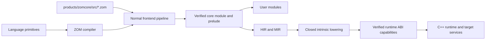
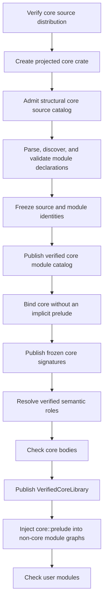
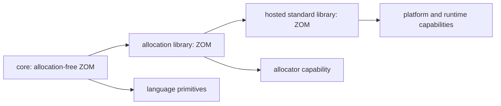

# RFC 0025: Source-Backed Core Library Architecture

## Summary

This RFC defines ZOM's core library as an unversioned, source-backed toolchain
module written in ZOM. Public core declarations are parsed, bound, checked, and
published through the same semantic pipeline as application source. The
compiler retains only language primitives, closed semantic-role bindings, and
closed intrinsic lowering for semantics or target guarantees that ordinary ZOM
cannot provide. The C++ runtime retains only services that ZOM source cannot
provide with the required execution semantics, exposed behind verified ABI
capabilities.

The core library has one stable, unversioned toolchain identity. Each admitted
distribution is bound to its exact source-tree digest, but content is not
misused as a release number or embedded in the stable unit identity. Core never
participates in package release selection, semantic-version constraints,
lockfiles, feature resolution, or compatibility fallback. This RFC directly
replaces RFC 0024's package-release bootstrap while retaining its exact
marker-policy, authority, proof, and fail-closed requirements.

## Motivation

The repository contains a source-backed standard-prelude seed in
`products/zomcore`, but it is packaged as a normal `zomcore` release with the
placeholder semantic version `0.0.0`. The production compiler still injects no
configured prelude and starts checking with an explicit-only marker policy.
The seed therefore proves that two declarations can be packaged; it does not
yet establish a core-library architecture or a production core dependency.

A compiler-owned core library is not an independently selected user package.
Giving it a package version introduces a compatibility coordinate where no
compatibility choice exists, mixes trusted toolchain input with dependency
resolution, and leaves every compiler subsystem free to invent its own
boundary between built-in behavior, ZOM source, and runtime code.

ZOM needs one architecture before the prelude seed grows. Otherwise marker
interfaces, operator interfaces, primitive methods, panic support, allocation,
concurrency, and platform services can acquire duplicate declarations or
compiler-name special cases that become difficult to remove.

The current production body checker, HIR builder, and MIR builder only carry a
small scalar-literal function path. Rich operator, call, aggregate, drop,
allocation, and runtime lowering are not implemented merely because their
enums or RFC contracts exist. The first source expansion beyond declaration-
only markers must therefore follow real checker and lowering capabilities
rather than treating parseable core source as an executable library.

## Goals

- Make ZOM source the sole authority for every user-visible core declaration.
- Give the compiler-bundled core one stable unversioned identity and bind every
  compilation to an exact verified source distribution.
- Keep the core module outside user package resolution, lockfiles, and SemVer.
- Compile core source through the production parser, binder, checker, HIR, and
  later backend paths without a second language implementation.
- Define an acyclic bootstrap sequence for the core module and its prelude.
- Separate language primitives, source library APIs, compiler intrinsics, and
  runtime ABI services.
- Retain RFC 0024's verified `Copy` and `Linear` authority without spelling
  lookup or source-less declarations.
- Make the allocation-free core usable without an operating system, heap,
  scheduler, filesystem, network, or process environment.
- Reject missing, changed, redirected, cyclic, or capability-incompatible core
  input before publishing user semantic facts.
- Delete the package-shaped core bootstrap and every empty-prelude fallback in
  the implementation transaction.

## Non-Goals

- Defining a complete standard-library API catalog.
- Adding heap collections, owned strings, filesystem, networking, process,
  thread, task, channel, or scheduler APIs.
- Defining allocator selection or a hosted standard-library distribution.
- Adding new source syntax for compiler intrinsics.
- Implementing target LIR, LLVM translation, object emission, or linking.
- Making the core module replaceable by a user package.
- Supporting two core layouts, two identities, or two prelude paths.
- Preserving package coordinates or cache entries produced by the current
  unreleased repository.
- Defining compiler self-hosting or stage-to-stage compiler bootstrapping.

## Prior Art

### Rust `core`, `alloc`, And `std`

Rust keeps `core` dependency-free, allocation-free, and platform-independent.
Heap-backed collections live in `alloc`, while hosted services live in `std`.
The compiler recognizes a small set of language items that are still real
library declarations.

ZOM adopts the allocation boundary and the distinction between compiler roles
and source declarations. ZOM does not adopt a release coordinate for its
compiler-bundled core, and it does not expose unstable language-item
annotations to ordinary packages.

References:

- <https://doc.rust-lang.org/stable/core/>
- <https://doc.rust-lang.org/stable/alloc/>
- <https://doc.rust-lang.org/nightly/std/attribute.no_std.html>
- <https://rustc-dev-guide.rust-lang.org/lang-items.html>

### Swift Standard Library And Runtime

Swift implements its standard-library surface in Swift while maintaining a
separate runtime for metadata, allocation, casting, concurrency, and ABI
services. Compiler-known protocols remain standard-library declarations
rather than anonymous compiler-created types.

ZOM adopts the source-library/runtime split and exact compiler-known semantic
roles. ZOM does not adopt a binary-compatibility burden before a release or a
second source-level declaration inside the runtime.

References:

- <https://github.com/swiftlang/swift/tree/main/stdlib/public/core>
- <https://github.com/swiftlang/swift/tree/main/stdlib/public/runtime>
- <https://github.com/swiftlang/swift/blob/main/stdlib/public/core/Builtin.swift>
- <https://github.com/swiftlang/swift/blob/main/include/swift/AST/Builtins.def>
- <https://github.com/swiftlang/swift/blob/main/include/swift/AST/KnownProtocols.def>
- <https://github.com/swiftlang/swift/blob/main/docs/Runtime.md>

### Zig Standard Library And Built-In Modules

Zig supplies `std` and `builtin` as toolchain modules. The standard library is
source code in the implementation language, while target and compilation
facts are supplied by a distinct built-in module.

ZOM adopts a toolchain-supplied source module with deterministic identity and a
separate compiler capability boundary. ZOM does not expose a broad public
built-in escape hatch; compiler participation remains a closed reviewed set.

References:

- <https://ziglang.org/documentation/master/#Zig-Standard-Library>
- <https://ziglang.org/documentation/master/#import>
- <https://github.com/ziglang/zig/tree/master/lib/std>
- <https://github.com/ziglang/zig/tree/master/lib/compiler_rt>

### Go Predeclared Identifiers And Source Packages

Go keeps a small language universe of predeclared identifiers while its
standard packages remain ordinary source packages compiled by the toolchain.

ZOM adopts the principle that only true language primitives belong to the
compiler. ZOM does not infer intrinsic behavior from a package name, function
name, or declaration spelling.

References:

- <https://go.dev/ref/spec#Predeclared_identifiers>
- <https://go.dev/src/builtin/builtin.go>
- <https://go.dev/src/runtime/>
- <https://go.dev/src/cmd/compile/internal/ssagen/intrinsics.go>

### Compiler Bootstrap Scope

Rust, Go, and Zig document staged compiler bootstrapping because their
compilers are implemented wholly or partly in the target language. That is a
different dependency problem from compiling a source-backed core library with
the current host compiler.

ZOM adopts only the explicit dependency staging principle here: the current
C++ compiler compiles the ZOM core after primitive semantics are available and
before user modules are checked. Compiler self-hosting requires a separate RFC.

References:

- <https://rustc-dev-guide.rust-lang.org/building/bootstrapping/what-bootstrapping-does.html>
- <https://go.dev/doc/install/source#go14>
- <https://ziglang.org/learn/overview/#bootstrapping-a-zig-compiler>

## Guide-Level Explanation

Every ZOM compilation has one compiler-supplied module named `core`. It is not
a dependency written in `Zom.toml`, has no release number, and cannot be
overridden by a workspace, registry, VCS dependency, environment variable, or
command-line search path.

The initial source layout is:

```text
products/zomcore/
  README.md
  src/
    core.zom
    core/
      marker.zom
      prelude.zom
```

The root module anchors the toolchain namespace:

```zom
module core;
```

`core::marker` owns the initial semantic declarations:

```zom
module marker;

export interface Copy {}
export interface Linear {}
```

`core::prelude` is an explicit re-export allowlist:

```zom
module prelude;

export core::marker::{Copy, Linear};
```

These snippets are the exact initial file bytes:

| Repository Path | Inventory Path | Bytes | SHA-256 | Module Path |
|---|---|---:|---|---|
| `src/core.zom` | `core.zom` | 13 | `63421b0e8a03da646d4e6427231bc743df2731122b56d7e23ebe4425c9c8e9d7` | `core` |
| `src/core/marker.zom` | `core/marker.zom` | 68 | `0dcee31a4992b85ec803f7073e6c03519b6e963325559af28bed1443a86a9a0f` | `core::marker` |
| `src/core/prelude.zom` | `core/prelude.zom` | 54 | `2431a21b2a9bec11481b2c56d4b7099865f44df38515155391e3c9b0b12dd357` | `core::prelude` |

Each snippet ends with the LF shown after its final line. Module discovery
starts at `src/core.zom`; a child path `core::x` resolves under
`src/core/x.zom` or `src/core/x/mod.zom` using RFC 0008 rules. The initial
inventory admits only the direct-file candidates listed above. Child modules
are selected by their canonical paths; the root file does not declare module
aliases or a second module declaration.

The root module exposes the public module tree. Ordinary modules receive one
implicit dependency edge to `core::prelude`. Core modules receive no implicit
prelude edge and use explicit imports, preventing a bootstrap cycle.

Core source is compiled like other ZOM source. Diagnostics point into the
installed `.zom` file, definitions receive canonical semantic identities, IDE
consumers can navigate to them, and incremental queries depend on their exact
source digest.

The boundary is:



Primitive types, references, tuples, arrays, functions, literals, control flow,
and the minimum operations required to type-check those forms are language
semantics. Interfaces, methods, helper types, constants, and user-callable
functions belong in ZOM source. Heap and hosted services do not belong in
`core`.

## Reference-Level Design

### Architectural Layers

The implementation recognizes these non-overlapping layers:

| Layer | Authority | May Declare User-Visible APIs | Dependencies |
|---|---|---:|---|
| Language primitives | Language specification and compiler | No library declarations | None |
| Core library | `products/zomcore/src/**` ZOM source | Yes | Language primitives only |
| Intrinsic lowering | Compiler IR/backend | No | Verified core identity and target facts |
| Runtime ABI | `products/zomlang/runtime/**` | No | Target and platform services |
| Allocation library | Future ZOM source | Yes | Core plus an allocator capability |
| Hosted standard library | Future ZOM source | Yes | Core, allocation, and explicit platform capabilities |

`libraries/zc` is the host implementation library used to build the compiler
and runtime. It is not ZOM's target-language core library and cannot define
ZOM user-visible semantics.

### Core Source Contract

`products/zomcore/src` is the canonical repository source root and
`share/zom/core/src` is the build-tree and installed source root. The loader
accepts exactly regular `.zom` files below that directory.

Every admitted file:

- has a canonical relative path;
- is UTF-8 without a byte-order mark;
- uses LF line endings;
- contains no trailing whitespace;
- ends in exactly one LF byte; and
- is neither a symbolic link nor reached through a symbolic-link directory.

The source inventory is sorted by canonical relative-path bytes. Duplicate
canonical paths, case-fold collisions, non-source files, missing
`core.zom`, missing `core/prelude.zom`, unreadable files, and paths escaping
the source root reject the distribution.

The initial public inventory is limited to the `core`, `core::marker`, and
`core::prelude` modules. A later core API proposal may add source modules, but
must preserve this RFC's layer and dependency rules.

Core source may not:

- import a user package;
- import a future allocation or hosted library;
- declare a package, release, feature, or build-script contract;
- contain a foreign block until the exact runtime capability is accepted by an
  RFC and verified by the selected target;
- depend on an environment variable, current working directory, registry,
  network, user cache, or lockfile; or
- select behavior by toolchain release spelling.

### Unversioned Toolchain Identity

The toolchain core is not a `PackageKey`. The identity model gains one
compilation-unit sum type while retaining the complete RFC 0011 compilation
configuration:

```text
ToolchainComponent = Core

ToolchainUnitKey { component: ToolchainComponent }

CompilationUnitIdentity =
    UserPackage { package: PackageKey }
  | Toolchain { toolchain: ToolchainUnitKey }

CrateKey {
  unit: CompilationUnitIdentity,
  kind: CrateTargetKind,
  targetName: TargetName,
  compilation: CompilationConfigKey,
}
```

The `Toolchain(Core)` unit has `Library` target kind, target name `core`, the
complete selected target and semantic options in `CompilationConfigKey`, and
no build-script producer. One core crate is instantiated for every distinct
core compilation projection required by a session:

```text
coreCompilationFor(consumer: CompilationConfigKey) =
  CompilationConfigKey {
    domain: consumer.domain,
    target: consumer.target,
    semanticOptions: {
      editionYear: 2026,
      useUnicode: consumer.semanticOptions.useUnicode,
      allowDollarIdentifiers:
        consumer.semanticOptions.allowDollarIdentifiers,
      supportRegexLiterals:
        consumer.semanticOptions.supportRegexLiterals,
    },
    buildScriptProducer: None,
  }
```

A target-domain consumer therefore receives a target-domain core crate for the
same canonical target. Every crate in an RFC 0008 preparatory context receives
a host-domain core crate for the same canonical host target. This includes the
`BuildScript` root and every recursively selected host-domain `Library`
dependency. The distribution record witnesses and must equal the provider's
canonical `2026` edition. Core edition is not read from source or user package
input. Consumer crates of any accepted edition use the prelude from their
exact projected core crate. The unit has no package source, package name,
release, feature set, dependency aliases, or development domain.

`SourceOriginKey` gains one `CoreFile` alternative with tag `0x05`, containing
`ToolchainUnitKey` and a canonical relative path. Every caller that currently
assumes `CrateKey::package()` switches exhaustively on
`CompilationUnitIdentity`. `PackageRegistry` becomes
`CompilationUnitRegistry`, and `PackageId` becomes `CompilationUnitId` in
semantic identity consumers. RFC 0012 package resolution continues to produce
only `PackageKey` values and package dependency edges. No sentinel release and
no optional package field are introduced.

Canonical encoding uses the unversioned domain `zom.toolchain-core-key`.
`UserPackage` has union tag `0x01`; `Toolchain` has union tag `0x02`.
`ToolchainComponent::Core` has tag `0x01`.
`CoreFile` encodes its complete `ToolchainUnitKey` followed by its canonical
relative path. `CrateKey` encodes the expanded
`CompilationUnitIdentity`, `CrateTargetKind`, `TargetName`, and the unchanged
complete `CompilationConfigKey`, in that order.

`CrateDependencyEdgeKey` replaces its mandatory package-edge parent with an
exhaustive origin:

```text
CrateDependencyOrigin =
    UserPackage { edge: PackageDependencyEdgeKey }
  | ToolchainCore

CrateDependencyEdgeKey {
  origin: CrateDependencyOrigin,
  consumer: CrateKey,
  provider: CrateKey,
}
```

`UserPackage` has tag `0x01` followed by the complete canonical
`PackageDependencyEdgeKey` payload. `ToolchainCore` has tag `0x02` and no
variant payload. `CrateDependencyEdgeKey` canonically encodes the origin union
followed by the complete consumer and provider `CrateKey` values.
`ToolchainCore` is valid only when `provider.unit` is
`Toolchain(Core)`, `provider.kind` is `Library`, `provider.targetName` is
`core`, and the consumer is a user-package crate admitted to the same verified
semantic context. A target-domain consumer kind must be `Library`, `Binary`,
`Test`, `Benchmark`, or `Example`. A host-domain consumer kind must be
`BuildScript` or `Library`, matching RFC 0008's preparatory closure. The
provider compilation must equal `coreCompilationFor(consumer.compilation)`.
This validates the domain, canonical target, and every non-edition semantic
option exactly; it also requires provider edition `2026` and no build-script
producer.
Package dependency graphs and lockfiles never contain this edge. The semantic
crate graph contains exactly one such edge per consumer crate that uses the
mandatory core prelude and shares one provider among consumers with equal core
compilation projections.

The admitted distribution record includes source and semantic-role authority:

```text
CoreSemanticRole =
    Copy
  | Linear

CoreRoleIdentityTemplate {
  role: CoreSemanticRole,
  module: CanonicalModulePath,
  owners: EmptySequence,
  kind: DefinitionKind,
  namespace: DefinitionNamespace,
  declaredName: NfcDeclaredName,
  overloadHeader: Maybe<OverloadHeaderDigest>,
}

CoreSourceFile {
  path: CanonicalRelativePath,
  digest: Sha256Digest,
}

CoreDistributionRecord {
  editionYear: uint32,
  rootModule: CanonicalRelativePath,
  preludeModule: CanonicalRelativePath,
  files: SortedNonEmptySequence<CoreSourceFile>,
  roles: SortedNonEmptySequence<CoreRoleIdentityTemplate>,
}

distributionDigest =
  SHA256(
    ASCII("zom.core-distribution") ||
    0x00 ||
    Encode(CoreDistributionRecord)
  )
```

`rootModule` is `core.zom`; `preludeModule` is `core/prelude.zom`. Each file
digest is SHA-256 over its exact admitted bytes. Scalars, paths, digests,
sequences, names, owners, and optional overload headers use RFC 0011 canonical
encoding. `CoreSemanticRole` tags are `Copy = 0x01` and `Linear = 0x02`.
Templates sort by role tag and must contain each role exactly once. The initial
templates are:

| Role | Module | Owners | Kind | Namespace | Name | Overload |
|---|---|---|---|---|---|---|
| `Copy` | `core::marker` | empty | `Interface` | `Type` | `Copy` | none |
| `Linear` | `core::marker` | empty | `Interface` | `Type` | `Linear` | none |

No traversal position or declaration ordinal participates in role authority.
This RFC admits only top-level semantic roles, so `owners` must encode the RFC
0011 zero-length owner sequence. Adding a nested role requires an RFC that
defines a configuration-independent owner-identity template; a
compilation-specific `DefinitionKey` cannot enter the distribution record.
The record contains no schema version, release number, compatibility range, or
user-provided expected digest.

The initial `CoreDistributionRecord` canonical encoding is 398 bytes. With the
domain and zero separator, the SHA-256 input is 420 bytes and its golden digest
is:

```text
9cd508706516bcf033ff6dbbadd9cc8c83934cabe7e5b88992b231f778ce2f47
```

The complete 398-byte record vector is:

```text
000007ea00000000000000010000000000000008636f72652e7a6f6d00000000000000020000000000000004636f7265000000000000000b7072656c7564652e7a6f6d000000000000000300000000000000010000000000000008636f72652e7a6f6d63421b0e8a03da646d4e6427231bc743df2731122b56d7e23ebe4425c9c8e9d700000000000000020000000000000004636f7265000000000000000a6d61726b65722e7a6f6d0dcee31a4992b85ec803f7073e6c03519b6e963325559af28bed1443a86a9a0f00000000000000020000000000000004636f7265000000000000000b7072656c7564652e7a6f6d2431a21b2a9bec11481b2c56d4b7099865f44df38515155391e3c9b0b12dd35700000000000000020100000000000000020000000000000004636f726500000000000000066d61726b6572000000000000000008020000000000000004436f7079000200000000000000020000000000000004636f726500000000000000066d61726b65720000000000000000080200000000000000064c696e65617200
```

The independent native oracle constructs this vector field by field without
calling the production record encoder. It mutates the edition, root path,
prelude path, every file path and digest, every role tag, module path, owner
sequence, definition kind, namespace, declared name, overload-header presence,
sequence count, domain byte, and separator, and requires a changed digest or
typed decode failure.

```text
VerifiedCoreDistribution {
  record: CoreDistributionRecord,
  distributionDigest: Sha256Digest,
  sourceRoot: VerifiedCoreSourceRoot,
}
```

`VerifiedCoreSourceRoot` is an opaque, process-local capability issued only
after executable-relative directory admission. `sourceRoot` is provenance and
is excluded from semantic equality and canonical encoding.
`distributionDigest` must equal the digest recomputed from `record`.
The verifier requires `record.editionYear` to equal the projected core
`crate.compilation.semanticOptions.editionYear`; mismatch is
`EditionMismatch`. There is no other core edition input.

The build generates the expected inventory and digest from repository source,
embeds both in `zomc`, and materializes the same source files into the build and
install trees. At startup, a distribution builder and an independent verifier
separately enumerate and hash the filesystem source, compare it with the
embedded inventory and digest, and publish `VerifiedCoreDistribution` only
when both agree. Candidate-carried bytes never supply their own expectation.

`SemanticContextFingerprint` replaces its package sequence with the sorted
`CompilationUnitIdentity` sequence and additionally includes the exact
`distributionDigest` for every toolchain unit. Package-edge input remains the
RFC 0012 user-package edge sequence. Changing a core file or role template
changes the admitted distribution digest, source-content inputs, semantic
context, and affected query revisions. It does not change
`ToolchainUnitKey`, which is the stable identity of the compiler's core
component. A host/target domain mismatch, target mismatch, non-edition option
mismatch, non-2026 provider edition, or build-script-producer presence rejects
the edge before publication. There is no migration, compatibility selection,
or fallback to an older digest.

### Toolchain Core Module Discovery

The closed RFC 0008 `ModuleSearchRoot` union gains one unversioned alternative:

```text
ToolchainCoreModuleSearchRoot {
  crate: CrateKey,
  distributionDigest: Sha256Digest,
}

ModuleSearchRoot =
    Workspace
  | Package
  | Generated
  | ToolchainCore
```

`ToolchainCore` has search-root tag `0x04` and canonically encodes the complete
projected core `CrateKey` followed by `distributionDigest`. Construction
requires `crate.unit = Toolchain(Core)`, library kind, target name `core`,
provider edition `2026`, no build-script producer, and a digest equal to the
session's `VerifiedCoreDistribution`. It contains no package key, release,
physical filesystem path, or optional compatibility field.

The physical source-root capability never enters a durable query value.
Instead, core admission first publishes a session-owned structural catalog
that contains no semantic handles:

```text
AdmittedCoreSourceCatalog {
  crate: CrateKey,
  distribution: Sha256Digest,
  sourceRoot: VerifiedCoreSourceRoot,
  entries: SortedNonEmptyMap<
    CanonicalModulePath,
    {
      source: SourceFileKey,
      contentDigest: Sha256Digest,
    }>,
}
```

The admission builder derives entries only from the verified distribution and
its admitted immutable source snapshots. For each inventory file it constructs
`SourceOriginKey::CoreFile`, the exact projected core `CrateKey`, canonical
module path, and source digest. Its independent verifier uses only
`VerifiedCoreDistribution`, the finalized projected `CrateKey`, and admitted
snapshots; it does not read or mutate a source or module registry.

The initial structural catalog contains exactly `core`, `core::marker`, and
`core::prelude`; `core` from `core.zom` is the root discovery seed and
`core::prelude` is the configured-prelude structural seed. Child discovery
maps `core::x` to the admitted direct-file or `mod.zom` candidate under the
fixed logical source root and never probes a workspace, package, current
directory, or unverified physical path.

`ModuleResolutionEnvironmentRecord`, `CanonicalModuleSearchRoots`,
`ModuleSearchRootsInput`, their codecs, and their environment revisions switch
exhaustively on the new `ToolchainCore` root. The structural resolver accepts
that root only with the matching process-local `AdmittedCoreSourceCatalog`;
decoded query bytes alone cannot grant filesystem access or core authority.

Only after parsing, module-declaration validation, duplicate selection, and
source/module registry freeze does the session publish:

```text
VerifiedCoreModuleCatalog {
  semanticContext: SemanticContextBrand,
  crate: CrateId,
  distribution: Sha256Digest,
  entries: SortedNonEmptyMap<
    CanonicalModulePath,
    {
      module: ModuleId,
      source: SourceFileId,
      contentDigest: Sha256Digest,
    }>,
}
```

The post-freeze builder projects the selected structural inputs through the
frozen `SemanticIdentityRegistrySet`. Its independent verifier requires one
entry per admitted source, exact context ownership for every handle, equality
between registry-retained `CrateKey`, `SourceFileKey`, and `ModuleKey` records
and the pre-parse catalog, validated module declarations, and equal
distribution and content digests. A parse, declaration-name, duplicate, or
discovery failure therefore publishes neither a module handle nor a verified
module catalog and cannot require registry rollback.

### Core Library Bootstrap Sequence

This sequence bootstraps the semantic dependency between the compiler frontend
and the source-backed core library. It does not bootstrap a compiler written in
ZOM, compare compiler stages, or claim self-hosting.

Core compilation is one production pipeline with an explicit bootstrap order:



The bootstrap compiler surface is limited to:

- source syntax and AST construction;
- canonical module and definition identity;
- primitive types and primitive operations specified by the language;
- declaration, generic, interface, implementation, and visibility semantics
  required by admitted core source; and
- diagnostics required to reject invalid core source.

The compiler must not create a source-less core declaration during bootstrap.
Core signatures are frozen before semantic roles are resolved. Core bodies are
checked only after the role authority needed by those bodies exists.

Lowering disposition is explicit:

```text
CoreModuleLowering =
    DeclarationOnly {
      checked: VerifiedCheckedModule,
    }
  | Executable {
      hir: VerifiedHirModule,
      mir: VerifiedBuiltMir,
      ownership: VerifiedOwnershipEventOverlay,
    }

VerifiedCoreModule {
  module: ModuleKey,
  interface: ModuleInterfaceLineage,
  executableBodies: SortedSequence<StableBodyOwnerKey>,
  lowering: CoreModuleLowering,
}
```

A module with an empty executable-body inventory must be `DeclarationOnly` and
causes no HIR, MIR, or ownership-overlay builder invocation. Its move-only
`VerifiedCheckedModule` retains the exact module-interface lineage,
repository-backed `CheckedEvidenceLease`, borrow-evidence lease, and the
session-owned repositories required by the existing frontend handoff.

A module with a non-empty inventory must be `Executable`.
`HirBuilder::build(VerifiedCheckedModule&&)` is the sole ownership transfer
from the checked branch; no second checked-module copy or parallel checked
facts object is retained. `VerifiedHirModule` retains the checked and interface
lineage after that transfer. `VerifiedBuiltMir` and
`VerifiedOwnershipEventOverlay` are then built and independently verified from
the retained HIR and MIR capabilities. The three executable artifacts must
share the exact semantic context, module, checked-facts revision, HIR lineage,
MIR revision, and `StableBodyOwnerKey` inventory required by their existing
verifier contracts.

`CompilerSession` owns every `VerifiedModuleInterface` and checked/borrow
repository that these move-only capabilities reference for the complete
`VerifiedCoreLibrary` lifetime. `VerifiedCoreModule.interface` must equal the
lineage retained by its `DeclarationOnly.checked` or `Executable.hir`
capability. Builder and independent verifier compare the interface lineage and
body inventory before publication.

The initial root, marker, and prelude modules are all `DeclarationOnly`; no
empty or fabricated HIR, MIR, or ownership-overlay object represents them.
Whenever core gains an executable body, that body traverses the same
checked-module, HIR, MIR, ownership-overlay, and applicable backend path as a
user body before the API is described as implemented.

`VerifiedCoreLibrary` contains:

```text
VerifiedCoreLibrary {
  context: SemanticContextFingerprint,
  distribution: VerifiedCoreDistribution,
  crate: CrateKey,
  graph: VerifiedModuleGraph,
  modules: SortedNonEmptySequence<VerifiedCoreModule>,
  prelude: ModuleKey,
  roles: VerifiedStandardMarkerAuthority,
}
```

The builder and independent verifier reconstruct every field from admitted
source, frozen registries, and the verified graph. A missing field, foreign
identity, stale context, additional core root, graph cycle, or self-prelude
edge rejects publication atomically. `crate.unit` must be
`CompilationUnitIdentity::Toolchain(ToolchainComponent::Core)`,
`crate.compilation.semanticOptions.editionYear` must equal
`distribution.record.editionYear`, and the complete distribution digest must
participate in the semantic context.

### Prelude Contract

`core::prelude` is a normal source module with an explicit exported-symbol
allowlist. It is not the root of the whole core API and does not wildcard
re-export the core module tree.

The leading qualified-module segment `core` is reserved for the verified
toolchain unit. A user crate target, dependency alias, or root module cannot
claim it; rejection uses `ZOM3027 ToolchainModuleRootReserved` with message
`Module root '{0}' is reserved by the compiler toolchain`, one `ModulePath`
argument, and the offending declaration or alias as primary anchor. A registry
package may still have package name `core`, but consumers must select a
different dependency alias and cannot expose it as the `core` root.

Every non-core consumer crate, including a host `BuildScript` root and every
host `Library` dependency in its preparatory closure, has exactly one
session-level
`ConfiguredCratePrelude` input selecting the verified `core::prelude`
`ModuleKey`. Request derivation emits exactly one `Prelude`
`ModuleDependencyRequest` for each non-core module in that crate. Core modules
receive none. Each derived edge participates in module-graph verification,
export-surface projection, incremental dependency tracking, cycle checking,
and diagnostics.

Prelude lookup remains the final RFC 0004 lookup tier. A local declaration or
explicit import may shadow the bare spelling `Copy` or `Linear`, but the
shadowing definition receives no semantic role. An explicit
`core::marker::{Copy}` import resolves only through the verified toolchain
root. Ordinary duplicate-import and visibility diagnostics remain unchanged.

There is no:

- empty configured-prelude production mode;
- source-tree or current-directory fallback;
- package or command-line override;
- retry without core after admission failure; or
- alternate prelude selected by edition or release number.

Tests that intentionally exercise parser-only behavior may omit a compilation
session. Every binder, checker, HIR, MIR, CLI, package, and incremental-session
fixture uses a real verified core distribution.

### Semantic Roles

User-visible semantic declarations remain ordinary core source definitions.
Compiler participation is represented by a closed semantic-role map, never by
name lookup. `CoreSemanticRole` and `CoreRoleIdentityTemplate` are part of the
hashed `CoreDistributionRecord`, so changing any identity field changes the
admitted distribution and semantic context.

The trusted build inventory contains exactly one complete identity template
for each role. After the exact core `ModuleKey` is frozen, the role builder
constructs the complete RFC 0011 `DefinitionIdentityRecord` from that module
key plus the template's owners, kind, namespace, declared name, and overload
header, then computes the expected `DefinitionKey`. Binding must have
published exactly that key and retained an equal identity record. The
independent verifier repeats construction and verifies module ownership,
declaration kind, marker shape, visibility, uniqueness, context, complete
identity-record equality, and distribution digest. This is construction from
trusted configuration, not discovery by spelling or traversal position.

The initial templates identify `Copy` and `Linear` in `core::marker`. RFC 0024's
exact policy registry, role distinction, proof capability, body-checking input,
ownership-overlay input, independent verification, failure precedence, and
diagnostic contracts remain normative. Any RFC 0024 field that names a package
release or package-backed prelude is replaced by `ToolchainUnitKey`,
`VerifiedCoreDistribution`, and the `core::prelude` module defined here.

Packages cannot define, redirect, shadow, or configure a semantic role. Equal
spelling in another module has no compiler meaning.

### Language Primitives

The compiler directly owns only semantics that cannot be declared as ZOM
library items:

- primitive scalar and structural type forms;
- references, raw pointers, function types, tuples, arrays, unit, never, and
  nullable type construction;
- literals and primitive-only operations;
- control-flow semantics;
- layout and calling-convention facts selected by verified target input; and
- the mechanics for invoking an accepted closed intrinsic.

Primitive syntax does not manufacture a visible declaration. User-callable
methods, interfaces, conversion APIs, formatting, iteration, comparison
interfaces, marker interfaces, panic wrappers, and memory helpers are core
source when they are introduced.

### Intrinsic Contract

An intrinsic is permitted only when the required semantics or target guarantee
cannot be expressed in ordinary ZOM and the operation requires compiler IR or
target information. Performance alone is insufficient justification when an
ordinary source implementation can be optimized. Every intrinsic requires a
separate accepted RFC that adds:

- one case to the closed, unversioned `CoreIntrinsicRole` union;
- one exact core `DefinitionKey`;
- its type and safety preconditions;
- its memory effects, unwind behavior, and constant-evaluation behavior;
- checked-fact and HIR representation;
- lowering and target-capability requirements;
- its source fallback or an explicit proof that no fallback is valid;
- deterministic failure behavior; and
- source, unit, lit, IR, and mutation tests.

The initial `CoreIntrinsicRole` inventory is empty. `Copy` and `Linear` are
semantic roles, not intrinsics.

Intrinsic selection uses verified identity only. Attributes in user source,
function names, module path text, declaration order outside the trusted
identity template, symbol spelling, or runtime symbol names cannot grant intrinsic
semantics.

The unused `intrinsic` source token is removed from the lexer token inventory,
AST syntax-kind inventory, lexical specification, generated grammar
expectations, and tests in the implementation transaction. Intrinsics are not
a declaration form or reserved source word. A future RFC that needs
source-level intrinsic syntax must define and implement the complete syntax,
identity, checking, lowering, and diagnostic contract in one change.

Because the initial intrinsic inventory is empty, implementation creates no
empty C++ role enum, registry object, codec, runtime table, or source module as
a placeholder. Lexer unit tests and lit grammar tests prove that `intrinsic`
now tokenizes and parses wherever an ordinary identifier is legal; every
reserved-word fixture and generated token expectation is updated atomically.

### Runtime ABI Boundary

The runtime implements services that ordinary ZOM cannot provide with the
required execution semantics; it does not own core declarations. These
services may include allocator primitives, reference-counting primitives,
type metadata, dynamic casts, panic and unwind machinery, startup, thread-local
storage, scheduler primitives, compiler-emitted memory operations, and target
or operating-system integration. A public ZOM API that needs such a service is
written in ZOM and calls a private foreign declaration whose symbol, calling
convention, target support, unwind behavior, ownership transfer, and safety
preconditions are admitted by the verified runtime and target capability
registries.

Core remains allocation-free and platform-independent. Therefore its initial
source declares no runtime ABI calls. Compiler-emitted memory operations,
panic mechanics, and target intrinsics remain governed by the accepted RFC
0006 and RFC 0010 contracts. Any target-capability registry, backend
translation contract, or source-level core wrapper must reach acceptance
before it becomes a dependency of core; pending proposals are not current
authority.

The runtime may not export a second user-facing declaration set, inspect core
names to select behavior, or silently provide a missing target capability.

### Allocation And Hosted-Library Boundary

Heap-backed ownership, growable collections, owned strings, public
reference-counting policy and types, and allocator APIs belong in a future
allocation library written in ZOM. This does not prohibit private allocator,
atomic reference-counting, metadata, or unwind primitives in the runtime ABI.
Filesystem, networking, process, environment, threading, scheduling, and
hosted panic policy belong in a future hosted standard library written in ZOM.

The dependency direction is:



`core` cannot depend on either future layer. This RFC does not reserve their
package names, manifests, release policy, or API inventories.

### Diagnostics And Failure Semantics

Core admission, bootstrap, and publication failures use this closed algebra:

```text
CoreLibraryIssue =
    ReadFailed                 // 0x01
  | InvalidPath                // 0x02
  | InvalidSourceBytes         // 0x03
  | DistributionMismatch       // 0x04
  | EditionMismatch            // 0x05
  | InputContextMismatch       // 0x06
  | ParseRejected              // 0x07
  | ModuleGraphRejected        // 0x08
  | SignatureRejected          // 0x09
  | RoleRejected               // 0x0a
  | BodyRejected               // 0x0b
  | PipelineInvariantRejected  // 0x0c
  | VerifiedStateMismatch      // 0x0d
  | VerifierDisagreement       // 0x0e

CoreFailureCoordinate =
    None
  | InventoryEntry { ordinal: uint64 }
  | File { path: CanonicalRelativePath }
  | Module { module: ModuleKey }
  | Role { role: CoreSemanticRole }
  | Body { body: StableBodyOwnerKey }
  | Distribution { digest: Sha256Digest }
  | Context { fingerprint: SemanticContextFingerprint }

CoreFailureCauseDomain =
    Lex
  | Parse
  | Module
  | Signature
  | Role
  | Body
  | CheckedModule
  | Hir
  | Mir
  | Ownership

CoreFailureCauseKey {
  domain: CoreFailureCauseDomain,
  digest: Sha256Digest,
}

CoreLibraryFailure {
  issue: CoreLibraryIssue,
  coordinate: CoreFailureCoordinate,
  causes: SortedSequence<CoreFailureCauseKey>,
}
```

Issue tags are the hexadecimal values shown. Coordinate tags are `None = 0x01`
through `Context = 0x08` in declaration order. Cause-domain tags are `Lex =
0x01` through `Ownership = 0x0a` in declaration order. A non-pipeline cause
digest is SHA-256 over the complete existing typed failure's canonical
encoding. Pipeline invariant causes use the exact grouped framing below. The
only permitted coordinates are:

| Issue | Coordinate |
|---|---|
| `ReadFailed` | `None` or `File` |
| `InvalidPath` | `InventoryEntry` |
| `InvalidSourceBytes` | `File` |
| `DistributionMismatch` | `Distribution` |
| `EditionMismatch` | `Distribution` |
| `InputContextMismatch` | `Context` |
| `ParseRejected` | `File` |
| `ModuleGraphRejected` | `File` or `Module` |
| `SignatureRejected` | `Module` |
| `RoleRejected` | `Role` |
| `BodyRejected` | `Body` |
| `PipelineInvariantRejected` | `Body` or `Context` |
| `VerifiedStateMismatch` | `Context` |
| `VerifierDisagreement` | `Distribution` or `Context` |

`causes` identifies the complete existing lexer, parser, module, checker, HIR,
MIR, or ownership failure facts. `ParseRejected` permits `Lex` and `Parse`,
`ModuleGraphRejected` permits `Module`, `SignatureRejected` permits
`Signature`, `RoleRejected` permits `Role`, `BodyRejected` permits `Body`, and
`PipelineInvariantRejected` permits `CheckedModule`, `Hir`, `Mir`, and `Ownership`.
Every other issue requires an empty cause sequence. Duplicate causes, a
disallowed cause domain, or an issue/coordinate pair outside this table rejects
construction.

Every producer condition maps exactly as follows:

| Producer Condition | Issue | Coordinate | Causes |
|---|---|---|---|
| Source root cannot be opened or an admitted file cannot be read | `ReadFailed` | `None` or `File` | empty |
| Inventory path, canonicalization, symlink, collision, or root-escape rejection | `InvalidPath` | `InventoryEntry` | empty |
| UTF-8, BOM, line-ending, trailing-space, or final-LF rejection | `InvalidSourceBytes` | `File` | empty |
| Embedded inventory, source digest, source count, or catalog distribution digest mismatch | `DistributionMismatch` | `Distribution` | empty |
| Distribution edition differs from projected core edition | `EditionMismatch` | `Distribution` | empty |
| Core edge, search root, structural catalog, snapshot, crate, target, semantic option, source origin, or semantic context does not match the admitted projection | `InputContextMismatch` | `Context` | empty |
| Lexer or parser rejects an admitted core file | `ParseRejected` | `File` | `Lex` or `Parse` |
| Discovery, declaration-name validation, duplicate selection, dependency construction, or module-graph verification rejects input | `ModuleGraphRejected` | `File` before a valid `ModuleKey`, otherwise `Module` | `Module` |
| Signature or module-interface construction rejects a module | `SignatureRejected` | `Module` | `Signature` |
| Standard marker authority construction rejects a configured role | `RoleRejected` | `Role` | `Role` |
| Body checker rejects source semantics before frontend handoff | `BodyRejected` | `Body` | `Body` |
| An admitted RFC 0010 `IdentityInvariantRejected` or `IrInvariantRejected` branch occurs during checked-module assembly, HIR construction or verification, MIR construction or verification, or ownership-overlay construction or verification | `PipelineInvariantRejected` | `Context` for identity branch; `Body` for each expanded module/definition-owner group in the IR branch | Exact enclosing-operation domain: `CheckedModule`, `Hir`, `Mir`, or `Ownership` |
| Canonical query decode, frozen-registry lookup, or already verified cross-lineage input is impossible in the active context | `VerifiedStateMismatch` | `Context` | empty |
| Independent distribution or catalog verifier disagrees with its builder | `VerifierDisagreement` | `Distribution` | empty |
| Independent checked, HIR, MIR, ownership, session, or publication verifier disagrees with its builder | `VerifierDisagreement` | `Context` | empty |

A search-root tag or payload that fails canonical decode in an active query
context is `VerifiedStateMismatch`; a canonically decoded root that names a
foreign crate, distribution, or compilation projection is
`InputContextMismatch`.

For `PipelineInvariantRejected`, this RFC defines exact local framing:

```text
PipelineInvariantBranch =
    IdentityInvariant // 0x01
  | IrInvariant       // 0x02

CoreIdentityInvariantRecord {
  kind: IdentityInvariantKind,
  phase: IdentityAllocationPhase,
  structuralInputKey: Maybe<CanonicalByteString>,
  diagnosticRange: Maybe<UnbrandedSourceRange>,
  apiSite: IdentityApiSite,
  inputTraversalOrdinal: uint32,
}

IdentityAllocationPhase =
    Context             // 0x01
  | Registry            // 0x02
  | Encoding            // 0x03
  | Package             // 0x04
  | Crate               // 0x05
  | Source              // 0x06
  | Module              // 0x07
  | Definition          // 0x08
  | Impl                // 0x09
  | GenericParameter    // 0x0a
  | CallableParameter   // 0x0b
  | SemanticType        // 0x0c

IdentityInvariantKind =
    InvalidHandle               // 0x01
  | ForeignContext              // 0x02
  | ForeignRegistry             // 0x03
  | SlotOutOfRange              // 0x04
  | AncestorMismatch            // 0x05
  | InvalidSourceRange          // 0x06
  | DuplicateCanonicalKey       // 0x07
  | InvalidClosedValue          // 0x08
  | PostFreezeMutation          // 0x09
  | BrandExhausted              // 0x0a
  | DuplicateSingletonStore     // 0x0b
  | NonCanonicalEncoding        // 0x0c
  | DigestCollision             // 0x0d

IdentityApiSite =
    ContextBrandIssue       // 0x01
  | RegistryBrandIssue      // 0x02
  | CanonicalEncode         // 0x03
  | PackageFreeze           // 0x04
  | CrateFreeze             // 0x05
  | SourceFreeze            // 0x06
  | ModuleFreeze            // 0x07
  | DefinitionFreeze        // 0x08
  | ImplFreeze              // 0x09
  | SemanticTypeStoreCreate // 0x0a
  | HandleLookup            // 0x0b
  | RegistryMutation        // 0x0c
  | GenericParameterFreeze  // 0x0d
  | CallableParameterFreeze // 0x0e

CorePipelineInvariantGroup {
  domain: CoreFailureCauseDomain,
  coordinate: CoreFailureCoordinate,
  branch: PipelineInvariantBranch,
  facts: SortedNonEmptySequence<CanonicalByteString>,
}

pipelineCauseDigest =
  SHA256(
    ASCII("zom.core-pipeline-invariant-cause") ||
    0x00 ||
    Encode(CorePipelineInvariantGroup)
  )
```

Tags and fixed-width integers use RFC 0011 canonical encoding.
`CanonicalByteString` is a `uint64` byte length followed by the exact bytes.
`Maybe` is a one-byte `0x00` or `0x01` tag followed by the payload when
present. The synchronized closed identity tags are
`IdentityInvariantKind = 0x01..0x0d`,
`IdentityAllocationPhase = 0x01..0x0c`, and
`IdentityApiSite = 0x01..0x0e`. `CoreIdentityInvariantRecord` fields encode in
declaration order;
`UnbrandedSourceRange` expands its complete `SourceFileKey`, content digest,
and two `uint64` offsets. Identity facts first sort by RFC 0011's exact order,
then each fact becomes the canonical byte string
`Encode(CoreIdentityInvariantRecord)`.

For the IR branch, each fact byte string is the length-framed expanded
`IrFailureFact::canonicalSortKey()` produced after RFC 0010 identity expansion.
Acceptance synchronizes RFC 0010 to make those sort-key bytes, not merely their
comparison order, normative for this projection. The independent verifier
reconstructs the same bytes field by field and never trusts a candidate-carried
digest.

`CheckedModuleAssembly` maps to `CheckedModule`;
`HirConstruction` and `HirVerification` map to `Hir`; `MirConstruction` and
`BuiltMirVerification` map to `Mir`; the accepted ownership-event-overlay
builder and verifier phases map to `Ownership`.

An identity-invariant result emits one group for its enclosing-operation
domain and `Context` coordinate. An IR-invariant result expands every module
owner to `StableBodyOwnerKey::module(ModuleKey)` and every definition owner to
`StableBodyOwnerKey::definition(DefinitionKey)`, then partitions the complete
sorted fact sequence by `(domain, Encode(coordinate))`. Each non-empty
partition retains RFC 0010 fact order and emits one `CoreLibraryFailure` with
one cause digest. Resulting failures sort by the ordinary failure occurrence
identity. Module and definition are the only admitted IR owners for these
phases; session and instance owners are illegal matrix shapes.

RFC 0010 invalid-descriptor normalization remains authoritative. A raw
unadmitted branch, phase, owner, site, kind, detail, or codec tuple never enters
`IrOperationResult`. It is converted exactly once into the enclosing
operation's legal `IrInvariantRejected(InvalidFact)` with its known phase and
owner, absent site, `None` detail, and structural field path. The normalized
fact then enters the ordinary IR partition above; the raw shape remains only
in the compiler bug bundle. `CanonicalCodecMismatch` is an admitted IR fact
and remains in its ordinary partition.

Native source-pipeline diagnostics remain the emitted diagnostics for
`ParseRejected`, `ModuleGraphRejected`, `SignatureRejected`, `RoleRejected`,
and `BodyRejected`. The identity branch retains RFC 0011
`ZOM9910`-`ZOM9921`; `DigestCollision` shares
`ZOM9921 IdentityNonCanonicalEncoding` with `NonCanonicalEncoding`. The IR
branch retains RFC 0010 or RFC 0007 fatal diagnostics, with
`CanonicalCodecMismatch` selecting `ZOM9949` before the phase-group
diagnostic. The core failure record selects precedence and suppresses
downstream publication without wrapping those diagnostics. An IR verifier's
admitted rejected branch is `PipelineInvariantRejected`, not
`VerifierDisagreement`; the latter is reserved for an independent
core-specific builder/verifier pair that disagrees outside an existing typed
result algebra.

Source failures use ordinary lexer, parser, binder, and checker diagnostics
anchored in core `.zom` files. Pipeline invariant failures use their existing
registered RFC 0011, RFC 0010, or RFC 0007 fatal diagnostics. Distribution and
core-specific invariant failures use the registry defined below. No verified
core library, prelude edge, checked user module, HIR, MIR, or cache entry is
published after a core failure.

The core-specific registry file is
`products/zomlang/compiler/diagnostics/diagnostics-core.def` and contains:

| Code | Name | Severity | Message |
|---|---|---|---|
| `ZOM7101` | `CoreDistributionUnavailable` | Error | `Compiler core library is unavailable ({0})` |
| `ZOM7102` | `CoreDistributionMismatch` | Error | `Compiler core library does not match this compiler ({0})` |
| `ZOM9907` | `CoreLibraryInvariantViolation` | Fatal | `Internal core library invariant is invalid ({0})` |

The single argument is one stable English identifier from this exhaustive
mapping, not a filesystem error string:

| Issue | Reason Identifier | Diagnostic |
|---|---|---|
| `ReadFailed` | `read-failed` | `ZOM7101` |
| `InvalidPath` | `invalid-path` | `ZOM7102` |
| `InvalidSourceBytes` | `invalid-source-bytes` | `ZOM7102` |
| `DistributionMismatch` | `distribution-mismatch` | `ZOM7102` |
| `EditionMismatch` | `edition-mismatch` | `ZOM7102` |
| `InputContextMismatch` | `input-context-mismatch` | `ZOM7102` |
| `ParseRejected` | `parse-rejected` | Existing cause diagnostics only |
| `ModuleGraphRejected` | `module-graph-rejected` | Existing cause diagnostics only |
| `SignatureRejected` | `signature-rejected` | Existing cause diagnostics only |
| `RoleRejected` | `role-rejected` | RFC 0024 cause diagnostics only |
| `BodyRejected` | `body-rejected` | Existing cause diagnostics only |
| `PipelineInvariantRejected` | `pipeline-invariant-rejected` | Existing RFC 0011 identity or RFC 0010/RFC 0007 pipeline fatal diagnostics only |
| `VerifiedStateMismatch` | `verified-state-mismatch` | `ZOM9907` |
| `VerifierDisagreement` | `verifier-disagreement` | `ZOM9907` |

Source-pipeline and admitted IR-pipeline failures are not wrapped in another
core diagnostic.
`ZOM9907` is emitted only for builder/verifier disagreement or an impossible
mismatch involving an already verified object. The initial core has no runtime
capability failure case because it declares no runtime calls; an RFC adding
one must extend this closed algebra and its diagnostic mapping atomically.

`ZOM7101` and `ZOM7102` anchor at the canonical compiler invocation provenance
used by package-session diagnostics. `ZOM9907` has no source anchor. Failure
precedence is distribution availability, distribution mismatch, ordinary
source-pipeline diagnostics, native IR-pipeline invariant diagnostics, then
core-specific internal invariant failure. This order is the issue-tag order
above. One earlier category suppresses every later category, and one core
failure suppresses all downstream publication. The CLI
returns its ordinary compilation-failure exit status for `ZOM7101` and
`ZOM7102`, and its internal-failure exit status for `ZOM9907`.

Failure occurrence identity is
`Encode(issue) || Encode(coordinate) || Encode(causes)`. Producers sort
failures by issue tag and then occurrence identity and emit only the first
category per compilation. The independent verifier reconstructs the same
failure set from admitted input rather than trusting candidate-carried reason
text.

### Accepted-RFC Replacement Transaction

Acceptance updates the following contracts in the same transaction. The
listed semantics remain active except for the exact replacement shown here.

| RFC | Retained Contract | Replacement |
|---|---|---|
| RFC 0004 | One `Prelude` dependency kind, verified graph edge, final lookup tier, and no prelude self-cycle | Prelude owner identity changes from package-backed core to `CompilationUnitIdentity::Toolchain(Core)` |
| RFC 0005 | Ordinary source definitions, exact marker policy, and no source-less declarations | Standard roles resolve from `core::marker` through `VerifiedCoreLibrary` |
| RFC 0007 | Exact `Copy`/`Linear` ownership decisions and fail-closed overlay input | Marker identity lineage uses the toolchain-core context and digest |
| RFC 0008 | One verified prelude surface in the session and module graph | Add `ToolchainCoreModuleSearchRoot`, verified inventory-backed catalog admission, and mandatory core distribution input outside user package resolution |
| RFC 0010 | Closed `IrOperationResult`, invariant phase matrix, normalization, and fatal diagnostics | Make expanded `IrFailureFact::canonicalSortKey()` bytes normative for core failure projection; retain one-step invalid-descriptor normalization and native diagnostics |
| RFC 0011 | Canonical semantic identity and no producerless definition placeholders | Add stable `CompilationUnitIdentity::Toolchain(Core)` and `CoreFile`; synchronize complete invariant enums/framing; retain one `CrateKey`, `ModuleKey`, and `DefinitionKey` family |
| RFC 0012 | SemVer, resolver, lockfile, features, and manifests for user packages | Explicitly exclude `ToolchainCore` from all package-release mechanisms |
| RFC 0015 | Marker shape, policy, proof, codec, and diagnostic closure | Replace package-backed prelude fields with verified toolchain-core fields |
| RFC 0017 | Tracked configured-prelude input and projection shielding | Track core distribution, export surface, prelude surface, and role authority as narrow inputs |
| RFC 0018 | Stable query keys and exact prelude invalidation | Encode `CompilationUnitIdentity` and remove core release fields from query identity |
| RFC 0024 | `Copy`/`Linear` definitions, policy, authority, proof input, failure precedence, and one prelude edge | Replace `Zom.toml`, `0.0.0`, fixed two-file digests, root-level marker declarations, resolver injection, and exact three-file install test |

The RFC 0008 synchronization is mechanical:

| RFC 0008 Surface | Replacement |
|---|---|
| `ModuleSearchRoot` and its codec | Add tag `0x04` `ToolchainCoreModuleSearchRoot`; encode projected core crate and distribution digest |
| `ModuleResolutionEnvironmentRecord` | Admit the matching process-local `AdmittedCoreSourceCatalog`; include the structural root, source snapshots, and digest in environment reconstruction |
| `CanonicalModuleSearchRoots` and `ModuleSearchRootsInput` | Switch exhaustively on `ToolchainCore`; decoded bytes never carry the source-root capability |
| Discovery-run inputs and candidate probing | For `ToolchainCore`, resolve only inventory-admitted direct-file or `mod.zom` candidates; prohibit workspace, package, current-directory, and physical-path probing |
| Root, prelude, and fixed-point seeds | Seed `core` and `core::prelude` from the admitted structural catalog and discover every selected core child without an implicit prelude |
| Source and module identity phase schedule | Admit structural catalog, parse and validate declarations, select duplicates, freeze source/module registries, then publish `VerifiedCoreModuleCatalog` |
| Preparatory-context closure | Attach the projected core edge and prelude to the host `BuildScript` root and every recursively selected host `Library` |
| Configured-prelude publication | Publish the exact post-freeze `core::prelude` `ModuleKey` once per non-core consumer crate |
| Failure, codec, mutation, and tracker fixtures | Add root-tag, payload, catalog, snapshot, phase-order, host-closure, and no-registry-rollback cases |

The RFC 0011 synchronization is mechanical:

| RFC 0011 Surface | Replacement |
|---|---|
| Compilation-unit identity | Add `CompilationUnitIdentity::Toolchain(Core)` and replace package-only crate parents exhaustively |
| Source origin | Add `CoreFile = 0x05` with complete toolchain unit and canonical relative-path payload |
| `IdentityAllocationPhase` | Replace the closed list with the exact `0x01..0x0c` declaration above; `GenericParameter = 0x0a` and `CallableParameter = 0x0b` precede `SemanticType = 0x0c` |
| `IdentityInvariantKind` | Add `DigestCollision = 0x0d` after `NonCanonicalEncoding = 0x0c` |
| `IdentityApiSite` | Add `GenericParameterFreeze = 0x0d` and `CallableParameterFreeze = 0x0e` after `RegistryMutation = 0x0c` |
| Identity diagnostic mapping | Preserve `ZOM9910`-`ZOM9921`; map both `NonCanonicalEncoding` and `DigestCollision` to `ZOM9921 IdentityNonCanonicalEncoding` |
| Identity fact ordering, framing, and fixtures | Synchronize the exact expanded enum order, `CoreIdentityInvariantRecord` encoding, mutation cases, and golden ordering before RFC 0025 acceptance |

RFC 0024 is not superseded as a whole. Its accepted marker semantics remain
normative. Only its distribution, source layout, locator, identity, resolver,
and installation clauses named by this transaction are replaced.

The RFC 0024 synchronization is mechanical:

| RFC 0024 Surface | Replacement |
|---|---|
| `Distribution Bootstrap` and `StandardPreludeDistribution` | `VerifiedCoreDistribution`, exact three-source record, unversioned toolchain unit, executable-relative source root, and `ZOM7101`/`ZOM7102` |
| Fixed `Zom.toml` and `src/prelude.zom` bytes and digests | Exact `core.zom`, `core/marker.zom`, and `core/prelude.zom` bytes plus `CoreDistributionRecord` and its accepted golden digest |
| Resolver release, root, snapshot, feature, and lockfile injection | Separate mandatory toolchain distribution input; no RFC 0012 release or lock graph entry |
| `Verified Compiler Marker Configuration` distribution fields | Hashed `CoreRoleIdentityTemplate` records expanded to exact `DefinitionKey` values after core identity freeze |
| `Configured Prelude Injection` | One `ConfiguredCratePrelude` per non-core consumer crate and one derived prelude request per non-core module |
| `Verified Authority` owner and context lineage | Preserve `VerifiedStandardMarkerAuthority`; replace its owner inputs with `ToolchainUnitKey`, distribution digest, and `core::marker` while retaining unchanged shape/policy proof |
| `Session Publication` distribution capability | `VerifiedCoreLibrary` published before ordinary module checking |
| Distribution-related `Failure Mapping` | Closed `CoreLibraryFailure` and `diagnostics-core.def`; marker-policy failures remain unchanged |
| Qualified-name, policy inference, and compiler-only alternatives | Retain rejection of spelling discovery, source-less declarations, and separate policy paths |
| Compatibility, acceptance, implementation, test, and tracker file lists | Replace manifest/two-file/three-install-file assumptions with the source inventory, identity oracles, installed consumer, mutation matrix, and core architecture gate in this RFC |

The acceptance change set updates the named RFC 0024 schemas, codecs,
fixtures, tests, acceptance criteria, implementation steps, and tracker rows.
No package-backed field or test expectation remains after the transaction.

### Determinism And Incremental Compilation

Core file enumeration, module discovery, role identity templates, export surfaces,
diagnostics, and encodings use canonical byte order. Filesystem enumeration,
pointer order, hash-table order, worker scheduling, locale, and current working
directory cannot affect the result.

Every query that consumes core semantics depends on the narrowest verified
projection required by that query. The distribution digest invalidates the
core source pipeline. Stable toolchain-unit identity keeps future projection
shielding possible, but no reuse is claimed until RFC 0017 proves that a
private body change preserves the relevant export, role, and checked-fact
projections.

No incremental cache key contains a core release number or compatibility
selector.

### Toolchain Layout

The build-tree and installed layout is:

```text
bin/zomc
share/zom/core/src/core.zom
share/zom/core/src/core/marker.zom
share/zom/core/src/core/prelude.zom
```

`zomc` canonicalizes its executable path, ascends exactly one directory, and
selects `../share/zom/core/src`. The source root cannot be overridden. Unit
tests construct the same layout in an isolated fixture root. Installation
tests use `cmake --install` into a temporary prefix and invoke that prefix's
`bin/zomc`.

The implementation removes `products/zomcore/Zom.toml`. No replacement
package manifest is introduced.

## Repository Impact

| Area | Paths | Owner |
|---|---|---|
| RFC governance | `docs/rfc/**` | `rfc` |
| Path ownership and core-library gate routing | `AGENTS.md`, `.agents/subagents/**` | `task-router` |
| Removal of the unused intrinsic token and parser-facing inventory alignment | `products/zomlang/compiler/lexer/**`, `products/zomlang/compiler/parser/**`, `products/zomlang/compiler/ast/**`, `docs/spec/ZomLexer.g4` | `lexer-parser` |
| Core signatures, role authority, body checking, and non-module binder inputs | `products/zomlang/compiler/checker/**`, `products/zomlang/compiler/type/**`, `products/zomlang/compiler/binder/**` excluding `binder/module-*` | `binder-checker` |
| Toolchain identity, source admission, module graph, module binder paths, queries, and session publication | `products/zomlang/compiler/identity/**`, `products/zomlang/compiler/source/**`, `products/zomlang/compiler/query/**`, `products/zomlang/compiler/binder/module-*`, `products/zomlang/compiler/driver/**`, `products/zomcore/Zom.toml` | `module-system` |
| Core admission and invariant diagnostics | `products/zomlang/compiler/diagnostics/**` | `error-system` |
| Removal of unsupported standard-library and marker claims from concurrency design | `docs/concurrency/**`, `docs/spec/chapters/15-concurrency.md`, `products/zomlang/runtime/**/task*`, `products/zomlang/runtime/**/async*`, `products/zomlang/runtime/**/actor*`, `products/zomlang/runtime/**/channel*`, `products/zomlang/runtime/**/scheduler*` | `concurrency` |
| Core HIR/MIR consumers, build, install, and CLI layout | `products/zomlang/compiler/hir/**`, `products/zomlang/compiler/mir/**`, `products/zomlang/compiler/ir/**`, `CMakeLists.txt`, `products/zomcore/CMakeLists.txt`, `products/zomlang/utils/zomc/**` | `ir-backend` |
| ZOM core source and non-concurrency runtime ABI implementation | `products/zomcore/src/**`, `products/zomcore/README.md`, `products/zomlang/runtime/**` excluding concurrency-owned paths | `runtime-memory` |
| Core definition navigation and semantic source locations | `products/zomlang/tools/ide/**`, `products/zomlang/tools/lsp/**`, `editors/**`, `docs/design/tooling/**` | `tooling-lsp` |
| Language specification and architecture documentation | `docs/spec/**`, `docs/design/**` | `spec-audit` |
| Native tests, installation fixtures, architecture gate, and CI | `products/zomlang/tests/**`, `scripts/**`, `.github/workflows/**`, `README.md` | `verification` |

## Security And Safety Impact

Core declarations participate in ownership, copying, linearity, calls, and
eventual lowering. Substituting or misidentifying the core module can therefore
change memory-safety decisions. The executable-relative source root, embedded
inventory, distribution digest, exact semantic-role authority, independent
verification, and fail-closed publication make the compiler binary and its
installed core source one trust unit.

The source loader rejects symbolic links and path escape. Core has no network,
registry, build-script, environment, or user-package capability. Runtime
services require explicit verified target capabilities and cannot be selected
by host observation.

The proposal does not make installed core source a security boundary against
an attacker who can replace both `zomc` and its embedded trust data.

## Drawbacks And Risks

- Replacing the package parent of `CrateKey` with
  `CompilationUnitIdentity` touches many identity, query, package, binder, and
  session callers.
- Compiling source-backed core adds frontend work to clean builds. Content
  addressing and verified incremental projections must recover repeat-build
  performance.
- Bootstrap cycles are easy to introduce as core APIs grow. The dependency
  gate and absence of a core self-prelude are mandatory.
- An embedded source inventory requires rebuilding `zomc` after a core source
  edit. That coupling is intentional because compiler and core form one
  toolchain.
- The first core surface is deliberately small. API growth requires separate
  semantic design instead of accumulating convenience functions without
  ownership.
- A source file that only parses and binds is not an implemented core API.
  Every added function body must have checker, HIR, MIR, and applicable target
  evidence before documentation presents it as usable.

## Alternatives Considered

### Keep Core As A Normal Package Release

A normal package reuses RFC 0012 but introduces a release coordinate, feature
model, resolver input, lockfile identity, and redirection surface that the
toolchain core does not need. It also conflates user dependency selection with
mandatory compiler input.

### Embed Core Declarations In C++

This avoids bootstrap work but creates a second declaration language, prevents
normal source diagnostics and navigation, and allows source and compiler
representations to drift.

### Generate ZOM Source At Compiler Startup

Generated source hides the reviewed canonical library behind a generator,
complicates source identity and diagnostics, and does not improve expressivity.
The repository stores the canonical ZOM source directly.

### Select Intrinsics And Semantic Roles By Name

Name matching is simple but makes ordinary source spelling a compiler
capability. Exact verified definition identity provides the required authority
without reserving behavior for unrelated declarations.

### Put Allocation And Hosted Services In Core

This yields a larger default library but prevents freestanding use and creates
cycles through allocator, panic, thread, and operating-system policy. Separate
layers keep dependencies explicit.

### Permit A User-Selected Core

Replaceable cores are useful for research toolchains but make language
semantics, diagnostics, safety proofs, and ABI selection package-controlled.
This RFC keeps the semantic core fixed to the compiler distribution.

## Compatibility And Rollout

The repository is unreleased, so rollout is one direct replacement with no
forward-compatibility path.

1. Prepare and approve one exact-hash acceptance change set that synchronizes
   RFC 0004, RFC 0005, RFC 0007, RFC 0008, RFC 0010, RFC 0011, RFC 0012,
   RFC 0015, RFC 0017, RFC 0018, RFC 0024, their trackers, and this RFC.
   Apply those normative replacements atomically before recording `ACCEPTED`.
2. Add the `Toolchain(Core)` identity, `CoreFile` source origin, and
   `ToolchainCoreModuleSearchRoot` alternatives; update every producer,
   consumer, codec, oracle, query key, environment revision, and dump.
3. Replace `products/zomcore/Zom.toml` with the fixed source-root admission and
   embedded inventory; restructure the core source into root, marker, and
   prelude modules.
4. Implement build-tree and installed-tree materialization and independent
   distribution verification.
5. Compile core signatures, publish semantic-role authority, check core bodies,
   and publish `VerifiedCoreLibrary`.
6. Inject the verified prelude into every non-core target or preparatory-host
   production module graph; delete empty-prelude construction and
   explicit-only marker startup.
7. Route HIR, MIR, diagnostics, incremental queries, CLI, and IDE-facing
   semantic source locations through the verified core identity.
8. Delete package-release core fixtures, package redirection paths, duplicated
   declarations, and obsolete documentation in the same change.

Rollback before landing is a source-control revert of the complete
implementation series. Partial promotion is prohibited.

## Documentation And Teaching Plan

- Rewrite `products/zomcore/README.md` as the contributor guide for source
  ownership, bootstrap restrictions, module admission, and verification.
- Update the module, type, interface, memory, FFI, concurrency, and relevant
  operator chapters to distinguish language primitives, core declarations,
  intrinsics, and runtime capabilities.
- Update `docs/design/compiler-contracts.md` to describe the live core builder,
  independent verifier, session publisher, consumers, and tests.
- Remove claims that standard markers are compiler-injected or live under a
  different standard-library path.
- Remove unsupported built-in derive, `std::marker`, `Option`, collection,
  concurrency, and runtime claims from `docs/design/algebraic-data-types.md`,
  `docs/concurrency/zom-async-canonical-design.md`, and the affected
  specification examples unless their production contracts land first.
- Add the normative `core` root, explicit core imports, one prelude surface,
  visibility, shadowing, ambiguity, cycle, and self-edge rules to
  `docs/spec/chapters/13-modules-and-imports.md`.
- Align the automatic-marker text in the type and memory chapters with RFC
  0015 and RFC 0024 verified policy authority.
- Document the source-backed core layout and verification commands in the
  repository README after production integration lands.

RFC acceptance records this exact drift matrix. Normative RFC/spec conflicts
are fixed in the acceptance transaction; current-state design documents are
updated only with the production slice they describe:

| Surface | Required Synchronization |
|---|---|
| `docs/spec/chapters/02-lexical-structure.md`, `docs/spec/chapters/17-grammar-reference.md`, `docs/spec/ZomLexer.g4`, lexer and AST inventories | Remove reserved `intrinsic`; specify and test it as an ordinary identifier |
| `docs/spec/chapters/03-types.md` | Remove unsupported `Option`, `Vec`, collection, and unconditional marker-derivation claims; use only implemented core paths |
| `docs/spec/chapters/06-declarations.md`, `09-interfaces.md`, `12-generics.md`, `16-attributes-and-annotations.md` | Replace unbound `std::marker` examples with exact accepted `core::marker` and prelude behavior |
| `docs/spec/chapters/13-modules-and-imports.md` | Add the `core` root, explicit imports, prelude surface, visibility, shadowing, ambiguity, cycle, and self-edge rules |
| `docs/spec/chapters/14-memory-management.md` | Bind Copy/Linear claims to verified RFC 0024 authority and policy |
| `docs/spec/chapters/15-concurrency.md`, `docs/concurrency/zom-async-canonical-design.md` | Remove compiler-injected markers, nonexistent standard-library paths, and unimplemented concurrency library claims |
| `docs/design/algebraic-data-types.md` | Remove compiler-built-in derive and unverified marker-copy claims |
| `docs/design/compiler-contracts.md` | Replace the empty live prelude description only after production core publication lands |

## Operational Readiness

- Build and install trees must contain byte-identical core sources.
- CI must verify that editing, adding, deleting, renaming, redirecting, or
  symlinking a core file either updates the embedded inventory through the
  canonical build path or fails closed.
- Incremental benchmarks must measure clean core compilation, unchanged-core
  reuse, private-body change, export change, and semantic-role change.
- Release packaging must install `zomc` and the exact verified core tree as one
  indivisible toolchain artifact.

## Acceptance Criteria

- Every required owner approves the exact RFC SHA-256.
- The accepted RFC set has no package release, SemVer, lockfile, feature, or
  compatibility selector for the toolchain core.
- The identity contract represents user packages and toolchain core as an
  exhaustive sum type with no sentinel release.
- The accepted native identity oracle reproduces the 398-byte distribution
  vector and golden digest in this RFC and rejects every field mutation.
- The unused `intrinsic` source token and syntax-kind inventory are deleted;
  compiler intrinsics remain closed non-source roles.
- The sole public core declarations are ZOM source files.
- The initial public module inventory is exactly root, marker, and prelude, and
  the initial semantic roles are exactly `Copy` and `Linear`.
- Module discovery uses only the toolchain-core search root and admitted
  structural source catalog; semantic module publication occurs only through
  the post-validation, post-freeze verified catalog. No package-shaped or
  physical-path root can represent core.
- Core compiles without an implicit prelude, heap, operating system, runtime
  ABI call, user package, or network input.
- Every target-domain or host-domain production module receives exactly one
  prelude edge from its projected core crate.
- Missing, mutated, redirected, cyclic, or wrong-role core input publishes no
  downstream verified artifact.
- Build-tree and installed-tree CLI tests exercise the real core loader.
- Independent builder/verifier mutation tests cover every identity, inventory,
  graph, role, context, and capability field.
- Native unit, lit, architecture, format, sanitizer, and complete CTest gates
  pass.
- Normative spec and design documentation describe the implemented surface
  only after the production path lands.

## Implementation Plan

1. Complete owner review and synchronize the affected accepted RFC contracts.
2. Implement the toolchain-core identity, module-search-root alternative, and
   canonical codecs.
3. Implement deterministic source inventory generation, pre-parse source
   catalog admission, post-freeze module catalog publication, and independent
   verification.
4. Restructure and compile the ZOM core source through the bootstrap sequence.
5. Rebind RFC 0024 semantic roles and policy to the toolchain-core identity.
6. Publish the verified prelude through module graphs and compiler sessions.
7. Integrate checked core facts into HIR, MIR, incremental queries, diagnostics,
   CLI, and source-facing tooling.
8. Delete the package-shaped core path and all fallback behavior.
9. Align specifications and design documents, run the full native gate set,
   and move the RFC to `LANDED` only with recorded evidence.

## Test Plan

- Build:
  `cmake --preset sanitizer` and
  `cmake --build --preset sanitizer`.
- Unit tests: identity union and codec round trips; source inventory and path
  adversaries; distribution builder/verifier disagreement; core bootstrap;
  role authority; prelude graph injection; incremental invalidation; and
  package/core separation. The edge matrix includes every target consumer
  kind, host `BuildScript` roots, recursive host `Library` dependencies,
  shared equal projections, distinct unequal projections, and rejection of
  domain, target, kind, semantic-option, edition, and build-script-producer
  mutations. Search-root tests mutate the root tag, crate, distribution digest,
  catalog entry, source origin, source snapshot, and environment revision.
  Staging tests prove that parse, declaration-name, duplicate, and discovery
  failures publish no source/module handle or verified module catalog.
- Lexer and lit tests: `intrinsic` is an ordinary identifier in every legal
  identifier position; core parse, bind, role, import, visibility, diagnostic,
  and consumer behavior run through the installed `zomc`.
- Conformance: exact root/marker/prelude module surface and rejection of core
  override, shadow, redirect, self-prelude, forbidden dependency, and
  unsupported runtime capability. It verifies `DeclarationOnly` for the three
  initial modules, the retained checked lease and interface lineage, the
  move-only checked-to-HIR transfer for an executable fixture, and rejection
  of fabricated or cross-lineage checked-module, HIR, MIR, or ownership
  artifacts. Rejection-branch tests cover every admitted checked-module
  assembly, HIR, MIR, and ownership identity/IR invariant phase. They prove
  exact one-step invalid-descriptor normalization, identity and IR cause-byte
  reconstruction, `CanonicalCodecMismatch` diagnostic precedence, and
  deterministic partitioning of mixed module owners, mixed definition owners,
  and mixed module/definition owner kinds into separate stable coordinates.
- Generated files: regenerate the embedded inventory only through the
  registered build target and verify a clean rebuild.
- Installation:
  `cmake --install build-sanitizer --prefix <fixture-prefix>` followed by the
  installed CLI core-consumer suite.
- Architecture: register and run a project-native core-library architecture
  gate that rejects `products/zomcore/Zom.toml`, core SemVer, empty production
  preludes, name-based semantic roles, source-less public declarations, and
  C++ runtime API duplication.
- Full tests:
  `ctest --preset default --output-on-failure`.
- Existing architecture gates:
  `python3 scripts/check-identity-architecture.py --check`,
  `python3 scripts/check-incremental-query-architecture.py --check`,
  `python3 scripts/check-ir-architecture.py --check`, and
  `python3 scripts/check-rfc0007-architecture.py --check`.
- Format:
  `python3 scripts/check-format.py`,
  `python3 scripts/check-rfc.py`, and
  `python3 scripts/check-no-internal-versioning.py --check`.

## Open Questions

None.

## Status History

| Date | Status | Notes |
|---|---|---|
| 2026-07-25 | DRAFT | Defined the unversioned source-backed core, bootstrap, identity, semantic-role, intrinsic, runtime, and verification boundaries. |
| 2026-07-25 | REVIEW | Promoted the exact technically cleared design for required-owner review; implementation remains unauthorized. |
