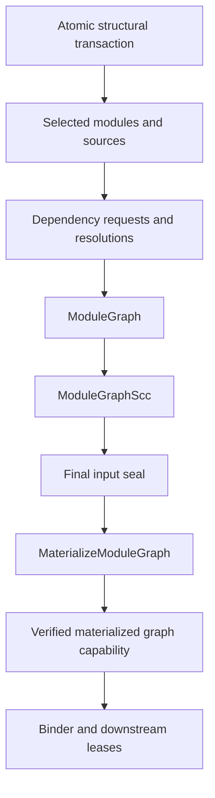

# RFC 0026: Module Graph Query Closure

## Summary

This RFC defines the complete stable module-graph query boundary and the
final-snapshot `MaterializeModuleGraph` capability. Structural inputs are
committed atomically. Selected sources, active modules, dependency sites,
requests, resolutions, graph values, and SCC values are derived semantic
queries. The final materializer reconstructs the complete compilation root set,
expands active stable identities through tracked membership, publishes a typed
stable witness, and retains all required snapshot and semantic-context
lifetimes.

The graph contract is internal and unversioned. Stable graph topology and
revision-local materialized handles have one producer, one independent
verifier, one session publication path, and no parallel authority.

## Motivation

Core bootstrap and ordinary package compilation require one deterministic
module topology across user roots and projected core crates. Stable query reuse
requires canonical handle-free graph and SCC values. Binder and downstream
consumers additionally require current handles, parse provenance, request-level
edges, semantic-context lineage, and a retained capability lifetime.

These requirements are distinct:

- structural transactions establish canonical inputs;
- stable queries derive reusable semantic graph facts;
- final-snapshot materialization expands active identities and provenance; and
- the capability lease owns the revision-local graph lifetime.

Keeping those stages explicit prevents an input record, session object, or
process handle collection from becoming a second topology authority.

## Goals

- Define one atomic module-structure input transaction.
- Derive selected-source, active-module, dependency, graph, and SCC values.
- Define exact graph and SCC codecs, failure records, read sets, and
  independent verifiers.
- Define a typed, complete materialized graph witness.
- Require complete-root authority and final-snapshot sealing before
  materialization.
- Preserve request-level dependency provenance and stable graph projection.
- Retain snapshot, semantic-context, parse, and query dependencies through the
  materialized capability lease.

## Non-Goals

- Change ZOM module syntax or resolution rules.
- Permit cyclic source-module binding.
- Persist revision-local materialized capabilities.
- Define Binder body facts, Checker semantics, ownership analysis, target
  lowering, or native emission.
- Permit a partial root set to authorize complete session publication.

## Prior Art

Rust compiler queries provide memoized derived functions with tracked
dependencies. ZOM adopts explicit query keys, canonical values, and red-green
shielding.

Salsa separates explicit inputs from tracked derived functions. ZOM applies
that boundary to module catalogs, dependency syntax, resolutions, graph values,
and SCC values.

LLVM SCC iteration provides a linear-time strongly connected component
algorithm. ZOM combines Tarjan provider construction with an independent
Kosaraju verifier and canonical dependency-first ordering.

## Guide-Level Explanation



Stable graph and SCC values contain only canonical stable identities. The
materializer runs only after the final input seal. It proves that its key is
the complete session root set, re-demands the exact graph and SCC, expands
identities through tracked active membership, reconstructs request provenance,
and publishes an immutable retained capability.

## Reference-Level Design

### Canonical Structural Inputs

`VerifiedModuleGraphInputPayload` contains:

```text
VerifiedModuleGraphInputPayload {
  contextRoots: CompilationRootSetQueryKey,
  projectedCoreCrates: CanonicalNonEmptySequence<CrateKey>,
  selectedModuleCatalogs: CanonicalNonEmptySequence<SelectedModuleCatalog>,
  dependencySiteSets:
      CanonicalSequence<DetachedModuleDependencySiteSet>,
  requesterAncestries: CanonicalSequence<RequesterModuleAncestry>,
  catalogBuckets: CanonicalSequence<CanonicalModuleCatalogBucket>,
  searchRoots: CanonicalSequence<CanonicalModuleSearchRoots>,
  dependencyAliases: CanonicalSequence<ConfiguredDependencyAlias>,
  configuredPreludes: CanonicalSequence<ConfiguredCratePrelude>,
}
```

The payload uses domain
`zom.query.input-transaction.module-structure`, one zero byte, and complete
fields in declaration order. Nested sequences are canonically sorted, unique
where keyed, bounded before allocation, and exactly consumed.

`VerifiedModuleGraphInputTransaction` carries the payload and the expected
previous database revision as a process-local transaction control. The
independent verifier checks the complete compilation-context authority,
selected-source coverage, catalog ownership, dependency-site detachment,
requester ancestry, path buckets, search roots, dependency aliases, configured
preludes, projected core inventory, and byte-equal context roots before commit.
`beginInputTransaction` returns `InputTransactionOpenResult`; every staged
mutation returns `InputMutationResult`; commit returns `InputCommitResult`.
The database commits every input in one new revision or commits nothing. A
rejected commit publishes neither a root nor a revision and closes the
transaction; any rejection abandons the unpublished session.

No transaction payload contains a graph, SCC, semantic handle, registry,
capability, Binder fact, or diagnostic.

### Derived Membership And Dependency Queries

The derived query family is:

| Query | Key | Result |
|---|---|---|
| `SelectedModuleSource` | `ModuleKey` | optional `SourceFileKey` |
| `ActiveModules` | `CrateKey` | canonical module sequence |
| `ModuleDependencySites` | `ModuleKey` | detached dependency-site sequence |
| `ModuleDependencyRequests` | `ModuleKey` | canonical stable request sequence |
| `ModuleDependencies` | `ModuleKey` | canonical dependency sequence |
| `ModuleGraph` | `CompilationRootSetQueryKey` | stable graph result |
| `ModuleGraphScc` | `CompilationRootSetQueryKey` | stable SCC result |

`SelectedModuleSource` reads only the exact selected module catalog for
the module's crate. `ActiveModules` reads the exact active crate and selected
catalog. Dependency-site and request queries read the selected source,
detached syntax, path configuration, aliases, and prelude configuration
reached by that module. `ModuleDependencyProvenance` separately joins those
stable values to the retained final parse capability. `ModuleDependencies`
reads only the canonical request sequence and each exact resolution.

Providers and independent verifiers derive every dynamic key from verified
upstream values. They do not read the session, an ambient root, an interner
container, a global diagnostic engine, or a database-key enumeration.

### Stable Module Graph

```text
ModuleDependencyEdgeKey {
  requester: ModuleKey,
  dependency: ModuleKey,
}

ModuleGraphRecord {
  modules: CanonicalNonEmptySequence<ModuleKey>,
  edges: CanonicalSequence<ModuleDependencyEdgeKey>,
}

ModuleGraphFailureRecord =
    DuplicateActiveModule { module: ModuleKey }
  | ForeignActiveModule {
      owner: CrateKey,
      module: ModuleKey,
    }
  | DependencyOutsideGraph {
      requester: ModuleKey,
      dependency: ModuleKey,
    }
```

`ModuleDependencyEdgeKey` uses domain
`zom.module-dependency-edge`. `ModuleGraphRecord` uses value domain
`zom.query.module-graph-value`. `ModuleGraphFailureRecord` uses domain
`zom.query.module-graph-failure`. Encoders use complete nested key bytes;
decoders enforce ordering, uniqueness, membership, bounds, known tags, and
exact consumption.

`ModuleGraph(contextRoots)` reads:

1. `ActiveCrates(contextRoots)`;
2. `ActiveModules(crate)` for each active crate in canonical order; and
3. `ModuleDependencies(module)` for each unique active module in canonical
   order after membership validation succeeds.

The provider constructs the complete module union and one stable edge per
dependency. Duplicate active modules, foreign module ownership, nested
dependency failure, and dependency outside the graph follow the declared
deterministic precedence. The independent verifier repeats the tracked reads,
reconstructs modules and edges through separate canonical insertion code,
recomputes the selected failure when present, and requires complete byte
equality.

A well-formed closed partial root set may produce an ordinary stable graph
value. It cannot satisfy complete-context authority and cannot authorize final
session publication or materialization.

### Stable Module Graph SCC

```text
ModuleGraphSccComponent {
  members: CanonicalNonEmptySequence<ModuleKey>,
  cyclic: bool,
}

ModuleGraphSccRecord {
  graphDigest: Sha256Digest,
  components:
      DependencyFirstSequence<ModuleGraphSccComponent>,
}
```

The value domain is `zom.query.module-graph-scc-value`. `graphDigest` is
SHA-256 over the complete `ModuleGraphRecord` value encoding. Members sort by
complete module bytes. Components are ordered dependencies before requesters;
equal-ready components use the smallest first-member bytes.

The provider reads only `ModuleGraph(contextRoots)` and uses Tarjan's
algorithm. The independent verifier reads the same graph, uses Kosaraju's
algorithm with a separately built reverse graph, checks complete coverage,
cyclic flags, condensation order, and digest, and requires byte equality.

A component is cyclic when it has more than one member or its only member has
a self edge. The session rejects the first cyclic component before binding and
reconstructs the canonical witness request from the stable request and
resolution queries.

### Stable Materialized Witness

```text
StableMaterializedDependencyWitness {
  requester: ModuleKey,
  request: ModuleResolutionKey,
  dependency: ModuleKey,
}

MaterializedModuleGraphWitness {
  contextRoots: CompilationRootSetQueryKey,
  fingerprint: ContextFingerprint,
  graph: ModuleGraphRecord,
  scc: ModuleGraphSccRecord,
  requestEdges:
      CanonicalSequence<StableMaterializedDependencyWitness>,
  graphRevision: ModuleGraphRevision,
}
```

`StableMaterializedDependencyWitness` uses domain
`zom.materialized-module-dependency-witness`. It encodes requester, request,
and dependency in that order. Records sort by complete bytes and reject
duplicates.

`MaterializedModuleGraphWitness` uses domain
`zom.materialized-module-graph-witness`. It encodes the complete context-root
key, full semantic-context fingerprint, complete graph and SCC values,
canonical request edges, and graph revision. Decoding requires exact
consumption, unique request edges, graph and SCC membership closure, SCC
graph-digest equality, and independent graph-revision recomputation.

`ModuleGraphRevision` is the digest of the complete semantic-context
fingerprint, stable graph value bytes, and canonical request-edge bytes under
the literal domain `zom.module-dependency-graph`. Node identifiers and source
spans are revision-local provenance and do not enter the preimage.

### Materialized Module Graph

```text
MaterializedIdentityEntry<Key, Record, Handle> {
  key: Key,
  record: Record,
  handle: Handle,
}

MaterializedModuleDependencyEdge {
  requester: ModuleId,
  request: ModuleResolutionKey,
  dependency: ModuleId,
}

MaterializedModuleGraph {
  context: SemanticContextBrand,
  revision: DatabaseRevision,
  witness: MaterializedModuleGraphWitness,
  units:
      CanonicalSequence<MaterializedIdentityEntry<
          CompilationUnitIdentity,
          CompilationUnitIdentity,
          CompilationUnitId>>,
  crates:
      CanonicalSequence<MaterializedIdentityEntry<
          CrateKey,
          CrateKey,
          CrateId>>,
  sources:
      CanonicalSequence<MaterializedIdentityEntry<
          SourceFileKey,
          SourceFileKey,
          SourceFileId>>,
  modules:
      CanonicalSequence<MaterializedIdentityEntry<
          ModuleKey,
          ModuleKey,
          ModuleId>>,
  requestEdges: CanonicalSequence<MaterializedModuleDependencyEdge>,
}
```

`MaterializeModuleGraph` is keyed by the complete
`CompilationRootSetQueryKey` and returns
the descriptor-dependent `CapabilityDemandResult<MaterializeModuleGraph>`.
Only its `Published` alternative installs a retained revision-local capability
memo. Every source or key rejection is present only when declared by the
descriptor's closed `FailureAlternatives` list, passes through the canonical
typed capability-failure envelope, and is independently verified. Source, key,
and query-runtime rejection install no capability.

The descriptor has compile-time
`ActiveMaterializerPermission<MaterializeModuleGraph, GlobalIdentityKey,
MembershipDescriptor>` specializations only for:

| Stable key | Membership query |
|---|---|
| `CompilationUnitIdentity` | `ActiveCompilationUnitMembership` |
| `CrateKey` | `ActiveCrateMembership` |
| `SourceFileKey` | `ActiveSourceMembership` |
| `ModuleKey` | `ActiveModuleMembership` |

No wildcard permission or runtime descriptor-name dispatch exists.
`CapabilityQueryContext<MaterializeModuleGraph>` derives the global key,
demands and records the exact membership descriptor, and compares its complete
active authority before any interner access.

### Complete Reads And Independent Verification

`MaterializeModuleGraph` reads:

- `CompleteCompilationContextAuthority(contextRoots)`;
- the canonical package-compilation request and projected core distribution;
- all toolchain, package-edge, crate-edge, source-content, target, and language
  inputs used by the semantic-context fingerprint;
- `ActiveCrates` and every reached active source and module;
- `ModuleGraph(contextRoots)` and `ModuleGraphScc(contextRoots)`;
- every selected source, dependency site, stable request, and exact resolution;
- every configured prelude reached by a prelude request;
- final-snapshot parse leases for all selected sources;
- the retained final-sealed `ModuleDependencyProvenance` capability for every
  reached module; and
- exact compilation-unit, crate, source, and module active-membership
  projections.

The provider reconstructs the complete root set from
`CompleteCompilationContextAuthority`; a candidate key never proves
completeness. It validates the byte-equal final seal, independently forms the
active module union, re-demands graph and SCC values, reconstructs the full
semantic-context fingerprint, expands stable identities only after successful
tracked membership, joins source requests to exact final parse syntax,
validates prelude requests, projects request-level edges to the stable graph,
builds the typed witness, and publishes the capability.

Each `ModuleDependencyProvenanceMap` memo retains the exact final
`ParseSource` capability generation that owns its AST and source buffer. Its
runtime-only `NodeId` and `SourceSpan` values are never serialized and cannot
outlive that retained lineage. The materialized graph reaches provenance only
through tracked capability dependencies; no session, current parse, registry,
or detached lease supplies provenance authority.

The independent verifier repeats every demand from the descriptor key. It uses
separate root collection, fingerprint collection, membership expansion,
syntax-site mapping, edge projection, ordering, and revision assembly code.
It requires complete witness bytes, handle reverse expansion, provenance
coverage, active-module coverage, graph projection, and request-edge equality.
Provider and verifier share only canonical scalar codecs and closed enum
declarations.

### Snapshot And Publication Order

The session order is:

1. open, mutate, and commit the verified core distribution and complete
   context authority through `InputTransactionOpenResult`,
   `InputMutationResult`, and `InputCommitResult`;
2. acquire `preParseSnapshot`;
3. parse, discover, and structurally select modules;
4. commit the module-structure transaction through the same explicit result
   algebra;
5. acquire `authorityStagingSnapshot`;
6. demand stable graph, SCC, inventories, headers, and handle-free Binder
   prerequisites;
7. reject cyclic SCCs;
8. commit the complete contextual identity authority through the same explicit
   result algebra;
9. acquire `finalCoreSnapshot`;
10. re-demand staging witnesses and require byte equality;
11. require the `Sealed` alternative of
    `FinalSealResult<CompilationRootSetQueryKey, Sha256Digest>` for the complete
    root key, final snapshot, and final witness;
12. consume the matching snapshot and seal into
    `SealedQuerySnapshot<CompilationRootSetQueryKey, Sha256Digest>`; and
13. demand `MaterializeModuleGraph` and later final-sealed materializers only
    through that sealed root.

No handleful materializer runs during authority staging. No input commit is
accepted after the final seal. Sealed admission propagates unchanged through
root and nested capability demand frames; no provider or verifier reads an
ambient database seal flag or session readiness mirror.

The materialized graph memo retains its snapshot arena, semantic-context arena,
stable witness, parse capabilities, provenance capability, and every query
capability read by provider or verifier. A caller lease may outlive
`CompilerSession` and `QueryDatabase`; reverse lookup and brand validation
remain valid until the last lease releases.

### Failure Contract

Stable source-program failures remain canonical semantic facts and RFC 0017
diagnostics. Missing or ambiguous module requests, visibility rejection, and
source cycles prevent graph publication without becoming query-runtime
failures.

Malformed provenance, codec disagreement, missing tracked reads, inactive
materialization, foreign brands, unequal identity records, collisions,
cancellation, allocation failure, cycle-policy violation, or verifier
disagreement maps to `QueryRuntimeFailure` and publishes neither a capability
nor an ordinary diagnostic.

After complete-root readiness, an absent or contradictory required graph,
membership, parse, or authority value is a verified-state failure. A failure
abandons the unpublished session. Inputs are not rolled back, and no downstream
capability is published.

## Repository Impact

| Area | Paths | Owner |
|---|---|---|
| RFC governance | `docs/rfc/0026-module-graph-query-closure.md`; `docs/rfc/tracking/0026-review-and-implementation.md` | `rfc` |
| Query, identity, structural input, graph providers, materializer, session, and module interface | `zomlang/compiler/identity/**`; `zomlang/compiler/query/**`; `zomlang/compiler/source/**`; `zomlang/compiler/driver/**`; `zomlang/compiler/binder/module-*` | `module-system` |
| Stable Binder consumers and bound-module aggregation | `zomlang/compiler/binder/**` excluding `binder/module-*`; `zomlang/compiler/checker/**` excluding the diagnostic definition file | `binder-checker` |
| Tests, gates, coverage, and benchmarks | paths assigned to `verification` in `.codex/subagents/manifest.yaml` | `verification` |

## Security And Safety Impact

Complete context authority prevents partial-root publication. Tracked active
membership prevents an interned handle from authorizing inactive state.
Semantic-context brand validation prevents cross-context handle use. Retained
arenas prevent reverse-lookup use after session and database teardown.
Canonical bounded codecs prevent ambiguous or resource-unbounded graph input.

## Drawbacks And Risks

- Whole-context graph materialization is expensive.
- Independent provider and verifier algorithms intentionally duplicate graph,
  SCC, provenance, and fingerprint collection logic.
- The implementation cutover spans structural inputs, query runtime, identity
  admission, session ordering, Binder aggregation, and downstream leases.

## Alternatives Considered

A graph keyed by one module cannot prove the complete compilation topology.
The stable graph and materializer use the complete root-set key.

Persisting handles in stable graph values would bind reusable semantics to one
process arena. Stable graph and SCC values remain handle-free.

Selecting roots or dependency keys from a materializer candidate would give the
candidate authority over its own verification. Providers and verifiers derive
all dependency keys from independently verified upstream values.

## Compatibility And Rollout

The repository is unreleased. The current graph contract replaces every
producer, verifier, caller, codec, fixture, gate, and publication root in one
implementation series. No alternate decoder, alias, flag, fallback graph, or
parallel topology authority is permitted.

Stable structural queries land before `MaterializeModuleGraph`. Active
membership and final sealing land before the production materializer.
Downstream consumers migrate to retained leases before replaced graph
authorities are removed.

## Documentation And Teaching Plan

Current-state compiler documentation is updated only after the live graph
builder, independent verifier, session publisher, consumers, and project-native
tests exist. Planned contracts remain in RFCs.

## Operational Readiness

Architecture gates reject:

- graph or SCC facts committed as inputs;
- ambient-root or database-key enumeration;
- an ambient final-seal flag, session readiness mirror, or reconstructed
  admission used by a capability provider or verifier;
- a materializer outside the final sealed snapshot;
- a partial root key used as complete publication authority;
- stable graph values containing handles, nodes, spans, brands, revisions,
  arenas, or sessions;
- identity expansion without exact active-membership permission;
- shared provider/verifier graph, SCC, provenance, or fingerprint helpers;
- a session graph mirror or detached capability copy; and
- a downstream graph or bound-module reference without an owning lease.

### RFC 0029 Query And Binder Dependency Synchronization

RFC 0029 is accepted at exact proposal SHA-256
`8d393a0c6c00a7fad9ef086d3d25f5ed44300041afa9e1e1a4af5d68830fd3e7`.
Transaction `rfc0029-accept-20260727-8d393a0c` binds this RFC and its tracker
to that proposal without changing RFC 0026's `ACCEPTED` status or completing
product work.

The graph publication path retains RFC 0028's explicit transactions, final
seal, exact active-membership permissions, and
`ModuleDependencyProvenanceMap` ownership of final parse lineage. Binder
provenance feeding graph and session consumers now uses complete
module-qualified contextual keys, `IdentitySyntaxSiteInventoryQuery`, and
`StableIdentityAdmissionQuery`. Each of the five Binder provenance
capabilities exposes only typed source and key rejections and follows the
exact RFC 0029 read order and failure precedence.

The stable Binder schema, facts, and codecs land atomically through the exact
RFC 0030 `R29-12AB` transaction. Diagnostic facts then land separately through
`R29-12D`; runtime work cannot start before both pass focused native gates.
The corrected runtime source transaction is `R29-14`.
`ModuleDependencyProvenanceMap` completion remains ordered through RFC 0028
`R28-16`, and full synchronized verification is `R29-15`.

## Acceptance Criteria

Design acceptance requires:

- exact structural input, graph, SCC, witness, materialized capability, failure,
  read-set, verifier, seal, and lifetime contracts;
- one typed complete-root materialization path;
- explicit active-membership permissions;
- independent graph, SCC, fingerprint, provenance, and revision verification;
  and
- one unversioned production cutover.

Implementation completion additionally requires the sanitizer, unit, lit,
architecture, coverage, English-only, internal-versioning, format, diff, and
Release benchmark gates in the synchronized RFC 0027, RFC 0028, and RFC 0029
plans.

The materializer and retained-consumer migration are implemented. Complete
current-tree verification and the final evidence audit are recorded; RFC 0026
is `LANDED`.

## Implementation Plan

Completed RFC 0026 stable graph tasks retain their recorded evidence. Commits
`6fac75b4` and `eb1033ef` implement the typed witness, final-snapshot
materializer, active membership, session cutover, downstream lease migration,
and removal work after RFC 0029 `R29-14`, RFC 0028 `R28-16`, and the RFC 0027
materialization sequence. The complete current-tree verification and final
evidence audit remain in the tracker.

## Test Plan

Native tests cover:

- structural transaction atomicity and stale-revision rejection;
- selected-source and dependency projection read sets;
- graph codec bounds, ordering, membership, and failures;
- Tarjan and Kosaraju SCC agreement;
- complete-root and partial-root behavior;
- semantic-context fingerprint sensitivity;
- request-level provenance and stable graph projection;
- active-membership collision and inactive-key rejection;
- final-seal admission and post-seal input rejection;
- typed witness codec and mutation oracles;
- provider/verifier independence;
- surviving leases and teardown order; and
- clean versus incremental graph equality and Release performance.

## Open Questions

None

## Status History

| Date | Status | Notes |
|---|---|---|
| 2026-07-26 | DRAFT | Initial graph-query closure after implementation review found missing value, codec, read-set, verifier, transaction, and barrier contracts. |
| 2026-07-26 | REVIEW | Structural RFC checks passed and the complete contract entered required-owner review. |
| 2026-07-26 | REVIEW | Required-owner findings were incorporated through exact-snapshot review candidates. |
| 2026-07-26 | ACCEPTED | All four required owners approved proposal SHA-256 `39df5d3f11dbdcb2e95056b1cd14fd5220a19688f31a3e3180230ad465a3f84d`; accepted RFC synchronization completed. |
| 2026-07-27 | ACCEPTED | Acceptance transaction `rfc0027-accept-20260727-e2f4ba5e` synchronized the typed witness, complete-root final-snapshot `MaterializeModuleGraph`, active-membership expansion, retained capability lifetime, and publication contracts to RFC 0027 proposal SHA-256 `e2f4ba5eb777d3d70b8eb3ad75b18f5169afc61a83d989ccc61fc9d5d022f435`; implementation status remains unchanged. |
| 2026-07-27 | ACCEPTED | Transaction `rfc0028-accept-20260727-944b68ff` synchronized explicit transaction and seal results, `SealedQuerySnapshot` admission, typed capability failures, exact membership permissions, retained final-parse provenance lineage, and runtime source ownership to RFC 0028 proposal SHA-256 `944b68ffc0aff5576d079a243ff092d7d19fba5ffed65551dda8e68adf230db4`; implementation remains pending. |
| 2026-07-27 | ACCEPTED | Transaction `rfc0029-accept-20260727-8d393a0c` synchronized complete Binder contextual keys, identity-site provenance, stable-identity admission, exact typed provenance failures, and the schema-before-runtime dependency order to RFC 0029 proposal SHA-256 `8d393a0c6c00a7fad9ef086d3d25f5ed44300041afa9e1e1a4af5d68830fd3e7`; implementation remains pending. |
| 2026-07-28 | ACCEPTED | Transaction `rfc0030-accept-20260728-4ed0e6b8` synchronized the exact build-visible S1-plus-S2-plus-S3 atomic landing and separate S6 diagnostic transaction to RFC 0030 proposal SHA-256 `4ed0e6b885abc87a1c4251855780cf115a85b3623b1d46f774a4b664110f7b6b`; implementation remains pending. |
| 2026-08-09 | IMPLEMENTING | Audit confirmed that commits `6fac75b4` and `eb1033ef` implement complete-context materialization, retained provenance, active membership, and downstream bound-module lease migration. Focused materialization, membership, provenance, session, Binder, HIR, MIR, and ownership tests plus architecture gates pass; complete current-tree verification and the final evidence audit remain tracked. |
| 2026-08-09 | LANDED | Sanitizer configure and build, the 257-test default CTest run, architecture, RFC, English-only, internal-versioning, format, diff, and ownership coverage gates passed. A clean Release build selected Linux baseline `67aae06e0d5a4d2a333bb14c0be44429751dce49dcdbf4c5f55ab943d3f567ca` with eight workers; elapsed and peak-RSS comparisons passed. |
