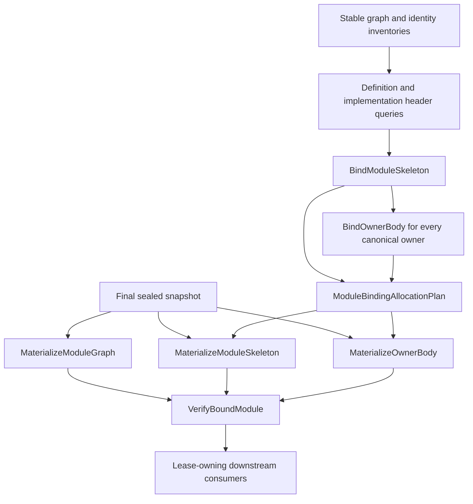

# RFC 0027: Binder Query And Identity Materialization Closure

## Summary

This RFC closes the stable-header, Binder-query, identity-admission, module
allocation, diagnostic, and capability-lifetime contracts required by RFC
0025.

The proposed design has four layers:

1. staging-safe header queries publish complete handle-free declaration and
   implementation-occurrence headers;
2. semantic Binder queries publish canonical module and owner-body facts;
3. the semantic-context capability arena owns the only append-only typed
   identity interner set; and
4. final-snapshot capability queries materialize the module graph, Binder
   skeletons, owner bodies, and verified bound modules under retained leases.

The implementation is one unversioned internal replacement. It removes
one-time physical registry freeze, session-owned Binder mirrors, non-owning
bound-module publication, and production batch binding. It introduces no
adapter, compatibility decoder, fallback authority, or dual production root.

## Motivation

RFCs 0017, 0019, and 0025 name `BindModuleSkeleton`,
`MaterializeModuleSkeleton`, `BindOwnerBody`, `MaterializeOwnerBody`, and
`VerifyBoundModule`, but do not provide enough information to implement them
without inventing contracts:

- `ModuleBodySyntax` intentionally prunes named definitions and implementation
  occurrences to boundaries, so it cannot reconstruct their header scopes or
  parameter declarations;
- implementation-owned generics and implementation-occurrence scopes require
  different stable owners;
- digest keys cannot prove their complete retained identity records or owning
  modules;
- body-local materializers require one deterministic module-wide handle plan;
- stable Binder failures and source diagnostics require different closed
  result alternatives; and
- a capability lease may outlive `CompilerSession` and `QueryDatabase`, so its
  handle reverse-lookup authority cannot be owned by either object.

The production graph bridge also requires correction. Authority staging needs
only stable graph and inventory values. Handleful graph materialization belongs
after the final input seal, where the same active-membership and lease rules as
all other capabilities apply.

## Goals

- Define complete staging-safe definition and implementation header queries.
- Define stable module-skeleton, owner-body, routing, failure, and diagnostic
  schemas with exact codecs.
- Preserve RFC 0018 definition-or-implementation generic ownership.
- Preserve implementation occurrence identity separately from shared
  implementation authority.
- Define one deterministic module allocation plan for every module-local
  handle.
- Define typed authority records and tracked active membership for all eight
  global handle domains.
- Keep the interner set alive through the semantic-context capability arena.
- Define exact capability fields, verifier algorithms, and downstream lease
  ownership.
- Move handleful module-graph publication behind the final sealed-snapshot
  barrier.
- Delete production batch binding and every session mirror in one root cutover.

## Non-Goals

- This RFC does not change ZOM syntax or user-visible name-resolution rules.
- This RFC does not define core roles, core signatures, marker policy, final
  core interfaces, or prelude contents.
- This RFC does not add query persistence.
- This RFC does not permit cyclic source-module binding.
- This RFC does not require parallel capability demand.
- This RFC does not assign semantic identity to owner-local or anonymous
  entities.

## Prior Art

Rust compiler queries separate stable query values from session-local interned
identities and retain tracked dependency edges. ZOM adopts that stable-value
boundary from the
[rustc query system](https://rustc-dev-guide.rust-lang.org/query.html).

Salsa places interned data in database-associated durable storage and
coalesces equal concurrent requests. ZOM adopts typed append-only interning
from [Salsa interned structs](https://salsa-rs.github.io/salsa/plumbing/interned.html)
while using a refcounted semantic-context arena so surviving capability leases
retain their handle authority after database teardown.

Swift request evaluation separates declaration work from body work and avoids
embedding request-evaluator state in reusable values. ZOM adopts that staged
decomposition from
[Swift request evaluation](https://github.com/swiftlang/swift/blob/main/docs/RequestEvaluator.md).

LLVM uses owning arenas and explicit lifetime anchors for immutable compiler
objects. ZOM applies that ownership rule to capability memos, typed interners,
scope storage, and downstream leases.

## Guide-Level Explanation



Stable queries contain canonical keys and records only. A stable query may
read a revision-local syntax capability and still publish a backdatable
semantic value when its complete output bytes are equal.

Materialization starts only in the final current sealed snapshot. Every global
handle request first proves active membership through a tracked query read.
The semantic-context arena then returns the existing handle for the exact
key-and-record pair or appends one immutable entry. A previously interned
handle never makes an inactive key active.

## Reference-Level Design

### Stable Query Routing Keys

The following closed records make every owning module explicit:

```text
StableDefinitionQueryKey {
  module: ModuleKey,
  definition: DefinitionKey,
}

StableImplementationQueryKey {
  module: ModuleKey,
  implementation: ImplKey,
}

StableImplementationOccurrenceQueryKey {
  module: ModuleKey,
  occurrence: ImplSourceOccurrenceKey,
}

StableGenericParameterQueryKey {
  module: ModuleKey,
  parameter: GenericParameterKey,
}

StableCallableParameterQueryKey {
  module: ModuleKey,
  parameter: CallableParameterKey,
}

StableSemanticImportQueryKey {
  requester: ModuleKey,
  binding: SemanticImportBindingKey,
}

StableOwnerBodyQueryKey {
  module: ModuleKey,
  owner: StableBodyOwnerKey,
}

ContextualBodyOwnerKey {
  contextRoots: CompilationRootSetQueryKey,
  body: StableOwnerBodyQueryKey,
}

ContextualCompilationUnitKey {
  contextRoots: CompilationRootSetQueryKey,
  unit: CompilationUnitIdentity,
}

ContextualCrateKey {
  contextRoots: CompilationRootSetQueryKey,
  crate: CrateKey,
}

ContextualSourceKey {
  contextRoots: CompilationRootSetQueryKey,
  source: SourceFileKey,
}

ContextualModuleKey {
  contextRoots: CompilationRootSetQueryKey,
  module: ModuleKey,
}

ContextualDefinitionKey {
  contextRoots: CompilationRootSetQueryKey,
  definition: StableDefinitionQueryKey,
}

ContextualImplementationKey {
  contextRoots: CompilationRootSetQueryKey,
  implementation: StableImplementationQueryKey,
}

ContextualGenericParameterKey {
  contextRoots: CompilationRootSetQueryKey,
  parameter: StableGenericParameterQueryKey,
}

ContextualCallableParameterKey {
  contextRoots: CompilationRootSetQueryKey,
  parameter: StableCallableParameterQueryKey,
}
```

Each record uses its field order above, complete nested canonical encodings,
and exact consumption. `ContextualBodyOwnerKey.body.module` must be active
under the exact `contextRoots`, and its `body.owner` must select that module. A decoder
recomputes every digest key from its retained authority record before
publication. A referenced definition, implementation, parameter, occurrence,
import, or body owner must belong to the routed or owner-derived module. No
provider searches all active modules to recover ownership.

### Canonical Wire And Schema Inventory

Every top-level key, value, fact, witness, and result record starts with its
ASCII domain below, one `0x00` byte, and fields in declaration order. A nested
record is framed as `uint64be(byteCount) || completeRecordBytes`. RFC 0011
encoding applies to scalars: fixed-width unsigned big-endian integers,
one-byte booleans and closed tags, 32 raw digest bytes, `uint64be` byte-string
and sequence counts, NFC UTF-8 text, and one-byte optional presence. Maps and
sets are sequences sorted by complete encoded key or element bytes. Duplicate,
unsorted, non-NFC, unknown-tag, malformed-optional, truncated, or trailing
input is rejected.

Every schema sequence count and text byte count must be at most `UINT32_MAX`,
must fit the remaining input before allocation, and must fit `size_t`.
Allocation-plan counts and prefix sums additionally fit the destination
`uint32` handle domain. A decoder checks bounds before allocation and requires
exact consumption. Encoders never write a process handle, slot, pointer,
source span, `NodeId`, brand, revision, arena identity, or worker order into a
stable record.

| Bound | Exact limit |
|---|---:|
| identifier or display-argument bytes | 4 KiB |
| local syntax path components | 4,096 |
| non-contextual routed key bytes | 64 KiB |
| complete context-root bytes | 64 MiB |
| contextual key bytes | 128 MiB |
| records in one Binder semantic sequence | 1,048,576 |
| ambiguity candidates | 1,048,576 |
| complete Binder semantic value bytes | 128 MiB |
| diagnostic facts in one result | 1,048,576 |
| complete diagnostic payload bytes | 64 MiB |
| active modules per graph | 4,096 |
| dependency sites or graph edges | 1,048,576 |
| dense local allocation count | `UINT32_MAX`, with checked prefix sums |

| Record | ASCII domain |
|---|---|
| `StableDefinitionQueryKey` | `zom.binder.definition-query-key` |
| `StableImplementationQueryKey` | `zom.binder.implementation-query-key` |
| `StableImplementationOccurrenceQueryKey` | `zom.binder.implementation-occurrence-query-key` |
| `StableGenericParameterQueryKey` | `zom.binder.generic-parameter-query-key` |
| `StableCallableParameterQueryKey` | `zom.binder.callable-parameter-query-key` |
| `StableSemanticImportQueryKey` | `zom.binder.semantic-import-query-key` |
| `StableOwnerBodyQueryKey` | `zom.binder.owner-body-query-key` |
| `ContextualBodyOwnerKey` | `zom.binder.contextual-body-owner-key` |
| `ContextualCompilationUnitKey` | `zom.binder.contextual-compilation-unit-key` |
| `ContextualCrateKey` | `zom.binder.contextual-crate-key` |
| `ContextualSourceKey` | `zom.binder.contextual-source-key` |
| `ContextualModuleKey` | `zom.binder.contextual-module-key` |
| `ContextualDefinitionKey` | `zom.binder.contextual-definition-key` |
| `ContextualImplementationKey` | `zom.binder.contextual-implementation-key` |
| `ContextualGenericParameterKey` | `zom.binder.contextual-generic-parameter-key` |
| `ContextualCallableParameterKey` | `zom.binder.contextual-callable-parameter-key` |
| `StableHeaderGenericParameter` | `zom.binder.header-generic-parameter` |
| `StableHeaderCallableParameter` | `zom.binder.header-callable-parameter` |
| `StableDefinitionHeader` | `zom.binder.definition-header` |
| `StableImplementationOccurrenceHeader` | `zom.binder.implementation-occurrence-header` |
| `StableScopeOwnerKey` | `zom.binder.scope-owner-key` |
| `StableNodeSyntaxRoot` | `zom.binder.node-syntax-root` |
| `StableBindingTargetKey` | `zom.binder.binding-target-key` |
| `BoundModuleSkeleton` | `zom.binder.module-skeleton` |
| `StableScopeFact` | `zom.binder.skeleton-scope` |
| `StableNodeScopeFact` | `zom.binder.skeleton-node-scope` |
| `StableDeclarationFact` | `zom.binder.skeleton-declaration` |
| `StableImplementationOccurrenceFact` | `zom.binder.skeleton-implementation-occurrence` |
| `StableGenericParameterDeclarationFact` | `zom.binder.skeleton-generic-parameter-declaration` |
| `StableCallableParameterDeclarationFact` | `zom.binder.skeleton-callable-parameter-declaration` |
| `StableSemanticImportQueryKey`, `StableImportFact` | `zom.binder.semantic-import-query-key`, `zom.binder.skeleton-import` |
| `StableModuleAliasFact` | `zom.binder.skeleton-module-alias` |
| `StableReexportStep` | `zom.binder.skeleton-reexport-step` |
| `StableLocalExportFact` | `zom.binder.skeleton-local-export` |
| `StableFailedLookupOutcome`, `StableFailedLookupFact` | `zom.binder.failed-lookup-outcome`, `zom.binder.failed-lookup` |
| `StableExportedBinding` | `zom.binder.exported-binding` |
| `StableExportedBindingQueryKey` | `zom.query.exported-binding-key` |
| `StableScopeNameBucketQueryKey` | `zom.query.scope-name-bucket-key` |
| `BoundOwnerBody` | `zom.binder.owner-body` |
| `StableBodyScopeFact` | `zom.binder.body-scope` |
| `StableBodyNodeScopeFact` | `zom.binder.body-node-scope` |
| `StableOwnerLocalBindingFact` | `zom.binder.body-owner-local-binding` |
| `StableResolutionFact` | `zom.binder.body-resolution` |
| `StableDeferredMemberFact` | `zom.binder.body-deferred-member` |
| `StableSelfOwner`, `StableSelfTypeFact` | `zom.binder.self-owner`, `zom.binder.body-self-type` |
| `StableThisBindingFact` | `zom.binder.body-this-binding` |
| `StableShadowTargetFact` | `zom.binder.body-shadow-target` |
| `StableLabelKey`, `StableLabelTarget`, `StableLabelFact` | `zom.binder.label-key`, `zom.binder.label-target`, `zom.binder.body-label` |
| `StableControlTarget`, `StableControlTransferFact` | `zom.binder.control-target`, `zom.binder.body-control-transfer` |
| `StableClosureFact` | `zom.binder.body-closure` |
| `StableClosureFreeVariable`, `StableClosureFreeVariableFact` | `zom.binder.closure-free-variable`, `zom.binder.body-closure-free-variables` |
| `StableExplicitCaptureMode`, `StableExplicitCaptureBindingFact`, `StableExplicitClosureCaptureFact` | `zom.binder.explicit-capture-mode`, `zom.binder.explicit-capture-binding`, `zom.binder.body-explicit-closure-capture` |
| `ModuleBindingAllocationPlan` | `zom.binder.module-allocation-plan` |
| `OwnerAllocationRange` | `zom.binder.owner-allocation-range` |
| `BinderQueryResult<StableDefinitionHeader>` | `zom.binder.result-definition-header-syntax` |
| `BinderQueryResult<StableImplementationOccurrenceHeader>` | `zom.binder.result-implementation-occurrence-header-syntax` |
| `BinderQueryResult<BoundModuleSkeleton>` | `zom.binder.result-bind-module-skeleton` |
| `BinderQueryResult<BoundOwnerBody>` | `zom.binder.result-bind-owner-body` |
| `BinderQueryResult<ModuleBindingAllocationPlan>` | `zom.binder.result-module-binding-allocation-plan` |
| `BinderKeyFailure` | `zom.binder.key-failure` |
| `ActiveCompilationUnitMembership` | `zom.binder.active-compilation-unit-membership` |
| `ActiveImplementationMembershipRecord` | `zom.binder.active-implementation-membership` |
| `ImplementationGenericAuthority` | `zom.binder.implementation-generic-authority` |
| `ActiveGenericParameterMembership` | `zom.binder.active-generic-parameter-membership` |
| `ActiveCallableParameterMembershipRecord` | `zom.binder.active-callable-parameter-membership` |
| `CompleteRootIdentityReadiness` | `zom.binder.complete-root-identity-readiness` |
| `BinderIdentifierDiagnosticArguments` | `zom.diagnostic.arguments.binder-identifier` |
| `BinderNamespaceDiagnosticArguments` | `zom.diagnostic.arguments.binder-namespace` |
| `CanonicalCompilationRootRecord` | `zom.input.canonical-compilation-root` |
| `CanonicalTargetSelectionRecord` | `zom.input.canonical-target-selection` |
| `CanonicalLanguageOptionsRecord` | `zom.input.canonical-language-options` |
| `CanonicalPackageCompilationRequest` | `zom.input.canonical-package-compilation-request` |
| `CompleteCompilationContextAuthority` | `zom.input.complete-compilation-context-authority` |
| `VerifiedCoreDistributionInputPayload` | `zom.query.input-transaction.core-distribution` |
| `VerifiedModuleGraphInputPayload` | `zom.query.input-transaction.module-structure` |
| `ContextualIdentityAuthorityInputPayload` | `zom.query.input-transaction.contextual-identity-authority` |
| `StableMaterializedDependencyWitness` | `zom.materialized-module-dependency-witness` |
| `MaterializedModuleGraphWitness` | `zom.materialized-module-graph-witness` |

Stable projection descriptors use these exact key encodings and value domains:

| Query | Exact key encoding | Exact value domain |
|---|---|---|
| `ModuleExportNames` | complete `ModuleKey` | `zom.query.module-export-names-value` |
| `ExportedBinding` | complete `StableExportedBindingQueryKey` | `zom.query.exported-binding-value` |
| `DefinitionBindingHeader` | complete `StableDefinitionQueryKey` | `zom.query.definition-binding-header-value` |
| `ImplementationBindingHeader` | complete `StableImplementationQueryKey` | `zom.query.implementation-binding-header-value` |
| `ScopeNameBucket` | complete `StableScopeNameBucketQueryKey` | `zom.query.scope-name-bucket-value` |
| `ImportTarget` | complete `StableSemanticImportQueryKey` | `zom.query.import-target-value` |
| `BindingVisibility` | complete `StableBindingTargetKey`; body-local alternatives are invalid for this descriptor | `zom.query.binding-visibility-value` |

No descriptor wraps an already canonical key in another query-key record.
Except for the five `BinderQueryResult` domains listed above and this explicit
projection table, every other stable query value domain is its literal query
domain with `-value` appended. No runtime domain construction is permitted.
Revision-local capability queries have no value codec.

The generated
`products/zomlang/compiler/binder/stable-binding-schema.def` contains each
literal domain, tag, field inventory, maximum-count rule, producer target,
verifier target, and executable mutation test. The generator emits
declarations, codecs, descriptor registrations, and fixed empty and non-empty
wire oracles. `check-binder-architecture.py` rejects a schema record, query, or
projection without exactly one generated row and rejects literal domains
outside that inventory.

### Stable Header Inputs

`DefinitionBodyDisposition` is the closed sum:

```text
NoExecutableBody = 0x01
ExecutableBody   = 0x02
```

`NamedDefinitionInventoryEntry` retains the complete
`DefinitionIdentityRecord` and this disposition. Provider and verifier derive
the disposition from the exact selected declaration syntax and require equal
bytes.

The staging-safe header schemas are:

```text
StableHeaderSite =
    DefinitionAuthoritySite(IdentitySyntaxSiteKey) // 0x01
  | ImplementationOccurrenceSite(ImplSourceOccurrenceKey) // 0x02

StableHeaderGenericParameter {
  key: GenericParameterKey,
  record: GenericParameterIdentityRecord,
  site: StableHeaderSite,
  name: DeclaredDefinitionName,
  ordinal: uint32,
}

StableHeaderCallableParameter {
  key: CallableParameterKey,
  record: CallableParameterIdentityRecord,
  site: StableHeaderSite,
  name: Optional<DeclaredDefinitionName>,
  position: CallableParameterPosition,
}

StableDefinitionHeader {
  queryKey: StableDefinitionQueryKey,
  record: DefinitionIdentityRecord,
  authoritySite: IdentitySyntaxSiteKey,
  kind: DefinitionKind,
  namespace: Namespace,
  name: DeclaredDefinitionName,
  activation: DefinitionActivation,
  visibility: Optional<MemberVisibility>,
  bodyDisposition: DefinitionBodyDisposition,
  genericParameters: CanonicalSequence<StableHeaderGenericParameter>,
  callableParameters: CanonicalSequence<StableHeaderCallableParameter>,
  declaredScopeRoles: CanonicalSequence<ScopeRole>,
}

StableImplementationOccurrenceHeader {
  queryKey: StableImplementationOccurrenceQueryKey,
  authority: StableImplementationQueryKey,
  record: ImplIdentityRecord,
  genericParameters: CanonicalSequence<StableHeaderGenericParameter>,
  declaredScopeRoles: CanonicalSequence<ScopeRole>,
  sourceForm: ImplementationSourceForm,
}
```

`ImplementationSourceForm` is the closed sum `Ordinary = 0x01` and
`BodylessMarker = 0x02`. `ScopeRole` is:

```text
Declaration    = 0x01
Generic        = 0x02
Parameters     = 0x03
Members        = 0x04
Implementation = 0x05
```

`DefinitionHeaderSyntax(StableDefinitionQueryKey)` is `Semantic`. It reads
exactly the named-definition inventory for the explicit module, the selected
source, its parse capability, and current definition and implementation site
projections. It proves exact `(DefinitionKey, DefinitionIdentityRecord)`
membership, independently selects the RFC 0018 authority occurrence, and
detaches only the complete header.

`ImplementationOccurrenceHeaderSyntax(StableImplementationOccurrenceQueryKey)`
is `Semantic`. It reads exactly the named-implementation inventory for the
explicit module, the selected source, its parse capability, and current
implementation and definition site projections. It proves exact occurrence,
shared `ImplKey`, complete `ImplIdentityRecord`, and source form, and detaches
only that occurrence's complete header.

These providers do not read contextual definition authority, readiness,
`NamedItemSyntax`, `OwnerBodySyntax`, a handle registry, or session state.
Their independent verifiers repeat authority selection, owner/ordinal
classification, scope-role census, parameter record coverage, and canonical
encoding without calling producer traversal helpers.

### Stable Scope And Target Keys

```text
StableScopeOwnerKey =
    ModuleScope(ModuleKey) // 0x01
  | DefinitionScope(StableDefinitionQueryKey, ScopeRole) // 0x02
  | ImplementationOccurrenceScope(
        StableImplementationOccurrenceQueryKey,
        ScopeRole) // 0x03
  | BodyScope(StableOwnerBodyQueryKey, LocalSyntaxPath) // 0x04

StableBindingTargetKey =
    Definition(StableDefinitionQueryKey) // 0x01
  | Implementation(StableImplementationQueryKey) // 0x02
  | Module(ModuleKey) // 0x03
  | SemanticImport(StableSemanticImportQueryKey) // 0x04
  | OwnerLocal(StableOwnerBodyQueryKey, OwnerLocalBindingKey) // 0x05
  | AnonymousOwner(StableOwnerBodyQueryKey, AnonymousOwnerLocalKey) // 0x06
  | GenericParameter(StableGenericParameterQueryKey) // 0x07
  | CallableParameter(StableCallableParameterQueryKey) // 0x08
```

`DefinitionScope` requires a definition header that declares the role.
`ImplementationOccurrenceScope` requires an exact admitted occurrence and a
header that declares the role. `GenericParameterIdentityRecord.owner` remains
the RFC 0018 closed
`DefinitionOwner(DefinitionKey) | ImplementationOwner(ImplKey)` sum.
An implementation-owned generic has an occurrence-specific declaration site
and declaring scope but one shared semantic parameter key under the shared
implementation authority.

Cross-module targets always carry a routable module. Body-local and anonymous
targets must carry the same module and an owner visible from the requesting
body. No digest-only target is permitted.

### Stable Module Skeleton

```text
StableScopeFact {
  owner: StableScopeOwnerKey,
  parent: Optional<StableScopeOwnerKey>,
  kind: ScopeKind,
}

StableNodeSyntaxRoot =
    ModuleBody(ModuleKey) // 0x01
  | DefinitionHeader(StableDefinitionQueryKey) // 0x02
  | ImplementationHeader(
        StableImplementationOccurrenceQueryKey) // 0x03

StableNodeScopeFact {
  root: StableNodeSyntaxRoot,
  nodePath: LocalSyntaxPath,
  scope: StableScopeOwnerKey,
}

StableDeclarationFact {
  queryKey: StableDefinitionQueryKey,
  record: DefinitionIdentityRecord,
  declaringScope: StableScopeOwnerKey,
  kind: DefinitionKind,
  namespace: Namespace,
  name: DeclaredDefinitionName,
  activation: DefinitionActivation,
  visibility: Optional<MemberVisibility>,
}

StableImplementationOccurrenceFact {
  occurrence: StableImplementationOccurrenceQueryKey,
  authority: StableImplementationQueryKey,
  record: ImplIdentityRecord,
  declaringScope: StableScopeOwnerKey,
}

StableGenericParameterDeclarationFact {
  queryKey: StableGenericParameterQueryKey,
  record: GenericParameterIdentityRecord,
  headerSite: StableHeaderSite,
  declaringScope: StableScopeOwnerKey,
  name: DeclaredDefinitionName,
}

StableCallableParameterDeclarationFact {
  queryKey: StableCallableParameterQueryKey,
  record: CallableParameterIdentityRecord,
  headerSite: StableHeaderSite,
  declaringScope: StableScopeOwnerKey,
  name: Optional<DeclaredDefinitionName>,
}

StableImportFact {
  queryKey: StableSemanticImportQueryKey,
  declaringScope: StableScopeOwnerKey,
  target: StableBindingTargetKey,
  canonicalTarget: StableBindingTargetKey,
  namespace: Namespace,
  origin: BindingOrigin,
  visibility: Optional<MemberVisibility>,
  exported: bool,
}

StableModuleAliasFact {
  queryKey: StableSemanticImportQueryKey,
  declaringScope: StableScopeOwnerKey,
  alias: StableDefinitionQueryKey,
  canonicalModule: ModuleKey,
  targetSurfaceRevision: ExportSurfaceRevision,
}

StableReexportStep {
  module: ModuleKey,
  exportPath: LocalSyntaxPath,
  binding: StableBindingTargetKey,
  canonicalTarget: StableBindingTargetKey,
}

StableLocalExportFact {
  declaringModule: ModuleKey,
  exportPath: LocalSyntaxPath,
  name: BindingNameKey,
  binding: StableBindingTargetKey,
  canonicalTarget: StableBindingTargetKey,
  visibility: BindingVisibilityResult,
  reexportChain: CanonicalSequence<StableReexportStep>,
}

StableFailedLookupOutcome =
    Missing // 0x01
  | NamespaceMismatch {
      availableNamespaces: CanonicalNonEmptySequence<Namespace>,
    } // 0x02
  | Ambiguous {
      candidates: CanonicalNonEmptySequence<StableBindingTargetKey>,
    } // 0x03

StableFailedLookupFact {
  owner: BinderQueryOwner,
  usePath: LocalSyntaxPath,
  namespace: Namespace,
  name: DeclaredDefinitionName,
  outcome: StableFailedLookupOutcome,
}

BoundModuleSkeleton {
  module: ModuleKey,
  scopes: CanonicalSequence<StableScopeFact>,
  nodeScopes: CanonicalSequence<StableNodeScopeFact>,
  declarations: CanonicalSequence<StableDeclarationFact>,
  implementationOccurrences:
      CanonicalSequence<StableImplementationOccurrenceFact>,
  genericParameterDeclarations:
      CanonicalSequence<StableGenericParameterDeclarationFact>,
  callableParameterDeclarations:
      CanonicalSequence<StableCallableParameterDeclarationFact>,
  moduleAliases: CanonicalSequence<StableModuleAliasFact>,
  imports: CanonicalSequence<StableImportFact>,
  localExports: CanonicalSequence<StableLocalExportFact>,
  bodyOwners: CanonicalNonEmptySequence<StableOwnerBodyQueryKey>,
  failedLookups: CanonicalSequence<StableFailedLookupFact>,
}
```

Each sequence sorts by complete encoded record bytes. A generic key may occur
once for a definition authority site and once per equal implementation source
occurrence, but the tuple `(queryKey, headerSite)` is unique. Callable
parameters belong only to definition headers. The module owner is present
exactly once. Definition body owners correspond bijectively to
`ExecutableBody` inventory entries.

Every scope parent exists, remains in the same module, and has lower depth.
There is exactly one module scope. Definition and implementation occurrence
scope roles match their complete headers. Duplicate facts, unequal records for
one key/site, cycles, missing owners, or foreign modules reject publication.
Every non-boundary syntax node in the module skeleton has exactly one
`StableNodeScopeFact`. Its closed `root` identifies the only syntax tree in
which `nodePath` is interpreted. The root module must equal the skeleton
module, the referenced header or module-body provenance must exist exactly
once, and the scope owner must belong to that same root and module. Every local
export and reexport step carries its distinct
`exportPath`; provider and verifier prove that the path resolves to the exact
export occurrence and reconstruct its `NodeId` and source span only during
materialization.

### Stable Lookup Projections

```text
StableExportedBinding {
  name: BindingNameKey,
  binding: StableBindingTargetKey,
  canonicalTarget: StableBindingTargetKey,
  visibility: Optional<MemberVisibility>,
  exported: bool,
}

StableExportedBindingQueryKey {
  module: ModuleKey,
  name: BindingNameKey,
}

StableScopeNameBucketQueryKey {
  scope: StableScopeOwnerKey,
  name: BindingNameKey,
}

ModuleExportNames(ModuleKey)
    -> CanonicalSequence<BindingNameKey>

ExportedBinding(StableExportedBindingQueryKey)
    -> Optional<StableExportedBinding>

DefinitionBindingHeader(StableDefinitionQueryKey)
    -> Optional<StableDeclarationFact>

ImplementationBindingHeader(StableImplementationQueryKey)
    -> Optional<CanonicalSequence<StableImplementationOccurrenceFact>>

ScopeNameBucket(StableScopeNameBucketQueryKey)
    -> CanonicalSequence<StableBindingTargetKey>

ImportTarget(StableSemanticImportQueryKey)
    -> Optional<StableImportFact>

BindingVisibility(StableBindingTargetKey)
    -> BindingVisibilityResult
```

Each projection is retained `Semantic`, reads only its exact owning skeleton or
header projection, and rejects cycles. `BindingVisibility` dispatches by the
explicit module carried in the target; module targets read the exact module
export projection, global named targets read the exact header projection, and
body-local and anonymous targets are rejected because this stable projection
has no context roots. `BindOwnerBody` validates their activation and
visibility directly from its current candidate. A `BodyScope` cannot key
`ScopeNameBucket`.

Provider and verifier independently derive dependency keys. A candidate never
supplies a dependency key.

### Stable Owner Body

```text
StableBodyScopeFact {
  owner: StableOwnerBodyQueryKey,
  scope: StableScopeOwnerKey,
  parent: StableScopeOwnerKey,
  kind: ScopeKind,
}

StableBodyNodeScopeFact {
  owner: StableOwnerBodyQueryKey,
  nodePath: LocalSyntaxPath,
  scope: StableScopeOwnerKey,
}

StableOwnerLocalBindingFact {
  owner: StableOwnerBodyQueryKey,
  key: OwnerLocalBindingKey,
  kind: OwnerLocalBindingKind,
  name: DeclaredDefinitionName,
  namespace: Namespace,
  declaringScope: StableScopeOwnerKey,
  activation: DefinitionActivation,
}

StableResolutionFact {
  owner: StableOwnerBodyQueryKey,
  usePath: LocalSyntaxPath,
  namespace: Namespace,
  binding: StableBindingTargetKey,
  canonicalTarget: StableBindingTargetKey,
  origin: BindingOrigin,
}

StableDeferredMemberFact {
  owner: StableOwnerBodyQueryKey,
  usePath: LocalSyntaxPath,
  basePath: LocalSyntaxPath,
  accessKind: MemberAccessKind,
  member: DeclaredDefinitionName,
  expectedNamespaces: CanonicalNonEmptySequence<Namespace>,
  genericArgumentPaths: CanonicalSequence<LocalSyntaxPath>,
}

StableSelfOwner =
    Nominal(StableDefinitionQueryKey) // 0x01
  | Interface(StableDefinitionQueryKey) // 0x02
  | ImplementationOccurrence(StableImplementationOccurrenceQueryKey) // 0x03

StableSelfTypeFact {
  owner: StableOwnerBodyQueryKey,
  syntaxPath: LocalSyntaxPath,
  selfOwner: StableSelfOwner,
}

StableThisBindingFact {
  owner: StableOwnerBodyQueryKey,
  expressionPath: LocalSyntaxPath,
  receiver: StableCallableParameterQueryKey,
}

StableShadowTargetFact {
  owner: StableOwnerBodyQueryKey,
  binding: StableBindingTargetKey,
  shadowed: StableBindingTargetKey,
}

StableLabelKey {
  owner: StableOwnerBodyQueryKey,
  declarationPath: LocalSyntaxPath,
}

StableLabelTarget =
    Block(StableScopeOwnerKey) // 0x01
  | Loop(StableScopeOwnerKey) // 0x02

StableLabelFact {
  key: StableLabelKey,
  name: DeclaredDefinitionName,
  statementPath: LocalSyntaxPath,
  target: StableLabelTarget,
}

StableControlTarget =
    ExplicitLabel(StableLabelKey) // 0x01
  | Loop(StableScopeOwnerKey) // 0x02
  | Match(StableScopeOwnerKey) // 0x03

StableControlTransferFact {
  owner: StableOwnerBodyQueryKey,
  transferPath: LocalSyntaxPath,
  kind: ControlTransferKind,
  target: StableControlTarget,
}

StableClosureFact {
  owner: StableOwnerBodyQueryKey,
  closure: AnonymousOwnerLocalKey,
  scope: StableScopeOwnerKey,
}

StableClosureFreeVariable {
  target: StableBindingTargetKey,
  referencePaths: CanonicalNonEmptySequence<LocalSyntaxPath>,
}

StableClosureFreeVariableFact {
  owner: StableOwnerBodyQueryKey,
  closure: AnonymousOwnerLocalKey,
  variables: CanonicalSequence<StableClosureFreeVariable>,
}

StableExplicitCaptureMode =
    ByValue // 0x01
  | ByReference // 0x02
  | This // 0x03

StableExplicitCaptureBindingFact {
  itemPath: LocalSyntaxPath,
  target: StableBindingTargetKey,
  mode: StableExplicitCaptureMode,
}

StableExplicitClosureCaptureFact {
  owner: StableOwnerBodyQueryKey,
  closure: AnonymousOwnerLocalKey,
  captureListPath: LocalSyntaxPath,
  captures: CanonicalSequence<StableExplicitCaptureBindingFact>,
}

BoundOwnerBody {
  owner: StableOwnerBodyQueryKey,
  scopes: CanonicalSequence<StableBodyScopeFact>,
  nodeScopes: CanonicalSequence<StableBodyNodeScopeFact>,
  bindings: CanonicalSequence<StableOwnerLocalBindingFact>,
  resolutions: CanonicalSequence<StableResolutionFact>,
  deferredMembers: CanonicalSequence<StableDeferredMemberFact>,
  selfTypes: CanonicalSequence<StableSelfTypeFact>,
  thisBindings: CanonicalSequence<StableThisBindingFact>,
  shadowTargets: CanonicalSequence<StableShadowTargetFact>,
  labels: CanonicalSequence<StableLabelFact>,
  controlTransfers: CanonicalSequence<StableControlTransferFact>,
  closures: CanonicalSequence<StableClosureFact>,
  closureFreeVariables: CanonicalSequence<StableClosureFreeVariableFact>,
  explicitClosureCaptures:
      CanonicalSequence<StableExplicitClosureCaptureFact>,
  failedLookups: CanonicalSequence<StableFailedLookupFact>,
}
```

Every path resolves inside the exact pruned owner syntax and never enters a
`StableItemBoundary`. Every target is visible at the use path under the exact
scope, import, header, and visibility projections read by the provider.
Provider and verifier use separate traversal, activation, lookup, capture, and
control-flow implementations.

Every non-boundary node in the pruned owner syntax has exactly one
`StableBodyNodeScopeFact`. Every closure publishes exactly one
`StableClosureFreeVariableFact`; `variables` is empty for a closure with no
implicit free variables. Explicit capture lists remain independently present,
including an empty explicit list.

The generated stable fact inventory is exhaustive and maps the live Binder
domains one-to-one:

| Live fact domain | Stable replacement |
|---|---|
| `SourceFailure` | the sole RFC 0017 `DiagnosticFact` collection described below |
| `Scope` | `StableScopeFact` or `StableBodyScopeFact` |
| `NodeScope` | `StableNodeScopeFact` or `StableBodyNodeScopeFact` |
| `NodeBinding` | `StableResolutionFact`, `StableDeferredMemberFact`, or `StableFailedLookupFact` |
| `SelfType`, `ThisBinding` | `StableSelfTypeFact`, `StableThisBindingFact` |
| `Definition`, `Implementation` | `StableDeclarationFact`, `StableImplementationOccurrenceFact` |
| `ModuleAlias`, `Import`, `LocalExport` | `StableModuleAliasFact`, `StableImportFact`, `StableLocalExportFact` |
| `DeferredMember`, `ShadowTarget` | `StableDeferredMemberFact`, `StableShadowTargetFact` |
| `Label`, `ControlTransfer` | `StableLabelFact`, `StableControlTransferFact` |
| `ClosureFreeVariable`, `ExplicitClosureCapture` | `StableClosureFreeVariableFact`, `StableExplicitClosureCaptureFact` |
| `GenericParameter`, `CallableParameter` | the complete parameter declaration facts above |
| `OwnerLocalBinding` | `StableOwnerLocalBindingFact` |

`binding-fact-schema.def` is replaced by a generated stable schema inventory
with exactly these domains, tags, field order, mutation classes, producer
target, verifier target, and materialized target. A zero-reference gate rejects
any old fact domain without exactly one listed replacement.

`StableFailedLookupFact` is a semantic body fact, not a query-runtime failure
or a substitute diagnostic envelope. `Missing` has no candidates.
`NamespaceMismatch` has at least one distinct namespace sorted by tag.
`Ambiguous` has at least two distinct candidates sorted by complete target
bytes. Each failed lookup has one matching RFC 0017 diagnostic occurrence.

### Deterministic Module Allocation Plan

Materializers do not allocate from shared mutable counters.

```text
ModuleBindingAllocationPlan {
  key: ContextualModuleKey,
  skeletonScopeCount: uint32,
  implementationOccurrenceCount: uint32,
  owners: CanonicalSequence<OwnerAllocationRange>,
}

OwnerAllocationRange {
  owner: StableOwnerBodyQueryKey,
  scopeBegin: uint32,
  scopeCount: uint32,
  ownerLocalBegin: uint32,
  ownerLocalCount: uint32,
  anonymousBegin: uint32,
  anonymousCount: uint32,
  labelBegin: uint32,
  labelCount: uint32,
}
```

`ModuleBindingAllocationPlan(ContextualModuleKey)` is retained `Semantic`. It
reads exactly `BindModuleSkeleton(key.module)` and every canonical
`BindOwnerBody(ContextualBodyOwnerKey {
contextRoots: key.contextRoots, body: owner })`.
Skeleton scopes occupy `[0, skeletonScopeCount)`. Owner ranges follow canonical
owner-key order and use checked prefix sums. Each body's facts allocate by
complete stable record order. Implementation occurrence slots allocate by
complete `ImplSourceOccurrenceKey` order.

Counts must fit their handle domains. Ranges are dense, disjoint, gap-free, and
complete. Provider and verifier compute prefix sums and record order
independently. The plan contains no handle, brand, source range, or revision.
`ScopeId`, `ImplOccurrenceId`, `OwnerLocalBindingId`,
`AnonymousOwnerLocalId`, and `LabelId` are distinct module-local handle
domains. Every one is branded by the semantic context and module and validates
both before comparison or lookup. `AnonymousOwnerLocalId` is the dense slot
for one `AnonymousOwnerLocalKey`; none of the five is a global identity or
enters the global interner set. Each owner range covers exactly the body's
scope, owner-local, anonymous-owner, and label facts.

### Query Result And Diagnostic Wire

There is no `BinderFailureKind` or second overlapping failure enum.

```text
BinderQueryResult<T> =
    Value {
      value: T,
      diagnostics: CanonicalSequence<DiagnosticFact>,
    } // 0x01
  | SourceRejected {
      diagnostics: NonEmptyCanonicalSequence<DiagnosticFact>,
    } // 0x02
  | KeyRejected {
      failure: BinderKeyFailure,
    } // 0x03

BinderKeyFailureKind =
    MissingSelectedModuleSource // 0x01
  | InactiveOwner // 0x02
  | ForeignOwner // 0x03
  | DefinitionWithoutBody // 0x04
  | BoundaryMismatch // 0x05
  | NonSelectedSource // 0x06
  | CrossBoundaryPath // 0x07

BinderQueryOwner =
    Module(ModuleKey) // 0x01
  | DefinitionHeader(StableDefinitionQueryKey) // 0x02
  | ImplementationHeader(StableImplementationOccurrenceQueryKey) // 0x03
  | Body(ContextualBodyOwnerKey) // 0x04

BinderKeyFailure {
  kind: BinderKeyFailureKind,
  owner: BinderQueryOwner,
  path: Optional<LocalSyntaxPath>,
}

CapabilityDemandResult<Descriptor> =
    Published(QueryCapabilityLease<const Descriptor::Capability>)
  | descriptor-listed SourceRejected
  | descriptor-listed KeyRejected
  | RuntimeRejected(QueryRuntimeFailure)
```

RFC 0017 `DiagnosticFact` is the sole diagnostic wire. This RFC defines no
Binder-specific fact, note, display argument, occurrence, producer,
materialized diagnostic, or upstream-failure-key record. `Value` applies when
the key is valid and a complete semantic value can be published; its sequence
contains only diagnostics owned by that provider. A value may therefore
contain failed-lookup facts and their matching ordinary Binder diagnostics.

`SourceRejected` applies only when a required upstream source-producing query
already returned RFC 0017 facts and no Binder value can be built. It forwards
those facts byte-for-byte. Module-resolution missing, ambiguity, cycle, and
visibility failures remain the module-system contribution to
`ModuleDiagnosticFacts`; Binder suppresses dependent diagnostics for that
syntax occurrence and never wraps a module-resolution failure.

`KeyRejected` represents only deterministic invalidity of the requested key
and contains no diagnostic. Missing or duplicate provenance, malformed
detached syntax, codec disagreement, missing tracked reads, unequal-record
collision, foreign brand, allocation failure, cancellation, cycle, or
verifier disagreement is `QueryRuntimeFailure` and publishes neither a
semantic result nor an ordinary diagnostic.

The RFC 0017 closed diagnostic enums receive these exact additions:

```text
DiagnosticPhaseOrQueryKind +=
  Binder(BinderDiagnosticProducer) // 0x07

DiagnosticEmitterSite +=
  Binder(BinderDiagnosticEmitter) // 0x07

BinderDiagnosticProducer =
    BindModuleSkeleton // 0x01
  | BindOwnerBody // 0x02

BinderDiagnosticEmitter =
    Declaration // 0x01
  | Lookup // 0x02
  | ControlTransfer // 0x03
  | ContextualSelf // 0x04

BinderIdentifierDiagnosticArguments {
  identifier: DeclaredDefinitionName,
}

BinderNamespaceDiagnosticArguments {
  identifier: DeclaredDefinitionName,
  expectedNamespace: Namespace,
}
```

Outer tags `0x01` through `0x06` retain the synchronized RFC 0017 and RFC
0025 meanings. `BinderIdentifierDiagnosticArguments` uses domain
`zom.diagnostic.arguments.binder-identifier`; the namespace form uses
`zom.diagnostic.arguments.binder-namespace`. They encode the domain, one zero
byte, then their complete fields in declaration order and occupy the existing
RFC 0017 canonical argument-record field. They are code-specific payload
schemas, not a second diagnostic or display-argument wire.

Precedence is `QueryRuntimeFailure`, `KeyRejected`, upstream
`SourceRejected`, then `Value`. An earlier alternative suppresses all later
alternatives. `SourceRejected` suppresses local Binder diagnostics and `Value`
contains no forwarded upstream diagnostics. `BoundaryMismatch`,
`NonSelectedSource`, and `CrossBoundaryPath` require `path`; the other key
failures forbid it.

`VerifyBoundModule` publishes no capability when a child is
`SourceRejected` or a child `Value.diagnostics` contains an error. Its failure
projection returns the exact canonical union of those existing facts.
Successful `VerifiedBoundModule` capabilities contain no diagnostics.
`ModuleDiagnosticFacts(ContextualModuleKey)` is the only Binder collector;
`CompilationDiagnosticFacts` performs RFC 0017 occurrence-plus-payload
deduplication, `MaterializeCompilationDiagnostics` alone resolves provenance,
and only the driver adapter emits.

`CapabilityDemandResult<Descriptor>` is a move-only caller result and has no
canonical codec or semantic equality. Each capability descriptor declares one
closed `CapabilityFailureList`. The generated provider result, storage,
constructors, codecs, independent rejection verifiers, and public observers
exist only for the listed `SourceRejection<DiagnosticFact>` or
`KeyRejection<BinderKeyFailure>` wrappers. No dummy failure type or absent
alternative is instantiated.

Only `Published` corresponds to an installed retained capability memo.
Verified source and key rejections cross type erasure through the canonical
RFC 0028 capability-failure envelope and install neither a semantic memo nor a
capability memo. `RuntimeRejected` is never encoded. Descriptor registration
and key decoding, final admission, cancellation, cycle detection, ordered
dependency failures, provider result, independent rejection or candidate
verification, envelope encoding or candidate publication, and public decoding
follow the exact RFC 0028 precedence.

For failed lookups, `StableFailedLookupFact` is unique by `(owner, usePath)`.
Provider and verifier independently reconstruct name and namespace from
detached syntax. A module-skeleton lookup uses the module diagnostic root,
`Binder::BindModuleSkeleton` phase tag, absent semantic owner,
`Binder::Lookup` emitter, and `usePath`; an owner-body lookup uses the same
module root, `Binder::BindOwnerBody` tag,
`Some(owner.body.owner: StableBodyOwnerKey)`, emitter, and path. Context roots
exist only in the outer `ContextualDiagnosticProvenanceKey` demand. The
primary `DiagnosticLocation::Source(ModuleSite)` carries the same module,
projected stable owner, path, and emitter with occurrence zero because that
tuple is unique.

| Stable lookup outcome | Exact diagnostic mapping |
|---|---|
| `Missing` | `ZOM3001 UndefinedIdentifier`; `BinderIdentifierDiagnosticArguments`; empty secondary sequence; no fix-it |
| `NamespaceMismatch` | `ZOM3002 SymbolNamespaceMismatch`; `BinderNamespaceDiagnosticArguments`; empty secondary sequence; no fix-it |
| `Ambiguous` | `ZOM3028 AmbiguousIdentifier`; `BinderIdentifierDiagnosticArguments`; empty secondary sequence; no fix-it |

The implementation adds exactly
`DIAG(3028, AmbiguousIdentifier, kError, "Identifier '{0}' is ambiguous", 1)`
to the registered diagnostic inventory before any provider can publish that
outcome.

Every failed lookup has exactly one matching Binder lookup `DiagnosticFact`
and every Binder lookup fact has exactly one failed lookup. Code, arguments,
diagnostic root, phase, semantic owner, emitter, occurrence, primary location,
secondary sequence, fix-it absence, owner, path, namespace, name, available
namespaces or ambiguity candidates, and outcome must match this table. Other Binder
diagnostics use the RFC 0017 wire with declaration, control-transfer, or
contextual-self emitter sites and are outside this bijection.

### Query Catalog And Complete Read Sets

Every descriptor declares exactly one kind-specific literal RFC 0028 metadata
record and exactly one explicit production-inventory ordinal.
`registerDescriptor<Descriptor>()` is the only registration path. The
generated inventory binds that ordinal to the descriptor type, literal name,
literal domain, metadata kind, and owning path. Registration order cannot
change `QueryKindId`.

Semantic descriptors declare complete tracked reads, canonical equality,
provider, independent verifier, retention, cycle policy, and cost. Capability
descriptors additionally declare admission and their exact failure-alternative
list. Every row uses `Reject` cycle policy. All new memo rows are `Retained`;
revision-local capabilities have no canonical value codec or structural
equality operation.

| Query | Domain | Key | Exact result; reuse; equality |
|---|---|---|---|
| `CompleteCompilationContextAuthorityInput` | `zom.input.complete-compilation-context-authority` | `CompilationRootSetQueryKey` | `CompleteCompilationContextAuthority`; `Input`; complete canonical value bytes |
| `DefinitionHeaderSyntax` | `zom.query.definition-header-syntax` | `StableDefinitionQueryKey` | `BinderQueryResult<StableDefinitionHeader>`; `Semantic`; complete canonical result bytes |
| `ImplementationOccurrenceHeaderSyntax` | `zom.query.implementation-occurrence-header-syntax` | `StableImplementationOccurrenceQueryKey` | `BinderQueryResult<StableImplementationOccurrenceHeader>`; `Semantic`; complete canonical result bytes |
| `ModuleExportNames` | `zom.query.module-export-names` | `ModuleKey` | canonical name sequence; `Semantic`; complete canonical bytes |
| `ExportedBinding` | `zom.query.exported-binding` | `StableExportedBindingQueryKey` | optional stable exported binding; `Semantic`; complete canonical bytes |
| `DefinitionBindingHeader` | `zom.query.definition-binding-header` | `StableDefinitionQueryKey` | optional stable declaration; `Semantic`; complete canonical bytes |
| `ImplementationBindingHeader` | `zom.query.implementation-binding-header` | `StableImplementationQueryKey` | optional canonical occurrence sequence; `Semantic`; complete canonical bytes |
| `ScopeNameBucket` | `zom.query.scope-name-bucket` | `StableScopeNameBucketQueryKey` | canonical target sequence; `Semantic`; complete canonical bytes |
| `ImportTarget` | `zom.query.import-target` | `StableSemanticImportQueryKey` | optional stable import; `Semantic`; complete canonical bytes |
| `BindingVisibility` | `zom.query.binding-visibility` | `StableBindingTargetKey` | `BindingVisibilityResult`; `Semantic`; complete canonical bytes |
| `ModuleBodyOwners` | `zom.query.module-body-owners` | `ContextualModuleKey` | canonical stable owner sequence; `Semantic`; complete canonical bytes |
| `ModuleDiagnosticFacts` | `zom.query.module-diagnostic-facts` | `ContextualModuleKey` | canonical RFC 0017 fact sequence; `Semantic`; complete canonical bytes |
| `ActiveCompilationUnitMembership` | `zom.query.active-compilation-unit-membership` | contextual unit key | complete active-crate authority record or semantic absence; `Semantic`; complete canonical bytes |
| `ActiveCrateMembership` | `zom.query.active-crate-membership` | contextual crate key | complete crate authority record or semantic absence; `Semantic`; complete canonical bytes |
| `ActiveSourceMembership` | `zom.query.active-source-membership` | contextual source key | complete source authority record or semantic absence; `Semantic`; complete canonical bytes |
| `ActiveModuleMembership` | `zom.query.active-module-membership` | `ContextualModuleKey` | complete module authority record or semantic absence; `Semantic`; complete canonical bytes |
| `ActiveDefinitionMembership` | `zom.query.active-definition-membership` | contextual routed definition key | complete definition authority record or semantic absence; `Semantic`; complete canonical bytes |
| `ActiveImplementationMembership` | `zom.query.active-implementation-membership` | contextual routed implementation key | complete implementation authority record or semantic absence; `Semantic`; complete canonical bytes |
| `ActiveGenericParameterMembership` | `zom.query.active-generic-parameter-membership` | contextual routed generic key | complete generic authority record or semantic absence; `Semantic`; complete canonical bytes |
| `ActiveCallableParameterMembership` | `zom.query.active-callable-parameter-membership` | contextual routed callable key | complete callable authority record or semantic absence; `Semantic`; complete canonical bytes |
| `BindModuleSkeleton` | `zom.query.bind-module-skeleton` | `ModuleKey` | `BinderQueryResult<BoundModuleSkeleton>`; `Semantic`; complete canonical result bytes |
| `BindOwnerBody` | `zom.query.bind-owner-body` | `ContextualBodyOwnerKey` | `BinderQueryResult<BoundOwnerBody>`; `Semantic`; complete canonical result bytes |
| `ModuleBindingAllocationPlan` | `zom.query.module-binding-allocation-plan` | `ContextualModuleKey` | `BinderQueryResult<ModuleBindingAllocationPlan>`; `Semantic`; complete canonical result bytes |
| `ModuleDependencyProvenance` | `zom.query.module-dependency-provenance` | `ModuleKey` | `CapabilityDemandResult<ModuleDependencyProvenanceMap>`; successful retained revision-local capability |
| `MaterializeModuleGraph` | `zom.query.materialize-module-graph` | complete `CompilationRootSetQueryKey` | `CapabilityDemandResult<MaterializedModuleGraph>`; successful retained revision-local capability |
| `MaterializeModuleSkeleton` | `zom.query.materialize-module-skeleton` | `ContextualModuleKey` | `CapabilityDemandResult<MaterializedModuleSkeleton>`; successful retained revision-local capability |
| `MaterializeOwnerBody` | `zom.query.materialize-owner-body` | `ContextualBodyOwnerKey` | `CapabilityDemandResult<MaterializedOwnerBody>`; successful retained revision-local capability |
| `VerifyBoundModule` | `zom.query.verify-bound-module` | `ContextualModuleKey` | `CapabilityDemandResult<VerifiedBoundModule>`; successful retained revision-local capability |

`BoundOwnerBody` remains the sole stable authority for
`StableClosureFact`, `StableClosureFreeVariableFact`, and
`StableExplicitClosureCaptureFact`. `MaterializeOwnerBody` expands those facts
directly from the exact `BindOwnerBody` result. No duplicate closure
projection exists in the descriptor catalog, read sets, schema, codecs,
provider/verifier inventory, memo graph, consumer graph, or architecture
allowlist.

| Query | Complete tracked reads; independent verifier boundary; cost |
|---|---|
| complete-context input | transaction payload only; independent input verifier recomputes roots, package/crate edges, per-crate options/search roots, core distribution digest, and semantic-context fingerprint inputs before commit; linear in complete context |
| header queries | exact owning named inventory, selected source, parse capability, definition and implementation sites; verifier repeats authority/occurrence selection and detachment; linear in one header |
| `ModuleExportNames` | exact `BindModuleSkeleton(module)` value and its local exports; verifier independently filters exported visible names and sorts complete name bytes; linear in module exports |
| `ExportedBinding` | exact owning skeleton, matching local-export facts, and only reached reexport `ExportedBinding` projections; verifier independently resolves the complete reexport chain and visibility; linear in one reexport chain |
| `DefinitionBindingHeader` | exact owning skeleton and exact definition header; verifier independently matches query key, complete record, declaration site, and scope; constant after skeleton demand |
| `ImplementationBindingHeader` | exact owning skeleton and every occurrence header for the shared implementation key; verifier independently derives, sorts, and compares the complete equal-occurrence set; linear in equal occurrences |
| `ScopeNameBucket` | exact owning skeleton selected by the non-body scope tag and only declarations active in that scope; verifier independently applies activation and namespace rules; a `BodyScope` key is rejected; linear in one scope bucket |
| `ImportTarget` | exact owning skeleton, dependency request, module-resolution result, and reached export projection; verifier independently derives requester, target, canonical target, origin, visibility, and export bit; linear in one import chain |
| `BindingVisibility` | exact global target owner, matching header/import/export projection, and only the reached reexport chain; body-local and anonymous alternatives fail descriptor-key validation before memo admission; verifier independently applies the visibility ladder; linear in one target chain |
| `ModuleBodyOwners` | contextual module key, exact skeleton, active-definition memberships for executable definitions, and complete-root readiness only for absent or contradictory authority; verifier independently derives the canonical owner set; linear in body owners |
| `ModuleDiagnosticFacts` | contextual module key, module-resolution diagnostics, skeleton result, every canonical owner-body result, and no materialized capability; verifier independently reconstructs the canonical RFC 0017 occurrence union and failed-lookup bijection; linear in module facts |
| compilation-unit membership | complete context authority and exact `ActiveCrates(contextRoots)`; verifier independently filters the complete non-empty equal-unit subset and checks context-root readiness only on absence; linear in active crates |
| crate membership | exact `ActiveCrates(contextRoots)` and compilation-unit membership; verifier independently proves one complete crate occurrence; linear in active crates |
| source membership | exact owning crate membership and `ActiveSources(crate)`; verifier independently proves one complete source occurrence; linear in active sources |
| module membership | exact owning crate membership and `ActiveModules(crate)`; verifier independently proves one complete module occurrence; linear in active modules |
| definition membership | exact contextual authority input, owning named-definition inventory, exact header, and conditional complete-root readiness only on absent or contradictory authority; verifier independently checks full record, owner, site, and disposition; constant after inventory demand |
| implementation membership | exact owning named-implementation inventory, all equal occurrence headers, active module membership, and conditional readiness only on absence or contradiction; verifier independently derives authority occurrence and byte-equal complete record; linear in equal occurrences |
| generic-parameter membership | exact active definition or implementation membership plus the authority header and every equal implementation occurrence header when applicable; verifier independently checks owner sum, ordinal, name, record, and occurrence coverage; linear in equal occurrences |
| callable-parameter membership | exact active definition membership and definition header; verifier independently checks definition owner, position, receiver legality, name, and complete record; linear in callable parameters |
| `BindModuleSkeleton` | module-body syntax, both named inventories, every exact header, dependency requests, each resolution, and only reached export/header projections; verifier independently rebuilds scope, import, export, alias, and owner inventories; expensive linear module skeleton |
| `BindOwnerBody` | contextual owner syntax, owning skeleton, and only reached scope, import, header, export, and visibility projections with byte-equal roots; verifier independently traverses, resolves, and rebuilds every fact domain; expensive linear owner body |
| allocation plan | owning skeleton, contextual module owners, and every contextual body in canonical owner order; verifier independently computes all five dense ranges and checked sums; linear in published facts |
| dependency provenance | selected source, exact dependency sites, final parse capability, and stable requests; verifier rebuilds the total source-and-ordinal map; linear in dependency sites |
| module graph materialization | the complete context authority and every graph, SCC, fingerprint, active-set, selected-source, request, resolution, prelude, final parse, provenance, and four-domain membership read listed below; verifier reconstructs complete roots and all stable/handle edges; expensive whole-context |
| skeleton materialization | exact skeleton and allocation plan, definition/implementation sites, module-body and dependency provenance, graph capability, and every reached eight-domain membership; verifier independently expands facts and current provenance; linear in skeleton facts |
| body materialization | exact contextual body and allocation plan, owner-body provenance, skeleton capability, and every reached eight-domain membership; verifier independently expands facts and current provenance; linear in body facts |
| bound-module verification | contextual owners, skeleton, allocation plan, graph, skeleton capability, stable and materialized bodies, parse and inventory capabilities, dependency/prelude surfaces, imports, aliases, and export projections; verifier independently proves aggregate coverage and lease lineage; expensive linear module aggregate |

`ModuleDependencyProvenance(ModuleKey)` is a final-sealed retained
revision-local capability. Its runtime-only payload is:

```text
ModuleDependencyProvenanceSite {
  schemaPreorderOrdinal: uint32,
  node: NodeId,
  span: SourceSpan,
}

ModuleDependencyProvenanceOrigin =
    Source(CanonicalNonEmptySequence<ModuleDependencyProvenanceSite>)
  | Prelude

ModuleDependencyProvenanceEntry {
  request: ModuleResolutionKey,
  origin: ModuleDependencyProvenanceOrigin,
}

ModuleDependencyProvenanceMap {
  module: ModuleKey,
  source: SourceFileKey,
  sourceDigest: Sha256Digest,
  entries: CanonicalSequence<ModuleDependencyProvenanceEntry>,
}
```

The payload has no canonical value domain, public codec, cross-revision
equality, or persistence contract. Its memo retains the exact final
`ParseSource` capability that owns every `NodeId`, span, AST node, and source
buffer. Complete reads are `SelectedModuleSourceQuery`,
`ModuleDependencySitesQuery`, `ModuleDependencyRequestsQuery`, and that final
parse capability.

Entries are unique and strictly ordered by complete request bytes. Source
origins contain nonempty, strictly increasing preorder sites; the payloadless
prelude origin occurs at most once. Every stable request and detached
non-prelude site is covered exactly once, requester, kind, path, node, source,
digest, and span agree with the retained parse, and all sequence counts obey
`DependencySitesOrGraphEdges`. Provider and verifier independently rebuild
the ordinal-to-node map, request grouping, spans, complete candidate, and
stable witness.

Its exact failure alternatives are source rejection with the final parse
diagnostics and key rejection only for
`BinderKeyFailure { MissingSelectedModuleSource, Module(module), none }`.
Noncanonical key bytes, admission mismatch, malformed provenance, allocation,
cancellation, collision, or verifier disagreement are query-runtime
rejections. `MaterializeModuleGraph` and `MaterializeModuleSkeleton` are the
only direct consumers; their independent verifiers re-demand the capability.

Cancellation, cycles, collision, foreign brand, inactive materialization,
allocation failure, malformed candidate, codec disagreement, or verifier
disagreement maps to `QueryRuntimeFailure`. Only the closed semantic result
alternatives above may enter a semantic memo.

Capability permission is compile-time only:

```text
ActiveMaterializerPermission<
  Descriptor,
  GlobalIdentityKey,
  MembershipDescriptor
>
```

`MaterializeModuleGraph` has permissions only for compilation units, crates,
sources, and modules. `MaterializeModuleSkeleton` and
`MaterializeOwnerBody` have explicit individual rows for all eight global
identity domains. The other descriptors have none. Wildcard permission and
runtime descriptor-name dispatch are forbidden.

| Materializer descriptor | Global key | Membership descriptor |
|---|---|---|
| `MaterializeModuleGraph` | `CompilationUnitIdentity` | `ActiveCompilationUnitMembership` |
| `MaterializeModuleGraph` | `CrateKey` | `ActiveCrateMembership` |
| `MaterializeModuleGraph` | `SourceFileKey` | `ActiveSourceMembership` |
| `MaterializeModuleGraph` | `ModuleKey` | `ActiveModuleMembership` |
| `MaterializeModuleSkeleton` | `CompilationUnitIdentity` | `ActiveCompilationUnitMembership` |
| `MaterializeModuleSkeleton` | `CrateKey` | `ActiveCrateMembership` |
| `MaterializeModuleSkeleton` | `SourceFileKey` | `ActiveSourceMembership` |
| `MaterializeModuleSkeleton` | `ModuleKey` | `ActiveModuleMembership` |
| `MaterializeModuleSkeleton` | `DefinitionKey` | `ActiveDefinitionMembership` |
| `MaterializeModuleSkeleton` | `ImplKey` | `ActiveImplementationMembership` |
| `MaterializeModuleSkeleton` | `GenericParameterKey` | `ActiveGenericParameterMembership` |
| `MaterializeModuleSkeleton` | `CallableParameterKey` | `ActiveCallableParameterMembership` |
| `MaterializeOwnerBody` | `CompilationUnitIdentity` | `ActiveCompilationUnitMembership` |
| `MaterializeOwnerBody` | `CrateKey` | `ActiveCrateMembership` |
| `MaterializeOwnerBody` | `SourceFileKey` | `ActiveSourceMembership` |
| `MaterializeOwnerBody` | `ModuleKey` | `ActiveModuleMembership` |
| `MaterializeOwnerBody` | `DefinitionKey` | `ActiveDefinitionMembership` |
| `MaterializeOwnerBody` | `ImplKey` | `ActiveImplementationMembership` |
| `MaterializeOwnerBody` | `GenericParameterKey` | `ActiveGenericParameterMembership` |
| `MaterializeOwnerBody` | `CallableParameterKey` | `ActiveCallableParameterMembership` |

Contextual keys contain the complete `CompilationRootSetQueryKey` followed by
the stable routed key. Every child key carries byte-equal `contextRoots`.
Provider and verifier derive all dynamic dependency keys from independently
verified upstream values. Owner aggregation remains in canonical owner order,
never completion order.

`ModuleBodyOwners` follows RFC 0020's conditional authority rule. A present
definition authority reads its exact owning inventory and does not read
readiness. An absent or contradictory authority probes readiness. Missing
readiness returns `ProviderRejected`; present readiness plus absent authority
publishes `InactiveOwner`; present readiness plus contradictory authority is
`InvariantViolation`.

No provider or verifier reads `CompilerSession`, an ambient root, an interner
container, a session vector, a handleful Binder graph, a global diagnostic
engine, or an enumeration of database keys.

### Arena-Owned Typed Identity Interner

`SemanticContextCapabilityArena` owns one
`CanonicalIdentityInternerSet` for its complete refcounted lifetime. The set
contains one typed interner for each global handle:

- `CompilationUnitIdentity -> CompilationUnitId`;
- `CrateKey -> CrateId`;
- `SourceFileKey -> SourceFileId`;
- `ModuleKey -> ModuleId`;
- `DefinitionKey + DefinitionIdentityRecord -> DefId`;
- `ImplKey + ImplIdentityRecord -> ImplId`;
- `GenericParameterKey + GenericParameterIdentityRecord -> GenericParameterId`;
  and
- `CallableParameterKey + CallableParameterIdentityRecord -> CallableParameterId`.

The first four complete keys are their authority records. The last four retain
both digest key and complete record. A typed entry is:

```text
CanonicalIdentityEntry<Key, Record> {
  key: Key,
  record: Record,
  handle: ContextHandle<Tag>,
}
```

`intern(key, record)` validates the semantic-context brand, canonical codec,
`compute(record) == key` when the key is digest-derived, and byte equality of
both key and complete record. Equal key and equal record returns the existing
handle. Equal key and unequal record returns
`IdentityInternerFailure::CanonicalCollision`. Otherwise the exclusive lock
appends one owned entry and issues the next checked slot.
`AllocationFailure`, `SlotOverflow`, `ForeignBrand`, `MalformedRecord`, and
`CanonicalCollision` are the remaining closed failure alternatives.

Reverse lookup requires the same brand and returns the complete immutable key
and record. Entries are never deleted, reused, reordered, serialized, or used
as active-membership authority. Interner locking coalesces concurrent equal
admission.

`ImplOccurrenceId`, `ScopeId`, `OwnerLocalBindingId`, and anonymous or label
handles are module-local materialization handles. They never enter this set.

#### Handle Equality Boundary

Numeric slots and branded handles are arena-local and demand-order-dependent.
Within one `SemanticContextCapabilityArena`, an equal typed key and byte-equal
complete authority record coalesce to the identical handle, including
concurrent demand; repeated demand returns that handle; an equal digest key
with an unequal complete record returns `CanonicalCollision` without
allocation; and inactive current membership fails before interner lookup even
when an older surviving lease can still reverse-resolve its prior handle.

Across distinct arenas or fresh runs with different demand orders, raw handles
and numeric slots are never compared. Determinism compares complete authority
encodings, stable query bytes, typed graph witnesses, provider execution sets,
and coalescing counts. Each individual arena separately proves repeated and
concurrent equal-demand handle identity.

### Typed Active-Membership Matrix

`CapabilityQueryContext::materializeActive<Key>(key, authority)` is available
only to descriptors with an explicit
`ActiveMaterializerPermission<Descriptor, Key, MembershipDescriptor>`. The
permission row binds the exact membership descriptor at compile time. The
operation first validates the inherited RFC 0028 final admission. It then
derives the global key, demands the exact membership descriptor through the
tracked context, records that dependency, returns deterministic absence for
`Inactive` without interner access, compares the complete active authority,
validates context roots, owner and occurrence authority, and only then calls
the typed arena interner. An existing interner entry bypasses none of these
steps. Providers and verifiers independently reconstruct membership keys and
expected authority.

```text
ActiveCompilationUnitMembership {
  unit: CompilationUnitIdentity,
  activeCrates: CanonicalNonEmptySequence<CrateKey>,
}

ActiveImplementationMembershipRecord {
  queryKey: StableImplementationQueryKey,
  record: ImplIdentityRecord,
  authorityOccurrence: StableImplementationOccurrenceQueryKey,
  equalOccurrences:
      CanonicalNonEmptySequence<StableImplementationOccurrenceQueryKey>,
}

ImplementationGenericAuthority {
  implementation: StableImplementationQueryKey,
  authorityOccurrence: StableImplementationOccurrenceQueryKey,
  equalOccurrences:
      CanonicalNonEmptySequence<StableImplementationOccurrenceQueryKey>,
}

ActiveGenericParameterMembership {
  queryKey: StableGenericParameterQueryKey,
  record: GenericParameterIdentityRecord,
  owner:
      DefinitionOwner {
        definition: StableDefinitionQueryKey,
        headerSite: IdentitySyntaxSiteKey,
      } // 0x01
    | ImplementationOwner {
        authority: ImplementationGenericAuthority,
      } // 0x02,
  ordinal: uint32,
}

ActiveCallableParameterMembershipRecord {
  queryKey: StableCallableParameterQueryKey,
  record: CallableParameterIdentityRecord,
  owner: StableDefinitionQueryKey,
  headerSite: IdentitySyntaxSiteKey,
  position: CallableParameterPosition,
  name: Optional<DeclaredDefinitionName>,
  receiverLegal: bool,
}

CompleteRootIdentityReadiness {
  contextRoots: CompilationRootSetQueryKey,
  definitionAuthorityDigest: Sha256Digest,
  implementationAuthorityDigest: Sha256Digest,
  genericParameterAuthorityDigest: Sha256Digest,
  callableParameterAuthorityDigest: Sha256Digest,
}

ActiveMembershipResult<Record> =
    Active {
      record: Record,
    } // 0x01
  | Inactive // 0x02
```

`CompleteRootIdentityReadiness` uses domain
`zom.binder.complete-root-identity-readiness`; each digest is recomputed from
the complete sorted canonical key-and-record sequence installed in the same
transaction. The record is valid only when all four sequences cover the
complete active module set. An empty authority class uses the SHA-256 of its
domain, one zero byte, and a zero count; absence is not readiness.

Every membership descriptor returns the corresponding
`ActiveMembershipResult<Record>`. Its literal value domain is the descriptor
domain plus `-value`; `Active` contains the complete authority record and
`Inactive` contains no payload. `ProviderRejected` and
`InvariantViolation` remain query-runtime failures and are not wire
alternatives.

| Key | Required authority argument | Exact tracked membership |
|---|---|---|
| `CompilationUnitIdentity` | `ContextualCompilationUnitKey` | exact `ActiveCompilationUnitMembership`: the complete non-empty canonical subset of `ActiveCrates(contextRoots)` whose `crate.unit` equals `unit`; multiple unequal projected-core crates may share one `Toolchain(Core)` unit |
| `CrateKey` | `ContextualCrateKey` | exact key occurs once in `ActiveCrates(contextRoots)` and its unit passes the prior row |
| `SourceFileKey` | `ContextualSourceKey` | exact key occurs once in `ActiveSources(crate)` and its crate passes the prior row |
| `ModuleKey` | `ContextualModuleKey` | exact key occurs once in `ActiveModules(crate)` and its crate passes the prior row |
| `DefinitionKey` | `ContextualDefinitionKey` plus complete record | exact `ActiveDefinitionAuthorityInput` record and exact owning `NamedDefinitionInventory` membership; conditional readiness only on absent or contradictory authority |
| `ImplKey` | `ContextualImplementationKey` plus complete record | exact `ActiveImplementationMembership` record from the owning `NamedImplementationInventory`; conditional complete-root readiness only on absent or contradictory membership |
| `GenericParameterKey` | `ContextualGenericParameterKey` plus complete record and header owner | exact `ActiveGenericParameterMembership` projection from the definition header or complete canonical implementation-occurrence authority set, including owner sum, ordinal, record coverage, and active global owner |
| `CallableParameterKey` | `ContextualCallableParameterKey` plus complete record and definition owner | exact `ActiveCallableParameterMembership` projection from the matching definition header, including position, receiver legality, record coverage, and active definition owner |

`ActiveImplementationMembership`,
`ActiveGenericParameterMembership`, and
`ActiveCallableParameterMembership` are retained `Semantic` narrow
projections. Their provider and verifier read only the explicit owning
inventory/header and the same complete-root readiness input used by the
definition authority transaction. Positive exact membership does not read
readiness. They return complete records, not booleans.

For an implementation-owned generic parameter, provider and verifier
independently read the exact named-implementation inventory, derive the
complete equal-occurrence set, select the RFC 0018 authority occurrence by its
canonical rule, read that exact header and every equal occurrence header, and
require byte-equal parameter key, complete record, owner, name, and ordinal in
every occurrence. The provider cannot select one matching occurrence from the
candidate, and a shared implementation parameter cannot be authorized by an
occurrence-specific partial read.

An absent key with absent readiness returns `ProviderRejected`. An absent key
with present readiness is semantic absence. A present unequal record or
foreign owner is `InvariantViolation`. The membership dependency is recorded
before interning. An interner hit never bypasses membership.

### Materialized Capability Schemas

```text
StableMaterializedDependencyWitness {
  requester: ModuleKey,
  request: ModuleResolutionKey,
  dependency: ModuleKey,
}

MaterializedIdentityEntry<Key, Record, Handle> {
  key: Key,
  record: Record,
  handle: Handle,
}

MaterializedModuleDependencyEdge {
  requester: ModuleId,
  request: ModuleResolutionKey,
  dependency: ModuleId,
}

MaterializedBoundResolution {
  node: NodeId,
  scope: ScopeId,
  namespace: Namespace,
  target: BindingTarget,
  canonicalTarget: BindingTarget,
  origin: BindingOrigin,
}

MaterializedFailedLookupFact {
  node: NodeId,
  namespace: Namespace,
  name: DeclaredDefinitionName,
  outcome: StableFailedLookupOutcome,
}

MaterializedDefinitionEntry {
  node: NodeId,
  site: DefinitionSite,
  definition: DefId,
  key: DefinitionKey,
  record: DefinitionIdentityRecord,
  bindingName: Optional<DeclaredDefinitionName>,
  source: SourceSpan,
}

MaterializedGenericParameterEntry {
  node: NodeId,
  site: DefinitionSite,
  parameter: GenericParameterId,
  key: GenericParameterKey,
  record: GenericParameterIdentityRecord,
  bindingName: DeclaredDefinitionName,
  source: SourceSpan,
}

MaterializedCallableParameterEntry {
  node: NodeId,
  site: DefinitionSite,
  parameter: CallableParameterId,
  key: CallableParameterKey,
  record: CallableParameterIdentityRecord,
  bindingName: Optional<DeclaredDefinitionName>,
  source: SourceSpan,
}

MaterializedOwnerLocalBindingEntry {
  node: NodeId,
  site: DefinitionSite,
  binding: OwnerLocalBindingId,
  key: OwnerLocalBindingKey,
  source: SourceSpan,
}

MaterializedAnonymousEntityEntry {
  node: NodeId,
  site: DefinitionSite,
  entity: AnonymousOwnerLocalId,
  key: AnonymousOwnerLocalKey,
  source: SourceSpan,
}

MaterializedImplAuthorityEntry {
  implementation: ImplId,
  key: ImplKey,
  record: ImplIdentityRecord,
}

MaterializedImplOccurrenceEntry {
  occurrence: ImplOccurrenceId,
  key: ImplSourceOccurrenceKey,
  authority: ImplId,
  node: NodeId,
  source: SourceSpan,
}

ImmutableDefinitionInventory {
  semanticContext: SemanticContextBrand,
  module: ModuleId,
  moduleNode: NodeId,
  definitions: CanonicalSequence<MaterializedDefinitionEntry>,
  genericParameters: CanonicalSequence<MaterializedGenericParameterEntry>,
  callableParameters: CanonicalSequence<MaterializedCallableParameterEntry>,
  ownerLocalBindings:
      CanonicalSequence<MaterializedOwnerLocalBindingEntry>,
  anonymousEntities: CanonicalSequence<MaterializedAnonymousEntityEntry>,
  implementationAuthorities:
      CanonicalSequence<MaterializedImplAuthorityEntry>,
  implementationOccurrences:
      CanonicalSequence<MaterializedImplOccurrenceEntry>,
}

MaterializedModuleGraphWitness {
  contextRoots: CompilationRootSetQueryKey,
  fingerprint: SemanticContextFingerprint,
  graph: ModuleGraphRecord,
  scc: ModuleGraphSccRecord,
  requestEdges: CanonicalSequence<StableMaterializedDependencyWitness>,
  graphRevision: ModuleGraphRevision,
}

MaterializedModuleGraph {
  context: SemanticContextBrand,
  revision: DatabaseRevision,
  witness: MaterializedModuleGraphWitness,
  units:
      CanonicalSequence<MaterializedIdentityEntry<
          CompilationUnitIdentity, CompilationUnitIdentity,
          CompilationUnitId>>,
  crates:
      CanonicalSequence<MaterializedIdentityEntry<
          CrateKey, CrateKey, CrateId>>,
  sources:
      CanonicalSequence<MaterializedIdentityEntry<
          SourceFileKey, SourceFileKey, SourceFileId>>,
  modules:
      CanonicalSequence<MaterializedIdentityEntry<
          ModuleKey, ModuleKey, ModuleId>>,
  requestEdges: CanonicalSequence<MaterializedModuleDependencyEdge>,
}

MaterializedModuleSkeleton {
  context: SemanticContextBrand,
  contextRoots: CompilationRootSetQueryKey,
  revision: DatabaseRevision,
  fingerprint: SemanticContextFingerprint,
  stableWitness: BoundModuleSkeleton,
  module: ModuleId,
  definitions:
      CanonicalSequence<MaterializedIdentityEntry<
          DefinitionKey, DefinitionIdentityRecord, DefId>>,
  implementations:
      CanonicalSequence<MaterializedIdentityEntry<
          ImplKey, ImplIdentityRecord, ImplId>>,
  genericParameterIdentities:
      CanonicalSequence<MaterializedIdentityEntry<
          GenericParameterKey, GenericParameterIdentityRecord,
          GenericParameterId>>,
  callableParameterIdentities:
      CanonicalSequence<MaterializedIdentityEntry<
          CallableParameterKey, CallableParameterIdentityRecord,
          CallableParameterId>>,
  definitionFacts: CanonicalSequence<DefinitionFact>,
  implementationFacts: CanonicalSequence<ImplBindingFact>,
  scopes: CanonicalSequence<ScopeRecord>,
  nodeScopes: CanonicalSequence<NodeScopeFact>,
  moduleAliases: CanonicalSequence<ModuleAliasBindingFact>,
  imports: CanonicalSequence<ImportBindingFact>,
  localExports: CanonicalSequence<LocalExportFact>,
  genericParameters: CanonicalSequence<GenericParameterFact>,
  callableParameters: CanonicalSequence<CallableParameterFact>,
  failedLookups: CanonicalSequence<MaterializedFailedLookupFact>,
  bindingSurface: VerifiedExportSurface,
}

MaterializedOwnerBody {
  context: SemanticContextBrand,
  contextRoots: CompilationRootSetQueryKey,
  revision: DatabaseRevision,
  fingerprint: SemanticContextFingerprint,
  stableWitness: BoundOwnerBody,
  owner: ContextualBodyOwnerKey,
  nodeScopes: CanonicalSequence<NodeScopeFact>,
  nodeBindings: CanonicalSequence<MaterializedBoundResolution>,
  selfTypes: CanonicalSequence<BoundSelfType>,
  thisBindings: CanonicalSequence<BoundThis>,
  ownerLocalBindings: CanonicalSequence<OwnerLocalBindingFact>,
  deferredMembers: CanonicalSequence<DeferredMemberFact>,
  labels: CanonicalSequence<LabelFact>,
  controlTransfers: CanonicalSequence<ControlTransferFact>,
  shadowTargets: CanonicalSequence<ShadowTargetFact>,
  closureFreeVariables: CanonicalSequence<ClosureFreeVariableFact>,
  explicitClosureCaptures: CanonicalSequence<ExplicitClosureCaptureFact>,
  failedLookups: CanonicalSequence<MaterializedFailedLookupFact>,
}

ImmutableBindingMetadata {
  semanticContext: SemanticContextBrand,
  module: ModuleId,
  nodeScopes: CanonicalSequence<NodeScopeFact>,
  nodeBindings: CanonicalSequence<MaterializedBoundResolution>,
  selfTypes: CanonicalSequence<BoundSelfType>,
  thisBindings: CanonicalSequence<BoundThis>,
  definitions: CanonicalSequence<DefinitionFact>,
  implementations: CanonicalSequence<ImplBindingFact>,
  scopes: CanonicalSequence<ScopeRecord>,
  moduleAliases: CanonicalSequence<ModuleAliasBindingFact>,
  imports: CanonicalSequence<ImportBindingFact>,
  localExports: CanonicalSequence<LocalExportFact>,
  deferredMembers: CanonicalSequence<DeferredMemberFact>,
  labels: CanonicalSequence<LabelFact>,
  controlTransfers: CanonicalSequence<ControlTransferFact>,
  shadowTargets: CanonicalSequence<ShadowTargetFact>,
  closureFreeVariables: CanonicalSequence<ClosureFreeVariableFact>,
  explicitClosureCaptures: CanonicalSequence<ExplicitClosureCaptureFact>,
  genericParameters: CanonicalSequence<GenericParameterFact>,
  callableParameters: CanonicalSequence<CallableParameterFact>,
  ownerLocalBindings: CanonicalSequence<OwnerLocalBindingFact>,
  failedLookups: CanonicalSequence<MaterializedFailedLookupFact>,
}

VerifiedBoundModule {
  context: SemanticContextBrand,
  contextRoots: CompilationRootSetQueryKey,
  revision: DatabaseRevision,
  fingerprint: SemanticContextFingerprint,
  compilationUnit: CompilationUnitId,
  crate: CrateId,
  module: ModuleId,
  graph: BorrowedCapability<MaterializedModuleGraph>,
  parsedModule: BorrowedCapability<VerifiedParsedModule>,
  skeleton: BorrowedCapability<MaterializedModuleSkeleton>,
  ownerBodies: CanonicalSequence<BorrowedCapability<MaterializedOwnerBody>>,
  dependencySurfaces:
      CanonicalSequence<BorrowedCapability<VerifiedExportSurface>>,
  preludeSurface:
      Optional<BorrowedCapability<VerifiedExportSurface>>,
  resolvedImports: CanonicalSequence<ResolvedImportEdge>,
  resolvedModuleAliases: CanonicalSequence<ResolvedModuleAlias>,
  definitions: ImmutableDefinitionInventory,
  bindings: ImmutableBindingMetadata,
  bindingSurface: VerifiedExportSurface,
}
```

`StableMaterializedDependencyWitness` uses domain
`zom.materialized-module-dependency-witness`, one zero byte, then framed
complete requester, request, and dependency encodings in that order. Records
sort by complete bytes and reject duplicates.

`MaterializedModuleGraphWitness` uses domain
`zom.materialized-module-graph-witness`, one zero byte, then the framed
complete `CompilationRootSetQueryKey`, the 32-byte semantic-context
fingerprint digest, framed complete graph and SCC value encodings,
`uint64be(requestEdgeCount)` followed by each framed dependency witness, and
the 32-byte graph-revision digest. Decoding requires exact consumption,
canonical unique request edges, graph/SCC membership closure, SCC graph-digest
equality, and independent recomputation of `ModuleGraphRevision`.

Provider and verifier independently re-demand the graph, SCC, resolution,
fingerprint, root, and provenance inputs. The verifier rebuilds this witness
without provider graph, edge, ordering, or revision helpers and requires
complete byte equality. Every materialized handle edge reverse-expands to the
matching stable witness edge. Context roots, fingerprint, graph, SCC, and graph
revision are projected only from `witness`; no duplicate authority field
exists.

`MaterializedIdentityEntry<Key, Record, Handle>` carries exactly one typed
handle plus its complete key and authority record. Definition and implementation provenance comes from
the exact current site capability. Every referenced path has exactly one
current selected-source provenance entry.

`ImmutableDefinitionInventory` is an owned index, not an identity authority.
Provider and verifier independently derive it from the complete materialized
skeleton, every materialized owner body, and exact current provenance. It
provides total handle-to-key-and-record lookup for the four global named
domains, total `NodeId` lookup for definitions, parameters, owner locals,
anonymous entities, and implementation occurrences, and
occurrence-to-authority lookup. Every result is a reference into the owning
`VerifiedBoundModule`; no accessor constructs or clones an entry.

`MaterializedBoundResolution` represents only a successful binding.
`MaterializedFailedLookupFact` retains the syntax occurrence and stable
outcome without a diagnostic reference. The old failed binding alternative is
not admitted into `MaterializedOwnerBody` or `ImmutableBindingMetadata`;
diagnostics remain exclusively in `ModuleDiagnosticFacts`.

Scope allocation follows `ModuleBindingAllocationPlan`. Skeleton scopes use
their depth then complete stable owner bytes. Body scopes and local entities
use the exact assigned range and complete fact bytes. Implementation
occurrence handles use complete occurrence bytes. Provider task order cannot
affect any slot.

`BorrowedCapability<T>` is a lifetime-bound reference whose owning memo is
automatically retained in the parent memo dependency set. It is not a public
standalone type and cannot be constructed without the recorded child lease.
The capability objects own all other arrays and immutable metadata. They
borrow no provider temporary, session vector, registry object, or caller
container.

The independent verifier for each capability re-demands dependencies from its
own key, reconstructs active membership, materialized handle expansion,
provenance coverage, allocation ranges, scope ancestry, binding targets,
diagnostics, export surfaces, and stable witness. It shares only canonical
scalar codecs and closed enum declarations with the provider.

`VerifyBoundModule` additionally proves exact owner coverage, one materialized
body per canonical owner, no cross-module handle, complete aggregate fact
coverage, and byte-equal export surface between skeleton and aggregate
metadata. Only its verified capability may reach downstream consumers.

`CheckerBoundModuleView` owns one `VerifiedBoundModuleLease` and exposes
exactly `semanticContext`, `compilationUnit`, `crate`, `module`,
`semanticFingerprint`, `tree`, `parsedModule`, `definitions`,
`dependencySurfaces`, `preludeSurface`, `resolvedImports`,
`resolvedModuleAliases`, `bindings`, and `bindingSurface`. Every returned
reference is lifetime-bound to the view. The current
`VerifiedBoundModuleInput` type is deleted after every consumer uses this
lease-owning view.

The `definitions` accessor returns
`const ImmutableDefinitionInventory&`. It replaces the complete live lookup
surface: handle-to-key-and-record, node-to-definition/parameter/local/
anonymous/occurrence, and occurrence-to-implementation-authority.

### Module Graph And Session Cutover

Authority staging is handle-free:

```text
CanonicalInputEntry<Key, Value> {
  key: Key,
  value: Value,
}

CanonicalCompilationRootRecord {
  package: PackageKey,
  targetKind: CrateTargetKind,
  targetName: TargetName,
  editionYear: uint32,
  requiresBuildScript: bool,
  sourcePath: CanonicalRelativePath,
}

CanonicalTargetSelectionRecord {
  registryRevision: Sha256Digest,
  profile: RegisteredTargetProfileName,
  semanticProjection: CanonicalTargetSpecificationKey,
  panicStrategy: PackagePanicStrategy,
}

CanonicalLanguageOptionsRecord {
  useUnicode: bool,
  allowDollarIdentifiers: bool,
  supportRegexLiterals: bool,
}

CanonicalPackageCompilationRequest {
  roots: CanonicalNonEmptySequence<CanonicalCompilationRootRecord>,
  hostTarget: CanonicalTargetSelectionRecord,
  target: CanonicalTargetSelectionRecord,
  languageOptions: CanonicalLanguageOptionsRecord,
  lockMode: PackageLockMode,
}

CompleteCompilationContextAuthority {
  contextRoots: CompilationRootSetQueryKey,
  packageRequest: CanonicalPackageCompilationRequest,
  packageRootSet: PackageRootSetKey,
  packageGraph: CanonicalPackageGraph,
  userRootCrates: CanonicalNonEmptySequence<CrateKey>,
  projectedCoreCrates: CanonicalNonEmptySequence<CrateKey>,
  expectedRootCrates: CanonicalNonEmptySequence<CrateKey>,
  completeCrates: CanonicalNonEmptySequence<CrateKey>,
  compilationOptions:
      CanonicalNonEmptySequence<
          CanonicalInputEntry<CrateKey, CanonicalCompilationOptions>>,
  moduleSearchRoots:
      CanonicalNonEmptySequence<
          CanonicalInputEntry<CrateKey, CanonicalModuleSearchRoots>>,
  coreDistributionRecord: CoreDistributionRecord,
  coreDistributionDigest: Sha256Digest,
}

VerifiedCoreDistributionInputPayload {
  contextRoots: CompilationRootSetQueryKey,
  distributionRecord: CoreDistributionRecord,
  distributionDigest: Sha256Digest,
  policyTemplate: CoreStandardMarkerPolicyTemplate,
  projectedCoreSources:
      CanonicalNonEmptySequence<
          CanonicalInputEntry<StableSourceQueryKey, CanonicalSourceSnapshot>>,
  compilationOptions:
      CanonicalNonEmptySequence<
          CanonicalInputEntry<CrateKey, CanonicalCompilationOptions>>,
  moduleSearchRoots:
      CanonicalNonEmptySequence<
          CanonicalInputEntry<CrateKey, CanonicalModuleSearchRoots>>,
  projectedCoreInventory: CanonicalNonEmptySequence<CrateKey>,
  contextAuthority: CompleteCompilationContextAuthority,
}

VerifiedCoreDistributionInputTransaction {
  expectedPreviousRevision: DatabaseRevision,
  verifiedDistribution: VerifiedCoreDistribution,
  verifiedPackageRequest:
      SynchronousBorrow<VerifiedPackageCompilationRequest>,
  payload: VerifiedCoreDistributionInputPayload,
}

VerifiedModuleGraphInputPayload {
  contextRoots: CompilationRootSetQueryKey,
  projectedCoreCrates: CanonicalNonEmptySequence<CrateKey>,
  selectedModuleCatalogs: CanonicalNonEmptySequence<SelectedModuleCatalog>,
  dependencySiteSets:
      CanonicalSequence<DetachedModuleDependencySiteSet>,
  requesterAncestries: CanonicalSequence<RequesterModuleAncestry>,
  catalogBuckets: CanonicalSequence<CanonicalModuleCatalogBucket>,
  searchRoots: CanonicalSequence<CanonicalModuleSearchRoots>,
  dependencyAliases: CanonicalSequence<ConfiguredDependencyAlias>,
  configuredPreludes: CanonicalSequence<ConfiguredCratePrelude>,
}

VerifiedModuleGraphInputTransaction {
  expectedPreviousRevision: DatabaseRevision,
  payload: VerifiedModuleGraphInputPayload,
}

ContextualIdentityAuthorityInputPayload {
  contextRoots: CompilationRootSetQueryKey,
  definitionAuthorities:
      CanonicalSequence<CanonicalInputEntry<
          ContextualDefinitionKey, DefinitionIdentityRecord>>,
  implementationAuthorities:
      CanonicalSequence<CanonicalInputEntry<
          ContextualImplementationKey,
          ActiveImplementationMembershipRecord>>,
  genericParameterAuthorities:
      CanonicalSequence<CanonicalInputEntry<
          ContextualGenericParameterKey,
          ActiveGenericParameterMembership>>,
  callableParameterAuthorities:
      CanonicalSequence<CanonicalInputEntry<
          ContextualCallableParameterKey,
          ActiveCallableParameterMembershipRecord>>,
  completeRootReadiness: CompleteRootIdentityReadiness,
}

ContextualIdentityAuthorityInputTransaction {
  expectedPreviousRevision: DatabaseRevision,
  payload: ContextualIdentityAuthorityInputPayload,
}
```

The package request record is an independent canonical value, not a
`VerifiedPackageCompilationRequest`, clone, reference, pointer, or ownership
handle. The transaction producer projects it field by field through the
verified request getters. A separate verifier repeats the projection without
calling the producer helper, checks root ordering and uniqueness, compares
complete canonical bytes, and proves that the context authority's target,
language, lock, package-root, and package-graph facts agree with that record.
The four canonical package-request records use the literal domains above,
global bounds, exact-consumption codecs, and complete value equality.

`CompleteCompilationContextAuthority` uses domain
`zom.input.complete-compilation-context-authority`. Its registered input
descriptor is `CompleteCompilationContextAuthorityInput`, keyed by the
complete `CompilationRootSetQueryKey`, with that exact value domain. It uses `Input`
durability, complete canonical value equality, one value per key and revision,
and no fallback. The value codec uses the field order above. Its independent
input verifier recomputes `expectedRootCrates` as the canonical union of user
and projected-core roots, recomputes `contextRoots`, validates every package
and crate edge in `packageGraph` against the canonical package request and its
independently repeated projection from the verified request,
recomputes `completeCrates` as the canonical union of the package graph crates
and projected-core crates, proves one options and search-root record per
complete crate, validates the core record and digest, and independently
recomputes every semantic-context fingerprint input. A partial root key,
missing projected core crate, extra root, unequal graph edge, or unequal
fingerprint input rejects the transaction.

The three transaction payload domains are, in order,
`zom.query.input-transaction.core-distribution`,
`zom.query.input-transaction.module-structure`, and
`zom.query.input-transaction.contextual-identity-authority`.
`expectedPreviousRevision`, `verifiedDistribution`, and
`verifiedPackageRequest` are process-local transaction controls and are not
part of a payload, codec, equality, or digest. The package-request borrow is
notation for a lifetime-bound synchronous function input, not a stored
repository type or canonical schema. It is
accepted only by the synchronous transaction constructor, remains valid
through independent verification and commit-or-reject, is never stored by the
transaction or database, and ends before the call returns. `CompilerSession`
owns the live verified request across that call. Before acquiring the input
lock, the independent verifier repeats the canonical package-request
projection from this exact live object without calling the producer projection
helper and requires byte equality with
`payload.contextAuthority.packageRequest`. It also requires the payload
distribution record, digest, policy, and source snapshots to be byte-equal
projections of `verifiedDistribution`; neither process-local source is encoded
or installed as semantic authority. Each payload encodes its domain, one zero
byte, then every field in declaration order using complete nested encodings. Its
digest is
`SHA256("zom.query.input-transaction-digest" || 0x00 ||
framed(transaction-domain) || framed(complete-payload-bytes))`. Transaction
decoders use the global bounds above, reject duplicates and trailing bytes,
and require exact consumption.

`CanonicalInputEntry<Key, Value>` is nested only: framed complete key bytes
followed by framed complete value bytes. Entry sequences sort by complete key
bytes and reject duplicate keys; the enclosing payload domain supplies domain
separation.

Each transaction validates its complete canonical payload before acquiring the
database input lock, compares `expectedPreviousRevision`, and commits every
field in one new revision or commits nothing. A key may occur once; all nested
roots are byte-equal to `contextRoots`; every selected source and module is
covered by the complete context authority; and no transaction contains a
derived graph, SCC, Binder value, semantic handle, registry, capability, or
diagnostic. Provider and verifier code cannot observe a partially installed
transaction.

1. derive the complete user-package and projected-core crate inventory;
2. commit one `VerifiedCoreDistributionInputTransaction`, atomically installing
   the verified distribution, every projected-core `SourceSnapshot`,
   crate-keyed `CompilationOptions`, `ModuleSearchRoots`, projected-core
   inventory, and complete compilation-context authority;
3. acquire `preParseSnapshot`;
4. parse, validate module declarations, discover modules, resolve duplicates,
   and produce structural records only;
5. commit one `VerifiedModuleGraphInputTransaction`, atomically installing
   selected modules and sources, dependency sites, path buckets, requester
   ancestry, configured preludes, and every structural graph prerequisite, but
   no derived graph, SCC, semantic inventory, authority, readiness, or handle;
6. acquire `authorityStagingSnapshot`;
7. demand and independently verify active crates, sources, modules, dependency
   requests, resolutions, graph, SCC, named inventories, staging-safe headers,
   and handle-free Binder skeleton prerequisites;
8. reject every cyclic SCC;
9. commit one RFC 0020
   `ContextualIdentityAuthorityInputTransaction` containing the complete
   authority map and complete-root readiness;
10. acquire `finalCoreSnapshot`;
11. re-demand graph, SCC, authority, readiness, active membership, inventories,
    and staging-safe prerequisites and require byte equality with the staging
    witnesses;
12. call
    `QueryDatabase::sealInputs(finalCoreSnapshot, completeContextRoots,
    finalWitness)`; and
13. construct the matching
    `SealedQuerySnapshot<CompilationRootSetQueryKey, Sha256Digest>` and demand
    `MaterializeModuleGraph` and all later materializers only through it.

```text
SessionInputState =
    Open // 0x01
  | DistributionCommitted(DatabaseRevision) // 0x02
  | StructureCommitted(DatabaseRevision) // 0x03
  | AuthorityCommitted(DatabaseRevision) // 0x04
  | Sealed(FinalSnapshotSeal) // 0x05

FinalSnapshotSeal {
  database: QueryDatabaseIdentity,
  revision: DatabaseRevision,
  contextRoots: CompilationRootSetQueryKey,
  finalWitness: Sha256Digest,
}
```

`sealInputs` creates no revision and returns the move-only seal. The `Sealed`
transition is irreversible. Every later input commit fails with
`InputMutationAfterFinalSeal` and aborts the unpublished session. Every
final materializer requires inherited admission with the same database
identity, revision, canonical context-root key, and witness as the private
immutable admission. Absence or inequality fails before provider execution,
membership demand, memo lookup, interner access, or publication. Nested
capability demands inherit the same admission rather than consulting ambient
sealed state.

`finalWitness` is
`SHA256("zom.query.final-snapshot-witness" || 0x00 || framed
distribution-transaction-digest || framed structure-transaction-digest ||
framed authority-transaction-digest || framed complete-context-authority ||
framed graph-value || framed SCC-value || framed authority-map-value || framed
readiness-value)`. Provider and independent verifier re-demand the values in
that order and compute the digest through separate collection code. A mismatch
aborts the unpublished session.

The RFC 0026 session-owned handleful graph builder is replaced by
`MaterializeModuleGraph`. It materializes the same independently verified
stable graph, request edges, sources, context roots, fingerprint, and revision
inside a retained capability memo. No handle is required to install definition
authority.

`CompleteCompilationContextAuthority(contextRoots)` is the independently
verified handle-free canonical package request, projected-core sequence, expected
complete root set, and all fingerprint inputs. `MaterializeModuleGraph` reads
it; the canonical package-compilation request; complete projected-core and core
distribution inputs; all toolchain, package-edge, crate-edge, and source
content inputs used by the semantic-context fingerprint; `ActiveCrates` and
every reached `ActiveSources` and `ActiveModules`; graph and SCC; every selected
source; every dependency site and request; every exact module-resolution
result; every configured prelude selected by a prelude request; final-snapshot
parse leases for all selected sources; and exact unit, crate, source, and
module active-membership projections.

Provider and verifier independently reconstruct the complete root set and
active module union, graph and acyclic SCC membership, full semantic-context
fingerprint, request-level edges and parse provenance, configured-prelude
edges, stable graph projection, typed handle expansion, and graph revision. A
candidate key never proves that it is the complete session root set. A legal
partial `CompilationRootSetQueryKey` may produce stable graph and SCC query
values but cannot satisfy `CompleteCompilationContextAuthority` and cannot be
materialized or published.

The final snapshot demands `VerifyBoundModule` in dependency-first stable SCC
order. Production does not call `runBinding()`. The cutover deletes:

- `SemanticIdentityRegistrySet` and every frozen registry or freeze method;
- `frozenInventoryInputs`;
- `frozenInventories`;
- `moduleBodyQueryBindings`;
- `namedItemQueryBindings`;
- `bindingInputs`;
- `bindingOutputs`;
- `boundModules`;
- session-owned parsed/provenance capability clones; and
- the session-owned handleful module-graph candidate and publication root.

`runBinding()` may exist only in native differential tests until the
differential inventory is complete, then is deleted from the repository.

### Lease Closure

Every revision-local capability memo retains:

- its snapshot capability arena;
- the semantic-context capability arena through that snapshot;
- every capability memo read by provider or verifier; and
- its complete immutable stable witness.

The semantic-context arena owns the brand issuer, typed identity interners, and
semantic type store. It owns no query memo, lookup table, flight, lease, or
verified bound module. The dependency graph therefore has no ownership cycle.

`VerifiedBoundModuleLease` is the move-only owning
`QueryCapabilityLease<const VerifiedBoundModule>`. Its explicit `retain()`
operation increments the existing memo reference count and returns another
owning lease to the same memo, key, revision, and capability. It never copies
or reconstructs the capability. A narrow downstream view is valid only when it
stores its own retained lease.

```text
VerifiedCheckedModule.boundModuleLease: VerifiedBoundModuleLease
VerifiedHirModule.boundModuleLease: VerifiedBoundModuleLease
VerifiedBuiltMir.boundModuleLease: VerifiedBoundModuleLease
VerifiedOwnershipEventOverlay.boundModuleLease: VerifiedBoundModuleLease
```

`CheckedModuleBuilder` consumes the final-snapshot lease returned by
`VerifyBoundModule`. Its independent verifier reopens the capability and
checks context roots, revision, fingerprint, module, graph and skeleton
witnesses, owner coverage, and every expanded handle before moving the lease
into `VerifiedCheckedModule`.

`HirBuilder` retains the checked-module lease; its verifier reopens the same
capability, checks all HIR identities and imported-interface lineage, and
moves the retained lease into `VerifiedHirModule`. `BuiltMirBuilder` retains
the HIR lease; its verifier checks module identity, graph witness, semantic
types, definitions, implementations, and HIR lineage before moving the lease
into `VerifiedBuiltMir`. `OwnershipEventOverlayBuilder` retains the Built MIR
lease; its verifier checks the exact Built MIR revision, module,
ownership-event coverage, and bound-module lineage before moving the lease
into `VerifiedOwnershipEventOverlay`.

A missing or released lease, foreign brand or roots, stale revision, unequal
graph witness, unequal module, or handle-expansion disagreement rejects before
dereferencing a handle. Each Pimpl declares `boundModuleLease` before every
field that depends on it, so reverse member destruction releases dependent
views before the lease. Retention is not a capability clone: production owns
one immutable memo capability and contains no detached copy, non-owning root,
session-vector reference, or deep-clone publication.

Session teardown releases session-held downstream leases, then the query
database and lookup tables, then its arena owner. An explicitly permitted
in-flight or caller lease may outlive all three session objects because its
memo retains the snapshot and semantic-context arenas. Reverse handle lookup,
brand validation, semantic types, and all borrowed child capabilities remain
valid until the last lease releases.

### Mechanical Synchronization On Acceptance

Acceptance of this RFC and synchronization of the following accepted RFCs are
one exact-hash transaction. No intermediate accepted state is permitted.

| Order | RFC | Mechanical replacement bound to the RFC 0027 proposal hash |
|---|---|---|
| 1 | RFC 0018 | add `StableDefinitionQueryKey`, `StableImplementationQueryKey`, `StableImplementationOccurrenceQueryKey`, `StableGenericParameterQueryKey`, and `StableCallableParameterQueryKey`; retain complete authority records and occurrence-specific scope ownership; delete `FrozenDefinitionInventoryView`, frozen-registry ownership, and final-frozen-state claims |
| 2 | RFC 0017 | make the semantic-context arena the sole interner owner; add literal descriptors, the eight typed permissions and memberships, result codecs, collision behavior, final-seal admission, memo retention, and surviving-lease teardown; delete database-owned interner lifetime and freeze authority |
| 3 | RFC 0020 | add complete-root compilation-unit, crate, source, module, definition, implementation, generic-parameter, and callable-parameter membership; add conditional readiness and the final-barrier transaction; delete ambient membership, fixed readiness, registry membership, and `UpstreamSourceRejected` |
| 4 | RFC 0019 | replace owner, scope, fact, header, result, allocation, complete-read, diagnostic, materialized-provenance, and Checker handoff schemas; delete `FrozenCallableParameterEntry`, `FrozenGenericParameterEntry`, non-contextual owner keys, `UpstreamSourceRejected`, and the overlapping failure enum |
| 5 | RFC 0026 | replace `SemanticIdentityRegistrySet`, `VerifiedModuleGraphBuilder`, and the handleful authority bridge with the typed graph witness and final-snapshot `MaterializeModuleGraph`; keep every staging transaction handle-free |
| 6 | RFC 0010 | make `VerifiedCheckedModule`, `VerifiedHirModule`, `VerifiedBuiltMir`, and `VerifiedOwnershipEventOverlay` own the exact retained `VerifiedBoundModuleLease`; delete non-owning bound-module references and Binder-to-IR failure conversions |
| 7 | RFC 0025 | synchronize contextual query shapes, arena/interner lifetime, graph and Binder capabilities, core bootstrap dependencies, session transaction order, deletion inventory, diagnostic ownership, and downstream leases; delete registry/session ownership and obsolete key shapes |
| 8 | routing governance | assign `products/zomlang/compiler/ownership/**` to `runtime-memory`; assign `scripts/check-english-only.py` and `scripts/check-spec-alignment.py` to `verification`; synchronize `.agents/subagents/manifest.yaml`, `.agents/subagents/README.md`, `.agents/subagents/task-router.md`, `.agents/subagents/module-system.md`, `.agents/subagents/runtime-memory.md`, `.agents/subagents/verification.md`, and `AGENTS.md`; delete the stale database-owned semantic-identity rule |

All seven RFC trackers record the exact RFC 0027 proposal hash and the same
acceptance transaction identifier. Existing acceptance hashes remain
historical records; the synchronized overlay is a new status-history entry.
The transaction is prepared as one tree change, validated as a whole, and
either accepted in full or returned without retaining any partial approval or
partial synchronization.

The synchronization gate searches live code, trackers' current-state and
implementation sections, and every affected RFC outside `Status History`.
The following exact stale authorities must have zero references after the
transaction:

| Source | Exact zero-reference inventory |
|---|---|
| RFC 0018 | `FrozenDefinitionInventoryView`; frozen-registry admission or final-frozen authority |
| RFC 0017 | database-owned semantic identity interner; materializer admission through registry membership |
| RFC 0020 | `UpstreamSourceRejected`; ambient definition membership; unconditional fixed readiness; registry membership |
| RFC 0019 | `FrozenCallableParameterEntry`; `FrozenGenericParameterEntry`; non-contextual owner-body materialization key; old Binder failure algebra; `BindingResolution::Failed` in materialized capability schemas |
| RFC 0026 | `SemanticIdentityRegistrySet`; `VerifiedModuleGraphBuilder`; frozen-registry expansion; handleful graph revision; session-owned graph publication root |
| RFC 0010 | non-owning bound-module references; Binder-to-IR failure conversion |
| RFC 0025 | registry- or session-owned interner; old non-contextual body key; session capability clones; old graph builder; old downstream lease shape |
| routing | database physically owns semantic identity; missing ownership-analysis owner |

## Repository Impact

| Area | Paths | Owner |
|---|---|---|
| Routing and manifest ownership | `.agents/subagents/**`; `AGENTS.md` | `task-router` |
| RFC governance | `docs/rfc/**`; `.agents/skills/rfc/**` | `rfc` |
| Query, identity, source, module graph, session, and module interface | `products/zomlang/compiler/identity/**`; `products/zomlang/compiler/query/**`; `products/zomlang/compiler/source/**`; `products/zomlang/compiler/binder/module-*`; `products/zomlang/compiler/driver/**`; `products/zomcore/Zom.toml` | `module-system` |
| Stable Binder facts, materializers, Checker, and semantic types | `products/zomlang/compiler/binder/**` excluding `binder/module-*`; `products/zomlang/compiler/checker/**` excluding `checker/checker-source-diagnostics.def`; `products/zomlang/compiler/type/**` | `binder-checker` |
| Diagnostic schemas and materialization | `products/zomlang/compiler/diagnostics/**`; `products/zomlang/compiler/checker/checker-source-diagnostics.def` | `error-system` |
| HIR, shared IR, MIR, LIR, backend, and build wiring | `products/zomlang/compiler/hir/**`; `products/zomlang/compiler/ir/**`; `products/zomlang/compiler/mir/**`; `products/zomlang/compiler/lir/**`; `products/zomlang/compiler/backend/**`; the `ir-backend` build paths listed in `.agents/subagents/manifest.yaml` | `ir-backend` |
| Arena, interner concurrency review, ownership analysis, runtime, and core source | `libraries/zc/**`; `products/zomlang/compiler/ownership/**`; non-concurrency `products/zomlang/runtime/**`; `products/zomcore/README.md`; `products/zomcore/src/**` | `runtime-memory` |
| Current-state compiler design notes | `docs/overview.md`; `docs/design/**` excluding `docs/design/tooling/**`; affected `docs/spec/**` audit surfaces | `spec-audit` |
| Native tests, CI, gates, coverage, benchmarks, corpus, and baseline | only the `verification` paths enumerated in `.agents/subagents/manifest.yaml`, including `products/zomlang/tests/**`, `.github/workflows/**`, `scripts/check-english-only.py`, `scripts/check-spec-alignment.py`, the named architecture/codegen/coverage scripts, coverage inputs, benchmark corpus and baseline, and coverage CMake utilities | `verification` |

The acceptance transaction assigns `products/zomlang/compiler/ownership/**`
to `runtime-memory`, assigns both named verification gates to `verification`
in the subagent manifest and verification ownership document, and synchronizes
all routing documentation.

## Security And Safety Impact

Complete authority records prevent digest-only collision admission. Tracked
membership prevents stale interned handles from authorizing current entities.
Arena ownership prevents reverse-lookup use-after-free for surviving leases.
Deterministic checked ranges prevent overlapping or order-dependent local
handles. Capability-owned immutable storage removes references to session
vectors and provider temporaries.

No materializer exposes a raw pointer. Every reverse lookup validates the
semantic-context brand. An inactive key, foreign root set, foreign brand,
unequal authority record, missing provenance entry, or allocation overflow
fails closed.

## Drawbacks And Risks

- The root cutover spans identity, query, Binder, Checker, diagnostics, module
  publication, and IR ownership.
- Stable header and Binder schemas require substantial codec and mutation-test
  coverage.
- Handle slots become demand-order-dependent for global identities. Semantic
  equality never uses a slot.
- The first implementation may demand capabilities serially.

## Alternatives Considered

A session ledger next to frozen registries cannot append a new identity and
creates two success authorities.

A database-owned interner cannot satisfy the accepted surviving-lease
lifetime because the database may be destroyed while a memo remains alive.

One revision-local wrapper around `runBinding()` would retain coarse global
reads and mutable session state without stable reusable facts.

Embedding complete headers in `ModuleBodySyntax` would violate its stable-item
boundary and duplicate named-item syntax. The staging-safe header queries
preserve the boundary and provide exact inputs.

Independent owner-body allocation from mutable counters would make handles
worker-order-dependent. The semantic allocation plan gives every materializer
a deterministic disjoint range.

## Compatibility And Rollout

This is an internal direct replacement. No released API, persisted format, or
external protocol requires compatibility.

Implementation may use reviewable commits while production roots remain
unchanged. The production cutover changes once:

1. land schemas, codecs, independent verifiers, projections, and mutation
   tests;
2. land arena-owned typed interners and membership projections;
3. land semantic Binder queries and the allocation plan;
4. land graph, skeleton, body, and bound-module capabilities;
5. migrate every downstream owner to retained leases; and
6. switch the final session root and delete every replaced authority and
   mirror in the same change.

There is no flag, alias, alternate decoder, compatibility path, or fallback.

## Documentation And Teaching Plan

The acceptance transaction updates the seven affected RFCs, their seven
trackers, and routing governance. The
implementation updates `docs/design/compiler-contracts.md` only after the
production root lands. That design note identifies the live stable builders,
independent verifiers, capability publishers, allocation planner, lease-owning
consumers, and project-native tests, and distinguishes accepted contracts from
implemented paths.

## Operational Readiness

Architecture gates must reject:

- any production `runBinding()` call;
- any frozen registry, `SemanticIdentityRegistrySet`, second interner, or
  session materialization ledger;
- any materialization specialization or call outside the exact production
  descriptor/key allowlist;
- membership demanded after interning;
- materialization before the final current sealed snapshot;
- semantic Binder values containing handles, spans, nodes, brands, revisions,
  arena references, or session references;
- provider/verifier shared traversal or dependency-selection helpers;
- session mirrors or capability clones;
- downstream bound-module references without an owning lease; and
- any internal version suffix or non-English repository artifact.

Each rejection has an adversarial `--self-test` mutation.

### Release Benchmark Contract

The fixed Release runner, corpus, and baseline paths remain:

- `scripts/run-incremental-query-benchmarks.py`;
- `products/zomlang/tests/performance/incremental-query-corpus.json`; and
- `products/zomlang/tests/performance/incremental-query-baseline.json`.

The corpus covers clean binding, equal body-only edits, unrelated body edits,
unrelated module edits, stable-equal provenance-only changes, repeated demand
and single-flight join, definition/implementation/parameter admission,
inactive-after-prior-intern, and projection shielding.

Wall-clock comparison uses exactly the machine-matched worker count recorded
in the baseline. Worker determinism separately runs worker counts `1` and the
machine-matched count with canonical and reversed demand orders and compares
stable bytes, typed graph-witness bytes, provider execution sets, and
coalescing counts. Raw handles are compared only between repeated or
concurrent equal-key demands inside the same arena; fresh arenas and unequal
demand orders never compare slots or branded handles.

The protocol is five warmups, twenty-one measured samples, median absolute
deviation at most three percent, aggregate elapsed ratio at most 105 percent,
and aggregate peak-RSS ratio at most 115 percent. Metadata for machine, build,
compiler, corpus, and worker count must match exactly. Noise above three
percent requires an idle rerun and cannot be waived.

`--record-baseline` is preparation, never release evidence and never bypasses
comparison. A corpus or baseline change requires this exact sequence:

1. start from a clean committed tree and a clean Release build;
2. record the candidate baseline;
3. record the written cause and obtain `verification` approval;
4. commit the approved corpus and baseline change;
5. clean-build Release from that exact commit; and
6. run the mandatory compare mode against the committed baseline.

Every release run uses compare mode, including the first release after a
baseline change.

## Acceptance Criteria

### Design Acceptance Criteria

- Every required owner approves one exact REVIEW proposal hash without editing
  the candidate.
- RFCs 0018, 0017, 0020, 0019, 0026, 0010, and 0025 plus their trackers and
  routing governance synchronize in the same acceptance transaction.
- Staging-safe headers represent definition and implementation scopes,
  implementation-owned generics, parameter sites, and complete body
  disposition.
- Every cross-module target has an explicit routing module.
- Stable Binder schemas have generated field inventories, exact codecs, and
  structural/domain mutations.
- The query catalog and complete dynamic read sets are enforced.
- All eight global handle domains retain complete authority records and exact
  tracked active membership.
- The semantic-context arena owns the only typed interner set and surviving
  leases retain it.
- Equal-key concurrent admission coalesces; unequal-record digest collision,
  foreign brands, stale snapshots, and inactive current keys fail closed.
- Materialized schemas, allocation plan, independent verifiers, provenance,
  and stable witnesses are complete.

Design acceptance authorizes the implementation DAG below. It does not assert
that any new production path, deletion, test, gate, coverage result, or
benchmark result already exists.

### Implementation Completion Criteria

- Production has no batch Binder call, frozen registry, session mirror, or
  non-owning downstream bound-module reference.
- Sanitizer, unit, lit, diagnostic, lit-root, identity, query, Binder, Checker,
  session, IR, ownership, core, spec-alignment, coverage, English-only,
  versioning, RFC, format, diff, and Release benchmark gates pass.
- RFC implementation states change only after a synchronized evidence audit.

### RFC 0028 Implementation Overlay

Acceptance transaction `rfc0028-accept-20260727-944b68ff` binds this RFC to
RFC 0028 proposal SHA-256
`944b68ffc0aff5576d079a243ff092d7d19fba5ffed65551dda8e68adf230db4`.
RFC 0028 `R28-13A` through `R28-14` are the indivisible authority for query
types, database identity, transactions, final sealing, literal descriptors,
registration callers, typed capability contexts, exact failure alternatives,
permissions, membership admission, and their native tests. RFC 0028
`R28-15` removes the duplicate closure projection from the Binder schema, and
`R28-16A` through `R28-16` land the dependency-provenance descriptor,
registration, provider, verifier, tests, and build wiring.

The former local `Q2` query-runtime task has no independent implementation
authority. The implementation table below names RFC 0028 prerequisites
directly. No downstream identity, Binder, graph, session, or deletion task may
substitute a partial query-runtime cutover.

## Implementation Plan

Each source task is bounded to approximately 400 changed source lines. A task
that exceeds that bound must be split before execution. New files named below
are contractual targets, not optional placement suggestions.

| Task | Owner | Depends on | Exact files | Deliverable and focused verification |
|---|---|---|---|---|
| `G1` | `rfc` | none | `docs/rfc/0027-binder-query-and-identity-materialization-closure.md`; `docs/rfc/tracking/0027-review-and-implementation.md`; `docs/rfc/0010-intermediate-representation-pipeline.md`; `docs/rfc/0017-incremental-compiler-query-architecture.md`; `docs/rfc/0018-stable-query-identity-wire-closure.md`; `docs/rfc/0019-stable-body-owner-and-query-closure.md`; `docs/rfc/0020-active-definition-authority-projection.md`; `docs/rfc/0025-source-backed-core-library-architecture.md`; `docs/rfc/0026-module-graph-query-closure.md`; their seven same-number tracker files; `docs/rfc/README.md` | obtain nine exact-hash approvals and prepare all RFC/tracker overlays while RFC 0027 remains REVIEW |
| `G2` | `task-router` | `G1` | `.agents/subagents/manifest.yaml`; `.agents/subagents/README.md`; `.agents/subagents/task-router.md`; `.agents/subagents/module-system.md`; `.agents/subagents/runtime-memory.md`; `.agents/subagents/verification.md`; `AGENTS.md` | assign ownership analysis to `runtime-memory`, assign `scripts/check-english-only.py` and `scripts/check-spec-alignment.py` to `verification`, and synchronize exact gate routing; RFC and English-only gates |
| `G3` | `rfc` | `G1`; `G2` | exactly the RFC and tracker files listed in `G1`, including `docs/rfc/README.md`; no `G2` file | read and validate the completed `G2` tree without editing it, record one transaction identifier and proposal hash in the `G1` files, then change acceptance metadata atomically; `python3 scripts/check-rfc.py` |
| `G4` | `verification` | `G3` | `products/zomlang/tests/coverage/implementation-series-base.txt` | from a clean committed accepted synchronization tree, record that exact commit SHA and reject a moving or non-ancestor base |
| `S1` | `binder-checker` | `G3` | `products/zomlang/compiler/binder/stable-binding-schema.def` | closed field/tag/domain inventory and generated mutation inventory |
| `S2` | `binder-checker` | `S1` | `products/zomlang/compiler/binder/stable-binding-facts.h`; `products/zomlang/compiler/binder/stable-binding-facts.cc` | stable keys, headers, facts, and result algebra |
| `S3` | `binder-checker` | `S2` | `products/zomlang/compiler/binder/stable-binding-codec.h`; `products/zomlang/compiler/binder/stable-binding-codec.cc` | bounded exact-consumption codecs and fixed wire oracles |
| `S4` | `binder-checker` | `S2` | `products/zomlang/compiler/binder/canonical-definition-header-producer.h`; `products/zomlang/compiler/binder/canonical-definition-header-producer.cc` | body disposition and staging-safe definition headers |
| `S4A` | `binder-checker` | `S2` | `products/zomlang/compiler/binder/canonical-impl-header-producer.h`; `products/zomlang/compiler/binder/canonical-impl-header-producer.cc` | staging-safe implementation-occurrence headers |
| `S5` | `binder-checker` | `S4`; `S4A` | `products/zomlang/compiler/binder/canonical-header-verifier.h`; `products/zomlang/compiler/binder/canonical-header-verifier.cc` | independent header verification and equal-occurrence coverage |
| `S6` | `error-system` | `S1` | `products/zomlang/compiler/diagnostics/diagnostics-binder.def`; `products/zomlang/compiler/diagnostics/diagnostic-fact.h`; `products/zomlang/compiler/diagnostics/diagnostic-fact.cc`; `products/zomlang/compiler/checker/checker-source-diagnostics.def` | RFC 0017 Binder enum extensions, typed payloads, `ZOM3028`, and failed-lookup bijection |
| `Q3` | `module-system` | `G3` | `products/zomlang/compiler/driver/package/canonical-package-compilation-request.h`; `products/zomlang/compiler/driver/package/canonical-package-compilation-request.cc` | handle-free canonical package request records, exact codecs, verified-request projection, and independent projection verifier |
| `I1` | `module-system` with `runtime-memory` review | RFC 0028 `R28-14` | `products/zomlang/compiler/identity/canonical-identity-interner-set.h`; `products/zomlang/compiler/identity/canonical-identity-interner-set.cc`; `products/zomlang/compiler/query/semantic-context-capability-arena.h`; `products/zomlang/compiler/query/semantic-context-capability-arena.cc` | arena-owned eight-domain typed interner with collision, concurrency, reverse-lookup, and surviving-lease tests |
| `I2` | `module-system` | `I1`; RFC 0028 `R28-14`; `S5` | `products/zomlang/compiler/driver/active-identity-membership-query.h`; `products/zomlang/compiler/driver/active-identity-membership-query.cc`; `products/zomlang/compiler/driver/active-definition-authority-query.h`; `products/zomlang/compiler/driver/active-definition-authority-query.cc` | all eight complete-record memberships and conditional readiness |
| `B1` | `binder-checker` | `S3`; `S5` | `products/zomlang/compiler/binder/module-skeleton-query.h`; `products/zomlang/compiler/binder/module-skeleton-query.cc` | `BindModuleSkeleton`, projections, and independent verifier |
| `B2` | `binder-checker` | `B1` | `products/zomlang/compiler/binder/owner-body-query.h`; `products/zomlang/compiler/binder/owner-body-query.cc` | contextual `BindOwnerBody` and independent traversal/verifier |
| `B3` | `binder-checker` | `B2` | `products/zomlang/compiler/binder/owner-body-syntax.h`; `products/zomlang/compiler/binder/owner-body-syntax.cc` | complete node-scope, capture, control, and provenance detachment |
| `B4` | `binder-checker` | `B2`; `B3` | `products/zomlang/compiler/binder/module-binding-allocation-plan.h`; `products/zomlang/compiler/binder/module-binding-allocation-plan.cc` | deterministic five-domain allocation plan |
| `M1` | `module-system` | `I2`; RFC 0028 `R28-16` | `products/zomlang/compiler/driver/materialized-module-graph-query.h`; `products/zomlang/compiler/driver/materialized-module-graph-query.cc` | typed graph witness and final-sealed materializer using the retained dependency-provenance capability |
| `M2` | `binder-checker` | `B4`; `I2`; `M1` | `products/zomlang/compiler/binder/materialized-module-skeleton.h`; `products/zomlang/compiler/binder/materialized-module-skeleton.cc` | typed skeleton expansion and provenance |
| `M3` | `binder-checker` | `B4`; `I2`; `M2` | `products/zomlang/compiler/binder/materialized-owner-body.h`; `products/zomlang/compiler/binder/materialized-owner-body.cc` | typed body expansion without diagnostic references |
| `M4` | `binder-checker` | `M2`; `M3` | `products/zomlang/compiler/binder/immutable-definition-inventory.h`; `products/zomlang/compiler/binder/immutable-definition-inventory.cc` | complete owned Checker identity and node lookup index |
| `M5` | `binder-checker` | `M4` | `products/zomlang/compiler/binder/verified-bound-module.h`; `products/zomlang/compiler/binder/verified-bound-module.cc` | `VerifyBoundModule`, aggregate coverage, failure projection, and retained children |
| `C1` | `binder-checker` | `M5` | `products/zomlang/compiler/checker/module-interface-contract.h`; `products/zomlang/compiler/checker/module-interface-contract.cc` | lease-owning Checker view and interface contract |
| `C1A` | `binder-checker` | `C1` | `products/zomlang/compiler/checker/body-checker.h`; `products/zomlang/compiler/checker/body-checker.cc` | migrate Checker body consumers |
| `C2` | `module-system` | `C1`; `C1A` | `products/zomlang/compiler/driver/module-interface.h`; `products/zomlang/compiler/driver/module-interface.cc` | module-interface publication from the lease-owning view |
| `L1` | `ir-backend` | `C1A` | `products/zomlang/compiler/hir/checked-module.h`; `products/zomlang/compiler/hir/checked-module.cc` | checked-module retained lease and verifier |
| `L2` | `ir-backend` | `L1` | `products/zomlang/compiler/hir/hir-module.h`; `products/zomlang/compiler/hir/hir-module.cc` | HIR retained lease and lineage verifier |
| `L3` | `ir-backend` | `L2` | `products/zomlang/compiler/mir/built-mir.h`; `products/zomlang/compiler/mir/built-mir.cc` | Built MIR retained lease and lineage verifier |
| `L4` | `runtime-memory` | `L3` | `products/zomlang/compiler/ownership/ownership-event-overlay.h`; `products/zomlang/compiler/ownership/ownership-event-overlay.cc` | ownership-overlay retained lease, verifier, and destruction order |
| `T1` | `module-system` | `I2`; `M1`; RFC 0028 `R28-14`; RFC 0028 `R28-16` | `products/zomlang/compiler/driver/module-graph-query-input.h`; `products/zomlang/compiler/driver/module-graph-query-input.cc`; `products/zomlang/compiler/driver/active-definition-authority-session.h`; `products/zomlang/compiler/driver/active-definition-authority-session.cc` | supply the session-owned live verified package request to the RFC 0028 complete-context verifier, execute the three closed input transactions, and publish staging, final, and sealed snapshots; no payload or input schema is declared here |
| `T2A` | `module-system` | `M5`; `T1` | `products/zomlang/compiler/driver/compiler-session.h`; `products/zomlang/compiler/driver/compiler-session.cc` | install transaction state machine and named snapshots |
| `T2B` | `module-system` | `C2`; `L4`; `T2A` | `products/zomlang/compiler/driver/compiler-session.h`; `products/zomlang/compiler/driver/compiler-session.cc` | dependency-first final capability root and irreversible seal |
| `T2C` | `module-system` | `T2B` | `products/zomlang/compiler/driver/compiler-session.h`; `products/zomlang/compiler/driver/compiler-session.cc` | surviving-lease and session teardown order |
| `D1` | `module-system` | `T2C` | `products/zomlang/compiler/identity/semantic-identity-registry-set.h`; `products/zomlang/compiler/identity/semantic-identity-registry-set.cc`; `products/zomlang/compiler/identity/frozen-registry.h` | delete registry/freeze identity authority |
| `D2` | `binder-checker` | `T2C` | `products/zomlang/compiler/binder/frozen-definition-inventory.h`; `products/zomlang/compiler/binder/frozen-definition-inventory.cc` | delete frozen inventory and its lookup view |
| `D3` | `module-system` | `T2C` | `products/zomlang/compiler/driver/incremental-binding-query-adapter.h`; `products/zomlang/compiler/driver/incremental-binding-query-adapter.cc`; `products/zomlang/compiler/driver/module-graph-query.h`; `products/zomlang/compiler/driver/module-graph-query.cc` | delete session ledgers and handleful graph root |
| `D4` | `binder-checker` | `T2C` | `products/zomlang/compiler/binder/binding-run.h`; `products/zomlang/compiler/binder/binding-run.cc`; `products/zomlang/compiler/binder/verified-bound-module-input.h`; `products/zomlang/compiler/binder/verified-bound-module-input.cc` | delete production batch root and non-owning input |
| `D5` | `ir-backend` | `L3` | `products/zomlang/compiler/ir/ir-failure.h`; `products/zomlang/compiler/ir/ir-failure.cc`; `products/zomlang/compiler/ir/ir-diagnostic-adapter.h`; `products/zomlang/compiler/ir/ir-diagnostic-adapter.cc` | delete Binder-to-IR failure conversion and non-owning IR lineage |
| `W1` | `binder-checker` | `C1`; `D4`; `M5` | `products/zomlang/compiler/binder/CMakeLists.txt`; `products/zomlang/compiler/checker/CMakeLists.txt` | Binder and Checker source wiring |
| `W2` | `module-system` | `D1`; `D3`; `T2C` | `products/zomlang/compiler/identity/CMakeLists.txt`; `products/zomlang/compiler/query/CMakeLists.txt`; `products/zomlang/compiler/driver/CMakeLists.txt` | identity, query, graph, and session source wiring |
| `W3` | `ir-backend` | `D5`; `L3` | `CMakeLists.txt`; `CMakePresets.json`; `products/zomlang/compiler/CMakeLists.txt`; `products/zomlang/compiler/hir/CMakeLists.txt`; `products/zomlang/compiler/mir/CMakeLists.txt`; `products/zomlang/compiler/ir/CMakeLists.txt` | compiler and IR build wiring |
| `W4` | `runtime-memory` | `L4` | `products/zomlang/compiler/ownership/CMakeLists.txt` | ownership-overlay source wiring |
| `E1` | `verification` | `W1`; `W2`; `W3`; `W4` | `products/zomlang/tests/unittests/compiler/binder/stable-binding-query-test.cc`; `products/zomlang/tests/unittests/compiler/binder/materialized-binding-capability-test.cc`; `products/zomlang/tests/unittests/compiler/query/query-capability-test.cc`; `products/zomlang/tests/unittests/compiler/driver/compiler-session-test.cc`; `products/zomlang/tests/CMakeLists.txt` | stable, materialized, seal, teardown, and cross-owner lineage tests |
| `E2` | `verification` | `E1` | `products/zomlang/tests/unittests/compiler/hir/hir-module-test.cc`; `products/zomlang/tests/unittests/compiler/mir/built-mir-test.cc`; `products/zomlang/tests/unittests/compiler/ownership/ownership-event-overlay-test.cc`; `products/zomlang/tests/unittests/compiler/ir/ir-failure-test.cc`; `products/zomlang/tests/unittests/compiler/ir/ir-diagnostic-adapter-test.cc`; `products/zomlang/tests/unittests/compiler/driver/incremental-binding-query-adapter-test.cc` | Checked/HIR/MIR/ownership joint lineage and deletion regressions |
| `E3` | `verification` | `E2` | `scripts/check-identity-architecture.py`; `scripts/check-incremental-query-architecture.py`; `scripts/check-binder-architecture.py`; `scripts/check-checker-architecture.py`; `scripts/check-compiler-session-architecture.py`; `scripts/check-ir-architecture.py`; `scripts/check-ownership-architecture.py` | exact architecture allowlists and adversarial self-tests |
| `E4` | `verification` | `E2` | `scripts/check-core-library-architecture.py`; `scripts/check-core-library-spec-alignment.py`; `scripts/check-spec-alignment.py`; `scripts/check-package-architecture.py`; `scripts/check-impl-source-architecture.py`; `scripts/check-lexer-architecture.py`; `scripts/check-parser-coverage.py`; `scripts/check-diagnostic-coverage.py`; `scripts/check-lit-exec-root.py` | core, source, five-way spec, lexer, parser, diagnostic, and lit-root gates; the core alignment gate has a spec-audit-owned `--check --report` publication mode and a write-free `--verify-report` byte-comparison mode |
| `E4A` | `verification` | `G4` | `scripts/check-english-only.py` | implement changed-text English-only enforcement, require an exact forty-lowercase-hex-plus-newline base file naming a commit that is an ancestor of `HEAD`, and provide adversarial self-tests for malformed, moving, non-ancestor, and CJK mutations |
| `E5` | `verification` | `E4` | `scripts/generate-canonical-header-syntax-schema.py`; `scripts/codegen/gen_ast.py`; `scripts/codegen/gen_core_library_inventory.py`; `scripts/codegen/gen_package_oracles.py`; `products/zomlang/compiler/binder/stable-binding-schema.def` | generated schema/inventory/oracle drift and self-tests |
| `E6` | `verification` | `G4`; `E3` | `scripts/run-ownership-coverage.py`; `scripts/check-ownership-coverage.py`; `products/zomlang/tests/coverage/ownership-exemptions.json`; `products/zomlang/tests/coverage/implementation-series-base.txt`; `cmake/utils/coverage.cmake` | frozen-base ownership coverage artifacts and thresholds |
| `E7` | `verification` | `E3`; `E4`; `E4A`; `E5`; `E6`; `W1-W4` | `.github/workflows/CI.yml`; `products/zomlang/tests/CMakeLists.txt`; `products/zomlang/tests/integration/core-library/installed-consumer/Zom.toml`; `products/zomlang/tests/integration/core-library/installed-consumer/src/main.zom`; `products/zomlang/tests/cmake/verify-core-library-install.cmake`; `cmake/utils/unittests.cmake` | native sanitizer, codegen, gate, coverage, and the unique `core-library-install-consumer` integration |
| `E8` | `verification` | `E7` | `scripts/run-incremental-query-benchmarks.py`; `products/zomlang/tests/performance/incremental-query-corpus.json`; `products/zomlang/tests/performance/incremental-query-baseline.json` | fixed Release compare and worker-determinism evidence |
| `A2` | `spec-audit` | `E8` | `docs/design/compiler-contracts.md`; `docs/reports/zom-core-library-spec-alignment.md` | publish current-state builders, verifiers, publishers, consumers, tests, and the fixed core-library alignment report; run the report-producing alignment command |
| `A3` | `verification` | `A2` | no file edits; read-only inputs are `docs/reports/zom-core-library-spec-alignment.md`, `products/zomlang/tests/coverage/implementation-series-base.txt`, and the repository tree | use `--verify-report` to compare the fixed report without writing it, then rerun English-only, RFC, format, versioning, and diff gates after all spec-audit edits |
| `A1` | `rfc` | `A3` | this RFC; its tracker; the seven synchronized RFCs and trackers; `docs/rfc/README.md` | audit the complete implementation and A2/A3 evidence, then perform the only truthful RFC status transitions |

Every implementation task from `S1` through `W4` additionally depends on
`G4`, even where its local data dependency is shown more narrowly. No source
edit starts before the immutable implementation-series base exists.

## Test Plan

The implementation must add every named missing gate to the project-native
CMake/CTest workflow before the production cutover. Passing an unrelated
script is not substitute evidence.

- Clean sanitizer:
  `PATH=/opt/homebrew/bin:$PATH cmake --preset sanitizer`;
  `PATH=/opt/homebrew/bin:$PATH cmake --build --preset sanitizer --clean-first`;
  `PATH=/opt/homebrew/bin:$PATH ctest --preset default --output-on-failure`.
- Generated inventories and package oracles:
  `python3 scripts/codegen/gen_ast.py --check`;
  `python3 scripts/generate-canonical-header-syntax-schema.py --self-test`;
  `python3 scripts/generate-canonical-header-syntax-schema.py --check`;
  `python3 scripts/codegen/gen_core_library_inventory.py --self-test`;
  `python3 scripts/codegen/gen_core_library_inventory.py --check`;
  `PATH=/opt/homebrew/bin:$PATH cmake --build --preset sanitizer --target generate-core-library-inventory`;
  `python3 scripts/codegen/gen_package_oracles.py --self-test`;
  `python3 scripts/codegen/gen_package_oracles.py --check`.
- Diagnostic and lit roots:
  `python3 scripts/check-diagnostic-coverage.py --self-test`;
  `python3 scripts/check-diagnostic-coverage.py --check`;
  `python3 scripts/check-lit-exec-root.py --self-test`;
  `python3 scripts/check-lit-exec-root.py --check`.
- Architecture gates, each invoked once with `--self-test` and once with
  `--check`: `scripts/check-identity-architecture.py`,
  `scripts/check-incremental-query-architecture.py`,
  `scripts/check-binder-architecture.py`,
  `scripts/check-checker-architecture.py`,
  `scripts/check-compiler-session-architecture.py`,
  `scripts/check-impl-source-architecture.py`,
  `scripts/check-ir-architecture.py`,
  `scripts/check-ownership-architecture.py`,
  `scripts/check-core-library-architecture.py`, and
  `scripts/check-package-architecture.py`.
- Registered lexer and parser gates:
  `python3 scripts/check-lexer-architecture.py`;
  `python3 scripts/check-parser-coverage.py`.
- Core and specification alignment:
  `python3 scripts/check-core-library-spec-alignment.py --self-test`;
  `python3 scripts/check-core-library-spec-alignment.py --check`;
  `python3 scripts/check-spec-alignment.py --self-test`;
  `python3 scripts/check-spec-alignment.py --check --report build-sanitizer/reports/spec-alignment/rfc0027.json`;
  `PATH=/opt/homebrew/bin:$PATH ctest --preset default -R '^spec-alignment$' --output-on-failure`.
  The direct gate and native test write exactly
  `build-sanitizer/reports/spec-alignment/rfc0027.json` and fails unless the
  lexical chapter, lexer grammar, grammar reference, expressions chapter, AST,
  Binder, and Checker inventories agree.
- Core install consumer:
  `PATH=/opt/homebrew/bin:$PATH ctest --preset default -R '^core-library-install-consumer$' --output-on-failure`.
- Ownership coverage:
  `python3 scripts/check-ownership-coverage.py --self-test`;
  `python3 scripts/run-ownership-coverage.py`;
  `python3 scripts/check-ownership-coverage.py`.
  The runner writes only
  `build-coverage/coverage/ownership/profiles/`,
  `build-coverage/coverage/ownership/llvm-cov-export.json`,
  `build-coverage/coverage/ownership/report.json`, and
  `build-coverage/coverage/ownership/report.md`. The checker reads those
  artifacts and
  `products/zomlang/tests/coverage/ownership-exemptions.json` and
  `products/zomlang/tests/coverage/implementation-series-base.txt`, requires at
  least 70 percent line coverage for every changed non-test compiler `.cc`,
  and rejects aggregate regression. The base file is exactly forty lowercase
  hexadecimal commit bytes plus newline and names the accepted synchronized
  design commit immediately before implementation.
- Text and governance:
  `python3 scripts/check-english-only.py --self-test`;
  `python3 scripts/check-english-only.py --check --base-file products/zomlang/tests/coverage/implementation-series-base.txt`;
  `python3 scripts/check-no-internal-versioning.py --self-test`;
  `python3 scripts/check-no-internal-versioning.py --check`;
  `python3 scripts/check-rfc.py`;
  `python3 scripts/check-format.py`;
  `git diff --check`.
- Release:
  `PATH=/opt/homebrew/bin:$PATH cmake --preset release`;
  `PATH=/opt/homebrew/bin:$PATH cmake --build --preset release --clean-first`;
  `python3 scripts/run-incremental-query-benchmarks.py --repository . --build-dir build-release --corpus products/zomlang/tests/performance/incremental-query-corpus.json --baseline products/zomlang/tests/performance/incremental-query-baseline.json --worker-count 8 --compare`.
  The checked-in baseline currently fixes worker count `8`; an approved
  baseline transaction updates both metadata and this command before
  acceptance.
- Spec-audit publication after the complete implementation and Release matrix:
  `python3 scripts/check-core-library-spec-alignment.py --check --report docs/reports/zom-core-library-spec-alignment.md`.
  This is the only command that writes the fixed report and is executed by
  `A2`.
- Final write-free verification after the report and current-state design
  update:
  `python3 scripts/check-core-library-spec-alignment.py --verify-report docs/reports/zom-core-library-spec-alignment.md`;
  `python3 scripts/check-english-only.py --check --base-file products/zomlang/tests/coverage/implementation-series-base.txt`;
  `python3 scripts/check-no-internal-versioning.py --check`;
  `python3 scripts/check-rfc.py`;
  `python3 scripts/check-format.py`;
  `git diff --check`.
  `--verify-report` recomputes the report in memory, compares exact bytes, and
  never creates or changes a file. Only after `A3` passes may `A1` change RFC
  implementation states.

Focused native tests cover all eight typed interners, complete-record
collision, implementation-owned generics, implementation occurrence
materialization, header provenance, every result-wire alternative and invalid
payload combination, allocation range overflow, provider/verifier read sets,
context-root equality, concurrent coalescing, inactive-after-prior-intern,
foreign leases, session/database teardown with a surviving lease, and zero
production mirror or batch-root references.

## Open Questions

None

## Status History

| Date | Status | Notes |
|---|---|---|
| 2026-07-27 | DRAFT | Initial Binder-query and identity-materialization closure draft. |
| 2026-07-27 | REVIEW | First complete candidate submitted for required-owner review. |
| 2026-07-27 | RETURNED | Proposal hash `d940570bc31876f1b5b0580ef936bb8b93fcfe4925c21ac3cff2c5e19f7ed44c` was rejected for incomplete implementation scope, header inputs, identity authority, lifetime, failure, synchronization, and verification contracts. No approval was retained. |
| 2026-07-27 | DRAFT | Candidate rewritten from the returned findings. |
| 2026-07-27 | REVIEW | Replacement candidate submitted for a new exact-hash review. |
| 2026-07-27 | RETURNED | Proposal hash `8abe36d734937cf2b51a7f28cc2d3e03a746f0ac96d4e76eb08e96d8630b74b4` was rejected for contextual owner-body keys, session transactions, fact and allocation completeness, diagnostic duplication, codec and descriptor closure, graph materialization authority, Checker and IR lease lineage, synchronization deletion scope, routing, coverage, and benchmark contradictions. No approval was retained. |
| 2026-07-27 | DRAFT | Candidate returned for complete contract replacement. |
| 2026-07-27 | REVIEW | Third complete candidate submitted for a new exact-hash review. |
| 2026-07-27 | RETURNED | Proposal hash `def9c2f82597c4c70a39622a2e6182d26b1fbb70589cdc7eda00c5ccc8f38c4e` was rejected for projection-domain ambiguity, incomplete capability and diagnostic results, lost Binder facts and provenance, undefined context and transaction codecs, inconsistent materializer permissions, synchronization gaps, task-owner conflicts, oversized IR work, and incomplete verification routing. No approval was retained. |
| 2026-07-27 | DRAFT | Candidate returned for complete contract replacement. |
| 2026-07-27 | REVIEW | Fourth complete candidate submitted for a new exact-hash review. |
| 2026-07-27 | RETURNED | Proposal hash `11bc26e10d27407a4f0987a5283953023b6f1e3449923bf1118a2ddecfbdeee6` was rejected for ambiguous syntax-root identity, a lossy materialized binding, a handleful compilation-context record, inverted transaction dependencies, cross-owner synchronization, and incomplete verification ownership. No approval was retained. |
| 2026-07-27 | DRAFT | Candidate returned for complete contract replacement. |
| 2026-07-27 | REVIEW | Fifth complete candidate submitted for a new exact-hash review. |
| 2026-07-27 | RETURNED | Proposal hash `e6e70449f4029345af520b67620dd3522c1290362d535e7c058bd2e5962dd925` was rejected for an unspecified live verified-package-request verifier input and a fixed-report ownership and completion-order contradiction. No approval was retained. |
| 2026-07-27 | DRAFT | Candidate returned for complete contract replacement. |
| 2026-07-27 | REVIEW | Sixth complete candidate submitted for a new exact-hash review. |
| 2026-07-27 | ACCEPTED | All nine required owners approved proposal hash `e2f4ba5eb777d3d70b8eb3ad75b18f5169afc61a83d989ccc61fc9d5d022f435`. Acceptance transaction `rfc0027-accept-20260727-e2f4ba5e` synchronizes the seven dependent RFCs, their trackers, and routing governance atomically. Implementation remains blocked on the immutable implementation-series base. |
| 2026-07-27 | ACCEPTED | Immutable implementation-series base `109947943519ec2d380a3e8d71813b40bc68bde5` was recorded from a clean committed tree and passed the ancestry check. Dependency-ordered implementation is authorized. |
| 2026-07-27 | ACCEPTED | Acceptance transaction `rfc0028-accept-20260727-944b68ff` synchronized the final-seal admission, descriptor-specific capability failures, exact membership ordering, dependency provenance, closure-projection deletion, and corrected query-runtime dependency graph to RFC 0028 proposal SHA-256 `944b68ffc0aff5576d079a243ff092d7d19fba5ffed65551dda8e68adf230db4`; RFC 0027 status remains unchanged. |
