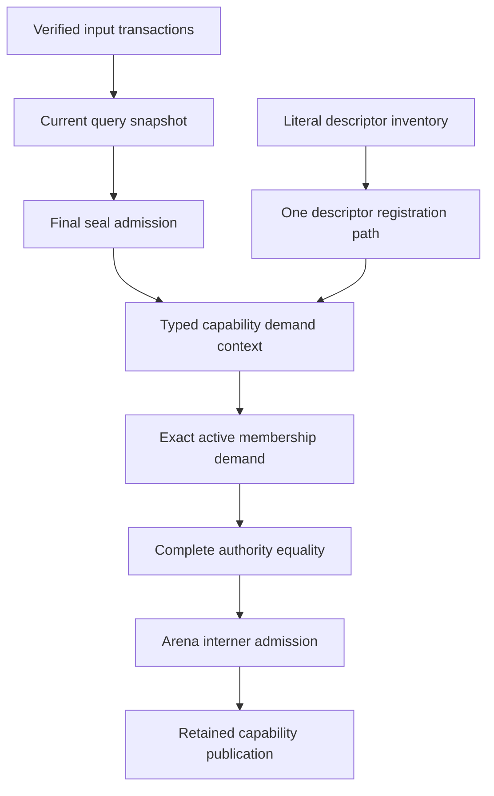
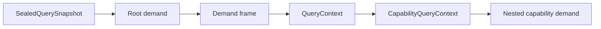

# RFC 0028: Query Runtime Final-Seal And Descriptor Closure

## Summary

This RFC defines the complete query-runtime contract required to implement the
final-snapshot materializers accepted by RFCs 0025 through 0027.

The design has six parts:

1. every query database and snapshot retains one unforgeable process-local
   database identity token;
2. input transactions and final sealing use closed failure results and publish
   no partial state;
3. every query descriptor has one literal compile-time metadata declaration and
   one registration path;
4. request evaluation separates semantic values, published capabilities,
   verified capability rejections, and runtime rejections;
5. a typed capability context carries final-seal admission and grants active
   materialization only through exact three-parameter permissions; and
6. module dependency provenance is a retained revision-local capability, while
   the unused closure-environment projection is removed from the query catalog.

The implementation is one unversioned internal replacement. It introduces no
adapter, compatibility alias, fallback authority, dual descriptor form, or
unsealed materializer path.

## Motivation

RFC 0027 defines the final-snapshot barrier, literal descriptors, typed
materializer permissions, exact active membership, and two auxiliary query
projections. Source implementation cannot proceed without inventing contracts
because the accepted design does not specify:

- how an unforgeable database identity is owned and propagated without mutable
  global state;
- how a final seal is bound to one database, current snapshot, context root,
  and final witness;
- how final-seal admission reaches nested capability demands without consulting
  mutable ambient state;
- how transaction and sealing failures are represented without collapsing
  distinct outcomes;
- how descriptor kind and metadata are fixed at compile time and assigned
  stable query-kind identity;
- how one materializer is authorized for one global key and one exact
  membership descriptor;
- how active membership proves complete authority equality before interning;
  and
- how request-to-current-syntax provenance is represented and verified.

The query catalog also names `ClosureEnvironmentMap`, but no production
consumer needs that projection. `BoundOwnerBody` already owns the complete
closure, free-variable, and explicit-capture facts used by owner-body
materialization. A second memo would duplicate the same authority and add an
otherwise unnecessary codec and failure mapping.

These gaps affect the query engine, parser descriptors, driver descriptors,
Binder schema generation, active identity admission, session transactions, and
verification gates. They require one reviewed cross-owner contract before
source implementation continues.

## Goals

- Give every database, snapshot, demand frame, final seal, and surviving
  capability memo one exact unforgeable process-local database identity.
- Define irreversible final sealing against one current snapshot, context-root
  input, and final witness.
- Define a closed input-transaction and final-seal failure algebra.
- Replace runtime descriptor construction with literal compile-time metadata
  and one generated inventory.
- Make query-kind identity independent of registration call order.
- Separate semantic values, capability publication, capability rejection, and
  runtime rejection in the type-erased request result.
- Bind every revision-local capability provider to
  `CapabilityQueryContext<Descriptor>`.
- Enforce exact three-parameter active-materializer permissions at compile
  time.
- Demand and compare complete active-membership authority before any interner
  access.
- Define the complete runtime schema and verification contract for
  `ModuleDependencyProvenanceMap`.
- Remove `ClosureEnvironmentMap` from the accepted query catalog and schema
  work.
- Preserve retained dependency edges and surviving capability lease lifetime.

## Non-Goals

- This RFC does not change ZOM syntax, name resolution, type checking, or core
  library source semantics.
- This RFC does not add query persistence or cross-process database identity.
- This RFC does not serialize runtime handles, AST node identities, source
  spans, seals, or database identities.
- This RFC does not define the stable Binder facts already closed by RFC 0027.
- This RFC does not implement the identity interner, Binder materializers,
  Checker handoff, IR lineage, or source-backed core roles.
- This RFC does not authorize input mutation after final sealing.
- This RFC does not permit wildcard materializer permissions or runtime
  descriptor-name dispatch.

## Prior Art

The
[rustc query system](https://rustc-dev-guide.rust-lang.org/query.html)
uses typed query keys and registered providers. Its incremental design records
every dependency through the query context and relies on stable keys rather
than session-local numeric identities. ZOM adopts the typed provider boundary,
complete dependency recording, and stable-key separation.

The
[rustc incremental compilation model](https://rustc-dev-guide.rust-lang.org/queries/incremental-compilation-in-detail.html)
treats a query as a deterministic function of explicit tracked inputs and
records query-to-query edges during execution. ZOM applies the same rule to
membership admission and retained capability dependencies: interner state is
never a substitute for a tracked membership read.

[Salsa database lifetimes](https://salsa-rs.github.io/salsa/plumbing/db_lifetime.html)
prevent tracked or interned identities from being used across an incompatible
database state. ZOM uses explicit database identity, snapshot revision, final
admission, and retained arenas because its capability leases may outlive the
session object.

[LLVM bump-pointer allocation](https://www.llvm.org/docs/doxygen/Allocator_8h_source.html)
uses monotonic arena lifetime for immutable compiler objects. ZOM keeps
revision-local capability payloads and their dependency leases inside retained
arenas and never serializes their runtime coordinates.

## Guide-Level Explanation

The session installs all explicit inputs through three verified transactions.
It then captures the current snapshot, verifies the complete context authority,
and seals that exact snapshot. The seal does not create a revision.



A materializer cannot run merely because the database has been sealed. The
root demand must carry the final admission for the same database, revision,
context-root input key, and final witness. Nested capability demands inherit
that admission. A foreign, stale, or unequal admission fails before provider
execution.

Every descriptor declares its complete metadata in its type. Registration code
cannot choose a different descriptor kind or runtime contract. Every active
materialization call is compiled only when an exact permission specialization
binds the calling descriptor, global identity key, and membership descriptor.

## Reference-Level Design

### Closed Query Descriptor Metadata

Every query specification declares exactly one literal metadata object:

```cpp
struct ExampleDescriptor final {
  using Key = ExampleKey;
  using Value = ExampleValue;

  static constexpr query::SemanticDescriptorMetadata descriptor = {
      .name = "ExampleDescriptor"_zcc,
      .domain = "zom.query.example"_zcc,
      .reuse = query::ReuseClass::Semantic,
      .retention = query::RetentionClass::Retained,
      .equality = query::QueryEqualityPolicy::CanonicalBytes,
      .cycle = query::QueryCyclePolicy::Reject,
      .cost = query::QueryCostClass::Linear,
  };
};
```

The three kind-specific literal metadata types are:

```text
InputDescriptorMetadata {
  name,
  domain,
  durability,
}

SemanticDescriptorMetadata {
  name,
  domain,
  reuse,
  retention,
  equality,
  cycle,
  cost,
}

CapabilityDescriptorMetadata {
  name,
  domain,
  retention,
  cycle,
  cost,
  admission,
}
```

The metadata type determines `Input`, `Semantic`, or
`RevisionLocalCapability`. Fields that do not apply to a descriptor kind do not
exist. Input reuse is `Input`, input retention is `Retained`, semantic
admission is `AnySnapshot`, capability reuse is `RevisionLocal`, capability
retention is `Retained`, and every cycle policy is `Reject`.

All three metadata records are literal types. `name` and `domain` have type
`zc::LiteralStringConst`, use the `_zcc` literal, and contain non-empty
printable ASCII. They cannot be constructed from `zc::StringPtr`, an owning
string, or another runtime-computed value. Descriptor metadata is immutable and
has no function callback, sentinel, or placeholder.

Registration is:

```cpp
DescriptorRegistrationResult result =
    database.registerDescriptor<Descriptor>();
```

The descriptor kind selects the only valid registration behavior. Compile-time
constraints reject a missing codec, provider, verifier, capability type, or
illegal metadata combination.

Registration has one closed setup-time result:

```text
DescriptorRegistrationResult =
    Registered(QueryKindId)
  | Rejected(DescriptorRegistrationFailure)

DescriptorRegistrationFailure =
    DescriptorAbsentFromInventory
  | InventoryMismatch
  | MetadataMismatch
  | SlotAlreadyRegistered
  | SlotCollision
```

These failures are neither query values nor `QueryRuntimeFailure`. Every
rejection leaves the complete slot array unchanged.

Registration holds the exclusive descriptor lock and checks failures in this
exact order:

1. no generated row for the descriptor:
   `DescriptorAbsentFromInventory`;
2. generated row inventory identity differs from the database inventory:
   `InventoryMismatch`;
3. descriptor literal metadata differs from the row:
   `MetadataMismatch`;
4. assigned slot already contains the same descriptor:
   `SlotAlreadyRegistered`; and
5. assigned slot contains another descriptor: `SlotCollision`.

Concurrent registration is serialized by that lock. The first complete
registration publishes the slot; each loser observes the published slot and
returns step four or five.

`zomlang/compiler/query/query-descriptor-schema.def` is the closed
production inventory. Each row contains one explicit contiguous `uint32`
ordinal, descriptor type, literal name, literal domain, metadata kind, and
owning path family. Ordinals begin at zero, increase by one in file order, and
are never derived from a sort, registration sequence, hash, address, or link
order.

`QueryKindId` equals the explicit inventory ordinal in one target-specific
closed inventory. A production target uses the production inventory. Each test
target that declares test-only descriptors generates one inventory whose
unchanged prefix is the complete production inventory and whose contiguous
tail contains that target's test descriptors. Test ordinals therefore never
restart at zero and never overlap production slots.

`QueryDatabase` construction requires a generated immutable
`QueryDescriptorInventoryRef`. The database stores that inventory identity,
allocates exactly its row count of descriptor slots, and initializes every slot
as unregistered with its expected row metadata.
`registerDescriptor<Descriptor>()` looks up the descriptor's generated row,
verifies that the row belongs to the database inventory, and installs only into
that ordinal. Demand of an empty slot returns `UnregisteredKind`. Registration
of a descriptor absent from the bound inventory, registration against another
target's inventory, metadata disagreement, re-registration of an occupied
slot, and installation of a different descriptor into an occupied slot return
their exact registration failure. No database combines inventories after
construction.

Registration may occur in any order. The generator rejects missing, repeated,
reordered-without-ordinal-update, or noncontiguous ordinals; duplicate names or
domains; metadata disagreement; a production descriptor outside the production
inventory; a test inventory that does not preserve the complete production
prefix; and any cross-target or restarted test ordinal.

### Database Identity

`QueryDatabaseIdentity` is an opaque retained token:

```text
QueryDatabaseIdentity {
  token: Arc<const QueryDatabaseIdentityToken>,
}
```

`QueryDatabaseIdentityToken` is private to the query implementation, has no
public fields, codec, stable hash, ordinal, generation, or factory, and is
created exactly once by each fresh `QueryDatabase::Impl`. The identity has no
default constructor. Only `QueryDatabase` can create one.

Equality is identity of the retained token object. Implementations may use the
reference-counted handle's native identity comparison, but may not expose,
serialize, print, hash, order, or convert its storage address. An old identity
retains its token, so a live comparable identity can never alias storage reused
for a later database.

Move construction and move assignment transfer the existing implementation and
token. They do not create another identity. Every fresh database receives a
distinct token, including concurrently created databases and databases created
after another database is destroyed.

The identity is retained by:

- `QueryDatabase::Impl`;
- database protected state;
- every `SnapshotState`;
- every `QuerySnapshot`;
- every `InputTransaction`;
- every demand frame;
- every final-seal admission; and
- every public `FinalSnapshotSeal`; and
- every `RevisionLocalCapabilityMemoBase`, so detached capability leases can
  still prove their database coordinate without borrowing the database.

Database identity is not serialized, printed, ordered, hashed into semantic
values, derived from an address, clock, random value, revision, or session
identifier, or compared across processes. There is no mutable process-level
identity authority, numeric counter, exhaustion path, or test seed.

`QueryDatabase` exclusively owns `QueryDatabase::Impl`, and the implementation
borrows the session-owned `basic::ThreadPool`. `QuerySnapshot`,
`SealedQuerySnapshot`, `InputTransaction`, and synchronous demand frames borrow
the implementation and are lifetime-bound to the `QueryDatabase` wrapper.
They retain snapshot or transaction state but never extend the implementation
or scheduler lifetime. Move construction transfers the heap implementation and
keeps existing borrowers valid. Move assignment is permitted only when no
borrower refers to the destination implementation being replaced.

Each borrowing wrapper owns one internal RAII borrow token counted by the
implementation. Wrapper destruction releases exactly one token.
`QueryDatabase` destruction and move assignment check for zero live borrow
tokens before releasing or replacing the implementation and fail a process
invariant before freeing memory if the order is violated. The external thread
pool must outlive the database; the session's member order and test fixture
scopes enforce that precondition.

Session teardown follows one exact order: join and destroy demand frames;
abandon and destroy input transactions; destroy sealed and unsealed snapshots;
destroy `QueryDatabase`; then destroy its borrowed `basic::ThreadPool`. Native
tests exercise both valid teardown and fail-closed borrower-order violations.
`QueryCapabilityLease` is the only public query result that may outlive the
database wrapper: it borrows neither the implementation nor the thread pool
and owns the retained memo chain and immutable arenas needed by its payload.
`FinalSnapshotSeal` is a detached value token and may also outlive the wrapper,
but it cannot demand a query, recreate a snapshot, or authorize another
database.

### Input Transaction Failure Algebra

The closed failure enum is:

```text
InputTransactionFailure =
    TransactionAlreadyOpen
  | TransactionClosed
  | InputMutationAfterFinalSeal
  | UnknownDescriptor
  | DescriptorKindMismatch
  | InvalidKeyEncoding
  | FingerprintCollision
  | FrozenInputMutation
  | MissingInputForErase
  | DuplicateInputOperation
  | StaleBaseRevision
  | RevisionExhausted
  | OpenTransactionDuringFinalSeal
  | FinalSealAlreadyPublished
  | ForeignSnapshot
  | StaleSnapshot
  | InvalidFinalSealAuthority
```

The operation results are:

```text
InputTransactionOpenResult =
    Opened(InputTransaction)
  | Rejected(InputTransactionFailure)

InputMutationResult =
    Applied
  | Rejected(InputTransactionFailure)

InputCommitResult =
    Committed(DatabaseRevision)
  | Rejected(InputTransactionFailure)

FinalSealResult<ContextRoots, FinalWitness> =
    Sealed(FinalSnapshotSeal<ContextRoots, FinalWitness>)
  | Rejected(InputTransactionFailure)
```

No input operation uses `bool`, an empty optional value, or an unrelated query
runtime failure to encode these outcomes.

`beginInputTransaction(expectedPreviousRevision)` verifies the expected
revision under the input lock and captures that base revision. A transaction
records at most one operation for each complete canonical input key. Duplicate
operations return `DuplicateInputOperation`.

Failure atomicity is:

- a rejected `set` or `erase` leaves the staged root unchanged and keeps the
  transaction open;
- a rejected `commit` publishes neither a root nor a revision and closes the
  transaction;
- `abandon` closes an open transaction without publication;
- a rejected final seal changes no seal state; and
- after final sealing, `begin`, `set`, `erase`, and `commit` first return
  `InputMutationAfterFinalSeal`, including calls through an already closed
  transaction handle.

`UnknownDescriptor`, `DescriptorKindMismatch`, `InvalidKeyEncoding`, and
`FingerprintCollision` are detected before a staged root mutation.
`FrozenInputMutation` applies to unequal replacement or erase of a committed
frozen input. `MissingInputForErase` applies only when the complete key is
absent at the transaction base. `RevisionExhausted` rejects publication before
allocating or installing the next snapshot.

Transaction failures are process-local control results. They are not semantic
query values, diagnostics, persisted bytes, or fallback success states.

Failure precedence is deterministic and operation-specific:

| Operation | Checks in exact first-failure order |
|---|---|
| `begin` | final seal; another open transaction; expected previous revision |
| `set` | final seal; closed transaction; descriptor registration; input descriptor kind; canonical key encoding; fingerprint collision; duplicate operation; unequal frozen mutation |
| `erase` | final seal; closed transaction; descriptor registration; input descriptor kind; canonical key encoding; fingerprint collision; duplicate operation; frozen descriptor; missing base input |
| `commit` | final seal; closed transaction; stale base revision; revision exhaustion |
| `sealInputs` | existing final seal; open transaction; foreign snapshot; stale snapshot; descriptor registration; input descriptor kind; canonical context-key encoding; final authority verification |

Each row stops at the first failed check. `abandon` is idempotent, returns no
failure, releases the open-transaction state exactly once, and never publishes
an input root. No descriptor, key, value, or revision check follows a
higher-priority failure.

### Query Runtime Failure Algebra

The complete runtime-only query failure enum is replaced directly by:

```text
QueryRuntimeFailure =
    UnregisteredKind       // 0x01
  | InvalidKeyEncoding     // 0x02
  | MissingInput           // 0x03
  | ProviderRejected       // 0x04
  | VerifierRejected       // 0x05
  | Cycle                  // 0x06
  | Cancelled              // 0x07
  | FingerprintCollision   // 0x08
  | InvariantViolation     // 0x09
  | FinalSealRequired      // 0x0a
  | FinalSealMismatch      // 0x0b
  | AllocationFailure      // 0x0c
```

These tags are not serialized or persisted. `FinalSealRequired` means a
final-sealed descriptor was demanded without an admission.
`FinalSealMismatch` means the admission database, revision, context root, or
witness differs from the private final-seal record. Input transaction failures
never enter this enum. A malformed capability failure envelope is
`InvariantViolation`; provider/verifier disagreement is `VerifierRejected`.

### Final Snapshot Seal

Complete-context authority is a separate compile-time input role, not a
runtime metadata field. The production inventory uses exactly one
`ZOM_COMPLETE_CONTEXT_INPUT` row; ordinary inputs use `ZOM_INPUT`. The complete
row names a descriptor satisfying:

```cpp
template <typename Descriptor>
concept CompleteContextAuthorityInput =
    InputQueryDescriptor<Descriptor> &&
    requires(const QuerySnapshot& snapshot,
             const typename Descriptor::Key& key,
             const typename Descriptor::Value& value,
             const identity::Sha256Digest& witness) {
      Descriptor::verifyFinalAuthority(snapshot, key, value, witness);
      requires zc::isSameType<
          decltype(Descriptor::verifyFinalAuthority(
              snapshot, key, value, witness)),
          FinalAuthorityCheck>();
    };
```

`FinalAuthorityCheck` is the closed result `Verified | Rejected`.
`CompleteCompilationContextAuthorityInput` is the only production descriptor
with this role. Its static verifier independently demands the graph, SCC,
authority, readiness, and transaction-witness inputs from the supplied
snapshot, compares the complete value and final witness, and returns one
`FinalAuthorityCheck`. The verifier never receives a database lock or a
constructible seal type.

The descriptor and static verifier do not land before those prerequisite
descriptors and reads exist. RFC 0027 I1A, I2, and M1 are prepare-only
partitions. RFC 0027 T1 is their sole atomic landing authority and must land
the complete descriptor, all prerequisite inputs, the independent static
verifier, the transaction witness, and the snapshot state machine in one
buildable transaction. A temporary self-authentication check over only the
stored value, key, or witness is forbidden.

The same landing replaces the existing core-distribution transaction API in
`core-library-query-provider.{h,cc}` directly. All three session transactions
accept a caller-supplied expected previous revision, validate their complete
payload before opening the database transaction, install their witness in the
same new revision as their semantic inputs, and return `InputCommitResult`.
They never discover their base revision internally and never publish a witness
through a second transaction.

The production inventory contains three `Frozen` transaction-witness input
descriptors. `CoreDistributionTransactionWitnessInput`,
`ModuleStructureTransactionWitnessInput`, and
`ContextualIdentityAuthorityTransactionWitnessInput` occupy ordinals 56, 57,
and 58 respectively. Each uses the complete context roots as its key and its
transaction's `CanonicalInputPayloadDigest` as its value. Each transaction
owns exactly one descriptor and installs it with its semantic inputs in the
same revision. The final authority verifier probes the three static descriptor
types in that order. No tagged key, aggregate input, runtime descriptor-name
dispatch, or additional descriptor kind exists.

The descriptor generator and its self-test enforce all three exact production
rows, their order, input kind, domain, `Frozen` durability, and the ordinal-59
start of the contiguous test tail. Missing, duplicate, reordered, renamed,
mistyped, mutable, or test-tail witness rows are rejected.

RFC 0027 T1 migrates all three production mutation callers in
`compiler-session.cc` in the same landing: core distribution, module structure,
and direct replacement of `activeDefinitionAuthority.refresh(...)` by the
contextual-identity-authority transaction. Every caller supplies the retained
previous revision and consumes the closed commit result without an overload,
Boolean adapter, or retained refresh path. This narrow call-site cutover does
not implement the T2A session state machine, named snapshots, semantic resource
interface, or final capability root.

Only `QueryDatabase::sealInputs` may turn `Verified` into the private
nonconstructible `VerifiedFinalSealAuthority`, after phase three repeats all
higher-priority state checks. The generator rejects zero or multiple complete
rows, a non-input row, a missing or wrong verifier signature, a runtime
function pointer, and a call to `sealInputs` with an ordinary input descriptor.

The final operation is:

```cpp
template <typename CompleteContextInput, typename FinalWitness>
FinalSealResult<typename CompleteContextInput::Key, FinalWitness> sealInputs(
    const QuerySnapshot& finalSnapshot,
    const typename CompleteContextInput::Key& contextRoots,
    const FinalWitness& finalWitness);
```

`CompleteContextInput` must be an `Input` descriptor. Its key and value codecs
must be canonical and its descriptor must declare complete-context authority.

Final sealing uses three phases and never demands a query while holding the
database data lock.

Phase one acquires the exclusive input lock and performs the `sealInputs`
precedence row through canonical context-key encoding. It retains the immutable
snapshot state, canonical context key, and descriptor registration, then
releases the lock without changing seal state.

Phase two runs completely without the database data lock. It reads the exact
complete-context input from `finalSnapshot`, decodes it canonically, and calls
the descriptor-specific final-authority verifier. Provider-independent
collection re-demands the graph, SCC, authority, readiness, and transaction
witness inputs from the immutable snapshot and compares the supplied final
witness. Success creates one private, nonconstructible
`VerifiedFinalSealAuthority` containing the database identity, snapshot
revision, canonical context key, and final witness.

Phase three reacquires the exclusive input lock and repeats the complete
`sealInputs` precedence row:

1. no final seal exists;
2. no input transaction is open;
3. the snapshot and verified token database identity equal this database;
4. the snapshot and verified token revision equal the current revision;
5. the descriptor remains installed at its inventory kind;
6. the canonical context key remains byte-equal; and
7. the verified token witness equals the supplied final witness.

Only phase three publishes the final admission. A transaction or seal that
wins the race between phases changes the final result according to the repeated
precedence checks. A committed input revision returns `StaleSnapshot`. An
authority verification failure publishes nothing and returns
`InvalidFinalSealAuthority` only after the phase-three higher-priority state
checks are repeated.

Success creates no revision. It stores one immutable private record:

```text
FinalSealAdmission {
  database: QueryDatabaseIdentity,
  revision: DatabaseRevision,
  completeContextKey: CanonicalQueryKey,
  finalWitness: Sha256Digest,
}
```

`FinalWitness` for this RFC is `identity::Sha256Digest`. The template keeps the query
runtime testable with an equivalent fixed-width witness type, but production
registration accepts only `Sha256Digest`.

The returned move-only seal contains the same database identity, revision,
typed context-root key, and final witness. It cannot be publicly constructed.
The database retains the admission independently of the returned object.

The final seal is irreversible. A repeated seal returns
`FinalSealAlreadyPublished`. An open transaction returns
`OpenTransactionDuringFinalSeal`. A foreign snapshot returns
`ForeignSnapshot`. A prior revision returns `StaleSnapshot`. A missing,
noncanonical, unequal, or independently rejected context authority returns
`InvalidFinalSealAuthority`.

### Sealed Root Demand And Admission Propagation

A final-sealed capability root is demanded through:

```cpp
SealedQuerySnapshot<ContextRoots, FinalWitness>
```

The only constructor consumes a `QuerySnapshot` for the same database and
revision and borrows the matching `FinalSnapshotSeal` for validation. The
sealed snapshot compares the seal's database, revision, canonical context-root
key, and witness with the private admission, then retains the snapshot state
and immutable admission while borrowing the database implementation.

A descriptor declares:

```text
CapabilityAdmission =
    AnySnapshot
  | FinalSealedSnapshot
```

Every final materializer uses `FinalSealedSnapshot`. Parse and other staging
capabilities use `AnySnapshot` only where their accepted descriptor contract
permits it.

The admission travels unchanged through:



Nested demands inherit the same admission. Providers and verifiers do not
re-read a mutable database seal flag. Before invoking a final-sealed provider,
the evaluator verifies:

- inherited admission is present;
- its database identity, revision, canonical complete-context key, and witness
  are byte-equal to the database's private immutable admission; and
- its database identity and revision equal the demand database and snapshot.

A capability key never projects or reconstructs
`CompilationRootSetQueryKey`. Descriptors keyed by `ModuleKey` use the same
database-global admission. A materializer that needs root completeness
independently demands `CompleteCompilationContextAuthority` and the exact
contextual membership descriptor before any interner access.

Failure occurs before provider code, membership demand, interner access, memo
lookup, or memo publication. Final admission mismatch maps to
`QueryRuntimeFailure::FinalSealMismatch`; absent admission maps to
`QueryRuntimeFailure::FinalSealRequired`.

### Typed Capability Context

Revision-local capability providers and verifiers receive:

```cpp
CapabilityQueryContext<Descriptor>
```

Only the query evaluator constructs this type. It binds the descriptor at
compile time and exposes tracked semantic reads, retained capability reads,
parallel reads where permitted, cancellation, final admission, and authorized
active materialization.

The context contains no runtime permission boolean. A provider cannot
substitute another descriptor type, construct an unbound context, or acquire
materialization authority by descriptor name.

Retained dependency behavior remains:

- every successful child capability read records one dependency edge;
- a parent capability memo retains the exact child memo allocation;
- repeated equal child reads retain one canonical dependency entry;
- a failed child demand publishes no parent capability; and
- surviving leases keep the complete child chain and semantic-context arena
  alive.

### Capability Failure Bridge

The type-erased evaluator result is:

```text
QueryRequestResult =
    Semantic(QueryValue)
  | CapabilityPublished(Arc<RevisionLocalCapabilityMemoBase>)
  | CapabilityRejected(CapabilityFailureEnvelope)
  | RuntimeRejected(QueryRuntimeFailure)
```

`Semantic(QueryValue)` is legal only for input and semantic descriptors.
`CapabilityPublished` and `CapabilityRejected` are legal only for
revision-local capability descriptors. `RuntimeRejected` applies to every
descriptor kind. A capability provider cannot create a `QueryValue`, and a
capability rejection never enters `QueryValue::SemanticFailure`.

Only the evaluator constructs `CapabilityPublished`, after candidate
verification, complete witness validation, dependency retention, and canonical
capability memo publication. The alternative owns one
`zc::Arc<RevisionLocalCapabilityMemoBase>` to that exact published memo. A
capability cache hit returns a fresh arc to the same memo without rerunning the
provider. Candidate publication creates exactly one capability memo and no
semantic memo; source, key, and runtime rejection publish neither memo kind.

`QueryRequestResult` is move-only and exposes no public base-memo observer or
clone operation. `CapabilityResultDecoder<Descriptor>` consumes it as an
rvalue. For `CapabilityPublished`, the decoder verifies that the memo's complete
canonical key kind equals the generated ordinal of `Descriptor` and that its
database identity and revision equal the current demand. Its private
evaluator-owned caster may then transfer the arc into
`QueryCapabilityLease<const Descriptor::Capability>`.

The cast is sound because the database-bound descriptor inventory is immutable,
registration already proved the ordinal binding, and the evaluator's only memo
construction template binds one ordinal to one
`RevisionLocalCapabilityMemo<Descriptor::Capability>` allocation. There is no
RTTI, public downcast, runtime type-name dispatch, alternate memo factory, or
independent decoder inventory coordinate. Kind, database, or revision
disagreement is `QueryRuntimeFailure::InvariantViolation` and returns no lease.

The provider-side result and public demand result are descriptor-dependent:

```cpp
CapabilityProviderResult<Descriptor>
CapabilityDemandResult<Descriptor>
```

Every capability descriptor declares exactly one closed list:

```cpp
struct ParseSourceQuery final {
  using FailureAlternatives = query::CapabilityFailureList<
      query::SourceRejection<diagnostics::DiagnosticFact>>;
};

struct ModuleDependencyProvenance final {
  using Capability = ModuleDependencyProvenanceMap;
  using FailureAlternatives = query::CapabilityFailureList<
      query::SourceRejection<diagnostics::DiagnosticFact>,
      query::KeyRejection<binder::BinderKeyFailure>>;
};
```

The synchronized RFC 0031 stable-Binder schema records both aliases for each
capability descriptor. `R28-13A` prepares the query-type review partition;
RFC 0029 `R29-13A` owns the generic
`CapabilityDemandResult<Descriptor>` runtime sum, and `R29-13C` owns its
native and mutation coverage. A descriptor-owning task activates only its own
schema row and compiles exact type equality between the hand-written
`Descriptor::Capability` and `Descriptor::FailureAlternatives` aliases and the
row's `capabilityType` and failure-alternative list. Future descriptor rows
remain inert. The final architecture gate rejects any implemented descriptor
that lacks either equality check.

The list may contain either wrapper at most once and may be empty. A
compile-time transformation produces the exact internal `zc::OneOf` storage,
constructors, codecs, and public observers for only the listed wrappers.
`Candidate(Own<Descriptor::Capability>, StableWitnessBytes)` and
`RuntimeRejected(QueryRuntimeFailure)` always exist.
`SourceRejected(CanonicalNonEmptySequence<Diagnostic>)` exists only when the
list contains `SourceRejection<Diagnostic>`. `KeyRejected(KeyFailure)` exists
only when it contains `KeyRejection<KeyFailure>`.

There is no primary `Descriptor::Diagnostic` or `Descriptor::KeyFailure`
requirement, no dummy type, empty type, placeholder payload, sentinel, or
whole-result specialization. A listed wrapper has one
`CapabilityFailureContract<Descriptor, Wrapper>` specialization containing
its canonical codec and independent verifier. The query layer owns only the
wrapper templates and transformation; parser, Binder, and diagnostics types
remain in their owning subsystems.

The exact descriptor shapes are:

```text
ParseSource =
    Candidate
  | SourceRejected(CanonicalNonEmptySequence<diagnostics::DiagnosticFact>)
  | RuntimeRejected(QueryRuntimeFailure)

ModuleDependencyProvenance =
    Candidate
  | SourceRejected(CanonicalNonEmptySequence<diagnostics::DiagnosticFact>)
  | KeyRejected(BinderKeyFailure)
  | RuntimeRejected(QueryRuntimeFailure)
```

`QuerySnapshot::getCapability<Descriptor>` and
`CapabilityQueryContext<ParentDescriptor>::getCapability<Descriptor>` use the
same `CapabilityResultDecoder<Descriptor>` and return the exact transformed
`CapabilityDemandResult<Descriptor>`. No public path returns a generic lease
plus opaque failure bytes.

The type-erased evaluator carries a verified rejection through one canonical
envelope:

```text
CapabilityFailureKind =
    SourceRejected // 0x01
  | KeyRejected    // 0x02

CapabilityFailureEnvelope {
  descriptorDomain: NonEmptyAsciiBytes,
  kind: CapabilityFailureKind,
  payload: NonEmptyCanonicalBytes,
}
```

The envelope domain is `zom.query.capability-failure`. Encoding is that domain,
one zero byte, framed descriptor-domain bytes, the one-byte kind, and framed
payload bytes in declaration order. Decoding is bounded before allocation,
exactly consumed, and re-encoded byte-for-byte. The descriptor domain must
equal the demanded descriptor literal.

For `SourceRejected`, the payload is the listed source-rejection wrapper's
canonical nonempty diagnostic sequence. For `KeyRejected`, it is the listed
key-rejection wrapper's canonical key-failure record. The generator and C++
concepts reject a constructor, codec, verifier, or observer for an unlisted
alternative.

Before returning an envelope, the evaluator calls exactly one independent
descriptor verifier. `CapabilityRejectionCheck` is the closed result
`Verified | Rejected`. The two allowed contract shapes are:

```cpp
static zc::Array<uint8_t> encode(
    const CanonicalNonEmptySequence<Diagnostic>& diagnostics);
static zc::Maybe<CanonicalNonEmptySequence<Diagnostic>> decode(
    zc::ArrayPtr<const uint8_t> bytes);
static CapabilityRejectionCheck verify(
    CapabilityQueryContext<Descriptor>& context,
    const typename Descriptor::Key& key,
    const CanonicalNonEmptySequence<Diagnostic>& diagnostics);

static zc::Array<uint8_t> encode(const KeyFailure& failure);
static zc::Maybe<KeyFailure> decode(zc::ArrayPtr<const uint8_t> bytes);
static CapabilityRejectionCheck verify(
    CapabilityQueryContext<Descriptor>& context,
    const typename Descriptor::Key& key,
    const KeyFailure& failure);
```

Each shape exists only in the matching
`CapabilityFailureContract<Descriptor, Wrapper>` specialization.

Canonical failure payload construction is private to the matching descriptor
contract. It requires a nonempty sequence, independently valid elements,
descriptor-declared canonical order, successful encoding, complete decoding,
and byte-identical re-encoding. A downstream descriptor forwards an upstream
`DiagnosticFact` sequence byte-for-byte without sorting, merging,
deduplicating, or reconstructing it. `StableWitnessBytes` is accepted only
after independent reconstruction, complete decode, candidate equality, and
byte-identical re-encoding.

The verifier re-demands the exact failure-producing inputs and compares the
complete typed payload. Failure returns
`QueryRuntimeFailure::VerifierRejected`. Runtime rejection is never encoded.
A candidate follows the capability candidate verifier and publishes only after
its stable witness matches. No rejection alternative creates a semantic memo
or capability memo.

For `CapabilityRejected`, `CapabilityResultDecoder<Descriptor>` validates the
envelope, invokes the descriptor payload decoder, requires canonical
re-encoding, and constructs the matching public `CapabilityDemandResult`. A
malformed domain, tag, framing, payload, diagnostic sequence, key failure, or
trailing byte returns
`RuntimeRejected(QueryRuntimeFailure::InvariantViolation)`.
A globally known tag that is absent from the descriptor's
`FailureAlternatives` is likewise an invariant violation and never instantiates
the absent wrapper type.

The fixed evaluation precedence is:

1. descriptor registration and canonical key decode;
2. final-admission presence and exact equality;
3. cancellation observed at the evaluator entry checkpoint;
4. cycle detection against the active demand chain;
5. dependency demands in the descriptor's declared canonical read order,
   checking cancellation before each read and after the final read;
6. the first dependency runtime failure returned by that order;
7. typed provider result;
8. the matching independent candidate or rejection verifier;
9. canonical failure-envelope encoding for a verified rejection;
10. memo publication for a verified candidate; and
11. descriptor-specific public decoding.

One evaluator thread performs these checks in order. A cancellation observed at
a checkpoint wins over work after that checkpoint. A dependency failure
already returned before the next cancellation checkpoint is the result.
Concurrent state does not create another precedence rule: immutable snapshot
reads preserve declaration order, and final admission was fixed before
provider execution.

This bridge is part of the atomic query-runtime cutover and applies to parse,
provenance, graph, Binder, core, and downstream revision-local capabilities.

### Stable Identity Admission And Provenance

`IdentitySyntaxSiteInventoryQuery` is the revision-local provenance authority
that exists independently of stable identity admission:

| Property | Contract |
|---|---|
| Domain | `zom.query.identity-syntax-site-inventory` |
| Key | `StableModuleQueryKey` |
| Capability | `binder::IdentitySyntaxSiteInventory` |
| Admission | `AnySnapshot` |
| Cycle | `Reject` |
| Failures | `SourceRejection<DiagnosticFact>`, `KeyRejection<BinderKeyFailure>` |

Its provider reads exactly `SelectedModuleSource`, `ParseSourceQuery`, and
`IdentitySyntaxSiteInventoryProducer`. Its independent verifier repeats both
query reads and uses a separate `IdentitySyntaxSiteInventoryVerifier`
traversal. Selected-source absence produces
`MissingSelectedModuleSource(Module(key.module), none)`; parse rejection is
forwarded unchanged; malformed topology after parse success is
`InvariantViolation`.

The descriptor-private witness is:

```text
IdentitySyntaxSiteInventoryWitness {
  module: ModuleKey,
  source: SourceFileKey,
  sourceDigest: Sha256Digest,
  sites: CanonicalSequence<IdentitySyntaxSiteWitness>,
}

IdentitySyntaxSiteWitness {
  key: IdentitySyntaxSiteKey,
  schemaPreorderOrdinal: uint32,
  source: SourceSpan,
}
```

The witness domain is
`zom.query.identity-syntax-site-inventory-witness`. Sites sort by complete
`IdentitySyntaxSiteKey`; ordinals are unique, in range, and resolve to the exact
node. Keys repeat the outer module and selected source. A legal module with no
identity syntax sites encodes an empty canonical sequence; neither provider nor
verifier fabricates a module-root site.

`SourceSpan` has no public standalone decoder. The witness decoder reads the
encoded `SourceFileKey`, `byteStart`, and `byteEnd`, proves agreement with the
witness source and retained `ImmutableSourceSnapshot`, proves the retained
digest equals `sourceDigest`, and reconstructs only through
`ImmutableSourceSnapshot::span(byteStart, byteEnd)`. Missing bounds, source or
digest disagreement, or disagreement with the ordinal-selected node span
rejects the witness. Decode is bounded, completely consumed, and
byte-identically re-encoded.

`ResolveDiagnosticProvenance` for
`DiagnosticProvenanceKey::IdentitySyntaxSite(key)` derives the exact module key,
demands this inventory in the same snapshot, and requires exactly one matching
site. It never depends on successful stable identity admission. The inventory
is therefore available when later stable-identity validation returns a source
rejection.

`StableIdentityAdmissionQuery` is a revision-local retained capability:

| Property | Contract |
|---|---|
| Domain | `zom.query.stable-identity-admission` |
| Key | `StableModuleQueryKey` |
| Capability | `binder::StableIdentityAdmission` |
| Admission | `AnySnapshot` |
| Cycle | `Reject` |
| Failures | `SourceRejection<DiagnosticFact>`, `KeyRejection<BinderKeyFailure>` |

It owns the verified stable-identity candidate inventory and retains the exact
`ParseSourceQuery` and `IdentitySyntaxSiteInventoryQuery` leases. Its
descriptor-private witness uses domain
`zom.query.stable-identity-admission-witness` and contains the module, source,
source digest, and canonical definition and implementation sequences. Each
entry records the checked schema-preorder ordinal, complete identity authority,
`IdentitySyntaxSiteKey`, and `SourceSpan`. Decode requires the exact domain,
complete consumption, valid and canonically ordered ordinals, matching source
and digest, complete equality, and byte-identical re-encoding.

The provider reads in this exact order:

1. `SelectedModuleSource`;
2. `ParseSourceQuery`;
3. `IdentitySyntaxSiteInventoryQuery`;
4. `CandidateProducer`; and
5. `CandidateVerifier`.

The independent verifier repeats the selected-source and parse demands,
reconstructs without provider state, compares the complete inventory, and
verifies the witness. Selected-source absence produces
`MissingSelectedModuleSource(Module(key.module), none)` and parse rejection is
forwarded unchanged.

Stable-identity admission is the sole owner of
`ZOM4079 ConstantExpressionNotAllowed` and
`ZOM3010 DuplicateIdentifier` for stable identity validation. Both use
`ModuleDiagnosticRoot(key.module)`,
`IdentityDiagnosticPhase::IdentityAdmission`, the matching
`IdentityDiagnosticEmitter`, and the complete primary
`IdentitySyntaxSiteKey`. The duplicate form carries exactly one
`ZOM3017 PreviousDeclarationHere` secondary at the first declaration. Missing
site resolution, producer/verifier disagreement, malformed canonical facts, or
witness disagreement is runtime rejection. The descriptor publishes canonical
`DiagnosticFact` records and never emits through `DiagnosticEngine`.

`NamedDefinitionInventoryQuery` and `NamedImplementationInventoryQuery` remain
semantic. Capability providers demand stable admission before either semantic
inventory, so a stable-identity source failure cannot pass through opaque
semantic-failure bytes.

### Complete Binder Capability Keys And Failures

The production contextual keys are:

```text
ContextualDefinitionKey {
  contextRoots: CompilationRootSetQueryKey,
  definition: StableDefinitionQueryKey {
    module: ModuleKey,
    definition: DefinitionKey,
  },
}

ContextualBodyOwnerKey {
  contextRoots: CompilationRootSetQueryKey,
  body: StableOwnerBodyQueryKey {
    module: ModuleKey,
    owner: StableBodyOwnerKey,
  },
}
```

Every producer, consumer, codec, query key, authority record, fixture, and
generated row changes atomically. There is no constructor from the shorter
shape and no inferred-module fallback.

These five descriptors declare exactly source and key rejection alternatives:

- `RevisionLocalDefinitionSitesQuery`;
- `RevisionLocalImplementationSitesQuery`;
- `ModuleBodyProvenanceQuery`;
- `NamedItemProvenanceQuery`; and
- `OwnerBodyProvenanceQuery`.

```cpp
using FailureAlternatives = query::CapabilityFailureList<
    query::SourceRejection<diagnostics::DiagnosticFact>,
    query::KeyRejection<binder::BinderKeyFailure>>;
```

No descriptor exposes absence, semantic failure bytes, a private failure
domain, or an unlisted observer. Precedence is evaluator runtime failure, legal
key rejection, upstream source rejection, then candidate. The first eligible
typed rejection in the exact read order wins; an earlier runtime result
prevents later classification.

`RevisionLocalDefinitionSitesQuery` reads:

1. `SelectedModuleSource`;
2. `ParseSourceQuery`;
3. `StableIdentityAdmissionQuery`;
4. `NamedDefinitionInventoryQuery`; and
5. independent site reconstruction.

`RevisionLocalImplementationSitesQuery` uses the same order with
`NamedImplementationInventoryQuery`. Their only locally constructible key
rejection is `MissingSelectedModuleSource(Module(key.module), none)`. They
forward stable-admission source rejection unchanged. Semantic inventory failure
after successful stable admission, reconstruction disagreement, missing site
construction, or codec disagreement is runtime rejection.

`ModuleBodyProvenanceQuery` reads selected source, parse source, stable
admission, definition sites, implementation sites, and
`ModuleBodySyntaxQuery`, in that order. Its only legal key rejection is
`MissingSelectedModuleSource(Module(key.module), none)`. It forwards the first
source rejection from parse, stable admission, definition sites, or
implementation sites. `ModuleBodySyntaxQuery` is semantic and cannot publish a
capability source rejection; a semantic failure from that final read after
typed provenance succeeds is `InvariantViolation`.

`NamedItemProvenanceQuery` uses the complete `ContextualDefinitionKey` and reads:

1. `ActiveDefinitionAuthorityInput`;
2. `ActiveDefinitionAuthorityReadyInput` only when authority is absent or
   contradictory;
3. `SelectedModuleSource`;
4. `ParseSourceQuery`;
5. `StableIdentityAdmissionQuery`;
6. `NamedDefinitionInventoryQuery`;
7. `RevisionLocalDefinitionSitesQuery`;
8. `RevisionLocalImplementationSitesQuery`; and
9. `NamedItemSyntaxQuery`.

Its legal key rejections are
`InactiveOwner(DefinitionHeader(key.definition), none)` and
`MissingSelectedModuleSource(Module(key.definition.module), none)`.
`InactiveOwner` requires absent authority plus present complete readiness.
Missing readiness is `ProviderRejected`; contradictory authority is
`InvariantViolation`. Child source and legal key rejections are forwarded
unchanged.

`OwnerBodyProvenanceQuery` uses the complete `ContextualBodyOwnerKey`. A module
owner first reads `ModuleBodyProvenanceQuery`; a definition owner first reads
`NamedItemProvenanceQuery`. Only after typed provenance succeeds does it read
`ModuleBodySyntaxQuery` or `NamedItemSyntaxQuery`. It never reads or decodes
`OwnerBodySyntaxQuery`; provider and verifier reconstruct `OwnerBodySyntax`
directly and independently.

Its legal key rejections are:

```text
DefinitionWithoutBody(Body(key), none)
InactiveOwner(DefinitionHeader(definitionKey), none)
MissingSelectedModuleSource(Module(key.body.module), none)
```

For a definition owner, provider and verifier independently apply the
executable-root admission algorithm to the successful named-item syntax.
`NoBody` constructs `DefinitionWithoutBody`; `Malformed` is
`InvariantViolation`; `Executable` continues candidate construction. The other
two legal key alternatives are forwarded unchanged from the selected typed
child. `ForeignOwner`, `BoundaryMismatch`, `NonSelectedSource`, and
`CrossBoundaryPath` are illegal for this descriptor.

Each descriptor's source verifier repeats its exact conditional read order,
finds the first eligible source rejection, proves no earlier runtime or key
rejection exists, and compares the complete diagnostic sequence byte-for-byte.
Its key verifier independently proves the exact absence, readiness, `NoBody`,
or child rejection and compares the complete `{kind, owner, path}` record.
Forwarded failures retain the child's owner and path.

### Compile-Time Active Materializer Permission

The permission template is:

```cpp
template <
    typename Descriptor,
    typename GlobalIdentityKey,
    typename MembershipDescriptor>
struct ActiveMaterializerPermission;
```

The unspecialized template denies permission. `materializeActive` participates
in overload resolution only when the exact specialization is present.
Wildcard keys, base descriptor classes, runtime descriptor names, variadic
authority, and permission inheritance are forbidden.

The complete production matrix is:

| Materializer | Global key | Membership descriptor |
|---|---|---|
| `MaterializeModuleGraph` | `CompilationUnitIdentity` | `ActiveCompilationUnitMembership` |
| `MaterializeModuleGraph` | `CrateKey` | `ActiveCrateMembership` |
| `MaterializeModuleGraph` | `SourceFileKey` | `ActiveSourceMembership` |
| `MaterializeModuleGraph` | `ModuleKey` | `ActiveModuleMembership` |
| `MaterializeModuleSkeleton` | `CompilationUnitIdentity` | `ActiveCompilationUnitMembership` |
| `MaterializeModuleSkeleton` | `CrateKey` | `ActiveCrateMembership` |
| `MaterializeModuleSkeleton` | `SourceFileKey` | `ActiveSourceMembership` |
| `MaterializeModuleSkeleton` | `ModuleKey` | `ActiveModuleMembership` |
| `MaterializeModuleSkeleton` | `DefinitionKey` | `ActiveDefinitionMembership` |
| `MaterializeModuleSkeleton` | `ImplKey` | `ActiveImplementationMembership` |
| `MaterializeModuleSkeleton` | `GenericParameterKey` | `ActiveGenericParameterMembership` |
| `MaterializeModuleSkeleton` | `CallableParameterKey` | `ActiveCallableParameterMembership` |
| `MaterializeOwnerBody` | `CompilationUnitIdentity` | `ActiveCompilationUnitMembership` |
| `MaterializeOwnerBody` | `CrateKey` | `ActiveCrateMembership` |
| `MaterializeOwnerBody` | `SourceFileKey` | `ActiveSourceMembership` |
| `MaterializeOwnerBody` | `ModuleKey` | `ActiveModuleMembership` |
| `MaterializeOwnerBody` | `DefinitionKey` | `ActiveDefinitionMembership` |
| `MaterializeOwnerBody` | `ImplKey` | `ActiveImplementationMembership` |
| `MaterializeOwnerBody` | `GenericParameterKey` | `ActiveGenericParameterMembership` |
| `MaterializeOwnerBody` | `CallableParameterKey` | `ActiveCallableParameterMembership` |

No other descriptor has an active-materializer permission.

### Exact Active Membership

Every membership descriptor publishes:

```text
ActiveMembershipResult<Record> =
    Active(Record)
  | Inactive
```

The descriptor declares its contextual key, global key projection, complete
authority record, canonical value codec, provider, independent verifier, and
conditional readiness query.

The typed active-materialization operation takes the exact membership key and
the complete expected authority record. Its fixed order is:

1. validate inherited final admission;
2. derive and validate the global identity key from the membership key;
3. demand the exact membership descriptor through the tracked query context;
4. record the membership dependency;
5. return deterministic absence for `Inactive` without reading the interner;
6. compare the complete active record with the expected authority;
7. validate byte-equal context roots, global key, owner, occurrence authority,
   and complete identity record; and
8. call the typed arena interner.

An existing interner entry does not bypass any preceding step.

The eight record contracts are:

| Domain | Complete active authority |
|---|---|
| Compilation unit | contextual unit key and the canonical nonempty active-crate subset for that unit |
| Crate | contextual crate key, exact active-unit ownership, and one exact `ActiveCrates` occurrence |
| Source | contextual source key, exact active-crate ownership, and one exact `ActiveSources` occurrence |
| Module | contextual module key, exact active-crate ownership, and one exact `ActiveModules` occurrence |
| Definition | complete definition record, owning inventory occurrence, header, disposition, and source site |
| Implementation | complete implementation record, owning inventory membership, authority occurrence, and all equal occurrence headers |
| Generic parameter | complete generic record, owner sum, ordinal, name, and implementation occurrence authority when applicable |
| Callable parameter | complete callable record, definition owner, position, receiver legality, name, and header membership |

Complete authority inequality, foreign context, foreign owner, occurrence
contradiction, and canonical collision return
`QueryRuntimeFailure::InvariantViolation`. Proven inactive membership with
complete readiness returns `Inactive`. Missing readiness returns
`QueryRuntimeFailure::ProviderRejected`.

Provider and verifier may share the typed admission and interner primitive.
They independently reconstruct the membership key and expected authority and
may not share projection or collection algorithms.

### Closure Projection Deletion

`ClosureEnvironmentMap` is absent from the final query catalog.

`BoundOwnerBody` remains the sole stable owner of:

- `StableClosureFact`;
- `StableClosureFreeVariableFact`; and
- `StableExplicitClosureCaptureFact`.

`MaterializeOwnerBody` reads the exact `BindOwnerBody` result and expands those
facts directly. `VerifyBoundModule` retains the materialized owner body.
Checker consumers read the materialized facts. No descriptor, value domain,
result domain, provider, verifier, generated schema row, codec, memo, or
architecture allowlist is created for a duplicate projection.

The synchronized acceptance transaction removes the projection from RFC 0019
and RFC 0027 query catalogs and read-set tables.

### Module Dependency Provenance Capability

`ModuleDependencyProvenance` is a final-sealed revision-local capability
descriptor:

| Property | Contract |
|---|---|
| Name | `ModuleDependencyProvenance` |
| Domain | `zom.query.module-dependency-provenance` |
| Key | `ModuleKey` |
| Result | `CapabilityDemandResult<ModuleDependencyProvenance>` |
| Capability | `ModuleDependencyProvenanceMap` |
| Reuse | `RevisionLocal` |
| Retention | `Retained` |
| Cycle | `Reject` |
| Cost | linear in requests and current dependency sites |
| Admission | `FinalSealedSnapshot` |
| Active materializer permission | none |

The runtime-only payload is:

```text
ModuleDependencyProvenanceSite {
  schemaPreorderOrdinal: uint32,
  node: NodeId,
  span: SourceSpan,
}

ModuleDependencyProvenanceOrigin =
    Source(CanonicalNonEmptySequence<ModuleDependencyProvenanceSite>)
  | Prelude

ModuleDependencyProvenanceEntry {
  request: ModuleResolutionKey,
  origin: ModuleDependencyProvenanceOrigin,
}

ModuleDependencyProvenanceMap {
  module: ModuleKey,
  source: SourceFileKey,
  sourceDigest: Sha256Digest,
  entries: CanonicalSequence<ModuleDependencyProvenanceEntry>,
}
```

These types have no canonical value domain, public codec, cross-revision
equality, or persistence contract. `NodeId` and `SourceSpan` are valid only
through the retained final parse capability lease.

The capability memo retains the exact final `ParseSource` capability. It does
not copy a context root, seal, parse lease, resolved target, graph, registry,
session, or semantic handle into the runtime payload.

The stable witness is:

```text
SHA256(
  "zom.query.module-dependency-provenance-witness" || 0x00 ||
  framed(module-bytes) ||
  framed(source-bytes) ||
  framed(source-digest) ||
  framed(detached-site-set-canonical-bytes) ||
  framed(stable-request-set-canonical-bytes)
)
```

Provider and verifier compute the witness through separate collection code.

The synchronized RFC 0031 stable-Binder capability row is exact:

```text
name: ModuleDependencyProvenance
resultType: CapabilityDemandResult<ModuleDependencyProvenance>
capabilityType: ModuleDependencyProvenanceMap
failureAlternatives:
  SourceRejection<DiagnosticFact>
  KeyRejection<BinderKeyFailure>
descriptorTask: R28_16A
providerTask: R28_16A
verifierTask: R28_16A
testTask: R28_16B
```

`R28-16A` compiles both alias-equality checks against this owned row while it
implements the descriptor, provider, and verifier. `R28-16B` mutates the
result type, capability type, and each failure alternative independently,
proves that unilateral drift in either hand-written alias fails, and requires
the final capability architecture gate to recognize both checks.

Complete tracked reads are:

- `SelectedModuleSource(module)`;
- `ModuleDependencySites(module)`;
- `ModuleDependencyRequests(module)`; and
- the final `ParseSource` capability for the selected source.

The provider reconstructs every source dependency occurrence from the retained
AST, maps the detached preorder ordinal to the current `NodeId` and
`SourceSpan`, joins the occurrence to its stable request, and emits one
canonical request-keyed entry. A prelude request emits one `Prelude` entry and
no fabricated node or span.

The candidate invariants are:

- `module` equals the descriptor key;
- `source` and `sourceDigest` equal the selected source and final parse
  capability;
- entries are strictly ordered by complete request bytes and unique;
- every request has exactly one entry;
- every non-prelude detached site is consumed exactly once;
- every `Source` origin has a nonempty site sequence;
- sites within an entry have strictly increasing unique preorder ordinals;
- a `Prelude` origin has no payload and occurs at most once;
- every request requester equals `module`;
- site kind and normalized path match the request;
- every ordinal maps to the current AST node for that detached site;
- every span belongs to `source`, equals the parse span, and lies within the
  retained source buffer; and
- total entries, total sites, and sites per entry do not exceed
  `DependencySitesOrGraphEdges`.

The independent verifier re-demands the same four inputs, traverses the AST
with separate reverse-collection code, rebuilds the ordinal-to-node map,
rejoins requests to sites, recomputes spans and the stable witness, and compares
every candidate field. It does not call provider collection helpers.

Failure mapping is:

| Condition | Result |
|---|---|
| final parse source diagnostics | `SourceRejected` with the exact canonical diagnostics |
| missing selected source | `KeyRejected(BinderKeyFailure { kind: MissingSelectedModuleSource, owner: Module(module), path: none })` |
| noncanonical or undecodable `ModuleKey` bytes | `RuntimeRejected(InvalidKeyEncoding)` before provider execution |
| cancellation | `RuntimeRejected(Cancelled)` |
| active demand-chain cycle | `RuntimeRejected(Cycle)` |
| tracked dependency runtime failure | exact first failure from the descriptor-declared read order |
| canonical-key fingerprint collision | `RuntimeRejected(FingerprintCollision)` |
| absent final admission | `RuntimeRejected(FinalSealRequired)` |
| foreign or stale final admission | `RuntimeRejected(FinalSealMismatch)` |
| contradictory retained source, request, node, span, or witness invariant | `RuntimeRejected(InvariantViolation)` |
| allocation failure | `RuntimeRejected(AllocationFailure)` |
| candidate or rejection verifier disagreement | `RuntimeRejected(VerifierRejected)` |
| valid candidate | `Published` |

No other typed-key rejection is legal for this descriptor. A selected source
whose retained parse input contradicts the module, source, or digest is an
invariant failure rather than a second key-failure alternative.

`MaterializeModuleGraph` joins each provenance entry with the exact
`ResolveModuleRequest` result to form current request edges and the stable
materialized dependency witness. `MaterializeModuleSkeleton` uses the same
capability to restore current import, foreign-reexport, and module-alias node
and span provenance. Their independent verifiers re-demand this capability.
Checker and module diagnostic queries do not consume it directly.

### Atomic Descriptor And Transaction Migration

The descriptor migration changes every production and test descriptor,
registration call, transaction call, and exact oracle in one source
transaction. The tree never contains two metadata authorities or two
registration paths.

The query-runtime files are:

- `zomlang/compiler/query/query-types.{h,cc}`;
- `zomlang/compiler/query/query-database.{h,cc}`;
- `zomlang/compiler/query/query-descriptor-schema.def`;
- `zomlang/compiler/query/CMakeLists.txt`; and
- the generated build-tree
  `zomlang/compiler/query/query-descriptor-inventory.generated.h`.

The production descriptor and verifier families are:

- `zomlang/compiler/binder/identity-pre-admission.{h,cc}`;
- `zomlang/compiler/binder/surface/module-body-syntax.h`;
- `zomlang/compiler/binder/surface/module-body-syntax-producer.cc`;
- `zomlang/compiler/binder/surface/module-body-syntax-verifier.cc`;
- `zomlang/compiler/binder/stable/candidate/producer.{h,cc}`;
- `zomlang/compiler/binder/stable/candidate/verifier.{h,cc}`;
- `zomlang/compiler/identity/source-query-input.{h,cc}`;
- `zomlang/compiler/parser/parse-source-query.{h,cc}`;
- `zomlang/compiler/parser/query/parse-source-query-verifier.cc`;
- `zomlang/compiler/driver/active-definition-authority-query.{h,cc}`;
- `zomlang/compiler/driver/core-library-query-provider.{h,cc}`;
- `zomlang/compiler/driver/core-library-query-verifier.{h,cc}`;
- `zomlang/compiler/driver/incremental-binding-query-adapter.{h,cc}`;
- `zomlang/compiler/driver/incremental-module-resolution-query.{h,cc}`;
- `zomlang/compiler/driver/incremental-package-graph-query-input.{h,cc}`;
- `zomlang/compiler/driver/module-graph-query-input.{h,cc}`;
- `zomlang/compiler/driver/module-graph-query.{h,cc}`;
- `zomlang/compiler/driver/named-identity-inventory-query.{h,cc}`;
- `zomlang/compiler/driver/named-item-query.{h,cc}`; and
- `zomlang/compiler/driver/owner-body-query.{h,cc}`.

Input-transaction consumers are:

- `zomlang/compiler/binder/binding-input.cc`;
- `zomlang/compiler/driver/query/binding/active-definition-authority-session.cc`;
- `zomlang/compiler/driver/session/compiler-session.cc`;
- `zomlang/compiler/driver/core-library-query-provider.cc`;
- `zomlang/compiler/driver/query/module-graph/incremental-module-resolution-query.cc`;
- `zomlang/compiler/driver/query/module-graph/module-graph-query-input.cc`; and
- `zomlang/tests/unittests/compiler/binder/binding-input-test.cc`.

The native query test inventory and exact cutover tests are:

- `zomlang/tests/unittests/compiler/query/query-test-specs.h`;
- `zomlang/tests/unittests/compiler/query/query-test-descriptor-schema.def`;
- `zomlang/tests/unittests/compiler/query/query-database-test.cc`;
- `zomlang/tests/unittests/compiler/query/query-capability-test.cc`;
- `zomlang/tests/unittests/compiler/query/query-concurrency-test.cc`;
- `zomlang/tests/unittests/compiler/query/query-eviction-test.cc`;
- `zomlang/tests/unittests/compiler/query/query-observability-test.cc`;
- `zomlang/tests/unittests/compiler/query/query-red-green-test.cc`;
- `zomlang/tests/unittests/compiler/query/CMakeLists.txt`; and
- the generated build-tree
  `zomlang/tests/unittests/compiler/query/query-test-descriptor-inventory.generated.h`.

All query-test descriptor types, including capability-only fixtures currently
declared inside individual `.cc` files, move into
`query-test-specs.h`. No query test translation unit declares a private
descriptor. The shared test schema can therefore name every type in its
production-prefix-plus-test-tail inventory without depending on translation
unit order.

RFC 0027 T1 deletes both test-only complete-context descriptors that shadow
the production fully qualified name and lands no alias or duplicate name at
any intermediate commit. Generic `QueryDatabase` seal phase-order, race, and
irreversibility tests use `query::test::TestCompleteContextInput`, a `Frozen`
descriptor with the unique domain `test.input.complete-context`. It is the
first test-only row after the complete production prefix, at slot 59, and
never enters a production schema or library. `QueryCapability` final-sealed
integration and the driver session final-seal tests use the real production
descriptor with a valid production root key, complete authority, installed
read set, and final witness. The generic fixture has no alias, verifier
injection seam, or fallback to the production descriptor.

The exact driver tests are:

- `zomlang/tests/unittests/compiler/binder/identity-pre-admission-test.cc`;
- `zomlang/tests/unittests/compiler/driver/active-definition-authority-query-test.cc`;
- `zomlang/tests/unittests/compiler/driver/active-definition-authority-session-test.cc`;
- `zomlang/tests/unittests/compiler/driver/core-library-query-provider-test.cc`;
- `zomlang/tests/unittests/compiler/driver/incremental-binding-query-adapter-test.cc`;
- `zomlang/tests/unittests/compiler/driver/incremental-module-resolution-query-test.cc`;
- `zomlang/tests/unittests/compiler/driver/module-graph-query-input-test.cc`;
- `zomlang/tests/unittests/compiler/driver/named-identity-inventory-query-test.cc`;
- `zomlang/tests/unittests/compiler/driver/named-item-query-test.cc`;
- `zomlang/tests/unittests/compiler/driver/owner-body-query-test.cc`;
- `zomlang/tests/unittests/compiler/driver/compiler-session-test.cc`;
- `zomlang/tests/unittests/compiler/driver/CMakeLists.txt`; and
- `zomlang/tests/unittests/compiler/binder/CMakeLists.txt`.

`scripts/generate-query-descriptor-schema.py` reads the two checked-in schema
inventories and emits the two named build-tree headers. `--check` regenerates
in memory and rejects drift; `--self-test` proves detection of duplicate
ordinals, restarted test ordinals, missing production prefixes, duplicate
domains, invalid literal metadata, and descriptor/schema disagreement.
`scripts/check-query-descriptor-architecture.py --check` rejects a descriptor
outside its bound inventory, an old registration or contract API, a
runtime-computed domain, and a descriptor slot without an exact schema row.
Its `--self-test` supplies adversarial fixtures for every rejection.

`zomlang/tests/unittests/compiler/query/CMakeLists.txt` registers
`query-descriptor-schema` and `query-descriptor-schema-negative`.
`zomlang/tests/CMakeLists.txt` keeps both in the native CTest graph
with labels `unittest;query;architecture`. The production query library and
query unit-test targets receive exactly their generated inventory header
through their respective CMake files. Query unit tests bind the one extended
test inventory; all driver and Binder tests bind the production inventory.

Negative access-control coverage uses
`zomlang/tests/cmake/expect-compile-failure/CMakeLists.txt` and one
source per forbidden operation under
`zomlang/tests/compile-fail/query-runtime/`. Each
`query-runtime-negative-compile-<case>` CTest invokes
`try_compile(SOURCE_FROM_CONTENT ...)` with the configured compiler, source and
build include roots, repository C++23 mode, and
`CMAKE_TRY_COMPILE_TARGET_TYPE=STATIC_LIBRARY`. It requires compilation failure
and the case's exact forbidden symbol. The architecture gate rejects an
unlisted case or any production reference to the private query-runtime test
access type.

The migration deletes every runtime descriptor-construction declaration and
definition after the literal inventory compiles. No forwarding function,
adapter trait, alias, conditional branch, or fallback registration remains.

### Synchronization Transaction

The current accepted contract is synchronized through RFC 0029 proposal
SHA-256
`8d393a0c6c00a7fad9ef086d3d25f5ed44300041afa9e1e1a4af5d68830fd3e7`
and transaction `rfc0029-accept-20260727-8d393a0c`. That indivisible
documentation and routing transaction covers:

- RFC 0017 and its tracker for database identity, transaction outcomes,
  descriptors, final admission, and typed capability context;
- RFC 0018 and its tracker for literal domains, inventory-assigned query-kind
  identity, and complete authority equality;
- RFC 0019 and its tracker for the closure projection deletion and final Binder
  capability descriptors;
- RFC 0020 and its tracker for exact membership results, authority equality,
  final readiness, and transaction failure;
- RFC 0025 and its tracker for session sealing, capability demand order, arena
  lifetime, and source-backed core materializers;
- RFC 0026 and its tracker for final graph materialization and dependency
  provenance;
- RFC 0027 and its tracker for the query catalog, schema inventory, permission
  matrix, stable schema transactions, and dependency graph;
- this RFC and its tracker;
- RFC 0029 and its tracker for unforgeable database identity, request-result
  separation, canonical capability failures, identity-site provenance, stable
  identity admission, complete contextual keys, and implementation order;
- `.codex/subagents/manifest.yaml`, `.codex/subagents/README.md`,
  `.codex/subagents/task-router.md`, and
  `.codex/subagents/verification.md` for exact ownership of the new
  descriptor generator and architecture gate; and
- `docs/rfc/README.md`.

The required synchronized replacements are:

| RFC | Exact synchronized replacement |
|---|---|
| RFC 0017 | define unforgeable retained database identity, kind-specific literal descriptor metadata, explicit inventory ordinals, closed transaction and query-runtime failures, separated request-result alternatives, the capability failure envelope, sealed-root admission propagation, typed capability context, and one registration path; remove numeric database generation, mutable process identity authority, every runtime query contract constructor, caller-selected registration kind, untyped capability context, sealed-state boolean probe, and implicit transaction failure |
| RFC 0018 | bind `QueryKindId` to the explicit inventory ordinal; require literal query and failure-envelope domains plus complete canonical authority equality; remove registration-order identity and runtime-computed descriptor domains |
| RFC 0019 | remove the `ClosureEnvironmentMap` catalog and read-set rows; make final Binder capabilities use sealed admission, typed contexts, exact capability-result decoding, and direct `BoundOwnerBody` closure facts |
| RFC 0020 | define `ActiveMembershipResult<Record>`, conditional readiness, exact authority equality, and admission-before-membership-before-interner order; remove runtime membership dispatch, variadic authority, boolean membership, and ambient readiness |
| RFC 0025 | bind the session state machine to explicit transaction results and `SealedQuerySnapshot`; require capability failure decoding and the twenty permission rows before core materializers; bind schema, codec, diagnostic, runtime, provenance, and verification work to RFC 0029's dependency order |
| RFC 0026 | bind `MaterializeModuleGraph` to sealed root demand and the runtime-only `ModuleDependencyProvenanceMap`; require retained final parse lineage and remove any ambient sealed-state or session graph authority |
| RFC 0027 | move `S1`, `S2`, `S3`, and `S6` before runtime, land `S1` plus `S2` plus `S3` as the exact RFC 0030 build-visible foundation transaction, remove `ClosureEnvironmentMap`, add complete contextual keys, identity-site provenance, stable identity admission, five exact Binder capability failure contracts, explicit descriptor ordinals, affected-owner routing, and corrected downstream dependencies |
| RFC 0028 | replace numeric identity with the retained token; separate `CapabilityPublished` from semantic values; retain only independently reachable decoder coordinates; add the complete identity-site, stable-admission, contextual-key, five-descriptor, and `ModuleBodySyntaxQuery` invariant contracts; preserve bounded review partitions and one atomic runtime landing |

Each synchronized tracker records the RFC 0029 proposal hash, transaction
identifier, exact replaced task rows, and resulting dependency edges.
`docs/rfc/README.md` records RFC 0029 `ACCEPTED` while retaining RFC 0028
`ACCEPTED` in the same tree transaction.

The synchronized acceptance overlays must have zero stale-authority matches
from:

```bash
rg -n 'QueryKindContract|sealInputRoot|activeMaterializationReady' \
  docs/rfc/00{17,18,19,20,25,26,27}-*.md \
  docs/rfc/tracking/00{17,18,19,20,25,26,27}-*.md
rg -n 'ClosureEnvironmentMap|ActiveMembership<' \
  docs/rfc/00{17,18,19,20,25,26,27}-*.md \
  docs/rfc/tracking/00{17,18,19,20,25,26,27}-*.md
rg -n 'QueryDatabaseGenerationAllocator|generation exhaustion|counter seed' \
  docs/rfc/00{17,18,19,20,25,26,27,28}-*.md \
  docs/rfc/tracking/00{17,18,19,20,25,26,27,28}-*.md
```

The indivisible source cutover must then have zero matches from:

```bash
rg -n 'QueryKindContract|sealInputRoot|activeMaterializationReady' \
  zomlang/compiler zomlang/tests
rg -n 'register(Input|Derived|RevisionLocalCapability)Kind' \
  zomlang/compiler zomlang/tests
rg -n 'static .*domain\(\)|static .*contract\(\)' \
  zomlang/compiler zomlang/tests
rg -n 'CapabilityQueryContext&|ActiveMembership<' \
  zomlang/compiler zomlang/tests
```

The capability architecture gate additionally rejects an untyped
`CapabilityProviderResult::semanticFailure`, a capability demand decoded as
`TypedQueryResult<QueryCapabilityLease`, and any materializer permission that
does not name exactly three types. It also rejects mutable global query identity,
numeric identity access, a public type-erased memo observer or caster, capability
rejection transported through `QueryValue`, an illegal descriptor failure
alternative, and test access outside its exact owned files.

All RFC 0029 required owners approve the exact unchanged proposal hash above.
The acceptance transaction records that hash and the transaction identifier in
every synchronized RFC and tracker. No subset is accepted independently.

### Supplemental Review Scopes

These scopes are mandatory technical reviews but do not claim file ownership:

| Reviewer | Required scope |
|---|---|
| `runtime-memory` | token identity and lifetime, lock order, final admission, arena access order, retained child leases, and teardown |
| `error-system` | closed failure tags, operation precedence, failure-envelope integrity, and publication atomicity |

## Repository Impact

| Area | Paths | Owner |
|---|---|---|
| Task and verification routing | `.codex/subagents/manifest.yaml`; `.codex/subagents/README.md`; `.codex/subagents/task-router.md`; `.codex/subagents/verification.md` | `task-router` |
| RFC governance and synchronized overlays | `docs/rfc/**` | `rfc` |
| Query types, database, descriptors, and inventory | `zomlang/compiler/query/**` | `module-system` |
| Identity and driver query descriptors | `zomlang/compiler/identity/**`; `zomlang/compiler/driver/**` | `module-system` |
| Parser capability descriptors | `zomlang/compiler/parser/**` | `lexer-parser` |
| Stable schema and Binder consumers | `zomlang/compiler/binder/**` | `binder-checker` |
| Current-state design audit | `docs/design/**`; synchronized RFC claims | `spec-audit` |
| Unit tests and exact descriptor gates | `zomlang/tests/**`; `scripts/generate-query-descriptor-schema.py`; `scripts/check-query-descriptor-architecture.py` | `verification` |

## Security And Safety Impact

Database identity and final admission prevent a foreign or stale snapshot from
authorizing process-local handle materialization. Complete membership equality
prevents an interner hit from acting as authority. The fixed execution order
ensures inactive or contradictory records fail before arena mutation.

Input transaction and sealing state is protected by the existing exclusive
database lock. Database identity has no mutable process authority or exhaustion
path. Final admission is immutable after publication and is propagated through
retained demand frames rather than read from mutable ambient state.

Runtime provenance retains the exact parse capability that owns its AST and
source buffer. Node and span values cannot outlive that lease and are never
serialized.

## Drawbacks And Risks

- Atomic descriptor migration touches many otherwise independent query
  declarations and tests.
- A generated inventory adds a mandatory maintenance step for every new query
  descriptor.
- Closed transaction failures require explicit handling at every input
  producer.
- Final admission propagation changes internal demand frames and can expose
  hidden untracked capability paths.
- Provenance verification traverses current syntax twice, once for the provider
  and once for the verifier.

The design limits risk with one registration path, compile-time metadata
validation, exact native mutation tests, independent verification, and no
compatibility surface.

## Alternatives Considered

Runtime descriptor objects were considered. They allow registration code to
select a kind inconsistent with the specification and cannot support
compile-time permission constraints, so this RFC uses literal descriptor
metadata.

A database-wide sealed boolean was considered. It does not prove database
identity, revision, context roots, witness equality, or nested-demand
inheritance, so this RFC uses immutable final admission.

Interner lookup before membership demand was considered. An older surviving
lease may keep a prior handle resolvable after current membership changes, so
the interner cannot be current authority.

A separate closure-environment projection was considered. It has no production
consumer, duplicates the stable owner-body facts, and requires an additional
failure-preserving result domain. Direct owner-body consumption is smaller and
complete.

A stable codec for module dependency provenance was considered. Current AST
nodes and spans are revision-local coordinates and have no cross-revision
meaning, so the capability has a stable witness but no value codec.

## Compatibility And Rollout

This is an internal, unreleased contract. The implementation replaces all
descriptor, transaction, seal, context, permission, membership, producer,
consumer, test, generator, and gate call sites directly.

The synchronized rollout order is:

1. accept RFC 0029 and synchronize all listed RFC, tracker, index, and routing
   documents under `rfc0029-accept-20260727-8d393a0c`;
2. prepare RFC 0027 `S1`, `S2`, and `S3` as bounded review partitions, then
   land them together through the exact RFC 0030 `R29-12AB` transaction;
3. land `R29-12D` for canonical Binder diagnostic facts and its exact native
   mutation coverage;
4. prepare the existing RFC 0028 review partitions plus RFC 0029 identity-site,
   stable-admission, descriptor-failure, decoder, race, and negative-compile
   partitions;
5. assemble and land one atomic runtime replacement through RFC 0029
   `R29-14`, deleting every replaced API and old authority;
6. implement module dependency provenance; and
7. resume the remaining dependency graph only through the synchronized
   trackers.

Rollback before publication is a repository revert of the complete source
transaction. There is no persisted data or external protocol migration.

## Documentation And Teaching Plan

- Synchronize RFCs 0017, 0018, 0019, 0020, 0025, 0026, and 0027.
- Update their implementation trackers with the accepted proposal hash and
  transaction identifier.
- Update the current compiler architecture document only after the production
  path and native verification land.
- Keep runtime-only provenance out of the normative language specification.
- Document descriptor inventory generation and validation in the query
  subsystem developer documentation.

## Operational Readiness

The query engine remains in-process and has no service or release-time
configuration. Release readiness requires:

- deterministic descriptor inventory generation;
- registration-order permutation coverage;
- no measurable retained dependency regression;
- no input transaction after final seal;
- worker-count deterministic query witnesses; and
- the existing Release incremental-query compare gate.

## Acceptance Criteria

- All seven affected owners approve one exact unchanged REVIEW proposal hash,
  and the two supplemental review scopes approve the same hash.
- The acceptance transaction synchronizes all listed RFCs, trackers, and the
  RFC index plus the exact routing tree atomically.
- Database identities are unforgeable, distinct, move-stable retained tokens
  propagated to every snapshot, seal, admission, demand frame, and capability
  memo.
- Every input and sealing failure has one explicit closed result.
- Final sealing creates no revision and is irreversible.
- Foreign, stale, context-unequal, and witness-unequal admission fails before
  provider execution.
- Every production query descriptor appears exactly once in the literal
  inventory.
- Registration order cannot change query-kind identity.
- Exactly one production input satisfies
  `CompleteContextAuthorityInput`, and ordinary inputs cannot enter
  `sealInputs`.
- Every capability provider receives `CapabilityQueryContext<Descriptor>`.
- Capability rejection storage, constructors, codecs, verifiers, and observers
  exist only for the descriptor's listed failure alternatives.
- Capability failure envelopes enforce exact descriptor domain, kind, framing,
  canonical payload, complete consumption, independent rejection verification,
  and rejection-without-memo publication.
- `QueryRequestResult` keeps semantic values, published capabilities, verified
  capability rejections, and runtime rejections in distinct alternatives;
  capability decoding checks only independently reachable descriptor,
  database, and revision coordinates.
- `IdentitySyntaxSiteInventoryQuery` publishes independently verified complete
  provenance, including the legal empty sequence, before stable identity
  admission; `SourceSpan` reconstruction uses only the retained immutable
  source snapshot.
- `StableIdentityAdmissionQuery` is the sole stable-identity source-diagnostic
  owner and retains parse plus identity-site lineage.
- Complete contextual definition and owner-body keys replace every shorter
  shape, and the five Binder capabilities expose only their exact source, key,
  runtime, and success alternatives in the declared read order.
- A `ModuleBodySyntaxQuery` semantic failure after typed provenance succeeds is
  `InvariantViolation`, never capability `SourceRejected`.
- Only the twenty exact materializer permission rows compile.
- Membership dependency and complete authority equality precede every interner
  access.
- `ClosureEnvironmentMap` has no descriptor, schema row, provider, verifier,
  codec, memo, consumer, or architecture allowance.
- Module dependency provenance retains the final parse capability and passes
  complete source/prelude, ordering, mutation, and verifier-disagreement tests.
- No internal version suffix, compatibility adapter, alias, fallback, or dual
  authority remains.

## Implementation Plan

| Task | Owner | Depends on | Deliverable |
|---|---|---|---|
| `R28-01` | `rfc` | none | Complete RFC 0028 draft, tracker, and index row |
| `R28-02` | `task-router` | `R28-01` | Confirm required owners, file ownership, gate routing, and atomic migration boundary |
| `R28-03` | `rfc` | `R28-01` | Review process completeness, prior art, exact-hash governance, and synchronization |
| `R28-04` | `module-system` | `R28-01` | Review identity, transaction, seal, admission, descriptor, permission, and provenance contracts |
| `R28-05` | `lexer-parser` | `R28-01` | Review parser capability descriptor and final parse lifetime migration |
| `R28-06` | `binder-checker` | `R28-01` | Review membership authority, closure deletion, schema boundary, and materializer consumers |
| `R28-07` | `runtime-memory` | `R28-01` | Review token identity and lifetime, locking, arena admission order, retained leases, and teardown |
| `R28-08` | `error-system` | `R28-01` | Review closed failure algebra, precedence, and publication atomicity |
| `R28-09` | `spec-audit` | `R28-01` | Review synchronized current-contract claims and removal of duplicate projection authority |
| `R28-10` | `verification` | `R28-01` | Review native tests, generator coverage, architecture gates, determinism, and Release evidence |
| `R28-11` | `rfc` | `R28-02` through `R28-10` | Record exact-hash approvals and prepare the complete synchronized acceptance transaction |
| `R28-11A` | `task-router` | `R28-11` | Assign the two descriptor scripts to `verification` and synchronize routing documentation |
| `R28-12` | `rfc` | `R28-11`; `R28-11A` | Validate the synchronized tree, record one transaction identifier and proposal hash, and accept atomically |
| `R28-13A` | `module-system` with `runtime-memory` review | `R29-12A`; `R29-12B`; `R29-12AB`; `R29-12D` | Prepare the reviewed query-type partition for token database identity, separated request results, transaction failures, seals, and the RFC 0031 generic descriptor-dependent capability-demand runtime sum; do not land independently |
| `R28-13B` | `module-system` | `R28-13A` | Prepare the reviewed query-database partition for transaction and final-seal state, sealed snapshots, and admission propagation; do not land independently |
| `R28-13C` | `module-system` | `R28-13B` | Prepare the reviewed descriptor inventory and query build-wiring partition; do not land independently |
| `R28-13C1` | `verification` | `R28-13C` | Prepare the reviewed inventory generator, architecture gate, and adversarial self-tests; do not land independently |
| `R28-13D` | `module-system` | `R28-13C1` | Prepare reviewed identity and driver descriptor/caller partitions, splitting again before any partition exceeds approximately 400 changed source lines; do not land independently |
| `R28-13E` | `lexer-parser` | `R28-13C1` | Prepare the reviewed parse capability descriptor, failure codec, and caller partition; do not land independently |
| `R28-13F` | `binder-checker` with `verification` review | `R28-13C1` | Prepare the Binder transaction-consumer production and native-test cutover; do not land independently |
| `R28-13G` | `verification` | `R28-13A`; `R28-13B`; `R28-13C`; `R28-13C1`; `R28-13D`; `R28-13E`; `R28-13F` | Prepare reviewed native test, generated test inventory, CTest wiring, real-object decoder, race, and negative compile partitions; do not land independently |
| `R28-14` | `module-system` with all partition-owner review | `R28-13G`; `R29-13B`; `R29-13C` | Complete the runtime partition join for RFC 0029 `R29-14`; this row has no independent landing authority |
| `R28-16A` | `module-system` with `lexer-parser` review | RFC 0029 `R29-14` | Prepare the production provenance descriptor, provider, verifier, query inventory row, stable-Binder owned-row equality checks for both `Capability` and `FailureAlternatives`, `registerModuleGraphQueries` registration, and build wiring; do not land independently |
| `R28-16B` | `verification` with `binder-checker` review | `R28-16A` | Prepare provenance, registration, result-type, capability-alias, failure-alternative-alias, and final architecture-gate mutation tests, the updated test inventory, and test build wiring; do not land independently |
| `R28-16` | `module-system` with all partition-owner review | `R28-16B` | Assemble and land one buildable provenance source, schema, test, and CMake transaction |
| `R28-17` | `verification` | `R28-16` | Run focused, full, architecture, generated-inventory, determinism, and Release verification |
| `R28-18` | `spec-audit` | `R28-17` | Publish only the production-backed current compiler contract |
| `R28-19` | `rfc` | `R28-18` | Audit evidence, synchronize implementation status, and transition this RFC only when complete |

RFC 0027 `S1`, `S2`, `S3`, and `S6` execute through RFC 0030 and RFC 0029
`R29-12A`, `R29-12B`, `R29-12AB`, and `R29-12D` before
`R28-13A`. The remaining runtime and downstream tasks resume only through
their synchronized dependency edges.

`R28-13A` through `R28-13G` are bounded review partitions, not repository
landing points. They may be prepared in isolated worktrees or serialized local
patches. Only RFC 0029 `R29-14` may change the shared source history, and it
must contain
the complete direct replacement plus every caller and native test.

### Exact Implementation Partitions

The review partitions have these exact file sets:

| Partition | Exact files |
|---|---|
| `R28-13A` | `zomlang/compiler/query/query-types.h`; `zomlang/compiler/query/query-types.cc` |
| `R28-13B` | `zomlang/compiler/query/query-database.h`; `zomlang/compiler/query/query-database.cc` |
| `R28-13C` | `zomlang/compiler/query/query-descriptor-schema.def`; `zomlang/compiler/query/CMakeLists.txt` |
| `R28-13C1` | `scripts/generate-query-descriptor-schema.py`; `scripts/check-query-descriptor-architecture.py` |
| `R28-13D.1` | `zomlang/compiler/identity/source-query-input.{h,cc}`; `zomlang/compiler/driver/active-definition-authority-query.{h,cc}`; `zomlang/compiler/driver/query/binding/active-definition-authority-session.cc` |
| `R28-13D.2` | `zomlang/compiler/driver/core-library-query-provider.{h,cc}`; `zomlang/compiler/driver/core-library-query-verifier.{h,cc}` |
| `R28-13D.3` | `zomlang/compiler/driver/incremental-binding-query-adapter.{h,cc}`; `zomlang/compiler/driver/incremental-module-resolution-query.{h,cc}`; `zomlang/compiler/driver/incremental-package-graph-query-input.{h,cc}` |
| `R28-13D.4` | `zomlang/compiler/driver/module-graph-query-input.{h,cc}`; `zomlang/compiler/driver/module-graph-query.{h,cc}`; `zomlang/compiler/driver/session/compiler-session.cc` |
| `R28-13D.5` | `zomlang/compiler/driver/named-identity-inventory-query.{h,cc}`; `zomlang/compiler/driver/named-item-query.{h,cc}`; `zomlang/compiler/driver/owner-body-query.{h,cc}` |
| `R28-13E` | `zomlang/compiler/parser/parse-source-query.{h,cc}`; `zomlang/compiler/parser/query/parse-source-query-verifier.cc` |
| `R28-13F` | `zomlang/compiler/binder/binding-input.cc`; `zomlang/tests/unittests/compiler/binder/binding-input-test.cc` |
| `R28-13G.1` | `zomlang/tests/unittests/compiler/query/query-test-specs.h`; `zomlang/tests/unittests/compiler/query/query-test-descriptor-schema.def`; all six query test `.cc` files and query `CMakeLists.txt` listed in the atomic migration inventory |
| `R28-13G.2` | all driver and Binder test files plus their `CMakeLists.txt` files listed in the atomic migration inventory; `zomlang/tests/CMakeLists.txt` |
| `R29-13B` | `zomlang/compiler/binder/identity-pre-admission.{h,cc}`; `zomlang/compiler/binder/surface/module-body-syntax.h`; `zomlang/compiler/binder/surface/module-body-syntax-producer.cc`; `zomlang/compiler/binder/surface/module-body-syntax-verifier.cc`; `zomlang/compiler/binder/stable/candidate/producer.{h,cc}`; `zomlang/compiler/binder/stable/candidate/verifier.{h,cc}`; `zomlang/compiler/driver/named-identity-inventory-query.{h,cc}`; `zomlang/compiler/driver/named-item-query.{h,cc}`; `zomlang/compiler/driver/owner-body-query.{h,cc}`; Binder and driver build wiring; the focused Binder and driver tests named in the atomic migration inventory |
| `R29-13C` | query `query-test-specs.h`, database, capability, concurrency, and CMake files; `zomlang/tests/cmake/expect-compile-failure/CMakeLists.txt`; the exact query-runtime compile-fail cases; `zomlang/tests/CMakeLists.txt`; `scripts/check-query-descriptor-architecture.py`; generic runtime-sum and reusable staged dual-alias gate coverage |

Each numbered subpartition is separately reviewed and may be split into
smaller non-landing patches before it exceeds approximately 400 changed source
lines. RFC 0029 `R29-14` is exactly the union of `R28-13A`, `R28-13B`, `R28-13C`,
`R28-13C1`, `R28-13D.1` through `R28-13D.5`, `R28-13E`, `R28-13F`,
`R28-13G.1`, `R28-13G.2`, `R29-13B`, and `R29-13C`; it includes generated
build-tree outputs only through CMake generation and contains no RFC
documentation.
`R28-16A` owns
`zomlang/compiler/driver/module-dependency-provenance-query.{h,cc}`,
`zomlang/compiler/query/query-descriptor-schema.def`, and
`zomlang/compiler/driver/query/module-graph/module-graph-query-input.cc`, where
`registerModuleGraphQueries` installs the descriptor for the existing
`CompilerSession` registration path, plus
`zomlang/compiler/driver/CMakeLists.txt`. `R28-16B` owns
`zomlang/tests/unittests/compiler/driver/module-dependency-provenance-query-test.cc`,
`zomlang/tests/unittests/compiler/driver/module-graph-query-input-test.cc`,
`zomlang/tests/unittests/compiler/query/query-test-descriptor-schema.def`,
`zomlang/tests/unittests/compiler/driver/CMakeLists.txt`, and the
bounded updates to `scripts/check-query-descriptor-architecture.py` required
to recognize and adversarially test both owned-row alias checks.
`R28-16` lands exactly their union. The schema change and descriptor land
together; the generator rebuilds both build-tree headers, and `--check` proves
that the test inventory still contains the complete updated production prefix.

## Test Plan

- Build:
  - `PATH=/opt/homebrew/bin:$PATH cmake --preset sanitizer`
  - `PATH=/opt/homebrew/bin:$PATH cmake --build --preset sanitizer --clean-first`
- Focused unit tests:
  - fresh and concurrent database identity tokens are distinct, move-stable,
    retained after database teardown, and never exposed as integers or
    addresses;
  - foreign database identity is rejected;
  - final sealing creates no revision;
  - repeat, open-transaction, foreign-snapshot, stale-snapshot,
    context-authority, and witness mutations return exact failures;
  - a transaction commit that wins during seal phase two makes phase three
    return `StaleSnapshot`;
  - another seal that wins during seal phase two makes phase three return
    `FinalSealAlreadyPublished`;
  - a transaction opened during seal phase two makes phase three return
    `OpenTransactionDuringFinalSeal`;
  - an authority-verifier rejection racing with a higher-priority phase-three
    state change returns the phase-three failure and publishes no admission;
  - the per-database one-shot phase-two gate proves the database data lock is
    released before the static verifier, without sleep, callback injection, or
    verifier replacement;
  - every transaction failure preserves the specified state;
  - descriptor metadata rejects illegal combinations and duplicate domains;
  - production-prefix plus test-tail inventory construction has no slot
    collision, and foreign-inventory registration fails without mutation;
  - descriptor registration permutations retain identical query-kind identity;
  - concurrent equal and colliding registration returns the exact loser
    failure in registration-precedence order;
  - exactly one complete-context input with the exact verifier signature
    compiles, while an ordinary input, wrong signature, runtime callback, zero
    authority rows, and duplicate authority rows fail their native compile or
    generator gate;
  - a source-only capability descriptor compiles without any key-failure type,
    storage, constructor, codec, verifier, or observer;
  - semantic values, capability publications, capability rejections, and
    runtime rejections occupy distinct request-result alternatives;
  - real cross-database, cross-revision, and same-payload cross-descriptor
    objects independently reach every decoder coordinate mismatch and return
    `InvariantViolation` without a lease;
  - `ParseSource` `SourceRejected` and provenance `BinderKeyFailure`
    rejections round-trip through their exact typed demand results;
  - foreign descriptor domain, unlisted or unknown envelope tag, bad frame
    length, empty or noncanonical payload, and trailing bytes map to
    `InvariantViolation`;
  - rejection-verifier disagreement maps to `VerifierRejected`, and a verified
    rejection publishes neither a semantic memo nor a capability memo;
  - unpermitted materializer triples do not compile;
  - missing or unequal final admission fails before provider invocation;
  - nested capability demand preserves final admission;
  - inactive membership never reads the interner;
  - complete authority, context, owner, and occurrence mutations fail;
  - an existing interner entry still records membership first;
  - concurrent equal identity admission coalesces;
  - identity-site provider and independent verifier cover every admitted site,
    accept the legal empty module without a fabricated root, round-trip exact
    witness bytes, and reject source, digest, start, end, ordinal, and
    ordinal-selected-span mutations;
  - stable-identity source diagnostics resolve through retained identity-site
    provenance after admission rejects;
  - every legal source, key, runtime, and success result for the five Binder
    capabilities follows its exact read order, while illegal key kinds fail;
  - `ModuleBodySyntaxQuery` semantic failure after typed provenance succeeds is
    `InvariantViolation` and never `SourceRejected`;
  - provenance groups and orders source sites;
  - prelude provenance has no fabricated site;
  - missing, duplicate, orphan, ordinal, node, span, source, digest, request,
    ordering, and witness mutations fail;
  - provenance retains the final parse lease;
  - provider/verifier disagreement is runtime rejection; and
  - scoped wrapper, snapshot, sealed-snapshot, transaction, capability-lease,
    and externally owned thread-pool teardown follows the specified order, while
    a live database borrower triggers the database's fail-closed invariant.
- Full native suites:
  - `PATH=/opt/homebrew/bin:$PATH ctest --preset default -L unittest --output-on-failure`
  - `PATH=/opt/homebrew/bin:$PATH ctest --preset default --output-on-failure`
  - `PATH=/opt/homebrew/bin:$PATH ctest --preset default -R '^query-descriptor-schema(-negative)?$' --output-on-failure`
  - `PATH=/opt/homebrew/bin:$PATH ctest --preset default -R '^query-runtime-negative-compile-' --output-on-failure`
- Repository gates:
  - `python3 scripts/generate-query-descriptor-schema.py --check`
  - `python3 scripts/generate-query-descriptor-schema.py --self-test`
  - `python3 scripts/check-query-descriptor-architecture.py --check`
  - `python3 scripts/check-query-descriptor-architecture.py --self-test`
  - `python3 scripts/check-incremental-query-architecture.py --check`
  - `python3 scripts/check-incremental-query-architecture.py --self-test`
  - `python3 scripts/check-identity-architecture.py --check`
  - `python3 scripts/check-identity-architecture.py --self-test`
  - `python3 scripts/check-binder-architecture.py --check`
  - `python3 scripts/check-binder-architecture.py --self-test`
  - `python3 scripts/check-compiler-session-architecture.py --check`
  - `python3 scripts/check-compiler-session-architecture.py --self-test`
  - `python3 scripts/check-parser-coverage.py`
  - `python3 scripts/check-english-only.py --self-test`
  - `python3 scripts/check-english-only.py --check --base-file zomlang/tests/coverage/implementation-series-base.txt`
  - `python3 scripts/check-no-internal-versioning.py --self-test`
  - `python3 scripts/check-no-internal-versioning.py --check`
  - `python3 scripts/check-rfc.py`
  - `python3 scripts/check-format.py`
  - `git diff --check`
- Coverage:
  - `PATH=/opt/homebrew/bin:$PATH cmake --preset coverage`
  - `PATH=/opt/homebrew/bin:$PATH cmake --build --preset coverage --clean-first`
  - `PATH=/opt/homebrew/bin:$PATH ctest --preset coverageTests --output-on-failure`
  - `PATH=/opt/homebrew/bin:$PATH cmake --build --preset coverage --target coverage`
  - `verification` reviews
    `build-coverage/coverage/coverage.txt` and requires at least 70 percent
    line coverage for every changed non-test compiler `.cc`;
  - only an FFI boundary or statically unreachable branch may be exempted, and
    the RFC 0028 tracker must record the exact file, owner approval, technical
    reason, and removal condition before `R28-17` can complete;
  - this RFC introduces no new coverage checker or exemption schema.
- Performance:
  - `PATH=/opt/homebrew/bin:$PATH cmake --preset release`
  - `PATH=/opt/homebrew/bin:$PATH cmake --build --preset release --clean-first`
  - `python3 scripts/run-incremental-query-benchmarks.py --repository . --build-dir build-release --corpus zomlang/tests/performance/incremental-query-corpus.json --baseline zomlang/tests/performance/incremental-query-baseline.json --worker-count 8 --compare`
  - worker-count deterministic witnesses and descriptor identities.

## Open Questions

None

## Status History

| Date | Status | Notes |
|---|---|---|
| 2026-07-27 | DRAFT | Initial complete proposal for query-runtime final sealing, literal descriptors, exact membership admission, provenance, and closure projection deletion. |
| 2026-07-27 | REVIEW | Entered exact-hash affected-owner and supplemental technical review after all proposal gates passed. |
| 2026-07-27 | ACCEPTED | Accepted exact REVIEW proposal SHA-256 `944b68ffc0aff5576d079a243ff092d7d19fba5ffed65551dda8e68adf230db4` through synchronized transaction `rfc0028-accept-20260727-944b68ff`; implementation remains pending. |
| 2026-07-27 | ACCEPTED | Synchronized to RFC 0029 proposal SHA-256 `8d393a0c6c00a7fad9ef086d3d25f5ed44300041afa9e1e1a4af5d68830fd3e7` through transaction `rfc0029-accept-20260727-8d393a0c`; implementation remains pending behind the RFC 0029 foundation tasks. |
| 2026-07-28 | ACCEPTED | Synchronized to RFC 0030 proposal SHA-256 `4ed0e6b885abc87a1c4251855780cf115a85b3623b1d46f774a4b664110f7b6b` through transaction `rfc0030-accept-20260728-4ed0e6b8`; implementation remains pending behind the atomic S1-plus-S2-plus-S3 foundation and separate S6 diagnostic transaction. |
| 2026-07-28 | ACCEPTED | Transaction `rfc0031-accept-20260728-c25fcb18` synchronized the descriptor-parameterized provenance result, runtime-only capability payload, generic capability-demand sum ownership, and staged dual-alias checks to RFC 0031 proposal SHA-256 `c25fcb18e503ac214a8e92c925fa88108a915c2b15c94409dfecb88b3d9a63d5` and tracker SHA-256 `d64e7791ed2e2a488c5f57bc07ac341ccfc37d37c220c85131e2c9e846fb8d0d`; implementation tasks remain pending. |
| 2026-07-29 | ACCEPTED | Transaction `rfc0028-r29-14-scope-20260729-521d82c7` bound exact four-document candidate manifest SHA-256 `521d82c731dee0a4b262e937d5578651850446eebfe7448a71a39cb63fc8e086`, adding only the four omitted Binder callers to the existing `R29-14` union; `R29-14` remains the sole source landing authority. |
| 2026-07-29 | IMPLEMENTING | The shared runtime, descriptor inventory, capability result, final-seal, Binder consumer, and native verification foundation landed through RFC 0029 `R29-14` and `R29-15`. `R28-16A` is the next unblocked task; production module-dependency provenance activation, final verification, current-design audit, and final status synchronization remain pending. |
| 2026-07-30 | IMPLEMENTING | Transaction `rfc0027-context-atomic-20260730-b25aef90` binds the atomic landing correction to independently approved exact pre-evidence Git diff SHA-256 `b25aef908d13395fce59151e6e31a9fea2f11f788fdd2806d17fa378b99d8821`; RFC 0027 T1 is the sole landing authority for the complete final-seal dependency closure. No weak interim final verifier may land. |
| 2026-07-30 | IMPLEMENTING | Transaction `rfc0027-final-seal-test-boundary-20260730-f6c04155` binds the generic-versus-production final-seal test responsibility correction to independently approved exact four-document pre-evidence Git diff SHA-256 `f6c041551684ac722a7b4e12682d963f65f01cd4557cc06ca0faaa5f07879437`; generic race tests retain the unique first test-only descriptor while production integration uses the real authority and witness. No implementation task is completed. |
| 2026-07-30 | IMPLEMENTING | Transaction `rfc0027-transaction-ownership-20260730-d0979738` binds the T1 transaction-owner scope correction to independently approved exact four-document pre-evidence Git diff SHA-256 `d0979738a664312a018922acc7d13fe8aa3fb5efe705c806cc3cef58a3ef7539`; all three session transactions now require direct closed replacement, caller-supplied previous revision, pre-open canonical verification, and same-revision witnesses. No implementation task is completed. |
| 2026-07-30 | IMPLEMENTING | Transaction `rfc0027-transaction-witness-inventory-20260730-ddd640c8` binds the static transaction-witness inventory correction to independently approved exact four-document pre-evidence Git diff SHA-256 `ddd640c83235ff8d178b615f8a532f7179588b21d477ae58fe293f0ba5e87b60`; production ordinals 56 through 58 are the three static witness inputs, the test tail starts at ordinal 59, and generator checks own the complete negative matrix. No implementation task is completed. |
| 2026-07-30 | IMPLEMENTING | Transaction `rfc0027-transaction-callers-20260730-490a96eb` binds the complete production mutation-caller scope correction to independently approved exact four-document pre-evidence Git diff SHA-256 `490a96eba8bbb8b8b1f96008c864fd9d1eb5ef2781771385e2ce74682d57b5cf`; all three compiler-session mutation paths use the direct closed transactions, the refresh path has no adapter, and T2A ownership remains unchanged. No implementation task is completed. |
| 2026-08-02 | IMPLEMENTING | R28-19 re-audited the landed `ModuleDependencyProvenance` transaction. Its focused sanitizer test, production and test descriptor inventories, descriptor architecture check and self-test, generator check, CompilerSession architecture check, and RFC structure check pass. RFC 0028 remains IMPLEMENTING because its materializer closure still depends on RFC 0027 R27-21, R27-22, and R27-28A. |
