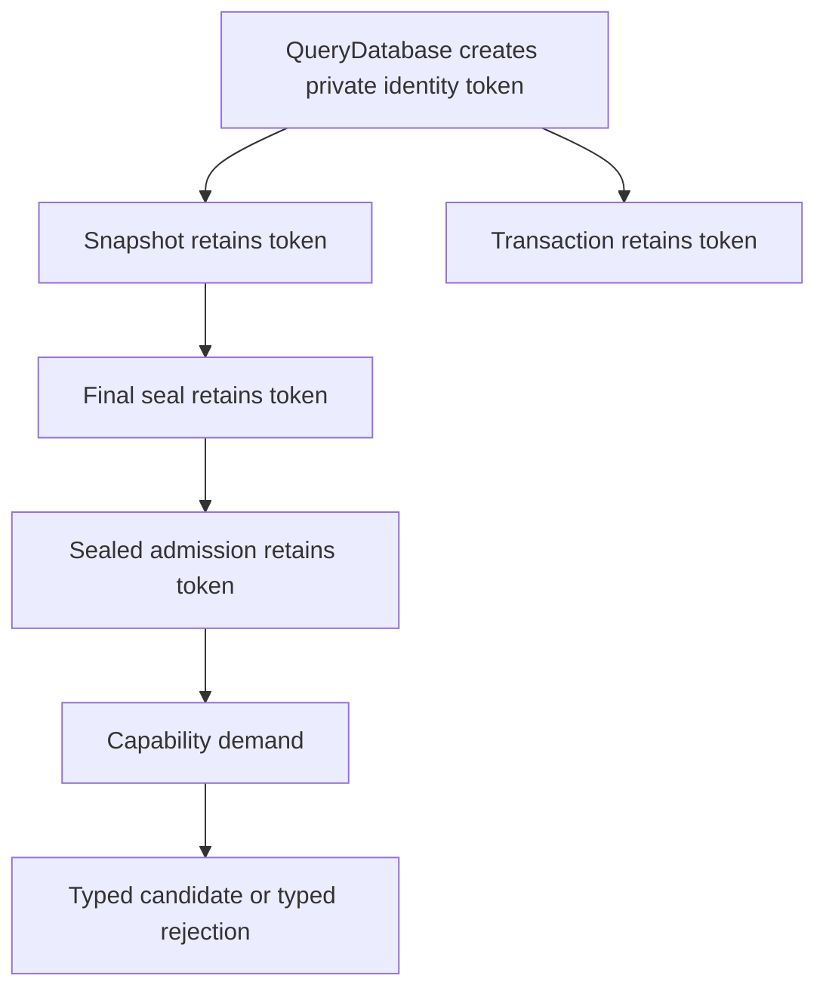

# RFC 0029: Query Identity And Capability Failure Closure

## Summary

This RFC closes the remaining contracts required to implement the indivisible
RFC 0028 query-runtime replacement.

The design:

1. replaces the process-global database-generation allocator with an
   unforgeable, reference-counted database identity token;
2. separates a type-erased capability rejection from semantic `QueryValue`;
3. assigns canonical payload construction and ordering to descriptor-owned
   failure contracts;
4. defines an independently published identity-syntax-site provenance
   authority;
5. defines `StableIdentityAdmissionQuery` as the sole source-diagnostic owner
   for stable-identity validation;
6. freezes the exact key and failure contracts of the five live
   revision-local Binder capabilities; and
7. records the landed RFC 0027 `S1`, `S2`, and `S3` foundation, requires the
   RFC 0042 source-only diagnostic cutover before runtime work resumes, and
   moves `S6` into `R29-13B` so its Module and Binder surface lands with live
   producers and verifiers.

The implementation replaces the current internal contract directly. It adds no
global allocator, compatibility alias, optional failure surface, generic
semantic-failure byte bridge, or dual query path.

## Motivation

RFC 0028 acceptance authorized implementation only through one atomic source
transaction. Preparing its query-type partition exposed three blocking design
gaps.

First, RFC 0028 requires one mutable process-level generation allocator while
the repository forbids mutable global state and singletons. Hiding that
allocator in a function-local static changes its spelling, not its ownership or
test-order coupling.

Second, RFC 0028 defines descriptor-dependent capability failures but specifies
exact failure alternatives only for parse and module-dependency provenance.
Five existing production capabilities currently expose absence and opaque
semantic-failure bytes. Their callers cannot be migrated without deciding
which source, key, or runtime result each live failure becomes.

Third, `RevisionLocalDefinitionSitesQuery` and
`RevisionLocalImplementationSitesQuery` locally encode two stable-identity
source errors. RFC 0027 permits `SourceRejected` only when a source-producing
query owns canonical `DiagnosticFact` records. Relabelling the existing private
bytes would not create that authority.

The same audit found two dependency errors. The live contextual definition and
owner-body keys do not yet contain their complete module-qualified stable keys,
and `BinderKeyFailure` is scheduled after code that must instantiate it. Source
implementation would therefore require a key shim, an unavailable type, or a
partial landing.

## Goals

- Remove all mutable global or singleton state from database identity.
- Make database identity unforgeable, move-stable, and safe for detached seals
  and surviving capability leases.
- Give request evaluation a distinct capability-rejection branch.
- Ensure only descriptor-owned verification can create canonical rejection
  payloads and ordered nonempty diagnostic sequences.
- Publish complete identity syntax-site provenance independently of stable
  identity admission success.
- Define one stable-identity source-diagnostic owner with exact production and
  verification reads.
- Freeze exact failure alternatives, legal key-failure subsets, read order,
  and propagation for the five live Binder capabilities.
- Remove capability absence and opaque capability semantic failures.
- Use the landed RFC 0027 `S1`, `S2`, and `S3` foundation, complete the
  RFC 0042 source-only diagnostic cutover, and land `S6` in `R29-13B` with
  the first live Module and Binder producers that require it.
- Preserve RFC 0028's atomic source replacement and native verification
  requirements.

## Non-Goals

- This RFC does not change ZOM syntax or user-visible language semantics.
- This RFC does not change the accepted final-seal state machine, transaction
  failure algebra, descriptor inventory model, or active membership matrix.
- This RFC does not add query persistence or serialize runtime identity.
- This RFC does not make semantic queries depend on revision-local
  capabilities.
- This RFC does not define a general diagnostic recovery framework.
- This RFC does not authorize a test callback, verifier replacement, public
  test factory, or constructor overload that accepts a prebuilt database
  identity.
- This RFC does not preserve the current capability absence or opaque failure
  encodings.

## Prior Art

The
[Salsa tracked-struct model](https://salsa-rs.github.io/salsa/plumbing/tracked_structs.html)
uses database-local identities and generations rather than one cross-database
global counter. ZOM adopts the database-local authority boundary but uses an
unforgeable retained token because database identity is never serialized or
reused as a table index.

The
[rustc query evaluation model](https://rustc-dev-guide.rust-lang.org/queries/query-evaluation-model-in-detail.html)
requires providers to obtain their inputs and child results through the query
context. ZOM follows that rule for failure verification: a rejection verifier
re-reads the exact source, authority, and child-query dependencies instead of
trusting provider-produced bytes.

The
[LLVM `Error` contract](https://llvm.org/doxygen/classllvm_1_1Error.html)
represents failure as an explicit checked result rather than ambient state.
ZOM uses closed result alternatives for request evaluation and never transports
a capability rejection through an unrelated semantic value branch.

The
[C++ Core Guidelines](https://isocpp.github.io/CppCoreGuidelines/CppCoreGuidelines)
identify global state as difficult to control and test. ZOM applies explicit
ownership more strictly: database identity has no mutable process authority at
all, and deterministic race tests use per-database state owned by the database
implementation.

## Guide-Level Explanation

Each query database creates one private identity token. Snapshots, transactions,
demand frames, final seals, and sealed admissions retain that same token.
Identity comparison means token identity; there is no public integer, global
counter, address-derived value, wraparound, or exhaustion path.



A capability provider returns one of its descriptor-listed typed results. The
evaluator independently verifies the candidate or rejection. A verified
rejection crosses the type-erased evaluator in a dedicated rejection envelope,
not as `QueryValue::SemanticFailure`. Public decoding reconstructs only the
alternative declared by the demanded descriptor.

Stable-identity validation becomes a named staging capability.
`StableIdentityAdmissionQuery` owns the two diagnostics produced while
validating stable identity candidates. Downstream capabilities may forward its
canonical diagnostic sequence unchanged. They may not regenerate the
diagnostic, decode a private enum payload, or classify it as a runtime failure.

All five live provenance and site capabilities expose the same result shape:

```text
Published
SourceRejected(DiagnosticFact sequence)
KeyRejected(BinderKeyFailure)
RuntimeRejected(QueryRuntimeFailure)
```

Their descriptor-owned verifier restricts which `BinderKeyFailureKind` values
are legal for that exact key and read path.

## Reference-Level Design

### Unforgeable Database Identity

`QueryDatabaseIdentity` is an opaque retained token:

```text
QueryDatabaseIdentity {
  token: Arc<const QueryDatabaseIdentityToken>,
}
```

`QueryDatabaseIdentityToken` is private to the query implementation, has no
public fields, codec, stable hash, ordinal, generation, or factory, and is
created exactly once by each fresh `QueryDatabase::Impl`. The identity has no
default constructor. Only `QueryDatabase` can create one.

Equality is identity of the retained token object. Implementations may use the
reference-counted handle's native identity comparison, but may not expose,
serialize, print, hash, order, or convert its storage address. An old identity
retains its token, so a live comparable identity can never alias storage reused
for a later database.

Move construction and move assignment transfer the existing implementation and
token. They do not create another identity. Every fresh database receives a
distinct token, including concurrently created databases and databases created
after another database is destroyed.

The token is retained by the same owners listed by RFC 0028:

- `QueryDatabase::Impl`;
- protected database state;
- snapshot and transaction state;
- demand frames;
- final-seal admission;
- `FinalSnapshotSeal`; and
- every `RevisionLocalCapabilityMemoBase`, so a detached capability lease can
  still prove its database coordinate without borrowing the database.

This contract deletes `QueryDatabaseGenerationAllocator`, numeric generation,
process allocator storage, explicit counter seeding, and the exhaustion test.
There is no replacement global authority.

### Request Result Separation

The type-erased evaluator result is:

```text
QueryRequestResult =
    Semantic(QueryValue)
  | CapabilityPublished(Arc<RevisionLocalCapabilityMemoBase>)
  | CapabilityRejected(CapabilityFailureEnvelope)
  | RuntimeRejected(QueryRuntimeFailure)
```

`Semantic(QueryValue)` is legal only for input and semantic descriptors.
`CapabilityPublished` and `CapabilityRejected` are legal only for
revision-local capability descriptors. `RuntimeRejected` applies to every
descriptor kind.

A capability provider cannot create a `QueryValue`, and a capability rejection
never enters `QueryValue::SemanticFailure`. The evaluator publishes no semantic
memo and no capability memo for `CapabilityRejected`.

Only the evaluator constructs `CapabilityPublished`, and only after candidate
verification, complete witness validation, dependency retention, and canonical
capability memo publication succeed. The alternative owns one
`zc::Arc<RevisionLocalCapabilityMemoBase>` to that exact published memo. A
capability cache hit creates another arc to the same memo and returns the same
alternative without rerunning the provider.

`QueryRequestResult` is move-only and exposes no public base-memo observer or
clone operation. `CapabilityResultDecoder<Descriptor>` consumes it as an
rvalue. For `CapabilityPublished`, the decoder verifies that the memo's
complete canonical key kind equals the generated ordinal of `Descriptor`, that
its database identity and revision equal the current demand. Only then may its
private evaluator-owned caster transfer the arc into
`QueryCapabilityLease<const Descriptor::Capability>`.

The caster is sound because the database-bound descriptor inventory is
immutable, registration already proved that the ordinal names the demanded
descriptor, and the evaluator's only memo-construction template binds one
ordinal to one
`RevisionLocalCapabilityMemo<Descriptor::Capability>` concrete allocation.
There is no RTTI, public downcast, runtime type-name dispatch, or alternate memo
factory. Kind, database, or revision disagreement is
`QueryRuntimeFailure::InvariantViolation` and returns no lease.

Candidate verification publishes exactly one capability memo and no semantic
memo. Source, key, and runtime rejection publish neither memo kind.

Descriptor kind disagreement at construction or decoding is
`QueryRuntimeFailure::InvariantViolation`. A provider/verifier disagreement is
`QueryRuntimeFailure::VerifierRejected`.

### Descriptor-Owned Canonical Payloads

The query layer owns the following generic shapes:

```text
CapabilityFailureList<Alternatives...>
SourceRejection<Diagnostic>
KeyRejection<KeyFailure>
CapabilityProviderResult<Descriptor>
CapabilityDemandResult<Descriptor>
CapabilityFailureEnvelope
```

`R29-13A` owns the generic
`CapabilityDemandResult<Descriptor>` runtime sum with `runtime-memory` review.
`R29-13C` owns its native and mutation coverage. It has no canonical codec and
has this exact descriptor-dependent topology:

```text
Published = 0x01, Always
  lease: QueryCapabilityLease<const Descriptor::Capability>
SourceRejected = 0x02,
  FailureAlternative<SourceRejection<Diagnostic>>
  diagnostics: CanonicalNonEmptySequence<Diagnostic>
KeyRejected = 0x03,
  FailureAlternative<KeyRejection<KeyFailure>>
  failure: KeyFailure
RuntimeRejected = 0x04, Always
  failure: QueryRuntimeFailure
```

`Diagnostic` and `KeyFailure` are schema metavariables bound from the matching
wrapper payload in the demanded descriptor's exact failure-alternative list.
They are not aliases for Binder-owned types. `SourceRejected` or
`KeyRejected` exists for an instantiated descriptor if and only if that
descriptor lists the matching wrapper. The two unconditional alternatives
exist for every capability descriptor.

The descriptor owner owns every concrete
`CapabilityFailureContract<Descriptor, Alternative>`.

`CanonicalNonEmptySequence<T>` and canonical failure payload bytes cannot be
constructed by checking only that a container is nonempty. Construction is
private to the matching descriptor failure contract after all of these checks:

1. the sequence is nonempty;
2. every element is independently valid;
3. the descriptor's declared canonical order holds;
4. the descriptor encoder succeeds;
5. decoding consumes the complete payload; and
6. re-encoding is byte-identical.

For `DiagnosticFact`, canonical order is the RFC 0017 complete diagnostic
ordering. A downstream descriptor forwarding an upstream rejection preserves
the complete sequence and byte encoding. It performs no sorting, merging,
deduplication, or reconstruction.

`StableWitnessBytes` is likewise not constructible from arbitrary nonempty
bytes. The descriptor candidate codec creates a candidate encoding, the
independent verifier reconstructs the candidate, and the evaluator accepts the
bytes only after complete decode, equality, and byte-identical re-encode.

`CapabilityFailureEnvelope::verified` is private to the evaluator. Its domain
is the demanded descriptor's literal domain. The descriptor contract supplies
the already verified canonical payload and the evaluator supplies the listed
failure tag. No public factory accepts arbitrary domain or payload bytes.

### Stable Identity Admission

`IdentitySyntaxSiteInventoryQuery` is the revision-local provenance authority
that exists independently of stable identity admission:

| Property | Contract |
|---|---|
| Domain | `zom.query.identity-syntax-site-inventory` |
| Key | `StableModuleQueryKey` |
| Capability | `binder::IdentitySyntaxSiteInventory` |
| Admission | `AnySnapshot` |
| Cycle | `Reject` |
| Cost | linear in the selected module syntax |
| Failures | `SourceRejection<DiagnosticFact>`, `KeyRejection<BinderKeyFailure>` |

The capability owns the complete sorted `IdentitySyntaxSite` sequence and
retains the exact `ParseSourceQuery` lease. It contains every identity root,
generic parameter, bound occurrence, constant header expression, and other AST
node that stable-identity production or verification may cite. It performs no
header normalization, digest admission, collision classification, or stable
identity validation.

Its provider reads exactly:

1. `SelectedModuleSourceQuery`;
2. `ParseSourceQuery`; and
3. `IdentitySyntaxSiteInventoryProducer`.

Its independent candidate verifier repeats the two query reads and uses
`IdentitySyntaxSiteInventoryVerifier`, whose traversal is separate from the
producer. Both traverse the complete parsed module topology. A malformed or
unaddressable parsed node after parse success is `InvariantViolation`.
Selected-source absence produces
`MissingSelectedModuleSource(Module(key.module), none)`, and parse rejection is
forwarded unchanged.

The descriptor-private witness domain is
`zom.query.identity-syntax-site-inventory-witness`. Its payload is:

```text
IdentitySyntaxSiteInventoryWitness {
  module: ModuleKey,
  source: SourceFileKey,
  sourceDigest: Sha256Digest,
  sites: CanonicalSequence<IdentitySyntaxSiteWitness>,
}

IdentitySyntaxSiteWitness {
  key: IdentitySyntaxSiteKey,
  schemaPreorderOrdinal: uint32,
  source: SourceSpan,
}
```

Sites sort by complete `IdentitySyntaxSiteKey`; ordinals are unique, in range,
and resolve to the exact node. Keys must repeat the outer module and selected
source. A legal module with no identity syntax sites encodes an empty canonical
sequence; the provider and verifier must not fabricate a module-root site.
Every source span repeats the selected source and equals the exact byte span of
the node selected by its schema preorder ordinal. Decode is bounded, fully
consumed, and byte-identically re-encoded.

`SourceSpan` has no public standalone decoder. The descriptor-private witness
decoder therefore reads the span's `SourceFileKey`, `byteStart`, and `byteEnd`
fields directly, verifies that the source equals both the witness source and
the retained `ImmutableSourceSnapshot::source()`, verifies that the retained
snapshot digest equals `sourceDigest`, and calls
`ImmutableSourceSnapshot::span(byteStart, byteEnd)`. Absence from `span()`,
source disagreement, digest disagreement, or an unequal ordinal-selected node
span is witness rejection. No constructor access, raw pointer range, detached
source bytes, or provider-owned node handle is used to reconstruct a span.

`ResolveDiagnosticProvenance` for
`DiagnosticProvenanceKey::IdentitySyntaxSite(key)` derives the exact
`StableModuleQueryKey`, demands `IdentitySyntaxSiteInventoryQuery` in the same
snapshot, finds exactly one equal key, and returns its range. An absent,
duplicate, rejected, foreign-source, or unequal entry is an invariant failure.
It never depends on successful stable identity admission.

The inventory query is published before stable-identity validation can return a
local source rejection. Therefore a later `StableIdentityAdmissionQuery`
rejection can carry an identity-syntax-site provenance key even though the
admission capability itself is not published.

`StableIdentityAdmissionQuery` is a revision-local retained capability:

| Property | Contract |
|---|---|
| Domain | `zom.query.stable-identity-admission` |
| Key | `StableModuleQueryKey` |
| Capability | `binder::StableIdentityAdmission` |
| Admission | `AnySnapshot` |
| Cycle | `Reject` |
| Cost | linear in the selected module syntax |
| Failures | `SourceRejection<DiagnosticFact>`, `KeyRejection<BinderKeyFailure>` |

`StableIdentityAdmission` owns the verified stable-identity candidate
inventory and retains the exact `ParseSourceQuery` and
`IdentitySyntaxSiteInventoryQuery` leases. It has no public canonical value
codec and cannot cross revisions.

Its descriptor-private candidate witness uses domain
`zom.query.stable-identity-admission-witness`, one zero byte, then:

```text
StableIdentityAdmissionWitness {
  module: ModuleKey,
  source: SourceFileKey,
  sourceDigest: Sha256Digest,
  definitions:
      CanonicalSequence<StableIdentityAdmissionDefinitionWitness>,
  implementations:
      CanonicalSequence<StableIdentityAdmissionImplementationWitness>,
}

StableIdentityAdmissionDefinitionWitness {
  schemaPreorderOrdinal: uint32,
  authority: DefinitionIdentityAuthority,
  site: IdentitySyntaxSiteKey,
  source: SourceSpan,
}

StableIdentityAdmissionImplementationWitness {
  schemaPreorderOrdinal: uint32,
  authority: ImplIdentityAuthority,
  site: IdentitySyntaxSiteKey,
  source: SourceSpan,
}
```

Fields encode in declaration order with the existing canonical codecs.
Sequences use checked counts and the verifier's canonical source topology
order. `schemaPreorderOrdinal` is the parsed tree's checked preorder ordinal,
not `NodeId`. The descriptor-private decoder requires the exact domain,
complete consumption, valid ordinals, strictly increasing sequence order,
matching selected source and digest, and byte-identical re-encoding. No digest
substitutes for the complete witness bytes.

The provider reads in this exact order:

1. `SelectedModuleSourceQuery`;
2. `ParseSourceQuery`;
3. `IdentitySyntaxSiteInventoryQuery`;
4. `StableIdentityCandidateProducer`; and
5. `StableIdentityCandidateVerifier`.

The independent candidate verifier repeats the selected-source and parse
demands, reconstructs the candidate inventory without using provider state,
compares the complete inventory, and verifies the descriptor candidate
witness.

Selected-source semantic absence produces:

```text
BinderKeyFailure {
  kind: MissingSelectedModuleSource,
  owner: Module(key.module),
  path: none,
}
```

A selected-source runtime failure remains runtime. A parse source rejection is
forwarded byte-for-byte.

Stable-identity validation owns these exact source diagnostics:

| Validation failure | Canonical diagnostic |
|---|---|
| `ConstantExpressionNotAllowed` | existing `ZOM4079 ConstantExpressionNotAllowed`, primary identity-syntax site at the rejected expression, empty arguments, no secondary location, no fix-it |
| `DuplicateGenericParameter` | existing `ZOM3010 DuplicateIdentifier`, primary identity-syntax site at the duplicate, canonical `BinderIdentifierDiagnosticArguments`, exactly one `ZOM3017 PreviousDeclarationHere` secondary at the first declaration, no fix-it |

RFC 0018 `IdentityDiagnosticEmitter` gains:

```text
ConstantExpressionNotAllowed // 0x03
DuplicateGenericParameter    // 0x04
```

Both facts use:

- `ModuleDiagnosticRoot(key.module)`;
- `IdentityDiagnosticPhase::IdentityAdmission`;
- absent semantic owner;
- the matching emitter above; and
- the complete primary `IdentitySyntaxSiteKey` as the stable occurrence.

The primary location is
`DiagnosticLocation::Source(DiagnosticProvenanceKey::IdentitySyntaxSite(primary))`.
The duplicate-generic secondary uses
`DiagnosticSecondaryRole::PreviousDeclaration = 0x01`,
diagnostic code `ZOM3017`, empty note arguments,
`DiagnosticLocation::Source(DiagnosticProvenanceKey::IdentitySyntaxSite(previous))`,
and no replacement. The constant-expression fact has no secondary records.

The provider must resolve the verifier's rejected `NodeId` and `SourceSpan` to
exactly one entry in the published `IdentitySyntaxSiteInventoryQuery`
capability; the duplicate form must also resolve its previous span to exactly
one earlier entry and require the verified identifier. Zero, multiple,
reversed, or cross-module site matches are runtime invariants. Thus neither
`NodeId` nor a byte range enters the semantic occurrence or provenance key.

Missing source locations, a missing duplicate identifier or previous site,
producer/reconstructor disagreement, malformed diagnostic payload, or
candidate codec disagreement is runtime rejection. The descriptor never emits
through `DiagnosticEngine`; it publishes canonical `DiagnosticFact` records.

The source-rejection verifier reconstructs the exact first source failure in
the declared read order and compares the complete canonical diagnostic
sequence. The key-rejection verifier proves selected-source absence and exact
failure equality. A prior runtime result makes both rejection verifiers reject.

`NamedDefinitionInventoryQuery` and `NamedImplementationInventoryQuery` remain
semantic queries. Their providers read and verify the same stable-identity
source condition. Capability providers must demand
`StableIdentityAdmissionQuery` before either semantic inventory, so a
stable-identity source failure can never be observed through their opaque
semantic-failure bytes.

### Complete Binder Capability Keys

The production key shapes are:

```text
ContextualDefinitionKey {
  contextRoots: CompilationRootSetQueryKey,
  definition: StableDefinitionQueryKey {
    module: ModuleKey,
    definition: DefinitionKey,
  },
}

ContextualBodyOwnerKey {
  contextRoots: CompilationRootSetQueryKey,
  body: StableOwnerBodyQueryKey {
    module: ModuleKey,
    owner: StableBodyOwnerKey,
  },
}
```

Every producer, consumer, codec, query key, authority record, fixture, and
generated row changes atomically. There is no constructor from the shorter live
shape and no inferred-module fallback.

### Common Capability Failure Shape

These descriptors declare exactly:

```cpp
using FailureAlternatives = query::CapabilityFailureList<
    query::SourceRejection<diagnostics::DiagnosticFact>,
    query::KeyRejection<binder::BinderKeyFailure>>;
```

- `RevisionLocalDefinitionSitesQuery`;
- `RevisionLocalImplementationSitesQuery`;
- `ModuleBodyProvenanceQuery`;
- `NamedItemProvenanceQuery`; and
- `OwnerBodyProvenanceQuery`.

No descriptor exposes `Absence`, semantic failure bytes, a private failure
domain, or an unlisted observer. Success is `Candidate` internally and
`Published` publicly.

The universal precedence is:

1. evaluator runtime failure;
2. descriptor key rejection;
3. upstream source rejection;
4. candidate.

Within a descriptor, tracked reads occur in the exact order below. The first
eligible typed rejection is returned. A runtime result at an earlier read
prevents all later classification.

### Definition And Implementation Site Failures

`RevisionLocalDefinitionSitesQuery` reads:

1. `SelectedModuleSourceQuery`;
2. `ParseSourceQuery`;
3. `StableIdentityAdmissionQuery`;
4. `NamedDefinitionInventoryQuery`; and
5. independent site reconstruction.

`RevisionLocalImplementationSitesQuery` uses the same order with
`NamedImplementationInventoryQuery`.

Their only locally constructible key rejection is:

```text
MissingSelectedModuleSource(Module(key.module), none)
```

They forward the stable-admission source rejection unchanged. A semantic
inventory source failure after successful stable admission is an invariant
violation, not another source path. Candidate reconstruction failure,
source/module disagreement, missing site construction, candidate mismatch, and
codec disagreement are runtime rejection.

### Module Body Provenance Failures

`ModuleBodyProvenanceQuery` reads:

1. `SelectedModuleSourceQuery`;
2. `ParseSourceQuery`;
3. `StableIdentityAdmissionQuery`;
4. `RevisionLocalDefinitionSitesQuery`;
5. `RevisionLocalImplementationSitesQuery`; and
6. `ModuleBodySyntaxQuery`.

Its legal key rejection set contains only exact
`MissingSelectedModuleSource(Module(key.module), none)`, constructed from
selected-source absence or forwarded unchanged from a child.

It forwards the first source rejection from parse, stable admission,
definition sites, or implementation sites in read order. `ModuleBodySyntaxQuery`
is semantic and cannot publish a capability source rejection. A semantic
failure from that read after typed provenance succeeds is
`InvariantViolation`. Non-projection, detached syntax disagreement, missing
provenance, candidate/verifier mismatch, and codec disagreement are runtime
rejection.

### Named Item Provenance Failures

`NamedItemProvenanceQuery` uses the complete `ContextualDefinitionKey`.
Its conditional read order is:

1. `ActiveDefinitionAuthorityInput`;
2. only when authority is absent or contradictory,
   `ActiveDefinitionAuthorityReadyInput`;
3. `SelectedModuleSourceQuery`;
4. `ParseSourceQuery`;
5. `StableIdentityAdmissionQuery`;
6. `NamedDefinitionInventoryQuery`;
7. `RevisionLocalDefinitionSitesQuery`;
8. `RevisionLocalImplementationSitesQuery`; and
9. `NamedItemSyntaxQuery`.

The legal key rejections are:

```text
InactiveOwner(DefinitionHeader(key.definition), none)
MissingSelectedModuleSource(Module(key.definition.module), none)
```

`InactiveOwner` requires absent authority plus present complete readiness.
Missing readiness is `ProviderRejected`. Contradictory authority is
`InvariantViolation`. The descriptor does not construct `ForeignOwner` or
`BoundaryMismatch`.

It forwards child source and key rejections unchanged. Missing provider roots,
named-item projection failure, missing provenance, syntax disagreement,
authority disagreement, and codec disagreement are runtime rejection.

### Owner Body Provenance Failures

`OwnerBodyProvenanceQuery` uses the complete `ContextualBodyOwnerKey`. It first
reads exactly one typed provenance branch:

- a module owner reads `ModuleBodyProvenanceQuery`; or
- a definition owner reads `NamedItemProvenanceQuery`.

Only after that branch succeeds does it read the corresponding semantic syntax
projection:

- a module owner reads `ModuleBodySyntaxQuery`; or
- a definition owner reads `NamedItemSyntaxQuery` with the complete
  `ContextualDefinitionKey` derived from `key`.

It does not read `OwnerBodySyntaxQuery`. The provider constructs
`OwnerBodySyntax` directly from the successful branch syntax. The independent
candidate verifier performs its own syntax read and direct reconstruction.
This order recovers source and key failures from the typed child before a
semantic syntax projection can expose an opaque semantic failure.

The legal key rejections are:

```text
DefinitionWithoutBody(Body(key), none)
InactiveOwner(DefinitionHeader(definitionKey), none)
MissingSelectedModuleSource(Module(key.body.module), none)
```

For a definition owner, the provider applies its executable-root admission
algorithm directly to the successful `NamedItemSyntaxQuery` value. `NoBody`
constructs `DefinitionWithoutBody(Body(key), none)`. `Malformed` is
`InvariantViolation`; `Executable` continues candidate construction. The key
rejection verifier independently reads the same typed child and named-item
syntax, applies its separate executable-root admission algorithm, requires
`NoBody`, and compares the complete failure. It never decodes
`OwnerBodySyntaxQuery` semantic-failure bytes.

The other two key alternatives are forwarded unchanged from the selected typed
child.

The descriptor does not construct `ForeignOwner`, `BoundaryMismatch`,
`NonSelectedSource`, or `CrossBoundaryPath`. Malformed detached syntax,
missing retained provenance, projection mismatch, missing provenance, and
codec disagreement are runtime rejection.

### Rejection Verifier Contract

Each descriptor owner specializes both listed failure contracts. A source
verifier:

1. repeats the descriptor's exact conditional read order;
2. finds the first eligible source rejection;
3. requires that no earlier runtime or key rejection exists; and
4. compares the complete diagnostic sequence byte-for-byte.

A key verifier:

1. repeats the same read order;
2. proves the exact absence, readiness, `NoBody`, or child rejection;
3. checks the complete `{kind, owner, path}` record; and
4. rejects a key kind outside the descriptor's legal subset.

Forwarded child failures retain the child's owner and path. A parent never
rewrites them to its own owner.

### Final-Seal Race Test State

The phase-two race test uses one optional test gate owned by
`QueryDatabase::Impl`. It contains only state and a condition wait. It has no
callback, function pointer, virtual observer, global registry, or verifier
replacement.

A private test access type may arm, wait for entry, and release the one-shot
gate. The pause point is after the phase-one database lock scope ends and
before the static complete-authority verifier call. Production constructors
and public APIs expose no gate parameter or setter.

The architecture gate restricts the test access type and gate names to
`query-database.{h,cc}`, `query-test-specs.h`, and the owned query tests. Native
negative compile tests prove that production code cannot call the private
bridge or install a verifier.

### Request Decoder Test Access And Compile-Fail Gates

`query::test::QueryRuntimeTestAccess` is defined only in
`products/zomlang/tests/unittests/compiler/query/query-test-specs.h`. Production
headers contain only its forward declaration and narrowly scoped friend
relationships.

The access type can perform exactly two request-decoder operations:

1. evaluate a real registered test capability through the production evaluator
   and retain its move-only `QueryRequestResult`; and
2. consume that result through the production
   `CapabilityResultDecoder<Descriptor>` against a selected live
   `QuerySnapshot`.

It cannot construct or mutate a database token, revision, memo base, descriptor
ordinal, witness, rejection envelope, or result alternative. Tests create
mismatch cases only from real objects:

- decode a result from database A against a live snapshot from database B;
- decode a result from revision R against a later live revision;
- decode descriptor A's result as descriptor B, where both test descriptors
  intentionally use the same capability payload type.

Each case executes one independently reachable production coordinate check and
must return `InvariantViolation` without a lease. Inventory mismatch is not a
decoder coordinate: every database has exactly one immutable generated
inventory, and registration proves its ordinal binding before evaluation. A
foreign inventory therefore cannot coexist with the same database and
revision, while another database fails the earlier database-identity check.
The originally published memo remains valid only in its original database,
revision, and descriptor.

Compile-fail coverage uses reusable project-native CMake infrastructure:

```text
products/zomlang/tests/cmake/expect-compile-failure/CMakeLists.txt
products/zomlang/tests/compile-fail/query-runtime/*.cc
```

Each query test case is one source file containing exactly one forbidden
operation. `products/zomlang/tests/CMakeLists.txt` registers one CTest named
`query-runtime-negative-compile-<case>` that configures the reusable fixture in
an isolated build directory. The fixture calls
`try_compile(SOURCE_FROM_CONTENT ...)`, fails if compilation succeeds, and
requires the compiler output to contain the case's exact forbidden symbol.
This proves the intended access failure without depending on compiler-specific
wording such as `private` or `deleted`.

The fixture inherits the configured compiler, source and build include roots,
and the repository C++23 mode. It sets
`CMAKE_TRY_COMPILE_TARGET_TYPE=STATIC_LIBRARY`, so each case proves compilation
failure without introducing a link requirement.

The cases cover:

- direct identity-token construction;
- request-result copy and clone;
- public observation of the memo base;
- public base-to-concrete memo cast;
- construction of `CapabilityPublished`;
- direct call to the private request evaluator or decoder bridge;
- database construction with an identity, allocator, gate, callback, or
  verifier; and
- mutation of a memo kind, database identity, or revision.

`check-query-descriptor-architecture.py` restricts the test access, compile-fail
fixture, and request-decoder bridge to their exact owned files. It also rejects
any production reference to the access type and any public request-result
observer that exposes the memo base.

The `R29-13C` review partition is exactly:

- `products/zomlang/tests/unittests/compiler/query/query-test-specs.h`;
- `products/zomlang/tests/unittests/compiler/query/query-database-test.cc`;
- `products/zomlang/tests/unittests/compiler/query/query-capability-test.cc`;
- `products/zomlang/tests/unittests/compiler/query/query-concurrency-test.cc`;
- `products/zomlang/tests/unittests/compiler/query/CMakeLists.txt`;
- `products/zomlang/tests/cmake/expect-compile-failure/CMakeLists.txt`;
- the following files under
  `products/zomlang/tests/compile-fail/query-runtime/`:
  `identity-token-construction.cc`, `request-result-copy.cc`,
  `request-result-clone.cc`, `memo-base-observer.cc`, `memo-base-cast.cc`,
  `capability-published-construction.cc`, `request-decoder-bridge.cc`,
  `database-identity-constructor.cc`, `database-allocator-constructor.cc`,
  `database-gate-constructor.cc`, `database-callback-constructor.cc`,
  `database-verifier-constructor.cc`, `memo-kind-mutation.cc`,
  `memo-database-mutation.cc`, and `memo-revision-mutation.cc`;
- `products/zomlang/tests/CMakeLists.txt`; and
- `scripts/check-query-descriptor-architecture.py`.

It is a non-landing review partition and joins `R29-14`. The architecture gate
rejects an unlisted compile-fail case.

`R29-13C` additionally provides the native and mutation proof for the generic
runtime sum owned by `R29-13A`. Its reusable staged architecture checks verify
both the capability alias and the failure-alternative alias for only the
descriptor rows activated by their owning tasks. It must reject a missing,
extra, exchanged, or payload-drifted failure alternative and a capability
payload mismatch without referencing or compiling any future descriptor.

### Dependency Correction

RFC 0027 tasks `S1`, `S2`, and `S3` form the published stable-binding
foundation before the RFC 0028 runtime source partitions. RFC 0042 then
replaces the current source diagnostic contract without reserving Module or
Binder alternatives. `S6` moves into `R29-13B`, where its schema rows,
factories, mappings, and codes land with their first live providers and
verifiers:

| Order | RFC 0027 task | Deliverable |
|---|---|---|
| 1 | `S1` | closed stable Binder field, tag, domain, and mutation inventory, including closure-projection deletion |
| 2 | `S2` | complete stable keys, contextual keys, headers, facts, `BinderQueryOwner`, `BinderKeyFailureKind`, `BinderKeyFailure`, and result algebra |
| 3 | `S3` | bounded exact-consumption codecs and fixed wire oracles |
| 4 | RFC 0042 `R42-11` through `R42-16` | source-only canonical diagnostic fact, provenance, materialization, and current Binder-consumer cutover |
| 5 | `S6` in `R29-13B` | direct Source-to-Source-plus-Module expansion with live Binder and identity diagnostic factories, mappings, and verification |

RFC 0031 replaces the original `S1` inventory shape with the complete stable
schema metamodel below. `S1` is not a field-and-tag subset and may not land a
reduced schema.

The closed entity vocabulary is:

```text
Bound Record NestedRecord NestedField Sum RuntimeSum EnumValue SumVariant
VariantField InlineSumVariant InlineSumVariantField RuntimeSumVariant
RuntimeVariantField Field FieldLimit Query Input CapabilityQuery
MaterializerPermission DiagnosticMapping Constraint Digest
```

The artifact-owning rows are exact:

```text
Record(
  name, domain, maximum, producer, verifier,
  typeTask, codecTask, testTask, mutations, test)
NestedRecord(
  name, typeParameter1, typeParameter2, maximum,
  typeTask, codecTask, testTask, mutations, test)
Sum(name, typeTask, codecTask, testTask, mutations, test)
RuntimeSum(name, typeTask, testTask, mutations, test)
EnumValue(
  enumName, valueName, tag,
  typeTask, codecTask, testTask, mutations, test)
Query(
  name, domain, keyType, resultType, valueDomain, producer, verifier,
  descriptorTask, providerTask, verifierTask, testTask, mutations, test)
Input(
  name, domain, keyType, resultType, verifier,
  descriptorTask, providerTask, verifierTask, testTask, mutations, test)
CapabilityQuery(
  name, domain, keyType, resultType, capabilityType, producer, verifier,
  failureAlternatives, descriptorTask, providerTask, verifierTask, testTask,
  mutations, test)
DiagnosticMapping(
  name, code, arguments, secondaryCode, secondaryRole,
  secondaryCount, fixItCount, diagnosticTask, testTask, mutations, test)
Digest(
  name, domain, preimage, implementationTask, testTask, mutations, test)
```

Structural field and variant rows inherit their containing artifact's owner.
Every canonical sum has exactly one `Sum` row. A type represented by both
`Record` and `Sum` is one permitted composite only when both task triples are
equal. Every value of one enum carries the same task triple. A
`RuntimeSumVariant` condition is either `Always` or one exact
`FailureAlternative<Wrapper<PayloadParameter>>`; a conditional field may use
only the payload parameter bound by that condition.

The closed task vocabulary is:

```text
S2A S2B S2C S2D S2E S3 S6 I2 B1 B2 B4 M1 M2 M3 M5 Q3 T1
R30_13 R29_13A R29_13C R28_16A R28_16B
```

The underscore forms denote the matching hyphenated tracker tasks and exist
only as X-macro tokens.

The schema owns `CapabilityDemandResult<Descriptor>` as the `RuntimeSum`
defined in `Descriptor-Owned Canonical Payloads`, with type task `R29_13A`,
test task `R29_13C`, and no codec task. Every `CapabilityQuery` row must use
`CapabilityDemandResult<name>`, must name its runtime capability payload, and
must list its exact descriptor-dependent failure alternatives. `R30-13`
validates these structural relationships while future rows remain inert. Each
descriptor task activates only its owned row and compiles independent equality
checks for both `name::Capability` and `name::FailureAlternatives`. The final
capability architecture gate rejects an implemented descriptor without either
check.

The five stable-Binder capability rows all list
`SourceRejection<DiagnosticFact>|KeyRejection<BinderKeyFailure>`. Their exact
result and capability pairs are:

| Descriptor | Public result | Capability payload |
|---|---|---|
| `ModuleDependencyProvenance` | `CapabilityDemandResult<ModuleDependencyProvenance>` | `ModuleDependencyProvenanceMap` |
| `MaterializeModuleGraph` | `CapabilityDemandResult<MaterializeModuleGraph>` | `MaterializedModuleGraph` |
| `MaterializeModuleSkeleton` | `CapabilityDemandResult<MaterializeModuleSkeleton>` | `MaterializedModuleSkeleton` |
| `MaterializeOwnerBody` | `CapabilityDemandResult<MaterializeOwnerBody>` | `MaterializedOwnerBody` |
| `VerifyBoundModule` | `CapabilityDemandResult<VerifyBoundModule>` | `VerifiedBoundModule` |

Input ownership is also schema data:

| Input | Descriptor | Provider | Verifier | Test |
|---|---|---|---|---|
| `CompleteCompilationContextAuthorityInput` | `T1` | `T1` | `T1` | `T1` |
| `ActiveDefinitionAuthorityInput` | `I2` | `T1` | `I2` | `I2` |
| `CompleteRootIdentityReadiness` | `I2` | `T1` | `I2` | `I2` |

The binding-visibility query result is exactly
`Optional<MemberVisibility>`. Runtime capability payloads receive descriptor
rows but no canonical record row or codec.

The complete package-request schema adds
`CanonicalCompilationRootRecord`, `CanonicalTargetSelectionRecord`,
`CanonicalLanguageOptionsRecord`, and
`CanonicalPackageCompilationRequest` with
`(typeTask=Q3, codecTask=Q3, testTask=R30_13)`. It fixes
`CanonicalPackageRecordBytes` at `UINT32_MAX`, `TargetProfileBytes` at `255`,
all accepted zero-based field ordinals, and the root-sequence limit. Only the
comprehensive schema mutation test in
`products/zomlang/tests/unittests/compiler/driver/package-compilation-request-test.cc`
changes; completed Q3 production remains untouched.

`S1`, `S2`, and `S3` remain separate bounded review partitions with their
accepted owners. RFC 0030 makes `R29-12AB` their only landing transaction so
the canonical schema, every S2 fact, every S3 admission path and codec, build
wiring, native tests, schema mutations, architecture enforcement, contextual
caller cutover, exact allowlist, and reusable landing-scope gate enter the
repository together. No partition may land alone.

The exact `R29-12AB` files are the newline-sorted set specified by RFC 0030
under `R29-12AB Exact Landing Set` and recorded verbatim in
`products/zomlang/tests/coverage/rfc-0030-stable-binding-landing-files.txt`.
The accepted set includes `stable-binding-schema.def`,
`stable-binding-facts.{h,cc}`, `stable-binding-codec.{h,cc}`, Binder and driver
build files, the focused Binder test and CTest file, both stable-binding gates,
the complete driver contextual-key declaration and caller cutover, both
authority tests,
`products/zomlang/tests/unittests/compiler/driver/package-compilation-request-test.cc`,
the allowlist manifest, and `scripts/check-landing-scope.py`. Only the
comprehensive schema mutation test changes in the package-request test file.

RFC 0042 replaces the incomplete RFC 0030 six-path set with the complete
current source-only fact, provenance, materializer, caller, native-test,
CTest, and exact-scope transaction. It also removes the unimplemented `S6`
schema inventory. Runtime work resumes only after that `R29-12D` commit passes
its focused and complete native gates.

`S6` lands later inside `R29-13B`. That partition directly replaces the
source-only diagnostic model with the closed Source-plus-Module model required
by the live stable-identity provider. It adds the Module root, Binder and
identity phases and emitters, typed Binder arguments, `PreviousDeclaration`,
the five exact mappings including `ZOM3028`, production factories, independent
verification, schema rows, native tests, and static coverage in one bounded
review partition. No `S6` row, enum alternative, factory, mapping, or code is
present between RFC 0042 and `R29-13B`.

No subset, placeholder row, forward-declared dummy type, temporary codec,
uncompiled source, unregistered test, or unconsumed schema is authorized.

After RFC 0042 lands, the RFC 0028 runtime review partitions resume at
`R29-13A`. `R29-13B` then adds the live `S6` expansion described above. The
sole RFC 0029 `R29-14` source transaction contains
`IdentitySyntaxSiteInventoryQuery`, `StableIdentityAdmissionQuery`, the five
exact capability failure contracts, the two complete contextual key caller
migrations, the `S6` diagnostic expansion, and their tests.

The additional `R29-13B` review partition has these exact files:

| Concern | Exact files |
|---|---|
| Site inventory and admission payloads | `products/zomlang/compiler/binder/identity-pre-admission.h`; `products/zomlang/compiler/binder/identity-pre-admission.cc` |
| Stable-admission Binder boundary | `products/zomlang/compiler/binder/module-body-syntax.h`; `products/zomlang/compiler/binder/module-body-syntax-producer.cc`; `products/zomlang/compiler/binder/module-body-syntax-verifier.cc` |
| Independent site and admission production | `products/zomlang/compiler/binder/stable-identity-candidate-producer.h`; `products/zomlang/compiler/binder/stable-identity-candidate-producer.cc` |
| Independent site and admission verification | `products/zomlang/compiler/binder/stable-identity-candidate-verifier.h`; `products/zomlang/compiler/binder/stable-identity-candidate-verifier.cc` |
| Canonical Module and Binder diagnostic facts | `products/zomlang/compiler/binder/stable-binding-diagnostic-fact.h`; `products/zomlang/compiler/binder/stable-binding-diagnostic-fact.cc`; `products/zomlang/compiler/diagnostics/diagnostic-fact.h`; `products/zomlang/compiler/diagnostics/diagnostic-fact.cc` |
| Diagnostic codes, schema rows, and static mappings | `products/zomlang/compiler/diagnostics/diagnostics-binder.def`; `products/zomlang/compiler/binder/stable-binding-schema.def`; `scripts/check-stable-binding-schema.py`; `scripts/check-binder-architecture.py`; `scripts/check-diagnostic-coverage.py` |
| Descriptors, failure contracts, and caller cutover | `products/zomlang/compiler/driver/named-identity-inventory-query.h`; `products/zomlang/compiler/driver/named-identity-inventory-query.cc`; `products/zomlang/compiler/driver/named-item-query.h`; `products/zomlang/compiler/driver/named-item-query.cc`; `products/zomlang/compiler/driver/owner-body-query.h`; `products/zomlang/compiler/driver/owner-body-query.cc` |
| Build wiring | `products/zomlang/compiler/binder/CMakeLists.txt`; `products/zomlang/compiler/driver/CMakeLists.txt`; `products/zomlang/tests/unittests/compiler/binder/CMakeLists.txt`; `products/zomlang/tests/unittests/compiler/driver/CMakeLists.txt` |
| Focused tests | `products/zomlang/tests/unittests/compiler/binder/identity-pre-admission-test.cc`; `products/zomlang/tests/unittests/compiler/binder/stable-binding-diagnostic-fact-test.cc`; `products/zomlang/tests/unittests/compiler/diagnostics/diagnostic-fact-test.cc`; `products/zomlang/tests/unittests/compiler/driver/named-identity-inventory-query-test.cc`; `products/zomlang/tests/unittests/compiler/driver/named-item-query-test.cc`; `products/zomlang/tests/unittests/compiler/driver/owner-body-query-test.cc` |

These files are bounded review ownership, not an independent landing point.
They join the existing RFC 0028 `R28-13D.5` and `R28-13G.2` partitions in the
single `R29-14` runtime landing transaction. `R29-14` is the sole landing
authority and cannot begin before the complete RFC 0028 `R28-13G` partition
join. A file exceeding the repository's review-size threshold is split into
smaller non-landing review patches without changing the atomic landing set.

## Repository Impact

| Area | Paths | Owner |
|---|---|---|
| Routing and acceptance synchronization | `.agents/subagents/**`; `docs/rfc/**` | `task-router` |
| RFC process and synchronized status | `docs/rfc/**` | `rfc` |
| Query identity, evaluator, descriptors, callers, and session | `products/zomlang/compiler/query/**`; `products/zomlang/compiler/driver/**` | `module-system` |
| Stable keys, key failures, stable identity admission, and schema | `products/zomlang/compiler/binder/**` | `binder-checker` |
| Token lifetime, retained arenas, locking, and teardown | `libraries/zc/**`; `products/zomlang/compiler/query/**` | `runtime-memory` |
| Canonical source rejection and diagnostic ownership | `products/zomlang/compiler/diagnostics/**`; `products/zomlang/compiler/binder/**` | `error-system` |
| Current-contract audits and synchronized design claims | `docs/design/**`; `docs/rfc/**` | `spec-audit` |
| Native tests, generators, CMake, and architecture gates | `products/zomlang/tests/**`; `scripts/**`; `CMakeLists.txt`; `products/zomlang/**/CMakeLists.txt` | `verification` |

## Security And Safety Impact

The token identity removes mutable global state and counter wraparound. Retained
token ownership prevents a detached seal from comparing equal to a later
database after storage reuse.

No runtime address is exposed or serialized. No provider receives a
constructible identity token, seal, evaluator rejection envelope, or test
gate. Test synchronization cannot replace production verification or execute a
callback under a database lock.

Canonical rejection decoding remains bounded before allocation and requires
complete consumption plus byte-identical re-encoding. Malformed envelopes and
provider/verifier disagreement publish no memo.

## Drawbacks And Risks

- Database identity is no longer a trivially printable integer. This is
  intentional because runtime coordinates are not diagnostics or persisted
  evidence.
- `StableIdentityAdmissionQuery` adds one retained staging capability and one
  independent verification pass.
- Four stable Binder foundation partitions must land earlier, increasing the
  amount of dependency work before the runtime cutover.
- Five descriptor-specific verifiers are repetitive. Their legal failure
  subsets differ, so a generic permissive verifier would weaken the contract.
- The atomic source transaction remains large. Review partitions and strict
  file ownership limit review risk, but none may land independently.

## Alternatives Considered

### Function-Local Process Allocator

A function-local static would retain mutable process-global ownership,
singleton lifetime, exhaustion injection, and test-order coupling. It is not
selected.

### Explicit Shared Generation Service

A caller-owned generation service would remove hidden global state but would
still require an arbitrary process root and numeric exhaustion contract.
Database identity needs only unforgeable equality, so a retained token is
smaller and has no unrelated counter policy.

### Address-Derived Integer Identity

Converting an implementation address to an integer would expose allocation
details and create reuse and diagnostic misuse risks. It is not selected.

### Decode Existing Opaque Stable-Identity Failures

Wrapping the current private failure bytes in `SourceRejected` would not create
canonical `DiagnosticFact` ownership or independent verification. It is not
selected.

### Treat All Provenance Failures As Runtime Failures

This would discard deterministic invalid-key information and existing source
diagnostics. It would also contradict RFC 0027. It is not selected.

### Give Every Descriptor Every Key-Failure Kind

An enum alternative is representational capacity, not proof that a descriptor
can produce or verify that condition. Each descriptor therefore admits only
its reachable subset.

## Compatibility And Rollout

This is an internal unreleased replacement. No forward compatibility is
provided.

Acceptance performs one synchronized documentation transaction over RFCs 0017,
0018, 0019, 0020, 0025, 0026, 0027, and 0028 plus their trackers, the RFC
index, and routing ownership. The transaction records the exact RFC 0029
proposal hash.

Implementation then proceeds in this order:

1. use the published RFC 0027 `S1`, `S2`, and `S3` foundation and complete
   the RFC 0042 source-only diagnostic cutover;
2. revise the prepared query-type partition to token identity and
   descriptor-owned canonical payload construction;
3. prepare `R29-13B`, including the live `S6` Source-plus-Module diagnostic
   expansion, then the remaining RFC 0028 runtime, descriptor, caller, and test
   partitions;
4. assemble and land one buildable atomic runtime replacement;
5. continue provenance, full verification, current design publication, and
   truthful status transitions.

Rollback before the atomic runtime landing reverts the complete stable schema
transaction. Rollback after runtime landing reverts the complete runtime
transaction. No mixed old/new runtime is supported.

## Documentation And Teaching Plan

- Synchronize RFCs 0017, 0018, 0019, 0020, 0025, 0026, 0027, and 0028 to the accepted
  identity, failure, key, and dependency contracts.
- Update the same-number trackers with the RFC 0029 proposal hash and
  transaction identifier.
- Publish current query-runtime and Binder design notes only after production
  builders, independent verifiers, session publication, consumers, and native
  tests exist.
- Keep planned contracts in RFCs until that evidence exists.

## Operational Readiness

The descriptor generator and architecture gate must reject:

- global or static mutable query identity state;
- `QueryDatabaseGenerationAllocator` and numeric generation access;
- public identity constructors or factories;
- capability rejection transported through `QueryValue`;
- arbitrary canonical-payload factories;
- unlisted capability failure observers;
- capability absence or opaque semantic-failure bytes;
- incomplete contextual keys;
- illegal descriptor key-failure kinds;
- identity-syntax-site provenance resolved from stable-admission success state;
- test gates outside their owned files; and
- production verifier callbacks or test setters.

Release and sanitizer builds must execute the same production identity,
descriptor, provider, verifier, and decoding paths as unit tests.

## Acceptance Criteria

- All required owners approve one exact RFC 0029 proposal hash.
- `python3 scripts/check-rfc.py` passes for the review and synchronized
  acceptance trees.
- RFC 0028 contains no remaining process allocator, generation exhaustion, or
  capability `QueryValue` authority after synchronization.
- RFC 0027 and RFC 0028 contain the same complete contextual key and five
  descriptor failure contracts.
- The tracker records the corrected stable-schema dependency before
  `R28-13A`.
- Source implementation contains no mutable global query identity state.
- Every fresh database has a distinct unforgeable token and moves preserve it.
- `IdentitySyntaxSiteInventoryQuery` publishes and independently verifies
  complete site provenance before stable identity validation and remains
  demandable when that validation rejects source.
- A legal empty module publishes and verifies an empty identity-site sequence
  without a fabricated root site.
- `StableIdentityAdmissionQuery` is the sole stable-identity source-diagnostic
  owner and retains parse lineage.
- The five live capabilities expose only published, source-rejected,
  key-rejected, and runtime-rejected results with exact legal subsets.
- Capability rejection never enters `QueryValue`.
- Native tests prove all result mappings, verifier disagreement, canonical
  decoding, token lifetime, races, and negative compile boundaries.
- All focused, sanitizer, full, architecture, generation, format, English, and
  internal-versioning gates pass.

## Implementation Plan

| Task | Owner | Depends on | Deliverable |
|---|---|---|---|
| `R29-01` | `rfc` | none | Complete RFC 0029, tracker, and index row |
| `R29-02` | `task-router` | `R29-01` | Confirm owners, gates, and corrected dependency boundary |
| `R29-03` | `rfc` | `R29-01` | Review completeness, prior art, exact-hash governance, and synchronization |
| `R29-04` | `module-system` | `R29-01` | Review token identity, request result, descriptor reads, and caller migration |
| `R29-05` | `binder-checker` | `R29-01` | Review complete keys, key-failure subsets, stable admission, and schema order |
| `R29-06` | `runtime-memory` | `R29-01` | Review token lifetime, locking, retained ownership, and teardown |
| `R29-07` | `error-system` | `R29-01` | Review canonical diagnostic ownership and rejection verification |
| `R29-08` | `spec-audit` | `R29-01` | Review synchronized claims and deletion of stale authority |
| `R29-09` | `verification` | `R29-01` | Review native tests, negative compile gates, race seams, and architecture checks |
| `R29-10` | `rfc` | `R29-02` through `R29-09` | Record exact-hash approvals and prepare synchronized acceptance |
| `R29-11` | `rfc` | `R29-10` | Accept one synchronized documentation transaction |
| `R29-12A` | `binder-checker` with `verification` review | `R29-11` | Prepare and review RFC 0027 `S1` as the complete RFC 0031 schema metamodel; do not land independently |
| `R29-12B` | `binder-checker` with `module-system` review | `R29-12A` | Prepare and review RFC 0027 `S2`; do not land independently |
| `R29-12AB` | `binder-checker` with `module-system` and `verification` review | `R29-12A`; `R29-12B`; RFC 0030 `R30-14` | Landed the exact RFC 0030 allowlist as commit `8885782747e4c863cefcb0d069bc4569cefce9aa` |
| `R29-12D` | `error-system` with `binder-checker`, `lexer-parser`, `module-system`, and `verification` review | `R29-12AB`; RFC 0042 acceptance | Execute RFC 0042 `R42-11` through `R42-16` as one canonical diagnostic-fact cutover |
| `R29-13A` | `module-system` with `runtime-memory` review | `R29-12AB`; `R29-12D` | Implement the generic descriptor-dependent `CapabilityDemandResult<Descriptor>` runtime sum with no codec and revise the RFC 0028 query-type partition |
| `R29-13B` | `module-system` with `binder-checker`, `error-system`, and `verification` review | `R29-13A` | Add identity-site provenance, stable identity admission, the five descriptor failure contracts, and RFC 0027 `S6` as one live Source-plus-Module diagnostic expansion with factories, schema rows, mappings, `ZOM3028`, and native evidence |
| `R29-13C` | `verification` | `R29-13B` | Add generic runtime-sum coverage, staged capability and failure-alternative alias mutations, token, result, provenance, mapping, verifier, race, private decoder, and CTest compile-fail coverage |
| `R29-14` | `module-system` with all source owners | `R29-13C`; RFC 0028 `R28-13G` | Assemble and land the corrected RFC 0028 atomic runtime source transaction as the sole landing authority |
| `R29-15` | `verification` | `R29-14` | Run the complete RFC 0028 and RFC 0029 verification plans |
| `R29-16` | `spec-audit` | `R29-15` | Publish only production-backed current design |
| `R29-17` | `rfc` | `R29-16` | Audit evidence and synchronize truthful statuses |

## Test Plan

- Build:
  - `PATH=/opt/homebrew/bin:$PATH cmake --preset sanitizer`
  - `PATH=/opt/homebrew/bin:$PATH cmake --build --preset sanitizer --clean-first`
- Query unit tests:
  - fresh and concurrent databases have distinct identities;
  - move construction and move assignment preserve identity;
  - detached final seals retain identity after database teardown;
  - foreign database snapshots and seals fail exact admission checks;
  - no identity integer, allocator, counter seed, or exhaustion API compiles;
  - semantic results, capability publications, capability rejections, and
    runtime rejections occupy distinct request alternatives;
  - a capability cache hit returns the same memo allocation through a fresh
    lease, while wrong kind, database, or revision coordinates return
    `InvariantViolation`;
  - production code cannot observe, cast, or clone the type-erased memo base;
  - malformed envelopes and descriptor-kind disagreement are invariant
    violations;
  - descriptor verifier disagreement is `VerifierRejected` and publishes no
    memo;
  - arbitrary nonempty bytes or unsorted diagnostics cannot construct
    canonical payloads;
  - the phase-two gate proves the database data lock is released without sleep
    or callback injection.
- Binder and driver unit tests:
  - identity syntax-site inventory covers every stable-identity-reported node,
    has exact canonical order and witness bytes, and rejects every field
    mutation;
  - an empty module produces zero sites in the provider and verifier, completes
    witness encode-decode-reencode round trip, and returns no fabricated
    provenance entry;
  - site-witness decode reconstructs each span only through the retained
    immutable source snapshot and rejects source, digest, start, end, and
    ordinal-selected-node disagreement independently;
  - a stable-identity source rejection is materialized through
    `ResolveDiagnosticProvenance` after the admission capability fails;
  - both stable-identity validation failures produce exact canonical facts;
  - diagnostic root, identity-admission phase, emitter, occurrence site,
    provenance site, arguments, previous-declaration role, secondary code, and
    fix-it absence each have a mutation test;
  - selected-source absence produces the exact module key failure;
  - stable admission retains parse lineage;
  - every five-descriptor source, key, runtime, and success branch follows the
    exact read order;
  - a semantic failure from `ModuleBodySyntaxQuery` after typed provenance
    succeeds maps to `InvariantViolation` and never enters the capability
    source-rejection alternative;
  - every illegal key-failure kind is rejected;
  - forwarded child failures preserve owner, path, and payload;
  - definition owner-body `NoBody` is independently reconstructed directly
    from named-item syntax after typed provenance succeeds;
  - owner-body capability code never decodes `OwnerBodySyntaxQuery` failure
    bytes;
  - missing readiness, contradictory authority, missing provenance, malformed
    syntax, and codec disagreement map to their exact runtime result;
  - complete contextual key codecs reject missing modules and trailing bytes.
- Negative compile and generation:
  - production code cannot construct identity tokens or rejection envelopes;
  - no database constructor accepts an identity, allocator, gate, callback, or
    verifier;
  - a source-only descriptor instantiates no key-failure API;
  - an unlisted failure observer does not compile;
  - production and test inventories contain the exact descriptor rows and
    stable production prefix.
  - every `query-runtime-negative-compile-<case>` CTest configures the reusable
    CMake fixture, observes compile failure, and finds the exact forbidden
    symbol in compiler output;
  - the private request-decoder access uses real cross-database,
    cross-revision, and cross-descriptor objects and reaches every independently
    reachable coordinate mismatch branch without a field mutator.
- Native suites:
  - `PATH=/opt/homebrew/bin:$PATH ctest --preset default -L unittest --output-on-failure`
  - `PATH=/opt/homebrew/bin:$PATH ctest --preset default --output-on-failure`
  - `PATH=/opt/homebrew/bin:$PATH ctest --preset default -R '^query-runtime-negative-compile-' --output-on-failure`
- Repository gates:
  - `python3 scripts/generate-query-descriptor-schema.py --check`
  - `python3 scripts/generate-query-descriptor-schema.py --self-test`
  - `python3 scripts/check-query-descriptor-architecture.py --check`
  - `python3 scripts/check-query-descriptor-architecture.py --self-test`
  - `python3 scripts/check-incremental-query-architecture.py --check`
  - `python3 scripts/check-incremental-query-architecture.py --self-test`
  - `python3 scripts/check-binder-architecture.py --check`
  - `python3 scripts/check-binder-architecture.py --self-test`
  - `python3 scripts/check-compiler-session-architecture.py --check`
  - `python3 scripts/check-compiler-session-architecture.py --self-test`
  - `python3 scripts/check-rfc.py`
  - `python3 scripts/check-format.py`
  - `python3 scripts/check-english-only.py --check --base-file products/zomlang/tests/coverage/implementation-series-base.txt`
  - `python3 scripts/check-no-internal-versioning.py --check`
  - `git diff --check`
- Coverage and performance:
  - run the RFC 0028 coverage and Release benchmark plan after `R29-14`;
  - changed non-test compiler files meet the recorded per-file coverage
    threshold or an allowed owner-reviewed exemption.

## Open Questions

None

## Status History

| Date | Status | Notes |
|---|---|---|
| 2026-07-27 | DRAFT | Initial complete proposal for unforgeable database identity and exact capability failure closure. |
| 2026-07-27 | REVIEW | Entered exact-hash affected-owner review after structural and repository gates passed. |
| 2026-07-27 | ACCEPTED | Transaction `rfc0029-accept-20260727-8d393a0c` accepted proposal SHA-256 `8d393a0c6c00a7fad9ef086d3d25f5ed44300041afa9e1e1a4af5d68830fd3e7` with exact-hash approval from every required owner and synchronized RFCs 0017 through 0020 and 0025 through 0028 without claiming implementation. |
| 2026-07-28 | ACCEPTED | Transaction `rfc0030-accept-20260728-4ed0e6b8` synchronized the build-visible S1-plus-S2-plus-S3 atomic landing, exact contextual-key cutover, native and mutation gates, landing-scope proof, and separate S6 diagnostic transaction to RFC 0030 proposal SHA-256 `4ed0e6b885abc87a1c4251855780cf115a85b3623b1d46f774a4b664110f7b6b`; RFC 0029 remains accepted and implementation remains incomplete. |
| 2026-07-28 | ACCEPTED | Transaction `rfc0031-accept-20260728-c25fcb18` synchronized the complete stable schema metamodel, generic capability runtime sum, descriptor capability and failure-alternative alias checks, and package-request mutation scope to RFC 0031 proposal SHA-256 `c25fcb18e503ac214a8e92c925fa88108a915c2b15c94409dfecb88b3d9a63d5` and tracker SHA-256 `d64e7791ed2e2a488c5f57bc07ac341ccfc37d37c220c85131e2c9e846fb8d0d`; all implementation tasks remain pending. |
| 2026-07-28 | ACCEPTED | `R29-12A`, `R29-12B`, and `R29-12AB` published at `8885782747e4c863cefcb0d069bc4569cefce9aa`; RFC 0042 owns the pending `R29-12D` source-only diagnostic replacement, and `R29-13A` through `R29-17` remain pending. |
| 2026-07-29 | IMPLEMENTING | RFC 0042 completed `R29-12D` at `58897c116cafe3463ec6a46ac3bbdd530ef991a5`; `R29-13A` is the next unblocked implementation task. |
| 2026-07-29 | IMPLEMENTING | Transaction `rfc0028-r29-14-scope-20260729-521d82c7` bound exact four-document candidate manifest SHA-256 `521d82c731dee0a4b262e937d5578651850446eebfe7448a71a39cb63fc8e086`, adding only the four omitted Binder callers to the atomic source union without completing an implementation task. |
