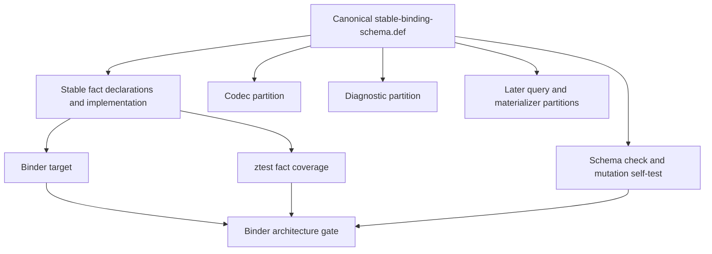

# RFC 0030: Stable Binding Foundation Verification

## Summary

This RFC makes the RFC 0027 stable Binder foundation a build-visible,
schema-checked, natively tested transaction before query-runtime work begins.
It defines `stable-binding-schema.def` as the canonical X-macro inventory,
assigns every inventory row to one implementation partition, closes the
missing identity-diagnostic tags, and expands RFC 0029 `R29-12AB` to include
the exact build, unit-test, schema-gate, and architecture-gate files required
to prove that the stable facts compile and that the inventory is consumed. It
keeps compilation-context routing in the driver layer and removes contextual
data from stable Binder values that do not need it.

The transaction introduces no compatibility surface, internal revision
suffix, inactive code path, or uncompiled source file.

## Motivation

RFC 0029 requires `R29-12AB` to land one buildable schema-plus-facts
transaction with focused native and mutation gates. The RFC 0027 source plan
assigns only `stable-binding-schema.def` and `stable-binding-facts.{h,cc}` to
that transaction, while the Binder source list, ztest registration, schema
gate, and architecture gate remain assigned to later tasks. A commit within
that file boundary can therefore leave `stable-binding-facts.cc` outside the
Binder target and pass only tests that do not observe the new files.

The current schema candidate also has no repository consumer and names future
tests without identifying which implementation partition must provide each
one. It omits three tags already fixed by RFCs 0027 and 0029:

- `IdentityDiagnosticEmitter::ConstantExpressionNotAllowed = 0x03`;
- `IdentityDiagnosticEmitter::DuplicateGenericParameter = 0x04`; and
- `DiagnosticSecondaryRole::PreviousDeclaration = 0x01`.

Implementation cannot proceed from a file inventory that permits an
uncompiled facts source, an unregistered test, or an unowned schema row.

## Goals

- Make one file the authoritative inventory for stable Binder records,
  fields, variants, domains, bounds, descriptors, diagnostics, mutations, and
  implementation ownership.
- Require every inventory row to name exactly one implementation partition.
- Compile the stable facts implementation in the same transaction that adds
  it.
- Add native fact tests and positive and negative schema checks in that same
  transaction.
- Make Binder architecture checks reject missing source, test, schema, or
  CTest wiring.
- Preserve the dependency order: the atomic `R29-12AB` foundation includes
  S1, S2, and S3; `R29-12D` then lands RFC 0042's source-only canonical
  diagnostic replacement; `R29-13A` begins runtime work; and `R29-13B`
  introduces S6 with its live Module and Binder producers.
- Keep the existing immutable implementation-series base unchanged.

## Non-Goals

- This RFC does not change ZOM language syntax or semantics.
- This RFC does not implement Binder query providers, materializers, active
  membership, session sealing, or core-library queries.
- This RFC does not move canonical diagnostic-fact implementation into
  `R29-12AB`.
- This RFC does not add a general code generator or adopt LLVM TableGen.
- This RFC does not authorize the pending `query-types.{h,cc}` work.
- This RFC does not alter the immutable implementation-series base record.

## Prior Art

LLVM TableGen uses a declarative record inventory as an authoritative input to
multiple consumers. ZOM adopts the single-authority and multi-consumer
properties, while retaining the existing C++ X-macro format because this
inventory does not require a new language or generator executable.

CMake target source lists make compilation membership explicit. ZOM requires
the new implementation file to enter the Binder target in the same landing
transaction, so a source file cannot exist outside native compilation.

LLVM lit and ZOM ztest both make test discovery an executable property rather
than a documentation claim. ZOM registers the fact test and both schema-gate
modes in CTest and verifies their exact target names.

## Guide-Level Explanation

A contributor changing a stable Binder record edits one canonical inventory.
The row names its domain, fields, limits, mutation classes, executable test,
and implementation partition. The schema gate checks the inventory in both
directions against the C++ facts and the registered native tests.



`R29-12AB` may land only when the facts source is compiled, its ztest runs,
the schema check passes, the schema self-test proves that required mutations
are detected, and the Binder architecture gate proves all wiring.

## Reference-Level Design

### Canonical Inventory Authority

`products/zomlang/compiler/binder/stable-binding-schema.def` is a hand-authored
canonical X-macro inventory. It is not generated output. Its consumers may
generate C++ tables or test cases during preprocessing, but no second schema
source exists.

Every record, nested record, canonical sum, runtime-only sum, enum, field,
query, input, capability query, diagnostic mapping, digest, bound, constraint,
and materializer permission has exactly one inventory row. Artifact-producing
rows carry their implementation ownership in the row itself.

```text
Record(
  name, domain, maximum, producer, verifier,
  typeTask, codecTask, testTask, mutations, test)
NestedRecord(
  name, typeParameter1, typeParameter2, maximum,
  typeTask, codecTask, testTask, mutations, test)
Sum(name, typeTask, codecTask, testTask, mutations, test)
RuntimeSum(name, typeTask, testTask, mutations, test)
EnumValue(
  enumName, valueName, tag,
  typeTask, codecTask, testTask, mutations, test)
Query(
  name, domain, keyType, resultType, valueDomain, producer, verifier,
  descriptorTask, providerTask, verifierTask, testTask, mutations, test)
Input(
  name, domain, keyType, resultType, verifier,
  descriptorTask, providerTask, verifierTask, testTask, mutations, test)
CapabilityQuery(
  name, domain, keyType, resultType, capabilityType, producer, verifier,
  failureAlternatives, descriptorTask, providerTask, verifierTask, testTask,
  mutations, test)
DiagnosticMapping(
  name, code, arguments, secondaryCode, secondaryRole,
  secondaryCount, fixItCount, diagnosticTask, testTask, mutations, test)
Digest(
  name, domain, preimage, implementationTask, testTask, mutations, test)
```

The schema gate accepts only these closed entity kinds:

```text
Bound Record NestedRecord NestedField Sum RuntimeSum EnumValue SumVariant
VariantField InlineSumVariant InlineSumVariantField RuntimeSumVariant
RuntimeVariantField Field FieldLimit Query Input CapabilityQuery
MaterializerPermission DiagnosticMapping Constraint Digest
```

The closed task vocabulary is:

```text
S2A S2B S2C S2D S2E S3 S6 I2 B1 B2 B4 M1 M2 M3 M5 Q3 T1
R30_13 R29_13A R29_13C R28_16A R28_16B
```

The underscore task spellings denote `R30-13`, `R29-13A`, `R29-13C`,
`R28-16A`, and `R28-16B` only as X-macro arguments. They are task identifiers,
not internal contract revisions.

Fields and variants inherit ownership from exactly one containing record or
sum. A type with both `Record` and `Sum` rows is one permitted composite:
`Record` owns canonical framing and `Sum` owns closed variant topology, and
their task triples must match. A `RuntimeSum` has type and native-test tasks
but no codec task. Bounds, field limits, constraints, and permissions are
schema-only rows and have no production artifact task. The schema gate rejects
a missing task column, unknown task, impossible artifact kind, unresolved
containing row, duplicate owner row, unequal composite ownership, or assignment
that contradicts the accepted exact-file owner.

The exhaustive type ownership is:

| Entities | Type task | Codec task | Test task |
|---|---|---|---|
| Each S2 record or canonical sum | Exact `S2A` through `S2E` owner | `S3` | Same exact S2 owner |
| Binder diagnostic argument records, diagnostic sums, and diagnostic enums | `S6` | `S6` | `S6` |
| Active membership and readiness records and sums | `I2` | `I2` | `I2` |
| Four canonical package-compilation-request records | `Q3` | `Q3` | `R30_13` |
| Complete compilation-context authority and transaction records | `T1` | `T1` | `T1` |
| Stable graph materialization witnesses | `M1` | `M1` | `M1` |

The S6 row above records the accepted future owner partition, not current
implementation. RFC 0042 deletes its unimplemented rows and task token from
the live schema. RFC 0029 `R29-13B` reintroduces S6 only when its Module and
Binder producers, factories, mappings, verifier, and tests land together.

`CanonicalInputPayloadDigest` uses
`(implementationTask=T1, testTask=T1)`.
`CapabilityDemandResult<Descriptor>` is a runtime-only sum with
`(typeTask=R29_13A, testTask=R29_13C)` and no codec. Its conditional
`SourceRejected` and `KeyRejected` alternatives are instantiated only from a
descriptor's closed `FailureAlternatives`; its `Published` and
`RuntimeRejected` alternatives are unconditional.

Descriptor ownership is exact:

| Descriptor group | Descriptor | Provider | Verifier | Test |
|---|---|---|---|---|
| Stable header and skeleton projections | `B1` | `B1` | `B1` | `B1` |
| Owner-body and module diagnostic queries | `B2` | `B2` | `B2` | `B2` |
| Allocation plan | `B4` | `B4` | `B4` | `B4` |
| Active memberships | `I2` | `I2` | `I2` | `I2` |
| `ModuleDependencyProvenance` | `R28_16A` | `R28_16A` | `R28_16A` | `R28_16B` |
| Materialized module graph | `M1` | `M1` | `M1` | `M1` |
| Materialized module skeleton | `M2` | `M2` | `M2` | `M2` |
| Materialized owner body | `M3` | `M3` | `M3` | `M3` |
| Verified bound module | `M5` | `M5` | `M5` | `M5` |

Input ownership is exact:

| Input | Descriptor | Provider | Verifier | Test |
|---|---|---|---|---|
| `CompleteCompilationContextAuthorityInput` | `T1` | `T1` | `T1` | `T1` |
| `ActiveDefinitionAuthorityInput` | `I2` | `T1` | `I2` | `I2` |
| `CompleteRootIdentityReadiness` | `I2` | `T1` | `I2` | `I2` |

Every capability row uses
`CapabilityDemandResult<name>`, names its capability payload, and carries an
explicit closed failure-alternative list. The five stable Binder capability
rows use `SourceRejection<DiagnosticFact>` and
`KeyRejection<BinderKeyFailure>`. `R30-13` validates this schema structure
without naming an unlanded C++ descriptor. Each later descriptor task selects
only its owned rows and compiles independent equality checks for both
`name::Capability` and `name::FailureAlternatives`. The final capability
architecture gate rejects an implemented descriptor that lacks either check.

The schema gate does not infer implementation completion from tracker prose.
Task columns are immutable ownership metadata. Exact landing-scope and
architecture gates reject artifacts outside the active transaction. Contract
rows for a later task remain inert: they do not declare a C++ type, register a
descriptor, or require a compile-time reference before that task.

Every S2 stable record receives its codec in the matching S3 review partition.
S1, S2, and S3 are separately reviewable but land only as the atomic
`R29-12AB` transaction.

The binding-visibility query result is exactly
`Optional<MemberVisibility>`. No alias, wrapper, compatibility name, or
additional wire domain is created.

The inventory includes these fixed diagnostic tags:

```text
IdentityDiagnosticEmitter.ConstantExpressionNotAllowed = 0x03
IdentityDiagnosticEmitter.DuplicateGenericParameter = 0x04
DiagnosticSecondaryRole.PreviousDeclaration = 0x01
```

It also includes the exact identity-admission mappings:

```text
ConstantExpressionNotAllowed -> ZOM4079, empty arguments, no secondary, no fix-it
DuplicateGenericParameter -> ZOM3010, BinderIdentifierDiagnosticArguments,
  one ZOM3017 secondary with PreviousDeclaration, no fix-it
```

### S2 Type Boundary

`stable-binding-facts.h` and `stable-binding-facts.cc` implement the
Binder-owned S2 entities. `driver/contextual-binding-key.{h,cc}` implements the
S2 contextual keys:

- complete stable routing keys and contextual keys;
- header enums, header sites, and stable header records;
- stable scope, syntax-root, binding-target, module-skeleton, lookup, and
  owner-body facts;
- stable projection keys and projection values;
- the deterministic allocation-plan value types;
- `BinderQueryOwner`, `BinderKeyFailureKind`, and `BinderKeyFailure`; and
- `BinderQueryResult<T>` with its closed `Value`, `SourceRejected`, and
  `KeyRejected` alternatives.

`BinderQueryOwner::Body` stores `StableOwnerBodyQueryKey`.
`ModuleBindingAllocationPlan` stores its stable `ModuleKey`. Context roots
remain in the outer query key and do not enter either stable value.

Active membership records, context-input payloads, diagnostic-fact types,
materialized capabilities, query descriptors, providers, and verifiers remain
owned by their named later partitions. S2 does not declare them early.

S2 types are move-only when they contain move-only identity or `zc` values.
Closed sums use `zc::OneOf`. Factories enforce local structural invariants.
Cross-query authority and read-set invariants remain the responsibility of the
later provider and its independent verifier. S2 exposes `clone` and semantic
equality required by later query values.

The only sequence spellings are `CanonicalSequence<T>` and
`CanonicalNonEmptySequence<T>`. Both are move-only opaque containers with:

```text
clone() -> same sequence type
values() -> ArrayPtr<const T>
operator== and operator!=
CanonicalSequence<T>::empty()
```

Their constructor from `zc::Vector<T>` is private and friends
`StableBindingSequenceBuilder<T>`. The S3 codec review partitions define that
builder before `R29-12AB` lands:

```text
from(Vector<T>) -> Maybe<CanonicalSequence<T>>
fromNonEmpty(Vector<T>) -> Maybe<CanonicalNonEmptySequence<T>>
```

The builder encodes each complete element with the matching S3 codec, requires
strictly increasing encoded bytes, and therefore rejects duplicates and
reordering. The atomic transaction exposes no S2 type without its S3
admission path. Empty sequences are canonical without an element codec. The
schema uses
`CanonicalNonEmptySequence<T>` everywhere; `NonEmptyCanonicalSequence<T>` is
invalid.

Diagnostic sequences use RFC 0036's diagnostics-owned explicit limits API.
The source parser retains its explicit 4,096-fact limit. Stable Binder result
admission supplies `DiagnosticFactsPerResult` and `DiagnosticPayloadBytes`
from the schema. Binder does not duplicate diagnostic field validation,
ordering, size accounting, encoding, or decoding.

Canonical byte encoding and decoding are owned by S3. Binder record codecs
live in `stable-binding-codec.{h,cc}`. The contextual-key codecs live with
their driver declarations. `StableDefinitionQueryKey`,
`StableOwnerBodyQueryKey`, `ContextualDefinitionKey`, `ContextualModuleKey`,
and `ContextualBodyOwnerKey` expose the exact S3 `encodeCanonical` and
`decodeCanonical` operations required by the atomic cutover.

### Atomic Contextual-Key Cutover

`R29-12AB` removes the driver declarations of `ContextualDefinitionKey`,
`ContextualModuleKey`, and `ContextualBodyOwnerKey`, migrates every production
and test caller to the complete declarations in
`driver/contextual-binding-key.{h,cc}`, and moves their canonical key codecs
with those declarations.

The context-key unit remains in
`zomlang::compiler::driver::incremental_binding_query`. It may depend on
identity, Binder stable routing keys, and the driver-owned
`CompilationRootSetQueryKey`. `stable-binding-facts.{h,cc}` and
`stable-binding-codec.{h,cc}` do not include driver headers. Stable Binder
facts do not contain contextual keys.

The payload replacement is exact:

```text
ContextualDefinitionKey {
  contextRoots: CompilationRootSetQueryKey,
  definition: StableDefinitionQueryKey,
}

ContextualModuleKey {
  contextRoots: CompilationRootSetQueryKey,
  module: ModuleKey,
}

ContextualBodyOwnerKey {
  contextRoots: CompilationRootSetQueryKey,
  body: StableOwnerBodyQueryKey,
}
```

Every migrated constructor supplies and validates the explicit owning module.
No provider searches active modules to recover it. The transaction leaves no
namespace alias, forwarding wrapper, overload, duplicate codec, or declaration
in the current query-specific headers. RFC 0029 `R29-14` no longer owns these
three caller migrations; it retains provider, session, capability, and
source-transaction replacement.

The authority session retains one
`zc::Vector<binder::StableDefinitionQueryKey>` ledger containing the exact
stable key used for each published authority input. Refresh erases prior
inputs with the retained prior context roots and complete stable keys before
setting the next projection in the same transaction. Removed, renamed,
module-removed, and cross-module-moved definitions require no reverse lookup
or current-graph owner search. The session ledger and context roots change
only after a successful input commit.

### R29-12AB Exact Landing Set

RFC 0029 `R29-12AB` owns exactly these files:

```text
products/zomlang/compiler/binder/stable-binding-schema.def
products/zomlang/compiler/binder/stable-binding-facts.h
products/zomlang/compiler/binder/stable-binding-facts.cc
products/zomlang/compiler/binder/stable-binding-codec.h
products/zomlang/compiler/binder/stable-binding-codec.cc
products/zomlang/compiler/binder/binding-metadata.h
products/zomlang/compiler/binder/binding-metadata.cc
products/zomlang/compiler/binder/CMakeLists.txt
products/zomlang/compiler/identity/canonical-header-name.h
products/zomlang/compiler/identity/canonical-header-name.cc
products/zomlang/compiler/identity/canonical-header-type.h
products/zomlang/compiler/identity/canonical-header-type-decode.cc
products/zomlang/compiler/identity/canonical-overload-header.h
products/zomlang/compiler/identity/canonical-overload-header.cc
products/zomlang/compiler/identity/canonical-impl-header.h
products/zomlang/compiler/identity/canonical-impl-header.cc
products/zomlang/compiler/identity/definition-key.h
products/zomlang/compiler/identity/definition-key.cc
products/zomlang/compiler/identity/CMakeLists.txt
products/zomlang/tests/unittests/compiler/binder/stable-binding-facts-test.cc
products/zomlang/tests/unittests/compiler/binder/CMakeLists.txt
products/zomlang/tests/unittests/compiler/identity/canonical-header-name-test.cc
products/zomlang/tests/unittests/compiler/identity/canonical-header-type-test.cc
products/zomlang/tests/unittests/compiler/identity/canonical-impl-header-test.cc
products/zomlang/tests/unittests/compiler/identity/definition-key-test.cc
scripts/check-stable-binding-schema.py
scripts/check-binder-architecture.py
scripts/check-compiler-session-architecture.py
products/zomlang/compiler/driver/active-definition-authority-query.h
products/zomlang/compiler/driver/active-definition-authority-query.cc
products/zomlang/compiler/driver/active-definition-authority-session.h
products/zomlang/compiler/driver/active-definition-authority-session.cc
products/zomlang/compiler/driver/compiler-session.cc
products/zomlang/compiler/driver/contextual-binding-key.h
products/zomlang/compiler/driver/contextual-binding-key.cc
products/zomlang/compiler/driver/CMakeLists.txt
products/zomlang/compiler/driver/named-item-query.cc
products/zomlang/compiler/driver/owner-body-query.h
products/zomlang/compiler/driver/owner-body-query.cc
products/zomlang/tests/unittests/compiler/driver/active-definition-authority-query-test.cc
products/zomlang/tests/unittests/compiler/driver/active-definition-authority-session-test.cc
products/zomlang/tests/unittests/compiler/driver/package-compilation-request-test.cc
products/zomlang/tests/coverage/rfc-0030-stable-binding-landing-files.txt
scripts/check-landing-scope.py
```

The accepted branch provides the complete `named-item-query.h` contextual-key
and capability descriptor contract in commit
`652790085feae33aa23eefc8ee16d7ad2d8c7bdf`. This transaction consumes that
published prerequisite and does not restage the file. The exact pending
landing set contains 44 paths, including the CompilerSession architecture gate
that owns the Driver source inventory and direct build marker.

The transaction registers these exact CTest names:

```text
stable-binding-facts-test
stable-binding-schema
stable-binding-schema-negative
stable-binding-landing-scope-negative
```

The existing `binder-architecture`, `binder-architecture-negative`, and
`binder-fact-schema` tests remain required regressions.

### Schema Gate

`scripts/check-stable-binding-schema.py --check` verifies:

- balanced macro parsing and exact arity;
- the closed entity-kind and task vocabularies;
- unique record and descriptor domains;
- unique and dense tags within each enum or sum;
- unique and dense field ordinals within each record or variant;
- one resolvable owner row for every field and variant;
- equal task triples for each canonical `Record` and `Sum` composite;
- no codec task on a runtime-only sum;
- valid bound, field-limit, constraint, mutation, producer, verifier, test,
  artifact-task, and exact-file references;
- complete task columns for every artifact-producing row;
- `CapabilityDemandResult<name>` for every capability result;
- complete `capabilityType` and `failureAlternatives` columns;
- exact agreement between each capability failure list and the conditional
  runtime-sum variants;
- an S2 declaration and native test for every S2 entity;
- a schema consumer in `stable-binding-facts.cc`;
- no driver include in the four stable-binding facts and codec files;
- Binder target membership for `stable-binding-facts.cc` and
  `stable-binding-codec.cc`;
- native execution of every S3 codec and fixed wire oracle;
- ztest and CTest registration; and
- absence of internal revision suffixes and compatibility vocabulary.

`--self-test` performs in-memory mutations and must prove rejection of a
duplicate domain, duplicate tag, ordinal gap, unknown bound, unknown mutation,
missing or duplicate sum ownership, a runtime-sum codec task, missing artifact
task, contradictory artifact task, missing executable test, missing schema
consumer, missing Binder source wiring, and missing CTest registration. It
independently changes a capability result or payload and removes, adds,
exchanges, or changes the payload of each capability failure alternative. It
must reject each mutation without consulting C++ source or a script-local
descriptor table.

The self-test separately removes `stable-binding-facts.cc` and
`stable-binding-codec.cc` from the Binder target and removes one S3 codec and
one wire oracle from native test execution. It also swaps identity emitter
tags `0x03` and `0x04` and independently mutates diagnostic code, argument
schema, secondary code, secondary role, secondary count, and fix-it count for
both identity-admission mappings. Every exact mutation must fail.

The gate is reusable repository infrastructure integrated into CTest. It is
not disposable validation and does not reimplement Binder production logic.

### R30-13 Completion Contract

`R30-13` adds the comprehensive Q3 schema mutation test to
`products/zomlang/tests/unittests/compiler/driver/package-compilation-request-test.cc`.
The test exercises the production codecs for
`CanonicalCompilationRootRecord`, `CanonicalTargetSelectionRecord`,
`CanonicalLanguageOptionsRecord`, and
`CanonicalPackageCompilationRequest`. It mutates every declared applicable
domain, truncation, trailing-byte, field, identity, digest, profile, target,
enum, Boolean, duplicate, reordered, and hostile-count case.

The schema self-test independently changes `CanonicalPackageRecordBytes` and
must reject every value other than `UINT32_MAX`; the native test does not
allocate a multi-gigabyte buffer. `R30-13` neither rewrites the completed Q3
production files nor names an unlanded capability descriptor in a C++ compile
consumer.

The capability architecture gate is staged by descriptor ownership. Each
descriptor task compiles only its owned schema rows and proves equality of the
hand-written `name::Capability` alias with `capabilityType` and the
hand-written `name::FailureAlternatives` alias with the row-derived
`CapabilityFailureList<failureAlternatives...>`. The final gate rejects every
implemented descriptor lacking either owned-row equality check. Future rows
remain inert until their named tasks.

### Landing-Scope Gate

`products/zomlang/tests/coverage/rfc-0030-stable-binding-landing-files.txt`
contains the newline-sorted exact `R29-12AB` landing set, including itself.
`scripts/check-landing-scope.py` is a reusable Git-state gate with:

```text
--check-worktree --start-ref <accepted-transaction-commit>
  --allowlist <file> --base-file <file>
--check-index --start-ref <accepted-transaction-commit>
  --allowlist <file> --base-file <file>
--self-test
```

Both check modes require the immutable base file to pass the same format,
recording-commit, unchanged-content, and ancestry rules as the English-only
gate. They require `HEAD` to equal `start-ref` and the immutable base to be its
ancestor.

`--check-worktree` requires every added, copied, modified, renamed, or deleted
path relative to `HEAD`, including untracked files, to equal the allowlist and
requires an empty index. `--check-index` requires the cached path and status
set to equal the allowlist byte-for-byte and rejects every unstaged or
untracked path. Both modes reject ignored allowlist entries, duplicate
entries, non-normalized paths, paths outside the repository, and a start ref
that is missing, moving, or not `HEAD`.

`--self-test` creates temporary Git repositories and proves positive and
negative behavior for base mutation, non-ancestor and moving starts, missing
and additional allowlist entries, staged-set drift, unstaged changes,
untracked files, rename and deletion status, duplicates, and path escape. It
is registered in CTest as `stable-binding-landing-scope-negative`.

### Withdrawn R29-12D Six-Path Set

The canonical Binder diagnostic-fact transaction owns exactly:

```text
products/zomlang/compiler/diagnostics/diagnostics-binder.def
products/zomlang/compiler/diagnostics/diagnostic-fact.h
products/zomlang/compiler/diagnostics/diagnostic-fact.cc
products/zomlang/compiler/checker/checker-source-diagnostics.def
products/zomlang/tests/unittests/compiler/diagnostics/diagnostic-fact-test.cc
products/zomlang/tests/unittests/compiler/diagnostics/CMakeLists.txt
```

`diagnostic-fact-test` constructs the complete canonical
`ConstantExpressionNotAllowed` and `DuplicateGenericParameter` facts through
production factories and codecs. It independently mutates emitter, phase,
primary identity site, previous identity site, `ZOM4079`, `ZOM3010`,
`ZOM3017`, arguments, `PreviousDeclaration`, secondary count, fix-it, and
replacement. It requires exact rejection for every mutation.

The focused transaction runs `check-diagnostic-coverage.py --self-test`,
`check-diagnostic-coverage.py --check`, and `diagnostic-fact-test`. The
diagnostics CMake file owns explicit test labeling and proves CTest discovery.

### RFC 0042 Replacement Of The R29-12D Set

Post-R30-15 live-use inspection rejected the six-path set above: it omitted
the source fact producer, parser values, materializer, Binder result codec,
driver handoff, and native callers required by a direct replacement. RFC 0042
supersedes that execution set with its source-only `Exact Atomic Landing Set`,
deletes the unimplemented S6 schema inventory, removes the already-satisfied
`checker-source-diagnostics.def` path, and keeps one atomic `R29-12D` commit.
RFC 0029 `R29-13B` later owns S6's direct Source-plus-Module expansion,
production factories, mappings, `ZOM3028`, schema rows, and evidence. The
six-path set is review history and no longer authorizes product edits.

### Isolated Verification

The two pending `query-types` files belong to `R29-13A` and are outside this
transaction. Full `R29-12AB` verification runs in a clean worktree created
from the accepted branch state and populated only with the exact landing set.
The landing-scope gate proves the worktree before verification and the index
after explicit staging.

The implementation-series base remains
`109947943519ec2d380a3e8d71813b40bc68bde5`. The base record is immutable and
is not rewritten for this transaction.

## Repository Impact

| Area | Paths | Owner |
|---|---|---|
| RFC authority | `docs/rfc/0025-*` through `docs/rfc/0030-*`; affected trackers for RFCs 0017 through 0020 and 0025 through 0030; `docs/rfc/README.md` | `rfc` |
| Task routing | `.agents/subagents/manifest.yaml`, `.agents/subagents/task-router.md`, `.agents/subagents/verification.md`, `.agents/subagents/binder-checker.md` | `task-router` |
| Stable contextual contracts | `products/zomlang/compiler/driver/contextual-binding-key.*`, `products/zomlang/compiler/driver/active-definition-authority-query.*`, `products/zomlang/compiler/driver/active-definition-authority-session.{h,cc}`, `products/zomlang/compiler/driver/compiler-session.cc`, `products/zomlang/compiler/driver/named-item-query.*`, `products/zomlang/compiler/driver/owner-body-query.*`, `products/zomlang/compiler/driver/CMakeLists.txt` | `module-system` |
| Stable Binder foundation | `products/zomlang/compiler/binder/stable-binding-*`, `products/zomlang/compiler/binder/CMakeLists.txt` | `binder-checker` |
| Diagnostic schema contract | `products/zomlang/compiler/diagnostics/**` | `error-system` |
| Native tests and gates | `products/zomlang/tests/unittests/compiler/binder/**`, `products/zomlang/tests/unittests/compiler/driver/package-compilation-request-test.cc`, `products/zomlang/tests/unittests/compiler/diagnostics/diagnostic-fact-test.cc`, `products/zomlang/tests/unittests/compiler/diagnostics/CMakeLists.txt`, `products/zomlang/tests/coverage/rfc-0030-stable-binding-landing-files.txt`, `scripts/check-stable-binding-schema.py`, `scripts/check-binder-architecture.py`, `scripts/check-compiler-session-architecture.py`, `scripts/check-landing-scope.py` | `verification` |

## Security And Safety Impact

The RFC adds no runtime input surface. It improves build and test safety by
making uncompiled source, unregistered tests, malformed schema ownership, and
missing mutation coverage hard failures. Stable fact ownership continues to
use `zc` move-only values and closed sums; no raw pointer or ambient lifetime
authority is introduced.

## Drawbacks And Risks

- The schema gate is a maintained parser for a constrained X-macro language.
  Its grammar must remain deliberately small and must have adversarial
  self-tests.
- The stable foundation is large. Every S2 and S3 review patch is capped at
  400 changed source lines, edits only its named entities and exact files, and
  cannot land independently.
- RFC 0033 replaces the stable-header review patch with three cumulative,
  dependency-ordered patches: header primitives and parameter records,
  `StableDefinitionHeader`, and `StableImplementationOccurrenceHeader`. Each
  counts the facts header, facts source, and native fact test against the
  exact approved predecessor hash and retains the 400-line cap.
- RFC 0034 supersedes that review graph. It separates enums and sites, generic
  parameters, callable parameters, primitive codecs, and both aggregate
  fact-and-codec pairs. Parameter codecs precede aggregate tests because the
  production canonical-sequence builder orders complete encoded elements.
- Moving build and test wiring forward increases the size of `R29-12AB`, but
  every added file is necessary to prove the transaction it lands.
- A clean verification worktree adds operational steps. It is necessary while
  a separate runtime partition remains dirty in the shared checkout.

## Alternatives Considered

### Adopt LLVM TableGen

TableGen provides a mature declarative system and backend framework. This
inventory does not need a new build-time language, executable, or generated
file family, so the additional dependency and backend ownership are not
justified.

### Generate The X-Macro Inventory

A generated inventory requires a second authoritative schema input and a
drift protocol. The X-macro file already expresses the complete contract and
can serve directly as the sole authority.

### Delay Build And Tests

Keeping build wiring and tests in later tasks cannot prove that `R29-12AB` is
buildable. The acceptance criterion is transaction-local, so its evidence
must be transaction-local.

### Validate Only With Text Search

Text search cannot prove C++ compilation, native constructors, move-only
behavior, semantic equality, or CTest discovery. It remains useful inside the
architecture gate but cannot replace native tests.

## Compatibility And Rollout

The repository is unreleased and this is a direct internal replacement.
`R29-12AB` adds the canonical inventory, S2 facts, S3 codecs and sequence
admission, build wiring, native tests, and gates together. It also removes all
three driver contextual-key declarations and migrates the complete production
and test caller set. No aliases, shims, feature flags, dual registration, or
fallback paths are introduced.

If the transaction fails before publication, the entire commit is reverted.
There is no persisted data migration or external protocol compatibility
surface.

## Documentation And Teaching Plan

RFCs 0025 through 0030, trackers 0017 through 0020 and 0025 through 0030, the
RFC index, and affected routing governance were synchronized in the RFC 0030
acceptance transaction. RFC 0031 acceptance transaction
`rfc0031-accept-20260728-c25fcb18` synchronizes the complete schema metamodel,
ownership, and verification contract before `R30-11` resumes.
RFC 0032 acceptance transaction
`rfc0032-accept-20260728-1d519846` synchronizes the complete authority-ledger
key and corrected exact landing set before `R30-12C` resumes.
The Binder contributor documentation will identify the X-macro inventory as
the canonical schema authority and list the four native CTest targets.
Current-state design documentation changes only after production paths land.

## Operational Readiness

CI must execute the schema check, schema self-test, fact ztest, Binder
architecture checks, sanitizer build, and full CTest matrix. Gate failures
must print the violated invariant and file location. No network service,
runtime observability, or release operation is added.

## Acceptance Criteria

- All required owners approve one unchanged proposal hash.
- RFCs 0025 through 0030, trackers 0017 through 0020 and 0025 through 0030,
  the RFC index, and affected routing governance contain no stale foundation
  dependency or ownership claim.
- The schema contains every fixed tag and identity-diagnostic mapping.
- The schema uses the RFC 0031 entity, macro, task, sum-ownership, descriptor,
  input, capability-payload, and failure-alternative model.
- Every implementable schema entity has one valid partition.
- Every S2 entity has one declaration, implementation, and native test.
- `stable-binding-facts.cc` is compiled into the Binder target.
- The four new CTest targets and three existing Binder regression targets
  pass.
- Schema mutation self-tests reject every required mutation class.
- `package-compilation-request-test` rejects every applicable Q3 record and
  aggregate mutation, and the schema self-test rejects a changed
  `CanonicalPackageRecordBytes` bound without allocating that bound.
- Every implemented capability descriptor has compiled equality checks for
  both its `Capability` and `FailureAlternatives` aliases.
- `R29-12D` owns and passes `diagnostic-fact-test`, diagnostic coverage check,
  and diagnostic coverage self-test with the exact identity-admission
  mutation matrix.
- The landing-scope self-test passes, and its two positive modes prove the
  isolated worktree and staged index against the exact allowlist.
- Sanitizer build, focused tests, full unit tests, full CTest, format,
  English-only, internal-versioning, RFC, and diff gates pass in the isolated
  worktree.
- The staged file list equals the accepted exact landing set.

## Implementation Plan

1. Review this RFC against one exact proposal hash.
2. Prepare RFCs 0025 through 0030, trackers 0017 through 0020 and 0025 through
   0030, the RFC index, and routing overlays while RFC 0030 remains in review,
   then accept the complete synchronization transaction.
3. After RFC 0031 `R31-09`, resume `R30-11` from the accepted complete schema
   metamodel.
4. Close the schema inventory, diagnostic tags, diagnostic mappings, and
   partition ownership.
5. Prepare the bounded S2 routing and contextual key review patch.
6. Prepare the matching bounded S3 key codec and wire-oracle review patch.
7. Prepare bounded driver authority and owner-body caller-cutover review
   patches.
8. Prepare the three RFC 0033 bounded S2 header review patches, then bounded
   module-skeleton, owner-body, and allocation review patches.
9. Prepare one matching bounded S3 codec, sequence-admission, and wire-oracle
   review patch after each S2 fact patch.
10. Add Binder build wiring, the focused ztest, the schema gate, its self-test,
   and architecture-gate enforcement.
11. Re-run S1 and S2 owner reviews.
12. Assemble the exact `R29-12AB` landing set in an isolated clean worktree.
13. Prove worktree scope, run focused and complete native verification,
    explicitly stage the allowlist, and prove index scope.
14. Commit and push the atomic transaction.
15. Land `R29-12D` through RFC 0042 with the complete source-only fact and
    provenance cutover, transaction-local diagnostic tests, exact scope, and
    coverage gates.
16. Resume `R29-13A`.

## Test Plan

- Build:
  `PATH=/opt/homebrew/bin:$PATH cmake --preset sanitizer`;
  `PATH=/opt/homebrew/bin:$PATH cmake --build --preset sanitizer --target stable-binding-facts-test package-compilation-request-test`;
  `PATH=/opt/homebrew/bin:$PATH cmake --build --preset sanitizer --clean-first`.
- Unit tests:
  `PATH=/opt/homebrew/bin:$PATH ctest --preset default -R '^(stable-binding-facts-test|package-compilation-request-test|stable-binding-schema|stable-binding-schema-negative|stable-binding-landing-scope-negative|binder-architecture|binder-architecture-negative|binder-fact-schema)$' --output-on-failure --no-tests=error`;
  `PATH=/opt/homebrew/bin:$PATH ctest --preset default -L unittest --output-on-failure --no-tests=error`.
- Complete native tests:
  `PATH=/opt/homebrew/bin:$PATH ctest --preset default --output-on-failure --no-tests=error`.
- Schema:
  `python3 scripts/check-stable-binding-schema.py --check`;
  `python3 scripts/check-stable-binding-schema.py --self-test`.
- Architecture:
  `python3 scripts/check-binder-architecture.py --check`;
  `python3 scripts/check-binder-architecture.py --self-test`;
  `python3 scripts/check-compiler-session-architecture.py --check`;
  `python3 scripts/check-compiler-session-architecture.py --self-test`;
  `python3 scripts/check-binder-fact-schema.py --check`.
- Diagnostics:
  `python3 scripts/check-diagnostic-coverage.py --self-test`;
  `python3 scripts/check-diagnostic-coverage.py --check`;
  `PATH=/opt/homebrew/bin:$PATH ctest --preset default -R '^diagnostic-fact-test$' --output-on-failure --no-tests=error`.
- Landing scope:
  `python3 scripts/check-landing-scope.py --self-test`;
  `python3 scripts/check-landing-scope.py --check-worktree --start-ref <accepted-transaction-commit> --allowlist products/zomlang/tests/coverage/rfc-0030-stable-binding-landing-files.txt --base-file products/zomlang/tests/coverage/implementation-series-base.txt`;
  explicitly stage only the allowlist;
  `python3 scripts/check-landing-scope.py --check-index --start-ref <accepted-transaction-commit> --allowlist products/zomlang/tests/coverage/rfc-0030-stable-binding-landing-files.txt --base-file products/zomlang/tests/coverage/implementation-series-base.txt`.
- Repository gates:
  `python3 scripts/check-rfc.py`;
  `python3 scripts/check-format.py`;
  `python3 scripts/check-english-only.py --check --base-file products/zomlang/tests/coverage/implementation-series-base.txt`;
  `python3 scripts/check-no-internal-versioning.py --check`;
  `git diff --check`.
- Staging evidence is the successful `--check-index` result.

## Open Questions

None

## Status History

| Date | Status | Notes |
|---|---|---|
| 2026-07-28 | DRAFT | Initial proposal. |
| 2026-07-28 | REVIEW | Ready for exact-hash owner review. |
| 2026-07-28 | ACCEPTED | All six required owners approved proposal SHA-256 `4ed0e6b885abc87a1c4251855780cf115a85b3623b1d46f774a4b664110f7b6b`. Acceptance transaction `rfc0030-accept-20260728-4ed0e6b8` synchronizes RFCs 0025 through 0030, trackers 0017 through 0020 and 0025 through 0030, the RFC index, and affected routing governance without changing the immutable implementation-series base. |
| 2026-07-28 | ACCEPTED | Transaction `rfc0031-accept-20260728-c25fcb18` synchronized the complete schema metamodel and verification contract to RFC 0031 proposal SHA-256 `c25fcb18e503ac214a8e92c925fa88108a915c2b15c94409dfecb88b3d9a63d5` and tracker SHA-256 `d64e7791ed2e2a488c5f57bc07ac341ccfc37d37c220c85131e2c9e846fb8d0d`; RFC 0030 remains accepted, `R30-11` remains pending implementation, and the design blocker is satisfied. |
| 2026-07-28 | ACCEPTED | Transaction `rfc0032-accept-20260728-1d519846` synchronized the complete authority-session routing ledger and exact landing set to RFC 0032 proposal SHA-256 `1d519846566992156b16986fc5c75602af403254fce70f48cfb65af9983a6d72` and tracker SHA-256 `b685d88db1e5c2eef13e97ede1e5c085959d2446e39fd07fe5baac0bf7b2ecbf`; RFC 0030 remains accepted and `R30-12C` may resume without changing implementation status. |
| 2026-07-28 | ACCEPTED | Transaction `rfc0033-accept-20260728-3fc78517` replaced the rejected stable-header review patch with three dependency-ordered patches that each count all exact files and retain the 400-line cap; RFC 0030 remains accepted and source review resumes at `R30-12H-A`. |
| 2026-07-28 | ACCEPTED | Transaction `rfc0034-accept-20260728-09802348` superseded RFC 0033, split header facts and codecs into independently bounded reviews, and moved parameter codecs before populated aggregate tests; RFC 0030 remains accepted and source review resumes at `R30-12H-A1`. |
| 2026-07-28 | ACCEPTED | Transaction `rfc0035-accept-20260728-e79c292e` inserts the identity-owned implementation-record decoder required by `R30-12I-C`, synchronizes exact RFC 0035 proposal SHA-256 `e79c292e8d3aefcce76d32923e566bc625e49b9b67d8bd1968fbd4b9620ee6c8` and tracker SHA-256 `d50ec5efe5718d6eaa657463a348ac0956dd954174345d7b90c00d99d0f6ec9f`, expands the atomic landing set, and preserves `R30-15` as the only source commit and push. |
| 2026-07-28 | ACCEPTED | Transaction `rfc0039-accept-20260728-de7ab2aa` inserts the Binder-owned `ExportSurfaceRevision::fromDigest` prerequisite required by `R30-12O-D`, expands the atomic landing set by `binding-metadata.{h,cc}`, and preserves `R30-15` as the only source commit and push. |
| 2026-07-28 | ACCEPTED | Transaction `rfc0030-amend-landing-20260728-71b56ffb` reconciles the exact pending landing set to approved RFC SHA-256 `71b56ffba6823b210322f70e0a24a54b0e9c2291504a496530c237ff1b4b2815`, tracker SHA-256 `07707641939e84a535867decf12aef201305752b85f53c5833dc9684ae05b875`, and allowlist SHA-256 `8bb87b1ba22757097743061e741e5f66662acfbcbc23b62acaf5f6f0952dd851`; the 43-path transaction consumes the published `named-item-query.h` prerequisite and preserves `R30-15` as the only pending source commit and push. |
| 2026-07-28 | ACCEPTED | Transaction `rfc0030-amend-gate-20260728-f468df91` synchronizes the CompilerSession architecture gate to approved RFC SHA-256 `f468df9160c2b08790134e8923cf7b9882b1640a37719ba6ab0462bf0b14906d`, tracker SHA-256 `3dc6bd85b62bb231a5761c8867664097d7370ac6859385450e6a0b2014fc382a`, allowlist SHA-256 `70695d54b9b5e137e1123050880dea78bc16d452e36107daa0d72e6f4c10b433`, and gate SHA-256 `02a92e43dea40ea9eb5ba5211069de5f1d65f77cc6eb62360425495ab1841521`; the exact pending source transaction contains 44 paths. |
| 2026-07-28 | ACCEPTED | `R30-11` through `R30-15` published as `8885782747e4c863cefcb0d069bc4569cefce9aa`; RFC 0042 replaces the unlanded `R30-16` diagnostic execution set. |
| 2026-07-29 | IMPLEMENTING | RFC 0042 executed the replacement diagnostic transaction from baseline `e8be38e1eeba5a4ae40689321710af2d3fc8b24e`. |
| 2026-07-29 | LANDED | RFC 0042 published the final replacement as `58897c116cafe3463ec6a46ac3bbdd530ef991a5` and its canonical formatting as `02e400332fa87d8fca0bd7f2f5abb153bb776eb1`; all RFC 0030 tracker rows are complete and RFC 0029 resumes at `R29-13A`. |
