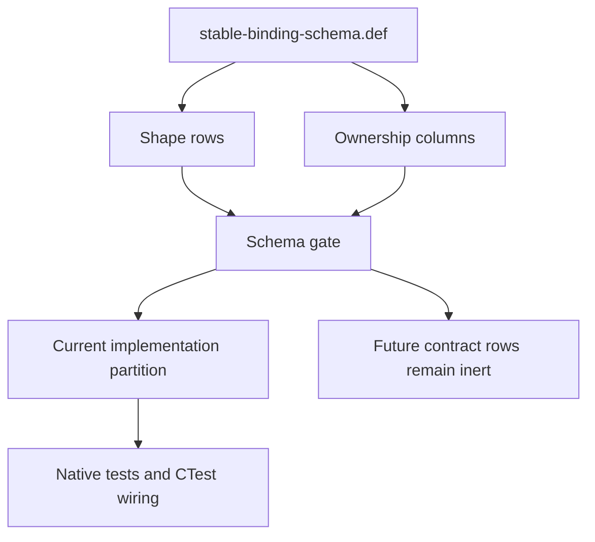

# RFC 0031: Stable Binding Schema Model Closure

## Summary

This RFC closes the schema-model gaps discovered during RFC 0030 `R30-11`
review. It adds explicit canonical-sum and runtime-sum ownership rows, adds
artifact ownership to records, descriptors, inputs, capabilities, and the
canonical input digest, expands the closed task vocabulary for the five
RFC 0028, RFC 0029, and RFC 0030 implementation partitions, defines the exact
split ownership of input descriptors, and fixes the binding-visibility result
as `Optional<MemberVisibility>`.

The schema remains a hand-authored X-macro inventory. This RFC does not add a
second schema source, a compatibility path, an internal revision suffix, or a
runtime declaration before its owning implementation task.

## Motivation

RFC 0030 requires every artifact-producing schema row to carry implementation
ownership and requires variants to inherit ownership from their containing
record or sum. The prepared `stable-binding-schema.def` cannot satisfy that
contract:

- `Record`, `NestedRecord`, `Query`, `Input`, `CapabilityQuery`, and `Digest`
  rows lack complete ownership columns;
- there is no containing `Sum` row from which `StableHeaderSite`,
  `BinderQueryOwner`, the diagnostic outer sums, or generic result sums can
  inherit ownership;
- the runtime-only `CapabilityDemandResult<Descriptor>` sum has no
  representation that
  avoids claiming a canonical codec;
- `ModuleDependencyProvenance` belongs to the accepted RFC 0028 provenance
  partitions after the RFC 0029 runtime join, but those tasks are absent from
  the closed vocabulary;
- `CompleteCompilationContextAuthorityInput` and the two identity inputs split
  descriptor, transaction provider, verifier, and test ownership across
  accepted tasks, so assigning all four columns to one task would be false;
- four canonical package-request records fixed by RFC 0027 are absent; and
- the binding-visibility result is not represented by the existing canonical
  optional member-visibility type.

Adding guessed fields or assigning a convenient later task would make the
canonical inventory internally complete but architecturally false.

## Goals

- Make every artifact-producing inventory row express its exact accepted owner.
- Give every canonical sum one explicit ownership source.
- Represent runtime-only sum shape without inventing a canonical codec.
- Preserve the exact RFC 0027, RFC 0028, and RFC 0029 task boundaries.
- Add the missing canonical package-request records and dependency-provenance
  capability descriptor.
- Remove the undefined visibility result type without adding an alias or shim.
- Keep contract-only rows inert until their named implementation tasks.
- Make the schema gate reject missing, duplicate, contradictory, or unknown
  ownership metadata.
- Make exact landing-scope and architecture gates reject artifacts outside the
  active implementation transaction.

## Non-Goals

- This RFC does not implement stable Binder facts, codecs, query providers,
  capability payloads, diagnostics, or input transactions.
- This RFC does not change source-language visibility semantics.
- This RFC does not change canonical tags, domains, field ordinals, bounds, or
  diagnostic codes already fixed by accepted RFCs.
- This RFC does not add LLVM TableGen, another generator language, or a second
  inventory.
- This RFC does not authorize the pending `query-types.{h,cc}` implementation.
- This RFC does not change the immutable implementation-series base.

## Prior Art

LLVM TableGen separates declarative records from the backends that consume
them and supports shared definitions through record inheritance and
multiclasses. ZOM keeps its smaller X-macro representation but adopts the same
rule that ownership and structure must have one resolvable declarative source:
<https://llvm.org/docs/TableGen/ProgRef.html>.

MLIR Operation Definition Specification uses declarative type and operation
records while generated and handwritten consumers remain separate. ZOM adopts
the distinction between schema shape and the task that materializes a runtime
artifact:
<https://mlir.llvm.org/docs/DefiningDialects/>.

Protocol Buffers treats field numbers and enum values as schema identity and
requires unique, stable assignments. ZOM is pre-release and replaces current
contracts directly, but it adopts dense, unique, machine-checked tags and
ordinals within the one current schema:
<https://protobuf.dev/programming-guides/proto3/>.

C++23 models a closed discriminated union through `std::variant`, constrains
template participation through associated constraints, and makes invalid type
relationships fail during translation through `static_assert`. ZOM uses its
`zc` equivalents, but follows the same mature compile-time model for the
descriptor-dependent runtime sum and the per-descriptor capability-type
equality check:
<https://eel.is/c++draft/variant>,
<https://eel.is/c++draft/temp.constr>, and
<https://eel.is/c++draft/dcl.pre#dcl.pre.general-10>.

The three common failure modes are:

1. duplicated field ordinals or variant tags silently changing the wire shape;
2. a declarative row drifting from its hand-written C++ descriptor; and
3. a conditional or future alternative becoming available before its owner
   and payload contract exist.

ZOM prevents them with one dense, uniqueness-checked inventory; independent
per-task compile-time equality checks plus mutation coverage; and inert
owner-task rows whose conditional variants are derived only from the
descriptor's closed failure-alternative list.

## Guide-Level Explanation

A contributor can answer three different questions directly from the
inventory:

1. What is the complete canonical or runtime shape?
2. Which task may declare or implement each artifact?
3. Which native test must reject mutations of that artifact?



Canonical records and sums name codec ownership. Runtime-only sums name type
and test ownership but no codec owner. Query, input, and capability rows name
their descriptor, provider, verifier, and test owners independently.

## Reference-Level Design

### Closed Entity Model

The canonical inventory accepts exactly these entity kinds:

```text
Bound Record NestedRecord NestedField Sum RuntimeSum EnumValue SumVariant
VariantField InlineSumVariant InlineSumVariantField RuntimeSumVariant
RuntimeVariantField Field FieldLimit Query Input CapabilityQuery
MaterializerPermission DiagnosticMapping Constraint Digest
```

`Sum` and `RuntimeSum` are the only additions to the RFC 0030 entity-kind
vocabulary.

The artifact-producing macro shapes are:

```text
Record(
  name, domain, maximum, producer, verifier,
  typeTask, codecTask, testTask, mutations, test)

NestedRecord(
  name, typeParameter1, typeParameter2, maximum,
  typeTask, codecTask, testTask, mutations, test)

Sum(name, typeTask, codecTask, testTask, mutations, test)

RuntimeSum(name, typeTask, testTask, mutations, test)

EnumValue(
  enumName, valueName, tag,
  typeTask, codecTask, testTask, mutations, test)

Query(
  name, domain, keyType, resultType, valueDomain, producer, verifier,
  descriptorTask, providerTask, verifierTask, testTask, mutations, test)

Input(
  name, domain, keyType, resultType, verifier,
  descriptorTask, providerTask, verifierTask, testTask, mutations, test)

CapabilityQuery(
  name, domain, keyType, resultType, capabilityType, producer, verifier,
  failureAlternatives, descriptorTask, providerTask, verifierTask, testTask,
  mutations, test)

DiagnosticMapping(
  name, code, arguments, secondaryCode, secondaryRole,
  secondaryCount, fixItCount, diagnosticTask, testTask, mutations, test)

Digest(
  name, domain, preimage, implementationTask, testTask, mutations, test)
```

Fields and variants do not repeat task columns. A `SumVariant` resolves through
exactly one `Sum`. A `RuntimeSumVariant` resolves through exactly one
`RuntimeSum`. When both a
`Record` and `Sum` row describe the same canonical type, they form one
permitted composite: `Record` owns framed canonical-record metadata and `Sum`
owns closed variant topology. Their task triples must be equal. Every
canonical sum has exactly one `Sum` row, including a sum that also has a
`Record` row. All `EnumValue` rows for one enum must carry the same task
triple.

Runtime variants add one condition column:

```text
RuntimeSumVariant(sumName, variantName, tag, condition)
```

`condition` is either `Always` or one exact
`FailureAlternative<Wrapper<PayloadParameter>>`. The payload parameter is a
schema metavariable bound by the matching wrapper in the descriptor's
`FailureAlternatives`. A descriptor-instantiated runtime sum contains an
`Always` variant unconditionally and contains a conditional variant if and
only if the descriptor's `FailureAlternatives` contains the named wrapper.
Every field of that conditional variant may reference only the payload
parameter bound by its condition.

The gate rejects:

- a structural row without a resolvable owner row;
- more than one `Record`, `Sum`, or `RuntimeSum` row of the same kind for one
  type;
- unequal ownership for one enum or canonical sum;
- a codec task on a runtime-only sum;
- an unknown task;
- a capability result other than `CapabilityDemandResult<name>`;
- a capability failure set that disagrees with its conditional runtime
  variants; and
- a missing, extra, exchanged, or payload-drifted capability failure
  alternative.

`Record.producer` and `Record.verifier` are semantic provenance names used by
the later provider/verifier and mutation tests. They are not ownership
columns. The gate validates only the record's type, codec, and native-test
artifacts against the record task triple; provider and verifier implementation
timing remains governed by their accepted source tasks.

The schema gate does not infer task completion from tracker prose. Task columns
are immutable artifact ownership metadata. The exact landing allowlist and
architecture gates reject out-of-scope source, test, descriptor, or build
wiring for the active transaction. Later task completion remains in the
owning RFC tracker and is not copied into a Python table.

### Closed Task Vocabulary

The closed task vocabulary is:

```text
S2A S2B S2C S2D S2E S3 I1A I2 B1 B2 B4 M1 M2 M3 M5 Q3 T1
R30_13 R29_13A R29_13C R28_16A R28_16B
```

`R30_13`, `R29_13A`, `R29_13C`, `R28_16A`, and `R28_16B` denote tracker tasks
`R30-13`, `R29-13A`, `R29-13C`, `R28-16A`, and `R28-16B`.
The underscore spelling is used only because a task token is an X-macro
argument. These are implementation-task identifiers, not internal contract
revisions.

### Exact Record Ownership

All S2 records use:

```text
(typeTask=S2X, codecTask=S3, testTask=S2X)
```

where `S2X` is the exact `S2A` through `S2E` partition assigned by RFC 0030.

The remaining exact triples are:

| Records | Type task | Codec task | Test task |
|---|---|---|---|
| Active membership and readiness records | `I2` | `I2` | `I2` |
| `CanonicalCompilationRootRecord`, `CanonicalTargetSelectionRecord`, `CanonicalLanguageOptionsRecord`, `CanonicalPackageCompilationRequest` | `Q3` | `Q3` | `R30_13` |
| `CanonicalInputEntry<Key, Value>` and `CompleteCompilationContextAuthority` | `I1A` | `I1A` | `I1A` |
| The three transaction payload records | `T1` | `T1` | `T1` |
| Stable graph materialization witnesses | `M1` | `M1` | `M1` |

`CanonicalInputPayloadDigest` uses
`(implementationTask=T1, testTask=T1)`.

### Exact Sum Ownership

The canonical sum task triples are:

| Sums | Type task | Codec task | Test task |
|---|---|---|---|
| Header sites, scope owners, syntax roots, binding targets, `BinderQueryOwner`, `BinderQueryResult<T>` | `S2B` | `S3` | `S2B` |
| Stable failed lookup outcome | `S2C` | `S3` | `S2C` |
| Owner-body sum types | `S2D` | `S3` | `S2D` |
| `ActiveMembershipResult<Record>` | `I2` | `I2` | `I2` |

`CapabilityDemandResult<Descriptor>` is a `RuntimeSum` with
`(typeTask=R29_13A, testTask=R29_13C)` and no codec task. Its variants are:

```text
Published = 0x01, Always
SourceRejected = 0x02,
  FailureAlternative<SourceRejection<Diagnostic>>
KeyRejected = 0x03,
  FailureAlternative<KeyRejection<KeyFailure>>
RuntimeRejected = 0x04, Always
```

The schema does not instantiate `SourceRejected` or `KeyRejected` for a
descriptor whose `FailureAlternatives` omits the matching failure type.
`Diagnostic` and `KeyFailure` are metavariables bound from the exact wrapper
payload types in that list; they are not aliases for Binder-owned types.
The runtime fields are exact:

```text
Published.lease:
  QueryCapabilityLease<const Descriptor::Capability>
SourceRejected.diagnostics:
  CanonicalNonEmptySequence<Diagnostic>
KeyRejected.failure:
  KeyFailure
RuntimeRejected.failure:
  QueryRuntimeFailure
```

For each `CapabilityQuery` row, the gate substitutes every declared
`failureAlternatives` payload into this generic runtime-sum topology and
rejects a missing wrapper, extra wrapper, exchanged wrapper, payload drift, or
field expression that does not use the payload parameter bound by its
condition. The five stable-Binder capability rows currently bind
`Diagnostic=DiagnosticFact` and `KeyFailure=BinderKeyFailure`; this does not
restrict the global runtime sum to those payload types.

### Diagnostic Inventory Admission

RFC 0042 removes the unimplemented `S6` diagnostic sums, enums, argument
records, mappings, and diagnostic-code expectations from
`stable-binding-schema.def` and its gate. The current executable source
diagnostic contract is diagnostics-owned and does not need a Binder schema
mirror. `BinderQueryResult<DiagnosticFact>`, its source-rejection alternative,
the diagnostic count bound, and the diagnostic payload-byte bound remain
because they have live consumers.

RFC 0029 `R29-13B` later adds only the Module root, Binder and identity
phase/emitter alternatives, typed argument records, five exact mappings, and
`ZOM3028` used by its live provider and verifier. RFC 0025 `R25-09C` later
directly replaces that inventory with the executable five-origin contract.
Neither transaction may retain an unused prior alternative or reserve a later
one.

### Exact Enum Ownership

The schema inventories these complete enums:

| Enum | Complete values | Type task | Codec task | Test task |
|---|---|---|---|---|
| `DefinitionBodyDisposition` | `NoExecutableBody=0x01`, `ExecutableBody=0x02` | `S2B` | `S3` | `S2B` |
| `ImplementationSourceForm` | `Ordinary=0x01`, `BodylessMarker=0x02` | `S2B` | `S3` | `S2B` |
| `ScopeRole` | `Declaration=0x01`, `Generic=0x02`, `Parameters=0x03`, `Members=0x04`, `Implementation=0x05` | `S2B` | `S3` | `S2B` |
| `StableExplicitCaptureMode` | `ByValue=0x01`, `ByReference=0x02`, `This=0x03` | `S2D` | `S3` | `S2D` |
| `BinderKeyFailureKind` | `MissingSelectedModuleSource=0x01`, `InactiveOwner=0x02`, `ForeignOwner=0x03`, `DefinitionWithoutBody=0x04`, `BoundaryMismatch=0x05`, `NonSelectedSource=0x06`, `CrossBoundaryPath=0x07` | `S2B` | `S3` | `S2B` |
No diagnostic enum or mapping row is current in the stable-binding schema
after RFC 0042. The reusable gate rejects any such row until the same atomic
transaction adds its production reference, independent verifier, native
mutation test, and explicit task ownership.

### Exact Descriptor Ownership

Query rows and the four materializer capability rows use the same task for
descriptor, provider, verifier, and test. The dependency-provenance capability
splits its native test into the follow-up transaction, and inputs may split
provider and verifier ownership:

| Descriptor group | Four task columns |
|---|---|
| Stable header and skeleton projections | `B1, B1, B1, B1` |
| Owner-body and module diagnostic queries | `B2, B2, B2, B2` |
| Allocation plan | `B4, B4, B4, B4` |
| Active memberships | `I2, I2, I2, I2` |
| `ModuleDependencyProvenance` | `R28_16A, R28_16A, R28_16A, R28_16B` |
| Materialized module graph | `M1, M1, M1, M1` |
| Materialized module skeleton | `M2, M2, M2, M2` |
| Materialized owner body | `M3, M3, M3, M3` |
| Verified bound module | `M5, M5, M5, M5` |

`ModuleDependencyProvenance` has the exact descriptor contract:

```text
domain: zom.query.module-dependency-provenance
key: ModuleKey
result: CapabilityDemandResult<ModuleDependencyProvenance>
capability: ModuleDependencyProvenanceMap
producer: ModuleDependencyProvenanceProvider
verifier: ModuleDependencyProvenanceVerifier
failureAlternatives:
  SourceRejection<DiagnosticFact>
  KeyRejection<BinderKeyFailure>
```

All five capability rows use descriptor-parameterized public results and the
same explicit failure set:

| Descriptor | Public result | Capability payload |
|---|---|---|
| `ModuleDependencyProvenance` | `CapabilityDemandResult<ModuleDependencyProvenance>` | `ModuleDependencyProvenanceMap` |
| `MaterializeModuleGraph` | `CapabilityDemandResult<MaterializeModuleGraph>` | `MaterializedModuleGraph` |
| `MaterializeModuleSkeleton` | `CapabilityDemandResult<MaterializeModuleSkeleton>` | `MaterializedModuleSkeleton` |
| `MaterializeOwnerBody` | `CapabilityDemandResult<MaterializeOwnerBody>` | `MaterializedOwnerBody` |
| `VerifyBoundModule` | `CapabilityDemandResult<VerifyBoundModule>` | `VerifiedBoundModule` |

The public result and capability payload columns are both canonical inventory
data. Every capability row must use
`resultType=CapabilityDemandResult<name>`. `R30-13` validates this structural
relationship and the presence of `capabilityType` without naming an unlanded
C++ descriptor. Each later descriptor task selects only its owned row and
compiles an independent equality check requiring the hand-written
`name::Capability` alias to equal that row's `capabilityType` and the
hand-written `name::FailureAlternatives` alias to equal the schema-derived
`CapabilityFailureList<failureAlternatives...>`. The descriptor is not
generated from the schema consumer. The final capability architecture gate
rejects any implemented descriptor that lacks either owned-row equality
check. Future descriptor rows remain inert until their named tasks.

Each `CapabilityQuery.failureAlternatives` column is exactly:

```text
SourceRejection<DiagnosticFact>|KeyRejection<BinderKeyFailure>
```

The schema self-test independently changes the result type and removes, adds,
exchanges, or changes the payload of each failure alternative. It must reject
every failure-alternative mutation without consulting C++ source or a
script-local descriptor table. Each descriptor task's native compile consumer
checks `name::Capability` against `capabilityType` and
`name::FailureAlternatives` against the row-derived failure list for only the
rows owned by that task. Unilateral drift in either an implemented inventory
row or either hand-written descriptor alias therefore fails the build without
referencing future descriptor types.

Input ownership is:

| Input | Descriptor | Provider | Verifier | Test |
|---|---|---|---|---|
| `CompleteCompilationContextAuthorityInput` | `I1A` | `T1` | `I1A` | `I1A` |
| `ActiveDefinitionAuthorityInput` | `I2` | `T1` | `I2` | `I2` |
| `CompleteRootIdentityReadiness` | `I2` | `T1` | `I2` | `I2` |

The provider column names the transaction that installs the verified input.
The verifier column names the independent semantic verifier. For the
complete-context record, the producer provenance names the I1A
`fromVerified` construction boundary and the gate verifies that identity in
addition to the `I1A/T1/I1A/I1A` ownership tuple. Q3 remains complete and owns
only the package-request records and projection verifier that T1 consumes.

`CanonicalInputEntry<Key, Value>`, `CompleteCompilationContextAuthority`, its canonical codec,
`CompleteCompilationContextAuthorityInput`, and
`CompleteCompilationContextAuthorityInputVerifier` are I1A artifacts in:

```text
products/zomlang/compiler/driver/query/module-graph/module-graph-query-input.h
products/zomlang/compiler/driver/query/module-graph/module-graph-query-input.cc
```

The RFC 0027 I1A exact-file row names the prepare-only value, codec,
descriptor definition, independent verifier, schema ownership, and native
mutation work. I2 and M1 prepare the remaining membership, readiness, graph,
and SCC prerequisites. T1 retains provider ownership and is the sole atomic
landing authority for those prepared partitions, the complete static final
verifier, the query-test migration and both shadow deletions, the transactions,
and session snapshots. This does not reopen or add files to completed Q3.

### Stable Visibility Result

The binding-visibility result is exactly:

```text
Optional<MemberVisibility>
```

No alias, wrapper, compatibility name, or additional wire domain is created.
The `BindingVisibility` descriptor's existing value domain continues to frame
the optional canonical value. Body-local and anonymous targets remain invalid
descriptor keys.

### Schema Scope For Runtime Payloads

The inventory contains:

- all canonical stable Binder and transaction records that receive public
  canonical encoding under RFC 0027;
- stable materialization witness records;
- descriptor signatures;
- the shared runtime capability-result sum; and
- materializer permissions.

Runtime-only capability payload internals such as
`ModuleDependencyProvenanceMap`, `MaterializedModuleGraph`,
`MaterializedModuleSkeleton`, `MaterializedOwnerBody`, and
`VerifiedBoundModule` do not receive canonical record rows. Their capability
descriptor row names the complete result type and its owning task. Their
runtime-only fields remain governed by RFCs 0027 and 0028 and are implemented
and tested in the owning source task. The schema gate rejects a canonical
codec or canonical value domain for those payloads.

### Missing Canonical Package Records

The schema adds:

```text
Bound(CanonicalPackageRecordBytes, UINT32_MAX, CompleteRecordBytes)
Bound(TargetProfileBytes, 255, NfcUtf8Bytes)

Record(
  CanonicalCompilationRootRecord,
  "zom.input.canonical-compilation-root",
  CanonicalPackageRecordBytes,
  CanonicalPackageCompilationRequest::fromVerified,
  CanonicalPackageCompilationRequestProjectionVerifier,
  Q3, Q3, R30_13,
  "domain|truncated|trailing|field|enum|bool|identity",
  "Canonical package request schema rejects every declared mutation")

Record(
  CanonicalTargetSelectionRecord,
  "zom.input.canonical-target-selection",
  CanonicalPackageRecordBytes,
  CanonicalPackageCompilationRequest::fromVerified,
  CanonicalPackageCompilationRequestProjectionVerifier,
  Q3, Q3, R30_13,
  "domain|truncated|trailing|field|digest|profile|target|enum",
  "Canonical package request schema rejects every declared mutation")

Record(
  CanonicalLanguageOptionsRecord,
  "zom.input.canonical-language-options",
  CanonicalPackageRecordBytes,
  CanonicalPackageCompilationRequest::fromVerified,
  CanonicalPackageCompilationRequestProjectionVerifier,
  Q3, Q3, R30_13,
  "domain|truncated|trailing|field|bool",
  "Canonical package request schema rejects every declared mutation")

Record(
  CanonicalPackageCompilationRequest,
  "zom.input.canonical-package-compilation-request",
  CanonicalPackageRecordBytes,
  CanonicalPackageCompilationRequest::fromVerified,
  CanonicalPackageCompilationRequestProjectionVerifier,
  Q3, Q3, R30_13,
  "domain|truncated|trailing|field|duplicate|reordered|enum|max-count",
  "Canonical package request schema rejects every declared mutation")

FieldLimit(
  CanonicalTargetSelectionRecord.profile,
  TargetProfileBytes)
FieldLimit(
  CanonicalPackageCompilationRequest.roots,
  CanonicalInputSequenceRecords)
```

The producer and verifier names refer to the already landed Q3 projection
boundary. `R30-13` adds the named comprehensive mutation test to
`products/zomlang/tests/unittests/compiler/driver/package-compilation-request-test.cc`
and adds that existing test file to the exact `R29-12AB` landing allowlist.
The test mutates every declared class for every applicable leaf or aggregate
codec, including domain, truncation, trailing bytes, and hostile counts.
The schema self-test separately changes `CanonicalPackageRecordBytes` and must
prove that the gate rejects any value other than `UINT32_MAX`; no native test
allocates a multi-gigabyte buffer. R30-11 does not create replacement Q3 types
or codecs.

The four records contain every field fixed by RFC 0027:

```text
CanonicalCompilationRootRecord {
  package: PackageKey,
  targetKind: CrateTargetKind,
  targetName: TargetName,
  editionYear: uint32,
  requiresBuildScript: bool,
  sourcePath: CanonicalRelativePath,
}

CanonicalTargetSelectionRecord {
  registryRevision: Sha256Digest,
  profile: RegisteredTargetProfileName,
  semanticProjection: CanonicalTargetSpecificationKey,
  panicStrategy: PackagePanicStrategy,
}

CanonicalLanguageOptionsRecord {
  useUnicode: bool,
  allowDollarIdentifiers: bool,
  supportRegexLiterals: bool,
}

CanonicalPackageCompilationRequest {
  roots: CanonicalNonEmptySequence<CanonicalCompilationRootRecord>,
  hostTarget: CanonicalTargetSelectionRecord,
  target: CanonicalTargetSelectionRecord,
  languageOptions: CanonicalLanguageOptionsRecord,
  lockMode: PackageLockMode,
}
```

The exact zero-based field rows are:

```text
Field(CanonicalCompilationRootRecord, 0, package, PackageKey)
Field(CanonicalCompilationRootRecord, 1, targetKind, CrateTargetKind)
Field(CanonicalCompilationRootRecord, 2, targetName, TargetName)
Field(CanonicalCompilationRootRecord, 3, editionYear, uint32)
Field(CanonicalCompilationRootRecord, 4, requiresBuildScript, bool)
Field(CanonicalCompilationRootRecord, 5, sourcePath, CanonicalRelativePath)

Field(CanonicalTargetSelectionRecord, 0, registryRevision, Sha256Digest)
Field(CanonicalTargetSelectionRecord, 1, profile, RegisteredTargetProfileName)
Field(CanonicalTargetSelectionRecord, 2, semanticProjection,
      CanonicalTargetSpecificationKey)
Field(CanonicalTargetSelectionRecord, 3, panicStrategy, PackagePanicStrategy)

Field(CanonicalLanguageOptionsRecord, 0, useUnicode, bool)
Field(CanonicalLanguageOptionsRecord, 1, allowDollarIdentifiers, bool)
Field(CanonicalLanguageOptionsRecord, 2, supportRegexLiterals, bool)

Field(CanonicalPackageCompilationRequest, 0, roots,
      CanonicalNonEmptySequence<CanonicalCompilationRootRecord>)
Field(CanonicalPackageCompilationRequest, 1, hostTarget,
      CanonicalTargetSelectionRecord)
Field(CanonicalPackageCompilationRequest, 2, target,
      CanonicalTargetSelectionRecord)
Field(CanonicalPackageCompilationRequest, 3, languageOptions,
      CanonicalLanguageOptionsRecord)
Field(CanonicalPackageCompilationRequest, 4, lockMode, PackageLockMode)
```

### Governance Synchronization

The accepted transaction synchronizes:

- RFCs 0019 and 0027 through 0031;
- trackers 0027 through 0031;
- the RFC index; and
- no source or schema implementation file.

The synchronized RFC 0030 `R30-13` and exact `R29-12AB` landing set add:

```text
products/zomlang/tests/unittests/compiler/driver/package-compilation-request-test.cc
```

Only the comprehensive schema mutation test changes in that file. Completed
Q3 production files and existing tests are not rewritten.

RFC 0030 `R30-11` remains pending implementation and may now consume this
accepted metamodel. The atomic `R29-12AB` landing boundary and immutable
implementation-series base do not change.

## Repository Impact

| Area | Paths | Owner |
|---|---|---|
| RFC contract and synchronization | `docs/rfc/0019-*.md`; `docs/rfc/0027-*.md`; `docs/rfc/0028-*.md`; `docs/rfc/0029-*.md`; `docs/rfc/0030-*.md`; `docs/rfc/0031-*.md`; matching trackers; `docs/rfc/README.md` | `rfc` |
| Canonical stable schema | `products/zomlang/compiler/binder/stable-binding-schema.def` | `binder-checker` |
| Input and capability ownership | `products/zomlang/compiler/driver/**`; `products/zomlang/compiler/query/**` | `module-system` |
| Capability result and lease lifetime | `products/zomlang/compiler/query/query-types.{h,cc}` | `runtime-memory` |
| Diagnostic outer sums and mappings | `products/zomlang/compiler/diagnostics/**`; `products/zomlang/compiler/checker/checker-source-diagnostics.def` | `error-system` |
| Schema gate, mutation self-test, and native test ownership | `scripts/check-stable-binding-schema.py`; `products/zomlang/tests/**` | `verification` |

## Security And Safety Impact

The proposal is fail-closed. The exact landing and architecture gates prevent
contract rows from instantiating runtime types or providers outside the active
task, while the schema gate prevents runtime-only capability payloads from
acquiring a misleading canonical codec. It does not change memory ownership,
concurrency, sandboxing, or user data exposure.

## Drawbacks And Risks

- The schema becomes more explicit and therefore longer.
- Cross-RFC task tokens make the inventory sensitive to ownership drift; the
  schema gate must check the closed task vocabulary and exact row mapping.
- Tracker completion remains documentation state and is not an input to the
  schema gate.
- RFC 0042 must remove every unimplemented diagnostic sum, enum, record,
  mapping, field, and task expectation from both the schema and reusable gate.
- Exact landing-scope checks must remain synchronized with the immutable task
  ownership recorded by the schema.

The accepted single-inventory and fail-closed requirements make these costs
preferable to inferred ownership.

## Alternatives Considered

### Assign Every Missing Row To The Nearest Later Task

This would make the file parse but would falsely transfer
`ModuleDependencyProvenance` and input-verifier ownership. Rejected.

### Add Task Columns To Every Variant

This would duplicate containing-sum ownership across every variant and permit
inconsistent rows. Explicit `Sum` and `RuntimeSum` owners provide one
resolvable source. Rejected.

### Define A New Visibility Wrapper

The existing semantic value is already `Optional<MemberVisibility>`. A wrapper
would add a type and codec without semantic value. Rejected.

### Inventory Every Runtime Capability Payload Field

Those payloads intentionally have no canonical codec or cross-revision value
domain. Their descriptor signatures and source-owned verifiers are the useful
schema boundary. Rejected.

## Compatibility And Rollout

The repository is unreleased. The schema candidate is replaced directly:

1. accept this design-only synchronization;
2. rewrite the unlanded schema candidate to the new macro model;
3. implement the schema gate and its mutation self-test;
4. continue the existing atomic stable-foundation transaction.

There is no compatibility layer, alias, alternate schema, or dual task
vocabulary. Rollback before the atomic foundation landing consists
of reverting the design transaction and discarding the unlanded schema
candidate.

## Documentation And Teaching Plan

RFC 0019 and RFCs 0027 through 0030 are synchronized so contributors see one
current visibility type, one current task model, and one schema scope. No
normative language-spec change is required.

## Operational Readiness

CI must run the positive schema check and mutation self-test before the atomic
foundation transaction lands. No runtime or release operation changes.

## Acceptance Criteria

- Every required owner approves one unchanged proposal hash and one unchanged
  tracker hash.
- RFC 0019, RFCs 0027 through 0030, and trackers 0027 through 0030 contain no
  contradictory schema ownership, task attribution, or non-canonical
  binding-visibility result.
- The RFC index and tracker are synchronized.
- `python3 scripts/check-rfc.py` passes.
- `python3 scripts/check-english-only.py --check --base-file
  products/zomlang/tests/coverage/implementation-series-base.txt` passes.
- `python3 scripts/check-no-internal-versioning.py --check` passes.
- `python3 scripts/check-format.py` passes.
- `git diff --check` passes.
- Acceptance changes no source, schema, or immutable base file.

## Implementation Plan

1. Review this RFC against the accepted RFC 0027 through RFC 0030 contracts.
2. Obtain exact proposal-and-tracker hash approvals from all required owners.
3. Synchronize the affected RFCs, trackers, and RFC index in one design
   transaction.
4. Accept and publish the design transaction without schema or source changes.
5. Resume RFC 0030 `R30-11` using this exact metamodel.

## Test Plan

- Build: None; this transaction changes design documents only.
- Unit tests: None before acceptance; native schema tests remain in RFC 0030
  `R30-13`.
- Lit tests: None; source syntax is unchanged.
- Conformance: exact-hash owner review and RFC synchronization audit.
- Generated files: none.
- Format:
  - `python3 scripts/check-rfc.py`
  - `python3 scripts/check-english-only.py --check --base-file
    products/zomlang/tests/coverage/implementation-series-base.txt`
  - `python3 scripts/check-no-internal-versioning.py --check`
  - `python3 scripts/check-format.py`
  - `git diff --check`

## Open Questions

None

## Status History

| Date | Status | Notes |
|---|---|---|
| 2026-07-28 | DRAFT | Initial schema-model closure drafted from R30-11 owner audits. |
| 2026-07-28 | REVIEW | First complete candidate submitted for exact-hash owner review. |
| 2026-07-28 | RETURNED | Proposal hash `a77f99d3d5071d0689bf732f13e442aba63601c34533d6238bb3d9542f239273` was rejected for incorrect provenance and input ownership, ambiguous sum ownership, unconditional capability failures, incomplete package rows, and incomplete diagnostic enum and mapping closure. No approval was retained. |
| 2026-07-28 | DRAFT | Candidate rewritten from the returned owner findings. |
| 2026-07-28 | REVIEW | Second complete candidate submitted for a new exact-hash owner review. |
| 2026-07-28 | RETURNED | Proposal hash `24dd0e7d07794859820b76e2229bf2bd07c97efe64d05505bc881f3ecd948293` was rejected for payload-parameterized capability results, missing failure-set authority, incorrect Q3 byte bounds and test coverage, implicit field ordinals, and unenforceable tracker-state inference. Error-system approval was not retained after the proposal changed. |
| 2026-07-28 | DRAFT | Candidate rewritten from the second owner and verification findings. |
| 2026-07-28 | REVIEW | Third complete candidate submitted for a new exact-hash owner review. |
| 2026-07-28 | RETURNED | Proposal hash `0636525e25f1c125764d855363918dca716d2371a9101ad34c6e2f049040d2dc` was rejected for a partition-count error, conflicting premature-artifact gate ownership, and Binder-specific payloads in the generic capability runtime sum. No approval was retained. |
| 2026-07-28 | DRAFT | Candidate rewritten from the third Binder and verification findings. |
| 2026-07-28 | REVIEW | Fourth complete candidate submitted for a new exact-hash owner review. |
| 2026-07-28 | RETURNED | Proposal hash `a0747a0189cb458744bee4b5ac6521054953b6849594a3852da4c982a6430c65` was rejected for duplicate governance history, a missing capability payload column, and a task-uniformity statement that contradicted the dependency-provenance test split. No approval was retained. |
| 2026-07-28 | DRAFT | Fourth owner findings applied and the governance history normalized. |
| 2026-07-28 | REVIEW | Fifth complete candidate submitted for a new exact-hash owner review. |
| 2026-07-28 | RETURNED | Proposal hash `4b11a58ec21b453d1d72a9fb98b9e4fa640838e3559b01df3456062e49843539` was rejected because `R30-13` could not compile a consumer that referenced five unlanded capability descriptors. No approval was retained after the proposal changed. |
| 2026-07-28 | DRAFT | Capability-row equality checks moved into their owning descriptor tasks while future rows remain inert. |
| 2026-07-28 | REVIEW | Sixth complete candidate submitted for a new exact-hash owner review. |
| 2026-07-28 | RETURNED | Proposal hash `e2cc39eeae753686cfd3ee0897cc298c874cad2597b0e242c2f2459ac3585e38` was rejected for incomplete best-practice prior art, missing runtime-memory ownership, and acceptance language that did not bind the reviewed tracker hash. No approval was retained after the proposal changed. |
| 2026-07-28 | DRAFT | RFC governance findings applied and runtime-memory review added. |
| 2026-07-28 | REVIEW | Seventh complete candidate submitted for a new exact-hash owner review. |
| 2026-07-28 | RETURNED | Proposal hash `0bcfe45c51bf9ac8f27cadbb132578087892c7bf189a400f9c8787069ed2cde1` was rejected because descriptor-owner compile checks did not bind the hand-written failure-alternative alias to the schema row. No approval was retained after the proposal changed. |
| 2026-07-28 | DRAFT | Per-descriptor compile checks and the final architecture gate extended to both capability and failure-alternative aliases. |
| 2026-07-28 | REVIEW | Eighth complete candidate submitted for a new exact-hash owner review. |
| 2026-07-28 | RETURNED | The eighth candidate received all six owner approvals, but the acceptance-overlay audit rejected publication because current design prose still named a removed internal visibility type. No approval was retained after the proposal changed. |
| 2026-07-28 | DRAFT | Current design prose rewritten to describe only `Optional<MemberVisibility>`. |
| 2026-07-28 | REVIEW | Ninth complete candidate submitted for a new exact-hash owner review. |
| 2026-07-28 | ACCEPTED | All six required owners approved proposal SHA-256 `c25fcb18e503ac214a8e92c925fa88108a915c2b15c94409dfecb88b3d9a63d5` and tracker SHA-256 `d64e7791ed2e2a488c5f57bc07ac341ccfc37d37c220c85131e2c9e846fb8d0d`. Acceptance transaction `rfc0031-accept-20260728-c25fcb18` synchronizes RFCs 0019 and 0027 through 0031, trackers 0027 through 0031, and the RFC index without changing source, schema, or the immutable implementation-series base. |
| 2026-07-28 | IMPLEMENTING | The complete schema metamodel landed through `8885782747e4c863cefcb0d069bc4569cefce9aa`; the diagnostic cleanup remained assigned to RFC 0042. |
| 2026-07-29 | LANDED | RFC 0042 completed the diagnostic schema cleanup and reusable mutation gate at `58897c116cafe3463ec6a46ac3bbdd530ef991a5`. |
| 2026-07-30 | LANDED | Transaction `rfc0027-context-foundation-20260730-1214413e` binds the synchronized eight-document schema ownership correction to independently approved exact pre-evidence Git diff SHA-256 `1214413eef714da5727a705d68bb9872d47ea78b28b18600ac158c87db63ac61`; the complete-context input ownership tuple is `I1A/T1/I1A/I1A`. No completed schema task is reopened. |
| 2026-07-30 | LANDED | Transaction `rfc0027-context-atomic-20260730-b25aef90` binds the atomic landing correction to independently approved exact pre-evidence Git diff SHA-256 `b25aef908d13395fce59151e6e31a9fea2f11f788fdd2806d17fa378b99d8821`; `I1A/T1/I1A/I1A` and the I1A producer identity remain exact, and no completed schema task is reopened. |
