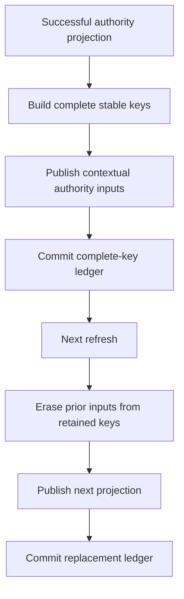

# RFC 0032: Stable Definition Routing Ledger Closure

## Summary

This RFC makes the active-definition authority session retain the complete
stable definition routing key for every published authority input. The ledger
stores `StableDefinitionQueryKey`, which contains both the owning `ModuleKey`
and the `DefinitionKey`, so a later refresh can erase every previously
published contextual input without searching the current module graph or
attempting to reverse a digest.

The change extends RFC 0030 `R30-12D` and the exact `R29-12AB` landing set to
include `active-definition-authority-session.h`. It replaces the current
ledger element type and every caller directly. It introduces no parallel
ledger, forwarding overload, fallback search, compatibility path, or internal
revision suffix.

## Motivation

RFC 0030 replaces `ContextualDefinitionKey` with a key whose payload is
`StableDefinitionQueryKey { module, definition }`. The active-definition
authority session currently retains only `DefinitionKey` values after
publishing authority inputs.

A refresh must erase every input published by the preceding successful
refresh. A definition that was removed, renamed, or moved is absent from the
new projection. Its `DefinitionKey` is a canonical digest and does not reveal
its former owning module. The session therefore cannot reconstruct the exact
stable routing key from its current ledger.

Recovering the module by scanning a new graph would be incorrect:

- removed modules and definitions may no longer be present;
- a moved definition may produce a different current owner than the owner of
  the input that must be erased;
- digest matching across active modules would add an ambient lookup path; and
- failed or cyclic graph construction could prevent cleanup of already
  published inputs.

The accepted RFC 0030 file partition also assigns the session source to
`R30-12D` but omits the header that owns the ledger type. Implementing the
correct contract within that file set is impossible. This RFC closes both
issues before contextual caller cutover resumes.

## Goals

- Retain the exact stable routing key used for every published authority input.
- Make refresh cleanup independent of the next module graph and projection.
- Preserve transaction atomicity for inputs, readiness, ledger state, and
  context-root state.
- Cover removal, rename, module removal, and cross-module movement.
- Add the session header to the exact `R30-12D` review scope and atomic
  `R29-12AB` landing set.
- Replace the ledger API and all callers in one transaction.

## Non-Goals

- This RFC does not change `DefinitionKey`, `ModuleKey`, or
  `StableDefinitionQueryKey` wire formats.
- This RFC does not change authority projection membership or ordering.
- This RFC does not add a reverse index from definition digests to modules.
- This RFC does not authorize graph scans, digest inversion, or best-effort
  cleanup.
- This RFC does not add a second ledger or retain the current ledger API.
- This RFC does not change the immutable implementation-series base.
- This RFC does not authorize any RFC 0029 runtime task after `R29-12AB`.

## Prior Art

Salsa queries are addressed by complete typed keys, and dependency validation
uses those keys rather than reconstructing missing key components from current
database contents. ZOM follows the same complete-key retention rule for
tracked input removal:
<https://salsa-rs.github.io/salsa/reference/algorithm.html>.

Bazel Skyframe models each node with a complete `SkyKey`; invalidation and
reevaluation operate on recorded graph keys and dependency edges. ZOM adopts
the same requirement that cleanup authority be retained when the value is
published:
<https://bazel.build/reference/skyframe>.

C++ associative containers define key-based erasure in terms of the complete
key accepted by the container. Retaining only a hash value cannot supply the
key-equivalence relation or distinguish values that require additional key
fields. ZOM applies that established container invariant to its typed input
database:
<https://eel.is/c++draft/associative.reqmts>.

These designs converge on one rule: a component responsible for later removal
retains the complete identity used for insertion.

## Guide-Level Explanation

After this RFC, a successful authority refresh records the exact stable key
used to publish each authority input:

```text
StableDefinitionQueryKey {
  module: ModuleKey,
  definition: DefinitionKey,
}
```

On the next refresh, the session combines each retained stable key with the
retained context roots and erases the exact contextual input. It does not need
the removed definition to appear in the new projection.



If publication fails, the input transaction does not commit and the session
retains the preceding ledger and context roots. A later attempt therefore
still has the exact keys required to clean up the preceding successful
projection.

## Reference-Level Design

### Ledger Type

`ActiveDefinitionAuthorityProjectionState` owns:

```text
zc::Vector<binder::StableDefinitionQueryKey> keyLedgerField;
```

Its public observation API is replaced by:

```text
zc::ArrayPtr<const binder::StableDefinitionQueryKey> keyLedger() const;
```

There is no overload returning `DefinitionKey`, no projected view, and no
adapter. Native callers compare the complete stable key.

The header includes the canonical stable Binder fact declaration directly. It
does not depend on a query-specific contextual-key declaration to obtain the
ledger element type.

### Key Construction

For every record in a verified
`ActiveDefinitionAuthorityProjection`, refresh constructs exactly one
`StableDefinitionQueryKey` from:

```text
module = authority.record().module()
definition = authority.key()
```

Construction uses the canonical `StableDefinitionQueryKey::from` factory.
That factory is intentionally total because a `DefinitionKey` digest cannot
independently prove module ownership. The session supplies the module from the
verified authority record rather than inferring it from iteration state.

The next ledger preserves the deterministic order of projection records. It
contains exactly one entry per authority record and no entries from a failed
attempt.

### Publication And Erasure

The same stable key instance shape drives both operations:

```text
set:
  ContextualDefinitionKey {
    contextRoots = next context roots,
    definition = next stable definition key,
  }

erase:
  ContextualDefinitionKey {
    contextRoots = retained prior context roots,
    definition = retained prior stable definition key,
  }
```

Every retained key is erased before any next key is set in the same input
transaction. The readiness contract remains unchanged: base mutation removes
readiness first, and refresh requires readiness absence before rebuilding the
projection.

Refresh performs no module-graph query to interpret the retained ledger. Graph
and inventory queries are used only to construct the next verified
projection.

### Transaction Atomicity

`keyLedgerField` and `contextRootsField` change only after the input
transaction commits successfully.

The following failures leave both fields unchanged:

- graph or SCC query failure;
- invalid or cyclic graph;
- inventory or identity reconstruction failure;
- input transaction creation failure;
- prior-key erase failure;
- next-key set failure;
- readiness set failure; or
- transaction commit failure.

The input database transaction remains responsible for atomic input changes.
The session fields remain the cleanup authority for the last successful
transaction.

### Removal And Movement Semantics

A refresh must erase a retained input when its definition:

- is removed from an otherwise active module;
- is renamed;
- belongs to a module removed from the active graph; or
- moves from one module to another.

For a move, the transaction erases the contextual key containing the retained
source module and sets a contextual key containing the destination module.
No current-graph search participates in the erase.

### RFC 0030 Scope Correction

RFC 0030 `R30-12D` owns exactly these authority files:

```text
products/zomlang/compiler/driver/query/binding/active-definition-authority-query.h
products/zomlang/compiler/driver/query/binding/active-definition-authority-query.cc
products/zomlang/compiler/driver/query/binding/active-definition-authority-session.h
products/zomlang/compiler/driver/query/binding/active-definition-authority-session.cc
products/zomlang/tests/unittests/compiler/driver/active-definition-authority-query-test.cc
products/zomlang/tests/unittests/compiler/driver/active-definition-authority-session-test.cc
```

The RFC 0030 exact `R29-12AB` landing set adds:

```text
products/zomlang/compiler/driver/query/binding/active-definition-authority-session.h
```

The newline-sorted landing allowlist must contain the same path. No other
source, test, gate, or build file is admitted by this correction.

### Architecture Gate

The Binder or compiler-session architecture gate rejects:

- a ledger whose element type is not `StableDefinitionQueryKey`;
- construction of a contextual definition key from a bare `DefinitionKey`;
- a refresh-time search for the owner of a retained definition;
- a second authority ledger;
- a compatibility overload or projected bare-key view; and
- omission of the session header from the exact landing allowlist.

The gate's mutation self-test must independently prove rejection of every
listed mutation: a bare-key ledger element, bare-key contextual construction,
a refresh-time owner search, a second authority ledger, a compatibility
overload or projected bare-key view, and omission of the session header from
the exact landing allowlist.

## Repository Impact

| Area | Paths | Owner |
|---|---|---|
| RFC authority | `docs/rfc/0030-stable-binding-foundation-verification.md`, `docs/rfc/0032-stable-definition-routing-ledger-closure.md`, `docs/rfc/tracking/0030-review-and-implementation.md`, `docs/rfc/tracking/0032-review-and-implementation.md`, `docs/rfc/README.md` | `rfc` |
| Authority session and contextual routing | `products/zomlang/compiler/driver/active-definition-authority-session.{h,cc}`, `products/zomlang/compiler/driver/active-definition-authority-query.{h,cc}`, `products/zomlang/compiler/driver/contextual-binding-key.{h,cc}` | `module-system` |
| Stable routing key | `products/zomlang/compiler/binder/stable-binding-facts.{h,cc}` | `binder-checker` |
| Native tests and gates | `products/zomlang/tests/unittests/compiler/driver/active-definition-authority-query-test.cc`, `products/zomlang/tests/unittests/compiler/driver/active-definition-authority-session-test.cc`, `products/zomlang/tests/coverage/rfc-0030-stable-binding-landing-files.txt`, `scripts/check-binder-architecture.py` | `verification` |

## Security And Safety Impact

This RFC adds no external input or runtime capability. Retaining complete
typed keys prevents stale authority inputs from surviving a refresh and
therefore prevents a removed definition from remaining addressable through
the query database. The ledger remains session-owned, value-based, and free of
raw pointers.

## Drawbacks And Risks

- Each ledger entry stores one additional `ModuleKey`. The memory cost is
  linear in the active definition count and is necessary cleanup authority.
- The session header gains a Binder stable-fact dependency. The dependency is
  one-way: the Binder fact unit remains independent of driver headers.
- The atomic landing set grows by one existing header. Exact scope and
  architecture gates constrain the change.
- Incorrect move tests could pass while leaving a source-module input
  published. Tests therefore probe both the removed source key and the added
  destination key.

## Alternatives Considered

### Reconstruct The Module From The Next Projection

The next projection cannot contain removed definitions or removed modules and
may contain a moved definition under a different module. It cannot identify
the input that was previously published.

### Retain A Separate Definition-To-Module Map

A parallel map duplicates the routing key, ordering, and lifetime contract.
The canonical stable key already contains the exact data required for
publication and erasure.

### Decode The Definition Digest

`DefinitionKey` is a digest with no reversible field encoding. Treating it as
an encoded record would violate its identity contract.

### Keep Bare Keys And Clear A Whole Input Family

The query database exposes typed key-level transactions, not an untracked
family-wide clear. Adding such an operation would enlarge the invalidation and
concurrency contract far beyond this correction.

## Compatibility And Rollout

The repository is pre-release. The ledger type and accessor are replaced
directly, and every production and test caller changes in the atomic
`R29-12AB` transaction. There is no migration API, dual representation,
deprecation period, or serialized-data conversion.

RFC 0032 lands first as a design-only acceptance transaction. The uncommitted
RFC 0030 implementation series then resumes at `R30-12C`; `R30-12D` performs
the complete authority cutover and cannot land independently. `R30-14`
verifies the corrected exact allowlist in an isolated clean worktree, and
`R30-15` commits and pushes the atomic implementation transaction.

Rollback of the design-only commit is a Git revert before implementation.
Rollback after `R29-12AB` requires reverting the complete atomic transaction.

## Documentation And Teaching Plan

RFC 0030, its tracker, RFC 0032, its tracker, and the RFC index are the only
design documents changed. The normative language specification is unaffected.
The source and tests teach the complete-key invariant through type signatures,
removal tests, and movement tests.

## Operational Readiness

This RFC adds no CLI, deployment, release, or observability surface. The
existing sanitizer build, unit tests, architecture gates, landing-scope gate,
and local/upstream/remote SHA parity checks are sufficient.

## Acceptance Criteria

- All required owners approve one unchanged proposal hash and one unchanged
  tracker hash.
- RFC 0030 and its tracker name the session header in `R30-12D` and the exact
  `R29-12AB` landing set.
- The session ledger stores and exposes only
  `StableDefinitionQueryKey`.
- Refresh erases prior inputs from retained complete keys without a
  current-graph owner search.
- Failed refresh attempts preserve the last successful ledger and context
  roots.
- Native tests prove removal, rename, module removal, cross-module movement,
  and failure atomicity.
- Architecture mutation tests reject bare-key storage, bare-key contextual
  construction, refresh-time owner search, a second authority ledger, a
  compatibility overload or projected bare-key view, and missing allowlist
  coverage.
- Focused sanitizer build and native tests pass.
- RFC, format, English-only, internal-versioning, architecture, landing-scope,
  and diff gates pass.
- The atomic `R29-12AB` staged path set equals the accepted exact allowlist.

## Implementation Plan

1. Review and accept RFC 0032 against exact proposal and tracker hashes.
2. Synchronize RFC 0030, its tracker, and the RFC index in the design-only
   acceptance transaction.
3. Resume `R30-12C` without landing implementation files.
4. In `R30-12D`, replace the authority-session ledger with complete stable
   routing keys and migrate every authority caller and test.
5. Extend the architecture gate and mutation self-test.
6. Add the session header to the newline-sorted landing allowlist.
7. Complete the remaining RFC 0030 bounded review slices.
8. Run isolated `R30-14` verification and land the single atomic
   `R29-12AB` transaction through `R30-15`.

## Test Plan

- Build:
  `PATH=/opt/homebrew/bin:$PATH cmake --preset sanitizer`;
  `PATH=/opt/homebrew/bin:$PATH cmake --build --preset sanitizer --target active-definition-authority-query-test active-definition-authority-session-test`.
- Unit tests:
  `PATH=/opt/homebrew/bin:$PATH ctest --preset default -R '^(active-definition-authority-query-test|active-definition-authority-session-test)$' --output-on-failure --no-tests=error`.
- Architecture:
  `python3 scripts/check-binder-architecture.py --check`;
  `python3 scripts/check-binder-architecture.py --self-test`.
- Landing scope:
  `python3 scripts/check-landing-scope.py --self-test`;
  the RFC 0030 worktree and index modes from RFC 0030 `R30-14`.
- Repository:
  `python3 scripts/check-rfc.py`;
  `python3 scripts/check-format.py`;
  `python3 scripts/check-no-internal-versioning.py`;
  `git diff --check`.
- Complete implementation transaction: the full RFC 0030 test plan.

## Open Questions

None

## Status History

| Date | Status | Notes |
|---|---|---|
| 2026-07-28 | DRAFT | Initial complete-key ledger proposal. |
| 2026-07-28 | REVIEW | Ready for complete-key, authority-session, governance, and verification review. |
| 2026-07-28 | ACCEPTED | All four required owners approved proposal SHA-256 `1d519846566992156b16986fc5c75602af403254fce70f48cfb65af9983a6d72` and tracker SHA-256 `b685d88db1e5c2eef13e97ede1e5c085959d2446e39fd07fe5baac0bf7b2ecbf`. Acceptance transaction `rfc0032-accept-20260728-1d519846` synchronizes RFC 0030, its tracker, RFC 0032, its tracker, and the RFC index without changing source or the immutable implementation-series base. |
