# RFC 0034: Stable Header Dependency Review Closure

## Summary

This RFC directly replaces RFC 0033's stable-header review sequence. It splits
header primitives, generic parameters, and callable parameters into separate
fact reviews. It then implements their codecs before either aggregate header
review so native tests can construct populated canonical parameter sequences
through the production `StableBindingSequenceBuilder<T>`.

Every review task retains the 400 changed-source-line cap and accumulates
without an intermediate commit or push. The exact `R29-12AB` landing set,
stable schemas, domains, tags, fields, and final atomic transaction remain
unchanged.

## Motivation

The first RFC 0033 `R30-12H-A` candidate has a 430-line net lower bound
against its approved predecessor before the required callable wrong-key
mutation is added. Additions plus deletions therefore cannot satisfy the
400-line cap. Formatting compression would make the code harder to review
without changing this semantic fact.

RFC 0033 also requires populated canonical parameter sequences in
`StableDefinitionHeader` and `StableImplementationOccurrenceHeader` tests
before the matching parameter codecs exist. The production sequence builder
orders complete elements by `StableBindingCodec<T>::encode`. Empty sequences
need no codec, but populated parameter sequences cannot be admitted until the
parameter codecs are implemented.

The review graph must expose both boundaries rather than relying on an
unbuildable test order.

## Goals

- Preserve the 400-line additions-plus-deletions cap for every review task.
- Give enums and the site sum, generic parameters, and callable parameters
  independent fact reviews.
- Implement primitive and parameter codecs before aggregate construction.
- Require populated aggregate sequences through the production builder.
- Split aggregate codecs into independently bounded reviews.
- Preserve one uncommitted cumulative tree and one final atomic landing.

## Non-Goals

- This RFC does not change any stable type, field, tag, domain, or invariant.
- This RFC does not change the schema inventory or its ownership columns.
- This RFC does not add a constructor or test-only path to canonical sequences.
- This RFC does not add a comparator independent of canonical encoding.
- This RFC does not change CMake, allowlists, the immutable base, or landing
  files.
- This RFC does not authorize an intermediate source commit or push.

## Prior Art

LLVM review guidance permits reviewers to request dependency-ordered,
independently reviewable patches:
<https://llvm.org/docs/CodeReview.html>.

LLVM contribution guidance requires isolated changes with focused unit tests:
<https://llvm.org/docs/Contributing.html>.

Git patch series record an explicit base and prerequisite order:
<https://git-scm.com/docs/git-format-patch#_base_tree_information>.

This RFC uses those review boundaries while preserving the accepted atomic
repository transaction.

## Guide-Level Explanation

The corrected review sequence is:

```mermaid
flowchart LR
    P["Enums and header site"] --> G["Generic parameter fact"]
    G --> C["Callable parameter fact"]
    C --> PC["Primitive and parameter codecs"]
    PC --> DH["Definition header fact"]
    DH --> DC["Definition header codec"]
    DC --> IH["Implementation header fact"]
    IH --> IC["Implementation header codec"]
    IC --> N["Next stable fact partition"]
    N --> L["Atomic R29-12AB landing"]
```



The codec review before the aggregates is not a compatibility path. It is the
only production admission mechanism for non-empty canonical sequences.

## Reference-Level Design

### Replacement Review Tasks

RFC 0030 tasks `R30-12H-A`, `R30-12H-B`, `R30-12H-C`, and `R30-12I` are
replaced by:

| Task | Exact Files | Entities And Evidence |
|---|---|---|
| `R30-12H-A1` | facts header, facts source, fact test | `DefinitionBodyDisposition`, `ImplementationSourceForm`, `ScopeRole`, and `StableHeaderSite`; every closed tag, unknown-value rejection, both site variants, clone, and inequality |
| `R30-12H-A2` | facts header, facts source, fact test | `StableHeaderGenericParameter`; key-record, owner-site, ordinal, clone, and inequality |
| `R30-12H-A3` | facts header, facts source, fact test | `StableHeaderCallableParameter`; key-record, definition site, exact position, receiver-name, ordinary-name, clone, and inequality |
| `R30-12I-A` | codec header, codec source, fact test | Closed enum, site, generic-parameter, and callable-parameter codecs; independent wire oracles and complete mutations |
| `R30-12H-B` | facts header, facts source, fact test | `StableDefinitionHeader`; populated production-built generic and callable sequences plus complete cross-field mutations |
| `R30-12I-B` | codec header, codec source, fact test | `StableDefinitionHeader` codec, wire oracle, sequence mutation, truncation, trailing-byte, and unknown-tag rejection |
| `R30-12H-C` | facts header, facts source, fact test | `StableImplementationOccurrenceHeader`; populated production-built generic sequence plus complete cross-field mutations |
| `R30-12I-C` | codec header, codec source, fact test | `StableImplementationOccurrenceHeader` codec, wire oracle, sequence mutation, truncation, trailing-byte, and unknown-tag rejection |

The facts files are:

```text
products/zomlang/compiler/binder/stable/stable-binding-facts.h
products/zomlang/compiler/binder/stable/stable-binding-facts.cc
products/zomlang/tests/unittests/compiler/binder/stable-binding-facts-test.cc
```

The codec files replace the first two paths with:

```text
products/zomlang/compiler/binder/stable/stable-binding-codec.h
products/zomlang/compiler/binder/stable/stable-binding-codec.cc
```

Every task counts additions plus deletions across all three exact files
against the exact approved predecessor hashes. Each total must not exceed 400.

### Dependency Order

The tasks form the strict cumulative order:

```text
R30-12G
  -> R30-12H-A1
  -> R30-12H-A2
  -> R30-12H-A3
  -> R30-12I-A
  -> R30-12H-B
  -> R30-12I-B
  -> R30-12H-C
  -> R30-12I-C
  -> R30-12J
```

No later review may use an unapproved predecessor. RFC 0035 inserts its
identity-owned implementation-record decoder after `R30-12H-C` and before
`R30-12I-C`; the remaining RFC 0034 order is unchanged.

### Sequence Construction

`R30-12I-A` implements the canonical encodings consumed by
`StableBindingSequenceBuilder<StableHeaderGenericParameter>` and
`StableBindingSequenceBuilder<StableHeaderCallableParameter>`.

Aggregate tests in `R30-12H-B` and `R30-12H-C` must:

- create at least one parameter through its admitted public factory;
- place it in a `zc::Vector<T>`;
- admit it through the production sequence builder;
- pass that populated sequence to the aggregate factory; and
- mutate every owner, site, ordinal, position, and aggregate cross-field
  relation independently.

No public constructor, friend expansion, fixture-only comparator, or empty
sequence substitutes for this evidence.

### Callable Parameter Invariant

The RFC 0033 callable invariant is retained unchanged:

- `Receiver` has no declared name;
- `Ordinary(ordinal)` has one declared name;
- retained position equals the identity record position;
- retained key equals the digest of the complete identity record; and
- the site is a definition authority site.

### Landing And Status

All review tasks accumulate into the existing uncommitted source tree. RFC
0030 `R30-15` remains the only source commit and push. RFC 0033 becomes
`SUPERSEDED` only in the synchronized RFC 0034 acceptance transaction. No RFC
0030 implementation row becomes complete through the design transaction.

## Repository Impact

| Area | Paths | Owner |
|---|---|---|
| RFC authority | RFCs 0030, 0033, 0034, their trackers, and the RFC index | `rfc` |
| Header facts | `stable-binding-facts.{h,cc}` | `binder-checker` |
| Header codecs | `stable-binding-codec.{h,cc}` | `binder-checker` |
| Native evidence | `stable-binding-facts-test.cc` | `verification` |

## Security And Safety Impact

The proposal adds no external input or runtime authority. Earlier codec
admission makes aggregate ownership evidence executable without exposing a
second ordering contract.

## Drawbacks And Risks

- More exact-hash reviews are required.
- Facts and codec reviews alternate, so reviewers must audit two cumulative
  predecessor tuples.
- RFC 0033 is superseded shortly after acceptance.

These costs are preferable to weakening line accounting or adding a
test-specific sequence path.

## Alternatives Considered

### Compress H-A Below The Limit

The lower bound already exceeds the cap before complete evidence. Dense
formatting would obscure review rather than define a smaller semantic unit.

### Add A Test-Only Sequence Constructor

That would bypass the production admission path and fail to prove canonical
ordering.

### Add A Pre-Codec Comparator

Canonical sequence order is defined by complete canonical bytes. A second
comparator would create an unnecessary independent contract.

### Keep All Header Codecs In One Task

The parameter codecs are a prerequisite for aggregates, while aggregate
codecs depend on those aggregates. One task cannot satisfy both directions.

## Compatibility And Rollout

There is no compatibility surface. RFC 0034 directly replaces RFC 0033's
review task graph. Source is still unpublished and lands only through the
existing atomic transaction.

## Documentation And Teaching Plan

RFC 0030 and its tracker will expose the corrected dependency graph. RFC 0033
and its tracker will record the superseding transaction. No language
specification or user documentation changes.

## Operational Readiness

Each review records exact predecessor and candidate SHA-256 tuples, exact-file
line accounting, owner decisions, and native evidence status. Existing
schema, format, English-only, internal-versioning, build, sanitizer, and
native-test gates remain mandatory.

## Acceptance Criteria

- RFC 0030 names the replacement dependency graph.
- RFC 0033 is marked `SUPERSEDED` by RFC 0034 during acceptance.
- Every replacement task retains the 400-line exact-file cap.
- Parameter codecs precede populated aggregate tests.
- No alternate canonical-sequence construction path exists.
- `R30-12J` depends on `R30-12I-C`.
- The immutable base, landing set, and atomic commit remain unchanged.
- All required owners approve one unchanged proposal and tracker hash.
- `python3 scripts/check-rfc.py` passes.

## Implementation Plan

1. Accept the design-only synchronization transaction.
2. Reshape the rejected cumulative source into `R30-12H-A1`.
3. Complete and approve each replacement task in strict dependency order.
4. Resume RFC 0030 at `R30-12J`.
5. Land all accumulated source only through RFC 0030 `R30-15`.

## Test Plan

- RFC structure: `python3 scripts/check-rfc.py`.
- Schema: `python3 scripts/check-stable-binding-schema.py --check`;
  `python3 scripts/check-stable-binding-schema.py --self-test`.
- Format: `python3 scripts/check-format.py`.
- Repository language: `python3 scripts/check-english-only.py --check
  --base-file products/zomlang/tests/coverage/implementation-series-base.txt`.
- Internal naming: `python3 scripts/check-no-internal-versioning.py --check`.
- Diff hygiene: `git diff --check`.
- Native evidence after source wiring: RFC 0030 Test Plan.

## Open Questions

None

## Status History

| Date | Status | Notes |
|---|---|---|
| 2026-07-28 | DRAFT | Initial proposal. |
| 2026-07-28 | REVIEW | Ready for exact-hash owner review. |
| 2026-07-28 | ACCEPTED | All required owners approved proposal SHA-256 `098023480fb5d84ef5c29b8e10151c687b896ac7d586f9217ee8370c6e966210`. Acceptance transaction `rfc0034-accept-20260728-09802348` supersedes RFC 0033, synchronizes RFC 0030 and all three trackers plus the RFC index, and changes no source, schema, immutable base, or atomic landing boundary. |
| 2026-07-28 | ACCEPTED | Transaction `rfc0035-accept-20260728-e79c292e` inserts the missing identity-owned implementation-record decoder between `R30-12H-C` and `R30-12I-C` without changing RFC 0034's fact and codec partitions. |
