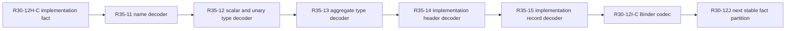

# RFC 0035: Canonical Implementation Identity Decoder Closure

## Summary

This RFC adds the missing identity-owned canonical decoders required to
reconstruct `ImplIdentityRecord`. Each canonical value owns its compositional
`decodeCanonical(CanonicalDecoder&)` operation, matching the established
identity-layer pattern. `ImplIdentityRecord::decodeCanonical(bytes)` remains
the self-contained authority boundary.

RFC 0030 `R30-12I-C` then consumes the identity decoder instead of duplicating
the implementation-header grammar in Binder. The decoder source, build
wiring, and native identity evidence join the existing atomic `R29-12AB`
landing set. No intermediate source commit or push is authorized.

## Motivation

`StableImplementationOccurrenceHeader` retains a complete
`ImplIdentityRecord`. Its canonical Binder codec therefore must reconstruct
that record. The current identity layer can encode `CanonicalNameReference`,
`CanonicalHeaderTypeSyntax`, `CanonicalGenericParameter`,
`CanonicalBoundObligation`, `CanonicalTraitReference`,
`ImplHeader`, and `ImplIdentityRecord`, but it exposes no decoder for
the implementation record or its recursive header grammar.

`DefinitionIdentityRecord::decodeCanonical` is not sufficient: implementation
records end with an inline `ImplHeader`, not a digest or framed byte
string. A Binder-local decoder would create a second owner for every nested
tag, field order, normalization rule, collection bound, and recursion limit.
It would also make RFC 0018's identity tracker claim that implementation
records have strict decoders inaccurate.

The dependency must be closed at the identity authority boundary before
`R30-12I-C` proceeds.

## Goals

- Add the complete identity-owned compositional decoder closure for the
  existing implementation identity grammar.
- Keep decoding with the canonical value that owns each wire grammar.
- Bound total bytes, sequence counts, and recursive type depth.
- Reject unknown tags, invalid booleans and option tags, non-canonical
  ordering, duplicates, truncation, trailing bytes, and oversized input.
- Require byte-for-byte canonical re-encoding before record admission.
- Partition source review into changes of at most 400 additions plus
  deletions from exact predecessor hashes.
- Preserve the immutable implementation base and the single atomic
  `R29-12AB` source landing.

## Non-Goals

- This RFC does not change RFC 0018 tags, fields, domains, or normalization.
- This RFC does not add a Binder-owned implementation identity decoder.
- This RFC does not decode `OverloadHeader`,
  `CanonicalCallableResult`, or `CanonicalCallableParameter`; they are not
  fields of `ImplIdentityRecord`.
- This RFC does not add compatibility paths, fallback parsing, alternate wire
  domains, or internal revision suffixes.
- This RFC does not authorize an intermediate source commit or push.

## Prior Art

Protocol Buffers bounds both message size and unmarshal recursion depth to
prevent resource exhaustion:
<https://protobuf.dev/programming-guides/proto-limits/>.

LLVM bitstream readers decode nested records through one format-owned reader
rather than requiring consumers to duplicate the grammar:
<https://llvm.org/docs/BitCodeFormat.html>.

Cap'n Proto applies both nesting-depth and total-traversal limits when reading
messages and requires safe handling of unknown enum values:
<https://capnproto.org/cxx.html>.

This RFC applies those established boundaries to the already accepted ZOM
canonical identity encoding.

## Guide-Level Explanation

The corrected dependency order is:



The Binder codec calls the identity record decoder. It does not interpret
header tags or reconstruct inner identity objects itself.

## Reference-Level Design

### Compositional Boundaries

The implementation-record closure gains compositional decoders on its
canonical value owners:

```cpp
static zc::Maybe<Value> decodeCanonical(CanonicalDecoder& decoder);
```

The owners are `CanonicalNameRoot`, `CanonicalNameReference`,
`CanonicalHeaderTypeSyntax`, `CanonicalGenericParameter`,
`CanonicalBoundObligation`, `CanonicalTraitReference`, and
`ImplHeader`. These operations decode inline values and do not
require the enclosing decoder to be finished.

`ImplIdentityRecord` gains:

```cpp
static zc::Maybe<ImplIdentityRecord> decodeCanonical(
    zc::ArrayPtr<const uint8_t> bytes);
```

This is the self-contained authority boundary. It requires non-empty input no
larger than 4 MiB, complete consumption, valid factories for every nested
record, and exact re-encoding equality with the input.

`CanonicalHeaderTypeSyntax` owns one private recursive helper with an explicit
remaining-depth argument. Its public decoder starts that budget at 100 and all
recursive type, named-type, object-member, and associated-binding paths pass
the decremented budget. The implementation lives in
`canonical-header-type-decode.cc`, separate from construction and encoding but
within the same identity module.

Every sequence count is bounded by the enclosing 4 MiB authority limit before
allocation. Recursive type decoding fails closed when the depth budget is
exhausted. The accepted depth limit is 100, matching the conservative C++ and
Java Protocol Buffers unmarshal boundary.

Factories remain the only constructors for decoded values. They enforce
closed tags, valid optional depth and mutability, legal trait roots, the
negative-unsafe prohibition, and existing normalization rules.

### Canonical Admission

Factory normalization can sort, deduplicate, flatten, or collapse some
collections. Therefore successful construction alone is not canonical
admission.

`ImplIdentityRecord::decodeCanonical` re-encodes the complete reconstructed
record and requires byte equality with the original input. This rejects:

- unsorted or duplicate obligations, unions, intersections, object members,
  dynamic markers, and associated bindings;
- singleton unions or intersections that canonical construction collapses;
- present-empty raises sets;
- non-canonical nested encodings that otherwise normalize to a valid value;
- trailing bytes.

### Review Partitions

The source accumulates without commits in this exact order:

| Task | Exact Files | Evidence |
|---|---|---|
| `R35-11` | `canonical-header-name.{h,cc}`, `canonical-header-name-test.cc` | canonical name root and reference decoder, fixed vectors, counts, tags, and truncation |
| `R35-12` | `canonical-header-type-decode.cc` | recursive depth core plus predefined, fixed/dynamic array, slice, optional, reference, raw pointer, and type-query grammar |
| `R35-13` | `canonical-header-type.h`, `canonical-header-type-decode.cc`, `canonical-header-type-test.cc`, identity CMake | named, function, union, intersection, object, tuple, associated projection, dynamic, subordinate aggregate records, all-variant round trips, normalization, counts, tags, truncation, and depth exhaustion |
| `R35-14` | `canonical-overload-header.{h,cc}`, `canonical-impl-header.{h,cc}`, `canonical-impl-header-test.cc` | generic parameter, bound obligation, trait reference, implementation header composition, round trips, ordering, count, polarity, safety, and truncation failures |
| `R35-15` | `definition-key.h`, `definition-key.cc`, `definition-key-test.cc` | complete implementation record decoder, exact vector, re-encode admission, count, ordering, truncation, trailing-byte, and oversize failures |

Each task counts additions plus deletions from exact approved predecessor
hashes across its exact files and permits at most 400 changed source lines.
`R35-12` is a code-review partition. `R35-11`, `R35-13`, `R35-14`, and
`R35-15` each compile and run their focused native tests before approval.

### RFC 0030 Dependency And Landing

RFC 0030 changes:

- `R30-12I-C` depends on both `R30-12H-C` and RFC 0035 `R35-15`;
- the exact `R29-12AB` landing set adds the affected name, type, overload,
  implementation-header, and definition-record identity sources and headers,
  identity CMake, and their four native identity tests;
- `R30-13` owns the corresponding exact landing allowlist and full native gate
  integration;
- `R30-15` remains the only source commit and push.

The immutable implementation-series base remains unchanged.

## Repository Impact

| Area | Paths | Owner |
|---|---|---|
| RFC authority | RFCs 0018, 0030, 0034, and 0035; affected trackers and RFC index | `rfc` |
| Identity decoder | `compiler/identity/canonical-header-name.{h,cc}`, `canonical-header-type.h`, `canonical-header-type-decode.cc`, `canonical-overload-header.{h,cc}`, `canonical-impl-header.{h,cc}`, `definition-key.{h,cc}`, identity CMake | `module-system` |
| Binder consumer | `stable-binding-codec.{h,cc}` | `binder-checker` |
| Native evidence | identity header and definition-key tests plus stable binding fact tests | `verification` |

## Security And Safety Impact

The decoder handles persistent canonical bytes and must fail closed. The
4 MiB total bound, bounded sequence allocations, depth limit, closed tags,
complete consumption, and exact re-encoding prevent memory-amplification,
stack-exhaustion, and alternate-encoding admission.

## Drawbacks And Risks

- The atomic landing set grows by identity-owned files.
- The `R35-12` review partition is not linked until `R35-13` completes the
  recursive decoder and wires its source.
- Exact re-encoding allocates a second bounded byte buffer during admission.

These costs are preferable to duplicate grammar ownership or unbounded
recursive decoding.

## Alternatives Considered

### Decode The Record In Binder

Rejected because Binder would own a second copy of the RFC 0018 grammar and
its security limits.

### Retain Opaque Implementation Record Bytes

Rejected because `StableImplementationOccurrenceHeader` validates module,
implementation digest, generic owner, and occurrence authority against the
complete typed record.

### Use Only Input Size As A Recursion Bound

Rejected because a small byte-per-node recursive encoding can still exhaust
the native stack before reaching the 4 MiB byte limit.

## Compatibility And Rollout

There is no compatibility surface. The decoder implements the current
unversioned canonical contract and every producer, consumer, oracle, and gate
lands in one transaction.

## Documentation And Teaching Plan

RFC 0018's tracker will no longer claim that implementation records already
have a strict decoder. RFC 0030 and RFC 0034 will expose the inserted identity
dependency. No language specification change is required.

## Operational Readiness

Every review records exact predecessor and candidate SHA-256 tuples and
changed-line totals. Native identity tests must pass before `R30-12I-C`
approval. The final clean-worktree validation runs the identity tests, Binder
tests, sanitizer build, complete CTest preset, architecture gates, formatting,
English-only, internal-versioning, and landing-scope gates.

## Acceptance Criteria

- One unchanged proposal and tracker snapshot is approved by all required
  owners.
- RFC 0018's decoder evidence is corrected truthfully.
- The recursive decoder has a 4 MiB record limit, bounded sequence counts, and
  a depth limit of 100.
- Every implementation-record field and all sixteen type variants have native
  round-trip evidence.
- Non-canonical normalization inputs, unknown tags, invalid option and bool
  values, hostile counts, depth exhaustion, truncation, trailing bytes, and
  oversize input fail closed.
- `R30-12I-C` consumes `ImplIdentityRecord::decodeCanonical` and contains no
  subordinate implementation-header grammar.
- Every source partition stays at or below 400 additions plus deletions.
- `R30-15` remains the only source commit and push.
- `python3 scripts/check-rfc.py` passes.

## Implementation Plan

1. Accept the design-only synchronization transaction.
2. Implement and approve `R35-11` through `R35-15` against exact predecessor
   hashes without a source commit.
3. Resume RFC 0030 at `R30-12I-C`.
4. Complete RFC 0030 through `R30-14`.
5. Land the expanded atomic `R29-12AB` set through `R30-15`.
6. Synchronize truthful RFC 0035 status only after native publication.

## Test Plan

- RFC structure: `python3 scripts/check-rfc.py`.
- Focused native identity:
  `PATH=/opt/homebrew/bin:$PATH ctest --preset default -R
  '^(canonical-header-name-test|canonical-header-type-test|canonical-impl-header-test|definition-key-test)$'
  --output-on-failure --no-tests=error`.
- Focused stable Binder: RFC 0030 `R30-13` test plan.
- Sanitizer build: `cmake --preset sanitizer`;
  `cmake --build --preset sanitizer`.
- Complete native: `ctest --preset default --output-on-failure`.
- Repository gates: RFC 0030 Test Plan.

## Open Questions

None

## Status History

| Date | Status | Notes |
|---|---|---|
| 2026-07-28 | DRAFT | Initial proposal. |
| 2026-07-28 | REVIEW | Ready for exact-hash owner review. |
| 2026-07-28 | ACCEPTED | All required owners approved proposal SHA-256 `e79c292e8d3aefcce76d32923e566bc625e49b9b67d8bd1968fbd4b9620ee6c8` and tracker SHA-256 `d50ec5efe5718d6eaa657463a348ac0956dd954174345d7b90c00d99d0f6ec9f`. Acceptance transaction `rfc0035-accept-20260728-e79c292e` corrects RFC 0018 decoder evidence, inserts the identity-owned prerequisite before RFC 0030 `R30-12I-C`, expands the atomic landing set, and changes no source, immutable base, or implementation status. |
