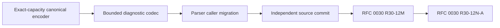

# RFC 0036: Bounded Diagnostic Fact Codec Closure

## Summary

This RFC replaces the process-wide diagnostic-fact count limit and unbounded
encoder with one explicit limits contract shared by encoding and decoding.
Every caller supplies its accepted fact count, complete encoded-byte limit,
and source-offset authority. Encoding validates canonical structure and
computes the complete size before allocating output. A resource-aware exact
capacity encoder makes that allocation boundary observable. Decoding rejects
impossible declared counts, never reserves from an untrusted count, and
requires exact canonical re-encoding.

The source diagnostic path retains its 4,096-fact policy explicitly.
RFC 0030 Binder results use the schema-owned 1,048,576-fact and 64 MiB limits.
No unbounded overload, duplicate Binder diagnostic grammar, compatibility
path, or alternate wire domain is introduced.

## Motivation

RFC 0030 `R30-12M` requires canonical `DiagnosticFact` sequences in
`BinderQueryResult<T>`. The stable-binding schema assigns
`DiagnosticFactsPerResult = 1,048,576` and
`DiagnosticPayloadBytes = 64 MiB`.

The live diagnostic decoder instead applies one private 4,096-fact limit to
every caller. A canonical Binder result with 4,097 facts is therefore rejected
despite satisfying the accepted schema. The live encoder also allocates and
copies the complete output before any caller can enforce the 64 MiB limit.
Binder cannot correct either defect without duplicating the diagnostic wire
authority.

The codec owner must expose one bounded admission operation before
`R30-12M` can proceed.

## Goals

- Make fact-count, complete-byte, and source-offset limits explicit codec
  inputs.
- Keep diagnostic validation, canonical ordering, and wire encoding owned by
  the diagnostics module.
- Prove the exact encoded size with checked arithmetic before output
  allocation or payload copy.
- Reject infeasible declared counts before result allocation and never reserve
  collection capacity from an untrusted count.
- Make output and result allocation behavior observable through the existing
  `zc::MemoryResource` abstraction.
- Preserve complete consumption and byte-identical canonical re-encoding.
- Admit 4,097 canonical facts under the Binder limits.
- Retain the source diagnostic 4,096-fact policy as an explicit caller
  contract.
- Replace every current caller in one source transaction.

## Non-Goals

- This RFC does not implement RFC 0027 `S6` Binder diagnostic enums,
  provenance identities, argument records, or diagnostic mappings.
- This RFC does not change the current diagnostic fact fields, ordering,
  domain, tags, or rendering behavior.
- This RFC does not change the stable-binding schema limits.
- This RFC does not add a second diagnostic encoder or decoder in Binder.
- This RFC does not add an unbounded convenience overload.
- This RFC does not change user-facing language diagnostics.
- This RFC does not replace the canonical primitive encoder or duplicate its
  fixed-width wire operations.

## Prior Art

Protocol Buffers `CodedInputStream` accepts an explicit total-byte limit and
applies nested byte limits before reads. Its documentation identifies bounded
reads as protection against memory exhaustion:
<https://protobuf.dev/reference/cpp/api-docs/google.protobuf.io.coded_stream/>.

Cap'n Proto readers apply traversal limits and recommend an overall message
size limit rather than allowing repeated reads to consume unbounded work:
<https://capnproto.org/encoding.html>.

Bincode 2 uses one configuration for serialization and deserialization and
applies the configured byte limit to both directions:
<https://docs.rs/bincode/2.0.0/bincode/config/index.html>.

ZOM follows the shared-limit design and additionally requires an exact
preflight size, a fixed-capacity canonical output mode, and declared-count
feasibility checks before collection growth.

## Guide-Level Explanation

Callers select the limits belonging to their query or record contract:

```cpp
DiagnosticFactCodecLimits limits{
    .maximumFacts = 1048576,
    .maximumEncodedBytes = 67108864,
    .maximumSourceByteOffset = UINT64_MAX,
};

auto bytes = encodeDiagnosticFacts(zc::none, facts, limits);
auto facts = decodeDiagnosticFacts(zc::none, encoded, limits);
```

Both operations either succeed under the same contract or return `zc::none`.
There is no process-wide fact-count policy hidden inside the decoder.

The dependency becomes:



## Reference-Level Design

### Public Limits Contract

`diagnostic-fact.h` declares:

```cpp
struct DiagnosticFactCodecLimits final {
  uint64_t maximumFacts;
  uint64_t maximumEncodedBytes;
  uint64_t maximumSourceByteOffset;
};

zc::Maybe<zc::Array<uint8_t>> encodeDiagnosticFacts(
    zc::Maybe<zc::MemoryResource&> outputResource,
    zc::ArrayPtr<const DiagnosticFact> facts,
    DiagnosticFactCodecLimits limits);

zc::Maybe<zc::Vector<DiagnosticFact>> decodeDiagnosticFacts(
    zc::Maybe<zc::MemoryResource&> resultResource,
    zc::ArrayPtr<const uint8_t> encoded,
    DiagnosticFactCodecLimits limits);
```

The existing overloads without `DiagnosticFactCodecLimits` are removed.
Every call site supplies all three limits and an explicit resource choice.
`zc::none` selects ordinary heap ownership. A supplied resource must outlive
the returned array or fact sequence and all of its nested resource-owned
values.

`maximumFacts` is the maximum sequence count.
`maximumEncodedBytes` is the maximum complete canonical payload, including
the domain and every count and length field.
`maximumSourceByteOffset` bounds primary, secondary, range, and fix-it
positions.

### Exact-Capacity Canonical Output

The identity-owned `CanonicalEncoder` gains exact-capacity construction for
ordinary heap storage and explicit `zc::MemoryResource` storage. The exact
mode:

- checks that the requested byte count is representable as `size_t`;
- allocates the byte vector at that exact capacity;
- rejects an append that would exceed the declared capacity;
- rejects `finish()` unless the emitted count equals the declared capacity;
  and
- retains the existing primitive encoding methods as the only fixed-width
  wire authority.

Existing general-purpose construction remains unchanged. The diagnostic
codec selects exact mode only after its complete preflight succeeds. Native
identity tests cover exact completion, underfill, overfill, resource
ownership, and zero leaked bytes.

### Bounded Encoding

Encoding uses two phases:

1. Validate every fact, nested count, text length, diagnostic code arity,
   source offset, canonical ordering relation, and duplicate occurrence
   ordinal. Accumulate the exact canonical byte count using
   `addition <= maximumEncodedBytes - accumulated`, after first proving
   `accumulated <= maximumEncodedBytes`.
2. Construct the identity-owned exact-capacity canonical encoder through
   `outputResource` and emit the canonical payload.

Phase one rejects when:

- the fact count exceeds `maximumFacts`;
- any nested count or field length exceeds its diagnostic contract;
- an offset exceeds `maximumSourceByteOffset`;
- the sequence is not in complete canonical order;
- a duplicate occurrence ordinal is missing, repeated, or discontinuous;
- any checked size operation overflows; or
- the complete size exceeds `maximumEncodedBytes`.

No output resource allocation, copied string payload, or copied nested
sequence is created before phase one succeeds. The input facts already belong
to the caller and are observed without cloning. A small configured
`maximumEncodedBytes` exercises the same subtraction-first branch used to
reject arithmetic overflow, so native tests do not require impossible
host-sized allocations.

### Bounded Decoding

Decoding rejects `encoded.size() > maximumEncodedBytes` before reading the
domain or allocating a result collection. It decodes the sequence count and,
before any result-resource allocation, rejects:

- `count > maximumFacts`;
- a count that is not representable as `size_t`; or
- `count > remainingCanonicalBytes / minimumCanonicalFactBytes`.

`minimumCanonicalFactBytes` is derived from the current diagnostic field
grammar and covered by a fixed native wire vector. The same division-based
feasibility rule applies to arguments, ranges, fix-its, and secondary facts
using each nested element's minimum canonical bytes. Division is used instead
of unchecked `count * minimumBytes`.

The result vector and every nested vector start without declared-count
capacity. Storage grows only after one complete element has decoded
successfully. Every nested byte string length is checked against both its
field limit and remaining bytes before copy. Therefore a short payload that
declares 1,048,576 facts performs no result-resource allocation, and no
declared collection count can amplify allocation independently of bytes
already consumed. The decoder enforces the same structural, arity, offset,
order, and ordinal rules as encoding. It requires complete input consumption.

The reconstructed sequence is encoded again with the same limits. Admission
requires byte equality with the input. Re-encoding uses `resultResource` only
for the temporary output and releases it before returning.

### Caller Contracts

Parser and canonical parsed-source callers use:

```text
maximumFacts = 4096
maximumEncodedBytes = 67108864
maximumSourceByteOffset = source byte length
```

RFC 0030 stable Binder result admission uses:

```text
maximumFacts = DiagnosticFactsPerResult = 1048576
maximumEncodedBytes = DiagnosticPayloadBytes = 67108864
maximumSourceByteOffset = UINT64_MAX
```

The Binder values retain private canonical-sequence construction. Their
builder calls the diagnostics-owned bounded encoder. Result decoding calls
the diagnostics-owned bounded decoder. Binder does not interpret diagnostic
fields or ordering.

The 64 MiB byte limit and the fact-count limit are independent ceilings. A
payload must satisfy both.

### Wire And Canonical Order

The diagnostic domain, field order, fixed-width count and length framing,
fact comparison order, duplicate occurrence ordinals, code arity rules, and
complete-consumption rule remain exactly as currently implemented.

This RFC changes admission limits and allocation order, not canonical bytes.

### Review And Landing Order

The implementation uses these bounded source partitions:

| Task | Exact Files | Maximum Changed Lines | Evidence |
|---|---|---:|---|
| `R36-11` | `canonical-encoder.{h,cc}`, `canonical-encoder-test.cc` | 400 | exact-capacity completion, underfill, overfill, resource ownership |
| `R36-12` | `diagnostic-fact.{h,cc}`, new `diagnostic-fact-codec-test.cc` | 400 | limits API, preflight, resource observations, 4,097 acceptance, count/byte/offset/order mutations |
| `R36-13` | `diagnostic-fact.{h,cc}`, `diagnostic-fact-codec-test.cc` | 400 from `R36-12` | bounded decoder, declared-count feasibility, all nested count boundaries, exact re-encoding |
| `R36-14` | `parse-source-query.cc`, `canonical-parsed-source.cc`, new `diagnostic-fact-caller-test.cc` | 400 | explicit source limits, 4,096 boundary, codec failure propagation |
| `R36-15` | no source change | 0 | clean detached worktree, exact allowlist, candidate tree SHA, sanitizer build, focused tests, diagnostic coverage, format, naming |
| `R36-16` | exact approved `R36-11` through `R36-14` allowlist | 0 | tested-tree identity, isolated-index Conventional Commit, baseline and local/upstream/remote SHA parity |
| `R36-17` | RFC 0030 `stable-binding-codec.{h,cc}` and `stable-binding-facts-test.cc` | 400 from the approved `R30-12L` predecessor | repaired `R30-12M`, Binder limit boundary, result wire mutations |

`R36-11` through `R36-16` form one independently buildable source
transaction. `R36-17` remains part of RFC 0030's cumulative atomic source
transaction. RFC 0030 `R30-12M` depends on the published `R36-16` source
commit.

## Repository Impact

| Area | Paths | Owner |
|---|---|---|
| RFC authority | RFCs 0029, 0030, 0036, their trackers, and the RFC index | `rfc` |
| Canonical output | `products/zomlang/compiler/identity/canonical-encoder.{h,cc}` | `module-system` |
| Diagnostic codec | `products/zomlang/compiler/diagnostics/diagnostic-fact.{h,cc}` | `error-system` |
| Parser callers | `products/zomlang/compiler/parser/parse-source-query.cc`, `canonical-parsed-source.cc` | `lexer-parser` |
| Stable Binder consumer | `products/zomlang/compiler/binder/stable-binding-codec.{h,cc}` | `binder-checker` |
| Native evidence | `canonical-encoder-test.cc`, new diagnostics `diagnostic-fact-codec-test.cc`, new parser `diagnostic-fact-caller-test.cc`, and stable-binding tests | `verification` |

## Security And Safety Impact

The change closes two denial-of-service surfaces. Encoded input cannot reserve
a collection from an untrusted declared count, and encoding cannot allocate
an output larger than the caller's complete-byte limit. Checked size
accumulation rejects integer overflow before allocation.

The design does not add raw pointers, unchecked casts, ambient global limits,
or exception-based recovery.

## Drawbacks And Risks

- Every caller must choose the correct limits; a wrong caller value becomes a
  visible contract defect.
- Exact preflight traverses each fact before emission, adding one linear pass.
- Exact re-encoding after decode adds another linear pass and one bounded
  payload allocation plus the encoder control object.
- A mistake in exact size accounting could reject valid payloads or violate
  the allocation boundary. Fixed wire vectors, resource observations, and
  size-oracle tests are required.

## Alternatives Considered

### Change the Binder schema limit to 4,096

This would make a private source-parser policy control every diagnostic query
and contradict the accepted result field limit.

### Add a Binder diagnostic decoder

This would create a second owner for diagnostic field validation, ordering,
and wire bytes.

### Encode and check the resulting size

This detects oversized output only after the allocation and copy that the
limit is intended to prevent.

### Apply one global limit

Source parsing and whole-module semantic collection have different accepted
cardinalities. Explicit caller limits preserve those contracts without
hidden policy.

## Compatibility And Rollout

The repository is unreleased and the codec is internal. The unbounded
function signatures are deleted, all callers are migrated in one commit, and
no alias or overload remains.

The canonical byte representation is unchanged. Existing valid source
payloads remain byte-identical when encoded under the explicit source limits.

Rollback requires reverting the diagnostic source commit and the RFC 0030
consumer change together. There is no persisted release contract.

## Documentation And Teaching Plan

- Record the explicit caller limits in this RFC and the affected RFC 0029 and
  RFC 0030 implementation trackers.
- Keep normative language specification chapters unchanged because this is a
  compiler-internal codec boundary.
- Report the limits in public Doxygen comments on the codec API.

## Operational Readiness

The diagnostic source commit must pass the sanitizer build, focused identity,
diagnostic, and parser tests, format, and diagnostic coverage gate before
push. The 4,097-fact Binder fixture must stay below 64 MiB and complete within
the normal unit-test timeout.

Immediately before `R36-15`, verification records the full accepted-governance
baseline SHA and creates a detached clean temporary worktree at that baseline
with a fresh build directory. An isolated index initialized from the baseline
stages only the exact approved `R36-11` through `R36-14` allowlist. That index
materializes the candidate into the temporary worktree and records its
`git write-tree` SHA.

Verification proves that tracked differences from the baseline plus untracked
paths equal the nine-path allowlist exactly. It then runs every `R36-15`
project-native gate inside that clean worktree. Unrelated RFC 0030 work and
the pending `query-types.{h,cc}` files are absent from both the candidate tree
and build inputs.

`R36-16` reconstructs the isolated index from the same baseline and exact
approved path hashes, records the staged name list, runs
`git diff --cached --check`, and proves its `git write-tree` SHA equals the
candidate tree SHA verified by `R36-15`. Only that identical tree may be
committed and pushed. Completion requires local `HEAD`, upstream tracking,
and remote branch SHA parity.

No runtime service, telemetry, release migration, or operator action is
required.

## Acceptance Criteria

- `DiagnosticFactCodecLimits` is the only limits authority accepted by both
  codec directions.
- No unbounded diagnostic-fact encode or decode overload remains.
- Exact-capacity canonical output is implemented by the identity-owned
  encoder rather than a diagnostic primitive-wire duplicate.
- Encoding rejects count, byte, offset, arity, ordering, ordinal, and integer
  overflow before output-resource allocation.
- Decoding rejects infeasible top-level and nested counts before allocation,
  and no result vector reserves from an untrusted declared count.
- Source callers explicitly preserve the 4,096-fact policy.
- A native diagnostic test admits 4,097 canonical facts under the Binder
  limits and rejects the same payload under the source limits.
- Native tests cover at-limit and one-over complete bytes; at-limit and
  one-over primary, secondary, range, and fix-it offsets; unknown code or
  arity; duplicate; reorder; truncation; trailing bytes; subtraction-first
  size rejection; exact re-encoding; and every nested declared-count
  feasibility boundary.
- A native hostile test declares exactly 1,048,576 facts with an empty or
  truncated body and observes zero result-resource allocation.
- RFC 0030 `R30-12M` uses the diagnostics-owned API and passes its result wire
  mutation matrix.
- All required owners approve exact proposal and tracker hashes.
- The source transaction records its baseline SHA, exact isolated-index
  allowlist, clean detached candidate worktree, fresh build directory,
  candidate tree SHA, staged diff check, tested-tree identity, ASCII-English
  Conventional Commit, and local, upstream, and remote SHA parity.

## Implementation Plan

1. Add and verify identity-owned exact-capacity canonical output.
2. Implement the explicit resource-aware limits API, checked preflight,
   bounded non-reserving decoder, and focused diagnostic codec evidence.
3. Replace parser and canonical parsed-source callers and run focused native
   tests.
4. Assemble, commit, and push the independently buildable source transaction
   from an isolated index and recorded baseline.
5. Rebase RFC 0030 `R30-12M` onto the published API.
6. Run stable-binding syntax, schema, mutation, format, and naming gates.
7. Resume RFC 0030 through RFC 0037 at `R30-12N-A`.

RFC 0037 acceptance transaction `rfc0037-accept-20260728-ed0b9170`
establishes the bounded module-skeleton review graph without changing the
approved bounded-diagnostic contract or implementation status.

## Test Plan

- Build: `cmake --preset sanitizer` and `cmake --build --preset sanitizer`.
- Unit tests: focused canonical-encoder, diagnostic codec, parse-source,
  canonical parsed-source, and stable-binding tests through CTest.
- Lit tests: `ctest --preset default -L lit` when parser source registration
  changes are present.
- Conformance: stable-binding schema check and self-test.
- Generated files: none.
- Format: `python3 scripts/check-format.py` and `git diff --check`.
- Repository gates: diagnostic coverage, English-only, internal-versioning,
  exact isolated-index landing scope, and local/upstream/remote SHA parity.

## Open Questions

None

## Status History

| Date | Status | Notes |
|---|---|---|
| 2026-07-28 | DRAFT | Initial dependency-closure design. |
| 2026-07-28 | REVIEW | Ready for diagnostics, parser, Binder, and verification review. |
| 2026-07-28 | ACCEPTED | Exact bounded-codec, allocation, candidate-tree, and publication contract approved by all required owners. |
