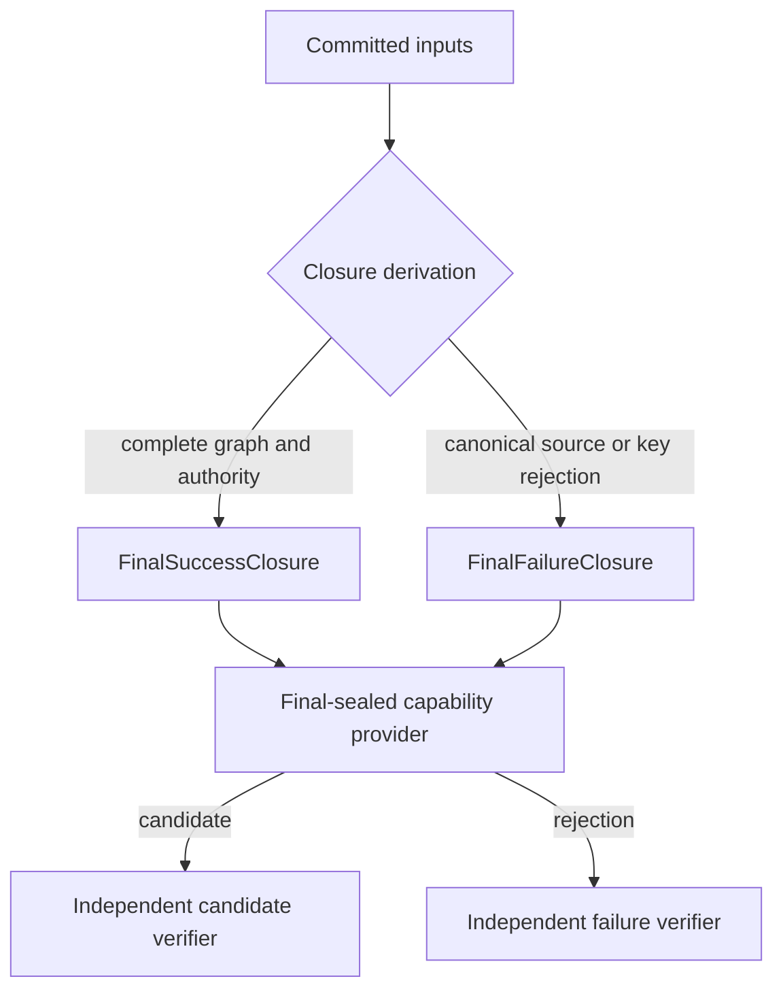

# RFC 0038: Final-Sealed Failure Projection Closure

## Summary

Define one verified failure-closure admission for final-sealed capability descriptors. A final-sealed demand publishes either a capability verified against a complete success snapshot or a closed rejection verified against a complete failure snapshot. The runtime must not expose a failure alternative that no final snapshot can admit.

## Motivation

RFC 0027 requires final-sealed named-item and owner-body capabilities to preserve source and key rejection projections. RFC 0028 requires the same descriptors to demand a final snapshot witness that contains a complete graph, SCC result, authority record, and readiness record. A source rejection invalidates that success witness before a final-sealed descriptor can demand it. The result is an unreachable production failure branch, incomplete mutation evidence, and an ownership-coverage failure in `named-item-query.cc`.

The runtime needs one complete rule that distinguishes a sealed successful compilation state from a sealed rejected compilation state. Both states must be deterministic, independently verified, and bound to the same compilation-root set. Neither state may use a testing override, an ambient registry, or a fallback authority.

## Goals

- Admit final-sealed source and key rejections only from canonical failure closures.
- Preserve independent producer and verifier reconstruction for success and rejection results.
- Make every declared final-sealed failure alternative production-reachable and mutation-testable.
- Keep success capabilities inaccessible from a rejected final snapshot.

## Non-Goals

- Change source diagnostics, parser recovery, or Binder failure payloads.
- Introduce a second query database, a compatibility API, or a test-only publication route.
- Permit partial capability values after an upstream rejection.

## Prior Art

- Rust compiler queries memoize demand-driven results, so queries are explicit cached computations rather than ambient state. ZOM copies the requirement that every result is keyed and independently reproducible. [Rust Compiler Development Guide](https://rustc-dev-guide.rust-lang.org/query.html)
- Rust canonical trait queries represent an answer as a closed result with a no-solution alternative. ZOM copies the closed-result discipline and does not encode a failure as an absent success value. [Rust Compiler Development Guide](https://rustc-dev-guide.rust-lang.org/traits/canonical-queries.html)
- Bazel Skyframe propagates an error through the graph even when dependent values are unavailable. ZOM copies eager, typed error propagation while requiring a stable witness for the complete rejection closure. [Bazel Skyframe StateMachine Guide](https://bazel.build/contribute/statemachine-guide)

## Guide-Level Explanation

A contributor demanding `NamedItemProvenanceQuery` from a final snapshot receives one of three outcomes: a verified capability, a verified source rejection, or a verified key rejection. A source rejection has the exact diagnostic facts produced by the selected source path. A key rejection has the exact Binder key failure. Neither outcome becomes a runtime invariant failure solely because the compilation snapshot contains a rejected input.

The contributor cannot construct either outcome manually. The runtime derives the closure from the committed inputs, verifies it independently, and retains the descriptor lease until the result is released.

## Reference-Level Design

`FinalSealedSnapshot` is replaced by one exhaustive admission state:

```text
FinalSnapshotClosure =
    FinalSuccessClosure {
      contextRoots: CompilationRootSetQueryKey,
      witness: Sha256Digest,
    }
  | FinalFailureClosure {
      contextRoots: CompilationRootSetQueryKey,
      failureRoot: FinalFailureRoot,
      witness: Sha256Digest,
    }
```

`FinalSuccessClosure` retains the complete graph, SCC, authority, and readiness validation already required by RFC 0028. `FinalFailureClosure` is produced only after the session transaction commits a canonical rejected root. Its `failureRoot` contains the descriptor-independent source or key failure root, the complete compilation-root key, the canonical selected-source or owner key, and the exact stable failure bytes. It contains no capability candidate, source buffer, AST handle, module inventory, or ambient filesystem path.

The failure witness is the SHA-256 digest of a domain-separated canonical encoding of the context roots, rejection tag, failure root, and all required upstream failure witnesses. The producer and verifier enumerate the same required inputs independently. A missing, additional, reordered, substituted, or undecodable witness rejects admission.



Each final-sealed descriptor declares the subset of `FinalFailureRoot` alternatives it can project. The descriptor provider may project only a failure root authorized by its descriptor metadata. The independent failure verifier re-demands the closure and compares the descriptor key, failure tag, canonical failure bytes, and closure witness. Any source rejection not named by the descriptor, any key mismatch, or any candidate demand from `FinalFailureClosure` is a runtime rejection.

`NamedItemProvenanceQuery`, `ModuleBodyProvenanceQuery`, `OwnerBodyProvenanceQuery`, and their retained materialization consumers use this admission. The implementation deletes failure branches that are not authorized by their descriptor-specific closure set. No descriptor may retain a declared but unreachable failure alternative.

## Repository Impact

| Area | Paths | Owner |
|---|---|---|
| Query runtime admission and final witness | `compiler/query/**`; `compiler/driver/module-graph-query-input.*` | module-system |
| Final-sealed descriptor providers and verifiers | `compiler/driver/named-item-query.*`; `compiler/driver/owner-body-query.*`; `compiler/driver/incremental-binding-query-adapter.*` | module-system |
| Native mutation and coverage gates | `tests/unittests/compiler/driver/**`; `tests/unittests/compiler/query/**`; `scripts/run-ownership-coverage.py`; `scripts/check-ownership-coverage.py` | verification |

## Security And Safety Impact

The proposal strengthens the capability boundary. A failure closure contains canonical bytes and digests only; it does not retain source buffers, AST nodes, raw pointers, filesystem capabilities, or mutable registries. Success-only leases cannot be published from a failure closure, and a failure closure cannot be reinterpreted as a success witness.

## Drawbacks And Risks

The closure model adds a second independently verified final state and expands mutation tests. A missing descriptor-specific authorization could accidentally suppress a valid failure projection. The implementation limits that risk with exhaustive descriptor metadata, canonical codecs, independent verifier reconstruction, and a mutation matrix for every tag and witness field.

## Alternatives Considered

- Keep source rejection branches reachable only before final sealing. This leaves a declared final-sealed failure surface that has no production evidence.
- Add a generic testing seam that injects a final failure. This weakens the production boundary and does not prove a session can derive the result.
- Relax final success sealing after a source failure. This permits a capability to depend on an incomplete graph or authority record.
- Add a coverage exemption. This hides the contract contradiction without making a failure result verifiable.

## Compatibility And Rollout

This is an internal direct replacement. The implementation replaces the final admission representation and migrates every producer, verifier, descriptor, test, and architecture check in one transaction. It deletes the previous final-admission path before landing the new one. No compatibility alias, dual registration, fallback witness, or mixed acceptance mode is permitted.

## Documentation And Teaching Plan

Update RFC 0027 and RFC 0028 after acceptance to name the exhaustive closure and its descriptor authorization rule. Update the query-runtime design documentation and the final-seal test guidance with success and failure closure examples.

## Operational Readiness

CI must run the final-seal mutation suite, ownership coverage, sanitizer CTest, and the incremental-query benchmark. The benchmark comparison remains valid only when its baseline metadata matches the executing machine, compiler, build cache, corpus, and worker count.

## Acceptance Criteria

- A final failure closure has one canonical codec and independently verified witness.
- Every final-sealed descriptor names an exhaustive allowed rejection set.
- Source and key rejection projections are production-reachable from committed session inputs.
- Candidate publication from a failure closure and failure publication from a success closure are rejected.
- Mutation tests cover every closure tag, key, witness field, failure byte sequence, and descriptor authorization set.
- `named-item-query.cc` satisfies the ownership-coverage threshold without an exemption.
- Sanitizer build, complete CTest, architecture gates, spec alignment, and a metadata-compatible performance comparison pass.

## Implementation Plan

1. Specify the canonical `FinalSnapshotClosure` codecs and descriptor authorization metadata.
2. Replace final-success witness admission with exhaustive success and failure closure derivation.
3. Migrate named-item, module-body, owner-body, materializer, Checker, HIR, MIR, and ownership consumers.
4. Delete unreachable failure paths and previous witness-only admission code.
5. Add independent verifier and mutation coverage, then rerun the RFC 0027 verification matrix.

## Test Plan

- Build: `cmake --preset sanitizer` and `cmake --build --preset sanitizer`.
- Unit tests: final-seal success and rejection closure producer/verifier tests, descriptor-specific projection tests, and lease teardown tests.
- Generated files: descriptor schema and core-library inventory checks.
- Coverage: `python3 scripts/run-ownership-coverage.py` and `python3 scripts/check-ownership-coverage.py`.
- Format: `python3 scripts/check-format.py` and `git diff --check`.

## Open Questions

- Which existing final-sealed descriptors require a source rejection closure rather than a key rejection closure?
- Should rejection closure derivation be one session input transaction or a distinct immutable query input family?

## Status History

| Date | Status | Notes |
|---|---|---|
| 2026-08-07 | DRAFT | Initial proposal for independently verified final failure projection. |
