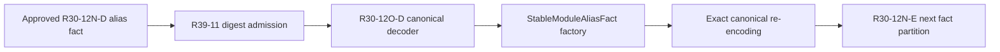

# RFC 0039: Export Surface Revision Admission Closure

## Summary

This RFC adds the missing Binder-owned admission operation that reconstructs
an `ExportSurfaceRevision` from an already decoded `Sha256Digest`.
`ExportSurfaceRevision::fromDigest` preserves the digest as an opaque revision
identity. It does not claim to validate the unavailable export-surface
preimage.

RFC 0030 `R30-12O-D` then uses the operation after canonical digest decoding
to reconstruct `StableModuleAliasFact`. The API, codec consumer, and native
evidence join the existing atomic `R29-12AB` landing set. No intermediate
source commit or push is authorized.

## Motivation

`StableModuleAliasFact` retains an `ExportSurfaceRevision`, so its accepted
canonical codec must reconstruct that value from the 32 digest bytes carried
by the stable fact wire format. The current public surface exposes
`digest()` and `computeFramed(...)`, while construction from a decoded digest
is private.

`computeFramed(...)` cannot perform reconstruction. It requires the semantic
context fingerprint, encoded module, encoded package, visible-entry encoding,
and export encoding whose hash produced the revision. Those preimages are not
fields of `StableModuleAliasFact` and cannot be recovered from a SHA-256
digest.

Binder layout access, a fabricated preimage, or duplicate storage would
weaken the revision identity contract. Source review therefore pauses after
the approved `R30-12N-D` candidate until the owning type exposes exact digest
admission.

## Goals

- Add one Binder-owned operation for exact digest-to-revision admission.
- Keep preimage derivation in `computeFramed(...)`.
- Make the absence of provenance verification explicit at the API boundary.
- Resume `R30-12O-D` without layout access, duplicated wire ownership, or a
  fallback path.
- Add the affected Binder metadata files to the existing atomic landing set.
- Preserve the immutable implementation base and `R30-15` as the only source
  commit and push.

## Non-Goals

- This RFC does not change the `ExportSurfaceRevision` domain, digest
  algorithm, preimage, or byte representation.
- This RFC does not make `fromDigest` verify that a corresponding export
  surface exists.
- This RFC does not add a general `ExportSurfaceRevision` wire codec.
- This RFC does not add equality, cloning, a compatibility API, or an
  alternate revision type.
- This RFC does not authorize the pending `query-types.{h,cc}` work.

## Prior Art

LLVM content-addressable storage distinguishes an opaque identifier from
loading and validating the object it identifies. `CASID` owns the hash
identifier, while object loading is a separate operation:
<https://llvm.org/docs/ContentAddressableStorage.html>.

Git object names likewise carry a content-derived hash identity, while object
validation recomputes the hash from separately available object content:
<https://git-scm.com/docs/user-manual>.

The repository already applies the same boundary to `MirRevisionId` and
`OwnershipEventOverlayRevision`: their `fromDigest` operations reconstruct
typed identities, while their producers separately compute the digest from
the complete canonical preimage.

## Guide-Level Explanation

The stable alias decoder reads exactly one canonical digest and passes it to
the type that owns the revision identity:

```cpp
auto revision = ExportSurfaceRevision::fromDigest(decodedDigest);
```

The returned value means "the export surface identified by this digest." It
does not mean "the export surface preimage was available and verified here."
Any operation that requires surface provenance must use the existing
authority that owns the surface and its preimage.



## Reference-Level Design

### Public API

`ExportSurfaceRevision` gains exactly:

```cpp
ZC_NODISCARD static ExportSurfaceRevision fromDigest(
    const identity::Sha256Digest& digest) noexcept;
```

The implementation directly invokes the existing private constructor. Every
32-byte `Sha256Digest` is a valid opaque revision identity, so the operation
is total and does not return `zc::Maybe`.

The existing `computeFramed(...)` operation remains the only producer that
derives a revision from the canonical export-surface preimage. `fromDigest`
does not call it and does not fabricate any preimage field.

### Stable Alias Decoding

`R30-12O-D` must:

1. decode one digest through `identity::CanonicalDecoder`;
2. construct the typed revision through
   `ExportSurfaceRevision::fromDigest`;
3. pass the revision to `StableModuleAliasFact::from`;
4. require complete input consumption; and
5. require the existing full-record canonical re-encoding admission.

The stable codec does not access the revision layout and does not own a second
revision grammar. Unknown bytes outside the fixed digest, truncation, trailing
bytes, invalid alias fields, and non-canonical enclosing records fail closed
through the existing S3 decoder contract.

### Source Review Partition

RFC 0030 gains one prerequisite source review:

| Task | Exact Files | Evidence |
|---|---|---|
| `R39-11` | `binding-metadata.{h,cc}`, `stable-binding-facts-test.cc` | typed digest admission, digest-preservation assertion, sanitizer-equivalent syntax compilation, and no preimage claim |

`R39-11` counts additions plus deletions from exact approved predecessor
hashes across all three files and permits at most 400 changed source lines.
The source remains cumulative and uncommitted. Because RFC 0030 does not
register `stable-binding-facts-test` until `R30-13`, `R39-11` approval uses
C++23 ASan and UBSan `-Werror` syntax compilation plus exact-hash review. The
test assertion becomes executable evidence only after `R30-13` wires the
target; `R30-14` must run it before atomic publication.

`R30-12O-D` then continues with its existing exact codec files and test file.
It must use only the accepted public operation.

### Dependency And Landing

The corrected dependency order is:

```text
R30-12N-D -> R39-11 -> R30-12O-D -> R30-12N-E
```

RFC 0030's exact `R29-12AB` landing set adds:

```text
zomlang/compiler/binder/metadata/binding-metadata.h
zomlang/compiler/binder/metadata/binding-metadata.cc
```

`stable-binding-facts-test.cc` is already in that set. RFC 0030 `R30-13`
updates the landing allowlist and architecture checks. `R30-15` remains the
only source commit and push.

## Repository Impact

| Area | Paths | Owner |
|---|---|---|
| RFC authority | RFCs 0030, 0037, and 0039, their trackers, and the RFC index | `rfc` |
| Revision identity | `zomlang/compiler/binder/binding-metadata.{h,cc}` | `binder-checker` |
| Stable codec consumer | `zomlang/compiler/binder/stable-binding-codec.{h,cc}` | `binder-checker` |
| Native evidence | `zomlang/tests/unittests/compiler/binder/stable-binding-facts-test.cc` | `verification` |
| Atomic landing gate | RFC 0030 allowlist and Binder architecture checks | `verification` |

## Security And Safety Impact

The operation admits only a fixed-size `Sha256Digest` value and performs no
allocation, parsing, or layout reinterpretation. It cannot establish preimage
provenance, and the API contract states that limitation. Canonical byte
length, enclosing structure, complete consumption, and re-encoding remain the
codec's responsibility.

## Drawbacks And Risks

- The atomic landing set grows by two Binder metadata files.
- A caller could confuse identity reconstruction with preimage verification
  if it ignores the API contract.

The narrow type-owned operation and native digest-preservation evidence keep
that distinction explicit.

## Alternatives Considered

### Recompute Through `computeFramed`

Rejected because the stable alias record does not contain the complete
canonical preimage and a digest cannot recover it.

### Decode Through Private Layout

Rejected because friendship, byte copying, or reinterpretation would couple
the stable codec to representation rather than the public value contract.

### Store Raw Digest Beside The Revision

Rejected because two authorities for one identity can diverge and would
change the accepted stable fact.

### Add A General Revision Codec

Rejected because `R30-12O-D` already owns the enclosing canonical grammar and
needs only typed admission from its decoded digest.

## Compatibility And Rollout

There is no compatibility surface. The API, its only current decoder consumer,
native evidence, allowlist, and architecture enforcement land in one atomic
source transaction. Rollback before `R30-15` discards the cumulative
candidate; rollback after publication reverts that single commit.

## Documentation And Teaching Plan

RFC 0030 and RFC 0037 record the inserted dependency and expanded landing
scope. No language specification or user-facing documentation changes.

## Operational Readiness

The change adds no runtime service, CLI option, persistence migration, or
release procedure. Exact-file review and sanitizer-equivalent syntax
compilation gate `R39-11`; executable native tests, the sanitizer build, and
RFC 0030 landing-scope gates remain mandatory after `R30-13` registration.

## Acceptance Criteria

- All required owners approve one unchanged proposal and tracker hash.
- `ExportSurfaceRevision::fromDigest` is the only new public operation.
- The implementation preserves the exact supplied digest.
- `R30-12O-D` depends on `R39-11` and uses no private-layout path.
- The two metadata files enter RFC 0030's exact atomic landing set and
  allowlist.
- No intermediate source commit or push occurs.
- RFC, English-only, internal-versioning, format, and diff gates pass.

## Implementation Plan

1. Accept and publish one synchronized design-only transaction.
2. Implement and independently review `R39-11` against exact predecessor
   hashes.
3. Resume and approve RFC 0030 `R30-12O-D`.
4. Continue the RFC 0037 dependency graph.
5. Land the cumulative source only through RFC 0030 `R30-15`.
6. Synchronize truthful RFC 0039 status after atomic publication.

## Test Plan

- Pre-registration source review: compile `binding-metadata.cc` and
  `stable-binding-facts-test.cc` in C++23 mode with the repository include
  paths, ASan and UBSan, `-Werror`, and `-fsyntax-only`; record exact candidate
  hashes and line accounting.
- Focused native test after RFC 0030 `R30-13` registration:
  `PATH=/opt/homebrew/bin:$PATH cmake --build --preset sanitizer --target stable-binding-facts-test`;
  `PATH=/opt/homebrew/bin:$PATH ctest --preset default -R '^stable-binding-facts-test$' --output-on-failure --no-tests=error`.
- RFC structure: `python3 scripts/check-rfc.py`.
- Schema: `python3 scripts/check-stable-binding-schema.py --check`;
  `python3 scripts/check-stable-binding-schema.py --self-test`.
- Format: `python3 scripts/check-format.py`.
- Repository language: `python3 scripts/check-english-only.py --check
  --base-file zomlang/tests/coverage/implementation-series-base.txt`.
- Internal naming: `python3 scripts/check-no-internal-versioning.py --check`.
- Diff hygiene: `git diff --check`.
- Final source evidence: RFC 0030 Test Plan.

## Open Questions

None

## Status History

| Date | Status | Notes |
|---|---|---|
| 2026-07-28 | DRAFT | Initial proposal written from the rejected R30-12O-D decoder boundary. |
| 2026-07-28 | REVIEW | Ready for exact-hash owner review. |
| 2026-07-28 | ACCEPTED | All required owners approved proposal SHA-256 `de7ab2aa3e571b39aa4c67a48ab32ca219c2f74241fc72dc4ae3c89ffc35cd1a` and tracker SHA-256 `253766beefaee323618cc9a589ea015258d19cba16a1cf5e285c39c23b8d7e8b`. Acceptance transaction `rfc0039-accept-20260728-de7ab2aa` inserts typed digest admission before `R30-12O-D` without changing source or implementation status. |
