# RFC 0041: Stable Owner Body Review Partition Closure

## Summary

This RFC partitions the RFC 0030 owner-body fact, codec, control-flow,
capture, and aggregate reviews into dependency-ordered tasks that each retain
the 400 additions-plus-deletions limit.

The stable records, fields, sum tags, domains, bounds, provider and verifier
responsibilities, landing allowlist, immutable implementation base, and final
atomic publication do not change. Every source task continues in the same
cumulative uncommitted tree and lands only through RFC 0030 `R30-15`.

## Motivation

RFC 0030 `R30-12R` combines nine move-only stable values, including eight
Pimpl facts, one closed sum, 39 fields, cross-owner admission, clone and
equality behavior, and native evidence in one 400-line review. A preflight
implementation reached 507 additions in the fact header and implementation
before any native test was added. The experiment was withdrawn completely,
and all three files were restored byte-for-byte to their approved
`R30-12Q-B` predecessors.

The following `R30-12T` task combines eleven more records and sums under the
same limit. `BoundOwnerBody` then stores fourteen canonical fact sequences,
so its value contract and exhaustive adversarial evidence also require
separate review budgets.

Dense macro compression would hide public contracts and factory relations.
Dropping tests would make the line limit pass without proving the values.
The review graph must instead expose coherent fact families and the real
aggregate dependency order.

## Goals

- Preserve the 400-line additions-plus-deletions cap for every review.
- Pair each fact family with its codec before a later family consumes it.
- Keep scope, binding, deferred-member, contextual-self, and shadow contracts
  independently reviewable.
- Separate label, control-transfer, closure, and explicit-capture contracts.
- Review `BoundOwnerBody` value construction before two bounded adversarial
  evidence tasks.
- Require exact approved predecessor and candidate SHA-256 tuples for every
  task.
- Preserve the single cumulative source tree and RFC 0030 atomic landing.

## Non-Goals

- This RFC does not change any stable record field, tag, domain, or bound.
- This RFC does not change Binder traversal, provider, verifier, query, or
  materialization semantics.
- This RFC does not add generated records, public unchecked constructors,
  fixture-only builders, compatibility paths, fallback behavior, or an
  internal version.
- This RFC does not change CMake, source registration, the landing allowlist,
  or the immutable implementation-series base.
- This RFC does not authorize an intermediate source commit or push.

## Prior Art

LLVM review guidance asks contributors to keep changes small and independently
reviewable: <https://llvm.org/docs/CodeReview.html>.

LLVM contribution guidance recommends isolated changes with focused tests:
<https://llvm.org/docs/Contributing.html>.

Git patch series preserve explicit prerequisite order and a stable base:
<https://git-scm.com/docs/git-format-patch#_base_tree_information>.

This RFC applies those established review practices to one atomic unpublished
source transaction.

## Guide-Level Explanation

Owner-body work proceeds by coherent fact families:

```mermaid
flowchart LR
    Q["Approved R30-12Q-B"] --> SA["Body scopes"]
    SA --> BR["Bindings and resolutions"]
    BR --> DM["Deferred members"]
    DM --> ST["Self and receiver"]
    ST --> SH["Shadow targets"]
    SH --> LB["Labels"]
    LB --> CT["Control transfers"]
    CT --> CL["Closures"]
    CL --> EC["Explicit captures"]
    EC --> OB["BoundOwnerBody value and evidence"]
    OB --> OC["BoundOwnerBody codec"]
    OC --> AL["Allocation plan"]
```



Each fact task owns admitted construction, move-only value behavior, accessors,
clone, equality, and local relation tests. Its matching codec task owns
canonical bytes, independent wire oracles, complete consumption, exact
re-encoding, and hostile mutation rejection.

## Reference-Level Design

### Scope And Resolution Partitions

| Task | Entities And Evidence |
|---|---|
| `R41-11A` | `StableBodyScopeFact` and `StableBodyNodeScopeFact`; owner, scope, parent, kind, path, clone, equality, and foreign-owner rejection |
| `R41-12A` | Matching scope codecs, independent wires, field and ownership mutations |
| `R41-11B` | `StableOwnerLocalBindingFact` and `StableResolutionFact`; exact local key fields, activation, scope, targets, namespace, origin, clone, equality, and owner rejection |
| `R41-12B` | Matching binding and resolution codecs with complete wire mutations |
| `R41-11C` | `StableDeferredMemberFact`; paths, access kind, member, non-empty namespace set, generic argument paths, clone, equality, and closed-enum rejection |
| `R41-12C` | Deferred-member codec with populated canonical sequences and complete wire mutations |
| `R41-11D` | `StableSelfOwner`, `StableSelfTypeFact`, and `StableThisBindingFact`; all closed variants, module routing, paths, receiver, clone, equality, and foreign-owner rejection |
| `R41-12D` | Matching self and receiver codecs with closed tags and complete wire mutations |
| `R41-11E` | `StableShadowTargetFact`; owner-routed binding and shadowed target, distinctness, clone, equality, and foreign-owner rejection |
| `R41-12E` | Shadow-target codec with complete target and ownership mutations |

### Control And Capture Partitions

| Task | Entities And Evidence |
|---|---|
| `R41-13A` | `StableLabelKey`, `StableLabelTarget`, and `StableLabelFact`; owner, declaration and statement paths, name, block and loop targets, clone, equality, and closed tags |
| `R41-14A` | Matching label codecs and complete wire mutations |
| `R41-13B` | `StableControlTarget` and `StableControlTransferFact`; explicit-label, loop, and match targets, transfer kind, owner, path, clone, equality, and relation rejection |
| `R41-14B` | Matching control codecs and complete wire mutations |
| `R41-13C` | `StableClosureFact`, `StableClosureFreeVariable`, and `StableClosureFreeVariableFact`; exact closure owner, scope, target, non-empty reference paths, canonical variable sequence, clone, equality, and owner rejection |
| `R41-14C` | Matching closure codecs with populated sequences and complete wire mutations |
| `R41-13D` | `StableExplicitCaptureMode`, `StableExplicitCaptureBindingFact`, and `StableExplicitClosureCaptureFact`; all closed modes, exact paths, targets, canonical capture sequence, clone, equality, and owner rejection |
| `R41-14D` | Matching explicit-capture codecs with closed tags, populated sequences, and complete wire mutations |

### Aggregate Partitions

| Task | Entities And Evidence |
|---|---|
| `R41-15F1` | Complete `BoundOwnerBody` Pimpl, admitted factory, local indexes and relations, all populated sequence accessors, clone, equality, and bounded smoke evidence |
| `R41-15F2A` | Aggregate-only structural evidence for scope graphs, node coverage, path uniqueness, binding and resolution references, labels, control targets, and closure/capture bijections |
| `R41-15F2B` | Aggregate-only ownership, sequence-accessor, canonical multiplicity, and accepted iterative scale evidence |
| `R41-16` | Complete `BoundOwnerBody` codec, independent aggregate oracle, sequence/count/field/ownership mutations, truncation, trailing bytes, and bounds |

`R41-15F2A` and `R41-15F2B` edit only
`stable-binding-facts-test.cc`. They may add production-facing fixtures and
assertions but no test-only constructor, alternate sequence builder, product
source, schema, or codec.

### Exact Files And Accounting

Every fact task edits exactly:

```text
products/zomlang/compiler/binder/stable-binding-facts.h
products/zomlang/compiler/binder/stable-binding-facts.cc
products/zomlang/tests/unittests/compiler/binder/stable-binding-facts-test.cc
```

Every codec task edits exactly:

```text
products/zomlang/compiler/binder/stable-binding-codec.h
products/zomlang/compiler/binder/stable-binding-codec.cc
products/zomlang/tests/unittests/compiler/binder/stable-binding-facts-test.cc
```

Each review records the exact approved predecessor tuple, candidate tuple, and
additions plus deletions across its exact files. The total must not exceed 400.
No task may use an unapproved predecessor.

### Dependency Order

The strict cumulative order is:

```text
R30-12Q-B
  -> R41-11A -> R41-12A
  -> R41-11B -> R41-12B
  -> R41-11C -> R41-12C
  -> R41-11D -> R41-12D
  -> R41-11E -> R41-12E
  -> R41-13A -> R41-14A
  -> R41-13B -> R41-14B
  -> R41-13C -> R41-14C
  -> R41-13D -> R41-14D
  -> R41-15F1 -> R41-15F2A -> R41-15F2B -> R41-16
  -> R30-12X
```

### Aggregate Admission

`R41-15F1` constructs at least one valid value of every component family
through its public factory, admits every canonical sequence through
`StableBindingSequenceBuilder<T>`, and passes all populated sequences to the
aggregate factory.

The aggregate factory enforces only relations derivable from its complete
inputs. It uses linear indexes and iterative graph validation. Provider and
verifier responsibilities remain those recorded by RFC 0027. The two
test-only evidence tasks prove every reachable aggregate branch, canonical
multiplicity precondition, all sequence accessors, foreign ownership, and one
reference-complete accepted scale case.

## Repository Impact

| Area | Paths | Owner |
|---|---|---|
| RFC authority | RFCs 0030, 0037, and 0041, their trackers, and the RFC index | `rfc` |
| Stable facts and aggregate | `stable-binding-facts.{h,cc}` | `binder-checker` |
| Stable codecs | `stable-binding-codec.{h,cc}` | `binder-checker` |
| Native evidence | `stable-binding-facts-test.cc` | `verification` |

## Security And Safety Impact

The proposal adds no runtime authority or external input. Smaller reviews make
owner routing, canonical count bounds, graph termination, and hostile wire
rejection independently auditable without weakening any constraint.

## Drawbacks And Risks

- The review graph contains more exact-hash transactions.
- Alternating fact and codec tasks requires careful predecessor accounting.
- Aggregate implementation follows task identifiers from another RFC.

These costs preserve readable contracts and complete evidence.

## Alternatives Considered

### Compress Entire Families With Dense Macros

Rejected because physical-line compression would conceal Pimpl lifecycle,
field ownership, factory admission, and equality contracts from reviewers.

### Reduce Native Evidence

Rejected because static syntax compilation cannot prove relation rejection,
canonical sequence admission, aggregate graph behavior, or wire mutations.

### Publish Intermediate Owner-Body Types

Rejected because the source is unpublished and RFC 0030 requires one atomic
foundation transaction. Intermediate commits would create incomplete internal
contracts.

### Change The Stable Schema

Rejected because the schema and RFC 0027 value model are already accepted.
Review size does not justify changing semantic records.

## Compatibility And Rollout

There is no compatibility surface. The RFC changes only the review graph for
unpublished cumulative source. Rollback before RFC 0030 `R30-15` discards the
cumulative candidate. Rollback after publication reverts the single atomic
source commit.

## Documentation And Teaching Plan

RFC 0030 and its tracker expose the partitioned dependency order. RFC 0041
records exact review ownership and evidence. No language specification or
user documentation changes.

## Operational Readiness

Every task runs schema validation, schema self-test, internal-versioning
checks, clang-format, strict C++23 ASan and UBSan syntax compilation, and exact
diff accounting. RFC 0030 `R30-13` later registers and executes the native
tests; `R30-14` runs the focused and complete clean-worktree gates before
publication.

## Acceptance Criteria

- RFC 0041 and its tracker pass `scripts/check-rfc.py`.
- `rfc`, `binder-checker`, and `verification` approve one exact unchanged
  review tuple.
- RFC 0030 and RFC 0037 dependency records point to the partitioned tasks.
- Every task retains the exact three-file boundary and 400-line cap.
- The source tree remains byte-identical to the approved `R30-12Q-B`
  predecessor when the design transaction is published.
- RFC 0030 `R30-15` remains the only source commit and push.

## Implementation Plan

1. Accept and publish RFC 0041 as a design-only transaction.
2. Execute `R41-11A` through `R41-16` in strict predecessor order.
3. Resume RFC 0030 at `R30-12X`.
4. Register and execute all native evidence at `R30-13` and `R30-14`.
5. Publish the atomic source transaction at `R30-15`.
6. Move RFC 0041 to `LANDED` only after SHA parity is proven.

## Test Plan

- Run `python3 scripts/check-rfc.py`.
- Run `python3 scripts/check-no-internal-versioning.py --check`.
- Run `python3 scripts/check-no-internal-versioning.py --self-test`.
- Run `python3 scripts/check-format.py` when source work resumes.
- For each fact and codec task, run strict project-flag C++23 ASan and UBSan
  syntax compilation and exact diff checks.
- At `R30-13`, run the registered Binder ztest target and schema/architecture
  gates.
- At `R30-14`, run focused and complete project-native gates in the isolated
  clean worktree.

## Open Questions

None

## Status History

| Date | Status | Notes |
|---|---|---|
| 2026-07-28 | DRAFT | Initial proposal written from the returned owner-body preflight. |
| 2026-07-28 | REVIEW | Ready for exact-hash owner review after restoring the approved predecessor. |
| 2026-07-28 | ACCEPTED | All required owners approved proposal SHA-256 `ad3efd803fa993daa12d427b401eeef224a4f48d9eaf214a99eeeead4d0b3855`, tracker SHA-256 `0d2601e633cb32e8942bfc11e5506ff61af487733af62eda41cf2efe24078de9`, RFC 0030 tracker SHA-256 `4820d5ea1d43a9f404e88db715375a8165936bec015e8061f66fac48c9a938fb`, RFC 0037 SHA-256 `f32dc9d8de584921f94121bf165e781100e60cf806e5475f2d8213b950058e00`, and RFC 0037 tracker SHA-256 `2b21628645997bbfb40e8df66a36678dc2b6423a91dfff9207a8894ddefc2b09`. Transaction `rfc0041-accept-20260728-ad3efd80` changes no source, schema, landing scope, or atomic publication boundary. |
