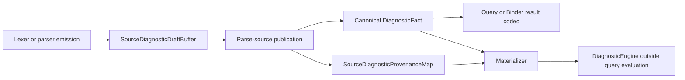

# RFC 0042: Canonical Diagnostic Fact Atomic Cutover

## Summary

This RFC replaces the source-relative diagnostic record and its
`zom.source-diagnostic-facts` wire with the single canonical diagnostic fact
model required by RFC 0017. The same atomic source transaction migrates every
producer, codec, query value, materializer, Binder consumer, native caller,
test, and coverage gate.

The cutover publishes only the currently executable source diagnostic
contract. It removes the old source record completely. RFC 0029 `R29-13B`
later replaces this contract with the Source-and-Module contract in the same
transaction that adds the live stable Binder producers. RFC 0025 `R25-09C`
later replaces that closed contract with its final `Source`, `Package`,
`BuildScript`, `Module`, and `CoreLibrary` contract when all five production
origins exist. No future variant or factory is reserved here.

The cutover breaks the dependency cycle by moving the complete current
source-wire replacement out of RFC 0025 `R25-09C` and into `R29-12D`.
RFC 0029 runtime work continues only after this transaction lands.

## Motivation

RFC 0030 assigns `R29-12D` an exact six-path landing set. Live inspection after
`R30-15` proved that set cannot implement its accepted result:

- `DiagnosticFact` is a source-relative aggregate with compiler source file
  names, compiler function names, byte offsets, ranges, and a source-only
  canonical domain.
- Its producers, codecs, query values, Binder result codec, materializer, and
  tests live outside the six-path set.
- Binder identity sites are owned above diagnostics. Making diagnostics include
  Binder headers would invert the dependency from Binder to diagnostics.
- Adding a second Binder payload or codec beside the source wire would create
  the compatibility architecture prohibited by repository policy.
- Static diagnostic coverage deliberately ignores references from diagnostics
  implementation files, so production factories alone cannot establish
  emission coverage.

The accepted R30-16 test matrix therefore cannot pass while preserving one
wire, correct layering, complete callers, and the exact set. The repository
must correct the transaction before product edits resume.

## Goals

- Replace the source-only fact and wire once, with every caller in the same
  commit.
- Separate revision-local source collection from immutable query-safe facts.
- Represent the currently produced occurrence identity, unresolved
  provenance, typed arguments, highlights, and child notes exactly.
- Remove the unimplemented Binder diagnostic inventory until its live producer
  transaction.
- Keep diagnostics independent of Binder implementation types.
- Retain one diagnostics-owned, explicit, allocation-safe codec-limits API.
- Make the Binder result codec admit only byte-identical canonical fact
  sequences.
- Preserve deterministic materialization without query demand or global
  emission inside providers.
- Correct the RFC 0025 and RFC 0029 dependency graph without adding an
  intermediate compatibility state.

## Non-Goals

- This RFC does not implement package, build-script, or core-library diagnostic
  publication before those producers are ready for the same atomic contract.
- This RFC does not implement or predeclare the stable Binder fact factories;
  RFC 0029 `R29-13B` lands each factory with its live provider and verifier.
- This RFC does not add a persistent format, public stability promise, decoder
  fallback, alias, adapter, feature flag, or internal revision suffix.
- This RFC does not retain raw C++ emitter file, function, line, or column
  values in semantic facts.
- This RFC does not let diagnostics include Binder-private headers or decode
  Binder-private records.

## Prior Art

Salsa treats diagnostics as values accumulated by memoized computations rather
than side effects. Repeated query demand can therefore return the same
diagnostic values without relying on whether a provider executed:
<https://salsa-rs.github.io/salsa/tutorial/accumulators.html>. ZOM adopts the
value boundary but uses explicit query results and independent verification
instead of a transitive accumulator.

Rust separates construction-time diagnostics from source mapping and rendered
output. Its diagnostics carry structured labels and suggestions while spans
are interpreted through the source map:
<https://github.com/rust-lang/rust/tree/master/compiler/rustc_errors>.
ZOM similarly separates a revision-local draft from an unresolved semantic
fact and a later materialized diagnostic.

Clang distinguishes stored diagnostics from `DiagnosticsEngine` emission and
uses source-manager-owned locations rather than compiler implementation
locations:
<https://clang.llvm.org/doxygen/classclang_1_1StoredDiagnostic.html>.
ZOM copies the separation of stored value, location resolution, and rendering,
while replacing raw source locations with stable provenance keys.

Swift serializes structured diagnostics separately from display and source
manager state:
<https://github.com/swiftlang/swift/tree/main/lib/Frontend/SerializedDiagnosticConsumer.cpp>.
ZOM follows the same producer-to-record-to-consumer direction and adds strict
canonical re-encoding for query equality.

## Guide-Level Explanation

Lexer and parser code emit into `SourceDiagnosticDraftBuffer`. A draft may
contain byte ranges because it is revision-local, never memoized, and has no
codec. At the parse query boundary, the provider combines the stable source
key with sorted drafts, assigns deterministic occurrence paths, and publishes
two values:

- canonical `DiagnosticFact` records; and
- the matching revision-local `SourceDiagnosticProvenanceMap`.

Existing Binder query results consume the canonical source facts through the
generic diagnostics codec. This transaction changes no Binder diagnostic
producer and declares no Binder-specific diagnostic type.



There is no route from a draft into a query value except the publication
factory, and there is no route from a fact to output except a matching
provenance resolver and the materializer.

## Reference-Level Design

### Revision-Local Draft

`SourceDiagnosticDraft` owns the data needed while lexing and parsing:

```text
phase
primary byte offset
canonical display arguments
ranges
secondary draft diagnostics
```

`SourceDiagnosticDraftBuffer` replaces `DiagnosticFactBuffer`. It owns parser
checkpoint, rollback, error-budget, and invariant behavior. It exposes no
canonical encoder, decoder, clone-for-query operation, stable source key, or
raw C++ emitter location in its returned value.

The admitted draft topology is exactly one primary diagnostic with zero or
more primary ranges and zero or more direct child notes. A child note must be
a source-syntax note with no ranges, children, or fix-it. No live source
producer uses the rejected forms. Any topology, foreign location, argument,
or range that cannot be retained makes source publication fail closed; it is
never omitted from an otherwise successful batch.

Draft canonicalization sorts by primary byte offset, phase, diagnostic code,
arguments, ranges, and secondary payload. Equal complete drafts retain
multiplicity. The index in that sorted sequence becomes the sole
phase-defined occurrence component. It is not an emission counter.

### Current Closed Canonical Model

The landed model is source-specific because source diagnostics are the only
live producer family in this transaction:

```text
SourceDiagnosticPhase =
  Lex = 0x01
  Parse = 0x02

SourceDiagnosticEmitter =
  Lexer = 0x01
  Parser = 0x02

DiagnosticOccurrenceKey {
  source: SourceFileKey
  phase: SourceDiagnosticPhase
  emitter: SourceDiagnosticEmitter
  occurrence: uint32
}

DiagnosticProvenanceKey {
  source: SourceFileKey
  phase: SourceDiagnosticPhase
  emitter: SourceDiagnosticEmitter
  occurrencePath: Sequence<uint32>
}

```

The phase and emitter must be `Lex/Lexer` or `Parse/Parser`. The occurrence is
the deterministic draft index after complete structural sorting. No type in
this transaction declares a Module, Binder, Package, BuildScript, CoreLibrary,
toolchain, or locationless alternative. The keys contain no byte range,
digest, `NodeId`, compiler source location, allocation identity, or worker
order.

`CanonicalDiagnosticArguments` is a canonical sequence of UTF-8 text values:

```text
DiagnosticArgument = Text(UTF-8)
```

Owned and borrowed input strings both become `Text`. The dead runtime token
argument branch is deleted in the same transaction. The argument codec bounds
each string, consumes the complete payload, and requires byte-identical
re-encoding. Code-specific arity is validated before publication and after
decoding.

`DiagnosticFact` contains:

```text
occurrence
diagnostic code
canonical argument record
primary DiagnosticProvenanceKey
ordered secondary records
```

Each `DiagnosticSecondary` contains a role, optional diagnostic code, a
provenance key, and optional canonical note arguments. The current closed
roles are:

```text
Highlight = 0x01
Note = 0x02
```

`Highlight` has no code or arguments. `Note` requires a source-syntax
diagnostic code. Every value is move-only and uses Pimpl where it owns a
variant or non-trivial invariant. Fix-it and replacement types are absent
because no live producer constructs them. `PreviousDeclaration` is introduced
later with the live stable Binder producer; it is not reserved here.

`DiagnosticSecondary` stores `DiagnosticProvenanceKey` directly; there is no
single-field location wrapper. Secondary order is exactly all highlights in
their original diagnostic range order followed by all child notes in their
original child order. Their assigned provenance paths are therefore strictly
increasing within each role and the role order is `Highlight`, then `Note`.

### Source Publication

The parse provider supplies the exact stable `SourceFileKey` and source length.
Publication:

1. validates every draft range against the source length;
2. sorts complete drafts;
3. assigns each draft a primary path `[draft-index, 0]`, each highlight a path
   `[draft-index, 1, range-index]`, and each note primary a path
   `[draft-index, 2, note-index]`;
4. creates one provenance entry for every primary, highlight, and note source
   location;
5. constructs facts using only those provenance keys;
6. validates code-specific argument arity;
7. canonicalizes secondary order; and
8. proves fact and provenance codec round trips with complete consumption and
   byte-identical re-encoding.

Every provenance-map value stores the exact byte range and whether it is a
token range. A primary point is represented by an equal start and end with the
token-range flag clear. Duplicate keys, foreign source keys, inverted or
out-of-source ranges, unknown slot tags, and ordinal gaps are rejected.

`CanonicalParsedSource` and `ParseRejected` retain both facts and provenance.
The verifier reconstructs both from source input and compares their canonical
bytes. It does not copy provider state.

### Current Binder Consumer Cutover

Existing `BinderQueryResult` values already carry source diagnostic facts.
Their generic container and result domains remain unchanged, but their
diagnostic payload is encoded and admitted only through the replacement
`zom.diagnostic-facts` codec and the explicit diagnostics-owned limits.
`StableBindingSequenceBuilder<DiagnosticFact>` requires a successful complete
encode, complete decode, semantic equality, and byte-identical re-encoding.

The schema inventory for unimplemented Binder diagnostic producers, emitters,
argument records, mappings, and `ZOM3028` is deleted in this transaction.
RFC 0029 `R29-13B` reintroduces only the alternatives used by its live provider
and verifier, together with their production factories, schema rows, native
tests, and static coverage.

### Canonical Wire And Limits

The sole fact-sequence domain is `zom.diagnostic-facts`. The source-only domain
is deleted. After the domain and RFC 0011 fact count, each fact encodes:

```text
occurrence(source, phase, emitter, occurrence)
diagnostic code
argument count and UTF-8 argument byte strings
primary provenance key
secondary count
each secondary(role, optional-code tag and value, provenance key,
               argument count and UTF-8 argument byte strings)
```

The source-provenance-map domain is
`zom.source-diagnostic-provenance`. After the domain and RFC 0011 entry count,
each entry encodes its provenance key, byte start, byte end, and canonical
Boolean token-range flag. Entries are strictly increasing by complete
canonical key bytes. Duplicate or reordered keys, non-canonical Booleans,
inverted ranges, ranges beyond the supplied source length, unknown phase or
emitter tags, path-shape drift, trailing bytes, and non-byte-identical
re-encoding are rejected. Publication additionally requires an exact bijection
between all primary and secondary keys in the fact sequence and all map keys;
no unreferenced map entry is admitted.

`DiagnosticFactCodecLimits` remains diagnostics-owned and contains:

```text
maximumFacts
maximumEncodedBytes
maximumProvenanceComponentsPerKey
maximumArgumentBytesPerRecord
maximumSecondaryPerFact
```

`DiagnosticProvenanceCodecLimits` contains:

```text
maximumEntries
maximumEncodedBytes
maximumProvenanceComponentsPerKey
maximumSourceByteOffset
```

Every maximum applies to the complete sequence or record named by its field.
The source caller uses fact limits `(4096, 64 MiB, 3, 64 MiB, 128)` and
provenance limits `(528384, 64 MiB, 3, source byte length)`. The current Binder
result caller uses fact limits `(1048576, 64 MiB, 3, 64 MiB, 128)` and no
provenance-map codec. Both encode and decode measure before allocation, reject
infeasible counts, consume the complete input, and require byte-identical
re-encoding.

### Materialization

`DiagnosticProvenanceResolver` resolves one key against the retained
revision-local capability that owns it. Source parse results provide a source
resolver over their provenance map. RFC 0029 `R29-13B` directly replaces this
source-only resolver contract when it adds the live identity-site producer.

Materialization returns:

```text
DiagnosticMaterializationResult =
  Resolved(ResolvedDiagnosticBatch)
  Failed(DiagnosticMaterializationFailure)

DiagnosticMaterializationFailure =
  MissingProvenance
  ForeignSource
  OutOfRange
  RoleMismatch
  ArgumentMismatch
```

`ResolvedDiagnosticBatch` owns every reconstructed `Diagnostic` and exposes no
mutation. Materialization first resolves and validates the entire batch,
including primary locations, token-versus-character highlights, and child
notes. It does not demand a query, touch `DiagnosticEngine`, or emit a partial
prefix. Only a complete `Resolved` batch can be moved into the one-shot
diagnostic-engine publication adapter.

For parse rejection, `CompilerSession` publishes the complete resolved source
batch and returns failure. For a successfully parsed source, it publishes the
complete warning batch and continues. Any materialization failure publishes no
source diagnostic, emits exactly one existing `ZOM9956 ModuleGraphInvariant`
with count `1`, and returns failure before parsed-module verification. This
precedence is identical for missing, foreign, out-of-range, role, and argument
failures.

### Dependency Correction

The corrected execution order is:


RFC 0030 `R30-16` is replaced by this RFC's implementation tracker. `R30-17`
closes with the RFC 0042 publication audit. RFC 0025 `R25-09C` no longer owns
the source-only record removal. RFC 0029 `R29-13B` first replaces the source
contract with its live Source-and-Module contract. RFC 0025 later replaces that
closed contract with the final five-origin contract and lands all newly
executable producers in one transaction.

## Repository Impact

| Area | Paths | Owner |
|---|---|---|
| RFC authority | RFCs 0017, 0025, 0027, 0029, 0030, 0031, 0036, and 0042; their trackers; RFC index | `rfc` |
| Canonical facts, drafts, codecs, and materialization | `products/zomlang/compiler/diagnostics/**` | `error-system` |
| Parse publication and independent reconstruction | `products/zomlang/compiler/parser/**` | `lexer-parser` |
| Source identity, query values, session materialization, and current callers | `products/zomlang/compiler/identity/**`; `products/zomlang/compiler/query/**`; `products/zomlang/compiler/driver/**` | `module-system` |
| Current Binder result codec consumers and removal of unimplemented diagnostic schema inventory | `products/zomlang/compiler/binder/**` | `binder-checker` |
| Native, fuzz, benchmark, coverage, architecture, CMake, and exact-scope gates | `products/zomlang/tests/**`; `scripts/check-stable-binding-schema.py`; `scripts/check-binder-architecture.py`; `scripts/check-incremental-query-architecture.py`; `scripts/check-compiler-session-architecture.py` | `verification` |

## Security And Safety Impact

The cutover removes compiler implementation locations from memoized values,
premeasures hostile payloads before allocation, bounds every count and nested
byte string, and requires complete canonical re-encoding. Pimpl and move-only
ownership prevent borrowed revision-local spans from entering semantic facts.
Provenance resolution fails closed on a missing or foreign retained capability.

## Drawbacks And Risks

- The atomic transaction touches several subsystems and many native fixtures.
  Bounded cumulative reviews and an exact landing allowlist limit accidental
  scope.
- Source diagnostics need a new provenance map beside facts. Independent
  reconstruction and mutation tests are required to prevent the map from
  becoming trusted provider state.
- RFC 0029 and RFC 0025 will replace this closed wire as their producers become
  executable. That cost is preferable to declaring unused variants or
  retaining parallel wires.
- Canonical sorting can change display order. Tests must assert the accepted
  semantic order rather than prior traversal order.

## Alternatives Considered

### Add A Binder Payload Beside The Source Record

This retains source-relative fields as one branch and creates a second Binder
wire. It does not satisfy the sole canonical fact contract.

### Make Diagnostics Depend On Binder

This lets factories consume `IdentitySyntaxSiteKey` directly but reverses the
existing Binder-to-diagnostics dependency and creates a target cycle.

### Move All Binder Syntax Keys Into Diagnostics

Those keys describe Binder identity and body structure, not diagnostic
ownership. Moving them would blur subsystem boundaries and expand the cutover
without improving the canonical fact contract.

### Wait For The Final Core Diagnostic Transaction

That keeps `R29-13B` blocked behind the core-library program and preserves the
dependency cycle between RFC 0025 and RFC 0029.

### Reserve Every Final Origin Now

Unused variants and emitters are forward-compatibility placeholders. The later
core transaction can directly replace the current closed sum when its
producers exist.

### Land Stable Binder Factories Before Their Providers

Factories referenced only by tests are dead production surface. RFC 0029
`R29-13B` lands the Module root, Binder and identity phase and emitter
alternatives, typed Binder arguments, five mappings, and `ZOM3028` with their
live provider and verifier instead.

## Compatibility And Rollout

The repository is unreleased. The source record, source domain, aggregate
initializers, caller APIs, codecs, fixtures, and oracles are deleted and
replaced in one commit. There is no decoder fallback or migration period.

Source review proceeds in bounded cumulative tasks in one uncommitted tree.
Only the final exact landing set is staged, verified in an isolated worktree,
committed, and pushed. Failure before publication withdraws the whole
candidate.

## Documentation And Teaching Plan

The acceptance transaction synchronizes RFCs 0017, 0025, 0027, 0029, 0030,
0031, 0036, their trackers, and the RFC index. Current-state design
documentation is updated only after the production cutover lands. No language
specification behavior changes.

## Operational Readiness

CI must discover the canonical fact, draft, source publication, materializer,
Binder result codec, and schema-removal tests plus the affected architecture
gates. Sanitizer and complete CTest verification run in an isolated worktree
before publication. The change adds no service, network, release, or
persistent-data operation.

## Acceptance Criteria

- Every required owner approves one unchanged proposal and tracker hash.
- The dependency graph contains no path from RFC 0042 back to `R29-13B` or
  RFC 0025 core production.
- The accepted landing set contains every live use of the removed source fact,
  buffer name, codec domain, and codec-limits field that requires an edit; the
  documented excluded references compile unchanged against the replacement.
- Only the live source identity, phase, emitter, provenance, argument, and
  secondary alternatives are declared.
- No diagnostics source includes a Binder header.
- No source-relative fact, parallel codec, alias, adapter, shim, fallback, or
  internal revision suffix remains.
- Source drafts cannot be encoded or stored in a query value.
- Source publication, provenance, argument, secondary, and materialization
  pass complete mutation matrices.
- The stable-binding schema and its gate contain no unimplemented diagnostic
  phase, emitter, argument, mapping, or code inventory.
- Binder result encoding, parse query reconstruction, materialization, and
  stable-binding schema gates pass.
- Isolated sanitizer build, full unit tests, full CTest, format, English-only,
  internal-versioning, RFC, and diff gates pass.
- Local, upstream, and remote SHA values are identical after publication.

## Implementation Plan

1. Review and accept this RFC plus synchronized dependency corrections.
2. Freeze the exact landing set below as a newline-sorted allowlist and prove
   it still covers the complete live-use census.
3. Implement canonical occurrence key, provenance key, argument, secondary,
   fact, codec, and source-provenance values.
4. Replace the source fact buffer with the revision-local draft buffer.
5. Migrate parse publication, independent reconstruction, and query values.
6. Remove the unimplemented Binder diagnostic schema inventory and its gate
   expectations.
7. Migrate the current Binder result codec, materialization, driver handoff, and every
   native, fuzz, and benchmark caller.
8. Add coverage and architecture mutations plus explicit CTest ownership.
9. Verify and stage only the exact set in an isolated worktree.
10. Commit and push the atomic cutover, then resume RFC 0029 at `R29-13A`.

### Exact Atomic Landing Set

The transaction owns exactly:

```text
products/zomlang/compiler/binder/parsed-module.cc
products/zomlang/compiler/binder/stable-binding-codec.h
products/zomlang/compiler/binder/stable-binding-schema.def
products/zomlang/compiler/diagnostics/CMakeLists.txt
products/zomlang/compiler/diagnostics/diagnostic-engine.cc
products/zomlang/compiler/diagnostics/diagnostic-fact-buffer.cc
products/zomlang/compiler/diagnostics/diagnostic-fact-buffer.h
products/zomlang/compiler/diagnostics/diagnostic-fact.cc
products/zomlang/compiler/diagnostics/diagnostic-fact.h
products/zomlang/compiler/diagnostics/diagnostic-materializer.cc
products/zomlang/compiler/diagnostics/diagnostic-materializer.h
products/zomlang/compiler/diagnostics/diagnostic.cc
products/zomlang/compiler/diagnostics/diagnostic.h
products/zomlang/compiler/diagnostics/in-flight-diagnostic.cc
products/zomlang/compiler/diagnostics/in-flight-diagnostic.h
products/zomlang/compiler/diagnostics/source-diagnostic-draft-buffer.cc
products/zomlang/compiler/diagnostics/source-diagnostic-draft-buffer.h
products/zomlang/compiler/driver/compiler-session.cc
products/zomlang/compiler/parser/canonical-parsed-source.cc
products/zomlang/compiler/parser/canonical-parsed-source.h
products/zomlang/compiler/parser/parse-source-query-verifier.cc
products/zomlang/compiler/parser/parse-source-query.cc
products/zomlang/compiler/parser/parse-source-query.h
products/zomlang/compiler/parser/parser-context.cc
products/zomlang/compiler/parser/parser-context.h
products/zomlang/compiler/parser/parser-impl.h
products/zomlang/compiler/parser/parser.cc
products/zomlang/compiler/parser/parser.h
products/zomlang/tests/benchmarks/compiler/parser-benchmark.cc
products/zomlang/tests/coverage/rfc-0042-canonical-diagnostic-landing-files.txt
products/zomlang/tests/fuzzing/parser-fuzzer.cc
products/zomlang/tests/unittests/compiler/ast/schema-verifier-test.cc
products/zomlang/tests/unittests/compiler/binder/binding-input-test.cc
products/zomlang/tests/unittests/compiler/binder/frozen-definition-inventory-test.cc
products/zomlang/tests/unittests/compiler/binder/module-body-syntax-test.cc
products/zomlang/tests/unittests/compiler/binder/module-dependency-requests-test.cc
products/zomlang/tests/unittests/compiler/binder/parsed-module-query-test-fixture.h
products/zomlang/tests/unittests/compiler/binder/stable-binding-facts-test.cc
products/zomlang/tests/unittests/compiler/diagnostics/diagnostic-fact-codec-test.cc
products/zomlang/tests/unittests/compiler/diagnostics/diagnostic-fact-test.cc
products/zomlang/tests/unittests/compiler/diagnostics/diagnostic-materializer-test.cc
products/zomlang/tests/unittests/compiler/diagnostics/in-flight-diagnostic-test.cc
products/zomlang/tests/unittests/compiler/diagnostics/source-diagnostic-draft-buffer-test.cc
products/zomlang/tests/unittests/compiler/driver/compiler-session-test.cc
products/zomlang/tests/unittests/compiler/driver/module-discovery-test.cc
products/zomlang/tests/unittests/compiler/driver/module-graph-query-input-test.cc
products/zomlang/tests/unittests/compiler/parser/diagnostic-fact-caller-test.cc
products/zomlang/tests/unittests/compiler/parser/parser-context-test.cc
products/zomlang/tests/unittests/compiler/parser/parser-test.cc
products/zomlang/tests/unittests/compiler/parser/recovery-test.cc
scripts/check-stable-binding-schema.py
```

The two `diagnostic-fact-buffer.*` paths are deleted and the two
`source-diagnostic-draft-buffer.*` paths are added in the same transaction.
The unused FixIt declarations and methods are deleted from `Diagnostic` and
`InFlightDiagnostic`; no replacement type remains. No diagnostic registry
changes: this source cutover adds no diagnostic code.
`stable-binding-schema.def` and its gate delete only unimplemented diagnostic
inventory; the live `BinderQueryResult<DiagnosticFact>` payload contract
remains.

The live-use census also finds generic or text-only references in
`stable-binding-codec.cc`, `stable-binding-facts.h`,
`checker-diagnostic-adapter.cc`, `signature-facts.{h,cc}`,
`diagnostic-engine.h`, `query-types.h`, `diagnostic-test.cc`,
`check-binder-architecture.py`, `check-diagnostic-coverage.py`, and
`check-impl-source-architecture.py`. They are intentionally outside the
landing set: their function signatures, generic containers, forward
declarations, text arguments, and static patterns remain valid after the
replacement. The implementation preflight repeats this census and rejects the
candidate if any excluded path requires a source edit.

## Test Plan

- Build: `cmake --preset sanitizer`; `cmake --build --preset sanitizer --clean-first`.
- Unit tests: canonical fact, draft buffer, source publication, parse query,
  Binder result codec, materializer, and affected compiler-session tests.
- Lit tests: `ctest --preset default -L lit --output-on-failure`.
- Complete tests: `ctest --preset default -L unittest --output-on-failure`;
  `ctest --preset default --output-on-failure`.
- Architecture: stable-binding-schema, Binder, incremental-query,
  compiler-session, landing-scope, English-only, and internal-versioning checks
  plus their self-tests where available.
- RFC: `python3 scripts/check-rfc.py`.
- Format: `python3 scripts/check-format.py`; `git diff --check`.

## Open Questions

None

## Status History

| Date | Status | Notes |
|---|---|---|
| 2026-07-28 | DRAFT | Initial replacement contract written after the R30-16 exact-set preflight failed. |
| 2026-07-28 | REVIEW | Ready for exact-hash owner review. |
| 2026-07-28 | ACCEPTED | All required owners approved proposal SHA-256 `1c46e978b91941c9660cf2bc8a37d89fc0a0b726b13c752c4eb8c7afed533491` and tracker SHA-256 `cac93b151aa985cd872cff03742397e7b8678e353f30e7fa15d182afef7c7cc2`; transaction `rfc0042-accept-20260728-1c46e978` authorizes the source-only atomic cutover. |
| 2026-07-29 | IMPLEMENTING | The accepted 51-path transaction was assembled and verified from baseline `e8be38e1eeba5a4ae40689321710af2d3fc8b24e`. |
| 2026-07-29 | LANDED | The atomic cutover was published as `58897c116cafe3463ec6a46ac3bbdd530ef991a5`; canonical formatting was completed as `02e400332fa87d8fca0bd7f2f5abb153bb776eb1`, which matched local HEAD, `origin/develop`, and remote `develop`. |
