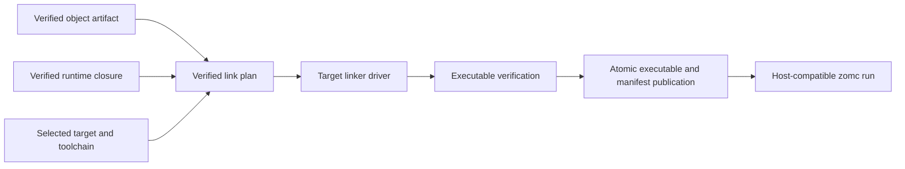

# RFC 0043: Platform Link And Executable Publication

## Summary

This RFC defines the post-object contract that turns one verified object artifact
and its verified runtime closure into one atomically published executable. It
adds an immutable link plan, a target-selected linker driver invocation, an
executable artifact manifest, and a host-compatibility rule for `zomc run`.
The first supported executable targets are Linux ELF and macOS Mach-O on
`x86_64` and `aarch64`.

The contract starts only after RFC 0021 has produced `VerifiedObjectArtifact`.
It does not define LIR, LLVM translation, object emission, source language
semantics, package resolution, or a general cross-platform runtime.

## Motivation

The compiler can select Linux ELF and macOS Mach-O target profiles, but it
cannot yet represent the deterministic set of objects, runtime artifacts,
linker arguments, and output destination needed to publish a runnable program.
Passing ad-hoc paths and ambient environment variables to a host linker would
make output depend on the current directory, search paths, and local toolchain
state. It would also blur the difference between producing a cross-target
executable and executing an executable for the host.

RFC 0021 deliberately stops at verified object emission. A separate contract
is needed to preserve its proof boundary while defining the next product-facing
stage. This RFC supplies that contract without authorizing backend work before
its dependencies and review gates are satisfied.

## Goals

- Define one private-construction, independently verified `LinkPlan` for a
  single executable target.
- Bind every link input to the exact target specification, object digest,
  runtime closure, toolchain identity, and output policy.
- Invoke a target-selected linker driver with an explicit argument vector and
  a sanitized environment.
- Publish an executable and its manifest atomically, or publish neither.
- Support Linux ELF and macOS Mach-O executable publication on `x86_64` and
  `aarch64` once their required object and runtime inputs exist.
- Permit `zomc run` only for a verified executable whose target is compatible
  with the current host.
- Make cross-target publication deterministic and never silently execute it.

## Non-Goals

- Defining LIR, LLVM IR translation, object emission, or object-file
  verification; RFC 0021 owns those stages.
- Adding Windows, COFF, WebAssembly, shared libraries, static libraries,
  dynamic loading, universal binaries, or remote execution.
- Discovering system libraries, accepting caller-provided raw linker flags,
  inheriting linker search paths, or supporting arbitrary linker scripts.
- Replacing the target authority, package resolver, runtime ABI, or diagnostic
  failure algebra owned by existing RFCs.
- Claiming that an executable can be emitted before the required verified
  object artifact and runtime closure exist.

## Prior Art

[Clang's toolchain documentation](https://clang.llvm.org/docs/Toolchain.html)
separates compilation, object production, and linking, and exposes a driver
mode that can show its command without running it. ZOM adopts the explicit
stage boundary and reproducible argument construction, but does not expose an
unbounded shell command or ambient tool search to user code.

[Rust target options](https://doc.rust-lang.org/stable/nightly-rustc/rustc_target/spec/struct.TargetOptions.html)
bind linker flavor, linker selection, and pre/post-link objects to a target
specification. ZOM likewise binds tool and runtime inputs to a selected target,
but begins with a closed two-format target set rather than a user-defined
target JSON surface.

[Rust code-generation options](https://doc.rust-lang.org/stable/rustc/codegen-options/)
distinguish linker flavors and self-contained linking. ZOM adopts the
distinction between a driver interface and a runtime closure, while requiring
the closure to be verified and recorded rather than inferred from host
defaults.

[LLD](https://lld.llvm.org/) provides format-specific ELF and Mach-O linkers.
ZOM uses a target-selected driver interface so the same verified plan can map
to the required platform linker flavor without treating ELF arguments as
Mach-O arguments.

The common pitfalls are accidental use of host libraries for a cross target,
non-reproducible output from inherited search paths, and executing a foreign
binary as if it were native. The closed target/runtime closure, sanitized
environment, and host-compatibility gate address these cases.

## Guide-Level Explanation

Once the prerequisite pipeline exists, `zomc compile app.zom --emit exe`
creates exactly one executable request. The compiler derives its object and
runtime inputs from the verified compilation session, constructs a link plan,
and invokes the selected linker without a shell. On success it atomically
publishes both `app` and `app.zom-artifact` in the requested output directory.

`zomc run app.zom` first performs the same verified publication. It launches
the result only when the selected target's operating system, architecture,
object format, and execution ABI match the host. A Linux target may be
published from macOS when a valid cross linker and runtime closure are
available, but `run` rejects that result instead of attempting emulation.



## Reference-Level Design

### Inputs And Link Plan

`ExecutableLinkRequest` is private to the final package compilation path. It
contains exactly one `VerifiedObjectArtifact`, one selected target authority,
one verified runtime closure, one package entry identity, and one normalized
output request. It has no public aggregate initializer and cannot be decoded
from CLI text or reconstructed from raw paths.

The request constructs `LinkPlan` only after an independent verifier proves:

1. the object target, object format, ABI manifest, and configuration key equal
   the selected target authority;
2. every runtime object and required system capability belongs to the same
   target, runtime ABI, and toolchain closure;
3. the entry object provides the sole selected package entry symbol;
4. object and runtime records are sorted by their complete canonical keys and
   contain no duplicate path, symbol, or role;
5. every file input is an already verified, immutable artifact with a recorded
   digest and byte count; and
6. the output path is normalized, is inside the requested output root, and
   uses `RejectExisting` publication semantics.

The verified plan stores the target specification identity, toolchain identity,
entry identity, ordered object records, ordered runtime records, normalized
linker argument records, output request, and a `LinkPlanId`. `LinkPlanId` is
SHA-256 over a domain-separated, length-framed encoding of those complete
records. It excludes host paths that are not part of an input artifact and
includes every target-visible argument in its canonical order.

The construction API is:

```text
planExecutable(
  request: Moved<ExecutableLinkRequest>,
  capability: Borrowed<const TargetRegistryCapability>,
) -> RFC0010::IrOperationResult<VerifiedLinkPlan>
```

Rejection consumes the request and publishes neither a plan nor a partial
executable. Input target, ABI, digest, or capability disagreement selects the
existing `InputRevisionMismatch` or `InvalidFact` result from RFC 0010's
`ObjectEmission` phase. A missing or additional closure record selects
`MissingRequiredFact` or `AdditionalFact`. A malformed order, encoding, or
digest selects `CanonicalCodecMismatch`. The proposal adds no failure branch
or diagnostic code.

### Linker Driver Invocation

The selected target authority names exactly one `LinkerDriver` alternative:
`ElfDriver` for Linux ELF or `MachODriver` for macOS Mach-O. The plan expands
that alternative to an ordered argument vector without invoking a shell,
performing glob expansion, interpreting response files, or reading user
configuration files. The driver program must be in the verified toolchain
closure and its executable digest must equal the planned record.

The process environment is constructed from an empty environment plus the
small target-owned set of variables recorded in the toolchain closure. `PATH`,
`LIBRARY_PATH`, `LD_LIBRARY_PATH`, `DYLD_LIBRARY_PATH`, `SDKROOT`, and linker
search variables from the parent process are not inherited. The working
directory is the normalized temporary output directory. No input path can be
resolved relative to the current directory.

The first implementation invokes the platform compiler driver rather than a
bare linker so that the target's startup objects and platform-required link
mode remain part of the recorded toolchain closure. The plan records no raw
user flags. An unrecognized driver result, nonzero exit status, missing output,
or output digest mismatch rejects the operation and removes all temporary
files. It does not publish a manifest or executable claim.

### Executable Verification And Publication

The linker result is accepted only when an independent executable verifier
checks the output format, machine architecture, entry symbol, required runtime
symbols, and absence of unresolved ZOM runtime references against the verified
link plan. The first supported checks are ELF and Mach-O only. The verifier
does not infer safety from a successful linker exit status.

`VerifiedExecutableArtifact` owns the normalized final destination, target
identity, executable digest, byte count, `LinkPlanId`, and the immutable
`ExecutableArtifactManifest`. The manifest is a canonical, domain-separated
encoding of that data plus the ordered input artifact digests and toolchain
identity. It is published beside the executable using the fixed suffix
`.zom-artifact`; the suffix is a product artifact name, not an internal
revision identifier.

Publication writes the executable and manifest to sibling temporary names in
the final directory, fsyncs each file, verifies both outputs, then renames the
manifest and executable into their final destinations. A failure removes all
temporary files and any output of the current request. Existing final paths
are never replaced. The driver reports the final path only after both rename
operations have completed.

The operation API is:

```text
linkExecutable(
  plan: Moved<VerifiedLinkPlan>,
  capability: Borrowed<const TargetRegistryCapability>,
) -> RFC0010::IrOperationResult<VerifiedExecutableArtifact>
```

The input plan is consumed on every branch. The result owns no repository
pointer, mutable session state, or borrowed toolchain handle.

### Host Execution

`zomc run` accepts only a newly produced `VerifiedExecutableArtifact`. It
compares the artifact target with a host execution profile constructed from the
same target registry authority. The operating system, CPU architecture, object
format, pointer width, and required execution ABI capabilities must all match.
Otherwise `run` reports the existing target-selection diagnostic and does not
spawn a process. It never falls back to emulation, Rosetta, QEMU, an ambient
interpreter, or a different executable.

Arguments are passed as an argument vector. The program inherits only the
explicit runtime environment authorized by the package execution request. The
run command reports the child exit status without reclassifying it as compiler
success or failure.

## Repository Impact

| Area | Paths | Owner |
|---|---|---|
| RFC governance | `docs/rfc/**` | rfc |
| Object-to-executable pipeline and CLI | `products/zomlang/compiler/lir/**`, `products/zomlang/compiler/backend/**`, `products/zomlang/compiler/ir/**`, `products/zomlang/utils/zomc/**`, `products/zomlang/compiler/CMakeLists.txt` | ir-backend |
| Package session, target capability, and artifact requests | `products/zomlang/compiler/driver/**`, `products/zomlang/compiler/identity/**` | module-system |
| Runtime closure and platform ABI records | `products/zomlang/runtime/**`, `products/zomcore/**`, `products/zomlang/compiler/ownership/**` | runtime-memory |
| Failure materialization | `products/zomlang/compiler/diagnostics/**` | error-system |
| Tests, architecture gates, and CI | `products/zomlang/tests/**`, `scripts/**`, `.github/workflows/**` | verification |

## Security And Safety Impact

Linking and execution cross a process and filesystem boundary. The plan avoids
shell injection by using argument vectors, prevents ambient library injection
by sanitizing the environment, verifies every input digest, rejects output
replacement, and records the selected toolchain identity. A cross-target
artifact is never executed solely because it was published successfully.

The initial platform matrix is intentionally closed. Unsupported object
formats and target profiles are rejected before tool invocation. Later support
requires a single replacement update of the target, verifier, tests, and
documentation; it must not add a permissive fallback path.

## Drawbacks And Risks

- Verified runtime closure requires more toolchain metadata than a direct
  invocation of `cc`, increasing initial implementation work.
- Atomic two-file publication must handle platform-specific rename and fsync
  details correctly.
- macOS SDK and linker availability differ across hosts, so the toolchain
  closure must be discovered and verified rather than assumed.
- The first target matrix intentionally excludes Windows and dynamic-linking
  product modes, which limits early user coverage.

## Alternatives Considered

Invoking `cc` with host-default arguments is rejected because it silently uses
host startup objects, libraries, and search paths for a cross target.

Calling a bare linker is rejected for the first implementation because startup
object and platform driver behavior would be unverified implicit inputs.

Publishing a raw executable path without a manifest is rejected because later
`run`, debugging, and distribution commands could not independently identify
its target, runtime closure, or producing plan.

Allowing `run` to attempt a foreign executable is rejected because a successful
link does not establish host executability.

## Compatibility And Rollout

This is a clean new post-object stage. The current `zomc run` rejection is
deleted only in the transaction that implements the verified executable path.
There is no compatibility flag, alternate command path, or legacy artifact
format. Existing `compile` behavior remains object-only until RFC 0021 and
this RFC are accepted and implemented.

The rollout order is target authority binding, runtime closure verifier, link
plan/verifier, driver invocation, executable verifier/publication, then the
host-compatible `run` cutover. Each stage deletes the superseded temporary
surface in the same change.

## Documentation And Teaching Plan

- Document executable outputs, target support, and host-only `run` behavior in
  the `zomc` user documentation.
- Add an IR design document after the production builder, independent verifier,
  publisher, and tests exist.
- Update the build and release documentation with Linux ELF and macOS Mach-O
  toolchain prerequisites after those platforms are implemented.
- Keep source-language specification unchanged because this RFC adds no syntax
  or semantic rule.

## Operational Readiness

CI must maintain native Linux and macOS lanes for each supported architecture
where available. Each lane records the selected toolchain identity and runs
the produced executable. Cross-target lanes publish artifacts and inspect them
without attempting execution. The compiler records structured linker stderr
only in the diagnostic payload, with output size limits and redaction of
unapproved host paths.

## Acceptance Criteria

- RFC 0016 is accepted and RFC 0021 reaches an accepted object-emission
  contract with an implementation pointer before any code from this RFC lands.
- Owners approve the complete Linux ELF and macOS Mach-O toolchain closure,
  driver argument, runtime artifact, and failure contracts.
- An independent verifier rejects every mutated target, digest, runtime,
  toolchain, argument, output-policy, and manifest record.
- Native Linux and macOS tests produce, inspect, and execute a minimal ZOM
  executable for each supported native architecture.
- Cross-target tests publish and inspect an artifact but prove `zomc run`
  rejects it before process creation.
- Linker failure, malformed executable, missing runtime input, and failed
  publication leave no final executable or manifest.
- Repeated equivalent builds produce byte-identical plans and manifests.
- Sanitizer, unit, lit, architecture, RFC, English-only, format, and full
  default CTest gates pass on all supported host lanes.

## Implementation Plan

1. Bind the accepted RFC 0016 target authority and RFC 0021 verified object
   artifact contract.
2. Implement verified runtime closure discovery and its independent verifier
   for the closed Linux ELF and macOS Mach-O matrix.
3. Implement canonical link-plan construction, independent verification, and
   mutation tests without invoking a linker.
4. Implement target-selected driver invocation and temporary-output cleanup.
5. Implement ELF and Mach-O executable inspection, manifest construction, and
   atomic publication.
6. Replace the current `zomc run` rejection with the host-compatibility-gated
   execution path and update documentation and CI.

## Test Plan

- Build: `cmake --preset sanitizer`; `cmake --build --preset sanitizer`.
- Unit tests: link-plan codec/verifier, runtime closure, linker invocation,
  executable verifier, publication cleanup, and host-execution admission.
- Lit tests: compiler target selection, linker failure diagnostics, executable
  output requests, and cross-target run rejection.
- Conformance: minimal Linux ELF and macOS Mach-O executable fixtures plus
  format-specific artifact inspection.
- Generated files: regenerate target and artifact test fixtures only through
  checked-in project tooling.
- Architecture: target registry, IR, compiler-session, package, ownership,
  English-only, and internal-versioning checks.
- Complete tests: `ctest --preset default --output-on-failure` on native host
  lanes.
- Format: `python3 scripts/check-format.py`; `git diff --check`.
- RFC: `python3 scripts/check-rfc.py`.

## Open Questions

- Which exact toolchain-discovery record can bind macOS SDK and Linux sysroot
  inputs without inheriting host search paths? Assigned to `ir-backend`,
  `module-system`, and `runtime-memory` before REVIEW.
- Which existing RFC 0010 failure detail rows cover linker process failures
  without adding a diagnostic family? Assigned to `error-system` before REVIEW.
- Which native architecture lanes are available for mandatory CI execution?
  Assigned to `verification` before REVIEW.

## Status History

| Date | Status | Notes |
|---|---|---|
| 2026-08-15 | DRAFT | Initial post-object link and executable-publication contract created from RFC 0021's explicit non-goal boundary. |
