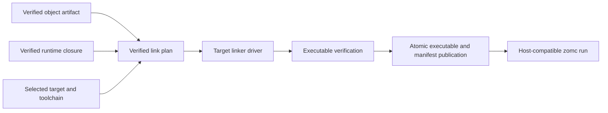

# RFC 0043: Platform Link And Executable Publication

## Summary

This RFC defines the post-object contract that turns one verified object artifact
and its verified runtime closure into one atomically published executable. It
adds an immutable link plan, a target-selected linker driver invocation, an
executable artifact manifest, and a host-compatibility rule for `zomc run`.
The first supported executable targets are Linux ELF and macOS Mach-O on
`x86_64` and `aarch64`.

The contract starts only after RFC 0021 has produced `VerifiedObjectArtifact`.
It does not define LIR, LLVM translation, object emission, source language
semantics, package resolution, or a general cross-platform runtime.

## Motivation

The compiler can select Linux ELF and macOS Mach-O target profiles, but it
cannot yet represent the deterministic set of objects, runtime artifacts,
linker arguments, and output destination needed to publish a runnable program.
Passing ad-hoc paths and ambient environment variables to a host linker would
make output depend on the current directory, search paths, and local toolchain
state. It would also blur the difference between producing a cross-target
executable and executing an executable for the host.

RFC 0021 deliberately stops at verified object emission. A separate contract
is needed to preserve its proof boundary while defining the next product-facing
stage. This RFC supplies that contract without authorizing backend work before
its dependencies and review gates are satisfied.

## Goals

- Define one private-construction, independently verified `LinkPlan` for a
  single executable target.
- Bind every link input to the exact target specification, object digest,
  runtime closure, toolchain identity, and output policy.
- Invoke a target-selected linker driver with an explicit argument vector and
  a sanitized environment.
- Publish an executable and its manifest atomically, or publish neither.
- Support Linux ELF and macOS Mach-O executable publication on `x86_64` and
  `aarch64` once their required object and runtime inputs exist.
- Permit `zomc run` only for a verified executable whose target is compatible
  with the current host.
- Make cross-target publication deterministic and never silently execute it.

## Non-Goals

- Defining LIR, LLVM IR translation, object emission, or object-file
  verification; RFC 0021 owns those stages.
- Adding Windows, COFF, WebAssembly, shared libraries, static libraries,
  dynamic loading, universal binaries, or remote execution.
- Discovering system libraries, accepting caller-provided raw linker flags,
  inheriting linker search paths, or supporting arbitrary linker scripts.
- Replacing the target authority, package resolver, runtime ABI, or diagnostic
  failure algebra owned by existing RFCs.
- Claiming that an executable can be emitted before the required verified
  object artifact and runtime closure exist.

## Prior Art

[Clang's toolchain documentation](https://clang.llvm.org/docs/Toolchain.html)
separates compilation, object production, and linking, and exposes a driver
mode that can show its command without running it. ZOM adopts the explicit
stage boundary and reproducible argument construction, but does not expose an
unbounded shell command or ambient tool search to user code.

[Rust target options](https://doc.rust-lang.org/stable/nightly-rustc/rustc_target/spec/struct.TargetOptions.html)
bind linker flavor, linker selection, and pre/post-link objects to a target
specification. ZOM likewise binds tool and runtime inputs to a selected target,
but begins with a closed two-format target set rather than a user-defined
target JSON surface.

[Rust code-generation options](https://doc.rust-lang.org/stable/rustc/codegen-options/)
distinguish linker flavors and self-contained linking. ZOM adopts the
distinction between a driver interface and a runtime closure, while requiring
the closure to be verified and recorded rather than inferred from host
defaults.

[LLD](https://lld.llvm.org/) provides format-specific ELF and Mach-O linkers.
ZOM uses a target-selected driver interface so the same verified plan can map
to the required platform linker flavor without treating ELF arguments as
Mach-O arguments.

[The Clang driver's `--sysroot` and macOS `-isysroot`](https://clang.llvm.org/docs/CommandGuide/clang.html)
locate a target root and SDK for headers, startup objects, and default
libraries instead of trusting host defaults. ZOM adopts an explicit sysroot and
SDK root, but records it in a verified closure and forbids the ambient
`SDKROOT`/search-path discovery Clang also permits.

[Rust's target sysroot and `cc`-crate linker discovery](https://rustc-dev-guide.rust-lang.org/backend/libs-and-metadata.html)
resolve the sysroot, startup objects, and a linker program per target. ZOM
copies the per-target binding of sysroot plus linker but pins those inputs to a
digest-verified closure rather than probing the environment for a compiler.

[Zig's bundled cross libc and sysroot model](https://ziglang.org/learn/overview/#zig-is-also-a-c-compiler)
ships a hermetic, reproducible set of libc, CRT, and headers per target so a
cross build never reads the host toolchain. ZOM keeps the hermetic, reproducible
goal and records every input digest, but does not vendor the platform SDK; it
binds an explicitly supplied, verified toolchain root.

The common pitfalls are accidental use of host libraries for a cross target,
non-reproducible output from inherited search paths, and executing a foreign
binary as if it were native. The closed target/runtime closure, sanitized
environment, and host-compatibility gate address these cases.

## Guide-Level Explanation

Once the prerequisite pipeline exists, `zomc compile app.zom --emit exe`
creates exactly one executable request. The compiler derives its object and
runtime inputs from the verified compilation session, constructs a link plan,
and invokes the selected linker without a shell. On success it atomically
publishes both `app` and `app.zom-artifact` in the requested output directory.

`zomc run app.zom` first performs the same verified publication. It launches
the result only when the selected target's operating system, architecture,
object format, and execution ABI match the host. A Linux target may be
published from macOS when a valid cross linker and runtime closure are
available, but `run` rejects that result instead of attempting emulation.



## Reference-Level Design

### Inputs And Link Plan

`ExecutableLinkRequest` is private to the final package compilation path. It
contains exactly one `VerifiedObjectArtifact`, one selected target authority,
one verified runtime closure, one package entry identity, and one normalized
output request. It has no public aggregate initializer and cannot be decoded
from CLI text or reconstructed from raw paths.

The request constructs `LinkPlan` only after an independent verifier proves:

1. the object target, object format, ABI manifest, and configuration key equal
   the selected target authority;
2. every runtime object and required system capability belongs to the same
   target, runtime ABI, and toolchain closure;
3. the entry object provides the sole selected package entry symbol;
4. object and runtime records are sorted by their complete canonical keys and
   contain no duplicate path, symbol, or role;
5. every file input is an already verified, immutable artifact with a recorded
   digest and byte count; and
6. the output path is normalized, is inside the requested output root, and
   uses `RejectExisting` publication semantics.

The verified plan stores the target specification identity, toolchain identity,
entry identity, ordered object records, ordered runtime records, output request,
and a `LinkPlanId`. `LinkPlanId` is SHA-256 over a domain-separated,
length-framed encoding of those complete records. It includes the normalized
output request and every recorded artifact path, while excluding ambient or
otherwise unrecorded host paths. The plan stores only closed structural
authorities; the target driver derives its canonical argument vector from those
fields. No raw or generic argument surface exists: there is no argument record
type, no argument sequence in the plan, and no argument bytes in the canonical
`LinkPlanId` preimage. A future target-selected link policy (for example a
static-versus-dynamic `LinkMode`, or a PIE policy) is introduced by an
authorized slice as its own closed structural field, validated with the
toolchain closure and folded into `LinkPlanId`; it is never revived as a generic
argument list.

The construction API is:

```text
planExecutable(
  request: Moved<ExecutableLinkRequest>,
  capability: Borrowed<const TargetRegistryCapability>,
) -> RFC0010::IrOperationResult<VerifiedLinkPlan>
```

Rejection consumes the request and publishes neither a plan nor a partial
executable. Link-plan construction runs in the new `LinkPlanConstruction` phase
defined under "Linker And Publication Failure Algebra" below. Input target,
ABI, digest, or capability disagreement selects `InputRevisionMismatch` or
`InvalidFact`. A missing or additional closure record selects
`MissingRequiredFact` or `AdditionalFact`. A malformed order, encoding, or
digest selects `CanonicalCodecMismatch`. A non-normalized or out-of-root output
path selects `OutputCreationFailed`. These are the RFC 0010 failure kinds
already defined for the object pipeline; this RFC reuses those kinds and binds
them to the new post-object phases it owns.

### Toolchain Discovery Record

The verified runtime closure and link plan bind their filesystem inputs through
one immutable `ToolchainClosure` record per selected target. The record is a
data contract only; this RFC defines its shape and provenance discipline, and
does not require object emission to exist to freeze that shape. It carries
exactly the following fields:

1. `targetSpecificationIdentity`: the RFC 0016 target specification identity the
   closure is bound to. A closure is valid for one target only.
2. `sysroot`: one normalized absolute target root directory. On Linux this is
   the sysroot; on macOS it is the SDK root supplied as the equivalent of
   Clang's `-isysroot`. The record never carries more than one root.
3. `linker`: one `LinkerDriver` alternative (`ElfDriver` or `MachODriver`), the
   normalized absolute path of the driver program, and that program's recorded
   executable digest and byte count.
4. `crtObjects`: the ordered, deduplicated set of startup and finalization
   objects the platform requires (for example the ELF `crt1`/`crti`/`crtn`
   family or the Mach-O equivalent), each as a normalized absolute path plus its
   recorded digest and byte count.
5. `defaultLibraries`: the ordered, deduplicated set of default system libraries
   the target link mode requires (for example the platform C runtime library),
   each recorded by canonical link name and, when linked from a fixed path
   inside `sysroot`, its digest and byte count.
6. `environment`: the small ordered set of target-owned environment variable
   name/value pairs that the driver invocation is permitted to see, and nothing
   else.

Every path field must be normalized, absolute, and contained inside `sysroot`
except the `linker` program, whose parent is recorded and pinned. The record is
sorted by its complete canonical keys, contains no duplicate path, role, or
symbol, and is folded into `LinkPlanId` through the same domain-separated,
length-framed encoding as the object and runtime records.

The closure is *supplied*, not *ambient*. It is provided explicitly through the
package compilation configuration (an explicit target-toolchain configuration
key), mirroring RFC 0016's `LLVM_DIR` discipline: RFC 0016 rejects an unset root
and forbids any `PATH`, `CMAKE_PREFIX_PATH`, environment-hint, package-registry,
or sibling-install fallback for the build-host LLVM package (RFC 0016 "LLVM
build and CI contract"). RFC 0043 applies the identical fail-closed rule to the
*target* toolchain: an unset or non-existent `sysroot`, an absent or
digest-mismatched `linker`, a missing required CRT object, or any attempt to
resolve an input through `PATH`, `SDKROOT`, `LIBRARY_PATH`, `LD_LIBRARY_PATH`,
`DYLD_LIBRARY_PATH`, or a linker search variable rejects closure construction
before any tool runs. There is no host-default probe and no ambient search;
discovery of the concrete root is a configuration responsibility outside the
verified compiler, exactly as CMake supplies `LLVM_DIR` today.

### Linker Driver Invocation

The selected target authority names exactly one `LinkerDriver` alternative:
`ElfDriver` for Linux ELF or `MachODriver` for macOS Mach-O. The plan expands
that alternative to an ordered argument vector without invoking a shell,
performing glob expansion, interpreting response files, or reading user
configuration files. The driver program must be in the verified toolchain
closure and its executable digest must equal the planned record.

The process environment is constructed from an empty environment plus the
small target-owned set of variables recorded in the toolchain closure. `PATH`,
`LIBRARY_PATH`, `LD_LIBRARY_PATH`, `DYLD_LIBRARY_PATH`, `SDKROOT`, and linker
search variables from the parent process are not inherited. The working
directory is the normalized temporary output directory. No input path can be
resolved relative to the current directory.

The first implementation invokes the platform compiler driver rather than a
bare linker so that the target's startup objects and platform-required link
mode remain part of the recorded toolchain closure. The plan records no raw
user flags. An unrecognized driver result, nonzero exit status, missing output,
or output digest mismatch rejects the operation and removes all temporary
files. It does not publish a manifest or executable claim.

### Executable Verification And Publication

The linker result is accepted only when an independent executable verifier
checks the output format, machine architecture, entry symbol, required runtime
symbols, and absence of unresolved ZOM runtime references against the verified
link plan. The first supported checks are ELF and Mach-O only. The verifier
does not infer safety from a successful linker exit status.

`VerifiedExecutableArtifact` owns the normalized final destination, target
identity, executable digest, byte count, `LinkPlanId`, and the immutable
`ExecutableArtifactManifest`. The manifest is a canonical, domain-separated
encoding of that data plus the ordered input artifact digests and toolchain
identity. It is published beside the executable using the fixed suffix
`.zom-artifact`; the suffix is a product artifact name, not an internal
revision identifier.

Publication writes the executable and manifest to sibling temporary names in
the final directory, fsyncs each file, verifies both outputs, then renames the
manifest and executable into their final destinations. A failure removes all
temporary files and any output of the current request. Existing final paths
are never replaced. The driver reports the final path only after both rename
operations have completed.

The operation API is:

```text
linkExecutable(
  plan: Moved<VerifiedLinkPlan>,
  capability: Borrowed<const TargetRegistryCapability>,
) -> RFC0010::IrOperationResult<VerifiedExecutableArtifact>
```

The input plan is consumed on every branch. The result owns no repository
pointer, mutable session state, or borrowed toolchain handle.

### Host Execution

`zomc run` accepts only a newly produced `VerifiedExecutableArtifact`. It
compares the artifact target with a host execution profile constructed from the
same target registry authority. The operating system, CPU architecture, object
format, pointer width, and required execution ABI capabilities must all match.
Otherwise `run` reports the existing target-selection diagnostic and does not
spawn a process. It never falls back to emulation, Rosetta, QEMU, an ambient
interpreter, or a different executable.

Arguments are passed as an argument vector. The program inherits only the
explicit runtime environment authorized by the package execution request. The
run command reports the child exit status without reclassifying it as compiler
success or failure.

### Linker And Publication Failure Algebra

RFC 0010's `IrFailurePhase` is a closed enum whose tags run `0x01` through
`0x10` and end at `ObjectEmission` and `FeatureBoundaryVerification`; its
`BackendOperation` enum ends at `EmitObject`, and its only object-stage
capability kind is `OutputCreationFailed`, defined as failure to create the
requested object output (RFC 0010 "IrFailurePhase"/"BackendOperation" and the
`ObjectEmission` failure row). None of those rows models a linker subprocess,
so no accepted upstream row covers a linker-process failure today.

RFC 0043 owns extending the failure algebra. Extending an accepted internal
contract by a new RFC is the sanctioned pattern: RFC 0010 states that new
stages register their own phases and rows rather than overloading unrelated
ones, and reserves `FeatureBoundaryVerification` as the *only* source-rejecting
seam so every other stage keeps using `IrOperationResult`. RFC 0043 stays inside
`IrOperationResult` and adds three closed phases at the next free tags,
`LinkPlanConstruction`, `LinkerInvocation`, and `ExecutablePublication`,
extending the tag range to `0x13`. It adds no new `IrFailureKind` and no new
diagnostic family; it reuses the existing kinds bound to new phases, and adds
one `BackendOperation` alternative `InvokeLinker` (tag `0x0b`) so a linker
subprocess failure carries a `Backend` site like every other backend operation.

The rows RFC 0043 adds are:

| Phase | Result and kinds | Owner / site | Detail |
|---|---|---|---|
| `LinkPlanConstruction` | `CapabilityRejected`: `OutputCreationFailed`; `IrInvariantRejected`: `InputRevisionMismatch`, `MissingRequiredFact`, `AdditionalFact`, `InvalidFact`, `InvalidAbi`, `CanonicalCodecMismatch` | `Session` / `{None, Backend}` | `None` |
| `LinkerInvocation` | `CapabilityRejected`: `OutputCreationFailed`; `IrInvariantRejected`: `InputRevisionMismatch`, `InvalidFact`, `CanonicalCodecMismatch` | `Session` / `{None, Backend}` | `None` |
| `ExecutablePublication` | `CapabilityRejected`: `OutputCreationFailed`; `IrInvariantRejected`: `MissingRequiredFact`, `InvalidFact`, `InvalidAbi`, `CanonicalCodecMismatch` | `Session` / `{None, Backend}` | `None` |

The three named linker-process failures map as: a linker subprocess that exits
nonzero, or that cannot be spawned from the verified closure, is
`OutputCreationFailed` under `LinkerInvocation` with a `Backend { operation:
InvokeLinker }` site (the requested link output could not be produced); a
missing or empty link output after a zero exit is `OutputCreationFailed` under
`LinkerInvocation`; and a malformed executable that fails format, machine,
entry-symbol, or runtime-symbol inspection is `InvalidFact` (or `InvalidAbi`
for an ABI-shape mismatch) under `ExecutablePublication`. The failing branch
consumes its input and removes every temporary file, matching the object
pipeline's fail-closed discipline. RFC 0043 registers the corresponding
`ZOM99xx` invariant diagnostics for these phases through the existing driver
mapping without creating a new diagnostic family.

## Repository Impact

| Area | Paths | Owner |
|---|---|---|
| RFC governance | `docs/rfc/**` | rfc |
| Object-to-executable pipeline and CLI | `compiler/lir/**`, `compiler/backend/**`, `compiler/ir/**`, `utils/zomc/**`, `compiler/CMakeLists.txt` | ir-backend |
| Package session, target capability, and artifact requests | `compiler/driver/**`, `compiler/identity/**` | module-system |
| Runtime closure and platform ABI records | `runtime/**`, `core/**`, `compiler/ownership/**` | runtime-memory |
| Failure materialization | `compiler/diagnostics/**` | error-system |
| Tests, architecture gates, and CI | `tests/**`, `scripts/**`, `.github/workflows/**` | verification |

## Security And Safety Impact

Linking and execution cross a process and filesystem boundary. The plan avoids
shell injection by using argument vectors, prevents ambient library injection
by sanitizing the environment, verifies every input digest, rejects output
replacement, and records the selected toolchain identity. A cross-target
artifact is never executed solely because it was published successfully.

The initial platform matrix is intentionally closed. Unsupported object
formats and target profiles are rejected before tool invocation. Later support
requires a single replacement update of the target, verifier, tests, and
documentation; it must not add a permissive fallback path.

## Drawbacks And Risks

- Verified runtime closure requires more toolchain metadata than a direct
  invocation of `cc`, increasing initial implementation work.
- Atomic two-file publication must handle platform-specific rename and fsync
  details correctly.
- macOS SDK and linker availability differ across hosts, so the toolchain
  closure must be discovered and verified rather than assumed.
- The first target matrix intentionally excludes Windows and dynamic-linking
  product modes, which limits early user coverage.

## Alternatives Considered

Invoking `cc` with host-default arguments is rejected because it silently uses
host startup objects, libraries, and search paths for a cross target.

Calling a bare linker is rejected for the first implementation because startup
object and platform driver behavior would be unverified implicit inputs.

Publishing a raw executable path without a manifest is rejected because later
`run`, debugging, and distribution commands could not independently identify
its target, runtime closure, or producing plan.

Allowing `run` to attempt a foreign executable is rejected because a successful
link does not establish host executability.

## Compatibility And Rollout

This is a clean new post-object stage. The current `zomc run` rejection is
deleted only in the transaction that implements the verified executable path.
There is no compatibility flag, alternate command path, or legacy artifact
format. Existing `compile` behavior remains object-only until RFC 0021 and
this RFC are accepted and implemented.

The rollout order is target authority binding, runtime closure verifier, link
plan/verifier, driver invocation, executable verifier/publication, then the
host-compatible `run` cutover. Each stage deletes the superseded temporary
surface in the same change.

## Documentation And Teaching Plan

- Document executable outputs, target support, and host-only `run` behavior in
  the `zomc` user documentation.
- Add an IR design document after the production builder, independent verifier,
  publisher, and tests exist.
- Update the build and release documentation with Linux ELF and macOS Mach-O
  toolchain prerequisites after those platforms are implemented.
- Keep source-language specification unchanged because this RFC adds no syntax
  or semantic rule.

## Operational Readiness

CI must maintain native Linux and macOS lanes for each supported architecture
where available. Each lane records the selected toolchain identity and runs
the produced executable. Cross-target lanes publish artifacts and inspect them
without attempting execution. The compiler records structured linker stderr
only in the diagnostic payload, with output size limits and redaction of
unapproved host paths.

### CI Architecture Lane Matrix

RFC 0016 fixes the compiler build-host runner labels `macos-15` and
`ubuntu-24.04` and the code-generation backend set to LLVM `X86` and `AArch64`
(RFC 0016 "LLVM backend admission" and "LLVM build and CI contract"), but
commits to no native execution lane. RFC 0043 decides that matrix concretely
and minimally, grounded in what those fixed runners can natively execute and
the `X86`/`AArch64` target set:

| Lane | Runner | Native target | Mode |
|---|---|---|---|
| Linux x86_64 | `ubuntu-24.04` (x86_64) | `x86_64` ELF | Publish and **execute** |
| macOS arm64 | `macos-15` (Apple silicon, arm64) | `aarch64` Mach-O | Publish and **execute** |
| Linux aarch64 | `ubuntu-24.04` x86_64 host | `aarch64` ELF | Cross-publish and **inspect only** |
| macOS x86_64 | `macos-15` arm64 host | `x86_64` Mach-O | Cross-publish and **inspect only** |

The two execution lanes cover one native architecture on each supported
operating system: `x86_64` execution on the x86_64 `ubuntu-24.04` runner and
`aarch64` execution on the Apple-silicon `macos-15` runner. Together they run a
produced native executable on both `X86` and `AArch64` at least once, so the
full backend architecture set is exercised by execution without provisioning a
Linux `aarch64` execution runner that RFC 0016 does not fix. The remaining two
combinations are cross-published and inspected by the format-specific verifier,
never run, and `zomc run` must reject them before process creation. Adding a
native Linux `aarch64` execution runner later is a single additive lane change
and requires no fallback or emulation path.

RFC 0043 owns updating `.github/workflows/**` to add these lanes when it
implements; it does not require RFC 0016's build contract to change.

## Acceptance Criteria

- RFC 0016 is accepted and RFC 0021 reaches an accepted object-emission
  contract with an implementation pointer before any code from this RFC lands.
- Owners approve the complete Linux ELF and macOS Mach-O toolchain closure,
  driver argument, runtime artifact, and failure contracts.
- An independent verifier rejects every mutated target, digest, runtime,
  toolchain, argument, output-policy, and manifest record.
- Native Linux and macOS tests produce, inspect, and execute a minimal ZOM
  executable for each supported native architecture.
- Cross-target tests publish and inspect an artifact but prove `zomc run`
  rejects it before process creation.
- Linker failure, malformed executable, missing runtime input, and failed
  publication leave no final executable or manifest.
- Repeated equivalent builds produce byte-identical plans and manifests.
- Sanitizer, unit, lit, architecture, RFC, English-only, format, and full
  default CTest gates pass on all supported host lanes.

## Implementation Plan

1. Bind the accepted RFC 0016 target authority and RFC 0021 verified object
   artifact contract.
2. Implement verified runtime closure discovery and its independent verifier
   for the closed Linux ELF and macOS Mach-O matrix.
3. Implement canonical link-plan construction, independent verification, and
   mutation tests without invoking a linker.
4. Implement target-selected driver invocation and temporary-output cleanup.
5. Implement ELF and Mach-O executable inspection, manifest construction, and
   atomic publication.
6. Replace the current `zomc run` rejection with the host-compatibility-gated
   execution path and update documentation and CI.

## Test Plan

- Build: `cmake --preset sanitizer`; `cmake --build --preset sanitizer`.
- Unit tests: link-plan codec/verifier, runtime closure, linker invocation,
  executable verifier, publication cleanup, and host-execution admission.
- Lit tests: compiler target selection, linker failure diagnostics, executable
  output requests, and cross-target run rejection.
- Conformance: minimal Linux ELF and macOS Mach-O executable fixtures plus
  format-specific artifact inspection.
- Generated files: regenerate target and artifact test fixtures only through
  checked-in project tooling.
- Architecture: target registry, IR, compiler-session, package, ownership,
  English-only, and internal-versioning checks.
- Complete tests: `ctest --preset default --output-on-failure` on native host
  lanes.
- Format: `python3 scripts/check-format.py`; `git diff --check`.
- RFC: `python3 scripts/check-rfc.py`.

## Open Questions

None

## Status History

| Date | Status | Notes |
|---|---|---|
| 2026-08-15 | DRAFT | Initial post-object link and executable-publication contract created from RFC 0021's explicit non-goal boundary. |
| 2026-08-27 | REVIEW | Authored the toolchain-discovery record, the linker and publication failure algebra extending RFC 0010, and the CI architecture lane matrix; cleared all three Open Questions and bound discussion/tracking links. |
| 2026-08-28 | ACCEPTED | All five dependency RFCs (0006, 0010, 0012, 0016, 0021) are IMPLEMENTING; verified the RFC 0010 failure-algebra extension (LinkPlanConstruction/LinkerInvocation/ExecutablePublication phases + InvokeLinker op) adds three phases past ObjectEmission with no name collision and invents no diagnostic code; all six required owners approved. Acceptance approves the design only; the native-executable acceptance-criteria evidence is a LANDED gate. implementation stays TBD; no IMPLEMENTING pointer (backend object emission and linking are unbuilt). |
| 2026-08-28 | IMPLEMENTING | First authorized slice landed as evidence (Implementation Plan step 3, "without invoking a linker"): the closed failure algebra was extended in code (`IrFailurePhase` LinkPlanConstruction/LinkerInvocation/ExecutablePublication = 0x11/0x12/0x13, `BackendOperation::InvokeLinker` = 0x0b), and `compiler/ir/link-plan-codec.{h,cc}` implements the `ToolchainClosure`/object/runtime/argument records, the domain-separated length-framed `LinkPlanId` codec, and the independent `LinkPlanVerifier` enforcing the six numbered invariants, each rejection mapped to a `LinkPlanConstruction` failure row. A deterministic minimal-plan oracle plus a fail-closed mutation matrix pass under the frontend sanitizer build (no linker, no filesystem, no LLVM linkage). Runtime-closure discovery, driver invocation, executable verification/manifest publication, and the host-gated `zomc run` cutover remain Pending. |
| 2026-08-29 | IMPLEMENTING | Contract refinement. Adversarial review of the D3b snapshot slice found that the free-form `LinkerArgumentRecord` surface let a verified plan carry raw paths, response-file tokens, and search-path flags, bypassing the input-snapshot discipline and contradicting this RFC's own Non-Goals. Because there is no production producer of the argument surface, the "Inputs And Link Plan" contract was changed to remove the generic argument surface entirely: the plan stores only closed structural authorities and the driver derives its canonical argument vector from them. The codec/verifier/oracle deletion is Slice 2 (Pending as of this row); this row records the approved contract, not yet its landed implementation. A future target-selected link policy (LinkMode, PIE) is added as its own closed structural field folded into `LinkPlanId`, never as a generic argument list. |
| 2026-08-29 | IMPLEMENTING | Argument-surface removal landed (`320a2a01`, D3b Slice 2). `compiler/ir/link-plan-codec.{h,cc}` no longer defines `LinkerArgumentRecord`, `ExecutableLinkRequest::argumentRecords`, `VerifiedLinkPlan::argumentRecords()`, the argument sequence in the codec preimage, or the argument verifier invariant; `compiler/ir/invoke-linker.cc` derives the driver argv from the closed structural fields only. The `link-plan-codec-oracle-test` oracle was regenerated from the live encoder: the preimage shrank from 503 to 469 bytes (the argument segment removed with no count placeholder) and the `LinkPlanId` became `8e9a5cf7...5d60ca74`. All IR unit tests pass under the sanitizer build; `check-rfc` and `check-format` pass. Runtime-closure discovery, driver invocation, executable verification/manifest publication, and the host-gated `zomc run` cutover remain Pending. |
