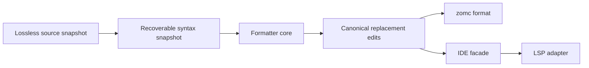

# RFC 0044: Source Formatter Architecture

## Summary

This RFC defines one deterministic source formatter for ZOM. The formatter
consumes a lossless syntax snapshot, produces a replacement-only edit set, and
uses one fixed project style. It supports whole-document and range formatting
without semantic queries, package execution, filesystem writes, or an LSP
dependency.

## Motivation

ZOM currently has parser dumps and compiler diagnostics but no source-format
contract. Formatting by reprinting semantic AST would discard comments and
recovery trivia, while editor-specific formatters would create incompatible
source layouts. A single lossless formatter is needed before CLI and editor
surfaces can promise stable formatting behavior.

## Goals

- Define a lossless-token formatter that preserves comments and string bytes.
- Use one fixed ZOM style with no project or user configuration file.
- Produce deterministic minimal non-overlapping replacement edits.
- Support whole-document and requested-range formatting through one core API.
- Keep the formatter available for syntactically recoverable documents.
- Share the core formatter between CLI and the RFC 0023 editor facade.

## Non-Goals

- Changing ZOM grammar, diagnostics, semantic types, or source behavior.
- Running semantic analysis, build scripts, package resolution, or plugins.
- Sorting imports, rewriting identifiers, changing comments, or formatting
  generated and binary files.
- Adding style profiles, config discovery, formatter directives, or a second
  editor-specific implementation.

## Prior Art

[rustfmt](https://rust-lang.github.io/rustfmt/) demonstrates a language-owned
formatter with a documented configuration surface. ZOM adopts a language-owned
tool but deliberately starts with no configuration surface, avoiding divergent
repository styles.

[clang-format](https://clang.llvm.org/docs/ClangFormat.html) supports both
whole-file and byte-range formatting. ZOM adopts a replacement-edit result for
editor integration, but rejects style-file lookup and ambient configuration.

[clang-format style guidance](https://clang.llvm.org/docs/ClangFormatStyleOptions.html)
notes the maintenance cost of growing style options. ZOM uses one fixed style
until a future accepted RFC proves that a configurable choice is necessary.

[Prettier](https://prettier.io/docs/en/technical-details.html) and the
Wadler/Lindig pretty-printing algebra it derives from ("A prettier printer",
Wadler 2003; "Strictly Pretty", Lindig 2000) demonstrate that a small document
combinator set plus one width-driven layout pass yields uniform, idempotent
line-breaking across a whole language. ZOM adopts that engine directly rather
than growing per-node heuristics (rustfmt) or a global penalty search
(clang-format), because a single fixed style needs no tuning surface.

The common hazards are losing comments during AST reprint, overlapping edits,
and formatter output that changes under different host configuration. Lossless
input, canonical edits, and no configuration discovery avoid them.

## Guide-Level Explanation

`zomc format file.zom` writes the canonical layout only after the caller
explicitly requests in-place output. `zomc format --check file.zom` prints no
source and fails when canonical edits would be non-empty. The editor facade
asks the same formatter for edits and converts its byte ranges to protocol
positions only in the LSP adapter.

## Reference-Level Design

### Input And Result

`FormatRequest` contains an immutable source snapshot, its source identity and
digest, a complete optional byte range, and one fixed `FormatMode`. The range
is either absent or lies on UTF-8 scalar boundaries within the snapshot. The
formatter receives the parser's recoverable lossless token and trivia stream;
it must not reconstruct text from semantic AST or HIR.

`FormatResult` is exactly one of `Unchanged`, `Edits`, or `Rejected`. `Edits`
contains sorted, disjoint `SourceReplacement` values, each with an original
byte range and replacement UTF-8 text. Adjacent replacements are merged.
Applying the complete result once produces canonical source; applying the
formatter again produces `Unchanged`. Rejected input produces no edit prefix.

### Fixed Style

The initial style uses spaces only, four-column block indentation, one space
around binary operators and after commas, a trailing comma for multiline lists,
and one final newline. It preserves comment text, string and character literal
bytes, raw literal delimiters, identifier spelling, numeric token spelling,
and every token order. It does not insert, delete, or reorder syntax tokens.

The formatter may normalize whitespace only at token and trivia boundaries
where the resulting bytes parse to the same lossless token sequence. A comment
is attached to its preceding or following token by source order; an attachment
ambiguity rejects the request rather than relocating a comment.

The pinned target line width is **100 columns**, measured in Unicode scalar
values. The width is a fixed constant of the style, not a configurable option;
changing it is a future accepted-RFC decision, never a user or project setting.

### Layout Engine

The formatter separates *what to lay out* from *how to break lines* through a
Wadler/Lindig document algebra, the same core proven by Prettier, Elm, and the
Haskell `prettyprinter` library. A syntax-directed printer walks the recoverable
token/trivia stream and emits an intermediate `Doc` value built from a fixed
constructor set; one generic layout pass then renders that `Doc` against the
pinned width. No syntax node computes its own line breaks.

The `Doc` constructor set is closed and minimal:

- `text(bytes)` - literal token or trivia bytes, never re-lexed.
- `concat(docs)` - ordered composition.
- `line` / `softline` / `hardline` - a break that renders as one space, nothing,
  or a mandatory newline respectively when its enclosing group breaks; `line`
  and `softline` render flat (space / nothing) when the group fits.
- `group(doc)` - the unit of break decision: rendered flat if it fits the
  remaining width, otherwise broken.
- `indent(doc)` - increase the current indentation by one four-column step for
  contained breaks.
- `ifBreak(broken, flat)` - select bytes by the enclosing group's decision (for
  example, a trailing comma only when a list breaks).
- `fill(docs)` - fit as many items per line as the width allows, breaking only
  where necessary.

The layout pass is the standard width-driven `fits` decision: a `group` renders
flat when its flat width plus the current column does not exceed the pinned
width and contains no `hardline`, otherwise every direct `line`/`softline` in
that group breaks and its `indent` applies. This is a total function over a
finite `Doc`; it performs no search or backtracking, so layout cost is linear in
document size. This is deliberately simpler than clang-format's global penalty
search and more uniform than rustfmt's per-node heuristics, and it is sufficient
for one fixed style.

A comment or other trivia is emitted as `text` at its attachment point; because
comments always carry a `hardline` when they are line comments, a group
containing a line comment can never render flat, which preserves comment
placement without a special case.

### Ranges, Recovery, And Errors

Whole-document formatting considers every boundary. Range formatting expands
the requested range to the smallest enclosing syntactic list, statement, or
declaration whose exterior layout can be determined without changing text
outside the expanded range. An enclosing node is eligible only when both of its
boundary tokens are non-recovery tokens and their trivia attachment is
unambiguous in the RFC 0023 recoverable CST. If no such enclosing node exists,
it returns `Rejected` with the existing source diagnostic rail and no edits.

Recovery nodes are formatable only when their token boundaries and trivia
attachment are unambiguous. Unterminated strings, comments, or delimiters,
invalid UTF-8, and overlapping recovery ownership reject. This makes editor
formatting safe on incomplete text without presenting a partially formatted
document as canonical.

### Integration And Writes

The formatter core is a pure value operation. CLI output writes through a
temporary sibling file in the destination directory, followed by `fsync` and an
atomic same-directory `rename(2)` over the target, after re-reading and
digest-checking the source snapshot; a changed input rejects without modifying
the file. Same-directory `rename` is atomic on Linux (ext4/xfs) and macOS
(APFS/HFS+), giving identical replacement guarantees on both. `--check` never
writes. The IDE facade returns byte edits bound to the exact document version;
the LSP adapter alone converts them to UTF-16 positions.

No mode searches parent directories, environment variables, or home
directories for configuration. There is no in-source disable directive. The
single formatter implementation is used by CLI, tests, and the IDE facade.

## Repository Impact

| Area | Paths | Owner |
|---|---|---|
| RFC governance | `docs/rfc/**` | rfc |
| Lossless syntax and trivia | `compiler/lexer/**`, `compiler/parser/**`, `compiler/ast/**` | lexer-parser |
| Source snapshots and atomic writes | `compiler/source/**`, `compiler/driver/**` | module-system |
| Formatter CLI and editor facade | `tools/formatter/**`, `tools/ide/**`, `tools/lsp/**`, `utils/zomc/**` | tooling-lsp |
| Fixtures and gates | `tests/**`, `scripts/**`, `.github/workflows/**` | verification |

## Security And Safety Impact

Formatting accepts untrusted source. It performs no package execution, plugin
loading, configuration discovery, shell invocation, or network access. Atomic
writes revalidate the original digest and reject symlink or replacement races
through the existing source service. LSP edits remain bound to one document
version and are discarded when stale.

## Drawbacks And Risks

- A fixed style may not suit every early adopter.
- Lossless recovery formatting needs careful trivia ownership validation.
- Minimal edit computation costs more than whole-file replacement.
- Atomic in-place writes need platform-specific filesystem tests.

## Alternatives Considered

Using clang-format is rejected because it does not understand ZOM grammar or
preserve ZOM-specific recovery/trivia contracts. AST pretty-printing is
rejected because it cannot preserve comments and malformed-source boundaries.
Editor-only formatting is rejected because CLI and editor output would drift.
Configuration files and directives are rejected because they create ambient,
non-deterministic formatting behavior.

## Compatibility And Rollout

The formatter is a new command and library surface. Its initial release has
one style and one current API. The CLI, editor facade, tests, and docs land in
one transaction; no prior formatter or alias is retained. Existing source
remains valid without reformatting.

## Documentation And Teaching Plan

- Add formatter command documentation and examples after implementation.
- Document the fixed source layout in the language guide, not as syntax rules.
- Add IDE formatting capability documentation after RFC 0023 is implementing.

## Operational Readiness

CI runs idempotence, token-preservation, recovery, range, and atomic-write
tests on Linux and macOS. The formatter records no telemetry and has no
external toolchain dependency. Release artifacts include the formatter only
after the CLI implementation and native tests land.

## Acceptance Criteria

- RFC 0023 is accepted before any LSP integration lands.
- Independent token/trivia verification proves formatting preserves the
  complete lossless token sequence.
- Whole-document and range results are deterministic and idempotent.
- Mutations for ranges, UTF-8 boundaries, comments, recovery ownership,
  overlap, stale snapshot, and atomic-write races reject with no write.
- Linux and macOS CLI tests prove `format`, `format --check`, and in-place
  output behavior.
- Sanitizer, unit, lit, formatter architecture, English-only, format, and RFC
  gates pass.

## Implementation Plan

1. Land the accepted lossless syntax snapshot dependency from RFC 0023.
2. Implement the pure formatter core and independent token/trivia verifier.
3. Add canonical edit normalization, range expansion, and mutation tests.
4. Add digest-checked atomic CLI writing and native Linux/macOS tests.
5. Integrate the core formatter into the accepted IDE facade and LSP adapter.

## Test Plan

- Build: `cmake --preset sanitizer`; `cmake --build --preset sanitizer`.
- Unit tests: style, comments, literals, recovery, range expansion, edits,
  idempotence, stale snapshots, and atomic writes.
- Lit tests: canonical formatting and `--check` diagnostics.
- Native tests: Linux and macOS CLI execution.
- Architecture: parser, source, query, English-only, and formatter gates.
- Complete tests: `ctest --preset default --output-on-failure`.
- Format: `python3 scripts/check-format.py`; `git diff --check`.
- RFC: `python3 scripts/check-rfc.py`.

## Open Questions

None. The two decisions previously deferred to before-REVIEW are now resolved
in the Reference-Level Design:

- **Safe range-expansion ownership.** Range expansion accepts an enclosing node
  only when both of its boundary tokens are non-recovery tokens with unambiguous
  trivia attachment in the RFC 0023 recoverable CST; any recovery token or
  ambiguous trivia on the boundary rejects. This mirrors rust-analyzer's
  node-level formatting, which only reformats syntax nodes whose token
  boundaries are complete. Recorded in "Ranges, Recovery, And Errors".
- **Cross-platform atomic write.** The source service writes a temporary sibling
  file in the destination directory, `fsync`s it, and `rename(2)`s it over the
  target after re-validating the original digest. Same-directory `rename` is
  atomic on both Linux (ext4/xfs) and macOS (APFS/HFS+), and is the exact pattern
  gofmt, rustfmt, and Black use. Recorded in "Integration And Writes".

## Status History

| Date | Status | Notes |
|---|---|---|
| 2026-08-15 | DRAFT | Initial fixed-style lossless formatter contract created for the stable-toolchain objective. |
| 2026-08-28 | REVIEW | Added the Wadler/Lindig Doc-IR layout engine and the pinned 100-column width; resolved both before-REVIEW Open Questions (range-expansion boundary-token ownership; cross-platform atomic rename) from prior art; set discussion and tracking links. |
