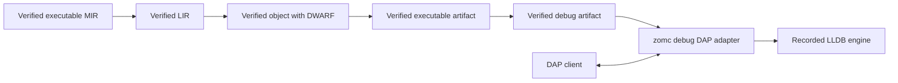

# RFC 0045: Native Debugging And Debug Adapter

## Summary

This RFC defines source-level debugging for verified native ZOM executables.
It binds backend-generated DWARF records to verified source and semantic
identities, publishes one debug artifact with the executable, and exposes a
local Debug Adapter Protocol (DAP) server through `zomc debug`. The first
supported targets are host-compatible Linux ELF and macOS Mach-O executables
on `x86_64` and `aarch64`.

The contract begins only after RFC 0021 has emitted a verified object artifact
and RFC 0043 has published a verified executable. It creates neither an
interpreter nor a second execution engine, and it does not claim an existing
compiler-memory helper to be a language debugger.

## Motivation

The current repository has deterministic HIR inspection, immutable Built MIR
records, and LLDB/GDB helpers for debugging the compiler process. It has no
source-level debugger for a ZOM program, no debug-artifact identity, no
source-to-instruction verification, and no editor protocol endpoint.

Raw backend debug metadata is insufficient as a language contract. A broken
source path, an unverified variable location, or an adapter that runs a
cross-target executable can expose incorrect program state or execute an
unintended binary. ZOM needs one provenance-bound debug artifact and one
host-gated adapter contract before `zomc debug` is introduced.

## Goals

- Define one private-construction, independently verified debug artifact.
- Preserve a verified mapping from ZOM source statements to generated code.
- Emit DWARF for Linux ELF and macOS Mach-O debug builds.
- Publish debug evidence atomically with the matching executable manifest.
- Expose one local stdio DAP adapter through `zomc debug`.
- Support launch, source breakpoints, continue, pause, stepping, stack traces,
  scopes, and read-only local-variable inspection.
- Reject host-incompatible execution, stale sources, ambiguous locations, and
  unverified debugger values before they reach a DAP client.

## Non-Goals

- Defining LIR, LLVM translation, object emission, linking, or executable
  publication; RFCs 0021 and 0043 own those contracts.
- Debugging the compiler process; the existing LLDB/GDB helper scripts remain
  contributor tooling.
- Remote debugging, attach, core-file inspection, reverse execution,
  disassembly, register inspection, expression evaluation, mutation, or a
  debug REPL.
- Split debug files, stripping, symbol servers, source download, source-path
  remapping, profiling, coverage, or Windows debug formats.
- Exposing runtime internals, ownership proofs, compiler-generated temporaries,
  raw addresses, or unsafe capabilities as source-language variables.

## Prior Art

[Debug Adapter Protocol](https://microsoft.github.io/debug-adapter-protocol/)
defines JSON request, response, and event messages between development tools
and debug adapters. ZOM adopts DAP over stdio and its capability negotiation,
but keeps execution and source verification inside the adapter rather than
delegating them to the editor.

[LLVM source-level debugging](https://llvm.org/docs/SourceLevelDebugging.html)
models source, type, scope, and instruction mappings as metadata retained to
backend output. ZOM adopts the separation between source semantics and emitted
debug information, but requires an independent verifier over ZOM provenance
before treating the metadata as debugger authority.

[LLVM DWARF verification](https://www.llvm.org/docs/CommandGuide/llvm-dwarfdump.html)
provides structural inspection of emitted DWARF. ZOM uses DWARF as the initial
native interchange format and requires format verification, but does not treat
a structurally valid DWARF stream as proof of source or semantic correctness.

[LLDB](https://lldb.llvm.org/) supplies a mature native debugging engine for
Mach-O and ELF targets. ZOM adopts one verified, toolchain-recorded LLDB
engine for local execution, rather than inventing a target debugger or
selecting a debugger from the ambient environment.

[`lldb-dap`](https://lldb.llvm.org/resources/lldbdap.html) is LLDB's own DAP
executable, and is the surface Rust (`CodeLLDB`/`lldb-dap`) and Swift use to
reach editor debugging. ZOM adopts the `lldb-dap` executable endpoint rather
than the LLDB C++ library API, so the engine surface is identical across Linux
and macOS and needs no debugger linkage into the compiler.

The common hazards are stale source paths, stepping to synthetic instructions,
untrusted evaluate requests, and target/host confusion. Source digests,
statement-boundary records, read-only requests, and the RFC 0043 host gate
address those hazards.

## Guide-Level Explanation

After a debug build produces `app` and its matching artifact manifest, a user
starts one adapter with `zomc debug app`. An editor connects over standard
input and output, asks the adapter to launch the artifact, sets source
breakpoints, and receives ZOM source frames and visible local variables. The
adapter never starts a cross-target program, and it never fetches a source
file that is not named and digested by the published debug artifact.

The initial adapter reports capabilities for launch, source breakpoints,
continue, pause, next, step-in, step-out, stack traces, scopes, and variables.
It reports every other DAP request as unsupported. Users inspect values but
cannot evaluate or mutate expressions through this interface.

## Reference-Level Design

### Debug Build Request And Artifact

`DebugBuildRequest` is created only by the selected compiler invocation. It
contains a verified executable-MIR lineage, target authority identity,
optimization policy, immutable source inventory, and requested output root.
The initial policy is `Debug`: optimizations that remove a statement boundary
or a source local from the debug model are rejected. A non-debug build does
not produce a debug artifact.

The LLVM translator receives only a verified LIR module and a verified debug
build request. It emits DWARF compilation units, files, subprograms, lexical
scopes, statement line records, and location lists from the canonical source
and semantic records. It may not derive a source name, source range, ZOM type,
variable name, or scope from an LLVM identifier or host path.

`DebugArtifact` is constructed only after an independent verifier accepts:

1. the executable, target identity, object format, and toolchain identity equal
   the RFC 0043 executable artifact;
2. every DWARF file record names one source identity in the immutable source
   inventory and carries its exact digest;
3. every breakpointable instruction range maps to exactly one executable ZOM
   statement boundary, or is explicitly non-breakpointable;
4. every visible local record maps to one checked definition, source scope, and
   target location list with a compatible lowered layout;
5. compiler temporaries, ownership evidence, runtime capability handles, and
   unrepresentable layouts have no visible-variable record;
6. all compilation units, paths, ranges, records, and location lists are
   sorted by their complete canonical keys without duplicates; and
7. decoded DWARF and the canonical debug records agree exactly on source line
   tables, subprogram address ranges, and visible variable address ranges.

The verifier produces `VerifiedDebugArtifact`, which owns the executable
artifact identity, target identity, source inventory digest, debug-record
digest, and a canonical `DebugArtifactManifest`. Its identity is SHA-256 over a
domain-separated, length-framed encoding of those records. Raw DWARF bytes,
LLDB process handles, source-manager pointers, and mutable session state are
not part of the public artifact value.

The first implementation keeps DWARF in the unstripped ELF or Mach-O output.
The debug artifact manifest is published beside the executable with the fixed
suffix `.zom-debug`. RFC 0043's publication transaction writes, verifies, and
renames the executable manifest and debug manifest together; success publishes
all three files, and failure publishes none. No split-debug or stripping mode
exists in this contract.

Every DWARF file record encodes its source name as the canonical repository-
relative POSIX path of the source identity, with `DW_AT_comp_dir` set to the
normalized absolute build root and a DWARF5 line-table MD5 that equals the
source inventory digest. The same UTF-8 bytes satisfy ELF and Mach-O DWARF
consumers, and because the path is canonical rather than host-derived, no
consumer-side path remapping is required or permitted. This is the Rust/Swift
approach: embed a stable normalized path plus an integrity hash rather than a
host-specific absolute path.

### Local Execution Engine

`zomc debug <artifact>` accepts exactly one verified executable and its matching
debug manifest. Before it starts a DAP server, it verifies the executable and
debug-manifest digests, validates the complete debug artifact, and applies the
same host-compatibility predicate as RFC 0043 `zomc run`. Target mismatch,
missing metadata, stale digest, malformed DWARF, or unavailable recorded LLDB
engine is a compiler diagnostic and starts no inferior process.

The toolchain closure records the LLDB executable or library identity and
digest. The recorded engine is the `lldb-dap` executable endpoint, not the LLDB
C++ library API: it presents an identical DAP surface on Linux and macOS, is
distributed with the pinned LLVM toolchain, and needs no LLDB linkage into
`zomc`. The adapter invokes that exact engine with an explicit argument vector,
an empty inherited environment plus the verified execution environment, and a
normalized working directory. It does not search `PATH`, read debugger init
files, load user scripts, inherit dynamic-library search variables, or execute
a shell.

The adapter accepts DAP framed JSON messages only on standard input and writes
responses and events only on standard output. Diagnostic logs use standard
error and never enter the protocol stream. It serves one client and one
inferior process. Client disconnect, malformed framing, engine failure, or
protocol sequence failure terminates the inferior and releases all handles.

### DAP Surface And Projection

The initial `initialize` response advertises only `launch`, source breakpoints,
pause, continue, next, step-in, step-out, stackTrace, scopes, and variables.
The adapter accepts `configurationDone` after breakpoints have been validated.
It rejects `attach`, `restart`, `evaluate`, `setVariable`, `setExpression`,
`readMemory`, `disassemble`, `modules`, and every request outside that closed
inventory with a deterministic unsupported-request response.

Each source breakpoint identifies a source identity and byte position. The
adapter maps it to the unique next statement boundary in the verified debug
artifact. A source identity or digest mismatch, a non-boundary position, or an
ambiguous mapping returns an unverified breakpoint without creating an engine
breakpoint. Breakpoints never use ambient filename comparison or path remapping.

Each stack frame is projected only when its instruction address belongs to a
verified subprogram and statement record. The adapter exposes the exact source
identity, byte range, function identity, and canonical frame name. Frames with
no ZOM source record are omitted from the ZOM frame list and counted only in a
non-source adapter message; their variables are never exposed.

`scopes` returns one lexical scope per visible source frame. `variables`
projects only records accepted by the debug verifier. A variable value must be
read through its verified target location list, fit its lowered layout, and
decode through the checked ZOM type record. If any condition fails, the value
is unavailable; the adapter does not display raw memory, guessed type names,
or engine-rendered values. Requests never write inferior memory.

The initial visible-variable surface is scalar read-only only: the checked
primitive scalar types whose lowered layout is a single register- or
memory-sized value. No composite layout (aggregate, sum, reference, slice, or
closure) joins the surface in this contract; a composite local is a verified
non-visible record and is omitted rather than partially rendered. Widening the
surface to specific checked composite layouts is a follow-up once the scalar
projection and its decode verifier are proven, and each added layout must carry
its own decode proof.

### Stepping And Events

Continue and pause delegate process control to the recorded engine. Next,
step-in, and step-out stop only when the engine reaches a verified source
statement boundary in a frame that belongs to the selected ZOM executable.
Synthetic or foreign frames are skipped. If the engine cannot reach a unique
next verified boundary, the operation stops with an adapter diagnostic instead
of claiming a source step.

The adapter emits DAP stopped, continued, exited, terminated, thread, and
breakpoint events only after revalidating their artifact, frame, and source
identities. Process exit status remains a program result and is not reported as
a compiler-success result.

## Repository Impact

| Area | Paths | Owner |
|---|---|---|
| RFC governance | `docs/rfc/**` | rfc |
| Debug records, LIR, LLVM translation, and object verification | `compiler/lir/**`, `compiler/backend/**`, `compiler/ir/**` | ir-backend |
| Executable/debug artifact publication and source inventory | `compiler/driver/**`, `compiler/identity/**`, `compiler/source/**`, `utils/zomc/**` | module-system |
| Runtime value layouts and execution environment | `runtime/**`, `core/**`, `compiler/ownership/**` | runtime-memory |
| DAP server and editor integration | `tools/debug/**`, `tools/ide/**`, `tools/lsp/**`, `editors/**` | tooling-lsp |
| Failure materialization | `compiler/diagnostics/**` | error-system |
| Tests, architecture gates, CI, and native lanes | `tests/**`, `scripts/**`, `.github/workflows/**` | verification |

## Security And Safety Impact

Debugging runs native code and reads process memory. The adapter limits that
boundary to one verified, host-compatible executable, one recorded engine, one
sanitized environment, and read-only records whose layout and provenance have
already been verified. It rejects source fetching, path remapping, shell
invocation, user debugger scripts, arbitrary memory requests, and evaluation.

The adapter holds no capability to write inferior memory. It must terminate the
inferior on client disconnect and fail closed when a source, type, location, or
engine record no longer matches the debug artifact. Debug output can reveal
local user data; the CLI therefore writes no values or paths to telemetry and
never enables remote transport in this initial contract.

## Drawbacks And Risks

- Accurate statement stepping and local-variable locations require backend work
  across LIR, LLVM, object verification, and runtime layouts.
- LLVM and LLDB behavior can differ between Linux and macOS toolchains.
- Read-only local projection intentionally omits useful engine features such as
  watch expressions and register inspection.
- Embedded DWARF increases debug executable size until a separate accepted
  publication contract defines stripped and split-debug products.

## Alternatives Considered

Using the existing compiler LLDB/GDB helper scripts as a user debugger is
rejected because they inspect compiler memory and carry no program-artifact or
source provenance contract.

Exposing raw LLDB through an editor is rejected because it permits ambient
settings and engine-specific values to bypass ZOM source and type validation.

Implementing a custom target debugger is rejected because it would duplicate
the process-control and platform work of a mature native engine.

Allowing DAP evaluation and mutation is rejected because it needs a separate
expression parser, checker, capability boundary, and transactional runtime
contract. It cannot be smuggled into the initial read-only adapter.

## Compatibility And Rollout

This RFC adds one new debug-build and local-debugging surface after its
dependencies are accepted. It does not retain a previous debugger command or
artifact format. The compiler, executable publisher, adapter, tests, and
documentation land as one current contract.

The first landing supports only host-compatible Linux ELF and macOS Mach-O
executables on `x86_64` and `aarch64`. Cross-target debugging, Windows, split
debug artifacts, and remote transport require separate accepted contracts.
Removing the debug surface means removing the command, manifests, backend
records, tests, and documentation together; no dormant compatibility path
remains.

## Documentation And Teaching Plan

- Update the IR debugging guide when a live debug artifact and adapter exist.
- Add `zomc debug` command documentation and a minimal editor connection guide.
- Document debug-build size, source-digest requirements, supported targets, and
  the read-only variable policy in the toolchain guide.
- Add contributor instructions that distinguish compiler-process helpers from
  language-program debugging.

## Operational Readiness

CI must provide recorded LLVM and LLDB toolchain closures for Linux and macOS
native lanes. Each lane verifies a small executable's DWARF with
`llvm-dwarfdump`, runs a scripted DAP session, and checks that no unverified
inferior remains after every failure path. Release packaging ships the selected
LLDB engine record and never discovers a system debugger at run time.

The release owner maintains a target capability matrix containing LLVM, LLDB,
runtime ABI, and debug-format versions selected by the toolchain closure. A
new engine or format changes that matrix atomically with its verifier and
native test lanes.

## Acceptance Criteria

- RFC 0016, RFC 0021, and RFC 0043 are accepted before production debug code
  is added.
- A debug build produces a verified executable, executable manifest, and debug
  manifest together, or produces none of them.
- Independent mutation tests reject altered DWARF, executable, manifest,
  source digest, source range, local location, type layout, target identity,
  engine identity, and canonical ordering.
- Linux and macOS `x86_64` and `aarch64` native lanes prove source breakpoints,
  continue, pause, all three step operations, stack frames, scopes, and
  read-only scalar local values.
- DAP transcript tests prove unsupported evaluation, mutation, remote attach,
  cross-target launch, malformed framing, stale sources, and client disconnect
  fail closed without running an unauthorized process.
- Debugger-process tests prove sanitized environment, no shell, no debugger
  init scripts, no ambient engine discovery, and inferior cleanup.
- Sanitizer, unit, lit, native, architecture, English-only, format, and RFC
  gates pass on supported host lanes.

## Implementation Plan

1. Accept the RFC 0016 target authority and land RFC 0021 verified LIR, LLVM,
   object, and DWARF source-record production.
2. Implement canonical debug records and an independent verifier bound to the
   RFC 0043 executable publication transaction.
3. Add LLVM DWARF structural verification and source/type/location mutation
   tests before publishing a debug manifest.
4. Add the recorded local LLDB engine integration and closed stdio DAP server.
5. Add source breakpoint, stepping, frame, scope, variable, cleanup, and
   hostile-request tests on Linux and macOS.
6. Document the command and adapter only after production-path evidence passes.

## Test Plan

- Build: `cmake --preset sanitizer`; `cmake --build --preset sanitizer`.
- Unit tests: canonical records, identity, source mapping, variable layouts,
  artifact verification, DAP framing, and request-state mutations.
- Lit tests: debug-build diagnostics and command-line target rejection.
- Native tests: DWARF verifier, scripted DAP launch/breakpoint/step sessions,
  variable projection, cross-target rejection, and inferior cleanup on Linux
  and macOS.
- Architecture: IR, backend, source, compiler-session, ownership, English-only,
  and debugger gates.
- Complete tests: `ctest --preset default --output-on-failure`.
- Format: `python3 scripts/check-format.py`; `git diff --check`.
- RFC: `python3 scripts/check-rfc.py`.

## Open Questions

None. The three decisions previously deferred to before-REVIEW are now resolved
in the Reference-Level Design:

- **Source-name encoding for ELF and Mach-O DWARF.** Canonical repository-
  relative POSIX path plus a normalized absolute `DW_AT_comp_dir` and a DWARF5
  line-table MD5 equal to the source inventory digest; identical bytes for both
  consumers, no path remapping (the Rust/Swift approach). Recorded in "Debug
  Build Request And Artifact".
- **LLDB integration surface.** The recorded `lldb-dap` executable endpoint, not
  the LLDB library API, for an identical DAP surface on both platforms with no
  debugger linkage into `zomc`. Recorded in "Local Execution Engine" and Prior
  Art.
- **Composite layouts on the initial variable surface.** None; the initial
  surface is scalar read-only only, and composite layouts join later as
  individually decode-proven follow-ups. Recorded in "DAP Surface And
  Projection".

## Status History

| Date | Status | Notes |
|---|---|---|
| 2026-08-15 | DRAFT | Initial native debug artifact and local DAP contract created for the stable-toolchain objective. |
| 2026-08-28 | REVIEW | Resolved all three before-REVIEW Open Questions from prior art (canonical DWARF source-name encoding; lldb-dap executable endpoint over the LLDB library API; scalar-only initial variable surface); set discussion and tracking links. Backend dependencies (RFC 0043 link/publication) remain the acceptance gate. |
