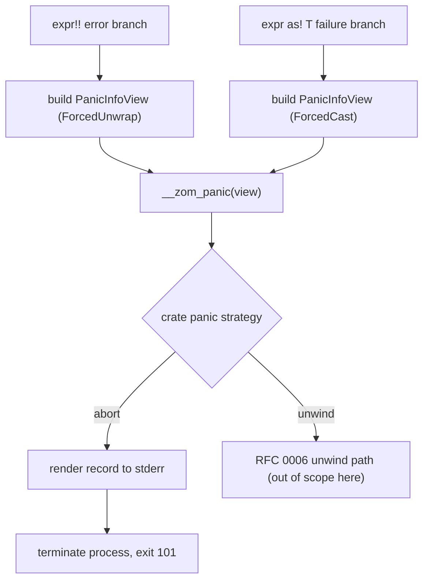

# RFC 0046: Forced Error Operator Panic Abort ABI

## Summary

This RFC pins down the concrete abort-mode panic contract for the two forced
error operators, `expr!!` (forced unwrap) and `expr as! T` (forced checked
cast). RFC 0006 defines the target-independent panic boundary skeleton
(`__zom_panic`, `PanicInfoView`, panic-strategy selection) and states that the
first implementation is abort-only, but it does not implement the runtime panic
functions and does not fix the observable process contract. This RFC fills that
gap for the abort strategy only: the exact runtime symbol an operator panic
calls, how `PanicInfoView` is populated for `ForcedUnwrap` and `ForcedCast`, the
deterministic ASCII abort message layout written to standard error, the process
exit code, and the "no unwinding, no recovery" guarantee. It defines no new
syntax, no new checker diagnostics, and no unwind behavior. Nothing here is
implemented yet; this document is a design contract to review before the
runtime panic path and operator lowering are built.

## Motivation

RFC 0006 proves that `expr!!` and `expr as! T` are well typed, assigns each a
panic kind (`ForcedUnwrap`, `ForcedCast`), and declares that each failure edge
calls `__zom_panic` with a call-scoped `PanicInfoView`. It then explicitly
leaves the runtime panic functions unimplemented and describes only that the
"first implementation is abort-only."

That leaves three concrete questions unanswered for an implementer who wants to
build the abort path first:

1. When `expr!!` hits its error branch, what does the process print, and on
   which stream, and with what exit status? Two different lowering authors
   would produce two different observable contracts today.
2. `as!` has no residual payload, so its `PanicInfoView` cannot borrow one. The
   forced-cast message must instead render the canonical source and target type
   display. The exact, deterministic text is not defined anywhere.
3. Under `panic = "abort"`, is any cleanup or unwinding attempted before the
   process terminates? RFC 0006 says abort and unwind share cleanup rules in
   general, but the abort-first contract must state precisely what an operator
   panic does so it is testable without a full unwinder.

These are observable, hard-to-reverse contracts: a test suite, an FFI host, and
a CI lane will all depend on the exact exit code and message shape. They must be
fixed before the runtime abort path is written, not discovered after.

## Goals

- Define the concrete abort-mode behavior for `ForcedUnwrap` and `ForcedCast`
  panic sites originated by `!!` and `as!`.
- Fix the deterministic ASCII abort message layout for both operators and the
  standard-error stream it is written to.
- Fix the process exit status for an uncaught operator panic under
  `panic = "abort"` at `101`, consistent with the RFC 0006 main-boundary rule.
- Define exactly which `PanicInfoView` fields each operator populates, including
  the borrowed residual view for `!!` and the type-display message for `as!`.
- State the "no unwinding, no user-observable recovery" guarantee for the abort
  strategy so the path is testable before an unwinder exists.
- Define the verification evidence required before this RFC can move to
  `LANDED`.

## Non-Goals

- This RFC does not change the `!!` or `as!` syntax, precedence, or parsing.
- This RFC does not change or add checker diagnostics; `ZOM4026` and the RFC
  0005 `CheckedCastFact` rules are unchanged.
- This RFC does not define the unwind strategy, `catch_unwind`, FFI unwind
  containment, or backtrace symbolization; those remain RFC 0006 contracts.
- This RFC does not define the error-union in-memory layout, tag assignment, or
  the target ABI manifest; those remain RFC 0006 and RFC 0010 contracts.
- This RFC does not implement the backend, the MIR/LIR builder, or the runtime
  panic functions; it defines the contract they must satisfy.
- This RFC does not cover `panic!`, `todo!`, `unreachable!`, assertion, bounds,
  or overflow panic kinds except to require they share the same abort exit code.

## Prior Art

Rust `panic = "abort"` prints a single diagnostic line to standard error of the
form `thread '<name>' panicked at <location>:\n<message>`, then terminates the
process; a panic that reaches the default runtime returns exit code `101`.
Force-unwrap of `Option`/`Result` (`.unwrap()`) and a failed checked downcast
both route through this same panic machinery. ZOM should copy the fixed exit
code, the single-writer standard-error contract, and the "location plus
message" shape, while keeping ZOM's own operator-specific message wording.

Swift traps on `Optional` force-unwrap of `nil` and on a failed `as!` dynamic
cast by calling into the runtime, printing a fatal-error message such as
`Fatal error: Unexpectedly found nil while unwrapping an Optional value`, and
terminating via an illegal instruction. ZOM should copy the separation of the
two operator failure messages and the immediate, non-recoverable termination,
while using a deterministic ASCII message and a defined exit code rather than a
signal-only contract.

Zig has no unwinding: a failed `orelse unreachable`, an out-of-bounds access, or
`@panic` calls the installed panic handler, prints a message, and aborts. ZOM
should copy the "abort with a printed message, no stack unwinding" model as the
first, simplest strategy and gate any unwinding behind separate capability
evidence, exactly as RFC 0006 already requires.

C++ turns an escaping exception or a `noexcept` violation into `std::terminate`,
which calls `abort()` and raises `SIGABRT`. ZOM should copy the guarantee that
the abort path performs no user cleanup, but should replace the C++ default of a
terse, implementation-defined message with a defined, testable message layout.

## Guide-Level Explanation

User-visible source behavior does not change. A program that force-unwraps a
checked error union or force-casts a value still writes `!!` and `as!` exactly
as Chapter 11 specifies.

```zom
fun parse_port(text: str) -> u16 {
    // If parsing yields the residual (error) alternative, this aborts.
    return text.to_u16()!!;
}

fun as_widget(node: Node) -> Widget {
    // If the runtime kind is not Widget, this aborts.
    return node as! Widget;
}
```

Under a crate compiled with `panic = "abort"` (the only strategy this RFC
covers), when the error or failed-cast branch is taken:

- The runtime writes exactly one diagnostic record to standard error.
- For `!!`, the record names the forced-unwrap kind, the operator source
  location, and a bounded debug view of the residual (error) payload.
- For `as!`, the record names the forced-cast kind, the operator source
  location, and the canonical source and target type display. There is no
  residual payload to show.
- The process then terminates with exit code `101`.
- No `catch_unwind` boundary can observe the panic, because abort does not
  unwind. No user-defined cleanup runs after the panic entry point is called.

A developer debugging a crash can rely on the exit code and the message prefix
being stable across targets, so a test can assert them directly.

## Reference-Level Design

### Scope And Preconditions

This design applies only when the selected crate panic strategy is
`panic = "abort"`, as validated by the RFC 0006 pre-lowering capability check
against the RFC 0010 target profile. It consumes, and never re-derives:

- the RFC 0005 verified error-union shape and `CheckedCastFact` (mode
  `ForcedChecked`) that make `!!` and `as!` legal;
- the RFC 0006 `PanicInfoView` structure and the `__zom_panic` entry point;
- the RFC 0010 `TargetSpecId` and panic-strategy tag.

Missing, stale, or inconsistent facts are compiler invariant failures, not user
diagnostics.

### Panic Dispatch For The Two Operators



Under abort, `__zom_panic` renders the record and terminates. It performs no
stack unwinding and runs no user destructors after entry. This matches the RFC
0006 rule that `__zom_catch_unwind` cannot catch under `panic = "abort"`.

### PanicInfoView Population

Both operators populate the RFC 0006 call-scoped `PanicInfoView`. This RFC fixes
which fields each operator sets:

| Field | `!!` (`ForcedUnwrap`) | `as!` (`ForcedCast`) |
|---|---|---|
| panic kind | `ForcedUnwrap` | `ForcedCast` |
| source file, line, column, byte span | operator span | operator span |
| optional message | absent | canonical `"<source-type> as! <target-type>"` display |
| borrowed residual debug view | present, borrows the active residual payload | absent |
| borrowed backtrace view | absent under abort-first | absent under abort-first |
| task/thread identity | present when the runtime has one | present when the runtime has one |

For `!!`, the residual payload remains alive until `__zom_panic` has
materialized the record, exactly as RFC 0006 requires; the view borrows it and
does not own it. For `as!`, there is no residual payload, so lowering must set
the residual debug view to absent and instead supply the type-display message.
Lowering must not reinterpret an `OptionalChecked` cast as forced or synthesize
a residual view for `as!`.

The abort-first path sets the backtrace view to absent. A later change may add
synchronous backtrace capture; it is gated separately and is not part of this
contract.

### Abort Message Layout

Under abort, the runtime writes exactly one record to the process standard-error
stream (file descriptor 2) as a single write of UTF-8 bytes terminated by a
newline. The record is ASCII except for message bytes copied verbatim from a
residual debug view, which may contain UTF-8. The layout is:

```text
zom: panic: <kind>: <file>:<line>:<column>: <detail>
```

Field rules:

- `<kind>` is the fixed ASCII token `forced-unwrap` for `!!` and `forced-cast`
  for `as!`.
- `<file>` is the source path recorded in `PanicInfoView`; `<line>` and
  `<column>` are 1-based decimal integers from the operator span.
- For `forced-unwrap`, `<detail>` is `residual = <payload-summary>`, where
  `<payload-summary>` is the bounded debug view of the residual payload. If the
  residual debug view is absent or its formatting fails, `<detail>` is the fixed
  ASCII string `residual = <panic payload unavailable>`.
- For `forced-cast`, `<detail>` is `cast <source-type> as! <target-type>`, using
  the canonical RFC 0005 type display.

The payload summary is bounded exactly as RFC 0006 specifies for the owned
residual summary contract (at most 4,096 UTF-8 bytes, truncated only at a scalar
boundary, with the fixed fallback `<panic payload unavailable>`). Nothing is
written to standard output. The runtime writes the record with a single
`write`-class call where the platform allows it, so interleaving with other
threads' panics cannot split a record; if the platform cannot guarantee a single
atomic write, the runtime holds a process-wide panic lock for the duration of
the record write.

### Process Termination

After the record is written, the abort path terminates the process with exit
code `101`. This is the same status RFC 0006 assigns to an uncaught panic at the
`main` boundary, so a forced-operator panic in any frame and an uncaught panic
that reaches `main` are indistinguishable by exit code, which is the intended
contract. Termination uses the runtime's immediate-abort primitive; it does not
run `atexit`-class user hooks and does not flush user buffers beyond the single
standard-error record write.

### Runtime Symbol Contract

The two operators call the RFC 0006 `__zom_panic(info: PanicInfoView) -> never`
entry point. This RFC introduces no new runtime symbol. Under `panic = "abort"`,
`__zom_panic` behaves as the abort renderer defined above; it does not tail-call
`__zom_begin_panic_unwind`. The `never` return type lets lowering treat both
operator failure edges as diverging, so no post-panic block is emitted on the
failure edge.

## Repository Impact

| Area | Paths | Owner |
|---|---|---|
| RFC governance | `docs/rfc/**` | `rfc` |
| Forced-operator panic kinds and diagnostics | `compiler/diagnostics/**` | `error-system` |
| Operator failure-edge lowering to the panic call | `compiler/mir/**`, `compiler/ir/**`, `compiler/backend/**` | `ir-backend` |
| Runtime abort renderer and termination primitive | `runtime/**` | `runtime-memory` |
| Spec alignment for panic behavior | `docs/spec/chapters/11-error-handling.md` | `spec-audit` |
| Conformance, ABI, and CI evidence | `tests/**`, `scripts/**` | `verification` |

## Security And Safety Impact

The abort path is a fail-closed contract. It terminates the process rather than
continuing after a proven-invalid state (a residual where a success value was
required, or a value of the wrong runtime kind), which is the safe default for a
programmer fault.

Memory safety: the `!!` residual debug view is a borrow that is valid only for
the dynamic call to `__zom_panic`, matching the RFC 0006 lifetime rule; the
runtime must not store it. The `as!` path carries no payload borrow, removing a
class of use-after-free risk for that operator.

Information exposure: the residual payload summary is written to standard error
and is bounded and truncated per the RFC 0006 summary rule, so a large or
sensitive payload cannot produce unbounded output. The forced-cast message
exposes only canonical type names, not values.

Concurrency safety: the single-write or panic-lock rule prevents two concurrent
panics from interleaving partial records. The abort path does not unwind, so it
cannot run user cleanup concurrently with termination.

## Drawbacks And Risks

- Fixing the exact message layout now constrains later cosmetic changes; tests
  that assert the full line will need updating if the layout changes. The blast
  radius is limited to conformance expectations under `docs`/tests.
- Choosing abort-first means no operator panic can be recovered until the
  separate unwind contract lands; a program that wants recovery must be
  restructured to avoid `!!`/`as!`. This is intentional and matches Zig and the
  RFC 0006 phasing.
- Overlap risk with RFC 0006 is real; this RFC deliberately restricts itself to
  the abort-mode observable contract for two operator kinds and defers every
  other panic concern to RFC 0006 to avoid a second, drifting source of truth.

## Alternatives Considered

- Signal-only termination (raise `SIGABRT` with no printed record), as C++
  `std::terminate` does by default. Rejected because it gives no actionable
  location or payload and is harder to assert in a portable conformance test.
- A structured machine-readable panic record (JSON on standard error). Rejected
  for the first contract because it adds an encoder dependency in the panic path
  and complicates the single-atomic-write guarantee; a human-readable line is
  the mature default in Rust, Swift, and Zig.
- Distinct exit codes per panic kind. Rejected because it fragments the process
  contract; Rust and the RFC 0006 main boundary both use a single panic exit
  code, and callers that need the kind can read the standard-error record.
- Defining an `as!`-specific runtime symbol separate from `__zom_panic`.
  Rejected because RFC 0006 already routes all panic kinds through one entry
  point; a second symbol would duplicate strategy selection.

## Compatibility And Rollout

This is a pre-1.0 design with no released surface to preserve. The rollout adds
the abort renderer behavior to the RFC 0006 `__zom_panic` contract and the
operator failure-edge lowering; no existing behavior is versioned or kept as a
dual path.

Rollout order is deferred to the Implementation Plan and gated on RFC 0006 and
RFC 0010 producing a verified target selection and panic-strategy capability.
Because no backend or runtime panic function exists yet, there is no generated
artifact or conformance snapshot to migrate at draft time. When the path is
built, the only affected generated artifacts are new conformance expectations
that assert the message layout and exit code; rollback is deleting those tests
and the renderer in the same change.

## Documentation And Teaching Plan

- `docs/spec/chapters/11-error-handling.md`: once the runtime abort path is
  implemented and verified, add a normative statement of the abort message
  layout and exit code for `!!` and `as!`, replacing the current sentence that
  the chapter does not define abort behavior. No spec change is made while this
  RFC is unimplemented, so the chapter continues to defer panic behavior.
- `docs/design/ir/`: a design note may describe the operator failure-edge
  lowering once the live builder exists; it must not claim an unimplemented
  stage.
- Release notes: record the fixed exit code and message prefix when the path
  lands.

## Operational Readiness

- CI must gain a runtime/ABI lane that runs a compiled program to end-of-process
  and asserts the standard-error record and exit code once native execution
  exists. Ownership of that lane is `verification`.
- No new CLI command, service, or observability endpoint is introduced.
- Performance: the abort path is a single formatting pass plus one write and a
  process exit; it is not on any hot path and needs no benchmark gate.

## Acceptance Criteria

- The abort-mode behavior for `ForcedUnwrap` and `ForcedCast` is defined with a
  fixed message layout, standard-error stream, and exit code `101`.
- The `PanicInfoView` field population for each operator is defined, including
  the `!!` residual borrow and the `as!` type-display message.
- A conformance test compiles and runs a `!!` failure and an `as!` failure under
  `panic = "abort"` and asserts the message prefix and exit code, once native
  execution exists.
- Runtime unit tests cover the message layout, the residual truncation
  fallback, and the single-write or panic-lock behavior under concurrent panics.
- `python3 scripts/check-rfc.py` passes with this RFC indexed.
- All required owners have approved before the RFC moves to `ACCEPTED`.

## Implementation Plan

1. Land RFC 0006's `__zom_panic` boundary and the RFC 0010 panic-strategy
   capability check as prerequisites (tracked by those RFCs).
2. Implement the runtime abort renderer: format the record, write it atomically
   to standard error, and terminate with exit code `101`.
3. Implement operator failure-edge lowering for `!!` and `as!` that builds the
   `PanicInfoView` per the field table and calls `__zom_panic`.
4. Add runtime unit tests for the message layout, truncation fallback, and
   concurrent-panic write discipline.
5. Add conformance tests that run a compiled `!!` and `as!` failure and assert
   the standard-error record and exit code.
6. Update `docs/spec/chapters/11-error-handling.md` to state the now-implemented
   abort behavior, and add a `docs/design/ir/` note for the lowering.

## Test Plan

- Build: `cmake --preset sanitizer` and `cmake --build --preset sanitizer`.
- Unit tests: `ctest --preset default -L unittest`, covering the abort renderer
  message layout, residual truncation fallback, and concurrent-panic write
  discipline.
- Lit tests: `ctest --preset default -L lit`, covering operator failure-edge
  lowering shape for `!!` and `as!`.
- Conformance: run compiled `!!` and `as!` failures to process exit and assert
  the standard-error record and exit code `101`, once native execution exists.
- Generated files: new conformance expectation files for the message and exit
  code; no other generated artifact changes.
- Format: `python3 scripts/check-format.py` and `python3 scripts/check-rfc.py`.

## Open Questions

- Should the forced-cast message include the operator's runtime source kind name
  in addition to the static source type, or only the static type display? This
  is non-blocking and assigned to follow-up tracking once the RFC 0005 type
  display for runtime kinds is finalized.
- Should the abort record optionally include the task/thread identity in the
  printed line, or keep it only in `PanicInfoView`? This is non-blocking and
  assigned to follow-up tracking pending the runtime task-identity contract.

## Status History

| Date | Status | Notes |
|---|---|---|
| 2026-08-24 | DRAFT | Initial draft. |
