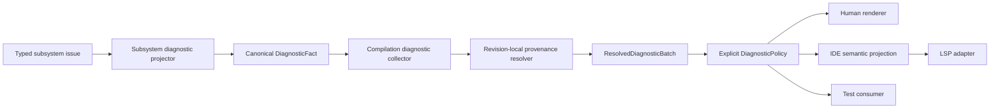
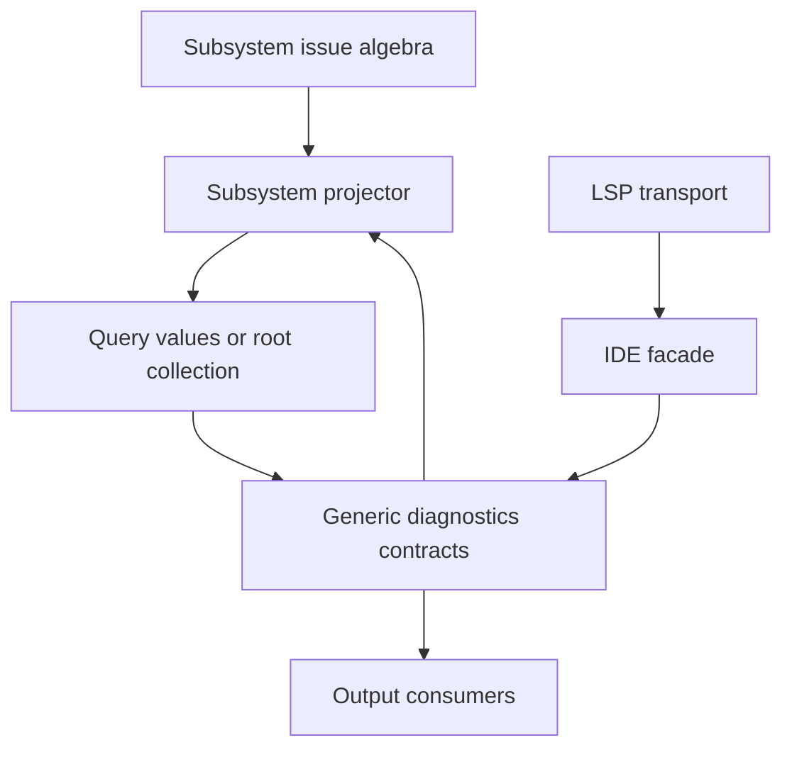

# RFC 0047: Diagnostics Architecture

## Summary

This RFC defines one end-to-end diagnostics architecture for the ZOM compiler,
incremental query system, command-line tools, and IDE facade. Every compiler
phase produces typed issues and projects them into locale-neutral canonical
diagnostic facts. One compilation-root collector verifies, combines,
semantically suppresses, and deterministically orders those facts. A
revision-local materializer resolves provenance and produces one immutable
resolved batch. Explicit output policies then derive terminal, IDE, and future
machine-readable representations without exposing query identities or compiler
handles.

The design completes the diagnostic-value direction established by RFC 0017
and the source-fact cutover landed by RFC 0042. It replaces direct subsystem
emission, session-local diagnostic mapping, `(DiagID, SourceLoc)` deduplication,
and mutable output policy hidden inside `DiagnosticEngine`. Existing
`*-diagnostic-adapter` files are migration inputs, not the target architecture.
Compiler invariants use a separate typed incident rail and never receive or
publish a `ZOMxxxx` diagnostic code.
No implementation change is authorized until this RFC is accepted.

## Motivation

ZOM has sound pieces of a modern diagnostic system, but they do not yet form
one architecture. The diagnostic catalog is centralized, source diagnostics
can become canonical `DiagnosticFact` values, provenance is separated from
semantic identity, complete source batches materialize before publication, and
`DiagnosticEngine` supports consumers. Those pieces demonstrate the right
direction.

The production paths nevertheless diverge:

- Parse diagnostics use query-safe facts and revision-local provenance, while
  Checker, Ownership, IR, package, and module-interface failures use separate
  direct-emission adapters.
- Module diagnostic facts can cross query boundaries, but the live generic
  materializer admits only source-syntax diagnostics. At least one session path
  consequently reconstructs a range-less `Diagnostic` directly.
- `CompilerSession` contains mappings that belong to producer-owned projectors,
  so the session is both orchestrator and diagnostic semantics owner.
- The engine removes any second diagnostic with the same code and source
  location, even when arguments, related information, or occurrence identity
  differ. Conversely, producer-local suppression rules are not visible to the
  global collector.
- The engine hard-codes a 100-error display budget. Warning suppression,
  ignored-code state, and post-fatal behavior exist as mutable fields but are
  not consistently applied.
- Terminal output and the IDE snapshot consume different subsets of compiler
  diagnostics. A clean command-line compilation and a same-revision IDE
  analysis therefore do not yet share one authoritative diagnostic set.
- Message arguments are primarily strings, so the catalog can verify argument
  count but cannot verify argument meaning, formatting, escaping, or path
  privacy.
- Forty-nine `ZOM99xx` entries currently encode compiler contract violations as
  ordinary fatal diagnostics. This conflates user-actionable problems with
  compiler defects, exposes internal taxonomy through a public-looking code, and
  allows invariant incidents to pass through ordinary source-diagnostic policy.
- The layering gate checks `DiagnosticEngine` references by path. It cannot
  prove that every issue is projected, that every fact is materializable, or
  that cache hits and misses publish equivalent batches.

These gaps affect correctness rather than only layout. A memoized provider that
emits as a side effect may produce a diagnostic on a cold run and omit it on a
cache hit. An output-stage deduplicator can erase two distinct language events.
A stale IDE result can overwrite a newer diagnostic set. A raw external string
can inject terminal control sequences or disclose a host path. Independent
adapters can also drift in code mapping, ordering, note attachment, limits, and
invariant handling.

The repository now has enough implemented query, provenance, IDE, and typed
failure machinery to define the complete boundary once. Continuing to add
adapter-specific behavior would make a later convergence more expensive and
less reviewable.

## Goals

- Define one diagnostic lifecycle from producer-local typed issue through
  canonical fact, collection, provenance resolution, policy, and consumption.
- Preserve RFC 0017 from-scratch consistency: cache hits, cache misses, worker
  scheduling, and clean builds produce the same authoritative diagnostic set.
- Keep analysis, query, verifier, ownership, IR, and package code free of output
  engines, terminal writers, protocol objects, and rendered messages.
- Give each diagnostic a stable occurrence identity distinct from semantic
  duplicate identity and rendered equality.
- Define exact validation, semantic suppression, duplicate handling, ordering,
  error-budget, compiler-incident, cancellation, and stale-result behavior.
- Separate locale-neutral facts, revision-local resolved diagnostics, human
  rendering, IDE projection, and external machine schemas.
- Make diagnostic arguments typed, bounded, owned, deterministic, and safe to
  render across trust boundaries.
- Support primary locations, related locations, and child notes without binding
  semantic facts to a `SourceManager`.
- Make terminal and IDE diagnostics projections of the same authoritative
  compilation facts for the same admitted recovery-free snapshot.
- Define a direct migration that deletes direct-emission adapters and unused
  diagnostic state rather than preserving compatibility paths.
- Restrict `ZOMxxxx` to user-actionable diagnostics and replace every public
  `ZOM99xx` invariant mapping with a typed internal failure plus one sanitized
  compiler-incident presentation.
- Require project-native tests, architecture gates, differential checks, and
  privacy-preserving observability before the design can be called landed.

## Non-Goals

- This RFC does not add, remove, or renumber a language diagnostic merely to
  improve its wording. Code allocation remains owned by the defining language
  or compiler contract.
- This RFC does not standardize the exact English wording of every existing
  diagnostic. It defines how message keys, templates, and arguments are owned
  and validated.
- This RFC does not define a public JSON, SARIF, or command-line schema. A
  public machine format requires its own external-contract review; it must
  consume the batch defined here.
- This RFC does not add warning command-line flags, warning groups, localization
  selection, or a plugin diagnostic API. It defines the internal policy and
  catalog boundaries required before those features can be specified safely.
- This RFC does not add source edits or fix-its. They require a real producer
  and an owning feature RFC that extends the fact, resolver, IDE, and test
  contracts atomically.
- This RFC does not make canonical diagnostic codecs stable external formats.
  They remain internal query contracts.
- This RFC does not make an IDE recovery diagnostic authoritative for compiler
  acceptance. RFC 0023's compiler and recovery authority rails remain distinct.
- This RFC does not use diagnostics to recover from compiler invariants, query
  corruption, verifier disagreement, or stale capability use.
- This RFC does not assign a replacement `ZOM9900` umbrella code, reserve a new
  public ICE range, or make incident fingerprints stable across compiler builds.
- This RFC does not define automatic crash reproducer collection or upload. A
  future crash-reporting RFC may add an explicit, privacy-reviewed opt-in flow.
- This RFC does not retain the current `DiagnosticEngine`, `DiagnosticState`,
  `DiagnosticEmitter`, `InFlightDiagnostic`, or adapter APIs for compatibility.

## Prior Art

### Rust Compiler

Rust uses typed diagnostic structures with primary spans, labels, notes, and
suggestions. Its derive machinery verifies diagnostic resources and typed
fields, while its emitter abstraction supports distinct human and JSON output:

- <https://github.com/rust-lang/rust/blob/0ed41eb4142dda2df61eb1145a312c1a9d62eb56/src/doc/rustc-dev-guide/src/diagnostics/diagnostic-structs.md#L1-L84>
- <https://github.com/rust-lang/rust/blob/0ed41eb4142dda2df61eb1145a312c1a9d62eb56/src/doc/rustc-dev-guide/src/diagnostics/translation.md#L24-L119>
- <https://github.com/rust-lang/rust/blob/0ed41eb4142dda2df61eb1145a312c1a9d62eb56/compiler/rustc_errors/src/emitter.rs#L1-L8>

ZOM adopts typed catalog arguments, message keys, compile-time catalog
validation, structured related information, and independent output consumers.
ZOM does not adopt rendered diagnostics as query identity and does not make
emission a provider side effect. Source edits require a later producer-owning
RFC.

### Salsa And rust-analyzer

Salsa states the incremental correctness problem directly: a memoized function
may not execute, so printing an error during execution loses that error when a
memo is reused. Salsa accumulators retain diagnostics as auxiliary query
results. rust-analyzer keeps diagnostics as IDE values and converts them to LSP
objects only in the server layer:

- <https://github.com/salsa-rs/salsa/blob/65604afad5ff1036d2b883444d60c698bf531079/book/src/tutorial/accumulators.md#L1-L38>
- <https://github.com/rust-lang/rust-analyzer/blob/bf3e4a3141231a6caf3183965af8eb00d258cd02/crates/ide-diagnostics/src/lib.rs#L138-L218>
- <https://github.com/rust-lang/rust-analyzer/blob/bf3e4a3141231a6caf3183965af8eb00d258cd02/crates/rust-analyzer/src/diagnostics.rs#L201-L234>

ZOM adopts the no-untracked-side-effect rule and the compiler-to-IDE-to-LSP
layering. ZOM keeps explicit diagnostic facts in query results instead of
adding a transitive accumulator, because explicit values fit ZOM's verifier,
codec, projection, and dependency-audit contracts.

### Clang

Clang separates diagnostic policy and state in `DiagnosticsEngine` from output
through `DiagnosticConsumer`. Diagnostics have identifiers, severities, typed
arguments, ranges, and fix-its. Its verification consumer and SARIF consumer
show the value of independent testing and output backends:

- <https://github.com/llvm/llvm-project/blob/8c536a50e6f06e06031500e8933a34226cca1ec4/clang/include/clang/Basic/Diagnostic.h#L234-L352>
- <https://github.com/llvm/llvm-project/blob/8c536a50e6f06e06031500e8933a34226cca1ec4/clang/include/clang/Basic/Diagnostic.h#L1747-L1845>
- <https://github.com/llvm/llvm-project/blob/8c536a50e6f06e06031500e8933a34226cca1ec4/clang/include/clang/Frontend/SARIFDiagnosticPrinter.h#L30-L71>

ZOM adopts consumer separation, explicit policy, source ranges, and
verification-oriented consumers. Clang's fix-it design is relevant prior art
for a future source-edit RFC but is not adopted here. ZOM does not use a
`SourceManager`-bound stored diagnostic as its semantic value because those
locations cannot survive incremental revision boundaries safely.

### Swift

Swift supports typed diagnostic arguments, child diagnostics, ranges, fix-its,
localization producers, consumer fan-out, and diagnostic transactions. Its
cached-diagnostics path explicitly remaps source locations before replay:

- <https://github.com/swiftlang/swift/blob/a87a6454b140fb7ab562bcc855818b554c675c74/include/swift/AST/DiagnosticEngine.h#L864-L904>
- <https://github.com/swiftlang/swift/blob/a87a6454b140fb7ab562bcc855818b554c675c74/include/swift/AST/DiagnosticConsumer.h#L40-L143>
- <https://github.com/swiftlang/swift/blob/a87a6454b140fb7ab562bcc855818b554c675c74/lib/Frontend/CachedDiagnostics.cpp#L427-L489>

ZOM adopts complete-batch publication, typed arguments, localization separation,
and location remapping. ZOM does not cache rendered messages or source-manager
locations; it caches only verified locale-neutral facts and resolves locations
against the demanded snapshot.

### Roslyn

Roslyn exposes immutable diagnostics containing a descriptor, identifier,
severity, primary location, additional locations, properties, and localized
messages. Analyzer results are immutable maps and arrays even when analysis was
performed concurrently:

- <https://github.com/dotnet/roslyn/blob/0e119d1bc17697c7f8d9a8e142213c8557310c80/src/Compilers/Core/Portable/Diagnostic/Diagnostic.cs#L296-L412>
- <https://github.com/dotnet/roslyn/blob/0e119d1bc17697c7f8d9a8e142213c8557310c80/src/Compilers/Core/Portable/Diagnostic/DiagnosticDescriptor.cs#L15-L67>
- <https://github.com/dotnet/roslyn/blob/0e119d1bc17697c7f8d9a8e142213c8557310c80/src/Compilers/Core/Portable/DiagnosticAnalyzer/AnalysisResult.cs#L15-L66>

ZOM adopts immutable publication, descriptor-style catalog metadata, additional
locations, and separation between concurrent collection and deterministic
presentation. ZOM does not expose compiler-private handles or an extensible
analyzer API in this RFC.

### Internal Compiler Failures

Rust reports compiler bugs as `internal compiler error`, keeps delayed bugs out
of the ordinary hard-error count, records compiler context for debugging, and
uses a distinct ICE test outcome rather than allocating one public language
error code per internal condition:

- <https://github.com/rust-lang/rust/blob/0ed41eb4142dda2df61eb1145a312c1a9d62eb56/compiler/rustc_errors/src/lib.rs#L1469-L1522>
- <https://github.com/rust-lang/rust/blob/0ed41eb4142dda2df61eb1145a312c1a9d62eb56/src/doc/rustc-dev-guide/src/compiler-debugging.md#L46-L55>

Clang treats a compiler crash as a separate crash-diagnostics workflow and may
produce a reproducer for a bug report. Roslyn's `AD0001` is deliberately scoped
to a separately loaded analyzer throwing an exception; analyzer failure is
isolated from compiler language diagnostics:

- <https://github.com/llvm/llvm-project/blob/8c536a50e6f06e06031500e8933a34226cca1ec4/clang/docs/UsersManual.rst#L785-L827>
- <https://github.com/dotnet/roslyn/blob/0e119d1bc17697c7f8d9a8e142213c8557310c80/src/Compilers/Core/Portable/DiagnosticAnalyzer/AnalyzerExecutor.cs#L1395-L1418>
- <https://github.com/dotnet/roslyn/blob/0e119d1bc17697c7f8d9a8e142213c8557310c80/src/Compilers/Core/Portable/DiagnosticAnalyzer/AnalyzerExecutor.cs#L1485-L1511>

ZOM adopts the common separation: language diagnostics retain public codes;
compiler defects retain precise internal kinds but cross the user boundary as a
single internal compiler error (ICE) presentation with an opaque incident
fingerprint. ZOM does not adopt
automatic reproducer generation or a plugin-failure diagnostic namespace in
this RFC.

## Guide-Level Explanation

A compiler contributor reports a source problem in the subsystem that knows
why it is a problem. The analysis operation returns a typed issue such as a
lookup failure, type mismatch, conflicting loan, invalid manifest record, or IR
invariant. It does not format English, resolve a live source pointer, or call a
global engine.

The subsystem owns a diagnostic projector beside the issue type. The projector
performs an exhaustive mapping from the typed issue to a canonical fact:
diagnostic code, typed arguments, occurrence identity, primary provenance,
related information. Adding a new issue alternative without
updating the projector is a compile error or a generated-schema gate failure.

All demanded root facts flow through one collector. The collector validates the
catalog contract, rejects conflicting duplicate occurrences, applies only
language-defined causal suppression, and establishes stable order independent
of worker completion. It never renders text.

The materializer resolves each provenance key against the same immutable
snapshot that produced the semantic result. It either returns one complete
resolved batch or fails without publishing anything. A missing, foreign, stale,
or out-of-range location is an internal failure; it is never repaired with an
old span or silently converted to a range-less source diagnostic. Diagnostics
that are intentionally locationless say so in their canonical location variant.

After materialization, an explicit policy applies output limits. Terminal
output, IDE snapshots, and test consumers receive the same selected batch. Each
consumer owns presentation:
the terminal renderer adds source snippets and color, the IDE facade exposes
byte ranges and owned display values, and the LSP layer converts bytes to UTF-16
positions while enforcing document-version freshness.



For users, the immediate result is consistency. A diagnostic has the same code,
meaning, primary location, and related locations across clean builds,
incremental reuse, terminal output, and IDE display. Presentation may differ by
consumer, but semantic content does not.

RFC 0023's recovery rail remains separate. When a snapshot is incomplete, an
`IdeRecoveryDiagnosticBatch` may contain version-bound parser, Binder, and type
recovery diagnostics that are not compiler-authoritative and are never consumed
by the CLI. The IDE facade labels the authority of each batch. It never merges
the two rails: a recovery-free successful analysis publishes only the projection
of `PublishedDiagnosticBatch`; a deterministic incomplete-source result
publishes only a recovery batch; cancellation, staleness, operational failure,
or compiler incident publishes neither and preserves the last successful client
set. RFC 0047 directly replaces RFC 0023's diagnostic merge and ordering clauses
with the per-document publication contract below.

## Reference-Level Design

### Ownership And Dependency Direction

`compiler/diagnostics` owns the catalog, canonical fact algebra, codecs, generic
verifiers, collector, provenance-materialization interfaces, policy evaluator,
resolved batch, renderers, and consumer contracts. It must not include private
Binder, Checker, Ownership, IR, package, or IDE implementation headers.

Each producing subsystem owns its typed issue algebra and one exhaustive
projector under `<subsystem>/diagnostics/`. A projector depends on the generic
diagnostic fact API and on its subsystem issue types. It returns facts; it never
accepts `DiagnosticEngine`, a consumer, a stream, an LSP object, or mutable
session state.

`CompilerSession` and query-root providers orchestrate collection only. They do
not map issue alternatives to codes, synthesize arguments, resolve source
locations inline, or emit individual diagnostics. `CompilerSession` may own the
final publication service and consumers, but it receives only a sealed batch.

The dependency direction is therefore:



The diagnostics module never depends upward on a producing subsystem. The IDE
and LSP layers consume diagnostics; they do not define compiler diagnostic
semantics.

Lexer and parser speculation uses a dedicated `SourceDiagnosticSink`. It is a
query-local, non-encodable typed draft authority with separate lexer and parser
lanes, checkpoint, commit, rollback, deterministic recovery budget, invariant
tracking, and fail-closed publication into canonical facts plus a complete
source-provenance map. It directly replaces the generic `DiagnosticEmitter`
surface while preserving RFC 0042's transaction semantics. Source drafts remain
an implementation stage; they are not canonical query values or normal output.

The sink has no RAII auto-emission or arbitrary builder. Generated, code-specific
`report<Code>` operations accept the lane, primary byte offset, typed arguments,
highlights, and related drafts as one
complete value and return `Recorded` or `Incident`. Recovery admission is a
separate parser-only operation,
`beginRecoveryAction() -> Allowed | RecoveryBudgetExhausted { completedActions }`;
the parser must obtain `Allowed` immediately before each synchronization or
insertion/deletion action and must not call it merely to record a diagnostic. A
returned draft handle cannot outlive the call. Before admitting a draft,
`report<Code>` computes the prospective fact count and canonical source-root
bytes with checked arithmetic. Its complete result is
`Recorded | CapacityExhausted | Incident`. The 4,097th fact, or the first fact
that would make the root exceed 64 MiB, is not stored. `CapacityExhausted`
invalidates every provisional and committed draft for that source, stops lexing
and parsing at the next safe source boundary, and makes the source query return
`QueryRuntimeFailure::Operational(DiagnosticCapacityExhausted)` with no
`SourceDiagnosticFacts` value and no partial publication. It is independent of
the recovery-action counter and applies equally to lexer and parser reports.
This replaces
`diagnose<Code>().addRange().addChild()` without an implicit destructor side
effect.

Checkpoints apply only to the parser lane. Lexer records are committed when the
lazy token stream produces them and are never rolled back by parser speculation.
Parser checkpoints nest and close strictly last-in-first-out. A token belongs to
exactly one sink; an unknown, already closed, out-of-order, or foreign token is a
`Frontend` incident. Rollback restores parser drafts, parser error count, and
parser recovery summaries to the checkpoint. Recovery work already performed is
charged monotonically and is not refunded by rollback. It does not
erase lexer records or any incident already observed. Commit retains all parser
state and removes only the top checkpoint. Publication with an open checkpoint
or incident fails closed.

The source fact store retains every bounded lexer and parser diagnostic up to the
4,096-source-fact and 64 MiB source-root ceilings; its storage is not the parser
recovery budget. Lexer records commit when lazy lexing produces them. Parser
records inside a checkpoint are provisional; an inner commit merges them into
the enclosing checkpoint, and only the outermost commit makes them permanent.
Rollback removes exactly the selected parser transaction. Thus lexer/parser
interleaving cannot consume or restore a shared diagnostic slot.

The parser recovery work budget is exactly 100 attempted recovery actions. A
recovery action is one parser synchronization or insertion/deletion step at the
point it executes; speculative actions consume budget even if their checkpoint
later rolls back, while lexer errors do not consume it. Before any action, the
sink atomically checks the monotone counter. Values below 100 increment then
execute; at 100 the requested action is not executed. Inner commit only merges
drafts and recovery summaries into its outer frame and never changes the budget
counter. Rollback never refunds actions. The sink marks
`RecoveryBudgetExhausted { completedActions: 100 }`, every later recovery request
returns the same status, and the parser stops diagnostic-producing recovery at
the next outer source-element boundary, consumes remaining tokens to EOF without
constructing semantic nodes, and returns a source rejection carrying every
retained fact admitted by the independent count and byte limits plus
`AnalysisTerminated { reason: SourceRecoveryBudget, completedActions: 100 }`.
This is a complete bounded
rejection, not a successfully published partial source result and not silent
truncation. Boundary tests cover 99, 100, and 101 recovery actions, arbitrary
lexer errors interleaved with nested parser speculation, inner commit followed by
outer rollback, and rollback across the 100th provisional recovery action.

The source root value is:

```text
SourceDiagnosticFacts {
  facts: SortedSequence<DiagnosticFact>,
  provenance: SourceDiagnosticProvenanceMap,
  analysis: Exhaustive | AnalysisTerminated {
    reason: SourceRecoveryBudget,
    completedActions: uint64,
  },
}
```

`SourceRejection<SourceDiagnosticFacts>` carries this value; success also carries
the same root with `Exhaustive`. The canonical source-root encoding appends a
one-byte analysis tag and `u64-be(completedActions)` for the terminated arm after
the fact and provenance frames. Verification requires the termination arm to
record exactly 100 attempted recovery actions and no open checkpoint; diagnostic
count is independently bounded and may differ. The compilation
collector reports `AnalysisTerminated` when any source root is terminated, with
the canonically sorted non-empty source keys and each source's completed action
count; otherwise it is `Exhaustive`. Cache replay preserves the same metadata.
The aggregate does not sum independent per-source counters into a synthetic
global budget. Source occurrence and
provenance paths are minted only after complete-draft sorting; `report` callers
cannot supply an occurrence path or ordinal.

### Diagnostic Classes And Failure Rails

The architecture distinguishes three rails:

1. A `DiagnosticFact` is an expected, deterministic consequence of admitted
   source, configuration, package, target, or tool input, or an explicitly
   specified advisory. The user or operator can act on it. It may participate
   in query equality and normal output policy.
2. A subsystem-owned invariant failure reports a violated compiler, codec,
   query, provenance, or verifier contract that correct compiler execution must
   uphold for every input. It is a compiler defect, not a diagnostic.
3. Cancellation, stale-snapshot rejection, and output failure are control or
   operational outcomes. They are neither diagnostics nor compiler defects.

The classification depends on cause, not severity. Unsupported source syntax,
an unavailable target capability, an invalid manifest, and an unwritable output
are user or operational failures even when compilation cannot continue. A
builder/verifier disagreement, foreign internal handle, impossible state, or
non-canonical current-process encoding is a compiler invariant even when source
text happened to trigger it. A corrupt persistent cache entry is a cache miss,
not a diagnostic or incident, unless bytes produced in the current process fail
their own verifier.

Resource exhaustion is operational failure unless an accepted contract proves
that admitted limits made it impossible. Allocation failure, thread or process
creation failure, file-descriptor exhaustion, non-cache I/O failure, and
consumer allocation failure do not become ICEs. Persistent cache I/O is
transparent: reads miss and writes are skipped or disabled. A bounded user input that
exceeds a documented language or tool limit remains a user-actionable
diagnostic.

Each subsystem keeps its precise closed invariant algebra, phase, producer site,
and internal evidence. Those types remain available to unit tests, verifiers,
debug logs, and query rejection contracts. They do not implement `DiagID`, enter
`DiagnosticFact`, use the diagnostic catalog, participate in warning policy, or
appear as IDE document diagnostics.

`compiler/basic/incident/**`, owned by `module-system` because it is a query
runtime dependency, owns the dependency-minimal, output-agnostic incident
descriptor, bounded set, and generated inventory. It depends only on `zc`;
`compiler/query` may depend on it without depending on diagnostics.
`compiler/diagnostics` owns only request-level fingerprinting, rendering,
telemetry policy, and conversion to `CompilerIncident`. At the request boundary,
an exhaustive subsystem projector converts a non-empty invariant failure set
into the shared descriptor set:

```text
basic::CompilerIncidentDescriptor {
  domain: basic::CompilerIncidentDomain,
  phase: CompilerIncidentPhaseKey,
  kind: CompilerIncidentKindKey,
  producer: CompilerIncidentProducerKey,
  occurrences: NonZeroU64,
}

basic::CompilerIncidentDomain =
  Frontend | Query | Identity | Package | Binder | Checker | Ownership |
  Ir | Backend | Driver | Diagnostics
```

The three key types have private constructors and are generated from the live
subsystem invariant inventories. Their explicit tags are unique within one
domain. They are internal unversioned contract keys, not public codes. A
descriptor contains no source identity, source range, user symbol, diagnostic
argument, path, address, thread identifier, timestamp, or raw error string.

The sole incident schema source is
`compiler/basic/incident/compiler-incidents.yml`, with strict rows
`{domain, phase, kind, producer}` and explicit unsigned tags.
`scripts/codegen/gen-compiler-incidents.py` generates checked-in
`compiler/basic/incident/compiler-incident-inventory.generated.h` and
`compiler-incident-inventory.generated.cc`. `--check` rejects any live invariant
alternative or producer site missing from the schema and any unused row;
`--self-test` mutates duplicate tags/names, unknown domains, omitted and extra
sites, unstable order, forbidden user data, and stale output.

Descriptors sort by domain, phase, kind, and producer. The generator computes
one `CompilerIncidentSchemaDigest`: a SHA-256 digest over the canonical ordered
inventory. Its encoding is the ASCII domain separator
`zom.compiler-incident-schema`, one NUL byte, `u32-be(row-count)`, then for each
sorted row `u16-be(domain-tag)`, `u32-be(phase-tag)`, `u32-be(kind-tag)`,
`u32-be(producer-tag)`, followed by each UTF-8 name as `u32-be(byte-count)` and
exact bytes. The generated
digest changes whenever an incident tag or meaning changes and is reproducible
without source-control metadata, timestamps, build directories, host paths, or
process state. The inventory and digest are checked-in generated artifacts; the
generator's check mode rejects drift. The request boundary computes
`CompilerIncidentFingerprint` as the first 128 bits of SHA-256 over this
canonical preimage:

```text
bytes("zom.compiler-incident")
bytes32(compiler-incident-schema-digest)
u32-be(descriptor-count)
repeat descriptor-count times:
  u16-be(domain-tag)
  u32-be(phase-tag)
  u32-be(kind-tag)
  u32-be(producer-tag)
```

The preimage excludes occurrence counts and every variable-length or
user-controlled field, so it has no ambiguous framing. The 16-byte prefix is
displayed as 32 lowercase hexadecimal characters. The compiler version and
12-hexadecimal-character schema-digest prefix are reported separately. Because
the full schema digest is part of the preimage, the fingerprint identifies one
failure shape within one incident schema. Systems must not treat different
fingerprints from different schemas as distinct long-lived bug identities.
Internal tags are unversioned and may change when the compiler contract is
replaced, so there is no cross-schema identity promise. The fingerprint is
opaque, is not a credential, and must never affect query identity, cache
admission, suppression, or control flow.

Query evaluation transports exact incident descriptors through a dedicated
non-memoized runtime envelope:

```text
QueryRuntimeFailure =
  Operational(QueryOperationalFailure)
  Unavailable(QueryUnavailableReason)
  Cancelled
  Incident(basic::BoundedIncidentSet)
```

`QueryOperationalFailure` is the closed runtime-only set
`AllocationFailure | DiagnosticCapacityExhausted | ThreadCreationFailure |
FileDescriptorExhausted | NonCacheIoFailure`. The query runtime may add no
catch-all operational value; each producer site selects one exact alternative.
Request-boundary projection preserves that alternative in
`CompilerOperationalFailure`. Persistent-cache read and write failures remain
transparent cache miss or cache disablement and never enter this set.

The current flat runtime alternatives migrate as follows:

| Current alternative | Replacement |
|---|---|
| `Cancelled` | `Cancelled` |
| `AllocationFailure` | `Operational(AllocationFailure)` |
| `MissingInput` before final-seal proof or for an optional/unavailable input | `Unavailable(MissingInput)` or the descriptor-owned deterministic absence/key/source rejection |
| Missing required input after final-seal proof established that it must exist | Exact `Query` incident descriptor selected at the detection site |
| `UnregisteredKind`, `InvalidKeyEncoding`, `Cycle`, `FingerprintCollision`, `FinalSealRequired`, `FinalSealMismatch` | Exact `Query` incident descriptor selected at the detection site |
| `ProviderRejected`, `VerifierRejected`, `InvariantViolation` | Removed; every return site selects its exact subsystem or `Query` incident descriptor, or an operational failure |

`Unavailable` carries no incident fingerprint and publishes no memo. The caller
maps it to its established unavailable, source-rejection, key-rejection, or
request-failure contract. A `MissingInput` detection site may select `Incident`
only when the active final seal or another independently verified precondition
proves that the exact input must already exist. The implementation census
classifies every current `MissingInput` return site and the gate rejects a
default or catch-all mapping. This directly replaces RFC 0020 and RFC 0028 only
where they flatten these distinct causes into the current runtime enum.

Provider and verifier rejection sites must construct the exact descriptor before
returning. A caller propagates the complete envelope unchanged; it cannot flatten
an incident to `ProviderRejected`, `VerifierRejected`, or `InvariantViolation`.
`basic::BoundedIncidentSet` is a fixed-capacity table indexed by the generated incident
inventory, with one saturating `uint64` occurrence counter per shape. It allocates
no storage while aggregating. A request may therefore retain at most the number
of generated incident rows and never stores an unmerged descriptor sequence.
Counter saturation is represented by `UINT64_MAX` and does not alter the
fingerprint.

Every parallel demand group atomically fixes and starts its complete
descriptor-ordered member set before observing any result; scheduling cannot
change which siblings count as started. After any started branch returns an
incident, the group enters deterministic incident-drain mode: it does not deliver
cancellation to any started sibling, and every member continues its complete
deterministic demand closure, including all nested groups it would demand in an
uncancelled execution. No optional or newly discovered demand is suppressed due
to the observed incident. The root joins every member to its deterministic
terminal outcome. Descriptors from all incident outcomes are merged. External
cancellation participates only at deterministic query safepoints before a
parallel group is admitted or after its complete closure is joined. Once a group
is admitted, cancellation is latched but cannot terminate any member or nested
demand before the group's deterministic terminal outcome is known. Thus a
cancellation racing an incident cannot change descriptor membership. The outcome precedence is `Incident` over
`Operational` over `Unavailable` over `Cancelled`; multiple unavailable reasons
select the smallest canonical reason tag. Multiple operational failures select
the smallest canonical phase/reason pair unless an incident exists. Fingerprints
and non-incident outcomes are therefore independent of completion or
cancellation timing.
Incident envelopes are revision-local control results: they publish no memo, are
never written to persistent cache, and execute again on a later demand. A
memoized dependency that already contains a successful verified value cannot
contain an incident. Cold execution, warm dependency reuse, and cache misses must
produce the same incident identity for the same failing root and incident schema.

The closed request outcome is:

```text
DiagnosticRequestResult =
  Completed(PublishedDiagnosticBatch)
  InvariantFailed(CompilerIncident)
  Cancelled
  Stale
  OperationalFailed(CompilerOperationalFailure)
  Unavailable(CompilerUnavailableReason)
```

`CompilerOperationalFailure` is the closed request-boundary projection of
allocation, thread/process, non-cache filesystem, and output failures. It
retains no partial diagnostic batch and is mapped by the CLI or protocol layer
without an incident fingerprint.
`CompilerUnavailableReason` represents an admitted but unavailable prerequisite,
including an input not yet installed. It is mapped by the owning CLI or IDE
workflow and never rendered as an ICE.

The current catch-all `IrFailureKind::OutputCreationFailed` is split by cause in
the same cutover; `ZOM6008` is retained only for an actionable output selection:

| Detection | Outcome |
|---|---|
| User-selected output path is invalid, outside an allowed root, or names an existing no-clobber target | Locationless actionable `ZOM6008` with exactly one sanitized `LogicalPath` argument |
| A documented target or output option is invalid | Its owning existing option diagnostic with its catalog-declared typed argument; never `ZOM6008` |
| A verified `LinkPlan` contains a non-normalized or out-of-root output path | `Backend` incident; the verifier and producer disagree |
| Output open/write/flush/rename, descriptor exhaustion, permission, quota, disk-full, linker spawn/signalling/non-zero exit, output capture, or allocation failure | `OperationalFailed(OutputOperationFailed)` with no raw external text |
| Linker output violates the required regular-file, non-empty, single-link, size, identity, or digest contract | `OperationalFailed(ExternalToolContractFailed)` |
| Publication returns `RecoveryRequired` | `OperationalFailed(OutputRecoveryRequired)` owning the exact move-only `LinkRecoveryRequired` obligation |

An operational output failure retains a sanitized phase and reason tag, but not
host paths or raw tool output. The driver owns the `zc::Filesystem` capability
independently of every obligation and performs this consuming recovery state
machine before rendering:

```text
recoverSnapshotCleanup(filesystem, SnapshotCleanupObligation) ->
  Clean | RecoveryRequired(SnapshotCleanupObligation) |
  ExplicitRepairRequired(SnapshotCleanupObligation)

recoverPublication(filesystem, PublicationRecoveryObligation) ->
  Clean | Published | RecoveryRequired(PublicationRecoveryObligation) |
  ExplicitRepairRequired(PublicationRecoveryObligation)
```

Snapshot recovery reopens the recorded parent, validates transaction token,
`LinkPlanId`, stage, and optional stable directory identity, and removes only the
matching private tree. Publication recovery consumes RFC 0043's journal recovery
path using the obligation's final destination and invokes snapshot cleanup when
the nested obligation is present. Neither obligation owns a filesystem
capability.

For snapshot recovery, `Clean` resumes classification of its mandatory primary.
For publication recovery, `Published` is successful publication; `Clean` resumes
classification of the optional primary or becomes
`OperationalFailed(OutputPublicationInterrupted)` when no primary exists. A
primary is classified independently first: verified-plan disagreement is an
incident, actionable output selection is `ZOM6008`, and environmental failure is
operational. `RecoveryRequired` or `ExplicitRepairRequired` takes precedence for
control flow and returns `OperationalFailed(OutputRecoveryRequired { primary,
obligation, disposition })` without discarding that primary. The top-level
recovery owner either retries by consuming the returned obligation or writes a
bounded durable repair record containing its canonical fields before CLI exit;
failure to transfer it durably selects emergency operational output. Diagnostics
cannot erase, copy, or convert a recovery obligation. This is an intentional refinement of the
non-`9xxx` compatibility rule: `ZOM6008` keeps only its user-actionable path
meaning; environmental and internal causes no longer share that code.

`CompilerIncident` owns the compiler version, incident schema digest, bounded
sorted descriptors, fingerprint, and one display domain (`multiple` when descriptors
span domains). No normal
diagnostics collected before an invariant failure are published, so a failed
request cannot expose a partial or misleading semantic result.

Release logs and telemetry expose only compiler version, schema digest,
fingerprint, and display domain. Exact descriptor tags and internal evidence are
available only through an explicit developer/debug diagnostic mode and are never
included in default logs, protocol error data, or telemetry.

The CLI renders exactly this ASCII shape to standard error and exits through the
existing general failure status, currently `1`:

```text
error: internal compiler error
note: compiler: <version> (incident schema <12-hex-digest-prefix>)
note: phase: <domain-or-multiple>
note: incident: <32-lowercase-hex-digits>
note: please report this compiler bug and include the compiler version and incident fingerprint
```

The normal diagnostic renderer is not used. The record has no `ZOMxxxx` code,
source location, snippet, related note, or user-controlled text. It is assembled
before the first write. If incident construction or rendering itself fails, the
emergency path writes only `error: internal compiler error` and exits with the
same failure status. This RFC does not introduce a dedicated process exit code
because the current CLI contract exposes only success `0` and failure `1`.

The compiler IDE facade returns `InternalFailure(fingerprint)` instead of a
diagnostic batch. RFC 0023's recovery rail may continue independently only when
its own inputs remain valid. A synchronous LSP request maps the result to
JSON-RPC `InternalError` (`-32603`) with the fingerprint in sanitized error
data. A background push analysis publishes neither authoritative nor recovery
diagnostics for that attempt and records the incident through the server log and
bounded telemetry, even if a separate recovery computation could have succeeded.
The client retains its last successfully published diagnostic set until a later
successful current-version analysis or document close replaces it. The server
does not synthesize a source diagnostic or misrepresent failed analysis as an
empty result.

### Catalog Contract

The current files under `compiler/diagnostics/defs/` form the pre-cutover logical
catalog. The target catalog is exclusively the partitioned YAML source below;
every `ZOMxxxx` code appears in exactly one YAML partition and generated
aggregation is authoritative. Each target catalog entry defines:

```text
code
symbolic name
diagnostic class
default severity
message key
English message template
ordered typed argument schema
allowed related-record roles
```

The build generates or compile-time validates `DiagID`, catalog lookup, typed
fact factories, message-template bindings, and code/name uniqueness from these
entries. A producer cannot construct an arbitrary code/argument pair. Generated
factories are the only public way to construct catalog-bound payloads.

`DiagnosticArgument` is a closed, owned, locale-neutral sum:

```text
DiagnosticArgument =
  Text(ValidatedUtf8)
  Identifier(NfcName)
  LogicalPath(CanonicalDisplayPath)
  Symbol(CanonicalSymbolDisplay)
  Type(CanonicalTypeDisplay)
  PrimitiveType(CanonicalPrimitiveTypeDisplay)
  Definition(CanonicalDefinitionDisplay)
  ConstraintContext(CanonicalConstraintContextDisplay)
  Operator(CanonicalOperatorDisplay)
  Literal(CanonicalLiteralDisplay)
  Patterns(CanonicalPatternSetDisplay)
  SignedInteger(i64)
  UnsignedInteger(u64)
  Count(u64)
```

No argument contains a pointer, `StringPtr`, source-manager handle, semantic
handle, query key, host-native path, borrowed library error, terminal escape, or
pre-rendered diagnostic sentence. The Checker projector converts its verified
`TypeDisplayArg`, `PrimitiveTypeDisplayArg`, `DefinitionDisplayArg`,
`IdentifierDisplayArg`, `CountDisplayArg`, `ConstraintContextDisplayArg`,
`OperatorDisplayArg`, `LiteralDisplayArg`, and `PatternsDisplayArg` alternatives
one-to-one into the corresponding owned canonical wrapper; no alternative is
collapsed to `Text` or `Symbol`. Display wrappers are canonical owned UTF-8 or
closed-tag values produced by the owning subsystem and validated for their
declared role.

Checker wrapper payloads and canonical encodings are exact:

| Wrapper | Payload and validation | Canonical payload after argument tag |
|---|---|---|
| `CanonicalTypeDisplay` | Expanded canonical semantic type plus optional validated source alias; no `SemanticTypeId` survives | Framed type encoding, then `u8` optional tag and framed NFC alias when present |
| `CanonicalPrimitiveTypeDisplay` | One live `PrimitiveKind` | Existing `u8` `PrimitiveKind` tag |
| `CanonicalDefinitionDisplay` | Stable `DefinitionKey` resolved from a `DefId` against retained identity authority before construction | Framed canonical definition key |
| `CanonicalConstraintContextDisplay` | One live `ConstraintReasonKind` | Existing `u8` reason tag |
| `CanonicalOperatorDisplay` | One diagnostic-valid `OperatorKind` | Exact `encodeOperatorKind` bytes |
| `CanonicalLiteralDisplay` | One validated `CanonicalConstValue` | Exact recursive canonical constant encoding from `SignatureFactsCanonicalCodec` |
| `CanonicalPatternSetDisplay` | Sorted unique non-empty canonical pattern constructors | `u32-be(count)`, then framed constructor records |

A pattern constructor record starts with its existing closed tag and contains: no
payload for wildcard; framed `CanonicalLiteralDisplay` for literal; `u32-be`
arity for tuple; sorted unique framed NFC field names for object; `u32-be(index)`
plus framed expanded semantic type for union alternative; or a framed stable
`DefinitionKey`, resolved before construction, for enum variant and nominal
patterns. Pattern order is complete encoded
constructor bytes. Decoders bound recursive depth to 256, total nested elements
to 1,048,576, and bytes to the enclosing argument limit; they validate Unicode
scalars, integer sign/magnitude minimality, exact float bits, unique object
fields, live tags, canonical order, referenced identities, complete input, and
byte-identical re-encoding. The Checker projector performs a one-to-one switch
over `CheckerDisplayArgument`; an unsupported or invalid alternative is a
`Checker` incident rather than a text fallback.

The English catalog ships first. Facts reference a catalog message key through
`DiagID` and store typed arguments, not English text. Locale selection and
additional catalogs require a later external-product decision but do not change
fact identity. Catalog validation checks placeholder names, count, types, and
complete use.

#### Catalog Source And Generation

The sole checked-in source schema is partitioned for ownership:

```text
compiler/diagnostics/catalog/catalog.yml
compiler/diagnostics/catalog/parse.yml
compiler/diagnostics/catalog/binder.yml
compiler/diagnostics/catalog/module.yml
compiler/diagnostics/catalog/checker.yml
compiler/diagnostics/catalog/lowering.yml
compiler/diagnostics/catalog/package.yml
```

`catalog.yml` contains `domain: zom.diagnostic-catalog` and the ordered
`{name, file, owner}` partition list. A partition contains `family`, inclusive
four-digit `code_range`, and an ascending `diagnostics` sequence. Each entry has
exactly `code`, `name`, `class`, `severity`, `message_key`, `english`,
`producers`, `status`, `locations`, `suppression_family`, `arguments`, and
`related`; a `Reserved`
entry additionally has `tracking`. `locations` is a non-empty ordered set of
`Source` or exact `LocationlessOrigin` alternatives. Unknown fields are rejected.
The closed values are:

```text
class = Primary | Related
severity = Remark | Warning | Error | Note
argument.type =
  Text | Identifier | LogicalPath | Symbol | Type | PrimitiveType | Definition |
  ConstraintContext | Operator | Literal | Patterns |
  SignedInteger | UnsignedInteger | Count
related.role = Highlight | Note | PreviousDeclaration
status = Live | Reserved
```

`Primary` cannot use `Note`; `Related` must use `Note`. `Highlight` carries no
diagnostic code. Every other related pair names an existing `Related` entry
allowed by the primary's schema; related records cannot own related records.
Argument names are unique lower-snake-case identifiers. Templates use named
`{argument_name}` placeholders, mention every declared argument at least once,
and contain no undeclared placeholder. The initial maximum arity is three, the
maximum used by the live catalog.

`scripts/codegen/gen-diagnostic-catalog.py` strictly parses the YAML, rejects
duplicate keys and implicit type mismatches, and generates these checked-in
artifacts:

```text
compiler/diagnostics/generated/diagnostic-ids.generated.h
compiler/diagnostics/generated/diagnostic-catalog.generated.h
compiler/diagnostics/generated/diagnostic-catalog.generated.cc
compiler/diagnostics/generated/diagnostic-factories.generated.h
compiler/diagnostics/generated/diagnostic-factories.generated.cc
compiler/diagnostics/generated/diagnostic-producer-inventory.generated.inc
```

The generator validates unique partition names/files/owners, globally unique
codes/names/message keys, range ownership, strict ascending code order, valid
class/severity combinations, the argument and related contracts above, valid
UTF-8, absence of NUL/C0/C1/escape/bidirectional controls, producer-owner
vocabulary, live production and tests, valid reservations, and byte-identical
regeneration. It rejects `ZOM9900-ZOM9999`. Its self-test mutates every rule.

Generated artifacts define `DiagID`, immutable catalog lookup, code-specific
primary and related factories for `Live` entries, and the producer/code
inventory. A `Reserved` entry generates ID and metadata only, is rejected by
fact decoding, and has no callable factory. Catalog-bound
`DiagnosticFact`, `DiagnosticRelated`, and `DiagnosticArgument` constructors are
private. A generated factory fixes argument order and C++ wrapper types at
compile time and performs occurrence, catalog-declared location, and
related-record validation at runtime. `DiagnosticFact` stores `DiagID` plus typed arguments; it does not copy
the message key or English template.
The hand-written closed argument sum and wrapper validation live in
`compiler/diagnostics/catalog/diagnostic-argument.{h,cc}`. The cutover replaces
the single-purpose `ModuleRootArgument` with `CanonicalDisplayPath`, deletes
`compiler/diagnostics/toolchain/module-root-argument.{h,cc}`, and migrates all
producers and tests in the same cumulative transaction. Shared Unicode scalar
decoding and terminal-safe escaping remain in
`compiler/diagnostics/text/diagnostic-text.{h,cc}` and are tightened to the
security rules in this RFC; typed arguments never store the escaped output.

The cutover deletes `compiler/diagnostics/defs/*.def`,
`compiler/binder/binder-source-diagnostics.def`,
`compiler/checker/checker-source-diagnostics.def`, and the Binder/Checker typed
ID wrapper implementations. It migrates all 206 current non-`9xxx` catalog
entries in one transaction; no generated artifact or compatibility reader uses
the removed sources. The generator commands are:

```bash
python3 scripts/codegen/gen-diagnostic-catalog.py --write
python3 scripts/codegen/gen-diagnostic-catalog.py --check
python3 scripts/codegen/gen-diagnostic-catalog.py --self-test
```

### Public Diagnostic Code Allocation

`ZOMxxxx` identifies an actionable language, configuration, package, target, or
tool diagnostic. A code is eligible only when the user or operator can change an
admitted input or environment to resolve the reported condition. Severity does
not determine eligibility.

The initial allocation is:

| Range | Owner and purpose |
|---|---|
| `ZOM2000-ZOM2999` | Lexer, parser, grammar, and source-shape diagnostics |
| `ZOM3000-ZOM3999` | Binding, names, modules, imports, exports, and visibility |
| `ZOM4000-ZOM4999` | Type, semantic, coherence, borrow, and ownership diagnostics |
| `ZOM6000-ZOM6999` | Lowering, target, runtime-capability, and backend failures actionable by the user or build operator |
| `ZOM7000-ZOM7999` | Package, manifest, dependency, build-script, and materialization failures actionable by the user or build operator |
| `ZOM0000-ZOM1999`, `ZOM5000-ZOM5999`, `ZOM8000-ZOM8999` | Unassigned; an owning RFC must allocate purpose before use |
| `ZOM9000-ZOM9999` | Unassigned; not a compiler-incident namespace, and allocatable only by a future user-actionable owning RFC |

Existing sparse assignments inside an allocated family remain valid. New codes
are assigned by the RFC that owns their semantics, registered in exactly one
catalog partition, and checked for uniqueness, live production, tests, and user
actionability. Numeric proximity is organizational only; consumers match the
full code and catalog metadata rather than deriving semantics from decimal
digits.
The unregistered `ZOM0901` example in Chapter 4 is spec drift and is replaced by
the live `ZOM4069` ownership diagnostic during the documentation transaction; it
does not create a catalog entry or allocate the 0xxx family.

All registered and planned `ZOM9900-ZOM9999` invariant codes are retired by the
RFC 0047 cutover. They are deleted rather than renumbered, aliased, deprecated,
or translated to one umbrella `ZOM` code. The subsystem invariant kinds they
formerly represented remain internal. A future user-actionable diagnostic that
needs a code receives one from an owning RFC after classification review; it
never inherits an old invariant number merely to preserve compatibility.

The intake census establishes this disposition:

| Existing or planned range | Current meaning | RFC 0047 disposition |
|---|---|---|
| `ZOM9901-ZOM9903` | Earlier lowering invariants already replaced by RFC 0010 contracts | Remove any remaining active reservation or mapping; retain no incident descriptor solely for the obsolete code |
| `ZOM9905-ZOM9906` | Build-script limit and trusted-runtime contract violations | Internal `Package` descriptors; user input exceeding a valid published limit remains an actionable `ZOM7xxx` failure |
| `ZOM9907` | Planned core-library role, verified-state, or verifier disagreement | Internal `Package` or `Identity` descriptor selected by the precise failure cause |
| `ZOM9910-ZOM9921` | Identity handle, registry, ancestry, range, freeze, capacity, and codec invariants | Internal `Identity` descriptors |
| `ZOM9922-ZOM9926` | Binder graph, resolution, fact, cycle, and occurrence invariants | Internal `Binder` descriptors |
| `ZOM9927-ZOM9936` | Checker input, fact, revision, lifecycle, solver, occurrence, and codec invariants | Internal `Checker` descriptors |
| `ZOM9937-ZOM9941` | Dispatch input, fact, and codec invariants | Internal `Checker` descriptors with dispatch producer tags |
| `ZOM9942-ZOM9949` | Checked-module, HIR, MIR, ownership-proof, executable-MIR, LIR, backend, and codec invariants | Internal `Ir` or `Backend` descriptors selected by phase |
| `ZOM9950-ZOM9954` | Module-interface input, projection, and codec invariants | Internal `Driver` descriptors with module-interface producer tags |
| `ZOM9955` | Feature-boundary verifier invariant | Internal descriptor in the owning producer domain; an unsupported user feature remains an actionable feature diagnostic |
| `ZOM9956` | Module-graph invariant | Internal `Binder` descriptor with module-graph producer tag |
| `ZOM9957-ZOM9958` | Planned target-authority fact and codec invariants | Internal `Ir` descriptors; unsupported target capability remains actionable `ZOM6009` |

Before deletion, the implementation census classifies every concrete producer
site, including entries added after this RFC was drafted, into exactly one of:
`InternalDescriptor`, `ActionableDiagnostic(non-9xxx code)`,
`OperationalFailure`, `CacheMiss`, or `DeadAndDeleted`. The gate rejects an
unclassified site and rejects any classification based only on the old numeric
code. This proves that retirement does not silently turn an environmental or
user-correctable condition into an ICE.

### Canonical Diagnostic Fact

The canonical semantic record is:

```text
DiagnosticFact {
  occurrence: DiagnosticOccurrenceKey,
  code: DiagID,
  arguments: Sequence<DiagnosticArgument>,
  primary: DiagnosticLocationKey,
  related: Sequence<DiagnosticRelated>,
  suppression: Maybe<DiagnosticSuppressionKey>,
}
```

`DiagnosticOccurrenceKey` identifies one producer event. It contains the stable
diagnostic root, producer kind, optional semantic owner, and a deterministic
producer-local occurrence path. It contains no byte offset, allocation address,
worker number, traversal counter, rendered text, or revision-local handle.
Every occurrence path is bounded to 4,096 `uint32` components. Source facts
retain RFC 0042's exact `[draft-index]` occurrence path, `[draft-index, 0]`
primary path, `[draft-index, 1, range-index]` highlight path, and
`[draft-index, 2, note-index]` note path after complete-draft canonical sorting.
Module facts may embed one `LocalSyntaxPath` of up to 4,096 components; they are
not constrained by the source provenance path's three-component shape.

`DiagnosticLocationKey` is the closed sum defined by the live producer set:

```text
DiagnosticLocationKey =
  Source(DiagnosticProvenanceKey)
  Locationless(LocationlessOrigin)
```

`DiagnosticProvenanceKey` follows [RFC 0017](0017-incremental-compiler-query-architecture.md#diagnostic-query-contract)'s
Source, Package, BuildScript, and Module origin model.
[RFC 0025](0025-source-backed-core-library-architecture.md) adds CoreLibrary as
the fifth accepted origin. An
origin alternative lands only in the same atomic transaction as its first
production projector and independent resolver. No unused variant is reserved. A
source-backed diagnostic must use `Source`; only a catalog-authorized operation
without a meaningful source site may use `Locationless`.

`DiagnosticRelated` contains a catalog-validated semantic role, optional note
code, typed arguments, and a location. Related records are not independent
primaries and do not consume the compilation error budget.

`DiagnosticSuppressionKey` is a closed canonical sum generated from accepted
suppression rules. The initial alternative is
`OwnershipEvent { owner: StableBodyOwnerKey, event: CanonicalOwnerLocalMirEventKey }`.
The Ownership projector expands the failure's `DefId` through the retained
identity authority and converts `MirEventKey` to a handle-free owner-local block,
point, and operand record before fact construction. It is semantic, encoded in
fact identity, and contains no handle or source offset. Only catalog entries
naming the same generated
suppression family may carry it. A rule compares exact suppression keys and
code pairs; it never reconstructs issue kinds after projection. Adding another
family requires an owning RFC, catalog schema row, canonical codec tag, and
positive/negative/permutation tests.

Canonical encoding is bounded, rejects unknown tags and codes, consumes all
bytes, validates catalog argument schemas, and
re-encodes byte-identically. Cache decode failure is a cache miss unless the
same bytes were produced in the current process, in which case it is an
invariant failure. No rendered output is cached.

### Projection From Typed Issues

A typed issue algebra is the source of diagnostic meaning. Projectors obey all
of these rules:

- Every source-visible issue alternative maps to exactly one primary fact or to
  an explicitly named semantic suppression rule.
- Every issue carrying multiple independent events maps to one fact per stable
  event, not one fact per loop iteration.
- Mapping is exhaustive and independently tested against the issue inventory.
- A projector may canonicalize subsystem display values, but it may not inspect
  output policy or locale.
- A projector may not recover a missing provenance key with a raw span. Missing
  required provenance is an invariant failure.
- Compiler invariant issue alternatives enter the invariant rail, not the
  semantic fact rail.
- A projector is deterministic over its explicit inputs and allocates only
  within declared limits.

The final design uses the term `projector` for typed-issue-to-fact conversion.
The existing term `adapter` remains appropriate only at a genuine external
boundary such as resolved-batch-to-LSP conversion. All direct-emission
`*-diagnostic-adapter` APIs are deleted during the cutover.

### Initial Production Root And Provenance Inventory

The atomic cutover admits exactly these diagnostic roots:

| Root | Key and production input | Provenance and resolver |
|---|---|---|
| `InvocationDiagnosticFacts` | Request-local `InvocationDiagnosticKey`; package invocation normalization, workspace discovery, and manifest load/parse/normalize before verified package roots exist | `InvocationSite` or `PrePackageManifestSite`; retained invocation input plus an owned validated manifest document resolves manifest spans, otherwise an allowed locationless invocation origin |
| `SourceDiagnosticFacts` | `StableSourceQueryKey`; `ParseSourceQuery` success or `SourceRejection<SourceDiagnosticFacts>` | `SourceSite`; `SourceDiagnosticProvenanceMap` and `SourceDiagnosticProvenanceResolver` |
| `PackageDiagnosticFacts` | `PackageRootSetKey`; package graph, manifest semantics after root admission, target/root reservation, and package materialization issues | `PackageSite`; retained manifest `InputDocumentKey` and `ManifestSpan` authority, or an allowed locationless package origin |
| `BuildScriptDiagnosticFacts` | `BuildScriptProducerKey`; build-script and generated-source failures | `BuildScriptSite`; retained build-plan/result and generated-source logical-path authority, or an allowed locationless build origin |
| `ModuleDiagnosticFacts` | `ContextualModuleKey { contextRoots: CompilationRootSetQueryKey, module: ModuleKey }`; module discovery, stable identity, Binder, Checker, Ownership, and source-backed HIR/MIR/IR issues | `ModuleSite`; identity syntax-site, dependency, module-body, named-item, or owner-body provenance selected by producer site |
| `CompilationDiagnosticFacts` | `CompilationRootSetQueryKey`; complete aggregate of every admitted Source, Package, BuildScript, and Module root | No independent origin; materialization demands the resolver required by every present location key |

`InvocationDiagnosticKey` is the SHA-256 digest of bounded canonical
`InvocationDiagnosticInput`: compilation action, ordered raw semantic option
values after UTF-8 validation, manifest selection kind, and the normalized
logical manifest path when explicitly supplied. It excludes executable path,
working-directory path, environment, process identity, and wall-clock data. The
root is revision-local, never memoized or persisted, and exists only for an
invocation that fails before `PackageRootSetKey` can be constructed. Command-line
grammar and option-shape errors owned by `zc::MainBuilder` remain CLI errors.

Every resolved and published batch carries one closed snapshot identity and one
matching owning lease:

```text
DiagnosticSnapshotIdentity =
  Compilation {
    database: OpaqueQueryDatabaseIdentity,
    contextRoots: CompilationRootSetQueryKey,
    databaseRevision: QueryDatabaseRevision,
  }
  Invocation { key: InvocationDiagnosticKey }

DiagnosticSnapshotLease =
  Compilation(OwnedDiagnosticSnapshotLease)
  Invocation(OwnedInvocationDiagnosticInput)
```

Construction validates that an invocation lease canonically re-encodes to the
key carried by `Invocation`; a compilation lease validates the exact opaque
database identity, context roots, and database revision. The opaque database
identity is retained and comparable in process but never encoded.
`OwnedDiagnosticSnapshotLease` is move-only and owns a retained
`QueryDatabaseLifetime` arc, immutable snapshot state, final-seal admission,
resolved source documents, line indexes, and every completed-root witness used
to collect the diagnostic input frontier. It never borrows `QueryDatabase::Impl`.
The database transfers these retained values only after validating their common
database identity and revision. Dependent ranges and projections are destroyed
before source documents, snapshot state, and finally the database lifetime arc.

One publication service owns the move-only lease. Consumer fan-out is
synchronous over borrowed immutable views; a consumer cannot retain a view past
its callback. Asynchronous LSP publication first builds an owned protocol DTO
under the lease, then releases the lease only after atomic frontier validation
and bounded enqueue. The lease is retained through materialization, policy, and
consumer completion, so every location and typed argument remains owned. Neither
opaque database identity, a process-local lease identity, nor `QueryDatabaseRevision` is
encoded in `DiagnosticSetId` or `PublishedDiagnosticSetId`. Those identifiers
describe canonical semantic content; snapshot and document identity separately
prevent stale or cross-context publication.

An invocation fact is `Locationless(Invocation)` by default. An explicitly
selected manifest may appear as a bounded `LogicalPath` argument. If bytes were
loaded and an owned UTF-8 document, content digest, and parser span authority
were validated but request normalization failed, the same invocation root may
use `PrePackageManifestSite { invocationKey, contentDigest, span }`; its lease
owns that document. Only after `VerifiedPackageCompilationRequest` and
`PackageRootSetKey` exist do manifest diagnostics belong to
`PackageDiagnosticFacts` and use `PackageSite`. This closes malformed-manifest
diagnostics without fabricating a package root or source span from a path alone.

`DiagnosticRequestFacts` is the closed sum:

```text
DiagnosticRequestFacts =
  InvocationRejected(NonEmptySequence<DiagnosticFact>)
  Compilation(CompilationDiagnosticFacts)
```

A successful invocation produces no invocation facts and proceeds to the
compilation root. This preserves one normal materialization and publication
pipeline without fabricating an empty package root or process-local identity.

`ModuleDiagnosticFacts` is one root with a closed producer inventory. Checker,
Ownership, HIR, MIR, IR, module discovery, identity, and Binder do not receive
parallel diagnostic root kinds. Their projector-specific producer and occurrence
tags preserve provenance and ownership within the module root. Target selection
before compilation belongs to invocation or package facts. User-selected output
path failures use the `ZOM6008` invocation or module fact defined above; option
failures use their own catalog-declared diagnostics. Environmental output-system
and publication failures are operational.

The initial cutover excludes `CoreLibrary` because its RFC 0025 diagnostic
projector and root are not live. It also excludes IDE recovery diagnostics, which
remain on RFC 0023's non-authoritative rail; `Locationless`, which is a location
variant rather than a root; and any schema-only or test-only factory without a
production descriptor and caller. A later CoreLibrary root lands only with its
real producer, verifier, resolver, and tests in one transaction.

`ResolveDiagnosticProvenance` uses
`ContextualDiagnosticProvenanceKey { contextRoots, provenance }` for compilation
facts. `MaterializeCompilationDiagnostics` uses `CompilationRootSetQueryKey`,
demands every resolver required by the collected origins, and publishes only
after the complete batch validates. Invocation facts use their retained
request-local resolver outside the persistent query database but otherwise obey
the same fact, ordering, policy, and batch-consumer contracts.

### Collection, Suppression, And Duplicate Semantics

`CompilationDiagnosticFacts` is the sole compiler-authoritative semantic root
for a compilation. It demands the complete closed inventory of diagnostic roots
admitted by the current implementation. At RFC authoring time, Source and Module
are the landed canonical origins under RFC 0029. Package, BuildScript, and
CoreLibrary remain accepted RFC 0025 work and enter this inventory only in the
same transaction as their production projector, verifier, and resolver. Checker,
Ownership, and IR likewise enter only when their typed issue paths are migrated.
A producer absent from the live generated inventory cannot publish diagnostics.

Collection applies operations in this order:

1. verify each root and fact against its descriptor, catalog, and limits;
2. reject two records with the same occurrence key but different complete
   canonical payloads;
3. collapse byte-identical records with the same occurrence key and complete
   payload;
4. apply explicitly registered semantic suppression rules over the complete
   fact set;
5. establish canonical order; and
6. publish one immutable semantic set.

Occurrence identity, semantic duplicate identity, and rendered equality are
different concepts. Two facts with different occurrence keys are retained even
when code, location, arguments, and rendered text are equal. Output consumers
must not remove them. After policy application, only a non-document consumer may
skip work solely because `PublishedDiagnosticSetId` equals its previous batch.
IDE/LSP suppression uses the document-and-version key defined below. Neither
optimization alters the batch.

A semantic suppression rule names the suppressing code, suppressed code, exact
`DiagnosticSuppressionKey` family, and RFC that defines causality. It is
implemented before rendering and tested in both directions. Severity, source
proximity, identical text, and output budget are not semantic suppression
reasons. Existing Ownership suppression maps its exact `MirEventKey` relation
into `OwnershipEvent` without broadening RFC 0007's event-local rules.

### Canonical Ordering

Concurrent producers may complete in any order. The collector first orders
unresolved facts by complete occurrence key solely to make semantic set encoding
and verification deterministic. This order is not presentation order.

After provenance resolution, the materializer establishes the single normative
presentation order:

1. located primaries before locationless primaries;
2. canonical source key for a located primary, or locationless-origin tag;
3. resolved primary byte start;
4. resolved primary byte end;
5. numeric `DiagID`;
6. semantic owner key;
7. producer kind; and
8. complete occurrence key.

Default severity is not a sort key, so applying policy cannot
reorder diagnostics. No sort key contains pointer identity, demand order, thread
identity, execution time, hash-table iteration order, or localized text. This
ordering directly replaces the diagnostic ordering in RFC 0017's Diagnostic
Query Contract; all other RFC 0017 occurrence, provenance, and no-provider-emit
requirements remain in force.

Related records preserve catalog-defined semantic role order. Records within a
set-valued role sort by location variant, provenance key, note code, and typed
arguments.

### Provenance Resolution And Materialization

`MaterializeCompilationDiagnostics` is revision-local. It demands the semantic
fact set and the exact current provenance authorities for every origin present.
It validates and resolves the entire set before publishing any result.

Resolution produces:

```text
ResolvedDiagnostic {
  factId: DiagnosticFactId,
  occurrence: DiagnosticOccurrenceKey,
  code: DiagID,
  arguments: Sequence<DiagnosticArgument>,
  primary: ResolvedLocation,
  related: Sequence<ResolvedRelated>,
}

ResolvedDiagnosticBatch {
  snapshot: DiagnosticSnapshotIdentity,
  lease: DiagnosticSnapshotLease,
  contentId: DiagnosticSetId,
  analysis: Exhaustive | AnalysisTerminated {
    reason: SourceRecoveryBudget,
    sources: SortedNonEmptySequence<SourceRecoveryTermination>,
  },
  diagnostics: SortedSequence<ResolvedDiagnostic>,
}

SourceRecoveryTermination {
  source: SourceFileKey,
  completedActions: uint64,
}
```

`ResolvedLocation` retains an admitted logical source identity, byte range, and
token-range flag, or an explicit locationless origin. It does not retain a raw
pointer. The batch retains the matching `DiagnosticSnapshotLease` required to
keep all referenced source or invocation content alive. `DiagnosticSetId` is a
SHA-256 digest of the complete canonical resolved payload and is independent of
worker order, rendering locale, process-local lease identity, and database
revision. This identity compares resolved semantic content before policy; only
the later `PublishedDiagnosticSetId` controls redundant consumer delivery.
Snapshot identity and document version separately prevent stale publication.

Missing, ambiguous, foreign, stale, digest-mismatched, out-of-range, or
role-incompatible provenance rejects the entire batch as
`Incident` containing the exact generated `Diagnostics` descriptor selected by
the materializer site. It propagates through `QueryRuntimeFailure::Incident` or,
outside a query, directly to `DiagnosticRequestResult::InvariantFailed`; there
is no separate `CompilerInvariantFailure` type. A source-backed fact never
becomes locationless as fallback. A locationless fact requires no source
resolution.

### Diagnostic Policy

Output policy is immutable explicit input applied after a complete resolved
batch exists. The initial policy contains only the live command-line display
limit:

```text
DiagnosticPolicy {
  maximumDisplayedErrors: Maybe<uint64>,
}
```

Policy cannot change fact identity, severity, primary or related locations,
arguments, or semantic ordering. Notes attached to a retained primary remain
atomic with that primary. Warning promotion, suppression, and ignored-code
configuration are added only with a real user interface and a separate contract
that defines their effect on compilation success.

The caller selects policy explicitly. The command-line compiler uses
`maximumDisplayedErrors = 100`; the compiler-authoritative IDE projection uses
`none` and therefore receives the complete resolved batch. Tests comparing two
consumers either use the same policy or compare the common prefix plus declared
truncation metadata.

Policy produces a separate immutable publication value:

```text
PublishedDiagnosticBatch {
  snapshot: DiagnosticSnapshotIdentity,
  lease: DiagnosticSnapshotLease,
  policy: DiagnosticPolicyFingerprint,
  contentId: PublishedDiagnosticSetId,
  analysis: Exhaustive | AnalysisTerminated {
    reason: SourceRecoveryBudget,
    sources: SortedNonEmptySequence<SourceRecoveryTermination>,
  },
  completeness: Complete | DisplayTruncated { omittedErrors: uint64 },
  diagnostics: SortedSequence<ResolvedDiagnostic>,
}
```

`PublishedDiagnosticSetId` covers the policy fingerprint, truncation metadata,
analysis-termination metadata, and complete selected structured
payload. It excludes locale, terminal color, source snippets, UTF-16 conversion,
and rendered bytes. Consumers may suppress repeat delivery only by this identity
plus their own presentation configuration. A policy change therefore cannot be
mistaken for an unchanged result.

The IDE projection is explicitly per document:

```text
IdeDiagnosticAuthority = CompilerAuthoritative | Recovery

IdeDocumentDiagnosticBatch {
  document: EditorDocumentId,
  version: LspInteger,
  authority: IdeDiagnosticAuthority,
  contentId: IdeDocumentDiagnosticSetId,
  completeness: Complete,
  diagnostics: SortedSequence<IdeDiagnostic>,
}
```

For a compiler-authoritative compilation batch, each located primary is assigned
to the open document whose admitted source identity equals its primary source. A
related location in another document is preserved as related information with
that document's URI and range. Locationless diagnostics are not LSP document
diagnostics; the workspace or CLI request surface reports them separately. Every
open document in the compilation frontier receives one complete projection,
including an empty set. `IdeDocumentDiagnosticSetId` covers document identity,
authority, complete projected payload, and completeness, but not version.

Recovery diagnostics use the same record with `authority = Recovery`, only for
the requesting document, and RFC 0023's recovery ordering. They are published
only for deterministic incomplete-source results. They never merge with or
clear compiler-authoritative data after cancellation, staleness, operational
failure, or incident. A later successful current-version result of either
authority replaces the previous set for that document.

The duplicate-notification key is the triple `(EditorDocumentId, LspInteger,
IdeDocumentDiagnosticSetId)`. A structurally equal set at a new document version
is therefore still published when versioned diagnostics are supported. Without
client version support, suppression uses `(EditorDocumentId,
IdeDocumentDiagnosticSetId)` only after the input frontier is validated current.
Terminal/IDE equivalence compares the union of authoritative per-document
projections plus separately reported locationless records, not one document in
isolation.

Diagnostic publication executes through RFC 0023's `IdeAnalysisLease`. The
diagnostic root demand contributes a `CompletedRootQueryWitness`; the lease
collects the exact transitive `QueryInputReadStamp` frontier, seals before DTO
materialization, and calls the following direct replacement of the single-message
enqueue operation:

```text
QueryDatabase::withValidatedCurrentInputs(
  stamps, BoundedNoexceptEnqueue<OutboundMessageBundle>
) -> InputsCurrent | InputsChanged | RuntimeFailure
```

`OutboundMessageBundle` contains at most the admitted open-document limit plus
one workspace notice, is fully materialized within the 384 MiB staging limit,
and is inserted into the outbound queue as one indivisible item. The transport
drains its notifications in canonical document-key order without interleaving a
newer bundle. Each notification retains its exact document version. This makes
one compilation projection generation-consistent even though LSP sends its
messages sequentially. The retained diagnostic snapshot supplies the exact source bytes
and line indexes used for byte-to-UTF-16 conversion; the LSP consumer cannot
query newer state. Missing witness, source bytes, line index, foreign document,
or changed frontier publishes nothing. This clause directly replaces RFC
0023's diagnostic ordering and merge clauses while retaining its general lease,
cancellation, close, and transport contracts.

Document identity and version are tracked query inputs, not adapter-local
bookkeeping. RFC 0047 completes RFC 0023's input shape by keying
`EditorDocumentInput` with `EditorDocumentId` and storing one
`EditorDocumentState { document, version: LspInteger, source:
StableSourceQueryKey, contentDigest }`. `IdeSourceSelection::OpenOverlay` carries
the same document, version, and content digest. `SemanticSnapshotKey` includes
the `EditorDocumentId`, source key, and version; its canonical encoding cannot
alias two document lifetimes that reuse source content or version values.
`didOpen`, every `didChange`
including a same-bytes version increment, `didClose`, and reopen each commit this
state atomically with the source input. The exact transitive frontier therefore
witnesses document identity and version as well as content. Close removes the
open-document state; reopen creates a fresh admitted state even when version and
bytes match a prior lifetime. A result cannot be labeled with a version obtained
after its query snapshot.

Locationless diagnostics are collected into the bundle's optional
`WorkspaceDiagnosticNotice { snapshot, contentId, diagnostics }`. The initial
LSP server renders one bounded sanitized summary through standard
`window/showMessage` with `MessageType.Error`; it includes codes and messages but
no URI or fabricated range. Its identity covers the complete locationless
payload, and it follows the same frontier validation, cancellation, incident,
stale, deduplication, and byte-limit rules as document notifications. The server
still does not advertise LSP pull or workspace diagnostic capability. An empty
notice is not sent and does not clear document diagnostics.

The default command-line error display limit remains 100 until a separate CLI
contract changes it. When more error primaries exist, policy retains the first
100 in canonical order and records `DisplayTruncated { omittedErrors }`. The
human renderer formats that metadata with a policy-owned message after the
retained diagnostics; it is not a diagnostic record, has no fabricated
occurrence or location, and is not sent as an IDE document diagnostic. Warnings
and remarks do not consume the error count. Display truncation is not part of
semantic query equality.
An `AnalysisTerminated` source rejection similarly renders a fixed
`stopped after 100 recovery attempts` record with no `DiagID` for one terminated
source. For multiple sources, the renderer emits the same record once per source
in canonical source-key order and includes the sanitized logical source path; it
never reports an error count. This metadata is distinct from display truncation
and is included in both semantic set identities.

Producer work limits are not display limits. A producer that cannot compute its
complete admitted result within a contract-defined work limit returns either a
complete typed source rejection defined by its owning RFC or a request failure.
It never publishes partial facts as a successful result. No implementation may
add a producer limit without defining and testing that outcome in the same
change.

Resource bounds are separate from display policy. The atomic cutover freezes
these limits; every count and size computation uses checked `uint64` arithmetic
before allocation or iteration:

| Scope | Limit | Value |
|---|---|---|
| One primary or related record | typed arguments | 3 |
| One argument | canonical owned payload bytes | 16 MiB |
| One primary or related record | total canonical argument bytes | 64 MiB |
| One fact | related records | 4,194,304 |
| Source provenance key | components | 3 |
| Module local-syntax and occurrence path | components | 4,096 |
| One invocation root | facts | 4,096 |
| One source root | facts | 4,096 |
| One package, build-script, or module root | facts | 1,048,576 |
| One source provenance map | entries | 4,198,400 |
| Any other root provenance authority | entries | 4,194,304 |
| One root codec | encoded fact or provenance bytes | 64 MiB each |
| One compilation aggregate | facts | 1,048,576 |
| One compilation aggregate | related records | 4,194,304 |
| One compilation aggregate | owned argument bytes | 64 MiB |
| One compilation aggregate | canonical encoded bytes | 256 MiB |
| One materialized batch | resolved owned bytes | 256 MiB |
| One incident set | descriptor shapes | generated incident inventory row count |
| One terminal rendered batch | bytes | 256 MiB |
| One IDE per-document projection | bytes | 64 MiB |
| One LSP notification | UTF-8 JSON bytes | 64 MiB |
| All simultaneous consumer staging for one request | bytes | 384 MiB |

The source provenance entry limit is exactly `4096 + 4194304`: every admitted
source primary plus the aggregate related-record ceiling. The
compilation root count is computed as
`1 + sourceRootCount + packageRootCount + buildScriptRootCount +
moduleRootCount`, where the leading one is the aggregate root and
`packageRootCount` is zero or one. This checked count must not exceed 1,048,576.
The sum of facts contributed by all roots must also not exceed 1,048,576. The
collector first reads each verified root's bounded count, sums all counts with
checked arithmetic in canonical root-key order without allocating the aggregate,
and admits facts only if the total fits; a root reaching its standalone ceiling
does not reserve that capacity. Because
admitted source, package, build-script, and module inputs do not have a language
size limit that proves this sum smaller, aggregate-capacity exhaustion is
`OperationalFailed(DiagnosticCapacityExhausted)`, computed before collection
allocation and independent of root order. It is never represented by a fact in
the overflowing aggregate.

An invocation rejection uses one invocation root instead of a compilation
aggregate. These aggregate ceilings are independent: satisfying a count limit
does not waive a byte limit. Parser recovery additionally retains its
deterministic source-local work budget. Only the CLI error-count policy may
truncate a successful semantic batch; other consumer byte limits fail before
publication.

Limit and resource outcomes are classified by cause:

| Condition | Required outcome |
|---|---|
| Malformed or over-limit persistent cache entry | Reject the entry and recompute as a cache miss |
| User or operator input exceeds a published language, manifest, request, or tool limit | Emit the owning actionable diagnostic with bounded non-echoing arguments |
| A source attempts a 4,097th fact or exceeds the 64 MiB source-root encoding ceiling | `QueryRuntimeFailure::Operational(DiagnosticCapacityExhausted)`; discard the source root and publish no partial batch |
| Allocation, address-space, file-descriptor, thread, process, non-cache I/O, aggregate diagnostic capacity, or consumer staging exhaustion | `OperationalFailed`; publish no partial batch |
| A current-process producer exceeds a proven output bound for admitted input | Exact subsystem `basic::CompilerIncidentDescriptor` |
| Invalid collector/materializer limits, an impossible root inventory, or arithmetic overflow | `Diagnostics` compiler incident |
| CLI reaches its policy display limit | Publish explicit truncation metadata; do not alter semantic facts |
| A consumer cannot stage the complete policy-selected payload within its byte budget | `OperationalFailed`; enqueue or write nothing |

Ownership diagnostics are exempt from any lower related-record count: all
reaching causes required by RFC 0007 are retained, subject only to the aggregate
related-record and byte ceilings. Exceeding those ceilings through valid admitted
input is operational capacity exhaustion, never truncation or a compiler
incident.

The codec rejects oversized input before allocation, measures canonical output
before construction, consumes all bytes, and requires byte-identical
re-encoding. Silent truncation is forbidden at every layer. Limits cannot be
raised or narrowed as an implementation convenience: a change requires RFC
review, matching encode/decode configuration, hostile-input tests, and updated
performance evidence.

### Rendering And Consumers

`PublishedDiagnosticBatch` is the only input to normal diagnostic consumers. A
consumer receives the whole immutable batch and returns an explicit success or
operational failure. It cannot call queries or mutate the batch.

The human renderer owns locale selection, message-template expansion, terminal
color, source snippets, line and column calculation, tab and Unicode display
width, and escaping. It writes only after complete rendering succeeds. Untrusted
text, identifiers, logical paths, package-manager details, and external-tool
summaries are escaped so control bytes cannot affect the terminal. Host-native
paths, credentials, environment values, and raw third-party error strings do
not enter arguments unless an owning contract explicitly sanitizes them.

The IDE facade projects the same published batch into compiler-independent
values with owned code, severity, message key or rendered message, byte ranges,
and related information. It drops occurrence keys,
provenance keys, query keys, semantic handles, codec bytes, and session
identities. The LSP adapter alone converts admitted byte ranges to protocol URI
and UTF-16 positions and binds publication to the current document version.
Cancellation or a newer document version discards the complete old batch; it
cannot clear or overwrite newer diagnostics.

Test consumers inspect structured values before rendering. Human-output golden
tests are additional evidence, not the only diagnostic assertion. A future JSON
or SARIF consumer must define an external schema independently and project from
the published batch; it cannot serialize `DiagnosticFact` or query codec bytes.

Consumer fan-out is batch-based. Terminal rendering, source snippets, UTF-16
indexes, IDE DTOs, JSON escaping, and all concurrent consumer staging count
against the frozen consumer budgets above using checked arithmetic. The CLI
error-count policy does not exempt warnings or remarks from byte limits. All
in-memory projections and rendering buffers are prepared before externally
visible publication begins. An operating-system
write failure is returned as an operational failure; already completed writes
cannot be rolled back, so consumers must not claim cross-device transactional
atomicity.

### Cache And Incremental Semantics

Diagnostic providers obey the same dependency recording and verification rules
as semantic providers. A cache hit and provider execution must yield byte-equal
canonical fact sequences for the same explicit inputs. Facts, dependencies, and
semantic results publish atomically.

Cache admission validates bounds, tags, catalog membership, argument schemas,
canonical order, occurrence uniqueness, provenance domains, and complete
re-encoding. A corrupt or incompatible persistent entry acts as a miss and does
not emit a user diagnostic. A current-process encoder/verifier disagreement is
an invariant failure. Resolved locations, rendered messages, effective policy,
terminal bytes, IDE DTOs, and LSP objects are never cross-revision semantic
cache values.

All persistent cache open, read, decode, permission, quota, disk-full,
short-write, flush, rename, and transient I/O failures preserve RFC 0017
transparency: reads degrade to a cache miss and writes disable or skip cache
publication. They never fail an otherwise valid compilation. Non-cache input and
output operations retain their diagnostic or operational classification.

Tests must prove from-scratch consistency for successful, source-rejected,
invariant-rejected, cancelled, and cache-corrupt cases. Clearing the cache cannot
change codes, multiplicity, locations, arguments, related information,
ordering, or compilation success.

### Observability And Privacy

Diagnostics telemetry may record only bounded metadata by default:

- facts produced, verified, rejected, collapsed, and semantically suppressed;
- counts by phase and diagnostic family;
- compiler incidents by domain, without kind, producer, or fingerprint in
  aggregate telemetry;
- provenance resolution failures;
- cache hits, misses, corruptions, and recomputations;
- cancelled or stale batches;
- producer, collector, materializer, policy, renderer, and consumer latency;
- producer, aggregate, display, and presentation budget exhaustion; and
- operational consumer failures.

Default telemetry excludes source text, argument text, rendered messages, source
paths, package registry credentials, environment values, and user symbol names.
Debug-only creation-site tracking may record repository source
locations in developer builds, but it never enters fact identity, cache keys, or
release telemetry.

### Architecture Enforcement

Repository gates must enforce at least these properties:

- only the diagnostics publication service owns normal output consumers;
- no analysis or query target links to terminal, JSON, SARIF, or LSP output;
- no producer or projector references `DiagnosticEngine`, `DiagnosticConsumer`,
  `DiagnosticEmitter`, `InFlightDiagnostic`, or output streams;
- every source-visible typed issue alternative has one tested fact projection;
- every live fact origin has an independent resolver and materialization test;
- no diagnostic code is defined, emitted, or reserved without one live owner or
  an accepted RFC implementation task;
- no mapping from typed issue to diagnostic code remains in
  `CompilerSession`; and
- no direct-emission adapter, ungrouped exemption, mutable ignore map, or
  duplicate direct-emission path remains after cutover.

The existing path-based diagnostics-layering gate is replaced, not extended, by
dependency, issue-inventory, fact-origin, and session-mapping checks.

`tests/coverage/diagnostics-architecture.yml` is the sole
hand-authored architecture inventory. Strict rows declare one of `Issue`,
`Projector`, `Root`, `Origin`, `Resolver`, `Consumer`, `SuppressionRule`, or
temporary `Exemption`,
with exact symbolic name, owner, source path, generated catalog producer, paired
surface, status, and accepted tracking reference.
`SuppressionRule` additionally requires exact `suppressing_code`,
`suppressed_code`, `suppression_family`, and `authorizing_rfc` fields; the family
must equal the non-`None` `suppression_family` declared by both live catalog
entries. Pair direction is significant, duplicate or cyclic pairs are rejected,
and the authorizing RFC path and anchor must exist. The initial rows are exactly
RFC 0007's event-local Ownership suppression pairs.
`scripts/codegen/gen-diagnostic-catalog.py` generates
`diagnostic-architecture-inventory.generated.inc`;
`scripts/check-diagnostics-architecture.py --check` independently scans compiled
targets and source declarations rather than trusting the YAML, then proves both
sets equal. It also proves every issue has one projector, every projector has one
root, every origin has one resolver, every root reaches the aggregate, every
normal consumer accepts only `PublishedDiagnosticBatch`, every live row has a
structured test, and the exemption set is empty at cutover. `--self-test` must
independently delete and add one row of every kind, swap an owner/path/pair, add
an adapter or `CompilerSession` mapping, leave an orphan issue/resolver/consumer,
add a reversed, duplicate, cyclic, missing-family, or missing-RFC suppression
rule, and inject a stale generated file; every mutation must fail.

The exact commands are:

```bash
python3 scripts/codegen/gen-diagnostic-catalog.py --write
python3 scripts/codegen/gen-diagnostic-catalog.py --check
python3 scripts/codegen/gen-diagnostic-catalog.py --self-test
python3 scripts/check-diagnostics-architecture.py --check
python3 scripts/check-diagnostics-architecture.py --self-test
```

## Repository Impact

| Area | Paths | Owner |
|---|---|---|
| RFC proposal, review, implementation tracking, and synchronized replacements | `docs/rfc/0047-*.md`, `docs/rfc/tracking/0047-*.md`, `docs/rfc/README.md`, `docs/rfc/{0002,0003,0004,0005,0006,0007,0008,0009,0010,0011,0012,0013,0014,0016,0017,0018,0019,0020,0021,0023,0024,0025,0027,0028,0029,0030,0031,0036,0042,0043}-*.md`, `docs/rfc/tracking/{0004,0005,0006,0007,0008,0009,0010,0011,0012,0013,0014,0016,0017,0018,0020,0021,0022,0023,0025,0028,0029,0036,0042,0043}-*.md` | `rfc` |
| Diagnostic catalog, facts, codecs, collection, materialization, policy, rendering, and consumers | `compiler/diagnostics/**` | `error-system` |
| Dependency-minimal incident descriptors, bounded aggregation, schema, and generated inventory | `compiler/basic/incident/**` | `module-system` |
| Lexer, parser, CST diagnostic rebinding, source drafts, recovery budgets, and source provenance | `compiler/lexer/**`, `compiler/parser/**`, `compiler/ast/**`, `compiler/cst/**` | `lexer-parser` |
| Binder, Checker, type diagnostics, typed issue inventories, and projectors | `compiler/binder/**` excluding `compiler/binder/module-*`, `compiler/checker/**` excluding `compiler/checker/checker-source-diagnostics.def`, `compiler/type/**` | `binder-checker` |
| Existing Checker catalog allowlist deletion | `compiler/checker/checker-source-diagnostics.def` | `error-system` |
| Query roots, source/package/module provenance, CompilerSession orchestration, module Binder paths, and package diagnostics | `compiler/query/**`, `compiler/source/**`, `compiler/identity/**`, `compiler/driver/**`, `compiler/binder/module-*` | `module-system` |
| Package-system contributor documentation | `docs/package-system.md` | `module-system` |
| HIR, MIR, LIR, backend issue projection, and invariant failure boundaries | `compiler/hir/**`, `compiler/mir/**`, `compiler/lir/**`, `compiler/ir/**`, `compiler/backend/**` | `ir-backend` |
| Memory-analysis diagnostics and event-local causal suppression | `compiler/ownership/**` | `runtime-memory` |
| IDE semantic projection, LSP publication, document versions, stale-result suppression, and ownership routing for existing compiler IDE/LSP paths | `compiler/ide/**`, `compiler/lsp/**`, `tools/ide/**`, `tools/lsp/**`, `editors/**` | `tooling-lsp` |
| CLI integration, build inventories, and backend-facing executable entry points | `utils/zomc/**`, `CMakeLists.txt`, `CMakePresets.json`, `compiler/CMakeLists.txt`, `utils/CMakeLists.txt` | `ir-backend` |
| Tooling architecture documentation | `docs/design/tooling/**` | `tooling-lsp` |
| Other current architecture documentation, compiler-contract alignment, and affected normative diagnostic references | `docs/design/**` excluding `docs/design/tooling/**`, `docs/overview.md`, `docs/spec/**` | `spec-audit` |
| Current project planning documentation | `docs/plan/**` | `spec-audit` |
| Unit, lit, conformance, fuzz, performance, architecture, coverage, generation, and privacy gates | `tests/**`, `scripts/check-diagnostic-*.py`, `scripts/check-diagnostics-layering.py`, `scripts/check-*-architecture.py`, `scripts/codegen/gen-diagnostic-catalog.py`, `scripts/run-diagnostics-architecture-benchmarks.py`, `scripts/check-rfc0047-landing-scope.py`, `.github/workflows/**` | `verification` |
| Contributor rules and subagent ownership routing | `AGENTS.md`, `.codex/rules/**`, `.codex/subagents/**` | `task-router` |

## Security And Safety Impact

Source files, manifests, package metadata, build-script results, external tool
summaries, and cache bytes are untrusted diagnostic inputs. The design requires
bounded decoding, owned arguments, UTF-8 validation, provenance authority
checks, range validation, and full-batch failure before publication.

Terminal rendering escapes C0/C1 controls, escape characters, bidirectional
formatting controls, and invalid scalar sequences according to one tested
policy. Source snippets may display those characters visibly but never execute
them. Machine and LSP projections use structured strings and cannot splice raw
JSON.

Logical diagnostic paths are workspace- or package-relative. Host paths,
credentials, environment variables, registry tokens, command lines containing
secrets, and raw third-party library errors are excluded by default. A subsystem
that needs external detail must produce a bounded sanitized value and test the
redaction boundary.

The collector and consumers receive immutable data. Parallel producers cannot
mutate shared diagnostic state, and worker arrival order cannot affect output.
Consumer callbacks cannot re-enter query evaluation.

## Drawbacks And Risks

- The atomic cutover touches most compiler subsystems and has a large review and
  verification cost. The current parallel paths make a partial migration more
  dangerous because it would normalize two architectures.
- Typed argument schemas and generated factories add catalog tooling and may
  make one-off messages more verbose to implement. They repay that cost through
  compile-time validation, localization readiness, privacy checks, and machine
  output.
- Resolving and staging a complete batch may retain more data than immediate
  emission. Explicit limits, snapshot leases, projection firewalls, and
  benchmarks are required to bound memory.
- A single canonical order can differ from current incidental emission order,
  changing FileCheck expectations and user-visible ordering. The change is
  intentional and must land with regenerated expectations and release notes.
- Retiring `ZOM99xx` changes existing fatal output and invalidates tests or tools
  that treated those codes as ordinary diagnostics. The replacement preserves
  actionable bug-report correlation through the incident fingerprint without
  preserving a misleading diagnostic contract.
- Message catalog restructuring creates a large mechanical diff. Generated
  artifacts and exact catalog gates must keep semantic review separate from
  mechanical changes.

## Alternatives Considered

### Keep Per-Subsystem Direct-Emission Adapters

This preserves small local files and matches classic Clang-style emission, but
it cannot make diagnostic facts explicit query values, cannot prove cache
equivalence, and leaves policy and ordering distributed. It is unsuitable for
ZOM's incremental query architecture.

### Centralize Every Typed Issue In `compiler/diagnostics`

One module would own every mapping, but diagnostics would need private types
from Binder, Checker, Ownership, IR, and package layers, reversing dependency
direction and making the core module aware of every producer. Producer-owned
projectors preserve local exhaustiveness while sharing one generic fact model.

### Use A Generic Diagnostic Builder Everywhere

A builder is convenient for immediate diagnostics but allows invalid
code/argument/related-record combinations and makes coverage a runtime concern.
Generated code-specific factories provide the same ergonomics with a closed
catalog contract. A builder remains appropriate only inside a generated factory
or human renderer.

### Use Salsa-Style Transitive Accumulators

Accumulators solve side-effect loss under memoization, but ZOM already requires
explicit values, independent verification, canonical codecs, and audited query
dependencies. Explicit diagnostic roots make those contracts visible and avoid
hidden transitive output.

### Cache Rendered Diagnostics

Rendered values simplify replay but bind caches to locale, terminal policy,
source mapping, warning policy, and presentation format. Canonical facts are
smaller, independently verifiable, and reusable by every consumer.

### Deduplicate By Code And Location Or Full Rendered Text

Both approaches conflate presentation with semantic occurrence. Two independent
events may share code and location, while the same occurrence may render
differently under another locale. Exact occurrence and payload identity gives a
deterministic, semantics-preserving rule.

### Let Each Consumer Apply Semantic Suppression

That would allow terminal and IDE output to disagree about which language event
is authoritative. Causal suppression belongs in the canonical collector; only
visibility and presentation limits belong to consumers.

### Define Public JSON Or SARIF In This RFC

Those schemas have independent compatibility, versioning, security, and tooling
requirements. This RFC provides the stable internal projection boundary but
does not prematurely freeze an external format.

### Keep One Public `ZOM99xx` Code Per Invariant Kind

This preserves exact textual assertions but exposes compiler implementation
taxonomy as if users could act on it, expands the public-looking code registry
whenever an internal verifier changes, and lets ICEs enter normal suppression,
budget, and IDE paths. Precise kinds remain internal and the incident fingerprint
provides correlation without those costs.

### Replace The Range With One Umbrella `ZOM9900` Code

An umbrella code separates individual kinds but still falsely classifies a
compiler defect as a normal diagnostic and invites consumers to suppress,
promote, anchor, or publish it through LSP. The fixed `internal compiler error`
incident presentation provides the same user signal without overloading
`DiagID`.

## Compatibility And Rollout

This is an internal breaking refactor. No internal compatibility aliases,
versioned fact types, dual codecs, bridge adapters, feature flags, or fallback
emission paths are permitted. Existing non-`9xxx` `ZOMxxxx` code meaning is
preserved except for the explicit `ZOM6008` cause split defined by this RFC.
Human formatting
is existing observable behavior but not yet a declared stable wire format; its
intentional ordering and escaping changes are documented at landing.

RFC 0047 normatively replaces RFC 0002 and RFC 0003 direct diagnostic-engine
edges; RFC 0017 and RFC 0023 diagnostic collection, ordering, IDE projection,
and publication clauses; RFC 0019, RFC 0027, RFC 0030, and RFC 0031 Binder
diagnostic transport and schema contracts; RFC 0024's diagnostic definition
file references; RFC 0029 query-runtime failure alternatives; and RFC 0036 and
RFC 0042 canonical diagnostic fact, argument, location, related-record,
codec-field, domain, tag, and byte-order contracts. It specifically replaces RFC 0036/0042's 128-related-record,
528,384-source-provenance-entry, argument, location, and codec limits with the
limits in this RFC. Their unaffected query purity, snapshot, source recovery,
and atomic publication requirements remain authoritative. It also replaces every
accepted or landed requirement that maps an
internal invariant kind to `ZOM9900-ZOM9999`, assigns it ordinary diagnostic
severity, or routes it through a diagnostic adapter. This includes mappings in
RFCs 0004, 0005, 0006, 0007, 0008, 0009, 0010, 0011, 0012, 0013, 0014, 0016,
0017, 0018, 0020, 0021, 0023, 0025, 0028, 0029, 0036, 0042, and 0043. Their internal failure algebras, verifier conditions,
precedence, deterministic grouping, evidence retention, and fail-closed result
branches remain authoritative. Only the public code, ordinary diagnostic
severity, source anchoring, and adapter-emission portions are replaced. Those
RFCs and their trackers are synchronized in the atomic implementation cutover;
no stale normative `ZOM99xx` mapping may remain.

Implementation occurs in a cumulative integration branch or worktree and lands
as one atomic product cutover after all producers, consumers, tests, and gates
pass. Preparatory design-only commits may land before implementation. A source
commit must not leave one subsystem on direct `DiagnosticEngine` emission while
another uses the final root collector.

The cutover deletes:

- direct-emission `*-diagnostic-adapter` APIs and their session call sites;
- all registered and reserved `ZOM9900-ZOM9999` catalog entries, generated
  traits, subsystem-to-code mappings, reservations, and ordinary diagnostic
  tests;
- inline issue-to-code mappings in `CompilerSession`;
- `DiagnosticEngine` `(DiagID, SourceLoc)` deduplication;
- unused mutable `DiagnosticState` policy;
- the path exemption list in `check-diagnostics-layering.py`;
- any canonical fact factory with tests but no production producer; and
- obsolete tests that assert only incidental emission order.

The cutover directly replaces them with projectors, complete diagnostic roots,
the collector, resolvers, a resolved batch, explicit policy, batch consumers,
the internal incident projector and renderer, and architecture gates. Rollback
is a revert of the atomic cutover; no runtime migration or persisted user data
exists. Internal cache domains changed by the cutover are invalidated as misses.

Before any product edit, the governance-only `R47-20` transaction updates
`.codex/subagents/manifest.yaml`, `.codex/subagents/README.md`,
`.codex/subagents/{task-router,binder-checker,error-system,lexer-parser,module-system,spec-audit,tooling-lsp,verification}.md`, and
the affected `.codex/rules/*.md`: `lexer-parser` owns `compiler/cst/**`,
`tooling-lsp` owns `compiler/ide/**` and `compiler/lsp/**`, `task-router` owns
`.codex/rules/**`, `module-system` owns `compiler/basic/incident/**` and
`docs/package-system.md`, `spec-audit` owns `docs/plan/**`, and
`verification` owns every diagnostics architecture, generation, fuzz, benchmark,
and landing-scope script. The Binder/Checker and error-system owner documents
also remove the deleted `checker-source-diagnostics.def` carveout. That
transaction changes only contributor routing, runs routing, English, and RFC
checks, and is an explicit dependency of every product task.

## Documentation And Teaching Plan

After implementation, `docs/design/diagnostics.md` becomes the current
implementation guide. It identifies every live producer root, projector,
verifier, collector, resolver, policy boundary, consumer, and native test.
`docs/design/architecture.md` and `docs/design/compiler-contracts.md` link to it
and describe only implemented paths.

Contributor rules in `.codex/rules/cpp-zc.md`, `.codex/rules/testing.md`,
`AGENTS.md`, and subagent routing are synchronized first for ownership and again
at landing for current-behavior guidance.
They must point to RFC 0047 and the current design document instead of carrying
an independent diagnostics architecture.

User-facing diagnostic codes remain documented in the language specification or
owning feature RFC. Changes in terminal ordering, escaping, error-limit output,
and IDE completeness are recorded in the release changelog, not as comparative
prose in normative specifications.

## Operational Readiness

Before landing, maintainers must have:

- a complete generated inventory of catalog entries, live projectors, roots,
  resolvers, consumers, and tests;
- metrics for fact counts and bytes, collector and materializer latency, batch
  retention, policy truncation, cache behavior, stale discards, and consumer
  failures without source-content telemetry;
- performance baselines for clean CLI compilation, warm incremental
  compilation, parser recovery, and IDE change-to-diagnostics latency;
- bounded memory tests for hostile source, manifest, cache, and external-tool
  inputs;
- terminal capability detection and a deterministic no-color test mode;
- explicit operational failure propagation for terminal and protocol sinks; and
- ownership by `error-system` for catalog and core lifecycle maintenance, with
  producer owners responsible for their issue algebras and projectors.

No public machine schema may ship merely because the internal batch exists. Its
owner must define compatibility, versioning, privacy, and conformance separately.

### Performance Protocol

Correctness verification uses the sanitizer preset. Performance measurement uses
only a clean Release build with performance tests enabled:

```bash
cmake --preset release -DZOM_ENABLE_PERFORMANCE_TESTS=ON
cmake --build --preset release --clean-first -j8
```

Implementation adds these dedicated assets rather than extending RFC 0017's
closed incremental-query corpus:

- `scripts/run-diagnostics-architecture-benchmarks.py`;
- `tests/performance/diagnostics-architecture-corpus.json`; and
- `tests/performance/diagnostics-architecture-baseline.json`.

The corpus contains six independently reported cases. `Comparable` means the
same externally observable workload and metric definition exist on both
revisions. `CandidateOnly` means the RFC introduces the measured architecture,
so a ratio against a different implementation would be meaningless:

| Case | Mode | Required workload |
|---|---|---|
| `clean-cli-package` | `Comparable` | Compile-check `tests/integration/core-library/aggregate-consumer/Zom.toml` through the public CLI |
| `parser-recovery-budget` | `Comparable` | The checked-in malformed-declaration and invalid-token recovery workloads from `parser/recovery-test.cc` |
| `warm-binding-diagnostics` | `Comparable` | Warm binding query reuse and source-rejection projection |
| `warm-module-diagnostics` | `Comparable` | Unrelated-module edit and diagnostic projection shielding |
| `ide-change-to-diagnostics` | `Comparable` | One committed overlay edit through the public semantic-snapshot operation to current-version diagnostic completion in the same process |
| `hostile-diagnostic-batch` | `CandidateOnly` | Deterministically generated 64, 128, and 256 MiB resolved-batch workloads plus the 100-error display limit |

The manifest records its own and every fixture or generator recipe's SHA-256
digest, workspace file
count and bytes, open-document count, before/after body bytes, edit span,
recovery count, expected fact and displayed counts, warm/cold mode, executable,
arguments, worker count, comparison mode, and metric definitions. Each case
also contains one semantic oracle:

```text
SemanticOracle =
  ExactAcrossRevisions { normalizedPayloadDigest }
  ExpectedDelta {
    baselinePayloadDigest,
    candidatePayloadDigest,
    baselineCounts,
    candidateCounts,
    changedDimensions: NonEmptySet<Order | Multiplicity | IncidentRail | Coverage>,
    authorizingRfcClause,
  }
  CandidateOnly { candidatePayloadDigest, candidateCounts, authorizingRfcClause }
```

Digests cover normalized structured semantics rather than localized or colored
text. No wildcard, range, or runtime-recorded expected value is allowed. The
reviewed manifest freezes both sides before comparison, so the runner rejects
every undeclared code, multiplicity, ordering, incident, coverage, exit-status,
or payload difference. `ExpectedDelta` is permitted only where this RFC
explicitly changes semantics; unchanged cases use `ExactAcrossRevisions`.

Each case runs five unrecorded warm-ups followed by 21 measured samples. A cold
sample starts a new process. A warm query or IDE sample creates its warm snapshot
in the same process before timing the input transaction. All raw samples are
retained.

For 21 sorted samples, p50 is sample 11 and nearest-rank p95 is sample 20. The
runner records latency p50, p95, median absolute deviation (MAD), MAD/p50, peak
RSS p50/p95, peak retained diagnostic bytes p50/p95, fact counts and bytes,
stage latencies, batch bytes, and truncation count. A case with latency
`MAD / p50 > 0.03` is noisy and must be rerun on an idle machine.

The runner separates environment matching from measured-artifact identity.
`RequiredEqualEnvironment` requires exact equality of OS, OS release,
architecture, CPU model, logical cores, physical memory, resolved C++ compiler
path and version, worker count `8`, corpus digests, Release build type, all
`CMAKE_CXX_FLAGS*`, and all `ZOM_ENABLE_*` cache values. No frequency or
core-count normalization is allowed.

`MeasuredArtifactIdentity` records the repository revision, clean-build
configuration digest, and an ordered identity for every executed artifact and
measurement harness in each case: canonical path, SHA-256, build target, and
`--version` output when supported. The runner hashes itself and every imported
repository-local Python module. For an in-process benchmark it records the test
executable plus every directly linked ZOM library from the build manifest. The
runner verifies that these identities describe the artifacts actually measured
and rejects a missing, internally inconsistent, or reused identity. Repository
revision, artifact hashes, and compiler-reported version are expected to differ
across the cutover and do not participate in baseline selection or
`RequiredEqualEnvironment` equality.

Every `Comparable` case and the aggregate over only `Comparable` cases must
satisfy latency p50 and p95 ratios of at most `1.05` and peak RSS p50 and p95
ratios of at most `1.15`. A metric is ratio-compared only when its definition and
instrumentation are identical on both revisions; the runner rejects a claimed
comparison otherwise. `ide-change-to-diagnostics` must also satisfy RFC 0023's
absolute p95 limit of 500 milliseconds. Semantic results must satisfy the
case's frozen oracle, including exact exit status.

`hostile-diagnostic-batch` is excluded from baseline ratios and the comparable
aggregate. Its checked-in bounded generator recipe creates separate 64, 128,
and 256 MiB resolved-payload workloads; it does not check in generated bulk
data or require mutually exclusive per-record maxima to occur in one batch. The
candidate must reject the first byte beyond the 256 MiB resolved limit. Every
measured sample must retain at most 256 MiB of resolved diagnostic data and have
peak RSS delta at most 640 MiB above the paired same-process empty-batch control;
the gate uses the maximum sample, not p50 or p95. From
64 to 128 MiB and from 128 to 256 MiB, collector-plus-materializer latency p95
and retained bytes may grow by at most `2.20` times; this rejects superlinear
behavior while allowing measurement noise. Independent boundary tests, not this
benchmark, exercise every other frozen count and byte limit. The benchmark must
also satisfy its exact `CandidateOnly` semantic oracle.

Peak retained diagnostic bytes are ratio-compared only if reviewed
observation-only instrumentation with the same definition exists on both
revisions; otherwise the candidate is checked against the absolute limits above
and the metric is not included in the relative aggregate. An exceeded threshold
requires written `verification` review and blocks acceptance of implementation;
the runner never records undeclared semantic differences or updates a baseline
automatically.

The baseline is recorded from a clean, committed pre-cutover revision, reviewed
and committed, then compared on the same machine after a clean cutover build:

```bash
python3 scripts/run-diagnostics-architecture-benchmarks.py \
  --repository . \
  --build-dir build-release \
  --corpus tests/performance/diagnostics-architecture-corpus.json \
  --baseline tests/performance/diagnostics-architecture-baseline.json \
  --worker-count 8 \
  --record-baseline

python3 scripts/run-diagnostics-architecture-benchmarks.py \
  --repository . \
  --build-dir build-release \
  --corpus tests/performance/diagnostics-architecture-corpus.json \
  --baseline tests/performance/diagnostics-architecture-baseline.json \
  --worker-count 8 \
  --compare
```

At RFC review time the dedicated runner, corpus, retained-byte instrumentation,
and production IDE/LSP consumer do not exist, so no RFC 0047 performance result
is claimed. The accepted routing artifact freezes the semantic-oracle paths;
`R47-21` populates those exact reviewed files and establishes the
pre-cutover measurements before the product cutover. The runner, candidate-only
instrumentation, and evidence are implementation deliverables, not claims about
current behavior.

### Fuzzing And Exact-Scope Protocol

The cutover adds six libFuzzer targets under `tests/fuzzing/diagnostics/`: fact
decode, provenance decode, aggregate collection, materialization, terminal
escaping, and external DTO projection. Each target has a checked-in seed corpus
and dictionary. `tests/fuzzing/diagnostics/manifest.json` is immutable run input:
it contains target name, seed-corpus/dictionary paths and digests, maximum input,
fixed seed, minimum executions, stress seconds, timeout, and RSS limit. It never
contains observed data. Each run writes
`build-diagnostics-fuzz/evidence/diagnostics-fuzz-<artifact-digest>.json` with
repository revision, target binary SHA-256, manifest digest, actual duration and
execution count, peak RSS, corpus digest, result, artifact paths, and replay
commands. Evidence is not checked into the source tree; its digest and archived
CI URL are recorded in the tracker. CI builds with Clang `-fsanitize=fuzzer,address,undefined`, then
runs every target twice: fixed regression seed `0x5a4f4d0047` for at least
1,000,000 executions, and deterministic corpus replay with `-runs=0`. The
pre-landing stress run uses the same seed, `-max_total_time=600`,
`-timeout=10`, `-rss_limit_mb=2048`, and the target-specific maximum input size
recorded in `tests/fuzzing/diagnostics/manifest.json`. Crashes, timeouts, leaks,
OOMs below the limit, sanitizer findings, or nonzero exits fail the gate.
Artifacts are written outside the source tree, minimized with
`-minimize_crash=1`, copied into the owning seed corpus only after privacy
review, and replayed with `target -runs=1 exact-artifact`. The evidence report,
not the input manifest, records observed binary identity, duration, execution
count, corpus state, and replay command.

The exact entry points are
`zom-diagnostic-fact-fuzzer`, `zom-diagnostic-provenance-fuzzer`,
`zom-diagnostic-collector-fuzzer`, `zom-diagnostic-materializer-fuzzer`,
`zom-diagnostic-terminal-fuzzer`, and `zom-diagnostic-dto-fuzzer`. Implementation
adds a `diagnostics-fuzz` CMake preset and one checked-in driver; CI and the
pre-landing run execute:

```bash
cmake --preset diagnostics-fuzz
cmake --build --preset diagnostics-fuzz --clean-first -j8
python3 scripts/run-diagnostics-fuzz.py --build-dir build-diagnostics-fuzz \
  --manifest tests/fuzzing/diagnostics/manifest.json \
  --seed 387877503047 --runs 1000000 --replay-corpus
python3 scripts/run-diagnostics-fuzz.py --build-dir build-diagnostics-fuzz \
  --manifest tests/fuzzing/diagnostics/manifest.json \
  --seed 387877503047 --seconds 600 --timeout-seconds 10 --rss-limit-mib 2048
```

After the governance-only `R47-20` transaction is committed and before any
compiler, runtime, tool, test, script, spec, design, or RFC implementation edit,
`R47-21` records that governance commit as the immutable base revision and
consumes the reviewed
`docs/rfc/tracking/0047-implementation-routing.yml`. That routing file is
checked in as part of the accepted design snapshot and names every exact file,
closed status (`create`, `generate`, `modify`, or `delete`), primary owner,
implementation task, reviewers, dependencies, and maximum 400-line slice. It
includes planned and generated files rather than relying only on current-tree
discovery. `R47-21` compiles the routing artifact into
`tests/coverage/rfc-0047-diagnostics-landing-files.txt`; the two representations
must be byte-equivalent after canonical normalization.
The 400-line ceiling counts added and modified source lines. A `delete` entry may
name one complete obsolete file larger than 400 lines only with
`line_budget_exemption: whole_file_deletion`; that task may contain no other
file, no moved code, and no replacement logic. Generated artifacts are checked
by schema digest and are not hand-review line slices. No other exemption exists.
Routing validation reads every existing deletion target at the recorded base
revision. It rejects a target longer than 400 lines without the exemption and
rejects any task carrying `whole_file_deletion` unless that task contains exactly
one `delete` entry. It also proves that every dependency names a declared task,
the graph is acyclic, every implementation task is reachable from `R47-13`, every
file task reaches the single publication sink `R47-33`, `R47-33` transitively
depends on every file task, and `R47-34` is the sole post-publication closeout
sink. A disconnected root, dangling implementation terminal, or alternate
publication path fails validation.
`scripts/check-rfc0047-landing-scope.py --check
--base <revision>` compares base-to-worktree, base-to-index, and base-to-HEAD path
and status sets; rejects unlisted, missing, wrong-status, staged/unstaged,
untracked, merge-base, submodule, and generated-file drift; and verifies the base
is an ancestor and byte-equal to the recorded object. `--self-test` mutates each
failure class. The allowlist may change only by a new accepted RFC 0047 review
snapshot before product work resumes. Final local, integration, and remote heads
must produce the same allowed path/status set and generated hashes.

## Acceptance Criteria

- All required owners approve one unchanged RFC, tracker, and
  `0047-implementation-routing.yml` snapshot, with exact hashes and no unresolved
  blocking question.
- One generated catalog proves unique codes and names, typed argument schemas,
  valid message templates, allowed related roles, live owners, and test coverage.
- `python3 scripts/codegen/gen-diagnostic-catalog.py --check` proves every
  checked-in generated artifact equals the partitioned YAML sources, and
  `--self-test` rejects every catalog mutation required by the Catalog Source And
  Generation contract.
- The public catalog and every active reservation contain no compiler invariant
  code, and contain no code in `ZOM9900-ZOM9999`; all previously registered or
  planned `ZOM99xx` mappings are
  removed from active normative clauses, implementation trackers, adapters,
  tests, and current design documents. Historical status records and the RFC
  0047 rationale may name the retired range but cannot authorize production.
- Every live subsystem invariant alternative maps exhaustively to one internal
  incident descriptor without mapping to `DiagID`; tests preserve exact internal
  kind, phase, producer, grouping, and fail-closed behavior.
- Incident fingerprints are deterministic under input and worker permutation,
  change when domain/phase/kind/producer changes, ignore occurrence count, and do
  not change when only source text, paths, user symbols, addresses, thread IDs,
  timestamps, or raw error strings change.
- Query runtime tests prove exact incident envelopes survive nested demand
  propagation, deterministic parallel aggregation, and warm dependency reuse;
  incidents publish no memo and never enter persistent cache. Allocation and
  other resource failures select `OperationalFailed`, not `InvariantFailed`.
  Every current `MissingInput` site is independently classified; absence becomes
  an incident only after an explicit final-seal or equivalent must-exist proof.
- CLI ICE output matches the fixed ASCII record, contains no `ZOMxxxx` code or
  source snippet, and exits through the existing general failure status `1`; its
  emergency renderer emits only the fixed first line.
- IDE/LSP invariant tests prove no document diagnostic is synthesized,
  synchronous requests return JSON-RPC `-32603`, current-version background
  analysis publishes nothing and preserves the last successful client set, and
  recovery output remains separately authorized by RFC 0023.
- Every production diagnostic origin and typed source-visible issue appears in a
  closed generated inventory with one exhaustive projector.
- Every production fact origin has an independent provenance resolver and
  materializes through `MaterializeCompilationDiagnostics`.
- Invocation and compilation batches reject mismatched snapshot leases; set
  identities remain equal across process-local leases and database revisions
  when the complete canonical semantic payload is equal.
- `CompilationDiagnosticFacts` is the sole semantic diagnostic root and
  `PublishedDiagnosticBatch` is the sole normal consumer input.
- Clean execution, memo reuse, shuffled worker completion, cache replay, and
  cache-cleared execution produce equal authoritative batches.
- Same-code, same-location facts with different occurrence identities are
  retained; conflicting payloads for one occurrence fail closed.
- All semantic suppression rules cite their owning RFC and pass positive,
  negative, and permutation tests.
- Terminal and IDE projections under the same policy agree on code, severity,
  multiplicity, primary range, related information, and completeness for the
  same recovery-free snapshot.
- IDE publication is version-bound, cancellation-safe, stale-safe, and avoids
  redundant publication only by complete batch content identity.
- Invariant handling and the 100-error default are explicit and covered by
  value-level tests.
- Untrusted arguments and source snippets cannot inject terminal controls, raw
  JSON, host paths, credentials, or unsanitized third-party text.
- Codec, collector, materializer, renderer, and transport fuzzers reject every
  malformed, oversized, foreign, stale, and truncated input without
  partial publication.
- Boundary tests exercise every frozen count and byte limit at limit minus one,
  exactly at the limit, and limit plus one, and independently prove cache-miss,
  actionable-diagnostic, operational-failure, incident, and presentation-
  truncation outcomes.
- No analysis/query target references output types or streams, no
  issue-to-code mapping remains in `CompilerSession`, and no direct-emission
  adapter or layering exemption remains.
- The complete sanitizer build, unit suite, lit suite, conformance gates, format
  check, English-only check, RFC check, architecture self-tests, and relevant
  approved performance protocol passes in an isolated worktree.
- Current design documents name the live builders, verifiers, publishers,
  consumers, tests, known limits, and no unimplemented path as current behavior.

## Implementation Plan

1. Land the governance-only path ownership and routing transaction, then freeze
   the exact base revision, file/status/owner/task allowlist, architecture
   inventory, and semantic/performance oracles before any product edit.
2. Replace the catalog metadata and construction surface with typed argument
   schemas, message keys, generated factories, class separation, and catalog
   verification. Migrate every catalog user in the cumulative tree.
3. Complete the canonical fact, related-record, location, codec-limit, and
   invariant-failure contracts. Add independent validators and mutation tests,
   then replace all registered and planned `ZOM99xx` mappings with exhaustive
   internal incident descriptors before migrating producers. Replace flattened
   query runtime rejection with the exact non-memoized incident and operational
   envelopes in the same transaction.
4. Implement the closed compilation-root inventory, collection algorithm,
   occurrence conflict detection, registered suppression, canonical ordering,
   and semantic set identity.
5. Implement all live provenance resolvers and the complete revision-local
   materializer. First close the existing Source-plus-Module materialization gap,
   then add an origin only with its production projector and resolver.
6. Each producer owner separately replaces its own source draft, Binder,
   Checker, Identity, Ownership, IR, package, or driver adapter and inline
   mapping with the typed source sink or exhaustive typed-issue projector. The
   `lexer-parser` transaction also migrates CST diagnostic rebinding. No migrated
   producer emits, and all producer transactions are integrated only in the
   cumulative cutover worktree.
7. Implement immutable diagnostic policy and whole-batch human, structured-test,
   IDE, and LSP consumers. Bind IDE results to snapshot and document version.
8. Verification adds the dependency, inventory, origin-completeness,
   session-mapping, catalog, privacy, fuzz, performance, and consumer-boundary
   gates plus self-tests; product owners separately delete only the obsolete
   files they own.
9. `error-system` deletes `DiagnosticEngine`, `DiagnosticState`,
   `DiagnosticEmitter`, `InFlightDiagnostic`, and unused diagnostic factories;
   each producer owner deletes its direct-emission adapters; `verification`
   deletes only obsolete tests and gate exemptions. All deletions occur in the
   same cumulative product cutover.
10. Synchronize every affected RFC and implementation tracker to replace active
    `ZOM99xx` mappings with the incident rail while preserving historical status
    records.
11. Run focused and full verification, performance comparison, adversarial
    review, exact-scope audit, and current-design documentation updates; then
    publish the atomic cutover and move the RFC through `IMPLEMENTING` to
    `LANDED` only when all evidence is linked.

## Test Plan

- Build: `cmake --preset sanitizer` and `cmake --build --preset sanitizer`.
- Unit tests: catalog generation and validation; every projector; fact and
  provenance codecs; collector conflicts, duplicates, suppression, and order;
  materialization; policy; escaping; human rendering; IDE projection; LSP
  conversion; invariant rail; incident descriptor grouping; fingerprint
  determinism and privacy; fixed CLI ICE output; and consumer failures.
- Query tests: every runtime failure is classified as incident, operational,
  cancellation, or stale; nested and parallel failures preserve exact
  descriptors; incident results never memoize or persist; and cold, warm, and
  cache-miss execution produce the same incident identity. Started-branch
  permutation tests prove incident membership and outcome precedence do not
  depend on completion or cancellation timing.
- Lit tests: exact public `ZOMxxxx` codes, primary and related ranges, stable
  order, error-limit metadata and rendering, and representative
  diagnostics from every production phase.
- Differential tests: clean versus warm query execution, cache hit versus miss,
  cache enabled versus cleared, and sequential versus shuffled parallel
  completion must yield equal batches.
- IDE tests: current-version publication, stale and cancelled discard, close
  clearing, equal-content notification suppression, UTF-16 conversion, related
  information across documents, locationless workspace reporting, empty-set
  clearing, per-document authority labeling, same-content/new-version delivery,
  input-frontier witness validation, invariant no-publication with prior-result
  preservation, close followed by same-version reopen, and JSON-RPC `-32603`
  mapping.
- Negative tests: unknown code, wrong argument type or count, conflicting
  occurrence, duplicate payload, missing or foreign provenance, stale digest,
  out-of-range provenance, malformed catalog, invalid UTF-8, control injection,
  hostile counts, trailing bytes, mismatched invocation and compilation leases,
  checked-arithmetic overflow, and consumer projection failure. Every frozen
  resource limit is tested at limit minus one, exactly at the limit, and limit
  plus one with its required failure rail. Source-sink tests separately cover
  4,095/4,096/4,097 facts and one-byte-below/exactly-at/one-byte-above the 64 MiB
  source-root ceiling for lexer-only, parser-only, and interleaved inputs, and
  prove that capacity exhaustion publishes no partial root.
- Fuzz tests: run every target, seed, corpus replay, execution count, stress
  duration, resource limit, artifact minimization, and replay command from the
  Fuzzing And Exact-Scope Protocol.
- Performance: run the exact Performance Protocol above; every per-case and
  aggregate relative threshold and the RFC 0023 500-millisecond absolute IDE
  threshold must pass.
- Conformance: diagnostics layering, diagnostic coverage, incremental query,
  compiler session, IDE/LSP, package privacy, English-only, and new
  diagnostics-architecture gates including every negative self-test and a
  repository-wide zero-`ZOM99xx` production-definition, reservation, mapping,
  and active-normative-reference census.
- Full suite: `ctest --preset default --output-on-failure`.
- Format: `python3 scripts/check-format.py`.
- RFC: `python3 scripts/check-rfc.py`.
- Generated catalog: `python3 scripts/codegen/gen-diagnostic-catalog.py --check`
  and `python3 scripts/codegen/gen-diagnostic-catalog.py --self-test`.
- Exact scope: `python3 scripts/check-rfc0047-landing-scope.py --check --base
  <recorded-revision>` and
  `python3 scripts/check-rfc0047-landing-scope.py --self-test`.
- Parser coverage: migrate `python3 scripts/check-parser-coverage.py` away from
  the deleted diagnostic engine and verify the independent 100-action recovery
  admission, monotone rollback behavior, per-source termination metadata, and
  99/100/101 boundary coverage.
- Coverage: configure the repository coverage preset, run
  `python3 scripts/run-rfc0047-coverage.py --build-dir <coverage-build>`, then
  `python3 scripts/check-rfc0047-coverage.py --report <report> --baseline
  tests/coverage/rfc-0047-coverage-baseline.json`. Every created or modified
  `compiler/**/*.cc` file must reach at least 70 percent line coverage. The only
  allowed exemption is an unreachable FFI boundary named by literal path and
  line in the reviewed baseline with owner, rationale, and test surrogate; the
  initial exemption set is empty. `--self-test` must reject a per-file drop,
  aggregate-only pass, unknown file, stale baseline, and unreviewed exemption.

## Open Questions

None

## Status History

| Date | Status | Notes |
|---|---|---|
| 2026-09-05 | DRAFT | Initial standalone diagnostics architecture based on current-state audit and fixed-revision prior-art review. |
| 2026-09-05 | DRAFT | Replaced public `ZOM99xx` invariant diagnostics with a typed internal incident rail, canonical privacy-preserving fingerprint, explicit query propagation, operational-failure separation, and CLI/IDE/LSP behavior. |
| 2026-09-05 | REVIEW | Entered focused owner review after independent architecture and governance readiness reviews resolved all draft blockers; no owner approval or implementation authority is implied. |
| 2026-09-05 | RETURNED | All ten non-governance required owners objected to the first exact review snapshot; no approval carried forward. |
| 2026-09-05 | DRAFT | Reopened design work to resolve the complete first-round owner finding set and freeze a replacement review snapshot. |
| 2026-09-05 | REVIEW | Re-entered focused review after resolving the first-round findings and freezing an exact implementation-routing artifact; all owners must review the new hashes. |
| 2026-09-05 | RETURNED | Second-round owner review found remaining routing-census and deterministic control-flow gaps; no approval carried forward. |
| 2026-09-05 | DRAFT | Reopened the proposal and routing artifact for complete transitive-caller closure and state-machine correction. |
| 2026-09-05 | REVIEW | Re-entered focused review after closing the transitive routing census, publication DAG, parser recovery state machine, incident dependency, ownership, and active `ZOM99xx` snapshot findings; all owners must review the new exact hashes. |
| 2026-09-05 | RETURNED | Third-round owner review found tracker-state, projector, LinkPlan classification, source-capacity, current-design, IDE frontier, and query-descriptor gate gaps; no approval carried forward. |
| 2026-09-05 | DRAFT | Reopened the proposal and routing artifact to resolve the complete third-round finding set and freeze a fourth exact snapshot. |
| 2026-09-05 | REVIEW | Re-entered focused review after closing every third-round finding and freezing the 483-path implementation graph; all required owners must review the fourth exact snapshot. |
| 2026-09-05 | ACCEPTED | All eleven required owners approved the unchanged fourth review snapshot; implementation remains separate and has not started. |
