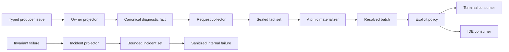

# RFC 0047: Diagnostics Architecture

## Summary

ZOM has three disjoint failure classes. User-actionable problems are immutable
canonical diagnostic facts identified by `ZOMxxxx`; compiler contract failures
are bounded internal incidents and never have a public diagnostic identifier;
allocation, I/O, external-process, and unavailable-resource failures remain typed
operational failures. Producer-owned typed issues project to facts, a request-local
collector seals one deterministic fact set, a revision-local materializer resolves
provenance atomically, and batch consumers render terminal or IDE views.

The existing partitioned `.def` files are the single catalog source. C++
compile-time checks and typed construction boundaries enforce catalog invariants.
Architecture completion is demonstrated by compiled dependency boundaries, native
unit and conformance tests, sanitizer builds, and real CLI and IDE behavior. Source
text scanners are not architecture evidence and are not implementation
prerequisites.

## Motivation

The repository already contains canonical source and Binder diagnostic facts,
revision-local provenance, incident aggregation, terminal consumers, and an IDE
projection. The production lifecycle is nevertheless split: several subsystems
emit mutable `Diagnostic` objects directly, `CompilerSession` owns diagnostic
mapping, the engine combines policy with delivery, and the IDE separately
reconstructs output. This creates observable correctness risks:

- query side effects disappear on cache hits;
- deduplication by only code and location can erase distinct occurrences;
- partial provenance resolution can publish an incomplete result;
- terminal and IDE consumers can observe different semantic sets; and
- internal invariants can be mistaken for user-correctable input errors.

The implementation also carried a proposed YAML catalog, generated-file family,
exact path ledger, and source-scanning architecture gates. Those mechanisms do
not strengthen the runtime type boundary and would create a second representation
of the catalog. The architecture should instead make invalid states
unrepresentable in C++ and test the public workflows that consume the result.

## Goals

- Define one diagnostic lifecycle from typed producer issue to sealed facts,
  materialized batch, policy, and consumers.
- Preserve query purity and equivalent results across cache hits, cache misses,
  worker scheduling, and deterministic replay.
- Keep distinct occurrence identity, semantic duplicate identity, and rendered
  equality as separate concepts.
- Use one compile-time catalog source for identifiers, severity, templates, and
  argument arity.
- Keep all diagnostic payloads owned, bounded, locale-neutral, and independent of
  `SourceManager`, query objects, and terminal output.
- Resolve all provenance before any normal consumer can observe a batch.
- Make terminal and IDE output projections of the same authoritative semantic
  facts for the same snapshot.
- Reserve `ZOMxxxx` for user-actionable problems and route compiler invariants
  through the internal incident rail.
- Delete direct-emission adapters, mutable engine state, and compatibility paths
  after their callers migrate.
- Prove the design using project-native C++ compilation, tests, and product
  workflows.

## Non-Goals

- This RFC does not define a stable JSON, SARIF, localization, or plugin API.
- This RFC does not renumber valid user-actionable diagnostics.
- This RFC does not add fix-its or source edits.
- This RFC does not make the internal fact codec a public persisted format.
- This RFC does not turn IDE recovery diagnostics into compiler acceptance
  authority.
- This RFC does not assign an umbrella `ZOM9900` or any other public code to
  compiler incidents.
- This RFC does not require a parallel YAML catalog, checked-in generated
  catalog, source-text architecture scanner, exact-path landing allowlist, or
  RFC-specific benchmark/fuzz driver.
- This RFC does not remove unrelated repository verification tools.

## Prior Art

### Rust Compiler

Rust uses structured diagnostic values with typed fields, primary spans, labels,
and notes, followed by independent emitters. ZOM adopts typed producer
projection, structured related information, and consumer-independent facts. ZOM
does not put rendered text or compiler handles into fact identity.

- <https://rustc-dev-guide.rust-lang.org/diagnostics/diagnostic-structs.html>
- <https://doc.rust-lang.org/nightly/nightly-rustc/rustc_errors/>

### Salsa And rust-analyzer

Salsa accumulators model diagnostics as query results rather than execution side
effects, and rust-analyzer converts semantic diagnostics to protocol objects at
the IDE boundary. ZOM follows the same purity and late-projection principles,
while retaining explicit ZOM occurrence and provenance identities.

- <https://salsa-rs.github.io/salsa/reference/accumulators.html>
- <https://github.com/rust-lang/rust-analyzer/tree/master/crates/ide-diagnostics>

### Clang

Clang centralizes diagnostic definitions and statically associates identifiers,
severity, groups, and formatting contracts. ZOM likewise keeps one source-level
catalog and uses compile-time expansion, but represents diagnostics as immutable
facts before output.

- <https://clang.llvm.org/docs/InternalsManual.html#the-diagnostics-subsystem>

### Swift

Swift separates typed diagnostic production from consumer presentation and
supports structured highlights, notes, and fix-its. ZOM adopts the separation and
structured location model; source edits remain outside this RFC.

- <https://github.com/swiftlang/swift/tree/main/lib/AST/Diagnostics>

### Roslyn

Roslyn treats diagnostics as immutable compilation results and projects them to
IDE protocols at the workspace boundary. ZOM adopts immutable batch publication
and stale-result rejection while using ZOM-specific canonical identities.

- <https://learn.microsoft.com/en-us/dotnet/api/microsoft.codeanalysis.diagnostic>

## Guide-Level Explanation

A compiler contributor reports a user-actionable problem in four steps:

1. The owning subsystem defines or reuses a typed issue alternative.
2. An exhaustive owner-local projector selects a catalog `DiagID` and creates a
   `DiagnosticFact` with an occurrence key and provenance keys.
3. The request collector admits complete roots, validates conflicts and ordering,
   and seals the authoritative fact set.
4. The materializer resolves the complete set against the retained snapshot.
   Policy then selects the displayed subset and a consumer renders it.

A compiler invariant follows a separate route:

1. The owning subsystem projects the failure to a registered
   `CompilerIncidentDescriptor`.
2. `BoundedIncidentSet` deterministically aggregates descriptors.
3. The CLI or IDE reports a sanitized internal failure without a `ZOMxxxx` code,
   source excerpt, user string, or host path.



The catalog remains readable C++ data under `compiler/diagnostics/defs/`. Adding
a code means adding one `DIAG` entry in its owning partition and exercising its
typed construction in a native test or production path. Duplicate identifiers,
invalid ranges, invalid templates, unsupported arity, and entries in the incident
range fail at C++ compilation.

## Reference-Level Design

### Dependency Direction

The allowed dependency direction is:

```text
producer issue -> owner projector -> diagnostic fact -> collector
collector -> materializer -> policy -> batch consumer
producer invariant -> incident projector -> bounded incident set
```

Producer and query targets may depend on catalog identifiers and fact types. They
must not depend on output consumers, streams, terminal formatting, IDE protocol
objects, or mutable presentation state. `CompilerSession` orchestrates roots and
publication but does not map issue alternatives to diagnostic identifiers.

### Failure Rails

`ZOMxxxx` is valid only when a source author, package author, build operator, or
tool user can modify admitted input or environment to correct the problem.
Compiler invariants, impossible enum alternatives, verifier disagreement, cache
corruption, and stale capability use are internal incidents. Allocation failure,
I/O failure, and unavailable external resources are operational failures; they
are neither diagnostics nor incidents unless a separately verified user action
can correct them.

The public allocation is:

| Range | Purpose |
|---|---|
| `ZOM2000-ZOM2999` | Lexing, parsing, grammar, and source shape |
| `ZOM3000-ZOM3999` | Binding, names, modules, imports, exports, and visibility |
| `ZOM4000-ZOM4999` | Types, semantics, coherence, borrow, and ownership |
| `ZOM6000-ZOM6999` | User-actionable lowering, target, runtime capability, and backend failures |
| `ZOM7000-ZOM7999` | User-actionable package, manifest, dependency, build-script, and materialization failures |
| Other ranges | Unassigned until an owning RFC allocates them |

`ZOM9900-ZOM9999` contains no live or reserved entry. Removed identifiers are not
reassigned.

### Catalog Contract

The ordered files under `compiler/diagnostics/defs/` are the sole catalog source.
Each entry supplies numeric code, symbolic name, default severity, English
template, and argument arity. The same entries instantiate `DiagID`,
`DiagnosticTraits`, immutable lookup data, and compile-time validation. There is
no copied metadata registry and no generated checked-in catalog.

The compiler must reject a catalog when any of these invariants fail:

- numeric codes or symbolic names are duplicated;
- a code is outside its owner range or inside `9900-9999`;
- a template contains malformed, repeated, skipped, or out-of-range placeholders;
- placeholder arity differs from the declared arity;
- severity is not admitted by the catalog; or
- arity exceeds the typed construction surface.

Code-specific construction uses a template parameter and therefore validates
argument count at compile time. Runtime decoding admits only known live IDs and
the exact declared argument count. Unknown IDs fail closed; they never acquire
an `Unknown diagnostic` presentation. Producer-specific semantic wrappers, such
as identifiers, types, logical paths, and counts, remain owned by the producer
and are converted to bounded owned strings or closed values at projection.

### Canonical Fact

One immutable `DiagnosticFact` contains:

- `DiagnosticOccurrenceKey`, which identifies one producer event;
- catalog `DiagID`;
- an ordered owned argument sequence;
- one primary `DiagnosticProvenanceKey`; and
- zero or more structured secondary records.

Facts contain no `SourceLoc`, `SourceManager`, borrowed string, query lease,
output stream, rendered sentence, terminal escape, or protocol object. Fact
construction validates catalog membership, exact arity, origin consistency,
secondary roles, size bounds, and deterministic canonical encoding.

Occurrence identity is not deduplication identity. Two facts with distinct
occurrence keys survive even when code, range, and arguments match. Two facts
with the same occurrence key and byte-equal payload collapse. Two facts with the
same occurrence key and different payload fail the request as an incident.

### Collection And Sealing

Each compilation request owns one collector. Producers publish complete
immutable roots; they do not call consumers. The collector:

1. validates root ownership and snapshot identity;
2. flattens facts without changing producer payloads;
3. sorts by occurrence identity for conflict detection;
4. rejects conflicting payloads for one occurrence;
5. applies only explicitly registered semantic suppression;
6. orders the retained facts canonically; and
7. seals a `CompilationDiagnosticFacts` value.

Canonical ordering uses source identity, primary provenance path, severity,
numeric code, occurrence identity, arguments, and secondary payload. Worker
completion order and insertion order never participate. Suppression occurs at
fact level, is authorized by the owning language RFC, and has positive, negative,
and permutation tests. Display budgeting is not semantic suppression.

### Provenance And Materialization

A resolver owns one exact revision-local provenance authority. Materialization
resolves every primary and secondary key, verifies source ownership and bounds,
and builds immutable `ResolvedDiagnostic` values. It returns either one complete
`ResolvedDiagnosticBatch` or a typed failure. No normal consumer can observe a
partially resolved batch.

The resolved public value exposes code, severity, owned arguments, primary
range, and related records through read-only accessors. It does not expose a
mutable `Diagnostic`, and it cannot be published twice by moving the batch into
the publication service.

Missing, foreign, stale, role-mismatched, or out-of-range provenance fails
closed and becomes an internal incident at the request boundary. IDE projection
must not replace invalid provenance with a range-less diagnostic.

### Policy

`DiagnosticPolicy` is an immutable input to publication. It owns presentation
choices such as the error limit and future warning configuration. The initial
default displays at most 100 error-or-fatal primary diagnostics while retaining
the complete authoritative batch. Notes attached to an admitted primary remain
attached. Policy never changes canonical facts or batch identity.

The policy result records displayed and omitted counts. Reaching a display limit
does not alter compilation success, query identity, incident aggregation, or IDE
authority. No mutable ignore map is stored in the semantic pipeline.

### Consumers

Normal consumers accept only an immutable published batch or a policy view over
that batch. The terminal consumer owns human formatting, escaping, source-line
display, color, and writes. The IDE consumer owns conversion to snapshot-safe
DTOs and later protocol coordinates. Neither consumer performs semantic
deduplication, provenance fallback, or issue-to-code mapping.

For one recovery-free snapshot and equivalent policy, terminal and IDE
projections agree on code, severity, multiplicity, primary range, related
information, and completeness. IDE publication is bound to the analyzed
document version; canceled or stale results publish nothing and cannot erase a
newer set.

### Incident Presentation

`CompilerIncidentDescriptor` contains registered domain, phase, kind, producer,
and occurrence count. `BoundedIncidentSet` groups and orders descriptors without
retaining source text, user identifiers, paths, addresses, raw external errors,
thread IDs, or timestamps. A stable build-local fingerprint may cover registered
shape fields but not user-controlled data or occurrence count.

The CLI reports a fixed ASCII internal-error record and exits with status 1. It
does not print `ZOMxxxx`, a source snippet, or a raw incident payload. The IDE
returns an internal-failure result and publishes no diagnostic batch for that
attempt. The last successful current-version IDE set remains authoritative until
a later successful result or document close.

### Security And Bounds

Fact and codec construction validate UTF-8 and bounded counts before allocation.
Terminal rendering escapes C0/C1 controls, escape, bidirectional controls, and
untrusted newlines. Logical paths are workspace-relative display values; host
absolute paths and credentials do not enter diagnostic facts. External-tool text
is classified and sanitized before projection.

Bounds live beside the C++ value type that enforces them and are tested at
limit-minus-one, limit, and limit-plus-one where practical. A rejected fact,
codec, provenance map, or batch produces no partial publication.

### Architecture Evidence

The architecture is enforced by the product structure itself:

- target dependencies keep producer libraries independent of consumers and
  output streams;
- private constructors and typed factories prevent arbitrary facts and batches;
- exhaustive enum projection turns a missing issue mapping into a compiler
  diagnostic;
- `static_assert` catalog validation proves catalog invariants at build time;
- ztest exercises fact validation, occurrence conflicts, ordering, policy,
  materialization, incident separation, and terminal/IDE parity;
- query tests compare cold, warm, shuffled, and replayed results; and
- CLI and IDE integration tests exercise the real public boundary.

Repository searches are useful during review but are not proof and do not become
RFC-specific architecture gates. `scripts/check-format.py`, `scripts/check-rfc.py`,
and existing project-wide checks retain their ordinary purposes.

## Repository Impact

| Area | Paths | Owner |
|---|---|---|
| RFC and implementation tracking | `docs/rfc/0047-*.md`, `docs/rfc/tracking/0047-*.md`, `docs/rfc/README.md` | `rfc` |
| Contributor routing and architecture rules | `AGENTS.md`, `.codex/rules/**`, `.codex/subagents/**` | `task-router` |
| Catalog, facts, collection, materialization, policy, rendering, consumers | `compiler/diagnostics/**` | `error-system` |
| Source diagnostic production | `compiler/lexer/**`, `compiler/parser/**`, `compiler/ast/**`, `compiler/cst/**` | `lexer-parser` |
| Binder, Checker, and type projectors | `compiler/binder/**`, `compiler/checker/**`, `compiler/type/**` | `binder-checker` |
| Incidents, query roots, identity, driver orchestration, packages | `compiler/basic/incident/**`, `compiler/query/**`, `compiler/identity/**`, `compiler/driver/**` | `module-system` |
| HIR, MIR, LIR, IR, backend, and CLI projection | `compiler/hir/**`, `compiler/mir/**`, `compiler/lir/**`, `compiler/ir/**`, `compiler/backend/**`, `utils/zomc/**` | `ir-backend` |
| Borrow and move diagnostics | `compiler/ownership/**` | `runtime-memory` |
| IDE and LSP projection | `compiler/ide/**`, `compiler/lsp/**`, `tools/ide/**`, `tools/lsp/**`, `editors/**` | `tooling-lsp` |
| Current design and specification alignment | `docs/design/**`, `docs/spec/**`, `docs/overview.md` | `spec-audit` |
| Native tests, build, CI, and product verification | `tests/**`, build files, `.github/workflows/**` | `verification` |

## Security And Safety Impact

The design reduces accidental disclosure by excluding source content, host paths,
raw external messages, and process-local handles from canonical facts and
incidents. Owned values remove borrowed-lifetime hazards at asynchronous and
incremental boundaries. Atomic materialization prevents a consumer from seeing a
partially validated set. Terminal and protocol escaping occurs only at the
consumer boundary.

The main residual risk is excessive diagnostic input causing memory or CPU
pressure. Bounded constructors, bounded decoding, explicit display budgets, and
sanitizer-backed boundary tests mitigate it.

## Drawbacks And Risks

- Migrating all direct emitters is a broad internal refactor. The migration is
  split by producer owner and each slice must end in one compiled data path.
- Typed fact and provenance values add code compared with direct printing. Their
  benefit is deterministic query behavior and consumer independence.
- A `.def` catalog is less expressive than a schema language. It is sufficient
  for the current code, severity, template, and arity contract; richer semantic
  argument kinds should be added only when a real producer and consumer require
  them.
- Strict provenance failure may reveal latent IDE bugs that range-less fallback
  previously hid. Failing closed is required to avoid publishing misleading data.
- Removing `DiagnosticEngine` changes many tests. Tests should assert facts or
  batch views, not recreate an engine compatibility facade.

## Alternatives Considered

### Keep Direct-Emission Adapters

This preserves side effects in query-adjacent code and prevents one authoritative
batch. It does not satisfy cache equivalence or terminal/IDE parity.

### Introduce A YAML Catalog And Code Generator

This can model a rich schema, but the repository already has one concise catalog
consumed directly by C++. A YAML mirror and generated outputs add synchronization,
tool bootstrap, and review cost without closing a production boundary. The `.def`
catalog plus compile-time validation is the proportionate design.

### Prove Layering With Source-Text Scanners

Text scanners can find naming patterns but cannot prove C++ dependency direction,
factory privacy, exhaustive projection, cache equivalence, or runtime publication
semantics. Compiled APIs, target links, and native behavior tests provide direct
evidence.

### Cache Rendered Diagnostics

Rendered output depends on source revisions, policy, locale, terminal capability,
and protocol coordinates. Caching canonical facts keeps semantic identity stable
and materializes presentation only with the correct revision authority.

### Deduplicate By Code And Location

This loses distinct semantic occurrences and related information. Explicit
occurrence identity supports both exact duplicate collapse and conflict detection.

### Give Incidents A Public Diagnostic Code

A public code implies a user-actionable stable contract. Internal invariants need
privacy-preserving grouping and bug-reporting semantics, not normal diagnostic
policy.

## Compatibility And Rollout

This is an internal breaking refactor. There are no aliases, versioned internal
types, dual codecs, bridge adapters, or feature flags. Existing user-actionable
code meanings remain stable. Removed invariant codes remain unassigned.

Implementation proceeds in coherent slices:

1. establish and test the incident rail, then migrate each invariant family and
   remove its public code in the same slice;
2. strengthen the existing `.def` catalog and canonical fact validation;
3. introduce sealed collection, immutable resolved values, explicit policy, and
   batch consumer APIs;
4. migrate source, Binder, Checker, Ownership, IR/backend, package, and driver
   producers to facts;
5. move terminal and IDE output to the shared batch boundary; and
6. delete engine, emitter, mutable state, and adapters when no caller remains.

Intermediate commits must compile and test. They may temporarily contain an
unmigrated subsystem using the existing path, but a diagnostic occurrence must
never travel through both paths and no compatibility facade may be introduced.
Rollback is commit-level source reversion; there is no persisted user data
migration.

## Documentation And Teaching Plan

At landing, `docs/design/diagnostics.md` documents only the implemented catalog,
fact, collector, materializer, policy, incident, terminal, and IDE boundaries.
`AGENTS.md` and scoped rules summarize ownership and the no-direct-emission rule.
User-visible diagnostic semantics remain in the owning language or tool contract.
Release notes describe intentional output changes.

## Operational Readiness

The terminal path must retain deterministic no-color output for tests and must
propagate write failures. Incident output must remain allocation-minimal and
privacy-preserving. Diagnostic counts, policy truncation, and consumer failures
may be observed, but telemetry must not include source text, argument payloads,
paths, or credentials.

Dedicated performance or fuzz infrastructure is required only when profiling or
risk evidence identifies a concrete gap that existing native tests and sanitizer
coverage cannot address. Such infrastructure follows repository-wide patterns
and is not a prerequisite invented solely for this RFC.

## Acceptance Criteria

- The `.def` catalog is the only source of diagnostic identifiers and metadata.
- C++ compilation validates code/name uniqueness, code allocation, template
  placeholders, argument arity, and exclusion of `ZOM9900-ZOM9999`.
- Unknown or malformed catalog IDs and fact payloads fail closed.
- Every public diagnostic represents a user-actionable condition; every migrated
  invariant family uses only `CompilerIncidentDescriptor`.
- `CompilationDiagnosticFacts` is the sole semantic root for a completed
  compilation request.
- Same-code, same-location facts with distinct occurrence identities survive;
  conflicting payloads for one occurrence fail closed.
- Every live origin has a resolver, and materialization publishes all or nothing.
- `ResolvedDiagnosticBatch` is immutable and is the sole normal consumer input.
- Error budgeting is explicit policy and does not mutate the authoritative batch.
- Terminal and IDE output agree for the same recovery-free snapshot, and stale or
  canceled IDE work publishes nothing.
- No producer, query provider, or `CompilerSession` issue mapper emits directly
  to an output consumer.
- `DiagnosticEngine`, `DiagnosticState`, `DiagnosticEmitter`,
  `InFlightDiagnostic`, and owner-local emission adapters have no production
  callers and are deleted.
- Native tests cover catalog validation, facts/codecs, conflicts, ordering,
  provenance, policy boundaries, incidents, terminal rendering, IDE projection,
  cold/warm query equivalence, and deterministic worker order.
- Sanitizer configure/build, the complete test preset, conformance diagnostics,
  formatting, RFC validation, and representative real CLI and IDE workflows pass.
- Current documentation describes only the landed implementation and records any
  remaining limitation explicitly.

## Implementation Plan

1. Align RFC governance and contributor rules with compiled, native evidence.
2. Complete compile-time catalog validation and fact construction invariants.
3. Complete the incident rail and remove all invariant diagnostic mappings.
4. Add request-local fact collection, conflict validation, deterministic ordering,
   immutable resolved values, and explicit policy.
5. Migrate source and semantic producers to typed issue projectors and facts.
6. Migrate session, CLI, terminal, and IDE consumers to the sealed batch.
7. Delete direct-emission APIs, adapters, and unused mutable state.
8. Add native regression coverage and run the complete verification matrix.
9. Publish the current design document, audit the full diff, and move the RFC to
   `LANDED` only when every acceptance criterion has evidence.

## Test Plan

- Build: `cmake --preset sanitizer` and `cmake --build --preset sanitizer`.
- Unit: focused diagnostics, producer-projector, session, query, incident, and IDE
  tests, then `ctest --preset default -L unittest --output-on-failure`.
- Lit: `ctest --preset default -L lit --output-on-failure`.
- Full: `ctest --preset default --output-on-failure`.
- Conformance: the repository's diagnostics conformance target through CTest.
- Product: successful and failing `zomc compile --check` runs, an invariant
  incident case, and an IDE snapshot diagnostic case.
- Catalog: compile-time negative fixtures where the native test infrastructure
  supports them, plus runtime decode boundary tests.
- Format and governance: `python3 scripts/check-format.py`,
  `python3 scripts/check-rfc.py`, and `git diff --check`.
- Generated files: none for RFC 0047.

## Open Questions

None

## Status History

| Date | Status | Notes |
|---|---|---|
| 2026-09-05 | DRAFT | Initial standalone diagnostics architecture based on current-state and prior-art review. |
| 2026-09-05 | REVIEW | Entered owner review after the initial design audit. |
| 2026-09-05 | RETURNED | Owner review identified catalog, incident, provenance, IDE, and rollout gaps. |
| 2026-09-05 | DRAFT | Revised the proposal to resolve the complete finding set. |
| 2026-09-05 | REVIEW | Entered unchanged-snapshot owner review. |
| 2026-09-05 | ACCEPTED | All required owners approved the reviewed architecture. |
| 2026-09-05 | IMPLEMENTING | Began the incident migration and corrected implementation governance to use the existing `.def` catalog, C++ type boundaries, native tests, and product behavior as evidence. |
| 2026-09-06 | LANDED | Repository-wide cutover complete. The three failure rails are implemented, every live producer projects typed facts, the sealed batch is the sole normal consumer input, and the mutable engine, direct-emission APIs, in-flight diagnostic API, and owner-local adapters are deleted with zero production callers. Evidence: sanitizer configure and build clean; `ctest --preset default --output-on-failure` 328 of 328 passing; format, RFC, English-only, internal-versioning, stable-binding-schema, diagnostic-coverage (199 defined, 167 emitted, 32 tracked reservations, 4 of 4 negative fixtures), parser-coverage, ownership-architecture, ownership-determinism, compiler-session-architecture (35 of 35 negative fixtures), identity-architecture, incremental-query-architecture, and `git diff --check` all passing; and the three representative CLI contracts verified exactly. RFC 0002 was amended the same day to remove the parse error budget and location-based deduplication, which this RFC's retention and occurrence-identity contracts supersede. |
