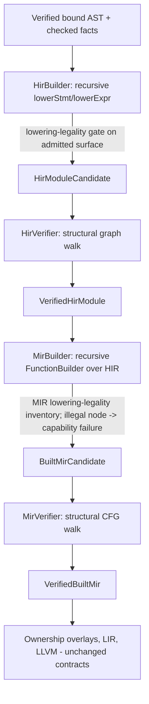

# RFC 0048: Recursive IR Construction And Structural Verification

## Summary

Replace the function-body "shape rail" scaffolding in HIR and Built MIR
construction with general recursive lowerers driven by expression and statement
visitors, and replace the hand-written count-equation and per-shape verifiers
with general structural verifiers that walk the IR graph. HIR construction
becomes a recursive `lowerExpr` / `lowerStmt` over the bound AST plus checked
facts; Built MIR construction becomes a recursive `FunctionBuilder` that lowers
HIR into a place-based CFG, materializing temporaries and terminators the way
rustc's THIR-to-MIR builder and Cranelift's `FunctionBuilder` do. A single
lowering-legality inventory decides which node kinds the current slice can emit;
every other node fails closed through the recursive walk into the existing
capability diagnostic (ZOM4099 family) instead of being rejected by a
whole-function template match. The HIR and MIR artifact contracts of RFC 0010
are unchanged; only their construction and verification algorithms change.

## Motivation

RFC 0010 specifies a source-shaped, expression-bearing HIR and a general
place-based, CFG MIR. The IR types already model the full target language. The
construction path does not: `HirBuilder` and `BuiltMirBuilder` accept a function
body only when it matches one of a hand-enumerated set of whole-function
templates. Each template is:

1. Detected by a shape classifier that is written three times
   (`surface-admission.cc`, `hir-module.cc::functionReturnShape`,
   `built-mir.cc::isSequentialLocalReturnBlock` and friends), each independently
   re-deriving the classification from the tree because no layer trusts the
   previous one.
2. Assigned a fixed ordinal node layout (for example one binary binding occupies
   four hard-coded ids: local, initializer, left operand, right operand).
3. Validated by global count equations (`facts.nodeTypes().size() == pending.size()
   + ... + sequentialBinaryCount * 2 + ...`) plus a separate per-shape verifier
   (`validSequentialLocalReturnFunction`, `validLoopReturnFunction`,
   `validReceiverCallReturnFunction`, and so on).

Consequences observed in practice:

- Adding one expression form (`let x: bool = a == b; return x;`) required editing
  three classifiers, re-balancing the count equations, introducing a parallel
  single-local binary rail, and choosing which rail routes the body. The correct
  fix was to recognize the form as an already-supported sequential shape with one
  binding; nothing about the IR itself was missing.
- Count equations are weak invariants. They detect a missing or duplicated node
  but cannot detect a mis-wired edge, a wrong operand type, or a use before
  definition. The strong checks are duplicated per shape rather than expressed
  once over the graph.
- The mechanism does not generalize. Control flow, nested calls, closures, and
  aggregate construction each need a new whole-body template and a third copy of
  the classifier, which is precisely the complexity that mature lowerers avoid.

The project requires the world-class target design, not a temporary scaffold.
Mature production compilers lower every syntax form uniformly by recursive
descent into a general IR and verify the result structurally; they do not match
whole-function AST templates. This RFC replaces the scaffold with that design.

## Goals

- HIR construction is a single recursive walk over the verified bound module and
  checked facts. There is no whole-function shape classifier on the construction
  path.
- Built MIR construction is a single recursive walk over HIR using an append-only
  block/statement builder. There is no per-shape MIR emitter.
- Verification is structural: the HIR verifier walks the HIR graph and the MIR
  verifier walks the CFG, validating every node, edge, type, and terminator
  locally. The global count equations and per-shape verifier functions are
  deleted.
- Fail-closed capability behavior is preserved through a lowering-legality
  inventory. Every program the current slice accepts still compiles; every
  program it rejects still receives the same capability diagnostic. Unsupported
  constructs are rejected at the exact node that cannot be lowered, never as an
  internal compiler error.
- Adding a new emittable expression kind is a localized change: one visitor arm
  plus, when needed, the legality inventory and tests. It must not require
  editing three classifiers or re-balancing count equations.
- The verified `HirModuleCandidate` / `VerifiedHirModule` / Built MIR /
  `VerifiedBuiltMir` artifact contracts and their revision identities from
  RFC 0010 are unchanged so downstream ownership overlays and LIR/LLVM consumers
  are unaffected.

## Non-Goals

- Expanding the set of emittable language constructs. The legality inventory
  initially admits exactly the node kinds admitted today; supporting new forms is
  follow-on work that this design makes cheap.
- Changing the HIR or MIR node vocabulary, codec, revision scheme, or canonical
  encoding defined in RFC 0010.
- Replacing ownership, drop, or borrow analysis (RFC 0007 / RFC 0013). Those
  consume Built MIR; this RFC changes how Built MIR is built, not what it means.
- SSA form for MIR. RFC 0010 deliberately specifies a place-based MIR because
  ownership applies to storage locations; the structural verifier validates a
  place-based CFG, not SSA dominance. (The later LIR layer owns SSA.)
- Adopting an external IR framework. RFC 0010 evaluated and rejected adopting
  MLIR as the implementation framework; this RFC reaffirms that decision.

## Prior Art

### Rust `rustc` THIR-to-MIR builder

`rustc` lowers the typed HIR (via THIR) into MIR with a single recursive builder
(`rustc_mir_build::build`). A lowering context walks statements and expressions;
expressions are lowered into a destination place (`expr_into_dest`), into a fresh
temporary (`as_temp`), or as an operand (`as_operand` returning a constant, copy,
or move). Value-typed sub-expressions that are not directly placeable are
materialized into synthesized temporaries; statements and terminators are
appended to the current basic block; control flow creates blocks and links them
with terminators. There is no enumeration of whole-function shapes.

ZOM should copy the destination-driven recursion: `exprIntoDest(place, expr)`,
`asTemp(expr)` for rvalue results, `asOperand(expr)` for constant/copy/move
operands, and an append-only block cursor. This directly subsumes the sequential,
single-local, and comparison rails, including nested-operand materialization
(`a + b * c` lowers the inner binary into a temporary naturally rather than via a
reserved fixed id).

### Cranelift `FunctionBuilder` and `Verifier`

Cranelift constructs CLIF with a `FunctionBuilder` / `BlockBuilderCursor`: blocks
and instructions are appended in program order, block arguments are declared up
front, and blocks are sealed once all predecessors are known. A separate
`Verifier` then checks every instruction's type signature, SSA legality, block
termination, and value definition-before-use purely from the constructed function,
independent of the construction path.

ZOM should copy two things: the append-only builder/cursor split (construction is
local and order-driven, never shape-driven) and the principle that verification is
an independent structural pass over the finished artifact, expressed per
instruction rather than as global counts.

### MLIR operation verification and conversion legality

MLIR defines operations generically; each op supplies a `verify()` that checks
its operands, results, attributes, and regions, and `mlir::verify()` walks the
whole IR. Dialect conversion separates what an op means from whether it is legal
on the target: a legality/illegal-op inventory drives lowering, and an op that
cannot be converted is a hard, reported failure rather than a crash or a silently
missing node.

ZOM should copy the legality-inventory seam: the recursive builder always knows
how to walk every node, but a separate `LoweringLegality` table decides which node
kinds the current MIR slice emits. Walking an illegal node produces a typed
capability failure that surfaces as the existing capability diagnostic. This is
how ZOM keeps fail-closed slices without whole-function templates.

### Swift SILGen

SILGen walks the AST with a visitor and a lowering context, materializing cleanups
and managed values as it goes. The visitor/context split is a sound model for
threading per-function lowering state (local id allocation, scope table, block
cursor) without global mutable tables. ZOM should copy the explicit per-function
context object. The failure to avoid is SILGen's long accumulation of special-case
prologues; the legality inventory keeps unadmitted forms out of the builder
rather than accumulating partial cases.

### Common failure modes avoided

- Count-equation invariants (weak: they miss mis-wired edges and type errors) are
  replaced by per-node edge and type validation.
- Fixed-ordinal layouts (a serialization/snapshot convenience mistaken for a
  semantic requirement) are replaced by deterministic append-order allocation;
  byte stability becomes a consequence of a deterministic traversal, asserted by
  edge/type oracles rather than absolute id arithmetic.
- Whole-function template matching (non-compositional) is replaced by compositional
  recursion, so nested and future constructs lower without new top-level shapes.

## Guide-Level Explanation

A contributor adding support for a new expression, say a binary operator or a
call, adds one arm to the expression lowerer. They do not describe the shape of a
function body. The lowerer walks the AST (for HIR) or HIR (for MIR), allocates
nodes or locals as it descends, wires child results to parents, and either emits
the node or, if the node kind is not in the current legality inventory, reports
that the construct is not yet code-generated.

A contributor debugging a miscompile reads a structural verifier failure that
names the node and the violated local invariant ("operand type i32 does not match
rvalue operand type bool", "terminator references undefined local", "block is not
terminated") instead of a global count mismatch ("expected 11 node-type facts,
found 12") that must be re-derived by hand.

The set of programs that compile and the diagnostics they produce do not change
when this RFC lands; the change is internal architecture. After it lands, the
roadmap to support more language is to move node kinds into the legality inventory
and implement their lowering arm, one compositional piece at a time.

## Reference-Level Design

### Overview

The artifact boundaries and revision identities are exactly those of RFC 0010.
This RFC replaces only the four boxes `HB`, `HV`, `MB`, `MV`.

### HIR construction

`HirBuilder` holds a per-function `HirFnCtx` with an append-only node id counter,
a local-binding table, and a fact resolver. It exposes:

- `lowerModule(ctx)`: walks declarations; constants and functions.
- `lowerStmt(ctx, stmt)`: emits HIR statements; a `let` declares a binding and
  lowers its initializer expression; `return` lowers its value expression and
  emits a return node.
- `lowerExpr(ctx, node, hint)`: the single recursive expression entry point. It
  allocates one HIR node for `node`, recursively lowers child expressions and
  records their node ids as explicit edges, resolves and consumes exactly the
  checked facts attributable to `node` (node type, literal, call/dispatch,
  aggregate, member, place, and so on), and returns the node id.

Invariant properties:

- Node ids are allocated in deterministic traversal order. There are no fixed
  strides and no reserved trailing id regions; edges (`left`, `right`,
  `initializer`, `value`, condition arms) are the sole identity of node
  relationships.
- Each checked fact is consumed at exactly the node it is keyed to, asserted by
  the fact resolver. There is no per-shape tally.
- The builder never invents a fact; a missing fact for an admitted node is a
  compiler invariant failure. An unsupported node kind for the current surface
  slice is refused before HIR construction by the surface capability gate (see
  below), so HIR construction sees only admitted nodes.

The shape classifier (`functionReturnShape`, `sequentialLocalShape`, and the
shape dispatch) and the per-shape `PendingFunctionDeclaration` arms
(`conditionalReturn`, `loopReturn`, `comparisonReturn`, `sequentialLocalReturn`,
and the single-local/field/reborrow/borrow/receiver/write arms) are deleted.
`PendingFunctionDeclaration` collapses to a context-driven builder state.

### Built MIR construction

`MirBuilder` owns a per-function `MirFnCtx`:

- the parameter and user-local declarations with canonical `MirLocalId`s;
- a `BlockCursor` over the current basic block;
- a source-scope table.

It exposes the destination-driven recursion adapted from rustc/Cranelift:

- `lowerStmt(ctx, hirStmt)`: a local declaration emits `StorageLive` and lowers
  its initializer into the local's place; an assignment lowers the rvalue into
  the destination place; a return lowers its value to an operand and emits a
  `Return` terminator; control-flow constructs create blocks and terminators.
- `exprIntoDest(ctx, place, hirExpr)`: lowers an expression directly into a place.
- `asTemp(ctx, hirExpr)`: materializes a value-typed expression into a fresh
  `Temporary` local (`StorageLive` + `Assign`) and returns its place. Nested
  operands (for example `a + b * c`) are handled by `asTemp` on the inner
  expression, eliminating the reserved-temp fixed id.
- `asOperand(ctx, hirExpr)`: returns a constant operand for a literal, a `copy`
  of a parameter or local place for an identifier, or `move` per the checked
  move fact.
- Rvalue construction maps a HIR primitive binary to `MirRvalue::arithmetic` or
  `MirRvalue::comparison` with operand places from `asOperand`/`asTemp`; calls,
  aggregates, and future forms follow the same recursion.

Blocks are appended and terminated in traversal order. The current admitted slice
produces one block per function body; the builder is block-general so future
conditionals and loops add arms without restructuring.

### Lowering legality and fail-closed capability behavior

A `LoweringLegality` inventory enumerates the HIR node kinds the current MIR slice
emits. It is derived as the set of node kinds for which `MirBuilder` has an
emitting arm and that the ownership overlay contracts accept.

- During MIR construction, encountering a node kind outside the inventory returns
  a typed `CapabilityUnavailable` failure keyed to that node's source span. The
  diagnostic layer renders it as the existing capability diagnostic (the ZOM4099
  family and its per-construct siblings).
- HIR is constructed for every surface-admitted construct; the recursive HIR
  builder does not gate on legality. The capability decision lives at the emit
  boundary (MIR), matching RFC 0010's statement that missing lowering capability
  is a capability error rather than a malformed IR.
- Surface admission (`surface-admission.cc`) stops classifying whole-function
  shapes. It retains only the node-local structural checks that protect parser and
  binder invariants (no recovery nodes, well-formed declarators); body-shape
  admission is removed because legality is enforced node-by-node during lowering.
  The initial inventory is chosen so the accept/reject partition over the
  conformance corpus is byte-identical to today.

### HIR structural verification

The HIR verifier walks the produced HIR graph once and validates, per node:

- the node exists, has a canonical result type, a source span, and no parser
  recovery node;
- every edge id resolves to an existing node of the expected kind and that
  operand/result types match (for example a primitive binary's operand type is
  shared by both operands and its result type is the binary's result type; a
  comparison's result type is bool);
- each HIR expression is backed by exactly the checked facts it requires,
  identities resolve, and visibility/dispatch/coercion fields are present;
- the block/statement graph is closed (every block's statements and return
  resolve); local references resolve to declared locals in scope.

This is a graph structural validation, expressed locally per node. The global
count equations and every per-shape HIR validation branch are deleted.

### Built MIR structural verification

The MIR verifier walks the CFG and validates, independent of construction:

- every function has a closed CFG: reachable blocks exist, every block ends in a
  terminator, terminator targets resolve;
- every local is declared with a type; `StorageLive` precedes use of a place;
- every rvalue's operands are in scope and their types match the rvalue
  (arithmetic/comparison operand types are equal scalars; result type matches the
  destination place);
- every operand use (`copy`/`move`/constant) is well-typed against its place;
- terminator operands are typed and match the terminator; return value type
  matches the function result;
- ownership inputs and source scopes are complete per RFC 0010's Built MIR
  verifier contract.

This subsumes `validSequentialLocalReturnFunction`, `validLoopReturnFunction`,
`validReceiverCallReturnFunction`, and the other per-shape verifier functions,
which are deleted.

### Determinism and byte stability

Node and local ids remain deterministic because they are allocated in a fixed
traversal order. The fixed-ordinal per-shape layouts are removed; oracle tests
assert on edges, types, and opcode sequences rather than absolute id arithmetic,
while serialized artifacts remain reproducible for the same input because the
traversal is deterministic.

## Repository Impact

| Area | Paths | Owner |
|---|---|---|
| HIR construction and verification | `compiler/hir/**` | `ir-backend` |
| Built MIR construction and verification | `compiler/mir/**` | `ir-backend` |
| Surface capability admission | `compiler/ownership/admission/**` | `error-system`, `ir-backend` |
| Checked facts consumed by lowerers | `compiler/checker/**` (read-only contracts) | `binder-checker` |
| Ownership overlay inputs (Built MIR consumers, contracts unchanged) | `compiler/ownership/**` | `verification` |
| Unit, lit, conformance, and oracle tests | `tests/**` | `verification` |
| Canonical codec / byte-oracle baselines | `compiler/mir/**`, `tests/coverage/**` | `ir-backend`, `verification` |

## Security And Safety Impact

No new memory-safety, concurrency, sandbox, or data-exposure surface is
introduced: this is an internal construction/verification refactor with unchanged
IR semantics. The safety posture improves: fail-closed behavior moves from
whole-shape matching (which can silently fail open if a template is missed) to an
explicit legality inventory plus per-node structural verification, so an
un-lowered or ill-formed node is always detected and reported as a capability
diagnostic or a compiler invariant rather than producing an invalid artifact.

## Drawbacks And Risks

- Refactor size. Replacing four components (HIR build/verify, MIR build/verify)
  is a large change. Risk is limited by keeping artifact contracts fixed and by
  requiring corpus-wide accept/reject and diagnostic byte-parity at each phase.
- Verifier coverage regression. The structural verifier must be at least as
  strong as the union of the per-shape verifiers it replaces. This is mitigated by
  mutation tests (the existing oracle mutation harness is extended to mutate edges
  and types, not just opcode tags) and by porting every concrete invariant the
  shape verifiers check into a local graph check before deleting each shape
  verifier.
- Legality inventory drift. If the inventory admits a node the builder cannot
  emit, construction fails; if it omits a node that used to compile, a valid
  program spuriously reports a capability diagnostic. The parity gate over the
  full conformance corpus catches both before landing.
- Oracle rewrite. Fixed-id byte oracles are rewritten to edge/type oracles. This
  is intended but is test-maintenance work and must not reduce the strength of the
  byte-level canonical-codec checks.

## Alternatives Considered

- Keep and extend the shape rails. Rejected. It does not compose (every new form
  needs a third classifier copy and count-equation rebalancing), accumulates
  overlapping rails, and contradicts the design principle of radical refactoring
  over incremental templates.
- Adopt MLIR/another external IR framework. Reaffirms RFC 0010's rejection; the
  cost and dependency outweigh the benefit, and MLIR's legality/verification
  *patterns* are adopted conceptually without the framework.
- Recursive construction but keep count-equation verification. Rejected. Counts
  cannot validate edges or types and would continue to demand per-shape tally
  maintenance, defeating the purpose of the recursive builder.
- SSA MIR from construction. Rejected for this layer. RFC 0010 mandates a
  place-based MIR for ownership; SSA is introduced at LIR where dominance is
  already required.

## Compatibility And Rollout

This is a same-repository radical refactor with no compatibility shims and no
dual builders. The invariant that keeps it safe is parity: at every phase the
full conformance corpus and unit tests must produce identical accept/reject
decisions and diagnostics, and identical (or deliberately re-oracled) IR bytes.

1. Phase 1 - Recursive HIR construction. Implement `lowerStmt`/`lowerExpr` and
   the per-function context; delete the shape classifier and per-shape pending
   arms. Build HIR for all currently surface-admitted constructs. Acceptance:
   verified-HIR parity for every corpus program.
2. Phase 2 - Structural HIR verifier. Port every local invariant from the count
   equations and shape validators into per-node graph checks; delete the counts
   and shape validation branches. Extend HIR mutation tests.
3. Phase 3 - Recursive MIR construction. Implement `MirFnCtx`, the block cursor,
   `exprIntoDest`/`asTemp`/`asOperand`, and rvalue/terminator emission; delete
   the per-shape MIR emitters. Introduce the MIR `LoweringLegality` inventory set
   to today's emitted set.
4. Phase 4 - Structural MIR verifier. Replace per-shape verifier functions with
   the CFG walk; port each invariant; extend MIR mutation tests to edges/types.
5. Phase 5 - Legality seam. Reduce surface admission to node-local structural
   checks; route unsupported constructs through the MIR legality failure to the
   capability diagnostic. Delete the body-shape classifiers in surface admission.
   Confirm corpus diagnostics are byte-identical.

Generated files and byte-oracle baselines (`tests/coverage/**`, MIR canonical
encoding fixtures) are regenerated or re-oracled in the phase that changes them.
Rollback cost per phase is a single revert because artifact contracts are stable.

## Documentation And Teaching Plan

- Update the compiler IR design notes under `docs/design/ir/` to describe the
  recursive builder and structural verifier as the current production mechanism,
  identifying the builder, independent verifier, session publisher, consumers,
  and tests per the existing design-note contract.
- Update any RFC 0010 implementation-tracker language that describes construction
  as shape-based; RFC 0010's normative IR contract is unchanged and needs no
  edit.
- Add a short contributor note showing how to add an expression kind via one
  visitor arm plus the legality inventory.

## Operational Readiness

None beyond normal CI. No CLI, runtime, release, or performance contract changes
are intended; compile-time cost is expected to improve (one walk instead of three
classifiers), but no performance gate is required beyond existing build times.

## Acceptance Criteria

- No whole-function shape classifier remains in HIR construction, MIR construction,
  or surface admission: `functionReturnShape`, `sequentialLocalShape`,
  `isSequentialLocalReturnBlock`, the `Pending*Return` arms, the fixed-id layout
  blocks, and the global count equations are deleted.
- Adding a new emittable expression kind requires at most one `lowerExpr`/MIR
  arm, one legality-inventory entry, and tests; no third classifier and no count
  rebalance (demonstrated by a pilot node kind added in the implementation
  phase).
- The structural HIR and MIR verifiers reject injected edge, type, scope, and
  terminator mutations via mutation tests.
- Over the full conformance corpus and unit suites, every program has the same
  accept/reject outcome and the same rendered diagnostic before and after; IR
  artifacts satisfy the unchanged RFC 0010 codec.
- Full `sanitizer` preset build and `ctest --preset default` pass;
  `scripts/check-format.py` and the architecture gates pass.

## Implementation Plan

1. Land this RFC (REVIEW -> ACCEPTED).
2. Phase 1 recursive HIR builder behind the existing `HirModuleCandidate`
   contract; corpus parity.
3. Phase 2 structural HIR verifier with mutation coverage.
4. Phase 3 recursive MIR `FunctionBuilder` and `LoweringLegality` inventory;
   corpus parity.
5. Phase 4 structural MIR verifier with edge/type/terminator mutation coverage.
6. Phase 5 move capability gating to the MIR legality seam; delete surface
   body-shape classifiers; byte-parity confirmation.
7. Refresh IR design notes and contributor documentation.

## Test Plan

- Build: `cmake --preset sanitizer && cmake --build --preset sanitizer`.
- Unit tests: recursive builder per-node-kind tests; structural verifier tests
  including edge/type/terminator/scope mutation cases; HIR and MIR module tests.
- Lit tests: full `ctest --preset default -L lit`; AST and diagnostics
  expectations remain green.
- Conformance: before/after parity run over the entire corpus asserting identical
  exit codes and rendered diagnostics (especially the ZOM4095-4105 capability
  family and type-error codes).
- Generated files: regenerate MIR canonical-encoding and coverage baselines under
  `tests/coverage/**`; run the ownership determinism baseline check.
- Format and gates: `python3 scripts/check-format.py`, the IR architecture and
  diagnostics-layering gates, and `python3 scripts/check-rfc.py` for this
  document.

## Open Questions

- None. The legality inventory initially mirrors today's emitted set; expanding
  coverage is tracked by the existing implementation plan rather than this RFC.

## Status History

| Date | Status | Notes |
|---|---|---|
| 2026-09-10 | DRAFT | Initial draft. |
| 2026-09-10 | REVIEW | Opened for owner review; proposal snapshot recorded in the tracker. |
