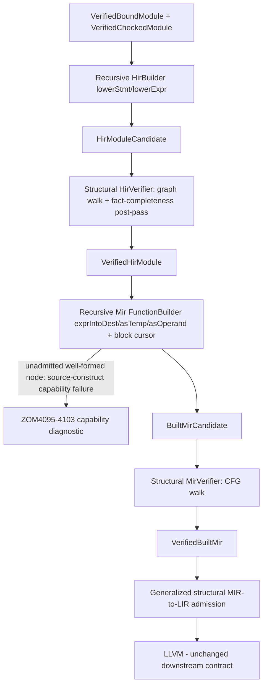

# RFC 0048: Recursive IR Construction And Structural Verification

## Summary

Replace the function-body "shape rail" construction and verification in HIR and
Built MIR with general recursive lowerers driven by expression/statement
visitors, and replace the hand-written count-equation and per-shape verifiers
with structural verifiers that walk the IR graph. To make fail-closed
capability behavior correct at the same time, this RFC also (1) extends the
RFC 0010 IR failure algebra with a *source-construct* capability failure that is
legal at the HIR/MIR construction phases and projects to the existing ZOM4095 -
ZOM4099 / ZOM4103 diagnostic family, (2) moves lowering-shape and staging gates
out of checker body-fact production so type-valid constructs always publish
facts, and (3) generalizes the positional per-shape admission in the LIR
lowering layer so it consumes structural MIR rather than re-matching shapes.

This is therefore a coordinated change across the checker body rail, the IR
failure algebra and capability projector, HIR construction/verification, Built
MIR construction/verification, and the LIR admission/lowering layer. The HIR/MIR
*vocabulary*, codec framing, and revision-identity scheme of RFC 0010 are
unchanged; the IR failure matrix gains one new capability row, and absolute node
and local ordinals are allowed to change to a single deterministic convention
(with all canonical oracles regenerated and full corpus parity proven by a new
parity tool).

## Motivation

RFC 0010 specifies a source-shaped, expression-bearing HIR and a general
place-based CFG MIR. The IR types already model the target language, but three
construction-time mechanisms are shape-template scaffolding rather than general
lowering, and they are duplicated across layers:

1. **Whole-function shape classification.** `HirBuilder` accepts a body only when
   it matches an enumerated template (`functionReturnShape`,
   `sequentialLocalShape`, plus conditional, loop, comparison, single-local,
   field, reborrow, borrow, receiver-call, mut-write, and loop-body arms). The
   same classification is independently re-derived in surface admission
   (`surface-admission.cc`) and in checker body fact production
   (`primitiveBinaryOperationShape`, `directCallShape`, the stage-0..4 schedule
   in `body-checker.cc`) and again in MIR (`isSequentialLocalReturnBlock` and the
   `valid*ReturnFunction` verifier dispatch).
2. **Fixed-ordinal node/local layouts and global count equations.** HIR reserves
   hard-coded id strides per shape (one binary binding = local, initializer,
   left, right), and both HIR and MIR validate with global fact-count equations
   and per-shape verifier functions. Count equations detect a missing or
   duplicated node but not a mis-wired edge or a type error.
3. **Capability rejection split across the wrong layers.** A well-typed,
   surface-admitted construct that lowering cannot yet emit is today sometimes
   rejected as a checker *invariant* (`rejectInvariant(... MissingRequiredFact)`
   in `body-checker.cc`, 58 sites) or as an HIR/MIR invariant
   (`rejectHir`/`rejectMir` always decode `IrInvariantRejected`), which surfaces
   as an internal compiler error rather than a user capability diagnostic.
   Meanwhile the user-facing ZOM4095-4103 family is produced only by ownership
   surface admission and the checker source rail, and the RFC 0010 closed failure
   matrix has no legal `(CapabilityRejected, HirConstruction/MirConstruction, *)`
   row at all.

Consequences observed in practice:

- Adding one expression form (`let x: bool = a == b; return x;`) required editing
  three classifiers, re-balancing count equations, and routing between rails; the
  IR already supported the form.
- A well-typed but currently unlowered placement (arithmetic in `if`-condition
  position) reaches a checker invariant rejection because
  `primitiveBinaryOperationShape` refuses to publish a fact, instead of a clean
  capability diagnostic.
- The LIR lowering layer (`compiler/lir/mir-to-lir.cc`) re-admits MIR
  positionally per shape (`locals[parameterCount]` must be `FunctionResult`,
  exact block/statement counts), so it is a fourth shape matcher and would fail
  closed silently if a uniform recursive builder changed local conventions.

Mature production compilers lower every syntax form uniformly by recursive
descent into a general IR, verify the result structurally, and report "cannot
lower this construct" as a typed capability error from the lowering phase - never
as an internal invariant. This RFC replaces the scaffolding with that design and
fixes the failure-algebra and fact-production gaps that make it possible.

## Goals

- HIR construction is one recursive walk (`lowerModule` / `lowerStmt` /
  `lowerExpr`) over the bound AST plus checked facts, with a per-function context
  and a fact resolver. Whole-function shape classifiers are deleted from the
  construction path.
- Built MIR construction is one recursive, destination-driven `FunctionBuilder`
  over HIR (`exprIntoDest` / `asTemp` / `asOperand`, an append-only block cursor,
  and terminator-aware call/control-flow lowering). Per-shape MIR emitters are
  deleted.
- Verification is structural and independent of construction: the HIR verifier
  walks the HIR graph and the MIR verifier walks the CFG, validating nodes,
  edges, types, scopes, and terminators locally plus a whole-body fact
  completeness post-pass. Count equations and per-shape verifier functions are
  deleted.
- Fail-closed capability behavior is correct and stays user-facing: a
  type-checked construct the current slice cannot lower is reported at the
  owning declaration or construct node with the existing ZOM4095-4099/4103
  diagnostic, through a new RFC 0010 source-construct capability failure that is
  legal at construction phases. It is never an internal compiler error;
  structural corruption of an admitted node remains an invariant.
- The checker body rail publishes complete facts for every type-valid construct
  it accepts and makes only type/trait/operator decisions; lowering-shape and
  staging gates move to the lowering layer.
- The LIR layer consumes structural MIR through generalized admission rather
  than per-shape positional matching, so a uniform builder convention cannot
  silently drop LIR coverage.
- Adding a new emittable expression kind is a localized change (a visitor arm,
  the legality inventory, and tests), not a three-classifier plus count-equation
  edit.

## Non-Goals

- Expanding the set of emittable language constructs. The initial lowering
  legality inventory admits exactly the node kinds emitted today; expanding
  coverage is follow-on work that this design makes compositional.
- Changing the HIR or MIR node vocabulary, the canonical codec framing, or the
  revision-identity scheme of RFC 0010. Absolute id/local ordinals may change to
  one deterministic convention; the codec and digest mechanism do not.
- Replacing ownership, drop, borrow, or marker analysis (RFC 0007 / RFC 0013).
  Those consume Built MIR; this RFC changes how Built MIR is built and how its
  local ordering is consumed, not what ownership means. Parameter locals remain
  ordered first, ordinals `1..P` in source order, because borrow evidence numbers
  parameters by source index.
- Introducing SSA in MIR. MIR stays place-based per RFC 0010; SSA belongs to LIR.
- Changing any diagnostic wording or code meaning. The ZOM4095-4103 family is
  reused with one code per meaning; no new `ZOMxxxx` user code is added.
- Adopting an external IR framework. RFC 0010 rejected adopting MLIR; this RFC
  adopts MLIR/Cranelift legality and verification *patterns*, not the framework.

## Prior Art

### Rust `rustc` THIR-to-MIR builder

`rustc` lowers typed HIR (via THIR) to MIR with one recursive builder
(`rustc_mir_build::build`) using a lowering context, destination-driven
expressions (`expr_into_dest`, `as_temp`, `as_operand` returning a constant,
copy, or move), synthesized temporaries, an append-only block cursor, and
terminators that create and link blocks. Calls are terminators with a
destination place and a normal continuation block (and unwind), not rvalues;
conditional and loop constructs create multi-block CFGs. There is no
whole-function shape enumeration. The return place (`_0`) is declared for every
function.

ZOM copies destination-driven recursion and the block cursor. It must reproduce
the multi-block forms that already exist today (direct and receiver calls emit a
call block plus a continuation; conditionals and reducible loops emit four-block
diamonds), including call terminators with continuation blocks, the receiver
borrow-creation statement and mutable-receiver call effect, and
`StorageDead`/unsafe-scope boundary statements. ZOM does not add a universal
`_0` return place, because several current place-returning shapes (sequential,
loop-body, zero-argument direct call) deliberately return a user local with no
function-result local and LIR admits them; the local-ordering contract that keeps
all current shapes byte-stable is given in the Reference-Level Design.

### Cranelift `FunctionBuilder` and `Verifier`

Cranelift constructs CLIF with an append-only `FunctionBuilder`/block cursor,
declares block arguments up front, and seals blocks when predecessors are known.
A separate `Verifier` checks every instruction's types, legality, block
termination, and definition-before-use purely from the finished function.

ZOM copies the builder/verifier separation and per-instruction structural
verification, replacing global counts.

### MLIR per-op verification and conversion legality

MLIR ops each supply `verify()`; `mlir::verify()` walks the IR. Dialect conversion
separates what an op means from whether it is legal for the target via a
legality inventory, and an op that cannot be converted is a hard reported
failure, not a crash.

ZOM copies the legality seam but places it correctly for its pipeline: lowering
legality is a *source-construct* capability failure emitted at HIR/MIR
construction and projected to the existing ZOM4095-4103 family. MLIR also
demonstrates that legality and verification are distinct: an admitted node that
is malformed is an invariant; a well-formed node that the target slice cannot
emit is a capability failure.

### Swift SILGen

SILGen walks the AST with a visitor and a per-function lowering context that
materializes cleanups and managed values. ZOM copies the explicit per-function
context object (id allocator, scope/binding table, block cursor) and avoids
SILGen's accumulation of special-case prologues by keeping unadmitted forms out
of the builder through the legality inventory.

## Guide-Level Explanation

A contributor adding an expression kind adds one `lowerExpr` arm (HIR) and, when
it reaches MIR, one MIR lowering arm plus a legality-inventory entry. They never
describe the shape of an enclosing function or edit a count equation. The
lowerer walks and wires children; if a type-checked node is outside the current
legality inventory, lowering reports the existing "this construct is not
supported yet" diagnostic for that construct, and if an admitted node is
malformed the structural verifier reports a compiler invariant naming the node
and violated local rule.

A contributor debugging reads a structural failure such as "comparison rvalue
operand type i32 does not match declared operand type bool" or "terminator target
block 3 is not defined" instead of a global fact-count mismatch. The set of
programs that compile, and the diagnostics rendered, do not change; canonical IR
byte oracles are regenerated for the one deterministic id/local convention and
proven identical by a corpus parity tool.

## Reference-Level Design

### Overview

### Deterministic node and local ordering contract

Deterministic traversal gives run-to-run reproducibility; it does **not** by
itself give byte parity with today's canonical records. Byte parity is an
explicit replication requirement, enforced by the parity tool, because five
current rails use distinct local conventions that downstream consumers read
positionally. The recursive builder must reproduce these conventions per
construct. These are explicit, verified invariants of the new builder, not
accidental shape behavior:

- HIR node ids are allocated in a specified source preorder (which also brings
  HIR into line with RFC 0010's stated preorder rule). Edges are the sole
  relationship between nodes; there are no fixed strides or trailing id regions.
- `HirLocalId` is 1-based in binding order within the enclosing block. MIR
  lowers user locals from this ordinal arithmetically (`userLocalId(ordinal-1)`),
  so this is a preserved cross-layer convention even though HIR has no canonical
  codec or revision id (only a debug `dump()`); "revision identity unchanged"
  applies to MIR.
- MIR locals, scopes, and blocks have dense, contiguous, 1-based ordinals equal
  to their vector position, and the canonical codec serializes vectors in id
  order. The structural verifier checks vector-order == id-order.
- MIR parameter locals are declared first, `localId(1)..localId(P)` in source
  parameter order. This is mandatory because the borrow-source overlay derives a
  parameter origin as the parameter's vector index and cross-checks it against
  checker borrow evidence, which numbers parameters by source index
  (`refs.cc`, `region-membership.cc`).
- Exactly one `StorageLive` precedes the first use of each user local or
  temporary; a nested-operand temporary's `StorageLive`+`Assign` precedes its
  owning binding's `StorageLive`, matching today's emission order.
- Per-construct local *kind* placement is replicated: place-returning shapes
  (sequential, loop-body, zero-argument direct call) declare no `FunctionResult`
  local and return a user local; arm/result shapes place `FunctionResult`
  immediately after parameters; argument-bearing calls place a call-destination
  `Temporary` then `FunctionResult`; receiver calls use `[UserLocal, receiver
  Temporary, result Temporary]`; temporaries are declared after all user locals
  in the sequential rail. Block append order (entry, then/else/loop, join/
  continuation), scope id order, and statement order (including call-continuation
  `StorageDead`, receiver `BorrowCreation` + `ActivateMutableReceiver`, and
  unsafe Enter/Exit on scope 2) match current emission.

Byte-identical parity is the default for every phase. Any construct deliberately
re-oracled needs an explicit, consumer-audited exception list covering the LIR
positional detectors, the ownership overlay codec, the evidence ordinal
cross-check, and the determinism baseline. A future change that normalizes all
functions onto one rustc-style `_0` return place is out of scope here and would
be a separate accepted change.

### Two legality coverage boundaries

There are two distinct "can lower this" boundaries, and failing either must be a
capability diagnostic, never an invariant:

1. HIR record vocabulary. The HIR builder has records only for constructs the HIR
   slice represents. Constructs with no HIR record in the current slice (for
   example `match`, `spawn`/`suspend`, loop-control, and expression statements)
   are refused pre-HIR with their source capability diagnostic (ZOM4095/4096/
   4098 family); the recursive builder never reaches them and never reports a
   missing-fact invariant for them. The surface gate retains the node-local
   structural checks needed to keep such constructs out; the body-checker fact
   requirement inventory is proven to cover every node that passes the gate.
2. MIR emission. A node that has a well-formed HIR record but is outside the MIR
   legality inventory is the source-construct capability failure described below.

### HIR construction

`HirBuilder` holds a per-function `HirFnCtx`: an append-only node id counter, a
scope/binding table, a parameter table, and a `FactResolver`. It exposes
`lowerModule`, `lowerStmt`, and `lowerExpr(node, hint)`. `lowerExpr` allocates
one HIR node, recursively lowers children and records their ids as edges, and
resolves the facts attributable to that node.

Fact resolution:

- Most fact families are keyed by AST `NodeId` and are consumed at their node:
  node types, literals, calls, aggregates, members, places, indexes, marker
  obligations.
- Dispatch facts are keyed by canonical `CheckedNodeKey`, not `NodeId`. The
  resolver maps a node to its `CheckedNodeKey` through the retained parsed module
  (the existing `checkedNodeKey` projection) and matches the dispatch fact at the
  call node.
- Place roots bind at the enclosing owner/parameter; reference resolution uses
  the per-function scope table, producing a scope/dominance relation rather than
  a per-node fact.
- Capture facts key on a closure entity (`CaptureKey`), consumed at the closure
  lowering arm.
- Completeness and uniqueness are not local. After the walk, a structural
  post-pass over the whole body/module asserts every published fact that the HIR
  vocabulary must consume was consumed exactly once (including call-to-dispatch
  1:1) and that the fact families with no HIR node in the current slice
  (coercions, casts, compound assignments, observed operations, captures,
  exhaustiveness, unsafe operations, projections, obligations, error-union
  shapes, error operators) remain empty. This post-pass replaces the count
  equations and the `noUnsupportedFacts` gate.

The shape classifier and all `Pending*Return` arms are deleted;
`PendingFunctionDeclaration` collapses into builder context state.

### Built MIR construction

`MirFnCtx` owns parameter and user-local declarations (canonical
`MirLocalId`s), a `BlockCursor`, a source-scope table, and the marker-proof
engine. Construction reads HIR only; it never reads checker fact maps (MIR today
consumes only `VerifiedHirModule` plus body-checking inputs and revision
digests).

- `lowerStmt` emits `StorageLive`/`StorageDead`, assignments, unsafe-scope
  boundary pairs, borrow creation, and control-flow statements.
- `exprIntoDest(place, expr)` lowers into an existing place; `asTemp(expr)`
  materializes a value into a fresh `Temporary` local (this subsumes the
  reserved nested-operand temp for `a + b * c`); `asOperand(expr)` returns a
  constant for a literal or a copy/move place-use. Copy versus move is decided
  from HIR value category, `CheckedPlaceFact.movable`, and marker proofs against
  the `Copy` marker - there is no separate "move fact".
- Primitive binaries map to `MirRvalue::arithmetic`/`comparison`.
- Calls are terminators: the builder emits the receiver evaluation and borrow
  creation (for mutable receiver calls), a call terminator with destination
  place and normal continuation block (and the receiver call effect), and a
  continuation that returns. Direct and receiver calls and the four-block
  conditional/reducible-loop forms are first-class multi-block outputs, not
  future work.
- Blocks are created and sealed in deterministic source order; the admitted slice
  emits one block for straight-line bodies, two for direct/receiver calls (entry +
  continuation), and four for conditional diamonds and reducible loops.
- The Phase-3 builder emits the full statement vocabulary the slice produces
  today: `StorageLive`/`StorageDead`, `Assign`, `BorrowCreation` (with
  `ActivateMutableReceiver` on the receiver call), `UnsafeScopeBoundary`
  Enter/Exit on a second source scope, plus `Call`, `Goto`, `SwitchInt`, and
  `Return` terminators. `SetDiscriminant` and `Deinitialize` are not emitted
  today and stay out of the initial legality inventory.

### Capability legality and the RFC 0010 failure-algebra extension

A `LoweringLegality` inventory enumerates the HIR node kinds the current MIR
slice emits (initially exactly those emitted today). Legality and structural
validity are distinct outcomes:

- A well-formed node outside the inventory is a *source-construct capability
  failure*. Because RFC 0010's closed matrix currently permits
  `CapabilityRejected` only at monomorphization/target/object/link phases, this
  RFC extends the matrix: a new source-construct capability kind (or an explicit
  legalized reuse of a capability kind) is made legal at `HirConstruction` and
  `MirConstruction` with a definition-owned site that carries a source span (the
  MIR site gains a construct source span, or the failure references the HIR node
  whose span is retained). The capability projector gains arms mapping it to the
  existing ZOM4095-4099/4103 `DiagID`s by construct kind, in the IR-capability
  semantic domain. The IR failure kind tag, phase/kind legality table
  (`isCapabilityKind`, `legalKind`, owner/site legality), branch derivation, and
  capability projector are all updated together. No new user `ZOMxxxx` code is
  introduced and no code changes meaning.
- Structural corruption of an admitted node (dangling edge, type mismatch,
  unterminated block, unresolved dispatch on an otherwise-admitted shape)
  remains an `IrInvariantRejected` compiler failure. The builder never emits a
  capability failure for corruption, and never emits an invariant for
  source-present unadmitted syntax.

Residual whole-body cases (empty function body; admitted statements with no
terminal return) have no offending node and are reported against the owning
function declaration, preserving today's ZOM4099 declaration-anchored span and
anchor (`fun`). They are detected as a function-level capability outcome, not by
re-introducing a whole-body classifier: the recursive walk completes and the
function-level closure check reports the declaration span. Specific-construct
codes (ZOM4095-4098, ZOM4103) anchor at the construct/operator node as they do
today. This keeps current `.check` byte output identical.

### Checker body-fact production change

For the MIR legality walk to see a construct, the checker must publish facts for
it. Today `body-checker.cc` refuses fact production for well-typed shapes its
shape/stage validators reject (for example arithmetic in condition position),
routing them to an invariant. This RFC moves those lowering-shape and staging
predicates out of fact production: the body checker type-checks and publishes the
standard fact set for any type-valid construct and confines itself to
type/trait/operator legality. The moved predicates become part of the lowering
legality inventory. `compiler/checker/**` is therefore in scope (not read-only):
the fact *schema* is unchanged, but the production gate is. A precondition audit
lists every `rejectInvariant` site in `body-checker.cc` and classifies each as a
genuine type error (stays) versus a lowering-shape refusal (moves to legality).

### Structural HIR verification

The HIR verifier walks the graph once and, per node, checks existence, one
canonical result type, source span, no parser-recovery node, edge resolution to
the expected kind, operand/result type agreement (shared operand types; a
comparison yields bool), identity/dispatch/coercion completeness, and in-scope
local references. A body/module post-pass enforces fact completeness and
uniqueness and the empty-set families. Count equations and per-shape HIR
branches are deleted. A candidate mutation test seam (friend/helper to build and
mutate a `HirModuleCandidate`) is added because none exists today.

### Structural MIR verification and generalized LIR admission

The MIR verifier walks the CFG independently and validates, per function: closed
reachable CFG; every block terminated with a resolving target; dense contiguous
local/scope/block ordinals equal to vector position; locals declared with types
and one `StorageLive` before first use; rvalue operand/result type agreement;
typed terminator operands with return type matching the function; call
terminator destination/normal-target wiring and argument count/types; switch-int
arms and default targets; receiver borrow/effect and unsafe-boundary placement;
complete source scopes; parameter locals first in source order. It ports every
invariant the per-shape verifiers and the LIR detectors currently re-check (local
kind contiguity and placement, block order, per-block statement counts,
terminator kinds and targets, rvalue kinds). The `valid*ReturnFunction`
functions are deleted; their guarantees live in this verifier, which is the
stated basis LIR now relies on (replacing the `validLoopReturnFunction`-style
re-check comments in `mir-to-lir.h`).

`compiler/lir/mir-to-lir.cc` no longer matches fixed positional shapes
(`locals[parameterCount]` kind, exact statement counts, hard-coded block ids 1-4).
It admits structural patterns over the verified CFG (a call terminator with a
destination and continuation; a switch-int diamond; a straight-line returning
block), relying on the MIR structural verifier for invariants. Every currently-emitted
construct that reaches LIR must still lower, proven by the existing object-emission
integration fixtures (`tests/integration/core-library/*`).

## Repository Impact

| Area | Paths | Owner |
|---|---|---|
| HIR construction and verification | `compiler/hir/**` | `ir-backend` |
| Built MIR construction and verification | `compiler/mir/**` | `ir-backend` |
| LIR structural admission/lowering | `compiler/lir/**` | `ir-backend` |
| IR failure algebra and capability projector (new source-construct capability row and arms) | `compiler/ir/**` | `ir-backend`, `error-system` |
| Capability diagnostic codes (reused, meaning unchanged) | `compiler/diagnostics/defs/**` | `error-system` |
| Checker body-fact production gates moved to lowering | `compiler/checker/body/**` | `binder-checker` |
| Surface admission (body-shape classification removed; node-local checks kept) | `compiler/ownership/admission/**` | `error-system`, `ir-backend` |
| Ownership overlay consumers (parameter ordering invariant; contracts unchanged) | `compiler/ownership/**` | `ir-backend`, `verification` |
| Architecture gates pinning deleted rails | `scripts/check-ownership-architecture.py`, `scripts/check-ir-architecture.py` | `verification` |
| Corpus parity tool (new), unit/lit/conformance/byte-oracle tests | `scripts/**`, `tests/**` | `verification` |
| RFC process conformance | `docs/rfc/**` | `rfc` |

## Security And Safety Impact

No new memory-safety, concurrency, sandbox, or data-exposure surface; IR
semantics are unchanged. The safety posture improves in two ways: capability
failures are typed and user-facing at the construction phase instead of leaking
as internal incidents for well-typed source, and structural verification is
expressed per node over the graph. The new failure-algebra row is capability-only
for source-present nodes and cannot be used to swallow an invariant; the
distinction is enforced by the closed kind/phase matrix.

## Drawbacks And Risks

- Breadth. This is a cross-layer change (checker fact production, IR failure
  matrix, HIR, MIR, LIR, gates, tooling), not a local refactor. Blast radius is
  limited by unchanged vocabulary/codec and by a per-phase parity gate.
- Canonical byte drift. Moving to one traversal convention can change ordinals
  and `MirRevisionId`s for some constructs even though meaning is unchanged.
  Mitigation: the ordering contract preserves per-construct local kinds; oracles
  are regenerated and accepted only after the corpus parity tool proves identical
  accept/reject and diagnostics and the object-emission fixtures still link.
- Verifier coverage regression. Mitigated by porting every concrete invariant
  from the shape verifiers into local graph checks before deletion, and by
  in-memory mutation tests (not byte-hash tests) for edges, types, scopes, and
  terminators.
- Legality inventory drift. Mitigated by deriving the initial inventory from
  today's emitting arms and enforcing corpus parity; the precondition audit in
  the checker prevents a capability decision from silently staying an invariant.
- LIR coverage loss. Mitigated by making structural LIR admission part of this
  RFC and gating on the existing call/conditional/loop object-emission fixtures.

## Alternatives Considered

- Keep and extend the shape rails. Rejected: non-compositional, duplicated across
  four layers, and already producing invariant-routed capability failures.
- Recursive builders but keep count-equation and positional LIR verification.
  Rejected: counts miss edge/type errors and positional LIR would fail closed on
  a normalized builder.
- Put the capability decision only at MIR without touching the failure matrix or
  checker. Rejected as specified: it is illegal in the closed matrix (would become
  an ICE or ZOM6009), and checker-refused facts never reach MIR. The required
  matrix and fact-production changes are therefore in scope.
- Add a universal rustc-style `_0` return place to every function. Deferred: it
  changes local conventions for current place-returning shapes and their LIR
  admission; it is a separate accepted change, not required for recursive
  construction.
- SSA MIR from construction. Rejected for this layer per RFC 0010.
- Adopt MLIR. Reaffirms RFC 0010.

## Compatibility And Rollout

Same-repository radical refactor, no dual builders and no compatibility shims.
Each phase is gated on corpus parity and lands independently revertible.

- Phase 0 - Failure algebra and capability seam. Add the source-construct
  capability kind legal at HIR/MIR construction with a source-span site; extend
  the capability projector to the ZOM4095-4103 family; add the function-declaration
  anchor for residual whole-body cases. Add the corpus parity tool first.
- Phase 1 - Checker fact-production audit and move. Reclassify body-checker
  invariant sites; publish facts for type-valid unlowered forms; move shape/stage
  gates behind the capability seam with identical diagnostics.
- Phase 2 - Recursive HIR construction and structural HIR verifier, including the
  candidate mutation seam and fact-completeness post-pass; corpus parity.
- Phase 3 - Recursive MIR `FunctionBuilder` (multi-block calls/control flow,
  unsafe/borrow statements) plus the legality inventory; corpus parity.
- Phase 4 - Structural MIR verifier and generalized structural LIR admission;
  regenerate canonical oracles; object-emission fixture parity.
- Phase 5 - Remove surface body-shape classification and delete the remaining
  shape markers in the architecture gates, replacing them with structural-verifier
  markers and self-tests in the same commits.

Generated byte oracles (the hardcoded hex digests and fixed-ordinal assertions in
`hir-module-test.cc` and `built-mir-test.cc`) and coverage baselines are
regenerated in the phase that changes ordering; the codec format itself is
unchanged.

## Documentation And Teaching Plan

- Update `docs/design/ir/**` to describe the recursive builders, structural
  verifiers, capability legality seam, and ordering contract, naming builder,
  independent verifier, session publisher, consumers, and tests.
- Note in the RFC 0010 implementation tracker that the construction algorithm and
  one failure-matrix row change while the normative IR vocabulary is unchanged.
- Add a contributor note on adding an expression kind via one visitor arm plus a
  legality entry.

## Operational Readiness

None beyond CI. No CLI, runtime, release, or performance contract is intended to
change; a single recursive walk is expected to be no slower than repeated shape
classification, but no new performance gate is required.

## Acceptance Criteria

- Whole-function shape classifiers are gone from HIR construction, MIR
  construction, surface body admission, and LIR admission; the checker body rail
  makes only type/trait/operator decisions; count equations and
  `valid*ReturnFunction` verifiers are deleted.
- The IR failure matrix legally routes a well-formed unadmitted construct at
  construction to the existing ZOM4095-4103 capability diagnostic (never an ICE,
  never ZOM6009), and structural corruption still routes to an invariant. The
  arithmetic-in-condition and empty/missing-return cases demonstrate the two
  outcomes with byte-identical diagnostics.
- Adding a demonstrated new emittable node after Phase 5 needs one visitor arm,
  one legality entry, and tests (no classifier or count edit), shown as a
  post-parity follow-up so it does not break the parity gate.
- In-memory candidate/CFG mutation tests make both structural verifiers reject
  injected edge, type, scope, and terminator mutations with the right
  `IrFailureKind`; the HIR candidate mutation seam exists.
- A corpus parity tool captures and diffs per-file exit code and normalized
  output between two builds and reports parity across the whole corpus; the full
  corpus is byte-parallel at each phase, and all current call/conditional/loop
  object-emission integration fixtures still link.
- `sanitizer` build and `ctest --preset default` pass; `check-format.py` and the
  updated architecture gates pass; artifacts satisfy the unchanged RFC 0010 codec.

## Implementation Plan

1. Land this RFC (REVIEW -> ACCEPTED).
2. Phase 0 failure-algebra/capability seam plus the corpus parity tool.
3. Phase 1 checker fact-production audit and gate move.
4. Phase 2 recursive HIR build + structural verifier with mutation seam.
5. Phase 3 recursive MIR builder + legality inventory.
6. Phase 4 structural MIR verifier + generalized LIR admission; oracle regen.
7. Phase 5 remove surface shape classifiers and update architecture gates.
8. Refresh IR design notes and contributor documentation.

## Test Plan

- Build: `cmake --preset sanitizer && cmake --build --preset sanitizer`.
- Unit tests: recursive builder per-node-kind tests; structural verifier tests
  that mutate in-memory `HirModuleCandidate` and `MirFunction`/`MirBlock` fields
  (dangling terminator target, undeclared-local operand, StorageLive-after-use,
  rvalue operand/result mismatch, unterminated block, HIR edge to missing node,
  non-bool comparison result, scope failure) and assert the specific
  `IrFailureKind`; failure-algebra legality tests.
- Lit tests: `ctest --preset default -L lit`; AST and diagnostics expectations
  remain byte-green, including the ZOM4095-4105 family and type-error codes.
- Conformance: the new corpus parity tool diffs two builds over all
  `tests/conformance/corpus/**` `.zom` inputs (exit code plus normalized
  stdout/stderr, stripping the build prefix as
  `scripts/check-ownership-determinism.py` already does).
- Generated files: regenerate the canonical byte digests and fixed-ordinal
  assertions in the two IR ztest files (there are no MIR byte fixtures under
  `tests/coverage/**`); keep the ownership determinism baseline green.
- Integration: the `tests/integration/core-library/{call,conditional,loop,...}`
  object-emission fixtures must continue to lower and link after LIR admission is
  generalized.
- Format and gates: `python3 scripts/check-format.py`,
  `scripts/check-ir-architecture.py`, `scripts/check-ownership-architecture.py`
  (markers updated in Phase 5), `python3 scripts/check-diagnostic-coverage.py`,
  and `python3 scripts/check-rfc.py`.

## Open Questions

- None. The capability kind is implemented by extending the closed RFC 0010
  matrix in Phase 0; whether it reuses an existing capability tag or adds a
  source-construct tag is settled there against the legality table, with the
  projector mapping by construct to existing ZOM codes.

## Status History

| Date | Status | Notes |
|---|---|---|
| 2026-09-10 | DRAFT | Initial draft. |
| 2026-09-10 | REVIEW | Opened for owner review; proposal snapshot recorded in the tracker. |
| 2026-09-10 | REVIEW | Revised after rfc/ir-backend/binder-checker/error-system/verification review: added the RFC 0010 failure-algebra extension, checker fact-production move, generalized LIR admission, ordering contract, in-memory mutation testing, and the corpus parity tool. |
