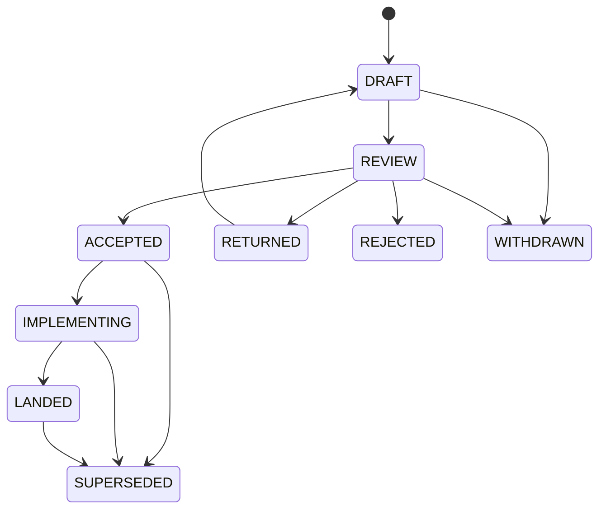

# ZOM RFC Process

RFCs are the design intake path for ZOM language, compiler, runtime, tooling,
and repository governance changes that need durable review before
implementation.

This process follows proven practice from Rust RFCs, Swift Evolution, Python
PEPs, TC39 staged proposals, and the LLVM RFC process:

- Rust RFCs require motivation, guide-level explanation, reference-level
  design, alternatives, prior art, and unresolved questions:
  <https://rust-lang.github.io/rfcs/0002-rfc-process.html>.
- Swift Evolution tracks proposal state explicitly during review and
  implementation:
  <https://github.com/swiftlang/swift-evolution/blob/main/process.md>.
- Python PEPs use stable numbering, a machine-readable header, and status
  discipline: <https://peps.python.org/pep-0001/>.
- TC39 uses stage gates to prevent underspecified language changes from
  becoming standards work: <https://tc39.es/process-document/>.
- LLVM RFCs emphasize rough consensus, exposed tradeoffs, and review before
  major patches land: <https://llvm.org/docs/RFCProcess.html>.

## When To Write An RFC

Write an RFC when a change does any of the following:

- Changes ZOM language syntax, semantics, type rules, diagnostics, modules,
  concurrency, memory behavior, or standard prelude behavior.
- Changes compiler architecture, AST shape, binder/checker contracts, IR
  contracts, runtime contracts, or test/conformance architecture.
- Adds, removes, or changes a repository-wide process, agent, skill, or
  verification gate.
- Requires coordination across two or more subagents.
- Introduces a new long-lived user-visible command, output format, file format,
  or tool contract.
- Would be hard to reverse after tests or users start depending on it.

Do not write an RFC for a local bug fix, formatting cleanup, narrow refactor, or
obvious spec/implementation drift repair when the intended contract is already
written elsewhere.

## Directory Layout

```text
docs/rfc/
  README.md
  0000-template.md
  NNNN-short-topic.md
```

RFC files use four-digit numbers and lowercase kebab-case slugs:

```text
NNNN-short-topic.md
```

`0000-template.md` is never assigned to a proposal. New RFC numbers are assigned
by taking the next unused integer in this directory. Once assigned, a number is
not reused.

## Status Values

Every proposal RFC has a YAML frontmatter `status` field with exactly one of
these values. `0000-template.md` may use `TEMPLATE` because it is not a
proposal.

| Status | Meaning |
|---|---|
| `DRAFT` | The proposal is being written and is not ready for formal review. |
| `REVIEW` | The proposal is ready for focused review. |
| `ACCEPTED` | The design is approved and may be implemented. |
| `IMPLEMENTING` | Work is underway to implement the accepted design. |
| `LANDED` | The design, implementation, tests, and docs have landed. |
| `RETURNED` | Review found issues; the RFC needs revision before another review. |
| `REJECTED` | The proposal should not be implemented. |
| `WITHDRAWN` | The author closed the RFC before acceptance. |
| `SUPERSEDED` | A later RFC replaces this one. |



## Required Frontmatter

Every RFC except `0000-template.md` uses this frontmatter shape:

```yaml
---
rfc: 1
title: AST Dump Format
type: compiler
status: DRAFT
author: ZOM Compiler Team
review-manager: TBD
approvers: []
created: 2026-06-30
updated: 2026-06-30
area: compiler
requires: []
supersedes: []
superseded-by: []
discussion: TBD
decision: TBD
implementation: TBD
tracking-issue: TBD
---
```

`area` should be one of `language`, `compiler`, `runtime`, `tooling`, `testing`,
`docs`, `process`, or `agents`.

`type` should be one of:

| Type | Meaning |
|---|---|
| `language` | User-visible syntax, semantics, type rules, diagnostics, or standard library contract. |
| `compiler` | Compiler-internal representation, pipeline, metadata, or tooling behavior. |
| `runtime` | Runtime, memory, concurrency, ABI, or FFI contract. |
| `testing` | Conformance, lit, unit, fuzz, or verification architecture. |
| `process` | Repository governance, agent routing, skill behavior, or project workflow. |
| `informational` | Durable background material that records context but does not itself approve implementation. |

`review-manager` is the person or subagent responsible for driving review to a
decision. `approvers` lists the owners who accepted the proposal. `discussion`,
`decision`, `implementation`, and `tracking-issue` may be links or `TBD` while
the RFC is in `DRAFT` or `REVIEW`.

## Required Sections

Every RFC must include these sections in this order:

1. Summary
2. Motivation
3. Goals
4. Non-Goals
5. Prior Art
6. Guide-Level Explanation
7. Reference-Level Design
8. Repository Impact
9. Drawbacks And Risks
10. Alternatives Considered
11. Compatibility And Rollout
12. Implementation Plan
13. Test Plan
14. Open Questions
15. Status History

## Acceptance Gates

An RFC may move to `ACCEPTED` only when all applicable gates are satisfied:

- The RFC uses the required template and frontmatter.
- The prior-art section cites at least three mature designs, or explains why
  fewer apply to the problem.
- The goals and non-goals are concrete enough to reject unrelated scope.
- The reference-level design is detailed enough for an implementer to proceed
  without inventing major semantics.
- The repository impact lists every owned path family and affected subagent.
- The implementation plan has ordered steps and names required verification.
- The test plan names lit, unit, conformance, generated-file, or manual checks
  as appropriate.
- The review manager is assigned.
- Every affected owner has either approved the RFC or has a recorded
  non-blocking objection.
- `discussion`, `decision`, and `tracking-issue` are no longer `TBD`.
- `Open Questions` is `None`, or every entry is explicitly marked
  non-blocking and assigned to a follow-up.
- The RFC does not preserve unused code paths, placeholder behavior, or
  compatibility layers.

## Review Rules

RFC review is technical. Reviewers should focus on whether the design is
coherent, implementable, testable, and aligned with project principles.

Reviewers must block on:

- Missing prior art for a well-known design space.
- A design that leaves core semantics to implementation judgment.
- Spec/implementation drift introduced by the proposal.
- A test plan that cannot catch the intended behavior.
- Missing owner signoff for an affected subsystem.
- Missing discussion, decision, or implementation tracking for a proposal that
  is ready to accept.
- Repository artifacts written in a language other than English.
- New compatibility surfaces that keep two long-lived behaviors alive.

## Relationship To Spec And Design Docs

RFCs are decision records and proposed contracts. Accepted RFCs are not a
substitute for normative specification chapters or implementation design docs.

After implementation:

- Normative language behavior belongs under `docs/spec/chapters/`.
- Compiler architecture that must remain current belongs under `docs/design/`.
- Tests belong under `products/zomlang/tests/`.
- Agent and skill behavior belongs under `.agents/`.
- The RFC status moves to `LANDED` and the status history links the landing
  commit or PR when available.

## Author Workflow

1. Copy `0000-template.md` to the next RFC number and slug.
2. Fill all frontmatter fields.
3. Write the summary, motivation, goals, non-goals, and prior art first.
4. Write the guide-level explanation for readers who need the feature.
5. Write the reference-level design for implementers.
6. List repository impact, alternatives, implementation steps, and tests.
7. Set status to `REVIEW` only when the document is ready for review.
8. Route the RFC through the `rfc` subagent for structural review.
9. Route affected technical areas to their owning subagents.
10. Move to `ACCEPTED` only after all blockers are resolved.
