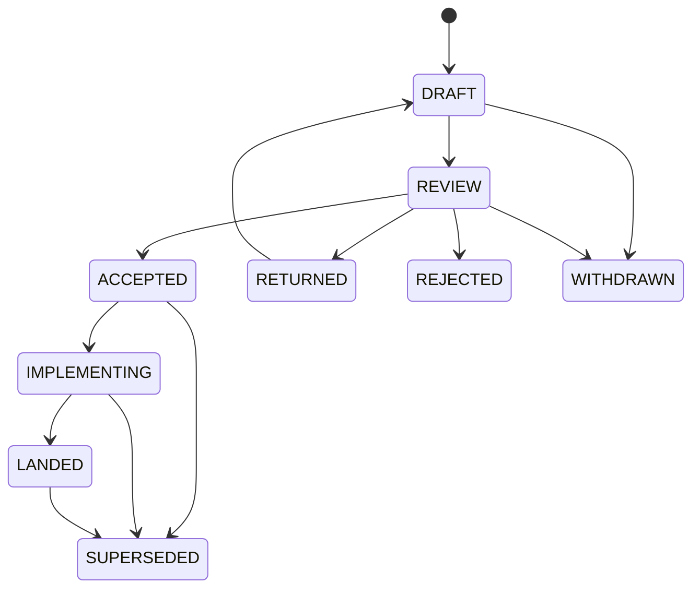

# ZOM RFC Process

RFCs are the design intake path for ZOM language, compiler, runtime, tooling,
and repository governance changes that need durable review before
implementation.

This process follows proven practice from Rust RFCs, Swift Evolution, Python
PEPs, TC39 staged proposals, and the LLVM RFC process:

- Rust RFCs require motivation, guide-level explanation, reference-level
  design, alternatives, prior art, and unresolved questions:
  <https://rust-lang.github.io/rfcs/0002-rfc-process.html>.
- Swift Evolution tracks proposal state explicitly during review and
  implementation:
  <https://github.com/swiftlang/swift-evolution/blob/main/process.md>.
- Python PEPs use stable numbering, a machine-readable header, and status
  discipline: <https://peps.python.org/pep-0001/>.
- TC39 uses stage gates to prevent underspecified language changes from
  becoming standards work: <https://tc39.es/process-document/>.
- LLVM RFCs emphasize rough consensus, exposed tradeoffs, and review before
  major patches land: <https://llvm.org/docs/RFCProcess.html>.

## When To Write An RFC

Write an RFC when a change does any of the following:

- Changes ZOM language syntax, semantics, type rules, diagnostics, modules,
  concurrency, memory behavior, or standard prelude behavior.
- Changes compiler architecture, AST shape, binder/checker contracts, IR
  contracts, runtime contracts, or test/conformance architecture.
- Adds, removes, or changes a repository-wide process, agent, skill, or
  verification gate.
- Requires coordination across two or more subagents.
- Introduces a new long-lived user-visible command, output format, file format,
  or tool contract.
- Would be hard to reverse after tests or users start depending on it.

Do not write an RFC for a local bug fix, formatting cleanup, narrow refactor, or
obvious spec/implementation drift repair when the intended contract is already
written elsewhere.

## Directory Layout

```text
docs/rfc/
  README.md
  0000-template.md
  NNNN-short-topic.md
```

RFC files use four-digit numbers and lowercase kebab-case slugs:

```text
NNNN-short-topic.md
```

`0000-template.md` is never assigned to a proposal. New RFC numbers are assigned
by taking the next unused integer in this directory. Once assigned, a number is
not reused.

## RFC Index

| RFC | Title | Status | Area | Type | Review Manager | Tracking | Implementation |
|---|---|---|---|---|---|---|---|
| [RFC 0001](0001-ast-dump-format.md) | AST Dump Format | LANDED | compiler | compiler | rfc | [Acceptance Criteria](0001-ast-dump-format.md#acceptance-criteria) | [AST Dumper](../../compiler/ast/dump.cc) |
| [RFC 0002](0002-parser-architecture.md) | Parser Architecture | LANDED | compiler | compiler | rfc | [Acceptance Criteria](0002-parser-architecture.md#acceptance-criteria) | [Parser](../../compiler/parser/parser.cc) |
| [RFC 0003](0003-lexer-architecture.md) | Lexer Architecture | LANDED | compiler | compiler | rfc | [Acceptance Criteria](0003-lexer-architecture.md#acceptance-criteria) | [Lexer](../../compiler/lexer/lexer.cc) |
| [RFC 0004](0004-binder-architecture.md) | Binder Architecture | IMPLEMENTING | compiler | compiler | rfc | [Review Tracker](tracking/0004-review-and-implementation.md) | [Implementation Tracker](tracking/0004-review-and-implementation.md#implementation-tracker) |
| [RFC 0005](0005-type-system-architecture.md) | Type System Architecture | IMPLEMENTING | compiler | compiler | rfc | [Review Tracker](tracking/0005-review-and-implementation.md) | [Implementation Tracker](tracking/0005-review-and-implementation.md#implementation-tracker) |
| [RFC 0006](0006-error-lowering-runtime-abi.md) | Error Lowering And Runtime ABI | IMPLEMENTING | compiler | compiler | rfc | [Review Tracker](tracking/0006-review-and-implementation.md) | [Implementation Tracker](tracking/0006-review-and-implementation.md#implementation-tracker) |
| [RFC 0007](0007-borrow-lifetime-ownership-checker.md) | Borrow Lifetime And Ownership Checker | IMPLEMENTING | compiler | compiler | rfc | [Review Tracker](tracking/0007-review-and-implementation.md) | [Implementation Tracker](tracking/0007-review-and-implementation.md#implementation-tracker) |
| [RFC 0008](0008-compiler-session-cross-module.md) | CompilerSession Cross-Module Architecture | IMPLEMENTING | compiler | compiler | rfc | [Review Tracker](tracking/0008-review-and-implementation.md) | [Implementation Tracker](tracking/0008-review-and-implementation.md#implementation-tracker) |
| [RFC 0009](0009-call-dispatch-and-operator-lowering.md) | Call Dispatch And Operator Lowering | IMPLEMENTING | compiler | compiler | rfc | [Review Tracker](tracking/0009-review-and-implementation.md) | [Implementation Tracker](tracking/0009-review-and-implementation.md#implementation-tracker) |
| [RFC 0010](0010-intermediate-representation-pipeline.md) | Intermediate Representation Pipeline Architecture | IMPLEMENTING | compiler | compiler | rfc | [Review Tracker](tracking/0010-review-and-implementation.md) | [Implementation Tracker](tracking/0010-review-and-implementation.md#canonical-ir-direct-replacement-series) |
| [RFC 0011](0011-semantic-identity-foundation.md) | Semantic Identity Foundation | LANDED | compiler | compiler | rfc | [Review Tracker](tracking/0011-review-and-implementation.md) | [Implementation Tracker](tracking/0011-review-and-implementation.md#implementation-tracker) |
| [RFC 0012](0012-package-manifest-and-resolver.md) | Package Manifest And Deterministic Resolver | IMPLEMENTING | compiler | compiler | rfc | [Review Tracker](tracking/0012-review-and-implementation.md) | [Implementation Tracker](tracking/0012-review-and-implementation.md#implementation-tracker) |
| [RFC 0013](0013-ownership-analysis-integration-boundary.md) | Ownership Analysis Integration Boundary | IMPLEMENTING | compiler | compiler | rfc | [Review Tracker](tracking/0013-review-and-implementation.md) | [Implementation Tracker](tracking/0013-review-and-implementation.md#implementation-tracker) |
| [RFC 0014](0014-contextual-self-and-receiver-semantics.md) | Contextual Self And Receiver Semantics | IMPLEMENTING | language | language | rfc | [Review Tracker](tracking/0014-review-and-implementation.md) | [Implementation Tracker](tracking/0014-review-and-implementation.md#implementation-tracker) |
| [RFC 0015](0015-canonical-checker-codec-closure.md) | Canonical Checker Codec Closure | LANDED | language | language | rfc | [Review Tracker](tracking/0015-review-and-implementation.md) | [Implementation Tracker](tracking/0015-review-and-implementation.md#implementation-tracker) |
| [RFC 0016](0016-context-bound-target-registry-verification.md) | Context-Bound Target Registry Verification | IMPLEMENTING | compiler | compiler | rfc | [Review Tracker](tracking/0016-review-and-implementation.md) | [Tracker](tracking/0016-review-and-implementation.md#implementation-tracker) |
| [RFC 0017](0017-incremental-compiler-query-architecture.md) | Incremental Compiler Query Architecture | IMPLEMENTING | compiler | compiler | rfc | [Review Tracker](tracking/0017-review-and-implementation.md) | [Implementation Tracker](tracking/0017-review-and-implementation.md#implementation-tracker) |
| [RFC 0018](0018-stable-query-identity-wire-closure.md) | Stable Query Identity Wire Closure | IMPLEMENTING | compiler | compiler | rfc | [Review Tracker](tracking/0018-review-and-implementation.md) | [Implementation Tracker](tracking/0018-review-and-implementation.md#implementation-tracker) |
| [RFC 0019](0019-stable-body-owner-and-query-closure.md) | Stable Body Owner And Query Closure | IMPLEMENTING | compiler | compiler | rfc | [Review Tracker](tracking/0019-review-and-implementation.md) | [Decision](tracking/0019-review-and-implementation.md#decision-record) |
| [RFC 0020](0020-active-definition-authority-projection.md) | Active Definition Authority Projection | IMPLEMENTING | compiler | compiler | rfc | [Review Tracker](tracking/0020-review-and-implementation.md) | [Implementation Tracker](tracking/0020-review-and-implementation.md#implementation-tracker) |
| [RFC 0021](0021-target-aware-lir-and-llvm-translation.md) | Target-Aware LIR And LLVM Translation Contract | IMPLEMENTING | compiler | compiler | rfc | [Review Tracker](tracking/0021-review-and-implementation.md) | [Tracker](tracking/0021-review-and-implementation.md#implementation-tracker) |
| [RFC 0022](0022-flow-sensitive-type-refinement-and-null-safety.md) | Flow-Sensitive Type Refinement And Null Safety | ACCEPTED | language | language | rfc | [Review Tracker](tracking/0022-review-and-implementation.md) | [Decision](tracking/0022-review-and-implementation.md#decision-record) |
| [RFC 0023](0023-ide-semantic-snapshots-and-language-server-architecture.md) | IDE Semantic Snapshots And Language Server Architecture | REVIEW | tooling | compiler | rfc | [Review Tracker](tracking/0023-review-and-implementation.md) | TBD |
| [RFC 0024](0024-standard-marker-authority.md) | Standard Marker Authority | IMPLEMENTING | compiler | compiler | rfc | [Review Tracker](tracking/0024-review-and-implementation.md) | [Implementation Tracker](tracking/0024-review-and-implementation.md#implementation-tracker) |
| [RFC 0025](0025-source-backed-core-library-architecture.md) | Source-Backed Core Library Architecture | IMPLEMENTING | language | language | rfc | [Review Tracker](tracking/0025-review-and-implementation.md) | [Implementation Tracker](tracking/0025-review-and-implementation.md#implementation-tracker) |
| [RFC 0026](0026-module-graph-query-closure.md) | Module Graph Query Closure | LANDED | compiler | compiler | rfc | [Review Tracker](tracking/0026-review-and-implementation.md) | [Implementation Tracker](tracking/0026-review-and-implementation.md#implementation-tracker) |
| [RFC 0027](0027-binder-query-and-identity-materialization-closure.md) | Binder Query And Identity Materialization Closure | IMPLEMENTING | compiler | compiler | rfc | [Review Tracker](tracking/0027-review-and-implementation.md) | [Implementation Tracker](tracking/0027-review-and-implementation.md#implementation-tracker) |
| [RFC 0028](0028-query-runtime-final-seal-and-descriptor-closure.md) | Query Runtime Final-Seal And Descriptor Closure | IMPLEMENTING | compiler | compiler | rfc | [Review Tracker](tracking/0028-review-and-implementation.md) | [Implementation Tracker](tracking/0028-review-and-implementation.md#implementation-tracker) |
| [RFC 0029](0029-query-identity-and-capability-failure-closure.md) | Query Identity And Capability Failure Closure | LANDED | compiler | compiler | rfc | [Review Tracker](tracking/0029-review-and-implementation.md) | [Implementation Tracker](tracking/0029-review-and-implementation.md#implementation-tracker) |
| [RFC 0030](0030-stable-binding-foundation-verification.md) | Stable Binding Foundation Verification | LANDED | testing | testing | rfc | [Review Tracker](tracking/0030-review-and-implementation.md) | [Implementation Tracker](tracking/0030-review-and-implementation.md#implementation-tracker) |
| [RFC 0031](0031-stable-binding-schema-model-closure.md) | Stable Binding Schema Model Closure | LANDED | testing | testing | rfc | [Review Tracker](tracking/0031-review-and-implementation.md) | [Implementation Tracker](tracking/0031-review-and-implementation.md#implementation-tracker) |
| [RFC 0032](0032-stable-definition-routing-ledger-closure.md) | Stable Definition Routing Ledger Closure | ACCEPTED | compiler | compiler | rfc | [Review Tracker](tracking/0032-review-and-implementation.md) | [Implementation Tracker](tracking/0032-review-and-implementation.md#implementation-tracker) |
| [RFC 0033](0033-stable-header-review-partition-closure.md) | Stable Header Review Partition Closure | SUPERSEDED | testing | testing | rfc | [Review Tracker](tracking/0033-review-and-implementation.md) | [Implementation Tracker](tracking/0033-review-and-implementation.md#implementation-tracker) |
| [RFC 0034](0034-stable-header-dependency-review-closure.md) | Stable Header Dependency Review Closure | ACCEPTED | testing | testing | rfc | [Review Tracker](tracking/0034-review-and-implementation.md) | [Implementation Tracker](tracking/0034-review-and-implementation.md#implementation-tracker) |
| [RFC 0035](0035-canonical-implementation-identity-decoder-closure.md) | Canonical Implementation Identity Decoder Closure | ACCEPTED | compiler | compiler | rfc | [Review Tracker](tracking/0035-review-and-implementation.md) | [Implementation Tracker](tracking/0035-review-and-implementation.md#implementation-tracker) |
| [RFC 0036](0036-bounded-diagnostic-fact-codec-closure.md) | Bounded Diagnostic Fact Codec Closure | LANDED | compiler | compiler | rfc | [Review Tracker](tracking/0036-review-and-implementation.md) | [Implementation Tracker](tracking/0036-review-and-implementation.md#implementation-tracker) |
| [RFC 0037](0037-stable-module-skeleton-review-partition-closure.md) | Stable Module Skeleton Review Partition Closure | ACCEPTED | testing | testing | rfc | [Review Tracker](tracking/0037-review-and-implementation.md) | [Implementation Tracker](tracking/0037-review-and-implementation.md#implementation-tracker) |
| [RFC 0038](0038-final-sealed-failure-projection-closure.md) | Final-Sealed Failure Projection Closure | DRAFT | compiler | compiler | rfc | [Acceptance Criteria](0038-final-sealed-failure-projection-closure.md#acceptance-criteria) | TBD |
| [RFC 0039](0039-export-surface-revision-admission-closure.md) | Export Surface Revision Admission Closure | ACCEPTED | compiler | compiler | rfc | [Review Tracker](tracking/0039-review-and-implementation.md) | [Implementation Tracker](tracking/0039-review-and-implementation.md#implementation-tracker) |
| [RFC 0040](0040-binding-name-key-admission-closure.md) | Binding Name Key Admission Closure | ACCEPTED | compiler | compiler | rfc | [Review Tracker](tracking/0040-review-and-implementation.md) | [Implementation Tracker](tracking/0040-review-and-implementation.md#implementation-tracker) |
| [RFC 0041](0041-stable-owner-body-review-partition-closure.md) | Stable Owner Body Review Partition Closure | ACCEPTED | testing | testing | rfc | [Review Tracker](tracking/0041-review-and-implementation.md) | [Implementation Tracker](tracking/0041-review-and-implementation.md#implementation-tracker) |
| [RFC 0042](0042-canonical-diagnostic-fact-atomic-cutover.md) | Canonical Diagnostic Fact Atomic Cutover | LANDED | compiler | compiler | rfc | [Review Tracker](tracking/0042-review-and-implementation.md) | [Implementation Tracker](tracking/0042-review-and-implementation.md#implementation-tracker) |
| [RFC 0043](0043-platform-link-and-executable-publication.md) | Platform Link And Executable Publication | REVIEW | compiler | compiler | rfc | [Review Tracker](tracking/0043-review-and-implementation.md) | TBD |
| [RFC 0044](0044-source-formatter-architecture.md) | Source Formatter Architecture | DRAFT | tooling | compiler | rfc | [Acceptance Criteria](0044-source-formatter-architecture.md#acceptance-criteria) | TBD |
| [RFC 0045](0045-native-debugging-and-debug-adapter.md) | Native Debugging And Debug Adapter | DRAFT | tooling | compiler | rfc | [Acceptance Criteria](0045-native-debugging-and-debug-adapter.md#acceptance-criteria) | TBD |
| [RFC 0046](0046-forced-error-operator-panic-abort-abi.md) | Forced Error Operator Panic Abort ABI | DRAFT | compiler | compiler | rfc | [Acceptance Criteria](0046-forced-error-operator-panic-abort-abi.md#acceptance-criteria) | TBD |

## Status Values

Every proposal RFC has a YAML frontmatter `status` field with exactly one of
these values. `0000-template.md` may use `TEMPLATE` because it is not a
proposal.

| Status | Meaning |
|---|---|
| `DRAFT` | The proposal is being written and is not ready for formal review. |
| `REVIEW` | The proposal is ready for focused review. |
| `ACCEPTED` | The design is approved and may be implemented. |
| `IMPLEMENTING` | Work is underway to implement the accepted design. |
| `LANDED` | The design, implementation, tests, and docs have landed. |
| `RETURNED` | Review found issues; the RFC needs revision before another review. |
| `REJECTED` | The proposal should not be implemented. |
| `WITHDRAWN` | The author closed the RFC before acceptance. |
| `SUPERSEDED` | A later RFC replaces this one. |



## Required Frontmatter

Every RFC except `0000-template.md` uses this frontmatter shape:

```yaml
---
rfc: 1
title: AST Dump Format
type: compiler
status: DRAFT
author: ZOM Compiler Team
review-manager: TBD
required-owners: []
approvers: []
created: 2026-06-30
updated: 2026-06-30
area: compiler
requires: []
supersedes: []
superseded-by: []
discussion: TBD
decision: TBD
implementation: TBD
tracking-issue: TBD
---
```

`area` should be one of `language`, `compiler`, `runtime`, `tooling`, `testing`,
`docs`, `process`, or `agents`.

`type` should be one of:

| Type | Meaning |
|---|---|
| `language` | User-visible syntax, semantics, type rules, diagnostics, or standard library contract. |
| `compiler` | Compiler-internal representation, pipeline, metadata, or tooling behavior. |
| `runtime` | Runtime, memory, concurrency, ABI, or FFI contract. |
| `testing` | Conformance, lit, unit, fuzz, or verification architecture. |
| `process` | Repository governance, agent routing, skill behavior, or project workflow. |
| `informational` | Durable background material that records context but does not itself approve implementation. |

`review-manager` is the person or subagent responsible for driving review to a
decision. `required-owners` lists every subagent owner from the Repository
Impact table and must use ids from `.codex/subagents/manifest.yaml`.
`approvers` lists the owners who accepted the proposal.

`discussion` and `tracking-issue` may be `TBD` only while the RFC is in
`DRAFT`. A proposal cannot move to `REVIEW` until both fields point to a
discussion thread, issue, or local tracking document. `decision` may remain
`TBD` until `ACCEPTED`. `implementation` may remain `TBD` until
`IMPLEMENTING`.

## Required Sections

Every RFC must include these sections in this order:

1. Summary
2. Motivation
3. Goals
4. Non-Goals
5. Prior Art
6. Guide-Level Explanation
7. Reference-Level Design
8. Repository Impact
9. Security And Safety Impact
10. Drawbacks And Risks
11. Alternatives Considered
12. Compatibility And Rollout
13. Documentation And Teaching Plan
14. Operational Readiness
15. Acceptance Criteria
16. Implementation Plan
17. Test Plan
18. Open Questions
19. Status History

## Acceptance Gates

An RFC may move to `REVIEW` only when these gates are satisfied:

- The RFC uses the required template and frontmatter.
- `discussion` and `tracking-issue` are no longer `TBD`.
- `review-manager` is assigned.
- `required-owners` exactly matches the owners listed in `Repository Impact`.
- All required owners exist in `.codex/subagents/manifest.yaml`.
- The RFC index in this file links the proposal and reflects its current
  status.

An RFC may move to `ACCEPTED` only when all applicable gates are satisfied:

- The RFC uses the required template and frontmatter.
- The prior-art section cites at least three mature designs, or explains why
  fewer apply to the problem.
- The goals and non-goals are concrete enough to reject unrelated scope.
- The reference-level design is detailed enough for an implementer to proceed
  without inventing major semantics.
- The repository impact lists every owned path family and affected subagent.
- Security, safety, documentation, teaching, and operational impacts are either
  covered or explicitly marked `None`.
- Acceptance criteria state the concrete evidence required to call the RFC
  complete.
- The implementation plan has ordered steps and names required verification.
- The test plan names lit, unit, conformance, generated-file, or manual checks
  as appropriate.
- The review manager is assigned.
- `approvers` covers every owner listed in `required-owners`, or any remaining
  objection is explicitly recorded as non-blocking in the RFC text.
- `discussion`, `decision`, and `tracking-issue` are no longer `TBD`.
- `Open Questions` is `None`, or every entry is explicitly marked
  non-blocking and assigned to a follow-up.
- The RFC does not preserve unused code paths, placeholder behavior, or
  compatibility layers.

An RFC may move to `IMPLEMENTING` only after `implementation` points to the
implementation PR, branch, tracking issue, or local implementation plan.

## Review Rules

RFC review is technical. Reviewers should focus on whether the design is
coherent, implementable, testable, and aligned with project principles.

### Owner Authority Model

Required owners are in-project review roles defined by the subagent manifest,
not external human approvers. This repository does not gate RFC status
transitions on an outside human sign-off. An owner approval is recorded when the
technical review for that owner's focus has actually been performed and its
conclusion (approve, or object with the blocking reason) is written to the RFC's
review tracker. The repository authority holder, or an agent acting under an
explicit authorization from that holder, may perform and record those reviews
and the resulting `REVIEW -> ACCEPTED` decision.

This does not weaken the honesty rule: a recorded approval must correspond to a
review that was genuinely conducted. Do not record an approval, decision, or
status transition that names a review or conclusion that did not happen. The ban
on fabricated governance transitions is a ban on false records, not on the
project performing its own reviews.

Reviewers must block on:

- Missing prior art for a well-known design space.
- A design that leaves core semantics to implementation judgment.
- Spec/implementation drift introduced by the proposal.
- A test plan that cannot catch the intended behavior.
- Missing owner signoff for an affected subsystem.
- Missing discussion, decision, or implementation tracking for a proposal that
  is ready to accept.
- Repository artifacts written in a language other than English.
- New compatibility surfaces that keep two long-lived behaviors alive.
- Internal types, canonical domains, schemas, fixtures, or generated artifacts
  named with revision suffixes such as `V2`, `.v2`, or `-v2`.

## Automated Checks

`python3 scripts/check-rfc.py` is the authoritative structural gate for RFC
metadata. It checks proposal numbering, required frontmatter, section order,
status-history transitions, REVIEW and ACCEPTED readiness, owner coverage,
local link targets, RFC index synchronization, Mermaid-labelled diagrams, and
obsolete RFC location references.

CI runs this command on every pull request. A proposal that fails the command is
not ready to merge, regardless of manual review.

## Relationship To Spec And Design Docs

RFCs are decision records and proposed contracts. Accepted RFCs are not a
substitute for normative specification chapters or implementation design docs.

After implementation:

- Normative language behavior belongs under `docs/spec/chapters/`.
- Compiler architecture that must remain current belongs under `docs/design/`.
- Tests belong under `tests/`.
- Agent and skill behavior belongs under `.codex/`.
- The RFC status moves to `LANDED` and the status history links the landing
  commit or PR when available.

## Author Workflow

1. Copy `0000-template.md` to the next RFC number and slug.
2. Fill all frontmatter fields.
3. Write the summary, motivation, goals, non-goals, and prior art first.
4. Write the guide-level explanation for readers who need the feature.
5. Write the reference-level design for implementers.
6. List repository impact, alternatives, implementation steps, and tests.
7. Add the RFC to `RFC Index`.
8. Run `python3 scripts/check-rfc.py`.
9. Set status to `REVIEW` only when the document is ready for review and has
   discussion plus tracking links.
10. Route the RFC through the `rfc` subagent for structural review.
11. Route affected technical areas to their owning subagents.
12. Move to `ACCEPTED` only after all blockers are resolved.
