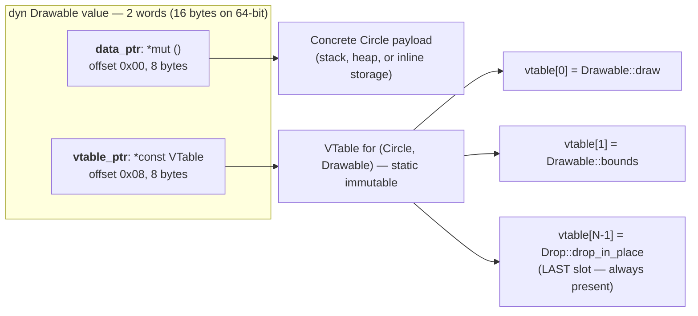
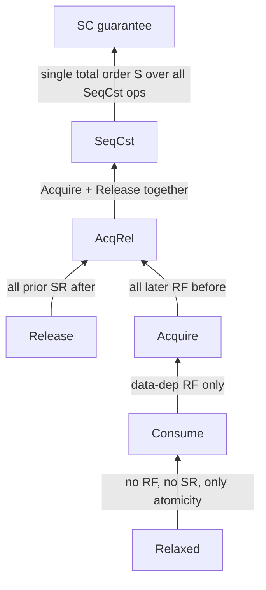

# Types

Zom features a rich, static type system that provides safety guarantees while maintaining expressiveness and performance.

## Type System Overview

The Zom type system is:

- **Static**: All types are known at compile time
- **Strong**: No implicit conversions between incompatible types
- **Inferred**: Types can often be inferred from context
- **Nominal**: Types are distinguished by name, not just structure
- **Generic**: Supports parametric polymorphism

## Predefined Types

### Integer Types

| Type | Size | Range | Description |
|------|------|-------|-------------|
| `i8` | 8 bits | -128 to 127 | Signed 8-bit integer |
| `i32` | 32 bits | -2³¹ to 2³¹-1 | Signed 32-bit integer |
| `i64` | 64 bits | -2⁶³ to 2⁶³-1 | Signed 64-bit integer |
| `u8` | 8 bits | 0 to 255 | Unsigned 8-bit integer |
| `u16` | 16 bits | 0 to 65,535 | Unsigned 16-bit integer |
| `u32` | 32 bits | 0 to 2³²-1 | Unsigned 32-bit integer |
| `u64` | 64 bits | 0 to 2⁶⁴-1 | Unsigned 64-bit integer |

```zom
let byte: u8 = 255;
let count: i32 = -42;
let bigNumber: u64 = 18_446_744_073_709_551_615;
```

### Floating-Point Types

| Type | Size | Precision | Description |
|------|------|-----------|-------------|
| `f32` | 32 bits | ~7 decimal digits | Single-precision float |
| `f64` | 64 bits | ~15 decimal digits | Double-precision float |

```zom
let pi: f32 = 3.14159;
let precise: f64 = 3.141592653589793;
let scientific: f64 = 6.022e23;
```

### Boolean Type

```zom
let isValid: bool = true;
let isComplete: bool = false;
```

### String Type

```zom
let message: str = "Hello, Zom!";
let empty: str = "";
let multiline: str = "Line 1\nLine 2";
```

### Special Types

- **`null`**: The type of the `null` value, representing absence
- **`unit`**: The type used for functions that don't return a value; its only value is `()`
- **`never`**: The bottom type, for functions that never return
- **`any`**: The top type, can hold any value (use sparingly)

```zom
let nothing: null = null;
let empty: unit = ();
fun loopForever() -> never {
    while (true) {}
}
```

## Type Expressions

### Parenthesized Types

Types can be parenthesized for clarity:

```zom
let x: (i32) = 42;
let complex: ((i32, str) -> bool) = someFunction;
```

### Union Types

Union types represent values that can be one of several types:

```zom
type StringOrNumber = str | i32;
type Result = Success | Error;

let value: StringOrNumber = "hello";
value = 42; // Also valid

fun process(input: str | i32 | bool) {
    match (input) {
        when str { print("String: " + input); }
        when i32 { print("Number: " + input.toString()); }
        when bool { print("Boolean: " + input.toString()); }
    }
}
```

### Intersection Types

Intersection types represent values that satisfy multiple type constraints:

```zom
interface Named {
    name: str;
}

interface Aged {
    age: i32;
}

type Person = Named & Aged;

let person: Person = {
    name: "Alice",
    age: 30
};
```

### Optional Types

Optional types represent values that may or may not exist:

```zom
let maybeNumber: i32? = 42;
let nothing: str? = null;

// Optional chaining
let length = maybeString?.length;

// Null coalescing
let defaultValue = maybeNumber ?? 0;
```

### Array Types

Array types represent ordered collections of elements:

```zom
let numbers: i32[] = [1, 2, 3, 4, 5];
let strings: str[] = ["hello", "world"];
let matrix: i32[][] = [[1, 2], [3, 4]];

// Array operations
let first = numbers[0];
let length = numbers.length;
numbers.push(6);
```

### Tuple Types

Tuple types represent fixed-size, ordered collections with potentially different element types:

```zom
// Anonymous tuple
let point: (f64, f64) = (3.0, 4.0);
let person: (str, i32, bool) = ("Alice", 30, true);

// Named tuple elements
let namedPoint: (x: f64, y: f64) = (x: 3.0, y: 4.0);
let coordinate = namedPoint.x; // Access by name

// Destructuring
let (name, age, isActive) = person;
let (x, y) = point;
```

### Function Types

Function types describe the signature of functions:

```zom
// Basic function type
type BinaryOp = (i32, i32) -> i32;

// Function with no parameters
type Supplier<T> = () -> T;

// Function with no return value
type Consumer<T> = (T) -> unit;

// Higher-order function
type Mapper<T, U> = (T -> U, T[]) -> U[];

// Function with error handling
type SafeParser = (str) -> i32 raises ParseError;

// Examples
let add: BinaryOp = fun (a: i32, b: i32) -> i32 { return a + b; };
let getString: Supplier<str> = fun () -> str { return "hello"; };
let print: Consumer<str> = fun (s: str) -> unit { console.log(s); };
```

### Never / Bottom Type (`!`)

The **never type** (written `!`, pronounced "never" or "bottom") is the type with no values at all. A function whose declared return type is `!` is guaranteed to never return normally — every execution path either diverges infinitely, exits the process, or transfers control out of the enclosing scope via a non-local jump (panic, return, break, continue).

**Formation.** The never type is written as a standalone `!` token in any type position. It has no parameters, no qualifiers, and no user-extensible surface.

**Subtyping.** `!` is a **subtype of every other type**. It is the unique bottom element of the ZOM type lattice. No other type carries this property. This means that whenever a value of type `T` is expected, a value of type `!` can be supplied and the type checker accepts it as `T` without further conversion.

**Expressions that produce `!`:**

- `panic!(...)` macro invocation and any equivalent builtin.
- `return expr;` when evaluated in expression position: the synthetic type of a `return` statement as an expression is `!`, because control never reaches whatever follows it.
- `break` and `continue` (loop-exit control-flow constructs).
- `exit(code)`, `abort()`, `unreachable!()`, `todo!()` builtins.
- An infinite `loop { }` whose body contains no reachable exit path.
- A match arm whose body evaluates to `!` allows the whole match expression to coerce to the broader type of the remaining arms, even if the arms would otherwise be incompatible.

**Example — diverging function:**
```zom
fun diverge() -> ! { loop { } }
```

**Example — match arm coercion:**
```zom
let x = match opt {
    Some(v) -> v,
    None -> return Err("empty"),   // arm body type = !, coerces to typeof(v)
};
```

**Algebraic simplification during type normalization.** For any type `T`:

- `T | !` normalizes to `T`. Since `!` has no inhabitants, adding it to a union is the identity operation.
- `T & !` normalizes to `!`. Intersecting any type with the empty set yields the empty set.

These two rules apply unconditionally at every union- and intersection-formation site. They are part of the canonicalizer's rewrite system before subtype or bound checks are performed.

**Generic bound satisfaction.** The never type satisfies **all** bounds trivially and vacuously. If a function requires `T: Drawable + Linear + Sendable + ...`, then `!` satisfies the conjunction without needing any concrete impl. The justification is proof-irrelevant: since there can never be a value of type `!`, any property claimed about such a value is classically true.

**Diagnostic reference.** ZOM0330 `NeverTypeCoerceFail` should never occur in practice. It is emitted only if the compiler encounters a degenerate case where `!` cannot be coerced into an expected type, which indicates an internal consistency bug in the type-normalization pipeline. The user-visible message carries an ICE-report link because the condition is not user-fixable.

### Existential Types (dyn)

#### Purpose

Existential types provide first-class, compile-time-unknown concrete types whose concrete identity is erased and whose behavior is dispatched at runtime through a vtable. They are ZOM's mechanism for heterogeneous collections sharing a common behavior, callbacks whose concrete closure types cannot be named, and dependency-injected service objects whose implementations vary at runtime.

ZOM follows an **explicit existential erasure model (Swift 6 `any` semantics)**, a normative locked decision. An `interface I { ... }` declaration introduces ONLY a *bound*: a predicate placed on type variables inside generics. It does **not** by itself introduce a type that can appear in a value position. To treat "any value whose type implements I" as a first-class runtime-manifest type, the programmer MUST write `dyn I`. This spelling makes the cost of boxing (when required) and vtable indirection VISIBLE at every use site.

The C#/Java implicit conversion pattern is explicitly REJECTED. There is NO automatic coercion of a class implementing I to "type I". A variable declaration `let x: Drawable = Circle()` is a static error — the programmer must write `let x: dyn Drawable = Circle();`.

Coercion occurs ONLY when the target type is explicitly declared as `dyn I` (in a function parameter, variable type annotation, struct field, or return type position). The coercion itself is FREE: it performs no clone, no move-copy of the payload, and allocates only when the concrete value cannot be stored inline-sized (determined per target ABI). The cost is purely fat-pointer construction: two words written into the destination slot.

Existential types interact cleanly with ZOM's marker system (Ch.16 §16.12.3 R11) and its object-safety rules (Ch.09 §9 OS-4). Only object-safe interfaces may appear after `dyn`; this is enforced by the type checker. An interface with an unbound associated type used in a `dyn` context raises diagnostic ZOM0334 DynUnassociatedType.

#### Grammar

The canonical grammar for existential types is reproduced below. See Ch.17 DynType and InterfaceBoundList productions for the authoritative version.

```
ExistentialType      ::= 'dyn' InterfaceBoundList
InterfaceBoundList   ::= InterfaceName ( '<' GenericArgs '>' )? ( '+' MarkerPath )*
```

Valid forms:

```zom
let a: dyn Drawable = ...;
let b: dyn Iterator<Item = T> = ...;
let c: dyn Read + Sendable + Shared = ...;
```

Invalid forms and their diagnostics:

| Form | Diagnostic |
|------|------------|
| `let x: dyn = value;` (bare `dyn` with no following interface) | ZOM0340 DynEmpty |
| `let x: dyn (i32 \| str) = value;` (non-interface after `dyn`) | ZOM0341 DynNonInterface |
| `let x: dyn Error + dyn Sendable = value;` (repeated `dyn` prefix) | ZOM0342 DynRepeatedPrefix |
| `let x: dyn Iterator = value;` (associated type `Item` not bound) | ZOM0334 DynUnassociatedType |

#### Semantics — Three Normative Rules

1. **First-class type.** `dyn I` IS a standalone, sized, first-class language type. The interface declaration alone does NOT introduce a usable type.
2. **No implicit interface-to-type coercion.** There is no automatic conversion from `Circle implements Drawable` to a value of "type `Drawable`". Any spelling that treats an interface name as a type in value position (without the `dyn` prefix) is a static error. No opt-in, no compatibility flag, no legacy mode.
3. **Explicit-annotation coercion sites only.** Coercion from a concrete `T implements I` to `dyn I` fires exclusively at sites where the target type is textually declared as `dyn I` (or a generic type argument resolved to `dyn I`). The type inference engine NEVER produces an existential type as its solution — coercion is never inferred from context alone.

#### Runtime Layout (2-word fat pointer)

The default memory representation on all targets is **two machine words**, referred to as a *fat pointer*. The `dyn Drawable` value layout on a 64-bit target is shown below.



Formal layout invariants:

- **Size:** `size_of::<dyn I>() = 2 * ptr_size`. 16 bytes on 64-bit, 8 bytes on 32-bit.
- **Alignment:** `align_of::<dyn I>() = ptr_align`.
- **Word 0 (data_ptr):** A pointer to the erased concrete object, with opaque pointee type `*mut ()`. Never null for a well-formed `dyn I` value.
- **Word 1 (vtable_ptr):** A pointer to a static, immutable, per-(concrete-type, interface) virtual dispatch table. Each distinct pair `(T, I)` where `T implements I` produces exactly one vtable at code-generation time.
- **VTable ordering:** Methods are arranged in post-order traversal of the interface inheritance chain, left-to-right MRO, with method names in declaration order within each interface.
- **Last slot rule:** The FINAL slot of every vtable is ALWAYS `drop_in_place(*mut ())` — the drop-glue function pointer for the erased concrete type. This slot is never repurposed and is part of the cross-crate ABI stability guarantee.
- **Implicit prefix words:** Immediately before the first method slot (at negative offsets from `vtable_ptr`), implementations store three additional words: `size: usize`, `align: usize`, `marker_bitmap: u64`. These are accessed via negative-offset loads by the runtime support for size queries and marker propagation.

The `marker_bitmap` prefix word is consulted by Ch.16 §16.12.3 R11 G6's runtime double-check at spawn-accept time. Bit layout is LSB-first in declaration order of the standard marker prelude: bit 0 = `Sendable`, bit 1 = `Shared`, bit 2 = `Linear`, bit 3 = `SuspendSafe`, bit 4 = `NoSuspendHazard`, bit 5 = `TaskBound`. User-defined markers occupy bits starting at bit 32.

#### Variance

The default variance of every type parameter referenced inside an interface is **invariant** when that interface is instantiated as a `dyn` type. This matches ZOM's global, safety-first variance default: all generics are invariant, and programmers opt into co- or contravariance explicitly via `#[zom::variance(...)]` applied to the interface declaration. (Cross-reference: Ch.12 Generics, variance attributes.)

A `dyn Producer<Cat>` is NOT a subtype of `dyn Producer<Animal>` unless `Producer` is declared with a covariant out-parameter:

```zom
#[zom::variance(cov)]
interface Producer<out T> {
    fun produce(): T;
}
// dyn Producer<Cat> coerces to dyn Producer<Animal>
```

Covariance is only sound when the interface PRODUCES values of type T and never CONSUMES them. Attempting to declare `#[zom::variance(cov)]` on an interface that uses T in a contravariant (parameter) position raises diagnostic ZOM0453 VarianceConflict. Variance attributes are inherited through `extends`; combining an inherited `cov` parameter with a local `contra` use raises ZOM0454 InheritedVarianceConflict.

#### Marker Propagation

For a type `dyn I + M1 + M2`:

- **DECLARED marker bits** = {M1, M2} ∪ (transitive closure over marker markers implied by I's own declared default marker-impls through the `extends` chain).
- **ACTUAL marker bits** (embedded at coercion site into the vtable `marker_bitmap` prefix word) = DECLARED ∩ (marker set of the concrete type T being coerced).
- A `dyn` object NEVER carries more marker privileges than its DECLARED bound-list permits, even if the underlying concrete T happens to satisfy additional markers. This is a soundness rule: a function signature promising only `dyn I + Shared` must not allow downstream callers to assume `Sendable` merely because a particular runtime value is `Sendable`.
- To re-declare additional markers on an existential, the user writes a re-coercion with the extended bound-list: `x as dyn I + Sendable + Shared`. This succeeds only if the concrete T's marker set contains the new markers; otherwise the coercion site raises ZOM16xx MarkerCoerceFail.
- The Ch.16 R11 G6 runtime double-check consults the 3-phase negative closure of the ACTUAL marker bits at spawn-accept time.

Example:

```zom
let circle = Circle(radius: 5.0);
let x: dyn Drawable + Sendable = circle;    // coerce Circle → dyn Drawable + Sendable
```

At this coercion site the compiler: (1) verifies `Circle implements Drawable` and `Circle: Sendable`; (2) emits a reference to the static `(Circle, Drawable)` vtable; (3) records marker bits equal to DECLARED ∩ `Circle.marker_set()` into the vtable's `marker_bitmap` prefix word.

#### Dispatch

A method call on an existential value is compiled as an indirect jump through the vtable:

```
dyn_I.method(args)   ⟹   (*vtable_ptr)[method_index](data_ptr, args...)
```

The `method_index` is calculated **statically** at each call site from the interface's post-order flattened declaration order. The per-call runtime cost is exactly one indirect jump plus the standard calling-convention register/memory traffic for the arguments; there is zero additional per-call bookkeeping beyond the indirect-branch predictor miss penalty.

#### Upcasting

Rule: If `interface I extends J`, and a value has type `dyn I + M1 + ... + Mn`, then that value coerces to `dyn J + M1 + ... + Mn` with **ZERO runtime cost**.

Upcast operates exclusively on the vtable pointer. The post-order flattening rule guarantees that J's method slots form a strict leading sub-slice of I's vtable. Therefore, the upcast is either a pointer reinterpretation (when J is exactly I's first superinterface) or a compile-time-constant byte offset applied to `vtable_ptr` (when J is deeper in the flattened prefix). The `data_ptr` is never modified. No heap allocation and no copy of the underlying concrete object are performed.

The explicit upcast syntax `x as dyn J` is optional but allowed. It is recommended in review-hostile code paths where the implicit coercion could be mistaken for a new allocation by reviewers unfamiliar with the upcast-is-free guarantee.

#### Downcasting Policy — No Language-Level Support

`dyn I.is<T>()` and `dyn I.downcast::<T>()` are deliberately NOT part of ZOM v1.0. Supporting per-vtable RTTI for every `dyn`-instantiated interface would require emitting type-id hashes and equality comparisons for every `(T, I)` pair used across a compiled program, substantially bloating binary size, static relocation tables, and link time for large codebases, while also introducing a permanent ABI surface that constrains future vtable layout changes.

Users who genuinely need runtime type recovery on a specific interface hierarchy are expected to declare an explicit `as_any() -> any` method on that interface:

```zom
interface Drawable {
    fun draw(this: &Self);
    fun as_any(this: &Self) -> any;   // user-written reflection hook
}
```

and then invoke library-level `Any.downcast_ref::<T>()` helpers on the resulting `any` value. The built-in `any` type supports this path as a first-class facility in the standard library. This is an explicit, documented non-goal for ZOM v1, not an omission.

### Object Types

Object types define the structure of objects:

```zom
// Anonymous object type
let point: { x: f64, y: f64 } = { x: 3.0, y: 4.0 };

// Object type with methods
type Calculator = {
    value: f64,
    add: (f64) -> unit,
    multiply: (f64) -> unit,
    result: () -> f64
};

// Optional properties
type Config = {
    host: str,
    port: i32,
    ssl?: bool,  // Optional property
    timeout?: i32
};
```

## Type Queries

Type queries extract type information from values:

```zom
let value = 42;
type ValueType = typeof value; // i32

let obj = { name: "Alice", age: 30 };
type ObjectType = typeof obj; // { name: str, age: i32 }

// Keyof operator
type PersonKeys = keyof { name: str, age: i32 }; // "name" | "age"
```

## Type Annotations

Type annotations explicitly specify types:

```zom
// Variable annotations
let count: i32 = 0;
let name: str = "Alice";

// Function parameter and return type annotations
fun greet(name: str): str {
    return "Hello, " + name;
}

// Complex type annotations
let callback: (str) -> bool = fun (s: str) -> bool { return s.length > 0; };
let data: { id: i32, values: f64[] } = {
    id: 1,
    values: [1.0, 2.0, 3.0]
};
```

## Atomic<T> Family

### Atomic Types

Primitive atomic types map 1:1 to C++20 `std::atomic<T>` and provide the
industry-standard SC-DRF memory model documented in Ch.15 SS 15.0.
`Atomic<T>` is **not** generic over arbitrary `T`. The normative set of
valid instantiations is closed and listed below. Any attempt to form
`Atomic<SomeStruct>` or `Atomic<SomeEnum>` where the element is not in the
table below raises **ZOM1053 AtomicAlignmentInvalid** at compile time.

| Canonical alias | Shorthand for | Guaranteed lock-free | Size (bytes) |
|-----------------|---------------|---------------------:|-------------:|
| `AtomicBool`    | `Atomic<bool>` | yes | 1 |
| `AtomicI8`      | `Atomic<i8>`  | yes | 1 |
| `AtomicI16`     | `Atomic<i16>` | yes | 2 |
| `AtomicI32`     | `Atomic<i32>` | yes | 4 |
| `AtomicI64`     | `Atomic<i64>` | yes | 8 |
| `AtomicIsize`   | `Atomic<isize>` | yes | pointer width |
| `AtomicU8`      | `Atomic<u8>`  | yes | 1 |
| `AtomicU16`     | `Atomic<u16>` | yes | 2 |
| `AtomicU32`     | `Atomic<u32>` | yes | 4 |
| `AtomicU64`     | `Atomic<u64>` | yes | 8 |
| `AtomicUsize`   | `Atomic<usize>` | yes | pointer width |
| `AtomicPtr<T>`  | `Atomic<*mut T>` | yes | pointer width |

### Layout

Every `Atomic<T>` in the table above has memory layout:

```
repr(C, align(align_of::<T>()))
struct Atomic<T> { value: T }  // private field, opaque size
```

Formally: `size_of::<Atomic<T>>() == size_of::<T>()`,
`align_of::<Atomic<T>>() == align_of::<T>()`, and no padding is introduced
between the outer `Atomic` and the inner `T`. The inner `T` is not directly
accessible; it is only read or written through the atomic accessors below.
An `Atomic<T>` value is never implicitly copied or cloned. `Atomic<T>`
carries the `Linear` marker (Ch.16) and **never** the `Copy` marker. It
does carry the `Shared` marker so references to a single `Atomic<T>` may
be safely shared across any number of scopes or threads.

### Ordering Enum

```zom
enum Ordering {
    Relaxed,
    Consume,
    Acquire,
    Release,
    AcqRel,
    SeqCst,
}
```

Semantics. Each variant imposes a progressively stronger set of ordering
guarantees over surrounding non-atomic and atomic accesses. The lattice
below shows the "strictly stronger than" relation: a program valid at a
weaker ordering remains valid at any stronger one, but not vice versa.



Ordering-vs-operation compatibility matrix. Calling a method with an
ordering outside its allowed set raises
**ZOM1052 IncomparableMemoryOrder** at compile time.

| Operation        | Allowed orderings                                             |
|------------------|----------------------------------------------------------------|
| `load()`         | `Relaxed`, `Consume`, `Acquire`, `SeqCst`                      |
| `store()`        | `Relaxed`, `Release`, `SeqCst`                                 |
| `swap()` / RMW   | all six: `Relaxed`, `Consume`, `Acquire`, `Release`, `AcqRel`, `SeqCst` |
| `compare_exchange_*` success | `Relaxed`, `Acquire`, `Release`, `AcqRel`, `SeqCst` — **not** `Consume` |
| `compare_exchange_*` failure | `Relaxed`, `Consume`, `Acquire`, `SeqCst` — **not** `Release`, `AcqRel` |

### API Summary

Every valid `Atomic<T>` above provides the common methods below. Integer and
pointer atomics additionally provide the arithmetic fetch-* family.

| Method | Signature (on `Atomic<T>`) | Returns |
|--------|-----------------------------|---------|
| `new` | `fun new(value: T) -> Self` | constructed atomic |
| `load` | `fun load(this: &Self, order: Ordering) -> T` | current value |
| `store` | `fun store(this: &Self, value: T, order: Ordering) -> unit` | unit |
| `swap` | `fun swap(this: &Self, value: T, order: Ordering) -> T` | previous value |
| `compare_exchange_strong` | `fun compare_exchange_strong(this: &Self, expected: &mut T, desired: T, succ: Ordering, fail: Ordering) -> (T, bool)` | prior value + success flag |
| `compare_exchange_weak` | `fun compare_exchange_weak(this: &Self, expected: &mut T, desired: T, succ: Ordering, fail: Ordering) -> (T, bool)` | prior value + success flag; may spuriously return false |
| `fetch_add` | `fun fetch_add(this: &Self, delta: T, order: Ordering) -> T` | previous value (integers + ptr atomics) |
| `fetch_sub` | `fun fetch_sub(this: &Self, delta: T, order: Ordering) -> T` | previous value (integers + ptr atomics) |
| `fetch_and` | `fun fetch_and(this: &Self, val: T, order: Ordering) -> T` | previous value (integer atomics) |
| `fetch_or` | `fun fetch_or(this: &Self, val: T, order: Ordering) -> T` | previous value (integer atomics) |
| `fetch_xor` | `fun fetch_xor(this: &Self, val: T, order: Ordering) -> T` | previous value (integer atomics) |

Semantics of `compare_exchange_strong` vs `_weak`. Both perform an atomic
CAS on the location: iff the current value bit-equality-compares with
`*expected`, the location is updated to `desired` using `succ` ordering;
otherwise `*expected` is overwritten with the observed value using `fail`
ordering. `strong` never returns `false` spuriously; `weak` is permitted
to return `false` even when the value matched, enabling a single-CAS
implementation on platforms that lack a native strong CAS. Loops using
`compare_exchange_weak` are canonical and generate fewer instructions on
LL/SC architectures; loops using `compare_exchange_strong` avoid an extra
branch handling the spurious-failure case.

`AtomicPtr<T>` arithmetic. `fetch_add(delta)` and `fetch_sub(delta)` on
`AtomicPtr<T>` scale `delta` by `size_of::<T>()` bytes, matching C++
pointer arithmetic. Byte-level pointer arithmetic must cast to
`AtomicU8*` or use `AtomicUsize` and cast back after.

Cross-reference. The interaction of `Ordering::Release` and
`Ordering::Acquire` with the happens-before relation is specified in
Ch.15 SS 15.0. The `Shared` marker satisfaction for `Atomic<T>` is used
by the concurrency pass in Ch.15 SS 15.9 to permit `&Atomic<T>`
reference captures across spawn boundaries without a diagnostic.

