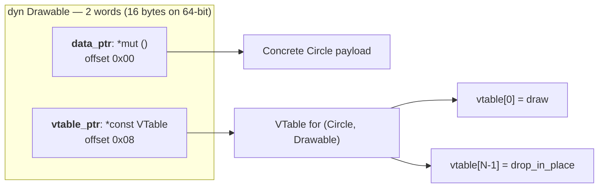

# Types

ZOM features a rich, static type system that provides safety guarantees while maintaining expressiveness and predictable runtime cost. Every expression and declaration has a type determined at compile time; the type checker assigns a type to every node in the AST and verifies that all operations are type-safe.

## Type System Overview

The ZOM type system is:

- **Static**: All types are known at compile time. No runtime type tagging for values unless explicitly requested via `dyn` existential types.
- **Strong**: No implicit conversions between incompatible types. Only explicitly sanctioned coercions are permitted (see [Subtyping](#subtyping) and [Type Casting and Conversion](#type-casting-and-conversion)).
- **Nominal**: Named types (classes, structs, enums, interfaces) are distinguished by their declaration identity, not by structure alone. Two structurally identical types declared at different source sites are incompatible.
- **Generic**: Supports parametric polymorphism via type parameters with declared bounds. Generic functions are type-checked parametrically (once, against declared bounds); concrete instantiations are monomorphized at code-generation time.
- **Inferred**: Intra-expression and intra-function types are inferred via a constraint-based engine. Equality constraints use first-order unification; directional subtype constraints are solved only at explicit coercion sites. Top-level declarations require explicit type annotations (no global inference).
- **Fail-closed**: Any expression that cannot be typed receives the `Error` type and a diagnostic is emitted. The checker never silently guesses a type.

## Predefined Types

### Integer Types

| Type | Size | Range | Description |
|------|------|-------|-------------|
| `i8` | 8 bits | -128 to 127 | Signed 8-bit integer |
| `i16` | 16 bits | -2^15 to 2^15-1 | Signed 16-bit integer |
| `i32` | 32 bits | -2^31 to 2^31-1 | Signed 32-bit integer (default integer literal type) |
| `i64` | 64 bits | -2^63 to 2^63-1 | Signed 64-bit integer |
| `u8` | 8 bits | 0 to 255 | Unsigned 8-bit integer |
| `u16` | 16 bits | 0 to 65,535 | Unsigned 16-bit integer |
| `u32` | 32 bits | 0 to 2^32-1 | Unsigned 32-bit integer |
| `u64` | 64 bits | 0 to 2^64-1 | Unsigned 64-bit integer |
| `isize` | pointer width | platform-dependent | Signed integer matching pointer size |
| `usize` | pointer width | platform-dependent | Unsigned integer matching pointer size |

```zom
let byte: u8 = 255;
let count: i32 = -42;
let bigNumber: u64 = 18_446_744_073_709_551_615;
```

An unadorned integer literal defaults to `i32`. If the literal value exceeds `i32` range, the type checker attempts `i64`, then `u64`, before reporting an overflow error. When an expected type is available from context (e.g., passing to a function expecting `u64`), the literal is unified with that type instead.

### Floating-Point Types

| Type | Size | Precision | Description |
|------|------|-----------|-------------|
| `f32` | 32 bits | ~7 decimal digits | Single-precision float (IEEE 754 binary32) |
| `f64` | 64 bits | ~15 decimal digits | Double-precision float (IEEE 754 binary64, default float literal type) |

```zom
let pi: f32 = 3.14159;
let precise: f64 = 3.141592653589793;
let scientific: f64 = 6.022e23;
```

An unadorned float literal defaults to `f64`. When an expected type is available from context, the literal is unified with that type.

### Boolean Type

The `bool` type has exactly two values: `true` and `false`.

```zom
let isValid: bool = true;
let isComplete: bool = false;
```

### Character Type

The `char` type represents a single Unicode scalar value (a 32-bit code point).

```zom
let letter: char = 'A';
let emoji: char = '\u{1F600}';
```

### String Type

The `str` type represents an immutable, UTF-8 encoded string view.

```zom
let message: str = "Hello, ZOM!";
let empty: str = "";
let multiline: str = "Line 1\nLine 2";
```

### Unit Type

The `unit` type has exactly one value, written `()` or an empty block `{}`. It is used for functions that do not produce a meaningful return value.

```zom
let empty: unit = ();

fun doSomething() -> unit {
    print("side effect");
}
```

### Never Type (`never`)

The **never type** (written `never`, pronounced "never" or "bottom") is the type with no values at all. A function whose declared return type is `never` is guaranteed to never return normally.

**Formation.** The never type is written as the predefined type `never` in type position. It has no parameters, no qualifiers, and no user-extensible surface. The `!` token is not a ZOM v1 type spelling.

**Subtyping.** `never` is a **subtype of every other type** (the unique bottom element of the ZOM type lattice). Whenever a value of type `T` is expected, a value of type `never` is accepted as `T` without further conversion.

**Expressions that produce `!`:**

- the runtime panic primitive and equivalent compiler intrinsics.
- `return expr;` when evaluated in expression position.
- `break` and `continue` (loop-exit constructs).
- `exit(code)`, `abort()`, `unreachable!()`, `todo!()` builtins.
- An infinite `loop { }` with no reachable exit.
- A match arm whose body is non-returning, such as `return` or `panic!`,
  imposes no fallthrough obligations on later arms.

```zom
fun diverge() -> ! { loop { } }

fun value_or_panic(opt: Option<i32>) -> i32 {
    match (opt) {
        when Some(v) => return v;
        when None => panic!("empty");
    }
}
```

**Algebraic simplification.** For any type `T`:

- `T | !` normalizes to `T`.
- `T & !` normalizes to `!`.

These rules are applied by the canonicalizer before subtype or bound checks.

**Generic bound satisfaction.** `never` satisfies all bounds trivially and vacuously. Since there can never be a value of type `never`, any property claimed about such a value is classically true.

### Top Type (`any`)

The `any` type is the **top type** (supertype of every other type). A value of
type `any` can hold any value. Downcasting from `any` to a concrete type requires
a checked cast via `as?` or `as!`.

```zom
let anything: any = 42;
anything = "hello";
```

### Null Type

The `null` type has exactly one value: `null`. It represents absence only when a target type explicitly admits absence through a nullable union such as `T | null` or its `T?` sugar.

**Critical restriction:** `null` is equal only to itself. It does not unify with `&T`, `&mut T`, class types, existential types, or value types. A `null` expression may coerce only into an explicit union that contains `null`.

```zom
let nothing: null = null;

// Valid: the target type explicitly includes null
let maybeRef: &i32? = null;

// Valid: class absence is explicit
let maybeObj: MyClass? = null;

// INVALID: references are non-null by default
// let ref: &i32 = null;  // ERROR

// INVALID: class values are non-null by default
// let obj: MyClass = null;  // ERROR

// INVALID: null does not unify with value types
// let x: i32 = null;  // ERROR

// INVALID: let without annotation cannot infer from null alone
// let y = null;       // ERROR: cannot infer type from null alone
```

## Type Forms

ZOM provides the following type forms. Each is a distinct constructor in the type representation.

### Primitive Types

The primitive types are the predefined scalar types listed above: `i8`, `i16`, `i32`, `i64`, `u8`, `u16`, `u32`, `u64`, `isize`, `usize`, `f32`, `f64`, `bool`, `char`, `str`, `unit`, `never`, `any`, and `null`.

### Function Types

Function types describe the signature of callable values.

```ebnf
FunctionType ::= '(' ParameterTypeList? ')' '->' TypeExpr ( 'raises' TypeExpr )?
```

```zom
// Basic function type
type BinaryOp = (i32, i32) -> i32;

// Function with no parameters
type Supplier<T> = () -> T;

// Function with no return value
type Consumer<T> = (T) -> unit;

// Higher-order function
type Mapper<T, U> = (T -> U, T[]) -> U[];

// Function with error handling (raises clause)
type SafeParser = (str) -> i32 raises ParseError;
```

A function type `(P1, P2, ..., Pn) -> R raises E` describes a callable that
takes parameters of types `P1` through `Pn`, has success type `R`, and has a
distinct raises effect `E`. Calling it produces an error-union expression whose
canonical value type is `R | E`; the checker also retains the success/residual
roles required by `?!` and `!!`. The raises effect remains part of function-type
identity, so this function type is not identical to `(P1, ..., Pn) -> (R | E)`.
Function-type parameter clauses contain types only. Parameter names belong to
function declarations and expressions, so `(value: T) -> U` is not a function
type.
See [Chapter 11](11-error-handling.md) for the full error handling model.

### Tuple Types

Tuple types represent fixed-size, ordered collections with potentially different element types.

```zom
// Anonymous tuple
let point: (f64, f64) = (3.0, 4.0);
let person: (str, i32, bool) = ("Alice", 30, true);

// Destructuring
let (name, age, isActive) = person;
let (x, y) = point;
```

Tuple elements are positional and have no labels. Two tuple types are equal
when they have the same number of elements and corresponding element types are
equal in order. Named fields use object, struct, or class types.

### Object Types

Object types define anonymous structural records with named fields.

```zom
// Anonymous object type
let point: { x: f64, y: f64 } = { x: 3.0, y: 4.0 };

// Object type with methods
type Calculator = {
    value: f64,
    add: (f64) -> unit,
    multiply: (f64) -> unit,
    result: () -> f64
};

// Optional properties
type Config = {
    host: str,
    port: i32,
    ssl?: bool,
    timeout?: i32
};
```

Two object types are structurally equal when they have the same field names with the same field types (field order does not matter). Object types are structural, not nominal.

### Array Types

ZOM has three distinct ordered homogeneous collection types:

```ebnf
DynamicArrayType ::= TypeExpr '[' ']'
SliceType ::= '[' TypeExpr ']'
FixedArrayType ::= '[' TypeExpr ';' Expression ']'
```

```zom
let numbers: i32[] = [1, 2, 3, 4, 5];
let strings: str[] = ["hello", "world"];
let matrix: i32[][] = [[1, 2], [3, 4]];
let view: [i32] = numbers[..];
let lanes: [i32; 4] = [1, 2, 3, 4];

// Array operations
let first = numbers[0];
let length = numbers.length;
numbers.push(6);
```

`T[]` is an owned dynamically sized array, `[T]` is a non-owning dynamically
sized slice, and `[T; N]` is a fixed-size array of `N` elements where `N` is a
compile-time unsigned integer constant. These three types are distinct and are
never aliases. A sized postfix form such as `T[N]` is not part of the grammar.

### Named Types

Named types are types declared via `class`, `struct`, `enum`, or `interface` declarations. They are identified by their declaration symbol.

A leading `::` anchors a named-type path at the crate root. Paths without that
prefix are resolved relative to the current module. The AST preserves this
absolute-versus-relative distinction so name resolution does not depend on
source spelling reconstruction.

```zom
struct Point { x: f64, y: f64 }
class Circle { radius: f64 }
enum Color { Red, Green, Blue }

let p: Point = Point { x: 1.0, y: 2.0 };
let c: Circle = Circle { radius: 5.0 };
let col: Color = Color::Red;
let canonical: ::core::Value;
```

Named types with type arguments form generic instantiations:

```zom
let v: Vec<u8> = Vec::new();
let m: Map<str, i32> = Map::new();
```

Two named types are equal when they refer to the same declaration symbol and have equal type arguments.

### Type Variables

Type variables represent unknown types during type inference. They are written as uppercase identifiers in generic parameter lists or as fresh unknowns introduced by the inference engine.

```zom
fun identity<T>(x: T) -> T {
    return x;
}
```

In the body of `identity`, `T` is a type variable. At each call site, the type checker infers the concrete type argument from the argument type. Type variables are not directly writable by the user outside of generic parameter declarations.

### Union Types

Union types represent values that can be one of several types.

```ebnf
UnionType ::= TypeExpr '|' TypeExpr
```

```zom
type StringOrNumber = str | i32;

mut value: StringOrNumber = "hello";
value = 42; // Also valid

fun process(input: str | i32 | bool) {
    match (input) {
        when str { print("String: " + input); }
        when i32 { print("Number: " + input.toString()); }
        when bool { print("Boolean: " + input.toString()); }
    }
}
```

Union types are **commutative** and **associative** up to type identity. The canonical form of a union is sorted, deduplicated, and with `never` removed. `T | never` normalizes to `T`.

The canonical value representation of a raising call with success type `T` and
raises type `E` is the union `T | E`. The function type still retains `T` and
`E` as distinct success and effect components, and the checker records their
roles on the call expression. An ordinary union expression has no error-union
role merely because it contains two alternatives. See
[Chapter 11](11-error-handling.md).

### Intersection Types

Intersection types represent values that satisfy multiple type constraints simultaneously.

```zom
interface Named {
    name: str;
}

interface Aged {
    age: i32;
}

type Person = Named & Aged;

let person: Person = {
    name: "Alice",
    age: 30
};
```

`T & !` normalizes to `!`. Intersection types are most commonly used with interface bounds to express "a type that implements both I and J".
The `+` token is not a type-level intersection operator. It is accepted only
by bound-list and interface-heritage productions described in Chapters 09 and
12.

### Optional Types

Optional types represent values that may be absent. The syntax `T?` is syntactic sugar for `T | null`.

```zom
let maybeNumber: i32? = 42;     // i32? = i32 | null
let nothing: str? = null;

// Optional chaining
let length = maybeString?.length;

// Null coalescing
let defaultValue = maybeNumber ?? 0;
```

The `T?` form is valid for any `T`; it is exactly the union `T | null`. For value-heavy APIs that need explicit variant names or payload-rich absence states, use `Option<T>` from the standard library instead.

### Reference Types

Reference types provide safe, aliased access to values without taking ownership.

```ebnf
ReferenceType ::= '&' ('mut')? TypeExpr
```

Valid forms:
- `&T` — shared (immutable) reference
- `&mut T` — exclusive (mutable) reference

| Property | `&T` | `&mut T` |
|----------|-------|-----------|
| Size | `ptr_size` | `ptr_size` |
| Copy | yes (implicit) | no (move-only) |
| `Shared` impl | yes when `T: Shared` | no |
| `Sendable` impl | yes when `T: Shared` | yes when `T: Sendable` |

**Subtyping.** `&mut T` is a subtype of `&T` (reborrow coercion). A mutable reference may be used wherever an immutable reference is expected, with zero runtime cost:

```zom
fun read_only(x: &i32) -> i32 { *x }

mut value = 42;
let mref: &mut i32 = &mut value;
read_only(mref);  // OK: &mut i32 coerces to &i32
```

The reverse (`&T` to `&mut T`) is **never** permitted.

**Borrowing rules (v1):**

1. At most one `&mut T` to the same place may be live at any point.
2. `&T` and `&mut T` to the same place may not coexist.
3. Multiple `&T` to the same place are permitted.
4. A reference must not outlive its referent.

Full borrow and lifetime diagnostics are owned by the dedicated borrow-checker
phase. The current type-checker surface covers reference typing and `&mut T`
to `&T` reborrow coercions, not full non-lexical lifetime analysis. See
[Chapter 14](14-memory-management.md).

### Raw Pointer Types

Raw pointers provide unchecked memory access for FFI interop and low-level data structure implementation.

```ebnf
RawPointerType ::= '*' ('const' | 'mut')? TypeExpr
```

Valid forms:
- `*const T` — raw const pointer (default when `const`/`mut` omitted)
- `*mut T` — raw mutable pointer

| Property | `*const T` | `*mut T` |
|----------|-------------|-----------|
| Size | `ptr_size` | `ptr_size` |
| Copy | yes (implicit) | yes (implicit) |
| `Shared` auto-impl | no | no |
| `Sendable` auto-impl | no | no |
| `FfiSafe` impl | yes | yes |
| Dereference requires `unsafe` | yes | yes |

**Subtyping.** `*mut T` is a subtype of `*const T`.

**Implicit conversions from safe references:**

```zom
let value = 42;
let r: &i32 = &value;
let p: *const i32 = r;   // OK: &T -> *const T

mut mvalue = 100;
let mr: &mut i32 = &mut mvalue;
let mp: *mut i32 = mr;   // OK: &mut T -> *mut T
let cp: *const i32 = mp; // OK: *mut T -> *const T
```

The reverse direction (`*const T` to `&T`, `*mut T` to `&mut T`) is **not** implicit and requires an `unsafe { }` block with an explicit cast.

Dereferencing a raw pointer requires `unsafe { }`:

```zom
let ptr: *const i32 = get_raw_pointer();
let val = unsafe { *ptr }; // OK
```

### Existential Types (`dyn`)

Existential types provide first-class runtime-dispatched values whose concrete type is erased. They enable heterogeneous collections sharing a common behavior, callbacks with unnameable closure types, and dependency-injected service objects.

ZOM follows an **explicit existential erasure model** (Swift 6 `any` semantics). An `interface I { ... }` declaration introduces only a *bound* — a predicate on type variables. It does **not** by itself introduce a type that can appear in value position. To treat "any value whose type implements I" as a first-class type, the programmer writes `dyn I`.

```ebnf
ExistentialType      ::= 'dyn' InterfaceType AssocBindingArgs? ( '+' MarkerPath )*
InterfaceType        ::= InterfaceName ( '<' GenericArgs '>' )?
AssocBindingArgs     ::= '<' AssocBinding ( ',' AssocBinding )* ','? '>'
AssocBinding         ::= Identifier '=' TypeExpression
MarkerPath           ::= AttributePath | Identifier
```

```zom
let a: dyn Drawable = Circle(radius: 5.0);
let b: dyn Iterator<Item = T> = vec.iter();
let c: dyn Read + Sendable + Shared = open_file();
```

The parser stores the first item after `dyn` directly as the object-safe
`DynTypeExpr.principal`, every `Item = T` associated type binding in
`DynTypeAssocBindingList`, and every `+ MarkerPath` suffix as marker bounds in
`DynTypeMarkerList`. Semantic analysis resolves the named principal as the
dispatch contract, treats associated type bindings as the dyn head's vtable
shape constraints, and resolves marker paths as marker-only bounds. Keeping
the principal and the two suffix lists distinct prevents object-safety checks from mistaking marker bounds
or associated type bindings for callable interface requirements while preserving
the compact source forms `dyn I<Item = T>` and `dyn I + Sendable + Shared`.

**Three normative rules:**

1. **First-class type.** `dyn I` is a standalone, sized, first-class language type. The interface declaration alone does not introduce a usable type.
2. **No implicit interface-to-type coercion.** There is no automatic conversion from `Circle implements Drawable` to "type `Drawable`". Any spelling that treats an interface name as a type in value position (without `dyn`) is a static error.
3. **Explicit-annotation coercion sites only.** Coercion from concrete `T implements I` to `dyn I` fires exclusively at sites where the target type is textually declared as `dyn I`. The type inference engine never produces an existential type as its solution.

**Invalid forms and diagnostics:**

| Form | Diagnostic |
|------|------------|
| `let x: dyn = value;` (bare `dyn` with no interface) | Parser/type diagnostic for missing dyn interface head |
| `let x: dyn (i32 \| str) = value;` (non-interface after `dyn`) | Type diagnostic for non-interface dyn head |
| `let x: dyn Error + dyn Sendable = value;` (repeated `dyn` prefix) | Parser/type diagnostic for repeated dyn prefix |
| `let x: dyn Iterator = value;` (associated type `Item` not bound) | ZOM4004 `DynUnassociatedType` |

**Runtime layout (2-word fat pointer):**



- `size_of<dyn I>() = 2 * ptr_size`.
- `align_of<dyn I>() = ptr_align`.
- Word 0 (`data_ptr`): pointer to the erased concrete object. Never null for a well-formed value.
- Word 1 (`vtable_ptr`): pointer to a static, immutable, per-(concrete-type, interface) virtual dispatch table.
- The final vtable slot is always `drop_in_place(*mut ())`.
- Three prefix words precede the first method slot at negative offsets: `size: usize`, `align: usize`, `marker_bitmap: u64`.

**Upcasting.** If `interface I : J`, then `dyn I + M` coerces to `dyn J + M` with **zero runtime cost**. The upcast operates exclusively on the vtable pointer (a compile-time-constant byte offset adjustment). No heap allocation or copy of the underlying object is performed.

```zom
let circle: dyn Drawable + Sendable = Circle(radius: 5.0);
let shape: dyn Shape + Sendable = circle;  // zero-cost upcast if Drawable inherits Shape
```

**Downcasting.** `dyn I.is<T>()` and `dyn I.downcast<T>()` are **not** part of ZOM. Users who need runtime type recovery on a specific interface hierarchy should declare an explicit `as_any() -> any` method on that interface. See [Chapter 9](09-interfaces.md) for object safety rules.

**Variance.** Type parameters inside an interface are **invariant** by default when instantiated as a `dyn` type. Covariance or contravariance requires explicit `#[zom::variance(...)]` on the interface declaration. See [Chapter 12](12-generics.md).

### Contextual `Self`

`Self` denotes the nearest enclosing class, struct, enum, error, interface, or
`impl` owner whose body contains the type expression. Nested callable and
closure syntax inherits that owner. A nested owner body replaces it.

The declaration header does not activate its own owner. In particular, an
`impl` interface list, implemented type, generic list, and `where` clause use
the surrounding context. The `impl` body activates the implementation owner.
The parser-generated `Self` type of a bare `this` receiver is intrinsic syntax
and does not constitute a lexical contextual `Self` occurrence.

`Self`, `Self::Item`, and a parenthesized `(Self)` begin with a contextual
`Self` root. A qualified path such as `package::Self` is an ordinary qualified
type reference. A contextual root outside an active owner produces `ZOM3025
ContextualSelfOutsideType` at the `Self` token.

### Associated Types

Associated types are type members of interfaces that are determined by the implementing type.

```zom
interface Iterator {
    type Item;
    fun next(this: &mut Self) -> Option<Self::Item>;
}

impl Iterator for VecIter<T> {
    type Item = T;
    fun next(this: &mut Self) -> Option<T> { ... }
}
```

The syntax `T::Item` refers to the associated type `Item` of the interface
implemented by `T`. If more than one bound can provide `Item`, the fully
qualified projection `<T as Interface>::Item` selects the source interface
explicitly. Associated types are resolved during trait/interface bound
discharge. See [Chapter 9](09-interfaces.md) and [Chapter 12](12-generics.md).
The parser preserves `T::Item` as a two-segment type path; the checker resolves
it as an unqualified associated type projection only when the first segment
denotes a type or generic parameter. Longer paths such as
`std::collections::HashMap` remain ordinary qualified type references.

### Parenthesized Types

Types can be parenthesized for clarity:

```zom
let x: (i32) = 42;
let complex: ((i32, str) -> bool) = someFunction;
```

Parentheses do not affect type identity.

## Type Identity and Equality

Two types are **structurally equal** when:

- Both are the same primitive kind.
- Both are function types with the same parameter count, same parameter types (order matters), same return type, and same raises set.
- Both are tuple types with the same element types in the same order.
- Both are object types with the same field names and same field types (order does not matter).
- Both are named types referring to the same declaration symbol with equal type arguments.
- Both are type variables with the same identity.
- Both are union types with the same set of member types (after canonicalization: sorted, deduplicated, `never` removed).
- Both are intersection types with the same member types.
- Both are reference types with the same pointee type and same mutability.
- Both are raw pointer types with the same pointee type and same mutability.
- Both are existential types with the same interface symbol and same marker set (order-independent).
- Both are associated types with the same base type and same associated type name (after resolution).
- `Error` type equals only itself.

**Nominal vs. structural distinction.** Named types (`class`, `struct`, `enum`, `interface`) use **nominal** equality: two named types are equal only if they refer to the same declaration, regardless of structural similarity. Object types, tuple types, function types, union types, and intersection types use **structural** equality.

## Subtyping

ZOM provides a limited set of proven-sound subtyping coercions. Subtyping is directional and is not equality unification. The type checker represents `source <: target` as a coercion constraint and solves it only at explicit coercion sites.

| Rule | Meaning | Notes |
|------|---------|-------|
| `never <: T` | Bottom type is subtype of every type | For any `T` |
| `T <: any` | Every type is subtype of top type | For any `T` |
| `&mut T <: &T` | Mutable reference coerces to shared reference | Reborrow, zero-cost |
| `*mut T <: *const T` | Mutable raw pointer coerces to const raw pointer | Zero-cost |
| `Ti <: T1 \| ... \| Ti \| ... \| Tn` | Value coerces into union | At coercion sites |
| `null <: T \| null` | Null coerces into an explicit nullable union | Never into bare `T` |
| `dyn I + M <: dyn J + M` | Existential upcast | When `I : J`, zero-cost |

**No numeric widening** without an explicit `as` cast. `i32` does not implicitly coerce to `i64`.

**No implicit interface-to-type coercion.** A concrete type `T` implementing `I` does not implicitly coerce to "type `I`" — the target must be explicitly `dyn I`.

**No nullable reference/class/existential values by default.** `&T`, class `C`, and `dyn I` are non-null value types. Absence must be spelled with `T?` or `T | null`.

### Coercion Sites

The checker may apply subtype coercions only at these sites:

| Site | Direction |
|---|---|
| Annotated local or field initializer | initializer type -> annotated target |
| Function or method argument | argument type -> parameter type |
| Return expression | expression type -> declared return type |
| Struct/class literal field | field expression type -> declared field type |
| Assignment RHS | RHS type -> LHS storage type |
| Conditional expression arm join | arm expression type -> selected join type |
| Explicit `dyn` annotation | concrete value type -> annotated `dyn` target |

The checker records inserted coercions for lowering. Union injection and existential erasure may require representation changes; reborrow and raw mut-to-const coercions are zero-cost.

### Variance

Variance controls whether a subtype relation may pass through a type constructor. ZOM v1 uses a conservative variance table:

| Constructor | Variance |
|---|---|
| `&T` | Covariant in `T` |
| `&mut T` | Invariant in `T` |
| `*const T`, `*mut T` | Invariant in `T` |
| Function parameters | Contravariant |
| Function return and raises members | Covariant |
| Tuple and immutable object fields | Covariant |
| Mutable object fields | Invariant |
| Array/vector-like mutable containers | Invariant |
| User-defined generic named types | Invariant in all parameters in v1 |
| `dyn I<Args>` | Invariant in all interface arguments in v1 |

Because user-defined generic types are invariant in v1, `Vec<&mut i32>` does not coerce to `Vec<&i32>`. Any future variance annotation requires a separate RFC and a variance checker before the parser accepts it.

## Type Inference

ZOM uses **annotation-directed local inference**: type information flows from declared types (parameters, return types, explicit annotations) inward to expressions, and from sub-expressions outward to their parent. The inference engine collects equality constraints and directional coercion constraints. Equality constraints are solved via first-order unification; coercion constraints are solved by the subtyping rules above.

### Local Variable Inference

For `let x = expr` (no type annotation):

1. A fresh type variable `?X` is created.
2. The expression `expr` is inferred to have type `T_expr`.
3. `?X` is unified with `T_expr`.
4. After all uses of `x` are processed:
   - If `?X` resolved to a concrete type, `x` has that type.
   - If `?X` is still unbound and is a numeric type variable, it defaults to `i32` (integer) or `f64` (float).
   - If `?X` is still unbound and non-numeric, the checker reports `ZOM4014: cannot infer type parameter`.

For `let x: T = expr` (with annotation):

1. The expression `expr` is inferred to have type `T_expr`.
2. A directional coercion constraint `T_expr <: T` is emitted at the local-initializer coercion site.
3. `x` has type `T`.

This means constraints flow both ways:

```zom
fun takes_u64(x: u64) -> unit { ... }

let x = 5;          // x gets a fresh type variable ?X
takes_u64(x);       // unifies ?X with u64
// x is now known to be u64
```

### Expression Type Rules

| Expression | Type Rule |
|---|---|
| Integer literal | Default `i32`, or unified with expected type. If literal exceeds `i32`, try `i64` then `u64` before error. |
| Float literal | Default `f64`, or unified with expected type. |
| String literal | `str` |
| Character literal | `char` |
| Boolean literal | `bool` |
| `null` | `null` type. Equal only to itself. It can coerce only into an explicit union containing `null`, such as `T \| null` or `T?`. `let x = null` without annotation is an error. |
| `unit` expression (`{}` or `()`) | `unit` |
| Identifier | Look up the symbol's type. If the symbol is a generic parameter, return the corresponding type variable. |
| Binary `op` | Infer both operand types, unify them (for arithmetic/comparison), check `op` validity. Arithmetic result = operand type. Comparison result = `bool`. |
| Unary `op` | Infer operand type, check `op` validity. `-` result = operand type. `!` result = `bool`. `*` result = dereferenced type. `&` result = reference type. |
| Call `callee(args)` | Infer callee type (must be function type). If generic, infer type args from arg types. Emit a directional coercion constraint from each argument type to the parameter type. A non-raising call has the declared success type. A call with success type `T` and raises type `E` has canonical expression type `T \| E` plus checked success/residual role metadata. |
| Member `obj.member` | Infer `obj` type. Look up `member` in the type's fields/methods. Result = field/method type. |
| Index `arr[idx]` | Infer `arr` type (must be `T[]`, `[T]`, or `[T; N]`). Infer `idx` type (must be `usize` or `isize`). Result = `T`. |
| Conditional `cond ? then : else` | `cond` must unify with `bool`. Infer `then` and `else` types, choose a join type, and emit directional coercions from each arm to the join. Result = join type. |
| Block `{ stmts; last }` | Type of last expression (or `unit` if empty). |
| `return value` statement | Emit a directional coercion constraint from `value` to the enclosing function's return type. Control does not fall through. |
| `match (scrut) { arms }` statement | Infer scrutinee type. Check each arm pattern against scrutinee type. Check each guard as `bool`. Check each arm body as a statement in the arm scope. Check exhaustiveness. |
| Lambda `(params) -> body` | Infer parameter types from annotations (or fresh type vars if untyped). Infer body type. Result = function type. |
| Struct literal `Type { fields }` | Resolve `Type`. For each field, emit a directional coercion constraint from value type to declared field type. Result = `Type`. |
| Array literal `[elems]` | Infer all element types, unify them. Result = `[ElemType]`. |
| `expr as Target` | Check that `expr` type can be cast to `Target` per [cast validity](#cast-validity). Result = `Target`. |
| `expr?!` (error propagate) | `expr` type must be `T \| E`. Enclosing function must have `raises E` in its signature. Result = `T`. |
| `expr!!` (error unwrap) | `expr` type must be `T \| E`. Result = `T`. Panics at runtime if value is `E`. |

### Operator Desugaring

The operators in this table select interface methods for user-defined types.
Built-in numeric and container operations use compiler primitive targets with
the same checked result contracts.

| Operator | Interface | Method | Notes |
|---|---|---|---|
| `a + b` | `Add<Rhs>` | `add(this, rhs: Rhs) -> Output` | Receiver is `a` |
| `a - b` | `Sub<Rhs>` | `sub(this, rhs: Rhs) -> Output` | Receiver is `a` |
| `a * b` | `Mul<Rhs>` | `mul(this, rhs: Rhs) -> Output` | Receiver is `a` |
| `a / b` | `Div<Rhs>` | `div(this, rhs: Rhs) -> Output` | Receiver is `a` |
| `a % b` | `Rem<Rhs>` | `rem(this, rhs: Rhs) -> Output` | Receiver is `a` |
| `a ** b` | `Pow<Rhs>` | `pow(this, rhs: Rhs) -> Output` | Receiver is `a` |
| `a == b`, `a != b` | `Eq<Rhs>` | `eq(this, rhs: Rhs) -> bool` | `!=` negates the result |
| `a < b`, `a <= b`, `a > b`, `a >= b` | `Ord<Rhs>` | `cmp(this, rhs: Rhs) -> i32` | Lowering tests the ordering relation |
| `-a` | `Neg` | `neg(this) -> Output` | Receiver is `a` |
| `!a` | `Not` | `not(this) -> bool` | Receiver is `a` |
| rvalue `a[b]` | `Index<Idx>` | `index(this, idx: Idx) -> Output` | Receiver is `a` |
| mutable place for `a[b] = c` or `a[b] op= c` | `IndexMut<Idx>` | `index_mut(this, idx: Idx) -> &mut Output` | Acquires one mutable place |
| `a in b` | `Contains` | `contains(this, value: Value) -> bool` | Receiver is `b` |

Unary plus, bitwise not, reference and dereference, pre/post update, shifts,
bitwise operations, short-circuit logical operations, strict equality, and null
coalescing are primitive-only operations. Plain assignment has no operation
dispatch; an indexed assignment may have the independent `IndexMut` access
shown above.

## Type Casting and Conversion

ZOM provides three cast operators with distinct failure behavior.

```ebnf
CastExpression ::= Expression 'as' ('?' | '!')? TypeExpr
```

| Operator | Name | Semantics | Failure behavior |
|----------|------|-----------|-----------------|
| `x as T` | Guaranteed cast | Compile-time-proven safe conversion | Always succeeds |
| `x as? T` | Optional cast | Runtime-checked conversion | Returns `T?`, `null` on failure |
| `x as! T` | Forced cast | Runtime-checked conversion | Returns `T`, panics on failure |

### `as` — Compile-Time Guaranteed

These conversions are always valid and carry zero runtime cost:

| Source | Target | Condition | Description |
|--------|--------|-----------|-------------|
| narrower integer | wider integer | always | Zero- or sign-extend (e.g., `i8` to `i32`) |
| `f32` | `f64` | always | Widen float |
| `&T` | `*const T` | always | Reference to raw pointer |
| `&mut T` | `*mut T` | always | Mutable ref to mut raw ptr |
| `&mut T` | `&T` | always | Mut-to-immut reference coercion (reborrow) |
| `*mut T` | `*const T` | always | Mut-to-const raw pointer coercion |
| `T` | `dyn I` | `T implements I`, target explicitly annotated | Existential coercion (fat pointer construction) |
| `dyn I` | `dyn J` | `I : J` | Upcast (vtable_ptr adjustment, zero-cost) |
| `T` | `T \| E` | always | Inject into success branch |
| `null` | `T \| null` | target explicitly contains `null` | Nullable union injection |

### `as?` — Optional Runtime Check

These conversions require a runtime check and return `null` on failure:

| Source | Target | Description |
|--------|--------|-------------|
| wider integer | narrower integer | Returns `null` on overflow (e.g., `i64` to `i32`) |
| `f64` | `f32` | Returns `null` if value is outside `f32` range |
| `any` | `T` | Runtime type check. Returns `null` if the erased type is not `T`. |
| `T \| E` | `T` | Returns `null` if the value is in the error branch. |
| `*const T` | `&T` | Requires `unsafe { }`. Returns `null` if null or misaligned. |
| `*mut T` | `&mut T` | Requires `unsafe { }`. Returns `null` if null or misaligned. |

```zom
let big: i32 = 1000;
let small: i8? = big as? i8;

let any_val: any = get_any();
let str_val: str? = any_val as? str;
```

### `as!` — Forced Runtime Check

`as!` accepts the same runtime-checked conversions as `as?`, but returns `T`
and enters the language panic boundary when the check fails.

```zom
let big: i32 = 1000;
let small: i8 = big as! i8;

let any_val: any = get_any();
let str_val: str = any_val as! str;
```

### Cast Validity Summary

Pointer casts between unrelated pointer types (`*mut T` to `*mut U`) require an `unsafe { }` block because they can produce misaligned or invalid pointers.

**Forbidden conversions** (always compile-time error):

| Source | Target | Reason |
|--------|--------|--------|
| `dyn I` | concrete `T` | v1 does not support downcast. Use `as_any() -> any` pattern. |
| `&T` | `&mut T` | Violates exclusive-mutability guarantee. |
| `*const T` | `*mut T` | Violates const-correctness contract. |
| `i32` | `bool` | No implicit boolean interpretation of integers. |
| `bool` | `i32` | No implicit numeric interpretation of booleans. |
| unrelated types | each other | Use `transmute` in `unsafe { }` if truly needed. |

## Type Queries

Type queries extract type information from values at compile time.

```zom
let value = 42;
type ValueType = typeof value; // i32

let obj = { name: "Alice", age: 30 };
type ObjectType = typeof obj; // { name: str, age: i32 }

// Keyof operator
type PersonKeys = keyof { name: str, age: i32 }; // "name" | "age"
```

The `typeof` operator returns the static type of its operand expression. The `keyof` operator returns the union of string literal types corresponding to the field names of an object type.

## Type Annotations

Type annotations explicitly specify types.

```zom
// Variable annotations
let count: i32 = 0;
let name: str = "Alice";

// Function parameter and return type annotations
fun greet(name: str): str {
    return "Hello, " + name;
}

// Complex type annotations
let callback: (str) -> bool = fun (s: str) -> bool { return s.length > 0; };
let data: { id: i32, values: f64[] } = {
    id: 1,
    values: [1.0, 2.0, 3.0]
};
```

Top-level declarations (functions, classes, structs, enums, interfaces, `let` at module level) require explicit type annotations. Local `let` bindings may omit annotations and rely on inference.

## Error Type Propagation

The type checker follows the **"one source error, one diagnostic"** principle:

1. When a sub-expression fails type checking, it receives type `Error`.
2. Parent expressions containing an `Error` child receive type `Error` without emitting an additional diagnostic.
3. This prevents cascading nonsense errors from a single root cause.

**Exception:** Pattern exhaustiveness errors are always reported even if the scrutinee has type `Error` — an inexhaustive match on an error type is still a bug in the user's code structure.

## Marker Types and Auto-Derivation

Marker types (interfaces with no methods, such as `Sendable`, `Shared`, `Linear`, `SuspendSafe`) are auto-derived for user-defined types based on their fields:

- **Product types** (struct/class): marker `M` holds iff every field satisfies `M`.
- **Sum types** (enum): marker `M` holds iff every variant's payload satisfies `M`.
- **Primitive types** (`i32`, `f64`, `bool`, `char`, `str`, `unit`): all are `Sendable` and `Shared`.
- **Function types**: are `Sendable` but not `Shared`.
- **Reference types** `&T`: are `Sendable` and `Shared` iff `T` is `Shared`.

`Linear` and `TaskBound` are **never** auto-derived; they require explicit opt-in.

Users may publish explicit marker facts:

- `impl !Sendable for MyType;` publishes negative evidence.
- `unsafe impl Sendable for MyType;` publishes a positive unsafe assertion.

See [Chapter 16](16-attributes-and-annotations.md) for the full marker system and [Chapter 15](15-concurrency.md) for concurrency-related markers.

## Atomic Types

For the `Atomic<T>` family of types, see [Chapter 15](15-concurrency.md) (Concurrency). Atomic types map to C++20 `std::atomic<T>` and provide the industry-standard SC-DRF memory model.

## Unsafe Safety Model

For the `unsafe` keyword and its interaction with the type system, see [Chapter 14](14-memory-management.md). The type system and borrow checker provide strong safety guarantees by default; `unsafe` marks explicit escape hatches for operations the compiler cannot prove safe.
