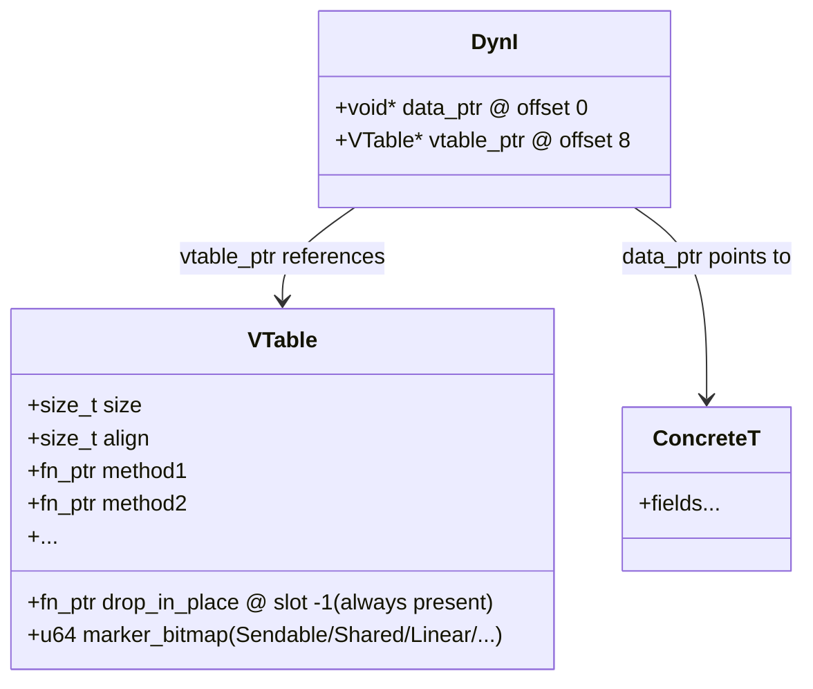

# Types

Zom features a rich, static type system that provides safety guarantees while maintaining expressiveness and performance.

## Type System Overview

The Zom type system is:

- **Static**: All types are known at compile time
- **Strong**: No implicit conversions between incompatible types
- **Inferred**: Types can often be inferred from context
- **Nominal**: Types are distinguished by name, not just structure
- **Generic**: Supports parametric polymorphism

## Predefined Types

### Integer Types

| Type | Size | Range | Description |
|------|------|-------|-------------|
| `i8` | 8 bits | -128 to 127 | Signed 8-bit integer |
| `i32` | 32 bits | -2³¹ to 2³¹-1 | Signed 32-bit integer |
| `i64` | 64 bits | -2⁶³ to 2⁶³-1 | Signed 64-bit integer |
| `u8` | 8 bits | 0 to 255 | Unsigned 8-bit integer |
| `u16` | 16 bits | 0 to 65,535 | Unsigned 16-bit integer |
| `u32` | 32 bits | 0 to 2³²-1 | Unsigned 32-bit integer |
| `u64` | 64 bits | 0 to 2⁶⁴-1 | Unsigned 64-bit integer |

```zom
let byte: u8 = 255;
let count: i32 = -42;
let bigNumber: u64 = 18_446_744_073_709_551_615;
```

### Floating-Point Types

| Type | Size | Precision | Description |
|------|------|-----------|-------------|
| `f32` | 32 bits | ~7 decimal digits | Single-precision float |
| `f64` | 64 bits | ~15 decimal digits | Double-precision float |

```zom
let pi: f32 = 3.14159;
let precise: f64 = 3.141592653589793;
let scientific: f64 = 6.022e23;
```

### Boolean Type

```zom
let isValid: bool = true;
let isComplete: bool = false;
```

### String Type

```zom
let message: str = "Hello, Zom!";
let empty: str = "";
let multiline: str = "Line 1\nLine 2";
```

### Special Types

- **`null`**: The type of the `null` value, representing absence
- **`unit`**: The type `()`, used for functions that don't return a value
- **`never`**: The bottom type, for functions that never return
- **`any`**: The top type, can hold any value (use sparingly)

```zom
let nothing: null = null;
let empty: unit = ();
fun loopForever() -> never {
    while (true) {}
}
```

## Type Expressions

### Parenthesized Types

Types can be parenthesized for clarity:

```zom
let x: (i32) = 42;
let complex: ((i32, str) -> bool) = someFunction;
```

### Union Types

Union types represent values that can be one of several types:

```zom
type StringOrNumber = str | i32;
type Result = Success | Error;

let value: StringOrNumber = "hello";
value = 42; // Also valid

fun process(input: str | i32 | bool) {
    match (input) {
        when str { print("String: " + input); }
        when i32 { print("Number: " + input.toString()); }
        when bool { print("Boolean: " + input.toString()); }
    }
}
```

### Intersection Types

Intersection types represent values that satisfy multiple type constraints:

```zom
interface Named {
    name: str;
}

interface Aged {
    age: i32;
}

type Person = Named & Aged;

let person: Person = {
    name: "Alice",
    age: 30
};
```

### Optional Types

Optional types represent values that may or may not exist:

```zom
let maybeNumber: i32? = 42;
let nothing: str? = null;

// Optional chaining
let length = maybeString?.length;

// Null coalescing
let defaultValue = maybeNumber ?? 0;
```

### Array Types

Array types represent ordered collections of elements:

```zom
let numbers: i32[] = [1, 2, 3, 4, 5];
let strings: str[] = ["hello", "world"];
let matrix: i32[][] = [[1, 2], [3, 4]];

// Array operations
let first = numbers[0];
let length = numbers.length;
numbers.push(6);
```

### Tuple Types

Tuple types represent fixed-size, ordered collections with potentially different element types:

```zom
// Anonymous tuple
let point: (f64, f64) = (3.0, 4.0);
let person: (str, i32, bool) = ("Alice", 30, true);

// Named tuple elements
let namedPoint: (x: f64, y: f64) = (x: 3.0, y: 4.0);
let coordinate = namedPoint.x; // Access by name

// Destructuring
let (name, age, isActive) = person;
let (x, y) = point;
```

### Function Types

Function types describe the signature of functions:

```zom
// Basic function type
type BinaryOp = (i32, i32) -> i32;

// Function with no parameters
type Supplier<T> = () -> T;

// Function with no return value
type Consumer<T> = (T) -> unit;

// Higher-order function
type Mapper<T, U> = (T -> U, T[]) -> U[];

// Function with error handling
type SafeParser = (str) -> i32 raises ParseError;

// Examples
let add: BinaryOp = fun (a: i32, b: i32) -> i32 { return a + b; };
let getString: Supplier<str> = fun () -> str { return "hello"; };
let print: Consumer<str> = fun (s: str) -> unit { console.log(s); };
```

### Existential Types (dyn)

#### 2.1 Purpose

Existential types provide first-class runtime values that hide a concrete type behind an interface contract. They are the mechanism ZOM uses to express heterogeneous collections of values that share a common behavior, callbacks whose concrete closure types cannot be named, and dependency-injected service objects whose implementations vary at runtime.

ZOM follows the explicit existential erasure model. An `interface I` declaration is a *bound*: a predicate placed on type variables inside generics. It is not, by itself, a type that can appear in a value position. To treat "any value whose type implements I" as a first-class, runtime-manifest type, the programmer MUST write `dyn I`. This spelling makes the cost of boxing, heap allocation (when required), and vtable indirection VISIBLE at every call site.

Other language designs have chosen the implicit path: mentioning an interface name in type position silently constructs an erased, boxed object. ZOM rejects this path in favor of cost predictability. Every allocation and every indirect call is written explicitly in source; reviewers reading a function signature can determine, without consulting a separate optimizer report, whether a parameter is passed monomorphically (zero cost, concrete type) or through an indirection table (runtime dispatch, potential heap traffic).

Existential types interact cleanly with ZOM's marker system (Ch.16 §16.12.3) and its object-safety rules (Ch.09 §9). Only object-safe interfaces may appear after `dyn`; this is enforced by the type checker with diagnostic ZOM0449 InterfaceNotObjectSafe.

#### 2.2 Syntax

The grammar for existential types is given below (see also Ch.17 DynType):

```
DynType              ::= 'dyn' InterfaceType ( '+' MarkerConjunction )?
InterfaceType        ::= Identifier TypeArguments?
MarkerConjunction    ::= MarkerItem ( '+' MarkerItem )*
MarkerItem           ::= '!'? ( Identifier | AttributeQualifiedPath )
```

Legal forms:

```zom
let a: dyn Drawable = ...;
let b: dyn Iterator<Item = u8> = ...;
let c: dyn Read + Sendable = ...;
let d: dyn Read + Write + Sendable + Shared = ...;
fun e(error: (dyn Error)) -> dyn Drawable;
let f: Vec<dyn FnOnce(i32) -> str> = ...;
```

Illegal forms and their diagnostics:

| Form | Diagnostic |
|------|------------|
| `let x: dyn = value;` (`dyn` head without interface) | ZOM0450 DynHeadMissingInterface |
| `let x: dyn (Drawable \| Printable) = value;` (union on the `dyn` head) | ZOM0451 DynHeadNotInterface |
| `let x: dyn Drawable + dyn Sendable = value;` (repeated `dyn` prefix) | ZOM0452 RepeatedDynPrefix |
| `let x: dyn Drawable + !Drawable = value;` (negation of the bound interface) | ZOM0448 NegativeInterfaceBoundNotAllowed |

#### 2.3 Semantics

- `dyn I` is a first-class language type. It IS sized on all targets.
- The default memory representation on all targets is TWO MACHINE WORDS, referred to as a *fat pointer*.
- Word 0: `data_ptr`. A pointer to the erased concrete object, with opaque pointee type `*mut ()`.
- Word 1: `vtable_ptr`. A pointer to a static, immutable, per-(concrete-type, interface) virtual dispatch table. Each distinct pair `(T, I)` where `T: I` produces exactly one vtable at code-generation time.
- Coercion rule: If `T: I + M1 + ... + Mn` (i.e., the concrete type `T` implements interface `I` and every marker listed in the conjunction), then a value of type `T` COERCES to `dyn I + M1 + ... + Mn`.
- Coercion is automatic ONLY at explicit-type-annotation sites: `let` bindings with annotations, function arguments, function return positions, struct fields, and generic type arguments that have been resolved to a concrete `dyn` type. Coercion is NOT automatic in the absence of a type annotation; the inference engine never produces an existential type as its solution. This is the core explicit-erasure rule.
- No double-boxing: a coercion from `dyn I` to `dyn I` is idempotent and a no-op at runtime. A coercion from `dyn I` to `dyn J`, where `I extends J`, is a *re-blessing*: the same fat pointer is carried forward but `vtable_ptr` is adjusted to reference (or reinterpreted as) the J-prefix of the original I-vtable. No heap allocation, no copy of the underlying concrete object.

#### 2.4 Memory Layout and Calling Convention

On a 64-bit platform, `dyn Drawable` has the following layout:



- `size_of::<dyn I>()`: 16 bytes on 64-bit targets, 8 bytes on 32-bit targets.
- `align_of::<dyn I>()`: equals the natural pointer alignment of the target (8 on 64-bit, 4 on 32-bit).
- Slot `-1` is ALWAYS `drop_in_place(*mut ())`. This slot is never repurposed and is part of the cross-crate ABI stability guarantee for `dyn` objects.
- The `marker_bitmap` field is 64 bits wide. Ch.16 R11 G6 runtime double-check consults this bitmap at spawn-accept time; the layout of bits matches `enum MarkerId`, with LSB (bit 0) assigned to `Sendable`, bit 1 to `Shared`, bit 2 to `Linear`, and subsequent markers assigned in declaration order of the standard marker prelude. Custom markers occupy user-space bits starting at bit 32.
- Method pointer order in the vtable matches interface declaration order, with superinterface methods flattened in post-order, left-to-right MRO traversal of the `extends` DAG. This order is part of the cross-crate ABI contract for a given interface version.

#### 2.5 Variance

The default variance of every type parameter referenced inside an interface is **invariant** when that interface is instantiated as a `dyn` type. This matches ZOM's global, safety-first variance policy: all generics default to invariant, and programmers opt into co- or contra-variance explicitly via the `#[zom::variance(...)]` attribute applied to the interface.

A `dyn Producer<Cat>` is NOT a subtype of `dyn Producer<Animal>` unless `Producer` is declared with a covariant out-parameter:

```zom
#[zom::variance(cov)]
interface Producer<out T> {
    fun produce(): T;
}
// dyn Producer<Cat> coerces to dyn Producer<Animal>
```

Opt-in variance is enforced at interface-declaration time against method signatures; any use of `T` in a contravariant position (parameter, writable field) invalidates the `cov` attribute with diagnostic ZOM0453 VarianceConflict. Variance attributes are inherited through `extends`; combining an inherited `cov` parameter with a local `contra` use is diagnosed as ZOM0454 InheritedVarianceConflict.

#### 2.6 Marker Propagation on dyn Objects

Given `dyn I + M1 + M2`:

- DECLARED marker bits = {M1} ∪ {M2} ∪ (closure over marker traits implied by I's own declared default marker-impls, transitively through the `extends` chain).
- ACTUAL marker bits (embedded in the vtable `marker_bitmap` at coercion site) = DECLARED ∩ (marker set of the concrete type T being coerced).
- A `dyn` object never carries more marker privileges than its DECLARED bound-list permits, even if the underlying concrete T satisfies additional markers. This is a soundness rule: a signature that promises only `dyn I + Shared` must not allow callers to assume `Sendable` merely because the runtime value happens to be `Sendable`.
- The runtime marker bitmap consulted by Ch.16 R11 G6 is the CLOSURE of the ACTUAL marker bits over the 3-phase negative closure: seed ¬M, blanket marker-propagation rules, and unsafe-override marker assertions.

Example:

```zom
let circle = Circle(radius: 5.0);
let x: dyn Drawable + Sendable = circle as dyn Drawable + Sendable;
```

At the coercion site, the compiler: (1) verifies `Circle: Drawable` and `Circle: Sendable`; (2) emits a reference to the static `(Circle, Drawable)` vtable; (3) records marker bits `{Drawable-closure} ∩ {Circle-marker-set} = {Sendable, Shared (inherited default if declared)}` in the vtable's `marker_bitmap` field.

#### 2.7 Upcasting

Rule: If `I extends J`, and a value has type `dyn I + M1 + ... + Mn`, then that value coerces to `dyn J + M1 + ... + Mn` with ZERO runtime cost.

Only `vtable_ptr` is offset: J's method slots form a leading sub-slice of I's vtable, so the upcast is either a pointer reinterpretation (when J is exactly I's first superinterface) or a small compile-time-constant byte offset (when J is deeper in the flattened prefix). No allocations and no copies of the underlying object are performed.

The explicit upcast syntax `x as dyn J` is optional but allowed, and is recommended in review-hostile code paths where the implicit coercion could be mistaken for a new allocation. No downcast syntax exists at the language level; programmers who need runtime type recovery should route through the `any` top type and the library-level `Any.downcast_ref::<T>()` facility.

#### 2.8 Downcasting Policy (explicit no-language-support)

`dyn I.is<T>()?` and `dyn I.downcast::<T>()` are deliberately NOT part of ZOM v1.0. Supporting per-vtable RTTI for every `dyn`-instantiated interface would require emitting type-id hashes and equality comparisons for every `(T, I)` pair used across a compiled program, substantially bloating binary size, static relocation tables, and link time for large codebases, while also introducing a permanent ABI surface that would constrain future vtable layout changes. Users who genuinely need dynamic downcast on a specific interface hierarchy are expected to declare an explicit `as_any() -> any` method on that interface themselves, and invoke library-level downcast helpers on the resulting `any` value. The built-in `any` type supports this path as a first-class facility for the standard library. This is an explicit, documented non-goal for ZOM v1, not an omission.

### Object Types

Object types define the structure of objects:

```zom
// Anonymous object type
let point: { x: f64, y: f64 } = { x: 3.0, y: 4.0 };

// Object type with methods
type Calculator = {
    value: f64,
    add: (f64) -> unit,
    multiply: (f64) -> unit,
    result: () -> f64
};

// Optional properties
type Config = {
    host: str,
    port: i32,
    ssl?: bool,  // Optional property
    timeout?: i32
};
```

## Type Queries

Type queries extract type information from values:

```zom
let value = 42;
type ValueType = typeof value; // i32

let obj = { name: "Alice", age: 30 };
type ObjectType = typeof obj; // { name: str, age: i32 }

// Keyof operator
type PersonKeys = keyof { name: str, age: i32 }; // "name" | "age"
```

## Type Annotations

Type annotations explicitly specify types:

```zom
// Variable annotations
let count: i32 = 0;
let name: str = "Alice";

// Function parameter and return type annotations
fun greet(name: str): str {
    return "Hello, " + name;
}

// Complex type annotations
let callback: (str) -> bool = fun (s: str) -> bool { return s.length > 0; };
let data: { id: i32, values: f64[] } = {
    id: 1,
    values: [1.0, 2.0, 3.0]
};
```
