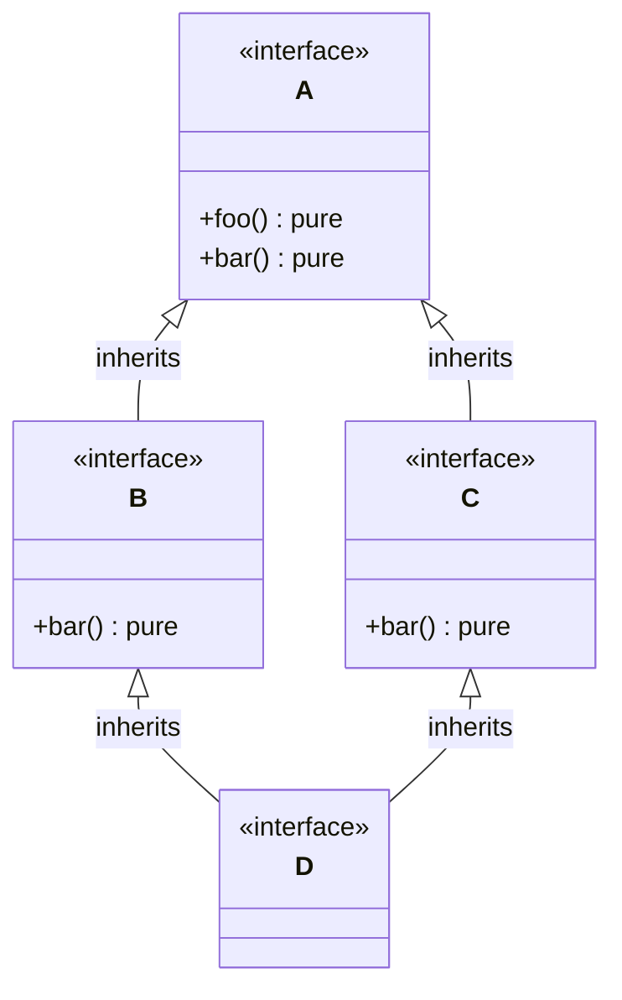
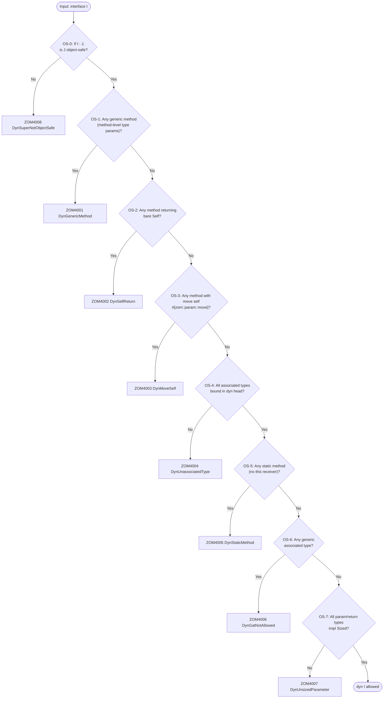

# Interfaces

Interfaces define contracts that types can implement, enabling polymorphism and
code reuse without coupling behavior to a class hierarchy. An interface
declares method signatures, accessor signatures, and associated type
requirements. A type implements an interface through an `impl I for T` block.

## 9.1 Basic Interface Declaration

An interface declaration introduces a new nominal interface type. The declaration header consists of an optional modifier list, the `interface` keyword, a binding identifier, optional type parameters, and an optional heritage clause. The body enumerates the interface's required members.

```zom
interface Drawable {
    fun draw();
    get bounds() -> Rectangle;
}

interface Movable {
    fun move(deltaX: f64, deltaY: f64);
    get position() -> Point;
}
```

A minimal empty interface is valid and useful as a marker:

```zom
interface Marker {}
```

### 9.1.1 Visibility and Modifiers

Module-level visibility is expressed with `export`. Visibility modifiers are
valid only on type members and are rejected on a module-level interface
declaration.

```zom
export interface Container<T> : Iterable {
    fun size() -> i32;
}
```

Individual interface members may also carry visibility modifiers (`private`, `protected`) and behavioral modifiers (`mutating`, `override`, `readonly`).

```zom
interface MixedAccess {
    protected fun helper();
    protected get context() -> Context;
    fun publicOp();
    get id() -> u64;
}
```

## 9.2 Interface Inheritance

An interface may inherit from one or more super-interfaces using the colon (`:`) syntax with `+` as the conjunction separator.

```zom
interface ReadableStream {
    fun read(buffer: u8[], offset: i32, length: i32) -> i32;
    fun close();
}

interface WritableStream {
    fun write(buffer: u8[], offset: i32, length: i32) -> i32;
    fun flush();
    fun close();
}

interface ReadWriteStream : ReadableStream + WritableStream {
    fun seek(position: i64);
    get position() -> i64;
}
```

Multiple super-interfaces are joined by `+`, which denotes logical conjunction (AND). The pipe `|` is reserved for union types and is rejected in interface heritage position.

### 9.2.1 Generic Interface Inheritance

Generic interfaces may inherit from other generic interfaces with type arguments:

```zom
interface Numeric<T> : Comparable<T> + Hash<T> {
    fun add(other: T) -> T;
}
```

## 9.3 Interface Members

The interface body contains three kinds of elements: method signatures, property signatures, and associated type declarations. All three are *required* — a type implementing the interface must provide a definition for each declared member.

### 9.3.1 Method Signatures

A method signature declares the name, parameter list, and optional return type of a method that implementors must provide. The signature ends with a semicolon (`;`). A method body (block statement) is **not permitted** inside an interface; the compiler emits a parse error if a `{ ... }` block follows the signature.

```zom
interface Writer {
    fun write_bytes(data: u8[]) -> i32;
    fun flush();
}
```

Methods may carry the `mutating` modifier to indicate that the call mutates the receiver:

```zom
interface Counter {
    mutating fun inc();
    mutating fun reset();
    get value() -> i64;
}
```

The `override` modifier is permitted on a method signature when the interface re-declares a method inherited from a super-interface, for example to tighten the return type:

```zom
interface OverrideReadonly {
    override fun toString() -> str;
    readonly get tag() -> str;
}
```

### 9.3.2 Property Signatures

Property signatures declare getter and setter requirements using the `get` and `set` keywords. A getter signature specifies the return type; a setter signature specifies the value parameter type.

```zom
interface UserRecord {
    get id() -> u64;
    get name() -> str;
    set name(v: str);
    set email(v: str);
}
```

The `readonly` modifier on a `get` signature indicates that the property is read-only (no setter obligation):

```zom
interface Named {
    readonly get name() -> str;
    readonly get id() -> u64;
}
```

### 9.3.3 Associated Types

An interface may declare associated types — type-level placeholders that each implementation must assign to a concrete type. Associated types are declared with the `type` keyword inside the interface body.

Four forms are supported:

```zom
interface Collection {
    type Item;                                    // (1) unconstrained
    type Error : Error;                           // (2) bounded
    type State = Closed | Open;                   // (3) with default
    type Iter<T>;                                 // (4) generic associated type (GAT)
}
```

The full form combines type parameters, bounds, and a default:

```zom
interface FullAssoc {
    type Element<T, U> : Show + Hash = T | U;
}
```

When an associated type carries both a bound and a default, the default must satisfy the bound.

Implementations assign associated types using the `type Name = ConcreteType;` syntax inside the `impl` block. See [§9.4 Standalone `impl I for T`](#94-standalone-impl-i-for-t-independent-implementation-blocks).

Associated type projections are resolved only when the source interface is
unique. If a type parameter has multiple bounds that declare the same
associated type name, the unqualified projection `T::Item` is ambiguous. Use
the fully qualified projection `<T as Interface>::Item` to select the source
interface explicitly.

## 9.4 Standalone `impl I for T` (Independent Implementation Blocks)

Not all behavior contracts can live inside the `class` body that declares the type. Two common cases motivate standalone implementation blocks: (a) the interface author owns the interface but does **not** own the target type (FFI types, standard-library types such as `u64`), and (b) the type author owns the type but wants to group impls into separate files for modularity (serialization, rendering, persistence in different compilation units).

### 9.4.1 Syntax

A standalone impl declaration uses the keyword `impl` followed by an interface bound list, the keyword `for`, and the target type. An optional `where`-clause constrains generic parameters.

```zom
impl Drawable for Button {
    fun draw() {
        print("Drawing " + this.text);
    }

    fun bounds() -> Rectangle {
        return Rectangle(this.position, this.size);
    }
}
```

Multiple interfaces and markers may be combined with `+`:

```zom
impl Reader + Writer + Seekable for FileStream { }
```

An `impl` block may assign associated types:

```zom
class ByteReader {
    let buf: u8[];
    mut pos: i32;
}

impl Iterator for ByteReader {
    type Item = u8;

    fun hasNext() -> bool {
        return this.pos < this.buf.length;
    }

    fun next() -> u8? {
        if (!this.hasNext()) { return null; }
        let byte = this.buf[this.pos];
        this.pos = this.pos + 1;
        return byte;
    }
}
```

### 9.4.2 Generic Impls and Where-Clauses

Generic standalone impls may use a `where`-clause to constrain type parameters:

```zom
impl<T> Debug for Vec<T> where T: Debug {
    fun fmt(f: &mut Formatter) {
        f.write_char('[');
        for (mut i = 0; i < this.length; i = i + 1) {
            if (i > 0) { f.write_str(", "); }
            Debug::fmt(this[i], f);
        }
        f.write_char(']');
    }
}
```

Interface declarations themselves do not accept a trailing `where`-clause in
v1. Generic constraints for an interface are expressed in the type parameter
list or on standalone impl declarations. A declaration such as
`interface BadIface<T> where T: Eq { ... }` is rejected by the parser, matching the conformance fixture
`09-interfaces/iface_where_reject_neg_05.zom`.

### 9.4.3 Orphan Rule

An `impl I for T` block is legal if either `I` or `T` is declared in the
current module. If both are foreign to the current module, the checker emits
`ZOM4054 OrphanImpl`.

Common legitimate use cases:

- **External type + local interface:** `impl JsonSerializable for u64` when
  `JsonSerializable` is declared in the current module.
- **Local type + external interface:** `impl Display for MyUuid` when `MyUuid`
  is declared in the current module.

The current module may contain at most one `impl I for T` for a nominal
`(I, T)` pair. A duplicate emits `ZOM4017 ConflictingImpl`. RFC 0008 owns the
cross-module coherence design.

### 9.4.4 Marker Forwarding

If the impl list includes markers (`+ Sendable`, `+ Shared`, etc.), the combined form is equivalent to writing separate `impl Sendable for T` declarations. The combined syntax is purely syntactic sugar — each marker in the list becomes a separate coherence entry.

## 9.5 Interface Inheritance & Diamond Resolution

When an interface inherits from multiple super-interfaces, a method name may be reachable through more than one path. The language specifies a deterministic set of resolution rules.

### 9.5.1 Inheritance-Conflict Resolution Rules (IR-1 .. IR-4)

**IR-1: Identical signatures are redundant.** Redundant redeclaration of a method already inherited from a superinterface is allowed but produces a redundant-inherited-method warning (not an error).

**IR-2: Same name, different parameter list = independent overload.** No conflict is reported; each signature is tracked separately and dispatch selects the matching overload by argument shape.

**IR-3: Same name, same params, different return type = incompatible.** The compiler emits an incompatible-return-type error. The user must resolve by explicitly re-declaring the method in the child interface with the single correct return type.

**IR-4: Conflicting pure-method obligations.** If two super-interfaces declare the same method signature as abstract (no body), there is no ambiguity — the concrete type simply implements it once. The obligation is the same regardless of which path it is reached through.

### 9.5.2 Diamond Inheritance Structure

The following class diagram illustrates a canonical diamond where `D` inherits from both `B` and `C`, each of which inherits from the common root `A`:



Under IR-1, `D` inherits `foo()` from `A` without conflict. For `bar()`, both `B` and `C` redeclare the same signature; IR-1 treats this as redundant and emits a warning. The concrete class implementing `D` provides a single `bar()` that satisfies all inherited obligations.

### 9.5.3 Explicit Qualification Syntax

When a type implements multiple interfaces that share a method name, the user may disambiguate inside the implementing class body by invoking a specific interface's method using the `InterfaceName::method` qualified-call form:

```zom
interface IBase { fun foo() -> str; }
interface IA : IBase { fun bar() -> str; }
interface IB : IBase { fun baz() -> str; }

class C {
    let data: str;
}

impl IA for C {
    fun foo() -> str { return "IA: " + this.data; }
    fun bar() -> str { return this.foo(); }
}

impl IB for C {
    fun foo() -> str { return "IB: " + this.data; }
    fun baz() -> str { return IB::foo(this); }
}
```

The qualified form `IB::foo(this)` passes the receiver as its first argument. The resolution is static: it always dispatches to the method as defined in the named interface's impl, independent of any further subclasses of `C`.

## 9.6 Object-Safe Interfaces (dyn Prerequisite)

An interface `I` is *object-safe* iff values of type `T: I` can be coerced to `dyn I`, the existential type form defined in [Ch.03 §Existential Types](03-types.md). An object-unsafe interface is rejected at the point of an attempted coercion with the specific diagnostic matching the first rule that failed.

Object-safety is a vtable-layout property: every method on the interface must be representable as a fixed-size function pointer slot whose calling convention is identical for every implementor `T`.

### 9.6.1 Object-Safety Decision Flowchart



### 9.6.2 OS-0 (Inheritance Closure)

If `I : J` and `I` is object-safe, every superinterface `J` must also be object-safe. Otherwise the compiler emits `ZOM4008 DynSuperNotObjectSafe`.

### 9.6.3 OS-1 No Generic Methods

Methods may not introduce their own type parameters. Each distinct instantiation would otherwise require a fresh vtable slot and the set of instantiations is unbounded.

```zom
interface X { fun map<T>(f: fun(Self)->T) -> T; }   // ZOM4001 DynGenericMethod
```

### 9.6.4 OS-2 No Methods Returning Bare Self

`Self` (the concrete implementing type) cannot be returned by value because its size is not statically known behind `dyn`. `Self?` is allowed only because the `dyn` calling convention lowers it as an explicit nullable union whose success payload is materialized behind the erased data pointer. The source type remains `Self | null`; the pointer-sized representation is a dyn ABI lowering detail, not the general layout of every nullable union.

```zom
interface Cloneable { fun clone() -> Self; }           // ZOM4002 DynSelfReturn
```

### 9.6.5 OS-3 No Move-Consume Self

A receiver with the linear move attribute, `fun consume(#[zom::param::move] this)`, is forbidden. Linear move of a `dyn I` receiver requires compile-time known size, which is not available. Allowed receivers are `borrow this`, `&mut this`, and `self` passed by non-move reference.

```zom
interface Consumable { fun consume(#[zom::param::move] this); }   // ZOM4003 DynMoveSelf
```

### 9.6.6 OS-4 All Associated Types Bound in the dyn Head

If an interface declares associated types, every one must be assigned in the `dyn` head. Writing bare `dyn Iterator` leaves `Item` unknown and therefore breaks the calling convention of `next() -> Item?`; the coerced type must be `dyn Iterator<Item = T>`.

```zom
let it: dyn Iterator = make_iter();                       // ZOM4004 DynUnassociatedType
let it_ok: dyn Iterator<Item = u8> = make_iter();         // OK
```

### 9.6.7 OS-5 No Static Methods

A method lacking any form of `this` receiver has no dispatch target in the
vtable. Such methods remain callable through the qualified path
`I::static_method()` on the interface itself, but their presence makes the
interface ineligible for `dyn I`.

```zom
interface Factory { static fun create() -> Self; }        // ZOM4005 DynStaticMethod
```

### 9.6.8 OS-6 No Generic Associated Types (GAT)

An associated type that introduces its own type parameters is a GAT. GAT vtable representation is not part of the current dynamic-dispatch contract.

```zom
interface Iterable { type Iter<T>: Iterator; }            // ZOM4006 DynGatNotAllowed
```

### 9.6.9 OS-7 All Parameters and Returns Are Sized

Every method parameter type and return type, modulo the explicit exceptions above, must impl the `Sized` marker at coercion time. DSTs such as `[T]` or unsized structs cannot flow across a vtable boundary because their layout is not static.

Diagnostic: `ZOM4007 DynUnsizedParameter`.

### 9.6.10 Examples of dyn-Compatible Interfaces

A minimal object-safe interface:

```zom
interface Writer {
    fun write_bytes(data: u8[]) -> i32;
    fun flush();
}

fun write_all(w: &mut dyn Writer, data: u8[]) {
    mut remaining = data.length;
    while (remaining > 0) {
        let written = w.write_bytes(data.slice(data.length - remaining));
        remaining = remaining - written;
    }
    w.flush();
}
```

A dyn-compatible interface combined with marker bounds for cross-thread safety:

```zom
interface RpcHandler {
    fun handle(req: Request) -> Response;
}

fun dispatch(h: &(dyn RpcHandler + Sendable + Shared), req: Request) -> Response {
    return h.handle(req);
}
```

## 9.7 Interfaces as Generic Bounds

Interface names and marker names both participate in the same `BoundList` syntax, shared with [Ch.12 §Generics](12-generics.md). The full `BoundList` grammar (normative in Ch.12) is:

```ebnf
BoundList = TypeExpression ( "+" TypeExpression )* ;
```

A type parameter's bound list therefore has the general form `<T: Interface1<Arg> + Interface2 + Marker1>`.

### 9.7.1 Examples

A single interface bound on a generic function (Ch.12 generic form):

```zom
fun sort<T: Comparable<T>>(arr: T[]) -> T[] {
    // standard in-place quicksort using Comparable::compareTo
    return arr;
}
```

Combining an interface bound with two positive marker bounds for thread-safety:

```zom
fun draw_all<T: Drawable + Sendable>(items: T[]) {
    for (x in items) {
        x.draw();
    }
}
```

### 9.7.2 Intersection Types vs. Bound Lists

The intersection operator `&` used in type expressions such as `Drawable & Rounded` (Ch.03) is structural and produces a type. The `+` separator used in bound lists such as `T: Drawable + Rounded` is predicate-level conjunction and produces a proof obligation. A type satisfies `T: I1 + I2` precisely when it satisfies both bounds simultaneously; the type expression `I1 & I2` as a standalone type is sugar for `dyn (I1 & I2)`, the existential form combining multiple object-safe interfaces.

## 9.8 Grammar Reference (Informative)

The following productions are reproduced from the normative
[Ch.17 Grammar Reference](17-grammar-reference.md) for convenience.

```ebnf
InterfaceDecl  ::= ModifierList 'interface' BindingIdent TypeParameters?
                   InterfaceHeritage?
                   '{' InterfaceBody '}'

Interface declarations do not accept `WhereClause`; generic constraints for an
interface are written in `TypeParameters` or on standalone impl declarations.
The parser rejects `interface I<T> where T: Bound { ... }`.

InterfaceHeritage ::= ':' InterfaceBoundList
InterfaceBoundList ::= InterfaceBound ( '+' InterfaceBound )*
InterfaceBound     ::= QualifiedPathOrIdent ( '<' TypeArgumentList '>' )?

InterfaceBody   ::= InterfaceElement*
InterfaceElement ::= ModifierList 'fun' MethodSignature ';'
                  | ModifierList ('get' | 'set') PropertySignature ';'
                  | ModifierList 'type' Identifier TypeParameters?
                    ( ':' InterfaceBoundList )? ( '=' TypeExpr )? ';'

MethodSignature   ::= PropertyName CallSignature
CallSignature     ::= TypeParameters? FunctionSignature
PropertySignature ::= PropertyName FunctionSignature

StandaloneImplDecl ::= UnsafePrefix? 'impl' TypeParameters? InterfaceBoundList
                       'for' TypeExpr WhereClause?
                       '{' ImplMember* '}'

ImplMember     ::= ModifierList 'fun' BindingIdent TypeParameters?
                    FunctionSignature ( ';' | BlockStatement )
                 | 'type' Identifier TypeParameters? '=' TypeExpr ';'
                 | 'mut' VariableDeclList ';'
                 | 'let' VariableDeclList ';'
                 | 'const' ConstDeclList ';'
```

## 9.9 Summary

- Interfaces declare method signatures, property signatures, and associated type requirements that types satisfy via `impl I for T` blocks.
- Interface inheritance uses the colon (`:`) syntax with `+` for multiple super-interfaces (conjunction). Pipe `|` is rejected in heritage position.
- Interface method and property signatures end with a semicolon; method bodies are not permitted inside interface declarations.
- Associated types support four forms: unconstrained, bounded, defaulted, and generic (GAT). Full form combines type parameters, bounds, and defaults.
- Standalone `impl I for T` blocks extend interface coverage when either the
  interface or target type is local to the current module. `ZOM4054 OrphanImpl`
  rejects a fully foreign pair, and `ZOM4017 ConflictingImpl` rejects duplicate
  nominal pairs in the module.
- Multiple interface inheritance uses four conflict-resolution rules (IR-1..IR-4): redundant signatures warn, independent overloads coexist, incompatible return types error, and shared pure-method obligations converge.
- Eight object-safety rules (OS-0..OS-7) govern whether an interface can be coerced to `dyn I` (Ch.03 §Existential Types), with dedicated diagnostics `ZOM4001` through `ZOM4008`.
- Interface names and marker names participate in positive generic bound lists.
