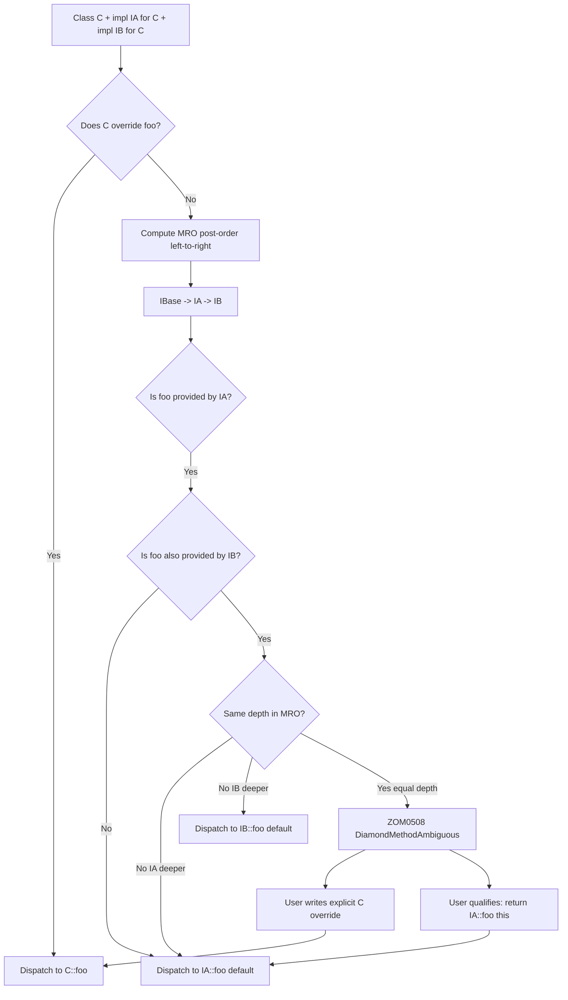

# Interfaces

Interfaces define contracts that types can implement, enabling polymorphism and code reuse.

### Basic Interface

```zom
interface Drawable {
    fun draw();
    fun getBounds() -> Rectangle;
}

interface Movable {
    fun move(deltaX: f64, deltaY: f64);
    fun getPosition() -> Point;
}
```

### Interface Implementation

```zom
class Button {
    private let position: Point;
    private let size: Size;
    private let text: str;

    public init(position: Point, size: Size, text: str) {
        this.position = position;
        this.size = size;
        this.text = text;
    }
}

impl Drawable for Button {
    public fun draw() {
        // Draw button implementation
        print("Drawing button: " + this.text);
    }

    public fun getBounds() -> Rectangle {
        return Rectangle(this.position, this.size);
    }
}

impl Movable for Button {
    public fun move(deltaX: f64, deltaY: f64) {
        this.position.x += deltaX;
        this.position.y += deltaY;
    }

    public fun getPosition() -> Point {
        return this.position;
    }
}
```

### Generic Interfaces

```zom
interface Container<T> {
    fun add(item: T);
    fun remove(item: T) -> bool;
    fun contains(item: T) -> bool;
    fun size() -> i32;
    fun isEmpty() -> bool;
    fun clear();
}

interface Iterator<T> {
    fun hasNext() -> bool;
    fun next() -> T?;
}

interface Iterable<T> {
    fun iterator() -> Iterator<T>;
}
```

### Interface Inheritance

```zom
interface ReadableStream {
    fun read(buffer: u8[], offset: i32, length: i32) -> i32;
    fun close();
}

interface WritableStream {
    fun write(buffer: u8[], offset: i32, length: i32) -> i32;
    fun flush();
    fun close();
}

interface ReadWriteStream extends ReadableStream, WritableStream {
    fun seek(position: i64);
    fun getPosition() -> i64;
}
```

### Associated Types

```zom
interface Collection<T> {
    type Iterator: Iterator<T>;

    fun iterator() -> Iterator;
    fun size() -> i32;
}

class ArrayList<T> {
    private let items: T[];
}

impl Collection<T> for ArrayList<T> {
    type Iterator = ArrayListIterator<T>;

    public fun iterator() -> ArrayListIterator<T> {
        return ArrayListIterator(this.items);
    }

    public fun size() -> i32 {
        return this.items.length;
    }
}
```

### Default Interface Methods (DIM)

An interface method may carry a body, which provides a default implementation that downstream classes inherit unless overridden. Default methods let an interface grow over time without requiring every existing implementation to be updated. A default method operates solely through the interface's own method surface; it has no direct access to any class-specific fields or internal state.

The following interface declares one abstract method (`serialize`) and one default method (`toJsonString`) that builds on top of it:

```zom
interface JsonSerializable {
    fun serialize() -> JsonValue;

    fun toJsonString() -> str {
        return this.serialize().to_pretty_str();
    }
}
```

Any class implementing `JsonSerializable` automatically receives `toJsonString` for free. If a class wishes to override the default (for example, to produce compact JSON instead of pretty-printed JSON), it may declare its own `toJsonString` with the same signature.

A second example demonstrates layering several convenience levels on top of a single primitive hook. The `Logger` interface exposes three default methods that each dispatch through one abstract primitive:

```zom
interface Logger {
    fun log(level: LogLevel, message: str);

    fun info(message: str) {
        this.log(LogLevel.INFO, message);
    }

    fun warn(message: str) {
        this.log(LogLevel.WARN, message);
    }

    fun error(message: str) {
        this.log(LogLevel.ERROR, message);
    }
}
```

A concrete logger class only needs to provide `log`; `info`, `warn`, and `error` come for free and remain consistent across every implementation.

#### Permitted default-method behavior

DIM-1: Default methods may ONLY call other interface methods, they may NOT access class-specific fields or state. Violating the body restriction is a semantic error emitted as `ZOM0432 DefaultMethodAccessesNonInterfaceState`. This restriction preserves interface-safety: a default body must remain valid for every possible future implementor of the interface.

DIM-2: If a standalone `impl I for T` block provides its own method with the same name and signature, the concrete impl ALWAYS wins. The user-provided impl method takes precedence over any default provided by the interface or by any of that interface's ancestors.

DIM-3: Default methods on extended interfaces follow nearest-precedes-ancestor resolution, consistent with the diamond inheritance rules specified in §8.

#### Grammar extension

The `InterfaceElement` production is extended to permit a block statement as the body of a method declaration, enabling default methods.

```ebnf
InterfaceElement
  = MethodDeclaration
  | AssociatedTypeDecl
  ;

MethodDeclaration
  = Attribute* Visibility? "fun" Identifier GenericParams?
      "(" FunctionParameters? ")" ReturnType? BlockStatement?
  ;
```

When `BlockStatement` is absent the method is abstract; when present the method carries a default implementation.

### Standalone `impl I for T` (Independent Implementation Blocks)

Not all behavior contracts can live inside the `class` body that declares the struct. Two common cases motivate standalone implementation blocks: (a) the interface author owns the interface but does NOT own the target type (the newtype pattern, FFI types, or standard-library types such as `u64`), and (b) the type author owns the type but wants to group impls into separate files for modularity, for example organizing serialization, rendering, and persistence contracts in different compilation units.

Standalone impl declarations use the keyword `impl` followed by the interface name, the keyword `for`, and the target type. An optional marker-trait list (`+ MarkerPath`) may be attached, and an optional `where`-clause may constrain generic parameters.

```ebnf
StandaloneImplDeclaration
  = "impl" GenericParams? InterfaceName ("+" MarkerPath)*
      "for" Type WhereClause? "{"
        (MethodDeclaration | AssociatedTypeAssignment)*
      "}"
  ;

AssociatedTypeAssignment
  = "type" Identifier "=" Type ";"
  ;
```

An interface implementation is written as a standalone `impl I (+ M*)* for T { ... }` block placed anywhere in the same crate as either `I` or `T` (see §12 Orphan Rule). This is the only language surface for attaching interface methods to a type — ZOM does not provide a heritage-clause syntax for inlining interface methods inside a class body.

If two distinct `impl I for T` blocks exist for the same nominal `(I, T)` pair within the same crate, the compiler emits `ZOM0505 DuplicateInterfaceImpl`, since the vtable layout would be ambiguous.

#### Orphan rule

An `impl I for T` block is legal if `I` is declared in the current crate OR `T` is declared in the current crate. If both the interface and the target type are foreign to the current crate the compiler emits `ZOM0708 OrphanInterfaceImpl`. This rule preserves coherence across crate boundaries: downstream crates cannot inject conflicting implementations for types and interfaces they do not own.

#### Examples

The crate that owns `JsonSerializable` may extend it to the built-in `u64` type, even though the crate does not own the definition of `u64`:

```zom
impl JsonSerializable for u64 {
    fun serialize() -> JsonValue {
        return JsonValue.Number(this as f64);
    }
}
```

A crate that owns a local `MyUuid` struct may implement a foreign `Display` interface imported from the standard library. This is permitted because `MyUuid` is local:

```zom
import std::fmt::Display;

struct MyUuid(private let bytes: u8[16]);

impl Display for MyUuid {
    fun fmt(f: &mut Formatter) {
        f.write_str(this.bytes.to_hex_string());
    }
}
```

Standalone impl blocks may also assign associated types, consistent with the in-class form shown in §5:

```zom
class ByteReader(private let buf: u8[], private let pos: i32);

impl Iterator<u8> for ByteReader {
    type Item = u8;

    fun hasNext() -> bool {
        return this.pos < this.buf.length;
    }

    fun next() -> u8? {
        if !this.hasNext() { return nil; }
        let byte = this.buf[this.pos];
        this.pos = this.pos + 1;
        return byte;
    }
}
```

#### Where-clause support

Generic standalone impls may use a `where`-clause to constrain type parameters. The following impl propagates the `Debug` requirement to the element type:

```zom
impl<T> Debug for Vec<T> where T: Debug {
    fun fmt(f: &mut Formatter) {
        f.write_char('[');
        for (let i = 0; i < this.length; i = i + 1) {
            if i > 0 { f.write_str(", "); }
            Debug::fmt(this[i], f);
        }
        f.write_char(']');
    }
}
```

### Interface Inheritance & Diamond Resolution

An interface may `extends A, B, ...`, inheriting from multiple superinterfaces listed in declaration order. Multiple inheritance means that a method name may be reachable through more than one path, so the language specifies a deterministic four-rule resolution order for default methods.

#### Diamond resolution rules (DR)

DR-1: A class override always wins. If the implementing class declares a method with the same name and signature as an interface default, the class method takes precedence over every interface default, regardless of inheritance depth or position.

DR-2: Without a class override, the NEAREST interface in the linearized method-resolution order (MRO) wins. The MRO is computed as a post-order traversal left-to-right through each `extends` list, with duplicates eliminated on first occurrence. In other words, more-derived interfaces precede their ancestors, and left-listed interfaces precede right-listed ones at equal depth.

DR-3: If two interfaces at equal depth both provide a default for the same method signature and neither subsumes the other through MRO linearization, a DIAMOND AMBIGUITY exists. The compiler emits `ZOM0508 DiamondMethodAmbiguous`. The user MUST resolve the ambiguity by writing an explicit class override, or by qualifying the target interface at the call site as described in §8.3.

DR-4: A marker bound attached via `impl I + M for T` is NEVER ambiguous, because marker interfaces carry no methods and therefore introduce no default-method candidates. Markers participate in coherence but never in dispatch.

#### Diamond-resolution flowchart

The flowchart below traces the dispatch of a call `c.foo()` on an instance `c` of a class `C` for which both `impl IA for C` and `impl IB for C` exist, where both interfaces extend a common `IBase` and each may define its own default for `foo`.



#### Explicit qualification syntax

When DR-3 fires the user may disambiguate inside the class body by invoking a specific interface default using the `InterfaceName::method` qualified-call form:

```zom
interface IBase { fun foo() -> str; }
interface IA extends IBase { fun foo() -> str { return "A"; } }
interface IB extends IBase { fun foo() -> str { return "B"; } }

class C { ... }

impl IA for C {
    fun foo(self) -> str {
        /* C's resolution */
        return IA::foo(this);
    }
}

impl IB for C {
    /* C already provided foo in impl IA for C above;
       this one never runs for unqualified c.foo()
       per rule DR-1 (most specific user-provided
       concrete impl wins over interface defaults
       and competing-interface siblings).
       If the caller wants IB's foo they write IB::foo(this). */
}
```

The qualified form passes the receiver as its first argument, mirroring how default methods see `this`. The resolution is static, so `IA::foo(this)` always dispatches to the default body provided by `IA`, independent of any further subclasses of `C`.

### Object-Safe Interfaces (for dyn coercion)

An interface `I` is object-safe iff values of type `T: I` can be coerced to `dyn I`, the existential type form defined in Ch.03 §X Existential Types. A violation detected at the point of an attempted coercion is emitted as `ZOM0440 InterfaceNotObjectSafe` with a sub-code indicating which specific rule failed.

Object-safety is a vtable-layout property: every method on the interface must be representable as a fixed-size function pointer slot whose calling convention is identical for every implementor `T`. The seven rules below enumerate the required conditions.

OS-1: No generic methods. A generic method such as `fun map<U>(f: T -> U) -> U;` breaks vtable-slot count stability because each distinct `U` would require a separate slot, and the set of instantiations is unbounded. Violation sub-code: `ZOM0441 GenericMethodInDynInterface`.

OS-2: No method returns bare `Self`. A signature such as `fun clone() -> Self;` would require the caller to know the concrete size of the return value, which is not statically available behind `dyn`. The sub-code is `ZOM0442 SelfReturnInDynInterface`. Note that `Self?` return IS allowed: the option is always pointer-sized (one word), and the runtime materializes the cloned value on the heap so that callers receive a uniform representation.

OS-3: No `#[zom::param::move] self` parameter. A signature `fun consume(self);` requires the receiver to be sized at the call site, but the size of `dyn I` is not statically known. Violation sub-code: `ZOM0443 LinearSelfInDynInterface`.

OS-4: All associated types must be bound at the dyn head. Writing `dyn Iterator` leaves `Item` unknown and therefore breaks the calling convention of `next() -> Item?`; the coerced type must be `dyn Iterator<Item = u8>`. Violation sub-code: `ZOM0444 UnassociatedDynType`.

OS-5: No static methods on the interface. A declaration such as `static fun create() -> Self;` has no `this` to dispatch through the vtable, so it cannot appear on a `dyn I` type. Violation sub-code: `ZOM0445 StaticMethodInDynInterface`. Static methods declared directly on the interface are still callable through the qualified path `I::create()`, they are simply not part of the dyn vtable.

OS-6: The interface declares NO Generic Associated Types. GAT syntax such as `type Stream<'a>: Iterator;` introduces lifetime-indexed associated families whose vtable representation is deferred to post-v1. Violation sub-code: `ZOM0446 GatInDynInterface`.

OS-7: Every method parameter type and return type, modulo the explicit exceptions above, must be `Sized` by the type-checker at coercion time. DSTs such as `[T]` or unsized structs cannot flow across a vtable boundary because their layout is not static. Violation sub-code: `ZOM0447 UnsizedTypeThroughDynVtable`.

#### Examples of dyn-compatible interfaces

A minimal object-safe interface:

```zom
interface Writer {
    fun write_bytes(data: u8[]) -> i32;
    fun flush();
}

fun write_all(w: &mut dyn Writer, data: u8[]) {
    let mut remaining = data.length;
    while remaining > 0 {
        let written = w.write_bytes(data.slice(data.length - remaining));
        remaining = remaining - written;
    }
    w.flush();
}
```

A dyn-compatible interface combined with marker bounds for cross-thread safety:

```zom
interface RpcHandler {
    fun handle(req: Request) -> Response;
}

fun dispatch<T>(h: &(dyn RpcHandler + Sendable + Shared), req: Request)
    -> Task<Response>
{
    return async { h.handle(req) };
}
```

### Interfaces as Generic Bounds

Interface names are first-class `BoundItem` entries in the generic-constraint system. They share the `+`-separator syntax with marker bounds. The full form for a type parameter is `<T: Interface1 + Interface2 + Marker1 + !Marker2>`.

#### Negation prefix (`!`)

The `!` prefix is ONLY legal on marker bounds. Writing `!Interface1` as a bound is a semantic error emitted as `ZOM0448 NegativeInterfaceBoundNotAllowed`. Interfaces are behavioral contracts, not structural properties; the predicate "explicitly does NOT have interface I" is not meaningful in ZOM's type system because negative interface impls are deliberately not supported, and the orphan rule has no mechanism for coherently propagating negations across crate boundaries.

#### Examples

A single interface bound on a generic function:

```zom
fun sort<T: Comparable<T>>(arr: T[]) -> T[] {
    // standard in-place quicksort using Comparable::compareTo
    return arr;
}
```

An interface bound combined with two marker bounds for thread-safety:

```zom
fun render<T: Drawable + Sendable + Shared>(items: T[]) -> Picture {
    let mut canvas = Picture::new();
    for item in items {
        canvas.blit(item.draw());
    }
    return canvas;
}
```

An interface bound combined with a negated marker bound to express "runnable on the local thread only":

```zom
fun spawn_local<T: Runnable + !Sendable>(task: T) -> JoinHandle {
    return LocalExecutor::enqueue(task);
}
```

Attempting to negate an interface bound is an error. The following declaration is rejected with `ZOM0448 NegativeInterfaceBoundNotAllowed`:

```zom
// ERROR: ZOM0448 NegativeInterfaceBoundNotAllowed
fun opaque<T: !Cloneable>(value: T) -> OpaqueHandle {
    return OpaqueHandle::wrap(value);
}
```

#### Intersection types vs. bound lists

The intersection operator `&` used in type expressions such as `Drawable & Rounded` (Ch.03) is structural and produces a type. The `+` separator used in bound lists such as `T: Drawable + Rounded` is predicate-level conjunction and produces a proof obligation. A type satisfies `T: I1 + I2` precisely when it satisfies both bounds simultaneously; the type expression `I1 & I2` as a standalone type is sugar for `dyn (I1 & I2)`, the existential form combining multiple object-safe interfaces.

### Summary

- Interfaces declare method and associated-type contracts that classes and standalone `impl` blocks satisfy.
- Default interface methods layer convenience behavior on top of abstract primitives, subject to the three DIM rules restricting access to non-interface state, override precedence, and ancestor resolution.
- Standalone `impl I for T` blocks extend interface coverage to foreign types and allow modular grouping of impls, governed by the orphan rule and the duplicate-impl coherence check.
- Multiple interface inheritance uses post-order left-to-right MRO with four explicit diamond-resolution rules; equal-depth collisions require a class override or qualified dispatch.
- Seven object-safety rules (OS-1 through OS-7) govern whether an interface can be coerced to `dyn I`, each with a dedicated `ZOM044x` sub-code.
- Interface names participate in generic bound lists alongside marker bounds; only marker bounds may be negated, and the distinction between structural `&` and predicate-level `+` is preserved throughout the type system.
