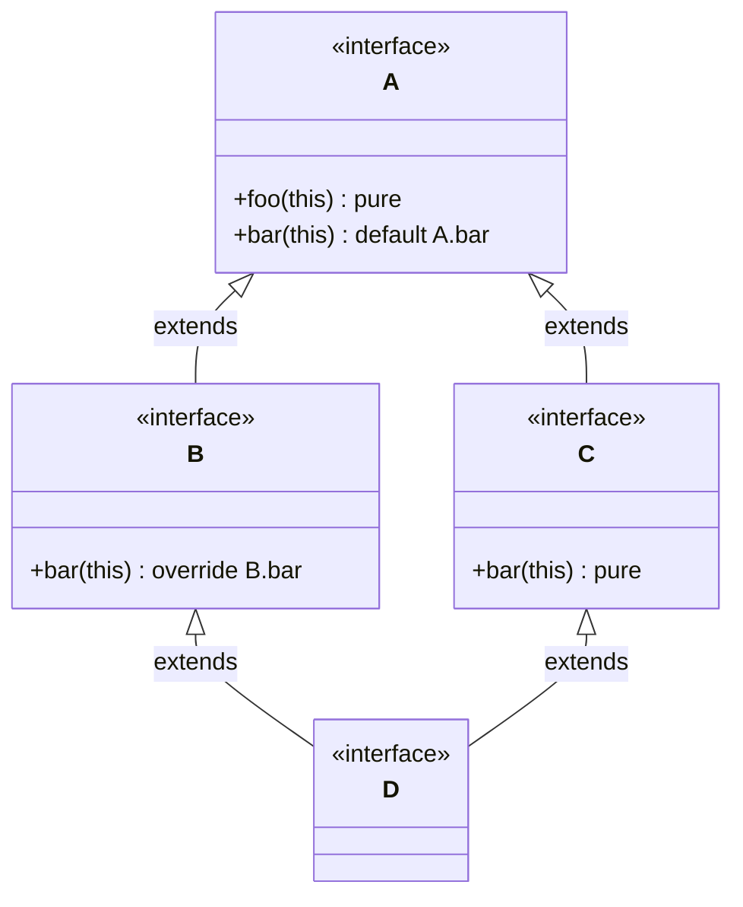
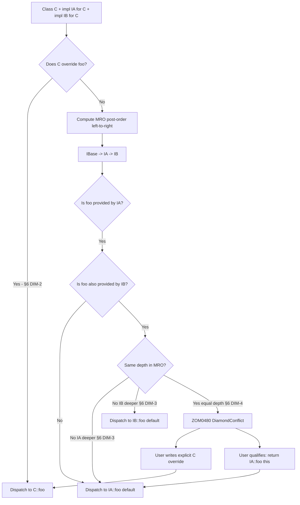
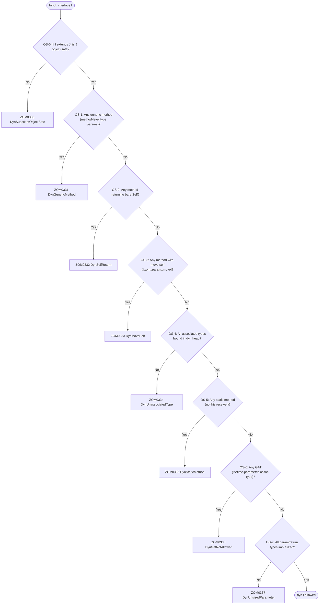

# Interfaces

Interfaces define contracts that types can implement, enabling polymorphism and code reuse.

### Basic Interface

```zom
interface Drawable {
    fun draw();
    fun getBounds() -> Rectangle;
}

interface Movable {
    fun move(deltaX: f64, deltaY: f64);
    fun getPosition() -> Point;
}
```

### Interface Implementation

```zom
class Button {
    private let position: Point;
    private let size: Size;
    private let text: str;

    public init(position: Point, size: Size, text: str) {
        this.position = position;
        this.size = size;
        this.text = text;
    }
}

impl Drawable for Button {
    public fun draw() {
        // Draw button implementation
        print("Drawing button: " + this.text);
    }

    public fun getBounds() -> Rectangle {
        return Rectangle(this.position, this.size);
    }
}

impl Movable for Button {
    public fun move(deltaX: f64, deltaY: f64) {
        this.position.x += deltaX;
        this.position.y += deltaY;
    }

    public fun getPosition() -> Point {
        return this.position;
    }
}
```

### Generic Interfaces

```zom
interface Container<T> {
    fun add(item: T);
    fun remove(item: T) -> bool;
    fun contains(item: T) -> bool;
    fun size() -> i32;
    fun isEmpty() -> bool;
    fun clear();
}

interface Iterator<T> {
    fun hasNext() -> bool;
    fun next() -> T?;
}

interface Iterable<T> {
    fun iterator() -> Iterator<T>;
}
```

### Interface Inheritance

```zom
interface ReadableStream {
    fun read(buffer: u8[], offset: i32, length: i32) -> i32;
    fun close();
}

interface WritableStream {
    fun write(buffer: u8[], offset: i32, length: i32) -> i32;
    fun flush();
    fun close();
}

interface ReadWriteStream extends ReadableStream, WritableStream {
    fun seek(position: i64);
    fun getPosition() -> i64;
}
```

### Associated Types

```zom
interface Collection<T> {
    type Iterator: Iterator<T>;

    fun iterator() -> Iterator;
    fun size() -> i32;
}

class ArrayList<T> {
    private let items: T[];
}

impl Collection<T> for ArrayList<T> {
    type Iterator = ArrayListIterator<T>;

    public fun iterator() -> ArrayListIterator<T> {
        return ArrayListIterator(this.items);
    }

    public fun size() -> i32 {
        return this.items.length;
    }
}
```

### Default Interface Methods (DIM)

An interface method may carry a body, which provides a default implementation that downstream classes inherit unless overridden. Default methods let an interface grow over time without requiring every existing implementation to be updated. A default method operates solely through the interface's own method surface; it has no direct access to any class-specific fields or internal state.

The following interface declares one abstract method (`serialize`) and one default method (`toJsonString`) that builds on top of it:

```zom
interface JsonSerializable {
    fun serialize() -> JsonValue;

    fun toJsonString() -> str {
        return this.serialize().to_pretty_str();
    }
}
```

Any class implementing `JsonSerializable` automatically receives `toJsonString` for free. If a class wishes to override the default (for example, to produce compact JSON instead of pretty-printed JSON), it may declare its own `toJsonString` with the same signature.

A second example demonstrates layering several convenience levels on top of a single primitive hook. The `Logger` interface exposes three default methods that each dispatch through one abstract primitive:

```zom
interface Logger {
    fun log(level: LogLevel, message: str);

    fun info(message: str) {
        this.log(LogLevel.INFO, message);
    }

    fun warn(message: str) {
        this.log(LogLevel.WARN, message);
    }

    fun error(message: str) {
        this.log(LogLevel.ERROR, message);
    }
}
```

A concrete logger class only needs to provide `log`; `info`, `warn`, and `error` come for free and remain consistent across every implementation.

#### Permitted default-method behavior

DIM-1: Default methods may ONLY call other methods of the same interface (or its super-interfaces); they may NOT access any member fields or class-specific state. Violating the body restriction is a semantic error emitted as `ZOM0480 DefaultMethodAccessesNonInterfaceState`. This restriction preserves interface-safety: a default body must remain valid for every possible future implementor of the interface.

DIM-2 (nearest-wins, diamond-safe priority): A class or struct's own method (written in the class body or in any `impl I for T` block) ALWAYS wins over ANY default method, regardless of inheritance depth. The user-provided impl method takes precedence over any default provided by the interface or by any of that interface's ancestors.

DIM-3: Between competing default methods, the most-derived (nearest) interface in the method-resolution order wins over the least-derived (far) interface. See §8 for the full MRO definition.

DIM-4: If two equally near interfaces provide conflicting defaults for the same signature, a tie exists. The concrete class MUST provide an explicit override; if it does not, the compiler emits `ZOM0480 DiamondConflict`.

A complete example demonstrating the pure/default split and the "only call interface methods" rule:

```zom
interface Drawable {
    fun draw(this);                                               // pure
    fun drawBoundingBox(this) {                                   // default
        let b = this.bounds();                                    // calls another method
        println!("box({},{},{},{})", b.x, b.y, b.w, b.h);
    }
    fun bounds(this) -> Rect;                                     // pure
}
```

The default `drawBoundingBox` dispatches through `bounds()` (a peer pure method) and never touches fields, satisfying DIM-1.

#### Grammar extension

The `InterfaceElement` production is extended to permit a block statement as the body of a method declaration, enabling default methods.

```ebnf
InterfaceElement
  = MethodDeclaration
  | AssociatedTypeDecl
  ;

MethodDeclaration
  = Attribute* Visibility? "fun" Identifier GenericParams?
      "(" FunctionParameters? ")" ReturnType? BlockStatement?
  ;
```

When `BlockStatement` is absent the method is abstract; when present the method carries a default implementation.

### Standalone `impl I for T` (Independent Implementation Blocks)

Not all behavior contracts can live inside the `class` body that declares the struct. Two common cases motivate standalone implementation blocks: (a) the interface author owns the interface but does NOT own the target type (the newtype pattern, FFI types, or standard-library types such as `u64`), and (b) the type author owns the type but wants to group impls into separate files for modularity, for example organizing serialization, rendering, and persistence contracts in different compilation units.

Standalone impl declarations use the keyword `impl` followed by the interface name, the keyword `for`, and the target type. An optional marker-trait list (`+ MarkerPath`) may be attached, and an optional `where`-clause may constrain generic parameters.

```ebnf
StandaloneImplDeclaration
  = "impl" GenericParams? InterfaceName ("+" MarkerPath)*
      "for" Type WhereClause? "{"
        (MethodDeclaration | AssociatedTypeAssignment | ConstantDeclaration)*
      "}"
  ;

AssociatedTypeAssignment
  = "type" Identifier "=" Type ";"
  ;
```

(Full normative grammar is reproduced in Ch.17 §StandaloneImplDeclaration.)

An interface implementation is written as a standalone `impl I (+ M*)* for T { ... }` block placed anywhere in the same crate as either `I` or `T`. This is the explicit form; the `class X implements I1, I2` heritage clause is SEMANTICALLY EQUIVALENT and serves purely as syntactic sugar — the compiler lowers it into the identical `impl I for X` internal representation.

If two distinct `impl I for T` blocks exist for the same nominal `(I, T)` pair within the same crate, the compiler emits `ZOM0505 DuplicateImpl`, since the vtable layout would be ambiguous. The same diagnostic is emitted when BOTH `class X implements I` and an explicit `impl I for X {}` exist in the same crate for the exact same binding (the two forms may not coexist).

#### Orphan rule

An `impl I for T` block is legal if EITHER: (1) `I` is declared in the current crate, OR (2) `T` is declared in the current crate. If both the interface and the target type are foreign to the current crate the compiler emits `ZOM0710 OrphanImpl`. This rule preserves coherence across crate boundaries: downstream crates cannot inject conflicting implementations for types and interfaces they do not own. The full orphan-rule matrix — including the cross-crate overlap case `ZOM0714 AmbigImplOverlap` — is specified in Ch.22 §22.4.

Common legitimate use cases:
- **External type + internal interface:** e.g. `impl Json for std::Vec<u8>` where `Vec<u8>` is imported from the standard crate but `Json` is local.
- **Internal type + external interface:** e.g. `impl serde::Serialize for MyType` where `MyType` is local but `Serialize` comes from a dependency crate.

Per-crate coherence allows at most ONE `impl I for T` per `(I, T)` pair; cross-crate overlap is rejected by `ZOM0714 AmbigImplOverlap` (Ch.22 §22.4).

#### Marker forwarding

If the impl list includes markers (`+ Sendable`, `+ Shared`, etc.), the combined form is equivalent to writing independent `impl Sendable for T` declarations. The combined syntax is purely sugar — each marker in the list becomes a separate coherence entry.

#### Examples

The crate that owns `JsonSerializable` may extend it to the built-in `u64` type, even though the crate does not own the definition of `u64`:

```zom
impl JsonSerializable for u64 {
    fun serialize() -> JsonValue {
        return JsonValue.Number(this as f64);
    }
}
```

A crate that owns a local `MyUuid` struct may implement a foreign `Display` interface imported from the standard library. This is permitted because `MyUuid` is local:

```zom
import std::fmt::Display;

struct MyUuid(private let bytes: u8[16]);

impl Display for MyUuid {
    fun fmt(f: &mut Formatter) {
        f.write_str(this.bytes.to_hex_string());
    }
}
```

Standalone impl blocks may also assign associated types, consistent with the in-class form shown in §5:

```zom
class ByteReader(private let buf: u8[], private let pos: i32);

impl Iterator<u8> for ByteReader {
    type Item = u8;

    fun hasNext() -> bool {
        return this.pos < this.buf.length;
    }

    fun next() -> u8? {
        if !this.hasNext() { return nil; }
        let byte = this.buf[this.pos];
        this.pos = this.pos + 1;
        return byte;
    }
}
```

#### Where-clause support

Generic standalone impls may use a `where`-clause to constrain type parameters. The following impl propagates the `Debug` requirement to the element type:

```zom
impl<T> Debug for Vec<T> where T: Debug {
    fun fmt(f: &mut Formatter) {
        f.write_char('[');
        for (let i = 0; i < this.length; i = i + 1) {
            if i > 0 { f.write_str(", "); }
            Debug::fmt(this[i], f);
        }
        f.write_char(']');
    }
}
```

### Interface Inheritance & Diamond Resolution

An interface may `extends A, B, ...`, inheriting from multiple superinterfaces listed in declaration order. Multiple inheritance is permitted for interfaces (but not for classes). Multiple inheritance means that a method name may be reachable through more than one path, so the language specifies a deterministic four-rule resolution order.

#### Inheritance-conflict resolution rules (IR-1 .. IR-4)

IR-1: **Identical signatures (name + params + return type) are redundant.** Redundant redeclaration of a method already inherited from a superinterface is allowed but produces the `ZOM0478 RedundantInheritedMethod` WARNING (not an error).

IR-2: **Same name, different parameter list = independent overload.** No conflict is reported; each signature is tracked separately and dispatch selects the matching overload by argument shape.

IR-3: **Same name, same params, different return type = incompatible.** The compiler emits `ZOM0482 IncompatibleReturnType` ERROR. The user MUST resolve by explicitly re-declaring the method in the child interface with the single correct return type: `fun name(args) -> CorrectType;`.

IR-4: **Conflicting default implementations from two superinterfaces** fall under §6 DIM-4. If two equally-near interfaces supply default bodies for the same signature, the concrete class MUST override; if the user wishes to resolve the ambiguity at the interface level rather than in the class, the child interface may re-declare the method as pure or supply its own default body — either act ends the ambiguity for downstream implementors.

#### Diamond inheritance structure

The following class diagram illustrates a canonical diamond where `D` extends both `B` and `C`, each of which extends the common root `A`:



Under the nearest-wins rule (§6 DIM-3 + §8 IR-4), `D` inherits `B.bar` because `B` is more derived than the shared ancestor `A`, while `C.bar` (pure) does not conflict — the concrete class simply has a non-default obligation to supply `bar` if it does not already inherit a body. The full concrete example below demonstrates this:

```zom
interface A { fun foo(this); fun bar(this) { println("A.bar"); } }
interface B extends A { override fun bar(this) { println("B.bar"); } }
interface C extends A { fun bar(this); }
interface D extends B, C {
    // inherits B.bar() and pure C.bar(); B wins (nearest rule)
    // inherits A.foo() pure; no conflict
}
```

#### Diamond-resolution flowchart

The flowchart below traces the dispatch of a call `c.foo()` on an instance `c` of a class `C` for which both `impl IA for C` and `impl IB for C` exist, where both interfaces extend a common `IBase` and each may define its own default for `foo`. The flow mirrors §6 DIM-2 (concrete-wins) and DIM-3/4 (nearest-wins with tie):



#### Explicit qualification syntax

When §6 DIM-4 fires, the user may disambiguate inside the class body by invoking a specific interface default using the `InterfaceName::method` qualified-call form:

```zom
interface IBase { fun foo() -> str; }
interface IA extends IBase { fun foo() -> str { return "A"; } }
interface IB extends IBase { fun foo() -> str { return "B"; } }

class C { ... }

impl IA for C {
    fun foo(self) -> str {
        /* C's resolution */
        return IA::foo(this);
    }
}

impl IB for C {
    /* C already provided foo in impl IA for C above;
       this one never runs for unqualified c.foo()
       per rule DR-1 (most specific user-provided
       concrete impl wins over interface defaults
       and competing-interface siblings).
       If the caller wants IB's foo they write IB::foo(this). */
}
```

The qualified form passes the receiver as its first argument, mirroring how default methods see `this`. The resolution is static, so `IA::foo(this)` always dispatches to the default body provided by `IA`, independent of any further subclasses of `C`.

### Object-Safe Interfaces (dyn prerequisite)

An interface `I` is object-safe iff values of type `T: I` can be coerced to `dyn I`, the existential type form defined in Ch.03 §Existential Types. An object-unsafe interface is rejected at the point of an attempted coercion with the specific diagnostic matching the first rule that failed. All seven rules OS-1 through OS-7 must pass, and the inheritance chain must be closed under object-safety (OS-0).

Object-safety is a vtable-layout property: every method on the interface must be representable as a fixed-size function pointer slot whose calling convention is identical for every implementor `T`.

#### Object-safety decision flowchart



#### OS-0 (inheritance closure)

If `I extends J` and I is object-safe, every superinterface J must also be object-safe. Otherwise the compiler emits `ZOM0338 DynSuperNotObjectSafe` (a companion of `ZOM0330 NeverTypeCoerceFail` used for broader existential-coercion failures — see Ch.03).

#### OS-1 No generic methods

Methods may not introduce their own type parameters. Each distinct instantiation would otherwise require a fresh vtable slot and the set of instantiations is unbounded.

Counter-example:
```zom
interface X { fun map<T>(this, f: fun(Self)->T) -> T; }   // ZOM0331 DynGenericMethod
```
Diagnostic: `ZOM0331 DynGenericMethod`.

#### OS-2 No methods returning bare Self

`Self` (the concrete implementing type) cannot be returned by value because its size is not statically known behind `dyn`. Note that `Self?` is allowed: the option is always pointer-sized (one word), and the runtime materializes the cloned value on the heap so that callers receive a uniform representation.

Counter-example:
```zom
interface Cloneable { fun clone(this) -> Self; }           // ZOM0332 DynSelfReturn
```
Diagnostic: `ZOM0332 DynSelfReturn`.

#### OS-3 No move-consume self

A receiver with the linear move attribute, `fun consume(#[zom::param::move] this)`, is forbidden. Linear move of a `dyn I` receiver requires compile-time known size, which is not available. Allowed receivers are `borrow this`, `&mut this`, and `self` passed by non-move reference.

Counter-example:
```zom
interface Consumable { fun consume(#[zom::param::move] this); }   // ZOM0333 DynMoveSelf
```
Diagnostic: `ZOM0333 DynMoveSelf`.

#### OS-4 All associated types bound in the dyn head

If an interface declares associated types, every one must be assigned in the `dyn` head. Writing bare `dyn Iterator` leaves `Item` unknown and therefore breaks the calling convention of `next() -> Item?`; the coerced type must be `dyn Iterator<Item = T>`.

Counter-example:
```zom
let it: dyn Iterator = make_iter();                       // ZOM0334 DynUnassociatedType
let it_ok: dyn Iterator<Item = u8> = make_iter();         // OK
```
Diagnostic: `ZOM0334 DynUnassociatedType`.

#### OS-5 No static methods

A method lacking any form of `this` receiver has no dispatch target in the vtable. Such methods remain callable through the qualified path `I::static_method()`; they are simply excluded from the dyn vtable.

Counter-example:
```zom
interface Factory { static fun new() -> Self; }           // ZOM0335 DynStaticMethod
```
Diagnostic: `ZOM0335 DynStaticMethod`.

#### OS-6 No Generic Associated Types (GAT)

An associated type that introduces its own lifetime or type parameters (e.g. `type Iter<'a>;`) is a GAT. GAT vtable representation is deferred to post-v1.

Counter-example:
```zom
interface Iterable { type Iter<'a>: Iterator; }           // ZOM0336 DynGatNotAllowed
```
Diagnostic: `ZOM0336 DynGatNotAllowed`.

#### OS-7 All parameters and returns are Sized

Every method parameter type and return type, modulo the explicit exceptions above, must impl the `Sized` marker at coercion time. DSTs such as `[T]` or unsized structs cannot flow across a vtable boundary because their layout is not static.

Diagnostic: `ZOM0337 DynUnsizedParameter`.

#### Examples of dyn-compatible interfaces

A minimal object-safe interface:

```zom
interface Writer {
    fun write_bytes(data: u8[]) -> i32;
    fun flush();
}

fun write_all(w: &mut dyn Writer, data: u8[]) {
    let mut remaining = data.length;
    while remaining > 0 {
        let written = w.write_bytes(data.slice(data.length - remaining));
        remaining = remaining - written;
    }
    w.flush();
}
```

A dyn-compatible interface combined with marker bounds for cross-thread safety:

```zom
interface RpcHandler {
    fun handle(req: Request) -> Response;
}

fun dispatch<T>(h: &(dyn RpcHandler + Sendable + Shared), req: Request)
    -> Task<Response>
{
    return async { h.handle(req) };
}
```

### Interfaces as Generic Bounds

Interface names and marker names both participate in the same `BoundList` syntax, shared with Ch.12 §Generics. The full `BoundList` grammar (normative in Ch.12) is:

```ebnf
BoundList = BoundItem ( "+" BoundItem )* ;

BoundItem = ( "!" )? MarkerPath
          | InterfaceName ( "<" GenericArgs ">" )?
          ;
```

A type parameter's bound list therefore has the general form `<T: Interface1<Arg> + Interface2 + Marker1 + !Marker2>`.

#### Negation prefix (`!`) — interface bounds are POSITIVE ONLY

The `!` prefix is ONLY legal on marker bounds. Writing `!Drawable` as a bound is a semantic error emitted as `ZOM0422 NegativeInterfaceBoundNotAllowed`. Interfaces are behavioral contracts, not structural properties; the predicate "explicitly does NOT have interface I" is not meaningful in ZOM's type system because negative interface impls are deliberately not supported, and the orphan rule has no mechanism for coherently propagating negations across crate boundaries.

Marker bounds MAY use `!` to express a negative bound. For example `!Shared` means "definitely not shared" and is a valid structural predicate.

#### Examples

A single interface bound on a generic function (Ch.12 generic form):
```zom
fun sort<T: Comparable<T>>(arr: T[]) -> T[] {
    // standard in-place quicksort using Comparable::compareTo
    return arr;
}
```

Combining an interface bound with two positive marker bounds for thread-safety:
```zom
// Correct
fun draw_all<T: Drawable + Sendable>(items: [T]) { for x in items x.draw(); }
```

Combining an interface bound, a positive marker bound, and a NEGATED marker bound to express "runnable on the local thread only, must be linear so the executor owns the task uniquely":
```zom
fun clone_into<T: Cloneable + Linear + !Shared>(x: T, target: &mut Vec<T>);
```

Attempting to negate an interface bound is an error. The following declaration is rejected with `ZOM0422 NegativeInterfaceBoundNotAllowed`:

```zom
// Incorrect — ZOM0422 NegativeInterfaceBoundNotAllowed
fun bad<T: !Drawable>(x: T);
```

#### Intersection types vs. bound lists

The intersection operator `&` used in type expressions such as `Drawable & Rounded` (Ch.03) is structural and produces a type. The `+` separator used in bound lists such as `T: Drawable + Rounded` is predicate-level conjunction and produces a proof obligation. A type satisfies `T: I1 + I2` precisely when it satisfies both bounds simultaneously; the type expression `I1 & I2` as a standalone type is sugar for `dyn (I1 & I2)`, the existential form combining multiple object-safe interfaces.

### Summary

- Interfaces declare method and associated-type contracts that classes and standalone `impl` blocks satisfy.
- Default interface methods layer convenience behavior on top of abstract primitives, subject to the four DIM rules (state-restriction, concrete-wins, nearest-wins, tie-break / `ZOM0480 DiamondConflict`).
- Standalone `impl I for T` blocks extend interface coverage to foreign types and allow modular grouping of impls, governed by Ch.22's orphan rule (`ZOM0710 OrphanImpl`, cross-crate `ZOM0714 AmbigImplOverlap`) and the duplicate-impl coherence check (`ZOM0505 DuplicateImpl`). Full grammar in Ch.17 §StandaloneImplDeclaration.
- Multiple interface inheritance uses post-order left-to-right MRO with four explicit conflict-resolution rules (IR-1..IR-4); signature-compatible redeclarations warn (`ZOM0478 RedundantInheritedMethod`), same-params/different-return errors (`ZOM0482 IncompatibleReturnType`), and equal-depth collisions require a class override or qualified dispatch.
- Eight object-safety rules (OS-0..OS-7) govern whether an interface can be coerced to `dyn I` (Ch.03 §Existential Types), each with a dedicated `ZOM033x` diagnostic.
- Interface names participate in Ch.12's generic bound lists alongside marker bounds; only marker bounds may be negated, and a negated interface bound is `ZOM0422 NegativeInterfaceBoundNotAllowed`.
