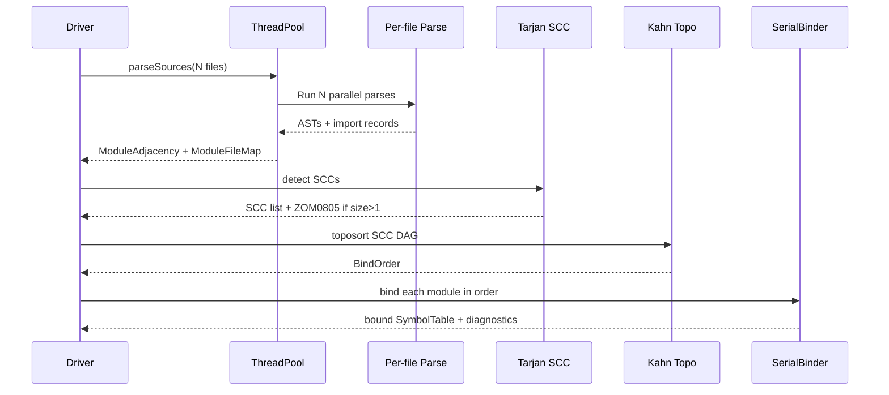
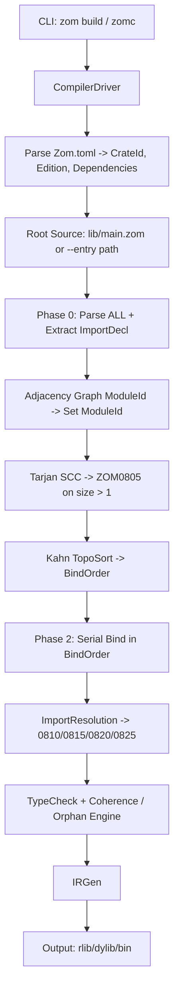

# Modules and Imports

Zom v1 uses a pure static module system. Every module relationship is resolved at compile time, and the language does not support conditional imports, runtime imports, wildcard imports, or default exports in v1.

## Design Goals

- Keep module boundaries explicit and statically analyzable
- Make imported and exported names predictable for the compiler and IDE
- Prefer one consistent symbol-path model over mixed string-path and expression-based forms
- Make public API definition obvious at the declaration site
- Support re-export without forcing wrapper modules to duplicate declarations
- Enable correct, deterministic orphan-rule enforcement at the crate boundary (see the Step 0 Orphan Rule in the compiler contracts document: alias normalization precedes the local-head test, and all cross-crate visibility is governed by the unified `export` keyword)

## Core Model

- A source file is a module definition unit
- A module name is a dotted symbol path such as `math.geometry`
- Top-level declarations are module-private unless explicitly exported
- Imports bind module names or explicitly selected exported symbols into the current module scope
- Re-exports forward symbols from another module into the current module's public API
- Every module belongs to exactly one crate; the crate root module is the single entry point that transitively discovers all other modules via the two-phase binding pipeline described below

## Module Declaration

Use `module` to declare the canonical symbol path of a source file.

```zom
module math.geometry;
```

The `module` declaration, when present, must appear before all other top-level items. A file may omit `module`; such a file is still a valid compilation unit, but it does not declare a stable importable symbol-path name in the language specification.

Duplicate `module` declarations in the same crate are a hard error (ZOM0850 DuplicateModuleDeclaration). A crate's root file (`src/lib.zom` or `src/main.zom`) never requires an explicit `module` declaration; its implicit name is the crate name supplied by the manifest.

## Module Names

Module names are symbolic, not string-based.

```zom
math
math.geometry
graphics.rendering.opengl
```

Zom v1 deliberately avoids string module specifiers such as `"math/geometry"` in the core language grammar. Build tools may map source files to modules, but the language-level import and export syntax always uses dotted symbol paths.

Each segment of a dotted module name must be a valid Identifier. Path segments are case-sensitive. The segment name `self`, `super`, `crate`, or `Self` is reserved and cannot appear as a user-defined module name inside a `module` or `import` declaration.

## Filesystem Conventions

Zom uses a dual filesystem-resolution convention. The dotted module path `math.geometry` is resolved by consulting every crate search path in manifest order. For each search root `R`, the module name is canonicalized as either of:

1. `<R>/math/geometry.zom` (file-per-module convention), or
2. `<R>/math/geometry/mod.zom` (directory-with-`mod.zom` convention).

If both files exist simultaneously for the same module path in the same search root, the compiler emits ZOM0881 ModulePathAmbiguous and lists both candidate paths. It does NOT pick one non-deterministically.

If neither file exists, resolution fails (see Import Resolution Semantics below for the ZOM0810 ImportNotFound diagnostic).

Conditional-compilation file-name suffixes are also supported: a file named `net_macos.zom` is treated as the module `net` automatically gated on `target_os = macos`. The manifest-level `#[zom::cfg(key="value")]` attribute form is the general mechanism and is covered in the Attribute chapter; the file-suffix convention is the language-level shorthand for per-platform file specialization.

The manifest may override the search-path roots; by default the search root is the `src/` directory of the declaring crate, followed by any dependency crates in the order they are listed in `Zom.toml`. Each dependency's search root is added after the local crate's root, so local modules always shadow dependency modules of the same path.

## Edition Model

Edition is a year-based string declared per crate in `Zom.toml`:

```toml
edition = "2026"
```

An edition has per-crate scope: it never leaks across crate boundaries. A crate compiled under edition E1 may depend on crates compiled under E2, E3, etc.; each crate's grammar, lints, and deprecated-feature gates are determined solely by its own manifest.

Lints are tied to editions: a lint that is `warn` in one edition may be promoted to a **hard error** in the next edition. This gives downstream consumers one full edition cycle to fix warnings before the compiler rejects them outright. Std library deprecations follow the same cadence; symbols marked `#[zom::deprecated]` in edition E are removed from the prelude in edition E+1.

## Import Forms

Zom v1 supports two import forms.

### Import a Module Namespace

```zom
import math.geometry;
import math.geometry as geo;
```

- `import math.geometry;` binds the module namespace into the current scope under its final segment, `geometry`
- `import math.geometry as geo;` binds the same module namespace under the explicit alias `geo`

This form is appropriate when call sites should remain qualified:

```zom
import math.geometry as geo;

let p = geo.Point { x: 1.0, y: 2.0 };
let d = geo.distance(p, p);
```

### Import Selected Symbols

```zom
import math.geometry.{Point, distance};
import math.geometry.{Point as GeoPoint, distance};
```

- Each listed symbol must be exported by the target module
- `as` renames the imported binding locally
- A grouped import is equivalent to importing each listed symbol individually, but remains unambiguous in the grammar

This form is appropriate when local direct access is preferred:

```zom
import math.geometry.{Point as GeoPoint, distance};

let p = GeoPoint { x: 1.0, y: 2.0 };
let d = distance(p, p);
```

## Export Forms

Zom v1 supports declaration-site export, local export lists, and explicit re-export.

### Declaration-Site Export

```zom
export struct Point {
    x: f64,
    y: f64
}

export fun distance(p1: Point, p2: Point) -> f64 {
    let dx = p1.x - p2.x;
    let dy = p1.y - p2.y;
    return sqrt(dx * dx + dy * dy);
}
```

This is the primary way to define public API in Zom. The exported status is attached directly to the declaration, which keeps API boundaries visible in the source.

### Export Local Symbols

```zom
struct Point {
    x: f64,
    y: f64
}

fun distance(p1: Point, p2: Point) -> f64 {
    let dx = p1.x - p2.x;
    let dy = p1.y - p2.y;
    return sqrt(dx * dx + dy * dy);
}

export { Point, distance as calcDistance };
```

This form exports names that already exist in the current module scope. It is useful when a module wants to define declarations first and publish its API later as a single block.

### Re-Export Symbols from Another Module

```zom
export math.geometry.{Point, distance as calcDistance};
```

This form forwards selected symbols from another module into the current module's public API without requiring local wrapper declarations.

## Visibility Rules

- Top-level declarations are private to the module unless exported
- Imported names are available within the current module scope according to their import form
- Re-exported names become part of the current module's exported API
- Exporting a name does not duplicate the declaration; it only controls the module's public surface
- The unified top-level visibility keyword is `export`. Writing `public` at top level is a parse-time error. `public`, `private`, and `protected` are valid ONLY for members inside `class`, `interface`, `struct`, `enum`, and `union` bodies.
- Default class and interface extensibility is `final`. User code writes `open class X` for an extensible class, and `sealed interface Y` for a closed hierarchy of permitted implementations.
- Default class-member visibility is module-private (module-level private); default interface-method visibility is public. Interface default-method bodies may declare `private fun` helper functions, but these helpers are non-dispatch helpers with no vtable entry.
- Enum variant visibility inherits the enum declaration's visibility. No per-variant visibility modifiers are supported in v1.
- `export` inside an inline `mod foo { ... }` block is supported; it creates a distinct export scope for the nested submodule, independent of the outer module's export scope.

## Crates and Packages

A **crate** is Zom's single unit of compilation. Every crate is owned by exactly one `Zom.toml` manifest that declares its name, edition, dependencies, and output targets. A **package** is the published artifact name on a crate registry; the default mapping is 1:1 (one package publishes exactly one library crate), but a package may declare multiple binary targets in addition to, or instead of, a library target. Edition is a per-crate string (e.g. `edition = "2026"` in `Zom.toml`) that never leaks across crate boundaries; lints that are warnings in one edition may promote to hard errors in the next.

A crate has exactly one **root module**:

- For a library crate, the root source file is `src/lib.zom`.
- For a binary crate, the root source file is `src/main.zom`.
- The root path is overridable via manifest fields (full syntax in the Manifest annex).

Every module declared or discovered inside a crate belongs to exactly that crate. The module paths within a crate form a strict tree rooted at the crate root module; cycles between modules in that tree are prohibited (see Cycle Policy below).

Crate identity is the `(name, edition)` tuple. Cross-crate coherence is governed by this identity: only items marked with the `export` keyword (i.e., items with `SymbolFlags::Export` set) are visible from other crates. Items that are not exported are invisible outside their declaring crate, which is the foundation of the orphan-rule local-head test used by the type-checker (see the Step 0 Orphan Rule in the compiler contracts document for the alias-normalization order, and the 3-phase negative-closure sequence for marker impls).

The `std` crate is a special crate: it is automatically available in every crate without an explicit dependency in the manifest, unless `no_std = true` is set in `Zom.toml` or the `--no-std` CLI flag is passed to the compiler.

The diagram below shows the containment hierarchy from crate down to module scope kinds.

```mermaid
flowchart TD
    C[Crate: (name, edition)]
    C --> R[Root Module: lib.zom / main.zom]
    R --> NS[Nested Submodule Tree\n(discovered via imports)]
    R --> IM[Inline mod foo { ... }\nModuleScope child]
    R --> FM[File mod foo;\nloaded from disk]
    NS --> EX1[Export Scope\n(SymbolFlags::Export)]
    IM --> EX2[Export Scope\n(independent)]
    FM --> EX3[Export Scope]
```

## Module Scopes and Hierarchy

Every source file creates its own top-level `Module` scope (the SourceFile-to-Module-Scope guarantee). Even two files that are never imported by anything else still maintain isolated, private scopes; their declarations do not merge.

A dotted module declaration such as `module a.b.c;` creates a nested scope chain: `PackageScope(a)` is the outermost, containing `ModuleScope(b)`, which in turn contains the final `ModuleScope(c)` that owns the file's declarations. This chain is always materialized fully by the binder before any items in `c` are bound, so forward references to items in `a` from `c` resolve correctly through the parent chain.

For each module, identifier lookup proceeds through four stages in order:

1. **Local scope** — the module's own declarations and imports.
2. **Parent scope chain** — walk outward through the nested `PackageScope`/`ModuleScope` parents up to the crate root module.
3. **Prelude scope** — the auto-injected prelude (see the Standard Prelude section below).
4. **Explicit imports** — fall back to namespace-qualified lookups through the import table.

Zom defines a canonical `Scope::Kind` enumeration in the symbol layer with variants `{Global, Package, Module, Class, Interface, Function, Block, Namespace}`. This chapter references those kinds but does not redefine them; see the symbol-layer chapter for full semantics.

A key rule for cross-file privacy: a module-private symbol `foo` declared in `math.geometry.zom` is **not** visible to `math.matrix.zom` even though both share the `math` package-parent scope. Package scopes carry no transitive cross-sibling visibility. Only `export`-ed symbols in `math.geometry` become visible through an explicit `import math.geometry` in `math.matrix`.

## The Two-Phase Binding Pipeline

The module-binding pipeline is split into two major phases to guarantee deterministic, parallel-safe parse ordering while forbidding cyclic imports. The pipeline is specified in sufficient detail that any conforming implementation must produce the same observable binding order, the same SCC decomposition, and the same diagnostic emissions.

### Phase 0 — Parse and Extract Imports (Parallel-Safe)

The compiler driver spawns one parse task per known source file onto the thread pool. Each parse task produces an AST plus a side-channel import-extraction record. The extraction is **shallow**: it walks the top of the AST only to collect `ImportDeclaration` nodes; it never descends into function bodies, match arms, initializers, or other nested constructs. Because parse tasks do not touch shared symbol tables, this phase is trivially data-race free.

The output of Phase 0 is:

- `ModuleAdjacency : Map<ModuleId, Set<ModuleId>>` — each module maps to the set of modules it imports.
- `ModuleFileMap : Map<ModuleId, BufferId>` — each module is tied to the source buffer that declares it.
- A full set of per-module ASTs, held in an immutable form until Phase 2.

The ThreadPool is used **only** for Phase 0. The binding stage (Phase 2) is explicitly serial on the main driver thread; a single lock-free shared `SymbolTable` across concurrent binder threads is prohibited by this specification.

### Phase 1a — Strongly Connected Component Detection

The driver runs Tarjan's SCC algorithm on `ModuleAdjacency`. Any SCC whose size is greater than one is a module-level import cycle, and the driver emits **ZOM0805 CyclicModuleDependency**. The diagnostic message must list every cycle member joined with chain arrows (e.g. `a -> b -> c -> a`) so the user can trace the cycle.

### Cycle Policy

The three forms of cycle are handled asymmetrically:

1. **Module/crate import cycles** are a hard error (ZOM0805).
2. **Cross-module function-body mutual recursion** is permitted; termination remains the user's responsibility.
3. **Cross-module type-layout cycles** are permitted only if at least one side of the cycle introduces indirection via `Box<T>`, a raw pointer, a `dyn` object, or a DST slice. A pure-value type-layout cycle is a compile-time layout error.

Within a single crate, per-SCC two-phase (skeleton-then-full) binding is supported for type and function declarations, so mutually recursive types and functions that do not import each other are still resolvable. Across crates, the dependency graph is a pure DAG: cross-crate cycles are never permitted by the metadata loader.

Concretely, the SCC policy resolves the following four cases:

- **Intra-module recursive types**: a single module contains `struct Node { next: Option<Node> }`. The single-module SCC is size 1; skeleton pass registers the name, full pass resolves the self-reference trivially.
- **Intra-crate cross-module mutually recursive types without mutual imports**: module `a` declares `struct A` with a field of type `Option<B>`; module `b` declares `struct B` with a field of type `Option<A>`, and only one of `a`, `b` imports the other. Because only one edge exists in the import graph, Tarjan produces two size-1 SCCs, but the binder's per-SCC skeleton pass sees both type declarations before the full pass inspects field types (the types are in the same crate-level SCC of the type-reference graph, which is a separate, finer-grained graph used within Phase 2).
- **Intra-crate mutual imports**: `a` imports `b` and `b` imports `a`. The import-adjacency SCC is size 2 → ZOM0805.
- **Cross-crate mutual dependency**: crate X depends on crate Y, crate Y depends on crate X. The metadata loader rejects this at crate-resolution time; it is a hard error at the driver layer, never reaching the binder.

The import-adjacency SCC (Tarjan) and the type-reference SCC are two distinct graphs. This specification constrains only the import-adjacency SCC directly; the type-reference SCC is a binder-internal detail that implementations may refine for better diagnostics or incremental rebuild performance, provided the observable result (resolution order, cycle handling, error codes) is identical.

### Phase 1b — Kahn Topological Sort

The driver condenses the adjacency graph into its SCC DAG and runs Kahn's algorithm on the condensed graph. The output is a deterministic `BindOrder : Vec<ModuleId>` used by Phase 2.

### Phase 2 — Serial Binding

For each module in `BindOrder`, the binder:

1. Ensures all parent scopes (outer `PackageScope` and `ModuleScope` ancestors) exist in the `SymbolTable`.
2. Pushes the module's own `ModuleScope`.
3. Visits the module's AST with full binding, including function bodies, and resolves every `ImportDeclaration` against the already-bound target export scopes.

Within a single SCC of types or functions, the binder may optionally run a skeleton pass first (register type and function names only) followed by a full pass (bodies plus import resolution) for that SCC, but the SCC as a whole still executes serially relative to other SCCs.

The sequence diagram below summarizes the whole pipeline.



## Import Resolution Semantics

Zom has two import forms with precise binding rules. Both forms place the resulting bindings at the top of the current module scope. The local-name clash rule is uniform: if a resulting local name already exists in the current scope under any form of import or declaration, the compiler emits **ZOM0820 AmbiguousImport** as a hard error — local names never silently shadow each other at the import level. The user must resolve the clash with an `as` alias.

Placing an `import` inside a block, function body, or any non-top-level construct is the hard error **ZOM0840 ImportMustBeTopLevel**.

### Form A — Namespace Import

Syntax: `import a.b.c;` or `import a.b.c as x;`.

1. Resolve the dotted module path `a.b.c` to a `ModuleId` via `ModuleResolver`. If resolution fails for every search root, emit **ZOM0810 ImportNotFound**. The diagnostic must list every search path that was tried, in the order the resolver consulted them.
2. Compute the local name: the final segment of the module path unless an `as` alias is supplied, in which case the alias is used.
3. If the local name already exists in the current module scope, emit ZOM0820.
4. Create a `NamespaceSymbol` bound to the local name. The namespace symbol's backing scope is the target module's **Export scope** — not its full module scope. Private items in the target are never reachable through the namespace.
5. Insert the `NamespaceSymbol` into the current module scope.

### Form B — Named Import

Syntax: `import a.b.c.{Point as P, distance};`.

1. Resolve the dotted module path prefix `a.b.c` to a `ModuleId`. Emit ZOM0810 on failure.
2. For each specifier in the specifier list:
   a. Look up the specifier's source name in the **Export scope** of the target module. If the symbol is not present at all, emit **ZOM0815 SymbolNotExported** with the source-file line of the original declaration and the hint "add `export` keyword on `name` declaration". If the symbol exists but is private (i.e., `SymbolFlags::Export` is not set), use the same error code and hint.
   b. The local name is the specifier's `as` alias if supplied, otherwise the source name.
   c. If the local name already exists in the current module scope, emit ZOM0820.
   d. Create an `AliasSymbol` whose declaration-site `SymbolRef` points to the original target symbol, and register it under the local name in the current module scope.

### Import Priority

Explicit named imports resolve before namespace imports; namespace imports resolve before prelude symbols. Two explicit imports (of either form) that clash on the same local name are always an error, regardless of priority. Unused imports are flagged as **ZOM0860 UnusedImport** (warning).

## Diagnostic Code Reference

The following diagnostic codes are emitted by the module, import, and export subsystem. Each code is listed in ARCHITECTURE.md section 8 with its canonical error message and severity class. This table serves only as a cross-reference so that readers of this chapter can map prose rules to numeric codes.

| Code    | Short Name                         | Raised by                                                                   |
|---------|------------------------------------|-----------------------------------------------------------------------------|
| ZOM0805 | CyclicModuleDependency             | Tarjan SCC discovers an import-adjacency SCC of size greater than one       |
| ZOM0810 | ImportNotFound                     | ModuleResolver cannot locate the dotted path in any search root             |
| ZOM0815 | SymbolNotExported                  | Named-import specifier is not present in target's export scope              |
| ZOM0820 | AmbiguousImport                    | Two imports (or an import and a local declaration) share a local name       |
| ZOM0821 | ExportNotInRootScope               | `export { X }` where X's declaration is not at module-root scope            |
| ZOM0825 | ReexportNonExportedSymbol          | Re-export specifier targets a symbol not exported by the source module      |
| ZOM0827 | ExportUndefinedSymbol              | Export-list specifier references a name not present in the current module   |
| ZOM0828 | DuplicateExportName                | Two export entries produce the same exported local name                     |
| ZOM0830 | PrivateAccessCrossBoundary         | Import/resolution would expose a module-private symbol across a boundary    |
| ZOM0840 | ImportMustBeTopLevel               | `import` appears inside a block, function body, or non-top-level position   |
| ZOM0845 | ExportMustBeTopLevel               | Declaration-site `export` inside a class/interface/function body            |
| ZOM0850 | DuplicateModuleDeclaration         | Two source files in the same crate declare the same `module` path           |
| ZOM0860 | UnusedImport                       | An import binding is never referenced in its consumer module                |
| ZOM0881 | ModulePathAmbiguous                | Both `<R>/a/b.zom` and `<R>/a/b/mod.zom` exist for the same path            |

## Export Semantics

All three export forms operate on the current module's root scope. Placing `export` anywhere other than the module-root level — for example, inside a class body as `export fun f()` — is **ZOM0845 ExportMustBeTopLevel** with the hint "export the class itself instead". Trying to re-export a symbol whose own declaration is not in the current module's root scope is **ZOM0821 ExportNotInRootScope**.

### Declaration-Site Export

Prefixing any top-level declaration with `export` sets the `SymbolFlags::Export` flag on the resulting symbol at bind time. The symbol is immediately present in both the module's private scope and its export scope.

### Local Export List

Syntax: `export { A, B as C };`.

1. Check that each listed identifier exists in the CURRENT module's private or export scope. If not, emit **ZOM0827 ExportUndefinedSymbol** pointing at the specifier that failed.
2. Compute the exported name: the original identifier unless an `as` clause supplies a new one.
3. If a symbol has already been exported under the same target name (either via declaration-site export or a prior specifier), emit **ZOM0828 DuplicateExportName**.
4. If the symbol was not already exported, set `SymbolFlags::Export` on it. For `as`-renamed exports, create a new `AliasSymbol` with `SymbolFlags::Export` pointing at the original.

### Re-Export

Syntax: `export mod.path.{A};`.

1. Resolve `mod.path` to a target `ModuleId`. Emit ZOM0810 on failure.
2. Look up each listed symbol in the TARGET MODULE'S EXPORT SCOPE only. If the target did not itself export the symbol, emit **ZOM0825 ReexportNonExportedSymbol** — a module cannot publish symbols that its dependency did not authorize for cross-crate visibility. Cross-boundary access that would expose a private symbol is additionally flagged as **ZOM0830 PrivateAccessCrossBoundary** when detected at finer granularity.
3. Apply the same local-name, clash, and alias rules as the local-export-list form.

## Path Qualification and Disambiguation

Zom uses two different separators, and the distinction is normative:

- **Module paths** in `module`, `import`, and `export` prefix clauses use the **`.`** separator: `math.geometry`.
- **Item paths** in expressions, type expressions, and qualified identifiers use the **`::`** separator: `math::geometry::Point`.
- **Attribute namespaces** use the **`::`** separator: `zom::marker::Sendable`.

Writing `import math.geometry.Point` is **illegal** in v1. You must write `import math.geometry.{Point}`. The `.` separates module segments only; `::` separates item paths and is never used inside the module-path portion of an `import` clause.

The full `QualifiedPath` grammar for item paths is:

```
QualifiedPath : ( 'crate::' | 'self::' | 'super::' | '::' )?
                 Identifier ( '::' Identifier )*
```

The four explicit path prefixes have fixed meanings:

- `crate::` — resolves starting from the current crate's root scope.
- `self::` — resolves starting from the current module scope.
- `super::` — resolves starting from the parent module scope.
- `::` — synonym of `crate::` in v1; reserved for future cross-crate absolute paths.

Disambiguation rules:

- If both a local item named `x` and a namespace-import binding named `x` exist, the result is a ZOM0820 clash; the language never silently picks one. The user must rename with `as`.
- `super::super::x` walks up two parent scopes to the grandparent module. Writing `super::` at the crate root (which has no parent) is a compile error.
- `self::x` disambiguates a reference to the module's own declaration of `x` in contexts where an imported `x` could otherwise be ambiguous.

## Nested Inline Modules

Zom supports inline submodules via the `mod foo { ... }` syntax and file-loaded submodules via the header form `mod foo;`. The EBNF is:

```ebnf
InlineModuleDeclaration ::= Visibility? 'mod' Identifier
                            ( '{' ModuleItem* '}' | ';' )
```

- `mod foo { struct S; }` creates a new `ModuleScope("foo")` as a child of the current module, and inserts all contained items inside that child scope. The child scope has its own export scope, separate from the parent.
- `mod foo;` (no body) directs the compiler to load the module from disk using the filesystem-convention rules above. Semantically it behaves like `include!` in the filesystem sense but retains full type, scope, and export isolation between the two modules.
- A bare `mod foo;` or `mod foo { ... }` without a visibility prefix keeps the submodule module-private: it is not importable even by sibling modules. The visibility ladder on `mod` controls importability:
  - `export mod foo;` — the submodule is exported and visible across crate boundaries.
  - `pub(crate) mod foo;` — the submodule is importable within the current crate only.
  - `pub(package) mod foo;` — visible within the current package only.
  - `pub(super) mod foo;` — visible within the parent module only.
  - `pub(self) mod foo;` — same as private (current module only).
  - `pub(in path::to::module) mod foo;` — visible within a specific reachable module path.

## Standard Prelude

The standard prelude is a set of symbols auto-injected into every crate's root scope. It is semantically equivalent to prepending an invisible:

```zom
import std.prelude.{
    Option, Result, Vec, VecDeque,
    String, StrSlice,
    print, println, eprint, eprintln, dbg,
    own, borrow, drop
};
```

to the crate root module before all user-written imports.

Prelude bindings resolve at **lower** priority than any user import or any local declaration. If the user imports a different `Option`, that user binding wins silently, with no diagnostic. This rule ensures the prelude is always non-intrusive.

All symbols exposed this way MUST be `export`-ed from the `std::prelude` module; the standard library authors maintain this contract as part of std's stability guarantee.

When `no_std = true` is set in the manifest (or the equivalent `--no-std` CLI flag is used), `std` is no longer auto-available, and the minimal `core::prelude` (Option, Result, primitive types, marker traits only) replaces the std prelude. If `no_core = true` is additionally set (freestanding mode), no prelude is injected at all — the user must declare every symbol they rely on.

Full details of prelude contents, edition-dependent additions, and edition lint-to-error promotion rules are covered in the dedicated Prelude annex.

## Name Resolution Rules

- `import module.path;` binds the last segment of the path unless an explicit alias is provided
- `import module.path.{A, B as C};` binds `A` and `C` in the current module scope
- `export {A};` requires that `A` already exists in the current module scope
- `export module.path.{A};` resolves `A` against the target module's exported symbols

## Conflict Rules

The following are compile-time errors:

- Importing a binding whose resulting local name conflicts with an existing top-level name (ZOM0820 AmbiguousImport)
- Importing the same local name more than once without aliasing (ZOM0820)
- Exporting a local name that does not exist (ZOM0827 ExportUndefinedSymbol)
- Re-exporting a symbol that the target module does not export (ZOM0825 ReexportNonExportedSymbol)
- Exporting two different symbols under the same public name (ZOM0828 DuplicateExportName)
- Module-level import cycles between modules in the same crate (ZOM0805 CyclicModuleDependency)
- A path that resolves to both a file and a directory mod.zom for the same module (ZOM0881 ModulePathAmbiguous)
- An `export` keyword on a declaration not in the current module's root scope (ZOM0845 ExportMustBeTopLevel)

Use aliases to resolve conflicts explicitly.

```zom
import graphics.core.{Point as CorePoint};
import math.geometry.{Point as GeoPoint};
```

## Top-Level Placement Rules

- `module`, `import`, and `export` are top-level constructs
- `module` may appear at most once and must appear first when present
- `import` and export-list or re-export forms must appear at top level (ZOM0840 ImportMustBeTopLevel if violated)
- Declaration-site `export` applies only to top-level declarations (ZOM0845 ExportMustBeTopLevel if violated)

Zom v1 does not allow local imports inside functions or blocks.

## Full Compiler Pipeline

The end-to-end pipeline, from CLI invocation through to output artifact, is summarized below. Diagnostic codes (ZOM0805, ZOM0810, ZOM0815, ZOM0820, ZOM0825, and related) are emitted at the stages indicated.



The orphan/coherence stage at `TypeCheck` consumes the export boundaries produced by the module pipeline; it relies on the Step 0 Orphan Rule (alias normalization before the local-head test) and the three-phase negative closure described in the compiler contracts document. Separating module-boundary enforcement from type-coherence enforcement this way guarantees both systems are deterministic and independently testable.

## Non-Goals in v1

The following features are intentionally excluded from the v1 module design:

- Runtime or dynamic import
- Conditional import
- Wildcard/glob import (`use path::*`) and wildcard re-export. The v2 plan for glob imports is locked: glob-imported names are considered AFTER all explicit-import and local-declaration names for every lookup, so glob imports by themselves never create ambiguity errors. This locked decision is normative for v1's exclusion scope; it is not an open design question.
- Default export
- Expression-based export such as exporting arbitrary property-access expressions
- Top-level mutable `let` at module scope (use `static` instead)
- Source-file concatenation constructs such as `include!` or `#include`
- Script mode (omitting a module declaration to run a file top-to-bottom as an ad-hoc program)

These exclusions keep the initial module system small, explicit, and amenable to static analysis.

## Examples

### Basic Module

```zom
module math.geometry;

export struct Point {
    x: f64,
    y: f64
}

export fun distance(p1: Point, p2: Point) -> f64 {
    let dx = p1.x - p2.x;
    let dy = p1.y - p2.y;
    return sqrt(dx * dx + dy * dy);
}

fun sqrt(value: f64) -> f64 {
    return value;
}
```

### Aggregator Module

```zom
module graphics;

export graphics.rendering.opengl.{OpenGLRenderer};
export graphics.rendering.vulkan.{VulkanRenderer};
```

### Mixed Import Style

```zom
module app.main;

import math.geometry as geo;
import graphics.{Renderer, SurfaceFormat};

let point = geo.Point { x: 0.0, y: 0.0 };
let format = SurfaceFormat.default();
```

### Inline Submodule With Re-Export

```zom
module collections;

mod tree {
    export struct Node<T> {
        value: T,
        children: Vec<Node<T>>,
    }

    export fun newLeaf<T>(value: T) -> Node<T> {
        return Node { value: value, children: Vec::new() };
    }
}

export tree.{Node, newLeaf as newTreeNode};
```

### Cross-Crate Visibility Ladder

```zom
// crate root: src/lib.zom

pub(crate) mod internal_utils;   // visible within this crate
export mod public_api;           // visible across crate boundaries
mod private;                     // module-private
```

### Separator Convention Cheat Sheet

The language uses three distinct separator usages, and users sometimes confuse them. The canonical rules are:

| Context               | Separator | Example                               |
|-----------------------|-----------|---------------------------------------|
| `module` declaration  | `.`       | `module graphics.rendering.opengl;`   |
| `import` module path  | `.`       | `import graphics.rendering.opengl;`   |
| Named-import grouping | `.{}`     | `import collections.{Vec, VecDeque};` |
| Item path (expression)| `::`      | `collections::Vec::new()`             |
| Item path (type)      | `::`      | `fn f() -> collections::Vec<i32>`     |
| Attribute namespace   | `::`      | `#[zom::marker::Sendable]`            |
| Path prefixes         | `::` tail | `crate::` `self::` `super::` `::`     |

Writing `import collections.Vec` is a syntax error; you must either write `import collections;` and then reference `collections::Vec`, or write `import collections.{Vec};` to bind `Vec` locally. The `.` separator never leaves the module-path portion of an `import` clause.

### Inline Mod Nesting and Shadowing

Nested inline `mod` blocks establish independent scopes. Export boundaries are per-module, so re-exporting from an inner inline mod follows the usual re-export rules:

```zom
module app;

mod encoding {
    mod utf8 {
        export fun encode(s: StrSlice) -> Vec<u8> { ... }
        fun validate(s: StrSlice) -> bool { ... }  // private
    }

    // Re-export only the public entry points from utf8.
    // `validate` is NOT visible here since utf8 did not export it.
    export utf8.{encode};
}

// Downstream consumers of `app` see `app::encoding::encode`
// because encoding exported it and this root does NOT export
// encoding itself. If we wanted to expose encoding publicly:
export mod encoding;  // now encoding's exports are public to consumers
```

### Static Dispatch Across Module Boundaries

Cross-module function calls are statically dispatched — the callee's symbol reference is resolved at bind time, and the call is emitted as a direct call in IR. There is no implicit import at call time; you must either bring the symbol into scope via `import` or use its fully-qualified form via a namespace import.

```zom
module app.main;

import math.geometry;        // namespace import as `geometry`
import math.matrix.{Matrix}; // named import of `Matrix` directly

fun demo() {
    // via namespace import:
    let p = geometry.Point { x: 1.0, y: 2.0 };

    // via named import:
    let m = Matrix::identity(4);

    // ERROR — Vec is not imported. You need:
    //   import std.collections.{Vec};
    //   -or-
    //   import std.collections;
    //   then use collections::Vec.
    // let v = Vec::<i32>::new();
}
```

### Re-Export Chains and Coherence

Long re-export chains are permitted and are transparent to the orphan rule: when crate B re-exports `T` from crate A, and downstream crate C imports `T` via B, the Orphan Engine still sees `T` as a foreign type owned by A. The Step 0 Orphan Rule (alias normalization before local-head test) ensures that re-export alias chains are fully unfolded before the local-head test is applied. This rule is defined and enforced in the compiler contracts document, and it interacts with the module system's export semantics only through the shared `SymbolFlags::Export` bit on each aliased symbol.

The diagram below summarizes the visibility flow:

```mermaid
flowchart LR
    A_mod["Crate A / mod a.zom<br/>export struct T;"]
    B_mod["Crate B / mod b.zom<br/>export crateA.a.{T};"]
    C_mod["Crate C / mod c.zom<br/>import crateB.b.{T};"]

    A_mod -->|Export scope| B_mod
    B_mod -->|Re-export chain| C_mod

    note_over_A_mod,B_mod: T's owner is always A<br/>(alias normalization ensures this)
```

## Grammar Summary

## Grammar Summary

```ebnf
ModuleDeclaration ::= 'module' ModuleName ';'
ModuleName ::= Identifier ('.' Identifier)*

ImportDeclaration ::= 'import' ImportClause ';'
ImportClause ::= ModuleImportClause | NamedImportClause
ModuleImportClause ::= ModuleName ('as' Identifier)?
NamedImportClause ::= ModuleName '.' '{' ImportSpecifierList? '}'
ImportSpecifierList ::= ImportSpecifier (',' ImportSpecifier)* ','?
ImportSpecifier ::= Identifier ('as' Identifier)?

ExportDeclaration ::= 'export' Declaration
                    | 'export' ExportClause ';'
ExportClause ::= LocalExportClause | ReexportClause
LocalExportClause ::= '{' ExportSpecifierList? '}'
ReexportClause ::= ModuleName '.' '{' ExportSpecifierList? '}'
ExportSpecifierList ::= ExportSpecifier (',' ExportSpecifier)* ','?
ExportSpecifier ::= Identifier ('as' Identifier)?

InlineModuleDeclaration ::= Visibility? 'mod' Identifier
                            ( '{' ModuleItem* '}' | ';' )
PackageDeclaration ::= 'package' PackageName (':' VersionString)? ';'

PathPrefix ::= 'crate::' | 'self::' | 'super::' | '::'
QualifiedPath ::= PathPrefix? Identifier ( '::' Identifier )*
```
