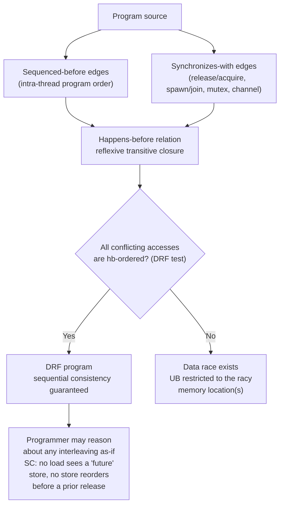
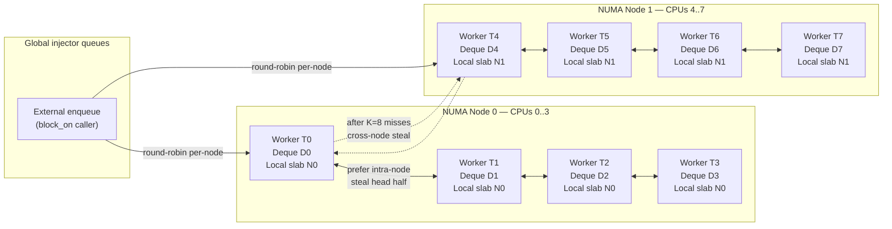
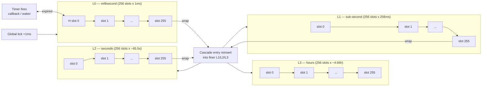
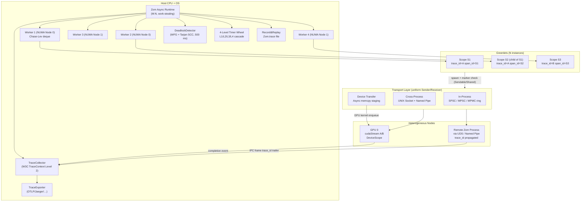
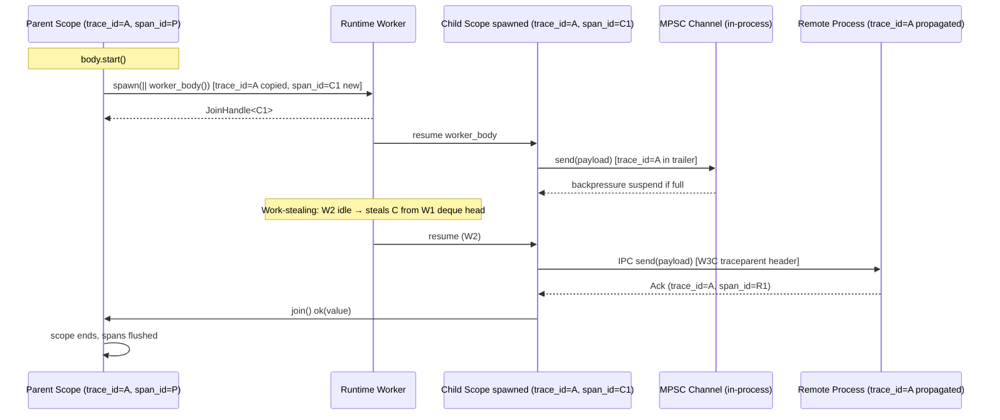
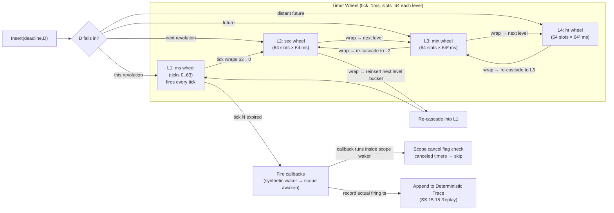

# Concurrency

ZOM provides a structured concurrency model built on three normative pillars: a
DRF-SC memory model aligned with C++20 and Java 21, an M:N work-stealing
scheduler with NUMA awareness, and a scope/task hierarchy with marker-based
safety enforced at compile time. Every cross-thread or cross-scope transfer is
verified by the type checker against the `Sendable` and `Shared` marker lattice
(Ch.16 SS 16.12.3 R11); the runtime trusts those markers and performs no
secondary check. Panics inside task bodies obey the policy declared in Ch.11
SS 11.4: the default unwind strategy catches panics at the scope boundary and
propagates `PanicInfo` to the parent `JoinHandle`, while the abort strategy
terminates the whole process. Cancellation is cooperative and never interrupts
a destructor, lock holder, or linear-finalization path.

---

## 15.0 DRF-SC Memory Model

### 15.0.1 Guarantee

ZOM adopts the Data-Race-Free Sequential-Consistency (DRF-SC) guarantee as its
normative memory model. Any well-typed ZOM program whose non-atomic memory
accesses are free of data races — in the sense of SS 15.0.2 — exhibits
**sequentially consistent** (SC) behavior. Threads and scopes may be reordered
arbitrarily by the compiler, hardware, and scheduler, but an SC execution of
the program is indistinguishable from some interleaving of the original
program-order statements.

Programs that contain a data race over a non-atomic location have **undefined
behavior** confined to that location and any transitively dependent reads.
Non-racy portions of the same program retain their SC guarantee. UB is
location-scoped, not whole-program-scoped: a racy write to one `i32` field does
not invalidate invariants proven over other, independently-synchronized fields
in the same struct or crate.

### 15.0.2 Data Race Definition

Two memory operations `A` and `B` on the same memory location `L` **conflict**
when at least one of them is a write. Two conflicting operations form a
**data race** if and only if all three conditions below hold:

1. They are issued by different threads or different concurrent scopes.
2. They are not ordered by the happens-before relation defined in SS 15.0.3.
3. Neither operation is an explicitly-annotated atomic (`Atomic<T>` family,
   Ch.03) or an acquire/release fence.

Data races over atomic locations are **not** data races under this definition.
Atomics follow their own ordering semantics (SS 15.0.5, Ch.03 Atomic family).

### 15.0.3 Happens-Before Relation

The happens-before relation (`hb`) over program events is the smallest
reflexive transitive relation containing the edges below. For events `e1` and
`e2`, `e1 hb e2` means every value written by `e1` is observable to `e2` when
`e2` reads the same location, and compiler/hardware may not reorder `e2`
before `e1`.

**Program order (sequenced-before).** Within a single thread or scope, if
statement `S1` appears textually before `S2` and both are on the same
straight-line or control-flow-reachable path, then `event(S1) sb event(S2)`
contributes `event(S1) hb event(S2)`. This includes sequenced-before edges
between a function call and its body statements, between initialization and
use, and between drop-glue and the next statement after a block scope ends.

**Synchronizes-with (release/acquire).** A release-store operation `R` on an
atomic or synchronization primitive **synchronizes-with** an acquire-load
operation `A` on the same primitive when `A` observes the value written by `R`
or a later value in the modification order of that primitive. Each such pair
contributes `R hb A`.

For operations annotated `SeqCst`, there additionally exists a single global
total order `S` over every `SeqCst`-annotated operation in the entire program
such that `S` is consistent with happens-before (i.e., `a hb b` implies `a`
appears before `b` in `S`) and each `SeqCst` load observes either the last
`SeqCst` store preceding it in `S` or some non-`SeqCst` store permitted by
the location's modification order.

**Spawn edge.** For any `scope.spawn(body)` invocation, the spawn-call event
`E_spawn` happens-before the first statement of the spawned body. Similarly,
`Thread::spawn(f)` establishes `call hb first-statement-of-f`.

**Join / await edge.** The last statement of a child scope (including any
unwinding or normal-return path) happens-before the return from the parent's
`join(handle)` call or from the parent's implicit `handle.await` expression.

**Synchronization primitives.** The following primitive-specific edges are
members of synchronizes-with:

- `Mutex<T>::lock()` performs an acquire on successful acquisition;
  `Mutex<T>::unlock()` performs a release. Thus the unlock of one task
  synchronizes-with the next lock of another task.
- Every atomic read-modify-write operation that uses at least `AcqRel` or
  `SeqCst` performs both an acquire (on its load side) and a release (on its
  store side).
- A successful `channel::send(t)` synchronizes-with the matching
  `channel::recv()` that returns `t`.
- `scope.cancel_all()` issues a release-store on the scope's cancel flag;
  a scope's runtime check of that flag via `scope.canceled()` performs an
  acquire-load and therefore synchronizes-with any prior cancel.

### 15.0.4 DRF-SC Proof Lattice

The chain of reasoning that takes a programmer from source-level synchronization
to an SC guarantee is a monotone lattice: sequenced-before and
synchronizes-with edges generate happens-before; closing under reflexive
transitive closure yields the full relation; absence of conflicting unordered
accesses is the DRF condition; DRF implies SC.



### 15.0.5 Example: DRF Program versus Racy Program

**DRF program (SC holds).**

```zom
let x: AtomicI32 = AtomicI32::new(0);
let ready: AtomicBool = AtomicBool::new(false);
scope("writer", fun (_s: &Scope) {
    x.store(42, Ordering::Relaxed);
    ready.store(true, Ordering::Release);
});
scope("reader", fun (_s: &Scope) {
    while !ready.load(Ordering::Acquire) { /* spin */ }
    assert(x.load(Ordering::Relaxed) == 42); // holds
});
```

The release-store of `ready` synchronizes-with the acquire-load once the latter
observes `true`. That edge, plus program order inside each scope, yields
`x.store hb x.load` by transitivity. The pair does not form a data race, so SC
holds and the assertion is guaranteed true.

**Racy program (UB on location `y`).**

```zom
let y: i32 = 0;          // non-atomic plain integer
scope("w", fun (_s) { y = 7; });   // write
scope("r", fun (_s) { let v = y; });// read - may race
```

The two scopes have no synchronization, no join, and no shared atomic guard.
The accesses to `y` conflict, come from different scopes, and are not
happens-before ordered. They form a data race; reading `y` in scope `r` has
location-scoped UB. The correct fix uses either a join edge, an atomic guard,
or a mutex around `y`.

---

## 15.1 Runtime Architecture — M:N Scheduler with NUMA Awareness

### 15.1.1 M:N Thread Mapping

The ZOM runtime implements an M:N scheduler. M OS threads (the worker pool)
multiplex N lightweight ZOM scopes (greenlets / tasks). M defaults to the
number of logical CPUs reported by the host; it may be overridden via the
crate-level attribute `#[zom::rt::n_workers = N]`. N is bounded only by
available memory; a typical program may have tens of thousands of scopes
active simultaneously.

Each worker owns exactly one OS thread for its lifetime. Workers never exit
voluntarily; parking and unparking use platform-native futex-style primitives.
The scheduler is **non-preemptive** at task granularity: a running scope
continues until it suspends at an await-point, yields explicitly, blocks on a
synchronization primitive, or is cooperatively pre-empted by a timer tick.

### 15.1.2 Work-Stealing Deques

Every worker thread owns one Chase-Lev lock-free array deque of pending tasks.
The owning worker **pops from its own tail** using an atomic fence plus an
array-index store; foreign stealer threads **take from the victim's head**
using a compare-and-swap. Own-thread enqueue and dequeue are a single CAS in
the uncontended case; cross-thread steals pay one CAS plus a cache-miss cost
on the victim's head pointer.

When a worker's deque empties, it enters the steal loop: pick a random victim,
attempt to steal half the victim's deque (geometric split so the victim keeps
locality for remaining tasks), and retry up to K = 8 times. If no steal
succeeds after K attempts, the worker parks on a global semaphore and is
unparked by the enqueue side whenever a new task becomes available.

### 15.1.3 NUMA Awareness

Workers are partitioned into NUMA node groups at startup by querying the host.
Each worker group G_i has affinity with NUMA node i; the local-queue
allocator for each group allocates task metadata slabs from node-i memory.

The steal loop prefers **intra-node** victims: a worker first iterates over
other workers in its own NUMA group, then falls back to cross-node victims.
After K_consecutive = 8 consecutive intra-node misses, the worker widens its
search to all nodes. This policy preserves L2 cache locality for
communication-heavy workloads and amortizes the expensive cross-node QPI/UPI
transfer cost.

### 15.1.4 Parallelism Attribute

```zom
#![zom::rt::n_workers = 8]
```

The `n_workers` attribute sets a hard floor and ceiling on M. It is read
exactly once at `Runtime::new()`. Values of zero or negative raise
**ZOM13xx RuntimeAttributeInvalid** at compile time. Values larger than the
physical CPU count are accepted but trigger an info diagnostic suggesting the
programmer reconsider. Workers above the physical count never improve
throughput because of the cooperative model, and increase context-switch
pressure if blocking system calls are mixed with computation.

### 15.1.5 Architecture Diagram



---

## 15.2 Scopes, Tasks and Combinators

### 15.2.1 Scope Object Model

A **scope** is the unit of structured concurrency. Its creation signature is:

```zom
fun scope(name: str, body: fun(&Scope)) -> ScopeHandle
```

Internally each `Scope` value carries:

- `id: ScopeId` — globally unique 64-bit identifier.
- `name: str` — borrowed display name, used for logging and diagnostics.
- `cancel_flag: AtomicBool` — atomic cancel flag, consulted at await points.
- `waker_table: HashMap<ScopeId, Waker>` — wakers of tasks blocked on this
  scope's join or pending channels.
- `children: BTreeSet<ScopeId>` — set of child scopes spawned within; used
  for `cancel_all` propagation and structured drop ordering.
- `local_storage: HashMap<ScopeLocalKey, Box<dyn Any>>` — scope-locals
  (see SS 15.5).
- `supervisor: Option<Box<dyn Supervisor>>` — supervisor spec (SS 15.3).

Referencing a scope by id after its handle has been dropped and all children
have terminated raises **ZOM1000 ScopeNotFound**.

### 15.2.2 Spawn and Join

`Scope.spawn(body)` adds a new child scope and returns a `JoinHandle<T>`. The
returned handle is a linear value (Ch.16 SS 16.12): dropping it without
explicit join or detach raises **ZOM1054 DoubleJoin** at the second join or
a marker coherence failure at drop-site. Joining a detached handle raises
**ZOM1055 JoinOnDetachedHandle**.

```zom
fun Scope::spawn<T>(this: &Scope, body: fun() -> T raises E) -> JoinHandle<T, E>
fun join<T, E>(h: JoinHandle<T, E>) -> T | E | PanicInfo | Canceled
fun Scope::cancel_all(this: &Scope) -> unit raises CancelAllWithoutPermission
```

Spawn statically verifies that `body` captures only `Sendable` values by move
and, if captured by reference, only values whose type carries `Shared`.
Violations raise **ZOM1050 NotSendable** and **ZOM1051 NotShared** respectively,
with a secondary note pointing at the capture site.

### 15.2.3 Cancellation Semantics (Ch.11 §11.12 Alignment)

`cancel_all(scope)` performs exactly two atomic operations:

1. A release-store of `true` into `scope.cancel_flag`, which
   synchronizes-with every subsequent acquire-load at an await point.
2. A waker-walk that awakens every pending await site on the scope's
   executor — tasks blocked on channel recv, mutex lock, timer, join, etc.

Cancellation is **purely cooperative**. A task must, at well-defined yield
points, call `if scope.canceled() { return Err(Canceled); }`. The compiler
**does not** insert hidden cancel checks into loops, into arithmetic, or into
FFI calls. The canonical await-desugaring inserts one check before suspending.

Cancellation **never interrupts a destructor, lock holder, or drop-glue
sequence**. Drop always runs to completion. A destructor that loops forever
blocks the scope's shutdown; this is considered a programmer bug, not a
language-safety issue. Attempting to invoke `cancel_all` on a scope whose
body's declared policy does not permit cooperative cancellation (e.g., a
supervised worker whose restart strategy is `Permanent`) raises
**ZOM1090 CancelAllWithoutPermission**.

### 15.2.4 Five Scope Combinators (Library-Level)

All five combinators below are ordinary functions in `zom::async::scope`. None
introduce keyword syntax; all compose directly with `JoinHandle` values.

**`join_all(handles: [JoinHandle<T, E>]) -> [T] | AggregateError<E>`.**
Waits for every handle to complete. If zero handles are passed, raises
**ZOM1082 JoinEmptySet**. If N handles complete successfully, returns an
array of length N in declaration order. If K handles fail, returns an
`AggregateError` carrying every error value together with its positional
index so the caller can correlate; partial successes are discarded.

**`cancel_all(root: &Scope)`.** Sets the cancel flag on every reachable
descendant (transitive children) and wakes every registered waker. The
propagation order is pre-order so a parent's flag is always visible before
any child's. Errors at propagation boundaries raise
**ZOM1090 CancelAllWithoutPermission** (see SS 15.2.3).

**`select(handles: [JoinHandle<T, E>]) -> T | E | Canceled`.** Returns the
result of the first handle that settles with any outcome (success, error,
or cancel). All remaining handles are canceled via `cancel_all`. If multiple
handles settle at the same wall-clock moment (the runtime's "now" tick), the
tie is broken deterministically by array index: the lexicographically lowest
index wins. This determinism eliminates flaky cross-platform test failures
caused by OS scheduler jitter. An empty handle list raises
**ZOM1080 SelectEmptySet**.

**`race(handles: [JoinHandle<T, E>]) -> T | E`.** Identical to `select`
except: first **failure** wins instead of first outcome. If the first
settling handle returns success, its result is retained and the combinator
continues waiting; only when all handles have settled to success does the
combinator return the first (deterministically, lowest-index) success. If
every handle fails, the combinator returns the first observed error. An
empty list raises **ZOM1081 RaceEmptySet**. `race` is the canonical operator
for redundant-path computation ("query three DNS providers, fail if all fail,
succeed on any").

**`zip(h1: JoinHandle<T1, E1>, h2: JoinHandle<T2, E2>) -> (T1, T2) | E1 | E2`.**
Two-ary join. Waits for both handles; returns a tuple preserving distinct
compile-time types. Zip is overloaded for arities 2 through 5
(`zip3`, `zip4`, `zip5`). A call to `zip` whose arguments form a list of
wrong length via the variadic sugar raises **ZOM1083 ZipArityMismatch**. For
arities above 5, use `join_all` with a homogeneous element type.

---

## 15.3 Supervisor Tree

The supervisor subsystem follows the Erlang/OTP supervisor pattern as a
library data structure. `Supervisor` is an interface; the runtime ships a
default `StaticSupervisor` impl and callers may define their own.

```zom
interface Supervisor {
    fun strategy() -> SupervisorStrategy;
    fun max_restarts(this) -> u32;
    fun restart_period(this) -> Duration;
    fun children(this) -> [ChildSpec];
}

enum SupervisorStrategy { OneForOne, AllForOne, RestForOne }

struct ChildSpec {
    id: String,
    start: fun() -> Result<JoinHandle<()>, StartError>,
    restart: RestartStrategy,
    shutdown: ShutdownStrategy,
    type_: ChildType,
}

enum RestartStrategy { Permanent, Transient, Temporary }
enum ShutdownStrategy { BruteForce, Timeout(Duration), Graceful }
enum ChildType { Worker, Supervisor }
```

**OneForOne.** When a child terminates abnormally, restart only that child in
place. Its siblings continue executing. If the child's id cannot be located in
the supervisor's child map, **ZOM1003 ChildNotFoundInSupervisor** is raised
and the supervisor itself marks itself defunct.

**AllForOne.** When any child terminates abnormally, stop every child in
reverse declaration order, then restart every child in forward declaration
order. This enforces dependency ordering: child A is started before child B
if A appears earlier in the `children` array, and B is stopped before A on
shutdown.

**RestForOne.** When child C_i terminates abnormally, stop every child C_j
where j > i (children declared after C_i) in reverse declaration order, then
restart C_i together with C_{i+1} ... C_n in forward order. This is the
canonical strategy for dependency chains: if B depends on A, C depends on B,
and B dies, C and D are stopped first, then B, C, D are restarted.

**Restart budget.** Within a sliding window of length `restart_period`, a
counter increments on every restart. If `max_restarts` is exceeded, the
supervisor itself exits with **ZOM1004 SupervisorMaxRestarts**. Its own parent
supervisor then applies the corresponding strategy. The tree terminates at the
top-level runtime, which converts an exhausted top-supervisor into a process
exit with code ZOM_EXIT_RUNTIME_CRASH = 7.

**Temporary children** are never restarted regardless of exit status.
**Transient** children restart only if they exited with an error. **Permanent**
children restart regardless of exit status (normal exit is treated as a fault
for permanent workers).

---

## 15.4 FFI-Rust Async Bridge

ZOM v1 ships a normative specification but no implementation for a Rust-async
interoperation boundary; implementation is tracked for a v2 edition (see
Ch.26 Roadmap). This section defines the ABI surface so downstream tooling
may begin design work.

```zom
extern "rust-async" {
    fun rust_http_get(url: str) -> Future<Result<Vec<u8>, IoError>>;
}
```

An `extern "rust-async"` block declares opaque futures. The ZOM executor
polls each future through a C ABI contract: ZOM constructs a pinned
`Pin<Box<dyn Future<Output = T>>>` on the Rust side via a generated shim,
holds an opaque pointer plus drop-glue function pointer, and invokes
`poll(waker)` on demand. Wakers are bidirectional: a Rust `Waker` vtable
is constructed whose `wake` operation signals the ZOM scope waker, so a
Rust future that becomes ready unblocks its ZOM waiter.

Ownership across the boundary follows two rules:

1. **ZOM owns scope memory.** Every live task's stack/heap inside the ZOM
   runtime is managed by ZOM. Rust futures must not retain references into
   ZOM-owned memory across `poll` calls; any values crossing are either
   moved into the Rust side (boxed) or borrowed for a single poll call.
2. **Rust owns future memory.** The boxed Rust future lives in Rust's
   allocator; ZOM treats it as an opaque handle and drops it via the
   provided `drop_glue` function pointer when the ZOM scope ends.

Formal bridge diagnostics are **ZOM1070 FfiRustAsyncABIInvalid** (shim
signature mismatch between ZOM declaration and compiled Rust library),
**ZOM1071 FfiRustFuturePollPanicked** (Rust future panics during poll; caught
at the catch_unwind boundary and surfaced as a ZOM PanicInfo), and
**ZOM1072 FfiRustWakerLeaks** (waker reference count imbalance detected at
scope shutdown, triggered only on debug builds and reported as a Warning).

---

## 15.5 Scope-Local Storage

Scope-local storage provides per-scope mutable cells whose lifetime is tied to
the scope. Declaration uses the `scope_local!` macro:

```zom
scope_local! {
    static REQUEST_ID: u64;
    static TRACE_SPAN: Span;
}
```

Semantics. When a scope is created, every `scope_local!` declaration visible
in its crate is initialized in an **unset** state. A child scope inherits its
parent's locals via a copy-on-write mechanism: reads observe the parent's
value (if set), first write clones the parent's value into child storage and
subsequent writes are private. The copy-on-write strategy yields zero
overhead for child scopes that only read inherited values and never modify.

Reading an unset scope-local raises **ZOM1010 ScopeLocalUninitialized** as a
runtime error; assigning an incompatible type (via type-erased `Any` backdoor)
raises **ZOM1011 ScopeLocalTypeMismatch**. Writing an already-initialized
local that was declared `once` raises
**ZOM1012 ScopeLocalAlreadyInitialized**.

Scope-locals are distinct from thread-locals: the same OS thread may execute
many scopes in sequence, and scope-local reads/writes automatically target
the correct scope because each worker's active scope is stored in a
thread-local pointer slot (`runtime_current_scope`). Switching scopes on a
worker costs one pointer store.

---

## 15.6 Timer Wheel Internals

The scheduler's delay queue is implemented as a four-level timing wheel,
following the established pattern of the Go runtime, Netty HashedWheelTimer,
and DPDK rte_timer. Each level i (0 through 3) covers a progressively coarser
granularity:

| Level | Slot Width | Slots | Coverage       |
|-------|-----------:|------:|---------------:|
| L0    | 1 ms      |   256 | 256 ms         |
| L1    | 256 ms    |   256 | ~65.5 s        |
| L2    | ~65.5 s   |   256 | ~4.66 h        |
| L3    | ~4.66 h   |   256 | ~49.7 d        |

**Insertion.** A timer whose deadline D is ahead of the current global tick T
is inserted into the finest level whose coverage contains D - T. Insertion
is O(1): compute target level and slot from D - T, push the entry onto that
slot's intrusive list.

**Expiry cascade.** On each global tick (1 ms), the runtime advances L0's
hand by one. If the destination slot is non-empty, every entry there is
either expired (fires its callback / wakes its waker) or reinserted into a
finer level if the cascade hit an L1/L2/L3 boundary. Reinsertion cost per
expiry is O(k) where k is the number of entries in the slot.

**Cancellation and ABA avoidance.** Every `TimerHandle` carries a 64-bit
generation counter alongside its slot pointer. `handle.cancel()` performs a
release-store on the handle's local `cancelled` flag; when the wheel later
rotates into that slot, it reads the flag with an acquire-load and silently
skips cancelled entries. The generation counter prevents ABA: after a handle
is reused (e.g. its slot index is recycled for a new timer), the generation
differs so stale handles cannot cancel the new timer.

Diagnostics. Operating on a handle whose generation does not match the wheel's
slot raises **ZOM1020 TimerHandleInvalid**. Cancelling an already-expired
timer yields either success (idempotent) or **ZOM1021 TimerExpiredWhileCancelled**
(Warning). If the combined live-timer count across all four levels exceeds the
compile-time `WHEEL_MAX_ENTRIES`, insertion raises
**ZOM1022 TimerWheelCapacityExceeded** (Warning; the caller may either
enqueue into a spill-over heap or surface it to the user).



---

## 15.7 Bounded Backpressure Channels

The standard library ships three channel families. Every channel has a strict
**bounded capacity**. There is no unbounded channel; passing 0 as capacity
raises **ZOM1037 CapacityZero** at compile time. The at-most-N guarantee
prevents OOM on fast-producer/slow-consumer paths.

### 15.7.1 Families

**SPSC** (`spsc::channel::<T>(cap)`) — Single Producer, Single Consumer.
Lock-free ring buffer using atomic head/tail indices plus store-release /
load-acquire ordering. Fastest family, linearizable, no CAS on the hot path.
If two threads call `send` on the same `Sender` side, the behavior is
defined: the runtime detects the second concurrent producer via a checked
bit at the send site and raises **ZOM1030 ChannelNotSpsc**.

**MPSC** (`mpsc::channel::<T>(cap)`) — Multiple Producers, Single Consumer.
Mutex-free: each producer takes a slot via CAS on `head`, writes the value
into that slot, then does a release-store on the slot's state word. The
consumer reads slots sequentially; it observes slots in program order via
acquire-loads.

**MPMC** (`channel::<T>(cap)`) — Multiple Producers, Multiple Consumers.
Default returned by the unqualified `channel::<T>(cap)` constructor. Uses
a per-slot atomic state machine (EMPTY → WRITING → READY → READING → EMPTY).
Producers CAS on EMPTY; consumers CAS on READY. Both sides are lock-free and
bounded-wait under contention.

### 15.7.2 Operations

| Operation | Behavior on empty / full | Diagnostic path |
|-----------|--------------------------|-----------------|
| `send(t)` | BLOCK (suspend) until slot available | — |
| `try_send(t)` | Returns immediately | ZOM1035 ChannelFull (Warning) if full |
| `recv()` | BLOCK (suspend) until value available | — |
| `try_recv()` | Returns immediately | ZOM1036 ChannelEmpty (Warning) if empty |
| `Sender::drop` | Notify receiver half | ZOM1033 SenderHalfDropped on next `recv` |
| `Receiver::drop` | Notify sender half | ZOM1034 ReceiverHalfDropped on next `send` |
| Both halves drop | Channel becomes **closed** | ZOM1031 ChannelClosed on any subsequent op |
| Disconnect during in-flight transfer | — | ZOM1032 ChannelBipartisanDisconnect (Warning) |

Send and recv synchronize-with: `send(t)` releases, matching `recv()`
acquires, so any side effect sequenced-before `send` is visible to the
receiver after `recv` returns.

---

## 15.8 Priority-Inheritance Mutex

The default `Mutex<T>` implements the Priority Inheritance Protocol (PIP) to
prevent unbounded priority inversion on real-time targets. Its state machine
has exactly three states:

1. **UNLOCKED.** No owner.
2. **LOCKED(owner).** Held by `owner`, no waiters.
3. **LOCKED(owner, waiters-list-with-priority).** Held, with at least one
   waiter recorded in a priority-ordered intrusive list.

### 15.8.1 Lock Protocol

**Fast path (uncontended):** one compare-and-swap from UNLOCKED to
LOCKED(current_task). On success the caller proceeds; on failure falls
through to the slow path.

**Slow path (contended):** the caller inserts itself into the waiters list
at a position sorted by its effective scheduling priority. It then boosts
the owner's effective priority to `max(owner.original_priority,
max(waiter.priority for waiter in waiters))`. Priority boosting is
transitive — if the owner is itself blocked on a second mutex held by a
third task, the boost chain walks to that third task, and so on until a
runnable owner is found.

**Unlock:** releases the mutex with a release-store and wakes the
highest-priority waiter. The woken task re-attempts the CAS; its boosted
priority is restored to its original value once it leaves the chain.

### 15.8.2 Deadlock and Poison Diagnostics

The mutex runtime performs a single guaranteed-deadlock check: if the same
task attempts to re-lock a non-reentrant mutex it already owns, the lock
call raises **ZOM1040 MutexDeadlockSuspected** immediately (Error). This is
a conservative check — it cannot detect cycles involving two or more tasks —
but it catches the overwhelmingly common self-deadlock bug and is zero-cost
on the fast path because the owner field is already loaded for the CAS.

If a task panics while holding a mutex, the mutex is atomically marked
**poisoned** during unwinding. Any subsequent `lock()` call on a poisoned
mutex returns a result carrying **ZOM1041 MutexPoisoned** (Warning). The
caller may inspect the poisoned mutex via `into_inner_unpoisoned()` if it
can prove that the panicked write left the protected data consistent.

### 15.8.3 Related Synchronization Primitives

- **`RwLock<T>`**. Many-reader / single-writer. The number of concurrent
  readers saturates at a compile-time constant (default `u32::MAX - 1`);
  exceeding it raises **ZOM1042 RwLockReadersExceeded**.
- **`Condvar`**. Must be used with a specific `Mutex`; a `wait` call with a
  guard from a different mutex instance raises
  **ZOM1043 CondvarMismatchedMutex** (Warning).

---

## 15.9 Marker-Based Safety Checker at Spawn Boundaries

Every call to `scope.spawn(body)` or `Thread::spawn(body)` triggers the
concurrency pass in the type checker. The pass computes the full set of
capture sites inside `body`, classifies each as move-capture or
reference-capture, and then enforces:

For function expressions with an explicit capture clause, the capture sites are
the entries in that clause. For function expressions without an explicit capture
clause, the capture sites are inferred from references to enclosing lexical
bindings, using the function-expression rules in Chapter 4.

1. **Move-captured value of type T.** Requires `T: Sendable` (marker,
   Ch.16). The marker engine (compiler-contracts §9, Phases A/B/C)
   must return a
   positive `Sendable` bit for T; otherwise **ZOM1050 NotSendable** is
   emitted at the capture site, with a primary span on the spawn call and
   secondary notes on each offending capture. Typical triggers: captured
   `*mut T` with no user-provided `unsafe impl Sendable`, captured
   `MutexGuard<T>` which is intentionally `!Sendable`, captured linear
   value owned by a different scope.
2. **Reference-captured `&T`.** Requires `T: Shared` plus the lifetime of
   `&T` is bounded by the spawn call site. Violations raise
   **ZOM1051 NotShared**. The compile-time check precludes Go-style bugs
   where a closure accidentally captures a mutex on a "wrong goroutine"
   and causes data races or deadlocks because the captured reference
   escapes its origin scope.

Markers are inherited transitively through generic types. The marker closure
for a struct `S<T>` with marker `AutoSendable` computes `S<T>: Sendable iff
T: Sendable`; this is enforced by the Phase-B blanket-closure step in
compiler-contracts SS 9.

`unsafe impl Sendable for T` and `unsafe impl !Sendable for T` are permitted
only when the orphan rule (Ch.22) allows the impl. Orphan-rule-respecting
unsafe impls are a documented escape hatch for FFI-wrapped types whose
actual Send/Sync properties are not structurally derivable.

---

## 15.10 Panic Isolation

Panic policy is declared per crate (Ch.11 SS 11.4). Two policies exist:

**`unwind` (default).** A panic inside a spawned task unwinds the task stack.
The unwinder runs every destructor along the panic path. When unwinding
reaches the task's outermost frame, the runtime intercepts it, captures a
`PanicInfo { payload, backtrace, origin_scope }` and atomically stores it
into the corresponding `JoinHandle`. The `JoinHandle.result()` then resolves
to `Err(PanicInfo)`. The supervisor (SS 15.3) consults the child spec's
`restart` field and, if warranted, restarts the task. Supervised tasks with
`Permanent` restart policy are restarted regardless of panic status;
`Transient` only on panic; `Temporary` never.

Emitted when isolation catches a panic: **ZOM1005 TaskPanicIsolated**
(Warning). This diagnostic is intentionally a Warning because a panic inside
a supervised permanent task is not a terminal condition — it is a recovered
fault.

**`abort`.** A panic immediately invokes `std::process::abort()`, bypassing
all destructors below the panic frame. Per Ch.11 §11.6, abort is recommended
for binary-size-sensitive deployments where unwinder tables are prohibitive.

Scope boundary is an architectural property. If the same crate contains
both a parent and a deeply nested child, and the child panics, the
diagnostic is emitted once only at the immediate parent-child boundary;
grandparents observe it indirectly via `JoinHandle.result()`. If the
runtime detects two `block_on` drivers nested on the same thread, it
raises **ZOM1006 NestedRuntimeStart** before any task starts. If the
top-level runtime shutdown exceeds the configured grace period, the driver
logs **ZOM1007 RuntimeShutdownTimeout** before invoking `exit()`.

---

## 15.11 Diagnostic Table ZOM10xx

The table below is the normative list of diagnostics emitted by the
concurrency checker pass and the async runtime. Each row below is
bit-identically registered in `docs/design/architecture.md` SS 8 and
`docs/design/compiler-contracts.md` SS 2. Severities: all Error except the
10 entries explicitly marked Warning (Suppressible: Yes).

| Code | Name | Severity | Trigger |
|------|------|----------|---------|
| ZOM1000 | ScopeNotFound | Error | Referenced scope id does not exist or already terminated |
| ZOM1001 | ScopeAlreadyCanceled | Error | Second `cancel_all` call on a scope whose cancel flag is already set |
| ZOM1002 | ScopeDroppedWhileRunning | Error | Scope handle dropped before nested children joined |
| ZOM1003 | ChildNotFoundInSupervisor | Error | Supervisor restart references a child id not in its child map |
| ZOM1004 | SupervisorMaxRestarts | Error | Supervisor exceeded `max_restarts` within `restart_period` |
| ZOM1005 | TaskPanicIsolated | Warning | Panic inside task caught at scope boundary; propagated to join handle |
| ZOM1006 | NestedRuntimeStart | Error | `block_on` called from within a thread that already runs a runtime |
| ZOM1007 | RuntimeShutdownTimeout | Error | Top-level runtime did not cleanly shut down within graceful window |
| ZOM1010 | ScopeLocalUninitialized | Error | Scope-local read before first `set` |
| ZOM1011 | ScopeLocalTypeMismatch | Error | Scope-local stored value type does not match declared static type |
| ZOM1012 | ScopeLocalAlreadyInitialized | Error | `set` on an already-initialized `once` scope-local |
| ZOM1020 | TimerHandleInvalid | Error | Timer handle generation counter does not match wheel slot |
| ZOM1021 | TimerExpiredWhileCancelled | Warning | Cancel issued on a timer that has already fired |
| ZOM1022 | TimerWheelCapacityExceeded | Warning | Live timer count exceeded `WHEEL_MAX_ENTRIES` |
| ZOM1030 | ChannelNotSpsc | Error | Second concurrent producer detected on an `spsc::Sender` |
| ZOM1031 | ChannelClosed | Error | Operation attempted on channel whose both halves are gone |
| ZOM1032 | ChannelBipartisanDisconnect | Warning | Sender/Receiver dropped mid in-flight transfer |
| ZOM1033 | SenderHalfDropped | Error | `recv()` on channel whose only sender has been dropped |
| ZOM1034 | ReceiverHalfDropped | Error | `send()` on channel whose only receiver has been dropped |
| ZOM1035 | ChannelFull | Warning | `try_send` failed because all capacity slots are occupied |
| ZOM1036 | ChannelEmpty | Warning | `try_recv` failed because no message is queued |
| ZOM1037 | CapacityZero | Error | `channel(0)` or `mpsc::channel(0)`: zero capacity is not allowed |
| ZOM1040 | MutexDeadlockSuspected | Error | Same task tries to re-lock a non-reentrant Mutex it already owns |
| ZOM1041 | MutexPoisoned | Warning | `lock()` on a Mutex whose previous holder panicked |
| ZOM1042 | RwLockReadersExceeded | Error | `read()` saturates reader-count field on a saturated `RwLock` |
| ZOM1043 | CondvarMismatchedMutex | Warning | `condvar.wait(guard)` where guard is from a different Mutex |
| ZOM1050 | NotSendable | Error | `spawn` body captures value whose type is `!Sendable` |
| ZOM1051 | NotShared | Error | `spawn` body captures `&T` where T is `!Shared` |
| ZOM1052 | IncomparableMemoryOrder | Error | Atomic method invoked with ordering outside its allowed set |
| ZOM1053 | AtomicAlignmentInvalid | Error | `Atomic<T>` instantiated for a type not in the canonical valid list |
| ZOM1054 | DoubleJoin | Error | `join()` called twice on the same `JoinHandle` |
| ZOM1055 | JoinOnDetachedHandle | Error | `join()` called on a handle previously passed to `detach()` |
| ZOM1060 | NumaNodeOutOfRange | Error | `affinity(N)` requested a NUMA node beyond the host's count |
| ZOM1061 | WorkerThreadAffinityFailed | Error | OS `setaffinity` call failed for a worker thread |
| ZOM1062 | ParkTimeoutSpuriousWakeupPolicyIgnored | Warning | Park timeout wakeup policy not supported on this kernel |
| ZOM1070 | FfiRustAsyncABIInvalid | Error | Rust-async bridge shim signature mismatch detected at load time |
| ZOM1071 | FfiRustFuturePollPanicked | Error | Rust future panicked inside `poll`; surfaced as PanicInfo |
| ZOM1072 | FfiRustWakerLeaks | Warning | Waker refcount imbalance detected at ZOM scope shutdown |
| ZOM1080 | SelectEmptySet | Warning | `select([])` called with zero handles |
| ZOM1081 | RaceEmptySet | Warning | `race([])` called with zero handles |
| ZOM1082 | JoinEmptySet | Warning | `join_all([])` called with zero handles |
| ZOM1083 | ZipArityMismatch | Warning | `zip` / `zipN` invoked with incorrect handle arity |
| ZOM1090 | CancelAllWithoutPermission | Error | `cancel_all` on a scope whose policy does not permit cancellation |

Cross-references: marker diagnostics ZOM05xx (Ch.16 SS 16.12) govern the
unsafe impl of Sendable/Shared; Ch.11 SS 11 defines `Canceled` as part of
the standard error union used by `join` and every combinator above; Ch.22
SS 22.4 constrains unsafe impl of Sendable markers via the orphan rule.


## 15.12 Cross-Process Async Channels (Roadmap v2)

In-process MPSC/MPMC channels (SS 15.7) have bounded in-memory transport
semantics. Cross-process channels add OS-transport framing on top of the same
`Sender<T>/Receiver<T>` trait surface so call-site code does not rewrite
between IPC and intra-process paths. Transport selection is determined at
channel construction time; the rest of the call chain (suspend/send/recv,
cancel propagation, backpressure) is **uniform** with in-process channels.

### 15.12.1 Transport Family

| Constructor | Transport | Platform | Sendable bound on T | Max message |
|---|---|---|---|---|
| `channel::unix::<T>(path, cap)` | UNIX domain socket (SOCK_SEQPACKET) | Linux/macOS/*BSD | T: `Serialize + Sendable` | SO_SNDBUF |
| `channel::unix_dgram::<T>(path)` | UNIX domain socket (SOCK_DGRAM, datagram) | POSIX | T: `Serialize + Sendable` | 64 KiB |
| `channel::named_pipe::<T>(name, cap)` | Windows Named Pipe (PIPE_TYPE_MESSAGE) | Windows 10+ | T: `Serialize + Sendable` | 64 KiB |
| `channel::uds::<T>(fd, cap)` | Pre-connected socket FD (any SOCK_STREAM/SOCK_SEQPACKET) | Any | T: `Serialize + Sendable` | transport MTU |

The `Serialize` bound comes from the `interface serde::Serialize` contract
(normative in `zom/serde`, Edition 2026). If the payload type is not
`Serialize`, the spawn-safety checker emits **ZOM1095 ChannelPayloadNotSerializable**
before transport-level code is even emitted.

Abstract namespace UNIX sockets (Linux-only, leading NUL byte path) are
available via `channel::unix_abstract::<T>(id)`; the id is up to 107 bytes
after the NUL, consistent with Linux `man 7 unix`. Other platforms reject
the constructor at compile time via `cfg(target_os = "linux")` (Ch.19) —
**ZOM1096 IpcTransportUnsupported** otherwise.

### 15.12.2 Wire Framing

```
| uint32 LE length | uint32 LE checksum | payload bytes | uint64 LE trace_id |
```

- **length** = payload bytes count (excludes header + trailer).
- **checksum** = CRC-32C over `(length | payload)`;
  on mismatch, receiver surfaces **ZOM1097 IpcFrameCorrupted** and closes the
  channel — no partial delivery.
- **trace_id** = propagated distributed-trace id (SS 15.14); 0 if no trace
  context is active on the sender.
- MTU upper bound 2^24; larger payloads require application-level chunking
  (stream adapters in `zom/ipc/stream`).

### 15.12.3 File Descriptor / HANDLE Passing

For `unix_dgram` and `unix` (`SCM_RIGHTS` on POSIX; `WSADuplicateSocket` /
`DuplicateHandle` on Windows), a family of typed wrappers `OwnedFd` /
`OwnedHandle` / `SharedHandle` (all `marker Sendable`) encapsulate the OS
handle. Cross-process passing is explicit: `channel::send_with_fds(msg,
&[fd])`. Number of descriptors per message is bounded by
`SCM_MAX_FDS_DEFAULT = 64`; over limit → **ZOM1098 IpcFdsExceedLimit** at
compile-time via `static_assert`.

### 15.12.4 Graceful Degradation

All cross-process constructors return `(Sender<T>, Receiver<T>) | IpcError`
rather than a bare pair. `IpcError` variants: `PathNotFound`,
`PermissionDenied`, `AddressInUse`, `SocketCreateFailed`, `ConnectTimeout`.
The diagnostic **ZOM1099 IpcConnectionFailed** surfaces at `block_on`-level
when no application-code error handling is attached.

---

## 15.13 GPU / Coprocessor Dispatch (Roadmap v2)

Heterogeneous compute dispatch is modeled as spawn-onto-accelerator: a
`DeviceScope` represents one accelerator (CUDA SM, ROCm CU, OpenCL CQ,
Apple Metal command queue), and `.spawn(device_scope, body)` schedules
kernels. Host-device memory transfers use the standard `channel::*`
abstraction with a device-specific serializer. This section defines the
**normative shape** so vendor backends have a contract to conform to.

### 15.13.1 Hardware Topology

```zom
use zom::rt::gpu;

let topology = gpu::discover_topology();  // gpu::Topology
// topology.devices: [gpu::Device]
// each device has: vendor_id, device_id, num_compute_units, global_mem_bytes,
//                  shared_mem_per_cu_bytes, numa_node, pci_bus_id
let device = topology.devices[0]?;            // gpu::Device | GpuError
```

Vendor and model enumerations for the 2026 Edition baseline:
NVIDIA (`nv`, compute capability 7.5+), AMD (`amd`, gfx906+),
Intel (`intel`, Arc/DG2+), Apple (`apple`, Metal 3 family). Discovery uses
the system-installed loader (CUDA Runtime / HIP Runtime / IGC / MTLDevice) —
the ZOM runtime never ships its own shim to avoid ABI drift.

### 15.13.2 DeviceScope, Streams, and Events

A `DeviceScope` owns one or more `gpu::Stream`s. Streams are FIFO; enqueued
kernels on the same stream execute in program order; different streams may
interleave. `gpu::Event` provides explicit cross-stream synchronization.

```zom
let ds = gpu::DeviceScope::new(device)?;         // DeviceScope | GpuError
let stream_a = ds.stream(gpu::StreamPriority::Normal)?;
let stream_b = ds.stream(gpu::StreamPriority::High)?;

// Spawn kernel-like task onto stream_b:
stream_b.spawn(|| gpu::kernel::<256>(grid=1024, ||{ /* body */ }))?.await?;
```

The `gpu::kernel::<BLOCK>(grid, body)` builtin lowers to backend-specific
shims (PTX launch, HIP `hipLaunchKernelGGL`, `MTLComputeCommandEncoder`
dispatch). `body` captures are limited to `T: Shared + Pod`; captures that
fail marker checks → **ZOM1084 GpuNonPodCapture**. Grid dimensions must be
statically-evaluable integers → **ZOM1085 GpuNonConstGridDim** otherwise.

### 15.13.3 Unified / Shared Memory Model

ZOM defines three memory tiers:

| Tier | Allocation | Visibility | Marker guarantee |
|---|---|---|---|
| **Host** | `heap.alloc<T>()` | CPU only | `Sendable` |
| **Managed** | `ds.alloc_managed::<T>(n)` | CPU + ALL devices | `Sendable + Shared` (coherency page-fault based) |
| **Device-local** | `ds.alloc_device::<T>(n)` | Device `ds` only | `!Sendable: cannot move across scopes` |

Transfer semantics:
- `memcpy<Managed, Host>` is synchronous on first-touch page fault;
  application may explicitly `ds.prefetch(&buf, gpu::Destination::Cpu)` for
  controlled overlap.
- `memcpy<Device-local, *>` requires an explicit staging buffer in Managed
  tier → **ZOM1086 GpuDirectTransferNotAllowed** at type-check if attempted
  across tier boundaries.

### 15.13.4 Fallback

If the host has no accelerators, `gpu::discover_topology()` returns an empty
device list — no hard error. A `zom::rt::gpu::fallback` module provides a
CPU-backed `DeviceScope` implementing the same trait surface using rayon-
style thread pools; performance is not normative, but API shape is. Backend
selection is determined by the first successful loader probe in order:
NV → AMD → Intel → Apple → fallback.

---

## 15.14 Distributed Tracing Propagation (Roadmap v2)

Every `Scope` has an **implicit, zero-overhead** trace context: a 128-bit
`trace_id` and 64-bit `span_id`. These fields are part of the Scope data
structure (no dynamic allocation on the hot path). Context propagation
follows the W3C Trace Context recommendation Level 2 (TR-trace-context-2,
2023) — cross-crate interop with existing instrumentation ecosystems is a
hard requirement.

### 15.14.1 Propagation Rules (normative)

1. **Spawn.** If a scope `P` spawns a child `C`, `C.trace_id = P.trace_id`
   and `C.span_id = new_rand_u64()`. The parent-child edge is recorded in
   `P.children` with a monotonic `spawn_ts_ns`.
2. **Await.** The await-site registers a `link` from the callee `span_id`
   back to the caller; links are preserved across process boundaries via the
   `trace_id`/`span_id` fields in IPC framing (SS 15.12.2).
3. **Cross-process send.** The IPC frame trailer copies the sender's
   `trace_id` and a newly generated `span_id`; the receiver's scope adopts
   that `trace_id` when its `recv()` returns `Ok(msg)`. If the receiver was
   already inside a different trace, it records a `link` edge instead of
   overwriting — never silently merge two traces.
4. **GPU dispatch.** Each `kernel::<B>` spawn carries its caller's
   `trace_id`/`span_id`; GPU timestamps (CUDA event / HIP event / Metal
   counter sample) are normalized to host nanoseconds and written as
   child spans of the enqueuing stream.
5. **No propagation across `scope_local`.** Scope-local storage is *never*
   used to carry trace context. The trace fields are in the scope header
   itself; this avoids the "copy-on-write of scope-local caused trace to
   silently fork" class of instrumentation bugs.

### 15.14.2 Sampling Rate

The global sampling rate is a crate-level config
`#![zom::rt::trace_sampling = 0.001]` (default 0.1% of scopes record full
trace data; 99.9% only carry the `trace_id`/`span_id` pair for context
propagation without backend writes). Per-trace overrides via
`scope.set_sampled(true)` → **ZOM1088 TraceAlreadyCommitted** if the scope
already has children.

### 15.14.3 Exporter Contract

Runtime exposes a single-slot exporter pointer:
```zom
interface TraceExporter {
  fun export(&self, spans: SpanBatch) -> unit | ExportError;
  fun shutdown(&self) -> unit;
}
```

The runtime writes no data on its own; if no exporter is registered (the
default), instrumentation overhead is `sizeof(u128) + sizeof(u64)` per
scope plus zero syscalls. Third-party exporters (OpenTelemetry OTLP,
Jaeger Thrift, Zipkin, Prometheus exemplars) conform to `TraceExporter`
and are registered with `zom::rt::install_trace_exporter(exporter)`.

---

## 15.15 Deterministic Replay (Roadmap v2)

A common correctness failure mode for concurrent systems is heisenbugs that
do not reproduce locally. ZOM provides a **record-and-replay facility**
that, when enabled, records a total order of runtime-resolved decisions and
enables deterministic re-execution of the exact same scheduling under a
user-controlled debugger. The implementation follows the rr model
(RR-journalled, OSDI 2017), adapted to greenlets.

### 15.15.1 What Is Recorded

Every non-deterministic event observable by user code is recorded to a
`Zom.trace` binary trace file (16 KiB per buffer, double-buffered per
worker thread):

1. **Spawn decisions.** Which worker thread stole which greenlet, and when
   (enqueue_ts_ns, dequeue_ts_ns, worker_id).
2. **Atomic RMW resolution.** For `compare_exchange_weak`, whether the CAS
   succeeds; for `fetch_*`, the pre-operation value.
3. **Channel delivery order.** Per-channel, the sequence of (sender_span_id,
   seqno) pairs as observed by the receiver.
4. **I/O completion order.** For `fs`, `net`, and `ipc` syscalls wrapped by
   `zom::rt`, the return value and errno. Raw syscalls outside the runtime
   wrapper set are **not** recorded; such code opts out of replay and
   surfaces **ZOM1091 DeterministicUnrecordedSyscall** at spawn-time if
   the trace mode is `Record`.
5. **Timer firings.** Per timer entry, the actual elapsed time in ns
   (subject to timer slack) instead of the scheduled deadline.
6. **GPU kernel completion.** Each `kernel::<B>` record carries the CUDA
   event / HIP event / Metal timestamp delta.

### 15.15.2 Replay Execution

Replay mode is enabled by `ZOM_REPLAY_TRACE=/path/to/Zom.trace` env var.
The runtime:

1. Maps the trace file read-only.
2. Starts with a single worker thread (deterministic uniprocessor mode).
3. Before each runtime decision point, pops the corresponding record from
   the trace and coerces the decision to match the recorded value.
4. If user code observes a value that does not match the trace (e.g., the
   code was recompiled, or an external side-effect happened), the runtime
   emits **ZOM1092 DeterministicDivergence** with (pc, expected_bits,
   actual_bits) and aborts — replay is *never* silently approximate.
5. Attaches to a running debugger via `ptrace`/`mach_vm` on demand;
   breakpoints set at `ZOM_REPLAY_BREAK=file:line` automatically trigger
   after the recorded event count reaches the line.

### 15.15.3 Limitations

- Replay is single-process only. Cross-process replays require the user to
  record *both* processes and re-synchronize their trace files by matching
  the IPC `trace_id` fields.
- Trace files are **not forward compatible across Edition bumps**; the
  trace header carries `edition` + `runtime_sha256` so mismatches produce
  a clear **ZOM1093 DeterministicTraceVersionMismatch** instead of a
  silent wrong replay.
- Recorded trace files grow at ~100–300 MB/hour per CPU core on a
  microbenchmark-style workload; long runs should enable trace rotation
  via `ZOM_TRACE_ROTATE_MB` (default 4096).

---

## 15.16 Fairness Formalization (normative)

Without a written fairness contract, concurrent APIs have test-dependent
behavior that drifts between platforms. ZOM locks the following five rules:

### 15.16.1 Scope Scheduler Fairness

**F-1 (Finite-delay stealing).** For any greenlet `G` that is ready and
placed in a worker deque, there exists a finite bound `K` such that `G` is
dequeued within `K` subsequent steal attempts across all workers, unless
the scope owning `G` is cancelled.

- `K = 2 × num_workers × (1 + depth_in_deque)`. Chase-Lev deque steal
  at the head guarantees a ready task cannot starve; back-to-back steals
  of newer tasks are bounded by the depth invariant.
- Violation is a correctness bug in the runtime, not in user code.

### 15.16.2 Channel Fairness

**F-2 (SPSC ordering).** On an SPSC channel, the receiver observes messages
in the exact order the transmitter sent them; reordering within one SPSC
pair is a bug.

**F-3 (MPMC bounded FIFO per-producer).** For each single producer on an
MPMC channel, its messages arrive at the receiver(s) in FIFO order.
*Cross*-producer ordering is not guaranteed (subject to enqueue CAS
contention resolution, which is recorded for replay).

### 15.16.3 Mutex Fairness

**F-4 (Priority-ordered wakeup with FIFO within priority).** A PIP mutex
(SS 15.8) wakes waiters in (priority desc, enqueue_ts asc) order. Two
waiters at the same priority that enqueue on the same lock have
deterministic FIFO wakeup relative to each other. This prevents "lucky
waiter" starvation bugs. Uncontended locks have no queue so this rule
reduces to a no-op.

### 15.16.4 Timer Fairness

**F-5 (No firings before deadline, monotonic).** A timer scheduled for
deadline `D_ns` will *not* fire before the monotonic clock reaches `D_ns`
(±1 timer tick slack, equal to the L1 wheel tick). Firing order is
monotonic in deadline: if `D1 < D2`, timer 1 fires before timer 2.

### 15.16.5 Violation Diagnostic

If a debug-build runtime detects a violation of F-1 through F-5 via its
internal assertions, it emits a runtime **ZOM1094 FairnessViolation** with
the rule identifier (F-1..F-5) and a short description. Release builds do
not ship fairness assertions — they are costly (extra CAS / timestamp per
enqueue).

---

## 15.17 Deadlock Detector Heuristics (P2)

Compile-time marker analysis rules out a large class of deadlocks
(e.g. ZOM1040 catches re-entrant lock on the same task at compile time).
The remaining cross-task deadlocks require runtime detection. ZOM ships a
configurable `DeadlockDetector` using a wait-for graph approach (WFG,
standard textbook algorithm from Holt 1972, generalized to the async greenlet model).

### 15.17.1 WFG Construction

- **Nodes:** every greenlet id, every OS thread id, every owned lock id,
  every active channel-sender id.
- **Edges (A → B, directed):** "A is waiting for B, and B is currently
  held by another node C." Edges are added when a task suspends on
  `mutex.lock()`, `condvar.wait()`, `channel.recv()`, `join(handle)`;
  removed when the await-site resumes.
- Each edge carries a `wait_start_ts_ns` and `waiting_on` enum discriminant.

### 15.17.2 Detection Trigger

The detector runs in a background worker thread (`detector_interval_ms`,
default 500 ms). On each tick, it:

1. Collects a consistent snapshot of the WFG (RCU-protected read of the
   edge list; lock acquisition order observed under seqlock).
2. Runs Tarjan's SCC algorithm to find strongly-connected components with
   size ≥ 2.
3. For every SCC, records the cycle, and escalates per `policy`:
   - `Report` (default, release): emit **ZOM1044 DeadlockDetected** once
     per unique cycle; never aborts user code.
   - `Abort` (opt-in via `#![zom::rt::deadlock_policy = "abort"]`): emit
     the diagnostic and call `abort()` — useful in CI where deadlocked
     tests otherwise block the pipeline.
   - `PanicCycle` (opt-in per-scope): `scope.set_deadlock_policy(PanicCycle)`
     injects a synthetic `Deadlock` panic into one task in the cycle.
     Which task is chosen is deterministic: the one with the smallest
     greenlet id; this keeps re-runs reproducible with record-and-replay.

### 15.17.3 False-Positive Mitigation

A wait-for edge younger than `DEADLOCK_GRACE_MS` (default 200 ms) is
excluded from the graph. This filter eliminates the "two tasks just
happened to be waiting at the same time when the detector sampled" false
positive that plagues naive detectors. The 200 ms threshold is tunable
with the `ZOM_DEADLOCK_GRACE_MS` env variable; minimum 10 ms (below which
false positives dominate).

### 15.17.4 Integration with Cancellation

If a deadlock SCC is detected under policy `Report` and the user has
invoked `cancel_all` on the owning scope, the runtime records a
**ZOM1045 DeadlockEscalatedByCancel** diagnostic and waits for the
graceful cancel window (§15.10) to expire before escalation.

---

## 15.18 Architecture Diagrams (3 mermaid)

The following three diagrams illustrate the P2 architecture layer on top
of P1. Cross-references to P1 diagrams are maintained in each caption.

### Diagram 4: End-to-End M:N Scheduler with IPC/GPU/Tracing



Cross-reference: Diagram 2 in §15.1 (P1) covers the M:N layout from a
NUMA-memory perspective; this Diagram 4 adds IPC/GPU/Tracing/Replay on top.

### Diagram 5: Work-Stealing + Scope Trace-Propagation Flow



Two normative properties are illustrated:
1. Stealing preserves the greenlet's trace context (span_id never changes
   across workers); steal operations record a `worker_id_changed` link.
2. IPC-send attaches the caller's trace context; IPC-recv adopts it
   per SS 15.14.1 Rule 3.

### Diagram 6: 4-Level Timer Wheel Cascade (P1 + P2 unified)



Cross-reference: SS 15.6 (P1) defines the 4-level timer internals; this
Diagram 6 adds the cascade + waker + record&replay integration paths that
are part of P2.

---

## 15.19 P2 Diagnostic Extensions (ZOM1044–ZOM1099)

| Code | Name | Severity | Trigger |
|------|------|----------|---------|
| ZOM1095 | ChannelPayloadNotSerializable | Error | Cross-process channel T bound `Serialize` not satisfied |
| ZOM1096 | IpcTransportUnsupported | Error | `unix_abstract` / `named_pipe` on unsupported OS |
| ZOM1097 | IpcFrameCorrupted | Error | IPC frame checksum mismatch; channel closed |
| ZOM1098 | IpcFdsExceedLimit | Error | `send_with_fds` count exceeds `SCM_MAX_FDS_DEFAULT` |
| ZOM1099 | IpcConnectionFailed | Warning | Cross-process constructor returned `IpcError` unhandled |
| ZOM1084 | GpuNonPodCapture | Error | GPU kernel closure captures non-`Pod + Shared` type |
| ZOM1085 | GpuNonConstGridDim | Error | Grid dimension of `kernel::<B>` not statically evaluable |
| ZOM1086 | GpuDirectTransferNotAllowed | Error | `memcpy<Device-local, Host>` without staging buffer |
| ZOM1087 | GpuBackendUnavailable | Warning | No vendor loader found; falling back to CPU |
| ZOM1088 | TraceAlreadyCommitted | Warning | `set_sampled(true)` on a scope with recorded children |
| ZOM1089 | TraceExporterMissing | Warning | Sampling > 0 but no `TraceExporter` installed |
| ZOM1091 | DeterministicUnrecordedSyscall | Error | Raw syscall outside runtime wrapper in `Record` mode |
| ZOM1092 | DeterministicDivergence | Error | Replay observation differs from trace bits |
| ZOM1093 | DeterministicTraceVersionMismatch | Error | Trace header edition/runtime_sha256 does not match |
| ZOM1094 | FairnessViolation | Warning | Debug-build runtime detects F-1..F-5 rule break |
| ZOM1044 | DeadlockDetected | Warning | WFG SCC ≥ 2 detected (not PanicCycle policy) |
| ZOM1045 | DeadlockEscalatedByCancel | Warning | Deadlock SCC but `cancel_all` active; waiting grace window |

Rows above extend SS 15.11. Full 43 + 17 = 60 rows are bit-identically
registered in `docs/design/architecture.md` SS 8 and
`docs/design/compiler-contracts.md` SS 2.

Cross-references:
- GPU marker diagnostics reuse the marker pass (Ch.16 SS 16.12) with the
  new diagnostic codes above.
- Fairness and deadlock diagnostics are runtime-reported diagnostics, not
  type-check diagnostics; they are in the ZOM10xx concurrency band for
  discoverability alongside the static spawn-safety checks.
- IPC payload serialization errors reference `serde::Serialize` as an
  `interface` contract — cross-crate coherence is governed by the orphan
  rule (Ch.22 SS 22).

---
