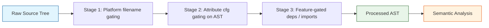

# Chapter 19 — Conditional Compilation

**Version:** 1.0.0-rc1
**Status:** Normative
**Cross-references:** Chapter 16 (Attributes — Tier-0 `zom::cfg` schema), Chapter 13 (Modules — dual filesystem convention with file suffix), Chapter 21 (Manifest `[features]` section)

---

## 19.0 Purpose and Overview

ZOM provides three orthogonal mechanisms for conditional compilation. All three
operate *before* semantic analysis: any AST node whose cfg predicate evaluates
to false is deleted from the AST as if it were commented out. No type inference
and no name resolution runs on deleted nodes.

Mechanisms, in order of application:

1. **(A) Attribute-gated AST nodes** — The `#[zom::cfg(...)]` Tier-0 attribute
   (see 19.3) applied to individual declarations, members, or statement blocks
   gates that node and its subtree.
2. **(B) File-name suffix convention** — Source files whose stem ends with a
   recognized underscore suffix (e.g. `tcp_linux.zom`, `net_unix.zom`,
   `gui_test.zom`, `foo_simd.zom`) are automatically gated by the implied
   predicate before any item inside is parsed (see 19.5).
3. **(C) Feature flags via manifest** — Optional features declared in
   `Zom.toml` under the `[features]` table populate the `feature = "..."` cfg
   namespace and enable/disable optional dependencies (see 19.4 and Ch.21).

Pipeline overview:



The stages compose conjunctively: a node survives to semantic analysis only
when every predicate applied to it (file-level suffix, per-node attribute,
transitive feature enablement) evaluates true.

---

## 19.1 Reserved Contextual Keywords

`cfg` and `feature` are **contextual keywords**. They are *not* hard keywords
of the lexical grammar — a program may freely bind variables, fields, or type
parameters named `cfg` or `feature`. However, when they appear inside the
attribute position of a `#[zom::cfg(...)]` or `#[zom::cfg(feature = "...")]`
construct, they are parsed with cfg-specific grammar rules.

Future language editions **must not** promote `cfg` or `feature` to hard
keywords, and **must not** re-use them as non-cfg attributes in the `zom::`
namespace, in order to preserve the parsing model described in this chapter.

---

## 19.2 CompilerOptions Input

Conditional compilation evaluates against three structured inputs carried on
the `CompilerOptions` record:

### 19.2.1 `target_triple: string`

Target triple string of the form `"arch-vendor-os-env"` (the fourth segment
may be absent on platforms that do not require it). The compiler parses the
triple at startup and materializes the primitive predefined cfg keys listed in
19.3. Example triples: `"aarch64-apple-darwin"`, `"x86_64-unknown-linux-gnu"`,
`"riscv64gc-unknown-none-elf"`, `"wasm32-unknown-wasi"`.

### 19.2.2 `enabled_features: Set<string>`

Populated from three sources, unioned:

1. The default feature set declared under `[features].default` in `Zom.toml`,
   minus any features excluded via `default-features = false` on a dependency
   edge (see Ch.21 §21.3).
2. Features explicitly enabled via the `--features=a,b,c` compiler/CLI flag.
3. Transitive features enabled as a side effect of feature resolution in the
   PubGrub dependency resolver (e.g. `foo = ["dep:bar", "baz/traits"]` enabling
   the `traits` feature of crate `baz`).

### 19.2.3 `cfg_overrides: Map<string, string>`

Populated from `-Z cfg-override=key=value` command-line flags. Intended for
testing and experimental use. Overrides take effect after predefined keys are
materialized and before any predicate evaluation. User code **shall not**
depend on specific overrides being present in stable toolchains.

---

## 19.3 Tier-0 Attribute `#[zom::cfg(predicate)]`

`#[zom::cfg]` is a Tier-0 attribute (Ch.16) accepted on any declarative or
block-level construct (see 19.6 for the exhaustive list).

### 19.3.1 Grammar (EBNF)

```
CfgPredicate ::= CfgAll | CfgAny | CfgNot | CfgAtom
CfgAll       ::= 'all' '(' ( CfgPredicate ( ',' CfgPredicate )* ','? )? ')'
CfgAny       ::= 'any' '(' ( CfgPredicate ( ',' CfgPredicate )* ','? )? ')'
CfgNot       ::= 'not' '(' CfgPredicate ')'
CfgAtom      ::= Identifier ( '=' '"' IdentifierOrString '"' )?
```

`Identifier` follows the lexical rules of Ch.2. `IdentifierOrString` permits
any identifier or arbitrary string literal content between the double quotes.

### 19.3.2 Semantics

Predicate evaluation is a total Boolean function over the active cfg
environment:

| Form | Evaluation |
|---|---|
| `all(...)` with zero arguments | **TRUE** (tautology; useful for feature flags that default to enabled). |
| `all(P1, P2, ..., Pn)` with n > 0 | TRUE iff every Pi is TRUE. |
| `any(...)` with zero arguments | **FALSE** (tautological false). |
| `any(P1, P2, ..., Pn)` with n > 0 | TRUE iff at least one Pi is TRUE. |
| `not(P)` | Boolean negation of P. |
| `key = "value"` (valued atom) | TRUE iff `key` is present in the cfg environment AND its stored value equals `"value"` (string equality, case-sensitive). |
| `key` (bare atom, no value) | TRUE iff `key` is present in the cfg environment, regardless of the value stored. This supports "flag" semantics. |

Evaluation of a predicate with an unknown or unbound key **must not** error;
unknown valued atoms produce FALSE, unknown bare atoms produce FALSE. The
compiler **may** emit diagnostic `ZOM1902 CfgUnknownKey` as a warning.

### 19.3.3 Predefined cfg Keys

The following keys are always materialized by the compiler from the target
triple and compilation mode. User code **must not** rely on `cfg_overrides`
to change these in stable code.

| Key | Example value(s) | Meaning |
|---|---|---|
| `target_arch` | `"x86_64"`, `"aarch64"`, `"arm"`, `"riscv64"`, `"wasm32"` | CPU architecture |
| `target_vendor` | `"apple"`, `"unknown"`, `"pc"` | Vendor segment of the triple |
| `target_os` | `"macos"`, `"linux"`, `"windows"`, `"freebsd"`, `"wasi"`, `"none"` | Operating system; `"none"` for bare-metal targets |
| `target_env` | `""`, `"gnu"`, `"msvc"`, `"musl"` | ABI environment; empty string when not specified |
| `target_family` | `"unix"`, `"windows"`, `"wasm"` | Aggregate family key |
| `target_pointer_width` | `"16"`, `"32"`, `"64"` | Pointer bit-width as a string |
| `target_endian` | `"little"`, `"big"` | Byte order |
| `target_has_atomic` | (bare atom) | Set (existence-checked) iff the target supports atomic load/store for all of `{8, 16, 32, 64, ptr}` |
| `test` | (bare atom) | Set when the crate is compiled under `zom test` |
| `debug_assertions` | (bare atom) | Set in dev profile, unset in release profile |
| `proc_macro` | (bare atom) | Set when compiling a proc-macro crate type |
| `panic` | `"unwind"`, `"abort"` | Current crate's panic strategy |
| `feature` | see 19.4 | Multivalued; accessed as `feature = "..."` atoms |

---

## 19.4 Feature Flags via `[features]` in Zom.toml

Cross-reference: Ch.21 §21.3.

For every feature `foo` declared in the crate manifest under `[features]`, and
for every such feature present in `CompilerOptions.enabled_features` at
compile time, the compiler **shall** add the valued atom `feature = "foo"` to
the cfg environment. Predicates written `#[zom::cfg(feature = "foo")]` test
against this namespace.

Feature resolution occurs in the PubGrub resolver (Ch.21) **before**
compilation, so the final `enabled_features` set is stable by the time cfg
evaluation begins.

### 19.4.1 Feature List Syntax

Within the manifest `[features]` table, the right-hand side of a feature
declaration is a list of strings with three recognized forms:

1. `dep:name` — Enables optional dependency `name` as if it were a regular
   dependency, but only when the feature is enabled.
2. `name/subfeature` — Enables the feature `subfeature` in dependency `name`.
   `name` must be declared as a (possibly optional) dependency.
3. Plain identifier (not starting with `dep:` and not containing `/`) —
   Enables another feature of the *same* crate, supporting nested feature
   enablement such as `full = ["serde", "async", "gui"]`.

### 19.4.2 Cycles

A feature list that transitively references itself (cycle of length >= 1)
**must** produce `ZOM1904 FeatureCycle` and terminate compilation.

---

## 19.5 File-Name Suffix Convention

As a complementary mechanism to per-node `#[zom::cfg]` attributes, ZOM
recognizes a file-name suffix convention so that platform-specific source
trees can be organized without per-item attribute noise.

### 19.5.1 Suffix Matching Rule

Given a source file whose stem (without the `.zom` extension) is of the form
`base_SUFFIX` where `_` is a literal underscore:

- If `SUFFIX` is a known `target_os` value from the predefined list in 19.3.3,
  the file is auto-gated with `target_os = "<SUFFIX>"`.
- Otherwise, if `SUFFIX` is a known `target_family` value (`unix`, `windows`,
  `wasm`), the file is auto-gated with `target_family = "<SUFFIX>"`.
- Otherwise, if `SUFFIX` is a known `target_vendor` value (`apple`, `unknown`,
  `pc`), the file is auto-gated with `target_vendor = "<SUFFIX>"`.
- Otherwise, if `SUFFIX` equals `test` or `debug`, the file is auto-gated
  with the bare atom `test` or `debug_assertions` respectively.
- Otherwise, if `SUFFIX` exactly matches a feature name declared in
  `[features]` of the current crate, the file is auto-gated with
  `feature = "<SUFFIX>"`.
- Otherwise, no automatic gating is applied and the file is compiled
  unconditionally. The compiler **must not** warn.

Examples:

| File name | Implied gate |
|---|---|
| `net/tcp_linux.zom` | `target_os = "linux"` |
| `net/tcp_macos.zom` | `target_os = "macos"` |
| `net/unix_socket_unix.zom` | `target_family = "unix"` |
| `gui/darwin_utils_apple.zom` | `target_vendor = "apple"` |
| `util/foo_test.zom` | bare atom `test` |
| `render/simd_pass_simd.zom` | `feature = "simd"` (if declared) |
| `data/random_xyzzy.zom` | no gating (unknown suffix) |

### 19.5.2 Composition with Explicit Attributes

If a suffix-gated file also contains explicit `#[zom::cfg(...)]` attributes on
its items, the effective predicate for each item is the logical AND of the
file-level suffix gate and the item-level attribute gate (narrower wins).

### 19.5.3 Ambiguity

If the stem's last two underscore-separated segments **each** independently
match a recognized gate category (e.g. `net_unix_apple.zom`), the compiler
**must** emit `ZOM0888 FileSuffixAmbiguous` with a hint to rename the file or
use explicit `#[zom::cfg(...)]` attributes instead.

---

## 19.6 Gated Semantics

### 19.6.1 Valid Gate Targets

`#[zom::cfg(...)]` is legal on the following constructs:

1. **Top-level declarations**: `class`, `struct`, `enum`, `interface`,
   `function` (including `fun`, `proc`, `method` standalone), `const`,
   `static`, `mod`, `import`, `export`, `impl`.
2. **Class / interface / struct members**: methods, fields, associated types.
3. **Statement blocks**: a statement of the form `#[zom::cfg(...)] { ... }`
   where the brace block is a standalone statement. If the predicate is false
   the compiler replaces the block with a NoOp.

`#[zom::cfg(...)]` is **not supported** on sub-expression subtrees. Applying
the attribute to an expression (or to a statement whose expression-kind would
require gating an expression rather than a block) **must** produce
`ZOM1901 CfgOnExpression`. Users shall use conditional statements instead.

### 19.6.2 Cross-Gating Behavior

If a declaration `D` is removed by cfg evaluation, it is truly absent from the
processed AST. Any reference to a name introduced by `D` from outside `D`'s
gate therefore produces the standard "undeclared identifier" / "undeclared
type" diagnostic path. No cfg-specific "you may have meant to reference a
gated item" diagnostic is required.

### 19.6.3 Exports

Gating an `export` declaration — or gating the item that an `export`
re-exports — removes the exported symbol from downstream crates' visible
namespaces exactly as if the item had never existed.

---

## 19.7 Diagnostic Code References

This chapter allocates the following diagnostic codes in the 19xx family (and
one cross-range code reused from the 08xx module surface for the related
filesystem convention). Full registry rows with severity, message templates,
and fix-its are provided by the central diagnostic registry spec.

| Code | Mnemonic | Meaning |
|---|---|---|
| `ZOM1900` | `CfgPredicateParseError` | Malformed cfg predicate inside a `#[zom::cfg(...)]` attribute; grammar does not match 19.3.1. |
| `ZOM1901` | `CfgOnExpression` | `#[zom::cfg(...)]` applied to an expression or to a context that requires expression-level gating (not supported). |
| `ZOM1902` | `CfgUnknownKey` | A cfg predicate references a key that is neither predefined nor present in `enabled_features` or `cfg_overrides`. Warning severity. |
| `ZOM1903` | `FeatureUndeclared` | A cfg predicate references `feature = "foo"` but `foo` is not declared in the `[features]` table of the current crate. Error severity. |
| `ZOM1904` | `FeatureCycle` | Feature resolution detected a transitive cycle in `[features]`. Error severity. |
| `ZOM0888` | `FileSuffixAmbiguous` | A source file stem's trailing segments match two or more distinct predefined gate categories; see 19.5.3. |

---

## 19.8 Example — Platform-Specific Network Implementation

```zom
// net/mod.zom — exports unified API
mod tcp;   // resolved to tcp.zom, tcp_linux.zom, tcp_macos.zom, ... per §19.5

export interface Socket {
    fun connect(addr: str) -> unit raises NetError;
    fun send(buf: [u8]) -> u64 raises NetError;
}

export class NetError : Error {}
```

```zom
// net/tcp_linux.zom — compiled only on target_os = "linux"
use libc;

struct LinuxTcpSocket {
    fd: i32,
}

impl Socket for LinuxTcpSocket {
    fun connect(addr: str) -> unit raises NetError { /* ... */ }
    fun send(buf: [u8]) -> u64 raises NetError { /* ... */ }
}
```

```zom
// net/tcp_macos.zom — compiled only on target_os = "macos"
use darwin_libc;

struct MacosTcpSocket {
    sock: DarwinSocket,
}

impl Socket for MacosTcpSocket {
    fun connect(addr: str) -> unit raises NetError { /* ... */ }
    fun send(buf: [u8]) -> u64 raises NetError { /* ... */ }
}
```

```zom
// gui/button.zom — item-level gating
#[zom::cfg(feature = "gui")]
export class Button {
    x: i32;
    y: i32;
    mut label_text: str;

    fun label() -> str { return self.label_text; }

    #[zom::cfg(target_os = "windows")]
    fun win32Refresh() { /* Win32-specific repaint */ }

    #[zom::cfg(any(target_os = "macos", target_os = "ios"))]
    fun cocoaRefresh() { /* Apple-specific repaint */ }
}
```

---

## 19.9 Example — `all` / `any` / `not` Combinations

```zom
// Compiled only on 64-bit unix targets that provide atomic instructions
#[zom::cfg(all(
    target_pointer_width = "64",
    target_family = "unix",
    target_has_atomic,
))]
struct AtomicPtr<T> {
    inner: u64,
}

// Compiled anywhere EXCEPT wasi bare-wasm environments
#[zom::cfg(not(target_os = "wasi"))]
use std.fs;

// Compiled when feature "std" is enabled OR on target_family = "unix"
#[zom::cfg(any(feature = "std", target_family = "unix"))]
fun platformSleepMs(ms: u32) { /* ... */ }

// Tautologically enabled (zero-argument all = true); useful for
// feature declarations that default to enabled in the manifest.
#[zom::cfg(all())]
const ALWAYS_PRESENT: i32 = 1;
```
