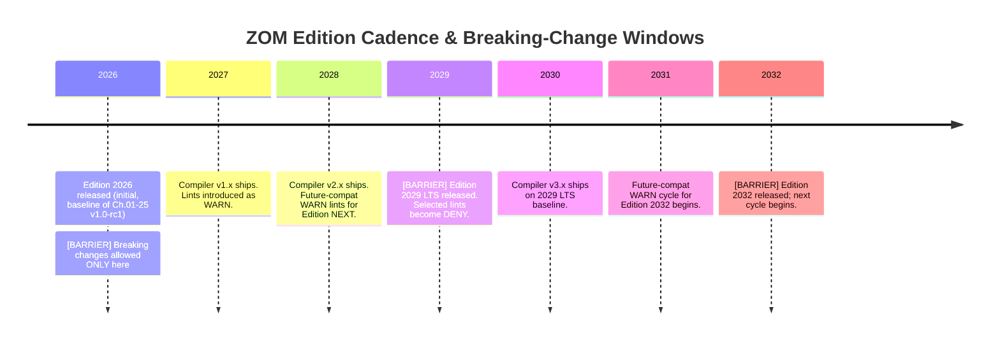

# Chapter 20 -- Edition Model & Stability Contracts

Edition = TBD-10. Year string `edition = "2026"`. Per-crate. Lints promote to
errors in NEXT edition.

---

## 20.0 Why Editions?

Semantic versioning applies to packages; it does not, and cannot, apply to the
*language itself* in the same way. Between v1.0 and v2.0 of the ZOM compiler
toolchain, the language design committee must be free to:

- introduce new reserved keywords that were previously legal identifiers;
- fix long-standing parser or type-system bugs on which code has accidentally
  come to depend;
- tighten lints into hard errors;
- remove anti-patterns and deprecated surface syntax from the prelude.

Editions are the mechanism that lets the language evolve **without forcing every
user to rewrite existing code in lockstep**. Editions are strictly opt-in. A
crate declaring `edition = "2026"` in its manifest will be compiled with the
2026 semantics *forever*, even when the compiler toolchain has advanced to
edition 2034. New compiler releases remain capable of compiling old-edition
crates, and cross-crate linkage across edition boundaries is fully supported
with no semantic overhead.

The following timeline illustrates the normative edition cadence and the
strict rule that *breaking changes to the language surface are only permitted
at edition boundaries*.



Between any two consecutive barriers, the compiler MUST preserve the semantic
contract of each supported edition to the letter. A patch release of the
compiler MUST NOT alter the parse tree, type-checking outcome, or runtime
semantics of code that compiled successfully under any supported edition
(excepting cases where the prior behaviour was expressly undefined or
memory-unsafe; see Table B in Sec.20.2).

---

## 20.1 Declaration & Scope

The edition of a crate is declared in its `Zom.toml` manifest inside the
`[package]` table via the `edition` key:

```toml
[package]
name    = "my-crate"
version = "0.1.0"
edition = "2026"   # mandatory field since Chapter 21 Sec.21.5
```

The `edition` field is normative and mandatory. A conforming implementation
MUST emit diagnostic code **ZOM0875 MissingEditionField** (registered in the
08xx block; see Sec.20.7) when compiling a crate whose `Zom.toml` lacks this key.

### 20.1.1 Scope

Edition scope is **per-crate and non-transitive**. Each crate is compiled
against the edition named in its own manifest. Consider a dependency graph in
which crate A (edition 2026) depends on crate B (edition 2032):

- A's source is parsed, type-checked, and code-generated under 2026 rules.
- B's source is parsed, type-checked, and code-generated under 2032 rules.
- The compiler back end links A and B into a single binary without any
  additional glue, warning, or semantic impedance mismatch.

The edition of a dependency MUST NOT influence the compilation of its
dependents. A crate's edition is strictly its own declaration.

### 20.1.2 Reserved Surface

The identifier `edition` is reserved as a **contextual keyword** for potential
future language surface such as edition-scoped blocks (`edition { ... }`).
Edition-scoped blocks are NOT part of the v1 language; the reservation merely
prevents ecosystem code from relying on `edition` as a free identifier in
positions where future grammar might introduce a keyword.

See also: Chapter 21 Sec.21.5 (edition field in manifest grammar) and
Chapter 25 Sec.25.4 (edition-gated prelude symbols).

---

## 20.2 What Requires an Edition Bump (and What Does Not)

The following two tables are NORMATIVE. Any change to the compiler, standard
library, or language grammar MUST be classified under exactly one row of one
table, and the edition policy of that row MUST be honoured.

### Table A -- Changes that REQUIRE an Edition Bump

| Category | Concrete Examples | Rationale |
|---|---|---|
| New reserved HARD keywords | `contract`, `effect`, `raise` if introduced as hard keywords | Could silently break existing code that uses the name as a variable, function, or type identifier. |
| Grammar changes that shift parse trees | New expression forms, associativity rebalancing, new statement terminators | Existing valid code could parse differently, producing silent behavioural drift. |
| Default semantics change | Default panic strategy flip, default mutability change, default ABI switch | Silent behavioural change in compiled code without source edits = violation of stability contract. |
| Lint-to-error promotion | `unused_import`, `unreachable_code` promoted to hard DENY | Source-incompatible; downstream CI treating warnings as non-fatal would suddenly fail. |
| Removal of deprecated prelude symbols | Dropping an outdated type or function from the Chapter 25 prelude | Could break downstream imports via silent name-resolution shifts. |
| Module resolution path changes | Reordering of Ch.24 candidate search, adding or removing fallback directories | Existing crates could resolve a different file or shadow a different module. |

### Table B -- Changes that DO NOT REQUIRE an Edition Bump

| Category | Concrete Examples | Rationale |
|---|---|---|
| New library APIs | Adding functions, classes, or interfaces to the standard library | Strictly additive; cannot cause any existing valid program to stop compiling. |
| New compiler-intrinsic attributes | Adding new Tier-1 `#[zom::new_attr(...)]` | Unknown attributes are warned by default; no existing semantics are altered. |
| Improved type inference | More cases accepted, fewer type annotations required, better unification | Rejects strictly fewer programs; extension of the accepted set. |
| Better error messages and diagnostics | Adding spans, notes, suggestions, or colour output | Pure user-facing quality improvement; no semantic change. |
| Optimisations and codegen improvements | Inliner upgrades, SLP vectorisation, new instruction selection | Observable semantics unchanged. |
| Bug fixes for undefined behaviour | Code that previously compiled and caused memory corruption is now rejected or fixed | Correctness takes precedence over stability. Users had no valid reliance on UB. |
| New lints | New warning categories, new lint families | Warnings do not break compilation under default flags. |
| New editions themselves | Addition of support for edition 2029 to a 2026-compatible compiler | Old editions remain supported indefinitely; opt-in only. |

---

## 20.3 Lint Promotion Cycle (NORMATIVE)

ZOM defines a three-tier lint system with a strictly ordered set of levels:

| Level | Name | Semantics | Attribute |
|---|---|---|---|
| 0 | Allow | Off by default. Does not affect compilation. | `#[zom::allow(lint_name)]` |
| 1 | Warn | On by default; produces non-fatal diagnostics. Exit code unchanged. | `#[zom::warn(lint_name)]` |
| 2 | Deny | Hard error; compilation fails with non-zero exit code. | `#[zom::deny(lint_name)]` |
| 3 | Forbid | Locked deny. Cannot be lowered by any downstream attribute. | `#[zom::forbid(lint_name)]` |

The attribute override chain is: `forbid > deny > warn > allow`. A
`#[zom::forbid]` applied at the crate root or on an enclosing scope is
absolute: no inner `allow`, `warn`, or `deny` may lower its severity.

### 20.3.1 Promotion Rules NORMATIVE

1. **Introduction.** A newly stabilised lint MUST enter the ecosystem at the
   **Warn** level within the current edition. It MUST NOT debut at Deny.

2. **Future-compat window.** After at least one full minor compiler release
   cycle, and no earlier than 18 months after introduction, a lint scheduled
   for promotion MUST be reclassified as a **future-compat Warn**. Diagnostics
   of this category use a dedicated template (see **ZOM2003** in Sec.20.7) that
   names the exact target edition in which the lint will become a Deny, and
   carries the diagnostic suffix `[future-compat:YYYY]`.

3. **Edition-boundary promotion.** Upon release of the next edition, the same
   lint SHALL become **Deny** -- but ONLY for crates whose manifest declares
   that new edition. Crates that remain on the older edition continue to see
   the lint at its original severity.

4. **Escape hatch.** In the new edition, a crate author MAY still suppress
   the promoted lint via `#![zom::allow(lint_name)]` at the crate root, or
   with per-item attributes. This provision does NOT apply to lints that have
   been registered in the Forbid tier. Forbid lints are reserved exclusively
   for safety-critical properties (e.g. linear-type leaks, unsafe-pointer
   provenance violations).

Attempting to `allow` a Forbid lint is itself an error, diagnostic code
**ZOM2001 LintLevelForbidden**.

### 20.3.2 Lint Families and Toolchain Defaults

The ZOM toolchain groups lints into a small number of static families for
convenient bulk management. The normative list of lint families is:

- `zom::all` -- every lint known to the compiler.
- `zom::safety` -- lints whose violations imply memory, concurrency, or
  type-system unsafety. Every lint in this family is Forbid-by-default once
  stabilised.
- `zom::correctness` -- lints that flag provably wrong code (e.g.
  `unreachable_code`, `unused_must_use`, `double_free`). Default: Deny for
  safety-impacting members, Warn otherwise.
- `zom::style` -- purely cosmetic lints (indentation, quote style, line
  length). Default: Allow (delegated to `zomfmt`).
- `zom::suspicious` -- patterns that are *likely* bugs but cannot be proven
  so (e.g. `comparison_to_empty`, `possible_unit_match`). Default: Warn.
- `zom::pedantic` -- opinionated lints that enforce strict conventions but
  have no correctness bearing. Default: Allow.

The attributes `#[zom::allow(zom::correctness)]` (family reference) and
`#[zom::allow(unused_must_use)]` (leaf lint) are both valid; family
attributes expand to the current member set of the family at the time of
compilation.

### 20.3.3 Lint Scope Precedence

Lint-level declarations apply in an attribute scope stack, from innermost to
outermost:

1. Expression-level `#[zom::...]` attributes (applied to a single
   expression, statement, or block item).
2. Item-level attributes (function, class, interface, enum, type alias,
   module).
3. Module-level `#![zom::...]` inner attributes (applied at the top of a
   `.zom` source file).
4. Crate-root `#![zom::...]` inner attributes in the crate root module.
5. Command-line flags (`-A` / `-W` / `-D` / `-F`) passed to the compiler.
6. Workspace-level `.zomlints.toml` configuration file (if present).

The strict override chain `forbid > deny > warn > allow` is evaluated at the
*most specific applicable scope* for each lint. A crate-level `deny` is
overridden by an item-level `allow` unless the crate-level level was
`forbid`.

---

## 20.4 Edition 2026 Initial Contract

Edition 2026 is the FIRST edition of ZOM. Its normative baseline is the full
contents of Chapters 01 through 25 frozen at v1.0-rc1, together with any
future corrections classified under Table B of Sec.20.2.

### 20.4.1 Lints Guaranteed Against Promotion

The following lint families SHALL remain at or below their listed severity
through Edition 2026 and SHALL NOT be promoted to Deny in the immediately
following edition (Edition 2029). This guarantee is a contractual promise to
early adopters; it can only be revoked by a new edition that explicitly lists
the revocation.

| Lint family | Guaranteed ceiling | Rationale |
|---|---|---|
| Naming convention (`non_snake_case`, `non_camel_case_types`, ...) | Warn | Cosmetic; highly project-dependent; forcing churn is counterproductive. |
| Missing documentation (`missing_docs`, `missing_examples`, ...) | Warn | Quality, not correctness; thresholds differ per organisation. |
| Style lints (`quote_style`, `trailing_comma`, `max_line_length`) | Allow | Pure formatting; enforced by tooling outside compilation. |

Constructing an edition migration path from 2026 to 2029 that promotes any of
these lints to Deny is a specification violation and MUST NOT occur.

---

## 20.5 Semver Compatibility for Crates

Crate authors publishing to the ZOM package registry (see Chapter 26) MUST
obey Semantic Versioning 2.0. The following paragraphs specify the ZOM
compatibility semantics that underlie each SemVer component.

- **MAJOR** (`X.y.z`). Any change that could cause a downstream crate to fail
  compilation under its default settings. Examples include: removing or
  renaming a public item; adding a required field to a public struct used in
  struct-literal construction; tightening a generic bound on a public
  function; removing an interface implementation that downstream code
  dispatches against.

- **MINOR** (`x.Y.z`). Strictly additive changes. Examples include: adding
  new functions, types, classes, or interface implementations; introducing
  new feature flags; adding new enum variants to a type already marked
  `#[zom::non_exhaustive]` (cross-ref Chapter 16). Downstream crates SHALL
  compile without source changes.

- **PATCH** (`x.y.Z`). Bug fixes, documentation improvements, and
  performance improvements only. No change to the public API surface in any
  direction; no new, renamed, or removed symbols.

The ZOM toolchain does NOT ship a semver-checking static-analysis tool in v1;
this capability is deferred to the v2 roadmap (Chapter 26). Authors are
advised to exercise CI that compiles a set of representative downstream
crates as "integration tests for breakage" before cutting a MAJOR or MINOR
release.

### 20.5.1 The `#[zom::non_exhaustive]` Attribute

Types decorated with `#[zom::non_exhaustive]` (structs, enums, and unions;
see Chapter 16 Sec.16.x) enjoy a privileged compatibility status. Adding a new
variant to a non-exhaustive enum is classified as a **MINOR** change, because
all downstream `match` statements were already required to include a wildcard
arm. Similarly, adding new fields to a non-exhaustive struct is MINOR,
because downstream literal construction was already prohibited.
Non-exhaustive is the recommended pattern for any public type that the
author intends to extend across minor releases.

### 20.5.2 Pre-release Versions & SemVer

Crate authors publishing pre-release versions (e.g. `2.0.0-alpha.1`,
`1.3.0-rc.2`) do so under a reduced compatibility contract:

- A pre-release has **no SemVer compatibility guarantees** with any other
  version, including other pre-releases in the same series. Breaking the
  public API between `2.0.0-alpha.1` and `2.0.0-alpha.2` does NOT require a
  MAJOR bump (the bump is the pre-release segment itself).
- Pre-release versions are **not** matched by normal version ranges unless
  the constraint itself contains a pre-release segment (see cross-ref
  Ch.26 Sec.26.3.3). This prevents accidental upgrades to unstable code.
- Once a GA release `2.0.0` is published, compatibility with `1.y.z` is
  evaluated normally under the MAJOR rules above.

### 20.5.3 Feature Flags & Semver

Additive feature flag changes (`features.new_feature = [...]`) are MINOR.
Removing a feature flag, renaming it, or changing its default activation
from `false` to `true` in a manner that introduces new mandatory
dependencies is MAJOR. Adding a default feature that *only* activates
already-optional dependencies present in the graph is MINOR.

---

## 20.6 The `no_core` / Freestanding Stability Exception

Freestanding compilation mode is explicitly **UNSTABLE** for the entire v1
edition lifecycle. This includes:

- the `#![zom::no_core]` crate-level attribute;
- all `#[lang = "..."]` item attributes that identify compiler-magic items;
- the `#![zom::no_std]` top-level attribute;
- intrinsic submodules (`zom::intrinsics`, `zom::rt`).

All of the above are subject to breaking changes across **PATCH** releases of
the compiler. They are reserved for the exclusive use of the standard
library, core library, and runtime authors. End users who enable any of
these features accept the burden of tracking compiler changes on their own.

---

## 20.7 Diagnostic Codes (Prose Register)

The following diagnostic codes are registered in the ZOM diagnostic index by
this chapter and are referenced by number elsewhere in the specification.

| Code | Mnemonic | Trigger |
|---|---|---|
| ZOM0875 | MissingEditionField | `Zom.toml` `[package]` table lacks the mandatory `edition` key (cross-ref Ch.21). |
| ZOM0876 | EditionTooNew | The compiler version in use does not know how to compile the edition string declared in the manifest. |
| ZOM2001 | LintLevelForbidden | An inner `#[zom::allow]` or `#[zom::warn]` attempted to lower a lint whose outer scope is `#[zom::forbid]`. |
| ZOM2002 | DeprecatedInEdition | A construct used by the source was marked deprecated in edition PREV and will become a hard error in edition NEXT. Emitted with a span, the edition names, and a suggested replacement where available. |
| ZOM2003 | LintPromotionFutureCompat | Special-category diagnostic used during the future-compat window (Sec.20.3.1). Template MUST include the exact edition in which the lint becomes Deny. |

Implementations are free to provide additional diagnostic codes beyond this
register. The codes listed above are normative: any conforming compiler that
emits a diagnostic for the listed trigger MUST either use the registered code
or provide an unambiguous machine-readable alias mapping to it.
