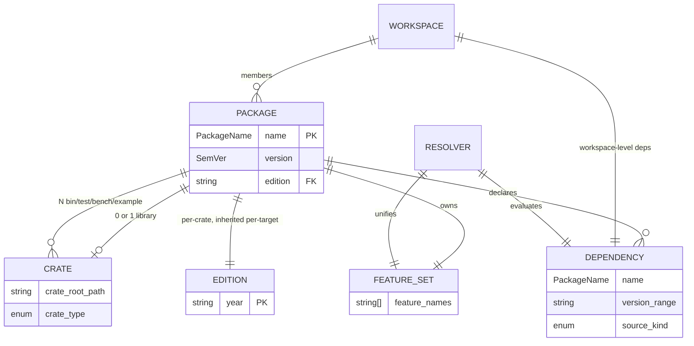
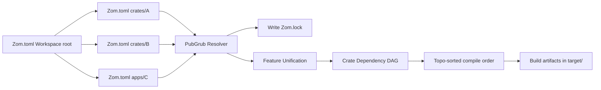

# Chapter 21 — Package Model, Manifest & Workspaces

**Version:** ZOM Language Specification v1.0.0-rc1
**Range allocation (diagnostics):** Module/package = `ZOM0800–ZOM0899` (see `docs/design/architecture.md` §8).
**Cross-references:** Ch.13 Modules and Imports, Ch.16 Attributes and Annotations, `docs/design/compiler-contracts.md` §9.

---

## 21.0 Scope and Definitions

This chapter defines the distributable and buildable units of the ZOM ecosystem:
*packages*, *crates*, *workspaces*, and their inter-relationships via the manifest
file, the dependency resolver, and the edition model. The rules here are normative
for every conforming ZOM toolchain, including `zcc`, `zom` CLI, and the `zls`
language server.

### 21.0.1 Package

A **package** is the smallest distributable unit published to or fetched from a
ZOM registry. A package is identified by its *name* (a `PackageName`) and
*version* (a SemVer 2.0 string). Within a single dependency graph every
`(name, version)` pair appears at most once; packages cannot overlap or share
crate names.

A package contains:

- Exactly **0 or 1 library crates** (the *primary library target*). A package
  with no library crate is a "binary-only" package.
- Any number of binary, example, test, and bench crates.
- A manifest file `Zom.toml` at its root directory.
- Zero or one build script referenced by `[package].build`.

### 21.0.2 Crate

A **crate** is a single compilation root. Its identity is the tuple
`(package_name, edition, crate_type)`. Every crate has exactly one root module
resolved as described in Ch.13 §2. Compilation of a crate is independent of any
other crate's compilation except through the metadata interface of its declared
dependencies. Incremental compilation boundaries align with crate boundaries.

### 21.0.3 Workspace

A **workspace** is a collection of packages that share a single dependency
graph, a single `target/` output directory, and a single resolver session. The
directory containing the `Zom.toml` that declares `[workspace]` is the
*workspace root*. Exactly one workspace root exists per compilation session.

### 21.0.4 Dependency Graph

The dependency graph of a workspace is a directed acyclic graph (DAG) whose
nodes are resolved package versions and whose edges are labeled with
`(version_range, source_kind)`. Edges declared in manifest files are *direct*;
edges introduced by the resolver are *transitive*. The resolver implements the
PubGrub algorithm (see §21.3).

### 21.0.5 Entity-Relationship Diagram



---

## 21.1 The Zom.toml Manifest

### 21.1.1 File Format and Location

Every package root directory MUST contain a file named `Zom.toml` whose
contents conform to TOML 1.0 (`https://toml.io/en/v1.0.0`). Key requirements:

- **Comments:** Lines starting with `#` and inline `#`-prefixed content are
  comments. Comments MUST not appear inside multi-line basic strings.
- **Trailing commas:** Disallowed in TOML arrays and inline tables. A manifest
  containing a trailing comma is a parse error (`ZOM0874 ManifestSyntaxError`).
- **Encoding:** UTF-8 without BOM. Any other encoding is a hard error.
- **File name:** Case-sensitive. `zom.toml`, `ZOM.TOML` are NOT valid manifests
  and are ignored by the toolchain with a `ZOM0874` diagnostic.

The file at the package root is referred to as the **manifest file**
throughout this specification and all compiler error messages.

### 21.1.2 Top-Level Structure

The manifest is a single TOML table. The following top-level keys are defined.
Unknown top-level keys are a hard error (`ZOM0874`).

| Key | Required | Type | Purpose |
|---|---|---|---|
| `[package]` | yes | Table | Package metadata (name, version, edition, authors, …) |
| `[lib]` | no | Table | Configuration for the (single) library target |
| `[[bin]]` | no | Array of Tables | Binary targets |
| `[[test]]` | no | Array of Tables | Integration test targets |
| `[[bench]]` | no | Array of Tables | Benchmark targets |
| `[[example]]` | no | Array of Tables | Example targets |
| `[dependencies]` | no | Table | Runtime dependencies |
| `[dev-dependencies]` | no | Table | Dependencies for tests/benches/examples (non-transitive) |
| `[build-dependencies]` | no | Table | Dependencies available to the build script only |
| `[features]` | no | Table | Conditional compilation features (see §21.3.5) |
| `[workspace]` | no | Table | Declares this `Zom.toml` as a workspace root |
| `[profile]` | no | Table | Compiler profile overrides |
| `[lints]` | no | Table | Per-lint configuration (severity, allow/warn/deny/forbid) |

Both `[workspace]` and `[package]` may coexist in one file, in which case the
file is simultaneously the workspace root manifest and the manifest for a
workspace member package ("virtual root" = file with `[workspace]` and no
`[package]`).

### 21.1.3 Machine-Readable JSON Schema

The schema below is the authoritative description of every key mentioned in
this section. Tooling MAY use it to validate manifests at load time. Human
readable descriptions follow; they are normative and take precedence in case
of discrepancy.

```json
{
  "$schema": "https://zom-lang.org/schema/zom-toml-v1.schema.json",
  "type": "object",
  "required": ["package"],
  "properties": {
    "package":            { "$ref": "#/$defs/Package" },
    "lib":                { "$ref": "#/$defs/LibTarget" },
    "bin":                { "type": "array", "items": { "$ref": "#/$defs/BinTarget" } },
    "test":               { "type": "array", "items": { "$ref": "#/$defs/TestTarget" } },
    "bench":              { "type": "array", "items": { "$ref": "#/$defs/BenchTarget" } },
    "example":            { "type": "array", "items": { "$ref": "#/$defs/ExampleTarget" } },
    "dependencies":       { "$ref": "#/$defs/DependencyTable" },
    "dev-dependencies":   { "$ref": "#/$defs/DependencyTable" },
    "build-dependencies": { "$ref": "#/$defs/DependencyTable" },
    "features":           { "$ref": "#/$defs/FeatureTable" },
    "workspace":          { "$ref": "#/$defs/Workspace" },
    "profile":            { "$ref": "#/$defs/ProfileTable" },
    "lints":              { "type": "object" }
  },
  "$defs": {
    "SemVer": {
      "type": "string",
      "pattern": "^(0|[1-9][0-9]*)\\.(0|[1-9][0-9]*)\\.(0|[1-9][0-9]*)(-[0-9A-Za-z.-]+)?(\\+[0-9A-Za-z.-]+)?$"
    },
    "PackageName": {
      "type": "string",
      "pattern": "^[a-z][a-z0-9_]{0,63}$"
    },
    "Package": {
      "type": "object",
      "required": ["name", "version", "edition"],
      "properties": {
        "name":         { "$ref": "#/$defs/PackageName" },
        "version":      { "$ref": "#/$defs/SemVer" },
        "edition":      { "type": "string", "enum": ["2026"] },
        "authors":      { "type": "array", "items": { "type": "string" } },
        "license":      { "type": "string" },
        "license-file": { "type": "string" },
        "description":  { "type": "string", "maxLength": 1000 },
        "homepage":     { "type": "string", "format": "uri" },
        "repository":   { "type": "string", "format": "uri" },
        "readme":       { "type": "string" },
        "keywords":     { "type": "array", "items": { "type": "string", "maxLength": 32 }, "maxItems": 10 },
        "categories":   { "type": "array", "items": { "type": "string" }, "maxItems": 10 },
        "build":        { "type": "string", "description": "path to build script (relative)" },
        "links":        { "type": "string", "description": "native library linkage name" },
        "publish":      { "oneOf": [{ "type": "boolean" }, { "type": "array", "items": { "type": "string" } }] },
        "default-run":  { "type": "string" },
        "exclude":      { "type": "array", "items": { "type": "string" } },
        "include":      { "type": "array", "items": { "type": "string" } },
        "no_std":       { "type": "boolean", "default": false },
        "no_core":      { "type": "boolean", "default": false }
      },
      "additionalProperties": false
    },
    "LibTarget": {
      "type": "object",
      "properties": {
        "name":              { "$ref": "#/$defs/PackageName" },
        "path":              { "type": "string" },
        "crate-type":        {
          "type": "array",
          "items": { "enum": ["lib","rlib","dylib","cdylib","staticlib","bin","proc-macro"] },
          "minItems": 1
        },
        "proc-macro":        { "type": "boolean", "default": false },
        "required-features": { "type": "array", "items": { "type": "string" } }
      }
    },
    "BinTarget": {
      "type": "object",
      "required": ["name"],
      "properties": {
        "name":              { "type": "string" },
        "path":              { "type": "string" },
        "test":              { "type": "boolean", "default": true },
        "bench":             { "type": "boolean", "default": true },
        "required-features": { "type": "array", "items": { "type": "string" } },
        "edition":           { "type": "string" }
      }
    },
    "TestTarget":    { "$ref": "#/$defs/BinTarget" },
    "BenchTarget":   { "$ref": "#/$defs/BinTarget" },
    "ExampleTarget": { "$ref": "#/$defs/BinTarget" },
    "DependencySpec": {
      "oneOf": [
        { "type": "string", "description": "version string shorthand" },
        {
          "type": "object",
          "properties": {
            "version":          { "type": "string" },
            "path":             { "type": "string" },
            "git":              { "type": "string", "format": "uri" },
            "branch":           { "type": "string" },
            "tag":              { "type": "string" },
            "rev":              { "type": "string" },
            "registry":         { "type": "string" },
            "optional":         { "type": "boolean", "default": false },
            "default-features": { "type": "boolean", "default": true },
            "features":         { "type": "array", "items": { "type": "string" } },
            "package":          { "$ref": "#/$defs/PackageName" }
          },
          "additionalProperties": false
        }
      ]
    },
    "DependencyTable": {
      "type": "object",
      "additionalProperties": { "$ref": "#/$defs/DependencySpec" }
    },
    "Feature": {
      "oneOf": [
        { "type": "array", "items": { "type": "string" } },
        {
          "type": "object",
          "properties": {
            "description": { "type": "string" },
            "depends":     { "type": "array", "items": { "type": "string" } },
            "optional":    { "type": "boolean", "default": false }
          }
        }
      ]
    },
    "FeatureTable": {
      "type": "object",
      "additionalProperties": { "$ref": "#/$defs/Feature" }
    },
    "Workspace": {
      "type": "object",
      "required": ["members"],
      "properties": {
        "members":          { "type": "array", "items": { "type": "string" } },
        "exclude":          { "type": "array", "items": { "type": "string" } },
        "resolver":         { "type": "string", "enum": ["1", "2"], "default": "2" },
        "package":          {
          "type": "object",
          "properties": {
            "version": { "$ref": "#/$defs/SemVer" },
            "edition": { "type": "string" },
            "license": { "type": "string" },
            "authors": { "type": "array", "items": { "type": "string" } }
          }
        },
        "dependencies": { "$ref": "#/$defs/DependencyTable" }
      }
    },
    "Profile": {
      "type": "object",
      "properties": {
        "opt-level":      { "oneOf": [{ "type": "integer", "minimum": 0, "maximum": 3 }, { "enum": ["s","z"] }] },
        "debug":          { "oneOf": [{ "type": "boolean" }, { "type": "integer", "minimum": 0, "maximum": 2 }] },
        "panic":          { "enum": ["unwind", "abort"] },
        "lto":            { "oneOf": [{ "type": "boolean" }, { "enum": ["thin", "fat"] }] },
        "codegen-units":  { "type": "integer", "minimum": 1 },
        "rpath":          { "type": "boolean" },
        "overflow-checks":{ "type": "boolean" },
        "incremental":    { "type": "boolean" }
      }
    },
    "ProfileTable": {
      "type": "object",
      "patternProperties": {
        "^(dev|release|test|bench)$": { "$ref": "#/$defs/Profile" }
      }
    }
  }
}
```

### 21.1.4 `[package]` Field Reference

Every field is described below with its type, default value, whether it is
required, and the effect it has on compilation and/or distribution.

| Field | Type | Required | Default | Compiler behavior |
|---|---|---|---|---|
| `name` | `PackageName` | yes | *none* | Used as the library crate name (unless `[lib].name` overrides). Names match `^[a-z][a-z0-9_]{0,63}$`. Used as the key for `use package_name::…` imports. Non-unique names in a graph raise `ZOM0871 VersionConflict` (with a name-clash sub-reason). |
| `version` | `SemVer` | yes | *none* | Semantic version 2.0. Used by the resolver and encoded in all emitted `.rlib` metadata. Mismatch on reload → `ZOM0871`. |
| `edition` | string enum | yes | *none* | Year-based edition. Current legal value: `"2026"`. Missing field → `ZOM0875 MissingEditionField` (see §21.5). Determines parser and type-checker rules for the crate. |
| `authors` | string[] | no | `[]` | Stored verbatim in `.rlib` metadata and published registry metadata. Has no semantic effect on compilation. |
| `license` | string | no | `null` | SPDX license identifier or free-form string. Publish without `license` AND without `license-file` raises a publish warning. No compilation effect. |
| `license-file` | string | no | `null` | Relative path to license file. Used by registry publication and `license` metadata generation. |
| `description` | string ≤1000 chars | no | `null` | Short description published to registry. Truncation beyond 1000 bytes is a `ZOM0874` parse/validation error. |
| `homepage` | URI | no | `null` | Registry metadata field. Not validated for reachability, only URI syntax. |
| `repository` | URI | no | `null` | Registry metadata field. Same syntax validation as `homepage`. |
| `readme` | string | no | `null` | Path to README file (commonly `README.md`). If omitted but a file `README*` exists at package root, that file is implicitly used. |
| `keywords` | string[≤10], each ≤32 chars | no | `[]` | Registry discovery metadata. Empty keywords are dropped. Duplicate keywords are deduplicated. |
| `categories` | string[≤10] | no | `[]` | Registry category slugs. Registry server validates against the category list; client side the list is stored verbatim. |
| `build` | relative path string | no | `null` | If present, points to the build script root file compiled with the HOST profile and executed before main crate compilation. See §21.6. |
| `links` | string | no | `null` | Declares that this package links against a native library of the given name. Two packages in one graph with the same `links` value → hard error (`ZOM0871` with native-link conflict reason). Enforces the "one-sys-crate-per-native-library" invariant. |
| `publish` | bool \| string[] | no | `true` | If `false`, `zom publish` refuses. If a string array, it is the allow-list of registry names that may receive the package. |
| `default-run` | string | no | *auto-selected* | Which binary target to run when `zom run` has no `--bin` argument. If unset and exactly one `[[bin]]` target exists, that target is chosen. Zero or multiple candidates without explicit `default-run` → `ZOM0874` semantic validation error. |
| `exclude` | glob string[] | no | `[]` | Patterns of files to exclude when packaging (tarball) and determining build-script rerun paths. |
| `include` | glob string[] | no | `[]` | If non-empty, ONLY files matching these patterns are packaged. `include` takes precedence over `exclude`. |
| `no_std` | bool | no | `false` | If `true`, the compiler does NOT inject the implicit `extern crate std;` prelude. Implicitly sets `no_core=false` (i.e., `core` is still injected). Conflicts with `no_core=true`. |
| `no_core` | bool | no | `false` | If `true`, neither `std` nor `core` is injected. The crate MUST be `no_std=true` as well (otherwise `ZOM0874`). Useful for runtime bootstrap and kernel code. Cross-references Ch.3 §6 on primitive lang items. |

### 21.1.5 Target Tables: `[lib]`, `[[bin]]`, `[[test]]`, `[[bench]]`, `[[example]]`

Target defaults for auto-discovery are:

| Target | Default root source path |
|---|---|
| `lib` | `src/lib.zom` |
| `bin` | `src/bin/<name>.zom` then `src/main.zom` (if name matches package) |
| `test` | `tests/<name>.zom` |
| `bench` | `benches/<name>.zom` |
| `example` | `examples/<name>.zom` |

Common fields:

- `name`: target name. For `[lib]` defaults to `[package].name`.
- `path`: explicit path, overrides auto-discovery.
- `crate-type` (lib only): array of crate types. See §21.2.
- `proc-macro` (lib only): `true` marks this crate as a procedural macro crate.
- `required-features`: the target is skipped unless all listed features are enabled.
- `test` / `bench`: whether `zom test` / `zom bench` includes this target by default.

---

## 21.2 Crate Types

Every library target declares its output form in `[lib].crate-type`. Each entry
is produced as a separate artifact. Legal values and their semantics:

### 21.2.1 `lib`

Default compiler-chosen library form. The backend resolves this to either
`rlib` (static, ZOM-internal) or `dylib` (for downstream crates not opting
into static linking). `lib` never produces `cdylib` or `staticlib`.

**Exports:** All public symbols of the crate, mangled per the ZOM ABI.
**Downstream consumers:** Only ZOM crates.

### 21.2.2 `rlib` — ZOM Native Static Library

A static archive (`.a` / `.lib`) that additionally embeds a metadata section
recording every exported interface impl, marker impl, generic type layout,
and cross-crate ABI signature. The linker sees only native object code; the
compiler consumes the metadata section via `Object::metadata()` when loading
upstream crates for coherence checking (see Ch.22 §5).

**Exports:** Native symbols (code + const/statics) + metadata section.
**Linker flags:** `-Bstatic` equivalent. No position-independent flag
requirements.
**Consumers:** ZOM crates only. Downstream consumers must be the same ZOM
edition major family to avoid metadata-version mismatch.

### 21.2.3 `dylib` — Dynamic Library with ZOM Runtime Symbols

Produces a platform shared object (`.dylib`, `.so`, `.dll`) that exports both
native public symbols AND the ZOM crate metadata as a named `.note` section.
**Exports:** All public native symbols, `__zom_metadata_<pkg>_<version>`
symbol, and runtime support symbols for the ZOM allocator and marker runtime.
**Consumers:** ZOM crates linked dynamically; a ZOM loader can dlopen it.
**Restriction:** Not usable for FFI interop with non-ZOM code (use `cdylib`).

### 21.2.4 `cdylib` — C-Compatible Dynamic Library

Produces a shared object exposing a C ABI. ZOM-internal symbols are
stripped; only items with `extern "C"` linkage or `#[zom::ffi::export]`
are exported. No ZOM metadata section is emitted by default (opt-in via
`#[zom::ffi::emit_metadata]`).

**Exports:** C-ABI extern functions and data, unmangled or with
`#[export_name = "..."]`.
**Consumers:** Any language with C FFI (C, C++, Python ctypes, …).
Downstream ZOM crates that link against a cdylib see only its extern
surface, not its generic or marker impls.

### 21.2.5 `staticlib` — Native Static Archive

Produces a native static library (`.a` / `.lib`) suitable for linking into
non-ZOM executables. Includes all transitive ZOM dependencies' native code.
Unlike `rlib`, no metadata section is embedded. All `panic = "unwind"`
runtime glue is statically linked.

**Exports:** All `extern` (C or ZOM ABI) symbols reachable from the
library's public API. Non-exported items are local to the `.o`.
**Consumers:** Any linker; typically the final link step of a foreign
build system (Make, CMake, Gradle).

### 21.2.6 `bin` — Executable

Produces a native executable with a `main()` entry point. The linker
resolves all crate dependencies (native and ZOM). A `bin` target always
has `crate-type = ["bin"]` implicitly.

**Exports:** Only OS entry point and any `extern` symbols.
**Consumers:** End-user execution via OS process loader.

### 21.2.7 `proc-macro` — Compile-Time Plugin

Produces a shared object that `zcc` loads during compilation of downstream
crates. The procedural macro crate exposes callable items whose signatures
are `fn(Symbol, TokenStream) -> TokenStream` or related forms registered
with `#[zom::proc_macro]` / `#[zom::proc_macro_derive(...)]` attributes.

**Proc-macro crate rules (normative):**

(a) MUST declare `proc-macro = true` in `[lib]`. Omitting it and using
    proc-macro attributes → hard error at declaration site.
(b) MUST NOT have a runtime. `no_std = true` is implied. Attempting to
    use the standard library from inside a proc-macro crate raises
    `ZOM0874` with the specific path used.
(c) Exported functions take `TokenStream` (or pairs thereof) and return
    `TokenStream`. Returning non-TokenStream types from items marked with
    the proc-macro attributes → `ZOM0517`-family type mismatch diagnostic.
(d) Proc-macro crates CANNOT be linked at runtime. Listing a proc-macro
    crate in `[dependencies]` (rather than via the proc-macro mechanism)
    → diagnostic `ZOM0874` reminding the user to wire it via
    `proc-macro = true` or via a macro-rename dependency flag.

---

## 21.3 Dependency Resolution

### 21.3.1 Algorithm Choice — PubGrub

ZOM uses the **PubGrub** algorithm (aka "modular satisfiability solver")
described in "PubGrub: Next-Generation Version Solving" (Nicolás Pernoud,
2019). The solver:

- Runs in polynomial time in the size of the dependency graph for typical
  inputs (worst-case exponential backtracking reserved for pathological
  cases, bounded by a depth limit of 4096 derivation steps).
- Produces human-readable failure reports in the form of a chain of
  incompatibilities that can be traced to a single source.
- Is the standard solver in Cargo (Rust, since 2018), Pub (Dart), and
  Zig's package manager.

The resolver output is (a) a mapping from `(PackageName, VersionConstraint)`
keys to a single concrete `(name, version)` selection; (b) the set of
features to enable for each selection; (c) the ordered edges of the
resulting DAG used for compilation topology.

### 21.3.2 Resolution Scope

The three dependency tables have non-overlapping scopes:

| Table | Scope | Transitive? |
|---|---|---|
| `[dependencies]` | All target configurations (lib, bin, test, bench, example) | yes |
| `[dev-dependencies]` | Only tests, benches, and examples. NOT visible to the library target | no |
| `[build-dependencies]` | Only available during build script compilation (HOST profile) | no (build-script isolated environment) |

Note that `[dev-dependencies]` of a dependency P are NEVER honored for a
downstream crate Q (enforced by workspace resolver="2"; see §21.4). Only
`[dependencies]` of P propagate.

### 21.3.3 Dependency Sources

A dependency is resolved from one of the following source kinds. The kind
is selected by which of the mutually exclusive keys is present.

1. **Registry (default).** Source key = `version = "^1.2.3"` (or any valid
   range per §21.3.4). Fetched from the default registry or the one named
   by `registry = "name"`.
2. **Local path.** Source key = `path = "../foo"`. The pointed directory
   MUST contain a `Zom.toml`. Paths are relative to the manifest's
   directory. Not valid for publication.
3. **Git repository.** Source key = `git = "https://…/repo.git"`. Optional
   sub-keys: `branch`, `tag`, `rev` (exactly one allowed; `rev` takes
   precedence). The repository root MUST contain `Zom.toml`. If the
   package is nested, use `?package=name` fragment or a separate
   `package` manifest key.
4. **Alternate registry.** Explicit `registry = "name"` references a named
   registry from the user or workspace configuration; resolves using that
   registry's index.

A dependency whose specification lacks all of `version`, `path`, and `git`
is a parse error `ZOM0874`. If more than one source key is set, `ZOM0874`
is raised reporting the conflict.

### 21.3.4 Version Semantics (SemVer 2.0)

All versions conform to SemVer 2.0. Shorthand version strings in dependency
declarations are interpreted as caret requirements:

- For versions starting with `1.` or higher: `1.2.3` ⇒ `>=1.2.3, <2.0.0`.
- For versions starting with `0.y` with `y > 0`: `0.2.3` ⇒ `>=0.2.3, <0.3.0`
  (API-breaking changes ARE allowed per SemVer 2.0 rule 4).
- For versions starting with `0.0`: `0.0.3` ⇒ `>=0.0.3, <0.0.4` (every
  patch is potentially breaking).

Explicit operators allowed in `version` strings: `^`, `~`, `>=`, `>`, `<=`,
`<`, `=`, and comma-separated conjunction (e.g. `">=1.2, <1.5"`). `||` for
disjunction is NOT supported in v1.0.

### 21.3.5 Feature Unification

Within a single compilation graph, each package appears at most ONCE per
major version. All features requested by all consumers of that
`(name, version)` are **union-ed** into the final feature set. This is the
*feature unification rule* and is non-negotiable. There is no mechanism
for building the same crate twice with different feature sets in the same
link unit.

Features enable conditional compilation in two forms (the attribute grammar is in Ch.16; only the manifest portion is here):

- `#[zom::cfg(feature = "name")]` — item or block is present only when
  feature `name` is enabled.
- File suffix convention: a file `foo.name.zom` next to `foo.zom` is
  selected in place of `foo.zom` when feature `name` is enabled; the
  resolver injects the appropriate `#[zom::path]` attribute.

**Feature names:** lowercase `snake_case`, max 64 ASCII characters,
matching `^[a-z][a-z0-9_]{0,63}$`. The name `default` is special: every
package implicitly has a `default` feature, and declaring `default = [list]`
in `[features]` enumerates which features are active unless the consumer
sets `default-features = false`.

**Optional dependencies.** A dependency with `optional = true`
automatically creates a feature of the same name. In feature lists, the
syntax `dep:foo` enables just dependency `foo` WITHOUT pulling in its
`default` features, while writing `foo` in a feature list enables the
dep *and* its default features.

**Weak dependencies.** The `weak:foo` syntax (used inside `depends` arrays
of `[features]`) marks the feature as a *weak* dependency: if NO crate in
the entire graph requires it (by any other path), the resolver is
permitted to drop both the feature and its associated optional dependency.
This exists primarily for opt-in diagnostic instrumentation; use sparingly.

### 21.3.6 Lockfile: `Zom.lock`

After every successful resolution, the solver writes a TOML file named
`Zom.lock` at the workspace root. Packages committed to version control
with binary targets MUST include `Zom.lock` to guarantee reproducible
builds.

**EBNF (conceptual):**

```
lockfile     = version_line package_entry*
version_line = "version = " integer "\n"
package_entry = "[[package]]\n" (key_value "\n")+
key_value     = ident " = " value
value         = string | array_of_strings
```

Required keys per `[[package]]` entry: `name`, `version`, `source`,
`checksum = "sha256:<hex>"`, `dependencies = ["..."]`. Additional keys
with a `_` prefix are reserved for tool use and MUST be ignored by
readers.

**Example:**

```toml
version = 1

[[package]]
name = "serde"
version = "1.0.193"
source = "registry+https://registry.zom-lang.org"
checksum = "sha256:9bf1a7c0f7e5240bf02ab41d2f1e2a9c1e1c1d12ef8c3b4a0f2e5e0b9d7a2c18"
dependencies = ["serde_derive"]

[[package]]
name = "serde_derive"
version = "1.0.193"
source = "registry+https://registry.zom-lang.org"
checksum = "sha256:7c3a8f1d2b4a6e0df5c2a023412c7e0e18b4d9a3f5c6e1c7a2b8d9e0f1a3b5c7"
```

### 21.3.7 Resolution Failures (ZOM0871 VersionConflict)

When PubGrub cannot find a satisfying assignment, the solver emits
`ZOM0871 VersionConflict` along with the incompatibility chain. The
canonical message format is:

```
ZOM0871: could not resolve `foo`
  required by `bar` (^1.2)
  but `baz` requires `foo` (=0.9) which conflicts with `^1.2`
  — incompatible version constraints.
```

The diagnostic ALWAYS includes the chain of named packages and their
constraints. `ZOM0872 UnresolvedDependency` is emitted as a sub-cause
when a named dependency cannot be fetched at all (missing from registry,
network error, or path not found); and `ZOM0870 PackageNotFound` is the
root error when a specific name has no versions in the consulted index.

---

## 21.4 Workspaces

### 21.4.1 `[workspace]` Block

A `Zom.toml` declaring `[workspace]` defines the workspace root. Required
fields:

- `members`: Array of glob patterns relative to workspace root. Each
  pattern is expanded and every matched directory that contains a
  `Zom.toml` is a workspace member. Non-matching literal paths are a
  hard error `ZOM0873 WorkspaceMemberNotFound`.
- `exclude`: Array of glob patterns. Any `Zom.toml` matching an exclude
  pattern (even if matched by `members`) is skipped.
- `resolver`: `"2"` (default). `"1"` is accepted by the parser but
  semantically treated as a legacy alias for `"2"`; there is no
  behavioral difference in v1.0 (no legacy resolver behavior).
- `package`: Inheritable package metadata. See §21.4.2.
- `dependencies`: Inheritable dependency versions. See §21.4.2.

### 21.4.2 Inheritance

Two inheritance mechanisms reduce duplication in a monorepo:

**(a) Package metadata inheritance.** The workspace root declares, e.g.:

```toml
[workspace.package]
version = "1.2.0"
edition = "2026"
license = "Apache-2.0"
authors = ["ZOM Team <team@zom-lang.org>"]
```

A member writes:

```toml
[package]
name = "mycrate"
version = { workspace = true }
edition = { workspace = true }
license = { workspace = true }
authors = { workspace = true }
```

The three forms `value`, `{ workspace = true }`, and `{ workspace = true, override = … }`
are accepted. Override is valid only for `authors` (append) and
`keywords`/`categories` (append). For all other fields, override is a
`ZOM0874` error.

**(b) Dependency version inheritance.** Workspace root declares:

```toml
[workspace.dependencies]
serde = { version = "1.0", features = ["derive"] }
tokio = { version = "1.35", default-features = false }
```

Members write:

```toml
[dependencies]
serde = { workspace = true }
tokio = { workspace = true, features = ["rt-multi-thread"] }
```

A member MAY add `features` or `optional` to an inherited dep (these are
merged per §21.3.5). The `version`, `git`, `path`, and `registry` keys
CANNOT be overridden in members; attempting to do so raises `ZOM0874`.
Using `[workspace.dependencies]` is MANDATORY for packages participating
in a ZOM-governed monorepo; CI SHALL enforce that no member repeats a
version string for a dep also present in `[workspace.dependencies]`.

### 21.4.3 Build Output and Profile Resolution

All workspace members share a single `target/` directory at the workspace
root. Intermediate artifacts are keyed by package name, target platform,
and profile (e.g. `target/debug/deps/libserde-abc123def.rlib`).

Profiles are resolved as follows: `[profile.<kind>]` declared at the
workspace root applies to ALL members. A member-level `[profile.<kind>]`
section overrides only that crate's own profile entries for that crate's
artifacts; it does NOT propagate transitively to its dependencies. This
enables, e.g., `app/A` to set `opt-level = 3` for itself while its 30
deps compile at workspace-default `opt-level = "s"`.

---

## 21.5 Editions

### 21.5.1 Mandatory Field

The `[package].edition` field is mandatory. Every `Zom.toml` parsed
without it raises:

```
ZOM0875 MissingEditionField: manifest at path/to/Zom.toml is missing
[package].edition — specify edition = "2026" (or later valid edition
string).
```

This is a semantic validation error (see architecture.md §8 for the
`0800–0899` range allocation); it is enforced before any other field in
`[package]` is interpreted.

### 21.5.2 Scope — Per-Crate

Editions are **per-crate**. Concretely:

- The edition of crate A does NOT influence parser or type-checker
  behavior of crate B even if A depends on B. Each crate is parsed with
  its own edition's grammar.
- Cross-crate metadata loading (`.rlib`) does verify that the upstream
  crate's edition is supported by the current compiler. If crate A
  (edition 2027) depends on crate B (edition 2099), and the toolchain is
  `zcc-2026.x` (supports up to edition 2027), the compiler emits:

```
ZOM0876 EditionTooNew: Crate `A` (edition 2027) depends on crate
`B` (edition 2099) — compiler zcc-2026.x does not support edition 2099.
Upgrade to a newer `zom` toolchain to compile this dependency.
```

### 21.5.3 Edition Boundaries

The following categories of language change may ONLY be introduced by
shipping a new edition:

1. **New keywords** that would otherwise break existing identifier
   parsing (e.g., adding `yield` in edition 2027).
2. **Lint promotion to hard errors**: a lint whose severity is
   `future-compat` in edition N becomes a hard error in edition N+1
   (see §21.5.4).
3. **Grammar changes** that are source-incompatible (e.g., relaxing
   semicolon rules, changing precedence for operators).
4. **Default semantics changes** whose change would silently alter
   runtime behavior of existing code (e.g., `panic` strategy defaulting
   from `"unwind"` to `"abort"`).

Behavioral refinements that do not change source-level meaning (e.g., a
bug fix in the type checker, a new optimizer pass, a better error
message for an already-rejected construct) are **edition-less**: they
apply uniformly across all supported editions.

### 21.5.4 Lint Promotion

A lint declared `future-compat` in edition N MUST:

- Emit as a **warning** in all supported compiler versions for edition N,
  including a message of the form:
  ```
  warning: this pattern will become a hard error in edition 20XX
    help: rewrite this pattern to <suggested fix>
  ```
- Automatically become a **hard error** with severity=Error when the
  manifest selects edition N+1 or later. No further warning is emitted;
  code that did not migrate fails to compile.

Tooling (`zom fix --edition`) SHALL provide automatic rewrites for all
promoted lints whose fix is mechanically derivable.

---

## 21.6 Build Scripts

### 21.6.1 Execution Model

If `[package].build = "build/build.zom"` is set, the build script is
compiled with the **HOST** profile (i.e., target triple = current host
machine, NOT the cross-compilation target) and executed BEFORE any of
the package's other targets are compiled. The build script is a full
ZOM `bin` target whose `main()` returns `i32`. Build scripts share their
own compilation environment with `[build-dependencies]` available but
`[dependencies]` (normal) NOT available — link isolation.

### 21.6.2 Environment Variables

The following environment variables are exported to every build script.
All paths are absolute when the toolchain can make them so.

| Variable | Meaning | Example |
|---|---|---|
| `OUT_DIR` | Writable output directory for generated code. Created fresh per-package-per-profile. | `/tmp/zom-build/pkg-abc123/out` |
| `CARGO_MANIFEST_DIR` | Directory containing the package's `Zom.toml`. | `/home/user/mycrate` |
| `HOST` | Host target triple (the machine running zcc). | `aarch64-apple-darwin` |
| `TARGET` | Target triple being compiled for. May differ from `HOST` when cross-compiling. | `x86_64-unknown-linux-gnu` |
| `PROFILE` | The profile name for the main crate being built. | `release` |
| `NUM_JOBS` | Top-level parallelism setting (`-j`). May be higher than actual HW concurrency. | `16` |
| `OPT_LEVEL` | Optimization level as an integer (0–3) or letter (`s`, `z`). | `3` |
| `DEBUG` | Debug info level, integer 0 (none), 1 (line tables), 2 (full). | `2` |
| `CARGO_PKG_NAME` | Package name from `Zom.toml`. | `my-crate` |
| `CARGO_PKG_VERSION` | Full SemVer string. | `1.4.2-beta.1` |

Variables prefixed `CARGO_` retain the `CARGO_` prefix for backwards
compatibility with the ecosystem; no separate `ZOM_PKG_` prefix is
defined in v1.0.

### 21.6.3 Stdout Protocol

The build script communicates requests to the build driver by printing
specific line formats to **stdout**. Lines not matching a known prefix
are silently ignored (this allows debug prints for user inspection
without polluting the main build log — use `zom:warning` for messages
that should be surfaced).

| Line prefix | Meaning |
|---|---|
| `zom:warning=<message>` | Emit a warning during the user's build. `<message>` is shown verbatim with source file "build script". |
| `zom:rerun-if-changed=<path>` | Re-run the build script (and invalidate its outputs) if `<path>` changes on disk. `<path>` is relative to `CARGO_MANIFEST_DIR`. |
| `zom:rerun-if-env-changed=<VAR>` | Re-run the build script if the environment variable `VAR` changes. |
| `zom:rustc-cfg=<cfg>` | Add a `#[zom::cfg(key = "value")]`-style key to the compilation. Both `key` and `key="value"` forms are supported. |
| `zom:rustc-link-lib=<lib>` | Link the final binary against the native library `<lib>`. Equivalent to `-l<lib>` on the linker line. `static=<lib>` / `framework=<lib>` prefixes select the library kind. |
| `zom:rustc-link-search=<search-path>` | Add a `-L` search path to the linker. Prefixes `native=`, `framework=`, `all=` select the scope. |
| `zom:rustc-link-arg=<arg>` | Pass a raw argument to the linker for the final binary of any crate consuming this package's output. |
| `zom:rustc-env=<KEY>=<VAL>` | Define an environment variable visible via `env!("KEY")` during compilation of the main package sources. |

Ordering between `rerun-if-*` directives is irrelevant. A build script
that emits no `rerun-if-*` directives is considered "always out of
date" and reruns on every build.

### 21.6.4 Exit Codes

Exit code `0` = success. Any non-zero exit code aborts the build and
emits `ZOM0890 BuildScriptFailed`. The diagnostic includes:

- The absolute path to the build script binary.
- Its stdout (unredacted) and stderr (unredacted).
- Any `zom:warning=` lines already emitted.

Build scripts run with a deterministic CWD equal to `CARGO_MANIFEST_DIR`.
Reading inputs from outside the workspace requires `zom:rerun-if-*`
declarations to preserve correct incremental rebuilds.

---

## 21.7 Registries and Package Distribution (ROADMAP-v2)

This section defines the baseline HTTP API and on-disk index format for
ZOM package registries. The entire section is labeled **ROADMAP-v2**: it
is NOT required for ZOM v1.0-rc1 self-host. v1.0 ships with `path` and
`git` sources ONLY; registry support is added in the v2 time-frame. The
contents below are normative when implemented.

### 21.7.1 HTTP API (Baseline Endpoints)

All requests return JSON bodies unless otherwise noted. All responses use
TLS; plain HTTP registries trigger an opt-in warning. Authentication for
write endpoints uses bearer tokens in `Authorization: Bearer <token>`.

| Method | Path | Description |
|---|---|---|
| GET | `/api/v1/crates/{name}` | Metadata for the named crate: all versions, authors, yank status. |
| GET | `/api/v1/crates/{name}/{version}/download` | Tarball (`Content-Type: application/gzip`). 302 redirect permitted. |
| GET | `/api/v1/crates/{name}/{version}/readme` | Rendered README HTML or raw markdown. |
| PUT | `/api/v1/crates/new` | Publish a new version. Body = multipart upload: `metadata` (JSON) + `crate` (tarball). |
| DELETE | `/api/v1/crates/{name}/{version}/yank` | Mark version as yanked. Yanked versions are excluded from resolver *default* consideration; explicit `=X.Y.Z` pins still resolve to them. |
| PUT | `/api/v1/crates/{name}/{version}/unyank` | Reverse a prior yank. |

### 21.7.2 Checksum

Every downloaded tarball's integrity is verified against `sha256:<hex>`,
where `<hex>` is the 64-character lowercase hex encoding of the SHA-256
hash of the tarball bytes. A mismatch produces a hard error that prints
both the expected and actual hashes and refuses to use the tarball.
Publishers MUST upload a `.sha256` checksum sidecar; index files (see
below) also store the checksum per version.

### 21.7.3 Index Format

The package index is a Git-backed repository (compatible with the
`crates.io` / sparse registry protocol) whose tree layout stores one
file per crate:

- For crates with names of length ≥ 4: `<1st>/<2nd>/<name>` (e.g.
  `se/rde/serde`).
- For length = 3: `1/<first-two>/<name>` (e.g. `1/ze/nom`).
- For length = 1 or 2: `<length>/<name>` (e.g. `2/fe`).

Each file contains one JSON object per line ("JSON lines"), sorted in
ascending version order. A line encodes at least: `name`, `vers`,
`deps`, `cksum`, `yanked`, `features`, `links`, `rust_version`. The
exact wire format is byte-compatible with the crates.io index line
format for tool reuse.

---

## 21.8 Workspace and Dependency Graph Flow



**Legend:** Starting from a single workspace root `Zom.toml`, each member
manifest is parsed; together they feed the PubGrub resolver. The resolver
produces both the lockfile (for reproducibility) and the resolved feature
unification sets. The resulting crate DAG is topologically sorted to form
the final compile order (dependencies before dependents), emitted into a
shared `target/` directory.

---

## 21.9 Diagnostic Codes (New in This Chapter)

The following codes are introduced here. They MUST be registered in the
authoritative diagnostic registry maintained in `architecture.md §8` and
`compiler-contracts.md §2` by the synchronization process.

- **ZOM0870 PackageNotFound** (Error) — Requested package name has no
  versions in any consulted index.
- **ZOM0871 VersionConflict** (Error) — PubGrub solver produced an
  incompatible derivation chain. The diagnostic SHALL print the chain.
- **ZOM0872 UnresolvedDependency** (Error) — A named dependency could
  not be fetched (network, missing file, bad checksum, registry error).
- **ZOM0873 WorkspaceMemberNotFound** (Error) — A workspace member
  pattern produced zero matches or referenced a directory lacking
  `Zom.toml`.
- **ZOM0874 ManifestSyntaxError** (Error) — Manifest parse error,
  unknown field, TOML trailing comma, conflicting fields, or semantic
  validation that is structurally manifest-level.
- **ZOM0875 MissingEditionField** (Error) — `[package].edition` is
  absent (see §21.5.1).
- **ZOM0876 EditionTooNew** (Error) — A dependency declares an edition
  newer than what the current `zcc` supports (see §21.5.2).
- **ZOM0890 BuildScriptFailed** (Error) — Build script returned a
  non-zero exit code. Stdout and stderr are captured and printed.

---
End of Chapter 21.
