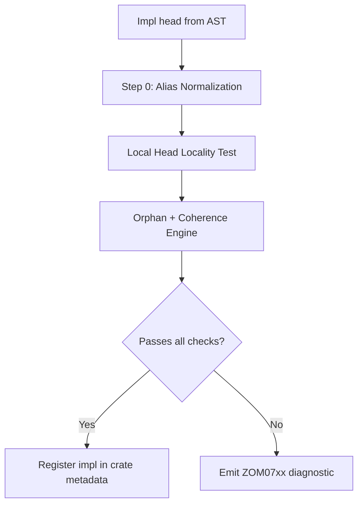
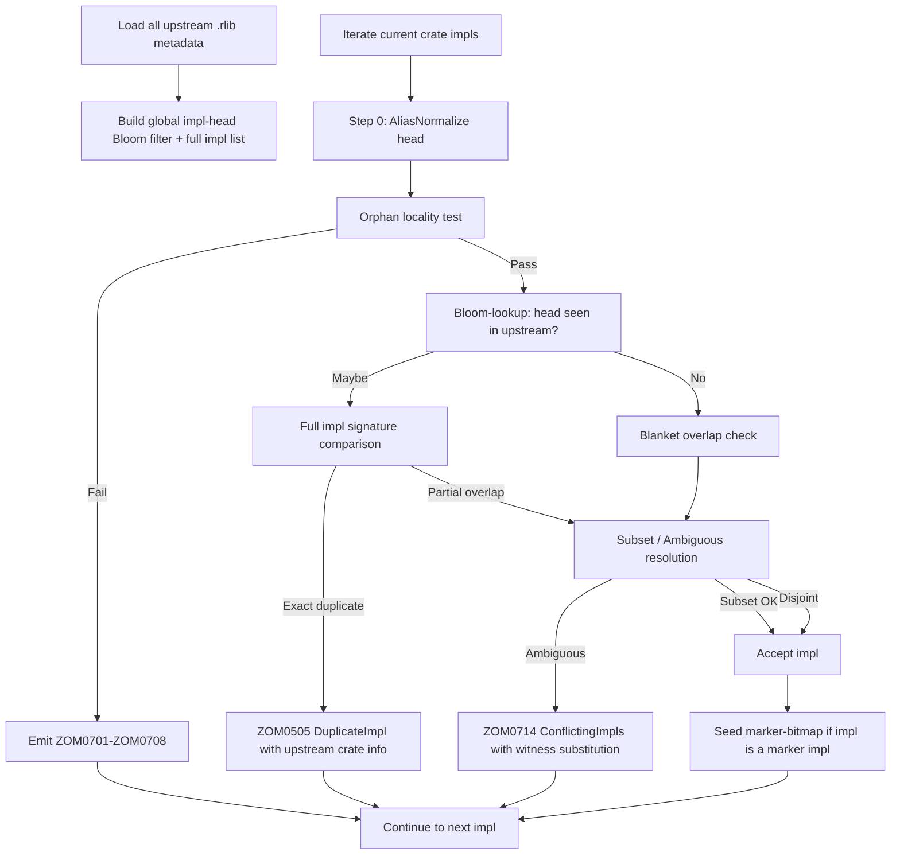

# Chapter 22 — Orphan Rule & Cross-Crate Coherence

**Version:** ZOM Language Specification v1.0.0-rc1
**Diagnostic allocation:** `ZOM0700–ZOM0799` — Orphan rule / impl locality
(see `docs/design/ARCHITECTURE.md` §8) and `ZOM0500–ZOM0599` for marker /
coherence (same section).
**Cross-references:** `docs/design/compiler-contracts.md` §9 (alias
normalization Step 0 and the three-phase negative closure), Ch.9
Interfaces, Ch.12 Generics, Ch.13 Modules and Imports, Ch.16 Attributes
and Annotations.

---

## 22.0 Normative Framework

### 22.0.1 Purpose

The orphan rule and coherence engine jointly enforce a single property
across the whole-program DAG of crates: **global uniqueness of impls**.
Without this rule, two unrelated downstream crates could each write
`impl Drawable for i32`, and the final linked program would have two
conflicting vtable entries for the same `(Drawable, i32)` pair — an
irrecoverable runtime or link-time failure. The orphan rule prevents
this by restricting *where* each impl may legally be declared, and the
coherence engine checks for overlaps both within a crate and across all
loaded upstream crates.

### 22.0.2 Step 0: Alias Normalization FIRST

The canonical ordering between alias normalization and the orphan
locality test is fixed per `compiler-contracts.md` §9:

> **Step 0 Orphan Rule (non-negotiable):** alias normalization runs
> **BEFORE** the local-head test.

Concretely, given:

```zom
type Wrap<T> = Vec<T>;
struct LocalType;
impl<T> ForeignTrait for Wrap<LocalType> { }
```

the Orphan Engine first normalizes `Wrap<LocalType>` to `Vec<LocalType>`,
and *then* performs the local-head test. Because `Vec` is foreign and
`LocalType` is local, Rule 2 (local type constructor) does NOT match,
but the fundamental-wrapper rule (Rule 3) MAY match if `Vec` is
compiler-registered as fundamental for this purpose — see §22.1.

Normalization-first prevents a whole class of coherence violations in
which users game the locality test by aliasing a foreign type to a
local alias that shadows a local type parameter.

The negative-impl analog of Step 0 applies equally: an `impl !M for A`
where `A` is a local alias of a foreign type is rejected with
`ZOM0701 UnjustifiedNegativeImpl` (because normalization reveals the
negation targets a Phase-A-seeded type).

### 22.0.3 Overall Pipeline Flow



---

## 22.1 Locality Definition

Consider an impl of the general form:

```text
impl InterfaceName<TyArgs...> for TypeHead<TyArgs...> where Bounds { ... }
```

with the additional forms `unsafe impl M for T` (for marker impls) and
`impl !M for T` (explicit negative marker impls).

Define the **LocalHead** predicate. An impl is PERMITTED if at least
one of the following is TRUE after Step-0 alias normalization.

### Rule 1 — Local Interface

`InterfaceName` is LOCAL to the current crate (declared in this crate or
any of its submodules, whether exported or not). Being re-exported via
`pub use other::InterfaceName;` does NOT make an interface local; its
defining crate is the authority.

### Rule 2 — Local Type Constructor

The **type constructor** at the head of `TypeHead` is LOCAL to the
current crate. The "head" is the outermost type constructor *after
normalization*:

- For `struct MyBox<T>(T);`, the head is `MyBox` (not `T`).
- For `(LocalType, i32)`, the head is `(,)` (the built-in tuple
  constructor — FOREIGN), not the components.
- For `Result<LocalType, i32>`, the head is `Result` (foreign), not the
  type arguments.
- For `fn(LocalType) -> Other`, the head is `fn` (foreign built-in).

Example: `impl<T> ForeignTrait for MyBox<T>` is permitted because
`MyBox` is the local head constructor.

### Rule 3 — Fundamental Type Constructors

For compiler-known **fundamental** type constructors whose semantics are
transparent newtype wrappers, the locality of the wrapper is inherited
from its sole argument. The current list (v1.0-rc1) is:

- `Box<T>`, `Unique<T>`, `Pin<T>`, `Cell<T>`, `UnsafeCell<T>`
- Pointer-like built-ins: `&T`, `&mut T`, `*const T`, `*mut T`
- Slice primitives: `[T]`
- Future markers may expand this list via lang-item registration only;
  users cannot register user-defined types as fundamental.

Formally: if `Head<T>` is fundamental, then `Head<T>` is treated as
local when `T` (its sole type parameter) is local. If a fundamental
wrapper takes multiple parameters (none currently do), the test is on
the **last** parameter (the "data" parameter).

Example: `impl ForeignTrait for Box<LocalType>` is permitted (Rule 3)
even though `Box` itself is foreign.

### Violation

If NONE of Rule 1 / Rule 2 / Rule 3 hold after Step-0 normalization,
the impl is an orphan violation. The diagnostic fired is:

- `ZOM0708 BothForeignInterface` when the impl is of an interface on a
  type (both foreign), with both names in the message.
- `ZOM0703 ForeignTraitForeignType` when the engine hits this case via
  the blanket overlap path (whichever fires first in internal iteration
  order). The two codes have identical semantic meaning; implementations
  SHOULD prefer `ZOM0708` for the interface form and reserve `ZOM0703`
  for the legacy "trait" compatibility naming.

### 22.1.1 Passing and Failing Examples (16-Row Reference Table)

| # | Impl form | Rule matched | Result | Diagnostic on fail |
|---|---|---|---|---|
| P1 | `impl LocalI for ForeignT` | Rule 1 (local interface) | PASS | — |
| P2 | `impl ForeignI for LocalT` | Rule 2 (local ctor) | PASS | — |
| P3 | `impl LocalI for LocalT` | Rules 1 & 2 | PASS | — |
| P4 | `impl<T> LocalGenericI<T> for Vec<T>` | Rule 1 (local interface) | PASS | — |
| P5 | `impl<T> ForeignI for LocalVec<T>` | Rule 2 (local ctor `LocalVec`) | PASS | — |
| P6 | `impl ForeignI for Box<LocalT>` | Rule 3 (Box fundamental + LocalT) | PASS | — |
| P7 | `impl<T> ForeignI for Pin<LocalT>` | Rule 3 (Pin fundamental) | PASS | — |
| P8 | `impl ForeignI for [LocalT]` | Rule 3 (slice `[T]` fundamental) | PASS | — |
| F1 | `impl ForeignI for i32` | None (both foreign) | FAIL | ZOM0703 |
| F2 | `impl ForeignI for ForeignT` | None (both foreign) | FAIL | ZOM0708 |
| F3 | `impl<T> ForeignI for (LocalT, T)` | None (tuple ctor `(,)` foreign; LocalT not at head) | FAIL | ZOM0708 |
| F4 | `impl<T> ForeignI for Vec<LocalT>` | None (Vec foreign; LocalT buried in arg) | FAIL | ZOM0708 |
| F5 | `impl<T: LocalBound> ForeignI for Box<T>` | None (T generic; cannot prove local) | FAIL | ZOM0710 |
| F6 | `impl ForeignI for Result<ForeignT, LocalE>` | None (Result foreign; LocalE not at head, not sole arg of fundamental) | FAIL | ZOM0708 |
| F7 | `impl ForeignI for *const ForeignT` | None (*const fundamental but contents foreign) | FAIL | ZOM0708 |
| F8 | `impl GenericForeignI<LocalT> for ForeignT` | None (type arg local, interface AND type-head foreign) | FAIL | ZOM0708 |

Rows F3, F4, F6, and F8 demonstrate a critical point: having a local
type *somewhere* inside the impl head is NOT sufficient — locality is a
property of the HEAD constructor and, for fundamental wrappers only,
their innermost wrapped type.

---

## 22.2 Standalone Impls vs Interface-Scoped Impls

The orphan rule applies UNIFORMLY to all syntactic forms that produce an
impl. The recognized forms in v1.0-rc1 are:

### 22.2.1 Standalone Impl Block

```zom
impl I for T { /* method bodies */ }
```

This is the canonical form. It may appear in any module or submodule of
the declaring crate.

### 22.2.2 Attribute-Scoped Impl Sugar

```zom
#[impl(I)]
struct T { /* fields */ }
```

This is syntactic sugar; its semantics are byte-for-byte equivalent to
writing the standalone `impl I for T {}` block at the same module scope.
The locality test and all coherence checks operate on the *desugared*
impl head.

### 22.2.3 Uniform Coherence Set

All impls — regardless of syntactic form — participate in the SAME
global coherence set for the declaring crate. Concretely:

- Declaring BOTH `#[impl(I)] struct T { }` and a standalone
  `impl I for T { }` in the same crate is a duplicate impl.
- The diagnostic is `ZOM0505 DuplicateImpl`, citing both locations.
- There is no "scoped impl" or "private impl" exception; all impls have
  identical visibility to the orphan and coherence engines. (Method
  bodies may have private visibility via their item-level `pub`/private
  annotations, but that does not affect the impl head's global
  uniqueness.)

---

## 22.3 Negative-Impl Orphan Rules (3-Phase Closure)

Markers (see Ch.9 for interface vs. marker distinction) support
**negative impls** (`impl !M for T`) which record that a type explicitly
LACKS a marker. Interfaces have no negation semantics — writing
`impl !I for T` for an interface I is a hard error
`ZOM0711 NegativeImplOnInterface`.

The propagation of marker bits and negative impls is governed by the
three-phase closure defined in `compiler-contracts.md` §9, transcribed
normatively below.

### Phase A — Seed Negative Bits

For every built-in lang-item type whose marker derivation is
compiler-controlled, the engine writes the `¬M` (negative) bit directly
into the type's marker bitmap. Examples:

- `UnsafeCell<T>` seeds `¬Shared`.
- Raw pointers `*mut T` / `*const T` seed `¬Sendable`.
- `extern "C"` types seed `¬Linear`, `¬Shared` as appropriate.

These bits are **irrevocable**. No subsequent phase may clear them.
A user attempt to override a Phase A seed bit with a positive or
negative impl is `ZOM0701 UnjustifiedNegativeImpl`.

Users cannot write seed-level lang-items directly; the only user-facing
gateway is the gated `#[lang = "..."]` feature.

### Phase B — Positive Blanket Transitive Closure

For every blanket marker impl of the form:

```zom
impl<T: Sendable> Sendable for Wrapper<T> { }
```

the engine computes the **transitive closure** over the set of concrete
types reachable in the compilation. Premises (`T: Sendable` above) are
discharged against the bitmap built so far. Phase B may only SET
positive bits; it may NEVER clear a `¬M` bit seeded in Phase A.

The result of Phase B is a 64-bit marker bitmap per concrete type,
where each bit position corresponds to one globally-registered marker.

### Phase C — User `unsafe impl` Override

Finally, the engine processes user-written `unsafe impl M for T` and
`unsafe impl !M for T` declarations. These:

- Override Phase B's positive-closure results for the (M, T) pair.
- Can NEVER flip a Phase A seed bit (attempt → `ZOM0701`).
- Require the `unsafe` keyword because they constitute manual
  attestation of soundness by the programmer for marker impls declared
  on unsafe markers (see Ch.9).

### 22.3.1 Applicable Diagnostics

- **ZOM0702 OrphanNegativeImpl** (Error) — Negative impl
  `impl !M for T` where BOTH the marker M and the type T are foreign.
  Users cannot retroactively remove markers from upstream types.
- **ZOM0712 DownstreamBlanketRevivesNegated** (Error) — Downstream
  crate B writes a blanket impl that, when applied transitively in
  Phase B, would revive a marker bit that upstream crate A explicitly
  negated via `unsafe impl !M for T`. This is a soundness invariant:
  upstream negation is authoritative and cannot be circumvented by
  downstream blanket tricks.

Because `ZOM0712` is detected at **metadata load time** (when the
driver scans upstream `.rlib` files), the diagnostic cites both the
upstream crate and the exact downstream blanket impl clause that
produces the conflict. No code that would observe a revived bit is
ever compiled.

---

## 22.4 Coherence Matrix and Overlap Resolution

Two impls **OVERLAP** when there exists at least one substitution of
their generic parameters that makes their heads syntactically equal
AFTER alias normalization and after considering type bounds (i.e., the
witness substitution must satisfy both impls' `where` clauses).

Three outcomes are possible:

### 22.4.1 Disjoint

No overlapping substitution exists. This is the common case. The engine
does nothing further.

### 22.4.2 Subset (Specialization-like)

Impl A is strictly more general than Impl B (every substitution matching
B also matches A, but the reverse is false). For example:

```zom
impl<T> Debug for T where T: Display { ... }        // A: blanket
impl Debug for i32 { ... }                           // B: concrete
```

When the type checker resolves `Debug` for `i32`, the **most specific**
impl (B) wins. Overlap resolution does NOT invoke the Rust
*specialization* feature (methods in the more general impl are NOT
available via `default` annotations); instead it governs selection only.
A's blanket impl is still legal and matches all other T.

### 22.4.3 Ambiguous

The impls overlap but neither is a subset of the other. Example:

```zom
impl<T> Foo for Vec<T>  where T: Sendable { ... }   // A
impl<U> Foo for Vec<U> where U: Shared   { ... }    // B
```

For `Vec<i32>` (which is both Sendable and Shared), both match and
neither is more specific. Resolution: **hard error**.

- Diagnostic: `ZOM0714 ConflictingImpls`.
- The error message MUST list:
  1. The file and line of each participating impl (minimum 2).
  2. A concrete **witness substitution** that exposes the overlap.
  3. A suggestion: introduce a newtype wrapper, delete one impl, or
     split the impls along a separating bound.

**Specialization is NOT supported in v1.0.** The language takes the
conservative route: if overlap is ambiguous, it is a hard error even if
runtime behavior would be identical across both impls. Users must break
the tie by deleting one impl or introducing a newtype.

---

## 22.5 Cross-Crate Metadata and the Coherence Pass

### 22.5.1 Cross-Crate Loading

Before compiling a downstream crate, the coherence subsystem loads
**every upstream crate's metadata**. For each upstream `.rlib`, the
driver:

1. Verifies the edition is supported (`ZOM0876` on failure).
2. Reads the embedded metadata section (see Ch.21 §2).
3. Extracts every exported impl head (standalone or interface-scoped).
4. Hashes each impl head into a global Bloom filter for fast rejection,
   AND stores a full list for verification on a positive Bloom hit.

### 22.5.2 Per-Impl Check Order

For every impl in the current crate, the engine performs the following
ordered checks. The order is normative: skipping or reordering a step
is an ICE per `compiler-contracts.md` §9.

1. Step 0 — alias-normalize the head.
2. Orphan locality test (§22.1). Fail → emit `ZOM07xx` and continue to
   the next impl (we still do overlap checking for completeness but
   suppress duplicate diagnostics for the same impl).
3. Bloom-filter lookup: has this head been seen in upstream metadata?
   - If `No`: skip exact comparison, proceed to blanket overlap check.
   - If `Maybe`: compare against the full upstream impl list.
4. Exact duplicate detection: if a match is found → `ZOM0505
   DuplicateImpl` with the upstream crate name, path, and source span
   of the conflicting impl.
5. Blanket overlap check: if no exact duplicate, test the current
   impl's head against every upstream blanket impl head for overlap
   per §22.4. Ambiguous → `ZOM0714`.
6. Marker-specific checks for marker impls (§22.6 incompatibility
   matrix).
7. If all pass: register the impl in the crate's metadata, seed the
   marker bitmap for Phase A/B closure (if a marker impl), and proceed
   to the next impl.

### 22.5.3 Duplicate Detection — Scoping

| Duplicate kind | Detection pass | Diagnostic |
|---|---|---|
| Same crate, two standalone impls | Binding phase | ZOM0505 |
| Same crate, attribute sugar + standalone | Binding phase (after desugaring) | ZOM0505 |
| Cross crate, exact impl head match | Coherence pass (step 4) | ZOM0505 (with upstream crate info) |
| Cross crate, ambiguous overlap | Coherence pass (step 5) | ZOM0714 (with witness) |

### 22.5.4 Coherence Pass Flow Diagram



---

## 22.6 Marker Incompatibility Matrix (Cross-Reference with Ch.16)

The marker incompatibility matrix is a GLOBAL coherence invariant. It is
checked **before** the orphan rule (it applies even within the same
crate). The built-in pairs (v1.0-rc1) are:

| Pair A | Pair B | Severity | Code | Notes |
|---|---|---|---|---|
| `Linear` | `Shared` | Error | ZOM0520 | A type cannot be both linear (unique, consumed) and shared (aliasable). FORBID. |
| `Copy` | `Linear` | Error | ZOM0521 | Copy = duplicate-ok; Linear = one-owner. Contradictory. FORBID. |
| `Drop` | `Copy` | Warning (default) | ZOM0522 | Copy types' drop glue is a no-op; explicit Drop impl usually indicates shared-state deallocation, which is almost always a bug. Silence per type via `#[zom::allow(zom0522)]` with a proof of semantic correctness. |

These three pairs are enforced by built-in compiler logic. Users may
declare additional incompatibilities for their own markers using the
`#[zom::marker::incompatible(A, B)]` attribute. This is a Tier-0
attribute registered in Ch.16 §Attributes and Annotations. Example:

```zom
marker Exclusive;
marker SharedMutable;

#[zom::marker::incompatible(Exclusive, SharedMutable)]
mod _incompat_marker_registration { }
```

Violations of user-defined pairs emit `ZOM0721 MarkerIncompatibleUserDefined`
(see §22.7), citing both the `#[incompatible(...)]` registration site
and the conflicting impl sites.

---

## 22.7 New Diagnostic Codes Allocated in This Chapter

The following codes are introduced here. They SHALL be registered in
the authoritative diagnostic registry (the two tables in
`ARCHITECTURE.md` §8 and `compiler-contracts.md` §2) by the canonical
registry synchronization step. Each entry below lists code, name,
severity, and a one-line canonical message.

- **ZOM0710 OrphanGenericHeadUnresolved** (Error) — Generic parameter
  at head position cannot be proven local without concrete
  instantiation; locality is unknowable until the impl is monomorphized.
- **ZOM0711 NegativeImplOnInterface** (Error) — User wrote
  `impl !Interface for T`; interfaces have no negation semantic. Only
  markers may be negated.
- **ZOM0713 OverlapBlanketNotCovered** (Error) — Blanket impl would
  partially cover an existing concrete impl without specialization;
  disallowed in v1.0. Delete one impl or introduce a newtype.
- **ZOM0715 OrphanFundamentalWrapperMisuse** (Error) — Type used as a
  fundamental wrapper in the orphan locality test is not on the
  compiler-approved fundamental list (see §22.1 Rule 3).
- **ZOM0716 CoherenceMetadataHashMismatch** (Error) — Upstream crate
  metadata hash changed between compilations; incremental cache is
  invalid and will be discarded for a full rebuild.
- **ZOM0720 SealedInterfaceImplOutsideCrate** (Error) — Attempting to
  write an impl of a `sealed interface I` outside of the declaring
  crate or its allow-list (see Ch.9 §Sealed Interfaces).
- **ZOM0721 MarkerIncompatibleUserDefined** (Error) — User-defined
  marker incompatibility pair (registered via
  `#[zom::marker::incompatible(A, B)]`) was violated by two impls in
  the same crate or across crates.

---
End of Chapter 22.
