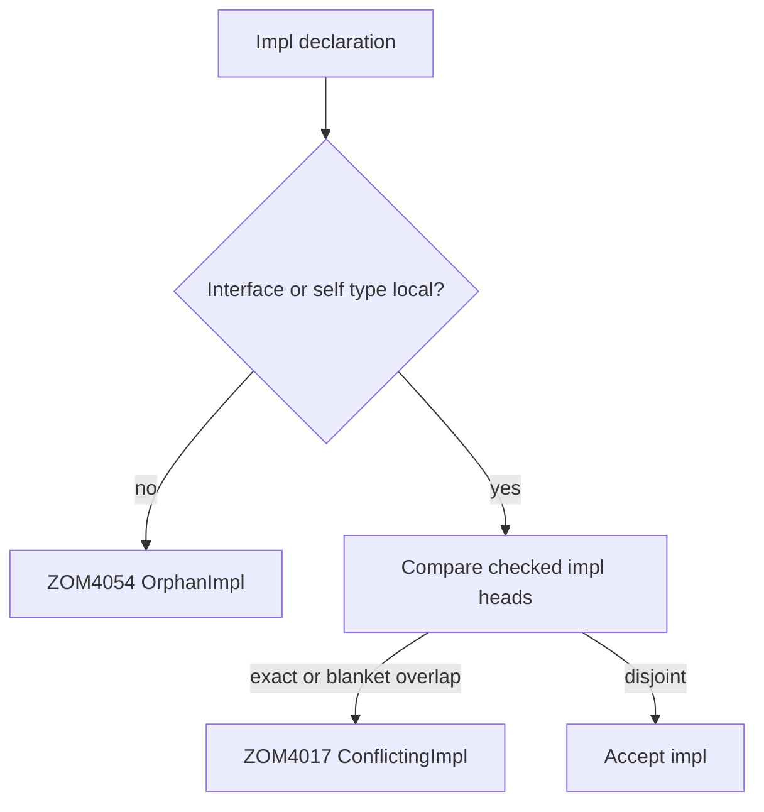

# Chapter 22 — Orphan Rule and Coherence

> **Normative**
>
> This chapter defines the impl-locality and overlap checks implemented for one
> checked source compilation. Cross-module and cross-package coherence is not a
> language guarantee until RFC 0008 and RFC 0012 are implemented.

## 22.1 Impl Heads

Coherence applies to standalone interface impls and marker impls. Each checked
impl has an observable head consisting of its interface or marker name and its
self type. Transparent aliases do not create a new nominal declaration for the
orphan rule.

An impl with a bare generic self type is a blanket impl. Other compound generic
overlap and constraint satisfiability are outside the implemented coherence
surface.

## 22.2 Locality

An impl is local when at least one of these declarations occurs in the current
checked source compilation:

1. the implemented interface or marker; or
2. the named self type.

If neither declaration is local, the impl is rejected with registered
`ZOM4054 OrphanImpl`.

Imports and aliases do not turn a declaration into a local declaration. A
tuple, function, union, reference, pointer, array, or generic parameter does not
acquire locality merely because a nested type is local.

## 22.3 Conflicting Impls

Two impls conflict when they name the same interface or marker and either:

- their self-type names are equal; or
- either impl is a blanket impl.

The later source declaration is rejected with registered `ZOM4017
ConflictingImpl`. The compiler does not select one impl by relative specificity
or silently replace an earlier impl.

## 22.4 Diagnostic Ownership

The authoritative checker registry defines:

| Code | Name | Meaning |
|---|---|---|
| `ZOM4017` | `ConflictingImpl` | Two implemented coherence heads overlap |
| `ZOM4054` | `OrphanImpl` | Neither the interface nor the named self type is local |

Additional locality, polarity, constraint-overlap, or cross-module diagnostics
must be registered with typed emission and conformance tests before this
chapter cites them.

## 22.5 Required Evidence

The implemented surface requires tests for:

- a local interface with a non-local self type;
- a non-local interface with a local named self type;
- a non-local interface with a non-local self type;
- duplicate impl heads;
- a blanket impl followed by a concrete impl; and
- a concrete impl followed by a blanket impl.

RFC 0008 owns the future global coherence index. Its cross-module rules remain
proposal-only until corresponding multi-source implementation and conformance
tests land.
