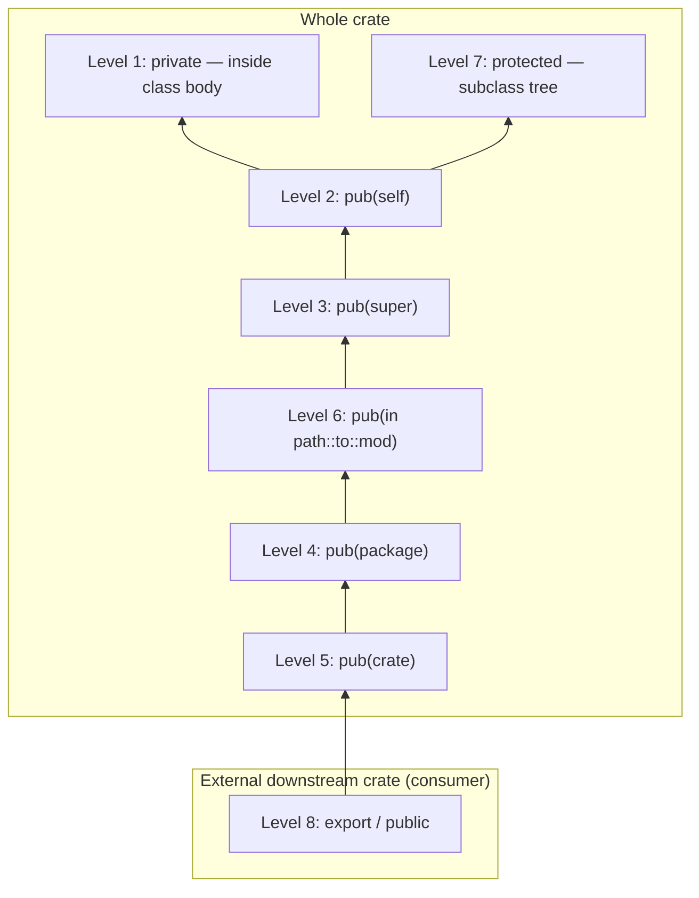

# Chapter 23 — Visibility Ladder

> **Normative**
> This chapter defines the full visibility, extensibility, and export-control model of the ZOM language. Together with Chapter 13 (Modules and Imports) and Chapter 16 (Attributes and Annotations), it forms the complete specification of who may observe, extend, and re-export every symbol in a ZOM program. Diagnostic codes referenced in this chapter are defined in architecture.md section 8 (codes 0700–0799 for orphan-rule violations and codes 0800–0899 for module-related violations). Implementations MUST emit the exact numeric codes cited; error-message prose is normative only where explicitly quoted.

---

## 23.0  Visibility Philosophy

The ZOM visibility model is a three-axis orthogonal control system. Every named symbol that participates in cross-module or cross-crate linkage carries flags on all three axes simultaneously.

**Axis (A) — Access level (8 levels).** Determines *who* can name the symbol in their source code. Ranges from "only the enclosing class body" to "every downstream consumer of the crate."

**Axis (B) — Extensibility (3 states).** Determines *how* a class or interface can be extended through the inheritance / implementation relation. Ranges from fully closed (final) through crate-restricted (sealed) to fully open (open).

**Axis (C) — Export flag (2 states).** Determines *whether* a symbol that is already crate-visible is additionally permitted to cross the crate boundary and appear in the public API surface of the crate. Independent of access level except that a symbol that is not crate-visible can never be exported (the export flag implies crate-visible).

The total state space therefore contains 8 × 3 × 2 = 48 distinct combinations. Not every combination is semantically meaningful; a private-final-non-exported combination is overwhelmingly the most common (default) state, and open-public-exported is the rarest. Defaults are deliberately chosen so that the zero-syntax case lands the programmer on the maximally restrictive combination that still permits the symbol to be used at its declared location.

This is the **Principle of Least Privilege for APIs: every symbol starts as restricted as it can be without an explicit user override widening its surface. An implementation MUST NOT widen visibility through inference, convention-over-configuration, or contextual promotion based on usage patterns.

```mermaid
block-beta
    columns 8
    block:axisA:8
        columns 1
        A["Axis A<br/>Access level<br/>(8 levels)"]
    end
    block:axisB:8
        columns 1
        B["Axis B<br/>Extensibility<br/>(3 states)"]
    end
    block:axisC:8
        columns 1
        C["Axis C<br/>Export flag<br/>(2 states)"]
    end
    space:4 D["48 states total"] space:3

    block:cube:8
        columns 8
        L1 L2 L3 L4 L5 L6 L7 L8
        S_final["final"] S_sealed["sealed"] space:1 S_open["open"] space:3
        E_no["not exported"] space:5 E_yes["exported"] space:1
    end

    A --> cube
    B --> cube
    C --> cube

    L1["L1"]:8
    style L1 fill:#2d5a9e,color:#fff
    style L8 fill:#a04040,color:#fff
    note over L1: most common<br/>(default for members)
    note over L8: least common<br/>(public API surface)
    note over S_final: default for classes
    note over E_no: default for all items
```

The diagram above is illustrative, not normative. The normative enumeration of the eight access levels appears in section 23.1.

---

## 23.1  The 8-Level Access Ladder

The eight access levels are ordered below from *most restrictive* (Level 1) to *most open* (Level 8). The ordering is a total order under the "is contained within" relation: if a symbol is visible at level N, it is also visible at every level N' > N that is strictly more open. Levels 1 and 7 apply only inside class, struct, and interface bodies; using them on a top-level module item is an error.

| Level | Syntax | Visible Within | Typical Use |
|:----:|:-------|:---------------|:------------|
| 1 | `private` (default for class, struct, enum, and non-default-interface members) | The enclosing class, struct, interface, or enum body only. Not visible even to sibling items in the same module, and not visible to subclasses. | Internal helper fields and methods. Implementation-detail bookkeeping of an ADT. Lock fields. Cached derived values. Any code that an external caller must never reach. |
| 2 | `pub(self)` (or bare top-level declaration; **default for module top-level items**) | The current module file only. Not visible to sub-modules, not visible to the parent module, and not visible to sibling modules in the same directory. | File-local helpers that no other module in the crate needs. |
| 3 | `pub(super)` | The parent module and every descendant module under the parent (same crate, subtree rooted at parent). | Shared helpers within a sub-tree: for example, `math.trig` and `math.linalg` both reach helpers declared `pub(super)` in `math._common`. |
| 4 | `pub(package)` | Every module whose fully-qualified name begins with the same package prefix (the first dotted segment of the crate's top-level module path). Intra-package public API that is intentionally not promoted to crate-level. | Helper types used by `zom_serialize::binary`, `zom_serialize::text`, and `zom_serialize::json` when `zom_serialize::*` is the package boundary. |
| 5 | `pub(crate)` | Every module in the same crate, regardless of which package it is declared in. Crosses package boundaries within one crate. | Internal crate-wide utilities: an `error_util` module used by twelve sibling packages inside one monorepo-style crate. |
| 6 | `pub(in path::to::module)` | The specific module named by the path, and every descendant of that module. The named module must be an ancestor of the declaring module (reachable by walking parent scopes upward from the declaration site). Path syntax uses `::` item-path notation starting with one of the four canonical prefixes `crate::`, `self::`, `super::`, or `::`. | Precise "friend" visibility: exactly one module subtree in the crate is granted access, and no other. |
| 7 | `protected` (member-level only; invalid on top-level items) | The enclosing class or interface and every subclass (or implementing type) in the inheritance tree. Not reachable from sibling modules. | OOP-style extension hooks for subclass overrides. Protected constructors for abstract base classes. |
| 8 | `export` (top-level) / `public` (member-level inside exported types) | Crosses the crate boundary. Every downstream crate that declares a dependency on this crate can name the symbol, subject to orphan and coherence rules (Chapter 13). | The public API surface of the crate. |

The following rules are normative and MUST be enforced by the parser, binder, and type checker:

1.  **Levels 1 and 7 on top-level items.** Writing `private` or `protected` on a top-level item is an error. The implementation MUST emit **ZOM0832 InvalidVisibilityOnTopLevel**, with a hint: for `private`, "use `pub(self)` or just omit the visibility keyword — module-private is the default at top level"; for `protected`, "`protected` is only meaningful inside a class or interface body."

2.  **Level 8 split syntax.** On top-level items the keyword is `export`. On members of exported classes, exported structs, and exported interfaces the keyword is `public` — the token `export` is not accepted on member declarations. A member of a non-exported container marked `public` is crate-visible only (equivalent in reach to Level 5) because the container itself cannot cross the crate boundary. A member cannot logically be more visible than its containing type. If the implementation encounters `export fun foo() {}` (or any exported member) inside a non-exported class body, it MUST emit **ZOM0833 ExportInsideNonExportedContainer** with the hint "mark the containing class with `export` first, or change `export` to `public` for a crate-internal public member."

3.  **Level 4 (package) versus Level 5 (crate).** When a crate exposes exactly one package (the overwhelmingly common case), levels 4 and 5 collapse to the same set of reachable modules. When a crate composes multiple packages through re-exports at the crate root, Level 4 restricts reach to the package's own module tree, while Level 5 permits cross-package access within the crate.

4.  **Level 6 (`pub(in path)` target restriction.** The target path MUST resolve to a module that is an ancestor of (or equal to) the declaring module. Targeting a module not reachable by walking `super::` chains upward is an error in the 0830–0839 band (InvalidVisibilityPath range).

---

## 23.2  Class / Interface Extensibility Modifiers

Three mutually exclusive tokens control extensibility: `final`, `sealed`, and `open`. At most one of these tokens may appear on any one declaration. If none is written, the default is `final`. The modifiers apply per-declaration, not per-module or per-crate.

### 23.2.1  Classes

-   **`final` (default).** The class cannot be subclassed. A declaration of the form `class B extends A {}` where `A` is `final` is an error. The implementation MUST emit **ZOM0834 FinalClassSubclassed.

-   **`open`.** The class may be subclassed anywhere the class is visible. All subclassing is subject to the visibility ladder of the class itself: if the class is `export open`, downstream crates may subclass it; if the class is `pub(crate) open`, only modules in the same crate may subclass it; and so on down the ladder.

-   **`sealed`.** Subclassing is restricted to (a) the module that declares the class, (b) any module in the same crate, OR (c) any module named in the explicit allow-list declared with the `#[zom::sealed(allow = [....])]` attribute (see §23.4) together with every sub-modules of those listed modules. If a `class B extends A {}` where `A` is sealed and `B` is not in the crate and not in the allow-list, the implementation MUST emit **ZOM0835 SealedClassOutsideHierarchy**.

### 23.2.2  Interfaces

-   **`final`.** A `final interface` cannot be implemented by any user declaration. Only compiler-provided built-in types may carry implementations of a final interface. This is reserved for marker interfaces such as the compiler-built-in copy semantics that cannot be authored in user code. A user `impl I for T {}` against a final interface is an error in the 0830–0839 band.

-   **(default, no keyword).** The interface is open: any module that can see the interface may implement it, subject to the orphan and coherence rules (Chapter 13 §13.7 and architecture.md codes 0700–0799).

-   **`sealed`.** Implementation is restricted to the declaring crate, or to modules listed in the `#[zom::sealed(allow = [...])]` allow-list together with their descendant modules. A user impl of a sealed interface from outside the crate and outside the allow-list MUST reuse **ZOM0720 SealedInterfaceImplOutsideCrate** from the orphan diagnostic band, with an error message that includes the concrete allow-list at the violation site (see §23.4 for the normative template).

### 23.2.3  Enums

An enum is final by nature: its variant set is closed at the declaration site. The extensibility keywords `final`, `sealed`, and `open` are accepted on enum declarations for syntactic uniformity but carry no additional semantics. Enum variants inherit the visibility of the enum declaration per §MOD-TBD-7; per-variant visibility modifiers are not permitted in v1 (see §23.3 row "Inside `enum` variant field").

### 23.2.4  Marker Declarations

Extensibility modifiers are meaningless on `marker` declarations. Markers are always open for implementation. Writing `open marker M;` (or sealed/final on a marker) MUST emit **ZOM0836 ExtensibilityOnMarker** with the hint "markers are always open for implementation; remove `open`/`sealed`/`final`."

---

## 23.3  Member Default Rules — Normative Truth Table

The following table is the single source of truth for default visibility. It resolves the `isPublic()` predicate inconsistencies reported in prior audits. Every binder, type-checker, and linter predicate MUST derive its behaviour from this table and MUST NOT encode separate, contradictory rules. Predicates MUST use positive flag logic per §23.3.1.

| Container / Keyword | **No keyword** (bare declaration) | `public` | `private` | `protected` |
|:---|:---|:---|:---|:---|
| **Top-level module item** | **module-private** (equivalent to `pub(self)`, Level 2). Not even submodules see it. | **ZOM0832** error — invalid at top level. Hint: "write `export` instead." | **ZOM0832** error — hint "omit keyword for module-private." | **ZOM0832** error — hint "not valid at top level." |
| **Inside `export class`** | **private** (Level 1). Class-internal only. The most restrictive default. | public (Level 8). Visible to all consumers of the crate; subclasses also see it of course. | private (Level 1). Explicit. | protected (Level 7). Subclass-access hook. |
| **Inside non-exported `class`** | private (Level 1). Same rule as exported class; the default does not depend on container export status. | Crate-public (reach equivalent to Level 5). Because the container itself is not exported, the member cannot cross the crate boundary. This matches the user intent "all modules in this crate see this method." | private (Level 1). Explicit. | protected (Level 7). Subclass hook. |
| **Inside `interface`** (method declaration or default method body) | **public** (Level 8 default). This is the *one* exception to the private-default rule. Interfaces are contracts and contract methods are public by default, matching user intuition from Java, C#, and TypeScript. | public. No-op explicit. | **Level 1, but only for default-method bodies with bodies.** A `private fun helper() { ... }` declared with a body inside an interface default body is a non-dispatch, non-vtable helper callable only from other default methods of the same interface. An abstract (body-less) interface method marked `private` is an error in the 0830–0839 band. | protected. Abstract method must be implemented by subclasses. Default body: same access as if declared in a class. |
| **Inside `enum` variant field** | private (Level 1). Defaults match the class rule. The enum variant itself inherits enum container visibility per §MOD-TBD-7; per-variant modifiers are disallowed in v1. | public. Fields are readable and writable by all callers. | private. Explicit. | protected. Rare on enums but supported for OOP-adjacent patterns. |
| **Inside `struct`** | private (Level 1). Match the class rule. | public. | private. Explicit. | protected. |

### 23.3.1  Visibility Flags Encoding

All predicates that query visibility MUST operate on positive, explicitly-set flags. Implementations MUST NOT infer visibility through negation (for example, `!hasAnyFlag(Private) → public` is forbidden as an implementation strategy). The binder MUST write the default flags into the `SymbolFlags` bitfield explicitly during the resolution pass, so that every symbol carries its resolved visibility on all three axes without further inference downstream.

The normative bit positions (reusing existing flag assignments from the codebase) are:

| Flag | Bit position | Set when |
|:---|:---:|:---|
| `Export` | `1 << 11` | Only on top-level items declared with the `export` keyword; OR on member-level public members whose container export bit propagates the public flag to the crate boundary. |
| `Public` | `1 << 2` | Member-level `public` keyword present, or interface default method with no keyword (per table above). |
| `Private` | `1 << 3` | Member-level `private` keyword present, or bare member of class/struct/enum (per table above). |
| `Protected` | `1 << 4` | Member-level `protected` keyword present. |
| `Internal` | `1 << 12` | `pub(crate)` or equivalent (non-exported public member of non-exported container). |
| `Sealed` | `1 << 30` | Sealed class or sealed interface. |
| `Final` | `1 << 31` | Final class (the default if no extensibility keyword). |
| `Open` | `1 << 32` | Open class or open interface. |

Predicates:

-   `isExported(sym)` returns true IFF `sym.flags & Export != 0`.
-   `isPublicMember(sym)` returns true IFF `sym.flags & Public != 0`.
-   `isPrivateMember(sym)` returns true IFF `sym.flags & Private != 0`.
-   `isProtectedMember(sym)` returns true IFF `sym.flags & Protected != 0`.
-   `isInternal(sym)` returns true IFF `sym.flags & Internal != 0`.
-   `isSealed(sym)` / `isFinal(sym)` / `isOpen(sym)` likewise test the corresponding extensibility bits.

### 23.3.2  Explicit Default Keyword Redundancy Lint

An implementation MAY emit a non-fatal redundancy diagnostic when a declaration carries an explicit keyword that is identical to the normative default (e.g., `private fun f() {}` inside a non-exported class). The diagnostic code is in the 0840–0849 band and MUST NOT be an error.

---

## 23.4  Sealed Interface Implementation Allow-List

```zom
#[zom::sealed(allow = ["crate::net::http_impl", "crate::net::tls_impl"])]
interface HttpTransport {
    fun send(request: HttpRequest) -> HttpResponse raises HttpError;
}
```

Semantics. An implementation declaration of the sealed interface is allowed if and only if the impl is located in one of:

1.  The module that declares the interface; OR
2.  Any module listed in the `allow` array; OR
3.  Any submodule (recursively) of a module listed in cases (1) or (2).

The `allow` paths are resolved using `crate::` prefix only. Cross-crate sealed impls are not permitted — the crate boundary is already enforced by the orphan rule. A path that resolves outside the declaring crate is a compile error in the 0830–0839 band.

For a violation the implementation MUST reuse **ZOM0720 SealedInterfaceImplOutsideCrate** with the following normative error message template:

```
ZOM0720: cannot implement sealed interface `{qualified_interface_name`
         from module `{current_module_path}`.
         The interface's allow-list = [{comma-separated list of allow paths}].
         note: sealed interfaces can only be implemented in the declaring
         module, its submodules, or modules in the explicit allow-list.
```

---

## 23.5  Visibility Check Enforcement — Type Checker Integration

Every identifier reference of the form `a` or compound path `a::b::c` undergoes the following normative check sequence during type checking:

1.  **Resolve.** The path is resolved to a `SymbolRef` through the symbol table (Chapter 13).
2.  **Fetch visibility.** The symbol's `visibility()` method returns a `VisibilitySpec { level, in_path: Option<Path> }` plus the three-axis flags.
3.  **Boundary predicate.** If the symbol's `Export` flag is unset and the current module is distinct from the symbol's declaring module, the type checker walks the scope tree to decide whether the current module is within the visibility envelope permitted by the symbol's access level. The exact predicate is:
    -   For `private` / `protected`: the reference site is inside the declaring class, or (for protected) inside a subclass of the declaring class.
    -   For `pub(self)`: the reference is in the declaring module itself.
    -   For `pub(super)`: the reference is in the parent of the declaring module or any descendant of that parent.
    -   For `pub(package)`: the reference is in the same package tree.
    -   For `pub(crate)`: the reference is in the same crate.
    -   For `pub(in path)`: the reference is in the named module or any of its descendants.
4.  **Error emission.** If the predicate in step 3 fails the implementation MUST emit **ZOM0830 PrivateAccessCrossBoundary with the diagnostic template:

    ```
    ZOM0830: `{name}` (declared at {file}:{line}:{col} as {visibility_description})
              is not accessible from module {current_module}.
              Visibility boundary: {level_description}.
    ```

5.  **Suggestion engine.** If the symbol is declared `pub(crate)` (Internal flag set, Export flag unset) and the reference site is in a downstream crate, the implementation SHOULD append a hint: "the upstream author would need to add `export` to this declaration for it to be usable here. Consider filing an issue or sending a patch."

---

## 23.6  Scope Containment Diagram

The diagram below illustrates the containment hierarchy of the eight access levels. A lower level in the diagram is strictly contained within every higher level: if a symbol is visible at `MOD` (Level 2), it is automatically visible at every level strictly above it in the ladder. The converse does not hold.



Notes on the diagram:

-   `PRIVATE` and `PROTECTED` are *not* ordered relative to each other because they apply to different scope dimensions (lexical body versus inheritance tree). Both are contained in `MOD` because neither is reachable outside the module that declares the class.
-   Level 6 (`pub(in path)`) is drawn between 4 and 3 to reflect that its reach is typically intermediate between those two, but its actual reach is incomparable in the partial order: it may span any ancestor subtree.
-   Level 8 (`export`) is outside the crate boundary and is the only level that crosses it.

---

## 23.7  Interaction with the `#[zom::visibility(...)]` Attribute

Chapter 16 defines the `#[zom::visibility(...)]` attribute family. Implementations that accept a programmatic override of a declaration's visibility through attributes MUST apply the same ladder, flag encoding, and enforcement rules defined in this chapter. The attribute is an alternative surface syntax; it does not define a parallel or divergent semantics. Where an explicit visibility keyword and a `#[zom::visibility(...)]` attribute are both present on the same declaration and contradict each other, the keyword wins and the attribute is ignored with a redundancy diagnostic in the 0840–0849 band.

---

## 23.8  Re-Export and Visibility Propagation

A re-export of the form `export a::b::Item;` lifts the target symbol's visibility to Level 8 at the re-export site. The original symbol's own visibility MUST permit the re-exporting module to see it (ordinarily Level 5 or wider within the same crate). If the original symbol is not visible to the re-exporting module, the binder MUST emit **ZOM0830** as if the re-export were an ordinary reference. Re-exports do not modify the original symbol's flags; they create an alias symbol at the re-export site that carries the `Export` flag and forwards every other flag (type, generics, etc.) from the original.

A downstream crate that resolves the re-exported name observes the re-export site, not the original declaration, for the purpose of diagnostic paths and error messages.

---

## 23.9  Unreachable Code and Visibility

Visibility and dead-code elimination interact in the following normative way. The type checker evaluates a visibility check without any knowledge of whether the containing block or branch is reachable from the entry point of the program. Dead code, unreachable branches, conditional compilation that excludes a branch, and constant-propagation eliminated blocks are all subject to the same visibility checks as reachable code.

An implementation MUST NOT skip a visibility violation because the containing block is statically unreachable. Unreachable-but-private references are still programmer errors that, if reached in a different configuration (e.g., a different build flag combination), would escape the visibility model. Rejecting them uniformly avoids the class of bugs where a conditional compilation flag causes a new visibility violation.

### 23.9.1  Interaction with `cfg` and Conditional Compilation

When `#[cfg(...)]` (Chapter 16) or equivalent conditional compilation machinery removes a declaration from a translation unit, the visibility of the declaration is irrelevant for that translation unit. However, the declaration may still participate in type checking for other translation units within the same crate where the cfg predicate evaluates true. The type checker must ensure consistency across the crate: if a symbol is declared with a given visibility under one cfg and a different visibility under a mutually exclusive cfg for the same site, the implementation MUST reject the program with an error in the 0850–0859 band.

---

## 23.10  Examples

The examples below are illustrative, not normative. They demonstrate common idioms and error cases.

### 23.10.1  Typical Package Layout

```zom
// file: zom_serialize/_common/mod.zom
// module: zom_serialize::_common

// Module-private helper. Default.
fun compute_checksum(bytes: &[u8]) -> u32 { ... }

// Visible to zom_serialize::binary, zom_serialize::text, and zom_serialize::json
// because they are all siblings under the same package parent.
pub(super) struct SharedHeader {
    magic: [u8; 4],
    version: u16,
}
```

```zom
// file: zom_serialize/binary.zom
// module: zom_serialize::binary

import super::_common::{SharedHeader};
// ^^^ allowed: SharedHeader is pub(super) under _common, so its parent is
// zom_serialize (the package), and binary is a sibling (a descendant of the
// same parent).

import super::_common::compute_checksum;
// ^^^ ZOM0830: compute_checksum is module-private inside _common.
```

### 23.10.2  Sealed Hierarchy for Error Types

```zom
// module: crate::error

#[zom::sealed(allow = ["crate::io", "crate::net", "crate::format"])]
sealed interface LibraryError {
    fun code() -> u32;
    fun message() -> String;
}

export open class IoError(message: String) extends LibraryError {
    override fun code() -> u32 { 100 }
    override fun message() -> String { message }
}
// ^^^ allowed: IoError is declared in the same module as LibraryError.
```

```zom
// module: crate::net

impl LibraryError for TlsError { ... }
// ^^^ allowed: crate::net is in the allow-list.
```

```zom
// module: crate::ui

impl LibraryError for UiRenderError { ... }
// ^^^ ZOM0720: crate::ui is not in the allow-list.
```

### 23.10.3  Member Defaults — Annotated Example

```zom
export class UserSession {
    // DEFAULT: private Level 1. Stored field for internal bookkeeping.
    let token: String;

    // DEFAULT: private Level 1. Helper used only by this class.
    fun validateToken() -> bool { ... }

    // Public API: Level 8, crosses crate boundary because UserSession is export.
    public fun user() -> UserId { ... }

    // Level 7: Subclass hook.
    protected fun onRefresh() -> Unit { /* default no-op */ }
}

export class RefreshableUserSession extends UserSession {
    // Can call onRefresh from here because it is protected.
    override fun onRefresh() -> Unit { super.onRefresh(); ... }
}
```

```zom
// Non-exported class.
class InternalSessionPool {
    // DEFAULT: private Level 1.
    let capacity: u32;

    // Public keyword, but container is non-exported -> Level 5 equivalent (crate-public).
    public fun acquire() -> SessionHandle { ... }
}
```

### 23.10.4  Non-Exported Container Example

```zom
// No 'export' keyword -> container is module-private Level 2 by default.
class _CacheEntry {
    public fun key() -> String { ... }  // crate-internal public; Level 5
    fun value() -> Value { ... }        // private Level 1 (default)
}

// No 'export' -> error band ZOM0832 InvalidVisibilityOnTopLevel with the hint
// "write `export` instead" if user tried `public class` at top level.
// public class BannedAtTopLevel { ... }   // ZOM0832
```

### 23.10.5  Interface Method Defaults

```zom
interface Renderable {
    // Default: public Level 8. Interface contracts are public by default.
    fun bounds() -> Rect;

    // Public keyword is redundant but accepted (non-fatal redundancy lint).
    public fun render(ctx: &RenderContext) -> Unit;

    // Default body helper: non-dispatch, non-vtable, callable only from other
    // default methods in this interface.
    private fun measureLine(s: &StrSlice) -> Size { ... }

    // Default body with full default method semantics.
    fun debugName() -> String { "Renderable@" + measureLine("").width.to_str() }
    // ^^^ public Level 8 (default). Body is a default method.

    // private fun abstractOnly() -> Unit;  // Error 0830–0839 band:
    //                                        abstract interface method cannot
    //                                        be private.
}
```

### 23.10.6  Enum Variant Visibility

```zom
export enum NodeKind {
    Leaf(u64),
    Branch(export open class ... )  // Not available.
}
// ^^^ enum is export. All variants inherit export visibility (per §MOD-TBD-7).
//     No per-variant modifier.
```

---

## 23.11  Conformance Checklist for Implementations

An implementation claiming conformance to this chapter MUST implement all of the following checks:

1.  Emit ZOM0832 for `public` / `private` / `protected` on top-level items with per-keyword hint text.
2.  Emit ZOM0833 for `export` keyword on any member declaration inside a non-exported container.
3.  Emit ZOM0834 for `class B extends A` when `A` is `final`.
4.  Emit ZOM0835 for `class B extends A` when `A` is `sealed` and `B` is outside the crate and outside the allow-list.
5.  Reuse ZOM0720 for `impl I for T` when `I` is `sealed` and the impl site is outside the crate/allow-list, with the specific error template of §23.4.
6.  Emit ZOM0836 for `open` / `sealed` / `final` on a `marker` declaration.
7.  Emit ZOM0830 PrivateAccessCrossBoundary on every identifier reference whose visibility predicate fails, using the template of §23.5.
8.  Implement the `pub(in path)` target-ancestor restriction.
9.  Implement the visibility flags of §23.3.1 with positive-logic predicates.
10. Enforce that the Export flag is set only on top-level items with the `export` keyword (or public members of exported containers per the Level 8 rule of §23.1).
11. Implement the default visibility assignment exactly per §23.3 table.
12. Enforce ZOM0881 ambiguity for dual filesystem conventions at module load time (cross-reference §24.2).

---

## 23.12  Detailed Access Rules for Nested Scopes

This section refines the eight-level ladder for the interaction between nested classes, local function bodies, and closures. It is normative.

### 23.12.1  Nested Classes

A `class` declared inside another class body carries its own visibility ladder. The outer-to-inner relationship follows these two rules:

1.  The inner class body may access every member of the enclosing class at every access level (including Level 1 private members). The lexical-nesting relationship makes the inner class a privileged observer of the outer.
2.  The visibility of the inner class declaration itself follows the ladder as if it were a member declaration (§23.3 class rows). A private inner class is visible only from the enclosing class body. A public inner class of an exported class crosses the crate boundary as a nested type visible to downstream consumers.

### 23.12.2  Closures and Local Functions

Closure literals and named function declarations local to a statement block are not symbols in the module system. They do not carry visibility flags. A closure captures variables by the usual lexical scoping rule of the expression system; there is no interaction with the visibility ladder. A closure can be passed as a value across module boundaries, and the receiving site may invoke it, but the closure body's own local names are never visible through type checker lookup.

### 23.12.3  `private` versus `pub(self)` Distinction

The two tokens are easy to confuse; the distinction is strictly enforced:

-   `private` applies only inside class/struct/enum/interface bodies. It restricts visibility to that body.
-   `pub(self)` applies only at module top level. It restricts visibility to the current module file.

The two access levels have disjoint valid contexts. Using `private` in a module top-level context is ZOM0832. Using `pub(self)` as a class-member keyword is a parse error in the 0200–0299 lexical/parse band with the hint "use `private` for a class-internal member, or omit the visibility keyword entirely — private is the default for class members."

---

## 23.13  Protected Access Details

Level 7 `protected` deserves dedicated treatment because of the interaction between the inheritance tree and the module tree.

Rule (1) — a protected member is accessible:
-   From inside the declaring class body.
-   From inside any subclass body.
-   From inside any implementing type's body, for protected interface members.
-   NOT from sibling modules that merely import the class but do not subclass it.
-   NOT from the subclass body through an unrelated instance of the declaring class, unless the reference goes through `self` or a `super::` chain.

The last clause is the "friend access via self only" rule, matching the Java and C# models. It prevents code in a subclass from reading protected fields of unrelated peer instances in a sibling class.

Rule (2) — a protected member declared in an exported class does cross the crate boundary. A downstream crate that subclasses the exported class may override protected members and call them through `self`. The protected access level is transitive across the inheritance tree regardless of crate boundaries.

---

## 23.14  Visibility of Generic Parameters and Where-Clauses

Type parameters in generic declarations, their bounds, and the clauses of `where` sections do not carry independent visibility. Their validity is derived entirely from the declaration they adorn:

-   A type parameter bound naming a type `T` requires that `T` be visible at the declaration site using the usual ladder rules. If the bound refers to a private type from another module, the binder emits ZOM0830 at the bound reference.
-   The instantiation of a generic at a downstream call site is checked against the visibility of the generic declaration, not against each bound individually. If the generic is exported, its bounds must be exported as well — otherwise, the downstream caller would be unable to prove the bound holds (they cannot see the bound type). The type checker MUST emit ZOM0830 or a dedicated 0860–0869 band error for exported generics whose bounds name non-exported types.

---

## 23.15  Compatibility with Future Spec Revisions

The eight-level ladder, the three extensibility states, and the two-state export flag are all intended to be forward-compatible. New access levels, new extensibility tokens, or new axis states may be added in a future edition without invalidating conforming programs written today, provided:

-   No existing keyword is assigned a new normative meaning in a way that would change the meaning of a valid program from the current edition.
-   Any new keyword is either a reserved keyword in the current edition or is gated by the edition mechanism of Zom.toml.

Implementations SHOULD reserve diagnostic band space for future visibility and orphan codes (bands 0700–0799 and 0800–0899) as described in architecture.md section 8, and MUST NOT reuse codes in those bands for non-specified purposes.
