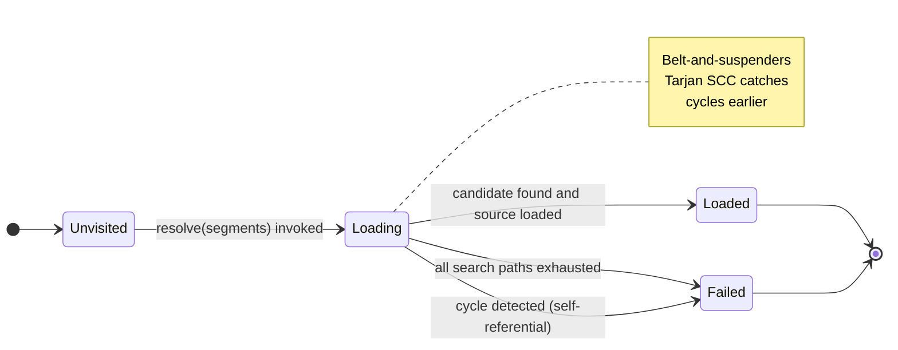

# Chapter 24 — Module Resolution Algorithm

> **Normative**
> This chapter defines the algorithm that converts a symbolic module path (for example `math.geometry.projections`) together with an ordered list of search directories into a concrete loaded source buffer or a well-specified diagnostic. It is the bridge between the symbol-level module system of Chapter 13 and the host filesystem. Diagnostic codes referenced in this chapter are defined in ARCHITECTURE.md section 8 (codes 0800–0899 for module-related violations).

---

## Table of Contents

- 24.0 Purpose
- 24.1 Data Structures and Inputs
-   24.1.1 Compiler options
-   24.1.2 Segment list
-   24.1.3 Resolution state
- 24.2 Filesystem Convention — Dual Mode
- 24.3 Search-Path Algorithm
- 24.4 Disambiguation Priority
- 24.5 Inline-Module Resolution
- 24.6 Cross-Crate Resolution
- 24.7 Four Path Prefixes
- 24.8 Symbolic Paths and Dotted Name Expansion
- 24.9 Path Canonicalization and Case Sensitivity
- 24.10 Cycles and Strongly Connected Components
- 24.11 Generated Modules and Custom Callback Semantics
- 24.12 Module Root File Discovery
- 24.13 Incremental Compilation
- 24.14 IDE Driver Integration

---

## 24.0  Purpose

The module resolver is the compiler subsystem that answers the single question: "given this dotted name, where is the source text that defines it?" Formally, the resolver is a deterministic function from (segments, requesting-module, compiler-options, filesystem) → Option‹BufferId› ∪ { NotFound }. It is invoked by the binder whenever it encounters a `mod name;` declaration, an `import` path whose root has not yet been bound, or an inline `mod name { … }` that requires synthetic module creation without filesystem lookup.

The resolver is *deterministic*. For a fixed input quadruple the resolver MUST always produce the same result within a single compilation run. It is *memoized*. A given segment tuple is resolved exactly once per compilation; subsequent references reuse the cached result.

The resolver is one of three cooperating components that form the complete module system of ZOM. The other two are: (a) the binder, which traverses the AST of each resolved module and produces a symbol table per module; and (b) the type checker, which enforces the visibility ladder of Chapter 23 on every resolved and bound symbol. These three components form a pipeline. The resolver feeds the binder; the binder feeds the type checker; control never flows backward from the type checker into the resolver. A consequence is that type information is never available during module resolution; name lookup in the resolver is purely structural (segments map to buffers) and never semantic.

---

## 24.1  Data Structures and Inputs

The following inputs are normative. An implementation MAY add caching and intermediate types but MUST expose behaviourally match the semantics below.

### 24.1.1  Compiler options

-   `CompilerOptions.moduleSearchPaths : Vec<String>` — an ordered list of host filesystem directories. Order is priority; a candidate found in an earlier entry wins over a candidate found in a later entry. The build tool (zomc / CMake driver / IDE driver) populates this list from the crate manifest (Zom.toml). The crate root source directory is always implicitly entry index 0. Additional entries correspond to extra source roots, generated-code directories, and vendored module trees.

-   `CompilerOptions.allowListCallbacks.resolveModuleCustom : Option<fn(&[String]) -> Option<BufferId>>` — an optional build-tool-supplied callback. If present, it is invoked *before* any filesystem lookup for the segment tuple. It MAY return a pre-loaded `BufferId` for generated modules (for example, protocol-buffer compilation step producing `.zom` files in a generated-code directory). Returning `None` falls through to the normal filesystem search.

-   `CompilerOptions.cfgTest : bool` — the `--cfg test` flag. When set, the resolver additionally consults the test-only candidate path as described in §24.2.

-   `CompilerOptions.edition : Edition` — the crate edition. The resolver behaviour does not depend on edition in the current (2026) edition; this option is reserved for future editions.

### 24.1.2  Segment list

A symbolic module path is split into an ordered list of UTF-8 identifiers (the *segments*). For example the path `math.geometry.projections` produces the segment list `["math", "geometry", "projections"]`. Segments MUST be valid ZOM identifiers per the lexical grammar (Chapter 2). The segment list length N is the *arity* of the path.

A segment list may be empty; an empty segment list refers to the current module itself. An empty list combined with a requesting module of `None` refers to the crate root.

### 24.1.3  Resolution state

For each distinct segment tuple the resolver maintains a state cell with one of four values:

-   `Unvisited` — the tuple has never been the target of a resolution attempt in this compilation.
-   `Loading` — a resolution attempt for the tuple is in progress on the current call stack.
-   `Loaded(BufferId)` — resolution completed successfully and the buffer is resident.
-   `Failed` — resolution completed unsuccessfully; no further attempts will be made for this tuple in this compilation.



Transitions are monotonic. Once a tuple leaves `Unvisited` it never returns. Once a tuple reaches `Loaded` or `Failed` it never transitions further.

The state map MUST be keyed on the segment tuple only; the requesting module identity is deliberately excluded from the key. The same module name resolves to the same buffer regardless of which module requested it. Two different requesting modules reaching the same symbolic name by different paths must observe the same resolved buffer. This property is required for consistent symbol identity across the crate.

---

## 24.2  Filesystem Convention — Dual Mode

Given a segment list `[s₁, s₂, …, sₙ]` and a search-path directory P, the resolver constructs exactly two filesystem candidates:

1.  **Candidate A — single-file module.**

    `join(P, s₁, s₂, …, sₙ₋₁, sₙ + ".zom")`

2.  **Candidate B — directory module with `mod.zom` index.**

    `join(P, s₁, s₂, …, sₙ, "mod.zom")`

The following decision procedure is normative:

-   If **both** A and B exist on the filesystem the implementation MUST emit **ZOM0881 ModulePathAmbiguous**. The error message MUST list the absolute, canonicalized filesystem paths of both candidates and MUST include the text "choose one convention per module; delete the other file." The resolver does **not** silently pick one. Users MUST be consistent.

-   If **exactly one** of A or B exists that candidate is selected and returned.

-   If **neither** exists the resolver moves to the next search path entry.

-   After the normal A/B search the implementation additionally checks, when and only when the compiler is compiling under `--cfg test`:

    -   **Candidate C — test-only directory module.**

        `join(P, s₁, s₂, …, sₙ, "mod.test.zom")`

    Candidate C is tried only when the test configuration flag is set. When C is present it is treated as an *additional* source alongside A or B (not as a replacement; a test-only module augments the non-test module with test-only items under test configuration). When the test flag is absent, C is never consulted.

The `.zom` suffix is the only recognized suffix for ZOM source files in the normative specification. Implementations MUST NOT automatically fall back to `.zig`, `.rs`, `.c`, `.h`, or any other suffix, even on a best-effort basis. Foreign-language interop is handled through the build-tool callback and the FFI system (outside this chapter), not through the module resolver's filesystem suffix logic.

---

## 24.3  Search-Path Algorithm

The following pseudocode is normative. An implementation MAY reorganize control flow but MUST produce the same observable behaviour, including diagnostic content and search order.

```
function resolveModule(
    segments       : [String],
    requestingModule: Option<ModuleId>
) -> Option<BufferId>:
    key = tuple(segments)

    // Memoization short-circuits.
    if state[key] == Loaded(buf):
        return Some(buf)
    if state[key] == Failed:
        return None

    // Cycle detection — belt and suspenders.
    // Ordinarily Tarjan SCC in the binder catches import cycles
    // before this point; this branch is defensive.
    if state[key] == Loading:
        emit ZOM0810 with note:
            "cycle detected while resolving module {segments joined with '::'}"
        state[key] = Failed
        return None

    state[key] = Loading
    pathsTried : Vec<Path> = []

    // 1. Custom build-tool callback (highest priority).
    if resolveModuleCustom is Some(callback):
        match callback(segments):
            Some(buf):
                state[key] = Loaded(buf)
                return Some(buf)
            None:
                // fall through to filesystem search.

    // 2. Explicit module search paths in priority order.
    for each P in moduleSearchPaths:
        for each candidate in filesystemConventions(segments, P):
            pathsTried.push(candidate)
            if exists(candidate):
                if customCallback(candidate) says skip:
                    continue
                bufId = driver.loadSource(candidate)
                state[key] = Loaded(bufId)
                return Some(bufId)

    // 3. Sibling directory of the requesting module.
    // This supports the `mod foo;` convention loading
    // `./foo.zom` or `./foo/mod.zom` without config.
    if requestingModule is Some(mod):
        siblingDir = dirname(requestingModule.sourcePath)
        for each candidate in filesystemConventions(segments, siblingDir):
            pathsTried.push(candidate)
            if exists(candidate):
                bufId = driver.loadSource(candidate)
                state[key] = Loaded(bufId)
                return Some(bufId)

    // 4. All search exhausted.
    state[key] = Failed
    emit ZOM0810(segments, pathsTried)
    return None
```

Normative requirements on the algorithm:

1.  The sibling directory of the requesting module is searched **immediately after** all entries of the explicit `moduleSearchPaths`. It is never consulted before an explicit search path. It is consulted even when the explicit search-path list is empty.

2.  The `pathsTried` list collected during the attempt MUST include every candidate path the resolver probed. The **ZOM0810 ImportNotFound** diagnostic emitted on failure MUST list every tried path verbatim, one path per line, so the programmer can diagnose configuration errors without running the compiler under verbose mode.

3.  The state cell is set to `Failed` on exhaustion. Subsequent lookups of the same tuple return `None` without re-probing the filesystem, preventing infinite loops in mutually recursive failed lookups.

---

## 24.4  Disambiguation Priority

When multiple resolution forms match the same segment tuple through different routes, the priority ordering below is normative. Higher entries win over lower entries.

1.  **Custom callback result.** A `resolveModuleCustom` returning `Some(bufId)` wins over every filesystem candidate. This is the highest-priority match.

2.  **Explicit search path entries, in declared order.** Search path index 0 wins over index 1, index 1 over index 2, and so on.

3.  **Within the same search path, A versus B — both exist → error ZOM0881.** The resolver never silently prefers `path.zom` over `path/mod.zom` or vice versa. The user must be consistent.

4.  **Sibling directory search** (§24.3 step 3). Lowest priority. An explicit search-path match always beats a sibling-directory match.

---

## 24.5  Inline-Module Resolution

Two syntactic forms introduce child modules from within an existing module:

-   `mod foo;` — semicolon form, no body. This invokes `resolveModule(["foo"], currentModule)`. Path lookup uses the full algorithm of §24.3, including the sibling-directory fallback. The resulting `BufferId` becomes the source of the child module.

-   `mod foo { … }` — braced form with inline body. This form **does not** invoke the resolver. The binder creates a synthetic module whose segment list is the parent segment list appended with `"foo"`, whose AST is the inline block, and whose disk path is `None`. The visibility ladder (Chapter 23) applies to the `mod` declaration itself: the child module's access level is determined by the visibility keyword on the `mod` token (defaulting to Level 2, per Chapter 23 §23.3 top-level-item row).

A `mod` declaration with the inline form is permitted only once per parent module per child name. Redeclaring the same child name with both a semicolon form and a braced form in the same parent is a redefinition error in the 0820–0829 band.

---

## 24.6  Cross-Crate Resolution

An import of the form `import other_crate::module::Item;` crosses a crate boundary. The resolution procedure for the initial `other_crate` prefix is normative:

1.  The crate name `other_crate` must appear in the current crate's `[dependencies]` table of `Zom.toml`. If it does not, the implementation MUST emit **ZOM0872 UnresolvedDependency** with the hint "add `other_crate = \"^1\"` (or the required version constraint) to the `[dependencies]` table of Zom.toml."

2.  Once the dependency is located, the remainder of the import path is resolved against the upstream crate's *root module metadata* embedded in the pre-compiled `.rlib` (or equivalent binary metadata format). The importing crate never performs filesystem access into the upstream crate's source tree. It consults only the serialized metadata, which contains every exported symbol surface.

3.  Only items whose `Export` flag is set (Chapter 23) are visible in the metadata. Non-exported items, even if `pub(crate)` or `pub(package)`, are omitted from the exported metadata surface regardless of their level within the upstream crate. This enforces the crate boundary as the hard visibility wall described in Chapter 23.

4.  Re-exports in the upstream crate (Chapter 23 §23.8) are materialized in the metadata as aliases with the `Export` flag set, so downstream crates observe the re-export path.

Version selection for `other_crate` is performed by the build tool (zomc or equivalent) before the resolver is invoked. The resolver observes the exact resolved version that the build tool selected; it never participates in version resolution itself.

---

## 24.7  Four Path Prefixes

The four canonical path prefixes are resolved by the binder *before* the module resolver is invoked. The resolver is therefore only ever called with an absolute segment lists that have had their prefix interpreted:

-   `crate::` — anchored at the current crate's root module. The prefix is stripped; the remaining segments are resolved against the current crate.
-   `self::` — anchored at the current module. The prefix is stripped; remaining segments are resolved relative to the current module's children.
-   `super::` — anchored at the parent of the current module. The prefix is replaced with the parent's segment list; remaining segments are appended.
-   `::` — anchored at the extern crate namespace. The first segment following `::` is a crate name, resolved per §24.6.

All four prefixes are reserved. Any other bare leading identifier in path position is treated as a child of the current scope (equivalent to an implicit `self::` prefix).

---

## 24.8  Symbolic Paths and Dotted Name Expansion

A symbolic module path in ZOM source is always written using dotted identifier notation: `math.geometry.projections`. The binder's first step in processing any module-qualified path is to split the dotted name at each `.` boundary, producing the segment list `["math", "geometry", "projections"]` referenced throughout this chapter.

Dotted names interact with the four path prefixes (§24.7) in the following normative way:

-   A leading `crate::` prefix followed by a dotted or `::` path has the `crate` token consumed and the remainder of the path split on `::` to form the segment list, which is resolved relative to the crate root.
-   A leading `self::` prefix is consumed and the remainder resolved relative to the current module's child list.
-   A leading `super::` prefix is consumed and the remainder resolved relative to the parent module's scope.
-   A leading `::` (global namespace) prefix causes the next segment to be interpreted as a crate name (§24.6).
-   A path with no leading prefix and no `::` tokens is a dotted name, split on `.` as described above.
-   A path mixing `.` and `::` (e.g., `crate::math.geometry::projections`) is subject to lexical normalization before segment splitting. The lexical grammar (Chapter 2 §2.15) unifies the two separators in qualified-path position. The binder MUST treat `.` and `::` as equivalent separators for module path purposes after lexing.

---

## 24.9  Path Canonicalization and Case Sensitivity

On case-insensitive host filesystems (default Windows, default macOS with HFS+ or case-insensitive APFS), the resolver MUST behave case-sensitively. If the host filesystem reports that `Math.zom` exists when the user requested `math`, the resolver MUST treat this as a failed match and continue to the next candidate. The reason for this rule is portability: code developed on a case-insensitive host must not build successfully locally and then fail on a Linux CI host.

The normative procedure for canonicalization before comparison is:

1.  Resolve every candidate path to its absolute, host canonical form (no `..` components, symbolic links followed).
2.  Apply a case-sensitive comparison between the requested path as written and the canonicalized path. Compare the final filename byte-for-byte, not via host comparison.
3.  If the match succeeds, the candidate is accepted.
4.  If the host canonical form exists but differs only in case, emit a dedicated diagnostic in the 0860–0869 band before falling through. The message SHOULD indicate the filesystem path and the casing mismatch, and SHOULD hint that this will fail to build on case-sensitive filesystems.

Hard links and bind mounts are transparent to the resolver. As long as the resolved absolute path matches the requested form, the candidate is accepted.

Unicode normalization follows the same principle: candidates are compared under NFC normalization on both sides, and a non-matching-but-normalization-equivalent form triggers the same case-mismatch style diagnostic in the 0860–0869 band.

---

## 24.10  Cycles and Strongly Connected Components

Although §24.3 includes a defensive Loading-state check, the primary mechanism for detecting import cycles is Tarjan's Strongly Connected Components algorithm applied to the module import graph by the binder. The resolver does not participate in this analysis; it only provides the graph edges through the recursive resolve call chain.

The binder SCC analysis is normative for cycle detection and MUST be run before type-checking any module. The resolver's Loading-state branch exists only as a defense against binder bugs and is NOT the normative cycle mechanism.

When a cycle is detected by the SCC analysis, the binder emits ZOM0815 ImportGraphCycle with:
-   The set of modules in the SCC, listed in order of import traversal.
-   The import edges that close the cycle.
-   A hint that the user may need to split declarations into a separate acyclic shared module.

The resolver's defensive Loading check MUST NOT produce a different diagnostic than ZOM0810; if triggered, it is a sign of a binder defect. Implementations MAY attach a "this is a compiler bug" note to such diagnostics.

---

## 24.11  Generated Modules and Custom Callback Semantics

The `resolveModuleCustom` callback (§24.1.1) is the normative interface for build-tool generated code. The following additional rules apply:

1.  The callback is invoked once per distinct segment tuple per compilation. The resolver memoizes the callback result alongside filesystem results. If the callback returns `None` on the first call for a given tuple, it is not re-invoked for that tuple — the resolver falls through to filesystem search immediately.
2.  The callback MAY return a `BufferId` whose filesystem path is inside a generated-code directory. The resolver MUST still apply the dual-mode ambiguity check (§24.2, ZOM0881) if the generated buffer path coincides with an A or B candidate on disk. If a generated module and a hand-authored module collide, the implementation MUST emit a diagnostic in the 0860–0869 band naming both origins.
3.  The callback MUST NOT mutate compiler state or perform re-entrant calls to the resolver. Implementations SHOULD guard against re-entrancy at the resolver top-level.
4.  When the callback is absent (the common case), the resolver behaves as if the callback always returned `None`.

---

## 24.12  Module Root File Discovery

Every crate has exactly one crate root module. The root module source is discovered by the driver using the same dual-mode convention applied to the segment list consisting of a single empty string plus the crate root name:

Given `[lib] name = "my_lib"` in Zom.toml and the source directory `src_root`:
-   Candidate A: `join(src_root, "lib.zom")` — single-file crate root.
-   Candidate B: `join(src_root, "lib", "mod.zom")` — directory-style crate root.

The same ambiguity rule (ZOM0881) applies: if both A and B exist, the driver rejects the configuration. If neither exists, the driver emits ZOM0800 CrateRootNotFound and stops. If exactly one exists, that file is the crate root and the resolver uses its directory as the implicit entry-zero module search path (§24.1.1).

Binary targets use the same algorithm with `bin.zom` in place of `lib.zom`. Example targets (`examples/` subdirectory) use `example.zom`; tests (`tests/`) use `test.zom`; benchmarks (`benches/`) use `bench.zom`. The convention for all target kinds is dual-mode: both `kind.zom` single-file and `kind/mod.zom` directory forms are accepted for each kind, with the same ZOM0881 ambiguity rule.

---

## 24.13  Incremental Compilation

Under incremental compilation the resolver memoization table MUST be invalidated when any of the following events occurs:

1.  The contents of `moduleSearchPaths` change (reconfiguration).
2.  The `resolveModuleCustom` callback identity or closure environment changes.
3.  A directory-watcher event arrives indicating creation or deletion of any candidate file under any search path.
4.  The `cfgTest` flag flips.

Incremental recompilation does not change the resolution algorithm itself. It only controls the lifetime of the memoization cache. The resolver is otherwise side-effect-free and referentially transparent with respect to the inputs described in §24.0.

---

## 24.14  IDE Driver Integration

The Language Server Protocol (LSP) driver reuses the same resolver. The normative requirements for IDE-mode resolution are:

1.  Open-but-unsaved buffers in the IDE text editor override the filesystem contents. The `driver.loadSource(path)` step in §24.3 step 2 MUST consult an in-memory buffer table before reading disk.
2.  The resolver MAY return a synthetic empty `BufferId` for a missing module in IDE mode to keep the type checker from cascading errors. The diagnostic ZOM0810 is still emitted; the synthetic buffer is a UI convenience only.
3.  Go-to-definition, find-references, and rename operations use the resolver's segment-to-BufferId mapping as their primary index. The module graph produced by the resolver is the authoritative parent-of relation for the workspace outline.
